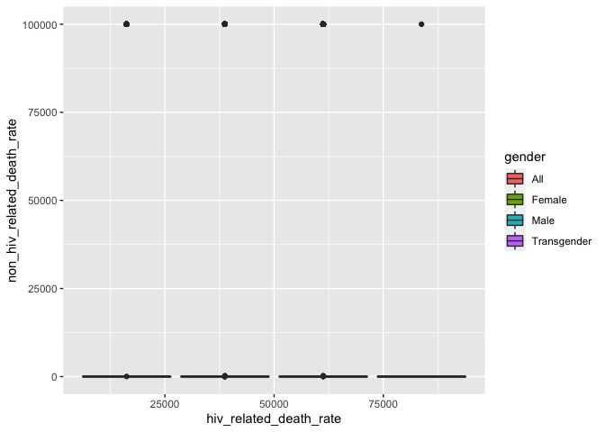

```r
library(tidyverse)
library(RColorBrewer)
library(paletteer)
library(janitor)
library(here)
```


```r
options(scipen=999) #cancels the use of scientific notation for the session
```

## R Markdown

This is an R Markdown document. Markdown is a simple formatting syntax for authoring HTML, PDF, and MS Word documents. For more details on using R Markdown see <http://rmarkdown.rstudio.com>.

When you click the **Knit** button a document will be generated that includes both content as well as the output of any embedded R code chunks within the document. You can embed an R code chunk like this:

```r
HIV_data <- read.csv("dohmh-hiv-aids-annual-report-1.csv")
HIV_data
```

```
##      Year       Borough                                  UHF      Gender
## 1    2011           All                                  All         All
## 2    2011           All                                  All        Male
## 3    2011           All                                  All      Female
## 4    2011           All                                  All Transgender
## 5    2011           All                                  All      Female
## 6    2011           All                                  All      Female
## 7    2011           All                                  All      Female
## 8    2011           All                                  All      Female
## 9    2011           All                                  All      Female
## 10   2011           All                                  All      Female
## 11   2011           All                                  All      Female
## 12   2011           All                                  All      Female
## 13   2011           All                                  All      Female
## 14   2011           All                                  All      Female
## 15   2011           All                                  All      Female
## 16   2011           All                                  All        Male
## 17   2011           All                                  All        Male
## 18   2011           All                                  All        Male
## 19   2011           All                                  All        Male
## 20   2011           All                                  All        Male
## 21   2011           All                                  All        Male
## 22   2011           All                                  All        Male
## 23   2011           All                                  All        Male
## 24   2011           All                                  All        Male
## 25   2011           All                                  All        Male
## 26   2011           All                                  All        Male
## 27   2011         Bronx                                  All         All
## 28   2011         Bronx                                  All      Female
## 29   2011         Bronx                                  All      Female
## 30   2011         Bronx                                  All      Female
## 31   2011         Bronx                                  All      Female
## 32   2011         Bronx                                  All      Female
## 33   2011         Bronx                                  All      Female
## 34   2011         Bronx                                  All      Female
## 35   2011         Bronx                                  All      Female
## 36   2011         Bronx                                  All      Female
## 37   2011         Bronx                                  All      Female
## 38   2011         Bronx                                  All      Female
## 39   2011         Bronx                                  All      Female
## 40   2011         Bronx                                  All        Male
## 41   2011         Bronx                                  All        Male
## 42   2011         Bronx                                  All        Male
## 43   2011         Bronx                                  All        Male
## 44   2011         Bronx                                  All        Male
## 45   2011         Bronx                                  All        Male
## 46   2011         Bronx                                  All        Male
## 47   2011         Bronx                                  All        Male
## 48   2011         Bronx                                  All        Male
## 49   2011         Bronx                                  All        Male
## 50   2011         Bronx                                  All        Male
## 51   2011         Bronx                                  All        Male
## 52   2011         Bronx                    Crotona - Tremont         All
## 53   2011         Bronx                    Crotona - Tremont      Female
## 54   2011         Bronx                    Crotona - Tremont      Female
## 55   2011         Bronx                    Crotona - Tremont      Female
## 56   2011         Bronx                    Crotona - Tremont      Female
## 57   2011         Bronx                    Crotona - Tremont      Female
## 58   2011         Bronx                    Crotona - Tremont      Female
## 59   2011         Bronx                    Crotona - Tremont      Female
## 60   2011         Bronx                    Crotona - Tremont      Female
## 61   2011         Bronx                    Crotona - Tremont      Female
## 62   2011         Bronx                    Crotona - Tremont      Female
## 63   2011         Bronx                    Crotona - Tremont      Female
## 64   2011         Bronx                    Crotona - Tremont      Female
## 65   2011         Bronx                    Crotona - Tremont        Male
## 66   2011         Bronx                    Crotona - Tremont        Male
## 67   2011         Bronx                    Crotona - Tremont        Male
## 68   2011         Bronx                    Crotona - Tremont        Male
## 69   2011         Bronx                    Crotona - Tremont        Male
## 70   2011         Bronx                    Crotona - Tremont        Male
## 71   2011         Bronx                    Crotona - Tremont        Male
## 72   2011         Bronx                    Crotona - Tremont        Male
## 73   2011         Bronx                    Crotona - Tremont        Male
## 74   2011         Bronx                    Crotona - Tremont        Male
## 75   2011         Bronx                    Crotona - Tremont        Male
## 76   2011         Bronx                    Crotona - Tremont        Male
## 77   2011         Bronx                 Fordham - Bronx Park         All
## 78   2011         Bronx                 Fordham - Bronx Park      Female
## 79   2011         Bronx                 Fordham - Bronx Park      Female
## 80   2011         Bronx                 Fordham - Bronx Park      Female
## 81   2011         Bronx                 Fordham - Bronx Park      Female
## 82   2011         Bronx                 Fordham - Bronx Park      Female
## 83   2011         Bronx                 Fordham - Bronx Park      Female
## 84   2011         Bronx                 Fordham - Bronx Park      Female
## 85   2011         Bronx                 Fordham - Bronx Park      Female
## 86   2011         Bronx                 Fordham - Bronx Park      Female
## 87   2011         Bronx                 Fordham - Bronx Park      Female
## 88   2011         Bronx                 Fordham - Bronx Park      Female
## 89   2011         Bronx                 Fordham - Bronx Park      Female
## 90   2011         Bronx                 Fordham - Bronx Park        Male
## 91   2011         Bronx                 Fordham - Bronx Park        Male
## 92   2011         Bronx                 Fordham - Bronx Park        Male
## 93   2011         Bronx                 Fordham - Bronx Park        Male
## 94   2011         Bronx                 Fordham - Bronx Park        Male
## 95   2011         Bronx                 Fordham - Bronx Park        Male
## 96   2011         Bronx                 Fordham - Bronx Park        Male
## 97   2011         Bronx                 Fordham - Bronx Park        Male
## 98   2011         Bronx                 Fordham - Bronx Park        Male
## 99   2011         Bronx                 Fordham - Bronx Park        Male
## 100  2011         Bronx                 Fordham - Bronx Park        Male
## 101  2011         Bronx                 Fordham - Bronx Park        Male
## 102  2011         Bronx             High Bridge - Morrisania         All
## 103  2011         Bronx             High Bridge - Morrisania      Female
## 104  2011         Bronx             High Bridge - Morrisania      Female
## 105  2011         Bronx             High Bridge - Morrisania      Female
## 106  2011         Bronx             High Bridge - Morrisania      Female
## 107  2011         Bronx             Hunts Point - Mott Haven        Male
## 108  2011         Bronx             High Bridge - Morrisania      Female
## 109  2011         Bronx             High Bridge - Morrisania      Female
## 110  2011         Bronx             High Bridge - Morrisania      Female
## 111  2011         Bronx             High Bridge - Morrisania      Female
## 112  2011         Bronx             High Bridge - Morrisania      Female
## 113  2011         Bronx             High Bridge - Morrisania      Female
## 114  2011         Bronx             High Bridge - Morrisania      Female
## 115  2011         Bronx             High Bridge - Morrisania      Female
## 116  2011         Bronx             High Bridge - Morrisania        Male
## 117  2011         Bronx             High Bridge - Morrisania        Male
## 118  2011         Bronx             High Bridge - Morrisania        Male
## 119  2011         Bronx             High Bridge - Morrisania        Male
## 120  2011         Bronx             High Bridge - Morrisania        Male
## 121  2011         Bronx             High Bridge - Morrisania        Male
## 122  2011         Bronx             High Bridge - Morrisania        Male
## 123  2011         Bronx             High Bridge - Morrisania        Male
## 124  2011         Bronx             High Bridge - Morrisania        Male
## 125  2011         Bronx             High Bridge - Morrisania        Male
## 126  2011         Bronx             High Bridge - Morrisania        Male
## 127  2011         Bronx             High Bridge - Morrisania        Male
## 128  2011         Bronx             Hunts Point - Mott Haven         All
## 129  2011         Bronx             Hunts Point - Mott Haven      Female
## 130  2011         Bronx             Hunts Point - Mott Haven      Female
## 131  2011         Bronx             Hunts Point - Mott Haven      Female
## 132  2011         Bronx             Hunts Point - Mott Haven      Female
## 133  2011         Bronx             Hunts Point - Mott Haven      Female
## 134  2011         Bronx             Hunts Point - Mott Haven      Female
## 135  2011         Bronx             Hunts Point - Mott Haven      Female
## 136  2011         Bronx             Hunts Point - Mott Haven      Female
## 137  2011         Bronx             Hunts Point - Mott Haven      Female
## 138  2011         Bronx             Hunts Point - Mott Haven      Female
## 139  2011         Bronx             Hunts Point - Mott Haven      Female
## 140  2011         Bronx             Hunts Point - Mott Haven      Female
## 141  2011         Bronx             Hunts Point - Mott Haven        Male
## 142  2011         Bronx             Hunts Point - Mott Haven        Male
## 143  2011         Bronx             Hunts Point - Mott Haven        Male
## 144  2011         Bronx             Hunts Point - Mott Haven        Male
## 145  2011         Bronx             Hunts Point - Mott Haven        Male
## 146  2011         Bronx             Hunts Point - Mott Haven        Male
## 147  2011         Bronx             Hunts Point - Mott Haven        Male
## 148  2011         Bronx             Hunts Point - Mott Haven        Male
## 149  2011         Bronx             Hunts Point - Mott Haven        Male
## 150  2011         Bronx             Hunts Point - Mott Haven        Male
## 151  2011         Bronx             Hunts Point - Mott Haven        Male
## 152  2011         Bronx              Kingsbridge - Riverdale         All
## 153  2011         Bronx              Kingsbridge - Riverdale      Female
## 154  2011         Bronx              Kingsbridge - Riverdale      Female
## 155  2011         Bronx              Kingsbridge - Riverdale      Female
## 156  2011         Bronx              Kingsbridge - Riverdale      Female
## 157  2011         Bronx              Kingsbridge - Riverdale      Female
## 158  2011         Bronx              Kingsbridge - Riverdale      Female
## 159  2011         Bronx              Kingsbridge - Riverdale      Female
## 160  2011         Bronx              Kingsbridge - Riverdale      Female
## 161  2011         Bronx              Kingsbridge - Riverdale      Female
## 162  2011         Bronx              Kingsbridge - Riverdale      Female
## 163  2011         Bronx              Kingsbridge - Riverdale      Female
## 164  2011         Bronx              Kingsbridge - Riverdale      Female
## 165  2011         Bronx              Kingsbridge - Riverdale        Male
## 166  2011         Bronx              Kingsbridge - Riverdale        Male
## 167  2011         Bronx              Kingsbridge - Riverdale        Male
## 168  2011         Bronx              Kingsbridge - Riverdale        Male
## 169  2011         Bronx              Kingsbridge - Riverdale        Male
## 170  2011         Bronx              Kingsbridge - Riverdale        Male
## 171  2011         Bronx              Kingsbridge - Riverdale        Male
## 172  2011         Bronx              Kingsbridge - Riverdale        Male
## 173  2011         Bronx              Kingsbridge - Riverdale        Male
## 174  2011         Bronx              Kingsbridge - Riverdale        Male
## 175  2011         Bronx              Kingsbridge - Riverdale        Male
## 176  2011         Bronx              Kingsbridge - Riverdale        Male
## 177  2011         Bronx                      Northeast Bronx         All
## 178  2011         Bronx                      Northeast Bronx      Female
## 179  2011         Bronx                      Northeast Bronx      Female
## 180  2011         Bronx                      Northeast Bronx      Female
## 181  2011         Bronx                      Northeast Bronx      Female
## 182  2011         Bronx                      Northeast Bronx      Female
## 183  2011         Bronx                      Northeast Bronx      Female
## 184  2011         Bronx                      Northeast Bronx      Female
## 185  2011         Bronx                      Northeast Bronx      Female
## 186  2011         Bronx                      Northeast Bronx      Female
## 187  2011         Bronx                      Northeast Bronx      Female
## 188  2011         Bronx                      Northeast Bronx      Female
## 189  2011         Bronx                      Northeast Bronx      Female
## 190  2011         Bronx                      Northeast Bronx        Male
## 191  2011         Bronx                      Northeast Bronx        Male
## 192  2011         Bronx                      Northeast Bronx        Male
## 193  2011         Bronx                      Northeast Bronx        Male
## 194  2011         Bronx                      Northeast Bronx        Male
## 195  2011         Bronx                      Northeast Bronx        Male
## 196  2011         Bronx                      Northeast Bronx        Male
## 197  2011         Bronx                      Northeast Bronx        Male
## 198  2011         Bronx                      Northeast Bronx        Male
## 199  2011         Bronx                      Northeast Bronx        Male
## 200  2011         Bronx                      Northeast Bronx        Male
## 201  2011         Bronx                      Northeast Bronx        Male
## 202  2011         Bronx                 Pelham - Throgs Neck         All
## 203  2011         Bronx                 Pelham - Throgs Neck      Female
## 204  2011         Bronx                 Pelham - Throgs Neck      Female
## 205  2011         Bronx                 Pelham - Throgs Neck      Female
## 206  2011         Bronx                 Pelham - Throgs Neck      Female
## 207  2011         Bronx                 Pelham - Throgs Neck      Female
## 208  2011         Bronx                 Pelham - Throgs Neck      Female
## 209  2011         Bronx                 Pelham - Throgs Neck      Female
## 210  2011         Bronx                 Pelham - Throgs Neck      Female
## 211  2011         Bronx                 Pelham - Throgs Neck      Female
## 212  2011         Bronx                 Pelham - Throgs Neck      Female
## 213  2011         Bronx                 Pelham - Throgs Neck      Female
## 214  2011         Bronx                 Pelham - Throgs Neck      Female
## 215  2011         Bronx                 Pelham - Throgs Neck        Male
## 216  2011         Bronx                 Pelham - Throgs Neck        Male
## 217  2011         Bronx                 Pelham - Throgs Neck        Male
## 218  2011         Bronx                 Pelham - Throgs Neck        Male
## 219  2011         Bronx                 Pelham - Throgs Neck        Male
## 220  2011         Bronx                 Pelham - Throgs Neck        Male
## 221  2011         Bronx                 Pelham - Throgs Neck        Male
## 222  2011         Bronx                 Pelham - Throgs Neck        Male
## 223  2011         Bronx                 Pelham - Throgs Neck        Male
## 224  2011         Bronx                 Pelham - Throgs Neck        Male
## 225  2011         Bronx                 Pelham - Throgs Neck        Male
## 226  2011         Bronx                 Pelham - Throgs Neck        Male
## 227  2011      Brooklyn                                  All         All
## 228  2011      Brooklyn                                  All      Female
## 229  2011      Brooklyn                                  All      Female
## 230  2011      Brooklyn                                  All      Female
## 231  2011      Brooklyn                                  All      Female
## 232  2011      Brooklyn                                  All      Female
## 233  2011      Brooklyn                                  All      Female
## 234  2011      Brooklyn                                  All      Female
## 235  2011      Brooklyn                                  All      Female
## 236  2011      Brooklyn                                  All      Female
## 237  2011      Brooklyn                                  All      Female
## 238  2011      Brooklyn                                  All      Female
## 239  2011      Brooklyn                                  All      Female
## 240  2011      Brooklyn                                  All        Male
## 241  2011      Brooklyn                                  All        Male
## 242  2011      Brooklyn                                  All        Male
## 243  2011      Brooklyn                                  All        Male
## 244  2011      Brooklyn                                  All        Male
## 245  2011      Brooklyn                                  All        Male
## 246  2011      Brooklyn                                  All        Male
## 247  2011      Brooklyn                                  All        Male
## 248  2011      Brooklyn                                  All        Male
## 249  2011      Brooklyn                                  All        Male
## 250  2011      Brooklyn                                  All        Male
## 251  2011      Brooklyn                                  All        Male
## 252  2011      Brooklyn   Bedford Stuyvesant - Crown Heights         All
## 253  2011      Brooklyn   Bedford Stuyvesant - Crown Heights      Female
## 254  2011      Brooklyn   Bedford Stuyvesant - Crown Heights      Female
## 255  2011      Brooklyn   Bedford Stuyvesant - Crown Heights      Female
## 256  2011      Brooklyn   Bedford Stuyvesant - Crown Heights      Female
## 257  2011      Brooklyn   Bedford Stuyvesant - Crown Heights      Female
## 258  2011      Brooklyn   Bedford Stuyvesant - Crown Heights      Female
## 259  2011      Brooklyn   Bedford Stuyvesant - Crown Heights      Female
## 260  2011      Brooklyn   Bedford Stuyvesant - Crown Heights      Female
## 261  2011      Brooklyn   Bedford Stuyvesant - Crown Heights      Female
## 262  2011      Brooklyn   Bedford Stuyvesant - Crown Heights      Female
## 263  2011      Brooklyn   Bedford Stuyvesant - Crown Heights      Female
## 264  2011      Brooklyn   Bedford Stuyvesant - Crown Heights      Female
## 265  2011      Brooklyn   Bedford Stuyvesant - Crown Heights        Male
## 266  2011      Brooklyn   Bedford Stuyvesant - Crown Heights        Male
## 267  2011      Brooklyn   Bedford Stuyvesant - Crown Heights        Male
## 268  2011      Brooklyn   Bedford Stuyvesant - Crown Heights        Male
## 269  2011      Brooklyn   Bedford Stuyvesant - Crown Heights        Male
## 270  2011      Brooklyn   Bedford Stuyvesant - Crown Heights        Male
## 271  2011      Brooklyn   Bedford Stuyvesant - Crown Heights        Male
## 272  2011      Brooklyn   Bedford Stuyvesant - Crown Heights        Male
## 273  2011      Brooklyn   Bedford Stuyvesant - Crown Heights        Male
## 274  2011      Brooklyn   Bedford Stuyvesant - Crown Heights        Male
## 275  2011      Brooklyn   Bedford Stuyvesant - Crown Heights        Male
## 276  2011      Brooklyn   Bedford Stuyvesant - Crown Heights        Male
## 277  2011      Brooklyn              Bensonhurst - Bay Ridge         All
## 278  2011      Brooklyn              Bensonhurst - Bay Ridge      Female
## 279  2011      Brooklyn              Bensonhurst - Bay Ridge      Female
## 280  2011      Brooklyn              Bensonhurst - Bay Ridge      Female
## 281  2011      Brooklyn              Bensonhurst - Bay Ridge      Female
## 282  2011      Brooklyn              Bensonhurst - Bay Ridge      Female
## 283  2011      Brooklyn              Bensonhurst - Bay Ridge      Female
## 284  2011      Brooklyn              Bensonhurst - Bay Ridge      Female
## 285  2011      Brooklyn              Bensonhurst - Bay Ridge      Female
## 286  2011      Brooklyn              Bensonhurst - Bay Ridge      Female
## 287  2011      Brooklyn              Bensonhurst - Bay Ridge      Female
## 288  2011      Brooklyn              Bensonhurst - Bay Ridge      Female
## 289  2011      Brooklyn              Bensonhurst - Bay Ridge      Female
## 290  2011      Brooklyn              Bensonhurst - Bay Ridge        Male
## 291  2011      Brooklyn              Bensonhurst - Bay Ridge        Male
## 292  2011      Brooklyn              Bensonhurst - Bay Ridge        Male
## 293  2011      Brooklyn              Bensonhurst - Bay Ridge        Male
## 294  2011      Brooklyn              Bensonhurst - Bay Ridge        Male
## 295  2011      Brooklyn              Bensonhurst - Bay Ridge        Male
## 296  2011      Brooklyn              Bensonhurst - Bay Ridge        Male
## 297  2011      Brooklyn              Bensonhurst - Bay Ridge        Male
## 298  2011      Brooklyn              Bensonhurst - Bay Ridge        Male
## 299  2011      Brooklyn              Bensonhurst - Bay Ridge        Male
## 300  2011      Brooklyn              Bensonhurst - Bay Ridge        Male
## 301  2011      Brooklyn              Bensonhurst - Bay Ridge        Male
## 302  2011      Brooklyn                         Borough Park         All
## 303  2011      Brooklyn                         Borough Park      Female
## 304  2011      Brooklyn                         Borough Park      Female
## 305  2011      Brooklyn                         Borough Park      Female
## 306  2011      Brooklyn                         Borough Park      Female
## 307  2011      Brooklyn                         Borough Park      Female
## 308  2011      Brooklyn                         Borough Park      Female
## 309  2011      Brooklyn                         Borough Park      Female
## 310  2011      Brooklyn                         Borough Park      Female
## 311  2011      Brooklyn                         Borough Park      Female
## 312  2011      Brooklyn                         Borough Park      Female
## 313  2011      Brooklyn                         Borough Park      Female
## 314  2011      Brooklyn                         Borough Park      Female
## 315  2011      Brooklyn                         Borough Park        Male
## 316  2011      Brooklyn                         Borough Park        Male
## 317  2011      Brooklyn                         Borough Park        Male
## 318  2011      Brooklyn                         Borough Park        Male
## 319  2011      Brooklyn                         Borough Park        Male
## 320  2011      Brooklyn                         Borough Park        Male
## 321  2011      Brooklyn                         Borough Park        Male
## 322  2011      Brooklyn                         Borough Park        Male
## 323  2011      Brooklyn                         Borough Park        Male
## 324  2011      Brooklyn                         Borough Park        Male
## 325  2011      Brooklyn                         Borough Park        Male
## 326  2011      Brooklyn                         Borough Park        Male
## 327  2011      Brooklyn                 Canarsie - Flatlands         All
## 328  2011      Brooklyn                 Canarsie - Flatlands      Female
## 329  2011      Brooklyn                 Canarsie - Flatlands      Female
## 330  2011      Brooklyn                 Canarsie - Flatlands      Female
## 331  2011      Brooklyn                 Canarsie - Flatlands      Female
## 332  2011      Brooklyn                 Canarsie - Flatlands      Female
## 333  2011      Brooklyn                 Canarsie - Flatlands      Female
## 334  2011      Brooklyn                 Canarsie - Flatlands      Female
## 335  2011      Brooklyn                 Canarsie - Flatlands      Female
## 336  2011      Brooklyn                 Canarsie - Flatlands      Female
## 337  2011      Brooklyn                 Canarsie - Flatlands      Female
## 338  2011      Brooklyn                 Canarsie - Flatlands      Female
## 339  2011      Brooklyn                 Canarsie - Flatlands      Female
## 340  2011      Brooklyn                 Canarsie - Flatlands        Male
## 341  2011      Brooklyn                 Canarsie - Flatlands        Male
## 342  2011      Brooklyn                 Canarsie - Flatlands        Male
## 343  2011      Brooklyn                 Canarsie - Flatlands        Male
## 344  2011      Brooklyn                 Canarsie - Flatlands        Male
## 345  2011      Brooklyn                 Canarsie - Flatlands        Male
## 346  2011      Brooklyn                 Canarsie - Flatlands        Male
## 347  2011      Brooklyn                 Canarsie - Flatlands        Male
## 348  2011      Brooklyn                 Canarsie - Flatlands        Male
## 349  2011      Brooklyn                 Canarsie - Flatlands        Male
## 350  2011      Brooklyn                 Canarsie - Flatlands        Male
## 351  2011      Brooklyn                 Canarsie - Flatlands        Male
## 352  2011      Brooklyn        Coney Island - Sheepshead Bay         All
## 353  2011      Brooklyn        Coney Island - Sheepshead Bay      Female
## 354  2011      Brooklyn        Coney Island - Sheepshead Bay      Female
## 355  2011      Brooklyn        Coney Island - Sheepshead Bay      Female
## 356  2011      Brooklyn        Coney Island - Sheepshead Bay      Female
## 357  2011      Brooklyn        Coney Island - Sheepshead Bay      Female
## 358  2011      Brooklyn        Coney Island - Sheepshead Bay      Female
## 359  2011      Brooklyn        Coney Island - Sheepshead Bay      Female
## 360  2011      Brooklyn        Coney Island - Sheepshead Bay      Female
## 361  2011      Brooklyn        Coney Island - Sheepshead Bay      Female
## 362  2011      Brooklyn        Coney Island - Sheepshead Bay      Female
## 363  2011      Brooklyn        Coney Island - Sheepshead Bay      Female
## 364  2011      Brooklyn        Coney Island - Sheepshead Bay      Female
## 365  2011      Brooklyn        Coney Island - Sheepshead Bay        Male
## 366  2011      Brooklyn        Coney Island - Sheepshead Bay        Male
## 367  2011      Brooklyn        Coney Island - Sheepshead Bay        Male
## 368  2011      Brooklyn        Coney Island - Sheepshead Bay        Male
## 369  2011      Brooklyn        Coney Island - Sheepshead Bay        Male
## 370  2011      Brooklyn        Coney Island - Sheepshead Bay        Male
## 371  2011      Brooklyn        Coney Island - Sheepshead Bay        Male
## 372  2011      Brooklyn        Coney Island - Sheepshead Bay        Male
## 373  2011      Brooklyn        Coney Island - Sheepshead Bay        Male
## 374  2011      Brooklyn        Coney Island - Sheepshead Bay        Male
## 375  2011      Brooklyn        Coney Island - Sheepshead Bay        Male
## 376  2011      Brooklyn        Coney Island - Sheepshead Bay        Male
## 377  2011      Brooklyn      Downtown - Heights - Park Slope         All
## 378  2011      Brooklyn      Downtown - Heights - Park Slope      Female
## 379  2011      Brooklyn      Downtown - Heights - Park Slope      Female
## 380  2011      Brooklyn      Downtown - Heights - Park Slope      Female
## 381  2011      Brooklyn      Downtown - Heights - Park Slope      Female
## 382  2011      Brooklyn      Downtown - Heights - Park Slope      Female
## 383  2011      Brooklyn                          Sunset Park      Female
## 384  2011      Brooklyn      Downtown - Heights - Park Slope      Female
## 385  2011      Brooklyn      Downtown - Heights - Park Slope      Female
## 386  2011      Brooklyn      Downtown - Heights - Park Slope      Female
## 387  2011      Brooklyn      Downtown - Heights - Park Slope      Female
## 388  2011      Brooklyn      Downtown - Heights - Park Slope      Female
## 389  2011      Brooklyn      Downtown - Heights - Park Slope      Female
## 390  2011      Brooklyn      Downtown - Heights - Park Slope      Female
## 391  2011      Brooklyn      Downtown - Heights - Park Slope        Male
## 392  2011      Brooklyn      Downtown - Heights - Park Slope        Male
## 393  2011      Brooklyn      Downtown - Heights - Park Slope        Male
## 394  2011      Brooklyn      Downtown - Heights - Park Slope        Male
## 395  2011      Brooklyn      Downtown - Heights - Park Slope        Male
## 396  2011      Brooklyn      Downtown - Heights - Park Slope        Male
## 397  2011      Brooklyn      Downtown - Heights - Park Slope        Male
## 398  2011      Brooklyn      Downtown - Heights - Park Slope        Male
## 399  2011      Brooklyn      Downtown - Heights - Park Slope        Male
## 400  2011      Brooklyn      Downtown - Heights - Park Slope        Male
## 401  2011      Brooklyn      Downtown - Heights - Park Slope        Male
## 402  2011      Brooklyn      Downtown - Heights - Park Slope        Male
## 403  2011      Brooklyn             East Flatbush - Flatbush         All
## 404  2011      Brooklyn             East Flatbush - Flatbush      Female
## 405  2011      Brooklyn             East Flatbush - Flatbush      Female
## 406  2011      Brooklyn             East Flatbush - Flatbush      Female
## 407  2011      Brooklyn             East Flatbush - Flatbush      Female
## 408  2011      Brooklyn             East Flatbush - Flatbush      Female
## 409  2011      Brooklyn             East Flatbush - Flatbush      Female
## 410  2011      Brooklyn             East Flatbush - Flatbush      Female
## 411  2011      Brooklyn             East Flatbush - Flatbush      Female
## 412  2011      Brooklyn             East Flatbush - Flatbush      Female
## 413  2011      Brooklyn             East Flatbush - Flatbush      Female
## 414  2011      Brooklyn             East Flatbush - Flatbush      Female
## 415  2011      Brooklyn             East Flatbush - Flatbush      Female
## 416  2011      Brooklyn             East Flatbush - Flatbush        Male
## 417  2011      Brooklyn             East Flatbush - Flatbush        Male
## 418  2011      Brooklyn             East Flatbush - Flatbush        Male
## 419  2011      Brooklyn             East Flatbush - Flatbush        Male
## 420  2011      Brooklyn             East Flatbush - Flatbush        Male
## 421  2011      Brooklyn             East Flatbush - Flatbush        Male
## 422  2011      Brooklyn             East Flatbush - Flatbush        Male
## 423  2011      Brooklyn             East Flatbush - Flatbush        Male
## 424  2011      Brooklyn             East Flatbush - Flatbush        Male
## 425  2011      Brooklyn             East Flatbush - Flatbush        Male
## 426  2011      Brooklyn             East Flatbush - Flatbush        Male
## 427  2011      Brooklyn             East Flatbush - Flatbush        Male
## 428  2011      Brooklyn                        East New York         All
## 429  2011      Brooklyn                        East New York      Female
## 430  2011      Brooklyn                        East New York      Female
## 431  2011      Brooklyn                        East New York      Female
## 432  2011      Brooklyn                        East New York      Female
## 433  2011      Brooklyn                        East New York      Female
## 434  2011      Brooklyn                        East New York      Female
## 435  2011      Brooklyn                        East New York      Female
## 436  2011      Brooklyn                        East New York      Female
## 437  2011      Brooklyn                        East New York      Female
## 438  2011      Brooklyn                        East New York      Female
## 439  2011      Brooklyn                        East New York      Female
## 440  2011      Brooklyn                        East New York      Female
## 441  2011      Brooklyn                        East New York        Male
## 442  2011      Brooklyn                        East New York        Male
## 443  2011      Brooklyn                        East New York        Male
## 444  2011      Brooklyn                        East New York        Male
## 445  2011      Brooklyn                        East New York        Male
## 446  2011      Brooklyn                        East New York        Male
## 447  2011      Brooklyn                        East New York        Male
## 448  2011      Brooklyn                        East New York        Male
## 449  2011      Brooklyn                        East New York        Male
## 450  2011      Brooklyn                        East New York        Male
## 451  2011      Brooklyn                        East New York        Male
## 452  2011      Brooklyn                        East New York        Male
## 453  2011      Brooklyn                           Greenpoint         All
## 454  2011      Brooklyn                           Greenpoint      Female
## 455  2011      Brooklyn                           Greenpoint      Female
## 456  2011      Brooklyn                           Greenpoint      Female
## 457  2011      Brooklyn                           Greenpoint      Female
## 458  2011      Brooklyn                           Greenpoint      Female
## 459  2011      Brooklyn                           Greenpoint      Female
## 460  2011      Brooklyn                           Greenpoint      Female
## 461  2011      Brooklyn                           Greenpoint      Female
## 462  2011      Brooklyn                           Greenpoint      Female
## 463  2011      Brooklyn                           Greenpoint      Female
## 464  2011      Brooklyn                           Greenpoint      Female
## 465  2011      Brooklyn                           Greenpoint      Female
## 466  2011      Brooklyn                           Greenpoint        Male
## 467  2011      Brooklyn                           Greenpoint        Male
## 468  2011      Brooklyn                           Greenpoint        Male
## 469  2011      Brooklyn                           Greenpoint        Male
## 470  2011      Brooklyn                           Greenpoint        Male
## 471  2011      Brooklyn                           Greenpoint        Male
## 472  2011      Brooklyn                           Greenpoint        Male
## 473  2011      Brooklyn                           Greenpoint        Male
## 474  2011      Brooklyn                           Greenpoint        Male
## 475  2011      Brooklyn                           Greenpoint        Male
## 476  2011      Brooklyn                           Greenpoint        Male
## 477  2011      Brooklyn                           Greenpoint        Male
## 478  2011      Brooklyn                          Sunset Park         All
## 479  2011      Brooklyn                          Sunset Park      Female
## 480  2011      Brooklyn                          Sunset Park      Female
## 481  2011      Brooklyn                          Sunset Park      Female
## 482  2011      Brooklyn                          Sunset Park      Female
## 483  2011      Brooklyn                          Sunset Park      Female
## 484  2011      Brooklyn                          Sunset Park      Female
## 485  2011      Brooklyn                          Sunset Park      Female
## 486  2011      Brooklyn                          Sunset Park      Female
## 487  2011      Brooklyn                          Sunset Park      Female
## 488  2011      Brooklyn                          Sunset Park      Female
## 489  2011      Brooklyn                          Sunset Park      Female
## 490  2011      Brooklyn                          Sunset Park        Male
## 491  2011      Brooklyn                          Sunset Park        Male
## 492  2011      Brooklyn                          Sunset Park        Male
## 493  2011      Brooklyn                          Sunset Park        Male
## 494  2011      Brooklyn                          Sunset Park        Male
## 495  2011      Brooklyn                          Sunset Park        Male
## 496  2011      Brooklyn                          Sunset Park        Male
## 497  2011      Brooklyn                          Sunset Park        Male
## 498  2011      Brooklyn                          Sunset Park        Male
## 499  2011      Brooklyn                          Sunset Park        Male
## 500  2011      Brooklyn                          Sunset Park        Male
## 501  2011      Brooklyn                          Sunset Park        Male
## 502  2011      Brooklyn              Williamsburg - Bushwick         All
## 503  2011      Brooklyn              Williamsburg - Bushwick      Female
## 504  2011      Brooklyn              Williamsburg - Bushwick      Female
## 505  2011      Brooklyn              Williamsburg - Bushwick      Female
## 506  2011      Brooklyn              Williamsburg - Bushwick      Female
## 507  2011      Brooklyn              Williamsburg - Bushwick      Female
## 508  2011      Brooklyn              Williamsburg - Bushwick      Female
## 509  2011      Brooklyn              Williamsburg - Bushwick      Female
## 510  2011      Brooklyn              Williamsburg - Bushwick      Female
## 511  2011      Brooklyn              Williamsburg - Bushwick      Female
## 512  2011      Brooklyn              Williamsburg - Bushwick      Female
## 513  2011      Brooklyn              Williamsburg - Bushwick      Female
## 514  2011      Brooklyn              Williamsburg - Bushwick      Female
## 515  2011      Brooklyn              Williamsburg - Bushwick        Male
## 516  2011      Brooklyn              Williamsburg - Bushwick        Male
## 517  2011      Brooklyn              Williamsburg - Bushwick        Male
## 518  2011      Brooklyn              Williamsburg - Bushwick        Male
## 519  2011      Brooklyn              Williamsburg - Bushwick        Male
## 520  2011      Brooklyn              Williamsburg - Bushwick        Male
## 521  2011      Brooklyn              Williamsburg - Bushwick        Male
## 522  2011      Brooklyn              Williamsburg - Bushwick        Male
## 523  2011      Brooklyn              Williamsburg - Bushwick        Male
## 524  2011      Brooklyn              Williamsburg - Bushwick        Male
## 525  2011      Brooklyn              Williamsburg - Bushwick        Male
## 526  2011      Brooklyn              Williamsburg - Bushwick        Male
## 527  2011     Manhattan                                  All         All
## 528  2011     Manhattan                                  All      Female
## 529  2011     Manhattan                                  All      Female
## 530  2011     Manhattan                                  All      Female
## 531  2011     Manhattan                                  All      Female
## 532  2011     Manhattan                                  All      Female
## 533  2011     Manhattan                                  All      Female
## 534  2011     Manhattan                                  All      Female
## 535  2011     Manhattan                                  All      Female
## 536  2011     Manhattan                                  All      Female
## 537  2011     Manhattan                                  All      Female
## 538  2011     Manhattan                                  All      Female
## 539  2011     Manhattan                                  All      Female
## 540  2011     Manhattan                                  All        Male
## 541  2011     Manhattan                                  All        Male
## 542  2011     Manhattan                                  All        Male
## 543  2011     Manhattan                                  All        Male
## 544  2011     Manhattan                                  All        Male
## 545  2011     Manhattan                                  All        Male
## 546  2011     Manhattan                                  All        Male
## 547  2011     Manhattan                                  All        Male
## 548  2011     Manhattan                                  All        Male
## 549  2011     Manhattan                                  All        Male
## 550  2011     Manhattan                                  All        Male
## 551  2011     Manhattan                                  All        Male
## 552  2011     Manhattan Central Harlem - Morningside Heights         All
## 553  2011     Manhattan Central Harlem - Morningside Heights      Female
## 554  2011     Manhattan Central Harlem - Morningside Heights      Female
## 555  2011     Manhattan Central Harlem - Morningside Heights      Female
## 556  2011     Manhattan Central Harlem - Morningside Heights      Female
## 557  2011     Manhattan Central Harlem - Morningside Heights      Female
## 558  2011     Manhattan Central Harlem - Morningside Heights      Female
## 559  2011     Manhattan Central Harlem - Morningside Heights      Female
## 560  2011     Manhattan Central Harlem - Morningside Heights      Female
## 561  2011     Manhattan Central Harlem - Morningside Heights      Female
## 562  2011     Manhattan Central Harlem - Morningside Heights      Female
## 563  2011     Manhattan Central Harlem - Morningside Heights      Female
## 564  2011     Manhattan Central Harlem - Morningside Heights      Female
## 565  2011     Manhattan Central Harlem - Morningside Heights        Male
## 566  2011     Manhattan Central Harlem - Morningside Heights        Male
## 567  2011     Manhattan Central Harlem - Morningside Heights        Male
## 568  2011     Manhattan Central Harlem - Morningside Heights        Male
## 569  2011     Manhattan Central Harlem - Morningside Heights        Male
## 570  2011     Manhattan Central Harlem - Morningside Heights        Male
## 571  2011     Manhattan Central Harlem - Morningside Heights        Male
## 572  2011     Manhattan Central Harlem - Morningside Heights        Male
## 573  2011     Manhattan Central Harlem - Morningside Heights        Male
## 574  2011     Manhattan Central Harlem - Morningside Heights        Male
## 575  2011     Manhattan Central Harlem - Morningside Heights        Male
## 576  2011     Manhattan Central Harlem - Morningside Heights        Male
## 577  2011     Manhattan                    Chelsea - Clinton         All
## 578  2011     Manhattan                    Chelsea - Clinton      Female
## 579  2011     Manhattan                    Chelsea - Clinton      Female
## 580  2011     Manhattan                    Chelsea - Clinton      Female
## 581  2011     Manhattan                    Chelsea - Clinton      Female
## 582  2011     Manhattan                    Chelsea - Clinton      Female
## 583  2011     Manhattan                    Chelsea - Clinton      Female
## 584  2011     Manhattan                    Chelsea - Clinton      Female
## 585  2011     Manhattan                    Chelsea - Clinton      Female
## 586  2011     Manhattan                    Chelsea - Clinton      Female
## 587  2011     Manhattan                    Chelsea - Clinton      Female
## 588  2011     Manhattan                    Chelsea - Clinton      Female
## 589  2011     Manhattan                    Chelsea - Clinton      Female
## 590  2011     Manhattan                    Chelsea - Clinton        Male
## 591  2011     Manhattan                    Chelsea - Clinton        Male
## 592  2011     Manhattan                    Chelsea - Clinton        Male
## 593  2011     Manhattan                    Chelsea - Clinton        Male
## 594  2011     Manhattan                    Chelsea - Clinton        Male
## 595  2011     Manhattan                    Chelsea - Clinton        Male
## 596  2011     Manhattan                    Chelsea - Clinton        Male
## 597  2011     Manhattan                    Chelsea - Clinton        Male
## 598  2011     Manhattan                    Chelsea - Clinton        Male
## 599  2011     Manhattan                    Chelsea - Clinton        Male
## 600  2011     Manhattan                    Chelsea - Clinton        Male
## 601  2011     Manhattan                    Chelsea - Clinton        Male
## 602  2011     Manhattan                          East Harlem         All
## 603  2011     Manhattan                          East Harlem      Female
## 604  2011     Manhattan                          East Harlem      Female
## 605  2011     Manhattan                          East Harlem      Female
## 606  2011     Manhattan                          East Harlem      Female
## 607  2011     Manhattan                          East Harlem      Female
## 608  2011     Manhattan                          East Harlem      Female
## 609  2011     Manhattan                          East Harlem      Female
## 610  2011     Manhattan                          East Harlem      Female
## 611  2011     Manhattan                          East Harlem      Female
## 612  2011     Manhattan                          East Harlem      Female
## 613  2011     Manhattan                          East Harlem      Female
## 614  2011     Manhattan                          East Harlem      Female
## 615  2011     Manhattan                          East Harlem        Male
## 616  2011     Manhattan                          East Harlem        Male
## 617  2011     Manhattan                          East Harlem        Male
## 618  2011     Manhattan                          East Harlem        Male
## 619  2011     Manhattan                          East Harlem        Male
## 620  2011     Manhattan                          East Harlem        Male
## 621  2011     Manhattan                          East Harlem        Male
## 622  2011     Manhattan                          East Harlem        Male
## 623  2011     Manhattan                          East Harlem        Male
## 624  2011     Manhattan                          East Harlem        Male
## 625  2011     Manhattan                          East Harlem        Male
## 626  2011     Manhattan                          East Harlem        Male
## 627  2011     Manhattan          Gramercy Park - Murray Hill         All
## 628  2011     Manhattan          Gramercy Park - Murray Hill      Female
## 629  2011     Manhattan          Gramercy Park - Murray Hill      Female
## 630  2011     Manhattan          Gramercy Park - Murray Hill      Female
## 631  2011     Manhattan          Gramercy Park - Murray Hill      Female
## 632  2011     Manhattan          Gramercy Park - Murray Hill      Female
## 633  2011     Manhattan          Gramercy Park - Murray Hill      Female
## 634  2011     Manhattan          Gramercy Park - Murray Hill      Female
## 635  2011     Manhattan          Gramercy Park - Murray Hill      Female
## 636  2011     Manhattan          Gramercy Park - Murray Hill      Female
## 637  2011     Manhattan          Gramercy Park - Murray Hill      Female
## 638  2011     Manhattan          Gramercy Park - Murray Hill      Female
## 639  2011     Manhattan          Gramercy Park - Murray Hill      Female
## 640  2011     Manhattan          Gramercy Park - Murray Hill        Male
## 641  2011     Manhattan          Gramercy Park - Murray Hill        Male
## 642  2011     Manhattan          Gramercy Park - Murray Hill        Male
## 643  2011     Manhattan          Gramercy Park - Murray Hill        Male
## 644  2011     Manhattan          Gramercy Park - Murray Hill        Male
## 645  2011     Manhattan          Gramercy Park - Murray Hill        Male
## 646  2011     Manhattan          Gramercy Park - Murray Hill        Male
## 647  2011     Manhattan          Gramercy Park - Murray Hill        Male
## 648  2011     Manhattan          Gramercy Park - Murray Hill        Male
## 649  2011     Manhattan          Gramercy Park - Murray Hill        Male
## 650  2011     Manhattan          Gramercy Park - Murray Hill        Male
## 651  2011     Manhattan          Gramercy Park - Murray Hill        Male
## 652  2011     Manhattan             Greenwich Village - Soho         All
## 653  2011     Manhattan             Greenwich Village - Soho      Female
## 654  2011     Manhattan             Greenwich Village - Soho      Female
## 655  2011     Manhattan             Greenwich Village - Soho      Female
## 656  2011     Manhattan             Greenwich Village - Soho      Female
## 657  2011     Manhattan             Greenwich Village - Soho      Female
## 658  2011     Manhattan             Greenwich Village - Soho      Female
## 659  2011     Manhattan             Greenwich Village - Soho      Female
## 660  2011     Manhattan             Greenwich Village - Soho      Female
## 661  2011     Manhattan             Greenwich Village - Soho      Female
## 662  2011     Manhattan             Greenwich Village - Soho      Female
## 663  2011     Manhattan             Greenwich Village - Soho      Female
## 664  2011     Manhattan             Greenwich Village - Soho      Female
## 665  2011     Manhattan             Greenwich Village - Soho        Male
## 666  2011     Manhattan             Greenwich Village - Soho        Male
## 667  2011     Manhattan             Greenwich Village - Soho        Male
## 668  2011     Manhattan             Greenwich Village - Soho        Male
## 669  2011     Manhattan             Greenwich Village - Soho        Male
## 670  2011     Manhattan             Greenwich Village - Soho        Male
## 671  2011     Manhattan             Greenwich Village - Soho        Male
## 672  2011     Manhattan             Greenwich Village - Soho        Male
## 673  2011     Manhattan             Greenwich Village - Soho        Male
## 674  2011     Manhattan             Greenwich Village - Soho        Male
## 675  2011     Manhattan             Greenwich Village - Soho        Male
## 676  2011     Manhattan             Greenwich Village - Soho        Male
## 677  2011     Manhattan                      Lower Manhattan         All
## 678  2011     Manhattan                      Lower Manhattan      Female
## 679  2011     Manhattan                      Lower Manhattan      Female
## 680  2011     Manhattan                      Lower Manhattan      Female
## 681  2011     Manhattan                      Lower Manhattan      Female
## 682  2011     Manhattan                      Lower Manhattan      Female
## 683  2011     Manhattan                      Lower Manhattan      Female
## 684  2011     Manhattan                      Lower Manhattan      Female
## 685  2011     Manhattan                      Lower Manhattan      Female
## 686  2011     Manhattan                      Lower Manhattan      Female
## 687  2011     Manhattan                      Lower Manhattan      Female
## 688  2011     Manhattan                      Lower Manhattan      Female
## 689  2011     Manhattan                      Lower Manhattan      Female
## 690  2011     Manhattan                      Lower Manhattan        Male
## 691  2011     Manhattan                      Lower Manhattan        Male
## 692  2011     Manhattan                      Lower Manhattan        Male
## 693  2011     Manhattan                      Lower Manhattan        Male
## 694  2011     Manhattan                      Lower Manhattan        Male
## 695  2011     Manhattan                      Lower Manhattan        Male
## 696  2011     Manhattan                      Lower Manhattan        Male
## 697  2011     Manhattan                      Lower Manhattan        Male
## 698  2011     Manhattan                      Lower Manhattan        Male
## 699  2011     Manhattan                      Lower Manhattan        Male
## 700  2011     Manhattan                      Lower Manhattan        Male
## 701  2011     Manhattan                      Lower Manhattan        Male
## 702  2011     Manhattan       Union Square - Lower East Side         All
## 703  2011     Manhattan       Union Square - Lower East Side      Female
## 704  2011     Manhattan       Union Square - Lower East Side      Female
## 705  2011     Manhattan       Union Square - Lower East Side      Female
## 706  2011     Manhattan       Union Square - Lower East Side      Female
## 707  2011     Manhattan       Union Square - Lower East Side      Female
## 708  2011     Manhattan       Union Square - Lower East Side      Female
## 709  2011     Manhattan       Union Square - Lower East Side      Female
## 710  2011     Manhattan       Union Square - Lower East Side      Female
## 711  2011     Manhattan       Union Square - Lower East Side      Female
## 712  2011     Manhattan       Union Square - Lower East Side      Female
## 713  2011     Manhattan       Union Square - Lower East Side      Female
## 714  2011     Manhattan       Union Square - Lower East Side      Female
## 715  2011     Manhattan       Union Square - Lower East Side        Male
## 716  2011     Manhattan       Union Square - Lower East Side        Male
## 717  2011     Manhattan       Union Square - Lower East Side        Male
## 718  2011     Manhattan       Union Square - Lower East Side        Male
## 719  2011     Manhattan       Union Square - Lower East Side        Male
## 720  2011     Manhattan       Union Square - Lower East Side        Male
## 721  2011     Manhattan       Union Square - Lower East Side        Male
## 722  2011     Manhattan       Union Square - Lower East Side        Male
## 723  2011     Manhattan       Union Square - Lower East Side        Male
## 724  2011     Manhattan       Union Square - Lower East Side        Male
## 725  2011     Manhattan       Union Square - Lower East Side        Male
## 726  2011     Manhattan       Union Square - Lower East Side        Male
## 727  2011     Manhattan                      Upper East Side         All
## 728  2011     Manhattan                      Upper East Side      Female
## 729  2011     Manhattan                      Upper East Side      Female
## 730  2011     Manhattan                      Upper East Side      Female
## 731  2011     Manhattan                      Upper East Side      Female
## 732  2011     Manhattan                      Upper East Side      Female
## 733  2011     Manhattan                      Upper East Side      Female
## 734  2011     Manhattan                      Upper East Side      Female
## 735  2011     Manhattan                      Upper East Side      Female
## 736  2011     Manhattan                      Upper East Side      Female
## 737  2011     Manhattan                      Upper East Side      Female
## 738  2011     Manhattan                      Upper East Side      Female
## 739  2011     Manhattan                      Upper East Side      Female
## 740  2011     Manhattan                      Upper East Side        Male
## 741  2011     Manhattan                      Upper East Side        Male
## 742  2011     Manhattan                      Upper East Side        Male
## 743  2011     Manhattan                      Upper East Side        Male
## 744  2011     Manhattan                      Upper East Side        Male
## 745  2011     Manhattan                      Upper East Side        Male
## 746  2011     Manhattan                      Upper East Side        Male
## 747  2011     Manhattan                      Upper East Side        Male
## 748  2011     Manhattan                      Upper East Side        Male
## 749  2011     Manhattan                      Upper East Side        Male
## 750  2011     Manhattan                      Upper East Side        Male
## 751  2011     Manhattan                      Upper East Side        Male
## 752  2011     Manhattan                      Upper West Side         All
## 753  2011     Manhattan                      Upper West Side      Female
## 754  2011     Manhattan                      Upper West Side      Female
## 755  2011     Manhattan                      Upper West Side      Female
## 756  2011     Manhattan                      Upper West Side      Female
## 757  2011     Manhattan                      Upper West Side      Female
## 758  2011     Manhattan                      Upper West Side      Female
## 759  2011     Manhattan                      Upper West Side      Female
## 760  2011     Manhattan                      Upper West Side      Female
## 761  2011     Manhattan                      Upper West Side      Female
## 762  2011     Manhattan                      Upper West Side      Female
## 763  2011     Manhattan                      Upper West Side      Female
## 764  2011     Manhattan                      Upper West Side      Female
## 765  2011     Manhattan                      Upper West Side        Male
## 766  2011     Manhattan                      Upper West Side        Male
## 767  2011     Manhattan                      Upper West Side        Male
## 768  2011     Manhattan                      Upper West Side        Male
## 769  2011     Manhattan                      Upper West Side        Male
## 770  2011     Manhattan                      Upper West Side        Male
## 771  2011     Manhattan                      Upper West Side        Male
## 772  2011     Manhattan                      Upper West Side        Male
## 773  2011     Manhattan                      Upper West Side        Male
## 774  2011     Manhattan                      Upper West Side        Male
## 775  2011     Manhattan                      Upper West Side        Male
## 776  2011     Manhattan                      Upper West Side        Male
## 777  2011     Manhattan          Washington Heights - Inwood         All
## 778  2011     Manhattan          Washington Heights - Inwood      Female
## 779  2011     Manhattan          Washington Heights - Inwood      Female
## 780  2011     Manhattan          Washington Heights - Inwood      Female
## 781  2011     Manhattan          Washington Heights - Inwood      Female
## 782  2011     Manhattan          Washington Heights - Inwood      Female
## 783  2011     Manhattan          Washington Heights - Inwood      Female
## 784  2011     Manhattan          Washington Heights - Inwood      Female
## 785  2011     Manhattan          Washington Heights - Inwood      Female
## 786  2011     Manhattan          Washington Heights - Inwood      Female
## 787  2011     Manhattan          Washington Heights - Inwood      Female
## 788  2011     Manhattan          Washington Heights - Inwood      Female
## 789  2011     Manhattan          Washington Heights - Inwood      Female
## 790  2011     Manhattan          Washington Heights - Inwood        Male
## 791  2011     Manhattan          Washington Heights - Inwood        Male
## 792  2011     Manhattan          Washington Heights - Inwood        Male
## 793  2011     Manhattan          Washington Heights - Inwood        Male
## 794  2011     Manhattan          Washington Heights - Inwood        Male
## 795  2011     Manhattan          Washington Heights - Inwood        Male
## 796  2011     Manhattan          Washington Heights - Inwood        Male
## 797  2011     Manhattan          Washington Heights - Inwood        Male
## 798  2011     Manhattan          Washington Heights - Inwood        Male
## 799  2011     Manhattan          Washington Heights - Inwood        Male
## 800  2011     Manhattan          Washington Heights - Inwood        Male
## 801  2011     Manhattan          Washington Heights - Inwood        Male
## 802  2011        Queens                                  All         All
## 803  2011        Queens                                  All      Female
## 804  2011        Queens                                  All      Female
## 805  2011        Queens                                  All      Female
## 806  2011        Queens                                  All      Female
## 807  2011        Queens                                  All      Female
## 808  2011        Queens                                  All      Female
## 809  2011        Queens                                  All      Female
## 810  2011        Queens                                  All      Female
## 811  2011        Queens                                  All      Female
## 812  2011        Queens                                  All      Female
## 813  2011        Queens                                  All      Female
## 814  2011        Queens                                  All      Female
## 815  2011        Queens                                  All        Male
## 816  2011        Queens                                  All        Male
## 817  2011        Queens                                  All        Male
## 818  2011        Queens                                  All        Male
## 819  2011        Queens                                  All        Male
## 820  2011        Queens                                  All        Male
## 821  2011        Queens                                  All        Male
## 822  2011        Queens                                  All        Male
## 823  2011        Queens                                  All        Male
## 824  2011        Queens                                  All        Male
## 825  2011        Queens                                  All        Male
## 826  2011        Queens                                  All        Male
## 827  2011        Queens                Bayside - Little Neck         All
## 828  2011        Queens                Bayside - Little Neck      Female
## 829  2011        Queens                Bayside - Little Neck      Female
## 830  2011        Queens                Bayside - Little Neck      Female
## 831  2011        Queens                Bayside - Little Neck      Female
## 832  2011        Queens                Bayside - Little Neck      Female
## 833  2011        Queens                Bayside - Little Neck      Female
## 834  2011        Queens                Bayside - Little Neck      Female
## 835  2011        Queens                Bayside - Little Neck      Female
## 836  2011        Queens                Bayside - Little Neck      Female
## 837  2011        Queens                Bayside - Little Neck      Female
## 838  2011        Queens                Bayside - Little Neck      Female
## 839  2011        Queens                Bayside - Little Neck      Female
## 840  2011        Queens                Bayside - Little Neck        Male
## 841  2011        Queens                Bayside - Little Neck        Male
## 842  2011        Queens                Bayside - Little Neck        Male
## 843  2011        Queens                Bayside - Little Neck        Male
## 844  2011        Queens                Bayside - Little Neck        Male
## 845  2011        Queens                Bayside - Little Neck        Male
## 846  2011        Queens                Bayside - Little Neck        Male
## 847  2011        Queens                Bayside - Little Neck        Male
## 848  2011        Queens                Bayside - Little Neck        Male
## 849  2011        Queens                Bayside - Little Neck        Male
## 850  2011        Queens                Bayside - Little Neck        Male
## 851  2011        Queens                Bayside - Little Neck        Male
## 852  2011        Queens                 Flushing - Clearview         All
## 853  2011        Queens                 Flushing - Clearview      Female
## 854  2011        Queens                 Flushing - Clearview      Female
## 855  2011        Queens                 Flushing - Clearview      Female
## 856  2011        Queens                 Flushing - Clearview      Female
## 857  2011        Queens                 Flushing - Clearview      Female
## 858  2011        Queens                 Flushing - Clearview      Female
## 859  2011        Queens                 Flushing - Clearview      Female
## 860  2011        Queens                 Flushing - Clearview      Female
## 861  2011        Queens                 Flushing - Clearview      Female
## 862  2011        Queens                 Flushing - Clearview      Female
## 863  2011        Queens                 Flushing - Clearview      Female
## 864  2011        Queens                 Flushing - Clearview      Female
## 865  2011        Queens                 Flushing - Clearview        Male
## 866  2011        Queens                 Flushing - Clearview        Male
## 867  2011        Queens                 Flushing - Clearview        Male
## 868  2011        Queens                 Flushing - Clearview        Male
## 869  2011        Queens                 Flushing - Clearview        Male
## 870  2011        Queens                 Flushing - Clearview        Male
## 871  2011        Queens                 Flushing - Clearview        Male
## 872  2011        Queens                 Flushing - Clearview        Male
## 873  2011        Queens                 Flushing - Clearview        Male
## 874  2011        Queens                 Flushing - Clearview        Male
## 875  2011        Queens                 Flushing - Clearview        Male
## 876  2011        Queens                 Flushing - Clearview        Male
## 877  2011        Queens                        Fresh Meadows         All
## 878  2011        Queens                        Fresh Meadows      Female
## 879  2011        Queens                        Fresh Meadows      Female
## 880  2011        Queens                        Fresh Meadows      Female
## 881  2011        Queens                        Fresh Meadows      Female
## 882  2011        Queens                        Fresh Meadows      Female
## 883  2011        Queens                        Fresh Meadows      Female
## 884  2011        Queens                        Fresh Meadows      Female
## 885  2011        Queens                        Fresh Meadows      Female
## 886  2011        Queens                        Fresh Meadows      Female
## 887  2011        Queens                        Fresh Meadows      Female
## 888  2011        Queens                        Fresh Meadows      Female
## 889  2011        Queens                        Fresh Meadows      Female
## 890  2011        Queens                        Fresh Meadows        Male
## 891  2011        Queens                        Fresh Meadows        Male
## 892  2011        Queens                        Fresh Meadows        Male
## 893  2011        Queens                        Fresh Meadows        Male
## 894  2011        Queens                        Fresh Meadows        Male
## 895  2011        Queens                        Fresh Meadows        Male
## 896  2011        Queens                        Fresh Meadows        Male
## 897  2011        Queens                        Fresh Meadows        Male
## 898  2011        Queens                        Fresh Meadows        Male
## 899  2011        Queens                        Fresh Meadows        Male
## 900  2011        Queens                        Fresh Meadows        Male
## 901  2011        Queens                        Fresh Meadows        Male
## 902  2011        Queens                              Jamaica         All
## 903  2011        Queens                              Jamaica      Female
## 904  2011        Queens                              Jamaica      Female
## 905  2011        Queens                              Jamaica      Female
## 906  2011        Queens                              Jamaica      Female
## 907  2011        Queens                              Jamaica      Female
## 908  2011        Queens                              Jamaica      Female
## 909  2011        Queens                              Jamaica      Female
## 910  2011        Queens                              Jamaica      Female
## 911  2011        Queens                              Jamaica      Female
## 912  2011        Queens                              Jamaica      Female
## 913  2011        Queens                              Jamaica      Female
## 914  2011        Queens                              Jamaica      Female
## 915  2011        Queens                              Jamaica        Male
## 916  2011        Queens                              Jamaica        Male
## 917  2011        Queens                              Jamaica        Male
## 918  2011        Queens                              Jamaica        Male
## 919  2011        Queens                              Jamaica        Male
## 920  2011        Queens                              Jamaica        Male
## 921  2011        Queens                              Jamaica        Male
## 922  2011        Queens                              Jamaica        Male
## 923  2011        Queens                              Jamaica        Male
## 924  2011        Queens                              Jamaica        Male
## 925  2011        Queens                              Jamaica        Male
## 926  2011        Queens                              Jamaica        Male
## 927  2011        Queens           Long Island City - Astoria         All
## 928  2011        Queens           Long Island City - Astoria      Female
## 929  2011        Queens           Long Island City - Astoria      Female
## 930  2011        Queens           Long Island City - Astoria      Female
## 931  2011        Queens           Long Island City - Astoria      Female
## 932  2011        Queens           Long Island City - Astoria      Female
## 933  2011        Queens           Long Island City - Astoria      Female
## 934  2011        Queens           Long Island City - Astoria      Female
## 935  2011        Queens           Long Island City - Astoria      Female
## 936  2011        Queens           Long Island City - Astoria      Female
## 937  2011        Queens           Long Island City - Astoria      Female
## 938  2011        Queens           Long Island City - Astoria      Female
## 939  2011        Queens           Long Island City - Astoria      Female
## 940  2011        Queens           Long Island City - Astoria        Male
## 941  2011        Queens           Long Island City - Astoria        Male
## 942  2011        Queens           Long Island City - Astoria        Male
## 943  2011        Queens           Long Island City - Astoria        Male
## 944  2011        Queens           Long Island City - Astoria        Male
## 945  2011        Queens           Long Island City - Astoria        Male
## 946  2011        Queens           Long Island City - Astoria        Male
## 947  2011        Queens           Long Island City - Astoria        Male
## 948  2011        Queens           Long Island City - Astoria        Male
## 949  2011        Queens           Long Island City - Astoria        Male
## 950  2011        Queens           Long Island City - Astoria        Male
## 951  2011        Queens           Long Island City - Astoria        Male
## 952  2011        Queens             Ridgewood - Forest Hills         All
## 953  2011        Queens             Ridgewood - Forest Hills      Female
## 954  2011        Queens             Ridgewood - Forest Hills      Female
## 955  2011        Queens             Ridgewood - Forest Hills      Female
## 956  2011        Queens             Ridgewood - Forest Hills      Female
## 957  2011        Queens             Ridgewood - Forest Hills      Female
## 958  2011        Queens             Ridgewood - Forest Hills      Female
## 959  2011        Queens             Ridgewood - Forest Hills      Female
## 960  2011        Queens             Ridgewood - Forest Hills      Female
## 961  2011        Queens             Ridgewood - Forest Hills      Female
## 962  2011        Queens             Ridgewood - Forest Hills      Female
## 963  2011        Queens             Ridgewood - Forest Hills      Female
## 964  2011        Queens             Ridgewood - Forest Hills      Female
## 965  2011        Queens             Ridgewood - Forest Hills        Male
## 966  2011        Queens             Ridgewood - Forest Hills        Male
## 967  2011        Queens             Ridgewood - Forest Hills        Male
## 968  2011        Queens             Ridgewood - Forest Hills        Male
## 969  2011        Queens             Ridgewood - Forest Hills        Male
## 970  2011        Queens             Ridgewood - Forest Hills        Male
## 971  2011        Queens             Ridgewood - Forest Hills        Male
## 972  2011        Queens             Ridgewood - Forest Hills        Male
## 973  2011        Queens             Ridgewood - Forest Hills        Male
## 974  2011        Queens             Ridgewood - Forest Hills        Male
## 975  2011        Queens             Ridgewood - Forest Hills        Male
## 976  2011        Queens             Ridgewood - Forest Hills        Male
## 977  2011        Queens                             Rockaway         All
## 978  2011        Queens                             Rockaway      Female
## 979  2011        Queens                             Rockaway      Female
## 980  2011        Queens                             Rockaway      Female
## 981  2011        Queens                             Rockaway      Female
## 982  2011        Queens                             Rockaway      Female
## 983  2011        Queens                             Rockaway      Female
## 984  2011        Queens                             Rockaway      Female
## 985  2011        Queens                             Rockaway      Female
## 986  2011        Queens                             Rockaway      Female
## 987  2011        Queens                             Rockaway      Female
## 988  2011        Queens                             Rockaway      Female
## 989  2011        Queens                             Rockaway      Female
## 990  2011        Queens                             Rockaway        Male
## 991  2011        Queens                             Rockaway        Male
## 992  2011        Queens                             Rockaway        Male
## 993  2011        Queens                             Rockaway        Male
## 994  2011        Queens                             Rockaway        Male
## 995  2011        Queens                             Rockaway        Male
## 996  2011        Queens                             Rockaway        Male
## 997  2011        Queens                             Rockaway        Male
## 998  2011        Queens                             Rockaway        Male
## 999  2011        Queens                             Rockaway        Male
## 1000 2011        Queens                             Rockaway        Male
## 1001 2011        Queens                             Rockaway        Male
## 1002 2011        Queens                     Southeast Queens         All
## 1003 2011        Queens                     Southeast Queens      Female
## 1004 2011        Queens                     Southeast Queens      Female
## 1005 2011        Queens                     Southeast Queens      Female
## 1006 2011        Queens                     Southeast Queens      Female
## 1007 2011        Queens                     Southeast Queens      Female
## 1008 2011        Queens                     Southeast Queens      Female
## 1009 2011        Queens                     Southeast Queens      Female
## 1010 2011        Queens                     Southeast Queens      Female
## 1011 2011        Queens                     Southeast Queens      Female
## 1012 2011        Queens                     Southeast Queens      Female
## 1013 2011        Queens                     Southeast Queens      Female
## 1014 2011        Queens                     Southeast Queens      Female
## 1015 2011        Queens                     Southeast Queens        Male
## 1016 2011        Queens                     Southeast Queens        Male
## 1017 2011        Queens                     Southeast Queens        Male
## 1018 2011        Queens                     Southeast Queens        Male
## 1019 2011        Queens                     Southeast Queens        Male
## 1020 2011        Queens                     Southeast Queens        Male
## 1021 2011        Queens                     Southeast Queens        Male
## 1022 2011        Queens                     Southeast Queens        Male
## 1023 2011        Queens                     Southeast Queens        Male
## 1024 2011        Queens                     Southeast Queens        Male
## 1025 2011        Queens                     Southeast Queens        Male
## 1026 2011        Queens                     Southeast Queens        Male
## 1027 2011        Queens                     Southwest Queens         All
## 1028 2011        Queens                     Southwest Queens      Female
## 1029 2011        Queens                     Southwest Queens      Female
## 1030 2011        Queens                     Southwest Queens      Female
## 1031 2011        Queens                     Southwest Queens      Female
## 1032 2011        Queens                     Southwest Queens      Female
## 1033 2011        Queens                     Southwest Queens      Female
## 1034 2011        Queens                     Southwest Queens      Female
## 1035 2011        Queens                     Southwest Queens      Female
## 1036 2011        Queens                     Southwest Queens      Female
## 1037 2011        Queens                     Southwest Queens      Female
## 1038 2011        Queens                     Southwest Queens      Female
## 1039 2011        Queens                     Southwest Queens      Female
## 1040 2011        Queens                     Southwest Queens        Male
## 1041 2011        Queens                     Southwest Queens        Male
## 1042 2011        Queens                     Southwest Queens        Male
## 1043 2011        Queens                     Southwest Queens        Male
## 1044 2011        Queens                     Southwest Queens        Male
## 1045 2011        Queens                     Southwest Queens        Male
## 1046 2011        Queens                     Southwest Queens        Male
## 1047 2011        Queens                     Southwest Queens        Male
## 1048 2011        Queens                     Southwest Queens        Male
## 1049 2011        Queens                     Southwest Queens        Male
## 1050 2011        Queens                     Southwest Queens        Male
## 1051 2011        Queens                     Southwest Queens        Male
## 1052 2011        Queens                          West Queens         All
## 1053 2011        Queens                          West Queens      Female
## 1054 2011        Queens                          West Queens      Female
## 1055 2011        Queens                          West Queens      Female
## 1056 2011        Queens                          West Queens      Female
## 1057 2011        Queens                          West Queens      Female
## 1058 2011        Queens                          West Queens      Female
## 1059 2011        Queens                          West Queens      Female
## 1060 2011        Queens                          West Queens      Female
## 1061 2011        Queens                          West Queens      Female
## 1062 2011        Queens                          West Queens      Female
## 1063 2011        Queens                          West Queens      Female
## 1064 2011        Queens                          West Queens      Female
## 1065 2011        Queens                          West Queens        Male
## 1066 2011        Queens                          West Queens        Male
## 1067 2011        Queens                          West Queens        Male
## 1068 2011        Queens                          West Queens        Male
## 1069 2011        Queens                          West Queens        Male
## 1070 2011        Queens                          West Queens        Male
## 1071 2011        Queens                          West Queens        Male
## 1072 2011        Queens                          West Queens        Male
## 1073 2011        Queens                          West Queens        Male
## 1074 2011        Queens                          West Queens        Male
## 1075 2011        Queens                          West Queens        Male
## 1076 2011        Queens                          West Queens        Male
## 1077 2011 Staten Island                                  All         All
## 1078 2011 Staten Island                                  All      Female
## 1079 2011 Staten Island                                  All      Female
## 1080 2011 Staten Island                                  All      Female
## 1081 2011 Staten Island                                  All      Female
## 1082 2011 Staten Island                                  All      Female
## 1083 2011 Staten Island                                  All      Female
## 1084 2011 Staten Island                                  All      Female
## 1085 2011 Staten Island                                  All      Female
## 1086 2011 Staten Island                                  All      Female
## 1087 2011 Staten Island                                  All      Female
## 1088 2011 Staten Island                                  All      Female
## 1089 2011 Staten Island                                  All      Female
## 1090 2011 Staten Island                                  All        Male
## 1091 2011 Staten Island                                  All        Male
## 1092 2011 Staten Island                                  All        Male
## 1093 2011 Staten Island                                  All        Male
## 1094 2011 Staten Island                                  All        Male
## 1095 2011 Staten Island                                  All        Male
## 1096 2011 Staten Island                                  All        Male
## 1097 2011 Staten Island                                  All        Male
## 1098 2011 Staten Island                                  All        Male
## 1099 2011 Staten Island                                  All        Male
## 1100 2011 Staten Island                                  All        Male
## 1101 2011 Staten Island                                  All        Male
## 1102 2011 Staten Island                        Port Richmond         All
## 1103 2011 Staten Island                        Port Richmond      Female
## 1104 2011 Staten Island                        Port Richmond      Female
## 1105 2011 Staten Island                        Port Richmond      Female
## 1106 2011 Staten Island                        Port Richmond      Female
## 1107 2011 Staten Island                        Port Richmond      Female
## 1108 2011 Staten Island                        Port Richmond      Female
## 1109 2011 Staten Island                        Port Richmond      Female
## 1110 2011 Staten Island                        Port Richmond      Female
## 1111 2011 Staten Island                        Port Richmond      Female
## 1112 2011 Staten Island                        Port Richmond      Female
## 1113 2011 Staten Island                        Port Richmond      Female
## 1114 2011 Staten Island                        Port Richmond      Female
## 1115 2011 Staten Island                        Port Richmond        Male
## 1116 2011 Staten Island                        Port Richmond        Male
## 1117 2011 Staten Island                        Port Richmond        Male
## 1118 2011 Staten Island                        Port Richmond        Male
## 1119 2011 Staten Island                        Port Richmond        Male
## 1120 2011 Staten Island                        Port Richmond        Male
## 1121 2011 Staten Island                        Port Richmond        Male
## 1122 2011 Staten Island                        Port Richmond        Male
## 1123 2011 Staten Island                        Port Richmond        Male
## 1124 2011 Staten Island                        Port Richmond        Male
## 1125 2011 Staten Island                        Port Richmond        Male
## 1126 2011 Staten Island                        Port Richmond        Male
## 1127 2011 Staten Island            South Beach - Tottenville         All
## 1128 2011 Staten Island            South Beach - Tottenville      Female
## 1129 2011 Staten Island            South Beach - Tottenville      Female
## 1130 2011 Staten Island            South Beach - Tottenville      Female
## 1131 2011 Staten Island            South Beach - Tottenville      Female
## 1132 2011 Staten Island            South Beach - Tottenville      Female
## 1133 2011 Staten Island            South Beach - Tottenville      Female
## 1134 2011 Staten Island            South Beach - Tottenville      Female
## 1135 2011 Staten Island            South Beach - Tottenville      Female
## 1136 2011 Staten Island            South Beach - Tottenville      Female
## 1137 2011 Staten Island            South Beach - Tottenville      Female
## 1138 2011 Staten Island            South Beach - Tottenville      Female
## 1139 2011 Staten Island            South Beach - Tottenville      Female
## 1140 2011 Staten Island            South Beach - Tottenville        Male
## 1141 2011 Staten Island            South Beach - Tottenville        Male
## 1142 2011 Staten Island            South Beach - Tottenville        Male
## 1143 2011 Staten Island            South Beach - Tottenville        Male
## 1144 2011 Staten Island            South Beach - Tottenville        Male
## 1145 2011 Staten Island            South Beach - Tottenville        Male
## 1146 2011 Staten Island            South Beach - Tottenville        Male
## 1147 2011 Staten Island            South Beach - Tottenville        Male
## 1148 2011 Staten Island            South Beach - Tottenville        Male
## 1149 2011 Staten Island            South Beach - Tottenville        Male
## 1150 2011 Staten Island            South Beach - Tottenville        Male
## 1151 2011 Staten Island            South Beach - Tottenville        Male
## 1152 2011 Staten Island               Stapleton - St. George         All
## 1153 2011 Staten Island               Stapleton - St. George      Female
## 1154 2011 Staten Island               Stapleton - St. George      Female
## 1155 2011 Staten Island               Stapleton - St. George      Female
## 1156 2011 Staten Island               Stapleton - St. George      Female
## 1157 2011 Staten Island               Stapleton - St. George      Female
## 1158 2011 Staten Island               Stapleton - St. George      Female
## 1159 2011 Staten Island               Stapleton - St. George      Female
## 1160 2011 Staten Island               Stapleton - St. George      Female
## 1161 2011 Staten Island               Stapleton - St. George      Female
## 1162 2011 Staten Island               Stapleton - St. George      Female
## 1163 2011 Staten Island               Stapleton - St. George      Female
## 1164 2011 Staten Island               Stapleton - St. George      Female
## 1165 2011 Staten Island               Stapleton - St. George        Male
## 1166 2011 Staten Island               Stapleton - St. George        Male
## 1167 2011 Staten Island               Stapleton - St. George        Male
## 1168 2011 Staten Island               Stapleton - St. George        Male
## 1169 2011 Staten Island               Stapleton - St. George        Male
## 1170 2011 Staten Island               Stapleton - St. George        Male
## 1171 2011 Staten Island               Stapleton - St. George        Male
## 1172 2011 Staten Island               Stapleton - St. George        Male
## 1173 2011 Staten Island               Stapleton - St. George        Male
## 1174 2011 Staten Island               Stapleton - St. George        Male
## 1175 2011 Staten Island               Stapleton - St. George        Male
## 1176 2011 Staten Island               Stapleton - St. George        Male
## 1177 2011 Staten Island                          Willowbrook         All
## 1178 2011 Staten Island                          Willowbrook      Female
## 1179 2011 Staten Island                          Willowbrook      Female
## 1180 2011 Staten Island                          Willowbrook      Female
## 1181 2011 Staten Island                          Willowbrook      Female
## 1182 2011 Staten Island                          Willowbrook      Female
## 1183 2011 Staten Island                          Willowbrook      Female
## 1184 2011 Staten Island                          Willowbrook      Female
## 1185 2011 Staten Island                          Willowbrook      Female
## 1186 2011 Staten Island                          Willowbrook      Female
## 1187 2011 Staten Island                          Willowbrook      Female
## 1188 2011 Staten Island                          Willowbrook      Female
## 1189 2011 Staten Island                          Willowbrook      Female
## 1190 2011 Staten Island                          Willowbrook        Male
## 1191 2011 Staten Island                          Willowbrook        Male
## 1192 2011 Staten Island                          Willowbrook        Male
## 1193 2011 Staten Island                          Willowbrook        Male
## 1194 2011 Staten Island                          Willowbrook        Male
## 1195 2011 Staten Island                          Willowbrook        Male
## 1196 2011 Staten Island                          Willowbrook        Male
## 1197 2011 Staten Island                          Willowbrook        Male
## 1198 2011 Staten Island                          Willowbrook        Male
## 1199 2011 Staten Island                          Willowbrook        Male
## 1200 2011 Staten Island                          Willowbrook        Male
## 1201 2011 Staten Island                          Willowbrook        Male
## 1202 2012           All                                  All         All
## 1203 2012           All                                  All        Male
## 1204 2012           All                                  All      Female
## 1205 2012           All                                  All Transgender
## 1206 2012           All                                  All      Female
## 1207 2012           All                                  All      Female
## 1208 2012           All                                  All      Female
## 1209 2012           All                                  All      Female
## 1210 2012           All                                  All      Female
## 1211 2012           All                                  All      Female
## 1212 2012           All                                  All      Female
## 1213 2012           All                                  All      Female
## 1214 2012           All                                  All      Female
## 1215 2012           All                                  All      Female
## 1216 2012           All                                  All      Female
## 1217 2012           All                                  All        Male
## 1218 2012           All                                  All        Male
## 1219 2012           All                                  All        Male
## 1220 2012           All                                  All        Male
## 1221 2012           All                                  All        Male
## 1222 2012           All                                  All        Male
## 1223 2012           All                                  All        Male
## 1224 2012           All                                  All        Male
## 1225 2012           All                                  All        Male
## 1226 2012           All                                  All        Male
## 1227 2012           All                                  All        Male
## 1228 2012         Bronx                                  All         All
## 1229 2012         Bronx                                  All      Female
## 1230 2012         Bronx                                  All      Female
## 1231 2012         Bronx                                  All      Female
## 1232 2012         Bronx                                  All      Female
## 1233 2012         Bronx                                  All      Female
## 1234 2012         Bronx                                  All      Female
## 1235 2012         Bronx                                  All      Female
## 1236 2012         Bronx                                  All      Female
## 1237 2012         Bronx                                  All      Female
## 1238 2012         Bronx                                  All      Female
## 1239 2012         Bronx                                  All      Female
## 1240 2012         Bronx                                  All      Female
## 1241 2012         Bronx                                  All        Male
## 1242 2012         Bronx                                  All        Male
## 1243 2012         Bronx                                  All        Male
## 1244 2012         Bronx                                  All        Male
## 1245 2012         Bronx                                  All        Male
## 1246 2012         Bronx                                  All        Male
## 1247 2012         Bronx                                  All        Male
## 1248 2012         Bronx                                  All        Male
## 1249 2012         Bronx                                  All        Male
## 1250 2012         Bronx                                  All        Male
## 1251 2012         Bronx                                  All        Male
## 1252 2012         Bronx                                  All        Male
## 1253 2012         Bronx                    Crotona - Tremont         All
## 1254 2012         Bronx                    Crotona - Tremont      Female
## 1255 2012         Bronx                    Crotona - Tremont      Female
## 1256 2012         Bronx                    Crotona - Tremont      Female
## 1257 2012         Bronx                    Crotona - Tremont      Female
## 1258 2012         Bronx                    Crotona - Tremont      Female
## 1259 2012         Bronx                    Crotona - Tremont      Female
## 1260 2012         Bronx                    Crotona - Tremont      Female
## 1261 2012         Bronx                    Crotona - Tremont      Female
## 1262 2012         Bronx                    Crotona - Tremont      Female
## 1263 2012         Bronx                    Crotona - Tremont      Female
## 1264 2012         Bronx                    Crotona - Tremont      Female
## 1265 2012         Bronx                    Crotona - Tremont      Female
## 1266 2012         Bronx                    Crotona - Tremont        Male
## 1267 2012         Bronx                    Crotona - Tremont        Male
## 1268 2012         Bronx                    Crotona - Tremont        Male
## 1269 2012         Bronx                    Crotona - Tremont        Male
## 1270 2012         Bronx                    Crotona - Tremont        Male
## 1271 2012         Bronx                    Crotona - Tremont        Male
## 1272 2012         Bronx                    Crotona - Tremont        Male
## 1273 2012         Bronx                    Crotona - Tremont        Male
## 1274 2012         Bronx                    Crotona - Tremont        Male
## 1275 2012         Bronx                    Crotona - Tremont        Male
## 1276 2012         Bronx                    Crotona - Tremont        Male
## 1277 2012         Bronx                    Crotona - Tremont        Male
## 1278 2012         Bronx                 Fordham - Bronx Park         All
## 1279 2012         Bronx                 Fordham - Bronx Park      Female
## 1280 2012         Bronx                 Fordham - Bronx Park      Female
## 1281 2012         Bronx                 Fordham - Bronx Park      Female
## 1282 2012         Bronx                 Fordham - Bronx Park      Female
## 1283 2012         Bronx                 Fordham - Bronx Park      Female
## 1284 2012         Bronx                 Fordham - Bronx Park      Female
## 1285 2012         Bronx                 Fordham - Bronx Park      Female
## 1286 2012         Bronx                 Fordham - Bronx Park      Female
## 1287 2012         Bronx                 Fordham - Bronx Park      Female
## 1288 2012         Bronx                 Fordham - Bronx Park      Female
## 1289 2012         Bronx                 Fordham - Bronx Park      Female
## 1290 2012         Bronx                 Fordham - Bronx Park      Female
## 1291 2012         Bronx                 Fordham - Bronx Park        Male
## 1292 2012         Bronx                 Fordham - Bronx Park        Male
## 1293 2012         Bronx                 Fordham - Bronx Park        Male
## 1294 2012         Bronx                 Fordham - Bronx Park        Male
## 1295 2012         Bronx                 Fordham - Bronx Park        Male
## 1296 2012         Bronx                 Fordham - Bronx Park        Male
## 1297 2012         Bronx                 Fordham - Bronx Park        Male
## 1298 2012         Bronx                 Fordham - Bronx Park        Male
## 1299 2012         Bronx                 Fordham - Bronx Park        Male
## 1300 2012         Bronx                 Fordham - Bronx Park        Male
## 1301 2012         Bronx                 Fordham - Bronx Park        Male
## 1302 2012         Bronx                 Fordham - Bronx Park        Male
## 1303 2012         Bronx             High Bridge - Morrisania         All
## 1304 2012         Bronx             High Bridge - Morrisania      Female
## 1305 2012         Bronx             High Bridge - Morrisania      Female
## 1306 2012         Bronx             High Bridge - Morrisania      Female
## 1307 2012         Bronx             High Bridge - Morrisania      Female
## 1308 2012         Bronx             High Bridge - Morrisania      Female
## 1309 2012         Bronx             High Bridge - Morrisania      Female
## 1310 2012         Bronx             High Bridge - Morrisania      Female
## 1311 2012         Bronx             High Bridge - Morrisania      Female
## 1312 2012         Bronx             High Bridge - Morrisania      Female
## 1313 2012         Bronx             High Bridge - Morrisania      Female
## 1314 2012         Bronx             High Bridge - Morrisania      Female
## 1315 2012         Bronx             High Bridge - Morrisania      Female
## 1316 2012         Bronx             High Bridge - Morrisania        Male
## 1317 2012         Bronx             High Bridge - Morrisania        Male
## 1318 2012         Bronx             High Bridge - Morrisania        Male
## 1319 2012         Bronx             High Bridge - Morrisania        Male
## 1320 2012         Bronx             High Bridge - Morrisania        Male
## 1321 2012         Bronx             High Bridge - Morrisania        Male
## 1322 2012         Bronx             High Bridge - Morrisania        Male
## 1323 2012         Bronx             High Bridge - Morrisania        Male
## 1324 2012         Bronx             High Bridge - Morrisania        Male
## 1325 2012         Bronx             High Bridge - Morrisania        Male
## 1326 2012         Bronx             High Bridge - Morrisania        Male
## 1327 2012         Bronx             High Bridge - Morrisania        Male
## 1328 2012         Bronx             Hunts Point - Mott Haven         All
## 1329 2012         Bronx             Hunts Point - Mott Haven      Female
## 1330 2012         Bronx             Hunts Point - Mott Haven      Female
## 1331 2012         Bronx             Hunts Point - Mott Haven      Female
## 1332 2012         Bronx             Hunts Point - Mott Haven      Female
## 1333 2012         Bronx             Hunts Point - Mott Haven      Female
## 1334 2012         Bronx             Hunts Point - Mott Haven      Female
## 1335 2012         Bronx             Hunts Point - Mott Haven      Female
## 1336 2012         Bronx             Hunts Point - Mott Haven      Female
## 1337 2012         Bronx             Hunts Point - Mott Haven      Female
## 1338 2012         Bronx             Hunts Point - Mott Haven      Female
## 1339 2012         Bronx             Hunts Point - Mott Haven      Female
## 1340 2012         Bronx             Hunts Point - Mott Haven      Female
## 1341 2012         Bronx             Hunts Point - Mott Haven        Male
## 1342 2012         Bronx             Hunts Point - Mott Haven        Male
## 1343 2012         Bronx             Hunts Point - Mott Haven        Male
## 1344 2012         Bronx             Hunts Point - Mott Haven        Male
## 1345 2012         Bronx             Hunts Point - Mott Haven        Male
## 1346 2012         Bronx             Hunts Point - Mott Haven        Male
## 1347 2012         Bronx             Hunts Point - Mott Haven        Male
## 1348 2012         Bronx             Hunts Point - Mott Haven        Male
## 1349 2012         Bronx             Hunts Point - Mott Haven        Male
## 1350 2012         Bronx             Hunts Point - Mott Haven        Male
## 1351 2012         Bronx             Hunts Point - Mott Haven        Male
## 1352 2012         Bronx             Hunts Point - Mott Haven        Male
## 1353 2012         Bronx              Kingsbridge - Riverdale         All
## 1354 2012         Bronx              Kingsbridge - Riverdale      Female
## 1355 2012         Bronx              Kingsbridge - Riverdale      Female
## 1356 2012         Bronx              Kingsbridge - Riverdale      Female
## 1357 2012         Bronx              Kingsbridge - Riverdale      Female
## 1358 2012         Bronx              Kingsbridge - Riverdale      Female
## 1359 2012         Bronx              Kingsbridge - Riverdale      Female
## 1360 2012         Bronx              Kingsbridge - Riverdale      Female
## 1361 2012         Bronx              Kingsbridge - Riverdale      Female
## 1362 2012         Bronx              Kingsbridge - Riverdale      Female
## 1363 2012         Bronx              Kingsbridge - Riverdale      Female
## 1364 2012         Bronx              Kingsbridge - Riverdale      Female
## 1365 2012         Bronx              Kingsbridge - Riverdale      Female
## 1366 2012         Bronx              Kingsbridge - Riverdale        Male
## 1367 2012         Bronx              Kingsbridge - Riverdale        Male
## 1368 2012         Bronx              Kingsbridge - Riverdale        Male
## 1369 2012         Bronx              Kingsbridge - Riverdale        Male
## 1370 2012         Bronx              Kingsbridge - Riverdale        Male
## 1371 2012         Bronx              Kingsbridge - Riverdale        Male
## 1372 2012         Bronx              Kingsbridge - Riverdale        Male
## 1373 2012         Bronx              Kingsbridge - Riverdale        Male
## 1374 2012         Bronx              Kingsbridge - Riverdale        Male
## 1375 2012         Bronx              Kingsbridge - Riverdale        Male
## 1376 2012         Bronx              Kingsbridge - Riverdale        Male
## 1377 2012         Bronx              Kingsbridge - Riverdale        Male
## 1378 2012         Bronx                      Northeast Bronx         All
## 1379 2012         Bronx                      Northeast Bronx      Female
## 1380 2012         Bronx                      Northeast Bronx      Female
## 1381 2012         Bronx                      Northeast Bronx      Female
## 1382 2012         Bronx                      Northeast Bronx      Female
## 1383 2012         Bronx                      Northeast Bronx      Female
## 1384 2012         Bronx                      Northeast Bronx      Female
## 1385 2012         Bronx                      Northeast Bronx      Female
## 1386 2012         Bronx                      Northeast Bronx      Female
## 1387 2012         Bronx                      Northeast Bronx      Female
## 1388 2012         Bronx                      Northeast Bronx      Female
## 1389 2012         Bronx                      Northeast Bronx      Female
## 1390 2012         Bronx                      Northeast Bronx      Female
## 1391 2012         Bronx                      Northeast Bronx        Male
## 1392 2012         Bronx                      Northeast Bronx        Male
## 1393 2012         Bronx                      Northeast Bronx        Male
## 1394 2012         Bronx                      Northeast Bronx        Male
## 1395 2012         Bronx                      Northeast Bronx        Male
## 1396 2012         Bronx                      Northeast Bronx        Male
## 1397 2012         Bronx                      Northeast Bronx        Male
## 1398 2012         Bronx                      Northeast Bronx        Male
## 1399 2012         Bronx                      Northeast Bronx        Male
## 1400 2012         Bronx                      Northeast Bronx        Male
## 1401 2012         Bronx                      Northeast Bronx        Male
## 1402 2012         Bronx                      Northeast Bronx        Male
## 1403 2012         Bronx                 Pelham - Throgs Neck         All
## 1404 2012         Bronx                 Pelham - Throgs Neck      Female
## 1405 2012         Bronx                 Pelham - Throgs Neck      Female
## 1406 2012         Bronx                 Pelham - Throgs Neck      Female
## 1407 2012         Bronx                 Pelham - Throgs Neck      Female
## 1408 2012         Bronx                 Pelham - Throgs Neck      Female
## 1409 2012         Bronx                 Pelham - Throgs Neck      Female
## 1410 2012         Bronx                 Pelham - Throgs Neck      Female
## 1411 2012         Bronx                 Pelham - Throgs Neck      Female
## 1412 2012         Bronx                 Pelham - Throgs Neck      Female
## 1413 2012         Bronx                 Pelham - Throgs Neck      Female
## 1414 2012         Bronx                 Pelham - Throgs Neck      Female
## 1415 2012         Bronx                 Pelham - Throgs Neck      Female
## 1416 2012         Bronx                 Pelham - Throgs Neck        Male
## 1417 2012         Bronx                 Pelham - Throgs Neck        Male
## 1418 2012         Bronx                 Pelham - Throgs Neck        Male
## 1419 2012         Bronx                 Pelham - Throgs Neck        Male
## 1420 2012         Bronx                 Pelham - Throgs Neck        Male
## 1421 2012         Bronx                 Pelham - Throgs Neck        Male
## 1422 2012         Bronx                 Pelham - Throgs Neck        Male
## 1423 2012         Bronx                 Pelham - Throgs Neck        Male
## 1424 2012         Bronx                 Pelham - Throgs Neck        Male
## 1425 2012         Bronx                 Pelham - Throgs Neck        Male
## 1426 2012         Bronx                 Pelham - Throgs Neck        Male
## 1427 2012         Bronx                 Pelham - Throgs Neck        Male
## 1428 2012      Brooklyn                                  All         All
## 1429 2012      Brooklyn                                  All      Female
## 1430 2012      Brooklyn                                  All      Female
## 1431 2012      Brooklyn                                  All      Female
## 1432 2012      Brooklyn                                  All      Female
## 1433 2012      Brooklyn                                  All      Female
## 1434 2012      Brooklyn                                  All      Female
## 1435 2012      Brooklyn                                  All      Female
## 1436 2012      Brooklyn                                  All      Female
## 1437 2012      Brooklyn                                  All      Female
## 1438 2012      Brooklyn                                  All      Female
## 1439 2012      Brooklyn                                  All      Female
## 1440 2012      Brooklyn                                  All      Female
## 1441 2012      Brooklyn                                  All        Male
## 1442 2012      Brooklyn                                  All        Male
## 1443 2012      Brooklyn                                  All        Male
## 1444 2012      Brooklyn                                  All        Male
## 1445 2012      Brooklyn                                  All        Male
## 1446 2012      Brooklyn                                  All        Male
## 1447 2012      Brooklyn                                  All        Male
## 1448 2012      Brooklyn                                  All        Male
## 1449 2012      Brooklyn                                  All        Male
## 1450 2012      Brooklyn                                  All        Male
## 1451 2012      Brooklyn                                  All        Male
## 1452 2012      Brooklyn                                  All        Male
## 1453 2012      Brooklyn   Bedford Stuyvesant - Crown Heights         All
## 1454 2012      Brooklyn   Bedford Stuyvesant - Crown Heights      Female
## 1455 2012      Brooklyn   Bedford Stuyvesant - Crown Heights      Female
## 1456 2012      Brooklyn   Bedford Stuyvesant - Crown Heights      Female
## 1457 2012      Brooklyn   Bedford Stuyvesant - Crown Heights      Female
## 1458 2012      Brooklyn   Bedford Stuyvesant - Crown Heights      Female
## 1459 2012      Brooklyn   Bedford Stuyvesant - Crown Heights      Female
## 1460 2012      Brooklyn   Bedford Stuyvesant - Crown Heights      Female
## 1461 2012      Brooklyn   Bedford Stuyvesant - Crown Heights      Female
## 1462 2012      Brooklyn   Bedford Stuyvesant - Crown Heights      Female
## 1463 2012      Brooklyn   Bedford Stuyvesant - Crown Heights      Female
## 1464 2012      Brooklyn   Bedford Stuyvesant - Crown Heights      Female
## 1465 2012      Brooklyn   Bedford Stuyvesant - Crown Heights      Female
## 1466 2012      Brooklyn   Bedford Stuyvesant - Crown Heights        Male
## 1467 2012      Brooklyn   Bedford Stuyvesant - Crown Heights        Male
## 1468 2012      Brooklyn   Bedford Stuyvesant - Crown Heights        Male
## 1469 2012      Brooklyn   Bedford Stuyvesant - Crown Heights        Male
## 1470 2012      Brooklyn   Bedford Stuyvesant - Crown Heights        Male
## 1471 2012      Brooklyn   Bedford Stuyvesant - Crown Heights        Male
## 1472 2012      Brooklyn   Bedford Stuyvesant - Crown Heights        Male
## 1473 2012      Brooklyn                         Borough Park      Female
## 1474 2012      Brooklyn   Bedford Stuyvesant - Crown Heights        Male
## 1475 2012      Brooklyn   Bedford Stuyvesant - Crown Heights        Male
## 1476 2012      Brooklyn   Bedford Stuyvesant - Crown Heights        Male
## 1477 2012      Brooklyn   Bedford Stuyvesant - Crown Heights        Male
## 1478 2012      Brooklyn   Bedford Stuyvesant - Crown Heights        Male
## 1479 2012      Brooklyn              Bensonhurst - Bay Ridge         All
## 1480 2012      Brooklyn              Bensonhurst - Bay Ridge      Female
## 1481 2012      Brooklyn              Bensonhurst - Bay Ridge      Female
## 1482 2012      Brooklyn              Bensonhurst - Bay Ridge      Female
## 1483 2012      Brooklyn              Bensonhurst - Bay Ridge      Female
## 1484 2012      Brooklyn              Bensonhurst - Bay Ridge      Female
## 1485 2012      Brooklyn              Bensonhurst - Bay Ridge      Female
## 1486 2012      Brooklyn              Bensonhurst - Bay Ridge      Female
## 1487 2012      Brooklyn              Bensonhurst - Bay Ridge      Female
## 1488 2012      Brooklyn              Bensonhurst - Bay Ridge      Female
## 1489 2012      Brooklyn              Bensonhurst - Bay Ridge      Female
## 1490 2012      Brooklyn              Bensonhurst - Bay Ridge      Female
## 1491 2012      Brooklyn              Bensonhurst - Bay Ridge      Female
## 1492 2012      Brooklyn              Bensonhurst - Bay Ridge        Male
## 1493 2012      Brooklyn              Bensonhurst - Bay Ridge        Male
## 1494 2012      Brooklyn              Bensonhurst - Bay Ridge        Male
## 1495 2012      Brooklyn              Bensonhurst - Bay Ridge        Male
## 1496 2012      Brooklyn              Bensonhurst - Bay Ridge        Male
## 1497 2012      Brooklyn              Bensonhurst - Bay Ridge        Male
## 1498 2012      Brooklyn              Bensonhurst - Bay Ridge        Male
## 1499 2012      Brooklyn              Bensonhurst - Bay Ridge        Male
## 1500 2012      Brooklyn              Bensonhurst - Bay Ridge        Male
## 1501 2012      Brooklyn              Bensonhurst - Bay Ridge        Male
## 1502 2012      Brooklyn              Bensonhurst - Bay Ridge        Male
## 1503 2012      Brooklyn              Bensonhurst - Bay Ridge        Male
## 1504 2012      Brooklyn                         Borough Park         All
## 1505 2012      Brooklyn                         Borough Park      Female
## 1506 2012      Brooklyn                         Borough Park      Female
## 1507 2012      Brooklyn                         Borough Park      Female
## 1508 2012      Brooklyn                         Borough Park      Female
## 1509 2012      Brooklyn                         Borough Park      Female
## 1510 2012      Brooklyn                         Borough Park      Female
## 1511 2012      Brooklyn                         Borough Park      Female
## 1512 2012      Brooklyn                         Borough Park      Female
## 1513 2012      Brooklyn                         Borough Park      Female
## 1514 2012      Brooklyn                         Borough Park      Female
## 1515 2012      Brooklyn                         Borough Park      Female
## 1516 2012      Brooklyn                         Borough Park        Male
## 1517 2012      Brooklyn                         Borough Park        Male
## 1518 2012      Brooklyn                         Borough Park        Male
## 1519 2012      Brooklyn                         Borough Park        Male
## 1520 2012      Brooklyn                         Borough Park        Male
## 1521 2012      Brooklyn                         Borough Park        Male
## 1522 2012      Brooklyn                         Borough Park        Male
## 1523 2012      Brooklyn                         Borough Park        Male
## 1524 2012      Brooklyn                         Borough Park        Male
## 1525 2012      Brooklyn                         Borough Park        Male
## 1526 2012      Brooklyn                         Borough Park        Male
## 1527 2012      Brooklyn                         Borough Park        Male
## 1528 2012      Brooklyn                 Canarsie - Flatlands         All
## 1529 2012      Brooklyn                 Canarsie - Flatlands      Female
## 1530 2012      Brooklyn                 Canarsie - Flatlands      Female
## 1531 2012      Brooklyn                 Canarsie - Flatlands      Female
## 1532 2012      Brooklyn                 Canarsie - Flatlands      Female
## 1533 2012      Brooklyn                 Canarsie - Flatlands      Female
## 1534 2012      Brooklyn                 Canarsie - Flatlands      Female
## 1535 2012      Brooklyn                 Canarsie - Flatlands      Female
## 1536 2012      Brooklyn                 Canarsie - Flatlands      Female
## 1537 2012      Brooklyn                 Canarsie - Flatlands      Female
## 1538 2012      Brooklyn                 Canarsie - Flatlands      Female
## 1539 2012      Brooklyn                 Canarsie - Flatlands      Female
## 1540 2012      Brooklyn                 Canarsie - Flatlands      Female
## 1541 2012      Brooklyn                 Canarsie - Flatlands        Male
## 1542 2012      Brooklyn                 Canarsie - Flatlands        Male
## 1543 2012      Brooklyn                 Canarsie - Flatlands        Male
## 1544 2012      Brooklyn                 Canarsie - Flatlands        Male
## 1545 2012      Brooklyn                 Canarsie - Flatlands        Male
## 1546 2012      Brooklyn                 Canarsie - Flatlands        Male
## 1547 2012      Brooklyn                 Canarsie - Flatlands        Male
## 1548 2012      Brooklyn                 Canarsie - Flatlands        Male
## 1549 2012      Brooklyn                 Canarsie - Flatlands        Male
## 1550 2012      Brooklyn                 Canarsie - Flatlands        Male
## 1551 2012      Brooklyn                 Canarsie - Flatlands        Male
## 1552 2012      Brooklyn                 Canarsie - Flatlands        Male
## 1553 2012      Brooklyn        Coney Island - Sheepshead Bay         All
## 1554 2012      Brooklyn        Coney Island - Sheepshead Bay      Female
## 1555 2012      Brooklyn        Coney Island - Sheepshead Bay      Female
## 1556 2012      Brooklyn        Coney Island - Sheepshead Bay      Female
## 1557 2012      Brooklyn        Coney Island - Sheepshead Bay      Female
## 1558 2012      Brooklyn        Coney Island - Sheepshead Bay      Female
## 1559 2012      Brooklyn        Coney Island - Sheepshead Bay      Female
## 1560 2012      Brooklyn        Coney Island - Sheepshead Bay      Female
## 1561 2012      Brooklyn        Coney Island - Sheepshead Bay      Female
## 1562 2012      Brooklyn        Coney Island - Sheepshead Bay      Female
## 1563 2012      Brooklyn        Coney Island - Sheepshead Bay      Female
## 1564 2012      Brooklyn        Coney Island - Sheepshead Bay      Female
## 1565 2012      Brooklyn        Coney Island - Sheepshead Bay      Female
## 1566 2012      Brooklyn        Coney Island - Sheepshead Bay        Male
## 1567 2012      Brooklyn        Coney Island - Sheepshead Bay        Male
## 1568 2012      Brooklyn        Coney Island - Sheepshead Bay        Male
## 1569 2012      Brooklyn        Coney Island - Sheepshead Bay        Male
## 1570 2012      Brooklyn        Coney Island - Sheepshead Bay        Male
## 1571 2012      Brooklyn        Coney Island - Sheepshead Bay        Male
## 1572 2012      Brooklyn        Coney Island - Sheepshead Bay        Male
## 1573 2012      Brooklyn        Coney Island - Sheepshead Bay        Male
## 1574 2012      Brooklyn        Coney Island - Sheepshead Bay        Male
## 1575 2012      Brooklyn        Coney Island - Sheepshead Bay        Male
## 1576 2012      Brooklyn        Coney Island - Sheepshead Bay        Male
## 1577 2012      Brooklyn        Coney Island - Sheepshead Bay        Male
## 1578 2012      Brooklyn      Downtown - Heights - Park Slope         All
## 1579 2012      Brooklyn      Downtown - Heights - Park Slope      Female
## 1580 2012      Brooklyn      Downtown - Heights - Park Slope      Female
## 1581 2012      Brooklyn      Downtown - Heights - Park Slope      Female
## 1582 2012      Brooklyn      Downtown - Heights - Park Slope      Female
## 1583 2012      Brooklyn      Downtown - Heights - Park Slope      Female
## 1584 2012      Brooklyn      Downtown - Heights - Park Slope      Female
## 1585 2012      Brooklyn      Downtown - Heights - Park Slope      Female
## 1586 2012      Brooklyn      Downtown - Heights - Park Slope      Female
## 1587 2012      Brooklyn      Downtown - Heights - Park Slope      Female
## 1588 2012      Brooklyn      Downtown - Heights - Park Slope      Female
## 1589 2012      Brooklyn      Downtown - Heights - Park Slope      Female
## 1590 2012      Brooklyn      Downtown - Heights - Park Slope      Female
## 1591 2012      Brooklyn      Downtown - Heights - Park Slope        Male
## 1592 2012      Brooklyn      Downtown - Heights - Park Slope        Male
## 1593 2012      Brooklyn      Downtown - Heights - Park Slope        Male
## 1594 2012      Brooklyn      Downtown - Heights - Park Slope        Male
## 1595 2012      Brooklyn      Downtown - Heights - Park Slope        Male
## 1596 2012      Brooklyn      Downtown - Heights - Park Slope        Male
## 1597 2012      Brooklyn      Downtown - Heights - Park Slope        Male
## 1598 2012      Brooklyn      Downtown - Heights - Park Slope        Male
## 1599 2012      Brooklyn      Downtown - Heights - Park Slope        Male
## 1600 2012      Brooklyn      Downtown - Heights - Park Slope        Male
## 1601 2012      Brooklyn      Downtown - Heights - Park Slope        Male
## 1602 2012      Brooklyn      Downtown - Heights - Park Slope        Male
## 1603 2012      Brooklyn             East Flatbush - Flatbush         All
## 1604 2012      Brooklyn             East Flatbush - Flatbush      Female
## 1605 2012      Brooklyn             East Flatbush - Flatbush      Female
## 1606 2012      Brooklyn             East Flatbush - Flatbush      Female
## 1607 2012      Brooklyn             East Flatbush - Flatbush      Female
## 1608 2012      Brooklyn             East Flatbush - Flatbush      Female
## 1609 2012      Brooklyn             East Flatbush - Flatbush      Female
## 1610 2012      Brooklyn             East Flatbush - Flatbush      Female
## 1611 2012      Brooklyn             East Flatbush - Flatbush      Female
## 1612 2012      Brooklyn             East Flatbush - Flatbush      Female
## 1613 2012      Brooklyn             East Flatbush - Flatbush      Female
## 1614 2012      Brooklyn             East Flatbush - Flatbush      Female
## 1615 2012      Brooklyn             East Flatbush - Flatbush      Female
## 1616 2012      Brooklyn             East Flatbush - Flatbush        Male
## 1617 2012      Brooklyn             East Flatbush - Flatbush        Male
## 1618 2012      Brooklyn             East Flatbush - Flatbush        Male
## 1619 2012      Brooklyn             East Flatbush - Flatbush        Male
## 1620 2012      Brooklyn             East Flatbush - Flatbush        Male
## 1621 2012      Brooklyn             East Flatbush - Flatbush        Male
## 1622 2012      Brooklyn             East Flatbush - Flatbush        Male
## 1623 2012      Brooklyn             East Flatbush - Flatbush        Male
## 1624 2012      Brooklyn             East Flatbush - Flatbush        Male
## 1625 2012      Brooklyn             East Flatbush - Flatbush        Male
## 1626 2012      Brooklyn             East Flatbush - Flatbush        Male
## 1627 2012      Brooklyn             East Flatbush - Flatbush        Male
## 1628 2012      Brooklyn                        East New York         All
## 1629 2012      Brooklyn                        East New York      Female
## 1630 2012      Brooklyn                        East New York      Female
## 1631 2012      Brooklyn                        East New York      Female
## 1632 2012      Brooklyn                        East New York      Female
## 1633 2012      Brooklyn                        East New York      Female
## 1634 2012      Brooklyn                        East New York      Female
## 1635 2012      Brooklyn                        East New York      Female
## 1636 2012      Brooklyn                        East New York      Female
## 1637 2012      Brooklyn                        East New York      Female
## 1638 2012      Brooklyn                        East New York      Female
## 1639 2012      Brooklyn                        East New York      Female
## 1640 2012      Brooklyn                        East New York      Female
## 1641 2012      Brooklyn                        East New York        Male
## 1642 2012      Brooklyn                        East New York        Male
## 1643 2012      Brooklyn                        East New York        Male
## 1644 2012      Brooklyn                        East New York        Male
## 1645 2012      Brooklyn                        East New York        Male
## 1646 2012      Brooklyn                        East New York        Male
## 1647 2012      Brooklyn                        East New York        Male
## 1648 2012      Brooklyn                        East New York        Male
## 1649 2012      Brooklyn                        East New York        Male
## 1650 2012      Brooklyn                        East New York        Male
## 1651 2012      Brooklyn                        East New York        Male
## 1652 2012      Brooklyn                        East New York        Male
## 1653 2012      Brooklyn                           Greenpoint         All
## 1654 2012      Brooklyn                           Greenpoint      Female
## 1655 2012      Brooklyn                           Greenpoint      Female
## 1656 2012      Brooklyn                           Greenpoint      Female
## 1657 2012      Brooklyn                           Greenpoint      Female
## 1658 2012      Brooklyn                           Greenpoint      Female
## 1659 2012      Brooklyn                           Greenpoint      Female
## 1660 2012      Brooklyn                           Greenpoint      Female
## 1661 2012      Brooklyn                           Greenpoint      Female
## 1662 2012      Brooklyn                           Greenpoint      Female
## 1663 2012      Brooklyn                           Greenpoint      Female
## 1664 2012      Brooklyn                           Greenpoint      Female
## 1665 2012      Brooklyn                           Greenpoint      Female
## 1666 2012      Brooklyn                           Greenpoint        Male
## 1667 2012      Brooklyn                           Greenpoint        Male
## 1668 2012      Brooklyn                           Greenpoint        Male
## 1669 2012      Brooklyn                           Greenpoint        Male
## 1670 2012      Brooklyn                           Greenpoint        Male
## 1671 2012      Brooklyn                           Greenpoint        Male
## 1672 2012      Brooklyn                           Greenpoint        Male
## 1673 2012      Brooklyn                           Greenpoint        Male
## 1674 2012      Brooklyn                           Greenpoint        Male
## 1675 2012      Brooklyn                           Greenpoint        Male
## 1676 2012      Brooklyn                           Greenpoint        Male
## 1677 2012      Brooklyn                           Greenpoint        Male
## 1678 2012      Brooklyn                          Sunset Park         All
## 1679 2012      Brooklyn                          Sunset Park      Female
## 1680 2012      Brooklyn                          Sunset Park      Female
## 1681 2012      Brooklyn                          Sunset Park      Female
## 1682 2012      Brooklyn                          Sunset Park      Female
## 1683 2012      Brooklyn                          Sunset Park      Female
## 1684 2012      Brooklyn                          Sunset Park      Female
## 1685 2012      Brooklyn                          Sunset Park      Female
## 1686 2012      Brooklyn                          Sunset Park      Female
## 1687 2012      Brooklyn                          Sunset Park      Female
## 1688 2012      Brooklyn                          Sunset Park      Female
## 1689 2012      Brooklyn                          Sunset Park      Female
## 1690 2012      Brooklyn                          Sunset Park      Female
## 1691 2012      Brooklyn                          Sunset Park        Male
## 1692 2012      Brooklyn                          Sunset Park        Male
## 1693 2012      Brooklyn                          Sunset Park        Male
## 1694 2012      Brooklyn                          Sunset Park        Male
## 1695 2012      Brooklyn                          Sunset Park        Male
## 1696 2012      Brooklyn                          Sunset Park        Male
## 1697 2012      Brooklyn                          Sunset Park        Male
## 1698 2012      Brooklyn                          Sunset Park        Male
## 1699 2012      Brooklyn                          Sunset Park        Male
## 1700 2012      Brooklyn                          Sunset Park        Male
## 1701 2012      Brooklyn                          Sunset Park        Male
## 1702 2012      Brooklyn                          Sunset Park        Male
## 1703 2012      Brooklyn              Williamsburg - Bushwick         All
## 1704 2012      Brooklyn              Williamsburg - Bushwick      Female
## 1705 2012      Brooklyn              Williamsburg - Bushwick      Female
## 1706 2012      Brooklyn              Williamsburg - Bushwick      Female
## 1707 2012      Brooklyn              Williamsburg - Bushwick      Female
## 1708 2012      Brooklyn              Williamsburg - Bushwick      Female
## 1709 2012      Brooklyn              Williamsburg - Bushwick      Female
## 1710 2012      Brooklyn              Williamsburg - Bushwick      Female
## 1711 2012      Brooklyn              Williamsburg - Bushwick      Female
## 1712 2012      Brooklyn              Williamsburg - Bushwick      Female
## 1713 2012      Brooklyn              Williamsburg - Bushwick      Female
## 1714 2012      Brooklyn              Williamsburg - Bushwick      Female
## 1715 2012      Brooklyn              Williamsburg - Bushwick      Female
## 1716 2012      Brooklyn              Williamsburg - Bushwick        Male
## 1717 2012      Brooklyn              Williamsburg - Bushwick        Male
## 1718 2012      Brooklyn              Williamsburg - Bushwick        Male
## 1719 2012      Brooklyn              Williamsburg - Bushwick        Male
## 1720 2012      Brooklyn              Williamsburg - Bushwick        Male
## 1721 2012      Brooklyn              Williamsburg - Bushwick        Male
## 1722 2012      Brooklyn              Williamsburg - Bushwick        Male
## 1723 2012      Brooklyn              Williamsburg - Bushwick        Male
## 1724 2012      Brooklyn              Williamsburg - Bushwick        Male
## 1725 2012      Brooklyn              Williamsburg - Bushwick        Male
## 1726 2012      Brooklyn              Williamsburg - Bushwick        Male
## 1727 2012      Brooklyn              Williamsburg - Bushwick        Male
## 1728 2012     Manhattan                                  All         All
## 1729 2012     Manhattan                                  All      Female
## 1730 2012     Manhattan                                  All      Female
## 1731 2012     Manhattan                                  All      Female
## 1732 2012     Manhattan                                  All      Female
## 1733 2012     Manhattan                                  All      Female
## 1734 2012     Manhattan                                  All      Female
## 1735 2012     Manhattan                                  All      Female
## 1736 2012     Manhattan                                  All      Female
## 1737 2012     Manhattan                                  All      Female
## 1738 2012     Manhattan                                  All      Female
## 1739 2012     Manhattan                                  All      Female
## 1740 2012     Manhattan                                  All      Female
## 1741 2012     Manhattan                                  All        Male
## 1742 2012     Manhattan                                  All        Male
## 1743 2012     Manhattan                                  All        Male
## 1744 2012     Manhattan                                  All        Male
## 1745 2012     Manhattan                                  All        Male
## 1746 2012     Manhattan                                  All        Male
## 1747 2012     Manhattan                                  All        Male
## 1748 2012     Manhattan                                  All        Male
## 1749 2012     Manhattan                                  All        Male
## 1750 2012     Manhattan                                  All        Male
## 1751 2012     Manhattan                                  All        Male
## 1752 2012     Manhattan                                  All        Male
## 1753 2012     Manhattan Central Harlem - Morningside Heights         All
## 1754 2012     Manhattan Central Harlem - Morningside Heights      Female
## 1755 2012     Manhattan Central Harlem - Morningside Heights      Female
## 1756 2012     Manhattan Central Harlem - Morningside Heights      Female
## 1757 2012     Manhattan Central Harlem - Morningside Heights      Female
## 1758 2012     Manhattan Central Harlem - Morningside Heights      Female
## 1759 2012     Manhattan Central Harlem - Morningside Heights      Female
## 1760 2012     Manhattan Central Harlem - Morningside Heights      Female
## 1761 2012     Manhattan Central Harlem - Morningside Heights      Female
## 1762 2012     Manhattan Central Harlem - Morningside Heights      Female
## 1763 2012     Manhattan Central Harlem - Morningside Heights      Female
## 1764 2012     Manhattan Central Harlem - Morningside Heights      Female
## 1765 2012     Manhattan Central Harlem - Morningside Heights      Female
## 1766 2012     Manhattan Central Harlem - Morningside Heights        Male
## 1767 2012     Manhattan Central Harlem - Morningside Heights        Male
## 1768 2012     Manhattan Central Harlem - Morningside Heights        Male
## 1769 2012     Manhattan Central Harlem - Morningside Heights        Male
## 1770 2012     Manhattan Central Harlem - Morningside Heights        Male
## 1771 2012     Manhattan Central Harlem - Morningside Heights        Male
## 1772 2012     Manhattan Central Harlem - Morningside Heights        Male
## 1773 2012     Manhattan Central Harlem - Morningside Heights        Male
## 1774 2012     Manhattan Central Harlem - Morningside Heights        Male
## 1775 2012     Manhattan Central Harlem - Morningside Heights        Male
## 1776 2012     Manhattan Central Harlem - Morningside Heights        Male
## 1777 2012     Manhattan Central Harlem - Morningside Heights        Male
## 1778 2012     Manhattan                    Chelsea - Clinton         All
## 1779 2012     Manhattan                    Chelsea - Clinton      Female
## 1780 2012     Manhattan                    Chelsea - Clinton      Female
## 1781 2012     Manhattan                    Chelsea - Clinton      Female
## 1782 2012     Manhattan                    Chelsea - Clinton      Female
## 1783 2012     Manhattan                    Chelsea - Clinton      Female
## 1784 2012     Manhattan                    Chelsea - Clinton      Female
## 1785 2012     Manhattan                    Chelsea - Clinton      Female
## 1786 2012     Manhattan                    Chelsea - Clinton      Female
## 1787 2012     Manhattan                    Chelsea - Clinton      Female
## 1788 2012     Manhattan                    Chelsea - Clinton      Female
## 1789 2012     Manhattan                    Chelsea - Clinton      Female
## 1790 2012     Manhattan                    Chelsea - Clinton      Female
## 1791 2012     Manhattan                    Chelsea - Clinton        Male
## 1792 2012     Manhattan                    Chelsea - Clinton        Male
## 1793 2012     Manhattan                    Chelsea - Clinton        Male
## 1794 2012     Manhattan                    Chelsea - Clinton        Male
## 1795 2012     Manhattan                    Chelsea - Clinton        Male
## 1796 2012     Manhattan                    Chelsea - Clinton        Male
## 1797 2012     Manhattan                    Chelsea - Clinton        Male
## 1798 2012     Manhattan                    Chelsea - Clinton        Male
## 1799 2012     Manhattan                    Chelsea - Clinton        Male
## 1800 2012     Manhattan                    Chelsea - Clinton        Male
## 1801 2012     Manhattan                    Chelsea - Clinton        Male
## 1802 2012     Manhattan                    Chelsea - Clinton        Male
## 1803 2012     Manhattan                          East Harlem         All
## 1804 2012     Manhattan                          East Harlem      Female
## 1805 2012     Manhattan                          East Harlem      Female
## 1806 2012     Manhattan                          East Harlem      Female
## 1807 2012     Manhattan                          East Harlem      Female
## 1808 2012     Manhattan                          East Harlem      Female
## 1809 2012     Manhattan                          East Harlem      Female
## 1810 2012     Manhattan                          East Harlem      Female
## 1811 2012     Manhattan                          East Harlem      Female
## 1812 2012     Manhattan                          East Harlem      Female
## 1813 2012     Manhattan                          East Harlem      Female
## 1814 2012     Manhattan                          East Harlem      Female
## 1815 2012     Manhattan                          East Harlem      Female
## 1816 2012     Manhattan                          East Harlem        Male
## 1817 2012     Manhattan                          East Harlem        Male
## 1818 2012     Manhattan                          East Harlem        Male
## 1819 2012     Manhattan                          East Harlem        Male
## 1820 2012     Manhattan                          East Harlem        Male
## 1821 2012     Manhattan                          East Harlem        Male
## 1822 2012     Manhattan                          East Harlem        Male
## 1823 2012     Manhattan                          East Harlem        Male
## 1824 2012     Manhattan                          East Harlem        Male
## 1825 2012     Manhattan                          East Harlem        Male
## 1826 2012     Manhattan                          East Harlem        Male
## 1827 2012     Manhattan                          East Harlem        Male
## 1828 2012     Manhattan          Gramercy Park - Murray Hill         All
## 1829 2012     Manhattan          Gramercy Park - Murray Hill      Female
## 1830 2012     Manhattan          Gramercy Park - Murray Hill      Female
## 1831 2012     Manhattan          Gramercy Park - Murray Hill      Female
## 1832 2012     Manhattan          Gramercy Park - Murray Hill      Female
## 1833 2012     Manhattan          Gramercy Park - Murray Hill      Female
## 1834 2012     Manhattan          Gramercy Park - Murray Hill      Female
## 1835 2012     Manhattan          Gramercy Park - Murray Hill      Female
## 1836 2012     Manhattan          Gramercy Park - Murray Hill      Female
## 1837 2012     Manhattan          Gramercy Park - Murray Hill      Female
## 1838 2012     Manhattan          Gramercy Park - Murray Hill      Female
## 1839 2012     Manhattan          Gramercy Park - Murray Hill      Female
## 1840 2012     Manhattan          Gramercy Park - Murray Hill      Female
## 1841 2012     Manhattan          Gramercy Park - Murray Hill        Male
## 1842 2012     Manhattan          Gramercy Park - Murray Hill        Male
## 1843 2012     Manhattan          Gramercy Park - Murray Hill        Male
## 1844 2012     Manhattan          Gramercy Park - Murray Hill        Male
## 1845 2012     Manhattan          Gramercy Park - Murray Hill        Male
## 1846 2012     Manhattan          Gramercy Park - Murray Hill        Male
## 1847 2012     Manhattan          Gramercy Park - Murray Hill        Male
## 1848 2012     Manhattan          Gramercy Park - Murray Hill        Male
## 1849 2012     Manhattan          Gramercy Park - Murray Hill        Male
## 1850 2012     Manhattan          Gramercy Park - Murray Hill        Male
## 1851 2012     Manhattan          Gramercy Park - Murray Hill        Male
## 1852 2012     Manhattan          Gramercy Park - Murray Hill        Male
## 1853 2012     Manhattan             Greenwich Village - Soho         All
## 1854 2012     Manhattan             Greenwich Village - Soho      Female
## 1855 2012     Manhattan             Greenwich Village - Soho      Female
## 1856 2012     Manhattan             Greenwich Village - Soho      Female
## 1857 2012     Manhattan             Greenwich Village - Soho      Female
## 1858 2012     Manhattan             Greenwich Village - Soho      Female
## 1859 2012     Manhattan             Greenwich Village - Soho      Female
## 1860 2012     Manhattan             Greenwich Village - Soho      Female
## 1861 2012     Manhattan             Greenwich Village - Soho      Female
## 1862 2012     Manhattan             Greenwich Village - Soho      Female
## 1863 2012     Manhattan             Greenwich Village - Soho      Female
## 1864 2012     Manhattan             Greenwich Village - Soho      Female
## 1865 2012     Manhattan             Greenwich Village - Soho      Female
## 1866 2012     Manhattan             Greenwich Village - Soho        Male
## 1867 2012     Manhattan             Greenwich Village - Soho        Male
## 1868 2012     Manhattan             Greenwich Village - Soho        Male
## 1869 2012     Manhattan             Greenwich Village - Soho        Male
## 1870 2012     Manhattan             Greenwich Village - Soho        Male
## 1871 2012     Manhattan             Greenwich Village - Soho        Male
## 1872 2012     Manhattan             Greenwich Village - Soho        Male
## 1873 2012     Manhattan             Greenwich Village - Soho        Male
## 1874 2012     Manhattan             Greenwich Village - Soho        Male
## 1875 2012     Manhattan             Greenwich Village - Soho        Male
## 1876 2012     Manhattan             Greenwich Village - Soho        Male
## 1877 2012     Manhattan             Greenwich Village - Soho        Male
## 1878 2012     Manhattan                      Lower Manhattan         All
## 1879 2012     Manhattan                      Lower Manhattan      Female
## 1880 2012     Manhattan                      Lower Manhattan      Female
## 1881 2012     Manhattan                      Lower Manhattan      Female
## 1882 2012     Manhattan                      Lower Manhattan      Female
## 1883 2012     Manhattan                      Lower Manhattan      Female
## 1884 2012     Manhattan                      Lower Manhattan      Female
## 1885 2012     Manhattan                      Lower Manhattan      Female
## 1886 2012     Manhattan                      Lower Manhattan      Female
## 1887 2012     Manhattan                      Lower Manhattan      Female
## 1888 2012     Manhattan                      Lower Manhattan      Female
## 1889 2012     Manhattan                      Lower Manhattan      Female
## 1890 2012     Manhattan                      Lower Manhattan      Female
## 1891 2012     Manhattan                      Lower Manhattan        Male
## 1892 2012     Manhattan                      Lower Manhattan        Male
## 1893 2012     Manhattan                      Lower Manhattan        Male
## 1894 2012     Manhattan                      Lower Manhattan        Male
## 1895 2012     Manhattan                      Lower Manhattan        Male
## 1896 2012     Manhattan                      Lower Manhattan        Male
## 1897 2012     Manhattan                      Lower Manhattan        Male
## 1898 2012     Manhattan                      Lower Manhattan        Male
## 1899 2012     Manhattan                      Lower Manhattan        Male
## 1900 2012     Manhattan                      Lower Manhattan        Male
## 1901 2012     Manhattan                      Lower Manhattan        Male
## 1902 2012     Manhattan                      Lower Manhattan        Male
## 1903 2012     Manhattan       Union Square - Lower East Side         All
## 1904 2012     Manhattan       Union Square - Lower East Side      Female
## 1905 2012     Manhattan       Union Square - Lower East Side      Female
## 1906 2012     Manhattan       Union Square - Lower East Side      Female
## 1907 2012     Manhattan       Union Square - Lower East Side      Female
## 1908 2012     Manhattan       Union Square - Lower East Side      Female
## 1909 2012     Manhattan       Union Square - Lower East Side      Female
## 1910 2012     Manhattan       Union Square - Lower East Side      Female
## 1911 2012     Manhattan       Union Square - Lower East Side      Female
## 1912 2012     Manhattan       Union Square - Lower East Side      Female
## 1913 2012     Manhattan       Union Square - Lower East Side      Female
## 1914 2012     Manhattan       Union Square - Lower East Side      Female
## 1915 2012     Manhattan       Union Square - Lower East Side      Female
## 1916 2012     Manhattan       Union Square - Lower East Side        Male
## 1917 2012     Manhattan       Union Square - Lower East Side        Male
## 1918 2012     Manhattan       Union Square - Lower East Side        Male
## 1919 2012     Manhattan       Union Square - Lower East Side        Male
## 1920 2012     Manhattan       Union Square - Lower East Side        Male
## 1921 2012     Manhattan       Union Square - Lower East Side        Male
## 1922 2012     Manhattan       Union Square - Lower East Side        Male
## 1923 2012     Manhattan       Union Square - Lower East Side        Male
## 1924 2012     Manhattan       Union Square - Lower East Side        Male
## 1925 2012     Manhattan       Union Square - Lower East Side        Male
## 1926 2012     Manhattan       Union Square - Lower East Side        Male
## 1927 2012     Manhattan       Union Square - Lower East Side        Male
## 1928 2012     Manhattan                      Upper East Side         All
## 1929 2012     Manhattan                      Upper East Side      Female
## 1930 2012     Manhattan                      Upper East Side      Female
## 1931 2012     Manhattan                      Upper East Side      Female
## 1932 2012     Manhattan                      Upper East Side      Female
## 1933 2012     Manhattan                      Upper East Side      Female
## 1934 2012     Manhattan                      Upper East Side      Female
## 1935 2012     Manhattan                      Upper East Side      Female
## 1936 2012     Manhattan                      Upper East Side      Female
## 1937 2012     Manhattan                      Upper East Side      Female
## 1938 2012     Manhattan                      Upper East Side      Female
## 1939 2012     Manhattan                      Upper East Side      Female
## 1940 2012     Manhattan                      Upper East Side      Female
## 1941 2012     Manhattan                      Upper East Side        Male
## 1942 2012     Manhattan                      Upper East Side        Male
## 1943 2012     Manhattan                      Upper East Side        Male
## 1944 2012     Manhattan                      Upper East Side        Male
## 1945 2012     Manhattan                      Upper East Side        Male
## 1946 2012     Manhattan                      Upper East Side        Male
## 1947 2012     Manhattan                      Upper East Side        Male
## 1948 2012     Manhattan                      Upper East Side        Male
## 1949 2012     Manhattan                      Upper East Side        Male
## 1950 2012     Manhattan                      Upper East Side        Male
## 1951 2012     Manhattan                      Upper East Side        Male
## 1952 2012     Manhattan                      Upper East Side        Male
## 1953 2012     Manhattan                      Upper West Side         All
## 1954 2012     Manhattan                      Upper West Side      Female
## 1955 2012     Manhattan                      Upper West Side      Female
## 1956 2012     Manhattan                      Upper West Side      Female
## 1957 2012     Manhattan                      Upper West Side      Female
## 1958 2012     Manhattan                      Upper West Side      Female
## 1959 2012     Manhattan                      Upper West Side      Female
## 1960 2012     Manhattan                      Upper West Side      Female
## 1961 2012     Manhattan                      Upper West Side      Female
## 1962 2012     Manhattan                      Upper West Side      Female
## 1963 2012     Manhattan                      Upper West Side      Female
## 1964 2012     Manhattan                      Upper West Side      Female
## 1965 2012     Manhattan                      Upper West Side      Female
## 1966 2012     Manhattan                      Upper West Side        Male
## 1967 2012     Manhattan                      Upper West Side        Male
## 1968 2012     Manhattan                      Upper West Side        Male
## 1969 2012     Manhattan                      Upper West Side        Male
## 1970 2012     Manhattan                      Upper West Side        Male
## 1971 2012     Manhattan                      Upper West Side        Male
## 1972 2012     Manhattan                      Upper West Side        Male
## 1973 2012     Manhattan                      Upper West Side        Male
## 1974 2012     Manhattan                      Upper West Side        Male
## 1975 2012     Manhattan                      Upper West Side        Male
## 1976 2012     Manhattan                      Upper West Side        Male
## 1977 2012     Manhattan                      Upper West Side        Male
## 1978 2012     Manhattan          Washington Heights - Inwood         All
## 1979 2012     Manhattan          Washington Heights - Inwood      Female
## 1980 2012     Manhattan          Washington Heights - Inwood      Female
## 1981 2012     Manhattan          Washington Heights - Inwood      Female
## 1982 2012     Manhattan          Washington Heights - Inwood      Female
## 1983 2012     Manhattan          Washington Heights - Inwood      Female
## 1984 2012     Manhattan          Washington Heights - Inwood      Female
## 1985 2012     Manhattan          Washington Heights - Inwood      Female
## 1986 2012     Manhattan          Washington Heights - Inwood      Female
## 1987 2012     Manhattan          Washington Heights - Inwood      Female
## 1988 2012     Manhattan          Washington Heights - Inwood      Female
## 1989 2012     Manhattan          Washington Heights - Inwood      Female
## 1990 2012     Manhattan          Washington Heights - Inwood      Female
## 1991 2012     Manhattan          Washington Heights - Inwood        Male
## 1992 2012     Manhattan          Washington Heights - Inwood        Male
## 1993 2012     Manhattan          Washington Heights - Inwood        Male
## 1994 2012     Manhattan          Washington Heights - Inwood        Male
## 1995 2012     Manhattan          Washington Heights - Inwood        Male
## 1996 2012     Manhattan          Washington Heights - Inwood        Male
## 1997 2012     Manhattan          Washington Heights - Inwood        Male
## 1998 2012     Manhattan          Washington Heights - Inwood        Male
## 1999 2012     Manhattan          Washington Heights - Inwood        Male
## 2000 2012     Manhattan          Washington Heights - Inwood        Male
## 2001 2012     Manhattan          Washington Heights - Inwood        Male
## 2002 2012     Manhattan          Washington Heights - Inwood        Male
## 2003 2012        Queens                                  All         All
## 2004 2012        Queens                                  All      Female
## 2005 2012        Queens                                  All      Female
## 2006 2012        Queens                                  All      Female
## 2007 2012        Queens                                  All      Female
## 2008 2012        Queens                                  All      Female
## 2009 2012        Queens                                  All      Female
## 2010 2012        Queens                                  All      Female
## 2011 2012        Queens                                  All      Female
## 2012 2012        Queens                                  All      Female
## 2013 2012        Queens                                  All      Female
## 2014 2012        Queens                                  All      Female
## 2015 2012        Queens                                  All      Female
## 2016 2012        Queens                                  All        Male
## 2017 2012        Queens                                  All        Male
## 2018 2012        Queens                                  All        Male
## 2019 2012        Queens                                  All        Male
## 2020 2012        Queens                                  All        Male
## 2021 2012        Queens                                  All        Male
## 2022 2012        Queens                                  All        Male
## 2023 2012        Queens                                  All        Male
## 2024 2012        Queens                                  All        Male
## 2025 2012        Queens                                  All        Male
## 2026 2012        Queens                                  All        Male
## 2027 2012        Queens                                  All        Male
## 2028 2012        Queens                Bayside - Little Neck         All
## 2029 2012        Queens                Bayside - Little Neck      Female
## 2030 2012        Queens                Bayside - Little Neck      Female
## 2031 2012        Queens                Bayside - Little Neck      Female
## 2032 2012        Queens                Bayside - Little Neck      Female
## 2033 2012        Queens                Bayside - Little Neck      Female
## 2034 2012        Queens                Bayside - Little Neck      Female
## 2035 2012        Queens                Bayside - Little Neck      Female
## 2036 2012        Queens                Bayside - Little Neck      Female
## 2037 2012        Queens                Bayside - Little Neck      Female
## 2038 2012        Queens                Bayside - Little Neck      Female
## 2039 2012        Queens                Bayside - Little Neck      Female
## 2040 2012        Queens                Bayside - Little Neck      Female
## 2041 2012        Queens                Bayside - Little Neck        Male
## 2042 2012        Queens                Bayside - Little Neck        Male
## 2043 2012        Queens                Bayside - Little Neck        Male
## 2044 2012        Queens                Bayside - Little Neck        Male
## 2045 2012        Queens                Bayside - Little Neck        Male
## 2046 2012        Queens                Bayside - Little Neck        Male
## 2047 2012        Queens                Bayside - Little Neck        Male
## 2048 2012        Queens                Bayside - Little Neck        Male
## 2049 2012        Queens                Bayside - Little Neck        Male
## 2050 2012        Queens                Bayside - Little Neck        Male
## 2051 2012        Queens                Bayside - Little Neck        Male
## 2052 2012        Queens                Bayside - Little Neck        Male
## 2053 2012        Queens                 Flushing - Clearview         All
## 2054 2012        Queens                 Flushing - Clearview      Female
## 2055 2012        Queens                 Flushing - Clearview      Female
## 2056 2012        Queens                 Flushing - Clearview      Female
## 2057 2012        Queens                 Flushing - Clearview      Female
## 2058 2012        Queens                 Flushing - Clearview      Female
## 2059 2012        Queens                 Flushing - Clearview      Female
## 2060 2012        Queens                 Flushing - Clearview      Female
## 2061 2012        Queens                 Flushing - Clearview      Female
## 2062 2012        Queens                 Flushing - Clearview      Female
## 2063 2012        Queens                 Flushing - Clearview      Female
## 2064 2012        Queens                 Flushing - Clearview      Female
## 2065 2012        Queens                 Flushing - Clearview      Female
## 2066 2012        Queens                 Flushing - Clearview        Male
## 2067 2012        Queens                 Flushing - Clearview        Male
## 2068 2012        Queens                 Flushing - Clearview        Male
## 2069 2012        Queens                 Flushing - Clearview        Male
## 2070 2012        Queens                 Flushing - Clearview        Male
## 2071 2012        Queens                 Flushing - Clearview        Male
## 2072 2012        Queens                 Flushing - Clearview        Male
## 2073 2012        Queens                 Flushing - Clearview        Male
## 2074 2012        Queens                 Flushing - Clearview        Male
## 2075 2012        Queens                 Flushing - Clearview        Male
## 2076 2012        Queens                 Flushing - Clearview        Male
## 2077 2012        Queens                 Flushing - Clearview        Male
## 2078 2012        Queens                        Fresh Meadows         All
## 2079 2012        Queens                        Fresh Meadows      Female
## 2080 2012        Queens                        Fresh Meadows      Female
## 2081 2012        Queens                        Fresh Meadows      Female
## 2082 2012        Queens                        Fresh Meadows      Female
## 2083 2012        Queens                        Fresh Meadows      Female
## 2084 2012        Queens                        Fresh Meadows      Female
## 2085 2012        Queens                        Fresh Meadows      Female
## 2086 2012        Queens                        Fresh Meadows      Female
## 2087 2012        Queens                        Fresh Meadows      Female
## 2088 2012        Queens                        Fresh Meadows      Female
## 2089 2012        Queens                        Fresh Meadows      Female
## 2090 2012        Queens                        Fresh Meadows      Female
## 2091 2012        Queens                        Fresh Meadows        Male
## 2092 2012        Queens                        Fresh Meadows        Male
## 2093 2012        Queens                        Fresh Meadows        Male
## 2094 2012        Queens                        Fresh Meadows        Male
## 2095 2012        Queens                        Fresh Meadows        Male
## 2096 2012        Queens                        Fresh Meadows        Male
## 2097 2012        Queens                        Fresh Meadows        Male
## 2098 2012        Queens                        Fresh Meadows        Male
## 2099 2012        Queens                        Fresh Meadows        Male
## 2100 2012        Queens                        Fresh Meadows        Male
## 2101 2012        Queens                        Fresh Meadows        Male
## 2102 2012        Queens                        Fresh Meadows        Male
## 2103 2012        Queens                              Jamaica         All
## 2104 2012        Queens                              Jamaica      Female
## 2105 2012        Queens                              Jamaica      Female
## 2106 2012        Queens                              Jamaica      Female
## 2107 2012        Queens                              Jamaica      Female
## 2108 2012        Queens                              Jamaica      Female
## 2109 2012        Queens                              Jamaica      Female
## 2110 2012        Queens                              Jamaica      Female
## 2111 2012        Queens                              Jamaica      Female
## 2112 2012        Queens                              Jamaica      Female
## 2113 2012        Queens                              Jamaica      Female
## 2114 2012        Queens                              Jamaica      Female
## 2115 2012        Queens                              Jamaica      Female
## 2116 2012        Queens                              Jamaica        Male
## 2117 2012        Queens                              Jamaica        Male
## 2118 2012        Queens                              Jamaica        Male
## 2119 2012        Queens                              Jamaica        Male
## 2120 2012        Queens                              Jamaica        Male
## 2121 2012        Queens                              Jamaica        Male
## 2122 2012        Queens                              Jamaica        Male
## 2123 2012        Queens                              Jamaica        Male
## 2124 2012        Queens                              Jamaica        Male
## 2125 2012        Queens                              Jamaica        Male
## 2126 2012        Queens                              Jamaica        Male
## 2127 2012        Queens                              Jamaica        Male
## 2128 2012        Queens           Long Island City - Astoria         All
## 2129 2012        Queens           Long Island City - Astoria      Female
## 2130 2012        Queens           Long Island City - Astoria      Female
## 2131 2012        Queens           Long Island City - Astoria      Female
## 2132 2012        Queens           Long Island City - Astoria      Female
## 2133 2012        Queens           Long Island City - Astoria      Female
## 2134 2012        Queens           Long Island City - Astoria      Female
## 2135 2012        Queens           Long Island City - Astoria      Female
## 2136 2012        Queens           Long Island City - Astoria      Female
## 2137 2012        Queens           Long Island City - Astoria      Female
## 2138 2012        Queens           Long Island City - Astoria      Female
## 2139 2012        Queens           Long Island City - Astoria      Female
## 2140 2012        Queens           Long Island City - Astoria      Female
## 2141 2012        Queens           Long Island City - Astoria        Male
## 2142 2012        Queens           Long Island City - Astoria        Male
## 2143 2012        Queens           Long Island City - Astoria        Male
## 2144 2012        Queens           Long Island City - Astoria        Male
## 2145 2012        Queens           Long Island City - Astoria        Male
## 2146 2012        Queens           Long Island City - Astoria        Male
## 2147 2012        Queens           Long Island City - Astoria        Male
## 2148 2012        Queens           Long Island City - Astoria        Male
## 2149 2012        Queens           Long Island City - Astoria        Male
## 2150 2012        Queens           Long Island City - Astoria        Male
## 2151 2012        Queens           Long Island City - Astoria        Male
## 2152 2012        Queens           Long Island City - Astoria        Male
## 2153 2012        Queens             Ridgewood - Forest Hills         All
## 2154 2012        Queens             Ridgewood - Forest Hills      Female
## 2155 2012        Queens             Ridgewood - Forest Hills      Female
## 2156 2012        Queens             Ridgewood - Forest Hills      Female
## 2157 2012        Queens             Ridgewood - Forest Hills      Female
## 2158 2012        Queens             Ridgewood - Forest Hills      Female
## 2159 2012        Queens             Ridgewood - Forest Hills      Female
## 2160 2012        Queens             Ridgewood - Forest Hills      Female
## 2161 2012        Queens             Ridgewood - Forest Hills      Female
## 2162 2012        Queens             Ridgewood - Forest Hills      Female
## 2163 2012        Queens             Ridgewood - Forest Hills      Female
## 2164 2012        Queens             Ridgewood - Forest Hills      Female
## 2165 2012        Queens             Ridgewood - Forest Hills      Female
## 2166 2012        Queens             Ridgewood - Forest Hills        Male
## 2167 2012        Queens             Ridgewood - Forest Hills        Male
## 2168 2012        Queens             Ridgewood - Forest Hills        Male
## 2169 2012        Queens             Ridgewood - Forest Hills        Male
## 2170 2012        Queens             Ridgewood - Forest Hills        Male
## 2171 2012        Queens             Ridgewood - Forest Hills        Male
## 2172 2012        Queens             Ridgewood - Forest Hills        Male
## 2173 2012        Queens             Ridgewood - Forest Hills        Male
## 2174 2012        Queens             Ridgewood - Forest Hills        Male
## 2175 2012        Queens             Ridgewood - Forest Hills        Male
## 2176 2012        Queens             Ridgewood - Forest Hills        Male
## 2177 2012        Queens             Ridgewood - Forest Hills        Male
## 2178 2012        Queens                             Rockaway         All
## 2179 2012        Queens                             Rockaway      Female
## 2180 2012        Queens                             Rockaway      Female
## 2181 2012        Queens                             Rockaway      Female
## 2182 2012        Queens                             Rockaway      Female
## 2183 2012        Queens                             Rockaway      Female
## 2184 2012        Queens                             Rockaway      Female
## 2185 2012        Queens                             Rockaway      Female
## 2186 2012        Queens                             Rockaway      Female
## 2187 2012        Queens                             Rockaway      Female
## 2188 2012        Queens                             Rockaway      Female
## 2189 2012        Queens                             Rockaway      Female
## 2190 2012        Queens                             Rockaway      Female
## 2191 2012        Queens                             Rockaway        Male
## 2192 2012        Queens                             Rockaway        Male
## 2193 2012        Queens                             Rockaway        Male
## 2194 2012        Queens                             Rockaway        Male
## 2195 2012        Queens                             Rockaway        Male
## 2196 2012        Queens                             Rockaway        Male
## 2197 2012        Queens                             Rockaway        Male
## 2198 2012        Queens                             Rockaway        Male
## 2199 2012        Queens                             Rockaway        Male
## 2200 2012        Queens                             Rockaway        Male
## 2201 2012        Queens                             Rockaway        Male
## 2202 2012        Queens                             Rockaway        Male
## 2203 2012        Queens                     Southeast Queens         All
## 2204 2012        Queens                     Southeast Queens      Female
## 2205 2012        Queens                     Southeast Queens      Female
## 2206 2012        Queens                     Southeast Queens      Female
## 2207 2012        Queens                     Southeast Queens      Female
## 2208 2012        Queens                     Southeast Queens      Female
## 2209 2012        Queens                     Southeast Queens      Female
## 2210 2012        Queens                     Southeast Queens      Female
## 2211 2012        Queens                     Southeast Queens      Female
## 2212 2012        Queens                     Southeast Queens      Female
## 2213 2012        Queens                     Southeast Queens      Female
## 2214 2012        Queens                     Southeast Queens      Female
## 2215 2012        Queens                     Southeast Queens      Female
## 2216 2012        Queens                     Southeast Queens        Male
## 2217 2012        Queens                     Southeast Queens        Male
## 2218 2012        Queens                     Southeast Queens        Male
## 2219 2012        Queens                     Southeast Queens        Male
## 2220 2012        Queens                     Southeast Queens        Male
## 2221 2012        Queens                     Southeast Queens        Male
## 2222 2012        Queens                     Southeast Queens        Male
## 2223 2012        Queens                     Southeast Queens        Male
## 2224 2012        Queens                     Southeast Queens        Male
## 2225 2012        Queens                     Southeast Queens        Male
## 2226 2012        Queens                     Southeast Queens        Male
## 2227 2012        Queens                     Southeast Queens        Male
## 2228 2012        Queens                     Southwest Queens         All
## 2229 2012        Queens                     Southwest Queens      Female
## 2230 2012        Queens                     Southwest Queens      Female
## 2231 2012        Queens                     Southwest Queens      Female
## 2232 2012        Queens                     Southwest Queens      Female
## 2233 2012        Queens                     Southwest Queens      Female
## 2234 2012        Queens                     Southwest Queens      Female
## 2235 2012        Queens                     Southwest Queens      Female
## 2236 2012        Queens                     Southwest Queens      Female
## 2237 2012        Queens                     Southwest Queens      Female
## 2238 2012        Queens                     Southwest Queens      Female
## 2239 2012        Queens                     Southwest Queens      Female
## 2240 2012        Queens                     Southwest Queens      Female
## 2241 2012        Queens                     Southwest Queens        Male
## 2242 2012        Queens                     Southwest Queens        Male
## 2243 2012        Queens                     Southwest Queens        Male
## 2244 2012        Queens                     Southwest Queens        Male
## 2245 2012        Queens                     Southwest Queens        Male
## 2246 2012        Queens                     Southwest Queens        Male
## 2247 2012        Queens                     Southwest Queens        Male
## 2248 2012        Queens                     Southwest Queens        Male
## 2249 2012        Queens                     Southwest Queens        Male
## 2250 2012        Queens                     Southwest Queens        Male
## 2251 2012        Queens                     Southwest Queens        Male
## 2252 2012        Queens                     Southwest Queens        Male
## 2253 2012        Queens                          West Queens         All
## 2254 2012        Queens                          West Queens      Female
## 2255 2012        Queens                          West Queens      Female
## 2256 2012        Queens                          West Queens      Female
## 2257 2012        Queens                          West Queens      Female
## 2258 2012        Queens                          West Queens      Female
## 2259 2012        Queens                          West Queens      Female
## 2260 2012        Queens                          West Queens      Female
## 2261 2012        Queens                          West Queens      Female
## 2262 2012        Queens                          West Queens      Female
## 2263 2012        Queens                          West Queens      Female
## 2264 2012        Queens                          West Queens      Female
## 2265 2012        Queens                          West Queens      Female
## 2266 2012        Queens                          West Queens        Male
## 2267 2012        Queens                          West Queens        Male
## 2268 2012        Queens                          West Queens        Male
## 2269 2012        Queens                          West Queens        Male
## 2270 2012        Queens                          West Queens        Male
## 2271 2012        Queens                          West Queens        Male
## 2272 2012        Queens                          West Queens        Male
## 2273 2012        Queens                          West Queens        Male
## 2274 2012        Queens                          West Queens        Male
## 2275 2012        Queens                          West Queens        Male
## 2276 2012        Queens                          West Queens        Male
## 2277 2012        Queens                          West Queens        Male
## 2278 2012 Staten Island                                  All         All
## 2279 2012 Staten Island                                  All      Female
## 2280 2012 Staten Island                                  All      Female
## 2281 2012 Staten Island                                  All      Female
## 2282 2012 Staten Island                                  All      Female
## 2283 2012 Staten Island                                  All      Female
## 2284 2012 Staten Island                                  All      Female
## 2285 2012 Staten Island                                  All      Female
## 2286 2012 Staten Island                                  All      Female
## 2287 2012 Staten Island                                  All      Female
## 2288 2012 Staten Island                                  All      Female
## 2289 2012 Staten Island                                  All      Female
## 2290 2012 Staten Island                                  All      Female
## 2291 2012 Staten Island                                  All        Male
## 2292 2012 Staten Island                                  All        Male
## 2293 2012 Staten Island                                  All        Male
## 2294 2012 Staten Island                                  All        Male
## 2295 2012 Staten Island                                  All        Male
## 2296 2012 Staten Island                                  All        Male
## 2297 2012 Staten Island                                  All        Male
## 2298 2012 Staten Island                                  All        Male
## 2299 2012 Staten Island                                  All        Male
## 2300 2012 Staten Island                                  All        Male
## 2301 2012 Staten Island                                  All        Male
## 2302 2012 Staten Island                                  All        Male
## 2303 2012 Staten Island                        Port Richmond         All
## 2304 2012 Staten Island                        Port Richmond      Female
## 2305 2012 Staten Island                        Port Richmond      Female
## 2306 2012 Staten Island                        Port Richmond      Female
## 2307 2012 Staten Island                        Port Richmond      Female
## 2308 2012 Staten Island                        Port Richmond      Female
## 2309 2012 Staten Island                        Port Richmond      Female
## 2310 2012 Staten Island                        Port Richmond      Female
## 2311 2012 Staten Island                        Port Richmond      Female
## 2312 2012 Staten Island                        Port Richmond      Female
## 2313 2012 Staten Island                        Port Richmond      Female
## 2314 2012 Staten Island                        Port Richmond      Female
## 2315 2012 Staten Island                        Port Richmond      Female
## 2316 2012 Staten Island                        Port Richmond        Male
## 2317 2012 Staten Island                        Port Richmond        Male
## 2318 2012 Staten Island                        Port Richmond        Male
## 2319 2012 Staten Island                        Port Richmond        Male
## 2320 2012 Staten Island                        Port Richmond        Male
## 2321 2012 Staten Island                        Port Richmond        Male
## 2322 2012 Staten Island                        Port Richmond        Male
## 2323 2012 Staten Island                        Port Richmond        Male
## 2324 2012 Staten Island                        Port Richmond        Male
## 2325 2012 Staten Island                        Port Richmond        Male
## 2326 2012 Staten Island                        Port Richmond        Male
## 2327 2012 Staten Island                        Port Richmond        Male
## 2328 2012 Staten Island            South Beach - Tottenville         All
## 2329 2012 Staten Island            South Beach - Tottenville      Female
## 2330 2012 Staten Island            South Beach - Tottenville      Female
## 2331 2012 Staten Island            South Beach - Tottenville      Female
## 2332 2012 Staten Island            South Beach - Tottenville      Female
## 2333 2012 Staten Island            South Beach - Tottenville      Female
## 2334 2012 Staten Island            South Beach - Tottenville      Female
## 2335 2012 Staten Island            South Beach - Tottenville      Female
## 2336 2012 Staten Island            South Beach - Tottenville      Female
## 2337 2012 Staten Island            South Beach - Tottenville      Female
## 2338 2012 Staten Island            South Beach - Tottenville      Female
## 2339 2012 Staten Island            South Beach - Tottenville      Female
## 2340 2012 Staten Island            South Beach - Tottenville      Female
## 2341 2012 Staten Island            South Beach - Tottenville        Male
## 2342 2012 Staten Island            South Beach - Tottenville        Male
## 2343 2012 Staten Island            South Beach - Tottenville        Male
## 2344 2012 Staten Island            South Beach - Tottenville        Male
## 2345 2012 Staten Island            South Beach - Tottenville        Male
## 2346 2012 Staten Island            South Beach - Tottenville        Male
## 2347 2012 Staten Island            South Beach - Tottenville        Male
## 2348 2012 Staten Island            South Beach - Tottenville        Male
## 2349 2012 Staten Island            South Beach - Tottenville        Male
## 2350 2012 Staten Island                          Willowbrook      Female
## 2351 2012 Staten Island            South Beach - Tottenville        Male
## 2352 2012 Staten Island            South Beach - Tottenville        Male
## 2353 2012 Staten Island            South Beach - Tottenville        Male
## 2354 2012 Staten Island               Stapleton - St. George         All
## 2355 2012 Staten Island               Stapleton - St. George      Female
## 2356 2012 Staten Island               Stapleton - St. George      Female
## 2357 2012 Staten Island               Stapleton - St. George      Female
## 2358 2012 Staten Island               Stapleton - St. George      Female
## 2359 2012 Staten Island               Stapleton - St. George      Female
## 2360 2012 Staten Island               Stapleton - St. George      Female
## 2361 2012 Staten Island               Stapleton - St. George      Female
## 2362 2012 Staten Island               Stapleton - St. George      Female
## 2363 2012 Staten Island               Stapleton - St. George      Female
## 2364 2012 Staten Island               Stapleton - St. George      Female
## 2365 2012 Staten Island               Stapleton - St. George      Female
## 2366 2012 Staten Island               Stapleton - St. George      Female
## 2367 2012 Staten Island               Stapleton - St. George        Male
## 2368 2012 Staten Island               Stapleton - St. George        Male
## 2369 2012 Staten Island               Stapleton - St. George        Male
## 2370 2012 Staten Island               Stapleton - St. George        Male
## 2371 2012 Staten Island               Stapleton - St. George        Male
## 2372 2012 Staten Island               Stapleton - St. George        Male
## 2373 2012 Staten Island               Stapleton - St. George        Male
## 2374 2012 Staten Island               Stapleton - St. George        Male
## 2375 2012 Staten Island               Stapleton - St. George        Male
## 2376 2012 Staten Island               Stapleton - St. George        Male
## 2377 2012 Staten Island               Stapleton - St. George        Male
## 2378 2012 Staten Island               Stapleton - St. George        Male
## 2379 2012 Staten Island                          Willowbrook         All
## 2380 2012 Staten Island                          Willowbrook      Female
## 2381 2012 Staten Island                          Willowbrook      Female
## 2382 2012 Staten Island                          Willowbrook      Female
## 2383 2012 Staten Island                          Willowbrook      Female
## 2384 2012 Staten Island                          Willowbrook      Female
## 2385 2012 Staten Island                          Willowbrook      Female
## 2386 2012 Staten Island                          Willowbrook      Female
## 2387 2012 Staten Island                          Willowbrook      Female
## 2388 2012 Staten Island                          Willowbrook      Female
## 2389 2012 Staten Island                          Willowbrook      Female
## 2390 2012 Staten Island                          Willowbrook      Female
## 2391 2012 Staten Island                          Willowbrook        Male
## 2392 2012 Staten Island                          Willowbrook        Male
## 2393 2012 Staten Island                          Willowbrook        Male
## 2394 2012 Staten Island                          Willowbrook        Male
## 2395 2012 Staten Island                          Willowbrook        Male
## 2396 2012 Staten Island                          Willowbrook        Male
## 2397 2012 Staten Island                          Willowbrook        Male
## 2398 2012 Staten Island                          Willowbrook        Male
## 2399 2012 Staten Island                          Willowbrook        Male
## 2400 2012 Staten Island                          Willowbrook        Male
## 2401 2012 Staten Island                          Willowbrook        Male
## 2402 2012 Staten Island                          Willowbrook        Male
## 2403 2013           All                                  All         All
## 2404 2013           All                                  All        Male
## 2405 2013           All                                  All      Female
## 2406 2013           All                                  All Transgender
## 2407 2013           All                                  All      Female
## 2408 2013           All                                  All      Female
## 2409 2013           All                                  All      Female
## 2410 2013           All                                  All      Female
## 2411 2013           All                                  All      Female
## 2412 2013           All                                  All      Female
## 2413 2013           All                                  All      Female
## 2414 2013           All                                  All      Female
## 2415 2013           All                                  All      Female
## 2416 2013           All                                  All      Female
## 2417 2013           All                                  All      Female
## 2418 2013           All                                  All        Male
## 2419 2013           All                                  All        Male
## 2420 2013           All                                  All        Male
## 2421 2013           All                                  All        Male
## 2422 2013           All                                  All        Male
## 2423 2013           All                                  All        Male
## 2424 2013           All                                  All        Male
## 2425 2013           All                                  All        Male
## 2426 2013           All                                  All        Male
## 2427 2013           All                                  All        Male
## 2428 2013           All                                  All        Male
## 2429 2013         Bronx                                  All         All
## 2430 2013         Bronx                                  All      Female
## 2431 2013         Bronx                                  All      Female
## 2432 2013         Bronx                                  All      Female
## 2433 2013         Bronx                                  All      Female
## 2434 2013         Bronx                                  All      Female
## 2435 2013         Bronx                                  All      Female
## 2436 2013         Bronx                                  All      Female
## 2437 2013         Bronx                                  All      Female
## 2438 2013         Bronx                                  All      Female
## 2439 2013         Bronx                                  All      Female
## 2440 2013         Bronx                                  All      Female
## 2441 2013         Bronx                                  All      Female
## 2442 2013         Bronx                                  All        Male
## 2443 2013         Bronx                                  All        Male
## 2444 2013         Bronx                                  All        Male
## 2445 2013         Bronx                                  All        Male
## 2446 2013         Bronx                                  All        Male
## 2447 2013         Bronx                                  All        Male
## 2448 2013         Bronx                                  All        Male
## 2449 2013         Bronx                                  All        Male
## 2450 2013         Bronx                                  All        Male
## 2451 2013         Bronx                                  All        Male
## 2452 2013         Bronx                                  All        Male
## 2453 2013         Bronx                                  All        Male
## 2454 2013         Bronx                    Crotona - Tremont         All
## 2455 2013         Bronx                    Crotona - Tremont      Female
## 2456 2013         Bronx                    Crotona - Tremont      Female
## 2457 2013         Bronx                    Crotona - Tremont      Female
## 2458 2013         Bronx                    Crotona - Tremont      Female
## 2459 2013         Bronx                    Crotona - Tremont      Female
## 2460 2013         Bronx                    Crotona - Tremont      Female
## 2461 2013         Bronx                    Crotona - Tremont      Female
## 2462 2013         Bronx                    Crotona - Tremont      Female
## 2463 2013         Bronx                    Crotona - Tremont      Female
## 2464 2013         Bronx                    Crotona - Tremont      Female
## 2465 2013         Bronx                    Crotona - Tremont      Female
## 2466 2013         Bronx                    Crotona - Tremont      Female
## 2467 2013         Bronx                    Crotona - Tremont        Male
## 2468 2013         Bronx                    Crotona - Tremont        Male
## 2469 2013         Bronx                    Crotona - Tremont        Male
## 2470 2013         Bronx                    Crotona - Tremont        Male
## 2471 2013         Bronx                    Crotona - Tremont        Male
## 2472 2013         Bronx                    Crotona - Tremont        Male
## 2473 2013         Bronx                    Crotona - Tremont        Male
## 2474 2013         Bronx                    Crotona - Tremont        Male
## 2475 2013         Bronx                    Crotona - Tremont        Male
## 2476 2013         Bronx                    Crotona - Tremont        Male
## 2477 2013         Bronx                    Crotona - Tremont        Male
## 2478 2013         Bronx                    Crotona - Tremont        Male
## 2479 2013         Bronx                 Fordham - Bronx Park         All
## 2480 2013         Bronx                 Fordham - Bronx Park      Female
## 2481 2013         Bronx                 Fordham - Bronx Park      Female
## 2482 2013         Bronx                 Fordham - Bronx Park      Female
## 2483 2013         Bronx                 Fordham - Bronx Park      Female
## 2484 2013         Bronx                 Fordham - Bronx Park      Female
## 2485 2013         Bronx                 Fordham - Bronx Park      Female
## 2486 2013         Bronx                 Fordham - Bronx Park      Female
## 2487 2013         Bronx                 Fordham - Bronx Park      Female
## 2488 2013         Bronx                 Fordham - Bronx Park      Female
## 2489 2013         Bronx                 Fordham - Bronx Park      Female
## 2490 2013         Bronx                 Fordham - Bronx Park      Female
## 2491 2013         Bronx                 Fordham - Bronx Park      Female
## 2492 2013         Bronx                 Fordham - Bronx Park        Male
## 2493 2013         Bronx                 Fordham - Bronx Park        Male
## 2494 2013         Bronx                 Fordham - Bronx Park        Male
## 2495 2013         Bronx                 Fordham - Bronx Park        Male
## 2496 2013         Bronx                 Fordham - Bronx Park        Male
## 2497 2013         Bronx                 Fordham - Bronx Park        Male
## 2498 2013         Bronx                 Fordham - Bronx Park        Male
## 2499 2013         Bronx                 Fordham - Bronx Park        Male
## 2500 2013         Bronx                 Fordham - Bronx Park        Male
## 2501 2013         Bronx                 Fordham - Bronx Park        Male
## 2502 2013         Bronx                 Fordham - Bronx Park        Male
## 2503 2013         Bronx                 Fordham - Bronx Park        Male
## 2504 2013         Bronx             High Bridge - Morrisania         All
## 2505 2013         Bronx             High Bridge - Morrisania      Female
## 2506 2013         Bronx             High Bridge - Morrisania      Female
## 2507 2013         Bronx             High Bridge - Morrisania      Female
## 2508 2013         Bronx             High Bridge - Morrisania      Female
## 2509 2013         Bronx             High Bridge - Morrisania      Female
## 2510 2013         Bronx             High Bridge - Morrisania      Female
## 2511 2013         Bronx             High Bridge - Morrisania      Female
## 2512 2013         Bronx             High Bridge - Morrisania      Female
## 2513 2013         Bronx             High Bridge - Morrisania      Female
## 2514 2013         Bronx             High Bridge - Morrisania      Female
## 2515 2013         Bronx             High Bridge - Morrisania      Female
## 2516 2013         Bronx             High Bridge - Morrisania      Female
## 2517 2013         Bronx             High Bridge - Morrisania        Male
## 2518 2013         Bronx             High Bridge - Morrisania        Male
## 2519 2013         Bronx             High Bridge - Morrisania        Male
## 2520 2013         Bronx             High Bridge - Morrisania        Male
## 2521 2013         Bronx             High Bridge - Morrisania        Male
## 2522 2013         Bronx             High Bridge - Morrisania        Male
## 2523 2013         Bronx             High Bridge - Morrisania        Male
## 2524 2013         Bronx             High Bridge - Morrisania        Male
## 2525 2013         Bronx             High Bridge - Morrisania        Male
## 2526 2013         Bronx             High Bridge - Morrisania        Male
## 2527 2013         Bronx             High Bridge - Morrisania        Male
## 2528 2013         Bronx             High Bridge - Morrisania        Male
## 2529 2013         Bronx             Hunts Point - Mott Haven         All
## 2530 2013         Bronx             Hunts Point - Mott Haven      Female
## 2531 2013         Bronx             Hunts Point - Mott Haven      Female
## 2532 2013         Bronx             Hunts Point - Mott Haven      Female
## 2533 2013         Bronx             Hunts Point - Mott Haven      Female
## 2534 2013         Bronx             Hunts Point - Mott Haven      Female
## 2535 2013         Bronx             Hunts Point - Mott Haven      Female
## 2536 2013         Bronx             Hunts Point - Mott Haven      Female
## 2537 2013         Bronx             Hunts Point - Mott Haven      Female
## 2538 2013         Bronx             Hunts Point - Mott Haven      Female
## 2539 2013         Bronx             Hunts Point - Mott Haven      Female
## 2540 2013         Bronx             Hunts Point - Mott Haven      Female
## 2541 2013         Bronx             Hunts Point - Mott Haven      Female
## 2542 2013         Bronx             Hunts Point - Mott Haven        Male
## 2543 2013         Bronx             Hunts Point - Mott Haven        Male
## 2544 2013         Bronx             Hunts Point - Mott Haven        Male
## 2545 2013         Bronx             Hunts Point - Mott Haven        Male
## 2546 2013         Bronx             Hunts Point - Mott Haven        Male
## 2547 2013         Bronx             Hunts Point - Mott Haven        Male
## 2548 2013         Bronx             Hunts Point - Mott Haven        Male
## 2549 2013         Bronx             Hunts Point - Mott Haven        Male
## 2550 2013         Bronx             Hunts Point - Mott Haven        Male
## 2551 2013         Bronx             Hunts Point - Mott Haven        Male
## 2552 2013         Bronx             Hunts Point - Mott Haven        Male
## 2553 2013         Bronx             Hunts Point - Mott Haven        Male
## 2554 2013         Bronx              Kingsbridge - Riverdale         All
## 2555 2013         Bronx              Kingsbridge - Riverdale      Female
## 2556 2013         Bronx              Kingsbridge - Riverdale      Female
## 2557 2013         Bronx              Kingsbridge - Riverdale      Female
## 2558 2013         Bronx              Kingsbridge - Riverdale      Female
## 2559 2013         Bronx              Kingsbridge - Riverdale      Female
## 2560 2013         Bronx              Kingsbridge - Riverdale      Female
## 2561 2013         Bronx                      Northeast Bronx        Male
## 2562 2013         Bronx              Kingsbridge - Riverdale      Female
## 2563 2013         Bronx              Kingsbridge - Riverdale      Female
## 2564 2013         Bronx              Kingsbridge - Riverdale      Female
## 2565 2013         Bronx              Kingsbridge - Riverdale      Female
## 2566 2013         Bronx              Kingsbridge - Riverdale      Female
## 2567 2013         Bronx              Kingsbridge - Riverdale      Female
## 2568 2013         Bronx              Kingsbridge - Riverdale        Male
## 2569 2013         Bronx              Kingsbridge - Riverdale        Male
## 2570 2013         Bronx              Kingsbridge - Riverdale        Male
## 2571 2013         Bronx              Kingsbridge - Riverdale        Male
## 2572 2013         Bronx              Kingsbridge - Riverdale        Male
## 2573 2013         Bronx              Kingsbridge - Riverdale        Male
## 2574 2013         Bronx              Kingsbridge - Riverdale        Male
## 2575 2013         Bronx              Kingsbridge - Riverdale        Male
## 2576 2013         Bronx              Kingsbridge - Riverdale        Male
## 2577 2013         Bronx              Kingsbridge - Riverdale        Male
## 2578 2013         Bronx              Kingsbridge - Riverdale        Male
## 2579 2013         Bronx              Kingsbridge - Riverdale        Male
## 2580 2013         Bronx                      Northeast Bronx         All
## 2581 2013         Bronx                      Northeast Bronx      Female
## 2582 2013         Bronx                      Northeast Bronx      Female
## 2583 2013         Bronx                      Northeast Bronx      Female
## 2584 2013         Bronx                      Northeast Bronx      Female
## 2585 2013         Bronx                      Northeast Bronx      Female
## 2586 2013         Bronx                      Northeast Bronx      Female
## 2587 2013         Bronx                      Northeast Bronx      Female
## 2588 2013         Bronx                      Northeast Bronx      Female
## 2589 2013         Bronx                      Northeast Bronx      Female
## 2590 2013         Bronx                      Northeast Bronx      Female
## 2591 2013         Bronx                      Northeast Bronx      Female
## 2592 2013         Bronx                      Northeast Bronx      Female
## 2593 2013         Bronx                      Northeast Bronx        Male
## 2594 2013         Bronx                      Northeast Bronx        Male
## 2595 2013         Bronx                      Northeast Bronx        Male
## 2596 2013         Bronx                      Northeast Bronx        Male
## 2597 2013         Bronx                      Northeast Bronx        Male
## 2598 2013         Bronx                      Northeast Bronx        Male
## 2599 2013         Bronx                      Northeast Bronx        Male
## 2600 2013         Bronx                      Northeast Bronx        Male
## 2601 2013         Bronx                      Northeast Bronx        Male
## 2602 2013         Bronx                      Northeast Bronx        Male
## 2603 2013         Bronx                      Northeast Bronx        Male
## 2604 2013         Bronx                 Pelham - Throgs Neck         All
## 2605 2013         Bronx                 Pelham - Throgs Neck      Female
## 2606 2013         Bronx                 Pelham - Throgs Neck      Female
## 2607 2013         Bronx                 Pelham - Throgs Neck      Female
## 2608 2013         Bronx                 Pelham - Throgs Neck      Female
## 2609 2013         Bronx                 Pelham - Throgs Neck      Female
## 2610 2013         Bronx                 Pelham - Throgs Neck      Female
## 2611 2013         Bronx                 Pelham - Throgs Neck      Female
## 2612 2013         Bronx                 Pelham - Throgs Neck      Female
## 2613 2013         Bronx                 Pelham - Throgs Neck      Female
## 2614 2013         Bronx                 Pelham - Throgs Neck      Female
## 2615 2013         Bronx                 Pelham - Throgs Neck      Female
## 2616 2013         Bronx                 Pelham - Throgs Neck      Female
## 2617 2013         Bronx                 Pelham - Throgs Neck        Male
## 2618 2013         Bronx                 Pelham - Throgs Neck        Male
## 2619 2013         Bronx                 Pelham - Throgs Neck        Male
## 2620 2013         Bronx                 Pelham - Throgs Neck        Male
## 2621 2013         Bronx                 Pelham - Throgs Neck        Male
## 2622 2013         Bronx                 Pelham - Throgs Neck        Male
## 2623 2013         Bronx                 Pelham - Throgs Neck        Male
## 2624 2013         Bronx                 Pelham - Throgs Neck        Male
## 2625 2013         Bronx                 Pelham - Throgs Neck        Male
## 2626 2013         Bronx                 Pelham - Throgs Neck        Male
## 2627 2013         Bronx                 Pelham - Throgs Neck        Male
## 2628 2013         Bronx                 Pelham - Throgs Neck        Male
## 2629 2013      Brooklyn                                  All         All
## 2630 2013      Brooklyn                                  All      Female
## 2631 2013      Brooklyn                                  All      Female
## 2632 2013      Brooklyn                                  All      Female
## 2633 2013      Brooklyn                                  All      Female
## 2634 2013      Brooklyn                                  All      Female
## 2635 2013      Brooklyn                                  All      Female
## 2636 2013      Brooklyn                                  All      Female
## 2637 2013      Brooklyn                                  All      Female
## 2638 2013      Brooklyn                                  All      Female
## 2639 2013      Brooklyn                                  All      Female
## 2640 2013      Brooklyn                                  All      Female
## 2641 2013      Brooklyn                                  All      Female
## 2642 2013      Brooklyn                                  All        Male
## 2643 2013      Brooklyn                                  All        Male
## 2644 2013      Brooklyn                                  All        Male
## 2645 2013      Brooklyn                                  All        Male
## 2646 2013      Brooklyn                                  All        Male
## 2647 2013      Brooklyn                                  All        Male
## 2648 2013      Brooklyn                                  All        Male
## 2649 2013      Brooklyn                                  All        Male
## 2650 2013      Brooklyn                                  All        Male
## 2651 2013      Brooklyn                                  All        Male
## 2652 2013      Brooklyn                                  All        Male
## 2653 2013      Brooklyn                                  All        Male
## 2654 2013      Brooklyn   Bedford Stuyvesant - Crown Heights         All
## 2655 2013      Brooklyn   Bedford Stuyvesant - Crown Heights      Female
## 2656 2013      Brooklyn   Bedford Stuyvesant - Crown Heights      Female
## 2657 2013      Brooklyn   Bedford Stuyvesant - Crown Heights      Female
## 2658 2013      Brooklyn   Bedford Stuyvesant - Crown Heights      Female
## 2659 2013      Brooklyn   Bedford Stuyvesant - Crown Heights      Female
## 2660 2013      Brooklyn   Bedford Stuyvesant - Crown Heights      Female
## 2661 2013      Brooklyn   Bedford Stuyvesant - Crown Heights      Female
## 2662 2013      Brooklyn   Bedford Stuyvesant - Crown Heights      Female
## 2663 2013      Brooklyn   Bedford Stuyvesant - Crown Heights      Female
## 2664 2013      Brooklyn   Bedford Stuyvesant - Crown Heights      Female
## 2665 2013      Brooklyn   Bedford Stuyvesant - Crown Heights      Female
## 2666 2013      Brooklyn   Bedford Stuyvesant - Crown Heights      Female
## 2667 2013      Brooklyn   Bedford Stuyvesant - Crown Heights        Male
## 2668 2013      Brooklyn   Bedford Stuyvesant - Crown Heights        Male
## 2669 2013      Brooklyn   Bedford Stuyvesant - Crown Heights        Male
## 2670 2013      Brooklyn   Bedford Stuyvesant - Crown Heights        Male
## 2671 2013      Brooklyn   Bedford Stuyvesant - Crown Heights        Male
## 2672 2013      Brooklyn   Bedford Stuyvesant - Crown Heights        Male
## 2673 2013      Brooklyn   Bedford Stuyvesant - Crown Heights        Male
## 2674 2013      Brooklyn   Bedford Stuyvesant - Crown Heights        Male
## 2675 2013      Brooklyn   Bedford Stuyvesant - Crown Heights        Male
## 2676 2013      Brooklyn   Bedford Stuyvesant - Crown Heights        Male
## 2677 2013      Brooklyn   Bedford Stuyvesant - Crown Heights        Male
## 2678 2013      Brooklyn   Bedford Stuyvesant - Crown Heights        Male
## 2679 2013      Brooklyn              Bensonhurst - Bay Ridge         All
## 2680 2013      Brooklyn              Bensonhurst - Bay Ridge      Female
## 2681 2013      Brooklyn              Bensonhurst - Bay Ridge      Female
## 2682 2013      Brooklyn              Bensonhurst - Bay Ridge      Female
## 2683 2013      Brooklyn              Bensonhurst - Bay Ridge      Female
## 2684 2013      Brooklyn              Bensonhurst - Bay Ridge      Female
## 2685 2013      Brooklyn              Bensonhurst - Bay Ridge      Female
## 2686 2013      Brooklyn              Bensonhurst - Bay Ridge      Female
## 2687 2013      Brooklyn              Bensonhurst - Bay Ridge      Female
## 2688 2013      Brooklyn              Bensonhurst - Bay Ridge      Female
## 2689 2013      Brooklyn              Bensonhurst - Bay Ridge      Female
## 2690 2013      Brooklyn              Bensonhurst - Bay Ridge      Female
## 2691 2013      Brooklyn              Bensonhurst - Bay Ridge      Female
## 2692 2013      Brooklyn              Bensonhurst - Bay Ridge        Male
## 2693 2013      Brooklyn              Bensonhurst - Bay Ridge        Male
## 2694 2013      Brooklyn              Bensonhurst - Bay Ridge        Male
## 2695 2013      Brooklyn              Bensonhurst - Bay Ridge        Male
## 2696 2013      Brooklyn              Bensonhurst - Bay Ridge        Male
## 2697 2013      Brooklyn              Bensonhurst - Bay Ridge        Male
## 2698 2013      Brooklyn              Bensonhurst - Bay Ridge        Male
## 2699 2013      Brooklyn              Bensonhurst - Bay Ridge        Male
## 2700 2013      Brooklyn              Bensonhurst - Bay Ridge        Male
## 2701 2013      Brooklyn              Bensonhurst - Bay Ridge        Male
## 2702 2013      Brooklyn              Bensonhurst - Bay Ridge        Male
## 2703 2013      Brooklyn              Bensonhurst - Bay Ridge        Male
## 2704 2013      Brooklyn                         Borough Park         All
## 2705 2013      Brooklyn                         Borough Park      Female
## 2706 2013      Brooklyn                         Borough Park      Female
## 2707 2013      Brooklyn                         Borough Park      Female
## 2708 2013      Brooklyn                         Borough Park      Female
## 2709 2013      Brooklyn                         Borough Park      Female
## 2710 2013      Brooklyn                         Borough Park      Female
## 2711 2013      Brooklyn                         Borough Park      Female
## 2712 2013      Brooklyn                         Borough Park      Female
## 2713 2013      Brooklyn                         Borough Park      Female
## 2714 2013      Brooklyn                         Borough Park      Female
## 2715 2013      Brooklyn                         Borough Park      Female
## 2716 2013      Brooklyn                         Borough Park      Female
## 2717 2013      Brooklyn                         Borough Park        Male
## 2718 2013      Brooklyn                         Borough Park        Male
## 2719 2013      Brooklyn                         Borough Park        Male
## 2720 2013      Brooklyn                         Borough Park        Male
## 2721 2013      Brooklyn                         Borough Park        Male
## 2722 2013      Brooklyn                         Borough Park        Male
## 2723 2013      Brooklyn                         Borough Park        Male
## 2724 2013      Brooklyn                         Borough Park        Male
## 2725 2013      Brooklyn                         Borough Park        Male
## 2726 2013      Brooklyn                         Borough Park        Male
## 2727 2013      Brooklyn                         Borough Park        Male
## 2728 2013      Brooklyn                         Borough Park        Male
## 2729 2013      Brooklyn                 Canarsie - Flatlands         All
## 2730 2013      Brooklyn                 Canarsie - Flatlands      Female
## 2731 2013      Brooklyn                 Canarsie - Flatlands      Female
## 2732 2013      Brooklyn                 Canarsie - Flatlands      Female
## 2733 2013      Brooklyn                 Canarsie - Flatlands      Female
## 2734 2013      Brooklyn                 Canarsie - Flatlands      Female
## 2735 2013      Brooklyn                 Canarsie - Flatlands      Female
## 2736 2013      Brooklyn                 Canarsie - Flatlands      Female
## 2737 2013      Brooklyn                 Canarsie - Flatlands      Female
## 2738 2013      Brooklyn                 Canarsie - Flatlands      Female
## 2739 2013      Brooklyn                 Canarsie - Flatlands      Female
## 2740 2013      Brooklyn                 Canarsie - Flatlands      Female
## 2741 2013      Brooklyn                 Canarsie - Flatlands      Female
## 2742 2013      Brooklyn                 Canarsie - Flatlands        Male
## 2743 2013      Brooklyn                 Canarsie - Flatlands        Male
## 2744 2013      Brooklyn                 Canarsie - Flatlands        Male
## 2745 2013      Brooklyn                 Canarsie - Flatlands        Male
## 2746 2013      Brooklyn                 Canarsie - Flatlands        Male
## 2747 2013      Brooklyn                 Canarsie - Flatlands        Male
## 2748 2013      Brooklyn                 Canarsie - Flatlands        Male
## 2749 2013      Brooklyn                 Canarsie - Flatlands        Male
## 2750 2013      Brooklyn                 Canarsie - Flatlands        Male
## 2751 2013      Brooklyn                 Canarsie - Flatlands        Male
## 2752 2013      Brooklyn                 Canarsie - Flatlands        Male
## 2753 2013      Brooklyn                 Canarsie - Flatlands        Male
## 2754 2013      Brooklyn        Coney Island - Sheepshead Bay         All
## 2755 2013      Brooklyn        Coney Island - Sheepshead Bay      Female
## 2756 2013      Brooklyn        Coney Island - Sheepshead Bay      Female
## 2757 2013      Brooklyn        Coney Island - Sheepshead Bay      Female
## 2758 2013      Brooklyn        Coney Island - Sheepshead Bay      Female
## 2759 2013      Brooklyn        Coney Island - Sheepshead Bay      Female
## 2760 2013      Brooklyn        Coney Island - Sheepshead Bay      Female
## 2761 2013      Brooklyn        Coney Island - Sheepshead Bay      Female
## 2762 2013      Brooklyn        Coney Island - Sheepshead Bay      Female
## 2763 2013      Brooklyn        Coney Island - Sheepshead Bay      Female
## 2764 2013      Brooklyn        Coney Island - Sheepshead Bay      Female
## 2765 2013      Brooklyn        Coney Island - Sheepshead Bay      Female
## 2766 2013      Brooklyn        Coney Island - Sheepshead Bay      Female
## 2767 2013      Brooklyn        Coney Island - Sheepshead Bay        Male
## 2768 2013      Brooklyn        Coney Island - Sheepshead Bay        Male
## 2769 2013      Brooklyn        Coney Island - Sheepshead Bay        Male
## 2770 2013      Brooklyn        Coney Island - Sheepshead Bay        Male
## 2771 2013      Brooklyn        Coney Island - Sheepshead Bay        Male
## 2772 2013      Brooklyn        Coney Island - Sheepshead Bay        Male
## 2773 2013      Brooklyn        Coney Island - Sheepshead Bay        Male
## 2774 2013      Brooklyn        Coney Island - Sheepshead Bay        Male
## 2775 2013      Brooklyn        Coney Island - Sheepshead Bay        Male
## 2776 2013      Brooklyn        Coney Island - Sheepshead Bay        Male
## 2777 2013      Brooklyn        Coney Island - Sheepshead Bay        Male
## 2778 2013      Brooklyn        Coney Island - Sheepshead Bay        Male
## 2779 2013      Brooklyn      Downtown - Heights - Park Slope         All
## 2780 2013      Brooklyn      Downtown - Heights - Park Slope      Female
## 2781 2013      Brooklyn      Downtown - Heights - Park Slope      Female
## 2782 2013      Brooklyn      Downtown - Heights - Park Slope      Female
## 2783 2013      Brooklyn      Downtown - Heights - Park Slope      Female
## 2784 2013      Brooklyn      Downtown - Heights - Park Slope      Female
## 2785 2013      Brooklyn      Downtown - Heights - Park Slope      Female
## 2786 2013      Brooklyn      Downtown - Heights - Park Slope      Female
## 2787 2013      Brooklyn      Downtown - Heights - Park Slope      Female
## 2788 2013      Brooklyn      Downtown - Heights - Park Slope      Female
## 2789 2013      Brooklyn      Downtown - Heights - Park Slope      Female
## 2790 2013      Brooklyn      Downtown - Heights - Park Slope      Female
## 2791 2013      Brooklyn      Downtown - Heights - Park Slope      Female
## 2792 2013      Brooklyn      Downtown - Heights - Park Slope        Male
## 2793 2013      Brooklyn      Downtown - Heights - Park Slope        Male
## 2794 2013      Brooklyn      Downtown - Heights - Park Slope        Male
## 2795 2013      Brooklyn      Downtown - Heights - Park Slope        Male
## 2796 2013      Brooklyn      Downtown - Heights - Park Slope        Male
## 2797 2013      Brooklyn      Downtown - Heights - Park Slope        Male
## 2798 2013      Brooklyn      Downtown - Heights - Park Slope        Male
## 2799 2013      Brooklyn      Downtown - Heights - Park Slope        Male
## 2800 2013      Brooklyn      Downtown - Heights - Park Slope        Male
## 2801 2013      Brooklyn      Downtown - Heights - Park Slope        Male
## 2802 2013      Brooklyn      Downtown - Heights - Park Slope        Male
## 2803 2013      Brooklyn      Downtown - Heights - Park Slope        Male
## 2804 2013      Brooklyn             East Flatbush - Flatbush         All
## 2805 2013      Brooklyn             East Flatbush - Flatbush      Female
## 2806 2013      Brooklyn             East Flatbush - Flatbush      Female
## 2807 2013      Brooklyn             East Flatbush - Flatbush      Female
## 2808 2013      Brooklyn             East Flatbush - Flatbush      Female
## 2809 2013      Brooklyn             East Flatbush - Flatbush      Female
## 2810 2013      Brooklyn             East Flatbush - Flatbush      Female
## 2811 2013      Brooklyn             East Flatbush - Flatbush      Female
## 2812 2013      Brooklyn             East Flatbush - Flatbush      Female
## 2813 2013      Brooklyn             East Flatbush - Flatbush      Female
## 2814 2013      Brooklyn             East Flatbush - Flatbush      Female
## 2815 2013      Brooklyn             East Flatbush - Flatbush      Female
## 2816 2013      Brooklyn             East Flatbush - Flatbush      Female
## 2817 2013      Brooklyn             East Flatbush - Flatbush        Male
## 2818 2013      Brooklyn             East Flatbush - Flatbush        Male
## 2819 2013      Brooklyn             East Flatbush - Flatbush        Male
## 2820 2013      Brooklyn             East Flatbush - Flatbush        Male
## 2821 2013      Brooklyn             East Flatbush - Flatbush        Male
## 2822 2013      Brooklyn             East Flatbush - Flatbush        Male
## 2823 2013      Brooklyn             East Flatbush - Flatbush        Male
## 2824 2013      Brooklyn             East Flatbush - Flatbush        Male
## 2825 2013      Brooklyn             East Flatbush - Flatbush        Male
## 2826 2013      Brooklyn             East Flatbush - Flatbush        Male
## 2827 2013      Brooklyn             East Flatbush - Flatbush        Male
## 2828 2013      Brooklyn             East Flatbush - Flatbush        Male
## 2829 2013      Brooklyn                        East New York         All
## 2830 2013      Brooklyn                        East New York      Female
## 2831 2013      Brooklyn                        East New York      Female
## 2832 2013      Brooklyn                        East New York      Female
## 2833 2013      Brooklyn                        East New York      Female
## 2834 2013      Brooklyn                        East New York      Female
## 2835 2013      Brooklyn                        East New York      Female
## 2836 2013      Brooklyn                        East New York      Female
## 2837 2013      Brooklyn                        East New York      Female
## 2838 2013      Brooklyn                        East New York      Female
## 2839 2013      Brooklyn                        East New York      Female
## 2840 2013      Brooklyn                        East New York      Female
## 2841 2013      Brooklyn                        East New York      Female
## 2842 2013      Brooklyn                        East New York        Male
## 2843 2013      Brooklyn                        East New York        Male
## 2844 2013      Brooklyn                        East New York        Male
## 2845 2013      Brooklyn                        East New York        Male
## 2846 2013      Brooklyn                        East New York        Male
## 2847 2013      Brooklyn                        East New York        Male
## 2848 2013      Brooklyn                        East New York        Male
## 2849 2013      Brooklyn                        East New York        Male
## 2850 2013      Brooklyn                        East New York        Male
## 2851 2013      Brooklyn                        East New York        Male
## 2852 2013      Brooklyn                        East New York        Male
## 2853 2013      Brooklyn                        East New York        Male
## 2854 2013      Brooklyn                           Greenpoint         All
## 2855 2013      Brooklyn                           Greenpoint      Female
## 2856 2013      Brooklyn                           Greenpoint      Female
## 2857 2013      Brooklyn                           Greenpoint      Female
## 2858 2013      Brooklyn                           Greenpoint      Female
## 2859 2013      Brooklyn                           Greenpoint      Female
## 2860 2013      Brooklyn                           Greenpoint      Female
## 2861 2013      Brooklyn                           Greenpoint      Female
## 2862 2013      Brooklyn                           Greenpoint      Female
## 2863 2013      Brooklyn                           Greenpoint      Female
## 2864 2013      Brooklyn                           Greenpoint      Female
## 2865 2013      Brooklyn                           Greenpoint      Female
## 2866 2013      Brooklyn                           Greenpoint      Female
## 2867 2013      Brooklyn                           Greenpoint        Male
## 2868 2013      Brooklyn                           Greenpoint        Male
## 2869 2013      Brooklyn                           Greenpoint        Male
## 2870 2013      Brooklyn                           Greenpoint        Male
## 2871 2013      Brooklyn                           Greenpoint        Male
## 2872 2013      Brooklyn                           Greenpoint        Male
## 2873 2013      Brooklyn                           Greenpoint        Male
## 2874 2013      Brooklyn                           Greenpoint        Male
## 2875 2013      Brooklyn                           Greenpoint        Male
## 2876 2013      Brooklyn                           Greenpoint        Male
## 2877 2013      Brooklyn                           Greenpoint        Male
## 2878 2013      Brooklyn                           Greenpoint        Male
## 2879 2013      Brooklyn                          Sunset Park         All
## 2880 2013      Brooklyn                          Sunset Park      Female
## 2881 2013      Brooklyn                          Sunset Park      Female
## 2882 2013      Brooklyn                          Sunset Park      Female
## 2883 2013      Brooklyn                          Sunset Park      Female
## 2884 2013      Brooklyn                          Sunset Park      Female
## 2885 2013      Brooklyn                          Sunset Park      Female
## 2886 2013      Brooklyn                          Sunset Park      Female
## 2887 2013      Brooklyn                          Sunset Park      Female
## 2888 2013      Brooklyn                          Sunset Park      Female
## 2889 2013      Brooklyn                          Sunset Park      Female
## 2890 2013      Brooklyn                          Sunset Park      Female
## 2891 2013      Brooklyn                          Sunset Park      Female
## 2892 2013      Brooklyn                          Sunset Park        Male
## 2893 2013      Brooklyn                          Sunset Park        Male
## 2894 2013      Brooklyn                          Sunset Park        Male
## 2895 2013      Brooklyn                          Sunset Park        Male
## 2896 2013      Brooklyn                          Sunset Park        Male
## 2897 2013      Brooklyn                          Sunset Park        Male
## 2898 2013      Brooklyn                          Sunset Park        Male
## 2899 2013      Brooklyn                          Sunset Park        Male
## 2900 2013      Brooklyn                          Sunset Park        Male
## 2901 2013      Brooklyn                          Sunset Park        Male
## 2902 2013      Brooklyn                          Sunset Park        Male
## 2903 2013      Brooklyn                          Sunset Park        Male
## 2904 2013      Brooklyn              Williamsburg - Bushwick         All
## 2905 2013      Brooklyn              Williamsburg - Bushwick      Female
## 2906 2013      Brooklyn              Williamsburg - Bushwick      Female
## 2907 2013      Brooklyn              Williamsburg - Bushwick      Female
## 2908 2013      Brooklyn              Williamsburg - Bushwick      Female
## 2909 2013      Brooklyn              Williamsburg - Bushwick      Female
## 2910 2013      Brooklyn              Williamsburg - Bushwick      Female
## 2911 2013      Brooklyn              Williamsburg - Bushwick      Female
## 2912 2013      Brooklyn              Williamsburg - Bushwick      Female
## 2913 2013      Brooklyn              Williamsburg - Bushwick      Female
## 2914 2013      Brooklyn              Williamsburg - Bushwick      Female
## 2915 2013      Brooklyn              Williamsburg - Bushwick      Female
## 2916 2013      Brooklyn              Williamsburg - Bushwick      Female
## 2917 2013      Brooklyn              Williamsburg - Bushwick        Male
## 2918 2013      Brooklyn              Williamsburg - Bushwick        Male
## 2919 2013      Brooklyn              Williamsburg - Bushwick        Male
## 2920 2013      Brooklyn              Williamsburg - Bushwick        Male
## 2921 2013      Brooklyn              Williamsburg - Bushwick        Male
## 2922 2013      Brooklyn              Williamsburg - Bushwick        Male
## 2923 2013      Brooklyn              Williamsburg - Bushwick        Male
## 2924 2013      Brooklyn              Williamsburg - Bushwick        Male
## 2925 2013      Brooklyn              Williamsburg - Bushwick        Male
## 2926 2013      Brooklyn              Williamsburg - Bushwick        Male
## 2927 2013      Brooklyn              Williamsburg - Bushwick        Male
## 2928 2013      Brooklyn              Williamsburg - Bushwick        Male
## 2929 2013     Manhattan                                  All         All
## 2930 2013     Manhattan                                  All      Female
## 2931 2013     Manhattan                                  All      Female
## 2932 2013     Manhattan                                  All      Female
## 2933 2013     Manhattan                                  All      Female
## 2934 2013     Manhattan                                  All      Female
## 2935 2013     Manhattan                                  All      Female
## 2936 2013     Manhattan                                  All      Female
## 2937 2013     Manhattan                                  All      Female
## 2938 2013     Manhattan                                  All      Female
## 2939 2013     Manhattan                                  All      Female
## 2940 2013     Manhattan                                  All      Female
## 2941 2013     Manhattan                                  All      Female
## 2942 2013     Manhattan                                  All        Male
## 2943 2013     Manhattan                                  All        Male
## 2944 2013     Manhattan                                  All        Male
## 2945 2013     Manhattan                                  All        Male
## 2946 2013     Manhattan                                  All        Male
## 2947 2013     Manhattan                                  All        Male
## 2948 2013     Manhattan                                  All        Male
## 2949 2013     Manhattan                                  All        Male
## 2950 2013     Manhattan                                  All        Male
## 2951 2013     Manhattan                                  All        Male
## 2952 2013     Manhattan                                  All        Male
## 2953 2013     Manhattan                                  All        Male
## 2954 2013     Manhattan Central Harlem - Morningside Heights         All
## 2955 2013     Manhattan Central Harlem - Morningside Heights      Female
## 2956 2013     Manhattan Central Harlem - Morningside Heights      Female
## 2957 2013     Manhattan Central Harlem - Morningside Heights      Female
## 2958 2013     Manhattan Central Harlem - Morningside Heights      Female
## 2959 2013     Manhattan Central Harlem - Morningside Heights      Female
## 2960 2013     Manhattan Central Harlem - Morningside Heights      Female
## 2961 2013     Manhattan Central Harlem - Morningside Heights      Female
## 2962 2013     Manhattan Central Harlem - Morningside Heights      Female
## 2963 2013     Manhattan Central Harlem - Morningside Heights      Female
## 2964 2013     Manhattan Central Harlem - Morningside Heights      Female
## 2965 2013     Manhattan Central Harlem - Morningside Heights      Female
## 2966 2013     Manhattan Central Harlem - Morningside Heights      Female
## 2967 2013     Manhattan Central Harlem - Morningside Heights        Male
## 2968 2013     Manhattan Central Harlem - Morningside Heights        Male
## 2969 2013     Manhattan Central Harlem - Morningside Heights        Male
## 2970 2013     Manhattan Central Harlem - Morningside Heights        Male
## 2971 2013     Manhattan Central Harlem - Morningside Heights        Male
## 2972 2013     Manhattan Central Harlem - Morningside Heights        Male
## 2973 2013     Manhattan Central Harlem - Morningside Heights        Male
## 2974 2013     Manhattan Central Harlem - Morningside Heights        Male
## 2975 2013     Manhattan Central Harlem - Morningside Heights        Male
## 2976 2013     Manhattan Central Harlem - Morningside Heights        Male
## 2977 2013     Manhattan Central Harlem - Morningside Heights        Male
## 2978 2013     Manhattan Central Harlem - Morningside Heights        Male
## 2979 2013     Manhattan                    Chelsea - Clinton         All
## 2980 2013     Manhattan                    Chelsea - Clinton      Female
## 2981 2013     Manhattan                    Chelsea - Clinton      Female
## 2982 2013     Manhattan                    Chelsea - Clinton      Female
## 2983 2013     Manhattan                    Chelsea - Clinton      Female
## 2984 2013     Manhattan                    Chelsea - Clinton      Female
## 2985 2013     Manhattan                    Chelsea - Clinton      Female
## 2986 2013     Manhattan                    Chelsea - Clinton      Female
## 2987 2013     Manhattan                    Chelsea - Clinton      Female
## 2988 2013     Manhattan                    Chelsea - Clinton      Female
## 2989 2013     Manhattan                    Chelsea - Clinton      Female
## 2990 2013     Manhattan                    Chelsea - Clinton      Female
## 2991 2013     Manhattan                    Chelsea - Clinton      Female
## 2992 2013     Manhattan                    Chelsea - Clinton        Male
## 2993 2013     Manhattan                    Chelsea - Clinton        Male
## 2994 2013     Manhattan                    Chelsea - Clinton        Male
## 2995 2013     Manhattan                    Chelsea - Clinton        Male
## 2996 2013     Manhattan                    Chelsea - Clinton        Male
## 2997 2013     Manhattan                    Chelsea - Clinton        Male
## 2998 2013     Manhattan                    Chelsea - Clinton        Male
## 2999 2013     Manhattan                    Chelsea - Clinton        Male
## 3000 2013     Manhattan                    Chelsea - Clinton        Male
## 3001 2013     Manhattan                    Chelsea - Clinton        Male
## 3002 2013     Manhattan                    Chelsea - Clinton        Male
## 3003 2013     Manhattan                    Chelsea - Clinton        Male
## 3004 2013     Manhattan                          East Harlem         All
## 3005 2013     Manhattan                          East Harlem      Female
## 3006 2013     Manhattan                          East Harlem      Female
## 3007 2013     Manhattan                          East Harlem      Female
## 3008 2013     Manhattan                          East Harlem      Female
## 3009 2013     Manhattan                          East Harlem      Female
## 3010 2013     Manhattan                          East Harlem      Female
## 3011 2013     Manhattan                          East Harlem      Female
## 3012 2013     Manhattan                          East Harlem      Female
## 3013 2013     Manhattan                          East Harlem      Female
## 3014 2013     Manhattan                          East Harlem      Female
## 3015 2013     Manhattan                          East Harlem      Female
## 3016 2013     Manhattan                          East Harlem      Female
## 3017 2013     Manhattan                          East Harlem        Male
## 3018 2013     Manhattan                          East Harlem        Male
## 3019 2013     Manhattan                          East Harlem        Male
## 3020 2013     Manhattan                          East Harlem        Male
## 3021 2013     Manhattan                          East Harlem        Male
## 3022 2013     Manhattan                          East Harlem        Male
## 3023 2013     Manhattan                          East Harlem        Male
## 3024 2013     Manhattan                          East Harlem        Male
## 3025 2013     Manhattan                          East Harlem        Male
## 3026 2013     Manhattan                          East Harlem        Male
## 3027 2013     Manhattan                          East Harlem        Male
## 3028 2013     Manhattan                          East Harlem        Male
## 3029 2013     Manhattan          Gramercy Park - Murray Hill         All
## 3030 2013     Manhattan          Gramercy Park - Murray Hill      Female
## 3031 2013     Manhattan          Gramercy Park - Murray Hill      Female
## 3032 2013     Manhattan          Gramercy Park - Murray Hill      Female
## 3033 2013     Manhattan          Gramercy Park - Murray Hill      Female
## 3034 2013     Manhattan          Gramercy Park - Murray Hill      Female
## 3035 2013     Manhattan          Gramercy Park - Murray Hill      Female
## 3036 2013     Manhattan          Gramercy Park - Murray Hill      Female
## 3037 2013     Manhattan          Gramercy Park - Murray Hill      Female
## 3038 2013     Manhattan          Gramercy Park - Murray Hill      Female
## 3039 2013     Manhattan          Gramercy Park - Murray Hill      Female
## 3040 2013     Manhattan          Gramercy Park - Murray Hill      Female
## 3041 2013     Manhattan          Gramercy Park - Murray Hill      Female
## 3042 2013     Manhattan          Gramercy Park - Murray Hill        Male
## 3043 2013     Manhattan          Gramercy Park - Murray Hill        Male
## 3044 2013     Manhattan          Gramercy Park - Murray Hill        Male
## 3045 2013     Manhattan          Gramercy Park - Murray Hill        Male
## 3046 2013     Manhattan          Gramercy Park - Murray Hill        Male
## 3047 2013     Manhattan          Gramercy Park - Murray Hill        Male
## 3048 2013     Manhattan          Gramercy Park - Murray Hill        Male
## 3049 2013     Manhattan          Gramercy Park - Murray Hill        Male
## 3050 2013     Manhattan          Gramercy Park - Murray Hill        Male
## 3051 2013     Manhattan          Gramercy Park - Murray Hill        Male
## 3052 2013     Manhattan          Gramercy Park - Murray Hill        Male
## 3053 2013     Manhattan          Gramercy Park - Murray Hill        Male
## 3054 2013     Manhattan             Greenwich Village - Soho         All
## 3055 2013     Manhattan             Greenwich Village - Soho      Female
## 3056 2013     Manhattan             Greenwich Village - Soho      Female
## 3057 2013     Manhattan             Greenwich Village - Soho      Female
## 3058 2013     Manhattan             Greenwich Village - Soho      Female
## 3059 2013     Manhattan             Greenwich Village - Soho      Female
## 3060 2013     Manhattan             Greenwich Village - Soho      Female
## 3061 2013     Manhattan             Greenwich Village - Soho      Female
## 3062 2013     Manhattan             Greenwich Village - Soho      Female
## 3063 2013     Manhattan             Greenwich Village - Soho      Female
## 3064 2013     Manhattan             Greenwich Village - Soho      Female
## 3065 2013     Manhattan             Greenwich Village - Soho      Female
## 3066 2013     Manhattan             Greenwich Village - Soho      Female
## 3067 2013     Manhattan             Greenwich Village - Soho        Male
## 3068 2013     Manhattan             Greenwich Village - Soho        Male
## 3069 2013     Manhattan             Greenwich Village - Soho        Male
## 3070 2013     Manhattan             Greenwich Village - Soho        Male
## 3071 2013     Manhattan             Greenwich Village - Soho        Male
## 3072 2013     Manhattan             Greenwich Village - Soho        Male
## 3073 2013     Manhattan             Greenwich Village - Soho        Male
## 3074 2013     Manhattan             Greenwich Village - Soho        Male
## 3075 2013     Manhattan             Greenwich Village - Soho        Male
## 3076 2013     Manhattan             Greenwich Village - Soho        Male
## 3077 2013     Manhattan             Greenwich Village - Soho        Male
## 3078 2013     Manhattan             Greenwich Village - Soho        Male
## 3079 2013     Manhattan                      Lower Manhattan         All
## 3080 2013     Manhattan                      Lower Manhattan      Female
## 3081 2013     Manhattan                      Lower Manhattan      Female
## 3082 2013     Manhattan                      Lower Manhattan      Female
## 3083 2013     Manhattan                      Lower Manhattan      Female
## 3084 2013     Manhattan                      Lower Manhattan      Female
## 3085 2013     Manhattan                      Lower Manhattan      Female
## 3086 2013     Manhattan                      Lower Manhattan      Female
## 3087 2013     Manhattan                      Lower Manhattan      Female
## 3088 2013     Manhattan                      Lower Manhattan      Female
## 3089 2013     Manhattan                      Lower Manhattan      Female
## 3090 2013     Manhattan                      Lower Manhattan      Female
## 3091 2013     Manhattan                      Lower Manhattan      Female
## 3092 2013     Manhattan                      Lower Manhattan        Male
## 3093 2013     Manhattan                      Lower Manhattan        Male
## 3094 2013     Manhattan                      Lower Manhattan        Male
## 3095 2013     Manhattan                      Lower Manhattan        Male
## 3096 2013     Manhattan                      Lower Manhattan        Male
## 3097 2013     Manhattan                      Lower Manhattan        Male
## 3098 2013     Manhattan                      Lower Manhattan        Male
## 3099 2013     Manhattan                      Lower Manhattan        Male
## 3100 2013     Manhattan                      Lower Manhattan        Male
## 3101 2013     Manhattan                      Lower Manhattan        Male
## 3102 2013     Manhattan                      Lower Manhattan        Male
## 3103 2013     Manhattan                      Lower Manhattan        Male
## 3104 2013     Manhattan       Union Square - Lower East Side         All
## 3105 2013     Manhattan       Union Square - Lower East Side      Female
## 3106 2013     Manhattan       Union Square - Lower East Side      Female
## 3107 2013     Manhattan       Union Square - Lower East Side      Female
## 3108 2013     Manhattan       Union Square - Lower East Side      Female
## 3109 2013     Manhattan       Union Square - Lower East Side      Female
## 3110 2013     Manhattan       Union Square - Lower East Side      Female
## 3111 2013     Manhattan       Union Square - Lower East Side      Female
## 3112 2013     Manhattan       Union Square - Lower East Side      Female
## 3113 2013     Manhattan       Union Square - Lower East Side      Female
## 3114 2013     Manhattan       Union Square - Lower East Side      Female
## 3115 2013     Manhattan       Union Square - Lower East Side      Female
## 3116 2013     Manhattan       Union Square - Lower East Side      Female
## 3117 2013     Manhattan       Union Square - Lower East Side        Male
## 3118 2013     Manhattan       Union Square - Lower East Side        Male
## 3119 2013     Manhattan       Union Square - Lower East Side        Male
## 3120 2013     Manhattan       Union Square - Lower East Side        Male
## 3121 2013     Manhattan       Union Square - Lower East Side        Male
## 3122 2013     Manhattan       Union Square - Lower East Side        Male
## 3123 2013     Manhattan       Union Square - Lower East Side        Male
## 3124 2013     Manhattan       Union Square - Lower East Side        Male
## 3125 2013     Manhattan       Union Square - Lower East Side        Male
## 3126 2013     Manhattan       Union Square - Lower East Side        Male
## 3127 2013     Manhattan       Union Square - Lower East Side        Male
## 3128 2013     Manhattan       Union Square - Lower East Side        Male
## 3129 2013     Manhattan                      Upper East Side         All
## 3130 2013     Manhattan                      Upper East Side      Female
## 3131 2013     Manhattan                      Upper East Side      Female
## 3132 2013     Manhattan                      Upper East Side      Female
## 3133 2013     Manhattan                      Upper East Side      Female
## 3134 2013     Manhattan                      Upper East Side      Female
## 3135 2013     Manhattan                      Upper East Side      Female
## 3136 2013     Manhattan                      Upper East Side      Female
## 3137 2013     Manhattan                      Upper East Side      Female
## 3138 2013     Manhattan                      Upper East Side      Female
## 3139 2013     Manhattan                      Upper East Side      Female
## 3140 2013     Manhattan                      Upper East Side      Female
## 3141 2013     Manhattan                      Upper East Side      Female
## 3142 2013     Manhattan                      Upper East Side        Male
## 3143 2013     Manhattan                      Upper East Side        Male
## 3144 2013     Manhattan                      Upper East Side        Male
## 3145 2013     Manhattan                      Upper East Side        Male
## 3146 2013     Manhattan                      Upper East Side        Male
## 3147 2013     Manhattan                      Upper East Side        Male
## 3148 2013     Manhattan                      Upper East Side        Male
## 3149 2013     Manhattan                      Upper East Side        Male
## 3150 2013     Manhattan                      Upper East Side        Male
## 3151 2013        Queens                                  All        Male
## 3152 2013     Manhattan                      Upper East Side        Male
## 3153 2013     Manhattan                      Upper East Side        Male
## 3154 2013     Manhattan                      Upper East Side        Male
## 3155 2013     Manhattan                      Upper West Side         All
## 3156 2013     Manhattan                      Upper West Side      Female
## 3157 2013     Manhattan                      Upper West Side      Female
## 3158 2013     Manhattan                      Upper West Side      Female
## 3159 2013     Manhattan                      Upper West Side      Female
## 3160 2013     Manhattan                      Upper West Side      Female
## 3161 2013     Manhattan                      Upper West Side      Female
## 3162 2013     Manhattan                      Upper West Side      Female
## 3163 2013     Manhattan                      Upper West Side      Female
## 3164 2013     Manhattan                      Upper West Side      Female
## 3165 2013     Manhattan                      Upper West Side      Female
## 3166 2013     Manhattan                      Upper West Side      Female
## 3167 2013     Manhattan                      Upper West Side      Female
## 3168 2013     Manhattan                      Upper West Side        Male
## 3169 2013     Manhattan                      Upper West Side        Male
## 3170 2013     Manhattan                      Upper West Side        Male
## 3171 2013     Manhattan                      Upper West Side        Male
## 3172 2013     Manhattan                      Upper West Side        Male
## 3173 2013     Manhattan                      Upper West Side        Male
## 3174 2013     Manhattan                      Upper West Side        Male
## 3175 2013     Manhattan                      Upper West Side        Male
## 3176 2013     Manhattan                      Upper West Side        Male
## 3177 2013     Manhattan                      Upper West Side        Male
## 3178 2013     Manhattan                      Upper West Side        Male
## 3179 2013     Manhattan                      Upper West Side        Male
## 3180 2013     Manhattan          Washington Heights - Inwood         All
## 3181 2013     Manhattan          Washington Heights - Inwood      Female
## 3182 2013     Manhattan          Washington Heights - Inwood      Female
## 3183 2013     Manhattan          Washington Heights - Inwood      Female
## 3184 2013     Manhattan          Washington Heights - Inwood      Female
## 3185 2013     Manhattan          Washington Heights - Inwood      Female
## 3186 2013     Manhattan          Washington Heights - Inwood      Female
## 3187 2013     Manhattan          Washington Heights - Inwood      Female
## 3188 2013     Manhattan          Washington Heights - Inwood      Female
## 3189 2013     Manhattan          Washington Heights - Inwood      Female
## 3190 2013     Manhattan          Washington Heights - Inwood      Female
## 3191 2013     Manhattan          Washington Heights - Inwood      Female
## 3192 2013     Manhattan          Washington Heights - Inwood      Female
## 3193 2013     Manhattan          Washington Heights - Inwood        Male
## 3194 2013     Manhattan          Washington Heights - Inwood        Male
## 3195 2013     Manhattan          Washington Heights - Inwood        Male
## 3196 2013     Manhattan          Washington Heights - Inwood        Male
## 3197 2013     Manhattan          Washington Heights - Inwood        Male
## 3198 2013     Manhattan          Washington Heights - Inwood        Male
## 3199 2013     Manhattan          Washington Heights - Inwood        Male
## 3200 2013     Manhattan          Washington Heights - Inwood        Male
## 3201 2013     Manhattan          Washington Heights - Inwood        Male
## 3202 2013     Manhattan          Washington Heights - Inwood        Male
## 3203 2013     Manhattan          Washington Heights - Inwood        Male
## 3204 2013     Manhattan          Washington Heights - Inwood        Male
## 3205 2013        Queens                                  All         All
## 3206 2013        Queens                                  All      Female
## 3207 2013        Queens                                  All      Female
## 3208 2013        Queens                                  All      Female
## 3209 2013        Queens                                  All      Female
## 3210 2013        Queens                                  All      Female
## 3211 2013        Queens                                  All      Female
## 3212 2013        Queens                                  All      Female
## 3213 2013        Queens                                  All      Female
## 3214 2013        Queens                                  All      Female
## 3215 2013        Queens                                  All      Female
## 3216 2013        Queens                                  All      Female
## 3217 2013        Queens                                  All      Female
## 3218 2013        Queens                                  All        Male
## 3219 2013        Queens                                  All        Male
## 3220 2013        Queens                                  All        Male
## 3221 2013        Queens                                  All        Male
## 3222 2013        Queens                                  All        Male
## 3223 2013        Queens                                  All        Male
## 3224 2013        Queens                                  All        Male
## 3225 2013        Queens                                  All        Male
## 3226 2013        Queens                                  All        Male
## 3227 2013        Queens                                  All        Male
## 3228 2013        Queens                                  All        Male
## 3229 2013        Queens                Bayside - Little Neck         All
## 3230 2013        Queens                Bayside - Little Neck      Female
## 3231 2013        Queens                Bayside - Little Neck      Female
## 3232 2013        Queens                Bayside - Little Neck      Female
## 3233 2013        Queens                Bayside - Little Neck      Female
## 3234 2013        Queens                Bayside - Little Neck      Female
## 3235 2013        Queens                Bayside - Little Neck      Female
## 3236 2013        Queens                Bayside - Little Neck      Female
## 3237 2013        Queens                Bayside - Little Neck      Female
## 3238 2013        Queens                Bayside - Little Neck      Female
## 3239 2013        Queens                Bayside - Little Neck      Female
## 3240 2013        Queens                Bayside - Little Neck      Female
## 3241 2013        Queens                Bayside - Little Neck      Female
## 3242 2013        Queens                Bayside - Little Neck        Male
## 3243 2013        Queens                Bayside - Little Neck        Male
## 3244 2013        Queens                Bayside - Little Neck        Male
## 3245 2013        Queens                Bayside - Little Neck        Male
## 3246 2013        Queens                Bayside - Little Neck        Male
## 3247 2013        Queens                Bayside - Little Neck        Male
## 3248 2013        Queens                Bayside - Little Neck        Male
## 3249 2013        Queens                Bayside - Little Neck        Male
## 3250 2013        Queens                Bayside - Little Neck        Male
## 3251 2013        Queens                Bayside - Little Neck        Male
## 3252 2013        Queens                Bayside - Little Neck        Male
## 3253 2013        Queens                Bayside - Little Neck        Male
## 3254 2013        Queens                 Flushing - Clearview         All
## 3255 2013        Queens                 Flushing - Clearview      Female
## 3256 2013        Queens                 Flushing - Clearview      Female
## 3257 2013        Queens                 Flushing - Clearview      Female
## 3258 2013        Queens                 Flushing - Clearview      Female
## 3259 2013        Queens                 Flushing - Clearview      Female
## 3260 2013        Queens                 Flushing - Clearview      Female
## 3261 2013        Queens                 Flushing - Clearview      Female
## 3262 2013        Queens                 Flushing - Clearview      Female
## 3263 2013        Queens                 Flushing - Clearview      Female
## 3264 2013        Queens                 Flushing - Clearview      Female
## 3265 2013        Queens                 Flushing - Clearview      Female
## 3266 2013        Queens                 Flushing - Clearview      Female
## 3267 2013        Queens                 Flushing - Clearview        Male
## 3268 2013        Queens                 Flushing - Clearview        Male
## 3269 2013        Queens                 Flushing - Clearview        Male
## 3270 2013        Queens                 Flushing - Clearview        Male
## 3271 2013        Queens                 Flushing - Clearview        Male
## 3272 2013        Queens                 Flushing - Clearview        Male
## 3273 2013        Queens                 Flushing - Clearview        Male
## 3274 2013        Queens                 Flushing - Clearview        Male
## 3275 2013        Queens                 Flushing - Clearview        Male
## 3276 2013        Queens                 Flushing - Clearview        Male
## 3277 2013        Queens                 Flushing - Clearview        Male
## 3278 2013        Queens                 Flushing - Clearview        Male
## 3279 2013        Queens                        Fresh Meadows         All
## 3280 2013        Queens                        Fresh Meadows      Female
## 3281 2013        Queens                        Fresh Meadows      Female
## 3282 2013        Queens                        Fresh Meadows      Female
## 3283 2013        Queens                        Fresh Meadows      Female
## 3284 2013        Queens                        Fresh Meadows      Female
## 3285 2013        Queens                        Fresh Meadows      Female
## 3286 2013        Queens                        Fresh Meadows      Female
## 3287 2013        Queens                        Fresh Meadows      Female
## 3288 2013        Queens                        Fresh Meadows      Female
## 3289 2013        Queens                        Fresh Meadows      Female
## 3290 2013        Queens                        Fresh Meadows      Female
## 3291 2013        Queens                        Fresh Meadows      Female
## 3292 2013        Queens                        Fresh Meadows        Male
## 3293 2013        Queens                        Fresh Meadows        Male
## 3294 2013        Queens                        Fresh Meadows        Male
## 3295 2013        Queens                        Fresh Meadows        Male
## 3296 2013        Queens                        Fresh Meadows        Male
## 3297 2013        Queens                        Fresh Meadows        Male
## 3298 2013        Queens                        Fresh Meadows        Male
## 3299 2013        Queens                        Fresh Meadows        Male
## 3300 2013        Queens                        Fresh Meadows        Male
## 3301 2013        Queens                        Fresh Meadows        Male
## 3302 2013        Queens                        Fresh Meadows        Male
## 3303 2013        Queens                        Fresh Meadows        Male
## 3304 2013        Queens                              Jamaica         All
## 3305 2013        Queens                              Jamaica      Female
## 3306 2013        Queens                              Jamaica      Female
## 3307 2013        Queens                              Jamaica      Female
## 3308 2013        Queens                              Jamaica      Female
## 3309 2013        Queens                              Jamaica      Female
## 3310 2013        Queens                              Jamaica      Female
## 3311 2013        Queens                              Jamaica      Female
## 3312 2013        Queens                              Jamaica      Female
## 3313 2013        Queens                              Jamaica      Female
## 3314 2013        Queens                              Jamaica      Female
## 3315 2013        Queens                              Jamaica      Female
## 3316 2013        Queens                              Jamaica      Female
## 3317 2013        Queens                              Jamaica        Male
## 3318 2013        Queens                              Jamaica        Male
## 3319 2013        Queens                              Jamaica        Male
## 3320 2013        Queens                              Jamaica        Male
## 3321 2013        Queens                              Jamaica        Male
## 3322 2013        Queens                              Jamaica        Male
## 3323 2013        Queens                              Jamaica        Male
## 3324 2013        Queens                              Jamaica        Male
## 3325 2013        Queens                              Jamaica        Male
## 3326 2013        Queens                              Jamaica        Male
## 3327 2013        Queens                              Jamaica        Male
## 3328 2013        Queens                              Jamaica        Male
## 3329 2013        Queens           Long Island City - Astoria         All
## 3330 2013        Queens           Long Island City - Astoria      Female
## 3331 2013        Queens           Long Island City - Astoria      Female
## 3332 2013        Queens           Long Island City - Astoria      Female
## 3333 2013        Queens           Long Island City - Astoria      Female
## 3334 2013        Queens           Long Island City - Astoria      Female
## 3335 2013        Queens           Long Island City - Astoria      Female
## 3336 2013        Queens           Long Island City - Astoria      Female
## 3337 2013        Queens           Long Island City - Astoria      Female
## 3338 2013        Queens           Long Island City - Astoria      Female
## 3339 2013        Queens           Long Island City - Astoria      Female
## 3340 2013        Queens           Long Island City - Astoria      Female
## 3341 2013        Queens           Long Island City - Astoria      Female
## 3342 2013        Queens           Long Island City - Astoria        Male
## 3343 2013        Queens           Long Island City - Astoria        Male
## 3344 2013        Queens           Long Island City - Astoria        Male
## 3345 2013        Queens           Long Island City - Astoria        Male
## 3346 2013        Queens           Long Island City - Astoria        Male
## 3347 2013        Queens           Long Island City - Astoria        Male
## 3348 2013        Queens           Long Island City - Astoria        Male
## 3349 2013        Queens           Long Island City - Astoria        Male
## 3350 2013        Queens           Long Island City - Astoria        Male
## 3351 2013        Queens           Long Island City - Astoria        Male
## 3352 2013        Queens           Long Island City - Astoria        Male
## 3353 2013        Queens           Long Island City - Astoria        Male
## 3354 2013        Queens             Ridgewood - Forest Hills         All
## 3355 2013        Queens             Ridgewood - Forest Hills      Female
## 3356 2013        Queens             Ridgewood - Forest Hills      Female
## 3357 2013        Queens             Ridgewood - Forest Hills      Female
## 3358 2013        Queens             Ridgewood - Forest Hills      Female
## 3359 2013        Queens             Ridgewood - Forest Hills      Female
## 3360 2013        Queens             Ridgewood - Forest Hills      Female
## 3361 2013        Queens             Ridgewood - Forest Hills      Female
## 3362 2013        Queens             Ridgewood - Forest Hills      Female
## 3363 2013        Queens             Ridgewood - Forest Hills      Female
## 3364 2013        Queens             Ridgewood - Forest Hills      Female
## 3365 2013        Queens             Ridgewood - Forest Hills      Female
## 3366 2013        Queens             Ridgewood - Forest Hills      Female
## 3367 2013        Queens             Ridgewood - Forest Hills        Male
## 3368 2013        Queens             Ridgewood - Forest Hills        Male
## 3369 2013        Queens             Ridgewood - Forest Hills        Male
## 3370 2013        Queens             Ridgewood - Forest Hills        Male
## 3371 2013        Queens             Ridgewood - Forest Hills        Male
## 3372 2013        Queens             Ridgewood - Forest Hills        Male
## 3373 2013        Queens             Ridgewood - Forest Hills        Male
## 3374 2013        Queens             Ridgewood - Forest Hills        Male
## 3375 2013        Queens             Ridgewood - Forest Hills        Male
## 3376 2013        Queens             Ridgewood - Forest Hills        Male
## 3377 2013        Queens             Ridgewood - Forest Hills        Male
## 3378 2013        Queens             Ridgewood - Forest Hills        Male
## 3379 2013        Queens                             Rockaway         All
## 3380 2013        Queens                             Rockaway      Female
## 3381 2013        Queens                             Rockaway      Female
## 3382 2013        Queens                             Rockaway      Female
## 3383 2013        Queens                             Rockaway      Female
## 3384 2013        Queens                             Rockaway      Female
## 3385 2013        Queens                             Rockaway      Female
## 3386 2013        Queens                             Rockaway      Female
## 3387 2013        Queens                             Rockaway      Female
## 3388 2013        Queens                             Rockaway      Female
## 3389 2013        Queens                             Rockaway      Female
## 3390 2013        Queens                             Rockaway      Female
## 3391 2013        Queens                             Rockaway      Female
## 3392 2013        Queens                             Rockaway        Male
## 3393 2013        Queens                             Rockaway        Male
## 3394 2013        Queens                             Rockaway        Male
## 3395 2013        Queens                             Rockaway        Male
## 3396 2013        Queens                             Rockaway        Male
## 3397 2013        Queens                             Rockaway        Male
## 3398 2013        Queens                             Rockaway        Male
## 3399 2013        Queens                             Rockaway        Male
## 3400 2013        Queens                             Rockaway        Male
## 3401 2013        Queens                             Rockaway        Male
## 3402 2013        Queens                             Rockaway        Male
## 3403 2013        Queens                             Rockaway        Male
## 3404 2013        Queens                     Southeast Queens         All
## 3405 2013        Queens                     Southeast Queens      Female
## 3406 2013        Queens                     Southeast Queens      Female
## 3407 2013        Queens                     Southeast Queens      Female
## 3408 2013        Queens                     Southeast Queens      Female
## 3409 2013        Queens                     Southeast Queens      Female
## 3410 2013        Queens                     Southeast Queens      Female
## 3411 2013        Queens                     Southeast Queens      Female
## 3412 2013        Queens                     Southeast Queens      Female
## 3413 2013        Queens                     Southeast Queens      Female
## 3414 2013        Queens                     Southeast Queens      Female
## 3415 2013        Queens                     Southeast Queens      Female
## 3416 2013        Queens                     Southeast Queens      Female
## 3417 2013        Queens                     Southeast Queens        Male
## 3418 2013        Queens                     Southeast Queens        Male
## 3419 2013        Queens                     Southeast Queens        Male
## 3420 2013        Queens                     Southeast Queens        Male
## 3421 2013        Queens                     Southeast Queens        Male
## 3422 2013        Queens                     Southeast Queens        Male
## 3423 2013        Queens                     Southeast Queens        Male
## 3424 2013        Queens                     Southeast Queens        Male
## 3425 2013        Queens                     Southeast Queens        Male
## 3426 2013        Queens                     Southeast Queens        Male
## 3427 2013        Queens                     Southeast Queens        Male
## 3428 2013        Queens                     Southeast Queens        Male
## 3429 2013        Queens                     Southwest Queens         All
## 3430 2013        Queens                     Southwest Queens      Female
## 3431 2013        Queens                     Southwest Queens      Female
## 3432 2013        Queens                     Southwest Queens      Female
## 3433 2013        Queens                     Southwest Queens      Female
## 3434 2013        Queens                     Southwest Queens      Female
## 3435 2013        Queens                     Southwest Queens      Female
## 3436 2013        Queens                     Southwest Queens      Female
## 3437 2013        Queens                     Southwest Queens      Female
## 3438 2013        Queens                     Southwest Queens      Female
## 3439 2013        Queens                     Southwest Queens      Female
## 3440 2013        Queens                     Southwest Queens      Female
## 3441 2013        Queens                     Southwest Queens      Female
## 3442 2013        Queens                     Southwest Queens        Male
## 3443 2013        Queens                     Southwest Queens        Male
## 3444 2013        Queens                     Southwest Queens        Male
## 3445 2013        Queens                     Southwest Queens        Male
## 3446 2013        Queens                     Southwest Queens        Male
## 3447 2013        Queens                     Southwest Queens        Male
## 3448 2013        Queens                     Southwest Queens        Male
## 3449 2013        Queens                     Southwest Queens        Male
## 3450 2013        Queens                     Southwest Queens        Male
## 3451 2013        Queens                     Southwest Queens        Male
## 3452 2013        Queens                     Southwest Queens        Male
## 3453 2013        Queens                     Southwest Queens        Male
## 3454 2013        Queens                          West Queens         All
## 3455 2013        Queens                          West Queens      Female
## 3456 2013        Queens                          West Queens      Female
## 3457 2013        Queens                          West Queens      Female
## 3458 2013        Queens                          West Queens      Female
## 3459 2013        Queens                          West Queens      Female
## 3460 2013        Queens                          West Queens      Female
## 3461 2013        Queens                          West Queens      Female
## 3462 2013        Queens                          West Queens      Female
## 3463 2013        Queens                          West Queens      Female
## 3464 2013        Queens                          West Queens      Female
## 3465 2013        Queens                          West Queens      Female
## 3466 2013        Queens                          West Queens      Female
## 3467 2013        Queens                          West Queens        Male
## 3468 2013        Queens                          West Queens        Male
## 3469 2013        Queens                          West Queens        Male
## 3470 2013        Queens                          West Queens        Male
## 3471 2013        Queens                          West Queens        Male
## 3472 2013        Queens                          West Queens        Male
## 3473 2013        Queens                          West Queens        Male
## 3474 2013        Queens                          West Queens        Male
## 3475 2013        Queens                          West Queens        Male
## 3476 2013        Queens                          West Queens        Male
## 3477 2013        Queens                          West Queens        Male
## 3478 2013        Queens                          West Queens        Male
## 3479 2013 Staten Island                                  All         All
## 3480 2013 Staten Island                                  All      Female
## 3481 2013 Staten Island                                  All      Female
## 3482 2013 Staten Island                                  All      Female
## 3483 2013 Staten Island                                  All      Female
## 3484 2013 Staten Island                                  All      Female
## 3485 2013 Staten Island                                  All      Female
## 3486 2013 Staten Island                                  All      Female
## 3487 2013 Staten Island                                  All      Female
## 3488 2013 Staten Island                                  All      Female
## 3489 2013 Staten Island                                  All      Female
## 3490 2013 Staten Island                                  All      Female
## 3491 2013 Staten Island                                  All      Female
## 3492 2013 Staten Island                                  All        Male
## 3493 2013 Staten Island                                  All        Male
## 3494 2013 Staten Island                                  All        Male
## 3495 2013 Staten Island                                  All        Male
## 3496 2013 Staten Island                                  All        Male
## 3497 2013 Staten Island                                  All        Male
## 3498 2013 Staten Island                                  All        Male
## 3499 2013 Staten Island                                  All        Male
## 3500 2013 Staten Island                                  All        Male
## 3501 2013 Staten Island                                  All        Male
## 3502 2013 Staten Island                                  All        Male
## 3503 2013 Staten Island                                  All        Male
## 3504 2013 Staten Island                        Port Richmond         All
## 3505 2013 Staten Island                        Port Richmond      Female
## 3506 2013 Staten Island                        Port Richmond      Female
## 3507 2013 Staten Island                        Port Richmond      Female
## 3508 2013 Staten Island                        Port Richmond      Female
## 3509 2013 Staten Island                        Port Richmond      Female
## 3510 2013 Staten Island                        Port Richmond      Female
## 3511 2013 Staten Island                        Port Richmond      Female
## 3512 2013 Staten Island                        Port Richmond      Female
## 3513 2013 Staten Island                        Port Richmond      Female
## 3514 2013 Staten Island                        Port Richmond      Female
## 3515 2013 Staten Island                        Port Richmond      Female
## 3516 2013 Staten Island                        Port Richmond      Female
## 3517 2013 Staten Island                        Port Richmond        Male
## 3518 2013 Staten Island                        Port Richmond        Male
## 3519 2013 Staten Island                        Port Richmond        Male
## 3520 2013 Staten Island                        Port Richmond        Male
## 3521 2013 Staten Island                        Port Richmond        Male
## 3522 2013 Staten Island                        Port Richmond        Male
## 3523 2013 Staten Island                        Port Richmond        Male
## 3524 2013 Staten Island                        Port Richmond        Male
## 3525 2013 Staten Island                        Port Richmond        Male
## 3526 2013 Staten Island                        Port Richmond        Male
## 3527 2013 Staten Island                        Port Richmond        Male
## 3528 2013 Staten Island                        Port Richmond        Male
## 3529 2013 Staten Island            South Beach - Tottenville         All
## 3530 2013 Staten Island            South Beach - Tottenville      Female
## 3531 2013 Staten Island            South Beach - Tottenville      Female
## 3532 2013 Staten Island            South Beach - Tottenville      Female
## 3533 2013 Staten Island            South Beach - Tottenville      Female
## 3534 2013 Staten Island            South Beach - Tottenville      Female
## 3535 2013 Staten Island            South Beach - Tottenville      Female
## 3536 2013 Staten Island            South Beach - Tottenville      Female
## 3537 2013 Staten Island            South Beach - Tottenville      Female
## 3538 2013 Staten Island            South Beach - Tottenville      Female
## 3539 2013 Staten Island            South Beach - Tottenville      Female
## 3540 2013 Staten Island            South Beach - Tottenville      Female
## 3541 2013 Staten Island            South Beach - Tottenville      Female
## 3542 2013 Staten Island            South Beach - Tottenville        Male
## 3543 2013 Staten Island            South Beach - Tottenville        Male
## 3544 2013 Staten Island            South Beach - Tottenville        Male
## 3545 2013 Staten Island            South Beach - Tottenville        Male
## 3546 2013 Staten Island            South Beach - Tottenville        Male
## 3547 2013 Staten Island            South Beach - Tottenville        Male
## 3548 2013 Staten Island            South Beach - Tottenville        Male
## 3549 2013 Staten Island            South Beach - Tottenville        Male
## 3550 2013 Staten Island            South Beach - Tottenville        Male
## 3551 2013 Staten Island            South Beach - Tottenville        Male
## 3552 2013 Staten Island            South Beach - Tottenville        Male
## 3553 2013 Staten Island            South Beach - Tottenville        Male
## 3554 2013 Staten Island               Stapleton - St. George         All
## 3555 2013 Staten Island               Stapleton - St. George      Female
## 3556 2013 Staten Island               Stapleton - St. George      Female
## 3557 2013 Staten Island               Stapleton - St. George      Female
## 3558 2013 Staten Island               Stapleton - St. George      Female
## 3559 2013 Staten Island               Stapleton - St. George      Female
## 3560 2013 Staten Island               Stapleton - St. George      Female
## 3561 2013 Staten Island               Stapleton - St. George      Female
## 3562 2013 Staten Island               Stapleton - St. George      Female
## 3563 2013 Staten Island               Stapleton - St. George      Female
## 3564 2013 Staten Island               Stapleton - St. George      Female
## 3565 2013 Staten Island               Stapleton - St. George      Female
## 3566 2013 Staten Island               Stapleton - St. George      Female
## 3567 2013 Staten Island               Stapleton - St. George        Male
## 3568 2013 Staten Island               Stapleton - St. George        Male
## 3569 2013 Staten Island               Stapleton - St. George        Male
## 3570 2013 Staten Island               Stapleton - St. George        Male
## 3571 2013 Staten Island               Stapleton - St. George        Male
## 3572 2013 Staten Island               Stapleton - St. George        Male
## 3573 2013 Staten Island               Stapleton - St. George        Male
## 3574 2013 Staten Island               Stapleton - St. George        Male
## 3575 2013 Staten Island               Stapleton - St. George        Male
## 3576 2013 Staten Island               Stapleton - St. George        Male
## 3577 2013 Staten Island               Stapleton - St. George        Male
## 3578 2013 Staten Island               Stapleton - St. George        Male
## 3579 2013 Staten Island                          Willowbrook         All
## 3580 2013 Staten Island                          Willowbrook      Female
## 3581 2013 Staten Island                          Willowbrook      Female
## 3582 2013 Staten Island                          Willowbrook      Female
## 3583 2013 Staten Island                          Willowbrook      Female
## 3584 2013 Staten Island                          Willowbrook      Female
## 3585 2013 Staten Island                          Willowbrook      Female
## 3586 2013 Staten Island                          Willowbrook      Female
## 3587 2013 Staten Island                          Willowbrook      Female
## 3588 2013 Staten Island                          Willowbrook      Female
## 3589 2013 Staten Island                          Willowbrook      Female
## 3590 2013 Staten Island                          Willowbrook      Female
## 3591 2013 Staten Island                          Willowbrook      Female
## 3592 2013 Staten Island                          Willowbrook        Male
## 3593 2013 Staten Island                          Willowbrook        Male
## 3594 2013 Staten Island                          Willowbrook        Male
## 3595 2013 Staten Island                          Willowbrook        Male
## 3596 2013 Staten Island                          Willowbrook        Male
## 3597 2013 Staten Island                          Willowbrook        Male
## 3598 2013 Staten Island                          Willowbrook        Male
## 3599 2013 Staten Island                          Willowbrook        Male
## 3600 2013 Staten Island                          Willowbrook        Male
## 3601 2013 Staten Island                          Willowbrook        Male
## 3602 2013 Staten Island                          Willowbrook        Male
## 3603 2013 Staten Island                          Willowbrook        Male
## 3604 2014           All                                  All         All
## 3605 2014           All                                  All        Male
## 3606 2014           All                                  All      Female
## 3607 2014           All                                  All Transgender
## 3608 2014           All                                  All      Female
## 3609 2014           All                                  All      Female
## 3610 2014           All                                  All      Female
## 3611 2014           All                                  All      Female
## 3612 2014           All                                  All      Female
## 3613 2014           All                                  All      Female
## 3614 2014           All                                  All      Female
## 3615 2014           All                                  All      Female
## 3616 2014           All                                  All      Female
## 3617 2014           All                                  All      Female
## 3618 2014           All                                  All      Female
## 3619 2014           All                                  All        Male
## 3620 2014           All                                  All        Male
## 3621 2014           All                                  All        Male
## 3622 2014           All                                  All        Male
## 3623 2014           All                                  All        Male
## 3624 2014           All                                  All        Male
## 3625 2014           All                                  All        Male
## 3626 2014           All                                  All        Male
## 3627 2014           All                                  All        Male
## 3628 2014           All                                  All        Male
## 3629 2014           All                                  All        Male
## 3630 2014         Bronx                                  All         All
## 3631 2014         Bronx                                  All      Female
## 3632 2014         Bronx                                  All      Female
## 3633 2014         Bronx                                  All      Female
## 3634 2014         Bronx                                  All      Female
## 3635 2014         Bronx                                  All      Female
## 3636 2014         Bronx                                  All      Female
## 3637 2014         Bronx                                  All      Female
## 3638 2014         Bronx                                  All      Female
## 3639 2014         Bronx                                  All      Female
## 3640 2014         Bronx                                  All      Female
## 3641 2014         Bronx                                  All      Female
## 3642 2014         Bronx                                  All      Female
## 3643 2014         Bronx                                  All        Male
## 3644 2014         Bronx                                  All        Male
## 3645 2014         Bronx                                  All        Male
## 3646 2014         Bronx                                  All        Male
## 3647 2014         Bronx                                  All        Male
## 3648 2014         Bronx                                  All        Male
## 3649 2014         Bronx                                  All        Male
## 3650 2014         Bronx                                  All        Male
## 3651 2014         Bronx                                  All        Male
## 3652 2014         Bronx                                  All        Male
## 3653 2014         Bronx                                  All        Male
## 3654 2014         Bronx                                  All        Male
## 3655 2014         Bronx                    Crotona - Tremont         All
## 3656 2014         Bronx                    Crotona - Tremont      Female
## 3657 2014         Bronx                    Crotona - Tremont      Female
## 3658 2014         Bronx                    Crotona - Tremont      Female
## 3659 2014         Bronx                    Crotona - Tremont      Female
## 3660 2014         Bronx                    Crotona - Tremont      Female
## 3661 2014         Bronx                    Crotona - Tremont      Female
## 3662 2014         Bronx                    Crotona - Tremont      Female
## 3663 2014         Bronx                    Crotona - Tremont      Female
## 3664 2014         Bronx                    Crotona - Tremont      Female
## 3665 2014         Bronx                    Crotona - Tremont      Female
## 3666 2014         Bronx                    Crotona - Tremont      Female
## 3667 2014         Bronx                    Crotona - Tremont      Female
## 3668 2014         Bronx                    Crotona - Tremont        Male
## 3669 2014         Bronx                    Crotona - Tremont        Male
## 3670 2014         Bronx                    Crotona - Tremont        Male
## 3671 2014         Bronx                    Crotona - Tremont        Male
## 3672 2014         Bronx                    Crotona - Tremont        Male
## 3673 2014         Bronx                    Crotona - Tremont        Male
## 3674 2014         Bronx                    Crotona - Tremont        Male
## 3675 2014         Bronx                    Crotona - Tremont        Male
## 3676 2014         Bronx                    Crotona - Tremont        Male
## 3677 2014         Bronx                    Crotona - Tremont        Male
## 3678 2014         Bronx                    Crotona - Tremont        Male
## 3679 2014         Bronx                    Crotona - Tremont        Male
## 3680 2014         Bronx                 Fordham - Bronx Park         All
## 3681 2014         Bronx                 Fordham - Bronx Park      Female
## 3682 2014         Bronx                 Fordham - Bronx Park      Female
## 3683 2014         Bronx                 Fordham - Bronx Park      Female
## 3684 2014         Bronx                 Fordham - Bronx Park      Female
## 3685 2014         Bronx                 Fordham - Bronx Park      Female
## 3686 2014         Bronx                 Fordham - Bronx Park      Female
## 3687 2014         Bronx                 Fordham - Bronx Park      Female
## 3688 2014         Bronx                 Fordham - Bronx Park      Female
## 3689 2014         Bronx                 Fordham - Bronx Park      Female
## 3690 2014         Bronx                 Fordham - Bronx Park      Female
## 3691 2014         Bronx                 Fordham - Bronx Park      Female
## 3692 2014         Bronx                 Fordham - Bronx Park      Female
## 3693 2014         Bronx                 Fordham - Bronx Park        Male
## 3694 2014         Bronx                 Fordham - Bronx Park        Male
## 3695 2014         Bronx                 Fordham - Bronx Park        Male
## 3696 2014         Bronx                 Fordham - Bronx Park        Male
## 3697 2014         Bronx                 Fordham - Bronx Park        Male
## 3698 2014         Bronx                 Fordham - Bronx Park        Male
## 3699 2014         Bronx                 Fordham - Bronx Park        Male
## 3700 2014         Bronx                 Fordham - Bronx Park        Male
## 3701 2014         Bronx                 Fordham - Bronx Park        Male
## 3702 2014         Bronx                 Fordham - Bronx Park        Male
## 3703 2014         Bronx                 Fordham - Bronx Park        Male
## 3704 2014         Bronx                 Fordham - Bronx Park        Male
## 3705 2014         Bronx             High Bridge - Morrisania         All
## 3706 2014         Bronx             High Bridge - Morrisania      Female
## 3707 2014         Bronx             High Bridge - Morrisania      Female
## 3708 2014         Bronx             High Bridge - Morrisania      Female
## 3709 2014         Bronx             High Bridge - Morrisania      Female
## 3710 2014         Bronx             High Bridge - Morrisania      Female
## 3711 2014         Bronx             High Bridge - Morrisania      Female
## 3712 2014         Bronx             High Bridge - Morrisania      Female
## 3713 2014         Bronx             High Bridge - Morrisania      Female
## 3714 2014         Bronx             High Bridge - Morrisania      Female
## 3715 2014         Bronx             High Bridge - Morrisania      Female
## 3716 2014         Bronx             High Bridge - Morrisania      Female
## 3717 2014         Bronx             High Bridge - Morrisania      Female
## 3718 2014         Bronx             High Bridge - Morrisania        Male
## 3719 2014         Bronx             High Bridge - Morrisania        Male
## 3720 2014         Bronx             High Bridge - Morrisania        Male
## 3721 2014         Bronx             High Bridge - Morrisania        Male
## 3722 2014         Bronx             High Bridge - Morrisania        Male
## 3723 2014         Bronx             High Bridge - Morrisania        Male
## 3724 2014         Bronx             High Bridge - Morrisania        Male
## 3725 2014         Bronx             High Bridge - Morrisania        Male
## 3726 2014         Bronx             High Bridge - Morrisania        Male
## 3727 2014         Bronx             High Bridge - Morrisania        Male
## 3728 2014         Bronx             High Bridge - Morrisania        Male
## 3729 2014         Bronx             High Bridge - Morrisania        Male
## 3730 2014         Bronx             Hunts Point - Mott Haven         All
## 3731 2014         Bronx             Hunts Point - Mott Haven      Female
## 3732 2014         Bronx             Hunts Point - Mott Haven      Female
## 3733 2014         Bronx             Hunts Point - Mott Haven      Female
## 3734 2014         Bronx             Hunts Point - Mott Haven      Female
## 3735 2014         Bronx             Hunts Point - Mott Haven      Female
## 3736 2014         Bronx             Hunts Point - Mott Haven      Female
## 3737 2014         Bronx             Hunts Point - Mott Haven      Female
## 3738 2014         Bronx             Hunts Point - Mott Haven      Female
## 3739 2014         Bronx             Hunts Point - Mott Haven      Female
## 3740 2014         Bronx             Hunts Point - Mott Haven      Female
## 3741 2014         Bronx             Hunts Point - Mott Haven      Female
## 3742 2014         Bronx             Hunts Point - Mott Haven      Female
## 3743 2014         Bronx             Hunts Point - Mott Haven        Male
## 3744 2014         Bronx             Hunts Point - Mott Haven        Male
## 3745 2014         Bronx             Hunts Point - Mott Haven        Male
## 3746 2014         Bronx             Hunts Point - Mott Haven        Male
## 3747 2014         Bronx             Hunts Point - Mott Haven        Male
## 3748 2014         Bronx             Hunts Point - Mott Haven        Male
## 3749 2014         Bronx             Hunts Point - Mott Haven        Male
## 3750 2014         Bronx             Hunts Point - Mott Haven        Male
## 3751 2014         Bronx             Hunts Point - Mott Haven        Male
## 3752 2014         Bronx             Hunts Point - Mott Haven        Male
## 3753 2014         Bronx             Hunts Point - Mott Haven        Male
## 3754 2014         Bronx             Hunts Point - Mott Haven        Male
## 3755 2014         Bronx              Kingsbridge - Riverdale         All
## 3756 2014         Bronx              Kingsbridge - Riverdale      Female
## 3757 2014         Bronx              Kingsbridge - Riverdale      Female
## 3758 2014         Bronx              Kingsbridge - Riverdale      Female
## 3759 2014         Bronx              Kingsbridge - Riverdale      Female
## 3760 2014         Bronx              Kingsbridge - Riverdale      Female
## 3761 2014         Bronx              Kingsbridge - Riverdale      Female
## 3762 2014         Bronx              Kingsbridge - Riverdale      Female
## 3763 2014         Bronx              Kingsbridge - Riverdale      Female
## 3764 2014         Bronx              Kingsbridge - Riverdale      Female
## 3765 2014         Bronx              Kingsbridge - Riverdale      Female
## 3766 2014         Bronx              Kingsbridge - Riverdale      Female
## 3767 2014         Bronx              Kingsbridge - Riverdale      Female
## 3768 2014         Bronx              Kingsbridge - Riverdale        Male
## 3769 2014         Bronx              Kingsbridge - Riverdale        Male
## 3770 2014         Bronx              Kingsbridge - Riverdale        Male
## 3771 2014         Bronx              Kingsbridge - Riverdale        Male
## 3772 2014         Bronx              Kingsbridge - Riverdale        Male
## 3773 2014         Bronx              Kingsbridge - Riverdale        Male
## 3774 2014         Bronx              Kingsbridge - Riverdale        Male
## 3775 2014         Bronx              Kingsbridge - Riverdale        Male
## 3776 2014         Bronx              Kingsbridge - Riverdale        Male
## 3777 2014         Bronx              Kingsbridge - Riverdale        Male
## 3778 2014         Bronx              Kingsbridge - Riverdale        Male
## 3779 2014         Bronx              Kingsbridge - Riverdale        Male
## 3780 2014         Bronx                      Northeast Bronx         All
## 3781 2014         Bronx                      Northeast Bronx      Female
## 3782 2014         Bronx                      Northeast Bronx      Female
## 3783 2014         Bronx                      Northeast Bronx      Female
## 3784 2014         Bronx                      Northeast Bronx      Female
## 3785 2014         Bronx                      Northeast Bronx      Female
## 3786 2014         Bronx                      Northeast Bronx      Female
## 3787 2014         Bronx                      Northeast Bronx      Female
## 3788 2014         Bronx                      Northeast Bronx      Female
## 3789 2014         Bronx                      Northeast Bronx      Female
## 3790 2014         Bronx                      Northeast Bronx      Female
## 3791 2014         Bronx                      Northeast Bronx      Female
## 3792 2014         Bronx                      Northeast Bronx      Female
## 3793 2014         Bronx                      Northeast Bronx        Male
## 3794 2014         Bronx                      Northeast Bronx        Male
## 3795 2014         Bronx                      Northeast Bronx        Male
## 3796 2014         Bronx                      Northeast Bronx        Male
## 3797 2014         Bronx                      Northeast Bronx        Male
## 3798 2014         Bronx                      Northeast Bronx        Male
## 3799 2014         Bronx                      Northeast Bronx        Male
## 3800 2014         Bronx                      Northeast Bronx        Male
## 3801 2014         Bronx                      Northeast Bronx        Male
## 3802 2014         Bronx                      Northeast Bronx        Male
## 3803 2014         Bronx                      Northeast Bronx        Male
## 3804 2014         Bronx                      Northeast Bronx        Male
## 3805 2014         Bronx                 Pelham - Throgs Neck         All
## 3806 2014         Bronx                 Pelham - Throgs Neck      Female
## 3807 2014         Bronx                 Pelham - Throgs Neck      Female
## 3808 2014         Bronx                 Pelham - Throgs Neck      Female
## 3809 2014         Bronx                 Pelham - Throgs Neck      Female
## 3810 2014         Bronx                 Pelham - Throgs Neck      Female
## 3811 2014         Bronx                 Pelham - Throgs Neck      Female
## 3812 2014         Bronx                 Pelham - Throgs Neck      Female
## 3813 2014         Bronx                 Pelham - Throgs Neck      Female
## 3814 2014         Bronx                 Pelham - Throgs Neck      Female
## 3815 2014         Bronx                 Pelham - Throgs Neck      Female
## 3816 2014         Bronx                 Pelham - Throgs Neck      Female
## 3817 2014         Bronx                 Pelham - Throgs Neck      Female
## 3818 2014         Bronx                 Pelham - Throgs Neck        Male
## 3819 2014         Bronx                 Pelham - Throgs Neck        Male
## 3820 2014         Bronx                 Pelham - Throgs Neck        Male
## 3821 2014         Bronx                 Pelham - Throgs Neck        Male
## 3822 2014         Bronx                 Pelham - Throgs Neck        Male
## 3823 2014         Bronx                 Pelham - Throgs Neck        Male
## 3824 2014         Bronx                 Pelham - Throgs Neck        Male
## 3825 2014         Bronx                 Pelham - Throgs Neck        Male
## 3826 2014         Bronx                 Pelham - Throgs Neck        Male
## 3827 2014         Bronx                 Pelham - Throgs Neck        Male
## 3828 2014         Bronx                 Pelham - Throgs Neck        Male
## 3829 2014         Bronx                 Pelham - Throgs Neck        Male
## 3830 2014      Brooklyn                                  All         All
## 3831 2014      Brooklyn                                  All      Female
## 3832 2014      Brooklyn                                  All      Female
## 3833 2014      Brooklyn                                  All      Female
## 3834 2014      Brooklyn                                  All      Female
## 3835 2014      Brooklyn                                  All      Female
## 3836 2014      Brooklyn                                  All      Female
## 3837 2014      Brooklyn                                  All      Female
## 3838 2014      Brooklyn                                  All      Female
## 3839 2014      Brooklyn                                  All      Female
## 3840 2014      Brooklyn                                  All      Female
## 3841 2014      Brooklyn                                  All      Female
## 3842 2014      Brooklyn                                  All      Female
## 3843 2014      Brooklyn                                  All        Male
## 3844 2014      Brooklyn                                  All        Male
## 3845 2014      Brooklyn                                  All        Male
## 3846 2014      Brooklyn                                  All        Male
## 3847 2014      Brooklyn                                  All        Male
## 3848 2014      Brooklyn                                  All        Male
## 3849 2014      Brooklyn                                  All        Male
## 3850 2014      Brooklyn                                  All        Male
## 3851 2014      Brooklyn                                  All        Male
## 3852 2014      Brooklyn                                  All        Male
## 3853 2014      Brooklyn                                  All        Male
## 3854 2014      Brooklyn                                  All        Male
## 3855 2014      Brooklyn   Bedford Stuyvesant - Crown Heights         All
## 3856 2014      Brooklyn   Bedford Stuyvesant - Crown Heights      Female
## 3857 2014      Brooklyn   Bedford Stuyvesant - Crown Heights      Female
## 3858 2014      Brooklyn   Bedford Stuyvesant - Crown Heights      Female
## 3859 2014      Brooklyn   Bedford Stuyvesant - Crown Heights      Female
## 3860 2014      Brooklyn   Bedford Stuyvesant - Crown Heights      Female
## 3861 2014      Brooklyn   Bedford Stuyvesant - Crown Heights      Female
## 3862 2014      Brooklyn   Bedford Stuyvesant - Crown Heights      Female
## 3863 2014      Brooklyn   Bedford Stuyvesant - Crown Heights      Female
## 3864 2014      Brooklyn   Bedford Stuyvesant - Crown Heights      Female
## 3865 2014      Brooklyn   Bedford Stuyvesant - Crown Heights      Female
## 3866 2014      Brooklyn   Bedford Stuyvesant - Crown Heights      Female
## 3867 2014      Brooklyn   Bedford Stuyvesant - Crown Heights      Female
## 3868 2014      Brooklyn   Bedford Stuyvesant - Crown Heights        Male
## 3869 2014      Brooklyn   Bedford Stuyvesant - Crown Heights        Male
## 3870 2014      Brooklyn   Bedford Stuyvesant - Crown Heights        Male
## 3871 2014      Brooklyn   Bedford Stuyvesant - Crown Heights        Male
## 3872 2014      Brooklyn   Bedford Stuyvesant - Crown Heights        Male
## 3873 2014      Brooklyn   Bedford Stuyvesant - Crown Heights        Male
## 3874 2014      Brooklyn   Bedford Stuyvesant - Crown Heights        Male
## 3875 2014      Brooklyn   Bedford Stuyvesant - Crown Heights        Male
## 3876 2014      Brooklyn   Bedford Stuyvesant - Crown Heights        Male
## 3877 2014      Brooklyn   Bedford Stuyvesant - Crown Heights        Male
## 3878 2014      Brooklyn   Bedford Stuyvesant - Crown Heights        Male
## 3879 2014      Brooklyn   Bedford Stuyvesant - Crown Heights        Male
## 3880 2014      Brooklyn              Bensonhurst - Bay Ridge         All
## 3881 2014      Brooklyn              Bensonhurst - Bay Ridge      Female
## 3882 2014      Brooklyn              Bensonhurst - Bay Ridge      Female
## 3883 2014      Brooklyn              Bensonhurst - Bay Ridge      Female
## 3884 2014      Brooklyn              Bensonhurst - Bay Ridge      Female
## 3885 2014      Brooklyn              Bensonhurst - Bay Ridge      Female
## 3886 2014      Brooklyn              Bensonhurst - Bay Ridge      Female
## 3887 2014      Brooklyn              Bensonhurst - Bay Ridge      Female
## 3888 2014      Brooklyn              Bensonhurst - Bay Ridge      Female
## 3889 2014      Brooklyn              Bensonhurst - Bay Ridge      Female
## 3890 2014      Brooklyn              Bensonhurst - Bay Ridge      Female
## 3891 2014      Brooklyn              Bensonhurst - Bay Ridge      Female
## 3892 2014      Brooklyn              Bensonhurst - Bay Ridge      Female
## 3893 2014      Brooklyn              Bensonhurst - Bay Ridge        Male
## 3894 2014      Brooklyn              Bensonhurst - Bay Ridge        Male
## 3895 2014      Brooklyn              Bensonhurst - Bay Ridge        Male
## 3896 2014      Brooklyn              Bensonhurst - Bay Ridge        Male
## 3897 2014      Brooklyn              Bensonhurst - Bay Ridge        Male
## 3898 2014      Brooklyn              Bensonhurst - Bay Ridge        Male
## 3899 2014      Brooklyn              Bensonhurst - Bay Ridge        Male
## 3900 2014      Brooklyn              Bensonhurst - Bay Ridge        Male
## 3901 2014      Brooklyn              Bensonhurst - Bay Ridge        Male
## 3902 2014      Brooklyn              Bensonhurst - Bay Ridge        Male
## 3903 2014      Brooklyn              Bensonhurst - Bay Ridge        Male
## 3904 2014      Brooklyn              Bensonhurst - Bay Ridge        Male
## 3905 2014      Brooklyn                         Borough Park         All
## 3906 2014      Brooklyn                         Borough Park      Female
## 3907 2014      Brooklyn                         Borough Park      Female
## 3908 2014      Brooklyn                         Borough Park      Female
## 3909 2014      Brooklyn                         Borough Park      Female
## 3910 2014      Brooklyn                         Borough Park      Female
## 3911 2014      Brooklyn                         Borough Park      Female
## 3912 2014      Brooklyn                         Borough Park      Female
## 3913 2014      Brooklyn                         Borough Park      Female
## 3914 2014      Brooklyn                         Borough Park      Female
## 3915 2014      Brooklyn                         Borough Park      Female
## 3916 2014      Brooklyn                         Borough Park      Female
## 3917 2014      Brooklyn                         Borough Park      Female
## 3918 2014      Brooklyn                         Borough Park        Male
## 3919 2014      Brooklyn                         Borough Park        Male
## 3920 2014      Brooklyn                         Borough Park        Male
## 3921 2014      Brooklyn                         Borough Park        Male
## 3922 2014      Brooklyn                         Borough Park        Male
## 3923 2014      Brooklyn                         Borough Park        Male
## 3924 2014      Brooklyn                         Borough Park        Male
## 3925 2014      Brooklyn                         Borough Park        Male
## 3926 2014      Brooklyn                         Borough Park        Male
## 3927 2014      Brooklyn                         Borough Park        Male
## 3928 2014      Brooklyn                         Borough Park        Male
## 3929 2014      Brooklyn                         Borough Park        Male
## 3930 2014      Brooklyn                 Canarsie - Flatlands         All
## 3931 2014      Brooklyn                 Canarsie - Flatlands      Female
## 3932 2014      Brooklyn                 Canarsie - Flatlands      Female
## 3933 2014      Brooklyn                 Canarsie - Flatlands      Female
## 3934 2014      Brooklyn                 Canarsie - Flatlands      Female
## 3935 2014      Brooklyn                 Canarsie - Flatlands      Female
## 3936 2014      Brooklyn                 Canarsie - Flatlands      Female
## 3937 2014      Brooklyn                 Canarsie - Flatlands      Female
## 3938 2014      Brooklyn                 Canarsie - Flatlands      Female
## 3939 2014      Brooklyn                 Canarsie - Flatlands      Female
## 3940 2014      Brooklyn                 Canarsie - Flatlands      Female
## 3941 2014      Brooklyn                 Canarsie - Flatlands      Female
## 3942 2014      Brooklyn                 Canarsie - Flatlands      Female
## 3943 2014      Brooklyn                 Canarsie - Flatlands        Male
## 3944 2014      Brooklyn                 Canarsie - Flatlands        Male
## 3945 2014      Brooklyn                 Canarsie - Flatlands        Male
## 3946 2014      Brooklyn                 Canarsie - Flatlands        Male
## 3947 2014      Brooklyn                 Canarsie - Flatlands        Male
## 3948 2014      Brooklyn                 Canarsie - Flatlands        Male
## 3949 2014      Brooklyn                 Canarsie - Flatlands        Male
## 3950 2014      Brooklyn                 Canarsie - Flatlands        Male
## 3951 2014      Brooklyn                 Canarsie - Flatlands        Male
## 3952 2014      Brooklyn                 Canarsie - Flatlands        Male
## 3953 2014      Brooklyn                 Canarsie - Flatlands        Male
## 3954 2014      Brooklyn                 Canarsie - Flatlands        Male
## 3955 2014      Brooklyn        Coney Island - Sheepshead Bay         All
## 3956 2014      Brooklyn        Coney Island - Sheepshead Bay      Female
## 3957 2014      Brooklyn        Coney Island - Sheepshead Bay      Female
## 3958 2014      Brooklyn        Coney Island - Sheepshead Bay      Female
## 3959 2014      Brooklyn        Coney Island - Sheepshead Bay      Female
## 3960 2014      Brooklyn        Coney Island - Sheepshead Bay      Female
## 3961 2014      Brooklyn        Coney Island - Sheepshead Bay      Female
## 3962 2014      Brooklyn        Coney Island - Sheepshead Bay      Female
## 3963 2014      Brooklyn        Coney Island - Sheepshead Bay      Female
## 3964 2014      Brooklyn        Coney Island - Sheepshead Bay      Female
## 3965 2014      Brooklyn        Coney Island - Sheepshead Bay      Female
## 3966 2014      Brooklyn        Coney Island - Sheepshead Bay      Female
## 3967 2014      Brooklyn        Coney Island - Sheepshead Bay      Female
## 3968 2014      Brooklyn        Coney Island - Sheepshead Bay        Male
## 3969 2014      Brooklyn        Coney Island - Sheepshead Bay        Male
## 3970 2014      Brooklyn        Coney Island - Sheepshead Bay        Male
## 3971 2014      Brooklyn        Coney Island - Sheepshead Bay        Male
## 3972 2014      Brooklyn        Coney Island - Sheepshead Bay        Male
## 3973 2014      Brooklyn        Coney Island - Sheepshead Bay        Male
## 3974 2014      Brooklyn        Coney Island - Sheepshead Bay        Male
## 3975 2014      Brooklyn        Coney Island - Sheepshead Bay        Male
## 3976 2014      Brooklyn        Coney Island - Sheepshead Bay        Male
## 3977 2014      Brooklyn        Coney Island - Sheepshead Bay        Male
## 3978 2014      Brooklyn        Coney Island - Sheepshead Bay        Male
## 3979 2014      Brooklyn        Coney Island - Sheepshead Bay        Male
## 3980 2014      Brooklyn      Downtown - Heights - Park Slope         All
## 3981 2014      Brooklyn      Downtown - Heights - Park Slope      Female
## 3982 2014      Brooklyn      Downtown - Heights - Park Slope      Female
## 3983 2014      Brooklyn      Downtown - Heights - Park Slope      Female
## 3984 2014      Brooklyn      Downtown - Heights - Park Slope      Female
## 3985 2014      Brooklyn      Downtown - Heights - Park Slope      Female
## 3986 2014      Brooklyn      Downtown - Heights - Park Slope      Female
## 3987 2014      Brooklyn      Downtown - Heights - Park Slope      Female
## 3988 2014      Brooklyn      Downtown - Heights - Park Slope      Female
## 3989 2014      Brooklyn      Downtown - Heights - Park Slope      Female
## 3990 2014      Brooklyn      Downtown - Heights - Park Slope      Female
## 3991 2014      Brooklyn      Downtown - Heights - Park Slope      Female
## 3992 2014      Brooklyn      Downtown - Heights - Park Slope      Female
## 3993 2014      Brooklyn      Downtown - Heights - Park Slope        Male
## 3994 2014      Brooklyn      Downtown - Heights - Park Slope        Male
## 3995 2014      Brooklyn      Downtown - Heights - Park Slope        Male
## 3996 2014      Brooklyn      Downtown - Heights - Park Slope        Male
## 3997 2014      Brooklyn      Downtown - Heights - Park Slope        Male
## 3998 2014      Brooklyn      Downtown - Heights - Park Slope        Male
## 3999 2014      Brooklyn      Downtown - Heights - Park Slope        Male
## 4000 2014      Brooklyn      Downtown - Heights - Park Slope        Male
## 4001 2014      Brooklyn      Downtown - Heights - Park Slope        Male
## 4002 2014      Brooklyn      Downtown - Heights - Park Slope        Male
## 4003 2014      Brooklyn      Downtown - Heights - Park Slope        Male
## 4004 2014      Brooklyn      Downtown - Heights - Park Slope        Male
## 4005 2014      Brooklyn             East Flatbush - Flatbush         All
## 4006 2014      Brooklyn             East Flatbush - Flatbush      Female
## 4007 2014      Brooklyn             East Flatbush - Flatbush      Female
## 4008 2014      Brooklyn             East Flatbush - Flatbush      Female
## 4009 2014      Brooklyn             East Flatbush - Flatbush      Female
## 4010 2014      Brooklyn             East Flatbush - Flatbush      Female
## 4011 2014      Brooklyn             East Flatbush - Flatbush      Female
## 4012 2014      Brooklyn             East Flatbush - Flatbush      Female
## 4013 2014      Brooklyn             East Flatbush - Flatbush      Female
## 4014 2014      Brooklyn             East Flatbush - Flatbush      Female
## 4015 2014      Brooklyn             East Flatbush - Flatbush      Female
## 4016 2014      Brooklyn             East Flatbush - Flatbush      Female
## 4017 2014      Brooklyn             East Flatbush - Flatbush      Female
## 4018 2014      Brooklyn             East Flatbush - Flatbush        Male
## 4019 2014      Brooklyn             East Flatbush - Flatbush        Male
## 4020 2014      Brooklyn             East Flatbush - Flatbush        Male
## 4021 2014      Brooklyn             East Flatbush - Flatbush        Male
## 4022 2014      Brooklyn             East Flatbush - Flatbush        Male
## 4023 2014      Brooklyn             East Flatbush - Flatbush        Male
## 4024 2014      Brooklyn             East Flatbush - Flatbush        Male
## 4025 2014      Brooklyn             East Flatbush - Flatbush        Male
## 4026 2014      Brooklyn             East Flatbush - Flatbush        Male
## 4027 2014      Brooklyn             East Flatbush - Flatbush        Male
## 4028 2014      Brooklyn             East Flatbush - Flatbush        Male
## 4029 2014      Brooklyn             East Flatbush - Flatbush        Male
## 4030 2014      Brooklyn                        East New York         All
## 4031 2014      Brooklyn                        East New York      Female
## 4032 2014      Brooklyn                        East New York      Female
## 4033 2014      Brooklyn                        East New York      Female
## 4034 2014      Brooklyn                        East New York      Female
## 4035 2014      Brooklyn                        East New York      Female
## 4036 2014      Brooklyn                        East New York      Female
## 4037 2014      Brooklyn                        East New York      Female
## 4038 2014      Brooklyn                        East New York      Female
## 4039 2014      Brooklyn                        East New York      Female
## 4040 2014      Brooklyn                        East New York      Female
## 4041 2014      Brooklyn                        East New York      Female
## 4042 2014      Brooklyn                        East New York      Female
## 4043 2014      Brooklyn                        East New York        Male
## 4044 2014      Brooklyn                        East New York        Male
## 4045 2014      Brooklyn                        East New York        Male
## 4046 2014      Brooklyn                        East New York        Male
## 4047 2014      Brooklyn                        East New York        Male
## 4048 2014      Brooklyn                        East New York        Male
## 4049 2014      Brooklyn                        East New York        Male
## 4050 2014      Brooklyn                        East New York        Male
## 4051 2014      Brooklyn                        East New York        Male
## 4052 2014      Brooklyn                        East New York        Male
## 4053 2014      Brooklyn                        East New York        Male
## 4054 2014      Brooklyn                        East New York        Male
## 4055 2014      Brooklyn                           Greenpoint         All
## 4056 2014      Brooklyn                           Greenpoint      Female
## 4057 2014      Brooklyn                           Greenpoint      Female
## 4058 2014      Brooklyn                           Greenpoint      Female
## 4059 2014      Brooklyn                           Greenpoint      Female
## 4060 2014      Brooklyn                           Greenpoint      Female
## 4061 2014      Brooklyn                           Greenpoint      Female
## 4062 2014      Brooklyn                           Greenpoint      Female
## 4063 2014      Brooklyn                           Greenpoint      Female
## 4064 2014      Brooklyn                           Greenpoint      Female
## 4065 2014      Brooklyn                           Greenpoint      Female
## 4066 2014      Brooklyn                           Greenpoint      Female
## 4067 2014      Brooklyn                           Greenpoint      Female
## 4068 2014      Brooklyn                           Greenpoint        Male
## 4069 2014      Brooklyn                           Greenpoint        Male
## 4070 2014      Brooklyn                           Greenpoint        Male
## 4071 2014      Brooklyn                           Greenpoint        Male
## 4072 2014      Brooklyn                           Greenpoint        Male
## 4073 2014      Brooklyn                           Greenpoint        Male
## 4074 2014      Brooklyn                           Greenpoint        Male
## 4075 2014      Brooklyn                           Greenpoint        Male
## 4076 2014      Brooklyn                           Greenpoint        Male
## 4077 2014      Brooklyn                           Greenpoint        Male
## 4078 2014      Brooklyn                           Greenpoint        Male
## 4079 2014      Brooklyn                           Greenpoint        Male
## 4080 2014      Brooklyn                          Sunset Park         All
## 4081 2014      Brooklyn                          Sunset Park      Female
## 4082 2014      Brooklyn                          Sunset Park      Female
## 4083 2014      Brooklyn                          Sunset Park      Female
## 4084 2014      Brooklyn                          Sunset Park      Female
## 4085 2014      Brooklyn                          Sunset Park      Female
## 4086 2014      Brooklyn                          Sunset Park      Female
## 4087 2014      Brooklyn                          Sunset Park      Female
## 4088 2014      Brooklyn                          Sunset Park      Female
## 4089 2014      Brooklyn                          Sunset Park      Female
## 4090 2014      Brooklyn                          Sunset Park      Female
## 4091 2014      Brooklyn                          Sunset Park      Female
## 4092 2014      Brooklyn                          Sunset Park      Female
## 4093 2014      Brooklyn                          Sunset Park        Male
## 4094 2014      Brooklyn                          Sunset Park        Male
## 4095 2014      Brooklyn                          Sunset Park        Male
## 4096 2014      Brooklyn                          Sunset Park        Male
## 4097 2014      Brooklyn                          Sunset Park        Male
## 4098 2014      Brooklyn                          Sunset Park        Male
## 4099 2014      Brooklyn                          Sunset Park        Male
## 4100 2014      Brooklyn                          Sunset Park        Male
## 4101 2014      Brooklyn                          Sunset Park        Male
## 4102 2014      Brooklyn                          Sunset Park        Male
## 4103 2014      Brooklyn                          Sunset Park        Male
## 4104 2014      Brooklyn                          Sunset Park        Male
## 4105 2014      Brooklyn              Williamsburg - Bushwick         All
## 4106 2014      Brooklyn              Williamsburg - Bushwick      Female
## 4107 2014      Brooklyn              Williamsburg - Bushwick      Female
## 4108 2014      Brooklyn              Williamsburg - Bushwick      Female
## 4109 2014      Brooklyn              Williamsburg - Bushwick      Female
## 4110 2014      Brooklyn              Williamsburg - Bushwick      Female
## 4111 2014      Brooklyn              Williamsburg - Bushwick      Female
## 4112 2014      Brooklyn              Williamsburg - Bushwick      Female
## 4113 2014      Brooklyn              Williamsburg - Bushwick      Female
## 4114 2014      Brooklyn              Williamsburg - Bushwick      Female
## 4115 2014      Brooklyn              Williamsburg - Bushwick      Female
## 4116 2014      Brooklyn              Williamsburg - Bushwick      Female
## 4117 2014      Brooklyn              Williamsburg - Bushwick      Female
## 4118 2014      Brooklyn              Williamsburg - Bushwick        Male
## 4119 2014      Brooklyn              Williamsburg - Bushwick        Male
## 4120 2014      Brooklyn              Williamsburg - Bushwick        Male
## 4121 2014      Brooklyn              Williamsburg - Bushwick        Male
## 4122 2014      Brooklyn              Williamsburg - Bushwick        Male
## 4123 2014      Brooklyn              Williamsburg - Bushwick        Male
## 4124 2014      Brooklyn              Williamsburg - Bushwick        Male
## 4125 2014      Brooklyn              Williamsburg - Bushwick        Male
## 4126 2014      Brooklyn              Williamsburg - Bushwick        Male
## 4127 2014      Brooklyn              Williamsburg - Bushwick        Male
## 4128 2014      Brooklyn              Williamsburg - Bushwick        Male
## 4129 2014      Brooklyn              Williamsburg - Bushwick        Male
## 4130 2014     Manhattan                                  All         All
## 4131 2014     Manhattan                                  All      Female
## 4132 2014     Manhattan                                  All      Female
## 4133 2014     Manhattan                                  All      Female
## 4134 2014     Manhattan                                  All      Female
## 4135 2014     Manhattan                                  All      Female
## 4136 2014     Manhattan                                  All      Female
## 4137 2014     Manhattan                                  All      Female
## 4138 2014     Manhattan                                  All      Female
## 4139 2014     Manhattan                                  All      Female
## 4140 2014     Manhattan                                  All      Female
## 4141 2014     Manhattan                                  All      Female
## 4142 2014     Manhattan                                  All      Female
## 4143 2014     Manhattan                                  All        Male
## 4144 2014     Manhattan                                  All        Male
## 4145 2014     Manhattan                                  All        Male
## 4146 2014     Manhattan                                  All        Male
## 4147 2014     Manhattan                                  All        Male
## 4148 2014     Manhattan                                  All        Male
## 4149 2014     Manhattan                                  All        Male
## 4150 2014     Manhattan                                  All        Male
## 4151 2014     Manhattan                                  All        Male
## 4152 2014     Manhattan                                  All        Male
## 4153 2014     Manhattan                                  All        Male
## 4154 2014     Manhattan                                  All        Male
## 4155 2014     Manhattan Central Harlem - Morningside Heights         All
## 4156 2014     Manhattan Central Harlem - Morningside Heights      Female
## 4157 2014     Manhattan Central Harlem - Morningside Heights      Female
## 4158 2014     Manhattan Central Harlem - Morningside Heights      Female
## 4159 2014     Manhattan Central Harlem - Morningside Heights      Female
## 4160 2014     Manhattan Central Harlem - Morningside Heights      Female
## 4161 2014     Manhattan Central Harlem - Morningside Heights      Female
## 4162 2014     Manhattan Central Harlem - Morningside Heights      Female
## 4163 2014     Manhattan Central Harlem - Morningside Heights      Female
## 4164 2014     Manhattan Central Harlem - Morningside Heights      Female
## 4165 2014     Manhattan Central Harlem - Morningside Heights      Female
## 4166 2014     Manhattan Central Harlem - Morningside Heights      Female
## 4167 2014     Manhattan Central Harlem - Morningside Heights      Female
## 4168 2014     Manhattan Central Harlem - Morningside Heights        Male
## 4169 2014     Manhattan Central Harlem - Morningside Heights        Male
## 4170 2014     Manhattan Central Harlem - Morningside Heights        Male
## 4171 2014     Manhattan Central Harlem - Morningside Heights        Male
## 4172 2014     Manhattan Central Harlem - Morningside Heights        Male
## 4173 2014     Manhattan Central Harlem - Morningside Heights        Male
## 4174 2014     Manhattan Central Harlem - Morningside Heights        Male
## 4175 2014     Manhattan Central Harlem - Morningside Heights        Male
## 4176 2014     Manhattan Central Harlem - Morningside Heights        Male
## 4177 2014     Manhattan Central Harlem - Morningside Heights        Male
## 4178 2014     Manhattan Central Harlem - Morningside Heights        Male
## 4179 2014     Manhattan Central Harlem - Morningside Heights        Male
## 4180 2014     Manhattan                    Chelsea - Clinton         All
## 4181 2014     Manhattan                    Chelsea - Clinton      Female
## 4182 2014     Manhattan                    Chelsea - Clinton      Female
## 4183 2014     Manhattan                    Chelsea - Clinton      Female
## 4184 2014     Manhattan                    Chelsea - Clinton      Female
## 4185 2014     Manhattan                    Chelsea - Clinton      Female
## 4186 2014     Manhattan                    Chelsea - Clinton      Female
## 4187 2014     Manhattan                    Chelsea - Clinton      Female
## 4188 2014     Manhattan                    Chelsea - Clinton      Female
## 4189 2014     Manhattan                    Chelsea - Clinton      Female
## 4190 2014     Manhattan                    Chelsea - Clinton      Female
## 4191 2014     Manhattan                    Chelsea - Clinton      Female
## 4192 2014     Manhattan                    Chelsea - Clinton      Female
## 4193 2014     Manhattan                    Chelsea - Clinton        Male
## 4194 2014     Manhattan                    Chelsea - Clinton        Male
## 4195 2014     Manhattan                    Chelsea - Clinton        Male
## 4196 2014     Manhattan                    Chelsea - Clinton        Male
## 4197 2014     Manhattan                    Chelsea - Clinton        Male
## 4198 2014     Manhattan                    Chelsea - Clinton        Male
## 4199 2014     Manhattan                    Chelsea - Clinton        Male
## 4200 2014     Manhattan                    Chelsea - Clinton        Male
## 4201 2014     Manhattan                    Chelsea - Clinton        Male
## 4202 2014     Manhattan                    Chelsea - Clinton        Male
## 4203 2014     Manhattan                    Chelsea - Clinton        Male
## 4204 2014     Manhattan                    Chelsea - Clinton        Male
## 4205 2014     Manhattan                          East Harlem         All
## 4206 2014     Manhattan                          East Harlem      Female
## 4207 2014     Manhattan                          East Harlem      Female
## 4208 2014     Manhattan                          East Harlem      Female
## 4209 2014     Manhattan                          East Harlem      Female
## 4210 2014     Manhattan                          East Harlem      Female
## 4211 2014     Manhattan                          East Harlem      Female
## 4212 2014     Manhattan                          East Harlem      Female
## 4213 2014     Manhattan                          East Harlem      Female
## 4214 2014     Manhattan                          East Harlem      Female
## 4215 2014     Manhattan                          East Harlem      Female
## 4216 2014     Manhattan                          East Harlem      Female
## 4217 2014     Manhattan                          East Harlem      Female
## 4218 2014     Manhattan                          East Harlem        Male
## 4219 2014     Manhattan                          East Harlem        Male
## 4220 2014     Manhattan                          East Harlem        Male
## 4221 2014     Manhattan                          East Harlem        Male
## 4222 2014     Manhattan                          East Harlem        Male
## 4223 2014     Manhattan                          East Harlem        Male
## 4224 2014     Manhattan                          East Harlem        Male
## 4225 2014     Manhattan                          East Harlem        Male
## 4226 2014     Manhattan                          East Harlem        Male
## 4227 2014     Manhattan                          East Harlem        Male
## 4228 2014     Manhattan                          East Harlem        Male
## 4229 2014     Manhattan                          East Harlem        Male
## 4230 2014     Manhattan          Gramercy Park - Murray Hill         All
## 4231 2014     Manhattan          Gramercy Park - Murray Hill      Female
## 4232 2014     Manhattan          Gramercy Park - Murray Hill      Female
## 4233 2014     Manhattan          Gramercy Park - Murray Hill      Female
## 4234 2014     Manhattan          Gramercy Park - Murray Hill      Female
## 4235 2014     Manhattan          Gramercy Park - Murray Hill      Female
## 4236 2014     Manhattan          Gramercy Park - Murray Hill      Female
## 4237 2014     Manhattan          Gramercy Park - Murray Hill      Female
## 4238 2014     Manhattan          Gramercy Park - Murray Hill      Female
## 4239 2014     Manhattan          Gramercy Park - Murray Hill      Female
## 4240 2014     Manhattan          Gramercy Park - Murray Hill      Female
## 4241 2014     Manhattan          Gramercy Park - Murray Hill      Female
## 4242 2014     Manhattan          Gramercy Park - Murray Hill      Female
## 4243 2014     Manhattan          Gramercy Park - Murray Hill        Male
## 4244 2014     Manhattan          Gramercy Park - Murray Hill        Male
## 4245 2014     Manhattan          Gramercy Park - Murray Hill        Male
## 4246 2014     Manhattan          Gramercy Park - Murray Hill        Male
## 4247 2014     Manhattan          Gramercy Park - Murray Hill        Male
## 4248 2014     Manhattan          Gramercy Park - Murray Hill        Male
## 4249 2014     Manhattan          Gramercy Park - Murray Hill        Male
## 4250 2014     Manhattan          Gramercy Park - Murray Hill        Male
## 4251 2014     Manhattan          Gramercy Park - Murray Hill        Male
## 4252 2014     Manhattan          Gramercy Park - Murray Hill        Male
## 4253 2014     Manhattan          Gramercy Park - Murray Hill        Male
## 4254 2014     Manhattan          Gramercy Park - Murray Hill        Male
## 4255 2014     Manhattan             Greenwich Village - Soho         All
## 4256 2014     Manhattan             Greenwich Village - Soho      Female
## 4257 2014     Manhattan             Greenwich Village - Soho      Female
## 4258 2014     Manhattan             Greenwich Village - Soho      Female
## 4259 2014     Manhattan             Greenwich Village - Soho      Female
## 4260 2014     Manhattan             Greenwich Village - Soho      Female
## 4261 2014     Manhattan             Greenwich Village - Soho      Female
## 4262 2014     Manhattan             Greenwich Village - Soho      Female
## 4263 2014     Manhattan             Greenwich Village - Soho      Female
## 4264 2014     Manhattan             Greenwich Village - Soho      Female
## 4265 2014     Manhattan             Greenwich Village - Soho      Female
## 4266 2014     Manhattan             Greenwich Village - Soho      Female
## 4267 2014     Manhattan             Greenwich Village - Soho      Female
## 4268 2014     Manhattan             Greenwich Village - Soho        Male
## 4269 2014     Manhattan             Greenwich Village - Soho        Male
## 4270 2014     Manhattan             Greenwich Village - Soho        Male
## 4271 2014     Manhattan             Greenwich Village - Soho        Male
## 4272 2014     Manhattan             Greenwich Village - Soho        Male
## 4273 2014     Manhattan             Greenwich Village - Soho        Male
## 4274 2014     Manhattan             Greenwich Village - Soho        Male
## 4275 2014     Manhattan             Greenwich Village - Soho        Male
## 4276 2014     Manhattan             Greenwich Village - Soho        Male
## 4277 2014     Manhattan             Greenwich Village - Soho        Male
## 4278 2014     Manhattan             Greenwich Village - Soho        Male
## 4279 2014     Manhattan             Greenwich Village - Soho        Male
## 4280 2014     Manhattan                      Lower Manhattan         All
## 4281 2014     Manhattan                      Lower Manhattan      Female
## 4282 2014     Manhattan                      Lower Manhattan      Female
## 4283 2014     Manhattan                      Lower Manhattan      Female
## 4284 2014     Manhattan                      Lower Manhattan      Female
## 4285 2014     Manhattan                      Lower Manhattan      Female
## 4286 2014     Manhattan                      Lower Manhattan      Female
## 4287 2014     Manhattan                      Lower Manhattan      Female
## 4288 2014     Manhattan                      Lower Manhattan      Female
## 4289 2014     Manhattan                      Lower Manhattan      Female
## 4290 2014     Manhattan                      Lower Manhattan      Female
## 4291 2014     Manhattan                      Lower Manhattan      Female
## 4292 2014     Manhattan                      Lower Manhattan      Female
## 4293 2014     Manhattan                      Lower Manhattan        Male
## 4294 2014     Manhattan                      Lower Manhattan        Male
## 4295 2014     Manhattan                      Lower Manhattan        Male
## 4296 2014     Manhattan                      Lower Manhattan        Male
## 4297 2014     Manhattan                      Lower Manhattan        Male
## 4298 2014     Manhattan                      Lower Manhattan        Male
## 4299 2014     Manhattan                      Lower Manhattan        Male
## 4300 2014     Manhattan                      Lower Manhattan        Male
## 4301 2014     Manhattan                      Lower Manhattan        Male
## 4302 2014     Manhattan                      Lower Manhattan        Male
## 4303 2014     Manhattan                      Lower Manhattan        Male
## 4304 2014     Manhattan                      Lower Manhattan        Male
## 4305 2014     Manhattan       Union Square - Lower East Side         All
## 4306 2014     Manhattan       Union Square - Lower East Side      Female
## 4307 2014     Manhattan       Union Square - Lower East Side      Female
## 4308 2014     Manhattan       Union Square - Lower East Side      Female
## 4309 2014     Manhattan       Union Square - Lower East Side      Female
## 4310 2014     Manhattan       Union Square - Lower East Side      Female
## 4311 2014     Manhattan       Union Square - Lower East Side      Female
## 4312 2014     Manhattan       Union Square - Lower East Side      Female
## 4313 2014     Manhattan       Union Square - Lower East Side      Female
## 4314 2014     Manhattan       Union Square - Lower East Side      Female
## 4315 2014     Manhattan       Union Square - Lower East Side      Female
## 4316 2014     Manhattan       Union Square - Lower East Side      Female
## 4317 2014     Manhattan       Union Square - Lower East Side      Female
## 4318 2014     Manhattan       Union Square - Lower East Side        Male
## 4319 2014     Manhattan       Union Square - Lower East Side        Male
## 4320 2014     Manhattan       Union Square - Lower East Side        Male
## 4321 2014     Manhattan       Union Square - Lower East Side        Male
## 4322 2014     Manhattan       Union Square - Lower East Side        Male
## 4323 2014     Manhattan       Union Square - Lower East Side        Male
## 4324 2014     Manhattan       Union Square - Lower East Side        Male
## 4325 2014     Manhattan       Union Square - Lower East Side        Male
## 4326 2014     Manhattan       Union Square - Lower East Side        Male
## 4327 2014     Manhattan       Union Square - Lower East Side        Male
## 4328 2014     Manhattan       Union Square - Lower East Side        Male
## 4329 2014     Manhattan       Union Square - Lower East Side        Male
## 4330 2014     Manhattan                      Upper East Side         All
## 4331 2014     Manhattan                      Upper East Side      Female
## 4332 2014     Manhattan                      Upper East Side      Female
## 4333 2014     Manhattan                      Upper East Side      Female
## 4334 2014     Manhattan                      Upper East Side      Female
## 4335 2014     Manhattan                      Upper East Side      Female
## 4336 2014     Manhattan                      Upper East Side      Female
## 4337 2014     Manhattan                      Upper East Side      Female
## 4338 2014     Manhattan                      Upper East Side      Female
## 4339 2014     Manhattan                      Upper East Side      Female
## 4340 2014     Manhattan                      Upper East Side      Female
## 4341 2014     Manhattan                      Upper East Side      Female
## 4342 2014     Manhattan                      Upper East Side      Female
## 4343 2014     Manhattan                      Upper East Side        Male
## 4344 2014     Manhattan                      Upper East Side        Male
## 4345 2014     Manhattan                      Upper East Side        Male
## 4346 2014     Manhattan                      Upper East Side        Male
## 4347 2014     Manhattan                      Upper East Side        Male
## 4348 2014     Manhattan                      Upper East Side        Male
## 4349 2014     Manhattan                      Upper East Side        Male
## 4350 2014     Manhattan                      Upper East Side        Male
## 4351 2014     Manhattan                      Upper East Side        Male
## 4352 2014     Manhattan                      Upper East Side        Male
## 4353 2014     Manhattan                      Upper East Side        Male
## 4354 2014     Manhattan                      Upper East Side        Male
## 4355 2014     Manhattan                      Upper West Side         All
## 4356 2014     Manhattan                      Upper West Side      Female
## 4357 2014     Manhattan                      Upper West Side      Female
## 4358 2014     Manhattan                      Upper West Side      Female
## 4359 2014     Manhattan                      Upper West Side      Female
## 4360 2014     Manhattan                      Upper West Side      Female
## 4361 2014     Manhattan                      Upper West Side      Female
## 4362 2014     Manhattan                      Upper West Side      Female
## 4363 2014     Manhattan                      Upper West Side      Female
## 4364 2014     Manhattan                      Upper West Side      Female
## 4365 2014     Manhattan                      Upper West Side      Female
## 4366 2014     Manhattan                      Upper West Side      Female
## 4367 2014     Manhattan                      Upper West Side      Female
## 4368 2014     Manhattan                      Upper West Side        Male
## 4369 2014     Manhattan                      Upper West Side        Male
## 4370 2014     Manhattan                      Upper West Side        Male
## 4371 2014     Manhattan                      Upper West Side        Male
## 4372 2014     Manhattan                      Upper West Side        Male
## 4373 2014     Manhattan                      Upper West Side        Male
## 4374 2014     Manhattan                      Upper West Side        Male
## 4375 2014     Manhattan                      Upper West Side        Male
## 4376 2014     Manhattan                      Upper West Side        Male
## 4377 2014     Manhattan                      Upper West Side        Male
## 4378 2014     Manhattan                      Upper West Side        Male
## 4379 2014     Manhattan                      Upper West Side        Male
## 4380 2014     Manhattan          Washington Heights - Inwood         All
## 4381 2014     Manhattan          Washington Heights - Inwood      Female
## 4382 2014     Manhattan          Washington Heights - Inwood      Female
## 4383 2014     Manhattan          Washington Heights - Inwood      Female
## 4384 2014     Manhattan          Washington Heights - Inwood      Female
## 4385 2014     Manhattan          Washington Heights - Inwood      Female
## 4386 2014     Manhattan          Washington Heights - Inwood      Female
## 4387 2014     Manhattan          Washington Heights - Inwood      Female
## 4388 2014     Manhattan          Washington Heights - Inwood      Female
## 4389 2014     Manhattan          Washington Heights - Inwood      Female
## 4390 2014     Manhattan          Washington Heights - Inwood      Female
## 4391 2014     Manhattan          Washington Heights - Inwood      Female
## 4392 2014     Manhattan          Washington Heights - Inwood      Female
## 4393 2014     Manhattan          Washington Heights - Inwood        Male
## 4394 2014     Manhattan          Washington Heights - Inwood        Male
## 4395 2014     Manhattan          Washington Heights - Inwood        Male
## 4396 2014     Manhattan          Washington Heights - Inwood        Male
## 4397 2014     Manhattan          Washington Heights - Inwood        Male
## 4398 2014     Manhattan          Washington Heights - Inwood        Male
## 4399 2014     Manhattan          Washington Heights - Inwood        Male
## 4400 2014     Manhattan          Washington Heights - Inwood        Male
## 4401 2014     Manhattan          Washington Heights - Inwood        Male
## 4402 2014     Manhattan          Washington Heights - Inwood        Male
## 4403 2014     Manhattan          Washington Heights - Inwood        Male
## 4404 2014     Manhattan          Washington Heights - Inwood        Male
## 4405 2014        Queens                                  All         All
## 4406 2014        Queens                                  All      Female
## 4407 2014        Queens                                  All      Female
## 4408 2014        Queens                                  All      Female
## 4409 2014        Queens                                  All      Female
## 4410 2014        Queens                                  All      Female
## 4411 2014        Queens                                  All      Female
## 4412 2014        Queens                                  All      Female
## 4413 2014        Queens                                  All      Female
## 4414 2014        Queens                                  All      Female
## 4415 2014        Queens                                  All      Female
## 4416 2014        Queens                                  All      Female
## 4417 2014        Queens                                  All      Female
## 4418 2014        Queens                                  All        Male
## 4419 2014        Queens                                  All        Male
## 4420 2014        Queens                                  All        Male
## 4421 2014        Queens                                  All        Male
## 4422 2014        Queens                                  All        Male
## 4423 2014        Queens                                  All        Male
## 4424 2014        Queens                                  All        Male
## 4425 2014        Queens                                  All        Male
## 4426 2014        Queens                                  All        Male
## 4427 2014        Queens                                  All        Male
## 4428 2014        Queens                                  All        Male
## 4429 2014        Queens                                  All        Male
## 4430 2014        Queens                Bayside - Little Neck         All
## 4431 2014        Queens                Bayside - Little Neck      Female
## 4432 2014        Queens                Bayside - Little Neck      Female
## 4433 2014        Queens                Bayside - Little Neck      Female
## 4434 2014        Queens                Bayside - Little Neck      Female
## 4435 2014        Queens                Bayside - Little Neck      Female
## 4436 2014        Queens                Bayside - Little Neck      Female
## 4437 2014        Queens                Bayside - Little Neck      Female
## 4438 2014        Queens                Bayside - Little Neck      Female
## 4439 2014        Queens                Bayside - Little Neck      Female
## 4440 2014        Queens                Bayside - Little Neck      Female
## 4441 2014        Queens                Bayside - Little Neck      Female
## 4442 2014        Queens                Bayside - Little Neck      Female
## 4443 2014        Queens                Bayside - Little Neck        Male
## 4444 2014        Queens                Bayside - Little Neck        Male
## 4445 2014        Queens                Bayside - Little Neck        Male
## 4446 2014        Queens                Bayside - Little Neck        Male
## 4447 2014        Queens                Bayside - Little Neck        Male
## 4448 2014        Queens                Bayside - Little Neck        Male
## 4449 2014        Queens                Bayside - Little Neck        Male
## 4450 2014        Queens                Bayside - Little Neck        Male
## 4451 2014        Queens                Bayside - Little Neck        Male
## 4452 2014        Queens                Bayside - Little Neck        Male
## 4453 2014        Queens                Bayside - Little Neck        Male
## 4454 2014        Queens                Bayside - Little Neck        Male
## 4455 2014        Queens                 Flushing - Clearview         All
## 4456 2014        Queens                 Flushing - Clearview      Female
## 4457 2014        Queens                 Flushing - Clearview      Female
## 4458 2014        Queens                 Flushing - Clearview      Female
## 4459 2014        Queens                 Flushing - Clearview      Female
## 4460 2014        Queens                 Flushing - Clearview      Female
## 4461 2014        Queens                 Flushing - Clearview      Female
## 4462 2014        Queens                 Flushing - Clearview      Female
## 4463 2014        Queens                 Flushing - Clearview      Female
## 4464 2014        Queens                 Flushing - Clearview      Female
## 4465 2014        Queens                 Flushing - Clearview      Female
## 4466 2014        Queens                 Flushing - Clearview      Female
## 4467 2014        Queens                 Flushing - Clearview      Female
## 4468 2014        Queens                 Flushing - Clearview        Male
## 4469 2014        Queens                 Flushing - Clearview        Male
## 4470 2014        Queens                 Flushing - Clearview        Male
## 4471 2014        Queens                 Flushing - Clearview        Male
## 4472 2014        Queens                 Flushing - Clearview        Male
## 4473 2014        Queens                 Flushing - Clearview        Male
## 4474 2014        Queens                 Flushing - Clearview        Male
## 4475 2014        Queens                 Flushing - Clearview        Male
## 4476 2014        Queens                 Flushing - Clearview        Male
## 4477 2014        Queens                 Flushing - Clearview        Male
## 4478 2014        Queens                 Flushing - Clearview        Male
## 4479 2014        Queens                 Flushing - Clearview        Male
## 4480 2014        Queens                        Fresh Meadows         All
## 4481 2014        Queens                        Fresh Meadows      Female
## 4482 2014        Queens                        Fresh Meadows      Female
## 4483 2014        Queens                        Fresh Meadows      Female
## 4484 2014        Queens                        Fresh Meadows      Female
## 4485 2014        Queens                        Fresh Meadows      Female
## 4486 2014        Queens                        Fresh Meadows      Female
## 4487 2014        Queens                        Fresh Meadows      Female
## 4488 2014        Queens                        Fresh Meadows      Female
## 4489 2014        Queens                        Fresh Meadows      Female
## 4490 2014        Queens                        Fresh Meadows      Female
## 4491 2014        Queens                        Fresh Meadows      Female
## 4492 2014        Queens                        Fresh Meadows      Female
## 4493 2014        Queens                        Fresh Meadows        Male
## 4494 2014        Queens                        Fresh Meadows        Male
## 4495 2014        Queens                        Fresh Meadows        Male
## 4496 2014        Queens                        Fresh Meadows        Male
## 4497 2014        Queens                        Fresh Meadows        Male
## 4498 2014        Queens                        Fresh Meadows        Male
## 4499 2014        Queens                        Fresh Meadows        Male
## 4500 2014        Queens                        Fresh Meadows        Male
## 4501 2014        Queens                        Fresh Meadows        Male
## 4502 2014        Queens                        Fresh Meadows        Male
## 4503 2014        Queens                        Fresh Meadows        Male
## 4504 2014        Queens                        Fresh Meadows        Male
## 4505 2014        Queens                              Jamaica         All
## 4506 2014        Queens                              Jamaica      Female
## 4507 2014        Queens                              Jamaica      Female
## 4508 2014        Queens                              Jamaica      Female
## 4509 2014        Queens                              Jamaica      Female
## 4510 2014        Queens                              Jamaica      Female
## 4511 2014        Queens                              Jamaica      Female
## 4512 2014        Queens                              Jamaica      Female
## 4513 2014        Queens                              Jamaica      Female
## 4514 2014        Queens                              Jamaica      Female
## 4515 2014        Queens                              Jamaica      Female
## 4516 2014        Queens                              Jamaica      Female
## 4517 2014        Queens                              Jamaica      Female
## 4518 2014        Queens                              Jamaica        Male
## 4519 2014        Queens                              Jamaica        Male
## 4520 2014        Queens                              Jamaica        Male
## 4521 2014        Queens                              Jamaica        Male
## 4522 2014        Queens                              Jamaica        Male
## 4523 2014        Queens                              Jamaica        Male
## 4524 2014        Queens                              Jamaica        Male
## 4525 2014        Queens                              Jamaica        Male
## 4526 2014        Queens                              Jamaica        Male
## 4527 2014        Queens                              Jamaica        Male
## 4528 2014        Queens                              Jamaica        Male
## 4529 2014        Queens                              Jamaica        Male
## 4530 2014        Queens           Long Island City - Astoria         All
## 4531 2014        Queens           Long Island City - Astoria      Female
## 4532 2014        Queens           Long Island City - Astoria      Female
## 4533 2014        Queens           Long Island City - Astoria      Female
## 4534 2014        Queens           Long Island City - Astoria      Female
## 4535 2014        Queens           Long Island City - Astoria      Female
## 4536 2014        Queens           Long Island City - Astoria      Female
## 4537 2014        Queens           Long Island City - Astoria      Female
## 4538 2014        Queens           Long Island City - Astoria      Female
## 4539 2014        Queens           Long Island City - Astoria      Female
## 4540 2014        Queens           Long Island City - Astoria      Female
## 4541 2014        Queens           Long Island City - Astoria      Female
## 4542 2014        Queens           Long Island City - Astoria      Female
## 4543 2014        Queens           Long Island City - Astoria        Male
## 4544 2014        Queens           Long Island City - Astoria        Male
## 4545 2014        Queens           Long Island City - Astoria        Male
## 4546 2014        Queens           Long Island City - Astoria        Male
## 4547 2014        Queens           Long Island City - Astoria        Male
## 4548 2014        Queens           Long Island City - Astoria        Male
## 4549 2014        Queens           Long Island City - Astoria        Male
## 4550 2014        Queens           Long Island City - Astoria        Male
## 4551 2014        Queens           Long Island City - Astoria        Male
## 4552 2014        Queens           Long Island City - Astoria        Male
## 4553 2014        Queens           Long Island City - Astoria        Male
## 4554 2014        Queens           Long Island City - Astoria        Male
## 4555 2014        Queens             Ridgewood - Forest Hills         All
## 4556 2014        Queens             Ridgewood - Forest Hills      Female
## 4557 2014        Queens             Ridgewood - Forest Hills      Female
## 4558 2014        Queens             Ridgewood - Forest Hills      Female
## 4559 2014        Queens             Ridgewood - Forest Hills      Female
## 4560 2014        Queens             Ridgewood - Forest Hills      Female
## 4561 2014        Queens             Ridgewood - Forest Hills      Female
## 4562 2014        Queens             Ridgewood - Forest Hills      Female
## 4563 2014        Queens             Ridgewood - Forest Hills      Female
## 4564 2014        Queens             Ridgewood - Forest Hills      Female
## 4565 2014        Queens             Ridgewood - Forest Hills      Female
## 4566 2014        Queens             Ridgewood - Forest Hills      Female
## 4567 2014        Queens             Ridgewood - Forest Hills      Female
## 4568 2014        Queens             Ridgewood - Forest Hills        Male
## 4569 2014        Queens             Ridgewood - Forest Hills        Male
## 4570 2014        Queens             Ridgewood - Forest Hills        Male
## 4571 2014        Queens             Ridgewood - Forest Hills        Male
## 4572 2014        Queens             Ridgewood - Forest Hills        Male
## 4573 2014        Queens             Ridgewood - Forest Hills        Male
## 4574 2014        Queens             Ridgewood - Forest Hills        Male
## 4575 2014        Queens             Ridgewood - Forest Hills        Male
## 4576 2014        Queens             Ridgewood - Forest Hills        Male
## 4577 2014        Queens             Ridgewood - Forest Hills        Male
## 4578 2014        Queens             Ridgewood - Forest Hills        Male
## 4579 2014        Queens             Ridgewood - Forest Hills        Male
## 4580 2014        Queens                             Rockaway         All
## 4581 2014        Queens                             Rockaway      Female
## 4582 2014        Queens                             Rockaway      Female
## 4583 2014        Queens                             Rockaway      Female
## 4584 2014        Queens                             Rockaway      Female
## 4585 2014        Queens                             Rockaway      Female
## 4586 2014        Queens                             Rockaway      Female
## 4587 2014        Queens                             Rockaway      Female
## 4588 2014        Queens                             Rockaway      Female
## 4589 2014        Queens                             Rockaway      Female
## 4590 2014        Queens                             Rockaway      Female
## 4591 2014        Queens                             Rockaway      Female
## 4592 2014        Queens                             Rockaway      Female
## 4593 2014        Queens                             Rockaway        Male
## 4594 2014        Queens                             Rockaway        Male
## 4595 2014        Queens                             Rockaway        Male
## 4596 2014        Queens                             Rockaway        Male
## 4597 2014        Queens                             Rockaway        Male
## 4598 2014        Queens                             Rockaway        Male
## 4599 2014        Queens                             Rockaway        Male
## 4600 2014        Queens                             Rockaway        Male
## 4601 2014        Queens                             Rockaway        Male
## 4602 2014        Queens                             Rockaway        Male
## 4603 2014        Queens                             Rockaway        Male
## 4604 2014        Queens                             Rockaway        Male
## 4605 2014        Queens                     Southeast Queens         All
## 4606 2014        Queens                     Southeast Queens      Female
## 4607 2014        Queens                     Southeast Queens      Female
## 4608 2014        Queens                     Southeast Queens      Female
## 4609 2014        Queens                     Southeast Queens      Female
## 4610 2014        Queens                     Southeast Queens      Female
## 4611 2014        Queens                     Southeast Queens      Female
## 4612 2014        Queens                     Southeast Queens      Female
## 4613 2014        Queens                     Southeast Queens      Female
## 4614 2014        Queens                     Southeast Queens      Female
## 4615 2014        Queens                     Southeast Queens      Female
## 4616 2014        Queens                     Southeast Queens      Female
## 4617 2014        Queens                     Southeast Queens      Female
## 4618 2014        Queens                     Southeast Queens        Male
## 4619 2014        Queens                     Southeast Queens        Male
## 4620 2014        Queens                     Southeast Queens        Male
## 4621 2014        Queens                     Southeast Queens        Male
## 4622 2014        Queens                     Southeast Queens        Male
## 4623 2014        Queens                     Southeast Queens        Male
## 4624 2014        Queens                     Southeast Queens        Male
## 4625 2014        Queens                     Southeast Queens        Male
## 4626 2014        Queens                     Southeast Queens        Male
## 4627 2014        Queens                     Southeast Queens        Male
## 4628 2014        Queens                     Southeast Queens        Male
## 4629 2014        Queens                     Southeast Queens        Male
## 4630 2014        Queens                     Southwest Queens         All
## 4631 2014        Queens                     Southwest Queens      Female
## 4632 2014        Queens                     Southwest Queens      Female
## 4633 2014        Queens                     Southwest Queens      Female
## 4634 2014        Queens                     Southwest Queens      Female
## 4635 2014        Queens                     Southwest Queens      Female
## 4636 2014        Queens                     Southwest Queens      Female
## 4637 2014        Queens                     Southwest Queens      Female
## 4638 2014        Queens                     Southwest Queens      Female
## 4639 2014        Queens                     Southwest Queens      Female
## 4640 2014        Queens                     Southwest Queens      Female
## 4641 2014        Queens                     Southwest Queens      Female
## 4642 2014        Queens                     Southwest Queens      Female
## 4643 2014        Queens                     Southwest Queens        Male
## 4644 2014        Queens                     Southwest Queens        Male
## 4645 2014        Queens                     Southwest Queens        Male
## 4646 2014        Queens                     Southwest Queens        Male
## 4647 2014        Queens                     Southwest Queens        Male
## 4648 2014        Queens                     Southwest Queens        Male
## 4649 2014        Queens                     Southwest Queens        Male
## 4650 2014        Queens                     Southwest Queens        Male
## 4651 2014        Queens                     Southwest Queens        Male
## 4652 2014        Queens                     Southwest Queens        Male
## 4653 2014        Queens                     Southwest Queens        Male
## 4654 2014        Queens                     Southwest Queens        Male
## 4655 2014        Queens                          West Queens         All
## 4656 2014        Queens                          West Queens      Female
## 4657 2014        Queens                          West Queens      Female
## 4658 2014        Queens                          West Queens      Female
## 4659 2014        Queens                          West Queens      Female
## 4660 2014        Queens                          West Queens      Female
## 4661 2014        Queens                          West Queens      Female
## 4662 2014        Queens                          West Queens      Female
## 4663 2014        Queens                          West Queens      Female
## 4664 2014        Queens                          West Queens      Female
## 4665 2014        Queens                          West Queens      Female
## 4666 2014        Queens                          West Queens      Female
## 4667 2014        Queens                          West Queens      Female
## 4668 2014        Queens                          West Queens        Male
## 4669 2014        Queens                          West Queens        Male
## 4670 2014        Queens                          West Queens        Male
## 4671 2014        Queens                          West Queens        Male
## 4672 2014        Queens                          West Queens        Male
## 4673 2014        Queens                          West Queens        Male
## 4674 2014        Queens                          West Queens        Male
## 4675 2014        Queens                          West Queens        Male
## 4676 2014        Queens                          West Queens        Male
## 4677 2014        Queens                          West Queens        Male
## 4678 2014        Queens                          West Queens        Male
## 4679 2014        Queens                          West Queens        Male
## 4680 2014 Staten Island                                  All         All
## 4681 2014 Staten Island                                  All      Female
## 4682 2014 Staten Island                                  All      Female
## 4683 2014 Staten Island                                  All      Female
## 4684 2014 Staten Island                                  All      Female
## 4685 2014 Staten Island                                  All      Female
## 4686 2014 Staten Island                                  All      Female
## 4687 2014 Staten Island                                  All      Female
## 4688 2014 Staten Island                                  All      Female
## 4689 2014 Staten Island                                  All      Female
## 4690 2014 Staten Island                                  All      Female
## 4691 2014 Staten Island                                  All      Female
## 4692 2014 Staten Island                                  All      Female
## 4693 2014 Staten Island                                  All        Male
## 4694 2014 Staten Island                                  All        Male
## 4695 2014 Staten Island                                  All        Male
## 4696 2014 Staten Island                                  All        Male
## 4697 2014 Staten Island                                  All        Male
## 4698 2014 Staten Island                                  All        Male
## 4699 2014 Staten Island                                  All        Male
## 4700 2014 Staten Island                                  All        Male
## 4701 2014 Staten Island                                  All        Male
## 4702 2014 Staten Island                                  All        Male
## 4703 2014 Staten Island                                  All        Male
## 4704 2014 Staten Island                                  All        Male
## 4705 2014 Staten Island                        Port Richmond         All
## 4706 2014 Staten Island                        Port Richmond      Female
## 4707 2014 Staten Island                        Port Richmond      Female
## 4708 2014 Staten Island                        Port Richmond      Female
## 4709 2014 Staten Island                        Port Richmond      Female
## 4710 2014 Staten Island                        Port Richmond      Female
## 4711 2014 Staten Island                        Port Richmond      Female
## 4712 2014 Staten Island                        Port Richmond      Female
## 4713 2014 Staten Island                        Port Richmond      Female
## 4714 2014 Staten Island                        Port Richmond      Female
## 4715 2014 Staten Island                        Port Richmond      Female
## 4716 2014 Staten Island                        Port Richmond      Female
## 4717 2014 Staten Island                        Port Richmond      Female
## 4718 2014 Staten Island                        Port Richmond        Male
## 4719 2014 Staten Island                        Port Richmond        Male
## 4720 2014 Staten Island                        Port Richmond        Male
## 4721 2014 Staten Island                        Port Richmond        Male
## 4722 2014 Staten Island                        Port Richmond        Male
## 4723 2014 Staten Island                        Port Richmond        Male
## 4724 2014 Staten Island                        Port Richmond        Male
## 4725 2014 Staten Island                        Port Richmond        Male
## 4726 2014 Staten Island                        Port Richmond        Male
## 4727 2014 Staten Island                        Port Richmond        Male
## 4728 2014 Staten Island                        Port Richmond        Male
## 4729 2014 Staten Island                        Port Richmond        Male
## 4730 2014 Staten Island            South Beach - Tottenville         All
## 4731 2014 Staten Island            South Beach - Tottenville      Female
## 4732 2014 Staten Island            South Beach - Tottenville      Female
## 4733 2014 Staten Island            South Beach - Tottenville      Female
## 4734 2014 Staten Island            South Beach - Tottenville      Female
## 4735 2014 Staten Island            South Beach - Tottenville      Female
## 4736 2014 Staten Island            South Beach - Tottenville      Female
## 4737 2014 Staten Island            South Beach - Tottenville      Female
## 4738 2014 Staten Island            South Beach - Tottenville      Female
## 4739 2014 Staten Island            South Beach - Tottenville      Female
## 4740 2014 Staten Island            South Beach - Tottenville      Female
## 4741 2014 Staten Island            South Beach - Tottenville      Female
## 4742 2014 Staten Island            South Beach - Tottenville      Female
## 4743 2014 Staten Island            South Beach - Tottenville        Male
## 4744 2014 Staten Island            South Beach - Tottenville        Male
## 4745 2014 Staten Island            South Beach - Tottenville        Male
## 4746 2014 Staten Island            South Beach - Tottenville        Male
## 4747 2014 Staten Island            South Beach - Tottenville        Male
## 4748 2014 Staten Island            South Beach - Tottenville        Male
## 4749 2014 Staten Island            South Beach - Tottenville        Male
## 4750 2014 Staten Island            South Beach - Tottenville        Male
## 4751 2014 Staten Island            South Beach - Tottenville        Male
## 4752 2014 Staten Island            South Beach - Tottenville        Male
## 4753 2014 Staten Island            South Beach - Tottenville        Male
## 4754 2014 Staten Island            South Beach - Tottenville        Male
## 4755 2014 Staten Island               Stapleton - St. George         All
## 4756 2014 Staten Island               Stapleton - St. George      Female
## 4757 2014 Staten Island               Stapleton - St. George      Female
## 4758 2014 Staten Island               Stapleton - St. George      Female
## 4759 2014 Staten Island               Stapleton - St. George      Female
## 4760 2014 Staten Island               Stapleton - St. George      Female
## 4761 2014 Staten Island               Stapleton - St. George      Female
## 4762 2014 Staten Island               Stapleton - St. George      Female
## 4763 2014 Staten Island               Stapleton - St. George      Female
## 4764 2014 Staten Island               Stapleton - St. George      Female
## 4765 2014 Staten Island               Stapleton - St. George      Female
## 4766 2014 Staten Island               Stapleton - St. George      Female
## 4767 2014 Staten Island               Stapleton - St. George      Female
## 4768 2014 Staten Island               Stapleton - St. George        Male
## 4769 2014 Staten Island               Stapleton - St. George        Male
## 4770 2014 Staten Island               Stapleton - St. George        Male
## 4771 2014 Staten Island               Stapleton - St. George        Male
## 4772 2014 Staten Island               Stapleton - St. George        Male
## 4773 2014 Staten Island               Stapleton - St. George        Male
## 4774 2014 Staten Island               Stapleton - St. George        Male
## 4775 2014 Staten Island               Stapleton - St. George        Male
## 4776 2014 Staten Island               Stapleton - St. George        Male
## 4777 2014 Staten Island               Stapleton - St. George        Male
## 4778 2014 Staten Island               Stapleton - St. George        Male
## 4779 2014 Staten Island               Stapleton - St. George        Male
## 4780 2014 Staten Island                          Willowbrook         All
## 4781 2014 Staten Island                          Willowbrook      Female
## 4782 2014 Staten Island                          Willowbrook      Female
## 4783 2014 Staten Island                          Willowbrook      Female
## 4784 2014 Staten Island                          Willowbrook      Female
## 4785 2014 Staten Island                          Willowbrook      Female
## 4786 2014 Staten Island                          Willowbrook      Female
## 4787 2014 Staten Island                          Willowbrook      Female
## 4788 2014 Staten Island                          Willowbrook      Female
## 4789 2014 Staten Island                          Willowbrook      Female
## 4790 2014 Staten Island                          Willowbrook      Female
## 4791 2014 Staten Island                          Willowbrook      Female
## 4792 2014 Staten Island                          Willowbrook      Female
## 4793 2014 Staten Island                          Willowbrook        Male
## 4794 2014 Staten Island                          Willowbrook        Male
## 4795 2014 Staten Island                          Willowbrook        Male
## 4796 2014 Staten Island                          Willowbrook        Male
## 4797 2014 Staten Island                          Willowbrook        Male
## 4798 2014 Staten Island                          Willowbrook        Male
## 4799 2014 Staten Island                          Willowbrook        Male
## 4800 2014 Staten Island                          Willowbrook        Male
## 4801 2014 Staten Island                          Willowbrook        Male
## 4802 2014 Staten Island                          Willowbrook        Male
## 4803 2014 Staten Island                          Willowbrook        Male
## 4804 2014 Staten Island                          Willowbrook        Male
## 4805 2015           All                                  All         All
## 4806 2015           All                                  All        Male
## 4807 2015           All                                  All      Female
## 4808 2015           All                                  All Transgender
## 4809 2015           All                                  All      Female
## 4810 2015           All                                  All      Female
## 4811 2015           All                                  All      Female
## 4812 2015           All                                  All      Female
## 4813 2015           All                                  All      Female
## 4814 2015           All                                  All      Female
## 4815 2015           All                                  All      Female
## 4816 2015           All                                  All      Female
## 4817 2015           All                                  All      Female
## 4818 2015           All                                  All      Female
## 4819 2015           All                                  All      Female
## 4820 2015           All                                  All        Male
## 4821 2015           All                                  All        Male
## 4822 2015           All                                  All        Male
## 4823 2015           All                                  All        Male
## 4824 2015           All                                  All        Male
## 4825 2015           All                                  All        Male
## 4826 2015           All                                  All        Male
## 4827 2015           All                                  All        Male
## 4828 2015           All                                  All        Male
## 4829 2015           All                                  All        Male
## 4830 2015           All                                  All        Male
## 4831 2015         Bronx                                  All         All
## 4832 2015         Bronx                                  All      Female
## 4833 2015         Bronx                                  All      Female
## 4834 2015         Bronx                                  All      Female
## 4835 2015         Bronx                                  All      Female
## 4836 2015         Bronx                                  All      Female
## 4837 2015         Bronx                                  All      Female
## 4838 2015         Bronx                                  All      Female
## 4839 2015         Bronx                                  All      Female
## 4840 2015         Bronx                                  All      Female
## 4841 2015         Bronx                                  All      Female
## 4842 2015         Bronx                                  All      Female
## 4843 2015         Bronx                                  All      Female
## 4844 2015         Bronx                                  All        Male
## 4845 2015         Bronx                                  All        Male
## 4846 2015         Bronx                                  All        Male
## 4847 2015         Bronx                                  All        Male
## 4848 2015         Bronx                                  All        Male
## 4849 2015         Bronx                                  All        Male
## 4850 2015         Bronx                                  All        Male
## 4851 2015         Bronx                                  All        Male
## 4852 2015         Bronx                                  All        Male
## 4853 2015         Bronx                                  All        Male
## 4854 2015         Bronx                                  All        Male
## 4855 2015         Bronx                                  All        Male
## 4856 2015         Bronx                    Crotona - Tremont         All
## 4857 2015         Bronx                    Crotona - Tremont      Female
## 4858 2015         Bronx                    Crotona - Tremont      Female
## 4859 2015         Bronx                    Crotona - Tremont      Female
## 4860 2015         Bronx                    Crotona - Tremont      Female
## 4861 2015         Bronx                    Crotona - Tremont      Female
## 4862 2015         Bronx                    Crotona - Tremont      Female
## 4863 2015         Bronx                    Crotona - Tremont      Female
## 4864 2015         Bronx                    Crotona - Tremont      Female
## 4865 2015         Bronx                    Crotona - Tremont      Female
## 4866 2015         Bronx                    Crotona - Tremont      Female
## 4867 2015         Bronx                    Crotona - Tremont      Female
## 4868 2015         Bronx                    Crotona - Tremont      Female
## 4869 2015         Bronx                    Crotona - Tremont        Male
## 4870 2015         Bronx                    Crotona - Tremont        Male
## 4871 2015         Bronx                    Crotona - Tremont        Male
## 4872 2015         Bronx                    Crotona - Tremont        Male
## 4873 2015         Bronx                    Crotona - Tremont        Male
## 4874 2015         Bronx                    Crotona - Tremont        Male
## 4875 2015         Bronx                    Crotona - Tremont        Male
## 4876 2015         Bronx                    Crotona - Tremont        Male
## 4877 2015         Bronx                    Crotona - Tremont        Male
## 4878 2015         Bronx                    Crotona - Tremont        Male
## 4879 2015         Bronx                    Crotona - Tremont        Male
## 4880 2015         Bronx                    Crotona - Tremont        Male
## 4881 2015         Bronx                 Fordham - Bronx Park         All
## 4882 2015         Bronx                 Fordham - Bronx Park      Female
## 4883 2015         Bronx                 Fordham - Bronx Park      Female
## 4884 2015         Bronx                 Fordham - Bronx Park      Female
## 4885 2015         Bronx                 Fordham - Bronx Park      Female
## 4886 2015         Bronx                 Fordham - Bronx Park      Female
## 4887 2015         Bronx                 Fordham - Bronx Park      Female
## 4888 2015         Bronx                 Fordham - Bronx Park      Female
## 4889 2015         Bronx                 Fordham - Bronx Park      Female
## 4890 2015         Bronx                 Fordham - Bronx Park      Female
## 4891 2015         Bronx                 Fordham - Bronx Park      Female
## 4892 2015         Bronx                 Fordham - Bronx Park      Female
## 4893 2015         Bronx                 Fordham - Bronx Park      Female
## 4894 2015         Bronx                 Fordham - Bronx Park        Male
## 4895 2015         Bronx                 Fordham - Bronx Park        Male
## 4896 2015         Bronx                 Fordham - Bronx Park        Male
## 4897 2015         Bronx                 Fordham - Bronx Park        Male
## 4898 2015         Bronx                 Fordham - Bronx Park        Male
## 4899 2015         Bronx                 Fordham - Bronx Park        Male
## 4900 2015         Bronx                 Fordham - Bronx Park        Male
## 4901 2015         Bronx                 Fordham - Bronx Park        Male
## 4902 2015         Bronx                 Fordham - Bronx Park        Male
## 4903 2015         Bronx                 Fordham - Bronx Park        Male
## 4904 2015         Bronx                 Fordham - Bronx Park        Male
## 4905 2015         Bronx                 Fordham - Bronx Park        Male
## 4906 2015         Bronx             High Bridge - Morrisania         All
## 4907 2015         Bronx             High Bridge - Morrisania      Female
## 4908 2015         Bronx             High Bridge - Morrisania      Female
## 4909 2015         Bronx             High Bridge - Morrisania      Female
## 4910 2015         Bronx             High Bridge - Morrisania      Female
## 4911 2015         Bronx             High Bridge - Morrisania      Female
## 4912 2015         Bronx             High Bridge - Morrisania      Female
## 4913 2015         Bronx             High Bridge - Morrisania      Female
## 4914 2015         Bronx             High Bridge - Morrisania      Female
## 4915 2015         Bronx             High Bridge - Morrisania      Female
## 4916 2015         Bronx             High Bridge - Morrisania      Female
## 4917 2015         Bronx             High Bridge - Morrisania      Female
## 4918 2015         Bronx             High Bridge - Morrisania      Female
## 4919 2015         Bronx             High Bridge - Morrisania        Male
## 4920 2015         Bronx             High Bridge - Morrisania        Male
## 4921 2015         Bronx             High Bridge - Morrisania        Male
## 4922 2015         Bronx             High Bridge - Morrisania        Male
## 4923 2015         Bronx             High Bridge - Morrisania        Male
## 4924 2015         Bronx             High Bridge - Morrisania        Male
## 4925 2015         Bronx             High Bridge - Morrisania        Male
## 4926 2015         Bronx             High Bridge - Morrisania        Male
## 4927 2015         Bronx             High Bridge - Morrisania        Male
## 4928 2015         Bronx             High Bridge - Morrisania        Male
## 4929 2015         Bronx             High Bridge - Morrisania        Male
## 4930 2015         Bronx             High Bridge - Morrisania        Male
## 4931 2015         Bronx             Hunts Point - Mott Haven         All
## 4932 2015         Bronx             Hunts Point - Mott Haven      Female
## 4933 2015         Bronx             Hunts Point - Mott Haven      Female
## 4934 2015         Bronx             Hunts Point - Mott Haven      Female
## 4935 2015         Bronx             Hunts Point - Mott Haven      Female
## 4936 2015         Bronx             Hunts Point - Mott Haven      Female
## 4937 2015         Bronx             Hunts Point - Mott Haven      Female
## 4938 2015         Bronx             Hunts Point - Mott Haven      Female
## 4939 2015         Bronx             Hunts Point - Mott Haven      Female
## 4940 2015         Bronx             Hunts Point - Mott Haven      Female
## 4941 2015         Bronx             Hunts Point - Mott Haven      Female
## 4942 2015         Bronx             Hunts Point - Mott Haven      Female
## 4943 2015         Bronx             Hunts Point - Mott Haven      Female
## 4944 2015         Bronx             Hunts Point - Mott Haven        Male
## 4945 2015         Bronx             Hunts Point - Mott Haven        Male
## 4946 2015         Bronx             Hunts Point - Mott Haven        Male
## 4947 2015         Bronx                      Northeast Bronx         All
## 4948 2015         Bronx             Hunts Point - Mott Haven        Male
## 4949 2015         Bronx             Hunts Point - Mott Haven        Male
## 4950 2015         Bronx             Hunts Point - Mott Haven        Male
## 4951 2015         Bronx             Hunts Point - Mott Haven        Male
## 4952 2015         Bronx             Hunts Point - Mott Haven        Male
## 4953 2015         Bronx             Hunts Point - Mott Haven        Male
## 4954 2015         Bronx             Hunts Point - Mott Haven        Male
## 4955 2015         Bronx             Hunts Point - Mott Haven        Male
## 4956 2015         Bronx             Hunts Point - Mott Haven        Male
## 4957 2015         Bronx              Kingsbridge - Riverdale         All
## 4958 2015         Bronx              Kingsbridge - Riverdale      Female
## 4959 2015         Bronx              Kingsbridge - Riverdale      Female
## 4960 2015         Bronx              Kingsbridge - Riverdale      Female
## 4961 2015         Bronx              Kingsbridge - Riverdale      Female
## 4962 2015         Bronx              Kingsbridge - Riverdale      Female
## 4963 2015         Bronx              Kingsbridge - Riverdale      Female
## 4964 2015         Bronx              Kingsbridge - Riverdale      Female
## 4965 2015         Bronx              Kingsbridge - Riverdale      Female
## 4966 2015         Bronx              Kingsbridge - Riverdale      Female
## 4967 2015         Bronx              Kingsbridge - Riverdale      Female
## 4968 2015         Bronx              Kingsbridge - Riverdale      Female
## 4969 2015         Bronx              Kingsbridge - Riverdale      Female
## 4970 2015         Bronx              Kingsbridge - Riverdale        Male
## 4971 2015         Bronx              Kingsbridge - Riverdale        Male
## 4972 2015         Bronx              Kingsbridge - Riverdale        Male
## 4973 2015         Bronx              Kingsbridge - Riverdale        Male
## 4974 2015         Bronx              Kingsbridge - Riverdale        Male
## 4975 2015         Bronx              Kingsbridge - Riverdale        Male
## 4976 2015         Bronx              Kingsbridge - Riverdale        Male
## 4977 2015         Bronx              Kingsbridge - Riverdale        Male
## 4978 2015         Bronx              Kingsbridge - Riverdale        Male
## 4979 2015         Bronx              Kingsbridge - Riverdale        Male
## 4980 2015         Bronx              Kingsbridge - Riverdale        Male
## 4981 2015         Bronx              Kingsbridge - Riverdale        Male
## 4982 2015         Bronx                      Northeast Bronx      Female
## 4983 2015         Bronx                      Northeast Bronx      Female
## 4984 2015         Bronx                      Northeast Bronx      Female
## 4985 2015         Bronx                      Northeast Bronx      Female
## 4986 2015         Bronx                      Northeast Bronx      Female
## 4987 2015         Bronx                      Northeast Bronx      Female
## 4988 2015         Bronx                      Northeast Bronx      Female
## 4989 2015         Bronx                      Northeast Bronx      Female
## 4990 2015         Bronx                      Northeast Bronx      Female
## 4991 2015         Bronx                      Northeast Bronx      Female
## 4992 2015         Bronx                      Northeast Bronx      Female
## 4993 2015         Bronx                      Northeast Bronx      Female
## 4994 2015         Bronx                      Northeast Bronx        Male
## 4995 2015         Bronx                      Northeast Bronx        Male
## 4996 2015         Bronx                      Northeast Bronx        Male
## 4997 2015         Bronx                      Northeast Bronx        Male
## 4998 2015         Bronx                      Northeast Bronx        Male
## 4999 2015         Bronx                      Northeast Bronx        Male
## 5000 2015         Bronx                      Northeast Bronx        Male
## 5001 2015         Bronx                      Northeast Bronx        Male
## 5002 2015         Bronx                      Northeast Bronx        Male
## 5003 2015         Bronx                      Northeast Bronx        Male
## 5004 2015         Bronx                      Northeast Bronx        Male
## 5005 2015         Bronx                      Northeast Bronx        Male
## 5006 2015         Bronx                 Pelham - Throgs Neck         All
## 5007 2015         Bronx                 Pelham - Throgs Neck      Female
## 5008 2015         Bronx                 Pelham - Throgs Neck      Female
## 5009 2015         Bronx                 Pelham - Throgs Neck      Female
## 5010 2015         Bronx                 Pelham - Throgs Neck      Female
## 5011 2015         Bronx                 Pelham - Throgs Neck      Female
## 5012 2015         Bronx                 Pelham - Throgs Neck      Female
## 5013 2015         Bronx                 Pelham - Throgs Neck      Female
## 5014 2015         Bronx                 Pelham - Throgs Neck      Female
## 5015 2015         Bronx                 Pelham - Throgs Neck      Female
## 5016 2015         Bronx                 Pelham - Throgs Neck      Female
## 5017 2015         Bronx                 Pelham - Throgs Neck      Female
## 5018 2015         Bronx                 Pelham - Throgs Neck      Female
## 5019 2015         Bronx                 Pelham - Throgs Neck        Male
## 5020 2015         Bronx                 Pelham - Throgs Neck        Male
## 5021 2015         Bronx                 Pelham - Throgs Neck        Male
## 5022 2015         Bronx                 Pelham - Throgs Neck        Male
## 5023 2015         Bronx                 Pelham - Throgs Neck        Male
## 5024 2015         Bronx                 Pelham - Throgs Neck        Male
## 5025 2015         Bronx                 Pelham - Throgs Neck        Male
## 5026 2015         Bronx                 Pelham - Throgs Neck        Male
## 5027 2015         Bronx                 Pelham - Throgs Neck        Male
## 5028 2015         Bronx                 Pelham - Throgs Neck        Male
## 5029 2015         Bronx                 Pelham - Throgs Neck        Male
## 5030 2015         Bronx                 Pelham - Throgs Neck        Male
## 5031 2015      Brooklyn                                  All         All
## 5032 2015      Brooklyn                                  All      Female
## 5033 2015      Brooklyn                                  All      Female
## 5034 2015      Brooklyn                                  All      Female
## 5035 2015      Brooklyn                                  All      Female
## 5036 2015      Brooklyn                                  All      Female
## 5037 2015      Brooklyn                                  All      Female
## 5038 2015      Brooklyn                                  All      Female
## 5039 2015      Brooklyn                                  All      Female
## 5040 2015      Brooklyn                                  All      Female
## 5041 2015      Brooklyn                                  All      Female
## 5042 2015      Brooklyn                                  All      Female
## 5043 2015      Brooklyn                                  All      Female
## 5044 2015      Brooklyn                                  All        Male
## 5045 2015      Brooklyn                                  All        Male
## 5046 2015      Brooklyn                                  All        Male
## 5047 2015      Brooklyn                                  All        Male
## 5048 2015      Brooklyn                                  All        Male
## 5049 2015      Brooklyn                                  All        Male
## 5050 2015      Brooklyn                                  All        Male
## 5051 2015      Brooklyn                                  All        Male
## 5052 2015      Brooklyn                                  All        Male
## 5053 2015      Brooklyn                                  All        Male
## 5054 2015      Brooklyn                                  All        Male
## 5055 2015      Brooklyn                                  All        Male
## 5056 2015      Brooklyn   Bedford Stuyvesant - Crown Heights         All
## 5057 2015      Brooklyn   Bedford Stuyvesant - Crown Heights      Female
## 5058 2015      Brooklyn   Bedford Stuyvesant - Crown Heights      Female
## 5059 2015      Brooklyn   Bedford Stuyvesant - Crown Heights      Female
## 5060 2015      Brooklyn   Bedford Stuyvesant - Crown Heights      Female
## 5061 2015      Brooklyn   Bedford Stuyvesant - Crown Heights      Female
## 5062 2015      Brooklyn   Bedford Stuyvesant - Crown Heights      Female
## 5063 2015      Brooklyn   Bedford Stuyvesant - Crown Heights      Female
## 5064 2015      Brooklyn   Bedford Stuyvesant - Crown Heights      Female
## 5065 2015      Brooklyn   Bedford Stuyvesant - Crown Heights      Female
## 5066 2015      Brooklyn   Bedford Stuyvesant - Crown Heights      Female
## 5067 2015      Brooklyn   Bedford Stuyvesant - Crown Heights      Female
## 5068 2015      Brooklyn   Bedford Stuyvesant - Crown Heights      Female
## 5069 2015      Brooklyn   Bedford Stuyvesant - Crown Heights        Male
## 5070 2015      Brooklyn   Bedford Stuyvesant - Crown Heights        Male
## 5071 2015      Brooklyn   Bedford Stuyvesant - Crown Heights        Male
## 5072 2015      Brooklyn   Bedford Stuyvesant - Crown Heights        Male
## 5073 2015      Brooklyn   Bedford Stuyvesant - Crown Heights        Male
## 5074 2015      Brooklyn   Bedford Stuyvesant - Crown Heights        Male
## 5075 2015      Brooklyn   Bedford Stuyvesant - Crown Heights        Male
## 5076 2015      Brooklyn   Bedford Stuyvesant - Crown Heights        Male
## 5077 2015      Brooklyn   Bedford Stuyvesant - Crown Heights        Male
## 5078 2015      Brooklyn   Bedford Stuyvesant - Crown Heights        Male
## 5079 2015      Brooklyn   Bedford Stuyvesant - Crown Heights        Male
## 5080 2015      Brooklyn   Bedford Stuyvesant - Crown Heights        Male
## 5081 2015      Brooklyn              Bensonhurst - Bay Ridge         All
## 5082 2015      Brooklyn              Bensonhurst - Bay Ridge      Female
## 5083 2015      Brooklyn              Bensonhurst - Bay Ridge      Female
## 5084 2015      Brooklyn              Bensonhurst - Bay Ridge      Female
## 5085 2015      Brooklyn              Bensonhurst - Bay Ridge      Female
## 5086 2015      Brooklyn              Bensonhurst - Bay Ridge      Female
## 5087 2015      Brooklyn              Bensonhurst - Bay Ridge      Female
## 5088 2015      Brooklyn              Bensonhurst - Bay Ridge      Female
## 5089 2015      Brooklyn              Bensonhurst - Bay Ridge      Female
## 5090 2015      Brooklyn              Bensonhurst - Bay Ridge      Female
## 5091 2015      Brooklyn              Bensonhurst - Bay Ridge      Female
## 5092 2015      Brooklyn              Bensonhurst - Bay Ridge      Female
## 5093 2015      Brooklyn              Bensonhurst - Bay Ridge      Female
## 5094 2015      Brooklyn              Bensonhurst - Bay Ridge        Male
## 5095 2015      Brooklyn              Bensonhurst - Bay Ridge        Male
## 5096 2015      Brooklyn              Bensonhurst - Bay Ridge        Male
## 5097 2015      Brooklyn              Bensonhurst - Bay Ridge        Male
## 5098 2015      Brooklyn              Bensonhurst - Bay Ridge        Male
## 5099 2015      Brooklyn              Bensonhurst - Bay Ridge        Male
## 5100 2015      Brooklyn              Bensonhurst - Bay Ridge        Male
## 5101 2015      Brooklyn              Bensonhurst - Bay Ridge        Male
## 5102 2015      Brooklyn              Bensonhurst - Bay Ridge        Male
## 5103 2015      Brooklyn              Bensonhurst - Bay Ridge        Male
## 5104 2015      Brooklyn              Bensonhurst - Bay Ridge        Male
## 5105 2015      Brooklyn              Bensonhurst - Bay Ridge        Male
## 5106 2015      Brooklyn                         Borough Park         All
## 5107 2015      Brooklyn                         Borough Park      Female
## 5108 2015      Brooklyn                         Borough Park      Female
## 5109 2015      Brooklyn                         Borough Park      Female
## 5110 2015      Brooklyn                         Borough Park      Female
## 5111 2015      Brooklyn                         Borough Park      Female
## 5112 2015      Brooklyn                         Borough Park      Female
## 5113 2015      Brooklyn                         Borough Park      Female
## 5114 2015      Brooklyn                         Borough Park      Female
## 5115 2015      Brooklyn                         Borough Park      Female
## 5116 2015      Brooklyn                         Borough Park      Female
## 5117 2015      Brooklyn                         Borough Park      Female
## 5118 2015      Brooklyn                         Borough Park      Female
## 5119 2015      Brooklyn                         Borough Park        Male
## 5120 2015      Brooklyn                         Borough Park        Male
## 5121 2015      Brooklyn                         Borough Park        Male
## 5122 2015      Brooklyn                         Borough Park        Male
## 5123 2015      Brooklyn                         Borough Park        Male
## 5124 2015      Brooklyn                         Borough Park        Male
## 5125 2015      Brooklyn                         Borough Park        Male
## 5126 2015      Brooklyn                         Borough Park        Male
## 5127 2015      Brooklyn                         Borough Park        Male
## 5128 2015      Brooklyn                         Borough Park        Male
## 5129 2015      Brooklyn                         Borough Park        Male
## 5130 2015      Brooklyn                         Borough Park        Male
## 5131 2015      Brooklyn                 Canarsie - Flatlands         All
## 5132 2015      Brooklyn                 Canarsie - Flatlands      Female
## 5133 2015      Brooklyn                 Canarsie - Flatlands      Female
## 5134 2015      Brooklyn                 Canarsie - Flatlands      Female
## 5135 2015      Brooklyn                 Canarsie - Flatlands      Female
## 5136 2015      Brooklyn                 Canarsie - Flatlands      Female
## 5137 2015      Brooklyn                 Canarsie - Flatlands      Female
## 5138 2015      Brooklyn                 Canarsie - Flatlands      Female
## 5139 2015      Brooklyn                 Canarsie - Flatlands      Female
## 5140 2015      Brooklyn                 Canarsie - Flatlands      Female
## 5141 2015      Brooklyn                 Canarsie - Flatlands      Female
## 5142 2015      Brooklyn                 Canarsie - Flatlands      Female
## 5143 2015      Brooklyn                 Canarsie - Flatlands      Female
## 5144 2015      Brooklyn                 Canarsie - Flatlands        Male
## 5145 2015      Brooklyn                 Canarsie - Flatlands        Male
## 5146 2015      Brooklyn                 Canarsie - Flatlands        Male
## 5147 2015      Brooklyn                 Canarsie - Flatlands        Male
## 5148 2015      Brooklyn                 Canarsie - Flatlands        Male
## 5149 2015      Brooklyn                 Canarsie - Flatlands        Male
## 5150 2015      Brooklyn                 Canarsie - Flatlands        Male
## 5151 2015      Brooklyn                 Canarsie - Flatlands        Male
## 5152 2015      Brooklyn                 Canarsie - Flatlands        Male
## 5153 2015      Brooklyn                 Canarsie - Flatlands        Male
## 5154 2015      Brooklyn                 Canarsie - Flatlands        Male
## 5155 2015      Brooklyn                 Canarsie - Flatlands        Male
## 5156 2015      Brooklyn        Coney Island - Sheepshead Bay         All
## 5157 2015      Brooklyn        Coney Island - Sheepshead Bay      Female
## 5158 2015      Brooklyn        Coney Island - Sheepshead Bay      Female
## 5159 2015      Brooklyn        Coney Island - Sheepshead Bay      Female
## 5160 2015      Brooklyn        Coney Island - Sheepshead Bay      Female
## 5161 2015      Brooklyn        Coney Island - Sheepshead Bay      Female
## 5162 2015      Brooklyn        Coney Island - Sheepshead Bay      Female
## 5163 2015      Brooklyn        Coney Island - Sheepshead Bay      Female
## 5164 2015      Brooklyn        Coney Island - Sheepshead Bay      Female
## 5165 2015      Brooklyn        Coney Island - Sheepshead Bay      Female
## 5166 2015      Brooklyn        Coney Island - Sheepshead Bay      Female
## 5167 2015      Brooklyn        Coney Island - Sheepshead Bay      Female
## 5168 2015      Brooklyn        Coney Island - Sheepshead Bay      Female
## 5169 2015      Brooklyn        Coney Island - Sheepshead Bay        Male
## 5170 2015      Brooklyn        Coney Island - Sheepshead Bay        Male
## 5171 2015      Brooklyn        Coney Island - Sheepshead Bay        Male
## 5172 2015      Brooklyn        Coney Island - Sheepshead Bay        Male
## 5173 2015      Brooklyn        Coney Island - Sheepshead Bay        Male
## 5174 2015      Brooklyn        Coney Island - Sheepshead Bay        Male
## 5175 2015      Brooklyn        Coney Island - Sheepshead Bay        Male
## 5176 2015      Brooklyn        Coney Island - Sheepshead Bay        Male
## 5177 2015      Brooklyn        Coney Island - Sheepshead Bay        Male
## 5178 2015      Brooklyn        Coney Island - Sheepshead Bay        Male
## 5179 2015      Brooklyn        Coney Island - Sheepshead Bay        Male
## 5180 2015      Brooklyn        Coney Island - Sheepshead Bay        Male
## 5181 2015      Brooklyn      Downtown - Heights - Park Slope         All
## 5182 2015      Brooklyn      Downtown - Heights - Park Slope      Female
## 5183 2015      Brooklyn      Downtown - Heights - Park Slope      Female
## 5184 2015      Brooklyn      Downtown - Heights - Park Slope      Female
## 5185 2015      Brooklyn      Downtown - Heights - Park Slope      Female
## 5186 2015      Brooklyn      Downtown - Heights - Park Slope      Female
## 5187 2015      Brooklyn      Downtown - Heights - Park Slope      Female
## 5188 2015      Brooklyn      Downtown - Heights - Park Slope      Female
## 5189 2015      Brooklyn      Downtown - Heights - Park Slope      Female
## 5190 2015      Brooklyn      Downtown - Heights - Park Slope      Female
## 5191 2015      Brooklyn      Downtown - Heights - Park Slope      Female
## 5192 2015      Brooklyn      Downtown - Heights - Park Slope      Female
## 5193 2015      Brooklyn      Downtown - Heights - Park Slope      Female
## 5194 2015      Brooklyn      Downtown - Heights - Park Slope        Male
## 5195 2015      Brooklyn      Downtown - Heights - Park Slope        Male
## 5196 2015      Brooklyn      Downtown - Heights - Park Slope        Male
## 5197 2015      Brooklyn      Downtown - Heights - Park Slope        Male
## 5198 2015      Brooklyn      Downtown - Heights - Park Slope        Male
## 5199 2015      Brooklyn      Downtown - Heights - Park Slope        Male
## 5200 2015      Brooklyn      Downtown - Heights - Park Slope        Male
## 5201 2015      Brooklyn      Downtown - Heights - Park Slope        Male
## 5202 2015      Brooklyn      Downtown - Heights - Park Slope        Male
## 5203 2015      Brooklyn      Downtown - Heights - Park Slope        Male
## 5204 2015      Brooklyn      Downtown - Heights - Park Slope        Male
## 5205 2015      Brooklyn      Downtown - Heights - Park Slope        Male
## 5206 2015      Brooklyn             East Flatbush - Flatbush         All
## 5207 2015      Brooklyn             East Flatbush - Flatbush      Female
## 5208 2015      Brooklyn             East Flatbush - Flatbush      Female
## 5209 2015      Brooklyn             East Flatbush - Flatbush      Female
## 5210 2015      Brooklyn             East Flatbush - Flatbush      Female
## 5211 2015      Brooklyn             East Flatbush - Flatbush      Female
## 5212 2015      Brooklyn             East Flatbush - Flatbush      Female
## 5213 2015      Brooklyn             East Flatbush - Flatbush      Female
## 5214 2015      Brooklyn             East Flatbush - Flatbush      Female
## 5215 2015      Brooklyn             East Flatbush - Flatbush      Female
## 5216 2015      Brooklyn             East Flatbush - Flatbush      Female
## 5217 2015      Brooklyn             East Flatbush - Flatbush      Female
## 5218 2015      Brooklyn             East Flatbush - Flatbush      Female
## 5219 2015      Brooklyn             East Flatbush - Flatbush        Male
## 5220 2015      Brooklyn             East Flatbush - Flatbush        Male
## 5221 2015      Brooklyn             East Flatbush - Flatbush        Male
## 5222 2015      Brooklyn             East Flatbush - Flatbush        Male
## 5223 2015      Brooklyn             East Flatbush - Flatbush        Male
## 5224 2015      Brooklyn             East Flatbush - Flatbush        Male
## 5225 2015      Brooklyn             East Flatbush - Flatbush        Male
## 5226 2015      Brooklyn             East Flatbush - Flatbush        Male
## 5227 2015      Brooklyn             East Flatbush - Flatbush        Male
## 5228 2015      Brooklyn             East Flatbush - Flatbush        Male
## 5229 2015      Brooklyn             East Flatbush - Flatbush        Male
## 5230 2015      Brooklyn             East Flatbush - Flatbush        Male
## 5231 2015      Brooklyn                        East New York         All
## 5232 2015      Brooklyn                        East New York      Female
## 5233 2015      Brooklyn                        East New York      Female
## 5234 2015      Brooklyn                        East New York      Female
## 5235 2015      Brooklyn                        East New York      Female
## 5236 2015      Brooklyn                        East New York      Female
## 5237 2015      Brooklyn                        East New York      Female
## 5238 2015      Brooklyn                        East New York      Female
## 5239 2015      Brooklyn                        East New York      Female
## 5240 2015      Brooklyn                        East New York      Female
## 5241 2015      Brooklyn                        East New York      Female
## 5242 2015      Brooklyn                        East New York      Female
## 5243 2015      Brooklyn                        East New York      Female
## 5244 2015      Brooklyn                        East New York        Male
## 5245 2015      Brooklyn                        East New York        Male
## 5246 2015      Brooklyn                        East New York        Male
## 5247 2015      Brooklyn                        East New York        Male
## 5248 2015      Brooklyn                        East New York        Male
## 5249 2015      Brooklyn                        East New York        Male
## 5250 2015      Brooklyn                        East New York        Male
## 5251 2015      Brooklyn                        East New York        Male
## 5252 2015      Brooklyn                        East New York        Male
## 5253 2015      Brooklyn                        East New York        Male
## 5254 2015      Brooklyn                        East New York        Male
## 5255 2015      Brooklyn                        East New York        Male
## 5256 2015      Brooklyn                           Greenpoint         All
## 5257 2015      Brooklyn                           Greenpoint      Female
## 5258 2015      Brooklyn                           Greenpoint      Female
## 5259 2015      Brooklyn                           Greenpoint      Female
## 5260 2015      Brooklyn                           Greenpoint      Female
## 5261 2015      Brooklyn                           Greenpoint      Female
## 5262 2015      Brooklyn                           Greenpoint      Female
## 5263 2015      Brooklyn                           Greenpoint      Female
## 5264 2015      Brooklyn                           Greenpoint      Female
## 5265 2015      Brooklyn                           Greenpoint      Female
## 5266 2015      Brooklyn                           Greenpoint      Female
## 5267 2015      Brooklyn                           Greenpoint      Female
## 5268 2015      Brooklyn                           Greenpoint      Female
## 5269 2015      Brooklyn                           Greenpoint        Male
## 5270 2015      Brooklyn                           Greenpoint        Male
## 5271 2015      Brooklyn                           Greenpoint        Male
## 5272 2015      Brooklyn                           Greenpoint        Male
## 5273 2015      Brooklyn                           Greenpoint        Male
## 5274 2015      Brooklyn                           Greenpoint        Male
## 5275 2015      Brooklyn                           Greenpoint        Male
## 5276 2015      Brooklyn                           Greenpoint        Male
## 5277 2015      Brooklyn                           Greenpoint        Male
## 5278 2015      Brooklyn                           Greenpoint        Male
## 5279 2015      Brooklyn                           Greenpoint        Male
## 5280 2015      Brooklyn                           Greenpoint        Male
## 5281 2015      Brooklyn                          Sunset Park         All
## 5282 2015      Brooklyn                          Sunset Park      Female
## 5283 2015      Brooklyn                          Sunset Park      Female
## 5284 2015      Brooklyn                          Sunset Park      Female
## 5285 2015      Brooklyn                          Sunset Park      Female
## 5286 2015      Brooklyn                          Sunset Park      Female
## 5287 2015      Brooklyn                          Sunset Park      Female
## 5288 2015      Brooklyn                          Sunset Park      Female
## 5289 2015      Brooklyn                          Sunset Park      Female
## 5290 2015      Brooklyn                          Sunset Park      Female
## 5291 2015      Brooklyn                          Sunset Park      Female
## 5292 2015      Brooklyn                          Sunset Park      Female
## 5293 2015      Brooklyn                          Sunset Park      Female
## 5294 2015      Brooklyn                          Sunset Park        Male
## 5295 2015      Brooklyn                          Sunset Park        Male
## 5296 2015      Brooklyn                          Sunset Park        Male
## 5297 2015      Brooklyn                          Sunset Park        Male
## 5298 2015      Brooklyn                          Sunset Park        Male
## 5299 2015      Brooklyn                          Sunset Park        Male
## 5300 2015      Brooklyn                          Sunset Park        Male
## 5301 2015      Brooklyn                          Sunset Park        Male
## 5302 2015      Brooklyn                          Sunset Park        Male
## 5303 2015      Brooklyn                          Sunset Park        Male
## 5304 2015      Brooklyn                          Sunset Park        Male
## 5305 2015      Brooklyn                          Sunset Park        Male
## 5306 2015      Brooklyn              Williamsburg - Bushwick         All
## 5307 2015      Brooklyn              Williamsburg - Bushwick      Female
## 5308 2015      Brooklyn              Williamsburg - Bushwick      Female
## 5309 2015      Brooklyn              Williamsburg - Bushwick      Female
## 5310 2015      Brooklyn              Williamsburg - Bushwick      Female
## 5311 2015      Brooklyn              Williamsburg - Bushwick      Female
## 5312 2015      Brooklyn              Williamsburg - Bushwick      Female
## 5313 2015      Brooklyn              Williamsburg - Bushwick      Female
## 5314 2015      Brooklyn              Williamsburg - Bushwick      Female
## 5315 2015      Brooklyn              Williamsburg - Bushwick      Female
## 5316 2015      Brooklyn              Williamsburg - Bushwick      Female
## 5317 2015      Brooklyn              Williamsburg - Bushwick      Female
## 5318 2015      Brooklyn              Williamsburg - Bushwick      Female
## 5319 2015      Brooklyn              Williamsburg - Bushwick        Male
## 5320 2015      Brooklyn              Williamsburg - Bushwick        Male
## 5321 2015      Brooklyn              Williamsburg - Bushwick        Male
## 5322 2015      Brooklyn              Williamsburg - Bushwick        Male
## 5323 2015      Brooklyn              Williamsburg - Bushwick        Male
## 5324 2015      Brooklyn              Williamsburg - Bushwick        Male
## 5325 2015      Brooklyn              Williamsburg - Bushwick        Male
## 5326 2015      Brooklyn              Williamsburg - Bushwick        Male
## 5327 2015      Brooklyn              Williamsburg - Bushwick        Male
## 5328 2015      Brooklyn              Williamsburg - Bushwick        Male
## 5329 2015      Brooklyn              Williamsburg - Bushwick        Male
## 5330 2015      Brooklyn              Williamsburg - Bushwick        Male
## 5331 2015     Manhattan                                  All         All
## 5332 2015     Manhattan                                  All      Female
## 5333 2015     Manhattan                                  All      Female
## 5334 2015     Manhattan                                  All      Female
## 5335 2015     Manhattan                                  All      Female
## 5336 2015     Manhattan                                  All      Female
## 5337 2015     Manhattan                                  All      Female
## 5338 2015     Manhattan                                  All      Female
## 5339 2015     Manhattan                                  All      Female
## 5340 2015     Manhattan                                  All      Female
## 5341 2015     Manhattan                                  All      Female
## 5342 2015     Manhattan                                  All      Female
## 5343 2015     Manhattan                                  All      Female
## 5344 2015     Manhattan                                  All        Male
## 5345 2015     Manhattan                                  All        Male
## 5346 2015     Manhattan                                  All        Male
## 5347 2015     Manhattan                                  All        Male
## 5348 2015     Manhattan                                  All        Male
## 5349 2015     Manhattan                                  All        Male
## 5350 2015     Manhattan                                  All        Male
## 5351 2015     Manhattan                                  All        Male
## 5352 2015     Manhattan                                  All        Male
## 5353 2015     Manhattan                                  All        Male
## 5354 2015     Manhattan                                  All        Male
## 5355 2015     Manhattan                                  All        Male
## 5356 2015     Manhattan Central Harlem - Morningside Heights         All
## 5357 2015     Manhattan Central Harlem - Morningside Heights      Female
## 5358 2015     Manhattan Central Harlem - Morningside Heights      Female
## 5359 2015     Manhattan Central Harlem - Morningside Heights      Female
## 5360 2015     Manhattan Central Harlem - Morningside Heights      Female
## 5361 2015     Manhattan Central Harlem - Morningside Heights      Female
## 5362 2015     Manhattan Central Harlem - Morningside Heights      Female
## 5363 2015     Manhattan Central Harlem - Morningside Heights      Female
## 5364 2015     Manhattan Central Harlem - Morningside Heights      Female
## 5365 2015     Manhattan Central Harlem - Morningside Heights      Female
## 5366 2015     Manhattan Central Harlem - Morningside Heights      Female
## 5367 2015     Manhattan Central Harlem - Morningside Heights      Female
## 5368 2015     Manhattan Central Harlem - Morningside Heights      Female
## 5369 2015     Manhattan Central Harlem - Morningside Heights        Male
## 5370 2015     Manhattan Central Harlem - Morningside Heights        Male
## 5371 2015     Manhattan Central Harlem - Morningside Heights        Male
## 5372 2015     Manhattan Central Harlem - Morningside Heights        Male
## 5373 2015     Manhattan Central Harlem - Morningside Heights        Male
## 5374 2015     Manhattan Central Harlem - Morningside Heights        Male
## 5375 2015     Manhattan Central Harlem - Morningside Heights        Male
## 5376 2015     Manhattan Central Harlem - Morningside Heights        Male
## 5377 2015     Manhattan Central Harlem - Morningside Heights        Male
## 5378 2015     Manhattan Central Harlem - Morningside Heights        Male
## 5379 2015     Manhattan Central Harlem - Morningside Heights        Male
## 5380 2015     Manhattan Central Harlem - Morningside Heights        Male
## 5381 2015     Manhattan                    Chelsea - Clinton         All
## 5382 2015     Manhattan                    Chelsea - Clinton      Female
## 5383 2015     Manhattan                    Chelsea - Clinton      Female
## 5384 2015     Manhattan                    Chelsea - Clinton      Female
## 5385 2015     Manhattan                    Chelsea - Clinton      Female
## 5386 2015     Manhattan                    Chelsea - Clinton      Female
## 5387 2015     Manhattan                    Chelsea - Clinton      Female
## 5388 2015     Manhattan                    Chelsea - Clinton      Female
## 5389 2015     Manhattan                    Chelsea - Clinton      Female
## 5390 2015     Manhattan                    Chelsea - Clinton      Female
## 5391 2015     Manhattan                    Chelsea - Clinton      Female
## 5392 2015     Manhattan                    Chelsea - Clinton      Female
## 5393 2015     Manhattan                    Chelsea - Clinton      Female
## 5394 2015     Manhattan                    Chelsea - Clinton        Male
## 5395 2015     Manhattan                    Chelsea - Clinton        Male
## 5396 2015     Manhattan                    Chelsea - Clinton        Male
## 5397 2015     Manhattan                    Chelsea - Clinton        Male
## 5398 2015     Manhattan                    Chelsea - Clinton        Male
## 5399 2015     Manhattan                    Chelsea - Clinton        Male
## 5400 2015     Manhattan                    Chelsea - Clinton        Male
## 5401 2015     Manhattan                    Chelsea - Clinton        Male
## 5402 2015     Manhattan                    Chelsea - Clinton        Male
## 5403 2015     Manhattan                    Chelsea - Clinton        Male
## 5404 2015     Manhattan                    Chelsea - Clinton        Male
## 5405 2015     Manhattan                    Chelsea - Clinton        Male
## 5406 2015     Manhattan                          East Harlem         All
## 5407 2015     Manhattan                          East Harlem      Female
## 5408 2015     Manhattan                          East Harlem      Female
## 5409 2015     Manhattan                          East Harlem      Female
## 5410 2015     Manhattan                          East Harlem      Female
## 5411 2015     Manhattan                          East Harlem      Female
## 5412 2015     Manhattan                          East Harlem      Female
## 5413 2015     Manhattan                          East Harlem      Female
## 5414 2015     Manhattan                          East Harlem      Female
## 5415 2015     Manhattan                          East Harlem      Female
## 5416 2015     Manhattan                          East Harlem      Female
## 5417 2015     Manhattan                          East Harlem      Female
## 5418 2015     Manhattan                          East Harlem      Female
## 5419 2015     Manhattan                          East Harlem        Male
## 5420 2015     Manhattan                          East Harlem        Male
## 5421 2015     Manhattan                          East Harlem        Male
## 5422 2015     Manhattan                          East Harlem        Male
## 5423 2015     Manhattan                          East Harlem        Male
## 5424 2015     Manhattan                          East Harlem        Male
## 5425 2015     Manhattan                          East Harlem        Male
## 5426 2015     Manhattan                          East Harlem        Male
## 5427 2015     Manhattan                          East Harlem        Male
## 5428 2015     Manhattan                          East Harlem        Male
## 5429 2015     Manhattan                          East Harlem        Male
## 5430 2015     Manhattan                          East Harlem        Male
## 5431 2015     Manhattan          Gramercy Park - Murray Hill         All
## 5432 2015     Manhattan          Gramercy Park - Murray Hill      Female
## 5433 2015     Manhattan          Gramercy Park - Murray Hill      Female
## 5434 2015     Manhattan          Gramercy Park - Murray Hill      Female
## 5435 2015     Manhattan          Gramercy Park - Murray Hill      Female
## 5436 2015     Manhattan          Gramercy Park - Murray Hill      Female
## 5437 2015     Manhattan          Gramercy Park - Murray Hill      Female
## 5438 2015     Manhattan          Gramercy Park - Murray Hill      Female
## 5439 2015     Manhattan          Gramercy Park - Murray Hill      Female
## 5440 2015     Manhattan          Gramercy Park - Murray Hill      Female
## 5441 2015     Manhattan          Gramercy Park - Murray Hill      Female
## 5442 2015     Manhattan          Gramercy Park - Murray Hill      Female
## 5443 2015     Manhattan          Gramercy Park - Murray Hill      Female
## 5444 2015     Manhattan          Gramercy Park - Murray Hill        Male
## 5445 2015     Manhattan          Gramercy Park - Murray Hill        Male
## 5446 2015     Manhattan          Gramercy Park - Murray Hill        Male
## 5447 2015     Manhattan          Gramercy Park - Murray Hill        Male
## 5448 2015     Manhattan          Gramercy Park - Murray Hill        Male
## 5449 2015     Manhattan          Gramercy Park - Murray Hill        Male
## 5450 2015     Manhattan          Gramercy Park - Murray Hill        Male
## 5451 2015     Manhattan          Gramercy Park - Murray Hill        Male
## 5452 2015     Manhattan          Gramercy Park - Murray Hill        Male
## 5453 2015     Manhattan          Gramercy Park - Murray Hill        Male
## 5454 2015     Manhattan          Gramercy Park - Murray Hill        Male
## 5455 2015     Manhattan          Gramercy Park - Murray Hill        Male
## 5456 2015     Manhattan             Greenwich Village - Soho         All
## 5457 2015     Manhattan             Greenwich Village - Soho      Female
## 5458 2015     Manhattan             Greenwich Village - Soho      Female
## 5459 2015     Manhattan             Greenwich Village - Soho      Female
## 5460 2015     Manhattan             Greenwich Village - Soho      Female
## 5461 2015     Manhattan             Greenwich Village - Soho      Female
## 5462 2015     Manhattan             Greenwich Village - Soho      Female
## 5463 2015     Manhattan             Greenwich Village - Soho      Female
## 5464 2015     Manhattan             Greenwich Village - Soho      Female
## 5465 2015     Manhattan             Greenwich Village - Soho      Female
## 5466 2015     Manhattan             Greenwich Village - Soho      Female
## 5467 2015     Manhattan             Greenwich Village - Soho      Female
## 5468 2015     Manhattan             Greenwich Village - Soho      Female
## 5469 2015     Manhattan             Greenwich Village - Soho        Male
## 5470 2015     Manhattan             Greenwich Village - Soho        Male
## 5471 2015     Manhattan             Greenwich Village - Soho        Male
## 5472 2015     Manhattan             Greenwich Village - Soho        Male
## 5473 2015     Manhattan             Greenwich Village - Soho        Male
## 5474 2015     Manhattan             Greenwich Village - Soho        Male
## 5475 2015     Manhattan             Greenwich Village - Soho        Male
## 5476 2015     Manhattan             Greenwich Village - Soho        Male
## 5477 2015     Manhattan             Greenwich Village - Soho        Male
## 5478 2015     Manhattan             Greenwich Village - Soho        Male
## 5479 2015     Manhattan             Greenwich Village - Soho        Male
## 5480 2015     Manhattan             Greenwich Village - Soho        Male
## 5481 2015     Manhattan                      Lower Manhattan         All
## 5482 2015     Manhattan                      Lower Manhattan      Female
## 5483 2015     Manhattan                      Lower Manhattan      Female
## 5484 2015     Manhattan                      Lower Manhattan      Female
## 5485 2015     Manhattan                      Lower Manhattan      Female
## 5486 2015     Manhattan                      Lower Manhattan      Female
## 5487 2015     Manhattan                      Lower Manhattan      Female
## 5488 2015     Manhattan                      Lower Manhattan      Female
## 5489 2015     Manhattan                      Lower Manhattan      Female
## 5490 2015     Manhattan                      Lower Manhattan      Female
## 5491 2015     Manhattan                      Lower Manhattan      Female
## 5492 2015     Manhattan                      Lower Manhattan      Female
## 5493 2015     Manhattan                      Lower Manhattan      Female
## 5494 2015     Manhattan                      Lower Manhattan        Male
## 5495 2015     Manhattan                      Lower Manhattan        Male
## 5496 2015     Manhattan                      Lower Manhattan        Male
## 5497 2015     Manhattan                      Lower Manhattan        Male
## 5498 2015     Manhattan                      Lower Manhattan        Male
## 5499 2015     Manhattan                      Lower Manhattan        Male
## 5500 2015     Manhattan                      Lower Manhattan        Male
## 5501 2015     Manhattan                      Lower Manhattan        Male
## 5502 2015     Manhattan                      Lower Manhattan        Male
## 5503 2015     Manhattan                      Lower Manhattan        Male
## 5504 2015     Manhattan                      Lower Manhattan        Male
## 5505 2015     Manhattan                      Lower Manhattan        Male
## 5506 2015     Manhattan       Union Square - Lower East Side         All
## 5507 2015     Manhattan       Union Square - Lower East Side      Female
## 5508 2015     Manhattan       Union Square - Lower East Side      Female
## 5509 2015     Manhattan       Union Square - Lower East Side      Female
## 5510 2015     Manhattan       Union Square - Lower East Side      Female
## 5511 2015     Manhattan       Union Square - Lower East Side      Female
## 5512 2015     Manhattan       Union Square - Lower East Side      Female
## 5513 2015     Manhattan       Union Square - Lower East Side      Female
## 5514 2015     Manhattan       Union Square - Lower East Side      Female
## 5515 2015     Manhattan       Union Square - Lower East Side      Female
## 5516 2015     Manhattan       Union Square - Lower East Side      Female
## 5517 2015     Manhattan       Union Square - Lower East Side      Female
## 5518 2015     Manhattan       Union Square - Lower East Side      Female
## 5519 2015     Manhattan       Union Square - Lower East Side        Male
## 5520 2015     Manhattan       Union Square - Lower East Side        Male
## 5521 2015     Manhattan       Union Square - Lower East Side        Male
## 5522 2015     Manhattan       Union Square - Lower East Side        Male
## 5523 2015     Manhattan       Union Square - Lower East Side        Male
## 5524 2015     Manhattan       Union Square - Lower East Side        Male
## 5525 2015     Manhattan       Union Square - Lower East Side        Male
## 5526 2015     Manhattan       Union Square - Lower East Side        Male
## 5527 2015     Manhattan       Union Square - Lower East Side        Male
## 5528 2015     Manhattan       Union Square - Lower East Side        Male
## 5529 2015     Manhattan       Union Square - Lower East Side        Male
## 5530 2015     Manhattan       Union Square - Lower East Side        Male
## 5531 2015     Manhattan                      Upper East Side         All
## 5532 2015     Manhattan                      Upper East Side      Female
## 5533 2015     Manhattan                      Upper East Side      Female
## 5534 2015     Manhattan                      Upper East Side      Female
## 5535 2015     Manhattan                      Upper East Side      Female
## 5536 2015     Manhattan                      Upper East Side      Female
## 5537 2015     Manhattan                      Upper East Side      Female
## 5538 2015     Manhattan                      Upper East Side      Female
## 5539 2015     Manhattan                      Upper East Side      Female
## 5540 2015     Manhattan                      Upper East Side      Female
## 5541 2015     Manhattan                      Upper East Side      Female
## 5542 2015     Manhattan                      Upper East Side      Female
## 5543 2015     Manhattan                      Upper East Side      Female
## 5544 2015     Manhattan                      Upper East Side        Male
## 5545 2015     Manhattan                      Upper East Side        Male
## 5546 2015     Manhattan                      Upper East Side        Male
## 5547 2015     Manhattan                      Upper East Side        Male
## 5548 2015     Manhattan                      Upper East Side        Male
## 5549 2015     Manhattan                      Upper East Side        Male
## 5550 2015     Manhattan                      Upper East Side        Male
## 5551 2015     Manhattan                      Upper East Side        Male
## 5552 2015     Manhattan                      Upper East Side        Male
## 5553 2015     Manhattan                      Upper East Side        Male
## 5554 2015     Manhattan                      Upper East Side        Male
## 5555 2015     Manhattan                      Upper East Side        Male
##          Age                   Race HIV.diagnoses HIV.diagnosis.rate
## 1        All                    All          3379               48.3
## 2        All                    All          2595               79.1
## 3        All                    All           733               21.1
## 4        All                    All            51            99999.0
## 5    13 - 19                    All            47               13.6
## 6    20 - 29                    All           178               24.7
## 7    30 - 39                    All           176               26.9
## 8    40 - 49                    All           195               33.0
## 9    50 - 59                    All           130               23.5
## 10       60+                    All            57                6.7
## 11       All Asian/Pacific Islander            11                2.2
## 12       All                  Black           488               54.3
## 13       All        Latino/Hispanic           232               23.1
## 14       All          Other/Unknown             2                3.4
## 15       All                  White            50                4.0
## 16   13 - 19                    All           140               39.4
## 17   20 - 29                    All           957              142.1
## 18   30 - 39                    All           649              105.4
## 19   40 - 49                    All           517               93.9
## 20   50 - 59                    All           253               52.2
## 21       60+                    All            80               13.3
## 22       All Asian/Pacific Islander            97               21.4
## 23       All                  Black          1042              148.9
## 24       All        Latino/Hispanic           848               92.0
## 25       All          Other/Unknown            10               20.8
## 26       All                  White           599               51.7
## 27       All                    All           627               55.3
## 28   13 - 19                    All            18               24.5
## 29   20 - 29                    All            46               39.9
## 30   30 - 39                    All            53               51.7
## 31   40 - 49                    All            52               49.7
## 32   50 - 59                    All            30               32.9
## 33       60+                    All            14               10.8
## 34       All                    All           213               34.5
## 35       All Asian/Pacific Islander             0                0.0
## 36       All                  Black           119               61.9
## 37       All        Latino/Hispanic            87               26.7
## 38       All          Other/Unknown             0                0.0
## 39       All                  White             7               10.1
## 40   13 - 19                    All            23               30.0
## 41   20 - 29                    All           145              135.1
## 42   30 - 39                    All           103              120.4
## 43   40 - 49                    All            86               98.5
## 44   50 - 59                    All            41               55.2
## 45       60+                    All            16               18.8
## 46       All                    All           414               80.2
## 47       All Asian/Pacific Islander             5               23.6
## 48       All                  Black           174              115.0
## 49       All        Latino/Hispanic           211               77.0
## 50       All          Other/Unknown             2               36.1
## 51       All                  White            22               34.1
## 52       All                    All            99               60.6
## 53   13 - 19                    All             1                8.1
## 54   20 - 29                    All             5               27.3
## 55   30 - 39                    All            12               78.0
## 56   40 - 49                    All             7               44.5
## 57   50 - 59                    All             5               38.5
## 58       60+                    All             1                7.0
## 59       All                    All            31               34.8
## 60       All Asian/Pacific Islander             0                0.0
## 61       All                  Black            16               60.7
## 62       All        Latino/Hispanic            13               22.0
## 63       All          Other/Unknown             0                0.0
## 64       All                  White             2              127.4
## 65   13 - 19                    All             4               31.6
## 66   20 - 29                    All            22              134.8
## 67   30 - 39                    All            20              161.3
## 68   40 - 49                    All            14              107.4
## 69   50 - 59                    All             5               47.4
## 70       60+                    All             3               32.0
## 71       All                    All            68               91.5
## 72       All Asian/Pacific Islander             0                0.0
## 73       All                  Black            28              126.4
## 74       All        Latino/Hispanic            38               78.2
## 75       All          Other/Unknown             0                0.0
## 76       All                  White             2              119.9
## 77       All                    All           111               54.1
## 78   13 - 19                    All             0                0.0
## 79   20 - 29                    All             9               39.0
## 80   30 - 39                    All             5               25.9
## 81   40 - 49                    All             8               42.9
## 82   50 - 59                    All             8               50.9
## 83       60+                    All             1                5.2
## 84       All                    All            31               28.3
## 85       All Asian/Pacific Islander             0                0.0
## 86       All                  Black             8               28.1
## 87       All        Latino/Hispanic            22               34.0
## 88       All          Other/Unknown             0                0.0
## 89       All                  White             1               10.4
## 90   13 - 19                    All             7               49.3
## 91   20 - 29                    All            25              113.5
## 92   30 - 39                    All            24              143.0
## 93   40 - 49                    All            15               93.9
## 94   50 - 59                    All             7               52.6
## 95       60+                    All             2               15.3
## 96       All                    All            80               83.9
## 97       All Asian/Pacific Islander             1               18.1
## 98       All                  Black            33              140.8
## 99       All        Latino/Hispanic            43               77.3
## 100      All          Other/Unknown             0                0.0
## 101      All                  White             3               30.9
## 102      All                    All           139               82.8
## 103  13 - 19                    All             7               56.9
## 104  20 - 29                    All            12               66.8
## 105  30 - 39                    All            15               95.3
## 106  40 - 49                    All            14               87.5
## 107  20 - 29                    All            24              201.5
## 108  50 - 59                    All             5               38.6
## 109      60+                    All             4               24.2
## 110      All                    All            57               62.3
## 111      All Asian/Pacific Islander             0                0.0
## 112      All                  Black            38              118.1
## 113      All        Latino/Hispanic            17               30.3
## 114      All          Other/Unknown             0                0.0
## 115      All                  White             2              165.0
## 116  13 - 19                    All             2               15.9
## 117  20 - 29                    All            34              210.0
## 118  30 - 39                    All            15              116.6
## 119  40 - 49                    All            18              135.2
## 120  50 - 59                    All            10               93.1
## 121      60+                    All             3               28.1
## 122      All                    All            82              107.4
## 123      All Asian/Pacific Islander             2              174.5
## 124      All                  Black            34              129.7
## 125      All        Latino/Hispanic            41               87.4
## 126      All          Other/Unknown             1              147.0
## 127      All                  White             4              279.1
## 128      All                    All            96               88.2
## 129  13 - 19                    All             3               37.3
## 130  20 - 29                    All             6               49.2
## 131  30 - 39                    All             7               69.5
## 132  40 - 49                    All            10              101.8
## 133  50 - 59                    All             1               13.0
## 134      60+                    All             1                9.6
## 135      All                    All            28               48.1
## 136      All Asian/Pacific Islander             0                0.0
## 137      All                  Black            11               75.7
## 138      All        Latino/Hispanic            16               38.0
## 139      All          Other/Unknown             0                0.0
## 140      All                  White             1              136.5
## 141  13 - 19                    All             3               34.8
## 142  30 - 39                    All            18              209.7
## 143  40 - 49                    All            13              159.3
## 144  50 - 59                    All             7              108.2
## 145      60+                    All             3               43.2
## 146      All                    All            68              134.2
## 147      All Asian/Pacific Islander             0                0.0
## 148      All                  Black            29              240.7
## 149      All        Latino/Hispanic            33               88.8
## 150      All          Other/Unknown             1              300.8
## 151      All                  White             5              635.3
## 152      All                    All            20               25.5
## 153  13 - 19                    All             2               55.2
## 154  20 - 29                    All             1               14.9
## 155  30 - 39                    All             3               46.2
## 156  40 - 49                    All             1               15.9
## 157  50 - 59                    All             1               15.0
## 158      60+                    All             0                0.0
## 159      All                    All             8               18.2
## 160      All Asian/Pacific Islander             0                0.0
## 161      All                  Black             6              109.6
## 162      All        Latino/Hispanic             1                5.9
## 163      All          Other/Unknown             0                0.0
## 164      All                  White             1                5.4
## 165  13 - 19                    All             0                0.0
## 166  20 - 29                    All             5               84.1
## 167  30 - 39                    All             2               35.5
## 168  40 - 49                    All             2               37.5
## 169  50 - 59                    All             3               57.4
## 170      60+                    All             0                0.0
## 171      All                    All            12               34.8
## 172      All Asian/Pacific Islander             0                0.0
## 173      All                  Black             1               26.1
## 174      All        Latino/Hispanic             8               60.8
## 175      All          Other/Unknown             0                0.0
## 176      All                  White             3               19.5
## 177      All                    All            67               41.6
## 178  13 - 19                    All             2               21.8
## 179  20 - 29                    All             7               50.1
## 180  30 - 39                    All             3               22.9
## 181  40 - 49                    All             7               44.6
## 182  50 - 59                    All             6               40.3
## 183      60+                    All             3               12.6
## 184      All                    All            28               30.9
## 185      All Asian/Pacific Islander             0                0.0
## 186      All                  Black            24               43.3
## 187      All        Latino/Hispanic             4               18.9
## 188      All          Other/Unknown             0                0.0
## 189      All                  White             0                0.0
## 190  13 - 19                    All             5               52.2
## 191  20 - 29                    All            13              105.7
## 192  30 - 39                    All             8               81.1
## 193  40 - 49                    All             6               50.2
## 194  50 - 59                    All             3               27.0
## 195      60+                    All             4               26.0
## 196      All                    All            39               55.6
## 197      All Asian/Pacific Islander             1               42.0
## 198      All                  Black            26               64.2
## 199      All        Latino/Hispanic            12               70.2
## 200      All          Other/Unknown             0                0.0
## 201      All                  White             0                0.0
## 202      All                    All            95               38.2
## 203  13 - 19                    All             3               21.1
## 204  20 - 29                    All             6               26.0
## 205  30 - 39                    All             8               35.6
## 206  40 - 49                    All             5               22.3
## 207  50 - 59                    All             4               19.8
## 208      60+                    All             4               12.8
## 209      All                    All            30               22.5
## 210      All Asian/Pacific Islander             0                0.0
## 211      All                  Black            16               53.8
## 212      All        Latino/Hispanic            14               21.4
## 213      All          Other/Unknown             0                0.0
## 214      All                  White             0                0.0
## 215  13 - 19                    All             2               13.0
## 216  20 - 29                    All            22               97.0
## 217  30 - 39                    All            16               82.3
## 218  40 - 49                    All            18               92.2
## 219  50 - 59                    All             6               35.4
## 220      60+                    All             1                4.8
## 221      All                    All            65               56.5
## 222      All Asian/Pacific Islander             1               11.5
## 223      All                  Black            23               99.6
## 224      All        Latino/Hispanic            36               64.9
## 225      All          Other/Unknown             0                0.0
## 226      All                  White             5               19.0
## 227      All                    All           931               44.2
## 228  13 - 19                    All            11                9.9
## 229  20 - 29                    All            56               25.4
## 230  30 - 39                    All            50               24.6
## 231  40 - 49                    All            73               41.5
## 232  50 - 59                    All            43               25.7
## 233      60+                    All            20                8.0
## 234      All                    All           253               22.4
## 235      All Asian/Pacific Islander             2                1.7
## 236      All                  Black           200               51.4
## 237      All        Latino/Hispanic            36               17.3
## 238      All          Other/Unknown             1                6.0
## 239      All                  White            14                3.6
## 240  13 - 19                    All            46               40.3
## 241  20 - 29                    All           262              126.3
## 242  30 - 39                    All           149               79.6
## 243  40 - 49                    All           128               82.4
## 244  50 - 59                    All            72               51.5
## 245      60+                    All            21               12.1
## 246      All                    All           678               69.3
## 247      All Asian/Pacific Islander            20               17.6
## 248      All                  Black           403              139.6
## 249      All        Latino/Hispanic           142               72.6
## 250      All          Other/Unknown             1                7.6
## 251      All                  White           112               30.5
## 252      All                    All           235               89.0
## 253  13 - 19                    All             3               19.6
## 254  20 - 29                    All            13               42.3
## 255  30 - 39                    All            15               53.8
## 256  40 - 49                    All            25              101.2
## 257  50 - 59                    All            14               65.2
## 258      60+                    All             6               20.9
## 259      All                    All            76               51.1
## 260      All Asian/Pacific Islander             1               32.1
## 261      All                  Black            69               63.3
## 262      All        Latino/Hispanic             4               21.9
## 263      All          Other/Unknown             0                0.0
## 264      All                  White             2               12.8
## 265  13 - 19                    All            14               91.4
## 266  20 - 29                    All            54              211.7
## 267  30 - 39                    All            32              148.2
## 268  40 - 49                    All            35              186.8
## 269  50 - 59                    All            20              124.2
## 270      60+                    All             4               22.1
## 271      All                    All           159              137.9
## 272      All Asian/Pacific Islander             5              202.0
## 273      All                  Black           125              154.9
## 274      All        Latino/Hispanic            15              102.0
## 275      All          Other/Unknown             0                0.0
## 276      All                  White            14               90.0
## 277      All                    All            25               13.8
## 278  13 - 19                    All             0                0.0
## 279  20 - 29                    All             0                0.0
## 280  30 - 39                    All             0                0.0
## 281  40 - 49                    All             1                6.6
## 282  50 - 59                    All             0                0.0
## 283      60+                    All             0                0.0
## 284      All                    All             1                1.1
## 285      All Asian/Pacific Islander             0                0.0
## 286      All                  Black             1               96.7
## 287      All        Latino/Hispanic             0                0.0
## 288      All          Other/Unknown             0                0.0
## 289      All                  White             0                0.0
## 290  13 - 19                    All             1               12.5
## 291  20 - 29                    All             6               38.5
## 292  30 - 39                    All             6               37.2
## 293  40 - 49                    All             8               52.4
## 294  50 - 59                    All             3               22.1
## 295      60+                    All             0                0.0
## 296      All                    All            24               27.5
## 297      All Asian/Pacific Islander             4               18.9
## 298      All                  Black             5              489.1
## 299      All        Latino/Hispanic             4               33.7
## 300      All          Other/Unknown             0                0.0
## 301      All                  White            11               21.1
## 302      All                    All            29               11.0
## 303  13 - 19                    All             1                6.4
## 304  20 - 29                    All             1                3.8
## 305  30 - 39                    All             1                4.3
## 306  40 - 49                    All             3               15.8
## 307  50 - 59                    All             0                0.0
## 308      60+                    All             0                0.0
## 309      All                    All             6                4.5
## 310      All Asian/Pacific Islander             0                0.0
## 311      All                  Black             3               40.8
## 312      All        Latino/Hispanic             1                6.1
## 313      All          Other/Unknown             0                0.0
## 314      All                  White             2                2.5
## 315  13 - 19                    All             0                0.0
## 316  20 - 29                    All            10               37.2
## 317  30 - 39                    All             8               34.6
## 318  40 - 49                    All             4               20.8
## 319  50 - 59                    All             1                5.3
## 320      60+                    All             0                0.0
## 321      All                    All            23               17.8
## 322      All Asian/Pacific Islander             1                3.4
## 323      All                  Black             7              121.0
## 324      All        Latino/Hispanic            10               54.9
## 325      All          Other/Unknown             0                0.0
## 326      All                  White             5                6.7
## 327      All                    All            67               40.7
## 328  13 - 19                    All             1               10.4
## 329  20 - 29                    All             7               49.1
## 330  30 - 39                    All             5               35.6
## 331  40 - 49                    All             7               44.0
## 332  50 - 59                    All             5               29.9
## 333      60+                    All             5               22.0
## 334      All                    All            30               32.2
## 335      All Asian/Pacific Islander             1               31.7
## 336      All                  Black            27               45.1
## 337      All        Latino/Hispanic             0                0.0
## 338      All          Other/Unknown             0                0.0
## 339      All                  White             2                9.6
## 340  13 - 19                    All             2               21.3
## 341  20 - 29                    All            13              100.2
## 342  30 - 39                    All             5               46.3
## 343  40 - 49                    All             8               71.0
## 344  50 - 59                    All             6               49.3
## 345      60+                    All             3               20.1
## 346      All                    All            37               51.7
## 347      All Asian/Pacific Islander             0                0.0
## 348      All                  Black            26               60.6
## 349      All        Latino/Hispanic             9              148.0
## 350      All          Other/Unknown             0                0.0
## 351      All                  White             2               10.7
## 352      All                    All            28               11.1
## 353  13 - 19                    All             0                0.0
## 354  20 - 29                    All             3               14.9
## 355  30 - 39                    All             2               10.6
## 356  40 - 49                    All             3               15.4
## 357  50 - 59                    All             1                4.5
## 358      60+                    All             1                2.4
## 359      All                    All            10                7.4
## 360      All Asian/Pacific Islander             0                0.0
## 361      All                  Black             3               31.0
## 362      All        Latino/Hispanic             5               35.9
## 363      All          Other/Unknown             0                0.0
## 364      All                  White             2                2.2
## 365  13 - 19                    All             3               24.9
## 366  20 - 29                    All             1                5.0
## 367  30 - 39                    All             5               28.2
## 368  40 - 49                    All             4               22.3
## 369  50 - 59                    All             5               26.2
## 370      60+                    All             0                0.0
## 371      All                    All            18               15.3
## 372      All Asian/Pacific Islander             1                5.0
## 373      All                  Black             8              126.6
## 374      All        Latino/Hispanic             3               22.5
## 375      All          Other/Unknown             0                0.0
## 376      All                  White             6                7.8
## 377      All                    All            82               42.7
## 378  13 - 19                    All             0                0.0
## 379  20 - 29                    All             1                4.4
## 380  30 - 39                    All             1                3.7
## 381  40 - 49                    All             5               31.3
## 382  50 - 59                    All             7               57.7
## 383      All          Other/Unknown             0                0.0
## 384      60+                    All             2               11.0
## 385      All                    All            16               15.6
## 386      All Asian/Pacific Islander             0                0.0
## 387      All                  Black            11               60.1
## 388      All        Latino/Hispanic             5               27.9
## 389      All          Other/Unknown             0                0.0
## 390      All                  White             0                0.0
## 391  13 - 19                    All             5               79.1
## 392  20 - 29                    All            30              162.4
## 393  30 - 39                    All            14               55.4
## 394  40 - 49                    All             8               51.6
## 395  50 - 59                    All             6               57.2
## 396      60+                    All             3               23.1
## 397      All                    All            66               74.1
## 398      All Asian/Pacific Islander             2               35.8
## 399      All                  Black            29              224.2
## 400      All        Latino/Hispanic            18              113.7
## 401      All          Other/Unknown             1               55.7
## 402      All                  White            16               30.2
## 403      All                    All           165               66.3
## 404  13 - 19                    All             2               14.7
## 405  20 - 29                    All            13               51.8
## 406  30 - 39                    All            12               51.9
## 407  40 - 49                    All            13               58.7
## 408  50 - 59                    All             6               25.2
## 409      60+                    All             4               12.5
## 410      All                    All            50               35.8
## 411      All Asian/Pacific Islander             0                0.0
## 412      All                  Black            47               44.4
## 413      All        Latino/Hispanic             3               21.2
## 414      All          Other/Unknown             0                0.0
## 415      All                  White             0                0.0
## 416  13 - 19                    All            11               81.0
## 417  20 - 29                    All            38              171.8
## 418  30 - 39                    All            29              156.6
## 419  40 - 49                    All            23              133.1
## 420  50 - 59                    All             8               46.5
## 421      60+                    All             6               29.3
## 422      All                    All           115              105.3
## 423      All Asian/Pacific Islander             0                0.0
## 424      All                  Black            99              126.4
## 425      All        Latino/Hispanic            12               96.5
## 426      All          Other/Unknown             0                0.0
## 427      All                  White             4               29.1
## 428      All                    All            82               54.6
## 429  13 - 19                    All             3               27.3
## 430  20 - 29                    All            12               72.9
## 431  30 - 39                    All             4               29.4
## 432  40 - 49                    All             5               33.6
## 433  50 - 59                    All             4               33.2
## 434      60+                    All             0                0.0
## 435      All                    All            28               33.9
## 436      All Asian/Pacific Islander             0                0.0
## 437      All                  Black            19               42.1
## 438      All        Latino/Hispanic             7               22.8
## 439      All          Other/Unknown             1               82.7
## 440      All                  White             1               61.7
## 441  13 - 19                    All             4               35.7
## 442  20 - 29                    All            22              152.1
## 443  30 - 39                    All             9               83.2
## 444  40 - 49                    All             9               79.4
## 445  50 - 59                    All             9               92.4
## 446      60+                    All             1               10.0
## 447      All                    All            54               80.0
## 448      All Asian/Pacific Islander             1               23.6
## 449      All                  Black            36              106.5
## 450      All        Latino/Hispanic            11               40.9
## 451      All          Other/Unknown             0                0.0
## 452      All                  White             6              376.9
## 453      All                    All            39               35.0
## 454  13 - 19                    All             0                0.0
## 455  20 - 29                    All             2               11.8
## 456  30 - 39                    All             0                0.0
## 457  40 - 49                    All             4               62.6
## 458  50 - 59                    All             1               16.2
## 459      60+                    All             0                0.0
## 460      All                    All             7               12.4
## 461      All Asian/Pacific Islander             0                0.0
## 462      All                  Black             2              110.3
## 463      All        Latino/Hispanic             2               14.1
## 464      All          Other/Unknown             0                0.0
## 465      All                  White             3                8.2
## 466  13 - 19                    All             0                0.0
## 467  20 - 29                    All            17              107.2
## 468  30 - 39                    All             8               54.9
## 469  40 - 49                    All             5               70.9
## 470  50 - 59                    All             2               33.5
## 471      60+                    All             0                0.0
## 472      All                    All            32               58.1
## 473      All Asian/Pacific Islander             1               43.4
## 474      All                  Black             4              241.9
## 475      All        Latino/Hispanic             8               63.1
## 476      All          Other/Unknown             0                0.0
## 477      All                  White            19               50.3
## 478      All                    All            27               25.4
## 479  13 - 19                    All             0                0.0
## 480  20 - 29                    All             0                0.0
## 481  30 - 39                    All             1                9.7
## 482  40 - 49                    All             1               11.7
## 483  50 - 59                    All             2               28.4
## 484      60+                    All             0                0.0
## 485      All                    All             4                7.7
## 486      All Asian/Pacific Islander             0                0.0
## 487      All                  Black             0                0.0
## 488      All        Latino/Hispanic             3               14.1
## 489      All                  White             1               10.9
## 490  13 - 19                    All             1               17.6
## 491  20 - 29                    All             8               59.9
## 492  30 - 39                    All             5               41.2
## 493  40 - 49                    All             6               65.0
## 494  50 - 59                    All             2               28.6
## 495      60+                    All             1               14.0
## 496      All                    All            23               42.2
## 497      All Asian/Pacific Islander             2               10.5
## 498      All                  Black             4              253.5
## 499      All        Latino/Hispanic            13               54.1
## 500      All          Other/Unknown             0                0.0
## 501      All                  White             4               42.9
## 502      All                    All           147               86.3
## 503  13 - 19                    All             1                9.5
## 504  20 - 29                    All             4               18.6
## 505  30 - 39                    All             9               55.4
## 506  40 - 49                    All             6               43.6
## 507  50 - 59                    All             3               26.5
## 508      60+                    All             2               12.8
## 509      All                    All            25               28.1
## 510      All Asian/Pacific Islander             0                0.0
## 511      All                  Black            18               59.8
## 512      All        Latino/Hispanic             6               14.3
## 513      All          Other/Unknown             0                0.0
## 514      All                  White             1                9.1
## 515  13 - 19                    All             5               46.6
## 516  20 - 29                    All            59              267.4
## 517  30 - 39                    All            27              165.1
## 518  40 - 49                    All            18              143.6
## 519  50 - 59                    All            10              104.5
## 520      60+                    All             3               29.7
## 521      All                    All           122              149.9
## 522      All Asian/Pacific Islander             3               73.6
## 523      All                  Black            57              240.8
## 524      All        Latino/Hispanic            38               96.3
## 525      All          Other/Unknown             0                0.0
## 526      All                  White            24              180.8
## 527      All                    All           824               57.8
## 528  13 - 19                    All             7               13.9
## 529  20 - 29                    All            21               11.7
## 530  30 - 39                    All            32               22.2
## 531  40 - 49                    All            28               26.0
## 532  50 - 59                    All            21               20.9
## 533      60+                    All            11                6.1
## 534      All                    All           120               15.8
## 535      All Asian/Pacific Islander             0                0.0
## 536      All                  Black            69               69.7
## 537      All        Latino/Hispanic            44               24.0
## 538      All          Other/Unknown             0                0.0
## 539      All                  White             7                1.9
## 540  13 - 19                    All            24               51.1
## 541  20 - 29                    All           236              160.0
## 542  30 - 39                    All           198              141.5
## 543  40 - 49                    All           164              148.2
## 544  50 - 59                    All            60               65.1
## 545      60+                    All            22               17.3
## 546      All                    All           704              105.9
## 547      All Asian/Pacific Islander            29               39.0
## 548      All                  Black           172              209.0
## 549      All        Latino/Hispanic           222              137.4
## 550      All          Other/Unknown             2               20.4
## 551      All                  White           279               82.9
## 552      All                    All           142              101.2
## 553  13 - 19                    All             2               24.9
## 554  20 - 29                    All             4               22.8
## 555  30 - 39                    All            12               87.4
## 556  40 - 49                    All             7               56.1
## 557  50 - 59                    All             7               68.4
## 558      60+                    All             2               13.4
## 559      All                    All            34               44.2
## 560      All Asian/Pacific Islander             0                0.0
## 561      All                  Black            26               60.7
## 562      All        Latino/Hispanic             7               39.3
## 563      All          Other/Unknown             0                0.0
## 564      All                  White             1                9.4
## 565  13 - 19                    All             6               78.7
## 566  20 - 29                    All            53              352.6
## 567  30 - 39                    All            16              137.6
## 568  40 - 49                    All            25              226.7
## 569  50 - 59                    All             5               56.8
## 570      60+                    All             3               32.6
## 571      All                    All           108              170.6
## 572      All Asian/Pacific Islander             2               69.2
## 573      All                  Black            66              193.7
## 574      All        Latino/Hispanic            24              162.9
## 575      All          Other/Unknown             0                0.0
## 576      All                  White            16              154.9
## 577      All                    All           169              117.8
## 578  13 - 19                    All             0                0.0
## 579  20 - 29                    All             3               15.5
## 580  30 - 39                    All             2               13.2
## 581  40 - 49                    All             2               21.7
## 582  50 - 59                    All             0                0.0
## 583      60+                    All             1                7.0
## 584      All                    All             8               11.5
## 585      All Asian/Pacific Islander             0                0.0
## 586      All                  Black             4              109.1
## 587      All        Latino/Hispanic             4               39.8
## 588      All          Other/Unknown             0                0.0
## 589      All                  White             0                0.0
## 590  13 - 19                    All             5              217.1
## 591  20 - 29                    All            48              305.8
## 592  30 - 39                    All            59              322.4
## 593  40 - 49                    All            38              266.4
## 594  50 - 59                    All             9               84.8
## 595      60+                    All             2               16.0
## 596      All                    All           161              218.5
## 597      All Asian/Pacific Islander             9               93.6
## 598      All                  Black            18              423.9
## 599      All        Latino/Hispanic            36              349.1
## 600      All          Other/Unknown             0                0.0
## 601      All                  White            98              203.0
## 602      All                    All            78               82.6
## 603  13 - 19                    All             0                0.0
## 604  20 - 29                    All             5               49.1
## 605  30 - 39                    All             4               46.8
## 606  40 - 49                    All             7               88.6
## 607  50 - 59                    All             1               14.2
## 608      60+                    All             2               17.3
## 609      All                    All            19               37.6
## 610      All Asian/Pacific Islander             0                0.0
## 611      All                  Black             9               58.7
## 612      All        Latino/Hispanic             8               32.0
## 613      All          Other/Unknown             0                0.0
## 614      All                  White             2               32.1
## 615  13 - 19                    All             2               36.7
## 616  20 - 29                    All            21              201.3
## 617  30 - 39                    All            16              195.4
## 618  40 - 49                    All            14              197.1
## 619  50 - 59                    All             5               87.8
## 620      60+                    All             1               14.3
## 621      All                    All            59              134.5
## 622      All Asian/Pacific Islander             1               37.2
## 623      All                  Black            21              173.7
## 624      All        Latino/Hispanic            29              129.9
## 625      All          Other/Unknown             1              167.3
## 626      All                  White             7              113.5
## 627      All                    All            47               37.2
## 628  13 - 19                    All             0                0.0
## 629  20 - 29                    All             2                9.4
## 630  30 - 39                    All             2               15.1
## 631  40 - 49                    All             2               26.0
## 632  50 - 59                    All             1               13.1
## 633      60+                    All             0                0.0
## 634      All                    All             7               10.2
## 635      All Asian/Pacific Islander             0                0.0
## 636      All                  Black             5              230.9
## 637      All        Latino/Hispanic             0                0.0
## 638      All          Other/Unknown             0                0.0
## 639      All                  White             2                4.0
## 640  13 - 19                    All             0                0.0
## 641  20 - 29                    All             6               39.2
## 642  30 - 39                    All            11               85.0
## 643  40 - 49                    All            16              195.8
## 644  50 - 59                    All             6               83.4
## 645      60+                    All             1                8.1
## 646      All                    All            40               69.4
## 647      All Asian/Pacific Islander             3               37.9
## 648      All                  Black             3              132.5
## 649      All        Latino/Hispanic            13              288.8
## 650      All          Other/Unknown             0                0.0
## 651      All                  White            21               49.8
## 652      All                    All            36               46.7
## 653  13 - 19                    All             0                0.0
## 654  20 - 29                    All             0                0.0
## 655  30 - 39                    All             1               11.8
## 656  40 - 49                    All             0                0.0
## 657  50 - 59                    All             0                0.0
## 658      60+                    All             0                0.0
## 659      All                    All             1                2.6
## 660      All Asian/Pacific Islander             0                0.0
## 661      All                  Black             1              123.4
## 662      All        Latino/Hispanic             0                0.0
## 663      All          Other/Unknown             0                0.0
## 664      All                  White             0                0.0
## 665  13 - 19                    All             1               66.0
## 666  20 - 29                    All             9              108.5
## 667  30 - 39                    All             8               85.3
## 668  40 - 49                    All            11              163.9
## 669  50 - 59                    All             4               76.2
## 670      60+                    All             2               28.3
## 671      All                    All            35               91.6
## 672      All Asian/Pacific Islander             2               31.0
## 673      All                  Black             3              209.3
## 674      All        Latino/Hispanic            12              418.5
## 675      All          Other/Unknown             0                0.0
## 676      All                  White            18               67.0
## 677      All                    All            13               25.9
## 678  13 - 19                    All             0                0.0
## 679  20 - 29                    All             0                0.0
## 680  30 - 39                    All             0                0.0
## 681  40 - 49                    All             0                0.0
## 682  50 - 59                    All             0                0.0
## 683      60+                    All             0                0.0
## 684      All                    All             0                0.0
## 685      All Asian/Pacific Islander             0                0.0
## 686      All                  Black             0                0.0
## 687      All        Latino/Hispanic             0                0.0
## 688      All          Other/Unknown             0                0.0
## 689      All                  White             0                0.0
## 690  13 - 19                    All             0                0.0
## 691  20 - 29                    All             1               14.3
## 692  30 - 39                    All             8              112.1
## 693  40 - 49                    All             3               77.2
## 694  50 - 59                    All             1               42.8
## 695      60+                    All             0                0.0
## 696      All                    All            13               53.6
## 697      All Asian/Pacific Islander             0                0.0
## 698      All                  Black             1               90.6
## 699      All        Latino/Hispanic             4              171.7
## 700      All          Other/Unknown             0                0.0
## 701      All                  White             8               53.5
## 702      All                    All            91               50.0
## 703  13 - 19                    All             3               38.0
## 704  20 - 29                    All             1                4.1
## 705  30 - 39                    All             1                6.1
## 706  40 - 49                    All             3               24.3
## 707  50 - 59                    All             2               15.7
## 708      60+                    All             1                4.4
## 709      All                    All            11               11.4
## 710      All Asian/Pacific Islander             0                0.0
## 711      All                  Black             6              107.3
## 712      All        Latino/Hispanic             5               24.9
## 713      All          Other/Unknown             0                0.0
## 714      All                  White             0                0.0
## 715  13 - 19                    All             3               43.2
## 716  20 - 29                    All            29              139.2
## 717  30 - 39                    All            26              154.4
## 718  40 - 49                    All            14              106.7
## 719  50 - 59                    All             5               42.7
## 720      60+                    All             3               18.8
## 721      All                    All            80               93.7
## 722      All Asian/Pacific Islander             6               26.3
## 723      All                  Black             7              142.8
## 724      All        Latino/Hispanic            25              153.5
## 725      All          Other/Unknown             1               68.3
## 726      All                  White            41              102.7
## 727      All                    All            37               18.7
## 728  13 - 19                    All             0                0.0
## 729  20 - 29                    All             2                8.6
## 730  30 - 39                    All             3               13.3
## 731  40 - 49                    All             0                0.0
## 732  50 - 59                    All             3               20.4
## 733      60+                    All             1                3.2
## 734      All                    All             9                8.0
## 735      All Asian/Pacific Islander             0                0.0
## 736      All                  Black             5              132.9
## 737      All        Latino/Hispanic             3               36.9
## 738      All          Other/Unknown             0                0.0
## 739      All                  White             1                1.1
## 740  13 - 19                    All             0                0.0
## 741  20 - 29                    All             4               26.3
## 742  30 - 39                    All            13               70.7
## 743  40 - 49                    All             7               49.9
## 744  50 - 59                    All             2               16.8
## 745      60+                    All             2                9.0
## 746      All                    All            28               32.6
## 747      All Asian/Pacific Islander             3               41.3
## 748      All                  Black             3               95.5
## 749      All        Latino/Hispanic             3               47.4
## 750      All          Other/Unknown             0                0.0
## 751      All                  White            19               27.9
## 752      All                    All            66               33.4
## 753  13 - 19                    All             1               17.6
## 754  20 - 29                    All             0                0.0
## 755  30 - 39                    All             0                0.0
## 756  40 - 49                    All             1                6.1
## 757  50 - 59                    All             3               19.4
## 758      60+                    All             3                9.9
## 759      All                    All             8                7.4
## 760      All Asian/Pacific Islander             0                0.0
## 761      All                  Black             4               45.5
## 762      All        Latino/Hispanic             4               24.9
## 763      All          Other/Unknown             0                0.0
## 764      All                  White             0                0.0
## 765  13 - 19                    All             4               77.6
## 766  20 - 29                    All            16              107.7
## 767  30 - 39                    All            17               96.3
## 768  40 - 49                    All            10               65.3
## 769  50 - 59                    All             6               42.1
## 770      60+                    All             5               23.0
## 771      All                    All            58               65.2
## 772      All Asian/Pacific Islander             1               15.0
## 773      All                  Black            14              216.5
## 774      All        Latino/Hispanic            16              120.8
## 775      All          Other/Unknown             0                0.0
## 776      All                  White            27               44.0
## 777      All                    All           135               62.2
## 778  13 - 19                    All             1                9.8
## 779  20 - 29                    All             4               16.8
## 780  30 - 39                    All             7               37.1
## 781  40 - 49                    All             6               34.7
## 782  50 - 59                    All             3               17.4
## 783      60+                    All             1                3.8
## 784      All                    All            22               19.4
## 785      All Asian/Pacific Islander             0                0.0
## 786      All                  Black             8               54.1
## 787      All        Latino/Hispanic            13               17.1
## 788      All          Other/Unknown             0                0.0
## 789      All                  White             1                5.6
## 790  13 - 19                    All             2               18.2
## 791  20 - 29                    All            46              185.3
## 792  30 - 39                    All            24              123.2
## 793  40 - 49                    All            21              123.3
## 794  50 - 59                    All            17              118.0
## 795      60+                    All             3               18.0
## 796      All                    All           113              109.3
## 797      All Asian/Pacific Islander             2               77.2
## 798      All                  Black            32              254.6
## 799      All        Latino/Hispanic            55               80.1
## 800      All          Other/Unknown             0                0.0
## 801      All                  White            24              129.8
## 802      All                    All           486               25.1
## 803  13 - 19                    All             4                4.5
## 804  20 - 29                    All            25               14.3
## 805  30 - 39                    All            21               12.2
## 806  40 - 49                    All            24               14.4
## 807  50 - 59                    All            19               11.9
## 808      60+                    All             7                2.9
## 809      All                    All           100               10.0
## 810      All Asian/Pacific Islander             9                3.7
## 811      All                  Black            44               22.3
## 812      All        Latino/Hispanic            41               16.0
## 813      All          Other/Unknown             0                0.0
## 814      All                  White             6                2.1
## 815  13 - 19                    All            15               15.8
## 816  20 - 29                    All           138               77.0
## 817  30 - 39                    All           100               57.4
## 818  40 - 49                    All            82               50.1
## 819  50 - 59                    All            44               30.1
## 820      60+                    All             7                4.0
## 821      All                    All           386               41.3
## 822      All Asian/Pacific Islander            29               12.7
## 823      All                  Black           130               81.0
## 824      All        Latino/Hispanic           171               65.7
## 825      All          Other/Unknown             0                0.0
## 826      All                  White            56               21.0
## 827      All                    All             6                7.8
## 828  13 - 19                    All             0                0.0
## 829  20 - 29                    All             0                0.0
## 830  30 - 39                    All             0                0.0
## 831  40 - 49                    All             2               27.7
## 832  50 - 59                    All             0                0.0
## 833      60+                    All             0                0.0
## 834      All                    All             2                4.9
## 835      All Asian/Pacific Islander             0                0.0
## 836      All                  Black             0                0.0
## 837      All        Latino/Hispanic             1               25.2
## 838      All          Other/Unknown             0                0.0
## 839      All                  White             1                5.2
## 840  13 - 19                    All             0                0.0
## 841  20 - 29                    All             0                0.0
## 842  30 - 39                    All             2               36.9
## 843  40 - 49                    All             0                0.0
## 844  50 - 59                    All             2               30.2
## 845      60+                    All             0                0.0
## 846      All                    All             4               11.1
## 847      All Asian/Pacific Islander             0                0.0
## 848      All                  Black             2              244.4
## 849      All        Latino/Hispanic             0                0.0
## 850      All          Other/Unknown             0                0.0
## 851      All                  White             2               11.8
## 852      All                    All            20                8.7
## 853  13 - 19                    All             0                0.0
## 854  20 - 29                    All             0                0.0
## 855  30 - 39                    All             1                5.3
## 856  40 - 49                    All             1                4.8
## 857  50 - 59                    All             1                4.7
## 858      60+                    All             0                0.0
## 859      All                    All             3                2.5
## 860      All Asian/Pacific Islander             1                1.7
## 861      All                  Black             1               33.7
## 862      All        Latino/Hispanic             0                0.0
## 863      All          Other/Unknown             0                0.0
## 864      All                  White             1                2.6
## 865  13 - 19                    All             0                0.0
## 866  20 - 29                    All             6               35.2
## 867  30 - 39                    All             4               22.6
## 868  40 - 49                    All             4               20.6
## 869  50 - 59                    All             3               15.8
## 870      60+                    All             0                0.0
## 871      All                    All            17               15.7
## 872      All Asian/Pacific Islander             3                5.6
## 873      All                  Black             2               93.7
## 874      All        Latino/Hispanic             8               47.6
## 875      All          Other/Unknown             0                0.0
## 876      All                  White             4               11.8
## 877      All                    All             8                9.8
## 878  13 - 19                    All             0                0.0
## 879  20 - 29                    All             0                0.0
## 880  30 - 39                    All             0                0.0
## 881  40 - 49                    All             1               14.6
## 882  50 - 59                    All             0                0.0
## 883      60+                    All             1                8.8
## 884      All                    All             2                4.6
## 885      All Asian/Pacific Islander             0                0.0
## 886      All                  Black             2               48.6
## 887      All        Latino/Hispanic             0                0.0
## 888      All          Other/Unknown             0                0.0
## 889      All                  White             0                0.0
## 890  13 - 19                    All             0                0.0
## 891  20 - 29                    All             4               54.9
## 892  30 - 39                    All             0                0.0
## 893  40 - 49                    All             1               16.8
## 894  50 - 59                    All             1               15.7
## 895      60+                    All             0                0.0
## 896      All                    All             6               15.6
## 897      All Asian/Pacific Islander             2               15.1
## 898      All                  Black             1               37.2
## 899      All        Latino/Hispanic             3               58.0
## 900      All          Other/Unknown             0                0.0
## 901      All                  White             0                0.0
## 902      All                    All           100               40.7
## 903  13 - 19                    All             0                0.0
## 904  20 - 29                    All             6               26.5
## 905  30 - 39                    All             4               19.0
## 906  40 - 49                    All             7               31.6
## 907  50 - 59                    All             6               28.0
## 908      60+                    All             1                3.2
## 909      All                    All            24               18.1
## 910      All Asian/Pacific Islander             2                9.9
## 911      All                  Black            19               24.5
## 912      All        Latino/Hispanic             3               14.1
## 913      All          Other/Unknown             0                0.0
## 914      All                  White             0                0.0
## 915  13 - 19                    All             2               13.7
## 916  20 - 29                    All            33              149.8
## 917  30 - 39                    All            11               59.0
## 918  40 - 49                    All            17               86.6
## 919  50 - 59                    All            10               55.9
## 920      60+                    All             3               14.6
## 921      All                    All            76               67.1
## 922      All Asian/Pacific Islander             1                5.0
## 923      All                  Black            55               92.1
## 924      All        Latino/Hispanic            17               79.6
## 925      All          Other/Unknown             0                0.0
## 926      All                  White             3               32.3
## 927      All                    All            60               31.6
## 928  13 - 19                    All             0                0.0
## 929  20 - 29                    All             3               12.5
## 930  30 - 39                    All             1                4.8
## 931  40 - 49                    All             0                0.0
## 932  50 - 59                    All             1                8.4
## 933      60+                    All             0                0.0
## 934      All                    All             5                5.2
## 935      All Asian/Pacific Islander             0                0.0
## 936      All                  Black             2               31.0
## 937      All        Latino/Hispanic             3               11.9
## 938      All          Other/Unknown             0                0.0
## 939      All                  White             0                0.0
## 940  13 - 19                    All             1               15.1
## 941  20 - 29                    All            25              112.5
## 942  30 - 39                    All            15               65.2
## 943  40 - 49                    All            13               82.6
## 944  50 - 59                    All             1                8.5
## 945      60+                    All             0                0.0
## 946      All                    All            55               58.9
## 947      All Asian/Pacific Islander             6               38.7
## 948      All                  Black             7              135.3
## 949      All        Latino/Hispanic            23               93.2
## 950      All          Other/Unknown             0                0.0
## 951      All                  White            19               40.9
## 952      All                    All            33               15.7
## 953  13 - 19                    All             0                0.0
## 954  20 - 29                    All             2               11.4
## 955  30 - 39                    All             3               14.8
## 956  40 - 49                    All             0                0.0
## 957  50 - 59                    All             1                5.5
## 958      60+                    All             1                3.4
## 959      All                    All             7                6.3
## 960      All Asian/Pacific Islander             0                0.0
## 961      All                  Black             1               41.7
## 962      All        Latino/Hispanic             4               14.4
## 963      All          Other/Unknown             0                0.0
## 964      All                  White             2                3.3
## 965  13 - 19                    All             2               23.3
## 966  20 - 29                    All             8               48.6
## 967  30 - 39                    All             7               36.0
## 968  40 - 49                    All             5               29.0
## 969  50 - 59                    All             4               25.0
## 970      60+                    All             0                0.0
## 971      All                    All            26               26.3
## 972      All Asian/Pacific Islander             2               12.7
## 973      All                  Black             3              146.9
## 974      All        Latino/Hispanic            15               60.6
## 975      All          Other/Unknown             0                0.0
## 976      All                  White             6               10.9
## 977      All                    All            26               28.0
## 978  13 - 19                    All             1               17.8
## 979  20 - 29                    All             2               24.9
## 980  30 - 39                    All             0                0.0
## 981  40 - 49                    All             1               12.0
## 982  50 - 59                    All             4               50.5
## 983      60+                    All             0                0.0
## 984      All                    All             8               15.9
## 985      All Asian/Pacific Islander             0                0.0
## 986      All                  Black             7               33.5
## 987      All        Latino/Hispanic             1               10.0
## 988      All          Other/Unknown             0                0.0
## 989      All                  White             0                0.0
## 990  13 - 19                    All             1               16.9
## 991  20 - 29                    All             1               13.6
## 992  30 - 39                    All             5               77.9
## 993  40 - 49                    All             3               44.3
## 994  50 - 59                    All             5               69.9
## 995      60+                    All             3               32.6
## 996      All                    All            18               42.0
## 997      All Asian/Pacific Islander             0                0.0
## 998      All                  Black            15               94.8
## 999      All        Latino/Hispanic             2               22.2
## 1000     All          Other/Unknown             0                0.0
## 1001     All                  White             1                6.1
## 1002     All                    All            30               17.8
## 1003 13 - 19                    All             0                0.0
## 1004 20 - 29                    All             2               14.2
## 1005 30 - 39                    All             1                7.6
## 1006 40 - 49                    All             3               19.2
## 1007 50 - 59                    All             1                6.3
## 1008     60+                    All             3               12.4
## 1009     All                    All            10               10.9
## 1010     All Asian/Pacific Islander             0                0.0
## 1011     All                  Black             8               15.2
## 1012     All        Latino/Hispanic             2               19.7
## 1013     All          Other/Unknown             0                0.0
## 1014     All                  White             0                0.0
## 1015 13 - 19                    All             3               32.9
## 1016 20 - 29                    All             6               45.6
## 1017 30 - 39                    All             3               26.5
## 1018 40 - 49                    All             4               30.9
## 1019 50 - 59                    All             3               22.1
## 1020     60+                    All             1                6.0
## 1021     All                    All            20               26.0
## 1022     All Asian/Pacific Islander             0                0.0
## 1023     All                  Black            19               45.6
## 1024     All        Latino/Hispanic             1               11.1
## 1025     All          Other/Unknown             0                0.0
## 1026     All                  White             0                0.0
## 1027     All                    All            39               17.4
## 1028 13 - 19                    All             0                0.0
## 1029 20 - 29                    All             2               10.0
## 1030 30 - 39                    All             2               10.4
## 1031 40 - 49                    All             3               14.3
## 1032 50 - 59                    All             4               21.5
## 1033     60+                    All             0                0.0
## 1034     All                    All            11                9.5
## 1035     All Asian/Pacific Islander             2                7.1
## 1036     All                  Black             2               11.3
## 1037     All        Latino/Hispanic             6               16.5
## 1038     All          Other/Unknown             0                0.0
## 1039     All                  White             1                3.5
## 1040 13 - 19                    All             2               15.6
## 1041 20 - 29                    All            12               59.8
## 1042 30 - 39                    All             6               31.7
## 1043 40 - 49                    All             5               24.7
## 1044 50 - 59                    All             3               16.7
## 1045     60+                    All             0                0.0
## 1046     All                    All            28               25.7
## 1047     All Asian/Pacific Islander             5               17.8
## 1048     All                  Black            10               64.7
## 1049     All        Latino/Hispanic            11               31.8
## 1050     All          Other/Unknown             0                0.0
## 1051     All                  White             2                7.7
## 1052     All                    All           163               39.1
## 1053 13 - 19                    All             3               16.8
## 1054 20 - 29                    All             8               20.8
## 1055 30 - 39                    All             9               23.2
## 1056 40 - 49                    All             6               18.0
## 1057 50 - 59                    All             1                3.4
## 1058     60+                    All             1                2.4
## 1059     All                    All            28               14.0
## 1060     All Asian/Pacific Islander             4                7.2
## 1061     All                  Black             2               16.9
## 1062     All        Latino/Hispanic            21               22.0
## 1063     All          Other/Unknown             0                0.0
## 1064     All                  White             1                2.8
## 1065 13 - 19                    All             4               19.5
## 1066 20 - 29                    All            42               86.3
## 1067 30 - 39                    All            47               99.8
## 1068 40 - 49                    All            30               75.7
## 1069 50 - 59                    All            12               40.6
## 1070     60+                    All             0                0.0
## 1071     All                    All           135               62.2
## 1072     All Asian/Pacific Islander            10               18.9
## 1073     All                  Black            16              106.1
## 1074     All        Latino/Hispanic            91               81.5
## 1075     All          Other/Unknown             0                0.0
## 1076     All                  White            18               51.4
## 1077     All                    All            39                9.9
## 1078 13 - 19                    All             3               14.0
## 1079 20 - 29                    All             3                9.6
## 1080 30 - 39                    All             2                6.5
## 1081 40 - 49                    All             1                2.8
## 1082 50 - 59                    All             2                5.6
## 1083     60+                    All             1                2.0
## 1084     All                    All            12                5.8
## 1085     All Asian/Pacific Islander             0                0.0
## 1086     All                  Black             8               40.1
## 1087     All        Latino/Hispanic             2                6.2
## 1088     All          Other/Unknown             0                0.0
## 1089     All                  White             2                1.5
## 1090 13 - 19                    All             1                4.4
## 1091 20 - 29                    All             7               21.9
## 1092 30 - 39                    All             6               20.5
## 1093 40 - 49                    All             9               26.7
## 1094 50 - 59                    All             1                3.1
## 1095     60+                    All             3                7.7
## 1096     All                    All            27               14.3
## 1097     All Asian/Pacific Islander             2               13.5
## 1098     All                  Black             7               41.8
## 1099     All        Latino/Hispanic             8               25.9
## 1100     All          Other/Unknown             0                0.0
## 1101     All                  White            10                8.0
## 1102     All                    All             9               15.8
## 1103 13 - 19                    All             0                0.0
## 1104 20 - 29                    All             1               19.5
## 1105 30 - 39                    All             0                0.0
## 1106 40 - 49                    All             0                0.0
## 1107 50 - 59                    All             0                0.0
## 1108     60+                    All             0                0.0
## 1109     All                    All             1                3.4
## 1110     All Asian/Pacific Islander             0                0.0
## 1111     All                  Black             1               12.9
## 1112     All        Latino/Hispanic             0                0.0
## 1113     All          Other/Unknown             0                0.0
## 1114     All                  White             0                0.0
## 1115 13 - 19                    All             0                0.0
## 1116 20 - 29                    All             4               75.3
## 1117 30 - 39                    All             3               66.4
## 1118 40 - 49                    All             1               20.2
## 1119 50 - 59                    All             0                0.0
## 1120     60+                    All             0                0.0
## 1121     All                    All             8               29.3
## 1122     All Asian/Pacific Islander             1               56.9
## 1123     All                  Black             3               47.4
## 1124     All        Latino/Hispanic             3               31.9
## 1125     All          Other/Unknown             0                0.0
## 1126     All                  White             1               10.6
## 1127     All                    All             4                2.5
## 1128 13 - 19                    All             0                0.0
## 1129 20 - 29                    All             0                0.0
## 1130 30 - 39                    All             0                0.0
## 1131 40 - 49                    All             0                0.0
## 1132 50 - 59                    All             0                0.0
## 1133     60+                    All             0                0.0
## 1134     All                    All             0                0.0
## 1135     All Asian/Pacific Islander             0                0.0
## 1136     All                  Black             0                0.0
## 1137     All        Latino/Hispanic             0                0.0
## 1138     All          Other/Unknown             0                0.0
## 1139     All                  White             0                0.0
## 1140 13 - 19                    All             0                0.0
## 1141 20 - 29                    All             0                0.0
## 1142 30 - 39                    All             1                8.6
## 1143 40 - 49                    All             3               20.9
## 1144 50 - 59                    All             0                0.0
## 1145     60+                    All             0                0.0
## 1146     All                    All             4                5.2
## 1147     All Asian/Pacific Islander             0                0.0
## 1148     All                  Black             0                0.0
## 1149     All        Latino/Hispanic             1               15.0
## 1150     All          Other/Unknown             0                0.0
## 1151     All                  White             3                4.6
## 1152     All                    All            24               23.0
## 1153 13 - 19                    All             2               33.8
## 1154 20 - 29                    All             2               21.8
## 1155 30 - 39                    All             2               24.3
## 1156 40 - 49                    All             1               10.8
## 1157 50 - 59                    All             2               21.9
## 1158     60+                    All             1                7.7
## 1159     All                    All            10               18.3
## 1160     All Asian/Pacific Islander             0                0.0
## 1161     All                  Black             6               61.4
## 1162     All        Latino/Hispanic             2               18.4
## 1163     All          Other/Unknown             0                0.0
## 1164     All                  White             2                7.1
## 1165 13 - 19                    All             1               16.9
## 1166 20 - 29                    All             3               33.0
## 1167 30 - 39                    All             2               25.7
## 1168 40 - 49                    All             5               57.8
## 1169 50 - 59                    All             1               11.7
## 1170     60+                    All             2               20.4
## 1171     All                    All            14               28.1
## 1172     All Asian/Pacific Islander             1               20.8
## 1173     All                  Black             4               50.7
## 1174     All        Latino/Hispanic             4               38.1
## 1175     All          Other/Unknown             0                0.0
## 1176     All                  White             5               19.4
## 1177     All                    All             2                2.7
## 1178 13 - 19                    All             1               28.4
## 1179 20 - 29                    All             0                0.0
## 1180 30 - 39                    All             0                0.0
## 1181 40 - 49                    All             0                0.0
## 1182 50 - 59                    All             0                0.0
## 1183     60+                    All             0                0.0
## 1184     All                    All             1                2.6
## 1185     All Asian/Pacific Islander             0                0.0
## 1186     All                  Black             1               61.1
## 1187     All        Latino/Hispanic             0                0.0
## 1188     All          Other/Unknown             0                0.0
## 1189     All                  White             0                0.0
## 1190 13 - 19                    All             0                0.0
## 1191 20 - 29                    All             0                0.0
## 1192 30 - 39                    All             0                0.0
## 1193 40 - 49                    All             0                0.0
## 1194 50 - 59                    All             0                0.0
## 1195     60+                    All             1               12.3
## 1196     All                    All             1                2.9
## 1197     All Asian/Pacific Islander             0                0.0
## 1198     All                  Black             0                0.0
## 1199     All        Latino/Hispanic             0                0.0
## 1200     All          Other/Unknown             0                0.0
## 1201     All                  White             1                4.2
## 1202     All                    All          3106               44.0
## 1203     All                    All          2436               73.5
## 1204     All                    All           626               17.9
## 1205     All                    All            44            99999.0
## 1206 13 - 19                    All            31                9.2
## 1207 20 - 29                    All           180               24.8
## 1208 30 - 39                    All           145               21.8
## 1209 40 - 49                    All           147               24.9
## 1210 50 - 59                    All           115               20.5
## 1211     60+                    All            51                5.9
## 1212     All Asian/Pacific Islander            12                2.3
## 1213     All                  Black           417               46.4
## 1214     All        Latino/Hispanic           190               18.7
## 1215     All          Other/Unknown             5                8.4
## 1216     All                  White            45                3.6
## 1217 13 - 19                    All           113               32.6
## 1218 20 - 29                    All           912              134.1
## 1219 30 - 39                    All           605               96.5
## 1220 40 - 49                    All           479               86.8
## 1221 50 - 59                    All           226               45.8
## 1222     60+                    All           102               16.5
## 1223     All Asian/Pacific Islander            95               20.4
## 1224     All                  Black           919              130.8
## 1225     All        Latino/Hispanic           834               89.1
## 1226     All          Other/Unknown            12               24.3
## 1227     All                  White           577               49.6
## 1228     All                    All           566               49.4
## 1229 13 - 19                    All            11               15.3
## 1230 20 - 29                    All            47               39.7
## 1231 30 - 39                    All            34               32.7
## 1232 40 - 49                    All            40               38.6
## 1233 50 - 59                    All            21               22.5
## 1234     60+                    All            13                9.9
## 1235     All                    All           166               26.6
## 1236     All Asian/Pacific Islander             1                4.3
## 1237     All                  Black            97               50.4
## 1238     All        Latino/Hispanic            63               19.0
## 1239     All          Other/Unknown             1               14.3
## 1240     All                  White             4                5.9
## 1241 13 - 19                    All            25               33.4
## 1242 20 - 29                    All           138              124.9
## 1243 30 - 39                    All            91              104.5
## 1244 40 - 49                    All            77               88.6
## 1245 50 - 59                    All            38               50.0
## 1246     60+                    All            31               35.4
## 1247     All                    All           400               76.5
## 1248     All Asian/Pacific Islander             4               18.5
## 1249     All                  Black           178              117.1
## 1250     All        Latino/Hispanic           198               70.7
## 1251     All          Other/Unknown             0                0.0
## 1252     All                  White            20               31.5
## 1253     All                    All            97               58.5
## 1254 13 - 19                    All             1                8.2
## 1255 20 - 29                    All            12               63.8
## 1256 30 - 39                    All             4               25.6
## 1257 40 - 49                    All            11               70.4
## 1258 50 - 59                    All             5               37.3
## 1259     60+                    All             0                0.0
## 1260     All                    All            33               36.5
## 1261     All Asian/Pacific Islander             0                0.0
## 1262     All                  Black            19               72.1
## 1263     All        Latino/Hispanic            13               21.6
## 1264     All          Other/Unknown             0                0.0
## 1265     All                  White             1               64.6
## 1266 13 - 19                    All             5               40.6
## 1267 20 - 29                    All            19              112.6
## 1268 30 - 39                    All            18              142.1
## 1269 40 - 49                    All             9               69.2
## 1270 50 - 59                    All             8               73.9
## 1271     60+                    All             5               51.3
## 1272     All                    All            64               84.8
## 1273     All Asian/Pacific Islander             1               76.4
## 1274     All                  Black            20               90.0
## 1275     All        Latino/Hispanic            41               82.6
## 1276     All          Other/Unknown             0                0.0
## 1277     All                  White             2              121.7
## 1278     All                    All           102               49.1
## 1279 13 - 19                    All             3               22.2
## 1280 20 - 29                    All             6               25.3
## 1281 30 - 39                    All             5               25.5
## 1282 40 - 49                    All             5               27.0
## 1283 50 - 59                    All             3               18.6
## 1284     60+                    All             2               10.2
## 1285     All                    All            24               21.6
## 1286     All Asian/Pacific Islander             0                0.0
## 1287     All                  Black            15               52.6
## 1288     All        Latino/Hispanic             7               10.6
## 1289     All          Other/Unknown             1               82.4
## 1290     All                  White             1               10.6
## 1291 13 - 19                    All             5               36.0
## 1292 20 - 29                    All            28              123.5
## 1293 30 - 39                    All            18              105.2
## 1294 40 - 49                    All            13               81.5
## 1295 50 - 59                    All             5               36.8
## 1296     60+                    All             9               66.8
## 1297     All                    All            78               80.7
## 1298     All Asian/Pacific Islander             1               17.7
## 1299     All                  Black            30              127.4
## 1300     All        Latino/Hispanic            45               79.2
## 1301     All          Other/Unknown             0                0.0
## 1302     All                  White             2               20.9
## 1303     All                    All           110               64.5
## 1304 13 - 19                    All             4               33.3
## 1305 20 - 29                    All            10               54.1
## 1306 30 - 39                    All             9               56.3
## 1307 40 - 49                    All             6               37.7
## 1308 50 - 59                    All             6               44.9
## 1309     60+                    All             5               29.4
## 1310     All                    All            40               43.1
## 1311     All Asian/Pacific Islander             0                0.0
## 1312     All                  Black            21               65.0
## 1313     All        Latino/Hispanic            17               29.7
## 1314     All          Other/Unknown             0                0.0
## 1315     All                  White             2              166.8
## 1316 13 - 19                    All             5               40.6
## 1317 20 - 29                    All            22              131.3
## 1318 30 - 39                    All            21              159.7
## 1319 40 - 49                    All            11               82.8
## 1320 50 - 59                    All             5               45.3
## 1321     60+                    All             6               54.1
## 1322     All                    All            70               90.2
## 1323     All Asian/Pacific Islander             1               85.0
## 1324     All                  Black            34              129.0
## 1325     All        Latino/Hispanic            31               64.6
## 1326     All          Other/Unknown             0                0.0
## 1327     All                  White             4              282.9
## 1328     All                    All            73               66.0
## 1329 13 - 19                    All             2               25.5
## 1330 20 - 29                    All             4               31.9
## 1331 30 - 39                    All             2               19.5
## 1332 40 - 49                    All             5               51.2
## 1333 50 - 59                    All             2               25.1
## 1334     60+                    All             1                9.3
## 1335     All                    All            16               27.1
## 1336     All Asian/Pacific Islander             0                0.0
## 1337     All                  Black             9               61.9
## 1338     All        Latino/Hispanic             7               16.3
## 1339     All          Other/Unknown             0                0.0
## 1340     All                  White             0                0.0
## 1341 13 - 19                    All             2               23.8
## 1342 20 - 29                    All            18              146.0
## 1343 30 - 39                    All            11              125.2
## 1344 40 - 49                    All            15              183.7
## 1345 50 - 59                    All             7              105.3
## 1346     60+                    All             4               55.3
## 1347     All                    All            57              110.6
## 1348     All Asian/Pacific Islander             0                0.0
## 1349     All                  Black            27              223.6
## 1350     All        Latino/Hispanic            27               71.0
## 1351     All          Other/Unknown             0                0.0
## 1352     All                  White             3              386.3
## 1353     All                    All            20               25.4
## 1354 13 - 19                    All             1               28.1
## 1355 20 - 29                    All             0                0.0
## 1356 30 - 39                    All             0                0.0
## 1357 40 - 49                    All             2               32.2
## 1358 50 - 59                    All             0                0.0
## 1359     60+                    All             0                0.0
## 1360     All                    All             3                6.8
## 1361     All Asian/Pacific Islander             0                0.0
## 1362     All                  Black             1               18.2
## 1363     All        Latino/Hispanic             2               11.5
## 1364     All          Other/Unknown             0                0.0
## 1365     All                  White             0                0.0
## 1366 13 - 19                    All             1               28.4
## 1367 20 - 29                    All             6               99.1
## 1368 30 - 39                    All             5               88.1
## 1369 40 - 49                    All             3               56.7
## 1370 50 - 59                    All             2               37.9
## 1371     60+                    All             0                0.0
## 1372     All                    All            17               49.0
## 1373     All Asian/Pacific Islander             1               55.5
## 1374     All                  Black             5              129.5
## 1375     All        Latino/Hispanic             9               66.9
## 1376     All          Other/Unknown             0                0.0
## 1377     All                  White             2               13.2
## 1378     All                    All            75               46.3
## 1379 13 - 19                    All             0                0.0
## 1380 20 - 29                    All             7               49.1
## 1381 30 - 39                    All             5               37.9
## 1382 40 - 49                    All             5               32.4
## 1383 50 - 59                    All             3               19.7
## 1384     60+                    All             3               12.4
## 1385     All                    All            23               25.2
## 1386     All Asian/Pacific Islander             1               35.5
## 1387     All                  Black            19               34.2
## 1388     All        Latino/Hispanic             3               13.9
## 1389     All          Other/Unknown             0                0.0
## 1390     All                  White             0                0.0
## 1391 13 - 19                    All             4               43.1
## 1392 20 - 29                    All            21              166.7
## 1393 30 - 39                    All             7               70.1
## 1394 40 - 49                    All            10               85.0
## 1395 50 - 59                    All             7               61.8
## 1396     60+                    All             3               19.0
## 1397     All                    All            52               73.5
## 1398     All Asian/Pacific Islander             0                0.0
## 1399     All                  Black            35               85.9
## 1400     All        Latino/Hispanic            14               80.1
## 1401     All          Other/Unknown             0                0.0
## 1402     All                  White             3               33.2
## 1403     All                    All            87               34.7
## 1404 13 - 19                    All             0                0.0
## 1405 20 - 29                    All             8               33.9
## 1406 30 - 39                    All             9               39.5
## 1407 40 - 49                    All             6               26.9
## 1408 50 - 59                    All             2                9.7
## 1409     60+                    All             2                6.3
## 1410     All                    All            27               20.0
## 1411     All Asian/Pacific Islander             0                0.0
## 1412     All                  Black            13               43.6
## 1413     All        Latino/Hispanic            14               21.0
## 1414     All          Other/Unknown             0                0.0
## 1415     All                  White             0                0.0
## 1416 13 - 19                    All             3               20.0
## 1417 20 - 29                    All            24              103.2
## 1418 30 - 39                    All            10               50.7
## 1419 40 - 49                    All            15               77.2
## 1420 50 - 59                    All             4               23.2
## 1421     60+                    All             4               18.6
## 1422     All                    All            60               51.6
## 1423     All Asian/Pacific Islander             0                0.0
## 1424     All                  Black            26              112.1
## 1425     All        Latino/Hispanic            30               52.9
## 1426     All          Other/Unknown             0                0.0
## 1427     All                  White             4               15.5
## 1428     All                    All           805               37.8
## 1429 13 - 19                    All            10                9.2
## 1430 20 - 29                    All            58               26.0
## 1431 30 - 39                    All            43               20.7
## 1432 40 - 49                    All            46               26.1
## 1433 50 - 59                    All            50               29.7
## 1434     60+                    All            21                8.3
## 1435     All                    All           228               20.0
## 1436     All Asian/Pacific Islander             1                0.8
## 1437     All                  Black           168               43.2
## 1438     All        Latino/Hispanic            44               21.0
## 1439     All          Other/Unknown             0                0.0
## 1440     All                  White            15                3.8
## 1441 13 - 19                    All            35               31.4
## 1442 20 - 29                    All           237              112.7
## 1443 30 - 39                    All           122               63.4
## 1444 40 - 49                    All           108               68.9
## 1445 50 - 59                    All            53               37.4
## 1446     60+                    All            22               12.3
## 1447     All                    All           577               58.2
## 1448     All Asian/Pacific Islander            15               12.7
## 1449     All                  Black           331              114.2
## 1450     All        Latino/Hispanic           138               70.1
## 1451     All          Other/Unknown             3               21.9
## 1452     All                  White            90               24.2
## 1453     All                    All           177               66.7
## 1454 13 - 19                    All             2               13.6
## 1455 20 - 29                    All            12               38.9
## 1456 30 - 39                    All            11               39.3
## 1457 40 - 49                    All            18               73.7
## 1458 50 - 59                    All            11               50.6
## 1459     60+                    All             2                6.8
## 1460     All                    All            56               37.5
## 1461     All Asian/Pacific Islander             0                0.0
## 1462     All                  Black            52               47.8
## 1463     All        Latino/Hispanic             4               21.8
## 1464     All          Other/Unknown             0                0.0
## 1465     All                  White             0                0.0
## 1466 13 - 19                    All            10               67.8
## 1467 20 - 29                    All            40              154.5
## 1468 30 - 39                    All            29              131.7
## 1469 40 - 49                    All            27              145.4
## 1470 50 - 59                    All            11               67.2
## 1471     60+                    All             4               21.5
## 1472     All                    All           121              104.1
## 1473 50 - 59                    All             0                0.0
## 1474     All Asian/Pacific Islander             1               38.8
## 1475     All                  Black            96              118.5
## 1476     All        Latino/Hispanic            17              114.9
## 1477     All          Other/Unknown             0                0.0
## 1478     All                  White             7               44.1
## 1479     All                    All            23               12.5
## 1480 13 - 19                    All             0                0.0
## 1481 20 - 29                    All             3               19.5
## 1482 30 - 39                    All             0                0.0
## 1483 40 - 49                    All             0                0.0
## 1484 50 - 59                    All             0                0.0
## 1485     60+                    All             1                3.9
## 1486     All                    All             4                4.2
## 1487     All Asian/Pacific Islander             0                0.0
## 1488     All                  Black             0                0.0
## 1489     All        Latino/Hispanic             1                9.0
## 1490     All          Other/Unknown             0                0.0
## 1491     All                  White             3                5.1
## 1492 13 - 19                    All             0                0.0
## 1493 20 - 29                    All            10               63.4
## 1494 30 - 39                    All             3               18.0
## 1495 40 - 49                    All             5               32.0
## 1496 50 - 59                    All             1                7.3
## 1497     60+                    All             0                0.0
## 1498     All                    All            19               21.4
## 1499     All Asian/Pacific Islander             2                9.1
## 1500     All                  Black             2              194.8
## 1501     All        Latino/Hispanic             7               58.6
## 1502     All          Other/Unknown             0                0.0
## 1503     All                  White             8               15.1
## 1504     All                    All            35               13.1
## 1505 13 - 19                    All             0                0.0
## 1506 20 - 29                    All             2                7.6
## 1507 30 - 39                    All             3               12.6
## 1508 40 - 49                    All             0                0.0
## 1509     60+                    All             3                9.4
## 1510     All                    All             8                5.9
## 1511     All Asian/Pacific Islander             0                0.0
## 1512     All                  Black             4               54.3
## 1513     All        Latino/Hispanic             3               18.2
## 1514     All          Other/Unknown             0                0.0
## 1515     All                  White             1                1.2
## 1516 13 - 19                    All             1                5.9
## 1517 20 - 29                    All             9               33.2
## 1518 30 - 39                    All             9               37.7
## 1519 40 - 49                    All             7               35.6
## 1520 50 - 59                    All             0                0.0
## 1521     60+                    All             1                4.1
## 1522     All                    All            27               20.6
## 1523     All Asian/Pacific Islander             3               10.0
## 1524     All                  Black             4               68.7
## 1525     All        Latino/Hispanic             9               49.2
## 1526     All          Other/Unknown             0                0.0
## 1527     All                  White            11               14.6
## 1528     All                    All            52               31.4
## 1529 13 - 19                    All             2               21.6
## 1530 20 - 29                    All             1                7.0
## 1531 30 - 39                    All             3               21.3
## 1532 40 - 49                    All             7               44.4
## 1533 50 - 59                    All             7               41.5
## 1534     60+                    All             2                8.7
## 1535     All                    All            22               23.6
## 1536     All Asian/Pacific Islander             0                0.0
## 1537     All                  Black            19               31.8
## 1538     All        Latino/Hispanic             3               36.8
## 1539     All          Other/Unknown             0                0.0
## 1540     All                  White             0                0.0
## 1541 13 - 19                    All             1               11.0
## 1542 20 - 29                    All            20              152.0
## 1543 30 - 39                    All             3               27.2
## 1544 40 - 49                    All             2               17.8
## 1545 50 - 59                    All             3               24.4
## 1546     60+                    All             1                6.5
## 1547     All                    All            30               41.6
## 1548     All Asian/Pacific Islander             0                0.0
## 1549     All                  Black            25               58.0
## 1550     All        Latino/Hispanic             3               49.0
## 1551     All          Other/Unknown             0                0.0
## 1552     All                  White             2               10.5
## 1553     All                    All            37               14.5
## 1554 13 - 19                    All             1                8.9
## 1555 20 - 29                    All             5               24.6
## 1556 30 - 39                    All             1                5.1
## 1557 40 - 49                    All             0                0.0
## 1558 50 - 59                    All             1                4.5
## 1559     60+                    All             1                2.3
## 1560     All                    All             9                6.6
## 1561     All Asian/Pacific Islander             0                0.0
## 1562     All                  Black             2               20.7
## 1563     All        Latino/Hispanic             2               14.3
## 1564     All          Other/Unknown             0                0.0
## 1565     All                  White             5                5.6
## 1566 13 - 19                    All             3               25.2
## 1567 20 - 29                    All            10               49.2
## 1568 30 - 39                    All             4               21.8
## 1569 40 - 49                    All             4               21.9
## 1570 50 - 59                    All             4               20.8
## 1571     60+                    All             3                9.6
## 1572     All                    All            28               23.5
## 1573     All Asian/Pacific Islander             0                0.0
## 1574     All                  Black            14              221.4
## 1575     All        Latino/Hispanic             5               37.4
## 1576     All          Other/Unknown             0                0.0
## 1577     All                  White             9               11.6
## 1578     All                    All            63               32.3
## 1579 13 - 19                    All             0                0.0
## 1580 20 - 29                    All             5               21.9
## 1581 30 - 39                    All             0                0.0
## 1582 40 - 49                    All             0                0.0
## 1583 50 - 59                    All             4               32.9
## 1584     60+                    All             0                0.0
## 1585     All                    All             9                8.6
## 1586     All Asian/Pacific Islander             0                0.0
## 1587     All                  Black             4               21.8
## 1588     All        Latino/Hispanic             3               16.6
## 1589     All          Other/Unknown             0                0.0
## 1590     All                  White             2                3.5
## 1591 13 - 19                    All             1               16.2
## 1592 20 - 29                    All            19              101.2
## 1593 30 - 39                    All            14               53.5
## 1594 40 - 49                    All            11               69.9
## 1595 50 - 59                    All             8               75.6
## 1596     60+                    All             1                7.5
## 1597     All                    All            54               59.5
## 1598     All Asian/Pacific Islander             3               51.6
## 1599     All                  Black            23              176.8
## 1600     All        Latino/Hispanic            15               94.0
## 1601     All          Other/Unknown             0                0.0
## 1602     All                  White            13               24.0
## 1603     All                    All           143               57.1
## 1604 13 - 19                    All             0                0.0
## 1605 20 - 29                    All            12               47.7
## 1606 30 - 39                    All            13               56.1
## 1607 40 - 49                    All            11               50.2
## 1608 50 - 59                    All            10               41.4
## 1609     60+                    All             6               18.3
## 1610     All                    All            52               37.1
## 1611     All Asian/Pacific Islander             0                0.0
## 1612     All                  Black            45               42.4
## 1613     All        Latino/Hispanic             6               42.2
## 1614     All          Other/Unknown             0                0.0
## 1615     All                  White             1                7.1
## 1616 13 - 19                    All             8               61.1
## 1617 20 - 29                    All            31              138.1
## 1618 30 - 39                    All            24              127.4
## 1619 40 - 49                    All            12               70.0
## 1620 50 - 59                    All            12               68.6
## 1621     60+                    All             4               19.0
## 1622     All                    All            91               82.7
## 1623     All Asian/Pacific Islander             0                0.0
## 1624     All                  Black            72               91.4
## 1625     All        Latino/Hispanic            12               95.8
## 1626     All          Other/Unknown             2              120.4
## 1627     All                  White             5               36.0
## 1628     All                    All            85               56.4
## 1629 13 - 19                    All             3               28.3
## 1630 20 - 29                    All             7               42.4
## 1631 30 - 39                    All             6               44.0
## 1632 40 - 49                    All             4               27.1
## 1633 50 - 59                    All             8               65.2
## 1634     60+                    All             0                0.0
## 1635     All                    All            28               33.8
## 1636     All Asian/Pacific Islander             1               24.1
## 1637     All                  Black            20               44.5
## 1638     All        Latino/Hispanic             7               22.8
## 1639     All          Other/Unknown             0                0.0
## 1640     All                  White             0                0.0
## 1641 13 - 19                    All             3               27.8
## 1642 20 - 29                    All            26              177.9
## 1643 30 - 39                    All             8               72.7
## 1644 40 - 49                    All            13              115.2
## 1645 50 - 59                    All             2               20.1
## 1646     60+                    All             5               48.8
## 1647     All                    All            57               84.0
## 1648     All Asian/Pacific Islander             2               45.6
## 1649     All                  Black            38              112.3
## 1650     All        Latino/Hispanic            15               55.5
## 1651     All          Other/Unknown             0                0.0
## 1652     All                  White             2              124.2
## 1653     All                    All            33               28.7
## 1654 13 - 19                    All             0                0.0
## 1655 20 - 29                    All             3               17.2
## 1656 30 - 39                    All             2               15.0
## 1657 40 - 49                    All             0                0.0
## 1658 50 - 59                    All             1               16.0
## 1659     60+                    All             1               10.3
## 1660     All                    All             7               12.0
## 1661     All Asian/Pacific Islander             0                0.0
## 1662     All                  Black             1               54.3
## 1663     All        Latino/Hispanic             4               27.5
## 1664     All          Other/Unknown             0                0.0
## 1665     All                  White             2                5.3
## 1666 13 - 19                    All             1               20.3
## 1667 20 - 29                    All            12               73.4
## 1668 30 - 39                    All             8               52.3
## 1669 40 - 49                    All             3               41.2
## 1670 50 - 59                    All             2               32.8
## 1671     60+                    All             0                0.0
## 1672     All                    All            26               45.7
## 1673     All Asian/Pacific Islander             0                0.0
## 1674     All                  Black             3              177.6
## 1675     All        Latino/Hispanic             6               46.1
## 1676     All          Other/Unknown             1              140.6
## 1677     All                  White            16               41.0
## 1678     All                    All            21               19.4
## 1679 13 - 19                    All             0                0.0
## 1680 20 - 29                    All             0                0.0
## 1681 30 - 39                    All             1                9.4
## 1682 40 - 49                    All             1               11.5
## 1683 50 - 59                    All             2               27.7
## 1684     60+                    All             0                0.0
## 1685     All                    All             4                7.6
## 1686     All Asian/Pacific Islander             0                0.0
## 1687     All                  Black             1               85.4
## 1688     All        Latino/Hispanic             3               14.0
## 1689     All          Other/Unknown             0                0.0
## 1690     All                  White             0                0.0
## 1691 13 - 19                    All             1               17.9
## 1692 20 - 29                    All             6               44.3
## 1693 30 - 39                    All             4               32.1
## 1694 40 - 49                    All             5               53.2
## 1695 50 - 59                    All             1               14.0
## 1696     60+                    All             0                0.0
## 1697     All                    All            17               30.6
## 1698     All Asian/Pacific Islander             2               10.1
## 1699     All                  Black             0                0.0
## 1700     All        Latino/Hispanic            14               58.0
## 1701     All          Other/Unknown             0                0.0
## 1702     All                  White             1               10.6
## 1703     All                    All           132               76.9
## 1704 13 - 19                    All             2               19.5
## 1705 20 - 29                    All             7               32.4
## 1706 30 - 39                    All             3               18.3
## 1707 40 - 49                    All             5               36.5
## 1708 50 - 59                    All             6               52.0
## 1709     60+                    All             5               31.1
## 1710     All                    All            28               31.3
## 1711     All Asian/Pacific Islander             0                0.0
## 1712     All                  Black            19               63.2
## 1713     All        Latino/Hispanic             8               18.9
## 1714     All          Other/Unknown             0                0.0
## 1715     All                  White             1                8.9
## 1716 13 - 19                    All             6               57.7
## 1717 20 - 29                    All            54              242.6
## 1718 30 - 39                    All            15               89.7
## 1719 40 - 49                    All            17              135.4
## 1720 50 - 59                    All             9               92.0
## 1721     60+                    All             3               28.8
## 1722     All                    All           104              126.6
## 1723     All Asian/Pacific Islander             2               47.1
## 1724     All                  Black            52              218.9
## 1725     All        Latino/Hispanic            35               88.2
## 1726     All          Other/Unknown             0                0.0
## 1727     All                  White            15              111.0
## 1728     All                    All           773               53.7
## 1729 13 - 19                    All             5               10.1
## 1730 20 - 29                    All            20               11.3
## 1731 30 - 39                    All            29               19.6
## 1732 40 - 49                    All            20               18.5
## 1733 50 - 59                    All            21               20.8
## 1734     60+                    All             7                3.8
## 1735     All                    All           102               13.3
## 1736     All Asian/Pacific Islander             4                4.1
## 1737     All                  Black            59               59.9
## 1738     All        Latino/Hispanic            31               16.7
## 1739     All          Other/Unknown             2               15.4
## 1740     All                  White             6                1.6
## 1741 13 - 19                    All            22               47.7
## 1742 20 - 29                    All           225              152.2
## 1743 30 - 39                    All           183              127.7
## 1744 40 - 49                    All           150              134.6
## 1745 50 - 59                    All            66               70.5
## 1746     60+                    All            25               19.2
## 1747     All                    All           671               99.8
## 1748     All Asian/Pacific Islander            31               40.6
## 1749     All                  Black           181              218.8
## 1750     All        Latino/Hispanic           217              131.7
## 1751     All          Other/Unknown             1                9.9
## 1752     All                  White           241               71.2
## 1753     All                    All           139               98.8
## 1754 13 - 19                    All             1               12.8
## 1755 20 - 29                    All             5               28.5
## 1756 30 - 39                    All            12               85.3
## 1757 40 - 49                    All             5               40.7
## 1758 50 - 59                    All             5               48.5
## 1759     60+                    All             2               13.4
## 1760     All                    All            30               39.0
## 1761     All Asian/Pacific Islander             1               25.9
## 1762     All                  Black            22               51.6
## 1763     All        Latino/Hispanic             6               33.3
## 1764     All          Other/Unknown             0                0.0
## 1765     All                  White             1                9.4
## 1766 13 - 19                    All             5               67.9
## 1767 20 - 29                    All            38              249.5
## 1768 30 - 39                    All            31              259.4
## 1769 40 - 49                    All            19              173.2
## 1770 50 - 59                    All            12              133.8
## 1771     60+                    All             4               43.0
## 1772     All                    All           109              170.9
## 1773     All Asian/Pacific Islander             2               67.9
## 1774     All                  Black            60              175.4
## 1775     All        Latino/Hispanic            30              200.3
## 1776     All          Other/Unknown             0                0.0
## 1777     All                  White            17              164.7
## 1778     All                    All           147              101.6
## 1779 13 - 19                    All             0                0.0
## 1780 20 - 29                    All             2               10.4
## 1781 30 - 39                    All             5               32.1
## 1782 40 - 49                    All             0                0.0
## 1783 50 - 59                    All             1               12.1
## 1784     60+                    All             0                0.0
## 1785     All                    All             8               11.4
## 1786     All Asian/Pacific Islander             1                8.1
## 1787     All                  Black             5              136.5
## 1788     All        Latino/Hispanic             2               19.6
## 1789     All          Other/Unknown             0                0.0
## 1790     All                  White             0                0.0
## 1791 13 - 19                    All             1               43.6
## 1792 20 - 29                    All            45              286.8
## 1793 30 - 39                    All            48              257.0
## 1794 40 - 49                    All            34              236.5
## 1795 50 - 59                    All            11              102.2
## 1796     60+                    All             0                0.0
## 1797     All                    All           139              186.4
## 1798     All Asian/Pacific Islander             8               81.1
## 1799     All                  Black            20              467.1
## 1800     All        Latino/Hispanic            30              284.2
## 1801     All          Other/Unknown             0                0.0
## 1802     All                  White            81              166.8
## 1803     All                    All            71               74.6
## 1804 13 - 19                    All             1               19.5
## 1805 20 - 29                    All             1                9.8
## 1806 30 - 39                    All             4               45.4
## 1807 40 - 49                    All             4               50.8
## 1808 50 - 59                    All             5               70.7
## 1809     60+                    All             1                8.6
## 1810     All                    All            16               31.5
## 1811     All Asian/Pacific Islander             1               30.3
## 1812     All                  Black            12               78.8
## 1813     All        Latino/Hispanic             3               11.9
## 1814     All          Other/Unknown             0                0.0
## 1815     All                  White             0                0.0
## 1816 13 - 19                    All             3               57.1
## 1817 20 - 29                    All            22              207.2
## 1818 30 - 39                    All            16              188.7
## 1819 40 - 49                    All             8              112.3
## 1820 50 - 59                    All             4               68.8
## 1821     60+                    All             2               28.0
## 1822     All                    All            55              123.8
## 1823     All Asian/Pacific Islander             2               72.5
## 1824     All                  Black            20              164.9
## 1825     All        Latino/Hispanic            21               92.3
## 1826     All          Other/Unknown             0                0.0
## 1827     All                  White            12              194.2
## 1828     All                    All            51               40.1
## 1829 13 - 19                    All             1               41.4
## 1830 20 - 29                    All             1                4.8
## 1831 30 - 39                    All             0                0.0
## 1832 40 - 49                    All             3               38.4
## 1833 50 - 59                    All             3               39.4
## 1834     60+                    All             0                0.0
## 1835     All                    All             8               11.6
## 1836     All Asian/Pacific Islander             0                0.0
## 1837     All                  Black             4              185.3
## 1838     All        Latino/Hispanic             2               38.8
## 1839     All          Other/Unknown             1               98.6
## 1840     All                  White             1                2.0
## 1841 13 - 19                    All             1               58.3
## 1842 20 - 29                    All             9               59.4
## 1843 30 - 39                    All            12               90.9
## 1844 40 - 49                    All            10              121.3
## 1845 50 - 59                    All             7               96.1
## 1846     60+                    All             4               31.8
## 1847     All                    All            43               73.9
## 1848     All Asian/Pacific Islander             4               49.3
## 1849     All                  Black            10              438.2
## 1850     All        Latino/Hispanic            12              260.1
## 1851     All          Other/Unknown             0                0.0
## 1852     All                  White            17               40.1
## 1853     All                    All            40               51.4
## 1854 13 - 19                    All             0                0.0
## 1855 20 - 29                    All             2               19.4
## 1856 30 - 39                    All             0                0.0
## 1857 40 - 49                    All             0                0.0
## 1858 50 - 59                    All             1               20.6
## 1859     60+                    All             0                0.0
## 1860     All                    All             3                7.7
## 1861     All Asian/Pacific Islander             1               12.2
## 1862     All                  Black             0                0.0
## 1863     All        Latino/Hispanic             1               39.5
## 1864     All          Other/Unknown             0                0.0
## 1865     All                  White             1                3.7
## 1866 13 - 19                    All             1               65.5
## 1867 20 - 29                    All             7               84.8
## 1868 30 - 39                    All             9               94.3
## 1869 40 - 49                    All            15              221.4
## 1870 50 - 59                    All             5               94.0
## 1871     60+                    All             0                0.0
## 1872     All                    All            37               95.7
## 1873     All Asian/Pacific Islander             3               45.2
## 1874     All                  Black             3              207.2
## 1875     All        Latino/Hispanic             6              203.9
## 1876     All          Other/Unknown             0                0.0
## 1877     All                  White            25               92.6
## 1878     All                    All            12               23.6
## 1879 13 - 19                    All             0                0.0
## 1880 20 - 29                    All             0                0.0
## 1881 30 - 39                    All             0                0.0
## 1882 40 - 49                    All             0                0.0
## 1883 50 - 59                    All             0                0.0
## 1884     60+                    All             0                0.0
## 1885     All                    All             0                0.0
## 1886     All Asian/Pacific Islander             0                0.0
## 1887     All                  Black             0                0.0
## 1888     All        Latino/Hispanic             0                0.0
## 1889     All          Other/Unknown             0                0.0
## 1890     All                  White             0                0.0
## 1891 13 - 19                    All             0                0.0
## 1892 20 - 29                    All             4               57.3
## 1893 30 - 39                    All             3               41.0
## 1894 40 - 49                    All             5              126.4
## 1895 50 - 59                    All             0                0.0
## 1896     60+                    All             0                0.0
## 1897     All                    All            12               48.7
## 1898     All Asian/Pacific Islander             1               17.8
## 1899     All                  Black             1               89.0
## 1900     All        Latino/Hispanic             6              249.2
## 1901     All          Other/Unknown             0                0.0
## 1902     All                  White             4               26.5
## 1903     All                    All            75               40.8
## 1904 13 - 19                    All             1               12.7
## 1905 20 - 29                    All             1                4.1
## 1906 30 - 39                    All             4               23.6
## 1907 40 - 49                    All             3               23.9
## 1908 50 - 59                    All             1                7.8
## 1909     60+                    All             0                0.0
## 1910     All                    All            10               10.3
## 1911     All Asian/Pacific Islander             0                0.0
## 1912     All                  Black             6              107.8
## 1913     All        Latino/Hispanic             3               14.8
## 1914     All          Other/Unknown             0                0.0
## 1915     All                  White             1                2.4
## 1916 13 - 19                    All             3               43.4
## 1917 20 - 29                    All            18               86.8
## 1918 30 - 39                    All            17               98.6
## 1919 40 - 49                    All            18              135.1
## 1920 50 - 59                    All             6               50.4
## 1921     60+                    All             3               18.3
## 1922     All                    All            65               75.2
## 1923     All Asian/Pacific Islander             3               12.8
## 1924     All                  Black            11              223.5
## 1925     All        Latino/Hispanic            22              132.6
## 1926     All          Other/Unknown             1               66.2
## 1927     All                  White            28               70.0
## 1928     All                    All            30               15.0
## 1929 13 - 19                    All             0                0.0
## 1930 20 - 29                    All             0                0.0
## 1931 30 - 39                    All             0                0.0
## 1932 40 - 49                    All             0                0.0
## 1933 50 - 59                    All             0                0.0
## 1934     60+                    All             0                0.0
## 1935     All                    All             0                0.0
## 1936     All Asian/Pacific Islander             0                0.0
## 1937     All                  Black             0                0.0
## 1938     All        Latino/Hispanic             0                0.0
## 1939     All          Other/Unknown             0                0.0
## 1940     All                  White             0                0.0
## 1941 13 - 19                    All             0                0.0
## 1942 20 - 29                    All            11               72.6
## 1943 30 - 39                    All             8               42.8
## 1944 40 - 49                    All             6               42.5
## 1945 50 - 59                    All             3               24.8
## 1946     60+                    All             2                8.8
## 1947     All                    All            30               34.5
## 1948     All Asian/Pacific Islander             4               53.5
## 1949     All                  Black             3               94.8
## 1950     All        Latino/Hispanic            12              185.1
## 1951     All          Other/Unknown             0                0.0
## 1952     All                  White            11               16.0
## 1953     All                    All            52               26.1
## 1954 13 - 19                    All             0                0.0
## 1955 20 - 29                    All             1                5.0
## 1956 30 - 39                    All             1                4.8
## 1957 40 - 49                    All             1                6.1
## 1958 50 - 59                    All             0                0.0
## 1959     60+                    All             2                6.5
## 1960     All                    All             5                4.6
## 1961     All Asian/Pacific Islander             0                0.0
## 1962     All                  Black             2               22.9
## 1963     All        Latino/Hispanic             1                6.1
## 1964     All          Other/Unknown             0                0.0
## 1965     All                  White             2                2.8
## 1966 13 - 19                    All             1               19.5
## 1967 20 - 29                    All            15              101.3
## 1968 30 - 39                    All             8               44.5
## 1969 40 - 49                    All            15               97.4
## 1970 50 - 59                    All             6               41.5
## 1971     60+                    All             2                9.0
## 1972     All                    All            47               52.3
## 1973     All Asian/Pacific Islander             1               14.6
## 1974     All                  Black            11              169.2
## 1975     All        Latino/Hispanic            17              125.8
## 1976     All          Other/Unknown             0                0.0
## 1977     All                  White            18               29.1
## 1978     All                    All           149               68.0
## 1979 13 - 19                    All             1               10.2
## 1980 20 - 29                    All             7               29.1
## 1981 30 - 39                    All             3               15.4
## 1982 40 - 49                    All             3               17.3
## 1983 50 - 59                    All             4               23.2
## 1984     60+                    All             2                7.6
## 1985     All                    All            20               17.5
## 1986     All Asian/Pacific Islander             0                0.0
## 1987     All                  Black             7               47.5
## 1988     All        Latino/Hispanic            12               15.6
## 1989     All          Other/Unknown             1               77.3
## 1990     All                  White             0                0.0
## 1991 13 - 19                    All             7               65.8
## 1992 20 - 29                    All            54              214.2
## 1993 30 - 39                    All            30              148.5
## 1994 40 - 49                    All            18              105.1
## 1995 50 - 59                    All            12               81.7
## 1996     60+                    All             8               47.2
## 1997     All                    All           129              123.1
## 1998     All Asian/Pacific Islander             3              112.9
## 1999     All                  Black            39              308.2
## 2000     All        Latino/Hispanic            59               84.4
## 2001     All          Other/Unknown             0                0.0
## 2002     All                  White            28              151.6
## 2003     All                    All           480               24.6
## 2004 13 - 19                    All             1                1.1
## 2005 20 - 29                    All            30               17.1
## 2006 30 - 39                    All            23               13.2
## 2007 40 - 49                    All            23               13.8
## 2008 50 - 59                    All            17               10.5
## 2009     60+                    All             7                2.9
## 2010     All                    All           101               10.0
## 2011     All Asian/Pacific Islander             6                2.4
## 2012     All                  Black            53               26.8
## 2013     All        Latino/Hispanic            35               13.5
## 2014     All          Other/Unknown             0                0.0
## 2015     All                  White             7                2.5
## 2016 13 - 19                    All            17               18.4
## 2017 20 - 29                    All           144               80.2
## 2018 30 - 39                    All           108               61.6
## 2019 40 - 49                    All            60               36.6
## 2020 50 - 59                    All            40               26.8
## 2021     60+                    All            10                5.5
## 2022     All                    All           379               40.3
## 2023     All Asian/Pacific Islander            37               15.9
## 2024     All                  Black            94               58.2
## 2025     All        Latino/Hispanic           171               64.9
## 2026     All          Other/Unknown             3               16.8
## 2027     All                  White            74               27.9
## 2028     All                    All             2                2.6
## 2029 13 - 19                    All             0                0.0
## 2030 20 - 29                    All             0                0.0
## 2031 30 - 39                    All             0                0.0
## 2032 40 - 49                    All             0                0.0
## 2033 50 - 59                    All             0                0.0
## 2034     60+                    All             0                0.0
## 2035     All                    All             0                0.0
## 2036     All Asian/Pacific Islander             0                0.0
## 2037     All                  Black             0                0.0
## 2038     All        Latino/Hispanic             0                0.0
## 2039     All          Other/Unknown             0                0.0
## 2040     All                  White             0                0.0
## 2041 13 - 19                    All             1               28.6
## 2042 20 - 29                    All             0                0.0
## 2043 30 - 39                    All             0                0.0
## 2044 40 - 49                    All             1               15.8
## 2045 50 - 59                    All             0                0.0
## 2046     60+                    All             0                0.0
## 2047     All                    All             2                5.5
## 2048     All Asian/Pacific Islander             0                0.0
## 2049     All                  Black             1              121.4
## 2050     All        Latino/Hispanic             0                0.0
## 2051     All          Other/Unknown             1              171.0
## 2052     All                  White             0                0.0
## 2053     All                    All            20                8.6
## 2054 13 - 19                    All             0                0.0
## 2055 20 - 29                    All             1                5.7
## 2056 30 - 39                    All             0                0.0
## 2057 40 - 49                    All             0                0.0
## 2058 50 - 59                    All             1                4.6
## 2059     60+                    All             0                0.0
## 2060     All                    All             2                1.6
## 2061     All Asian/Pacific Islander             1                1.6
## 2062     All                  Black             0                0.0
## 2063     All        Latino/Hispanic             1                5.3
## 2064     All          Other/Unknown             0                0.0
## 2065     All                  White             0                0.0
## 2066 13 - 19                    All             1               11.3
## 2067 20 - 29                    All             6               35.0
## 2068 30 - 39                    All             1                5.6
## 2069 40 - 49                    All             4               20.6
## 2070 50 - 59                    All             3               15.5
## 2071     60+                    All             3               11.2
## 2072     All                    All            18               16.5
## 2073     All Asian/Pacific Islander             7               12.7
## 2074     All                  Black             1               46.4
## 2075     All        Latino/Hispanic             6               35.2
## 2076     All          Other/Unknown             1               70.2
## 2077     All                  White             3                8.9
## 2078     All                    All             6                7.3
## 2079 13 - 19                    All             0                0.0
## 2080 20 - 29                    All             0                0.0
## 2081 30 - 39                    All             1               15.1
## 2082 40 - 49                    All             0                0.0
## 2083 50 - 59                    All             0                0.0
## 2084     60+                    All             0                0.0
## 2085     All                    All             1                2.3
## 2086     All Asian/Pacific Islander             0                0.0
## 2087     All                  Black             0                0.0
## 2088     All        Latino/Hispanic             1               14.9
## 2089     All          Other/Unknown             0                0.0
## 2090     All                  White             0                0.0
## 2091 13 - 19                    All             0                0.0
## 2092 20 - 29                    All             1               13.8
## 2093 30 - 39                    All             1               16.1
## 2094 40 - 49                    All             2               33.6
## 2095 50 - 59                    All             1               15.4
## 2096     60+                    All             0                0.0
## 2097     All                    All             5               13.0
## 2098     All Asian/Pacific Islander             0                0.0
## 2099     All                  Black             3              111.0
## 2100     All        Latino/Hispanic             0                0.0
## 2101     All          Other/Unknown             0                0.0
## 2102     All                  White             2               12.4
## 2103     All                    All            86               34.8
## 2104 13 - 19                    All             1                7.2
## 2105 20 - 29                    All            12               52.8
## 2106 30 - 39                    All             5               23.7
## 2107 40 - 49                    All            13               59.4
## 2108 50 - 59                    All             5               22.9
## 2109     60+                    All             2                6.3
## 2110     All                    All            38               28.6
## 2111     All Asian/Pacific Islander             2                9.7
## 2112     All                  Black            29               37.3
## 2113     All        Latino/Hispanic             5               23.2
## 2114     All          Other/Unknown             0                0.0
## 2115     All                  White             2               21.7
## 2116 13 - 19                    All             4               28.4
## 2117 20 - 29                    All            18               81.0
## 2118 30 - 39                    All            11               58.7
## 2119 40 - 49                    All             5               25.5
## 2120 50 - 59                    All             7               38.1
## 2121     60+                    All             3               14.1
## 2122     All                    All            48               42.0
## 2123     All Asian/Pacific Islander             0                0.0
## 2124     All                  Black            31               51.6
## 2125     All        Latino/Hispanic            10               46.3
## 2126     All          Other/Unknown             0                0.0
## 2127     All                  White             7               76.1
## 2128     All                    All            73               38.1
## 2129 13 - 19                    All             0                0.0
## 2130 20 - 29                    All             3               12.5
## 2131 30 - 39                    All             2                9.4
## 2132 40 - 49                    All             1                7.3
## 2133 50 - 59                    All             1                8.3
## 2134     60+                    All             0                0.0
## 2135     All                    All             7                7.2
## 2136     All Asian/Pacific Islander             0                0.0
## 2137     All                  Black             1               15.3
## 2138     All        Latino/Hispanic             4               15.6
## 2139     All          Other/Unknown             0                0.0
## 2140     All                  White             2                4.4
## 2141 13 - 19                    All             1               15.4
## 2142 20 - 29                    All            24              107.8
## 2143 30 - 39                    All            25              107.3
## 2144 40 - 49                    All             7               44.3
## 2145 50 - 59                    All             8               66.4
## 2146     60+                    All             1                7.0
## 2147     All                    All            66               70.1
## 2148     All Asian/Pacific Islander             1                6.3
## 2149     All                  Black             5               95.0
## 2150     All        Latino/Hispanic            28              111.7
## 2151     All          Other/Unknown             0                0.0
## 2152     All                  White            32               68.9
## 2153     All                    All            25               11.9
## 2154 13 - 19                    All             0                0.0
## 2155 20 - 29                    All             0                0.0
## 2156 30 - 39                    All             1                4.9
## 2157 40 - 49                    All             0                0.0
## 2158 50 - 59                    All             0                0.0
## 2159     60+                    All             0                0.0
## 2160     All                    All             1                0.9
## 2161     All Asian/Pacific Islander             0                0.0
## 2162     All                  Black             0                0.0
## 2163     All        Latino/Hispanic             1                3.6
## 2164     All          Other/Unknown             0                0.0
## 2165     All                  White             0                0.0
## 2166 13 - 19                    All             1               11.9
## 2167 20 - 29                    All             9               55.1
## 2168 30 - 39                    All             5               25.6
## 2169 40 - 49                    All             6               34.9
## 2170 50 - 59                    All             3               18.6
## 2171     60+                    All             0                0.0
## 2172     All                    All            24               24.2
## 2173     All Asian/Pacific Islander             2               12.4
## 2174     All                  Black             1               48.6
## 2175     All        Latino/Hispanic            12               48.0
## 2176     All          Other/Unknown             0                0.0
## 2177     All                  White             9               16.4
## 2178     All                    All            35               37.6
## 2179 13 - 19                    All             0                0.0
## 2180 20 - 29                    All             2               24.9
## 2181 30 - 39                    All             2               25.1
## 2182 40 - 49                    All             7               85.4
## 2183 50 - 59                    All             4               50.0
## 2184     60+                    All             2               16.1
## 2185     All                    All            17               33.9
## 2186     All Asian/Pacific Islander             0                0.0
## 2187     All                  Black            11               52.7
## 2188     All        Latino/Hispanic             6               59.5
## 2189     All          Other/Unknown             0                0.0
## 2190     All                  White             0                0.0
## 2191 13 - 19                    All             1               17.4
## 2192 20 - 29                    All             7               95.1
## 2193 30 - 39                    All             5               77.5
## 2194 40 - 49                    All             1               14.8
## 2195 50 - 59                    All             3               41.3
## 2196     60+                    All             1               10.7
## 2197     All                    All            18               42.0
## 2198     All Asian/Pacific Islander             1               85.0
## 2199     All                  Black             9               56.7
## 2200     All        Latino/Hispanic             5               54.9
## 2201     All          Other/Unknown             1              163.9
## 2202     All                  White             2               12.4
## 2203     All                    All            33               19.4
## 2204 13 - 19                    All             0                0.0
## 2205 20 - 29                    All             2               14.1
## 2206 30 - 39                    All             2               15.2
## 2207 40 - 49                    All             1                6.5
## 2208 50 - 59                    All             2               12.3
## 2209     60+                    All             0                0.0
## 2210     All                    All             7                7.6
## 2211     All Asian/Pacific Islander             0                0.0
## 2212     All                  Black             7               13.3
## 2213     All        Latino/Hispanic             0                0.0
## 2214     All          Other/Unknown             0                0.0
## 2215     All                  White             0                0.0
## 2216 13 - 19                    All             2               22.7
## 2217 20 - 29                    All            12               90.1
## 2218 30 - 39                    All             3               26.3
## 2219 40 - 49                    All             4               31.1
## 2220 50 - 59                    All             5               35.9
## 2221     60+                    All             0                0.0
## 2222     All                    All            26               33.5
## 2223     All Asian/Pacific Islander             0                0.0
## 2224     All                  Black            18               42.9
## 2225     All        Latino/Hispanic             5               54.9
## 2226     All          Other/Unknown             0                0.0
## 2227     All                  White             3               26.7
## 2228     All                    All            57               25.2
## 2229 13 - 19                    All             0                0.0
## 2230 20 - 29                    All             4               19.9
## 2231 30 - 39                    All             4               20.7
## 2232 40 - 49                    All             1                4.8
## 2233 50 - 59                    All             1                5.3
## 2234     60+                    All             1                4.0
## 2235     All                    All            11                9.5
## 2236     All Asian/Pacific Islander             2                7.0
## 2237     All                  Black             2               11.3
## 2238     All        Latino/Hispanic             5               13.6
## 2239     All          Other/Unknown             0                0.0
## 2240     All                  White             2                7.1
## 2241 13 - 19                    All             1                8.0
## 2242 20 - 29                    All            24              119.4
## 2243 30 - 39                    All            15               79.0
## 2244 40 - 49                    All             4               19.7
## 2245 50 - 59                    All             2               10.8
## 2246     60+                    All             0                0.0
## 2247     All                    All            46               41.9
## 2248     All Asian/Pacific Islander             8               27.9
## 2249     All                  Black            13               83.8
## 2250     All        Latino/Hispanic            20               57.2
## 2251     All          Other/Unknown             0                0.0
## 2252     All                  White             5               19.3
## 2253     All                    All           140               33.2
## 2254 13 - 19                    All             0                0.0
## 2255 20 - 29                    All             6               15.5
## 2256 30 - 39                    All             6               15.4
## 2257 40 - 49                    All             0                0.0
## 2258 50 - 59                    All             3                9.8
## 2259     60+                    All             2                4.6
## 2260     All                    All            17                8.4
## 2261     All Asian/Pacific Islander             1                1.8
## 2262     All                  Black             3               25.3
## 2263     All        Latino/Hispanic            12               12.4
## 2264     All          Other/Unknown             0                0.0
## 2265     All                  White             1                2.8
## 2266 13 - 19                    All             5               24.9
## 2267 20 - 29                    All            42               86.3
## 2268 30 - 39                    All            41               86.7
## 2269 40 - 49                    All            25               62.6
## 2270 50 - 59                    All             8               26.3
## 2271     60+                    All             2                6.1
## 2272     All                    All           123               56.2
## 2273     All Asian/Pacific Islander            18               33.3
## 2274     All                  Black            12               79.2
## 2275     All        Latino/Hispanic            84               74.5
## 2276     All          Other/Unknown             0                0.0
## 2277     All                  White             9               25.9
## 2278     All                    All            37                9.4
## 2279 13 - 19                    All             0                0.0
## 2280 20 - 29                    All             4               12.8
## 2281 30 - 39                    All             5               16.3
## 2282 40 - 49                    All             3                8.5
## 2283 50 - 59                    All             1                2.8
## 2284     60+                    All             1                1.9
## 2285     All                    All            14                6.8
## 2286     All Asian/Pacific Islander             0                0.0
## 2287     All                  Black             6               30.0
## 2288     All        Latino/Hispanic             3                9.2
## 2289     All          Other/Unknown             0                0.0
## 2290     All                  White             5                3.7
## 2291 13 - 19                    All             2                9.0
## 2292 20 - 29                    All             7               21.8
## 2293 30 - 39                    All             6               20.8
## 2294 40 - 49                    All             6               18.3
## 2295 50 - 59                    All             1                3.0
## 2296     60+                    All             1                2.5
## 2297     All                    All            23               12.2
## 2298     All Asian/Pacific Islander             1                6.6
## 2299     All                  Black             9               54.7
## 2300     All        Latino/Hispanic             4               12.9
## 2301     All          Other/Unknown             0                0.0
## 2302     All                  White             9                7.2
## 2303     All                    All            16               28.1
## 2304 13 - 19                    All             0                0.0
## 2305 20 - 29                    All             3               58.4
## 2306 30 - 39                    All             1               19.8
## 2307 40 - 49                    All             1               18.8
## 2308 50 - 59                    All             0                0.0
## 2309     60+                    All             1               17.6
## 2310     All                    All             6               20.2
## 2311     All Asian/Pacific Islander             0                0.0
## 2312     All                  Black             3               38.7
## 2313     All        Latino/Hispanic             1               10.6
## 2314     All          Other/Unknown             0                0.0
## 2315     All                  White             2               19.8
## 2316 13 - 19                    All             2               49.4
## 2317 20 - 29                    All             3               56.7
## 2318 30 - 39                    All             1               22.4
## 2319 40 - 49                    All             3               62.3
## 2320 50 - 59                    All             0                0.0
## 2321     60+                    All             1               23.4
## 2322     All                    All            10               36.7
## 2323     All Asian/Pacific Islander             0                0.0
## 2324     All                  Black             5               80.5
## 2325     All        Latino/Hispanic             2               21.2
## 2326     All          Other/Unknown             0                0.0
## 2327     All                  White             3               31.8
## 2328     All                    All             4                2.5
## 2329 13 - 19                    All             0                0.0
## 2330 20 - 29                    All             0                0.0
## 2331 30 - 39                    All             0                0.0
## 2332 40 - 49                    All             0                0.0
## 2333 50 - 59                    All             1                6.8
## 2334     60+                    All             0                0.0
## 2335     All                    All             1                1.2
## 2336     All Asian/Pacific Islander             0                0.0
## 2337     All                  Black             0                0.0
## 2338     All        Latino/Hispanic             0                0.0
## 2339     All          Other/Unknown             0                0.0
## 2340     All                  White             1                1.4
## 2341 13 - 19                    All             0                0.0
## 2342 20 - 29                    All             2               16.6
## 2343 30 - 39                    All             1                8.7
## 2344 40 - 49                    All             0                0.0
## 2345 50 - 59                    All             0                0.0
## 2346     60+                    All             0                0.0
## 2347     All                    All             3                3.9
## 2348     All Asian/Pacific Islander             0                0.0
## 2349     All                  Black             1               86.6
## 2350     60+                    All             0                0.0
## 2351     All        Latino/Hispanic             0                0.0
## 2352     All          Other/Unknown             0                0.0
## 2353     All                  White             2                3.1
## 2354     All                    All            14               13.4
## 2355 13 - 19                    All             0                0.0
## 2356 20 - 29                    All             1               10.9
## 2357 30 - 39                    All             3               36.5
## 2358 40 - 49                    All             1               11.0
## 2359 50 - 59                    All             0                0.0
## 2360     60+                    All             0                0.0
## 2361     All                    All             5                9.1
## 2362     All Asian/Pacific Islander             0                0.0
## 2363     All                  Black             3               30.6
## 2364     All        Latino/Hispanic             2               18.2
## 2365     All          Other/Unknown             0                0.0
## 2366     All                  White             0                0.0
## 2367 13 - 19                    All             0                0.0
## 2368 20 - 29                    All             2               22.0
## 2369 30 - 39                    All             4               52.2
## 2370 40 - 49                    All             2               23.7
## 2371 50 - 59                    All             1               11.6
## 2372     60+                    All             0                0.0
## 2373     All                    All             9               18.1
## 2374     All Asian/Pacific Islander             1               20.5
## 2375     All                  Black             3               38.6
## 2376     All        Latino/Hispanic             2               18.9
## 2377     All          Other/Unknown             0                0.0
## 2378     All                  White             3               11.6
## 2379     All                    All             3                4.1
## 2380 13 - 19                    All             0                0.0
## 2381 20 - 29                    All             0                0.0
## 2382 30 - 39                    All             1               18.0
## 2383 40 - 49                    All             1               16.4
## 2384 50 - 59                    All             0                0.0
## 2385     All                    All             2                5.2
## 2386     All Asian/Pacific Islander             0                0.0
## 2387     All                  Black             0                0.0
## 2388     All        Latino/Hispanic             0                0.0
## 2389     All          Other/Unknown             0                0.0
## 2390     All                  White             2                7.6
## 2391 13 - 19                    All             0                0.0
## 2392 20 - 29                    All             0                0.0
## 2393 30 - 39                    All             0                0.0
## 2394 40 - 49                    All             1               17.8
## 2395 50 - 59                    All             0                0.0
## 2396     60+                    All             0                0.0
## 2397     All                    All             1                2.9
## 2398     All Asian/Pacific Islander             0                0.0
## 2399     All                  Black             0                0.0
## 2400     All        Latino/Hispanic             0                0.0
## 2401     All          Other/Unknown             0                0.0
## 2402     All                  White             1                4.2
## 2403     All                    All          2856               40.1
## 2404     All                    All          2265               67.7
## 2405     All                    All           546               15.7
## 2406     All                    All            45            99999.0
## 2407 13 - 19                    All            32                9.6
## 2408 20 - 29                    All           134               18.4
## 2409 30 - 39                    All           134               19.8
## 2410 40 - 49                    All           151               25.7
## 2411 50 - 59                    All            87               15.3
## 2412     60+                    All            53                6.0
## 2413     All Asian/Pacific Islander            10                1.9
## 2414     All                  Black           342               38.0
## 2415     All        Latino/Hispanic           187               18.1
## 2416     All          Other/Unknown            11               18.0
## 2417     All                  White            41                3.3
## 2418 13 - 19                    All            90               26.4
## 2419 20 - 29                    All           917              134.4
## 2420 30 - 39                    All           528               82.7
## 2421 40 - 49                    All           427               77.8
## 2422 50 - 59                    All           210               41.8
## 2423     60+                    All            93               14.7
## 2424     All Asian/Pacific Islander           114               23.9
## 2425     All                  Black           826              116.7
## 2426     All        Latino/Hispanic           804               84.8
## 2427     All          Other/Unknown            44               87.0
## 2428     All                  White           477               41.0
## 2429     All                    All           536               46.3
## 2430 13 - 19                    All            10               14.2
## 2431 20 - 29                    All            45               37.4
## 2432 30 - 39                    All            41               38.9
## 2433 40 - 49                    All            36               35.1
## 2434 50 - 59                    All            24               25.1
## 2435     60+                    All            18               13.4
## 2436     All                    All           174               27.7
## 2437     All Asian/Pacific Islander             2                8.3
## 2438     All                  Black            85               43.9
## 2439     All        Latino/Hispanic            79               23.4
## 2440     All          Other/Unknown             3               41.8
## 2441     All                  White             5                7.5
## 2442 13 - 19                    All            17               23.2
## 2443 20 - 29                    All           156              137.8
## 2444 30 - 39                    All            72               81.2
## 2445 40 - 49                    All            68               78.7
## 2446 50 - 59                    All            36               46.0
## 2447     60+                    All            13               14.5
## 2448     All                    All           362               68.3
## 2449     All Asian/Pacific Islander             7               31.5
## 2450     All                  Black           163              106.0
## 2451     All        Latino/Hispanic           178               62.3
## 2452     All          Other/Unknown             5               87.2
## 2453     All                  White             9               14.5
## 2454     All                    All           106               63.1
## 2455 13 - 19                    All             3               25.3
## 2456 20 - 29                    All             7               36.5
## 2457 30 - 39                    All             8               50.6
## 2458 40 - 49                    All            12               77.4
## 2459 50 - 59                    All             3               21.8
## 2460     60+                    All             3               19.7
## 2461     All                    All            36               39.4
## 2462     All Asian/Pacific Islander             0                0.0
## 2463     All                  Black            13               49.2
## 2464     All        Latino/Hispanic            22               36.0
## 2465     All          Other/Unknown             0                0.0
## 2466     All                  White             1               66.0
## 2467 13 - 19                    All             6               49.8
## 2468 20 - 29                    All            35              201.6
## 2469 30 - 39                    All            12               92.7
## 2470 40 - 49                    All            11               84.8
## 2471 50 - 59                    All             4               35.6
## 2472     60+                    All             2               19.9
## 2473     All                    All            70               91.3
## 2474     All Asian/Pacific Islander             2              148.6
## 2475     All                  Black            31              138.1
## 2476     All        Latino/Hispanic            35               69.2
## 2477     All          Other/Unknown             2              297.4
## 2478     All                  White             0                0.0
## 2479     All                    All           108               51.4
## 2480 13 - 19                    All             0                0.0
## 2481 20 - 29                    All            13               54.0
## 2482 30 - 39                    All            12               60.4
## 2483 40 - 49                    All             9               49.0
## 2484 50 - 59                    All             6               36.1
## 2485     60+                    All             4               20.0
## 2486     All                    All            44               39.2
## 2487     All Asian/Pacific Islander             2               32.5
## 2488     All                  Black            17               59.4
## 2489     All        Latino/Hispanic            23               34.4
## 2490     All          Other/Unknown             1               80.3
## 2491     All                  White             1               10.9
## 2492 13 - 19                    All             1                7.3
## 2493 20 - 29                    All            30              129.3
## 2494 30 - 39                    All            14               80.3
## 2495 40 - 49                    All            12               75.5
## 2496 50 - 59                    All             5               35.6
## 2497     60+                    All             2               14.4
## 2498     All                    All            64               65.3
## 2499     All Asian/Pacific Islander             1               17.2
## 2500     All                  Black            30              125.9
## 2501     All        Latino/Hispanic            32               55.2
## 2502     All          Other/Unknown             1               91.5
## 2503     All                  White             0                0.0
## 2504     All                    All           111               64.1
## 2505 13 - 19                    All             4               34.0
## 2506 20 - 29                    All             6               31.8
## 2507 30 - 39                    All             6               37.0
## 2508 40 - 49                    All             2               12.7
## 2509 50 - 59                    All             4               29.0
## 2510     60+                    All             7               39.8
## 2511     All                    All            29               30.8
## 2512     All Asian/Pacific Islander             0                0.0
## 2513     All                  Black            16               49.2
## 2514     All        Latino/Hispanic            13               22.3
## 2515     All          Other/Unknown             0                0.0
## 2516     All                  White             0                0.0
## 2517 13 - 19                    All             7               58.1
## 2518 20 - 29                    All            33              191.0
## 2519 30 - 39                    All            17              126.3
## 2520 40 - 49                    All            19              143.3
## 2521 50 - 59                    All             2               17.4
## 2522     60+                    All             4               34.8
## 2523     All                    All            82              103.8
## 2524     All Asian/Pacific Islander             0                0.0
## 2525     All                  Black            39              146.2
## 2526     All        Latino/Hispanic            41               83.7
## 2527     All          Other/Unknown             0                0.0
## 2528     All                  White             2              144.0
## 2529     All                    All            59               52.5
## 2530 13 - 19                    All             2               26.1
## 2531 20 - 29                    All             5               39.1
## 2532 30 - 39                    All             6               57.8
## 2533 40 - 49                    All             3               30.9
## 2534 50 - 59                    All             6               73.1
## 2535     60+                    All             0                0.0
## 2536     All                    All            22               36.8
## 2537     All Asian/Pacific Islander             0                0.0
## 2538     All                  Black            12               82.4
## 2539     All        Latino/Hispanic             8               18.3
## 2540     All          Other/Unknown             1              236.4
## 2541     All                  White             1              140.2
## 2542 13 - 19                    All             2               24.4
## 2543 20 - 29                    All            10               78.8
## 2544 30 - 39                    All            12              133.5
## 2545 40 - 49                    All             5               61.3
## 2546 50 - 59                    All             6               86.9
## 2547     60+                    All             2               26.7
## 2548     All                    All            37               70.5
## 2549     All Asian/Pacific Islander             0                0.0
## 2550     All                  Black            16              131.3
## 2551     All        Latino/Hispanic            20               51.6
## 2552     All          Other/Unknown             0                0.0
## 2553     All                  White             1              131.1
## 2554     All                    All            13               16.5
## 2555 13 - 19                    All             0                0.0
## 2556 20 - 29                    All             0                0.0
## 2557 30 - 39                    All             0                0.0
## 2558 40 - 49                    All             1               16.4
## 2559 50 - 59                    All             0                0.0
## 2560     60+                    All             1                7.1
## 2561     60+                    All             3               18.6
## 2562     All                    All             2                4.6
## 2563     All Asian/Pacific Islander             0                0.0
## 2564     All                  Black             0                0.0
## 2565     All        Latino/Hispanic             1                5.7
## 2566     All          Other/Unknown             0                0.0
## 2567     All                  White             1                5.6
## 2568 13 - 19                    All             0                0.0
## 2569 20 - 29                    All             2               32.9
## 2570 30 - 39                    All             2               34.9
## 2571 40 - 49                    All             4               76.7
## 2572 50 - 59                    All             3               56.3
## 2573     60+                    All             0                0.0
## 2574     All                    All            11               31.7
## 2575     All Asian/Pacific Islander             0                0.0
## 2576     All                  Black             5              127.9
## 2577     All        Latino/Hispanic             3               21.9
## 2578     All          Other/Unknown             0                0.0
## 2579     All                  White             3               20.2
## 2580     All                    All            55               33.7
## 2581 13 - 19                    All             1               11.5
## 2582 20 - 29                    All             7               48.3
## 2583 30 - 39                    All             6               45.1
## 2584 40 - 49                    All             4               26.4
## 2585 50 - 59                    All             2               12.9
## 2586     60+                    All             1                4.1
## 2587     All                    All            21               22.9
## 2588     All Asian/Pacific Islander             0                0.0
## 2589     All                  Black            14               25.0
## 2590     All        Latino/Hispanic             6               27.3
## 2591     All          Other/Unknown             1               66.8
## 2592     All                  White             0                0.0
## 2593 13 - 19                    All             1               11.0
## 2594 20 - 29                    All            11               85.3
## 2595 30 - 39                    All             7               69.1
## 2596 40 - 49                    All             4               34.5
## 2597 50 - 59                    All             8               68.5
## 2598     All                    All            34               47.6
## 2599     All Asian/Pacific Islander             1               39.9
## 2600     All                  Black            21               50.9
## 2601     All        Latino/Hispanic            10               56.0
## 2602     All          Other/Unknown             1               95.3
## 2603     All                  White             1               11.3
## 2604     All                    All            83               32.8
## 2605 13 - 19                    All             0                0.0
## 2606 20 - 29                    All             7               29.2
## 2607 30 - 39                    All             3               13.0
## 2608 40 - 49                    All             5               22.7
## 2609 50 - 59                    All             3               14.3
## 2610     60+                    All             2                6.2
## 2611     All                    All            20               14.7
## 2612     All Asian/Pacific Islander             0                0.0
## 2613     All                  Black            13               43.4
## 2614     All        Latino/Hispanic             6                8.8
## 2615     All          Other/Unknown             0                0.0
## 2616     All                  White             1                3.7
## 2617 13 - 19                    All             0                0.0
## 2618 20 - 29                    All            35              147.8
## 2619 30 - 39                    All             7               35.0
## 2620 40 - 49                    All            13               67.4
## 2621 50 - 59                    All             8               45.3
## 2622     60+                    All             0                0.0
## 2623     All                    All            63               53.7
## 2624     All Asian/Pacific Islander             3               32.8
## 2625     All                  Black            20               85.2
## 2626     All        Latino/Hispanic            37               63.9
## 2627     All          Other/Unknown             1               67.2
## 2628     All                  White             2                7.9
## 2629     All                    All           705               32.8
## 2630 13 - 19                    All             6                5.6
## 2631 20 - 29                    All            34               15.2
## 2632 30 - 39                    All            39               18.3
## 2633 40 - 49                    All            55               31.2
## 2634 50 - 59                    All            32               18.8
## 2635     60+                    All            13                5.0
## 2636     All                    All           179               15.6
## 2637     All Asian/Pacific Islander             0                0.0
## 2638     All                  Black           138               35.5
## 2639     All        Latino/Hispanic            27               12.8
## 2640     All          Other/Unknown             4               22.4
## 2641     All                  White            10                2.5
## 2642 13 - 19                    All            29               26.5
## 2643 20 - 29                    All           215              102.1
## 2644 30 - 39                    All           109               55.2
## 2645 40 - 49                    All            97               61.8
## 2646 50 - 59                    All            46               32.1
## 2647     60+                    All            30               16.4
## 2648     All                    All           526               52.5
## 2649     All Asian/Pacific Islander            11                9.0
## 2650     All                  Black           305              104.8
## 2651     All        Latino/Hispanic           124               62.7
## 2652     All          Other/Unknown             8               56.3
## 2653     All                  White            78               20.8
## 2654     All                    All           180               67.5
## 2655 13 - 19                    All             1                7.0
## 2656 20 - 29                    All             6               19.4
## 2657 30 - 39                    All            11               38.8
## 2658 40 - 49                    All            23               95.8
## 2659 50 - 59                    All             8               36.4
## 2660     60+                    All             1                3.3
## 2661     All                    All            50               33.4
## 2662     All Asian/Pacific Islander             0                0.0
## 2663     All                  Black            44               40.4
## 2664     All        Latino/Hispanic             5               27.2
## 2665     All          Other/Unknown             1               33.2
## 2666     All                  White             0                0.0
## 2667 13 - 19                    All             4               28.0
## 2668 20 - 29                    All            65              250.3
## 2669 30 - 39                    All            21               93.5
## 2670 40 - 49                    All            24              131.0
## 2671 50 - 59                    All             8               48.2
## 2672     60+                    All             8               41.6
## 2673     All                    All           130              111.2
## 2674     All Asian/Pacific Islander             0                0.0
## 2675     All                  Black           101              124.2
## 2676     All        Latino/Hispanic            15              101.0
## 2677     All          Other/Unknown             4              196.4
## 2678     All                  White            10               62.4
## 2679     All                    All            15                8.0
## 2680 13 - 19                    All             0                0.0
## 2681 20 - 29                    All             1                6.4
## 2682 30 - 39                    All             1                5.7
## 2683 40 - 49                    All             1                6.4
## 2684 50 - 59                    All             1                6.7
## 2685     60+                    All             0                0.0
## 2686     All                    All             4                4.1
## 2687     All Asian/Pacific Islander             0                0.0
## 2688     All                  Black             0                0.0
## 2689     All        Latino/Hispanic             2               17.9
## 2690     All          Other/Unknown             0                0.0
## 2691     All                  White             2                3.4
## 2692 13 - 19                    All             0                0.0
## 2693 20 - 29                    All             3               19.0
## 2694 30 - 39                    All             1                5.8
## 2695 40 - 49                    All             4               25.4
## 2696 50 - 59                    All             3               21.6
## 2697     60+                    All             0                0.0
## 2698     All                    All            11               12.2
## 2699     All Asian/Pacific Islander             1                4.4
## 2700     All                  Black             2              194.1
## 2701     All        Latino/Hispanic             2               16.7
## 2702     All          Other/Unknown             0                0.0
## 2703     All                  White             6               11.3
## 2704     All                    All            29               10.7
## 2705 13 - 19                    All             0                0.0
## 2706 20 - 29                    All             1                3.8
## 2707 30 - 39                    All             1                4.1
## 2708 40 - 49                    All             1                5.1
## 2709 50 - 59                    All             1                5.1
## 2710     60+                    All             0                0.0
## 2711     All                    All             4                2.9
## 2712     All Asian/Pacific Islander             0                0.0
## 2713     All                  Black             0                0.0
## 2714     All        Latino/Hispanic             2               12.1
## 2715     All          Other/Unknown             0                0.0
## 2716     All                  White             2                2.5
## 2717 13 - 19                    All             1                6.0
## 2718 20 - 29                    All             7               25.9
## 2719 30 - 39                    All             9               36.6
## 2720 40 - 49                    All             6               30.3
## 2721 50 - 59                    All             2               10.4
## 2722     60+                    All             0                0.0
## 2723     All                    All            25               18.9
## 2724     All Asian/Pacific Islander             2                6.4
## 2725     All                  Black             5               85.4
## 2726     All        Latino/Hispanic             9               49.1
## 2727     All          Other/Unknown             0                0.0
## 2728     All                  White             9               11.9
## 2729     All                    All            52               31.3
## 2730 13 - 19                    All             2               22.3
## 2731 20 - 29                    All             3               21.0
## 2732 30 - 39                    All             5               35.0
## 2733 40 - 49                    All             4               25.7
## 2734 50 - 59                    All             3               17.7
## 2735     60+                    All             1                4.2
## 2736     All                    All            18               19.2
## 2737     All Asian/Pacific Islander             0                0.0
## 2738     All                  Black            16               26.8
## 2739     All        Latino/Hispanic             2               24.4
## 2740     All          Other/Unknown             0                0.0
## 2741     All                  White             0                0.0
## 2742 13 - 19                    All             2               22.6
## 2743 20 - 29                    All            12               91.1
## 2744 30 - 39                    All             5               44.4
## 2745 40 - 49                    All             8               72.0
## 2746 50 - 59                    All             2               16.1
## 2747     60+                    All             5               31.9
## 2748     All                    All            34               46.9
## 2749     All Asian/Pacific Islander             1               32.5
## 2750     All                  Black            24               55.5
## 2751     All        Latino/Hispanic             8              130.1
## 2752     All          Other/Unknown             1              100.3
## 2753     All                  White             0                0.0
## 2754     All                    All            37               14.4
## 2755 13 - 19                    All             0                0.0
## 2756 20 - 29                    All             3               14.7
## 2757 30 - 39                    All             6               29.8
## 2758 40 - 49                    All             4               20.0
## 2759 50 - 59                    All             2                9.1
## 2760     60+                    All             0                0.0
## 2761     All                    All            15               11.0
## 2762     All Asian/Pacific Islander             0                0.0
## 2763     All                  Black             8               83.0
## 2764     All        Latino/Hispanic             2               14.3
## 2765     All          Other/Unknown             1               67.5
## 2766     All                  White             4                4.5
## 2767 13 - 19                    All             0                0.0
## 2768 20 - 29                    All            12               59.4
## 2769 30 - 39                    All             6               31.7
## 2770 40 - 49                    All             3               16.3
## 2771 50 - 59                    All             1                5.2
## 2772     60+                    All             0                0.0
## 2773     All                    All            22               18.2
## 2774     All Asian/Pacific Islander             0                0.0
## 2775     All                  Black             7              110.7
## 2776     All        Latino/Hispanic            11               82.0
## 2777     All          Other/Unknown             0                0.0
## 2778     All                  White             4                5.1
## 2779     All                    All            55               27.8
## 2780 13 - 19                    All             0                0.0
## 2781 20 - 29                    All             1                4.3
## 2782 30 - 39                    All             0                0.0
## 2783 40 - 49                    All             2               12.3
## 2784 50 - 59                    All             3               24.6
## 2785     60+                    All             0                0.0
## 2786     All                    All             6                5.7
## 2787     All Asian/Pacific Islander             0                0.0
## 2788     All                  Black             5               27.2
## 2789     All        Latino/Hispanic             1                5.5
## 2790     All          Other/Unknown             0                0.0
## 2791     All                  White             0                0.0
## 2792 13 - 19                    All             0                0.0
## 2793 20 - 29                    All            17               90.3
## 2794 30 - 39                    All            12               44.5
## 2795 40 - 49                    All            11               69.2
## 2796 50 - 59                    All             3               28.2
## 2797     60+                    All             6               43.9
## 2798     All                    All            49               53.2
## 2799     All Asian/Pacific Islander             1               16.6
## 2800     All                  Black            19              145.2
## 2801     All        Latino/Hispanic            14               87.2
## 2802     All          Other/Unknown             0                0.0
## 2803     All                  White            15               27.3
## 2804     All                    All           116               46.1
## 2805 13 - 19                    All             2               15.7
## 2806 20 - 29                    All             9               35.7
## 2807 30 - 39                    All             8               34.1
## 2808 40 - 49                    All             8               37.2
## 2809 50 - 59                    All             5               20.5
## 2810     60+                    All             7               20.8
## 2811     All                    All            39               27.7
## 2812     All Asian/Pacific Islander             0                0.0
## 2813     All                  Black            36               33.9
## 2814     All        Latino/Hispanic             2               14.0
## 2815     All          Other/Unknown             0                0.0
## 2816     All                  White             1                7.1
## 2817 13 - 19                    All             8               63.0
## 2818 20 - 29                    All            24              106.5
## 2819 30 - 39                    All            18               93.8
## 2820 40 - 49                    All            15               88.8
## 2821 50 - 59                    All             8               45.1
## 2822     60+                    All             4               18.4
## 2823     All                    All            77               69.4
## 2824     All Asian/Pacific Islander             1               29.8
## 2825     All                  Black            54               68.2
## 2826     All        Latino/Hispanic            13              103.3
## 2827     All          Other/Unknown             1               58.0
## 2828     All                  White             8               57.2
## 2829     All                    All            73               48.3
## 2830 13 - 19                    All             1                9.7
## 2831 20 - 29                    All             6               36.3
## 2832 30 - 39                    All             2               14.6
## 2833 40 - 49                    All             5               34.3
## 2834 50 - 59                    All             5               40.2
## 2835     60+                    All             3               19.5
## 2836     All                    All            22               26.5
## 2837     All Asian/Pacific Islander             0                0.0
## 2838     All                  Black            14               31.2
## 2839     All        Latino/Hispanic             6               19.5
## 2840     All          Other/Unknown             2              157.3
## 2841     All                  White             0                0.0
## 2842 13 - 19                    All             7               66.8
## 2843 20 - 29                    All            14               95.8
## 2844 30 - 39                    All            12              107.3
## 2845 40 - 49                    All             9               80.4
## 2846 50 - 59                    All             5               49.3
## 2847     60+                    All             4               37.8
## 2848     All                    All            51               74.8
## 2849     All Asian/Pacific Islander             1               22.1
## 2850     All                  Black            41              121.0
## 2851     All        Latino/Hispanic             9               33.2
## 2852     All          Other/Unknown             0                0.0
## 2853     All                  White             0                0.0
## 2854     All                    All            28               23.7
## 2855 13 - 19                    All             0                0.0
## 2856 20 - 29                    All             0                0.0
## 2857 30 - 39                    All             1                7.2
## 2858 40 - 49                    All             0                0.0
## 2859 50 - 59                    All             0                0.0
## 2860     60+                    All             0                0.0
## 2861     All                    All             1                1.7
## 2862     All Asian/Pacific Islander             0                0.0
## 2863     All                  Black             0                0.0
## 2864     All        Latino/Hispanic             0                0.0
## 2865     All          Other/Unknown             0                0.0
## 2866     All                  White             1                2.6
## 2867 13 - 19                    All             1               20.2
## 2868 20 - 29                    All            11               66.4
## 2869 30 - 39                    All             6               37.5
## 2870 40 - 49                    All             8              107.0
## 2871 50 - 59                    All             1               16.1
## 2872     60+                    All             0                0.0
## 2873     All                    All            27               46.3
## 2874     All Asian/Pacific Islander             1               39.1
## 2875     All                  Black             7              406.4
## 2876     All        Latino/Hispanic             7               52.5
## 2877     All          Other/Unknown             0                0.0
## 2878     All                  White            12               30.0
## 2879     All                    All            16               14.5
## 2880 13 - 19                    All             0                0.0
## 2881 20 - 29                    All             0                0.0
## 2882 30 - 39                    All             0                0.0
## 2883 40 - 49                    All             0                0.0
## 2884 50 - 59                    All             0                0.0
## 2885     60+                    All             0                0.0
## 2886     All                    All             0                0.0
## 2887     All Asian/Pacific Islander             0                0.0
## 2888     All                  Black             0                0.0
## 2889     All        Latino/Hispanic             0                0.0
## 2890     All          Other/Unknown             0                0.0
## 2891     All                  White             0                0.0
## 2892 13 - 19                    All             0                0.0
## 2893 20 - 29                    All            10               73.4
## 2894 30 - 39                    All             3               23.5
## 2895 40 - 49                    All             2               21.1
## 2896 50 - 59                    All             1               13.6
## 2897     60+                    All             0                0.0
## 2898     All                    All            16               28.3
## 2899     All Asian/Pacific Islander             1                4.9
## 2900     All                  Black             3              188.3
## 2901     All        Latino/Hispanic             8               33.0
## 2902     All          Other/Unknown             1              148.0
## 2903     All                  White             3               31.4
## 2904     All                    All           104               60.2
## 2905 13 - 19                    All             0                0.0
## 2906 20 - 29                    All             4               18.5
## 2907 30 - 39                    All             4               24.0
## 2908 40 - 49                    All             7               51.4
## 2909 50 - 59                    All             4               34.2
## 2910     60+                    All             1                6.1
## 2911     All                    All            20               22.2
## 2912     All Asian/Pacific Islander             0                0.0
## 2913     All                  Black            15               49.9
## 2914     All        Latino/Hispanic             5               11.8
## 2915     All          Other/Unknown             0                0.0
## 2916     All                  White             0                0.0
## 2917 13 - 19                    All             6               59.2
## 2918 20 - 29                    All            40              180.2
## 2919 30 - 39                    All            16               93.7
## 2920 40 - 49                    All             7               55.9
## 2921 50 - 59                    All            12              120.5
## 2922     60+                    All             3               27.9
## 2923     All                    All            84              101.6
## 2924     All Asian/Pacific Islander             2               45.5
## 2925     All                  Black            42              176.2
## 2926     All        Latino/Hispanic            28               70.3
## 2927     All          Other/Unknown             1              102.5
## 2928     All                  White            11               80.8
## 2929     All                    All           700               48.5
## 2930 13 - 19                    All             5               10.2
## 2931 20 - 29                    All            24               13.7
## 2932 30 - 39                    All            23               15.3
## 2933 40 - 49                    All            22               20.4
## 2934 50 - 59                    All            18               17.9
## 2935     60+                    All            12                6.5
## 2936     All                    All           104               13.5
## 2937     All Asian/Pacific Islander             0                0.0
## 2938     All                  Black            45               45.9
## 2939     All        Latino/Hispanic            45               24.0
## 2940     All          Other/Unknown             3               22.6
## 2941     All                  White            11                3.0
## 2942 13 - 19                    All            17               37.5
## 2943 20 - 29                    All           218              148.6
## 2944 30 - 39                    All           162              111.3
## 2945 40 - 49                    All           125              113.7
## 2946 50 - 59                    All            55               58.1
## 2947     60+                    All            19               14.3
## 2948     All                    All           596               88.3
## 2949     All Asian/Pacific Islander            36               46.6
## 2950     All                  Black           130              157.4
## 2951     All        Latino/Hispanic           199              119.7
## 2952     All          Other/Unknown            12              117.7
## 2953     All                  White           219               64.7
## 2954     All                    All           121               86.2
## 2955 13 - 19                    All             0                0.0
## 2956 20 - 29                    All             7               40.0
## 2957 30 - 39                    All             4               28.1
## 2958 40 - 49                    All             6               49.7
## 2959 50 - 59                    All             6               58.1
## 2960     60+                    All             2               13.3
## 2961     All                    All            25               32.6
## 2962     All Asian/Pacific Islander             0                0.0
## 2963     All                  Black            16               37.7
## 2964     All        Latino/Hispanic             5               27.7
## 2965     All          Other/Unknown             1               52.6
## 2966     All                  White             3               28.6
## 2967 13 - 19                    All             4               56.4
## 2968 20 - 29                    All            40              262.9
## 2969 30 - 39                    All            28              229.8
## 2970 40 - 49                    All            16              149.0
## 2971 50 - 59                    All             5               55.2
## 2972     60+                    All             3               32.1
## 2973     All                    All            96              150.8
## 2974     All Asian/Pacific Islander             2               67.6
## 2975     All                  Black            51              149.7
## 2976     All        Latino/Hispanic            30              199.5
## 2977     All          Other/Unknown             2              148.6
## 2978     All                  White            11              107.5
## 2979     All                    All           144               97.6
## 2980 13 - 19                    All             2               59.4
## 2981 20 - 29                    All             2               10.4
## 2982 30 - 39                    All             3               18.7
## 2983 40 - 49                    All             0                0.0
## 2984 50 - 59                    All             1               11.9
## 2985     60+                    All             0                0.0
## 2986     All                    All             8               11.2
## 2987     All Asian/Pacific Islander             0                0.0
## 2988     All                  Black             3               80.4
## 2989     All        Latino/Hispanic             5               47.7
## 2990     All          Other/Unknown             0                0.0
## 2991     All                  White             0                0.0
## 2992 13 - 19                    All             2               86.4
## 2993 20 - 29                    All            47              296.3
## 2994 30 - 39                    All            46              239.1
## 2995 40 - 49                    All            30              208.0
## 2996 50 - 59                    All            10               90.5
## 2997     60+                    All             1                7.6
## 2998     All                    All           136              178.8
## 2999     All Asian/Pacific Islander            11              108.0
## 3000     All                  Black            14              318.5
## 3001     All        Latino/Hispanic            33              302.8
## 3002     All          Other/Unknown             2              151.3
## 3003     All                  White            76              154.2
## 3004     All                    All            47               49.2
## 3005 13 - 19                    All             0                0.0
## 3006 20 - 29                    All             3               29.2
## 3007 30 - 39                    All             4               44.6
## 3008 40 - 49                    All             2               25.7
## 3009 50 - 59                    All             2               28.2
## 3010     60+                    All             2               17.0
## 3011     All                    All            13               25.5
## 3012     All Asian/Pacific Islander             0                0.0
## 3013     All                  Black             5               33.0
## 3014     All        Latino/Hispanic             8               31.4
## 3015     All          Other/Unknown             0                0.0
## 3016     All                  White             0                0.0
## 3017 13 - 19                    All             1               19.7
## 3018 20 - 29                    All            18              169.3
## 3019 30 - 39                    All             9              103.5
## 3020 40 - 49                    All             2               28.5
## 3021 50 - 59                    All             4               68.0
## 3022     60+                    All             0                0.0
## 3023     All                    All            34               76.3
## 3024     All Asian/Pacific Islander             2               71.7
## 3025     All                  Black            10               82.7
## 3026     All        Latino/Hispanic            17               74.2
## 3027     All          Other/Unknown             0                0.0
## 3028     All                  White             5               81.2
## 3029     All                    All            38               29.9
## 3030 13 - 19                    All             0                0.0
## 3031 20 - 29                    All             0                0.0
## 3032 30 - 39                    All             2               14.5
## 3033 40 - 49                    All             0                0.0
## 3034 50 - 59                    All             0                0.0
## 3035     60+                    All             1                5.9
## 3036     All                    All             3                4.4
## 3037     All Asian/Pacific Islander             0                0.0
## 3038     All                  Black             2               93.1
## 3039     All        Latino/Hispanic             0                0.0
## 3040     All          Other/Unknown             0                0.0
## 3041     All                  White             1                2.0
## 3042 13 - 19                    All             0                0.0
## 3043 20 - 29                    All             6               40.3
## 3044 30 - 39                    All            12               90.2
## 3045 40 - 49                    All             9              111.0
## 3046 50 - 59                    All             7               95.4
## 3047     60+                    All             1                7.8
## 3048     All                    All            35               60.1
## 3049     All Asian/Pacific Islander             4               49.0
## 3050     All                  Black             3              131.4
## 3051     All        Latino/Hispanic            11              235.7
## 3052     All          Other/Unknown             0                0.0
## 3053     All                  White            17               40.2
## 3054     All                    All            29               37.3
## 3055 13 - 19                    All             0                0.0
## 3056 20 - 29                    All             0                0.0
## 3057 30 - 39                    All             0                0.0
## 3058 40 - 49                    All             0                0.0
## 3059 50 - 59                    All             1               20.7
## 3060     60+                    All             0                0.0
## 3061     All                    All             1                2.6
## 3062     All Asian/Pacific Islander             0                0.0
## 3063     All                  Black             0                0.0
## 3064     All        Latino/Hispanic             1               39.1
## 3065     All          Other/Unknown             0                0.0
## 3066     All                  White             0                0.0
## 3067 13 - 19                    All             1               65.1
## 3068 20 - 29                    All            10              123.1
## 3069 30 - 39                    All             8               83.2
## 3070 40 - 49                    All             6               90.1
## 3071 50 - 59                    All             3               56.0
## 3072     60+                    All             0                0.0
## 3073     All                    All            28               72.4
## 3074     All Asian/Pacific Islander             1               14.9
## 3075     All                  Black             6              413.7
## 3076     All        Latino/Hispanic             5              167.9
## 3077     All          Other/Unknown             1              158.4
## 3078     All                  White            15               55.7
## 3079     All                    All            14               27.4
## 3080 13 - 19                    All             0                0.0
## 3081 20 - 29                    All             0                0.0
## 3082 30 - 39                    All             0                0.0
## 3083 40 - 49                    All             2               57.8
## 3084 50 - 59                    All             0                0.0
## 3085     60+                    All             1               25.0
## 3086     All                    All             3               11.4
## 3087     All Asian/Pacific Islander             0                0.0
## 3088     All                  Black             2              168.8
## 3089     All        Latino/Hispanic             1               34.1
## 3090     All          Other/Unknown             0                0.0
## 3091     All                  White             0                0.0
## 3092 13 - 19                    All             1               88.4
## 3093 20 - 29                    All             2               29.0
## 3094 30 - 39                    All             6               81.2
## 3095 40 - 49                    All             1               25.6
## 3096 50 - 59                    All             1               41.4
## 3097     60+                    All             0                0.0
## 3098     All                    All            11               44.6
## 3099     All Asian/Pacific Islander             1               17.6
## 3100     All                  Black             3              265.4
## 3101     All        Latino/Hispanic             5              204.8
## 3102     All          Other/Unknown             0                0.0
## 3103     All                  White             2               13.3
## 3104     All                    All            84               45.6
## 3105 13 - 19                    All             1               12.7
## 3106 20 - 29                    All             3               12.7
## 3107 30 - 39                    All             4               23.3
## 3108 40 - 49                    All             3               23.9
## 3109 50 - 59                    All             2               15.5
## 3110     60+                    All             2                8.5
## 3111     All                    All            15               15.3
## 3112     All Asian/Pacific Islander             0                0.0
## 3113     All                  Black             5               90.4
## 3114     All        Latino/Hispanic             8               39.2
## 3115     All          Other/Unknown             0                0.0
## 3116     All                  White             2                4.8
## 3117 13 - 19                    All             3               43.9
## 3118 20 - 29                    All            29              141.9
## 3119 30 - 39                    All            16               91.8
## 3120 40 - 49                    All            16              121.8
## 3121 50 - 59                    All             2               16.6
## 3122     60+                    All             3               17.9
## 3123     All                    All            69               79.7
## 3124     All Asian/Pacific Islander             6               25.3
## 3125     All                  Black            10              203.9
## 3126     All        Latino/Hispanic            22              131.6
## 3127     All          Other/Unknown             2              131.7
## 3128     All                  White            29               72.9
## 3129     All                    All            36               18.0
## 3130 13 - 19                    All             0                0.0
## 3131 20 - 29                    All             1                4.4
## 3132 30 - 39                    All             1                4.3
## 3133 40 - 49                    All             0                0.0
## 3134 50 - 59                    All             2               13.8
## 3135     60+                    All             0                0.0
## 3136     All                    All             4                3.5
## 3137     All Asian/Pacific Islander             0                0.0
## 3138     All                  Black             1               26.8
## 3139     All        Latino/Hispanic             1               12.0
## 3140     All          Other/Unknown             0                0.0
## 3141     All                  White             2                2.3
## 3142 13 - 19                    All             1               23.9
## 3143 20 - 29                    All            10               67.0
## 3144 30 - 39                    All             8               42.5
## 3145 40 - 49                    All             7               50.5
## 3146 50 - 59                    All             3               24.7
## 3147     60+                    All             3               13.0
## 3148     All                    All            32               36.7
## 3149     All Asian/Pacific Islander             5               66.3
## 3150     All                  Black             1               31.6
## 3151 50 - 59                    All            39               25.5
## 3152     All        Latino/Hispanic            11              167.7
## 3153     All          Other/Unknown             2              190.4
## 3154     All                  White            13               18.9
## 3155     All                    All            49               24.6
## 3156 13 - 19                    All             0                0.0
## 3157 20 - 29                    All             2               10.1
## 3158 30 - 39                    All             0                0.0
## 3159 40 - 49                    All             1                6.1
## 3160 50 - 59                    All             1                6.5
## 3161     60+                    All             1                3.2
## 3162     All                    All             5                4.6
## 3163     All Asian/Pacific Islander             0                0.0
## 3164     All                  Black             2               23.0
## 3165     All        Latino/Hispanic             1                6.1
## 3166     All          Other/Unknown             1               51.7
## 3167     All                  White             1                1.4
## 3168 13 - 19                    All             2               39.1
## 3169 20 - 29                    All            15              102.7
## 3170 30 - 39                    All             8               44.1
## 3171 40 - 49                    All             8               52.8
## 3172 50 - 59                    All             7               48.1
## 3173     60+                    All             4               17.7
## 3174     All                    All            44               48.8
## 3175     All Asian/Pacific Islander             2               28.9
## 3176     All                  Black             5               77.1
## 3177     All        Latino/Hispanic            10               73.3
## 3178     All          Other/Unknown             1               76.3
## 3179     All                  White            26               42.1
## 3180     All                    All           130               59.2
## 3181 13 - 19                    All             1               10.5
## 3182 20 - 29                    All             6               24.9
## 3183 30 - 39                    All             4               20.2
## 3184 40 - 49                    All             8               46.6
## 3185 50 - 59                    All             3               17.3
## 3186     60+                    All             3               11.2
## 3187     All                    All            25               21.8
## 3188     All Asian/Pacific Islander             0                0.0
## 3189     All                  Black             9               61.4
## 3190     All        Latino/Hispanic            14               18.1
## 3191     All          Other/Unknown             1               75.6
## 3192     All                  White             1                5.6
## 3193 13 - 19                    All             2               19.4
## 3194 20 - 29                    All            39              155.1
## 3195 30 - 39                    All            20               96.6
## 3196 40 - 49                    All            27              159.9
## 3197 50 - 59                    All            13               87.5
## 3198     60+                    All             4               23.2
## 3199     All                    All           105               99.9
## 3200     All Asian/Pacific Islander             2               74.8
## 3201     All                  Black            26              205.8
## 3202     All        Latino/Hispanic            53               75.3
## 3203     All          Other/Unknown             2              177.6
## 3204     All                  White            22              120.1
## 3205     All                    All           459               23.3
## 3206 13 - 19                    All             7                8.1
## 3207 20 - 29                    All            12                6.8
## 3208 30 - 39                    All            15                8.5
## 3209 40 - 49                    All            20               12.1
## 3210 50 - 59                    All             8                4.8
## 3211     60+                    All             7                2.8
## 3212     All                    All            69                6.8
## 3213     All Asian/Pacific Islander             6                2.3
## 3214     All                  Black            32               16.1
## 3215     All        Latino/Hispanic            23                8.8
## 3216     All          Other/Unknown             1                5.0
## 3217     All                  White             7                2.5
## 3218 13 - 19                    All             8                8.8
## 3219 20 - 29                    All           171               95.3
## 3220 30 - 39                    All            93               52.3
## 3221 40 - 49                    All            65               39.8
## 3222     60+                    All            14                7.5
## 3223     All                    All           390               41.0
## 3224     All Asian/Pacific Islander            47               19.6
## 3225     All                  Black            95               58.2
## 3226     All        Latino/Hispanic           188               70.5
## 3227     All          Other/Unknown             6               32.9
## 3228     All                  White            54               20.5
## 3229     All                    All             1                1.3
## 3230 13 - 19                    All             0                0.0
## 3231 20 - 29                    All             0                0.0
## 3232 30 - 39                    All             0                0.0
## 3233 40 - 49                    All             0                0.0
## 3234 50 - 59                    All             0                0.0
## 3235     60+                    All             0                0.0
## 3236     All                    All             0                0.0
## 3237     All Asian/Pacific Islander             0                0.0
## 3238     All                  Black             0                0.0
## 3239     All        Latino/Hispanic             0                0.0
## 3240     All          Other/Unknown             0                0.0
## 3241     All                  White             0                0.0
## 3242 13 - 19                    All             0                0.0
## 3243 20 - 29                    All             0                0.0
## 3244 30 - 39                    All             0                0.0
## 3245 40 - 49                    All             0                0.0
## 3246 50 - 59                    All             1               14.7
## 3247     60+                    All             0                0.0
## 3248     All                    All             1                2.7
## 3249     All Asian/Pacific Islander             0                0.0
## 3250     All                  Black             0                0.0
## 3251     All        Latino/Hispanic             0                0.0
## 3252     All          Other/Unknown             0                0.0
## 3253     All                  White             1                6.0
## 3254     All                    All            23                9.8
## 3255 13 - 19                    All             0                0.0
## 3256 20 - 29                    All             0                0.0
## 3257 30 - 39                    All             0                0.0
## 3258 40 - 49                    All             0                0.0
## 3259 50 - 59                    All             1                4.5
## 3260     60+                    All             0                0.0
## 3261     All                    All             1                0.8
## 3262     All Asian/Pacific Islander             1                1.6
## 3263     All                  Black             0                0.0
## 3264     All        Latino/Hispanic             0                0.0
## 3265     All          Other/Unknown             0                0.0
## 3266     All                  White             0                0.0
## 3267 13 - 19                    All             0                0.0
## 3268 20 - 29                    All             8               46.6
## 3269 30 - 39                    All             7               38.8
## 3270 40 - 49                    All             3               15.5
## 3271 50 - 59                    All             4               20.2
## 3272     60+                    All             0                0.0
## 3273     All                    All            22               19.9
## 3274     All Asian/Pacific Islander             7               12.4
## 3275     All                  Black             0                0.0
## 3276     All        Latino/Hispanic            12               69.5
## 3277     All          Other/Unknown             1               68.8
## 3278     All                  White             2                6.0
## 3279     All                    All             5                6.0
## 3280 13 - 19                    All             0                0.0
## 3281 20 - 29                    All             0                0.0
## 3282 30 - 39                    All             0                0.0
## 3283 40 - 49                    All             0                0.0
## 3284 50 - 59                    All             0                0.0
## 3285     60+                    All             0                0.0
## 3286     All                    All             0                0.0
## 3287     All Asian/Pacific Islander             0                0.0
## 3288     All                  Black             0                0.0
## 3289     All        Latino/Hispanic             0                0.0
## 3290     All          Other/Unknown             0                0.0
## 3291     All                  White             0                0.0
## 3292 13 - 19                    All             0                0.0
## 3293 20 - 29                    All             2               27.7
## 3294 30 - 39                    All             2               31.9
## 3295 40 - 49                    All             1               17.0
## 3296 50 - 59                    All             0                0.0
## 3297     60+                    All             0                0.0
## 3298     All                    All             5               12.9
## 3299     All Asian/Pacific Islander             2               14.4
## 3300     All                  Black             2               73.3
## 3301     All        Latino/Hispanic             1               18.8
## 3302     All          Other/Unknown             0                0.0
## 3303     All                  White             0                0.0
## 3304     All                    All            68               27.2
## 3305 13 - 19                    All             2               14.7
## 3306 20 - 29                    All             2                8.7
## 3307 30 - 39                    All             3               14.1
## 3308 40 - 49                    All             8               37.1
## 3309 50 - 59                    All             4               17.8
## 3310     60+                    All             0                0.0
## 3311     All                    All            19               14.2
## 3312     All Asian/Pacific Islander             0                0.0
## 3313     All                  Black            14               17.9
## 3314     All        Latino/Hispanic             4               18.3
## 3315     All          Other/Unknown             0                0.0
## 3316     All                  White             1               11.0
## 3317 13 - 19                    All             1                7.3
## 3318 20 - 29                    All            23              102.7
## 3319 30 - 39                    All             9               47.2
## 3320 40 - 49                    All             9               46.4
## 3321 50 - 59                    All             7               37.1
## 3322     60+                    All             0                0.0
## 3323     All                    All            49               42.4
## 3324     All Asian/Pacific Islander             1                4.8
## 3325     All                  Black            35               57.7
## 3326     All        Latino/Hispanic            10               45.8
## 3327     All          Other/Unknown             1               32.0
## 3328     All                  White             2               22.0
## 3329     All                    All            79               40.5
## 3330 13 - 19                    All             0                0.0
## 3331 20 - 29                    All             1                4.1
## 3332 30 - 39                    All             1                4.5
## 3333 40 - 49                    All             4               29.0
## 3334 50 - 59                    All             0                0.0
## 3335     60+                    All             2                9.8
## 3336     All                    All             8                8.1
## 3337     All Asian/Pacific Islander             0                0.0
## 3338     All                  Black             2               29.7
## 3339     All        Latino/Hispanic             4               15.2
## 3340     All          Other/Unknown             0                0.0
## 3341     All                  White             2                4.4
## 3342 13 - 19                    All             1               15.4
## 3343 20 - 29                    All            31              137.7
## 3344 30 - 39                    All            23               96.0
## 3345 40 - 49                    All             7               43.9
## 3346 50 - 59                    All             5               40.2
## 3347     60+                    All             4               27.1
## 3348     All                    All            71               73.9
## 3349     All Asian/Pacific Islander             7               42.3
## 3350     All                  Black            11              199.8
## 3351     All        Latino/Hispanic            26              101.2
## 3352     All          Other/Unknown             1               62.5
## 3353     All                  White            26               55.6
## 3354     All                    All            34               16.1
## 3355 13 - 19                    All             1               12.6
## 3356 20 - 29                    All             0                0.0
## 3357 30 - 39                    All             2                9.7
## 3358 40 - 49                    All             0                0.0
## 3359 50 - 59                    All             0                0.0
## 3360     60+                    All             1                3.4
## 3361     All                    All             4                3.6
## 3362     All Asian/Pacific Islander             0                0.0
## 3363     All                  Black             0                0.0
## 3364     All        Latino/Hispanic             1                3.5
## 3365     All          Other/Unknown             1               75.1
## 3366     All                  White             2                3.3
## 3367 13 - 19                    All             0                0.0
## 3368 20 - 29                    All            11               68.3
## 3369 30 - 39                    All             8               40.6
## 3370 40 - 49                    All             7               41.1
## 3371 50 - 59                    All             3               18.4
## 3372     60+                    All             1                4.6
## 3373     All                    All            30               30.2
## 3374     All Asian/Pacific Islander             3               18.1
## 3375     All                  Black             3              144.1
## 3376     All        Latino/Hispanic            18               71.2
## 3377     All          Other/Unknown             1               81.7
## 3378     All                  White             5                9.2
## 3379     All                    All            29               31.2
## 3380 13 - 19                    All             1               18.6
## 3381 20 - 29                    All             2               25.0
## 3382 30 - 39                    All             0                0.0
## 3383 40 - 49                    All             0                0.0
## 3384 50 - 59                    All             1               12.4
## 3385     60+                    All             1                8.0
## 3386     All                    All             5               10.0
## 3387     All Asian/Pacific Islander             1               69.5
## 3388     All                  Black             4               19.1
## 3389     All        Latino/Hispanic             0                0.0
## 3390     All          Other/Unknown             0                0.0
## 3391     All                  White             0                0.0
## 3392 13 - 19                    All             2               35.7
## 3393 20 - 29                    All            12              163.5
## 3394 30 - 39                    All             4               61.2
## 3395 40 - 49                    All             6               90.2
## 3396 50 - 59                    All             0                0.0
## 3397     60+                    All             0                0.0
## 3398     All                    All            24               55.8
## 3399     All Asian/Pacific Islander             1               82.9
## 3400     All                  Black            16               99.9
## 3401     All        Latino/Hispanic             6               65.1
## 3402     All          Other/Unknown             0                0.0
## 3403     All                  White             1                6.3
## 3404     All                    All            32               18.7
## 3405 13 - 19                    All             1               11.8
## 3406 20 - 29                    All             0                0.0
## 3407 30 - 39                    All             6               45.3
## 3408 40 - 49                    All             2               13.1
## 3409 50 - 59                    All             2               12.1
## 3410     60+                    All             0                0.0
## 3411     All                    All            11               11.9
## 3412     All Asian/Pacific Islander             0                0.0
## 3413     All                  Black            10               19.0
## 3414     All        Latino/Hispanic             1                9.5
## 3415     All          Other/Unknown             0                0.0
## 3416     All                  White             0                0.0
## 3417 13 - 19                    All             0                0.0
## 3418 20 - 29                    All            13               96.7
## 3419 30 - 39                    All             1                8.6
## 3420 40 - 49                    All             2               15.7
## 3421 50 - 59                    All             2               14.0
## 3422     60+                    All             3               17.0
## 3423     All                    All            21               26.8
## 3424     All Asian/Pacific Islander             1                7.2
## 3425     All                  Black            15               35.4
## 3426     All        Latino/Hispanic             4               43.2
## 3427     All          Other/Unknown             0                0.0
## 3428     All                  White             1                9.0
## 3429     All                    All            46               20.2
## 3430 13 - 19                    All             2               16.6
## 3431 20 - 29                    All             2                9.9
## 3432 30 - 39                    All             1                5.1
## 3433 40 - 49                    All             2                9.6
## 3434 50 - 59                    All             0                0.0
## 3435     60+                    All             1                4.0
## 3436     All                    All             8                6.8
## 3437     All Asian/Pacific Islander             2                6.8
## 3438     All                  Black             2               11.3
## 3439     All        Latino/Hispanic             4               10.7
## 3440     All          Other/Unknown             0                0.0
## 3441     All                  White             0                0.0
## 3442 13 - 19                    All             3               24.2
## 3443 20 - 29                    All            11               54.9
## 3444 30 - 39                    All            12               62.5
## 3445 40 - 49                    All             8               39.6
## 3446 50 - 59                    All             4               21.1
## 3447     60+                    All             0                0.0
## 3448     All                    All            38               34.3
## 3449     All Asian/Pacific Islander             7               23.9
## 3450     All                  Black             5               31.9
## 3451     All        Latino/Hispanic            21               59.4
## 3452     All          Other/Unknown             1               21.0
## 3453     All                  White             4               15.6
## 3454     All                    All           141               33.1
## 3455 13 - 19                    All             0                0.0
## 3456 20 - 29                    All             5               12.9
## 3457 30 - 39                    All             2                5.1
## 3458 40 - 49                    All             4               12.0
## 3459 50 - 59                    All             0                0.0
## 3460     60+                    All             2                4.5
## 3461     All                    All            13                6.3
## 3462     All Asian/Pacific Islander             2                3.4
## 3463     All                  Black             0                0.0
## 3464     All        Latino/Hispanic             9                9.2
## 3465     All          Other/Unknown             0                0.0
## 3466     All                  White             2                5.8
## 3467 13 - 19                    All             1                5.0
## 3468 20 - 29                    All            60              124.0
## 3469 30 - 39                    All            27               56.6
## 3470 40 - 49                    All            21               52.6
## 3471 50 - 59                    All            13               41.4
## 3472     60+                    All             6               17.7
## 3473     All                    All           128               57.9
## 3474     All Asian/Pacific Islander            18               32.6
## 3475     All                  Black             7               45.7
## 3476     All        Latino/Hispanic            90               79.0
## 3477     All          Other/Unknown             1               42.1
## 3478     All                  White            12               35.0
## 3479     All                    All            53               13.3
## 3480 13 - 19                    All             2                9.7
## 3481 20 - 29                    All             2                6.4
## 3482 30 - 39                    All             4               13.0
## 3483 40 - 49                    All             3                8.6
## 3484 50 - 59                    All             1                2.8
## 3485     60+                    All             0                0.0
## 3486     All                    All            12                5.8
## 3487     All Asian/Pacific Islander             0                0.0
## 3488     All                  Black             5               24.9
## 3489     All        Latino/Hispanic             4               12.0
## 3490     All          Other/Unknown             0                0.0
## 3491     All                  White             3                2.2
## 3492 13 - 19                    All             4               18.3
## 3493 20 - 29                    All            15               46.7
## 3494 30 - 39                    All            10               34.4
## 3495 40 - 49                    All             6               18.5
## 3496 50 - 59                    All             2                6.0
## 3497     60+                    All             4                9.7
## 3498     All                    All            41               21.6
## 3499     All Asian/Pacific Islander             1                6.5
## 3500     All                  Black            12               71.5
## 3501     All        Latino/Hispanic            17               53.8
## 3502     All          Other/Unknown             1               45.3
## 3503     All                  White            10                8.1
## 3504     All                    All            21               36.5
## 3505 13 - 19                    All             1               27.2
## 3506 20 - 29                    All             0                0.0
## 3507 30 - 39                    All             2               39.2
## 3508 40 - 49                    All             1               19.2
## 3509 50 - 59                    All             0                0.0
## 3510     60+                    All             0                0.0
## 3511     All                    All             4               13.4
## 3512     All Asian/Pacific Islander             0                0.0
## 3513     All                  Black             2               25.7
## 3514     All        Latino/Hispanic             2               20.8
## 3515     All          Other/Unknown             0                0.0
## 3516     All                  White             0                0.0
## 3517 13 - 19                    All             3               74.7
## 3518 20 - 29                    All             6              111.9
## 3519 30 - 39                    All             5              110.6
## 3520 40 - 49                    All             2               42.0
## 3521 50 - 59                    All             0                0.0
## 3522     60+                    All             1               22.7
## 3523     All                    All            17               61.7
## 3524     All Asian/Pacific Islander             1               55.1
## 3525     All                  Black             4               63.2
## 3526     All        Latino/Hispanic             8               83.6
## 3527     All          Other/Unknown             1              233.7
## 3528     All                  White             3               31.8
## 3529     All                    All             6                3.7
## 3530 13 - 19                    All             1               12.7
## 3531 20 - 29                    All             0                0.0
## 3532 30 - 39                    All             0                0.0
## 3533 40 - 49                    All             0                0.0
## 3534 50 - 59                    All             1                6.8
## 3535     60+                    All             0                0.0
## 3536     All                    All             2                2.4
## 3537     All Asian/Pacific Islander             0                0.0
## 3538     All                  Black             0                0.0
## 3539     All        Latino/Hispanic             0                0.0
## 3540     All          Other/Unknown             0                0.0
## 3541     All                  White             2                2.8
## 3542 13 - 19                    All             0                0.0
## 3543 20 - 29                    All             2               16.6
## 3544 30 - 39                    All             1                8.7
## 3545 40 - 49                    All             0                0.0
## 3546 50 - 59                    All             0                0.0
## 3547     60+                    All             1                5.6
## 3548     All                    All             4                5.2
## 3549     All Asian/Pacific Islander             0                0.0
## 3550     All                  Black             1               84.8
## 3551     All        Latino/Hispanic             0                0.0
## 3552     All          Other/Unknown             0                0.0
## 3553     All                  White             3                4.6
## 3554     All                    All            23               21.8
## 3555 13 - 19                    All             0                0.0
## 3556 20 - 29                    All             2               21.5
## 3557 30 - 39                    All             2               24.2
## 3558 40 - 49                    All             2               22.4
## 3559 50 - 59                    All             0                0.0
## 3560     60+                    All             0                0.0
## 3561     All                    All             6               10.8
## 3562     All Asian/Pacific Islander             0                0.0
## 3563     All                  Black             3               30.4
## 3564     All        Latino/Hispanic             2               17.7
## 3565     All          Other/Unknown             0                0.0
## 3566     All                  White             1                3.6
## 3567 13 - 19                    All             1               17.4
## 3568 20 - 29                    All             6               65.6
## 3569 30 - 39                    All             4               51.5
## 3570 40 - 49                    All             3               36.1
## 3571 50 - 59                    All             1               11.4
## 3572     60+                    All             2               19.1
## 3573     All                    All            17               33.8
## 3574     All Asian/Pacific Islander             0                0.0
## 3575     All                  Black             6               75.7
## 3576     All        Latino/Hispanic             8               74.3
## 3577     All          Other/Unknown             0                0.0
## 3578     All                  White             3               11.6
## 3579     All                    All             2                2.7
## 3580 13 - 19                    All             0                0.0
## 3581 20 - 29                    All             0                0.0
## 3582 30 - 39                    All             0                0.0
## 3583 40 - 49                    All             0                0.0
## 3584 50 - 59                    All             0                0.0
## 3585     60+                    All             0                0.0
## 3586     All                    All             0                0.0
## 3587     All Asian/Pacific Islander             0                0.0
## 3588     All                  Black             0                0.0
## 3589     All        Latino/Hispanic             0                0.0
## 3590     All          Other/Unknown             0                0.0
## 3591     All                  White             0                0.0
## 3592 13 - 19                    All             0                0.0
## 3593 20 - 29                    All             0                0.0
## 3594 30 - 39                    All             0                0.0
## 3595 40 - 49                    All             1               18.1
## 3596 50 - 59                    All             1               16.2
## 3597     60+                    All             0                0.0
## 3598     All                    All             2                5.7
## 3599     All Asian/Pacific Islander             0                0.0
## 3600     All                  Black             1               74.5
## 3601     All        Latino/Hispanic             1               22.8
## 3602     All          Other/Unknown             0                0.0
## 3603     All                  White             0                0.0
## 3604     All                    All          2749               38.3
## 3605     All                    All          2177               64.6
## 3606     All                    All           524               15.0
## 3607     All                    All            48            99999.0
## 3608 13 - 19                    All            28                8.5
## 3609 20 - 29                    All           138               18.9
## 3610 30 - 39                    All           148               21.6
## 3611 40 - 49                    All           121               20.8
## 3612 50 - 59                    All            85               14.8
## 3613     60+                    All            51                5.7
## 3614     All Asian/Pacific Islander            11                2.0
## 3615     All                  Black           361               40.1
## 3616     All        Latino/Hispanic           161               15.5
## 3617     All          Other/Unknown             6                9.6
## 3618     All                  White            32                2.6
## 3619 13 - 19                    All            82               24.4
## 3620 20 - 29                    All           802              117.0
## 3621 30 - 39                    All           587               90.6
## 3622 40 - 49                    All           384               70.5
## 3623 50 - 59                    All           229               44.8
## 3624     60+                    All            94               14.5
## 3625     All Asian/Pacific Islander           112               22.8
## 3626     All                  Black           819              115.3
## 3627     All        Latino/Hispanic           736               76.8
## 3628     All          Other/Unknown            28               54.1
## 3629     All                  White           483               41.5
## 3630     All                    All           507               43.3
## 3631 13 - 19                    All             4                5.8
## 3632 20 - 29                    All            30               24.5
## 3633 30 - 39                    All            42               39.3
## 3634 40 - 49                    All            31               30.6
## 3635 50 - 59                    All            25               25.5
## 3636     60+                    All            16               11.7
## 3637     All                    All           148               23.3
## 3638     All Asian/Pacific Islander             0                0.0
## 3639     All                  Black            81               41.7
## 3640     All        Latino/Hispanic            63               18.4
## 3641     All          Other/Unknown             0                0.0
## 3642     All                  White             4                6.1
## 3643 13 - 19                    All            18               25.0
## 3644 20 - 29                    All           144              124.5
## 3645 30 - 39                    All            72               79.7
## 3646 40 - 49                    All            58               68.2
## 3647 50 - 59                    All            48               59.8
## 3648     60+                    All            19               20.6
## 3649     All                    All           359               67.0
## 3650     All Asian/Pacific Islander             1                4.4
## 3651     All                  Black           166              107.0
## 3652     All        Latino/Hispanic           171               58.9
## 3653     All          Other/Unknown             2               34.2
## 3654     All                  White            19               31.0
## 3655     All                    All           105               61.8
## 3656 13 - 19                    All             1                8.7
## 3657 20 - 29                    All             7               35.8
## 3658 30 - 39                    All             9               56.1
## 3659 40 - 49                    All             8               52.2
## 3660 50 - 59                    All             4               28.2
## 3661     60+                    All             5               31.9
## 3662     All                    All            34               36.8
## 3663     All Asian/Pacific Islander             0                0.0
## 3664     All                  Black            16               60.3
## 3665     All        Latino/Hispanic            18               29.0
## 3666     All          Other/Unknown             0                0.0
## 3667     All                  White             0                0.0
## 3668 13 - 19                    All             1                8.5
## 3669 20 - 29                    All            30              168.8
## 3670 30 - 39                    All            17              128.6
## 3671 40 - 49                    All            11               85.8
## 3672 50 - 59                    All             9               77.7
## 3673     60+                    All             3               28.7
## 3674     All                    All            71               91.5
## 3675     All Asian/Pacific Islander             0                0.0
## 3676     All                  Black            30              132.7
## 3677     All        Latino/Hispanic            39               76.0
## 3678     All          Other/Unknown             1              145.8
## 3679     All                  White             1               62.9
## 3680     All                    All           101               47.5
## 3681 13 - 19                    All             0                0.0
## 3682 20 - 29                    All             3               12.3
## 3683 30 - 39                    All             6               29.7
## 3684 40 - 49                    All             6               33.0
## 3685 50 - 59                    All             2               11.8
## 3686     60+                    All             0                0.0
## 3687     All                    All            17               15.0
## 3688     All Asian/Pacific Islander             0                0.0
## 3689     All                  Black             9               31.3
## 3690     All        Latino/Hispanic             7               10.3
## 3691     All          Other/Unknown             0                0.0
## 3692     All                  White             1               11.1
## 3693 13 - 19                    All             5               37.4
## 3694 20 - 29                    All            37              155.9
## 3695 30 - 39                    All            15               84.4
## 3696 40 - 49                    All            13               82.9
## 3697 50 - 59                    All            10               69.4
## 3698     60+                    All             4               28.0
## 3699     All                    All            84               84.6
## 3700     All Asian/Pacific Islander             1               16.7
## 3701     All                  Black            32              133.1
## 3702     All        Latino/Hispanic            45               76.4
## 3703     All          Other/Unknown             1               89.8
## 3704     All                  White             5               54.4
## 3705     All                    All            98               55.9
## 3706 13 - 19                    All             1                8.7
## 3707 20 - 29                    All             9               46.8
## 3708 30 - 39                    All             9               54.7
## 3709 40 - 49                    All             8               51.2
## 3710 50 - 59                    All             7               49.3
## 3711     60+                    All             5               27.6
## 3712     All                    All            39               41.0
## 3713     All Asian/Pacific Islander             0                0.0
## 3714     All                  Black            29               88.7
## 3715     All        Latino/Hispanic            10               16.9
## 3716     All          Other/Unknown             0                0.0
## 3717     All                  White             0                0.0
## 3718 13 - 19                    All             2               17.0
## 3719 20 - 29                    All            21              118.7
## 3720 30 - 39                    All            12               87.2
## 3721 40 - 49                    All            13               99.3
## 3722 50 - 59                    All             7               59.2
## 3723     60+                    All             4               33.6
## 3724     All                    All            59               73.7
## 3725     All Asian/Pacific Islander             0                0.0
## 3726     All                  Black            29              107.6
## 3727     All        Latino/Hispanic            27               54.2
## 3728     All          Other/Unknown             0                0.0
## 3729     All                  White             3              218.5
## 3730     All                    All            67               58.9
## 3731 13 - 19                    All             0                0.0
## 3732 20 - 29                    All             3               23.0
## 3733 30 - 39                    All             5               47.5
## 3734 40 - 49                    All             3               31.2
## 3735 50 - 59                    All             5               59.2
## 3736     60+                    All             3               26.2
## 3737     All                    All            19               31.4
## 3738     All Asian/Pacific Islander             0                0.0
## 3739     All                  Black             4               27.4
## 3740     All        Latino/Hispanic            12               27.0
## 3741     All          Other/Unknown             0                0.0
## 3742     All                  White             3              425.0
## 3743 13 - 19                    All             5               62.3
## 3744 20 - 29                    All            18              138.5
## 3745 30 - 39                    All             9               98.0
## 3746 40 - 49                    All             9              111.4
## 3747 50 - 59                    All             6               84.3
## 3748     60+                    All             1               12.8
## 3749     All                    All            48               90.2
## 3750     All Asian/Pacific Islander             0                0.0
## 3751     All                  Black            20              163.0
## 3752     All        Latino/Hispanic            27               68.4
## 3753     All          Other/Unknown             0                0.0
## 3754     All                  White             1              132.5
## 3755     All                    All            16               20.3
## 3756 13 - 19                    All             1               28.8
## 3757 20 - 29                    All             1               14.4
## 3758 30 - 39                    All             1               14.8
## 3759 40 - 49                    All             2               33.2
## 3760 50 - 59                    All             1               14.7
## 3761     60+                    All             0                0.0
## 3762     All                    All             6               13.6
## 3763     All Asian/Pacific Islander             0                0.0
## 3764     All                  Black             2               35.9
## 3765     All        Latino/Hispanic             4               22.3
## 3766     All          Other/Unknown             0                0.0
## 3767     All                  White             0                0.0
## 3768 13 - 19                    All             0                0.0
## 3769 20 - 29                    All             5               81.2
## 3770 30 - 39                    All             2               34.6
## 3771 40 - 49                    All             1               19.6
## 3772 50 - 59                    All             1               18.6
## 3773     60+                    All             1               11.1
## 3774     All                    All            10               28.7
## 3775     All Asian/Pacific Islander             0                0.0
## 3776     All                  Black             4              101.2
## 3777     All        Latino/Hispanic             5               35.9
## 3778     All          Other/Unknown             0                0.0
## 3779     All                  White             1                6.8
## 3780     All                    All            55               33.4
## 3781 13 - 19                    All             0                0.0
## 3782 20 - 29                    All             3               20.4
## 3783 30 - 39                    All             3               22.3
## 3784 40 - 49                    All             3               20.2
## 3785 50 - 59                    All             3               18.9
## 3786     60+                    All             2                8.0
## 3787     All                    All            14               15.1
## 3788     All Asian/Pacific Islander             0                0.0
## 3789     All                  Black            12               21.3
## 3790     All        Latino/Hispanic             2                8.9
## 3791     All          Other/Unknown             0                0.0
## 3792     All                  White             0                0.0
## 3793 13 - 19                    All             2               22.4
## 3794 20 - 29                    All            16              121.5
## 3795 30 - 39                    All             8               77.7
## 3796 40 - 49                    All             5               44.1
## 3797 50 - 59                    All             6               50.2
## 3798     60+                    All             4               24.2
## 3799     All                    All            41               56.8
## 3800     All Asian/Pacific Islander             0                0.0
## 3801     All                  Black            30               72.1
## 3802     All        Latino/Hispanic             7               38.6
## 3803     All          Other/Unknown             0                0.0
## 3804     All                  White             4               45.8
## 3805     All                    All            64               25.1
## 3806 13 - 19                    All             1                7.4
## 3807 20 - 29                    All             4               16.4
## 3808 30 - 39                    All             9               38.5
## 3809 40 - 49                    All             1                4.6
## 3810 50 - 59                    All             2                9.4
## 3811     60+                    All             1                3.1
## 3812     All                    All            18               13.2
## 3813     All Asian/Pacific Islander             0                0.0
## 3814     All                  Black             9               29.9
## 3815     All        Latino/Hispanic             9               13.1
## 3816     All          Other/Unknown             0                0.0
## 3817     All                  White             0                0.0
## 3818 13 - 19                    All             3               20.5
## 3819 20 - 29                    All            17               70.4
## 3820 30 - 39                    All             9               44.3
## 3821 40 - 49                    All             6               31.6
## 3822 50 - 59                    All             9               50.0
## 3823     60+                    All             2                8.9
## 3824     All                    All            46               38.8
## 3825     All Asian/Pacific Islander             0                0.0
## 3826     All                  Black            21               88.6
## 3827     All        Latino/Hispanic            21               35.7
## 3828     All          Other/Unknown             0                0.0
## 3829     All                  White             4               16.0
## 3830     All                    All           726               33.5
## 3831 13 - 19                    All            12               11.4
## 3832 20 - 29                    All            42               18.7
## 3833 30 - 39                    All            53               24.4
## 3834 40 - 49                    All            36               20.5
## 3835 50 - 59                    All            29               17.0
## 3836     60+                    All            15                5.7
## 3837     All                    All           187               16.2
## 3838     All Asian/Pacific Islander             3                2.2
## 3839     All                  Black           142               36.5
## 3840     All        Latino/Hispanic            34               16.1
## 3841     All          Other/Unknown             1                5.4
## 3842     All                  White             7                1.7
## 3843 13 - 19                    All            24               22.2
## 3844 20 - 29                    All           201               95.3
## 3845 30 - 39                    All           137               67.8
## 3846 40 - 49                    All            93               59.4
## 3847 50 - 59                    All            54               37.2
## 3848     60+                    All            30               16.0
## 3849     All                    All           539               53.4
## 3850     All Asian/Pacific Islander            25               19.7
## 3851     All                  Black           301              103.3
## 3852     All        Latino/Hispanic           109               54.9
## 3853     All          Other/Unknown             5               34.1
## 3854     All                  White            99               26.2
## 3855     All                    All           160               59.9
## 3856 13 - 19                    All             4               28.9
## 3857 20 - 29                    All            11               35.6
## 3858 30 - 39                    All            15               52.4
## 3859 40 - 49                    All             8               33.9
## 3860 50 - 59                    All             6               27.1
## 3861     60+                    All             1                3.2
## 3862     All                    All            45               30.0
## 3863     All Asian/Pacific Islander             0                0.0
## 3864     All                  Black            37               34.1
## 3865     All        Latino/Hispanic             8               43.3
## 3866     All          Other/Unknown             0                0.0
## 3867     All                  White             0                0.0
## 3868 13 - 19                    All             5               36.1
## 3869 20 - 29                    All            51              195.9
## 3870 30 - 39                    All            27              118.1
## 3871 40 - 49                    All            17               94.6
## 3872 50 - 59                    All            10               59.6
## 3873     60+                    All             5               25.2
## 3874     All                    All           115               98.0
## 3875     All Asian/Pacific Islander             2               72.2
## 3876     All                  Black            85              104.5
## 3877     All        Latino/Hispanic            14               94.1
## 3878     All          Other/Unknown             0                0.0
## 3879     All                  White            14               86.6
## 3880     All                    All            16                8.4
## 3881 13 - 19                    All             0                0.0
## 3882 20 - 29                    All             0                0.0
## 3883 30 - 39                    All             1                5.5
## 3884 40 - 49                    All             2               12.6
## 3885 50 - 59                    All             0                0.0
## 3886     60+                    All             0                0.0
## 3887     All                    All             3                3.1
## 3888     All Asian/Pacific Islander             0                0.0
## 3889     All                  Black             1               97.4
## 3890     All        Latino/Hispanic             1                8.9
## 3891     All          Other/Unknown             0                0.0
## 3892     All                  White             1                1.7
## 3893 13 - 19                    All             1               12.6
## 3894 20 - 29                    All             3               19.0
## 3895 30 - 39                    All             5               28.4
## 3896 40 - 49                    All             4               25.2
## 3897 50 - 59                    All             0                0.0
## 3898     60+                    All             0                0.0
## 3899     All                    All            13               14.2
## 3900     All Asian/Pacific Islander             1                4.2
## 3901     All                  Black             0                0.0
## 3902     All        Latino/Hispanic             5               41.7
## 3903     All          Other/Unknown             1               87.5
## 3904     All                  White             6               11.2
## 3905     All                    All            29               10.6
## 3906 13 - 19                    All             1                6.5
## 3907 20 - 29                    All             0                0.0
## 3908 30 - 39                    All             2                7.9
## 3909 40 - 49                    All             0                0.0
## 3910 50 - 59                    All             0                0.0
## 3911     60+                    All             0                0.0
## 3912     All                    All             3                2.2
## 3913     All Asian/Pacific Islander             0                0.0
## 3914     All                  Black             3               40.6
## 3915     All        Latino/Hispanic             0                0.0
## 3916     All          Other/Unknown             0                0.0
## 3917     All                  White             0                0.0
## 3918 13 - 19                    All             0                0.0
## 3919 20 - 29                    All             8               29.6
## 3920 30 - 39                    All             7               27.7
## 3921 40 - 49                    All             9               45.1
## 3922 50 - 59                    All             2               10.3
## 3923     60+                    All             0                0.0
## 3924     All                    All            26               19.4
## 3925     All Asian/Pacific Islander             5               15.5
## 3926     All                  Black             2               34.1
## 3927     All        Latino/Hispanic             9               49.0
## 3928     All          Other/Unknown             1               62.2
## 3929     All                  White             9               11.9
## 3930     All                    All            62               37.3
## 3931 13 - 19                    All             0                0.0
## 3932 20 - 29                    All             5               35.1
## 3933 30 - 39                    All             9               62.6
## 3934 40 - 49                    All             2               13.0
## 3935 50 - 59                    All             4               23.5
## 3936     60+                    All             1                4.2
## 3937     All                    All            21               22.4
## 3938     All Asian/Pacific Islander             1               27.9
## 3939     All                  Black            19               31.9
## 3940     All        Latino/Hispanic             0                0.0
## 3941     All          Other/Unknown             0                0.0
## 3942     All                  White             1                4.8
## 3943 13 - 19                    All             2               23.2
## 3944 20 - 29                    All            13               98.6
## 3945 30 - 39                    All            11               96.1
## 3946 40 - 49                    All             5               45.7
## 3947 50 - 59                    All             6               47.8
## 3948     60+                    All             4               25.0
## 3949     All                    All            41               56.4
## 3950     All Asian/Pacific Islander             1               31.3
## 3951     All                  Black            36               83.3
## 3952     All        Latino/Hispanic             2               32.4
## 3953     All          Other/Unknown             0                0.0
## 3954     All                  White             2               10.5
## 3955     All                    All            40               15.4
## 3956 13 - 19                    All             1                9.0
## 3957 20 - 29                    All             2                9.8
## 3958 30 - 39                    All             1                4.8
## 3959 40 - 49                    All             4               19.8
## 3960 50 - 59                    All             3               13.6
## 3961     60+                    All             1                2.3
## 3962     All                    All            12                8.7
## 3963     All Asian/Pacific Islander             0                0.0
## 3964     All                  Black             6               62.4
## 3965     All        Latino/Hispanic             2               14.2
## 3966     All          Other/Unknown             0                0.0
## 3967     All                  White             4                4.5
## 3968 13 - 19                    All             0                0.0
## 3969 20 - 29                    All            11               54.5
## 3970 30 - 39                    All             8               41.3
## 3971 40 - 49                    All             6               32.4
## 3972 50 - 59                    All             2               10.3
## 3973     60+                    All             1                3.1
## 3974     All                    All            28               23.0
## 3975     All Asian/Pacific Islander             3               13.6
## 3976     All                  Black             8              127.0
## 3977     All        Latino/Hispanic             5               37.3
## 3978     All          Other/Unknown             1               69.9
## 3979     All                  White            11               14.0
## 3980     All                    All            65               32.3
## 3981 13 - 19                    All             0                0.0
## 3982 20 - 29                    All             3               12.9
## 3983 30 - 39                    All             2                6.6
## 3984 40 - 49                    All             1                6.1
## 3985 50 - 59                    All             2               16.4
## 3986     60+                    All             1                5.2
## 3987     All                    All             9                8.4
## 3988     All Asian/Pacific Islander             0                0.0
## 3989     All                  Black             5               27.1
## 3990     All        Latino/Hispanic             4               21.9
## 3991     All          Other/Unknown             0                0.0
## 3992     All                  White             0                0.0
## 3993 13 - 19                    All             3               49.8
## 3994 20 - 29                    All            25              131.7
## 3995 30 - 39                    All             8               28.9
## 3996 40 - 49                    All             9               56.2
## 3997 50 - 59                    All             7               65.2
## 3998     60+                    All             4               28.5
## 3999     All                    All            56               59.9
## 4000     All Asian/Pacific Islander             1               15.9
## 4001     All                  Black            24              182.3
## 4002     All        Latino/Hispanic            11               68.0
## 4003     All          Other/Unknown             0                0.0
## 4004     All                  White            20               35.8
## 4005     All                    All           121               47.9
## 4006 13 - 19                    All             3               24.3
## 4007 20 - 29                    All            11               43.8
## 4008 30 - 39                    All             8               33.9
## 4009 40 - 49                    All             6               28.4
## 4010 50 - 59                    All             8               32.6
## 4011     60+                    All             7               20.3
## 4012     All                    All            43               30.4
## 4013     All Asian/Pacific Islander             0                0.0
## 4014     All                  Black            39               36.7
## 4015     All        Latino/Hispanic             4               27.9
## 4016     All          Other/Unknown             0                0.0
## 4017     All                  White             0                0.0
## 4018 13 - 19                    All             1                8.1
## 4019 20 - 29                    All            29              128.3
## 4020 30 - 39                    All            22              112.8
## 4021 40 - 49                    All             9               54.3
## 4022 50 - 59                    All             7               39.0
## 4023     60+                    All            10               44.6
## 4024     All                    All            78               70.0
## 4025     All Asian/Pacific Islander             3               86.1
## 4026     All                  Black            61               76.8
## 4027     All        Latino/Hispanic             6               47.6
## 4028     All          Other/Unknown             1               56.2
## 4029     All                  White             7               49.8
## 4030     All                    All           108               71.3
## 4031 13 - 19                    All             1               10.0
## 4032 20 - 29                    All             7               42.4
## 4033 30 - 39                    All             7               50.7
## 4034 40 - 49                    All             9               62.6
## 4035 50 - 59                    All             1                8.0
## 4036     60+                    All             4               25.3
## 4037     All                    All            29               34.9
## 4038     All Asian/Pacific Islander             2               44.7
## 4039     All                  Black            19               42.5
## 4040     All        Latino/Hispanic             7               22.6
## 4041     All          Other/Unknown             1               76.7
## 4042     All                  White             0                0.0
## 4043 13 - 19                    All             9               88.2
## 4044 20 - 29                    All            30              205.9
## 4045 30 - 39                    All            14              123.4
## 4046 40 - 49                    All            16              145.0
## 4047 50 - 59                    All             6               58.3
## 4048     60+                    All             4               36.7
## 4049     All                    All            79              115.6
## 4050     All Asian/Pacific Islander             5              107.0
## 4051     All                  Black            47              138.9
## 4052     All        Latino/Hispanic            23               84.8
## 4053     All          Other/Unknown             0                0.0
## 4054     All                  White             4              246.2
## 4055     All                    All            18               15.0
## 4056 13 - 19                    All             0                0.0
## 4057 20 - 29                    All             0                0.0
## 4058 30 - 39                    All             0                0.0
## 4059 40 - 49                    All             1               14.7
## 4060 50 - 59                    All             0                0.0
## 4061     60+                    All             0                0.0
## 4062     All                    All             1                1.6
## 4063     All Asian/Pacific Islander             0                0.0
## 4064     All                  Black             1               53.0
## 4065     All        Latino/Hispanic             0                0.0
## 4066     All          Other/Unknown             0                0.0
## 4067     All                  White             0                0.0
## 4068 13 - 19                    All             0                0.0
## 4069 20 - 29                    All             4               23.9
## 4070 30 - 39                    All             9               54.6
## 4071 40 - 49                    All             4               52.7
## 4072 50 - 59                    All             0                0.0
## 4073     60+                    All             0                0.0
## 4074     All                    All            17               28.6
## 4075     All Asian/Pacific Islander             1               37.3
## 4076     All                  Black             0                0.0
## 4077     All        Latino/Hispanic             5               36.9
## 4078     All          Other/Unknown             0                0.0
## 4079     All                  White            11               27.1
## 4080     All                    All            11                9.8
## 4081 13 - 19                    All             0                0.0
## 4082 20 - 29                    All             0                0.0
## 4083 30 - 39                    All             1                9.0
## 4084 40 - 49                    All             0                0.0
## 4085 50 - 59                    All             1               13.2
## 4086     60+                    All             0                0.0
## 4087     All                    All             2                3.6
## 4088     All Asian/Pacific Islander             0                0.0
## 4089     All                  Black             1               85.7
## 4090     All        Latino/Hispanic             1                4.6
## 4091     All          Other/Unknown             0                0.0
## 4092     All                  White             0                0.0
## 4093 13 - 19                    All             0                0.0
## 4094 20 - 29                    All             0                0.0
## 4095 30 - 39                    All             2               15.3
## 4096 40 - 49                    All             2               21.1
## 4097 50 - 59                    All             4               53.3
## 4098     60+                    All             1               12.5
## 4099     All                    All             9               15.7
## 4100     All Asian/Pacific Islander             3               14.2
## 4101     All                  Black             1               62.5
## 4102     All        Latino/Hispanic             3               12.4
## 4103     All          Other/Unknown             0                0.0
## 4104     All                  White             2               20.8
## 4105     All                    All            94               54.2
## 4106 13 - 19                    All             2               20.4
## 4107 20 - 29                    All             3               13.9
## 4108 30 - 39                    All             5               29.7
## 4109 40 - 49                    All             3               22.2
## 4110 50 - 59                    All             4               33.8
## 4111     60+                    All             0                0.0
## 4112     All                    All            17               18.8
## 4113     All Asian/Pacific Islander             0                0.0
## 4114     All                  Black            10               33.4
## 4115     All        Latino/Hispanic             6               14.1
## 4116     All          Other/Unknown             0                0.0
## 4117     All                  White             1                8.8
## 4118 13 - 19                    All             3               30.2
## 4119 20 - 29                    All            27              121.9
## 4120 30 - 39                    All            24              138.4
## 4121 40 - 49                    All            12               96.6
## 4122 50 - 59                    All            10               98.9
## 4123     60+                    All             1                9.0
## 4124     All                    All            77               92.7
## 4125     All Asian/Pacific Islander             0                0.0
## 4126     All                  Black            37              155.2
## 4127     All        Latino/Hispanic            26               65.2
## 4128     All          Other/Unknown             1               99.8
## 4129     All                  White            13               94.7
## 4130     All                    All           656               45.3
## 4131 13 - 19                    All             4                8.2
## 4132 20 - 29                    All            25               14.4
## 4133 30 - 39                    All            19               12.5
## 4134 40 - 49                    All            27               25.2
## 4135 50 - 59                    All            11               10.9
## 4136     60+                    All             5                2.7
## 4137     All                    All            91               11.8
## 4138     All Asian/Pacific Islander             2                1.9
## 4139     All                  Black            58               59.3
## 4140     All        Latino/Hispanic            26               13.8
## 4141     All          Other/Unknown             1                7.4
## 4142     All                  White             4                1.1
## 4143 13 - 19                    All             7               15.7
## 4144 20 - 29                    All           199              135.8
## 4145 30 - 39                    All           160              108.5
## 4146 40 - 49                    All           117              107.7
## 4147 50 - 59                    All            57               59.3
## 4148     60+                    All            25               18.6
## 4149     All                    All           565               83.3
## 4150     All Asian/Pacific Islander            33               41.7
## 4151     All                  Black           146              176.4
## 4152     All        Latino/Hispanic           167               99.6
## 4153     All          Other/Unknown             9               87.1
## 4154     All                  White           210               62.1
## 4155     All                    All           128               91.2
## 4156 13 - 19                    All             2               26.9
## 4157 20 - 29                    All            10               57.3
## 4158 30 - 39                    All             4               27.7
## 4159 40 - 49                    All             8               67.6
## 4160 50 - 59                    All             4               38.4
## 4161     60+                    All             3               19.8
## 4162     All                    All            31               40.4
## 4163     All Asian/Pacific Islander             0                0.0
## 4164     All                  Black            26               61.5
## 4165     All        Latino/Hispanic             5               27.6
## 4166     All          Other/Unknown             0                0.0
## 4167     All                  White             0                0.0
## 4168 13 - 19                    All             2               29.2
## 4169 20 - 29                    All            43              280.9
## 4170 30 - 39                    All            27              217.5
## 4171 40 - 49                    All             8               76.1
## 4172 50 - 59                    All            10              108.7
## 4173     60+                    All             7               74.2
## 4174     All                    All            97              152.2
## 4175     All Asian/Pacific Islander             1               33.3
## 4176     All                  Black            56              164.4
## 4177     All        Latino/Hispanic            24              158.7
## 4178     All          Other/Unknown             0                0.0
## 4179     All                  White            16              157.2
## 4180     All                    All           134               89.7
## 4181 13 - 19                    All             0                0.0
## 4182 20 - 29                    All             3               15.6
## 4183 30 - 39                    All             4               24.4
## 4184 40 - 49                    All             3               31.6
## 4185 50 - 59                    All             0                0.0
## 4186     60+                    All             0                0.0
## 4187     All                    All            10               13.8
## 4188     All Asian/Pacific Islander             0                0.0
## 4189     All                  Black             3               79.3
## 4190     All        Latino/Hispanic             6               56.3
## 4191     All          Other/Unknown             0                0.0
## 4192     All                  White             1                2.3
## 4193 13 - 19                    All             0                0.0
## 4194 20 - 29                    All            32              200.7
## 4195 30 - 39                    All            43              219.7
## 4196 40 - 49                    All            32              222.8
## 4197 50 - 59                    All            14              124.0
## 4198     60+                    All             3               22.2
## 4199     All                    All           124              161.0
## 4200     All Asian/Pacific Islander             8               76.1
## 4201     All                  Black            16              356.9
## 4202     All        Latino/Hispanic            29              260.8
## 4203     All          Other/Unknown             3              220.7
## 4204     All                  White            68              137.2
## 4205     All                    All            67               69.9
## 4206 13 - 19                    All             2               41.0
## 4207 20 - 29                    All             4               38.9
## 4208 30 - 39                    All             1               11.0
## 4209 40 - 49                    All             5               64.9
## 4210 50 - 59                    All             1               14.0
## 4211     60+                    All             2               16.7
## 4212     All                    All            15               29.4
## 4213     All Asian/Pacific Islander             0                0.0
## 4214     All                  Black            10               66.2
## 4215     All        Latino/Hispanic             3               11.7
## 4216     All          Other/Unknown             0                0.0
## 4217     All                  White             2               32.6
## 4218 13 - 19                    All             1               20.3
## 4219 20 - 29                    All            24              224.8
## 4220 30 - 39                    All            10              112.6
## 4221 40 - 49                    All             8              114.9
## 4222 50 - 59                    All             6              100.0
## 4223     60+                    All             3               40.7
## 4224     All                    All            52              116.0
## 4225     All Asian/Pacific Islander             0                0.0
## 4226     All                  Black            20              165.5
## 4227     All        Latino/Hispanic            22               95.2
## 4228     All          Other/Unknown             3              476.2
## 4229     All                  White             7              113.9
## 4230     All                    All            46               36.2
## 4231 13 - 19                    All             0                0.0
## 4232 20 - 29                    All             4               20.1
## 4233 30 - 39                    All             3               21.5
## 4234 40 - 49                    All             1               12.9
## 4235 50 - 59                    All             0                0.0
## 4236     60+                    All             0                0.0
## 4237     All                    All             8               11.6
## 4238     All Asian/Pacific Islander             0                0.0
## 4239     All                  Black             5              233.3
## 4240     All        Latino/Hispanic             3               57.3
## 4241     All          Other/Unknown             0                0.0
## 4242     All                  White             0                0.0
## 4243 13 - 19                    All             1               58.2
## 4244 20 - 29                    All            11               74.4
## 4245 30 - 39                    All             9               67.2
## 4246 40 - 49                    All            10              125.2
## 4247 50 - 59                    All             6               81.1
## 4248     60+                    All             1                7.7
## 4249     All                    All            38               65.2
## 4250     All Asian/Pacific Islander             5               60.0
## 4251     All                  Black             4              174.6
## 4252     All        Latino/Hispanic            10              211.8
## 4253     All          Other/Unknown             0                0.0
## 4254     All                  White            19               45.1
## 4255     All                    All            29               37.2
## 4256 13 - 19                    All             0                0.0
## 4257 20 - 29                    All             0                0.0
## 4258 30 - 39                    All             2               22.5
## 4259 40 - 49                    All             2               37.2
## 4260 50 - 59                    All             0                0.0
## 4261     60+                    All             0                0.0
## 4262     All                    All             4               10.2
## 4263     All Asian/Pacific Islander             1               11.6
## 4264     All                  Black             2              247.8
## 4265     All        Latino/Hispanic             0                0.0
## 4266     All          Other/Unknown             0                0.0
## 4267     All                  White             1                3.8
## 4268 13 - 19                    All             0                0.0
## 4269 20 - 29                    All             3               37.2
## 4270 30 - 39                    All            11              113.6
## 4271 40 - 49                    All             6               91.4
## 4272 50 - 59                    All             4               74.0
## 4273     60+                    All             1               13.3
## 4274     All                    All            25               64.4
## 4275     All Asian/Pacific Islander             3               43.7
## 4276     All                  Black             2              137.2
## 4277     All        Latino/Hispanic             4              132.7
## 4278     All          Other/Unknown             0                0.0
## 4279     All                  White            16               59.7
## 4280     All                    All            11               21.5
## 4281 13 - 19                    All             0                0.0
## 4282 20 - 29                    All             0                0.0
## 4283 30 - 39                    All             0                0.0
## 4284 40 - 49                    All             0                0.0
## 4285 50 - 59                    All             0                0.0
## 4286     60+                    All             0                0.0
## 4287     All                    All             0                0.0
## 4288     All Asian/Pacific Islander             0                0.0
## 4289     All                  Black             0                0.0
## 4290     All        Latino/Hispanic             0                0.0
## 4291     All          Other/Unknown             0                0.0
## 4292     All                  White             0                0.0
## 4293 13 - 19                    All             0                0.0
## 4294 20 - 29                    All             3               43.7
## 4295 30 - 39                    All             5               67.2
## 4296 40 - 49                    All             3               77.7
## 4297 50 - 59                    All             0                0.0
## 4298     60+                    All             0                0.0
## 4299     All                    All            11               44.5
## 4300     All Asian/Pacific Islander             1               17.3
## 4301     All                  Black             2              175.9
## 4302     All        Latino/Hispanic             3              122.0
## 4303     All          Other/Unknown             0                0.0
## 4304     All                  White             5               33.5
## 4305     All                    All            63               34.0
## 4306 13 - 19                    All             0                0.0
## 4307 20 - 29                    All             0                0.0
## 4308 30 - 39                    All             3               17.2
## 4309 40 - 49                    All             0                0.0
## 4310 50 - 59                    All             1                7.7
## 4311     60+                    All             0                0.0
## 4312     All                    All             4                4.1
## 4313     All Asian/Pacific Islander             1                3.5
## 4314     All                  Black             1               18.1
## 4315     All        Latino/Hispanic             1                4.9
## 4316     All          Other/Unknown             1               52.0
## 4317     All                  White             0                0.0
## 4318 13 - 19                    All             1               14.7
## 4319 20 - 29                    All            27              132.7
## 4320 30 - 39                    All             9               51.1
## 4321 40 - 49                    All            12               91.8
## 4322 50 - 59                    All             7               57.3
## 4323     60+                    All             3               17.5
## 4324     All                    All            59               67.7
## 4325     All Asian/Pacific Islander             8               33.0
## 4326     All                  Black             7              142.8
## 4327     All        Latino/Hispanic            21              124.6
## 4328     All          Other/Unknown             1               65.2
## 4329     All                  White            22               55.5
## 4330     All                    All            24               12.0
## 4331 13 - 19                    All             0                0.0
## 4332 20 - 29                    All             0                0.0
## 4333 30 - 39                    All             0                0.0
## 4334 40 - 49                    All             1                6.4
## 4335 50 - 59                    All             0                0.0
## 4336     60+                    All             0                0.0
## 4337     All                    All             1                0.9
## 4338     All Asian/Pacific Islander             0                0.0
## 4339     All                  Black             1               26.8
## 4340     All        Latino/Hispanic             0                0.0
## 4341     All          Other/Unknown             0                0.0
## 4342     All                  White             0                0.0
## 4343 13 - 19                    All             0                0.0
## 4344 20 - 29                    All             6               40.5
## 4345 30 - 39                    All             9               47.5
## 4346 40 - 49                    All             4               29.4
## 4347 50 - 59                    All             2               16.3
## 4348     60+                    All             2                8.5
## 4349     All                    All            23               26.4
## 4350     All Asian/Pacific Islander             4               51.9
## 4351     All                  Black             1               31.5
## 4352     All        Latino/Hispanic             5               75.3
## 4353     All          Other/Unknown             0                0.0
## 4354     All                  White            13               18.9
## 4355     All                    All            48               24.0
## 4356 13 - 19                    All             0                0.0
## 4357 20 - 29                    All             1                5.1
## 4358 30 - 39                    All             0                0.0
## 4359 40 - 49                    All             2               12.3
## 4360 50 - 59                    All             0                0.0
## 4361     60+                    All             0                0.0
## 4362     All                    All             3                2.7
## 4363     All Asian/Pacific Islander             0                0.0
## 4364     All                  Black             2               23.0
## 4365     All        Latino/Hispanic             1                6.1
## 4366     All          Other/Unknown             0                0.0
## 4367     All                  White             0                0.0
## 4368 13 - 19                    All             0                0.0
## 4369 20 - 29                    All            11               75.6
## 4370 30 - 39                    All            12               65.5
## 4371 40 - 49                    All            15              100.7
## 4372 50 - 59                    All             4               27.2
## 4373     60+                    All             3               13.1
## 4374     All                    All            45               49.8
## 4375     All Asian/Pacific Islander             2               28.3
## 4376     All                  Black             9              138.6
## 4377     All        Latino/Hispanic            12               87.0
## 4378     All          Other/Unknown             0                0.0
## 4379     All                  White            22               35.6
## 4380     All                    All            93               42.2
## 4381 13 - 19                    All             0                0.0
## 4382 20 - 29                    All             3               12.5
## 4383 30 - 39                    All             2               10.0
## 4384 40 - 49                    All             5               29.4
## 4385 50 - 59                    All             5               28.8
## 4386     60+                    All             0                0.0
## 4387     All                    All            15               13.1
## 4388     All Asian/Pacific Islander             0                0.0
## 4389     All                  Black             8               54.7
## 4390     All        Latino/Hispanic             7                9.0
## 4391     All          Other/Unknown             0                0.0
## 4392     All                  White             0                0.0
## 4393 13 - 19                    All             2               20.0
## 4394 20 - 29                    All            35              138.8
## 4395 30 - 39                    All            21               99.4
## 4396 40 - 49                    All            14               83.6
## 4397 50 - 59                    All             4               26.4
## 4398     60+                    All             2               11.4
## 4399     All                    All            78               73.8
## 4400     All Asian/Pacific Islander             1               36.6
## 4401     All                  Black            21              165.7
## 4402     All        Latino/Hispanic            33               46.5
## 4403     All          Other/Unknown             2              176.3
## 4404     All                  White            21              115.1
## 4405     All                    All           457               23.0
## 4406 13 - 19                    All             4                4.7
## 4407 20 - 29                    All            18               10.2
## 4408 30 - 39                    All            22               12.3
## 4409 40 - 49                    All            14                8.5
## 4410 50 - 59                    All            10                6.0
## 4411     60+                    All             9                3.5
## 4412     All                    All            77                7.5
## 4413     All Asian/Pacific Islander             5                1.9
## 4414     All                  Black            41               20.6
## 4415     All        Latino/Hispanic            22                8.3
## 4416     All          Other/Unknown             2                9.7
## 4417     All                  White             7                2.5
## 4418 13 - 19                    All            13               14.4
## 4419 20 - 29                    All           128               71.0
## 4420 30 - 39                    All           126               70.4
## 4421 40 - 49                    All            70               43.1
## 4422 50 - 59                    All            34               21.8
## 4423     60+                    All             9                4.7
## 4424     All                    All           380               39.6
## 4425     All Asian/Pacific Islander            42               17.1
## 4426     All                  Black            95               57.9
## 4427     All        Latino/Hispanic           176               65.3
## 4428     All          Other/Unknown             6               32.2
## 4429     All                  White            61               23.3
## 4430     All                    All             5                6.4
## 4431 13 - 19                    All             0                0.0
## 4432 20 - 29                    All             0                0.0
## 4433 30 - 39                    All             0                0.0
## 4434 40 - 49                    All             0                0.0
## 4435 50 - 59                    All             0                0.0
## 4436     60+                    All             0                0.0
## 4437     All                    All             0                0.0
## 4438     All Asian/Pacific Islander             0                0.0
## 4439     All                  Black             0                0.0
## 4440     All        Latino/Hispanic             0                0.0
## 4441     All          Other/Unknown             0                0.0
## 4442     All                  White             0                0.0
## 4443 13 - 19                    All             1               28.9
## 4444 20 - 29                    All             0                0.0
## 4445 30 - 39                    All             3               54.1
## 4446 40 - 49                    All             1               16.0
## 4447 50 - 59                    All             0                0.0
## 4448     60+                    All             0                0.0
## 4449     All                    All             5               13.6
## 4450     All Asian/Pacific Islander             1                6.5
## 4451     All                  Black             1              119.5
## 4452     All        Latino/Hispanic             2               57.7
## 4453     All          Other/Unknown             0                0.0
## 4454     All                  White             1                6.0
## 4455     All                    All            16                6.7
## 4456 13 - 19                    All             0                0.0
## 4457 20 - 29                    All             0                0.0
## 4458 30 - 39                    All             1                5.1
## 4459 40 - 49                    All             0                0.0
## 4460 50 - 59                    All             0                0.0
## 4461     60+                    All             0                0.0
## 4462     All                    All             1                0.8
## 4463     All Asian/Pacific Islander             1                1.5
## 4464     All                  Black             0                0.0
## 4465     All        Latino/Hispanic             0                0.0
## 4466     All          Other/Unknown             0                0.0
## 4467     All                  White             0                0.0
## 4468 13 - 19                    All             0                0.0
## 4469 20 - 29                    All             4               23.1
## 4470 30 - 39                    All             2               11.0
## 4471 40 - 49                    All             5               25.9
## 4472 50 - 59                    All             4               19.8
## 4473     60+                    All             0                0.0
## 4474     All                    All            15               13.4
## 4475     All Asian/Pacific Islander             4                6.9
## 4476     All                  Black             2               90.6
## 4477     All        Latino/Hispanic             6               34.3
## 4478     All          Other/Unknown             1               67.4
## 4479     All                  White             2                6.1
## 4480     All                    All             6                7.2
## 4481 13 - 19                    All             0                0.0
## 4482 20 - 29                    All             1               13.2
## 4483 30 - 39                    All             0                0.0
## 4484 40 - 49                    All             1               14.7
## 4485 50 - 59                    All             0                0.0
## 4486     60+                    All             0                0.0
## 4487     All                    All             2                4.5
## 4488     All Asian/Pacific Islander             1                6.2
## 4489     All                  Black             1               24.2
## 4490     All        Latino/Hispanic             0                0.0
## 4491     All          Other/Unknown             0                0.0
## 4492     All                  White             0                0.0
## 4493 13 - 19                    All             1               25.9
## 4494 20 - 29                    All             1               13.9
## 4495 30 - 39                    All             0                0.0
## 4496 40 - 49                    All             0                0.0
## 4497 50 - 59                    All             2               29.8
## 4498     60+                    All             0                0.0
## 4499     All                    All             4               10.2
## 4500     All Asian/Pacific Islander             0                0.0
## 4501     All                  Black             2               73.1
## 4502     All        Latino/Hispanic             2               37.1
## 4503     All          Other/Unknown             0                0.0
## 4504     All                  White             0                0.0
## 4505     All                    All            68               27.1
## 4506 13 - 19                    All             1                7.5
## 4507 20 - 29                    All             3               13.0
## 4508 30 - 39                    All             5               23.5
## 4509 40 - 49                    All             3               14.2
## 4510 50 - 59                    All             3               13.1
## 4511     60+                    All             3                9.0
## 4512     All                    All            18               13.3
## 4513     All Asian/Pacific Islander             0                0.0
## 4514     All                  Black            17               21.8
## 4515     All        Latino/Hispanic             1                4.5
## 4516     All          Other/Unknown             0                0.0
## 4517     All                  White             0                0.0
## 4518 13 - 19                    All             5               37.2
## 4519 20 - 29                    All            21               93.1
## 4520 30 - 39                    All            11               57.1
## 4521 40 - 49                    All             6               31.4
## 4522 50 - 59                    All             5               25.8
## 4523     60+                    All             2                8.8
## 4524     All                    All            50               42.9
## 4525     All Asian/Pacific Islander             5               23.4
## 4526     All                  Black            35               57.5
## 4527     All        Latino/Hispanic             8               36.3
## 4528     All          Other/Unknown             2               62.5
## 4529     All                  White             0                0.0
## 4530     All                    All            66               33.4
## 4531 13 - 19                    All             0                0.0
## 4532 20 - 29                    All             2                8.1
## 4533 30 - 39                    All             5               22.3
## 4534 40 - 49                    All             0                0.0
## 4535 50 - 59                    All             0                0.0
## 4536     60+                    All             0                0.0
## 4537     All                    All             7                7.0
## 4538     All Asian/Pacific Islander             0                0.0
## 4539     All                  Black             1               14.6
## 4540     All        Latino/Hispanic             5               18.6
## 4541     All          Other/Unknown             0                0.0
## 4542     All                  White             1                2.2
## 4543 13 - 19                    All             0                0.0
## 4544 20 - 29                    All            16               70.3
## 4545 30 - 39                    All            22               90.5
## 4546 40 - 49                    All            14               87.6
## 4547 50 - 59                    All             5               39.4
## 4548     60+                    All             2               13.2
## 4549     All                    All            59               60.6
## 4550     All Asian/Pacific Islander             5               29.2
## 4551     All                  Black             8              142.2
## 4552     All        Latino/Hispanic            25               95.7
## 4553     All          Other/Unknown             0                0.0
## 4554     All                  White            21               44.8
## 4555     All                    All            40               18.9
## 4556 13 - 19                    All             1               12.7
## 4557 20 - 29                    All             2               11.5
## 4558 30 - 39                    All             0                0.0
## 4559 40 - 49                    All             1                5.7
## 4560 50 - 59                    All             1                5.5
## 4561     60+                    All             0                0.0
## 4562     All                    All             5                4.5
## 4563     All Asian/Pacific Islander             0                0.0
## 4564     All                  Black             0                0.0
## 4565     All        Latino/Hispanic             2                7.0
## 4566     All          Other/Unknown             1               73.4
## 4567     All                  White             2                3.4
## 4568 13 - 19                    All             0                0.0
## 4569 20 - 29                    All            13               81.0
## 4570 30 - 39                    All             6               30.4
## 4571 40 - 49                    All            10               59.0
## 4572 50 - 59                    All             4               24.3
## 4573     60+                    All             2                9.0
## 4574     All                    All            35               35.1
## 4575     All Asian/Pacific Islander             3               17.6
## 4576     All                  Black             2               95.4
## 4577     All        Latino/Hispanic            18               70.5
## 4578     All          Other/Unknown             0                0.0
## 4579     All                  White            12               22.3
## 4580     All                    All            28               30.1
## 4581 13 - 19                    All             1               19.0
## 4582 20 - 29                    All             1               12.5
## 4583 30 - 39                    All             0                0.0
## 4584 40 - 49                    All             3               38.0
## 4585 50 - 59                    All             2               24.6
## 4586     60+                    All             0                0.0
## 4587     All                    All             7               14.0
## 4588     All Asian/Pacific Islander             0                0.0
## 4589     All                  Black             5               23.9
## 4590     All        Latino/Hispanic             2               19.4
## 4591     All          Other/Unknown             0                0.0
## 4592     All                  White             0                0.0
## 4593 13 - 19                    All             0                0.0
## 4594 20 - 29                    All             8              109.3
## 4595 30 - 39                    All             6               91.3
## 4596 40 - 49                    All             3               45.7
## 4597 50 - 59                    All             3               40.2
## 4598     60+                    All             1               10.3
## 4599     All                    All            21               48.7
## 4600     All Asian/Pacific Islander             0                0.0
## 4601     All                  Black            14               87.2
## 4602     All        Latino/Hispanic             4               42.9
## 4603     All          Other/Unknown             0                0.0
## 4604     All                  White             3               19.0
## 4605     All                    All            31               18.0
## 4606 13 - 19                    All             0                0.0
## 4607 20 - 29                    All             2               13.9
## 4608 30 - 39                    All             3               22.6
## 4609 40 - 49                    All             3               20.1
## 4610 50 - 59                    All             0                0.0
## 4611     60+                    All             1                3.9
## 4612     All                    All             9                9.7
## 4613     All Asian/Pacific Islander             1                6.7
## 4614     All                  Black             6               11.4
## 4615     All        Latino/Hispanic             1                9.4
## 4616     All          Other/Unknown             1               47.6
## 4617     All                  White             0                0.0
## 4618 13 - 19                    All             0                0.0
## 4619 20 - 29                    All             6               44.3
## 4620 30 - 39                    All             8               68.1
## 4621 40 - 49                    All             5               39.9
## 4622 50 - 59                    All             2               13.7
## 4623     60+                    All             1                5.5
## 4624     All                    All            22               27.8
## 4625     All Asian/Pacific Islander             0                0.0
## 4626     All                  Black            17               39.9
## 4627     All        Latino/Hispanic             2               21.3
## 4628     All          Other/Unknown             1               55.0
## 4629     All                  White             2               18.2
## 4630     All                    All            48               20.9
## 4631 13 - 19                    All             0                0.0
## 4632 20 - 29                    All             1                4.9
## 4633 30 - 39                    All             2               10.2
## 4634 40 - 49                    All             0                0.0
## 4635 50 - 59                    All             2               10.2
## 4636     60+                    All             1                3.9
## 4637     All                    All             6                5.1
## 4638     All Asian/Pacific Islander             1                3.3
## 4639     All                  Black             2               11.3
## 4640     All        Latino/Hispanic             1                2.7
## 4641     All          Other/Unknown             0                0.0
## 4642     All                  White             2                7.3
## 4643 13 - 19                    All             1                8.1
## 4644 20 - 29                    All            19               94.4
## 4645 30 - 39                    All            12               62.1
## 4646 40 - 49                    All             5               24.9
## 4647 50 - 59                    All             4               20.7
## 4648     60+                    All             1                4.9
## 4649     All                    All            42               37.6
## 4650     All Asian/Pacific Islander             5               16.6
## 4651     All                  Black             8               51.0
## 4652     All        Latino/Hispanic            19               53.2
## 4653     All          Other/Unknown             2               41.1
## 4654     All                  White             8               31.5
## 4655     All                    All           147               34.1
## 4656 13 - 19                    All             1                5.7
## 4657 20 - 29                    All             6               15.4
## 4658 30 - 39                    All             6               15.1
## 4659 40 - 49                    All             3                9.0
## 4660 50 - 59                    All             2                6.3
## 4661     60+                    All             3                6.5
## 4662     All                    All            21               10.1
## 4663     All Asian/Pacific Islander             1                1.7
## 4664     All                  Black             8               66.8
## 4665     All        Latino/Hispanic            10               10.1
## 4666     All          Other/Unknown             0                0.0
## 4667     All                  White             2                5.8
## 4668 13 - 19                    All             5               25.4
## 4669 20 - 29                    All            39               80.4
## 4670 30 - 39                    All            56              116.9
## 4671 40 - 49                    All            21               52.6
## 4672 50 - 59                    All             5               15.5
## 4673     60+                    All             0                0.0
## 4674     All                    All           126               56.4
## 4675     All Asian/Pacific Islander            19               33.5
## 4676     All                  Black             6               39.0
## 4677     All        Latino/Hispanic            89               77.5
## 4678     All          Other/Unknown             0                0.0
## 4679     All                  White            12               35.2
## 4680     All                    All            42               10.5
## 4681 13 - 19                    All             1                4.9
## 4682 20 - 29                    All             0                0.0
## 4683 30 - 39                    All             2                6.5
## 4684 40 - 49                    All             5               14.7
## 4685 50 - 59                    All             3                8.2
## 4686     60+                    All             1                1.8
## 4687     All                    All            12                5.8
## 4688     All Asian/Pacific Islander             0                0.0
## 4689     All                  Black             6               29.6
## 4690     All        Latino/Hispanic             3                8.9
## 4691     All          Other/Unknown             1               38.9
## 4692     All                  White             2                1.5
## 4693 13 - 19                    All             1                4.6
## 4694 20 - 29                    All            10               31.0
## 4695 30 - 39                    All             8               27.4
## 4696 40 - 49                    All             8               25.3
## 4697 50 - 59                    All             2                6.0
## 4698     60+                    All             1                2.3
## 4699     All                    All            30               15.7
## 4700     All Asian/Pacific Islander             1                6.3
## 4701     All                  Black             8               47.1
## 4702     All        Latino/Hispanic            11               34.3
## 4703     All          Other/Unknown             0                0.0
## 4704     All                  White            10                8.1
## 4705     All                    All            13               22.4
## 4706 13 - 19                    All             0                0.0
## 4707 20 - 29                    All             0                0.0
## 4708 30 - 39                    All             1               19.6
## 4709 40 - 49                    All             3               58.6
## 4710 50 - 59                    All             0                0.0
## 4711     60+                    All             0                0.0
## 4712     All                    All             4               13.2
## 4713     All Asian/Pacific Islander             0                0.0
## 4714     All                  Black             3               38.3
## 4715     All        Latino/Hispanic             0                0.0
## 4716     All          Other/Unknown             1              186.2
## 4717     All                  White             0                0.0
## 4718 13 - 19                    All             1               25.2
## 4719 20 - 29                    All             2               37.0
## 4720 30 - 39                    All             3               65.5
## 4721 40 - 49                    All             3               64.2
## 4722 50 - 59                    All             0                0.0
## 4723     60+                    All             0                0.0
## 4724     All                    All             9               32.4
## 4725     All Asian/Pacific Islander             0                0.0
## 4726     All                  Black             2               31.2
## 4727     All        Latino/Hispanic             5               51.6
## 4728     All          Other/Unknown             0                0.0
## 4729     All                  White             2               21.3
## 4730     All                    All             7                4.4
## 4731 13 - 19                    All             0                0.0
## 4732 20 - 29                    All             0                0.0
## 4733 30 - 39                    All             0                0.0
## 4734 40 - 49                    All             0                0.0
## 4735 50 - 59                    All             1                6.8
## 4736     60+                    All             0                0.0
## 4737     All                    All             1                1.2
## 4738     All Asian/Pacific Islander             0                0.0
## 4739     All                  Black             0                0.0
## 4740     All        Latino/Hispanic             1               13.4
## 4741     All          Other/Unknown             0                0.0
## 4742     All                  White             0                0.0
## 4743 13 - 19                    All             0                0.0
## 4744 20 - 29                    All             4               33.3
## 4745 30 - 39                    All             1                8.7
## 4746 40 - 49                    All             1                7.5
## 4747 50 - 59                    All             0                0.0
## 4748     60+                    All             0                0.0
## 4749     All                    All             6                7.8
## 4750     All Asian/Pacific Islander             0                0.0
## 4751     All                  Black             1               83.8
## 4752     All        Latino/Hispanic             0                0.0
## 4753     All          Other/Unknown             0                0.0
## 4754     All                  White             5                7.7
## 4755     All                    All            15               14.1
## 4756 13 - 19                    All             1               17.7
## 4757 20 - 29                    All             0                0.0
## 4758 30 - 39                    All             1               12.1
## 4759 40 - 49                    All             1               11.4
## 4760 50 - 59                    All             2               20.9
## 4761     60+                    All             1                7.1
## 4762     All                    All             6               10.8
## 4763     All Asian/Pacific Islander             0                0.0
## 4764     All                  Black             3               30.1
## 4765     All        Latino/Hispanic             2               17.4
## 4766     All          Other/Unknown             0                0.0
## 4767     All                  White             1                3.6
## 4768 13 - 19                    All             0                0.0
## 4769 20 - 29                    All             2               21.7
## 4770 30 - 39                    All             3               38.3
## 4771 40 - 49                    All             3               36.8
## 4772 50 - 59                    All             1               11.2
## 4773     60+                    All             0                0.0
## 4774     All                    All             9               17.8
## 4775     All Asian/Pacific Islander             0                0.0
## 4776     All                  Black             4               49.8
## 4777     All        Latino/Hispanic             5               45.7
## 4778     All          Other/Unknown             0                0.0
## 4779     All                  White             0                0.0
## 4780     All                    All             7                9.4
## 4781 13 - 19                    All             0                0.0
## 4782 20 - 29                    All             0                0.0
## 4783 30 - 39                    All             0                0.0
## 4784 40 - 49                    All             1               17.0
## 4785 50 - 59                    All             0                0.0
## 4786     60+                    All             0                0.0
## 4787     All                    All             1                2.6
## 4788     All Asian/Pacific Islander             0                0.0
## 4789     All                  Black             0                0.0
## 4790     All        Latino/Hispanic             0                0.0
## 4791     All          Other/Unknown             0                0.0
## 4792     All                  White             1                3.8
## 4793 13 - 19                    All             0                0.0
## 4794 20 - 29                    All             2               35.5
## 4795 30 - 39                    All             1               18.7
## 4796 40 - 49                    All             1               18.5
## 4797 50 - 59                    All             1               16.1
## 4798     60+                    All             1               11.2
## 4799     All                    All             6               17.0
## 4800     All Asian/Pacific Islander             1               19.2
## 4801     All                  Black             1               73.4
## 4802     All        Latino/Hispanic             1               22.4
## 4803     All          Other/Unknown             0                0.0
## 4804     All                  White             3               12.6
## 4805     All                    All          2490               34.5
## 4806     All                    All          2007               59.1
## 4807     All                    All           441               12.6
## 4808     All                    All            42            99999.0
## 4809 13 - 19                    All            13                4.0
## 4810 20 - 29                    All           126               17.4
## 4811 30 - 39                    All           108               15.6
## 4812 40 - 49                    All           103               17.8
## 4813 50 - 59                    All            80               13.9
## 4814     60+                    All            52                5.7
## 4815     All Asian/Pacific Islander            14                2.5
## 4816     All                  Black           295               32.8
## 4817     All        Latino/Hispanic           143               13.6
## 4818     All          Other/Unknown             3                4.7
## 4819     All                  White            27                2.2
## 4820 13 - 19                    All            70               21.0
## 4821 20 - 29                    All           770              112.5
## 4822 30 - 39                    All           529               80.5
## 4823 40 - 49                    All           317               58.5
## 4824 50 - 59                    All           228               44.2
## 4825     60+                    All            94               14.1
## 4826     All Asian/Pacific Islander           101               20.0
## 4827     All                  Black           743              104.2
## 4828     All        Latino/Hispanic           758               78.3
## 4829     All          Other/Unknown            20               37.8
## 4830     All                  White           386               33.2
## 4831     All                    All           500               42.3
## 4832 13 - 19                    All             6                8.8
## 4833 20 - 29                    All            37               30.1
## 4834 30 - 39                    All            33               30.6
## 4835 40 - 49                    All            38               37.8
## 4836 50 - 59                    All            27               27.1
## 4837     60+                    All             9                6.4
## 4838     All                    All           150               23.4
## 4839     All Asian/Pacific Islander             0                0.0
## 4840     All                  Black            78               39.9
## 4841     All        Latino/Hispanic            68               19.6
## 4842     All          Other/Unknown             1               13.7
## 4843     All                  White             3                4.6
## 4844 13 - 19                    All            16               22.4
## 4845 20 - 29                    All           131              112.2
## 4846 30 - 39                    All            78               84.5
## 4847 40 - 49                    All            58               68.8
## 4848 50 - 59                    All            47               57.4
## 4849     60+                    All            20               21.0
## 4850     All                    All           350               64.6
## 4851     All Asian/Pacific Islander             8               33.9
## 4852     All                  Black           161              102.9
## 4853     All        Latino/Hispanic           170               57.5
## 4854     All          Other/Unknown             0                0.0
## 4855     All                  White            11               18.1
## 4856     All                    All           101               58.8
## 4857 13 - 19                    All             2               17.5
## 4858 20 - 29                    All             7               35.7
## 4859 30 - 39                    All             3               18.5
## 4860 40 - 49                    All             3               19.8
## 4861 50 - 59                    All            10               68.9
## 4862     60+                    All             2               12.3
## 4863     All                    All            27               29.0
## 4864     All Asian/Pacific Islander             0                0.0
## 4865     All                  Black            15               56.4
## 4866     All        Latino/Hispanic            11               17.5
## 4867     All          Other/Unknown             0                0.0
## 4868     All                  White             1               67.7
## 4869 13 - 19                    All             1                8.6
## 4870 20 - 29                    All            31              172.8
## 4871 30 - 39                    All            15              110.8
## 4872 40 - 49                    All            13              102.1
## 4873 50 - 59                    All             7               58.9
## 4874     60+                    All             7               64.3
## 4875     All                    All            74               94.1
## 4876     All Asian/Pacific Islander             2              139.4
## 4877     All                  Black            39              171.3
## 4878     All        Latino/Hispanic            33               63.3
## 4879     All          Other/Unknown             0                0.0
## 4880     All                  White             0                0.0
## 4881     All                    All           105               48.9
## 4882 13 - 19                    All             0                0.0
## 4883 20 - 29                    All             7               28.5
## 4884 30 - 39                    All             7               34.3
## 4885 40 - 49                    All            14               77.5
## 4886 50 - 59                    All             2               11.5
## 4887     60+                    All             1                4.7
## 4888     All                    All            31               27.1
## 4889     All Asian/Pacific Islander             0                0.0
## 4890     All                  Black            17               59.0
## 4891     All        Latino/Hispanic            14               20.4
## 4892     All          Other/Unknown             0                0.0
## 4893     All                  White             0                0.0
## 4894 13 - 19                    All             3               22.6
## 4895 20 - 29                    All            31              129.4
## 4896 30 - 39                    All            18               98.9
## 4897 40 - 49                    All             7               44.9
## 4898 50 - 59                    All             9               61.1
## 4899     60+                    All             6               40.6
## 4900     All                    All            74               73.6
## 4901     All Asian/Pacific Islander             1               16.2
## 4902     All                  Black            27              111.3
## 4903     All        Latino/Hispanic            44               73.5
## 4904     All          Other/Unknown             0                0.0
## 4905     All                  White             2               22.0
## 4906     All                    All            90               50.8
## 4907 13 - 19                    All             1                8.8
## 4908 20 - 29                    All             7               36.2
## 4909 30 - 39                    All             6               36.1
## 4910 40 - 49                    All             5               32.3
## 4911 50 - 59                    All             5               34.4
## 4912     60+                    All             0                0.0
## 4913     All                    All            24               25.0
## 4914     All Asian/Pacific Islander             0                0.0
## 4915     All                  Black            11               33.5
## 4916     All        Latino/Hispanic            13               21.7
## 4917     All          Other/Unknown             0                0.0
## 4918     All                  White             0                0.0
## 4919 13 - 19                    All             2               17.1
## 4920 20 - 29                    All            21              117.4
## 4921 30 - 39                    All            19              134.9
## 4922 40 - 49                    All            13              100.0
## 4923 50 - 59                    All             9               74.2
## 4924     60+                    All             2               16.1
## 4925     All                    All            66               81.3
## 4926     All Asian/Pacific Islander             1               77.5
## 4927     All                  Black            31              114.1
## 4928     All        Latino/Hispanic            31               61.2
## 4929     All          Other/Unknown             0                0.0
## 4930     All                  White             3              221.0
## 4931     All                    All            68               59.1
## 4932 13 - 19                    All             0                0.0
## 4933 20 - 29                    All             7               53.5
## 4934 30 - 39                    All             5               47.0
## 4935 40 - 49                    All             2               21.0
## 4936 50 - 59                    All             5               57.8
## 4937     60+                    All             4               33.6
## 4938     All                    All            23               37.6
## 4939     All Asian/Pacific Islander             0                0.0
## 4940     All                  Black            10               68.3
## 4941     All        Latino/Hispanic            13               28.9
## 4942     All          Other/Unknown             0                0.0
## 4943     All                  White             0                0.0
## 4944 13 - 19                    All             3               37.8
## 4945 20 - 29                    All            14              106.8
## 4946 30 - 39                    All            11              116.9
## 4947     All                    All            52               31.3
## 4948 40 - 49                    All            10              124.4
## 4949 50 - 59                    All             6               82.2
## 4950     60+                    All             1               12.3
## 4951     All                    All            45               83.4
## 4952     All Asian/Pacific Islander             0                0.0
## 4953     All                  Black            19              153.9
## 4954     All        Latino/Hispanic            24               59.8
## 4955     All          Other/Unknown             0                0.0
## 4956     All                  White             2              267.0
## 4957     All                    All            11               13.9
## 4958 13 - 19                    All             0                0.0
## 4959 20 - 29                    All             1               14.4
## 4960 30 - 39                    All             2               29.3
## 4961 40 - 49                    All             1               16.7
## 4962 50 - 59                    All             0                0.0
## 4963     60+                    All             0                0.0
## 4964     All                    All             4                9.1
## 4965     All Asian/Pacific Islander             0                0.0
## 4966     All                  Black             2               35.7
## 4967     All        Latino/Hispanic             2               11.0
## 4968     All          Other/Unknown             0                0.0
## 4969     All                  White             0                0.0
## 4970 13 - 19                    All             0                0.0
## 4971 20 - 29                    All             3               48.6
## 4972 30 - 39                    All             2               34.0
## 4973 40 - 49                    All             0                0.0
## 4974 50 - 59                    All             2               37.1
## 4975     60+                    All             0                0.0
## 4976     All                    All             7               20.0
## 4977     All Asian/Pacific Islander             0                0.0
## 4978     All                  Black             1               25.0
## 4979     All        Latino/Hispanic             5               35.3
## 4980     All          Other/Unknown             0                0.0
## 4981     All                  White             1                6.9
## 4982 13 - 19                    All             1               11.8
## 4983 20 - 29                    All             2               13.6
## 4984 30 - 39                    All             4               29.5
## 4985 40 - 49                    All             9               61.5
## 4986 50 - 59                    All             2               12.4
## 4987     60+                    All             1                3.9
## 4988     All                    All            19               20.4
## 4989     All Asian/Pacific Islander             0                0.0
## 4990     All                  Black            11               19.5
## 4991     All        Latino/Hispanic             7               30.9
## 4992     All          Other/Unknown             0                0.0
## 4993     All                  White             1               10.8
## 4994 13 - 19                    All             2               22.7
## 4995 20 - 29                    All            10               75.2
## 4996 30 - 39                    All             5               47.6
## 4997 40 - 49                    All             6               53.9
## 4998 50 - 59                    All             7               57.5
## 4999     60+                    All             3               17.6
## 5000     All                    All            33               45.2
## 5001     All Asian/Pacific Islander             1               37.6
## 5002     All                  Black            22               52.3
## 5003     All        Latino/Hispanic             9               48.7
## 5004     All          Other/Unknown             0                0.0
## 5005     All                  White             1               11.6
## 5006     All                    All            72               27.9
## 5007 13 - 19                    All             2               14.9
## 5008 20 - 29                    All             6               24.5
## 5009 30 - 39                    All             6               25.4
## 5010 40 - 49                    All             4               18.5
## 5011 50 - 59                    All             3               13.9
## 5012     60+                    All             1                3.0
## 5013     All                    All            22               15.9
## 5014     All Asian/Pacific Islander             0                0.0
## 5015     All                  Black            12               39.7
## 5016     All        Latino/Hispanic             8               11.5
## 5017     All          Other/Unknown             1               56.6
## 5018     All                  White             1                3.8
## 5019 13 - 19                    All             5               34.3
## 5020 20 - 29                    All            21               86.2
## 5021 30 - 39                    All             8               38.6
## 5022 40 - 49                    All             8               42.5
## 5023 50 - 59                    All             7               38.3
## 5024     60+                    All             1                4.3
## 5025     All                    All            50               41.7
## 5026     All Asian/Pacific Islander             3               31.0
## 5027     All                  Black            22               92.0
## 5028     All        Latino/Hispanic            23               38.4
## 5029     All          Other/Unknown             0                0.0
## 5030     All                  White             2                8.1
## 5031     All                    All           648               29.7
## 5032 13 - 19                    All             3                2.9
## 5033 20 - 29                    All            35               15.6
## 5034 30 - 39                    All            37               16.8
## 5035 40 - 49                    All            24               13.6
## 5036 50 - 59                    All            22               12.9
## 5037     60+                    All            21                7.8
## 5038     All                    All           142               12.2
## 5039     All Asian/Pacific Islander             2                1.4
## 5040     All                  Black           111               28.7
## 5041     All        Latino/Hispanic            26               12.3
## 5042     All          Other/Unknown             1                5.3
## 5043     All                  White             2                0.5
## 5044 13 - 19                    All            23               21.6
## 5045 20 - 29                    All           208               98.9
## 5046 30 - 39                    All           114               55.4
## 5047 40 - 49                    All            72               46.0
## 5048 50 - 59                    All            54               37.2
## 5049     60+                    All            35               18.2
## 5050     All                    All           506               49.7
## 5051     All Asian/Pacific Islander            10                7.6
## 5052     All                  Black           270               92.7
## 5053     All        Latino/Hispanic           137               68.8
## 5054     All          Other/Unknown             5               33.0
## 5055     All                  White            84               22.1
## 5056     All                    All           175               65.4
## 5057 13 - 19                    All             1                7.5
## 5058 20 - 29                    All             8               26.1
## 5059 30 - 39                    All            14               48.9
## 5060 40 - 49                    All             5               21.6
## 5061 50 - 59                    All             7               31.7
## 5062     60+                    All             6               18.8
## 5063     All                    All            41               27.3
## 5064     All Asian/Pacific Islander             0                0.0
## 5065     All                  Black            38               35.1
## 5066     All        Latino/Hispanic             3               16.2
## 5067     All          Other/Unknown             0                0.0
## 5068     All                  White             0                0.0
## 5069 13 - 19                    All             9               66.7
## 5070 20 - 29                    All            63              243.5
## 5071 30 - 39                    All            29              125.1
## 5072 40 - 49                    All            14               79.3
## 5073 50 - 59                    All            12               71.3
## 5074     60+                    All             7               34.2
## 5075     All                    All           134              114.0
## 5076     All Asian/Pacific Islander             1               34.9
## 5077     All                  Black           101              124.3
## 5078     All        Latino/Hispanic            20              134.0
## 5079     All          Other/Unknown             1               46.1
## 5080     All                  White            11               67.7
## 5081     All                    All            11                5.7
## 5082 13 - 19                    All             0                0.0
## 5083 20 - 29                    All             0                0.0
## 5084 30 - 39                    All             0                0.0
## 5085 40 - 49                    All             0                0.0
## 5086 50 - 59                    All             0                0.0
## 5087     60+                    All             0                0.0
## 5088     All                    All             0                0.0
## 5089     All Asian/Pacific Islander             0                0.0
## 5090     All                  Black             0                0.0
## 5091     All        Latino/Hispanic             0                0.0
## 5092     All          Other/Unknown             0                0.0
## 5093     All                  White             0                0.0
## 5094 13 - 19                    All             0                0.0
## 5095 20 - 29                    All             3               19.0
## 5096 30 - 39                    All             2               11.1
## 5097 40 - 49                    All             4               24.8
## 5098 50 - 59                    All             1                7.2
## 5099     60+                    All             1                4.9
## 5100     All                    All            11               11.9
## 5101     All Asian/Pacific Islander             0                0.0
## 5102     All                  Black             3              290.1
## 5103     All        Latino/Hispanic             2               16.7
## 5104     All          Other/Unknown             0                0.0
## 5105     All                  White             6               11.2
## 5106     All                    All            27                9.8
## 5107 13 - 19                    All             0                0.0
## 5108 20 - 29                    All             1                3.8
## 5109 30 - 39                    All             1                3.9
## 5110 40 - 49                    All             1                5.0
## 5111 50 - 59                    All             0                0.0
## 5112     60+                    All             0                0.0
## 5113     All                    All             3                2.1
## 5114     All Asian/Pacific Islander             0                0.0
## 5115     All                  Black             1               13.6
## 5116     All        Latino/Hispanic             1                6.0
## 5117     All          Other/Unknown             0                0.0
## 5118     All                  White             1                1.2
## 5119 13 - 19                    All             0                0.0
## 5120 20 - 29                    All            11               40.9
## 5121 30 - 39                    All             5               19.4
## 5122 40 - 49                    All             3               14.9
## 5123 50 - 59                    All             5               25.8
## 5124     60+                    All             0                0.0
## 5125     All                    All            24               17.7
## 5126     All Asian/Pacific Islander             2                6.0
## 5127     All                  Black             6              102.0
## 5128     All        Latino/Hispanic             8               43.5
## 5129     All          Other/Unknown             0                0.0
## 5130     All                  White             8               10.5
## 5131     All                    All            45               27.0
## 5132 13 - 19                    All             0                0.0
## 5133 20 - 29                    All             5               35.4
## 5134 30 - 39                    All             2               13.9
## 5135 40 - 49                    All             4               26.4
## 5136 50 - 59                    All             2               11.8
## 5137     60+                    All             0                0.0
## 5138     All                    All            13               13.9
## 5139     All Asian/Pacific Islander             0                0.0
## 5140     All                  Black            12               20.3
## 5141     All        Latino/Hispanic             1               12.1
## 5142     All          Other/Unknown             0                0.0
## 5143     All                  White             0                0.0
## 5144 13 - 19                    All             2               23.8
## 5145 20 - 29                    All             7               53.6
## 5146 30 - 39                    All             7               60.3
## 5147 40 - 49                    All             4               37.0
## 5148 50 - 59                    All             7               55.7
## 5149     60+                    All             5               30.5
## 5150     All                    All            32               43.9
## 5151     All Asian/Pacific Islander             0                0.0
## 5152     All                  Black            27               62.6
## 5153     All        Latino/Hispanic             4               64.5
## 5154     All          Other/Unknown             1               94.3
## 5155     All                  White             0                0.0
## 5156     All                    All            26               10.0
## 5157 13 - 19                    All             0                0.0
## 5158 20 - 29                    All             2                9.9
## 5159 30 - 39                    All             2                9.5
## 5160 40 - 49                    All             1                4.9
## 5161 50 - 59                    All             1                4.6
## 5162     60+                    All             0                0.0
## 5163     All                    All             6                4.3
## 5164     All Asian/Pacific Islander             0                0.0
## 5165     All                  Black             5               52.3
## 5166     All        Latino/Hispanic             1                7.1
## 5167     All          Other/Unknown             0                0.0
## 5168     All                  White             0                0.0
## 5169 13 - 19                    All             0                0.0
## 5170 20 - 29                    All             6               29.9
## 5171 30 - 39                    All             7               35.4
## 5172 40 - 49                    All             3               16.0
## 5173 50 - 59                    All             3               15.5
## 5174     60+                    All             1                3.0
## 5175     All                    All            20               16.3
## 5176     All Asian/Pacific Islander             2                8.8
## 5177     All                  Black             2               31.9
## 5178     All        Latino/Hispanic             6               44.6
## 5179     All          Other/Unknown             1               67.7
## 5180     All                  White             9               11.4
## 5181     All                    All            49               24.0
## 5182 13 - 19                    All             0                0.0
## 5183 20 - 29                    All             5               21.4
## 5184 30 - 39                    All             5               16.2
## 5185 40 - 49                    All             0                0.0
## 5186 50 - 59                    All             4               32.8
## 5187     60+                    All             1                5.0
## 5188     All                    All            15               13.7
## 5189     All Asian/Pacific Islander             0                0.0
## 5190     All                  Black             6               32.4
## 5191     All        Latino/Hispanic             8               43.4
## 5192     All          Other/Unknown             0                0.0
## 5193     All                  White             1                1.7
## 5194 13 - 19                    All             0                0.0
## 5195 20 - 29                    All            12               62.9
## 5196 30 - 39                    All             8               28.2
## 5197 40 - 49                    All             7               43.1
## 5198 50 - 59                    All             4               37.1
## 5199     60+                    All             3               20.7
## 5200     All                    All            34               35.8
## 5201     All Asian/Pacific Islander             0                0.0
## 5202     All                  Black            15              113.3
## 5203     All        Latino/Hispanic             8               49.1
## 5204     All          Other/Unknown             0                0.0
## 5205     All                  White            11               19.4
## 5206     All                    All            93               36.8
## 5207 13 - 19                    All             1                8.3
## 5208 20 - 29                    All             5               20.1
## 5209 30 - 39                    All             4               17.0
## 5210 40 - 49                    All             5               24.1
## 5211 50 - 59                    All             2                8.2
## 5212     60+                    All             4               11.3
## 5213     All                    All            21               14.9
## 5214     All Asian/Pacific Islander             0                0.0
## 5215     All                  Black            18               17.0
## 5216     All        Latino/Hispanic             2               13.9
## 5217     All          Other/Unknown             1               39.1
## 5218     All                  White             0                0.0
## 5219 13 - 19                    All             3               24.9
## 5220 20 - 29                    All            30              133.4
## 5221 30 - 39                    All            17               86.0
## 5222 40 - 49                    All             6               36.8
## 5223 50 - 59                    All             9               50.0
## 5224     60+                    All             7               30.2
## 5225     All                    All            72               64.4
## 5226     All Asian/Pacific Islander             1               27.7
## 5227     All                  Black            48               60.3
## 5228     All        Latino/Hispanic            16              126.3
## 5229     All          Other/Unknown             2              108.8
## 5230     All                  White             5               35.4
## 5231     All                    All            77               50.8
## 5232 13 - 19                    All             0                0.0
## 5233 20 - 29                    All             4               24.4
## 5234 30 - 39                    All             5               36.2
## 5235 40 - 49                    All             6               42.3
## 5236 50 - 59                    All             3               23.8
## 5237     60+                    All             7               43.0
## 5238     All                    All            25               30.1
## 5239     All Asian/Pacific Islander             0                0.0
## 5240     All                  Black            18               40.5
## 5241     All        Latino/Hispanic             7               22.6
## 5242     All          Other/Unknown             0                0.0
## 5243     All                  White             0                0.0
## 5244 13 - 19                    All             6               60.2
## 5245 20 - 29                    All            23              159.3
## 5246 30 - 39                    All             6               52.2
## 5247 40 - 49                    All             8               73.4
## 5248 50 - 59                    All             5               48.2
## 5249     60+                    All             4               35.5
## 5250     All                    All            52               76.0
## 5251     All Asian/Pacific Islander             1               20.8
## 5252     All                  Black            31               92.0
## 5253     All        Latino/Hispanic            18               66.2
## 5254     All          Other/Unknown             0                0.0
## 5255     All                  White             2              122.7
## 5256     All                    All            22               18.2
## 5257 13 - 19                    All             0                0.0
## 5258 20 - 29                    All             0                0.0
## 5259 30 - 39                    All             1                6.8
## 5260 40 - 49                    All             0                0.0
## 5261 50 - 59                    All             0                0.0
## 5262     60+                    All             1                9.8
## 5263     All                    All             2                3.3
## 5264     All Asian/Pacific Islander             0                0.0
## 5265     All                  Black             2              106.6
## 5266     All        Latino/Hispanic             0                0.0
## 5267     All          Other/Unknown             0                0.0
## 5268     All                  White             0                0.0
## 5269 13 - 19                    All             1               20.0
## 5270 20 - 29                    All            12               71.6
## 5271 30 - 39                    All             0                0.0
## 5272 40 - 49                    All             5               65.2
## 5273 50 - 59                    All             0                0.0
## 5274     60+                    All             2               26.9
## 5275     All                    All            20               33.4
## 5276     All Asian/Pacific Islander             0                0.0
## 5277     All                  Black             8              459.0
## 5278     All        Latino/Hispanic             6               44.0
## 5279     All          Other/Unknown             0                0.0
## 5280     All                  White             6               14.7
## 5281     All                    All            26               22.9
## 5282 13 - 19                    All             0                0.0
## 5283 20 - 29                    All             0                0.0
## 5284 30 - 39                    All             1                8.8
## 5285 40 - 49                    All             0                0.0
## 5286 50 - 59                    All             0                0.0
## 5287     60+                    All             0                0.0
## 5288     All                    All             1                1.8
## 5289     All Asian/Pacific Islander             1                4.4
## 5290     All                  Black             0                0.0
## 5291     All        Latino/Hispanic             0                0.0
## 5292     All          Other/Unknown             0                0.0
## 5293     All                  White             0                0.0
## 5294 13 - 19                    All             2               36.6
## 5295 20 - 29                    All             4               29.1
## 5296 30 - 39                    All            10               74.8
## 5297 40 - 49                    All             5               52.3
## 5298 50 - 59                    All             2               26.4
## 5299     60+                    All             2               23.8
## 5300     All                    All            25               43.0
## 5301     All Asian/Pacific Islander             1                4.6
## 5302     All                  Black             0                0.0
## 5303     All        Latino/Hispanic            18               74.0
## 5304     All          Other/Unknown             0                0.0
## 5305     All                  White             6               62.0
## 5306     All                    All            96               55.2
## 5307 13 - 19                    All             1               10.4
## 5308 20 - 29                    All             5               23.2
## 5309 30 - 39                    All             2               11.8
## 5310 40 - 49                    All             2               14.9
## 5311 50 - 59                    All             3               25.2
## 5312     60+                    All             2               11.5
## 5313     All                    All            15               16.5
## 5314     All Asian/Pacific Islander             1               18.2
## 5315     All                  Black            11               36.9
## 5316     All        Latino/Hispanic             3                7.0
## 5317     All          Other/Unknown             0                0.0
## 5318     All                  White             0                0.0
## 5319 13 - 19                    All             0                0.0
## 5320 20 - 29                    All            37              168.1
## 5321 30 - 39                    All            22              125.3
## 5322 40 - 49                    All            13              105.4
## 5323 50 - 59                    All             6               58.8
## 5324     60+                    All             3               26.2
## 5325     All                    All            81               97.2
## 5326     All Asian/Pacific Islander             2               42.4
## 5327     All                  Black            29              121.9
## 5328     All        Latino/Hispanic            31               77.5
## 5329     All          Other/Unknown             0                0.0
## 5330     All                  White            19              138.0
## 5331     All                    All           583               40.1
## 5332 13 - 19                    All             0                0.0
## 5333 20 - 29                    All            19               11.1
## 5334 30 - 39                    All            12                7.8
## 5335 40 - 49                    All            14               13.1
## 5336 50 - 59                    All             7                6.9
## 5337     60+                    All            10                5.2
## 5338     All                    All            62                8.0
## 5339     All Asian/Pacific Islander             1                0.9
## 5340     All                  Black            37               37.9
## 5341     All        Latino/Hispanic            19               10.1
## 5342     All          Other/Unknown             0                0.0
## 5343     All                  White             5                1.4
## 5344 13 - 19                    All            11               24.9
## 5345 20 - 29                    All           194              132.8
## 5346 30 - 39                    All           153              102.2
## 5347 40 - 49                    All            88               82.0
## 5348 50 - 59                    All            59               60.6
## 5349     60+                    All            16               11.6
## 5350     All                    All           521               76.3
## 5351     All Asian/Pacific Islander            22               27.0
## 5352     All                  Black           140              168.2
## 5353     All        Latino/Hispanic           188              110.9
## 5354     All          Other/Unknown             8               75.0
## 5355     All                  White           163               48.3
## 5356     All                    All           100               71.2
## 5357 13 - 19                    All             0                0.0
## 5358 20 - 29                    All             7               40.6
## 5359 30 - 39                    All             2               13.7
## 5360 40 - 49                    All             4               34.4
## 5361 50 - 59                    All             2               19.2
## 5362     60+                    All             4               26.2
## 5363     All                    All            19               24.8
## 5364     All Asian/Pacific Islander             0                0.0
## 5365     All                  Black            15               35.7
## 5366     All        Latino/Hispanic             4               22.1
## 5367     All          Other/Unknown             0                0.0
## 5368     All                  White             0                0.0
## 5369 13 - 19                    All             4               59.8
## 5370 20 - 29                    All            34              222.5
## 5371 30 - 39                    All            25              196.8
## 5372 40 - 49                    All             9               87.5
## 5373 50 - 59                    All             8               85.3
## 5374     60+                    All             1               10.3
## 5375     All                    All            81              126.5
## 5376     All Asian/Pacific Islander             2               65.0
## 5377     All                  Black            46              134.5
## 5378     All        Latino/Hispanic            22              144.4
## 5379     All          Other/Unknown             0                0.0
## 5380     All                  White            11              108.9
## 5381     All                    All           107               70.8
## 5382 13 - 19                    All             0                0.0
## 5383 20 - 29                    All             1                5.2
## 5384 30 - 39                    All             1                6.0
## 5385 40 - 49                    All             0                0.0
## 5386 50 - 59                    All             0                0.0
## 5387     60+                    All             0                0.0
## 5388     All                    All             2                2.7
## 5389     All Asian/Pacific Islander             0                0.0
## 5390     All                  Black             1               26.3
## 5391     All        Latino/Hispanic             1                9.3
## 5392     All          Other/Unknown             0                0.0
## 5393     All                  White             0                0.0
## 5394 13 - 19                    All             0                0.0
## 5395 20 - 29                    All            31              192.8
## 5396 30 - 39                    All            42              210.3
## 5397 40 - 49                    All            19              133.2
## 5398 50 - 59                    All            12              104.5
## 5399     60+                    All             1                7.2
## 5400     All                    All           105              134.6
## 5401     All Asian/Pacific Islander             4               36.8
## 5402     All                  Black            10              219.1
## 5403     All        Latino/Hispanic            39              342.6
## 5404     All          Other/Unknown             6              426.2
## 5405     All                  White            46               92.4
## 5406     All                    All            59               61.3
## 5407 13 - 19                    All             0                0.0
## 5408 20 - 29                    All             3               29.5
## 5409 30 - 39                    All             2               21.6
## 5410 40 - 49                    All             5               65.6
## 5411 50 - 59                    All             0                0.0
## 5412     60+                    All             1                8.2
## 5413     All                    All            11               21.5
## 5414     All Asian/Pacific Islander             0                0.0
## 5415     All                  Black             6               39.9
## 5416     All        Latino/Hispanic             4               15.6
## 5417     All          Other/Unknown             0                0.0
## 5418     All                  White             1               16.4
## 5419 13 - 19                    All             2               41.5
## 5420 20 - 29                    All            20              187.6
## 5421 30 - 39                    All            16              175.6
## 5422 40 - 49                    All             7              101.3
## 5423 50 - 59                    All             2               32.7
## 5424     60+                    All             1               13.2
## 5425     All                    All            48              106.3
## 5426     All Asian/Pacific Islander             0                0.0
## 5427     All                  Black            21              173.2
## 5428     All        Latino/Hispanic            21               90.0
## 5429     All          Other/Unknown             1              153.5
## 5430     All                  White             5               81.7
## 5431     All                    All            35               27.5
## 5432 13 - 19                    All             0                0.0
## 5433 20 - 29                    All             2               10.3
## 5434 30 - 39                    All             1                7.0
## 5435 40 - 49                    All             1               12.9
## 5436 50 - 59                    All             1               13.3
## 5437     60+                    All             0                0.0
## 5438     All                    All             5                7.3
## 5439     All Asian/Pacific Islander             0                0.0
## 5440     All                  Black             3              140.5
## 5441     All        Latino/Hispanic             0                0.0
## 5442     All          Other/Unknown             0                0.0
## 5443     All                  White             2                4.1
## 5444 13 - 19                    All             0                0.0
## 5445 20 - 29                    All            14               95.3
## 5446 30 - 39                    All             5               37.0
## 5447 40 - 49                    All             4               50.8
## 5448 50 - 59                    All             4               53.6
## 5449     60+                    All             3               22.6
## 5450     All                    All            30               51.3
## 5451     All Asian/Pacific Islander             3               35.0
## 5452     All                  Black             8              346.1
## 5453     All        Latino/Hispanic             7              146.3
## 5454     All          Other/Unknown             0                0.0
## 5455     All                  White            12               28.6
## 5456     All                    All            23               29.4
## 5457 13 - 19                    All             0                0.0
## 5458 20 - 29                    All             0                0.0
## 5459 30 - 39                    All             1               11.1
## 5460 40 - 49                    All             0                0.0
## 5461 50 - 59                    All             0                0.0
## 5462     60+                    All             0                0.0
## 5463     All                    All             1                2.5
## 5464     All Asian/Pacific Islander             0                0.0
## 5465     All                  Black             1              124.1
## 5466     All        Latino/Hispanic             0                0.0
## 5467     All          Other/Unknown             0                0.0
## 5468     All                  White             0                0.0
## 5469 13 - 19                    All             0                0.0
## 5470 20 - 29                    All             7               87.4
## 5471 30 - 39                    All             6               61.4
## 5472 40 - 49                    All             6               92.6
## 5473 50 - 59                    All             3               55.0
## 5474     60+                    All             0                0.0
## 5475     All                    All            22               56.5
## 5476     All Asian/Pacific Islander             1               14.1
## 5477     All                  Black             0                0.0
## 5478     All        Latino/Hispanic             7              229.2
## 5479     All          Other/Unknown             0                0.0
## 5480     All                  White            14               52.4
## 5481     All                    All            20               38.9
## 5482 13 - 19                    All             0                0.0
## 5483 20 - 29                    All             0                0.0
## 5484 30 - 39                    All             1               13.9
## 5485 40 - 49                    All             0                0.0
## 5486 50 - 59                    All             0                0.0
## 5487     60+                    All             0                0.0
## 5488     All                    All             1                3.8
## 5489     All Asian/Pacific Islander             0                0.0
## 5490     All                  Black             0                0.0
## 5491     All        Latino/Hispanic             1               33.8
## 5492     All          Other/Unknown             0                0.0
## 5493     All                  White             0                0.0
## 5494 13 - 19                    All             1               88.0
## 5495 20 - 29                    All             6               87.6
## 5496 30 - 39                    All             3               39.9
## 5497 40 - 49                    All             4              104.6
## 5498 50 - 59                    All             5              202.4
## 5499     60+                    All             0                0.0
## 5500     All                    All            19               76.3
## 5501     All Asian/Pacific Islander             2               33.5
## 5502     All                  Black             6              525.0
## 5503     All        Latino/Hispanic             4              160.2
## 5504     All          Other/Unknown             0                0.0
## 5505     All                  White             7               47.2
## 5506     All                    All            41               22.0
## 5507 13 - 19                    All             0                0.0
## 5508 20 - 29                    All             2                8.7
## 5509 30 - 39                    All             1                5.7
## 5510 40 - 49                    All             0                0.0
## 5511 50 - 59                    All             2               15.3
## 5512     60+                    All             1                4.1
## 5513     All                    All             6                6.1
## 5514     All Asian/Pacific Islander             0                0.0
## 5515     All                  Black             3               54.7
## 5516     All        Latino/Hispanic             3               14.6
## 5517     All          Other/Unknown             0                0.0
## 5518     All                  White             0                0.0
## 5519 13 - 19                    All             2               29.3
## 5520 20 - 29                    All            16               79.0
## 5521 30 - 39                    All             4               22.4
## 5522 40 - 49                    All             9               68.8
## 5523 50 - 59                    All             3               24.2
## 5524     60+                    All             1                5.7
## 5525     All                    All            35               39.8
## 5526     All Asian/Pacific Islander             4               16.0
## 5527     All                  Black             9              182.8
## 5528     All        Latino/Hispanic             7               41.1
## 5529     All          Other/Unknown             0                0.0
## 5530     All                  White            15               38.0
## 5531     All                    All            33               16.4
## 5532 13 - 19                    All             0                0.0
## 5533 20 - 29                    All             0                0.0
## 5534 30 - 39                    All             0                0.0
## 5535 40 - 49                    All             1                6.4
## 5536 50 - 59                    All             0                0.0
## 5537     60+                    All             1                3.0
## 5538     All                    All             2                1.8
## 5539     All Asian/Pacific Islander             0                0.0
## 5540     All                  Black             0                0.0
## 5541     All        Latino/Hispanic             1               11.8
## 5542     All          Other/Unknown             0                0.0
## 5543     All                  White             1                1.1
## 5544 13 - 19                    All             0                0.0
## 5545 20 - 29                    All             7               47.7
## 5546 30 - 39                    All             9               47.1
## 5547 40 - 49                    All            10               74.7
## 5548 50 - 59                    All             3               24.3
## 5549     60+                    All             2                8.4
## 5550     All                    All            31               35.4
## 5551     All Asian/Pacific Islander             2               25.2
## 5552     All                  Black             5              155.8
## 5553     All        Latino/Hispanic            10              148.6
## 5554     All          Other/Unknown             0                0.0
## 5555     All                  White            14               20.4
##      Concurrent.diagnoses X..linked.to.care.within.3.months AIDS.diagnoses
## 1                     640                                66           2366
## 2                     480                                66           1712
## 3                     153                                66            622
## 4                       7                                63             32
## 5                       4                                64             22
## 6                      20                                67             96
## 7                      31                                66            133
## 8                      50                                62            210
## 9                      32                                72            133
## 10                     23                                68             60
## 11                      2                                91              8
## 12                    108                                63            421
## 13                     42                                75            191
## 14                      0                                50              1
## 15                      8                                54             33
## 16                      7                                52             33
## 17                    104                                62            370
## 18                    122                                67            405
## 19                    138                                74            506
## 20                     82                                69            305
## 21                     27                                70             93
## 22                     22                                66             42
## 23                    211                                61            822
## 24                    155                                69            570
## 25                      1                                40              4
## 26                     91                                72            274
## 27                    144                                73            568
## 28                      2                                83             10
## 29                      6                                74             23
## 30                      3                                75             39
## 31                     20                                65             73
## 32                     10                                80             42
## 33                      5                                71             16
## 34                     46                                74            203
## 35                      0                             99999              0
## 36                     29                                70            111
## 37                     16                                82             84
## 38                      0                             99999              1
## 39                      1                                43              7
## 40                      1                                61              8
## 41                     24                                77             68
## 42                     29                                74             79
## 43                     22                                76            107
## 44                     16                                56             74
## 45                      6                                75             29
## 46                     98                                73            365
## 47                      2                                80              2
## 48                     40                                70            156
## 49                     50                                77            191
## 50                      0                                50              0
## 51                      6                                50             16
## 52                     22                                72            101
## 53                      0                               100              1
## 54                      1                                80              1
## 55                      1                                75             11
## 56                      5                                86             16
## 57                      1                                40              8
## 58                      0                               100              3
## 59                      8                                74             40
## 60                      0                             99999              0
## 61                      6                                75             26
## 62                      2                                77             14
## 63                      0                             99999              0
## 64                      0                                50              0
## 65                      0                                75              2
## 66                      3                                77              9
## 67                      4                                65             12
## 68                      3                                71             15
## 69                      2                                40             18
## 70                      2                               100              5
## 71                     14                                71             61
## 72                      0                             99999              0
## 73                      6                                68             24
## 74                      8                                76             36
## 75                      0                             99999              0
## 76                      0                                 0              1
## 77                     25                                77            116
## 78                      0                             99999              2
## 79                      1                                89              7
## 80                      0                                80              2
## 81                      2                                88             16
## 82                      3                                88              8
## 83                      0                               100              0
## 84                      6                                87             35
## 85                      0                             99999              0
## 86                      1                                88             14
## 87                      5                                86             20
## 88                      0                             99999              0
## 89                      0                               100              1
## 90                      0                                43              3
## 91                      5                                80             19
## 92                      5                                67             13
## 93                      4                                87             23
## 94                      4                                57             17
## 95                      1                               100              6
## 96                     19                                73             81
## 97                      0                               100              0
## 98                      8                                67             37
## 99                     10                                81             42
## 100                     0                             99999              0
## 101                     1                                 0              2
## 102                    31                                69            124
## 103                     0                               100              2
## 104                     2                                67              5
## 105                     1                                67             13
## 106                     4                                43              9
## 107                     6                                79             11
## 108                     2                               100             12
## 109                     0                                50              5
## 110                     9                                67             46
## 111                     0                             99999              0
## 112                     5                                61             27
## 113                     3                                88             17
## 114                     0                             99999              0
## 115                     1                                 0              2
## 116                     0                               100              0
## 117                     5                                65             11
## 118                     6                                87             17
## 119                     7                                78             27
## 120                     3                                50             15
## 121                     1                                67              8
## 122                    22                                71             78
## 123                     1                               100              1
## 124                    10                                71             34
## 125                    10                                71             41
## 126                     0                                 0              0
## 127                     1                                75              2
## 128                    24                                73             78
## 129                     1                                33              1
## 130                     0                                83              2
## 131                     1                                86              6
## 132                     3                                80             12
## 133                     0                               100              2
## 134                     1                               100              3
## 135                     6                                79             26
## 136                     0                             99999              0
## 137                     3                                73             12
## 138                     3                                88             13
## 139                     0                             99999              0
## 140                     0                                 0              1
## 141                     1                               100              2
## 142                     5                                78             12
## 143                     3                                69             15
## 144                     3                                29              8
## 145                     0                                33              4
## 146                    18                                71             52
## 147                     0                             99999              0
## 148                     7                                76             22
## 149                    11                                73             29
## 150                     0                               100              0
## 151                     0                                20              1
## 152                     6                                80             10
## 153                     1                               100              0
## 154                     0                                 0              0
## 155                     0                                67              1
## 156                     0                               100              2
## 157                     1                               100              1
## 158                     0                             99999              0
## 159                     2                                75              4
## 160                     0                             99999              0
## 161                     2                                67              1
## 162                     0                               100              1
## 163                     0                             99999              1
## 164                     0                               100              1
## 165                     0                             99999              0
## 166                     0                               100              0
## 167                     1                               100              3
## 168                     1                                50              1
## 169                     2                                67              2
## 170                     0                             99999              0
## 171                     4                                83              6
## 172                     0                             99999              0
## 173                     1                               100              1
## 174                     1                                75              3
## 175                     0                             99999              0
## 176                     2                               100              2
## 177                    15                                72             61
## 178                     0                               100              1
## 179                     0                                71              3
## 180                     0                                67              5
## 181                     2                                43              8
## 182                     1                                83              3
## 183                     3                               100              4
## 184                     6                                71             24
## 185                     0                             99999              0
## 186                     6                                71             17
## 187                     0                                75              6
## 188                     0                             99999              0
## 189                     0                             99999              1
## 190                     0                                40              0
## 191                     1                                85              5
## 192                     5                                75             10
## 193                     1                                67             13
## 194                     1                                67              5
## 195                     1                                75              4
## 196                     9                                72             37
## 197                     1                               100              1
## 198                     6                                69             21
## 199                     2                                75             13
## 200                     0                             99999              0
## 201                     0                             99999              2
## 202                    21                                76             77
## 203                     0                                67              3
## 204                     2                                67              5
## 205                     0                                88              1
## 206                     4                                60             10
## 207                     2                                75              8
## 208                     1                                50              1
## 209                     9                                70             28
## 210                     0                             99999              0
## 211                     6                                75             14
## 212                     3                                64             13
## 213                     0                             99999              0
## 214                     0                             99999              1
## 215                     0                                50              1
## 216                     4                                77             12
## 217                     3                                75             12
## 218                     3                                78             13
## 219                     1                               100              9
## 220                     1                               100              2
## 221                    12                                78             49
## 222                     0                                 0              0
## 223                     2                                70             16
## 224                     8                                86             27
## 225                     0                             99999              0
## 226                     2                                80              6
## 227                   206                                70            650
## 228                     1                                64              6
## 229                     5                                71             26
## 230                    11                                68             42
## 231                    16                                66             64
## 232                    12                                65             42
## 233                    11                                80             21
## 234                    56                                68            201
## 235                     0                               100              3
## 236                    48                                67            155
## 237                     7                                81             36
## 238                     0                                 0              0
## 239                     1                                64              7
## 240                     5                                65             11
## 241                    37                                70            103
## 242                    24                                69             90
## 243                    46                                72            133
## 244                    29                                74             87
## 245                     9                                67             25
## 246                   150                                70            449
## 247                     6                                70             12
## 248                    95                                65            302
## 249                    31                                75             94
## 250                     0                                 0              0
## 251                    18                                84             41
## 252                    53                                66            191
## 253                     0                                67              1
## 254                     0                                69              6
## 255                     5                                67             17
## 256                     5                                64             21
## 257                     7                                64             11
## 258                     4                                67              8
## 259                    21                                66             64
## 260                     0                               100              2
## 261                    20                                67             58
## 262                     1                                25              4
## 263                     0                             99999              0
## 264                     0                               100              0
## 265                     1                                50              3
## 266                     5                                74             25
## 267                     6                                59             22
## 268                    12                                60             41
## 269                     8                                75             29
## 270                     0                                75              7
## 271                    32                                66            127
## 272                     1                                80              1
## 273                    27                                64            106
## 274                     1                                60             14
## 275                     0                             99999              0
## 276                     3                                86              6
## 277                     8                                72             15
## 278                     0                             99999              0
## 279                     0                             99999              0
## 280                     0                             99999              1
## 281                     0                                 0              0
## 282                     0                             99999              0
## 283                     0                             99999              0
## 284                     0                                 0              1
## 285                     0                             99999              0
## 286                     0                                 0              1
## 287                     0                             99999              0
## 288                     0                             99999              0
## 289                     0                             99999              0
## 290                     0                               100              0
## 291                     3                               100              3
## 292                     0                                50              2
## 293                     3                                75              6
## 294                     2                                67              3
## 295                     0                             99999              0
## 296                     8                                75             14
## 297                     1                                75              2
## 298                     2                                40              3
## 299                     2                               100              4
## 300                     0                             99999              0
## 301                     3                                82              5
## 302                     4                                76             14
## 303                     0                               100              0
## 304                     0                                 0              0
## 305                     1                                 0              1
## 306                     0                                67              2
## 307                     0                             99999              1
## 308                     0                             99999              1
## 309                     1                                50              5
## 310                     0                             99999              0
## 311                     1                                33              4
## 312                     0                               100              0
## 313                     0                             99999              0
## 314                     0                                50              1
## 315                     0                             99999              0
## 316                     0                               100              1
## 317                     1                                88              4
## 318                     1                                25              2
## 319                     1                               100              2
## 320                     0                             99999              0
## 321                     3                                83              9
## 322                     0                               100              0
## 323                     0                                86              3
## 324                     2                                80              4
## 325                     0                             99999              0
## 326                     1                                80              2
## 327                    17                                72             46
## 328                     0                               100              0
## 329                     0                                86              4
## 330                     0                                40              3
## 331                     4                                71              8
## 332                     0                                60              4
## 333                     2                                80              2
## 334                     6                                70             21
## 335                     0                               100              1
## 336                     6                                70             17
## 337                     0                             99999              2
## 338                     0                             99999              0
## 339                     0                                50              1
## 340                     0                               100              1
## 341                     1                                46              5
## 342                     0                                80              2
## 343                     5                               100              9
## 344                     3                                83              5
## 345                     2                                67              3
## 346                    11                                73             25
## 347                     0                             99999              0
## 348                     8                                73             20
## 349                     3                                67              5
## 350                     0                             99999              0
## 351                     0                               100              0
## 352                     3                                79             24
## 353                     0                             99999              0
## 354                     0                                67              0
## 355                     1                               100              2
## 356                     0                                67              2
## 357                     0                               100              0
## 358                     1                               100              1
## 359                     2                                80              5
## 360                     0                             99999              0
## 361                     0                                67              2
## 362                     2                               100              2
## 363                     0                             99999              0
## 364                     0                                50              1
## 365                     0                                67              1
## 366                     0                                 0              4
## 367                     0                               100              3
## 368                     0                                75              4
## 369                     1                                80              6
## 370                     0                             99999              1
## 371                     1                                78             19
## 372                     0                               100              0
## 373                     0                                75             11
## 374                     1                               100              6
## 375                     0                             99999              0
## 376                     0                                67              2
## 377                    17                                67             47
## 378                     0                             99999              0
## 379                     0                                 0              0
## 380                     0                                 0              4
## 381                     0                                80              2
## 382                     1                                57              3
## 383                     0                             99999              0
## 384                     2                               100              3
## 385                     3                                63             12
## 386                     0                             99999              0
## 387                     3                                55              7
## 388                     0                                80              3
## 389                     0                             99999              0
## 390                     0                             99999              2
## 391                     0                                60              0
## 392                     5                                63              7
## 393                     3                                79              8
## 394                     3                                75             11
## 395                     2                                67              8
## 396                     1                                67              1
## 397                    14                                68             35
## 398                     1                                50              2
## 399                     8                                69             13
## 400                     3                                67              9
## 401                     0                                 0              0
## 402                     2                                75             11
## 403                    38                                68            119
## 404                     1                                50              2
## 405                     2                                77              6
## 406                     1                                75              7
## 407                     2                                62             12
## 408                     1                                67              9
## 409                     2                                75              4
## 410                     9                                70             40
## 411                     0                             99999              0
## 412                     9                                68             34
## 413                     0                               100              5
## 414                     0                             99999              0
## 415                     0                             99999              1
## 416                     2                                64              3
## 417                     8                                79             21
## 418                     4                                55             18
## 419                     9                                61             20
## 420                     3                                63             11
## 421                     3                                83              6
## 422                    29                                67             79
## 423                     0                             99999              0
## 424                    25                                68             72
## 425                     3                                67              6
## 426                     0                             99999              0
## 427                     1                                50              1
## 428                    24                                70             78
## 429                     0                                33              2
## 430                     2                                67              5
## 431                     1                                50              3
## 432                     0                                40              7
## 433                     2                                75              7
## 434                     0                             99999              0
## 435                     5                                57             24
## 436                     0                             99999              0
## 437                     3                                58             12
## 438                     2                                71             12
## 439                     0                                 0              0
## 440                     0                                 0              0
## 441                     1                                75              2
## 442                     5                                73             10
## 443                     3                                78             12
## 444                     5                               100             16
## 445                     4                                67             12
## 446                     1                                 0              2
## 447                    19                                76             54
## 448                     1                               100              2
## 449                    12                                64             36
## 450                     5                               100             14
## 451                     0                             99999              0
## 452                     1                               100              2
## 453                     5                                74             13
## 454                     0                             99999              1
## 455                     1                                50              1
## 456                     0                             99999              0
## 457                     1                                75              2
## 458                     0                                 0              0
## 459                     0                             99999              0
## 460                     2                                57              4
## 461                     0                             99999              0
## 462                     0                                50              1
## 463                     1                                50              2
## 464                     0                             99999              0
## 465                     1                                67              1
## 466                     0                             99999              0
## 467                     0                                65              3
## 468                     1                                88              3
## 469                     1                               100              2
## 470                     1                               100              1
## 471                     0                             99999              0
## 472                     3                                78              9
## 473                     1                               100              1
## 474                     0                                50              1
## 475                     0                                63              4
## 476                     0                             99999              0
## 477                     2                                89              3
## 478                     8                                70             24
## 479                     0                             99999              0
## 480                     0                             99999              1
## 481                     0                               100              1
## 482                     0                               100              1
## 483                     1                               100              1
## 484                     0                             99999              0
## 485                     1                               100              4
## 486                     0                             99999              0
## 487                     0                             99999              2
## 488                     1                               100              2
## 489                     0                               100              0
## 490                     0                               100              0
## 491                     4                                88              5
## 492                     0                                40              5
## 493                     1                                50              5
## 494                     1                               100              4
## 495                     1                                 0              1
## 496                     7                                65             20
## 497                     0                                 0              3
## 498                     2                                75              5
## 499                     4                                69              9
## 500                     0                             99999              0
## 501                     1                                75              3
## 502                    28                                75             77
## 503                     0                               100              0
## 504                     0                               100              3
## 505                     2                                89              3
## 506                     4                                83              7
## 507                     0                                67              5
## 508                     0                               100              2
## 509                     6                                88             20
## 510                     0                             99999              0
## 511                     6                                83             16
## 512                     0                               100              4
## 513                     0                             99999              0
## 514                     0                               100              0
## 515                     1                                80              1
## 516                     5                                63             18
## 517                     6                                81             11
## 518                     6                                89             17
## 519                     3                                70              6
## 520                     1                                67              4
## 521                    22                                72             57
## 522                     1                                67              1
## 523                    10                                58             31
## 524                     7                                82             19
## 525                     0                             99999              0
## 526                     4                                92              6
## 527                   117                                72            500
## 528                     0                                43              3
## 529                     1                                67             17
## 530                     7                                59             20
## 531                     2                                64             24
## 532                     2                                76             19
## 533                     3                                55              9
## 534                    15                                63             92
## 535                     0                             99999              1
## 536                     8                                59             57
## 537                     6                                70             30
## 538                     0                             99999              0
## 539                     1                                57              4
## 540                     0                                71              2
## 541                    18                                69             70
## 542                    30                                73            112
## 543                    34                                79            132
## 544                    15                                80             66
## 545                     5                                73             26
## 546                   102                                73            408
## 547                     5                                62             10
## 548                    36                                72            167
## 549                    31                                69            127
## 550                     1                                50              1
## 551                    29                                79            103
## 552                    21                                65             96
## 553                     0                                 0              1
## 554                     0                                75              5
## 555                     2                                50              9
## 556                     0                                71              3
## 557                     0                                43              2
## 558                     0                                 0              3
## 559                     2                                50             23
## 560                     0                             99999              0
## 561                     0                                42             14
## 562                     1                                71              8
## 563                     0                             99999              0
## 564                     1                               100              1
## 565                     0                                67              0
## 566                     5                                68             18
## 567                     4                                50             19
## 568                     6                                80             18
## 569                     3                               100             13
## 570                     1                               100              5
## 571                    19                                70             73
## 572                     0                                50              1
## 573                    16                                71             55
## 574                     1                                63              8
## 575                     0                             99999              0
## 576                     2                                81              9
## 577                    18                                76             89
## 578                     0                             99999              0
## 579                     0                               100              1
## 580                     0                                50              0
## 581                     0                                 0              5
## 582                     0                             99999              0
## 583                     0                                 0              0
## 584                     0                                50              6
## 585                     0                             99999              0
## 586                     0                                50              5
## 587                     0                                50              1
## 588                     0                             99999              0
## 589                     0                             99999              0
## 590                     0                               100              0
## 591                     4                                71             14
## 592                     8                                80             29
## 593                     4                                79             23
## 594                     1                                78             13
## 595                     1                               100              4
## 596                    18                                78             83
## 597                     4                                89              5
## 598                     4                                83             21
## 599                     3                                72             25
## 600                     0                             99999              0
## 601                     7                                78             32
## 602                     9                                62             54
## 603                     0                             99999              1
## 604                     0                                40              7
## 605                     2                                50              5
## 606                     0                                43              3
## 607                     0                               100              7
## 608                     1                                50              1
## 609                     3                                47             24
## 610                     0                             99999              1
## 611                     1                                44             18
## 612                     2                                63              4
## 613                     0                             99999              0
## 614                     0                                 0              1
## 615                     0                                50              1
## 616                     0                                62              7
## 617                     1                                75              6
## 618                     3                                64              8
## 619                     2                                80              7
## 620                     0                                 0              1
## 621                     6                                66             30
## 622                     0                                 0              0
## 623                     1                                71             14
## 624                     5                                62             12
## 625                     0                               100              1
## 626                     0                                71              3
## 627                     4                                62             21
## 628                     0                             99999              0
## 629                     0                                50              1
## 630                     0                                50              0
## 631                     0                                50              1
## 632                     0                               100              2
## 633                     0                             99999              0
## 634                     0                                57              4
## 635                     0                             99999              0
## 636                     0                                60              3
## 637                     0                             99999              0
## 638                     0                             99999              0
## 639                     0                                50              1
## 640                     0                             99999              0
## 641                     0                                33              1
## 642                     0                                73              3
## 643                     2                                63              9
## 644                     2                                67              3
## 645                     0                               100              1
## 646                     4                                63             17
## 647                     0                                33              1
## 648                     1                                33              2
## 649                     1                                62              6
## 650                     0                             99999              0
## 651                     2                                71              8
## 652                     7                                83             16
## 653                     0                             99999              0
## 654                     0                             99999              0
## 655                     0                               100              0
## 656                     0                             99999              1
## 657                     0                             99999              1
## 658                     0                             99999              0
## 659                     0                               100              2
## 660                     0                             99999              0
## 661                     0                               100              0
## 662                     0                             99999              2
## 663                     0                             99999              0
## 664                     0                             99999              0
## 665                     0                               100              0
## 666                     2                                67              3
## 667                     1                               100              5
## 668                     2                                82              4
## 669                     1                                75              1
## 670                     1                               100              1
## 671                     7                                83             14
## 672                     0                                50              0
## 673                     1                                67              6
## 674                     3                                75              5
## 675                     0                             99999              0
## 676                     3                                94              3
## 677                     3                                77              8
## 678                     0                             99999              0
## 679                     0                             99999              0
## 680                     0                             99999              0
## 681                     0                             99999              1
## 682                     0                             99999              0
## 683                     0                             99999              0
## 684                     0                             99999              1
## 685                     0                             99999              0
## 686                     0                             99999              1
## 687                     0                             99999              0
## 688                     0                             99999              0
## 689                     0                             99999              0
## 690                     0                             99999              0
## 691                     0                               100              0
## 692                     2                                75              3
## 693                     1                                67              4
## 694                     0                               100              0
## 695                     0                             99999              0
## 696                     3                                77              7
## 697                     0                             99999              0
## 698                     1                               100              2
## 699                     0                                75              2
## 700                     0                             99999              0
## 701                     2                                75              3
## 702                    18                                78             54
## 703                     0                                67              0
## 704                     1                               100              1
## 705                     0                                 0              1
## 706                     0                                67              2
## 707                     0                               100              2
## 708                     1                               100              2
## 709                     2                                73              8
## 710                     0                             99999              0
## 711                     2                                83              4
## 712                     0                                60              3
## 713                     0                             99999              0
## 714                     0                             99999              1
## 715                     0                                33              0
## 716                     4                                76             10
## 717                     3                                77              9
## 718                     6                               100             18
## 719                     2                                80              5
## 720                     1                                67              4
## 721                    16                                79             46
## 722                     1                                67              1
## 723                     3                                71             16
## 724                     5                                68             13
## 725                     1                                 0              0
## 726                     6                                90             16
## 727                     9                                73             18
## 728                     0                             99999              0
## 729                     0                                50              0
## 730                     2                               100              2
## 731                     0                             99999              0
## 732                     0                                67              0
## 733                     0                               100              0
## 734                     2                                78              2
## 735                     0                             99999              0
## 736                     2                                60              2
## 737                     0                               100              0
## 738                     0                             99999              0
## 739                     0                               100              0
## 740                     0                             99999              0
## 741                     0                                75              0
## 742                     3                                77              3
## 743                     3                                86             10
## 744                     1                                50              2
## 745                     0                                 0              1
## 746                     7                                71             16
## 747                     0                                67              0
## 748                     2                                67              4
## 749                     2                               100              3
## 750                     0                             99999              0
## 751                     3                                68              9
## 752                    10                                74             48
## 753                     0                                 0              0
## 754                     0                             99999              2
## 755                     0                             99999              0
## 756                     0                               100              3
## 757                     2                               100              5
## 758                     1                                67              1
## 759                     3                                75             11
## 760                     0                             99999              0
## 761                     2                                75              5
## 762                     1                                75              6
## 763                     0                             99999              0
## 764                     0                             99999              0
## 765                     0                                50              1
## 766                     1                                75              5
## 767                     3                                65             10
## 768                     3                               100             11
## 769                     0                                83              5
## 770                     0                                60              5
## 771                     7                                74             37
## 772                     0                               100              1
## 773                     2                                64             18
## 774                     3                                75              9
## 775                     0                             99999              0
## 776                     2                                78              9
## 777                    18                                74             92
## 778                     0                               100              1
## 779                     0                                75              0
## 780                     1                                71              3
## 781                     2                               100              5
## 782                     0                               100              0
## 783                     0                               100              2
## 784                     3                                86             11
## 785                     0                             99999              0
## 786                     1                               100              5
## 787                     2                                77              6
## 788                     0                             99999              0
## 789                     0                               100              0
## 790                     0                               100              0
## 791                     2                                72             12
## 792                     5                                58             22
## 793                     4                                71             26
## 794                     3                                82             17
## 795                     1                               100              4
## 796                    15                                72             81
## 797                     0                                 0              0
## 798                     5                                78             26
## 799                     8                                71             44
## 800                     0                             99999              0
## 801                     2                                71             11
## 802                   103                                73            305
## 803                     1                                25              1
## 804                     5                                68             13
## 805                     8                                86             22
## 806                     7                                63             25
## 807                     4                                79             17
## 808                     3                                57              9
## 809                    28                                70             87
## 810                     2                                89              4
## 811                    14                                59             51
## 812                     9                                76             25
## 813                     0                             99999              0
## 814                     3                                83              7
## 815                     0                                60              5
## 816                     9                                67             44
## 817                    22                                75             60
## 818                    25                                85             67
## 819                    16                                75             36
## 820                     3                               100              6
## 821                    75                                74            218
## 822                     6                                83             10
## 823                    27                                71             92
## 824                    33                                75             86
## 825                     0                             99999              0
## 826                     9                                77             30
## 827                     0                                67              1
## 828                     0                             99999              0
## 829                     0                             99999              0
## 830                     0                             99999              0
## 831                     0                                50              0
## 832                     0                             99999              0
## 833                     0                             99999              0
## 834                     0                                50              0
## 835                     0                             99999              0
## 836                     0                             99999              0
## 837                     0                                 0              0
## 838                     0                             99999              0
## 839                     0                               100              0
## 840                     0                             99999              0
## 841                     0                             99999              0
## 842                     0                               100              0
## 843                     0                             99999              0
## 844                     0                                50              1
## 845                     0                             99999              0
## 846                     0                                75              1
## 847                     0                             99999              0
## 848                     0                               100              0
## 849                     0                             99999              0
## 850                     0                             99999              0
## 851                     0                                50              1
## 852                     7                                55             12
## 853                     0                             99999              0
## 854                     0                             99999              0
## 855                     1                               100              1
## 856                     1                               100              2
## 857                     1                               100              1
## 858                     0                             99999              0
## 859                     3                               100              4
## 860                     1                               100              1
## 861                     1                               100              2
## 862                     0                             99999              0
## 863                     0                             99999              0
## 864                     1                               100              1
## 865                     0                             99999              0
## 866                     0                                50              1
## 867                     1                                25              2
## 868                     2                                50              3
## 869                     1                                67              1
## 870                     0                             99999              1
## 871                     4                                47              8
## 872                     1                                67              1
## 873                     1                                50              3
## 874                     2                                50              3
## 875                     0                             99999              0
## 876                     0                                25              1
## 877                     2                                63              7
## 878                     0                             99999              0
## 879                     0                             99999              0
## 880                     0                             99999              0
## 881                     0                                 0              0
## 882                     0                             99999              0
## 883                     1                               100              1
## 884                     1                                50              1
## 885                     0                             99999              0
## 886                     1                                50              1
## 887                     0                             99999              0
## 888                     0                             99999              0
## 889                     0                             99999              0
## 890                     0                             99999              1
## 891                     0                                75              0
## 892                     0                             99999              1
## 893                     1                               100              3
## 894                     0                                 0              1
## 895                     0                             99999              0
## 896                     1                                67              6
## 897                     1                               100              1
## 898                     0                                 0              4
## 899                     0                                67              1
## 900                     0                             99999              0
## 901                     0                             99999              0
## 902                    17                                64             68
## 903                     0                             99999              0
## 904                     1                                33              5
## 905                     1                                75              4
## 906                     2                                71              7
## 907                     1                                67              4
## 908                     0                                 0              3
## 909                     5                                58             23
## 910                     1                                50              2
## 911                     4                                53             17
## 912                     0                               100              3
## 913                     0                             99999              0
## 914                     0                             99999              1
## 915                     0                               100              2
## 916                     2                                58             15
## 917                     0                                55              4
## 918                     6                                82             13
## 919                     4                                60              9
## 920                     0                               100              2
## 921                    12                                66             45
## 922                     0                               100              0
## 923                     7                                65             36
## 924                     3                                59              7
## 925                     0                             99999              0
## 926                     2                               100              2
## 927                     8                                82             31
## 928                     0                             99999              0
## 929                     0                                33              0
## 930                     1                               100              2
## 931                     0                             99999              3
## 932                     0                               100              2
## 933                     0                             99999              0
## 934                     1                                60              7
## 935                     0                             99999              0
## 936                     0                                50              3
## 937                     1                                67              4
## 938                     0                             99999              0
## 939                     0                             99999              0
## 940                     0                                 0              0
## 941                     2                                80              7
## 942                     2                                93              9
## 943                     3                                92              8
## 944                     0                                 0              0
## 945                     0                             99999              0
## 946                     7                                84             24
## 947                     0                                83              1
## 948                     1                                86              3
## 949                     4                                83             10
## 950                     0                             99999              0
## 951                     2                                84             10
## 952                     7                                82             17
## 953                     0                             99999              0
## 954                     0                               100              0
## 955                     1                               100              1
## 956                     0                             99999              1
## 957                     0                               100              1
## 958                     1                               100              2
## 959                     2                               100              5
## 960                     0                             99999              0
## 961                     0                               100              1
## 962                     0                               100              1
## 963                     0                             99999              0
## 964                     2                               100              3
## 965                     0                                 0              0
## 966                     0                                75              2
## 967                     3                                86              5
## 968                     1                                80              3
## 969                     1                               100              2
## 970                     0                             99999              0
## 971                     5                                77             12
## 972                     1                               100              1
## 973                     0                                67              3
## 974                     3                                80              4
## 975                     0                             99999              0
## 976                     1                                67              4
## 977                    13                                81             25
## 978                     1                                 0              1
## 979                     1                                50              2
## 980                     0                             99999              1
## 981                     0                                 0              0
## 982                     1                                75              3
## 983                     0                             99999              0
## 984                     3                                50              7
## 985                     0                             99999              0
## 986                     2                                57              5
## 987                     1                                 0              2
## 988                     0                             99999              0
## 989                     0                             99999              0
## 990                     0                               100              0
## 991                     0                               100              2
## 992                     2                                80              5
## 993                     3                               100              6
## 994                     3                               100              3
## 995                     2                               100              2
## 996                    10                                94             18
## 997                     0                             99999              0
## 998                     8                                93             12
## 999                     1                               100              4
## 1000                    0                             99999              0
## 1001                    1                               100              2
## 1002                   10                                67             20
## 1003                    0                             99999              0
## 1004                    0                                50              0
## 1005                    1                               100              3
## 1006                    1                                33              2
## 1007                    1                               100              1
## 1008                    1                                33              2
## 1009                    4                                50              8
## 1010                    0                             99999              0
## 1011                    4                                50              7
## 1012                    0                                50              0
## 1013                    0                             99999              0
## 1014                    0                             99999              1
## 1015                    0                                33              0
## 1016                    0                                67              2
## 1017                    1                               100              3
## 1018                    2                                75              3
## 1019                    2                               100              3
## 1020                    1                               100              1
## 1021                    6                                75             12
## 1022                    0                             99999              0
## 1023                    5                                74             10
## 1024                    1                               100              2
## 1025                    0                             99999              0
## 1026                    0                             99999              0
## 1027                    8                                74             26
## 1028                    0                             99999              0
## 1029                    1                               100              2
## 1030                    1                               100              4
## 1031                    2                               100              4
## 1032                    0                                75              0
## 1033                    0                             99999              1
## 1034                    4                                91             11
## 1035                    0                               100              1
## 1036                    2                               100              5
## 1037                    2                                83              4
## 1038                    0                             99999              0
## 1039                    0                               100              1
## 1040                    0                                50              0
## 1041                    0                                75              2
## 1042                    1                                50              3
## 1043                    2                                80              4
## 1044                    1                                67              6
## 1045                    0                             99999              0
## 1046                    4                                68             15
## 1047                    1                                60              2
## 1048                    1                                60              5
## 1049                    1                                73              3
## 1050                    0                             99999              0
## 1051                    1                               100              5
## 1052                   31                                78             97
## 1053                    0                                33              0
## 1054                    2                               100              4
## 1055                    2                                78              6
## 1056                    1                                67              6
## 1057                    0                               100              5
## 1058                    0                               100              0
## 1059                    5                                79             21
## 1060                    0                               100              0
## 1061                    0                               100             10
## 1062                    5                                76             11
## 1063                    0                             99999              0
## 1064                    0                                 0              0
## 1065                    0                               100              2
## 1066                    5                                67             13
## 1067                   12                                77             27
## 1068                    5                                90             24
## 1069                    4                                83             10
## 1070                    0                             99999              0
## 1071                   26                                78             76
## 1072                    2                                90              3
## 1073                    4                                69             16
## 1074                   18                                77             52
## 1075                    0                             99999              0
## 1076                    2                                83              5
## 1077                   15                                74             33
## 1078                    0                               100              0
## 1079                    1                               100              4
## 1080                    0                               100              0
## 1081                    1                               100              3
## 1082                    1                               100              1
## 1083                    0                               100              0
## 1084                    3                               100              8
## 1085                    0                             99999              0
## 1086                    3                               100              7
## 1087                    0                               100              0
## 1088                    0                             99999              0
## 1089                    0                               100              1
## 1090                    0                                 0              1
## 1091                    2                                86              4
## 1092                    2                                33              6
## 1093                    5                                67             10
## 1094                    0                                 0              1
## 1095                    3                               100              3
## 1096                   12                                63             25
## 1097                    1                               100              1
## 1098                    2                                57              5
## 1099                    3                                38              8
## 1100                    0                             99999              1
## 1101                    6                                80             10
## 1102                    3                                56             10
## 1103                    0                             99999              0
## 1104                    0                               100              3
## 1105                    0                             99999              0
## 1106                    0                             99999              2
## 1107                    0                             99999              0
## 1108                    0                             99999              0
## 1109                    0                               100              5
## 1110                    0                             99999              0
## 1111                    0                               100              4
## 1112                    0                             99999              0
## 1113                    0                             99999              0
## 1114                    0                             99999              1
## 1115                    0                             99999              1
## 1116                    1                                75              2
## 1117                    1                                 0              1
## 1118                    1                               100              1
## 1119                    0                             99999              0
## 1120                    0                             99999              0
## 1121                    3                                50              5
## 1122                    1                               100              1
## 1123                    0                                33              0
## 1124                    1                                33              2
## 1125                    0                             99999              0
## 1126                    1                               100              2
## 1127                    2                                75              4
## 1128                    0                             99999              0
## 1129                    0                             99999              0
## 1130                    0                             99999              0
## 1131                    0                             99999              0
## 1132                    0                             99999              0
## 1133                    0                             99999              0
## 1134                    0                             99999              0
## 1135                    0                             99999              0
## 1136                    0                             99999              0
## 1137                    0                             99999              0
## 1138                    0                             99999              0
## 1139                    0                             99999              0
## 1140                    0                             99999              0
## 1141                    0                             99999              0
## 1142                    0                                 0              0
## 1143                    2                               100              4
## 1144                    0                             99999              0
## 1145                    0                             99999              0
## 1146                    2                                75              4
## 1147                    0                             99999              0
## 1148                    0                             99999              0
## 1149                    0                                 0              2
## 1150                    0                             99999              0
## 1151                    2                               100              2
## 1152                    9                                79             18
## 1153                    0                               100              0
## 1154                    1                               100              1
## 1155                    0                               100              0
## 1156                    1                               100              1
## 1157                    1                               100              1
## 1158                    0                               100              0
## 1159                    3                               100              3
## 1160                    0                             99999              0
## 1161                    3                               100              3
## 1162                    0                               100              0
## 1163                    0                             99999              0
## 1164                    0                               100              0
## 1165                    0                                 0              0
## 1166                    1                               100              2
## 1167                    1                               100              5
## 1168                    2                                40              5
## 1169                    0                                 0              1
## 1170                    2                               100              2
## 1171                    6                                64             15
## 1172                    0                               100              0
## 1173                    2                                75              5
## 1174                    2                                50              4
## 1175                    0                             99999              1
## 1176                    2                                60              5
## 1177                    1                               100              1
## 1178                    0                               100              0
## 1179                    0                             99999              0
## 1180                    0                             99999              0
## 1181                    0                             99999              0
## 1182                    0                             99999              0
## 1183                    0                             99999              0
## 1184                    0                               100              0
## 1185                    0                             99999              0
## 1186                    0                               100              0
## 1187                    0                             99999              0
## 1188                    0                             99999              0
## 1189                    0                             99999              0
## 1190                    0                             99999              0
## 1191                    0                             99999              0
## 1192                    0                             99999              0
## 1193                    0                             99999              0
## 1194                    0                             99999              0
## 1195                    1                               100              1
## 1196                    1                               100              1
## 1197                    0                             99999              0
## 1198                    0                             99999              0
## 1199                    0                             99999              0
## 1200                    0                             99999              0
## 1201                    1                               100              1
## 1202                  564                                67           2106
## 1203                  438                                66           1529
## 1204                  122                                70            544
## 1205                    4                                57             33
## 1206                    1                                77             13
## 1207                   13                                64             77
## 1208                   21                                76            116
## 1209                   41                                71            181
## 1210                   34                                71            139
## 1211                   16                                61             51
## 1212                    2                                67              8
## 1213                   91                                68            376
## 1214                   25                                71            157
## 1215                    0                                60              2
## 1216                    8                                80             34
## 1217                    3                                68             20
## 1218                   88                                62            330
## 1219                  101                                67            364
## 1220                  131                                69            397
## 1221                   70                                69            282
## 1222                   45                                71            136
## 1223                   20                                77             43
## 1224                  186                                63            716
## 1225                  144                                65            488
## 1226                    3                                42              5
## 1227                   85                                69            277
## 1228                  106                                72            470
## 1229                    0                                91              5
## 1230                    4                                79             23
## 1231                    3                                82             36
## 1232                    7                                80             52
## 1233                    5                                81             38
## 1234                    5                                46             14
## 1235                   24                                78            168
## 1236                    0                               100              0
## 1237                   16                                72             95
## 1238                    7                                87             66
## 1239                    0                               100              1
## 1240                    1                                75              6
## 1241                    1                                72              3
## 1242                   21                                66             66
## 1243                   14                                71             54
## 1244                   23                                74             82
## 1245                   11                                68             62
## 1246                   12                                65             35
## 1247                   82                                69            302
## 1248                    2                               100              5
## 1249                   41                                69            149
## 1250                   36                                70            134
## 1251                    0                             99999              0
## 1252                    3                                60             14
## 1253                   21                                75             88
## 1254                    0                               100              0
## 1255                    2                                83              5
## 1256                    1                                50              7
## 1257                    2                                82              7
## 1258                    3                               100              8
## 1259                    0                             99999              3
## 1260                    8                                82             30
## 1261                    0                             99999              0
## 1262                    5                                79             18
## 1263                    2                                85             11
## 1264                    0                             99999              0
## 1265                    1                               100              1
## 1266                    0                                80              1
## 1267                    4                                68             11
## 1268                    3                                78              7
## 1269                    4                                78             20
## 1270                    0                                75             14
## 1271                    2                                40              5
## 1272                   13                                72             58
## 1273                    1                               100              1
## 1274                    2                                65             17
## 1275                   10                                76             40
## 1276                    0                             99999              0
## 1277                    0                                50              0
## 1278                   14                                74             70
## 1279                    0                               100              1
## 1280                    0                                67              3
## 1281                    0                                60              6
## 1282                    0                                80              6
## 1283                    0                               100              8
## 1284                    0                                50              2
## 1285                    0                                75             26
## 1286                    0                             99999              0
## 1287                    0                                67             17
## 1288                    0                                86              7
## 1289                    0                               100              0
## 1290                    0                               100              2
## 1291                    0                                40              0
## 1292                    6                                71             15
## 1293                    0                                78              8
## 1294                    4                                77              9
## 1295                    0                                60              5
## 1296                    4                                89              7
## 1297                   14                                73             44
## 1298                    0                               100              0
## 1299                    7                                73             22
## 1300                    6                                73             19
## 1301                    0                             99999              0
## 1302                    1                                50              3
## 1303                   18                                74            101
## 1304                    0                                75              0
## 1305                    1                                80              5
## 1306                    0                                89              5
## 1307                    1                                83             12
## 1308                    1                                83             11
## 1309                    2                                60              4
## 1310                    5                                80             37
## 1311                    0                             99999              0
## 1312                    3                                86             20
## 1313                    2                                76             16
## 1314                    0                             99999              0
## 1315                    0                                50              1
## 1316                    1                               100              1
## 1317                    2                                55             15
## 1318                    2                                76             12
## 1319                    2                                64             13
## 1320                    3                               100             15
## 1321                    3                                67              8
## 1322                   13                                70             64
## 1323                    1                               100              1
## 1324                    7                                68             38
## 1325                    5                                74             23
## 1326                    0                             99999              0
## 1327                    0                                50              2
## 1328                   12                                70             64
## 1329                    0                               100              3
## 1330                    0                               100              3
## 1331                    0                               100              3
## 1332                    1                               100              7
## 1333                    0                               100              2
## 1334                    1                                 0              2
## 1335                    2                                94             20
## 1336                    0                             99999              0
## 1337                    1                                89              9
## 1338                    1                               100              9
## 1339                    0                             99999              0
## 1340                    0                             99999              2
## 1341                    0                               100              1
## 1342                    2                                50              7
## 1343                    3                                82             13
## 1344                    1                                60              9
## 1345                    3                                71             10
## 1346                    1                                50              4
## 1347                   10                                63             44
## 1348                    0                             99999          99999
## 1349                    5                                74             19
## 1350                    4                                56             23
## 1351                    0                             99999              0
## 1352                    1                                33              1
## 1353                    5                                65             12
## 1354                    0                               100              0
## 1355                    0                             99999              0
## 1356                    0                             99999              0
## 1357                    0                               100              0
## 1358                    0                             99999              1
## 1359                    0                             99999              0
## 1360                    0                               100              1
## 1361                    0                             99999              0
## 1362                    0                               100              0
## 1363                    0                               100              1
## 1364                    0                             99999              0
## 1365                    0                             99999              0
## 1366                    0                                 0              0
## 1367                    1                                33              0
## 1368                    1                                80              2
## 1369                    2                               100              6
## 1370                    1                                50              1
## 1371                    0                             99999              2
## 1372                    5                                59             11
## 1373                    0                               100              0
## 1374                    1                                20              1
## 1375                    3                                67              9
## 1376                    0                             99999              0
## 1377                    1                               100              1
## 1378                   15                                69             66
## 1379                    0                             99999              0
## 1380                    1                                86              4
## 1381                    0                               100             10
## 1382                    1                                20             10
## 1383                    0                                33              3
## 1384                    1                                67              1
## 1385                    3                                65             28
## 1386                    0                               100              0
## 1387                    3                                58             20
## 1388                    0                               100              7
## 1389                    0                             99999              1
## 1390                    0                             99999              0
## 1391                    0                                75              0
## 1392                    1                                76              8
## 1393                    1                                57              4
## 1394                    4                                70              9
## 1395                    4                                71             10
## 1396                    2                                67              7
## 1397                   12                                71             38
## 1398                    0                             99999              2
## 1399                   10                                69             26
## 1400                    2                                79              6
## 1401                    0                             99999              0
## 1402                    0                                67              4
## 1403                   20                                70             67
## 1404                    0                             99999              1
## 1405                    0                                63              3
## 1406                    2                                89              5
## 1407                    2                               100             10
## 1408                    1                                50              5
## 1409                    1                                 0              2
## 1410                    6                                74             26
## 1411                    0                             99999              0
## 1412                    4                                54             11
## 1413                    2                                93             15
## 1414                    0                             99999              0
## 1415                    0                             99999              0
## 1416                    0                                67              0
## 1417                    5                                79             10
## 1418                    4                                40              8
## 1419                    5                                87             14
## 1420                    0                                25              7
## 1421                    0                                50              2
## 1422                   14                                68             41
## 1423                    0                             99999              0
## 1424                    8                                69             24
## 1425                    6                                67             14
## 1426                    0                             99999              0
## 1427                    0                                75              3
## 1428                  173                                71            573
## 1429                    0                                90              1
## 1430                    4                                67             25
## 1431                   10                                77             35
## 1432                   15                                74             56
## 1433                   18                                66             47
## 1434                    6                                67             14
## 1435                   53                                71            178
## 1436                    0                               100              1
## 1437                   41                                71            129
## 1438                    9                                68             39
## 1439                    0                             99999              0
## 1440                    3                                80              9
## 1441                    0                                74              6
## 1442                   25                                69             93
## 1443                   29                                75             95
## 1444                   36                                74            102
## 1445                   18                                64             68
## 1446                   12                                77             31
## 1447                  120                                71            395
## 1448                    2                                53              7
## 1449                   76                                71            247
## 1450                   25                                70             93
## 1451                    1                                33              1
## 1452                   16                                79             47
## 1453                   47                                71            160
## 1454                    0                                50              0
## 1455                    0                                67             10
## 1456                    2                                73             10
## 1457                    6                                67             20
## 1458                    6                                91             19
## 1459                    1                               100              3
## 1460                   15                                73             62
## 1461                    0                             99999              1
## 1462                   13                                73             52
## 1463                    2                                75              9
## 1464                    0                             99999              0
## 1465                    0                             99999              0
## 1466                    0                                80              1
## 1467                    1                                65             17
## 1468                    9                                86             26
## 1469                   15                                70             33
## 1470                    4                                45             11
## 1471                    3                                50             10
## 1472                   32                                70             98
## 1473                    0                             99999              1
## 1474                    1                                 0              3
## 1475                   23                                69             65
## 1476                    6                                71             18
## 1477                    0                             99999              0
## 1478                    2                               100             12
## 1479                    3                                74             12
## 1480                    0                             99999              0
## 1481                    1                               100              1
## 1482                    0                             99999              0
## 1483                    0                             99999              3
## 1484                    0                             99999              0
## 1485                    0                                 0              0
## 1486                    1                                75              4
## 1487                    0                             99999              0
## 1488                    0                             99999              2
## 1489                    0                               100              1
## 1490                    0                             99999              0
## 1491                    1                                67              1
## 1492                    0                             99999              0
## 1493                    1                                80              2
## 1494                    0                                67              1
## 1495                    1                                60              4
## 1496                    0                               100              1
## 1497                    0                             99999              0
## 1498                    2                                74              8
## 1499                    0                                50              0
## 1500                    0                                50              0
## 1501                    1                                86              4
## 1502                    0                             99999              0
## 1503                    1                                75              4
## 1504                    4                                71             20
## 1505                    0                             99999              0
## 1506                    0                                50              0
## 1507                    1                               100              1
## 1508                    0                             99999              1
## 1509                    0                                67              0
## 1510                    1                                75              3
## 1511                    0                             99999              0
## 1512                    0                                75              0
## 1513                    1                                67              2
## 1514                    0                             99999              0
## 1515                    0                               100              1
## 1516                    0                               100              0
## 1517                    0                                67              3
## 1518                    1                                78              6
## 1519                    2                                71              6
## 1520                    0                             99999              1
## 1521                    0                                 0              1
## 1522                    3                                70             17
## 1523                    0                                67              1
## 1524                    1                               100              3
## 1525                    0                                56             10
## 1526                    0                             99999              0
## 1527                    2                                73              3
## 1528                   14                                77             49
## 1529                    0                               100              0
## 1530                    0                               100              0
## 1531                    1                                67              6
## 1532                    4                                71             11
## 1533                    4                                86              6
## 1534                    0                               100              3
## 1535                    9                                82             26
## 1536                    0                             99999              0
## 1537                    8                                79             20
## 1538                    1                               100              5
## 1539                    0                             99999              0
## 1540                    0                             99999              1
## 1541                    0                                 0              0
## 1542                    3                                80              8
## 1543                    0                                67              5
## 1544                    1                               100              5
## 1545                    1                                33              4
## 1546                    0                               100              1
## 1547                    5                                73             23
## 1548                    0                             99999              0
## 1549                    3                                72             17
## 1550                    1                                67              5
## 1551                    0                             99999              0
## 1552                    1                               100              1
## 1553                    9                                73             19
## 1554                    0                               100              0
## 1555                    1                                80              1
## 1556                    0                                 0              0
## 1557                    0                             99999              2
## 1558                    0                               100              0
## 1559                    1                               100              1
## 1560                    2                                78              4
## 1561                    0                             99999              0
## 1562                    1                                50              2
## 1563                    1                               100              2
## 1564                    0                             99999              0
## 1565                    0                                80              0
## 1566                    0                               100              0
## 1567                    2                                60              3
## 1568                    1                                75              2
## 1569                    0                                50              3
## 1570                    2                                75              4
## 1571                    2                               100              3
## 1572                    7                                71             15
## 1573                    0                             99999              1
## 1574                    2                                71              5
## 1575                    1                                40              4
## 1576                    0                             99999              0
## 1577                    4                                89              5
## 1578                   11                                79             34
## 1579                    0                             99999              0
## 1580                    0                                60              0
## 1581                    0                             99999              4
## 1582                    0                             99999              4
## 1583                    1                                50              2
## 1584                    0                             99999              0
## 1585                    1                                56             10
## 1586                    0                             99999              0
## 1587                    0                                75              6
## 1588                    1                                33              4
## 1589                    0                             99999              0
## 1590                    0                                50              0
## 1591                    0                               100              1
## 1592                    0                                74              1
## 1593                    4                                93              7
## 1594                    2                                82              6
## 1595                    4                                88              7
## 1596                    0                               100              2
## 1597                   10                                83             24
## 1598                    1                               100              2
## 1599                    6                                74             12
## 1600                    2                                93              5
## 1601                    0                             99999              0
## 1602                    1                                85              5
## 1603                   37                                73            111
## 1604                    0                             99999              0
## 1605                    0                                58              6
## 1606                    4                                85              7
## 1607                    5                                91              8
## 1608                    2                                30              5
## 1609                    3                                67              4
## 1610                   14                                67             30
## 1611                    0                             99999              0
## 1612                   13                                71             27
## 1613                    1                                33              3
## 1614                    0                             99999              0
## 1615                    0                               100              0
## 1616                    0                                88              0
## 1617                    4                                74             18
## 1618                    8                                75             22
## 1619                    5                                83             19
## 1620                    3                                67             14
## 1621                    3                               100              8
## 1622                   23                                77             81
## 1623                    0                             99999              0
## 1624                   16                                76             62
## 1625                    6                                92             14
## 1626                    1                                50              1
## 1627                    0                                60              4
## 1628                   20                                66             60
## 1629                    0                               100              1
## 1630                    0                                57              3
## 1631                    0                                67              3
## 1632                    0                                50              4
## 1633                    2                                75              4
## 1634                    0                             99999              0
## 1635                    2                                68             15
## 1636                    0                               100              0
## 1637                    2                                60             10
## 1638                    0                                86              5
## 1639                    0                             99999              0
## 1640                    0                             99999              0
## 1641                    0                               100              1
## 1642                    5                                54             12
## 1643                    2                                50              6
## 1644                    8                                92             14
## 1645                    1                                50              9
## 1646                    2                                60              3
## 1647                   18                                65             45
## 1648                    0                                 0              0
## 1649                   15                                71             37
## 1650                    3                                60              8
## 1651                    0                             99999              0
## 1652                    0                                50              0
## 1653                    3                                79              8
## 1654                    0                             99999              0
## 1655                    0                               100              0
## 1656                    2                               100              2
## 1657                    0                             99999              0
## 1658                    0                               100              1
## 1659                    0                               100              0
## 1660                    2                               100              3
## 1661                    0                             99999              0
## 1662                    0                               100              0
## 1663                    0                               100              0
## 1664                    0                             99999              0
## 1665                    2                               100              3
## 1666                    0                               100              0
## 1667                    0                                75              1
## 1668                    0                                63              1
## 1669                    0                               100              2
## 1670                    1                                50              1
## 1671                    0                             99999              0
## 1672                    1                                73              5
## 1673                    0                             99999              0
## 1674                    0                                33              0
## 1675                    0                                83              2
## 1676                    0                                 0              0
## 1677                    1                                81              3
## 1678                    3                                52             11
## 1679                    0                             99999              0
## 1680                    0                             99999              0
## 1681                    0                                 0              1
## 1682                    0                               100              1
## 1683                    1                                50              2
## 1684                    0                             99999              1
## 1685                    1                                50              5
## 1686                    0                             99999              0
## 1687                    0                               100              1
## 1688                    1                                33              3
## 1689                    0                             99999              0
## 1690                    0                             99999              1
## 1691                    0                                 0              0
## 1692                    1                                67              2
## 1693                    1                                25              3
## 1694                    0                                60              0
## 1695                    0                               100              1
## 1696                    0                             99999              0
## 1697                    2                                53              6
## 1698                    0                               100              0
## 1699                    0                             99999              1
## 1700                    1                                43              4
## 1701                    0                             99999              0
## 1702                    1                               100              1
## 1703                   21                                67             85
## 1704                    0                               100              0
## 1705                    1                                57              3
## 1706                    0                               100              1
## 1707                    0                                80              2
## 1708                    2                                50              7
## 1709                    1                                40              2
## 1710                    4                                64             15
## 1711                    0                             99999              0
## 1712                    3                                63              8
## 1713                    1                                63              5
## 1714                    0                             99999              0
## 1715                    0                               100              2
## 1716                    0                                33              3
## 1717                    8                                70             25
## 1718                    3                                73             15
## 1719                    2                                59              9
## 1720                    2                                67             15
## 1721                    2                               100              3
## 1722                   17                                67             70
## 1723                    0                                 0              0
## 1724                   10                                67             43
## 1725                    4                                69             18
## 1726                    0                             99999              0
## 1727                    3                                73              9
## 1728                  130                                73            434
## 1729                    0                                60              3
## 1730                    2                                70              5
## 1731                    5                                79             13
## 1732                    4                                70             23
## 1733                    6                                86             24
## 1734                    2                                71              8
## 1735                   19                                75             76
## 1736                    1                                75              1
## 1737                   16                                76             45
## 1738                    2                                68             25
## 1739                    0                               100              1
## 1740                    0                               100              4
## 1741                    1                                64              1
## 1742                   18                                72             63
## 1743                   25                                69             88
## 1744                   35                                77            102
## 1745                   22                                79             65
## 1746                   10                                72             39
## 1747                  111                                73            358
## 1748                    3                                81              7
## 1749                   36                                69            138
## 1750                   37                                66            107
## 1751                    0                                 0              1
## 1752                   35                                81            105
## 1753                   21                                65             75
## 1754                    0                               100              0
## 1755                    1                                60              1
## 1756                    1                                75              3
## 1757                    0                                80              4
## 1758                    2                                80              4
## 1759                    0                                 0              0
## 1760                    4                                70             12
## 1761                    0                               100              0
## 1762                    3                                73              9
## 1763                    1                                50              2
## 1764                    0                             99999              0
## 1765                    0                               100              1
## 1766                    0                                40              0
## 1767                    3                                71             11
## 1768                    5                                55             21
## 1769                    2                                68             13
## 1770                    5                                75             13
## 1771                    2                                50              5
## 1772                   17                                64             63
## 1773                    0                                50              0
## 1774                   13                                60             47
## 1775                    4                                57             11
## 1776                    0                             99999              1
## 1777                    0                                94              4
## 1778                   21                                83             68
## 1779                    0                             99999              1
## 1780                    0                               100              0
## 1781                    1                                80              1
## 1782                    0                             99999              2
## 1783                    0                               100              3
## 1784                    0                             99999              0
## 1785                    1                                88              7
## 1786                    0                               100              0
## 1787                    1                                80              4
## 1788                    0                               100              1
## 1789                    0                             99999              1
## 1790                    0                             99999              1
## 1791                    0                               100              0
## 1792                    2                                84              6
## 1793                    5                                83             16
## 1794                   10                                79             22
## 1795                    3                                82             10
## 1796                    0                             99999              7
## 1797                   20                                83             61
## 1798                    1                                88              4
## 1799                    6                                85             12
## 1800                    3                                70             13
## 1801                    0                             99999              0
## 1802                   10                                86             32
## 1803                   15                                68             50
## 1804                    0                                 0              1
## 1805                    0                               100              1
## 1806                    1                                75              2
## 1807                    1                                75              5
## 1808                    2                                80              5
## 1809                    1                               100              1
## 1810                    5                                75             15
## 1811                    1                               100              1
## 1812                    4                                75              9
## 1813                    0                                67              5
## 1814                    0                             99999              0
## 1815                    0                             99999              0
## 1816                    0                                67              0
## 1817                    3                                73              9
## 1818                    4                                38              9
## 1819                    2                                88              7
## 1820                    1                                75              7
## 1821                    0                               100              3
## 1822                   10                                65             35
## 1823                    0                                50              0
## 1824                    4                                65             15
## 1825                    4                                67             16
## 1826                    0                             99999              0
## 1827                    2                                67              4
## 1828                    7                                75             24
## 1829                    0                               100              0
## 1830                    0                                 0              0
## 1831                    0                             99999              0
## 1832                    1                                67              1
## 1833                    1                               100              2
## 1834                    0                             99999              0
## 1835                    2                                75              3
## 1836                    0                             99999              0
## 1837                    2                                75              3
## 1838                    0                                50              0
## 1839                    0                               100              0
## 1840                    0                               100              0
## 1841                    0                               100              0
## 1842                    1                                67              4
## 1843                    1                                67              5
## 1844                    1                                70              5
## 1845                    1                               100              4
## 1846                    1                                75              3
## 1847                    5                                74             21
## 1848                    1                                75              1
## 1849                    1                                90              8
## 1850                    1                                75              6
## 1851                    0                             99999              0
## 1852                    2                                65              6
## 1853                    4                                78             14
## 1854                    0                             99999              0
## 1855                    0                                50              0
## 1856                    0                             99999              0
## 1857                    0                             99999              0
## 1858                    0                                 0              0
## 1859                    0                             99999              0
## 1860                    0                                33              0
## 1861                    0                                 0              0
## 1862                    0                             99999              0
## 1863                    0                                 0              0
## 1864                    0                             99999              0
## 1865                    0                               100              0
## 1866                    0                                 0              0
## 1867                    0                                71              1
## 1868                    1                               100              3
## 1869                    2                                80              7
## 1870                    1                                80              2
## 1871                    0                             99999              1
## 1872                    4                                81             14
## 1873                    0                               100              0
## 1874                    0                                67              6
## 1875                    0                                33              1
## 1876                    0                             99999              0
## 1877                    4                                92              7
## 1878                    0                                58              7
## 1879                    0                             99999              0
## 1880                    0                             99999              0
## 1881                    0                             99999              1
## 1882                    0                             99999              1
## 1883                    0                             99999              0
## 1884                    0                             99999              0
## 1885                    0                             99999              2
## 1886                    0                             99999              0
## 1887                    0                             99999              0
## 1888                    0                             99999              2
## 1889                    0                             99999              0
## 1890                    0                             99999              0
## 1891                    0                             99999              0
## 1892                    0                                75              1
## 1893                    0                                67              2
## 1894                    0                                40              2
## 1895                    0                             99999              0
## 1896                    0                             99999              0
## 1897                    0                                58              5
## 1898                    0                                 0              0
## 1899                    0                                 0              2
## 1900                    0                                67              0
## 1901                    0                             99999              0
## 1902                    0                                75              3
## 1903                   14                                76             42
## 1904                    0                                 0              1
## 1905                    0                               100              0
## 1906                    1                               100              2
## 1907                    1                                67              1
## 1908                    0                               100              2
## 1909                    0                             99999              1
## 1910                    2                                80              7
## 1911                    0                             99999              0
## 1912                    2                                67              4
## 1913                    0                               100              3
## 1914                    0                             99999              0
## 1915                    0                               100              0
## 1916                    0                                67              0
## 1917                    2                                67              7
## 1918                    2                                82              4
## 1919                    3                                72             11
## 1920                    3                               100              7
## 1921                    2                                67              6
## 1922                   12                                75             35
## 1923                    0                               100              1
## 1924                    3                                82              8
## 1925                    6                                64             17
## 1926                    0                                 0              0
## 1927                    3                                82              9
## 1928                    5                                70             15
## 1929                    0                             99999              0
## 1930                    0                             99999              2
## 1931                    0                             99999              0
## 1932                    0                             99999              0
## 1933                    0                             99999              1
## 1934                    0                             99999              0
## 1935                    0                             99999              3
## 1936                    0                             99999              0
## 1937                    0                             99999              2
## 1938                    0                             99999              1
## 1939                    0                             99999              0
## 1940                    0                             99999              0
## 1941                    0                             99999              0
## 1942                    0                                73              1
## 1943                    1                                63              3
## 1944                    3                                50              4
## 1945                    1                               100              2
## 1946                    0                               100              2
## 1947                    5                                70             12
## 1948                    1                                75              1
## 1949                    0                                67              2
## 1950                    2                                75              3
## 1951                    0                             99999              0
## 1952                    2                                64              6
## 1953                   15                                73             54
## 1954                    0                             99999              0
## 1955                    0                                 0              0
## 1956                    1                               100              1
## 1957                    1                               100              4
## 1958                    0                             99999              4
## 1959                    0                               100              2
## 1960                    2                                80             11
## 1961                    0                             99999              0
## 1962                    2                               100              6
## 1963                    0                                 0              3
## 1964                    0                             99999              0
## 1965                    0                               100              2
## 1966                    0                               100              0
## 1967                    3                                60             11
## 1968                    1                                63              5
## 1969                    6                                87             14
## 1970                    1                                67              7
## 1971                    2                               100              6
## 1972                   13                                72             43
## 1973                    0                               100              0
## 1974                    1                                55             16
## 1975                    4                                71             11
## 1976                    0                             99999              0
## 1977                    8                                83             16
## 1978                   26                                73             81
## 1979                    0                               100              0
## 1980                    1                                86              1
## 1981                    0                                67              3
## 1982                    0                                67              5
## 1983                    0                               100              2
## 1984                    1                               100              4
## 1985                    2                                85             15
## 1986                    0                             99999              0
## 1987                    1                                86              7
## 1988                    1                                83              8
## 1989                    0                               100              0
## 1990                    0                             99999              0
## 1991                    1                                71              1
## 1992                    4                                69             12
## 1993                    5                                70             20
## 1994                    5                                94             15
## 1995                    6                                58             12
## 1996                    3                                63              6
## 1997                   24                                71             66
## 1998                    0                               100              0
## 1999                    7                                74             19
## 2000                   13                                68             29
## 2001                    0                             99999              0
## 2002                    4                                71             18
## 2003                   93                                69            283
## 2004                    1                               100              2
## 2005                    1                                63             10
## 2006                    3                                78             17
## 2007                    8                                61             23
## 2008                    4                                65             17
## 2009                    1                                57              5
## 2010                   18                                66             74
## 2011                    1                                50              5
## 2012                   12                                72             52
## 2013                    5                                63             13
## 2014                    0                             99999              0
## 2015                    0                                57              4
## 2016                    1                                82              6
## 2017                   17                                66             45
## 2018                   20                                74             55
## 2019                   17                                72             44
## 2020                   14                                65             45
## 2021                    6                                80             14
## 2022                   75                                70            209
## 2023                   12                                78             15
## 2024                   16                                59             80
## 2025                   33                                74             80
## 2026                    1                                67              1
## 2027                   13                                72             33
## 2028                    0                               100              0
## 2029                    0                             99999              0
## 2030                    0                             99999              0
## 2031                    0                             99999              0
## 2032                    0                             99999              0
## 2033                    0                             99999              0
## 2034                    0                             99999              0
## 2035                    0                             99999              0
## 2036                    0                             99999              0
## 2037                    0                             99999              0
## 2038                    0                             99999              0
## 2039                    0                             99999              0
## 2040                    0                             99999              0
## 2041                    0                               100              0
## 2042                    0                             99999              0
## 2043                    0                             99999              0
## 2044                    0                               100              0
## 2045                    0                             99999              0
## 2046                    0                             99999              0
## 2047                    0                               100              0
## 2048                    0                             99999              0
## 2049                    0                               100              0
## 2050                    0                             99999              0
## 2051                    0                               100              0
## 2052                    0                             99999              0
## 2053                    9                                55             13
## 2054                    0                             99999              0
## 2055                    0                                 0              0
## 2056                    0                             99999              1
## 2057                    0                             99999              0
## 2058                    0                                 0              0
## 2059                    0                             99999              0
## 2060                    0                                 0              1
## 2061                    0                                 0              0
## 2062                    0                             99999              0
## 2063                    0                                 0              1
## 2064                    0                             99999              0
## 2065                    0                             99999              0
## 2066                    0                                 0              0
## 2067                    1                                50              0
## 2068                    0                               100              4
## 2069                    2                                50              1
## 2070                    3                               100              4
## 2071                    3                                67              3
## 2072                    9                                61             12
## 2073                    5                                86              5
## 2074                    0                               100              0
## 2075                    1                                33              3
## 2076                    1                                 0              1
## 2077                    2                                67              3
## 2078                    1                                17              3
## 2079                    0                             99999              0
## 2080                    0                             99999              0
## 2081                    0                               100              0
## 2082                    0                             99999              0
## 2083                    0                             99999              1
## 2084                    0                             99999              0
## 2085                    0                               100              1
## 2086                    0                             99999              0
## 2087                    0                             99999              1
## 2088                    0                               100              0
## 2089                    0                             99999              0
## 2090                    0                             99999              0
## 2091                    0                             99999              0
## 2092                    0                                 0              1
## 2093                    0                                 0              0
## 2094                    0                                 0              0
## 2095                    1                                 0              1
## 2096                    0                             99999              0
## 2097                    1                                 0              2
## 2098                    0                             99999              0
## 2099                    1                                 0              1
## 2100                    0                             99999              1
## 2101                    0                             99999              0
## 2102                    0                                 0              0
## 2103                   23                                67             65
## 2104                    1                               100              1
## 2105                    0                                67              2
## 2106                    2                               100              3
## 2107                    5                                69             10
## 2108                    2                                60              7
## 2109                    0                               100              2
## 2110                   10                                74             25
## 2111                    1                               100              2
## 2112                    7                                69             20
## 2113                    2                               100              3
## 2114                    0                             99999              0
## 2115                    0                                50              0
## 2116                    0                                75              1
## 2117                    3                                61              7
## 2118                    4                                64              7
## 2119                    2                                60              9
## 2120                    2                                57             12
## 2121                    2                                67              4
## 2122                   13                                63             40
## 2123                    0                             99999              0
## 2124                    8                                55             29
## 2125                    4                                80              9
## 2126                    0                             99999              0
## 2127                    1                                71              2
## 2128                   10                                84             33
## 2129                    0                             99999              0
## 2130                    0                                67              1
## 2131                    0                               100              1
## 2132                    0                                 0              2
## 2133                    0                               100              1
## 2134                    0                             99999              0
## 2135                    0                                71              5
## 2136                    0                             99999              0
## 2137                    0                               100              3
## 2138                    0                                50              1
## 2139                    0                             99999              0
## 2140                    0                               100              1
## 2141                    0                               100              0
## 2142                    1                                83              7
## 2143                    5                                88             11
## 2144                    2                                86              5
## 2145                    2                                75              4
## 2146                    0                               100              1
## 2147                   10                                85             28
## 2148                    0                               100              1
## 2149                    1                                80              6
## 2150                    5                                86             10
## 2151                    0                             99999              0
## 2152                    4                                84             11
## 2153                    7                                72             11
## 2154                    0                             99999              0
## 2155                    0                             99999              0
## 2156                    0                               100              0
## 2157                    0                             99999              0
## 2158                    0                             99999              0
## 2159                    0                             99999              1
## 2160                    0                               100              1
## 2161                    0                             99999              0
## 2162                    0                             99999              0
## 2163                    0                               100              0
## 2164                    0                             99999              0
## 2165                    0                             99999              1
## 2166                    0                               100              2
## 2167                    2                                67              2
## 2168                    0                                80              0
## 2169                    4                                83              4
## 2170                    1                                33              2
## 2171                    0                             99999              0
## 2172                    7                                71             10
## 2173                    0                                50              0
## 2174                    0                               100              0
## 2175                    5                                83              7
## 2176                    0                             99999              0
## 2177                    2                                56              3
## 2178                    4                                46             23
## 2179                    0                             99999              1
## 2180                    0                                 0              3
## 2181                    0                                50              1
## 2182                    3                                57              6
## 2183                    0                                75              2
## 2184                    1                                50              1
## 2185                    4                                53             14
## 2186                    0                             99999              0
## 2187                    3                                64             12
## 2188                    1                                33              1
## 2189                    0                             99999              0
## 2190                    0                             99999              1
## 2191                    0                                 0              1
## 2192                    0                                29              3
## 2193                    0                                60              0
## 2194                    0                                 0              2
## 2195                    0                                33              1
## 2196                    0                               100              2
## 2197                    0                                39              9
## 2198                    0                               100              0
## 2199                    0                                22              7
## 2200                    0                                40              2
## 2201                    0                               100              0
## 2202                    0                                50              0
## 2203                    5                                58             27
## 2204                    0                             99999              0
## 2205                    0                               100              0
## 2206                    0                               100              4
## 2207                    0                               100              1
## 2208                    1                                50              5
## 2209                    0                             99999              0
## 2210                    1                                86             10
## 2211                    0                             99999              0
## 2212                    1                                86             10
## 2213                    0                             99999              0
## 2214                    0                             99999              0
## 2215                    0                             99999              0
## 2216                    0                               100              0
## 2217                    1                                42              5
## 2218                    1                                67              5
## 2219                    1                                75              4
## 2220                    1                                20              1
## 2221                    0                             99999              2
## 2222                    4                                50             17
## 2223                    0                             99999              1
## 2224                    2                                44             11
## 2225                    1                                80              2
## 2226                    0                             99999              0
## 2227                    1                                33              3
## 2228                    5                                68             21
## 2229                    0                             99999              0
## 2230                    0                                75              0
## 2231                    1                                75              4
## 2232                    0                                 0              1
## 2233                    0                               100              0
## 2234                    0                                 0              1
## 2235                    1                                64              6
## 2236                    0                                50              1
## 2237                    1                               100              3
## 2238                    0                                60              1
## 2239                    0                             99999              0
## 2240                    0                                50              1
## 2241                    0                               100              0
## 2242                    1                                58              3
## 2243                    2                                73              8
## 2244                    0                               100              3
## 2245                    1                               100              1
## 2246                    0                             99999              0
## 2247                    4                                70             15
## 2248                    1                                75              1
## 2249                    0                                69              3
## 2250                    2                                65              8
## 2251                    0                             99999              0
## 2252                    1                                80              3
## 2253                   29                                76             87
## 2254                    0                             99999              0
## 2255                    1                                67              4
## 2256                    0                                50              3
## 2257                    0                             99999              3
## 2258                    1                                67              1
## 2259                    0                                50              0
## 2260                    2                                59             11
## 2261                    0                                 0              2
## 2262                    0                                67              3
## 2263                    2                                67              6
## 2264                    0                             99999              0
## 2265                    0                                 0              0
## 2266                    1                               100              2
## 2267                    8                                79             17
## 2268                    8                                73             20
## 2269                    6                                72             16
## 2270                    3                               100             19
## 2271                    1                               100              2
## 2272                   27                                78             76
## 2273                    6                                78              7
## 2274                    4                               100             23
## 2275                   15                                75             38
## 2276                    0                             99999              0
## 2277                    2                                78              8
## 2278                    3                                68             44
## 2279                    0                             99999              0
## 2280                    0                                25              2
## 2281                    0                               100              2
## 2282                    0                               100              6
## 2283                    0                               100              2
## 2284                    1                               100              4
## 2285                    1                                79             16
## 2286                    0                             99999              0
## 2287                    0                                50             10
## 2288                    1                               100              5
## 2289                    0                             99999              0
## 2290                    0                               100              1
## 2291                    0                                50              0
## 2292                    0                                29              2
## 2293                    0                                50              5
## 2294                    2                               100              9
## 2295                    0                               100              9
## 2296                    0                               100              3
## 2297                    2                                61             28
## 2298                    0                               100              1
## 2299                    0                                22              9
## 2300                    0                               100              7
## 2301                    0                             99999              1
## 2302                    2                                78             10
## 2303                    2                                63             11
## 2304                    0                             99999              0
## 2305                    0                                33              2
## 2306                    0                               100              0
## 2307                    0                               100              2
## 2308                    0                             99999              0
## 2309                    1                               100              1
## 2310                    1                                67              5
## 2311                    0                             99999              0
## 2312                    0                                33              4
## 2313                    1                               100              1
## 2314                    0                             99999              0
## 2315                    0                               100              0
## 2316                    0                                50              0
## 2317                    0                                33              1
## 2318                    0                                 0              0
## 2319                    1                               100              2
## 2320                    0                             99999              3
## 2321                    0                               100              0
## 2322                    1                                60              6
## 2323                    0                             99999              0
## 2324                    0                                20              3
## 2325                    0                               100              1
## 2326                    0                             99999              0
## 2327                    1                               100              2
## 2328                    0                                50              3
## 2329                    0                             99999              0
## 2330                    0                             99999              0
## 2331                    0                             99999              0
## 2332                    0                             99999              0
## 2333                    0                               100              0
## 2334                    0                             99999              0
## 2335                    0                               100              0
## 2336                    0                             99999              0
## 2337                    0                             99999              0
## 2338                    0                             99999              0
## 2339                    0                             99999              0
## 2340                    0                               100              0
## 2341                    0                             99999              0
## 2342                    0                                 0              0
## 2343                    0                               100              1
## 2344                    0                             99999              1
## 2345                    0                             99999              1
## 2346                    0                             99999              0
## 2347                    0                                33              3
## 2348                    0                             99999              0
## 2349                    0                                 0              0
## 2350                    0                             99999              1
## 2351                    0                             99999              0
## 2352                    0                             99999              0
## 2353                    0                                50              3
## 2354                    1                                71             26
## 2355                    0                             99999              0
## 2356                    0                                 0              0
## 2357                    0                               100              2
## 2358                    0                               100              4
## 2359                    0                             99999              1
## 2360                    0                             99999              2
## 2361                    0                                80              9
## 2362                    0                             99999              0
## 2363                    0                                67              6
## 2364                    0                               100              3
## 2365                    0                             99999              0
## 2366                    0                             99999              0
## 2367                    0                             99999              0
## 2368                    0                                50              1
## 2369                    0                                50              4
## 2370                    1                               100              4
## 2371                    0                               100              5
## 2372                    0                             99999              3
## 2373                    1                                67             17
## 2374                    0                               100              1
## 2375                    0                                33              6
## 2376                    0                               100              5
## 2377                    0                             99999              1
## 2378                    1                                67              4
## 2379                    0                               100              4
## 2380                    0                             99999              0
## 2381                    0                             99999              0
## 2382                    0                               100              0
## 2383                    0                               100              0
## 2384                    0                             99999              1
## 2385                    0                               100              2
## 2386                    0                             99999              0
## 2387                    0                             99999              0
## 2388                    0                             99999              1
## 2389                    0                             99999              0
## 2390                    0                               100              1
## 2391                    0                             99999              0
## 2392                    0                             99999              0
## 2393                    0                             99999              0
## 2394                    0                               100              2
## 2395                    0                             99999              0
## 2396                    0                             99999              0
## 2397                    0                               100              2
## 2398                    0                             99999              0
## 2399                    0                             99999              0
## 2400                    0                             99999              1
## 2401                    0                             99999              0
## 2402                    0                               100              1
## 2403                  583                                69           1949
## 2404                  452                                68           1440
## 2405                  127                                73            486
## 2406                    4                                53             23
## 2407                    2                                66             13
## 2408                   13                                65             69
## 2409                   24                                69            114
## 2410                   40                                75            141
## 2411                   32                                77            116
## 2412                   20                                72             55
## 2413                    2                                80              9
## 2414                   75                                68            303
## 2415                   44                                76            164
## 2416                    2                                82              6
## 2417                    8                                66             26
## 2418                    7                                73             21
## 2419                  111                                65            328
## 2420                  106                                70            338
## 2421                  128                                70            378
## 2422                   62                                70            254
## 2423                   38                                68            122
## 2424                   29                                68             45
## 2425                  188                                66            681
## 2426                  153                                70            462
## 2427                    4                                59             10
## 2428                   78                                69            243
## 2429                  108                                73            427
## 2430                    0                                80              2
## 2431                    6                                76             19
## 2432                    5                                71             27
## 2433                    8                                81             40
## 2434                    9                                79             39
## 2435                    5                                61             10
## 2436                   33                                75            137
## 2437                    1                                50              1
## 2438                   12                                72             77
## 2439                   19                                78             58
## 2440                    0                               100              0
## 2441                    1                                60              1
## 2442                    1                                88              4
## 2443                   23                                70             69
## 2444                   11                                74             57
## 2445                   22                                74             77
## 2446                   10                                69             54
## 2447                    8                                62             29
## 2448                   75                                72            290
## 2449                    1                                57              2
## 2450                   39                                71            151
## 2451                   31                                74            127
## 2452                    1                                60              1
## 2453                    3                                78              9
## 2454                   19                                79             63
## 2455                    0                                67              0
## 2456                    3                               100              3
## 2457                    1                                63              4
## 2458                    1                                75              4
## 2459                    2                                67              6
## 2460                    0                                67              1
## 2461                    7                                75             18
## 2462                    0                             99999              0
## 2463                    2                                85             12
## 2464                    5                                68              6
## 2465                    0                             99999              0
## 2466                    0                               100              0
## 2467                    0                                67              1
## 2468                    5                                80             11
## 2469                    2                               100              7
## 2470                    5                                82             13
## 2471                    0                                75              8
## 2472                    0                                50              5
## 2473                   12                                81             45
## 2474                    0                               100              0
## 2475                    7                                81             24
## 2476                    5                                83             20
## 2477                    0                                50              0
## 2478                    0                             99999              1
## 2479                   18                                70             76
## 2480                    0                             99999              0
## 2481                    2                                85              7
## 2482                    3                                75              8
## 2483                    2                                56              9
## 2484                    1                                83              3
## 2485                    2                               100              2
## 2486                   10                                77             29
## 2487                    1                                50              1
## 2488                    3                                76             12
## 2489                    6                                78             16
## 2490                    0                               100              0
## 2491                    0                               100              0
## 2492                    0                               100              1
## 2493                    2                                67              8
## 2494                    2                                71             11
## 2495                    4                                75             14
## 2496                    0                                40              9
## 2497                    0                                 0              4
## 2498                    8                                66             47
## 2499                    0                                 0              0
## 2500                    6                                63             26
## 2501                    2                                72             21
## 2502                    0                                 0              0
## 2503                    0                             99999              0
## 2504                   26                                73            107
## 2505                    0                                75              2
## 2506                    0                                83              2
## 2507                    0                                50              7
## 2508                    1                               100              5
## 2509                    1                                75             12
## 2510                    1                                43              3
## 2511                    3                                66             31
## 2512                    0                             99999              0
## 2513                    1                                56             21
## 2514                    2                                77             10
## 2515                    0                             99999              0
## 2516                    0                             99999              0
## 2517                    1                               100              2
## 2518                    6                                67             18
## 2519                    3                                76             15
## 2520                    9                                79             20
## 2521                    1                               100             13
## 2522                    3                                75              8
## 2523                   23                                76             76
## 2524                    0                             99999              0
## 2525                   13                                74             37
## 2526                    9                                76             37
## 2527                    0                             99999              0
## 2528                    1                               100              2
## 2529                   10                                68             56
## 2530                    0                               100              0
## 2531                    0                                80              1
## 2532                    0                               100              5
## 2533                    1                               100              6
## 2534                    0                                67              5
## 2535                    0                             99999              0
## 2536                    1                                86             17
## 2537                    0                             99999              0
## 2538                    0                                83              7
## 2539                    1                               100             10
## 2540                    0                               100              0
## 2541                    0                                 0              0
## 2542                    0                               100              0
## 2543                    4                                70              9
## 2544                    1                                58              7
## 2545                    1                                 0             12
## 2546                    1                                67              5
## 2547                    2                                50              6
## 2548                    9                                57             39
## 2549                    0                             99999              0
## 2550                    3                                50             20
## 2551                    6                                60             17
## 2552                    0                             99999              0
## 2553                    0                               100              2
## 2554                    5                                77             11
## 2555                    0                             99999              0
## 2556                    0                             99999              1
## 2557                    0                             99999              0
## 2558                    1                               100              1
## 2559                    0                             99999              1
## 2560                    1                               100              1
## 2561                    3                               100              5
## 2562                    2                               100              4
## 2563                    0                             99999              0
## 2564                    0                             99999              1
## 2565                    1                               100              2
## 2566                    0                             99999              0
## 2567                    1                               100              1
## 2568                    0                             99999              0
## 2569                    0                               100              2
## 2570                    1                               100              1
## 2571                    0                                50              1
## 2572                    2                                67              2
## 2573                    0                             99999              1
## 2574                    3                                73              7
## 2575                    0                             99999              0
## 2576                    0                                60              1
## 2577                    1                                67              4
## 2578                    0                             99999              0
## 2579                    2                               100              2
## 2580                   13                                71             50
## 2581                    0                               100              0
## 2582                    0                                43              2
## 2583                    1                                67              2
## 2584                    1                               100              9
## 2585                    2                               100              6
## 2586                    1                               100              2
## 2587                    5                                71             21
## 2588                    0                             99999              0
## 2589                    4                                64             15
## 2590                    1                                83              6
## 2591                    0                               100              0
## 2592                    0                             99999              0
## 2593                    0                               100              0
## 2594                    1                                64              7
## 2595                    0                                43              6
## 2596                    0                               100              5
## 2597                    4                                75              6
## 2598                    8                                71             29
## 2599                    0                               100              1
## 2600                    6                                76             21
## 2601                    1                                60              4
## 2602                    1                               100              1
## 2603                    0                                 0              2
## 2604                   17                                71             64
## 2605                    0                             99999              0
## 2606                    1                                57              3
## 2607                    0                                67              1
## 2608                    1                               100              6
## 2609                    3                               100              6
## 2610                    0                                 0              1
## 2611                    5                                70             17
## 2612                    0                             99999              0
## 2613                    2                                69              9
## 2614                    3                                83              8
## 2615                    0                             99999              0
## 2616                    0                                 0              0
## 2617                    0                             99999              0
## 2618                    5                                66             14
## 2619                    2                                71             10
## 2620                    3                                85             12
## 2621                    2                                75             11
## 2622                    0                             99999              0
## 2623                   12                                71             47
## 2624                    1                                33              1
## 2625                    4                                70             22
## 2626                    7                                76             24
## 2627                    0                               100              0
## 2628                    0                                50              0
## 2629                  158                                76            472
## 2630                    1                                83              4
## 2631                    5                                65             24
## 2632                   11                                72             40
## 2633                   15                                78             41
## 2634                   10                                81             26
## 2635                    5                                92             14
## 2636                   47                                76            149
## 2637                    0                             99999              0
## 2638                   36                                77            105
## 2639                    7                                74             33
## 2640                    2                               100              4
## 2641                    2                                60              7
## 2642                    2                                76              5
## 2643                   25                                73             73
## 2644                   23                                81             77
## 2645                   30                                77             81
## 2646                   19                                76             59
## 2647                   12                                67             28
## 2648                  111                                76            323
## 2649                    1                                73              5
## 2650                   72                                73            214
## 2651                   27                                79             71
## 2652                    0                                50              2
## 2653                   11                                82             31
## 2654                   41                                67            131
## 2655                    0                               100              1
## 2656                    1                                33              5
## 2657                    3                                82              9
## 2658                    5                                70             12
## 2659                    5                                88             11
## 2660                    0                               100              4
## 2661                   14                                72             42
## 2662                    0                             99999              0
## 2663                   12                                73             35
## 2664                    1                                60              4
## 2665                    1                               100              1
## 2666                    0                             99999              2
## 2667                    0                                75              2
## 2668                    9                                62             24
## 2669                    5                                76             20
## 2670                    8                                63             23
## 2671                    3                                75             15
## 2672                    2                                63              5
## 2673                   27                                65             89
## 2674                    0                             99999              1
## 2675                   23                                64             73
## 2676                    2                                73             10
## 2677                    0                                25              1
## 2678                    2                                80              4
## 2679                    3                               100              6
## 2680                    0                             99999              0
## 2681                    0                               100              0
## 2682                    1                               100              2
## 2683                    0                               100              0
## 2684                    0                               100              0
## 2685                    0                             99999              0
## 2686                    1                               100              2
## 2687                    0                             99999              0
## 2688                    0                             99999              0
## 2689                    1                               100              2
## 2690                    0                             99999              0
## 2691                    0                               100              0
## 2692                    0                             99999              0
## 2693                    0                               100              0
## 2694                    0                               100              1
## 2695                    1                               100              1
## 2696                    1                               100              2
## 2697                    0                             99999              0
## 2698                    2                               100              4
## 2699                    0                               100              1
## 2700                    0                               100              0
## 2701                    0                               100              0
## 2702                    0                             99999              0
## 2703                    2                               100              3
## 2704                    8                                83             13
## 2705                    0                             99999              0
## 2706                    0                               100              0
## 2707                    0                                 0              0
## 2708                    1                               100              1
## 2709                    1                               100              1
## 2710                    0                             99999              0
## 2711                    2                                75              2
## 2712                    0                             99999              0
## 2713                    0                             99999              0
## 2714                    2                               100              2
## 2715                    0                             99999              0
## 2716                    0                                50              0
## 2717                    0                               100              0
## 2718                    0                                71              1
## 2719                    3                                89              4
## 2720                    2                                83              5
## 2721                    1                               100              1
## 2722                    0                             99999              0
## 2723                    6                                84             11
## 2724                    0                                 0              0
## 2725                    2                               100              5
## 2726                    2                                78              3
## 2727                    0                             99999              0
## 2728                    2                               100              3
## 2729                   17                                73             31
## 2730                    0                                50              0
## 2731                    0                                67              0
## 2732                    0                                40              1
## 2733                    2                                75              3
## 2734                    1                                67              3
## 2735                    1                               100              1
## 2736                    4                                61              8
## 2737                    0                             99999              0
## 2738                    4                                63              8
## 2739                    0                                50              0
## 2740                    0                             99999              0
## 2741                    0                             99999              0
## 2742                    0                               100              0
## 2743                    4                                83              6
## 2744                    3                                60              4
## 2745                    3                                75              7
## 2746                    1                               100              3
## 2747                    2                                80              3
## 2748                   13                                79             23
## 2749                    0                               100              1
## 2750                    8                                75             15
## 2751                    5                                88              7
## 2752                    0                               100              0
## 2753                    0                             99999              0
## 2754                    5                                73             18
## 2755                    0                             99999              0
## 2756                    0                               100              0
## 2757                    1                                83              5
## 2758                    1                                75              1
## 2759                    0                                50              1
## 2760                    0                             99999              0
## 2761                    2                                80              7
## 2762                    0                             99999              0
## 2763                    1                                88              3
## 2764                    0                               100              1
## 2765                    0                               100              0
## 2766                    1                                50              3
## 2767                    0                             99999              0
## 2768                    0                                58              1
## 2769                    1                                67              5
## 2770                    2                               100              5
## 2771                    0                               100              0
## 2772                    0                             99999              0
## 2773                    3                                68             11
## 2774                    0                             99999              0
## 2775                    0                                57              0
## 2776                    2                                73              3
## 2777                    0                             99999              1
## 2778                    1                                75              7
## 2779                   10                                78             31
## 2780                    0                             99999              0
## 2781                    0                               100              0
## 2782                    0                             99999              0
## 2783                    1                               100              2
## 2784                    0                               100              0
## 2785                    0                             99999              0
## 2786                    1                               100              2
## 2787                    0                             99999              0
## 2788                    1                               100              1
## 2789                    0                               100              1
## 2790                    0                             99999              0
## 2791                    0                             99999              0
## 2792                    0                             99999              0
## 2793                    2                                71              4
## 2794                    0                                75              5
## 2795                    4                                91              9
## 2796                    1                                67              7
## 2797                    2                                67              4
## 2798                    9                                76             29
## 2799                    0                               100              1
## 2800                    6                                68             18
## 2801                    2                                71              6
## 2802                    0                             99999              0
## 2803                    1                                87              4
## 2804                   22                                78             78
## 2805                    1                               100              1
## 2806                    1                                44              8
## 2807                    2                                75              9
## 2808                    3                                88              8
## 2809                    1                               100              5
## 2810                    2                                86              3
## 2811                   10                                77             34
## 2812                    0                             99999              0
## 2813                   10                                78             29
## 2814                    0                               100              5
## 2815                    0                             99999              0
## 2816                    0                                 0              0
## 2817                    0                                63              1
## 2818                    1                                83             10
## 2819                    4                                89             15
## 2820                    3                                73              8
## 2821                    2                                63              8
## 2822                    2                                75              2
## 2823                   12                                78             44
## 2824                    0                               100              0
## 2825                    8                                81             34
## 2826                    3                                85              9
## 2827                    0                                 0              0
## 2828                    1                                50              1
## 2829                   22                                78             66
## 2830                    0                               100              0
## 2831                    1                               100              5
## 2832                    0                                 0              7
## 2833                    1                                80              7
## 2834                    1                                60              1
## 2835                    1                               100              2
## 2836                    4                                77             22
## 2837                    0                             99999              0
## 2838                    2                                79             14
## 2839                    1                                67              6
## 2840                    1                               100              2
## 2841                    0                             99999              0
## 2842                    1                                71              1
## 2843                    3                                64              9
## 2844                    4                               100              9
## 2845                    4                                78              9
## 2846                    3                                80              7
## 2847                    3                                75              9
## 2848                   18                                78             44
## 2849                    0                                 0              0
## 2850                   17                                80             36
## 2851                    1                                78              8
## 2852                    0                             99999              0
## 2853                    0                             99999              0
## 2854                    6                                82             14
## 2855                    0                             99999              0
## 2856                    0                             99999              0
## 2857                    1                               100              3
## 2858                    0                             99999              1
## 2859                    0                             99999              0
## 2860                    0                             99999              0
## 2861                    1                               100              4
## 2862                    0                             99999              0
## 2863                    0                             99999              0
## 2864                    0                             99999              3
## 2865                    0                             99999              0
## 2866                    1                               100              1
## 2867                    0                               100              0
## 2868                    1                                82              2
## 2869                    1                                50              2
## 2870                    2                               100              5
## 2871                    1                               100              0
## 2872                    0                             99999              1
## 2873                    5                                81             10
## 2874                    1                               100              1
## 2875                    2                                86              3
## 2876                    0                                71              1
## 2877                    0                             99999              0
## 2878                    2                                83              5
## 2879                    1                                88             13
## 2880                    0                             99999              0
## 2881                    0                             99999              1
## 2882                    0                             99999              0
## 2883                    0                             99999              1
## 2884                    0                             99999              0
## 2885                    0                             99999              0
## 2886                    0                             99999              2
## 2887                    0                             99999              0
## 2888                    0                             99999              2
## 2889                    0                             99999              0
## 2890                    0                             99999              0
## 2891                    0                             99999              0
## 2892                    0                             99999              0
## 2893                    0                                90              1
## 2894                    0                               100              2
## 2895                    0                                50              3
## 2896                    1                               100              5
## 2897                    0                             99999              0
## 2898                    1                                88             11
## 2899                    0                               100              0
## 2900                    1                               100              3
## 2901                    0                                75              6
## 2902                    0                               100              0
## 2903                    0                               100              2
## 2904                   23                                79             70
## 2905                    0                             99999              2
## 2906                    2                                50              5
## 2907                    3                               100              4
## 2908                    1                                86              5
## 2909                    1                                75              3
## 2910                    1                               100              4
## 2911                    8                                80             23
## 2912                    0                             99999              0
## 2913                    6                                87             12
## 2914                    2                                60              9
## 2915                    0                             99999              1
## 2916                    0                             99999              1
## 2917                    1                                83              1
## 2918                    5                                85             15
## 2919                    2                                81             10
## 2920                    1                                71              6
## 2921                    5                                67             11
## 2922                    1                                33              4
## 2923                   15                                79             47
## 2924                    0                               100              0
## 2925                    5                                74             27
## 2926                   10                                86             18
## 2927                    0                               100              0
## 2928                    0                                73              2
## 2929                  138                                74            425
## 2930                    1                                60              2
## 2931                    2                                79              6
## 2932                    3                                70             16
## 2933                    7                                82             21
## 2934                    9                                83             23
## 2935                    6                                83             13
## 2936                   28                                78             81
## 2937                    0                             99999              0
## 2938                   15                                76             46
## 2939                   12                                82             31
## 2940                    0                                33              1
## 2941                    1                                82              3
## 2942                    2                                82              5
## 2943                   21                                71             69
## 2944                   26                                76             78
## 2945                   38                                74             94
## 2946                   16                                73             73
## 2947                    7                                79             25
## 2948                  110                                73            344
## 2949                    7                                94             10
## 2950                   32                                71            123
## 2951                   34                                68            102
## 2952                    2                                92              4
## 2953                   35                                75            105
## 2954                   35                                72             90
## 2955                    0                             99999              1
## 2956                    0                                71              1
## 2957                    1                                50              7
## 2958                    2                               100              6
## 2959                    4                               100              8
## 2960                    1                               100              3
## 2961                    8                                84             26
## 2962                    0                             99999              0
## 2963                    7                                81             20
## 2964                    1                               100              6
## 2965                    0                                 0              0
## 2966                    0                               100              0
## 2967                    2                                75              3
## 2968                    9                                70             22
## 2969                    7                                68             14
## 2970                    5                                50             11
## 2971                    3                               100             13
## 2972                    1                               100              1
## 2973                   27                                69             64
## 2974                    1                               100              1
## 2975                   16                                69             44
## 2976                   10                                77             15
## 2977                    0                               100              1
## 2978                    0                                36              3
## 2979                   23                                79             66
## 2980                    1                               100              0
## 2981                    0                               100              0
## 2982                    1                                67              1
## 2983                    0                             99999              1
## 2984                    0                                 0              1
## 2985                    0                             99999              0
## 2986                    2                                75              3
## 2987                    0                             99999              0
## 2988                    0                                67              0
## 2989                    2                                80              3
## 2990                    0                             99999              0
## 2991                    0                             99999              0
## 2992                    0                                50              2
## 2993                    3                                79             13
## 2994                    6                                78             14
## 2995                    9                                80             21
## 2996                    3                                90             12
## 2997                    0                               100              1
## 2998                   21                                79             63
## 2999                    2                                91              3
## 3000                    2                                71             10
## 3001                    3                                70             18
## 3002                    0                               100              0
## 3003                   14                                83             32
## 3004                    6                                70             51
## 3005                    0                             99999              0
## 3006                    0                               100              1
## 3007                    0                                75              5
## 3008                    0                               100              4
## 3009                    1                               100              3
## 3010                    1                               100              2
## 3011                    2                                92             15
## 3012                    0                             99999              0
## 3013                    1                               100              6
## 3014                    1                                88              9
## 3015                    0                             99999              0
## 3016                    0                             99999              0
## 3017                    0                               100              0
## 3018                    1                                61              6
## 3019                    1                                56              7
## 3020                    0                               100             10
## 3021                    2                                50             13
## 3022                    0                             99999              0
## 3023                    4                                62             36
## 3024                    0                               100              0
## 3025                    1                                70             17
## 3026                    3                                47             12
## 3027                    0                             99999              0
## 3028                    0                                80              7
## 3029                    7                                74             22
## 3030                    0                             99999              0
## 3031                    0                             99999              0
## 3032                    0                               100              0
## 3033                    0                             99999              0
## 3034                    0                             99999              0
## 3035                    0                               100              0
## 3036                    0                               100              0
## 3037                    0                             99999              0
## 3038                    0                               100              0
## 3039                    0                             99999              0
## 3040                    0                             99999              0
## 3041                    0                               100              0
## 3042                    0                             99999              0
## 3043                    0                                50              0
## 3044                    1                                75              5
## 3045                    4                                78              7
## 3046                    2                                71              8
## 3047                    0                               100              2
## 3048                    7                                71             22
## 3049                    0                               100              1
## 3050                    1                                67              5
## 3051                    1                                55              3
## 3052                    0                             99999              0
## 3053                    5                                76             13
## 3054                    7                                66             22
## 3055                    0                             99999              0
## 3056                    0                             99999              0
## 3057                    0                             99999              0
## 3058                    0                             99999              0
## 3059                    0                               100              1
## 3060                    0                             99999              0
## 3061                    0                               100              1
## 3062                    0                             99999              0
## 3063                    0                             99999              0
## 3064                    0                               100              1
## 3065                    0                             99999              0
## 3066                    0                             99999              0
## 3067                    0                               100              0
## 3068                    2                                50              8
## 3069                    3                                75              7
## 3070                    1                                83              2
## 3071                    1                                33              3
## 3072                    0                             99999              1
## 3073                    7                                64             21
## 3074                    1                               100              1
## 3075                    1                                50              4
## 3076                    2                                60              5
## 3077                    0                               100              1
## 3078                    3                                67             10
## 3079                    5                                71             11
## 3080                    0                             99999              0
## 3081                    0                             99999              0
## 3082                    0                             99999              0
## 3083                    0                                50              0
## 3084                    0                             99999              0
## 3085                    1                               100              0
## 3086                    1                                67              0
## 3087                    0                             99999              0
## 3088                    0                                50              0
## 3089                    1                               100              0
## 3090                    0                             99999              0
## 3091                    0                             99999              0
## 3092                    0                               100              0
## 3093                    0                                50              1
## 3094                    3                                83              6
## 3095                    0                                 0              3
## 3096                    1                               100              1
## 3097                    0                             99999              0
## 3098                    4                                73             11
## 3099                    0                               100              0
## 3100                    1                                67              3
## 3101                    2                                80              6
## 3102                    0                             99999              0
## 3103                    1                                50              2
## 3104                   19                                71             41
## 3105                    0                                 0              1
## 3106                    0                               100              1
## 3107                    0                                50              0
## 3108                    1                               100              4
## 3109                    2                                50              4
## 3110                    1                                50              1
## 3111                    4                                67             11
## 3112                    0                             99999              0
## 3113                    1                                20              4
## 3114                    3                                88              5
## 3115                    0                             99999              1
## 3116                    0                               100              1
## 3117                    0                                67              0
## 3118                    3                                69              7
## 3119                    3                                75              6
## 3120                    6                                75              9
## 3121                    0                                50              2
## 3122                    3                               100              6
## 3123                   15                                72             30
## 3124                    1                               100              1
## 3125                    3                                60              6
## 3126                    6                                68             11
## 3127                    0                               100              0
## 3128                    5                                72             12
## 3129                    8                                89             21
## 3130                    0                             99999              0
## 3131                    1                                 0              1
## 3132                    0                               100              1
## 3133                    0                             99999              0
## 3134                    1                               100              2
## 3135                    0                             99999              1
## 3136                    2                                75              5
## 3137                    0                             99999              0
## 3138                    1                               100              3
## 3139                    0                               100              1
## 3140                    0                             99999              0
## 3141                    1                                50              1
## 3142                    0                               100              0
## 3143                    1                                90              2
## 3144                    1                               100              3
## 3145                    3                               100              5
## 3146                    1                               100              5
## 3147                    0                                33              1
## 3148                    6                                91             16
## 3149                    1                                80              1
## 3150                    0                               100              4
## 3151                   12                                79             32
## 3152                    1                                82              5
## 3153                    1                               100              1
## 3154                    3                               100              5
## 3155                    7                                82             32
## 3156                    0                             99999              0
## 3157                    1                               100              2
## 3158                    0                             99999              0
## 3159                    0                                 0              0
## 3160                    1                               100              4
## 3161                    0                               100              1
## 3162                    2                                80              7
## 3163                    0                             99999              0
## 3164                    1                                50              6
## 3165                    1                               100              1
## 3166                    0                               100              0
## 3167                    0                               100              0
## 3168                    0                               100              0
## 3169                    0                                80              3
## 3170                    0                               100              4
## 3171                    3                                75              6
## 3172                    2                                86              6
## 3173                    0                                50              6
## 3174                    5                                82             25
## 3175                    0                               100              0
## 3176                    0                               100              9
## 3177                    1                                80              9
## 3178                    0                               100              0
## 3179                    4                                77              7
## 3180                   21                                71             66
## 3181                    0                                 0              0
## 3182                    0                                67              0
## 3183                    1                               100              2
## 3184                    4                                75              6
## 3185                    0                                67              0
## 3186                    2                                67              5
## 3187                    7                                72             13
## 3188                    0                             99999              0
## 3189                    4                                89              7
## 3190                    3                                64              5
## 3191                    0                                 0              0
## 3192                    0                               100              1
## 3193                    0                               100              0
## 3194                    2                                67              7
## 3195                    1                                75             12
## 3196                    7                                74             18
## 3197                    1                                54              9
## 3198                    3                               100              7
## 3199                   14                                70             53
## 3200                    1                               100              1
## 3201                    7                                77             21
## 3202                    5                                70             17
## 3203                    1                                50              1
## 3204                    0                                64             13
## 3205                  107                                72            282
## 3206                    0                                43              1
## 3207                    0                                58              7
## 3208                    2                                80             10
## 3209                    6                                85             22
## 3210                    3                                88             13
## 3211                    3                                71              8
## 3212                   14                                74             61
## 3213                    1                                83              3
## 3214                    7                                66             33
## 3215                    4                                78             19
## 3216                    0                               100              0
## 3217                    2                                86              6
## 3218                    0                                63              0
## 3219                   27                                70             49
## 3220                   24                                71             62
## 3221                   24                                75             61
## 3222                    6                                71             17
## 3223                   93                                72            221
## 3224                   16                                60             21
## 3225                   23                                63             80
## 3226                   41                                79             93
## 3227                    0                                67              0
## 3228                   13                                72             27
## 3229                    1                               100              3
## 3230                    0                             99999              0
## 3231                    0                             99999              0
## 3232                    0                             99999              0
## 3233                    0                             99999              0
## 3234                    0                             99999              0
## 3235                    0                             99999              0
## 3236                    0                             99999              0
## 3237                    0                             99999              0
## 3238                    0                             99999              0
## 3239                    0                             99999              0
## 3240                    0                             99999              0
## 3241                    0                             99999              0
## 3242                    0                             99999              0
## 3243                    0                             99999              0
## 3244                    0                             99999              0
## 3245                    0                             99999              1
## 3246                    1                               100              1
## 3247                    0                             99999              1
## 3248                    1                               100              3
## 3249                    0                             99999              0
## 3250                    0                             99999              0
## 3251                    0                             99999              0
## 3252                    0                             99999              0
## 3253                    1                               100              3
## 3254                    5                                65              8
## 3255                    0                             99999              0
## 3256                    0                             99999              0
## 3257                    0                             99999              1
## 3258                    0                             99999              0
## 3259                    1                               100              1
## 3260                    0                             99999              1
## 3261                    1                               100              3
## 3262                    1                               100              2
## 3263                    0                             99999              0
## 3264                    0                             99999              1
## 3265                    0                             99999              0
## 3266                    0                             99999              0
## 3267                    0                             99999              0
## 3268                    1                                63              1
## 3269                    1                                71              1
## 3270                    0                                33              1
## 3271                    2                                75              2
## 3272                    0                             99999              0
## 3273                    4                                64              5
## 3274                    3                                71              3
## 3275                    0                             99999              0
## 3276                    1                                58              2
## 3277                    0                                 0              0
## 3278                    0                               100              0
## 3279                    1                                60              3
## 3280                    0                             99999              0
## 3281                    0                             99999              0
## 3282                    0                             99999              0
## 3283                    0                             99999              1
## 3284                    0                             99999              0
## 3285                    0                             99999              0
## 3286                    0                             99999              1
## 3287                    0                             99999              0
## 3288                    0                             99999              1
## 3289                    0                             99999              0
## 3290                    0                             99999              0
## 3291                    0                             99999              0
## 3292                    0                             99999              0
## 3293                    0                                50              1
## 3294                    0                                50              0
## 3295                    1                               100              1
## 3296                    0                             99999              0
## 3297                    0                             99999              0
## 3298                    1                                60              2
## 3299                    1                                50              1
## 3300                    0                                50              0
## 3301                    0                               100              1
## 3302                    0                             99999              0
## 3303                    0                             99999              0
## 3304                   17                                68             52
## 3305                    0                                50              1
## 3306                    0                                50              1
## 3307                    0                                67              1
## 3308                    3                                75              8
## 3309                    1                                75              3
## 3310                    0                             99999              2
## 3311                    4                                68             16
## 3312                    0                             99999              0
## 3313                    4                                64             14
## 3314                    0                                75              2
## 3315                    0                             99999              0
## 3316                    0                               100              0
## 3317                    0                               100              0
## 3318                    3                                65              5
## 3319                    3                                67              8
## 3320                    3                                67             14
## 3321                    4                                71              7
## 3322                    0                             99999              2
## 3323                   13                                67             36
## 3324                    0                               100              0
## 3325                   11                                66             32
## 3326                    1                                60              3
## 3327                    0                               100              0
## 3328                    1                               100              1
## 3329                   17                                77             33
## 3330                    0                             99999              0
## 3331                    0                               100              1
## 3332                    0                               100              0
## 3333                    0                               100              1
## 3334                    0                             99999              0
## 3335                    2                               100              2
## 3336                    2                               100              4
## 3337                    0                             99999              0
## 3338                    0                               100              2
## 3339                    1                               100              1
## 3340                    0                             99999              0
## 3341                    1                               100              1
## 3342                    0                               100              0
## 3343                    5                                71              7
## 3344                    6                                78             14
## 3345                    2                                71              5
## 3346                    0                                80              1
## 3347                    2                                75              2
## 3348                   15                                75             29
## 3349                    3                                57              3
## 3350                    1                                55              5
## 3351                    7                                88             12
## 3352                    0                               100              0
## 3353                    4                                73              9
## 3354                   11                                79             27
## 3355                    0                               100              0
## 3356                    0                             99999              0
## 3357                    0                               100              0
## 3358                    0                             99999              2
## 3359                    0                             99999              1
## 3360                    0                                 0              1
## 3361                    0                                75              4
## 3362                    0                             99999              0
## 3363                    0                             99999              1
## 3364                    0                               100              2
## 3365                    0                               100              0
## 3366                    0                                50              1
## 3367                    0                             99999              0
## 3368                    3                                82              7
## 3369                    2                                63              4
## 3370                    4                               100              6
## 3371                    1                                67              4
## 3372                    1                               100              2
## 3373                   11                                80             23
## 3374                    1                                67              1
## 3375                    1                                67              3
## 3376                    8                               100             16
## 3377                    0                                 0              0
## 3378                    1                                40              3
## 3379                    3                                59             15
## 3380                    0                                 0              0
## 3381                    0                                50              1
## 3382                    0                             99999              0
## 3383                    0                             99999              2
## 3384                    0                               100              2
## 3385                    0                               100              1
## 3386                    0                                60              6
## 3387                    0                               100              1
## 3388                    0                                50              3
## 3389                    0                             99999              2
## 3390                    0                             99999              0
## 3391                    0                             99999              0
## 3392                    0                                 0              0
## 3393                    1                                67              1
## 3394                    1                                25              3
## 3395                    1                                83              3
## 3396                    0                             99999              1
## 3397                    0                             99999              1
## 3398                    3                                58              9
## 3399                    0                                 0              0
## 3400                    3                                56              6
## 3401                    0                                67              2
## 3402                    0                             99999              0
## 3403                    0                               100              1
## 3404                    6                                66             23
## 3405                    0                                 0              0
## 3406                    0                             99999              3
## 3407                    1                                67              2
## 3408                    1                               100              1
## 3409                    1                               100              2
## 3410                    0                             99999              0
## 3411                    3                                73              8
## 3412                    0                             99999              0
## 3413                    3                                70              5
## 3414                    0                               100              2
## 3415                    0                             99999              0
## 3416                    0                             99999              1
## 3417                    0                             99999              0
## 3418                    0                                62              1
## 3419                    1                               100              3
## 3420                    2                               100              6
## 3421                    0                                50              3
## 3422                    0                                33              2
## 3423                    3                                62             15
## 3424                    0                               100              0
## 3425                    3                                67             15
## 3426                    0                                50              0
## 3427                    0                             99999              0
## 3428                    0                                 0              0
## 3429                    7                                70             23
## 3430                    0                                50              0
## 3431                    0                               100              0
## 3432                    1                               100              2
## 3433                    0                                50              2
## 3434                    0                             99999              1
## 3435                    0                                 0              0
## 3436                    1                                63              5
## 3437                    0                                50              0
## 3438                    0                                50              1
## 3439                    1                                75              4
## 3440                    0                             99999              0
## 3441                    0                             99999              0
## 3442                    0                               100              0
## 3443                    1                                64              3
## 3444                    3                                67              5
## 3445                    2                                75              4
## 3446                    0                                75              3
## 3447                    0                             99999              3
## 3448                    6                                71             18
## 3449                    1                                57              2
## 3450                    2                                60              6
## 3451                    2                                86              7
## 3452                    0                               100              0
## 3453                    1                                25              3
## 3454                   38                                76             93
## 3455                    0                             99999              0
## 3456                    0                                40              1
## 3457                    0                               100              3
## 3458                    2                               100              5
## 3459                    0                             99999              3
## 3460                    1                               100              1
## 3461                    3                                77             13
## 3462                    0                               100              0
## 3463                    0                             99999              5
## 3464                    2                                67              5
## 3465                    0                             99999              0
## 3466                    1                               100              3
## 3467                    0                                 0              0
## 3468                   13                                73             23
## 3469                    7                                78             24
## 3470                    8                                71             19
## 3471                    4                                92             10
## 3472                    3                                83              4
## 3473                   35                                76             80
## 3474                    7                                56             11
## 3475                    1                                71             12
## 3476                   22                                78             50
## 3477                    0                               100              0
## 3478                    5                                92              7
## 3479                   11                                75             27
## 3480                    0                               100              0
## 3481                    0                                50              1
## 3482                    2                               100              3
## 3483                    2                                67              3
## 3484                    1                                 0              3
## 3485                    0                             99999              0
## 3486                    5                                75             10
## 3487                    0                             99999              0
## 3488                    2                                80              5
## 3489                    1                                75              2
## 3490                    0                             99999              0
## 3491                    2                                67              3
## 3492                    0                                75              1
## 3493                    1                                80              2
## 3494                    2                                70              3
## 3495                    2                                83              5
## 3496                    0                                50              3
## 3497                    1                                75              3
## 3498                    6                                76             17
## 3499                    1                               100              1
## 3500                    1                                75              4
## 3501                    2                                65              5
## 3502                    0                               100              0
## 3503                    2                                90              7
## 3504                    4                                86             11
## 3505                    0                               100              0
## 3506                    0                             99999              0
## 3507                    0                               100              1
## 3508                    1                               100              2
## 3509                    0                             99999              1
## 3510                    0                             99999              0
## 3511                    1                               100              4
## 3512                    0                             99999              0
## 3513                    1                               100              4
## 3514                    0                               100              0
## 3515                    0                             99999              0
## 3516                    0                             99999              0
## 3517                    0                                67              0
## 3518                    1                               100              2
## 3519                    1                                60              1
## 3520                    1                               100              1
## 3521                    0                             99999              1
## 3522                    0                               100              2
## 3523                    3                                82              7
## 3524                    1                               100              1
## 3525                    0                                75              1
## 3526                    1                                75              3
## 3527                    0                               100              0
## 3528                    1                               100              2
## 3529                    2                                50              4
## 3530                    0                               100              0
## 3531                    0                             99999              0
## 3532                    0                             99999              0
## 3533                    0                             99999              0
## 3534                    1                                 0              2
## 3535                    0                             99999              0
## 3536                    1                                50              2
## 3537                    0                             99999              0
## 3538                    0                             99999              0
## 3539                    0                             99999              0
## 3540                    0                             99999              0
## 3541                    1                                50              2
## 3542                    0                             99999              0
## 3543                    0                                 0              0
## 3544                    0                               100              0
## 3545                    0                             99999              1
## 3546                    0                             99999              0
## 3547                    1                               100              1
## 3548                    1                                50              2
## 3549                    0                             99999              0
## 3550                    0                                 0              1
## 3551                    0                             99999              0
## 3552                    0                             99999              0
## 3553                    1                                67              1
## 3554                    5                                74             10
## 3555                    0                             99999              0
## 3556                    0                                50              1
## 3557                    2                               100              2
## 3558                    1                                50              1
## 3559                    0                             99999              0
## 3560                    0                             99999              0
## 3561                    3                                67              4
## 3562                    0                             99999              0
## 3563                    1                                67              1
## 3564                    1                                50              2
## 3565                    0                             99999              0
## 3566                    1                               100              1
## 3567                    0                               100              1
## 3568                    0                                83              0
## 3569                    1                                75              2
## 3570                    1                                67              2
## 3571                    0                               100              1
## 3572                    0                                50              0
## 3573                    2                                76              6
## 3574                    0                             99999              0
## 3575                    1                                83              2
## 3576                    1                                63              1
## 3577                    0                             99999              0
## 3578                    0                               100              3
## 3579                    0                                50              2
## 3580                    0                             99999              0
## 3581                    0                             99999              0
## 3582                    0                             99999              0
## 3583                    0                             99999              0
## 3584                    0                             99999              0
## 3585                    0                             99999              0
## 3586                    0                             99999              0
## 3587                    0                             99999              0
## 3588                    0                             99999              0
## 3589                    0                             99999              0
## 3590                    0                             99999              0
## 3591                    0                             99999              0
## 3592                    0                             99999              0
## 3593                    0                             99999              0
## 3594                    0                             99999              0
## 3595                    0                               100              1
## 3596                    0                                 0              1
## 3597                    0                             99999              0
## 3598                    0                                50              2
## 3599                    0                             99999              0
## 3600                    0                               100              0
## 3601                    0                                 0              1
## 3602                    0                             99999              0
## 3603                    0                             99999              1
## 3604                  490                                70           1518
## 3605                  369                                71           1087
## 3606                  116                                70            415
## 3607                    5                                48             16
## 3608                    1                                46              3
## 3609                   11                                62             46
## 3610                   31                                70            107
## 3611                   26                                67            130
## 3612                   33                                85             96
## 3613                   19                                67             49
## 3614                    2                                64              7
## 3615                   81                                68            280
## 3616                   29                                67            116
## 3617                    1                                50              2
## 3618                    8                                75             26
## 3619                    2                                61             12
## 3620                   74                                68            205
## 3621                   94                                72            259
## 3622                  100                                73            283
## 3623                   65                                74            237
## 3624                   34                                72             91
## 3625                   18                                79             38
## 3626                  142                                70            492
## 3627                  132                                68            357
## 3628                    4                                82             15
## 3629                   73                                73            185
## 3630                   90                                70            348
## 3631                    0                                50              0
## 3632                    3                                63             14
## 3633                    6                                74             30
## 3634                    7                                61             40
## 3635                    6                                80             31
## 3636                    5                                75             16
## 3637                   27                                70            131
## 3638                    0                             99999              0
## 3639                   13                                64             72
## 3640                   14                                75             56
## 3641                    0                             99999              0
## 3642                    0                               100              3
## 3643                    0                                72              4
## 3644                   11                                75             40
## 3645                   15                                68             48
## 3646                   19                                62             59
## 3647                   13                                71             49
## 3648                    5                                63             17
## 3649                   63                                70            217
## 3650                    0                               100              2
## 3651                   26                                70             99
## 3652                   30                                68             98
## 3653                    1                               100              3
## 3654                    6                                84             15
## 3655                   15                                70             64
## 3656                    0                               100              0
## 3657                    1                                86              3
## 3658                    1                                78              5
## 3659                    1                                75              8
## 3660                    1                                75              5
## 3661                    1                                40              3
## 3662                    5                                74             24
## 3663                    0                             99999              0
## 3664                    2                                63             13
## 3665                    3                                83             11
## 3666                    0                             99999              0
## 3667                    0                             99999              0
## 3668                    0                               100              2
## 3669                    1                                77              8
## 3670                    3                                59              7
## 3671                    4                                45             15
## 3672                    0                                89              5
## 3673                    2                                67              3
## 3674                   10                                69             40
## 3675                    0                             99999              0
## 3676                    4                                77             16
## 3677                    6                                62             22
## 3678                    0                               100              1
## 3679                    0                               100              1
## 3680                   20                                76             74
## 3681                    0                             99999              0
## 3682                    0                                67              1
## 3683                    1                                83              5
## 3684                    1                                33              8
## 3685                    1                               100              7
## 3686                    0                             99999              4
## 3687                    3                                65             25
## 3688                    0                             99999              0
## 3689                    2                                44             14
## 3690                    1                                86             11
## 3691                    0                             99999              0
## 3692                    0                               100              0
## 3693                    0                               100              0
## 3694                    4                                81             11
## 3695                    4                                73             10
## 3696                    5                                62             14
## 3697                    4                                90              9
## 3698                    0                                75              5
## 3699                   17                                79             49
## 3700                    0                               100              1
## 3701                    5                                75             17
## 3702                    9                                78             25
## 3703                    1                               100              2
## 3704                    2                               100              4
## 3705                   22                                71             72
## 3706                    0                                 0              0
## 3707                    1                                22              3
## 3708                    0                                78              6
## 3709                    3                                88              9
## 3710                    2                                86             12
## 3711                    2                               100              3
## 3712                    8                                69             33
## 3713                    0                             99999              0
## 3714                    6                                66             20
## 3715                    2                                80             13
## 3716                    0                             99999              0
## 3717                    0                             99999              0
## 3718                    0                                 0              1
## 3719                    3                                76              6
## 3720                    3                                83              9
## 3721                    5                                77             11
## 3722                    2                                71              9
## 3723                    1                                50              3
## 3724                   14                                73             39
## 3725                    0                             99999              0
## 3726                    7                                66             26
## 3727                    6                                81             11
## 3728                    0                             99999              0
## 3729                    1                                67              2
## 3730                   10                                67             52
## 3731                    0                             99999              0
## 3732                    0                               100              3
## 3733                    2                                80              9
## 3734                    2                                67              6
## 3735                    0                                60              0
## 3736                    1                               100              2
## 3737                    5                                79             20
## 3738                    0                             99999              0
## 3739                    1                                75              9
## 3740                    4                                75             10
## 3741                    0                             99999              0
## 3742                    0                               100              1
## 3743                    0                                60              0
## 3744                    3                                67              8
## 3745                    1                                44              9
## 3746                    1                                67              5
## 3747                    0                                67              8
## 3748                    0                               100              2
## 3749                    5                                63             32
## 3750                    0                             99999              0
## 3751                    1                                55             10
## 3752                    4                                67             20
## 3753                    0                             99999              0
## 3754                    0                               100              2
## 3755                    2                                63              9
## 3756                    0                               100              0
## 3757                    0                               100              0
## 3758                    1                               100              1
## 3759                    0                                50              1
## 3760                    0                               100              0
## 3761                    0                             99999              0
## 3762                    1                                83              2
## 3763                    0                             99999              0
## 3764                    0                                50              0
## 3765                    1                               100              2
## 3766                    0                             99999              0
## 3767                    0                             99999              0
## 3768                    0                             99999              0
## 3769                    0                                60              1
## 3770                    0                                50              0
## 3771                    0                                 0              2
## 3772                    0                                 0              3
## 3773                    1                               100              1
## 3774                    1                                50              7
## 3775                    0                             99999              1
## 3776                    0                                25              1
## 3777                    1                                60              3
## 3778                    0                             99999              0
## 3779                    0                               100              2
## 3780                    9                                69             32
## 3781                    0                             99999              0
## 3782                    1                                33              2
## 3783                    0                               100              2
## 3784                    0                                33              3
## 3785                    2                               100              6
## 3786                    0                                50              0
## 3787                    3                                64             13
## 3788                    0                             99999              0
## 3789                    2                                67              8
## 3790                    1                                50              3
## 3791                    0                             99999              0
## 3792                    0                             99999              2
## 3793                    0                               100              0
## 3794                    0                                81              3
## 3795                    1                                75              5
## 3796                    2                                40              6
## 3797                    3                                67              4
## 3798                    0                                50              1
## 3799                    6                                71             19
## 3800                    0                             99999              0
## 3801                    5                                80             18
## 3802                    0                                29              1
## 3803                    0                             99999              0
## 3804                    1                                75              0
## 3805                   12                                63             45
## 3806                    0                                 0              0
## 3807                    0                               100              2
## 3808                    1                                44              2
## 3809                    0                                 0              5
## 3810                    0                                50              1
## 3811                    1                               100              4
## 3812                    2                                56             14
## 3813                    0                             99999              0
## 3814                    0                                78              8
## 3815                    2                                33              6
## 3816                    0                             99999              0
## 3817                    0                             99999              0
## 3818                    0                                67              1
## 3819                    0                                65              3
## 3820                    3                                78              8
## 3821                    2                                83              6
## 3822                    4                                44             11
## 3823                    1                                50              2
## 3824                   10                                65             31
## 3825                    0                             99999              0
## 3826                    4                                67             11
## 3827                    4                                62             16
## 3828                    0                             99999              0
## 3829                    2                                75              4
## 3830                  152                                75            392
## 3831                    0                                58              2
## 3832                    4                                69             13
## 3833                   14                                75             29
## 3834                    6                                64             32
## 3835                   16                                86             26
## 3836                    7                                67             14
## 3837                   47                                72            116
## 3838                    1                                67              3
## 3839                   37                                74             93
## 3840                    5                                62             14
## 3841                    0                               100              1
## 3842                    4                                71              5
## 3843                    2                                63              6
## 3844                   18                                76             50
## 3845                   20                                76             48
## 3846                   29                                82             81
## 3847                   22                                67             65
## 3848                   14                                83             26
## 3849                  105                                76            276
## 3850                    4                                92              9
## 3851                   55                                75            157
## 3852                   27                                71             68
## 3853                    1                               100              4
## 3854                   18                                78             38
## 3855                   25                                74             95
## 3856                    0                                50              0
## 3857                    2                                64              5
## 3858                    3                                67              7
## 3859                    0                                75              9
## 3860                    2                                67              3
## 3861                    1                               100              2
## 3862                    8                                67             26
## 3863                    0                             99999              0
## 3864                    8                                68             25
## 3865                    0                                63              1
## 3866                    0                             99999              0
## 3867                    0                             99999              0
## 3868                    1                                80              2
## 3869                    7                                76             19
## 3870                    2                                78              9
## 3871                    4                                76             16
## 3872                    3                                70             19
## 3873                    0                                80              4
## 3874                   17                                77             69
## 3875                    0                               100              2
## 3876                   12                                73             53
## 3877                    4                                93             10
## 3878                    0                             99999              1
## 3879                    1                                79              3
## 3880                    3                                75             12
## 3881                    0                             99999              0
## 3882                    0                             99999              0
## 3883                    0                                 0              0
## 3884                    1                               100              3
## 3885                    0                             99999              0
## 3886                    0                             99999              0
## 3887                    1                                67              3
## 3888                    0                             99999              1
## 3889                    0                               100              1
## 3890                    1                               100              1
## 3891                    0                             99999              0
## 3892                    0                                 0              0
## 3893                    1                               100              1
## 3894                    0                                67              0
## 3895                    1                                80              3
## 3896                    0                                75              2
## 3897                    0                             99999              2
## 3898                    0                             99999              1
## 3899                    2                                77              9
## 3900                    0                               100              1
## 3901                    0                             99999              1
## 3902                    1                                80              2
## 3903                    0                               100              0
## 3904                    1                                67              5
## 3905                    8                                86             12
## 3906                    0                               100              0
## 3907                    0                             99999              0
## 3908                    0                               100              0
## 3909                    0                             99999              0
## 3910                    0                             99999              1
## 3911                    0                             99999              0
## 3912                    0                               100              1
## 3913                    0                             99999              0
## 3914                    0                               100              0
## 3915                    0                             99999              0
## 3916                    0                             99999              0
## 3917                    0                             99999              1
## 3918                    0                             99999              0
## 3919                    1                                75              1
## 3920                    1                                71              0
## 3921                    4                               100              7
## 3922                    2                               100              3
## 3923                    0                             99999              0
## 3924                    8                                85             11
## 3925                    1                                80              0
## 3926                    0                               100              0
## 3927                    5                                78              6
## 3928                    0                               100              1
## 3929                    2                                89              4
## 3930                   17                                76             34
## 3931                    0                             99999              1
## 3932                    0                                80              2
## 3933                    3                                67              7
## 3934                    1                               100              2
## 3935                    4                               100              4
## 3936                    0                               100              2
## 3937                    8                                81             18
## 3938                    0                               100              0
## 3939                    8                                79             17
## 3940                    0                             99999              0
## 3941                    0                             99999              0
## 3942                    0                               100              1
## 3943                    0                                 0              0
## 3944                    1                               100              2
## 3945                    1                                73              1
## 3946                    2                                80              5
## 3947                    2                                50              4
## 3948                    3                                50              4
## 3949                    9                                73             16
## 3950                    0                               100              0
## 3951                    8                                72             13
## 3952                    1                                50              3
## 3953                    0                             99999              0
## 3954                    0                               100              0
## 3955                    9                                70             24
## 3956                    0                                 0              0
## 3957                    0                               100              1
## 3958                    0                               100              1
## 3959                    1                                25              4
## 3960                    1                               100              2
## 3961                    1                               100              0
## 3962                    3                                67              8
## 3963                    0                             99999              0
## 3964                    0                                67              3
## 3965                    0                                50              3
## 3966                    0                             99999              0
## 3967                    3                                75              2
## 3968                    0                             99999              0
## 3969                    0                                45              2
## 3970                    1                                88              4
## 3971                    2                               100              5
## 3972                    2                                50              4
## 3973                    1                               100              1
## 3974                    6                                71             16
## 3975                    1                                67              1
## 3976                    2                                75              7
## 3977                    1                                60              4
## 3978                    0                               100              0
## 3979                    2                                73              4
## 3980                   15                                75             34
## 3981                    0                             99999              1
## 3982                    0                                67              0
## 3983                    2                               100              2
## 3984                    0                                 0              3
## 3985                    1                               100              2
## 3986                    0                                 0              0
## 3987                    3                                67              8
## 3988                    0                             99999              1
## 3989                    3                               100              6
## 3990                    0                                25              1
## 3991                    0                             99999              0
## 3992                    0                             99999              0
## 3993                    0                                67              0
## 3994                    4                                80              6
## 3995                    2                                75              5
## 3996                    1                                67              7
## 3997                    3                                71              5
## 3998                    2                               100              3
## 3999                   12                                77             26
## 4000                    0                               100              0
## 4001                    5                                79             10
## 4002                    2                                73              5
## 4003                    0                             99999              1
## 4004                    5                                75             10
## 4005                   28                                75             56
## 4006                    0                               100              0
## 4007                    1                                82              2
## 4008                    1                                88              2
## 4009                    0                                50              2
## 4010                    5                                75              7
## 4011                    4                                71              4
## 4012                   11                                77             17
## 4013                    0                             99999              0
## 4014                   11                                77             15
## 4015                    0                                75              1
## 4016                    0                             99999              1
## 4017                    0                             99999              0
## 4018                    0                                 0              2
## 4019                    2                                72              4
## 4020                    4                                64              8
## 4021                    3                               100              9
## 4022                    3                                86             10
## 4023                    5                                80              6
## 4024                   17                                74             39
## 4025                    1                               100              3
## 4026                   12                                75             28
## 4027                    2                                50              6
## 4028                    0                               100              0
## 4029                    2                                71              2
## 4030                   21                                73             59
## 4031                    0                                 0              0
## 4032                    1                                43              2
## 4033                    4                               100              6
## 4034                    2                                56              3
## 4035                    1                               100              3
## 4036                    1                                50              4
## 4037                    9                                62             18
## 4038                    1                                50              1
## 4039                    6                                68             14
## 4040                    2                                43              3
## 4041                    0                               100              0
## 4042                    0                             99999              0
## 4043                    0                                78              0
## 4044                    0                                67              5
## 4045                    2                                86             10
## 4046                    5                                88             12
## 4047                    2                                67              9
## 4048                    3                               100              5
## 4049                   12                                77             41
## 4050                    0                               100              1
## 4051                   10                                79             31
## 4052                    1                                70              8
## 4053                    0                             99999              0
## 4054                    1                                75              1
## 4055                    3                                89              7
## 4056                    0                             99999              0
## 4057                    0                             99999              0
## 4058                    0                             99999              0
## 4059                    0                               100              0
## 4060                    0                             99999              0
## 4061                    0                             99999              0
## 4062                    0                               100              0
## 4063                    0                             99999              0
## 4064                    0                               100              0
## 4065                    0                             99999              0
## 4066                    0                             99999              0
## 4067                    0                             99999              0
## 4068                    0                             99999              0
## 4069                    0                               100              0
## 4070                    2                                89              3
## 4071                    1                                75              2
## 4072                    0                             99999              2
## 4073                    0                             99999              0
## 4074                    3                                88              7
## 4075                    1                               100              1
## 4076                    0                             99999              0
## 4077                    0                               100              2
## 4078                    0                             99999              0
## 4079                    2                                82              4
## 4080                    3                                55              6
## 4081                    0                             99999              0
## 4082                    0                             99999              0
## 4083                    0                               100              0
## 4084                    0                             99999              0
## 4085                    1                               100              1
## 4086                    0                             99999              0
## 4087                    1                               100              1
## 4088                    0                             99999              0
## 4089                    0                               100              0
## 4090                    1                               100              1
## 4091                    0                             99999              0
## 4092                    0                             99999              0
## 4093                    0                             99999              0
## 4094                    0                             99999              1
## 4095                    0                                50              0
## 4096                    1                                50              2
## 4097                    1                                25              2
## 4098                    0                               100              0
## 4099                    2                                44              5
## 4100                    0                               100              0
## 4101                    1                                 0              1
## 4102                    1                                 0              3
## 4103                    0                             99999              0
## 4104                    0                                50              1
## 4105                   19                                76             52
## 4106                    0                                50              0
## 4107                    0                                67              1
## 4108                    0                                80              3
## 4109                    1                               100              6
## 4110                    1                               100              3
## 4111                    0                             99999              2
## 4112                    2                                82             15
## 4113                    0                             99999              0
## 4114                    1                                70             12
## 4115                    0                               100              2
## 4116                    0                             99999              0
## 4117                    1                               100              1
## 4118                    0                                33              1
## 4119                    3                                81             10
## 4120                    4                                75              5
## 4121                    6                                67             14
## 4122                    4                                70              5
## 4123                    0                               100              2
## 4124                   17                                74             37
## 4125                    0                             99999              0
## 4126                    5                                76             13
## 4127                    9                                65             19
## 4128                    1                               100              1
## 4129                    2                                85              4
## 4130                  117                                73            300
## 4131                    1                                50              1
## 4132                    2                                60              5
## 4133                    7                                58             14
## 4134                    6                                81             19
## 4135                    3                                82             14
## 4136                    3                                40              7
## 4137                   22                                67             60
## 4138                    1                                50              2
## 4139                   17                                71             36
## 4140                    3                                62             17
## 4141                    0                                 0              0
## 4142                    1                                75              5
## 4143                    0                                71              0
## 4144                   23                                72             39
## 4145                   26                                71             62
## 4146                   26                                74             60
## 4147                   12                                81             59
## 4148                    8                                76             20
## 4149                   95                                73            240
## 4150                    4                                79              9
## 4151                   32                                76             90
## 4152                   30                                70             72
## 4153                    1                                89              2
## 4154                   28                                73             67
## 4155                   26                                73             55
## 4156                    1                                50              1
## 4157                    2                                80              3
## 4158                    2                               100              3
## 4159                    2                                88              3
## 4160                    3                               100              5
## 4161                    2                                67              3
## 4162                   12                                84             18
## 4163                    0                             99999              0
## 4164                   12                                85             16
## 4165                    0                                80              1
## 4166                    0                             99999              0
## 4167                    0                             99999              1
## 4168                    0                               100              0
## 4169                    2                                70              7
## 4170                    4                                63             10
## 4171                    2                                63              6
## 4172                    2                                80              7
## 4173                    4                                71              7
## 4174                   14                                69             37
## 4175                    0                                 0              0
## 4176                   10                                73             25
## 4177                    3                                54             10
## 4178                    0                             99999              0
## 4179                    1                                81              2
## 4180                   21                                74             49
## 4181                    0                             99999              0
## 4182                    0                                67              0
## 4183                    1                                50              1
## 4184                    0                                33              2
## 4185                    0                             99999              0
## 4186                    0                             99999              0
## 4187                    1                                50              3
## 4188                    0                             99999              0
## 4189                    0                                 0              2
## 4190                    1                                67              1
## 4191                    0                             99999              0
## 4192                    0                               100              0
## 4193                    0                             99999              0
## 4194                    4                                59              5
## 4195                    6                                79             13
## 4196                    4                                88             10
## 4197                    5                                79             16
## 4198                    1                                67              2
## 4199                   20                                76             46
## 4200                    2                               100              3
## 4201                    3                                81             15
## 4202                    5                                72              9
## 4203                    0                                67              0
## 4204                   10                                74             19
## 4205                   16                                75             44
## 4206                    0                                50              0
## 4207                    0                                50              1
## 4208                    0                                 0              3
## 4209                    2                               100              7
## 4210                    0                               100              1
## 4211                    1                                 0              2
## 4212                    3                                60             14
## 4213                    0                             99999              0
## 4214                    1                                60              6
## 4215                    1                                67              7
## 4216                    0                             99999              0
## 4217                    1                                50              1
## 4218                    0                                 0              0
## 4219                    7                                79             10
## 4220                    0                                80              5
## 4221                    4                               100              8
## 4222                    2                                83              5
## 4223                    0                                33              2
## 4224                   13                                79             30
## 4225                    0                             99999              1
## 4226                    7                                80             16
## 4227                    4                                73              9
## 4228                    1                               100              1
## 4229                    1                                86              3
## 4230                   10                                67             23
## 4231                    0                             99999              0
## 4232                    0                                50              0
## 4233                    1                                67              1
## 4234                    0                               100              1
## 4235                    0                             99999              1
## 4236                    0                             99999              0
## 4237                    1                                63              3
## 4238                    0                             99999              1
## 4239                    1                                80              2
## 4240                    0                                33              0
## 4241                    0                             99999              0
## 4242                    0                             99999              0
## 4243                    0                               100              0
## 4244                    2                                55              2
## 4245                    3                                78              5
## 4246                    3                                60              7
## 4247                    1                               100              5
## 4248                    0                                 0              1
## 4249                    9                                68             20
## 4250                    1                                60              1
## 4251                    2                                75              4
## 4252                    2                                90              3
## 4253                    0                             99999              1
## 4254                    4                                58             11
## 4255                    4                                62             15
## 4256                    0                             99999              0
## 4257                    0                             99999              0
## 4258                    0                                50              0
## 4259                    1                               100              1
## 4260                    0                             99999              1
## 4261                    0                             99999              0
## 4262                    1                                75              2
## 4263                    1                               100              1
## 4264                    0                                50              0
## 4265                    0                             99999              0
## 4266                    0                             99999              0
## 4267                    0                               100              1
## 4268                    0                             99999              0
## 4269                    0                                33              1
## 4270                    1                                64              3
## 4271                    1                                33              6
## 4272                    1                               100              3
## 4273                    0                               100              0
## 4274                    3                                60             13
## 4275                    0                                67              0
## 4276                    0                                50              2
## 4277                    1                                25              3
## 4278                    0                             99999              0
## 4279                    2                                69              8
## 4280                    3                                73              8
## 4281                    0                             99999              0
## 4282                    0                             99999              0
## 4283                    0                             99999              0
## 4284                    0                             99999              0
## 4285                    0                             99999              0
## 4286                    0                             99999              1
## 4287                    0                             99999              1
## 4288                    0                             99999              0
## 4289                    0                             99999              0
## 4290                    0                             99999              1
## 4291                    0                             99999              0
## 4292                    0                             99999              0
## 4293                    0                             99999              0
## 4294                    0                                67              1
## 4295                    2                                80              2
## 4296                    1                                67              2
## 4297                    0                             99999              2
## 4298                    0                             99999              0
## 4299                    3                                73              7
## 4300                    0                                 0              0
## 4301                    1                               100              2
## 4302                    1                                67              3
## 4303                    0                             99999              0
## 4304                    1                                80              2
## 4305                   10                                73             28
## 4306                    0                             99999              0
## 4307                    0                             99999              0
## 4308                    2                                33              3
## 4309                    0                             99999              2
## 4310                    0                                 0              1
## 4311                    0                             99999              1
## 4312                    2                                25              7
## 4313                    0                                 0              0
## 4314                    1                               100              3
## 4315                    1                                 0              3
## 4316                    0                                 0              0
## 4317                    0                             99999              1
## 4318                    0                                 0              0
## 4319                    3                                74              5
## 4320                    1                                89              4
## 4321                    2                                75              5
## 4322                    1                                71              6
## 4323                    1                               100              1
## 4324                    8                                76             21
## 4325                    1                               100              3
## 4326                    0                                43              5
## 4327                    5                                81              9
## 4328                    0                               100              0
## 4329                    2                                73              4
## 4330                    5                                71             10
## 4331                    0                             99999              0
## 4332                    0                             99999              0
## 4333                    0                             99999              0
## 4334                    0                               100              0
## 4335                    0                             99999              1
## 4336                    0                             99999              0
## 4337                    0                               100              1
## 4338                    0                             99999              0
## 4339                    0                               100              1
## 4340                    0                             99999              0
## 4341                    0                             99999              0
## 4342                    0                             99999              0
## 4343                    0                             99999              0
## 4344                    0                                83              0
## 4345                    3                                56              4
## 4346                    2                                75              2
## 4347                    0                                50              2
## 4348                    0                               100              1
## 4349                    5                                70              9
## 4350                    0                                75              0
## 4351                    0                               100              3
## 4352                    2                                60              3
## 4353                    0                             99999              0
## 4354                    3                                69              3
## 4355                    9                                77             24
## 4356                    0                             99999              0
## 4357                    0                                 0              0
## 4358                    0                             99999              0
## 4359                    1                                50              1
## 4360                    0                             99999              1
## 4361                    0                             99999              0
## 4362                    1                                33              2
## 4363                    0                             99999              0
## 4364                    1                                50              2
## 4365                    0                                 0              0
## 4366                    0                             99999              0
## 4367                    0                             99999              0
## 4368                    0                             99999              0
## 4369                    0                                91              1
## 4370                    2                                75              4
## 4371                    6                                73              7
## 4372                    0                                75              7
## 4373                    0                               100              3
## 4374                    8                                80             22
## 4375                    0                                50              1
## 4376                    4                                89              7
## 4377                    1                                92              5
## 4378                    0                             99999              0
## 4379                    3                                73              9
## 4380                   12                                75             40
## 4381                    0                             99999              0
## 4382                    0                                33              1
## 4383                    1                                50              2
## 4384                    0                                80              2
## 4385                    0                                80              3
## 4386                    0                             99999              0
## 4387                    1                                67              8
## 4388                    0                             99999              0
## 4389                    1                                63              4
## 4390                    0                                71              4
## 4391                    0                             99999              0
## 4392                    0                             99999              0
## 4393                    0                               100              0
## 4394                    5                                86              7
## 4395                    4                                67             10
## 4396                    0                                64              6
## 4397                    0                                75              6
## 4398                    2                               100              3
## 4399                   11                                77             32
## 4400                    0                               100              0
## 4401                    5                                95             10
## 4402                    5                                64             17
## 4403                    0                               100              0
## 4404                    1                                76              5
## 4405                   77                                77            196
## 4406                    0                                25              0
## 4407                    1                                83              7
## 4408                    2                                77             13
## 4409                    4                                79             14
## 4410                    5                               100             12
## 4411                    2                                67              4
## 4412                   14                                78             50
## 4413                    0                                80              0
## 4414                    8                                73             33
## 4415                    5                                86             11
## 4416                    0                                50              0
## 4417                    1                                86              6
## 4418                    0                                77              1
## 4419                   13                                71             26
## 4420                   21                                81             43
## 4421                   18                                81             42
## 4422                    8                                79             27
## 4423                    3                                56              7
## 4424                   63                                77            146
## 4425                    8                                79             14
## 4426                   15                                74             50
## 4427                   33                                78             68
## 4428                    0                                83              0
## 4429                    7                                75             14
## 4430                    0                                80              0
## 4431                    0                             99999              0
## 4432                    0                             99999              0
## 4433                    0                             99999              0
## 4434                    0                             99999              0
## 4435                    0                             99999              0
## 4436                    0                             99999              0
## 4437                    0                             99999              0
## 4438                    0                             99999              0
## 4439                    0                             99999              0
## 4440                    0                             99999              0
## 4441                    0                             99999              0
## 4442                    0                             99999              0
## 4443                    0                               100              0
## 4444                    0                             99999              0
## 4445                    0                                67              0
## 4446                    0                               100              0
## 4447                    0                             99999              0
## 4448                    0                             99999              0
## 4449                    0                                80              0
## 4450                    0                               100              0
## 4451                    0                                 0              0
## 4452                    0                               100              0
## 4453                    0                             99999              0
## 4454                    0                               100              0
## 4455                    1                                69              6
## 4456                    0                             99999              0
## 4457                    0                             99999              0
## 4458                    0                               100              0
## 4459                    0                             99999              0
## 4460                    0                             99999              0
## 4461                    0                             99999              0
## 4462                    0                               100              0
## 4463                    0                               100              0
## 4464                    0                             99999              0
## 4465                    0                             99999              0
## 4466                    0                             99999              0
## 4467                    0                             99999              0
## 4468                    0                             99999              0
## 4469                    0                                50              2
## 4470                    0                                50              0
## 4471                    1                                60              3
## 4472                    0                               100              1
## 4473                    0                             99999              0
## 4474                    1                                67              6
## 4475                    0                                75              1
## 4476                    0                               100              0
## 4477                    0                                50              3
## 4478                    0                               100              0
## 4479                    1                                50              2
## 4480                    1                                83              4
## 4481                    0                             99999              0
## 4482                    0                                 0              1
## 4483                    0                             99999              0
## 4484                    0                               100              1
## 4485                    0                             99999              0
## 4486                    0                             99999              0
## 4487                    0                                50              2
## 4488                    0                                 0              0
## 4489                    0                               100              2
## 4490                    0                             99999              0
## 4491                    0                             99999              0
## 4492                    0                             99999              0
## 4493                    0                               100              0
## 4494                    1                               100              1
## 4495                    0                             99999              0
## 4496                    0                             99999              0
## 4497                    0                               100              1
## 4498                    0                             99999              0
## 4499                    1                               100              2
## 4500                    0                             99999              0
## 4501                    0                               100              1
## 4502                    1                               100              1
## 4503                    0                             99999              0
## 4504                    0                             99999              0
## 4505                   11                                74             39
## 4506                    0                                 0              0
## 4507                    0                                67              1
## 4508                    1                                80              7
## 4509                    1                                67              4
## 4510                    1                               100              2
## 4511                    1                               100              3
## 4512                    4                                78             17
## 4513                    0                             99999              0
## 4514                    4                                76             13
## 4515                    0                               100              2
## 4516                    0                             99999              0
## 4517                    0                             99999              2
## 4518                    0                                60              1
## 4519                    3                                67              4
## 4520                    2                                91              4
## 4521                    1                               100              5
## 4522                    1                                40              6
## 4523                    0                                50              2
## 4524                    7                                72             22
## 4525                    0                                80              2
## 4526                    6                                69             18
## 4527                    1                                88              2
## 4528                    0                                50              0
## 4529                    0                             99999              0
## 4530                   13                                82             23
## 4531                    0                             99999              0
## 4532                    1                               100              1
## 4533                    1                                60              3
## 4534                    0                             99999              0
## 4535                    0                             99999              0
## 4536                    0                             99999              0
## 4537                    2                                71              4
## 4538                    0                             99999              0
## 4539                    1                               100              1
## 4540                    1                                80              2
## 4541                    0                             99999              0
## 4542                    0                                 0              1
## 4543                    0                             99999              0
## 4544                    1                                75              1
## 4545                    3                                95              9
## 4546                    5                                71              6
## 4547                    2                               100              3
## 4548                    0                                50              0
## 4549                   11                                83             19
## 4550                    1                               100              1
## 4551                    2                                75              4
## 4552                    6                                88             10
## 4553                    0                             99999              0
## 4554                    2                                76              4
## 4555                    9                                83             19
## 4556                    0                                 0              0
## 4557                    0                                50              0
## 4558                    0                             99999              0
## 4559                    1                               100              0
## 4560                    1                               100              2
## 4561                    0                             99999              0
## 4562                    2                                60              2
## 4563                    0                             99999              0
## 4564                    0                             99999              0
## 4565                    1                                50              1
## 4566                    0                                 0              0
## 4567                    1                               100              1
## 4568                    0                             99999              0
## 4569                    0                                92              1
## 4570                    0                                83              1
## 4571                    3                                70              8
## 4572                    2                               100              5
## 4573                    2                               100              2
## 4574                    7                                86             17
## 4575                    0                                67              0
## 4576                    1                               100              1
## 4577                    3                                83             11
## 4578                    0                             99999              0
## 4579                    3                                92              5
## 4580                    5                                71             16
## 4581                    0                                 0              0
## 4582                    0                               100              0
## 4583                    0                             99999              2
## 4584                    1                               100              2
## 4585                    2                               100              3
## 4586                    0                             99999              0
## 4587                    3                                86              7
## 4588                    0                             99999              0
## 4589                    1                                80              4
## 4590                    2                               100              3
## 4591                    0                             99999              0
## 4592                    0                             99999              0
## 4593                    0                             99999              0
## 4594                    0                                63              3
## 4595                    1                                83              2
## 4596                    0                                67              1
## 4597                    1                                67              3
## 4598                    0                                 0              0
## 4599                    2                                67              9
## 4600                    0                             99999              0
## 4601                    2                                71              7
## 4602                    0                                75              2
## 4603                    0                             99999              0
## 4604                    0                                33              0
## 4605                    2                                71             17
## 4606                    0                             99999              0
## 4607                    0                               100              2
## 4608                    0                                67              1
## 4609                    0                               100              4
## 4610                    0                             99999              1
## 4611                    0                                 0              0
## 4612                    0                                78              8
## 4613                    0                               100              0
## 4614                    0                                67              6
## 4615                    0                               100              1
## 4616                    0                               100              0
## 4617                    0                             99999              1
## 4618                    0                             99999              0
## 4619                    1                                67              3
## 4620                    0                                88              2
## 4621                    1                                80              4
## 4622                    0                                 0              0
## 4623                    0                                 0              0
## 4624                    2                                68              9
## 4625                    0                             99999              0
## 4626                    2                                71              8
## 4627                    0                                50              1
## 4628                    0                               100              0
## 4629                    0                                50              0
## 4630                    7                                83             14
## 4631                    0                             99999              0
## 4632                    0                               100              0
## 4633                    0                               100              0
## 4634                    0                             99999              0
## 4635                    0                               100              2
## 4636                    0                               100              0
## 4637                    0                               100              2
## 4638                    0                               100              0
## 4639                    0                               100              2
## 4640                    0                               100              0
## 4641                    0                             99999              0
## 4642                    0                               100              0
## 4643                    0                               100              0
## 4644                    0                                79              0
## 4645                    3                                83              3
## 4646                    2                                80              5
## 4647                    1                                75              3
## 4648                    1                               100              1
## 4649                    7                                81             12
## 4650                    2                                40              2
## 4651                    1                                88              2
## 4652                    4                                95              7
## 4653                    0                               100              0
## 4654                    0                                63              1
## 4655                   28                                77             58
## 4656                    0                               100              0
## 4657                    0                               100              2
## 4658                    0                                83              0
## 4659                    1                                33              3
## 4660                    1                               100              2
## 4661                    1                                67              1
## 4662                    3                                81              8
## 4663                    0                               100              0
## 4664                    2                                63              5
## 4665                    1                                90              2
## 4666                    0                             99999              0
## 4667                    0                               100              1
## 4668                    0                                80              0
## 4669                    7                                67             11
## 4670                   12                                73             22
## 4671                    5                                95             10
## 4672                    1                               100              5
## 4673                    0                             99999              2
## 4674                   25                                76             50
## 4675                    5                                84              8
## 4676                    1                                83              9
## 4677                   18                                73             31
## 4678                    0                             99999              0
## 4679                    1                                83              2
## 4680                   11                                79             31
## 4681                    0                               100              0
## 4682                    0                             99999              1
## 4683                    0                                50              1
## 4684                    2                                80              4
## 4685                    2                                67              2
## 4686                    1                               100              1
## 4687                    5                                75              9
## 4688                    0                             99999              0
## 4689                    1                                83              5
## 4690                    1                                33              1
## 4691                    1                               100              1
## 4692                    2                               100              2
## 4693                    0                               100              0
## 4694                    1                                80              2
## 4695                    1                                88              4
## 4696                    3                                63              6
## 4697                    0                               100              5
## 4698                    1                               100              5
## 4699                    6                                80             22
## 4700                    0                               100              0
## 4701                    0                                88              6
## 4702                    2                                64              9
## 4703                    0                             99999              0
## 4704                    4                                90              7
## 4705                    4                                85              7
## 4706                    0                             99999              0
## 4707                    0                             99999              0
## 4708                    0                               100              0
## 4709                    1                                67              0
## 4710                    0                             99999              0
## 4711                    0                             99999              0
## 4712                    1                                75              0
## 4713                    0                             99999              0
## 4714                    0                                67              0
## 4715                    0                             99999              0
## 4716                    1                               100              0
## 4717                    0                             99999              0
## 4718                    0                               100              0
## 4719                    1                                50              1
## 4720                    0                               100              1
## 4721                    2                               100              2
## 4722                    0                             99999              1
## 4723                    0                             99999              2
## 4724                    3                                89              7
## 4725                    0                             99999              0
## 4726                    0                               100              2
## 4727                    1                                80              3
## 4728                    0                             99999              0
## 4729                    2                               100              2
## 4730                    2                                71              6
## 4731                    0                             99999              0
## 4732                    0                             99999              0
## 4733                    0                             99999              0
## 4734                    0                             99999              0
## 4735                    1                                 0              1
## 4736                    0                             99999              0
## 4737                    1                                 0              1
## 4738                    0                             99999              0
## 4739                    0                             99999              0
## 4740                    1                                 0              1
## 4741                    0                             99999              0
## 4742                    0                             99999              0
## 4743                    0                             99999              0
## 4744                    0                                75              0
## 4745                    1                               100              2
## 4746                    0                               100              0
## 4747                    0                             99999              2
## 4748                    0                             99999              1
## 4749                    1                                83              5
## 4750                    0                             99999              0
## 4751                    0                               100              1
## 4752                    0                             99999              1
## 4753                    0                             99999              0
## 4754                    1                                80              3
## 4755                    3                                67             14
## 4756                    0                               100              0
## 4757                    0                             99999              1
## 4758                    0                                 0              1
## 4759                    0                               100              2
## 4760                    1                               100              1
## 4761                    1                               100              1
## 4762                    2                                83              6
## 4763                    0                             99999              0
## 4764                    1                               100              4
## 4765                    0                                50              0
## 4766                    0                             99999              1
## 4767                    1                               100              1
## 4768                    0                             99999              0
## 4769                    0                               100              1
## 4770                    0                                67              1
## 4771                    1                                 0              3
## 4772                    0                               100              2
## 4773                    0                             99999              1
## 4774                    1                                56              8
## 4775                    0                             99999              0
## 4776                    0                                75              3
## 4777                    1                                40              5
## 4778                    0                             99999              0
## 4779                    0                             99999              0
## 4780                    2                               100              4
## 4781                    0                             99999              0
## 4782                    0                             99999              0
## 4783                    0                             99999              0
## 4784                    1                               100              2
## 4785                    0                             99999              0
## 4786                    0                             99999              0
## 4787                    1                               100              2
## 4788                    0                             99999              0
## 4789                    0                             99999              1
## 4790                    0                             99999              0
## 4791                    0                             99999              0
## 4792                    1                               100              1
## 4793                    0                             99999              0
## 4794                    0                               100              0
## 4795                    0                               100              0
## 4796                    0                               100              1
## 4797                    0                               100              0
## 4798                    1                               100              1
## 4799                    1                               100              2
## 4800                    0                               100              0
## 4801                    0                               100              0
## 4802                    0                               100              0
## 4803                    0                             99999              0
## 4804                    1                               100              2
## 4805                  443                                71           1307
## 4806                  349                                72            979
## 4807                   90                                70            309
## 4808                    4                                64             19
## 4809                    1                               100              7
## 4810                    7                                67             43
## 4811                   20                                65             78
## 4812                   28                                66             88
## 4813                   21                                71             67
## 4814                   17                                83             45
## 4815                    2                                86              6
## 4816                   63                                70            218
## 4817                   26                                71             88
## 4818                    0                               100              1
## 4819                    3                                48             15
## 4820                    5                                76             18
## 4821                   61                                70            177
## 4822                   99                                73            249
## 4823                   82                                73            235
## 4824                   73                                71            212
## 4825                   29                                71             88
## 4826                   21                                72             44
## 4827                  143                                65            452
## 4828                  123                                75            313
## 4829                    5                                80              9
## 4830                   57                                76            161
## 4831                   97                                74            290
## 4832                    0                               100              2
## 4833                    5                                65             12
## 4834                    5                                52             24
## 4835                   11                                76             30
## 4836                    6                                81             18
## 4837                    2                                78             11
## 4838                   29                                70             97
## 4839                    0                             99999              0
## 4840                   17                                72             60
## 4841                   12                                68             36
## 4842                    0                               100              0
## 4843                    0                                67              1
## 4844                    0                                75              6
## 4845                    9                                76             26
## 4846                   19                                76             44
## 4847                   20                                79             51
## 4848                   15                                70             46
## 4849                    5                                80             20
## 4850                   68                                76            193
## 4851                    1                                75              3
## 4852                   34                                77             92
## 4853                   30                                75             90
## 4854                    0                             99999              1
## 4855                    3                                82              7
## 4856                   14                                77             46
## 4857                    0                               100              1
## 4858                    1                                57              4
## 4859                    0                               100              3
## 4860                    2                                67              4
## 4861                    1                                80              7
## 4862                    0                                50              2
## 4863                    4                                74             21
## 4864                    0                             99999              0
## 4865                    2                                73             15
## 4866                    2                                73              6
## 4867                    0                             99999              0
## 4868                    0                               100              0
## 4869                    0                               100              1
## 4870                    2                                77              4
## 4871                    3                                80              7
## 4872                    2                                77              7
## 4873                    1                                57              4
## 4874                    2                               100              2
## 4875                   10                                78             25
## 4876                    0                               100              1
## 4877                    5                                74              9
## 4878                    5                                82             13
## 4879                    0                             99999              1
## 4880                    0                             99999              1
## 4881                   22                                79             57
## 4882                    0                             99999              0
## 4883                    1                                86              1
## 4884                    2                                71              5
## 4885                    2                                71              9
## 4886                    1                               100              3
## 4887                    0                               100              1
## 4888                    6                                77             19
## 4889                    0                             99999              0
## 4890                    5                                82             13
## 4891                    1                                71              5
## 4892                    0                             99999              0
## 4893                    0                             99999              1
## 4894                    0                               100              1
## 4895                    3                                81              6
## 4896                    5                                83             10
## 4897                    2                                86              4
## 4898                    4                                67             10
## 4899                    2                                67              7
## 4900                   16                                80             38
## 4901                    0                               100              0
## 4902                    9                                81             14
## 4903                    7                                80             24
## 4904                    0                             99999              0
## 4905                    0                                50              0
## 4906                   19                                76             58
## 4907                    0                               100              0
## 4908                    1                                71              1
## 4909                    0                                33              3
## 4910                    2                               100              8
## 4911                    1                                60              5
## 4912                    0                             99999              1
## 4913                    4                                67             18
## 4914                    0                             99999              0
## 4915                    1                                64             10
## 4916                    3                                69              8
## 4917                    0                             99999              0
## 4918                    0                             99999              0
## 4919                    0                               100              1
## 4920                    1                                76              2
## 4921                    5                                79              9
## 4922                    6                                85             14
## 4923                    3                                67             10
## 4924                    0                               100              4
## 4925                   15                                79             40
## 4926                    1                               100              0
## 4927                    7                                81             21
## 4928                    6                                74             17
## 4929                    0                             99999              0
## 4930                    1                               100              2
## 4931                   17                                65             49
## 4932                    0                             99999              0
## 4933                    1                                71              4
## 4934                    1                                 0              4
## 4935                    0                                50              3
## 4936                    1                                80              1
## 4937                    1                                75              2
## 4938                    4                                57             14
## 4939                    0                             99999              0
## 4940                    2                                70              6
## 4941                    2                                46              8
## 4942                    0                             99999              0
## 4943                    0                             99999              0
## 4944                    0                                33              0
## 4945                    1                                71              2
## 4946                    4                                73             13
## 4947                   10                                73             29
## 4948                    6                                80             10
## 4949                    2                                67              9
## 4950                    0                                 0              1
## 4951                   13                                69             35
## 4952                    0                             99999              0
## 4953                    6                                68             19
## 4954                    6                                67             14
## 4955                    0                             99999              0
## 4956                    1                               100              2
## 4957                    2                                64              4
## 4958                    0                             99999              0
## 4959                    0                               100              0
## 4960                    0                                 0              0
## 4961                    1                               100              1
## 4962                    0                             99999              0
## 4963                    0                             99999              0
## 4964                    1                                50              1
## 4965                    0                             99999              0
## 4966                    0                                50              0
## 4967                    1                                50              1
## 4968                    0                             99999              0
## 4969                    0                             99999              0
## 4970                    0                             99999              0
## 4971                    0                                67              2
## 4972                    0                                50              0
## 4973                    0                             99999              0
## 4974                    1                               100              1
## 4975                    0                             99999              0
## 4976                    1                                71              3
## 4977                    0                             99999              0
## 4978                    0                                 0              1
## 4979                    1                                80              2
## 4980                    0                             99999              0
## 4981                    0                               100              0
## 4982                    0                               100              1
## 4983                    0                                 0              0
## 4984                    1                                50              3
## 4985                    3                                67              3
## 4986                    1                               100              1
## 4987                    1                               100              3
## 4988                    6                                63             11
## 4989                    0                             99999              0
## 4990                    5                                64              9
## 4991                    1                                71              2
## 4992                    0                             99999              0
## 4993                    0                                 0              0
## 4994                    0                               100              1
## 4995                    0                                80              3
## 4996                    0                                80              0
## 4997                    1                                50              6
## 4998                    2                               100              6
## 4999                    1                                67              2
## 5000                    4                                79             18
## 5001                    0                                 0              0
## 5002                    3                                86             14
## 5003                    1                                67              4
## 5004                    0                             99999              0
## 5005                    0                               100              0
## 5006                   13                                72             47
## 5007                    0                               100              0
## 5008                    1                                50              2
## 5009                    1                                83              6
## 5010                    1                               100              2
## 5011                    1                               100              1
## 5012                    0                               100              2
## 5013                    4                                82             13
## 5014                    0                             99999              0
## 5015                    2                                75              7
## 5016                    2                                88              6
## 5017                    0                               100              0
## 5018                    0                               100              0
## 5019                    0                                60              2
## 5020                    2                                71              7
## 5021                    2                                50              5
## 5022                    3                                88             10
## 5023                    2                                57              6
## 5024                    0                               100              4
## 5025                    9                                68             34
## 5026                    0                                67              2
## 5027                    4                                73             14
## 5028                    4                                65             16
## 5029                    0                             99999              0
## 5030                    1                                50              2
## 5031                  123                                73            345
## 5032                    0                               100              2
## 5033                    0                                77              9
## 5034                    8                                84             21
## 5035                    8                                67             25
## 5036                    8                                55             27
## 5037                   10                                86             16
## 5038                   34                                75            100
## 5039                    0                               100              0
## 5040                   27                                75             80
## 5041                    6                                77             15
## 5042                    0                               100              1
## 5043                    1                                50              4
## 5044                    2                                91              4
## 5045                   22                                73             59
## 5046                   24                                76             67
## 5047                   15                                64             43
## 5048                   16                                74             50
## 5049                   10                                69             22
## 5050                   89                                73            245
## 5051                    2                                80              4
## 5052                   58                                69            163
## 5053                   22                                80             50
## 5054                    1                               100              1
## 5055                    6                                73             27
## 5056                   30                                72             97
## 5057                    0                               100              1
## 5058                    0                                75              4
## 5059                    3                                86              7
## 5060                    3                                60              8
## 5061                    2                                43              6
## 5062                    1                                83              5
## 5063                    9                                73             31
## 5064                    0                             99999              0
## 5065                    9                                76             27
## 5066                    0                                33              4
## 5067                    0                             99999              0
## 5068                    0                             99999              0
## 5069                    1                                89              1
## 5070                    8                                78             17
## 5071                    5                                72             18
## 5072                    3                                71             14
## 5073                    2                                42             10
## 5074                    2                                43              6
## 5075                   21                                72             66
## 5076                    0                               100              0
## 5077                   19                                70             58
## 5078                    2                                75              5
## 5079                    0                               100              0
## 5080                    0                                73              3
## 5081                    1                                73              1
## 5082                    0                             99999              0
## 5083                    0                             99999              0
## 5084                    0                             99999              0
## 5085                    0                             99999              0
## 5086                    0                             99999              0
## 5087                    0                             99999              0
## 5088                    0                             99999              0
## 5089                    0                             99999              0
## 5090                    0                             99999              0
## 5091                    0                             99999              0
## 5092                    0                             99999              0
## 5093                    0                             99999              0
## 5094                    0                             99999              0
## 5095                    0                               100              0
## 5096                    1                                50              1
## 5097                    0                                75              0
## 5098                    0                               100              0
## 5099                    0                                 0              0
## 5100                    1                                73              1
## 5101                    0                             99999              0
## 5102                    0                                67              0
## 5103                    1                                50              1
## 5104                    0                             99999              0
## 5105                    0                                83              0
## 5106                    9                                74             20
## 5107                    0                             99999              0
## 5108                    0                               100              1
## 5109                    1                               100              1
## 5110                    0                                 0              0
## 5111                    0                             99999              1
## 5112                    0                             99999              0
## 5113                    1                                67              3
## 5114                    0                             99999              0
## 5115                    0                                 0              2
## 5116                    0                               100              0
## 5117                    0                             99999              0
## 5118                    1                               100              1
## 5119                    0                             99999              0
## 5120                    2                                73              6
## 5121                    2                                60              6
## 5122                    1                                67              2
## 5123                    3                               100              3
## 5124                    0                             99999              0
## 5125                    8                                75             17
## 5126                    0                                50              1
## 5127                    1                                33              2
## 5128                    5                                88              9
## 5129                    0                             99999              0
## 5130                    2                               100              5
## 5131                   17                                69             37
## 5132                    0                             99999              1
## 5133                    0                                60              1
## 5134                    2                                50              4
## 5135                    2                                75              4
## 5136                    1                                50              3
## 5137                    0                             99999              1
## 5138                    5                                62             14
## 5139                    0                             99999              0
## 5140                    4                                67             13
## 5141                    1                                 0              1
## 5142                    0                             99999              0
## 5143                    0                             99999              0
## 5144                    1                               100              2
## 5145                    0                                57              2
## 5146                    1                                71              1
## 5147                    2                                75              5
## 5148                    5                                86             10
## 5149                    3                                60              3
## 5150                   12                                72             23
## 5151                    0                             99999              0
## 5152                   11                                74             22
## 5153                    1                                50              1
## 5154                    0                               100              0
## 5155                    0                             99999              0
## 5156                    4                                69             13
## 5157                    0                             99999              0
## 5158                    0                               100              0
## 5159                    0                               100              1
## 5160                    0                                 0              2
## 5161                    0                                 0              1
## 5162                    0                             99999              2
## 5163                    0                                67              6
## 5164                    0                             99999              0
## 5165                    0                                60              2
## 5166                    0                               100              2
## 5167                    0                             99999              0
## 5168                    0                             99999              2
## 5169                    0                             99999              0
## 5170                    0                                83              0
## 5171                    3                                57              3
## 5172                    0                                67              0
## 5173                    0                                67              2
## 5174                    1                               100              2
## 5175                    4                                70              7
## 5176                    2                               100              2
## 5177                    0                                50              1
## 5178                    1                                67              3
## 5179                    0                               100              0
## 5180                    1                                67              1
## 5181                    2                                69             12
## 5182                    0                             99999              0
## 5183                    0                                80              0
## 5184                    0                                60              0
## 5185                    0                             99999              0
## 5186                    1                                50              1
## 5187                    0                               100              0
## 5188                    1                                67              1
## 5189                    0                             99999              0
## 5190                    1                                67              1
## 5191                    0                                75              0
## 5192                    0                             99999              0
## 5193                    0                                 0              0
## 5194                    0                             99999              0
## 5195                    0                                75              3
## 5196                    1                                88              5
## 5197                    0                                29              0
## 5198                    0                                75              3
## 5199                    0                               100              0
## 5200                    1                                71             11
## 5201                    0                             99999              0
## 5202                    1                                87              6
## 5203                    0                                63              2
## 5204                    0                             99999              0
## 5205                    0                                55              3
## 5206                   21                                76             69
## 5207                    0                               100              0
## 5208                    0                                80              1
## 5209                    0                               100              4
## 5210                    2                                80              6
## 5211                    1                               100              6
## 5212                    2                               100              1
## 5213                    5                                90             18
## 5214                    0                             99999              0
## 5215                    4                                89             14
## 5216                    1                               100              3
## 5217                    0                               100              0
## 5218                    0                             99999              1
## 5219                    0                               100              0
## 5220                    2                                63              9
## 5221                    7                                82             19
## 5222                    3                                67             11
## 5223                    2                                89              8
## 5224                    2                                57              4
## 5225                   16                                72             51
## 5226                    0                                 0              1
## 5227                   12                                71             41
## 5228                    2                                88              6
## 5229                    1                               100              1
## 5230                    1                                40              2
## 5231                   22                                74             30
## 5232                    0                             99999              0
## 5233                    0                                75              1
## 5234                    2                                80              3
## 5235                    1                                83              2
## 5236                    3                               100              3
## 5237                    6                                71              6
## 5238                   12                                80             15
## 5239                    0                             99999              0
## 5240                    8                                78             11
## 5241                    4                                86              4
## 5242                    0                             99999              0
## 5243                    0                             99999              0
## 5244                    0                                83              0
## 5245                    3                                70              3
## 5246                    1                                67              3
## 5247                    3                                63              3
## 5248                    2                                80              4
## 5249                    1                                75              2
## 5250                   10                                71             15
## 5251                    0                               100              0
## 5252                   10                                74             13
## 5253                    0                                61              0
## 5254                    0                             99999              0
## 5255                    0                               100              2
## 5256                    3                                77             11
## 5257                    0                             99999              0
## 5258                    0                             99999              0
## 5259                    0                               100              0
## 5260                    0                             99999              1
## 5261                    0                             99999              0
## 5262                    1                               100              0
## 5263                    1                               100              1
## 5264                    0                             99999              0
## 5265                    1                               100              0
## 5266                    0                             99999              0
## 5267                    0                             99999              1
## 5268                    0                             99999              0
## 5269                    0                               100              0
## 5270                    1                                75              5
## 5271                    0                             99999              1
## 5272                    0                                60              1
## 5273                    0                             99999              2
## 5274                    1                               100              1
## 5275                    2                                75             10
## 5276                    0                             99999              0
## 5277                    1                                63              2
## 5278                    1                                83              4
## 5279                    0                             99999              0
## 5280                    0                                83              4
## 5281                    5                                92              9
## 5282                    0                             99999              0
## 5283                    0                             99999              0
## 5284                    0                               100              0
## 5285                    0                             99999              0
## 5286                    0                             99999              0
## 5287                    0                             99999              0
## 5288                    0                               100              0
## 5289                    0                               100              0
## 5290                    0                             99999              0
## 5291                    0                             99999              0
## 5292                    0                             99999              0
## 5293                    0                             99999              0
## 5294                    0                               100              0
## 5295                    1                               100              2
## 5296                    2                                90              4
## 5297                    1                                80              1
## 5298                    1                               100              2
## 5299                    0                               100              0
## 5300                    5                                92              9
## 5301                    0                               100              0
## 5302                    0                             99999              2
## 5303                    4                                94              5
## 5304                    0                             99999              0
## 5305                    1                                83              2
## 5306                    9                                72             45
## 5307                    0                               100              0
## 5308                    0                                80              1
## 5309                    0                               100              1
## 5310                    0                                50              2
## 5311                    0                                33              5
## 5312                    0                               100              1
## 5313                    0                                73             10
## 5314                    0                               100              0
## 5315                    0                                64              9
## 5316                    0                               100              1
## 5317                    0                             99999              0
## 5318                    0                             99999              0
## 5319                    0                             99999              1
## 5320                    5                                68             12
## 5321                    1                                82              6
## 5322                    2                                62              6
## 5323                    1                                67              6
## 5324                    0                               100              4
## 5325                    9                                72             35
## 5326                    0                               100              0
## 5327                    3                                52             16
## 5328                    5                                90             14
## 5329                    0                             99999              0
## 5330                    1                                68              5
## 5331                   83                                73            235
## 5332                    0                             99999              0
## 5333                    0                                84              7
## 5334                    3                                42              9
## 5335                    2                                43             11
## 5336                    1                                71              5
## 5337                    1                                80              7
## 5338                    7                                65             39
## 5339                    0                                 0              2
## 5340                    4                                59             19
## 5341                    3                                89             16
## 5342                    0                             99999              0
## 5343                    0                                20              2
## 5344                    1                                82              3
## 5345                   11                                74             34
## 5346                   20                                73             46
## 5347                   18                                76             51
## 5348                   21                                73             44
## 5349                    5                                75             18
## 5350                   76                                74            196
## 5351                    4                                77              9
## 5352                   22                                64             60
## 5353                   23                                73             57
## 5354                    3                                63              5
## 5355                   24                                83             65
## 5356                    8                                77             45
## 5357                    0                             99999              0
## 5358                    0                               100              2
## 5359                    0                                50              3
## 5360                    0                                25              4
## 5361                    0                               100              1
## 5362                    0                                75              1
## 5363                    0                                74             11
## 5364                    0                             99999              0
## 5365                    0                                67              8
## 5366                    0                               100              3
## 5367                    0                             99999              0
## 5368                    0                             99999              0
## 5369                    1                                75              1
## 5370                    3                                85             12
## 5371                    2                                68              8
## 5372                    1                                78              7
## 5373                    1                                75              4
## 5374                    0                               100              2
## 5375                    8                                78             34
## 5376                    0                               100              0
## 5377                    8                                76             25
## 5378                    0                                77              5
## 5379                    0                             99999              1
## 5380                    0                                82              3
## 5381                   11                                77             40
## 5382                    0                             99999              0
## 5383                    0                               100              0
## 5384                    0                                 0              2
## 5385                    0                             99999              2
## 5386                    0                             99999              0
## 5387                    0                             99999              0
## 5388                    0                                50              4
## 5389                    0                             99999              0
## 5390                    0                                 0              2
## 5391                    0                               100              1
## 5392                    0                             99999              0
## 5393                    0                             99999              1
## 5394                    0                             99999              0
## 5395                    1                                84              3
## 5396                    2                                79              8
## 5397                    3                                79             11
## 5398                    5                                58             11
## 5399                    0                                 0              3
## 5400                   11                                77             36
## 5401                    1                               100              1
## 5402                    0                                60              4
## 5403                    4                                74             11
## 5404                    2                                50              2
## 5405                    4                                85             18
## 5406                   15                                63             27
## 5407                    0                             99999              0
## 5408                    0                               100              1
## 5409                    1                                50              1
## 5410                    1                                40              1
## 5411                    0                             99999              0
## 5412                    1                               100              5
## 5413                    3                                64              8
## 5414                    0                             99999              0
## 5415                    2                                50              4
## 5416                    1                               100              4
## 5417                    0                             99999              0
## 5418                    0                                 0              0
## 5419                    0                               100              1
## 5420                    3                                40              6
## 5421                    5                                81              6
## 5422                    3                                86              4
## 5423                    1                                50              2
## 5424                    0                                 0              0
## 5425                   12                                63             19
## 5426                    0                             99999              0
## 5427                    4                                43              5
## 5428                    4                                71             10
## 5429                    1                               100              1
## 5430                    3                               100              3
## 5431                    5                                66             13
## 5432                    0                             99999              0
## 5433                    0                               100              1
## 5434                    1                                 0              1
## 5435                    0                                 0              1
## 5436                    0                                 0              0
## 5437                    0                             99999              0
## 5438                    1                                40              3
## 5439                    0                             99999              0
## 5440                    1                                33              2
## 5441                    0                             99999              1
## 5442                    0                             99999              0
## 5443                    0                                50              0
## 5444                    0                             99999              0
## 5445                    0                                64              1
## 5446                    2                                80              3
## 5447                    0                                75              2
## 5448                    1                                50              1
## 5449                    1                               100              3
## 5450                    4                                70             10
## 5451                    0                                67              1
## 5452                    1                                50              3
## 5453                    1                                86              2
## 5454                    0                             99999              0
## 5455                    2                                75              4
## 5456                    5                                74             10
## 5457                    0                             99999              0
## 5458                    0                             99999              0
## 5459                    0                               100              0
## 5460                    0                             99999              0
## 5461                    0                             99999              0
## 5462                    0                             99999              0
## 5463                    0                               100              0
## 5464                    0                             99999              0
## 5465                    0                               100              0
## 5466                    0                             99999              0
## 5467                    0                             99999              0
## 5468                    0                             99999              0
## 5469                    0                             99999              0
## 5470                    0                                71              3
## 5471                    1                                83              2
## 5472                    2                                50              2
## 5473                    2                               100              3
## 5474                    0                             99999              0
## 5475                    5                                73             10
## 5476                    0                                 0              0
## 5477                    0                             99999              1
## 5478                    1                                57              2
## 5479                    0                             99999              0
## 5480                    4                                86              7
## 5481                    4                                65              3
## 5482                    0                             99999              0
## 5483                    0                             99999              0
## 5484                    0                               100              0
## 5485                    0                             99999              0
## 5486                    0                             99999              0
## 5487                    0                             99999              0
## 5488                    0                               100              0
## 5489                    0                             99999              0
## 5490                    0                             99999              0
## 5491                    0                               100              0
## 5492                    0                             99999              0
## 5493                    0                             99999              0
## 5494                    0                               100              0
## 5495                    0                                33              0
## 5496                    0                               100              0
## 5497                    1                                75              1
## 5498                    3                                60              2
## 5499                    0                             99999              0
## 5500                    4                                63              3
## 5501                    1                               100              1
## 5502                    2                                33              2
## 5503                    0                                75              0
## 5504                    0                             99999              0
## 5505                    1                                71              0
## 5506                    4                                73             18
## 5507                    0                             99999              0
## 5508                    0                                50              1
## 5509                    0                                 0              0
## 5510                    0                             99999              1
## 5511                    0                                50              1
## 5512                    0                                 0              0
## 5513                    0                                33              3
## 5514                    0                             99999              1
## 5515                    0                                33              0
## 5516                    0                                33              1
## 5517                    0                             99999              0
## 5518                    0                             99999              1
## 5519                    0                               100              0
## 5520                    0                                75              0
## 5521                    2                                50              3
## 5522                    1                               100              6
## 5523                    1                               100              5
## 5524                    0                                 0              1
## 5525                    4                                80             15
## 5526                    0                                75              1
## 5527                    0                                67              1
## 5528                    1                                71              3
## 5529                    0                             99999              1
## 5530                    3                                93              9
## 5531                    3                                64              8
## 5532                    0                             99999              0
## 5533                    0                             99999              0
## 5534                    0                             99999              0
## 5535                    0                                 0              0
## 5536                    0                             99999              0
## 5537                    0                               100              0
## 5538                    0                                50              0
## 5539                    0                             99999              0
## 5540                    0                             99999              0
## 5541                    0                               100              0
## 5542                    0                             99999              0
## 5543                    0                                 0              0
## 5544                    0                             99999              0
## 5545                    0                                86              0
## 5546                    1                                67              2
## 5547                    1                                30              2
## 5548                    0                               100              3
## 5549                    1                               100              1
## 5550                    3                                65              8
## 5551                    0                                50              1
## 5552                    1                                40              1
## 5553                    1                                50              1
## 5554                    0                             99999              0
## 5555                    1                                86              5
##      AIDS.diagnosis.rate PLWDHI.prevalence X..viral.suppression Deaths
## 1                   33.8               1.1                   71   2040
## 2                   52.2               1.7                   72   1423
## 3                   17.6               0.6                   68    605
## 4                99999.0           99999.0                   55     12
## 5                    6.4               0.1                   57      1
## 6                   13.3               0.3                   48     19
## 7                   20.3               0.6                   61     53
## 8                   35.5               1.4                   66    184
## 9                   24.0               1.3                   73    231
## 10                   7.1               0.3                   81    129
## 11                   1.6               0.1                   77      7
## 12                  46.9               1.6                   66    354
## 13                  19.0               0.8                   69    200
## 14                   1.7               0.2                   70      2
## 15                   2.6               0.1                   77     54
## 16                   9.3               0.1                   51      1
## 17                  54.9               0.7                   54     47
## 18                  65.7               1.4                   67     90
## 19                  91.9               3.2                   72    354
## 20                  62.9               3.3                   76    505
## 21                  15.5               1.2                   83    426
## 22                   9.3               0.3                   81     13
## 23                 117.5               3.1                   66    649
## 24                  61.8               1.9                   72    479
## 25                   8.3               0.6                   74      6
## 26                  23.6               1.1                   82    276
## 27                  50.1               1.7                   67    513
## 28                  13.6               0.2                   53      0
## 29                  19.9               0.5                   52      8
## 30                  38.0               1.3                   60     20
## 31                  69.8               2.6                   64     62
## 32                  46.1               2.5                   72     56
## 33                  12.4               0.7                   82     32
## 34                  32.9               1.3                   67    178
## 35                   0.0               0.1                   71      3
## 36                  57.8               2.1                   66     91
## 37                  25.8               1.1                   67     77
## 38                  14.4               0.3                   73      1
## 39                  10.1               0.3                   72      6
## 40                  10.4               0.2                   52      0
## 41                  63.3               1.0                   49      9
## 42                  92.3               1.8                   60     20
## 43                 122.6               4.2                   64     78
## 44                  99.5               4.9                   71    137
## 45                  34.0               1.9                   80     91
## 46                  70.7               2.3                   67    335
## 47                   9.4               0.3                   70      3
## 48                 103.1               3.4                   65    145
## 49                  69.7               2.1                   67    166
## 50                   0.0               0.8                   68      2
## 51                  24.8               0.9                   79     19
## 52                  61.8               2.3                   66     99
## 53                   8.1               0.2                   33      0
## 54                   5.5               0.6                   49      4
## 55                  71.5               1.8                   60      6
## 56                 101.8               3.4                   60     11
## 57                  61.6               3.5                   73     12
## 58                  20.9               1.2                   80      8
## 59                  44.9               1.8                   65     41
## 60                   0.0               0.5                   71      0
## 61                  98.7               2.9                   66     23
## 62                  23.7               1.3                   65     17
## 63                   0.0               0.2                  100      0
## 64                   0.0               2.3                   54      1
## 65                  15.8               0.3                   54      0
## 66                  55.2               1.1                   51      1
## 67                  96.8               2.0                   57      3
## 68                 115.1               5.3                   63     12
## 69                 170.6               7.2                   70     24
## 70                  53.3               3.1                   84     18
## 71                  82.1               3.0                   66     58
## 72                   0.0               0.6                   88      0
## 73                 108.3               4.5                   66     24
## 74                  74.1               2.4                   66     32
## 75                   0.0               0.8                   60      0
## 76                  59.9               3.5                   78      2
## 77                  56.6               1.8                   66     84
## 78                  14.5               0.2                   63      0
## 79                  30.3               0.5                   49      0
## 80                  10.3               1.1                   60      3
## 81                  85.9               2.6                   66     20
## 82                  50.9               2.6                   68     12
## 83                   0.0               0.8                   80      3
## 84                  31.9               1.3                   66     38
## 85                   0.0               0.1                   43      1
## 86                  49.2               2.2                   63     16
## 87                  31.0               1.1                   69     20
## 88                   0.0               0.3                   50      0
## 89                  10.4               0.4                   62      1
## 90                  21.1               0.1                   63      0
## 91                  86.3               1.0                   52      1
## 92                  77.5               2.0                   56      7
## 93                 143.9               4.5                   64     14
## 94                 127.8               5.4                   71     19
## 95                  45.8               1.9                   81      5
## 96                  84.9               2.3                   66     46
## 97                   0.0               0.2                   60      1
## 98                 157.9               4.0                   64     19
## 99                  75.5               2.1                   67     24
## 100                  0.0               1.0                   64      0
## 101                 20.6               1.2                   74      2
## 102                 73.9               2.5                   66    155
## 103                 16.3               0.3                   55      0
## 104                 27.8               0.8                   52      2
## 105                 82.6               2.0                   59      3
## 106                 56.3               3.4                   65     12
## 107                 92.3               1.2                   47      0
## 108                 92.6               3.6                   72     14
## 109                 30.3               1.3                   79      9
## 110                 50.3               1.9                   66     40
## 111                  0.0               0.7                   71      0
## 112                 83.9               3.0                   65     22
## 113                 30.3               1.2                   68     17
## 114                  0.0               0.2                  100      0
## 115                165.0               3.1                   71      1
## 116                  0.0               0.1                   50      0
## 117                 68.0               1.3                   47      2
## 118                132.1               2.3                   64      1
## 119                202.9               5.7                   65     29
## 120                139.7               7.1                   67     46
## 121                 75.1               3.9                   80     37
## 122                102.1               3.2                   67    115
## 123                 87.2               1.2                   79      0
## 124                129.7               4.7                   65     54
## 125                 87.4               2.5                   67     58
## 126                  0.0               1.5                   90      0
## 127                139.6               3.8                   83      3
## 128                 71.6               2.3                   63     55
## 129                 12.4               0.4                   40      0
## 130                 16.4               0.7                   47      1
## 131                 59.6               1.6                   61      2
## 132                122.2               3.4                   61      8
## 133                 25.9               3.5                   70      6
## 134                 28.9               0.9                   88      2
## 135                 44.7               1.7                   64     19
## 136                  0.0           99999.0                99999  99999
## 137                 82.6               3.0                   62     10
## 138                 30.8               1.2                   66      8
## 139                  0.0               0.5                   50      0
## 140                136.5               2.9                   70      0
## 141                 23.2               0.2                   33      0
## 142                139.8               2.9                   62      1
## 143                183.9               5.6                   57      4
## 144                123.7               6.7                   66     22
## 145                 57.6               2.7                   77      9
## 146                102.6               2.9                   62     36
## 147                  0.0               1.7                   67      0
## 148                182.6               4.7                   60     11
## 149                 78.0               2.3                   63     22
## 150                  0.0               1.5                   40      1
## 151                127.1               6.1                   71      2
## 152                 12.8               0.6                   74     13
## 153                  0.0               0.0                99999      0
## 154                  0.0               0.1                   63      0
## 155                 15.4               0.5                   68      1
## 156                 31.9               0.9                   63      1
## 157                 15.0               0.8                   74      0
## 158                  0.0               0.2                   82      4
## 159                  9.1               0.4                   71      6
## 160                  0.0               0.0                99999      0
## 161                 18.3               1.4                   68      3
## 162                  5.9               0.5                   71      2
## 163                205.0               0.2                    0      0
## 164                  5.4               0.1                   86      1
## 165                  0.0               0.0                  100      0
## 166                  0.0               0.4                   45      1
## 167                 53.3               0.9                   68      1
## 168                 18.8               1.6                   81      0
## 169                 38.2               1.9                   79      1
## 170                  0.0               0.6                   83      4
## 171                 17.4               0.9                   76      7
## 172                  0.0               0.1                  100      0
## 173                 26.1               2.3                   74      2
## 174                 22.8               1.2                   73      3
## 175                  0.0               1.1                   50      0
## 176                 13.0               0.4                   87      2
## 177                 37.9               1.1                   69     39
## 178                 10.9               0.2                   56      0
## 179                 21.5               0.4                   63      0
## 180                 38.1               1.1                   61      2
## 181                 51.0               1.9                   66      4
## 182                 20.2               1.6                   73      5
## 183                 16.7               0.4                   86      4
## 184                 26.5               0.9                   69     15
## 185                  0.0               0.0                  100      0
## 186                 30.7               1.0                   72     11
## 187                 28.4               1.2                   63      2
## 188                  0.0               0.2                  100      0
## 189                 10.1               0.3                   67      2
## 190                  0.0               0.3                   59      0
## 191                 40.7               0.7                   49      1
## 192                101.4               1.2                   61      2
## 193                108.9               2.6                   66      7
## 194                 45.0               2.6                   78      7
## 195                 26.0               0.9                   76      7
## 196                 52.7               1.4                   69     24
## 197                 42.0               0.3                   83      0
## 198                 51.9               1.4                   68     16
## 199                 76.1               1.9                   68      6
## 200                  0.0               0.5                   40      0
## 201                 21.8               0.6                   88      2
## 202                 31.0               1.3                   69     68
## 203                 21.1               0.2                   71      0
## 204                 21.6               0.5                   56      1
## 205                  4.5               0.8                   62      3
## 206                 44.5               2.1                   68      6
## 207                 39.5               1.9                   77      7
## 208                  3.2               0.5                   83      2
## 209                 21.0               1.0                   71     19
## 210                  0.0               0.0                  100      1
## 211                 47.1               1.9                   70      6
## 212                 19.9               1.1                   70     11
## 213                  0.0               0.4                  100      1
## 214                  3.6               0.2                   89      0
## 215                  6.5               0.2                   50      0
## 216                 52.9               0.8                   49      3
## 217                 61.7               1.5                   60      5
## 218                 66.6               3.3                   66     12
## 219                 53.1               3.6                   75     18
## 220                  9.5               1.2                   82     11
## 221                 42.6               1.7                   68     49
## 222                  0.0               0.2                   50      2
## 223                 69.3               3.3                   63     19
## 224                 48.7               1.9                   70     21
## 225                  0.0               0.5                  100      1
## 226                 22.9               0.6                   79      6
## 227                 30.9               1.0                   69    509
## 228                  5.4               0.1                   58      0
## 229                 11.8               0.3                   45      8
## 230                 20.6               0.5                   60     19
## 231                 36.4               1.4                   65     43
## 232                 25.1               1.4                   72     58
## 233                  8.4               0.4                   78     38
## 234                 17.8               0.7                   66    166
## 235                  2.5               0.1                   74      1
## 236                 39.8               1.4                   65    107
## 237                 17.3               0.9                   68     46
## 238                  0.0               0.2                   60      1
## 239                  1.8               0.1                   79     11
## 240                  9.6               0.1                   50      0
## 241                 49.7               0.7                   54     12
## 242                 48.1               1.2                   65     19
## 243                 85.6               2.5                   70     81
## 244                 62.3               2.7                   74    116
## 245                 14.4               1.0                   80    115
## 246                 45.9               1.4                   70    343
## 247                 10.6               0.2                   85      2
## 248                104.6               2.7                   66    211
## 249                 48.1               1.6                   72     95
## 250                  0.0               0.5                   67      1
## 251                 11.2               0.5                   79     34
## 252                 72.3               2.2                   65    149
## 253                  6.5               0.3                   50      0
## 254                 19.5               0.5                   51      4
## 255                 61.0               1.2                   59      4
## 256                 85.0               2.9                   62     10
## 257                 51.2               2.9                   67     14
## 258                 27.9               0.8                   76     11
## 259                 43.0               1.4                   64     43
## 260                 64.2               0.6                   69      0
## 261                 53.2               1.6                   63     33
## 262                 21.9               1.6                   67      8
## 263                  0.0               0.4                   60      1
## 264                  0.0               0.3                   78      1
## 265                 19.6               0.3                   43      0
## 266                 98.0               1.5                   52      3
## 267                101.9               2.7                   61      5
## 268                218.9               5.8                   70     27
## 269                180.0               6.4                   66     40
## 270                 38.8               2.3                   75     31
## 271                110.1               3.1                   66    106
## 272                 40.4               1.1                   77      0
## 273                131.4               3.4                   65     83
## 274                 95.2               3.6                   67     21
## 275                  0.0               0.6                   75      1
## 276                 38.6               1.5                   69      1
## 277                  8.3               0.2                   80      7
## 278                  0.0               0.0                99999      0
## 279                  0.0               0.1                   50      0
## 280                  6.1               0.1                   79      0
## 281                  0.0               0.2                   82      0
## 282                  0.0               0.3                   85      1
## 283                  0.0               0.1                  100      0
## 284                  1.1               0.1                   83      1
## 285                  0.0               0.0                   80      0
## 286                 96.7               2.1                   67      0
## 287                  0.0               0.5                   83      0
## 288                  0.0               0.1                  100      0
## 289                  0.0               0.1                   92      1
## 290                  0.0               0.0                    0      0
## 291                 19.3               0.2                   67      1
## 292                 12.4               0.3                   76      0
## 293                 39.3               0.6                   75      1
## 294                 22.1               0.7                   84      3
## 295                  0.0               0.2                   91      1
## 296                 16.0               0.3                   79      6
## 297                  9.5               0.1                   92      1
## 298                293.5               3.6                   74      0
## 299                 33.7               0.7                   75      3
## 300                  0.0               0.2                   50      0
## 301                  9.6               0.3                   81      2
## 302                  5.3               0.3                   76     15
## 303                  0.0               0.0                  100      0
## 304                  0.0               0.1                   47      0
## 305                  4.3               0.1                   61      0
## 306                 10.5               0.4                   65      2
## 307                  5.1               0.4                   76      0
## 308                  3.2               0.1                   83      2
## 309                  3.7               0.2                   70      4
## 310                  0.0               0.0                   80      0
## 311                 54.4               1.1                   68      4
## 312                  0.0               0.5                   67      0
## 313                  0.0               0.1                  100      0
## 314                  1.2               0.0                   77      0
## 315                  0.0               0.0                   33      0
## 316                  3.7               0.2                   60      0
## 317                 17.3               0.3                   75      3
## 318                 10.4               1.0                   81      2
## 319                 10.6               0.8                   82      3
## 320                  0.0               0.3                   83      3
## 321                  7.0               0.4                   79     11
## 322                  0.0               0.1                   89      0
## 323                 51.9               2.6                   72      2
## 324                 22.0               1.0                   79      7
## 325                  0.0               0.1                    0      0
## 326                  2.7               0.2                   83      2
## 327                 27.9               0.7                   69     18
## 328                  0.0               0.0                   75      0
## 329                 28.1               0.3                   44      1
## 330                 21.4               0.6                   61      1
## 331                 50.3               1.1                   68      0
## 332                 23.9               1.0                   76      1
## 333                  8.8               0.3                   79      0
## 334                 22.5               0.6                   69      3
## 335                 31.7               0.2                   25      0
## 336                 28.4               0.7                   69      3
## 337                 24.7               0.9                   64      0
## 338                  0.0               0.1                  100      0
## 339                  4.8               0.1                   92      0
## 340                 10.6               0.1                   71      0
## 341                 38.5               0.6                   43      0
## 342                 18.5               0.7                   62      2
## 343                 79.8               1.4                   67      3
## 344                 41.1               1.5                   76      5
## 345                 20.1               0.6                   84      5
## 346                 34.9               0.8                   69     15
## 347                  0.0               0.2                   83      0
## 348                 46.6               1.0                   67     12
## 349                 82.2               1.4                   67      2
## 350                  0.0               0.0                99999      0
## 351                  0.0               0.3                   90      1
## 352                  9.5               0.3                   71     29
## 353                  0.0               0.1                   56      0
## 354                  0.0               0.1                   35      1
## 355                 10.6               0.2                   56      2
## 356                 10.2               0.5                   69      2
## 357                  0.0               0.5                   75      7
## 358                  2.4               0.1                   74      7
## 359                  3.7               0.2                   67     19
## 360                  0.0               0.0                   60      0
## 361                 20.7               1.6                   61      9
## 362                 14.4               0.7                   75      6
## 363                  0.0               0.1                    0      0
## 364                  1.1               0.0                   75      4
## 365                  8.3               0.0                   50      0
## 366                 19.8               0.2                   51      0
## 367                 16.9               0.5                   59      1
## 368                 22.3               0.7                   77      2
## 369                 31.5               0.8                   81      6
## 370                  3.2               0.2                   84      1
## 371                 16.1               0.4                   74     10
## 372                  0.0               0.1                  100      0
## 373                174.1               2.8                   63      1
## 374                 45.1               1.1                   79      3
## 375                  0.0               0.2                   50      0
## 376                  2.6               0.2                   77      6
## 377                 24.5               1.0                   75     52
## 378                  0.0               0.1                   67      0
## 379                  0.0               0.1                   48      1
## 380                 14.6               0.1                   61      1
## 381                 12.5               1.0                   61      1
## 382                 24.7               1.4                   68      8
## 383                  0.0               0.0                99999      0
## 384                 16.5               0.4                   78      5
## 385                 11.7               0.5                   66     16
## 386                  0.0               0.1                  100      0
## 387                 38.3               1.6                   64     11
## 388                 16.8               0.8                   65      3
## 389                  0.0               0.1                   33      0
## 390                  3.6               0.1                   78      2
## 391                  0.0               0.2                   54      0
## 392                 37.9               0.5                   55      1
## 393                 31.6               0.9                   72      2
## 394                 71.0               2.8                   74     10
## 395                 76.2               3.5                   81     11
## 396                  7.7               1.8                   93     12
## 397                 39.3               1.5                   78     36
## 398                 35.8               0.5                   88      0
## 399                100.5               3.9                   72     16
## 400                 56.9               2.1                   76     10
## 401                  0.0               0.6                   70      0
## 402                 20.8               1.0                   84     10
## 403                 47.8               1.6                   68     77
## 404                 14.7               0.2                   68      0
## 405                 23.9               0.5                   49      0
## 406                 30.3               1.0                   61      2
## 407                 54.2               2.1                   67      6
## 408                 37.7               1.8                   72      9
## 409                 12.5               0.6                   80      5
## 410                 28.6               1.0                   68     22
## 411                  0.0               0.3                   78      0
## 412                 32.1               1.1                   68     16
## 413                 35.4               1.5                   65      5
## 414                  0.0               0.3                   83      0
## 415                  7.2               0.2                   67      1
## 416                 22.1               0.2                   48      0
## 417                 94.9               1.3                   55      1
## 418                 97.2               2.1                   61      4
## 419                115.7               4.0                   68     17
## 420                 63.9               3.9                   74     13
## 421                 29.3               1.6                   75     20
## 422                 72.3               2.2                   68     55
## 423                  0.0               0.7                   70      1
## 424                 91.9               2.4                   66     45
## 425                 48.2               2.9                   70      9
## 426                  0.0               0.9                   57      0
## 427                  7.3               1.1                   79      0
## 428                 52.0               1.5                   65     59
## 429                 18.2               0.2                   50      0
## 430                 30.4               0.6                   43      1
## 431                 22.1               1.3                   64      2
## 432                 47.0               2.5                   65     10
## 433                 58.0               2.4                   74      6
## 434                  0.0               0.5                   78      2
## 435                 29.1               1.2                   66     21
## 436                  0.0               0.2                   71      1
## 437                 26.6               1.6                   67     10
## 438                 39.1               0.9                   65     10
## 439                  0.0               0.3                   33      0
## 440                  0.0               0.9                   73      0
## 441                 17.9               0.1                   64      0
## 442                 69.1               1.2                   55      2
## 443                110.9               1.6                   57      0
## 444                141.1               2.9                   58      8
## 445                123.1               3.9                   69     15
## 446                 20.1               1.7                   79     13
## 447                 80.0               1.8                   64     38
## 448                 47.2               0.5                   80      0
## 449                106.5               2.3                   61     19
## 450                 52.1               1.4                   67     16
## 451                  0.0               0.9                   89      0
## 452                125.6               3.2                   74      3
## 453                 11.7               0.6                   78     13
## 454                 20.6               0.1                   75      0
## 455                  5.9               0.1                   42      0
## 456                  0.0               0.1                   75      0
## 457                 31.3               0.7                   87      1
## 458                  0.0               0.8                   84      1
## 459                  0.0               0.2                   73      1
## 460                  7.1               0.2                   79      3
## 461                  0.0               0.1                  100      0
## 462                 55.2               2.0                   84      0
## 463                 14.1               0.6                   79      1
## 464                  0.0               0.0                99999      0
## 465                  2.7               0.1                   68      2
## 466                  0.0               0.0                99999      0
## 467                 18.9               0.4                   63      1
## 468                 20.6               0.9                   72      1
## 469                 28.4               2.2                   84      2
## 470                 16.8               1.8                   80      3
## 471                  0.0               0.8                   93      3
## 472                 16.3               0.9                   78     10
## 473                 43.4               0.3                  100      0
## 474                 60.5               4.3                   69      5
## 475                 31.5               1.7                   76      3
## 476                  0.0               0.4                  100      0
## 477                  7.9               0.6                   82      2
## 478                 22.6               0.5                   75      7
## 479                  0.0               0.1                   50      0
## 480                  8.5               0.1                   40      0
## 481                  9.7               0.2                   61      0
## 482                 11.7               0.4                   59      0
## 483                 14.2               0.7                   84      0
## 484                  0.0               0.3                   74      0
## 485                  7.7               0.3                   69      0
## 486                  0.0               0.0                   83      0
## 487                170.4               2.2                   54      0
## 488                  9.4               0.4                   69      0
## 489                  0.0               0.2                   86      0
## 490                  0.0               0.0                   50      0
## 491                 37.4               0.3                   62      0
## 492                 41.2               0.7                   82      0
## 493                 54.2               1.7                   73      1
## 494                 57.2               1.5                   86      2
## 495                 14.0               0.6                   76      4
## 496                 36.7               0.8                   77      7
## 497                 15.8               0.1                   92      0
## 498                316.8               4.3                   72      0
## 499                 37.5               1.0                   76      5
## 500                  0.0               0.2                  100      0
## 501                 32.2               0.9                   80      2
## 502                 45.2               1.6                   67     83
## 503                  0.0               0.2                   59      0
## 504                 14.0               0.3                   31      0
## 505                 18.5               0.7                   52      7
## 506                 50.8               2.2                   64     11
## 507                 44.1               2.6                   70     11
## 508                 12.8               0.9                   81      5
## 509                 22.5               1.0                   65     34
## 510                  0.0               0.1                   67      0
## 511                 53.2               1.8                   61     21
## 512                  9.5               0.9                   69     13
## 513                  0.0               0.3                   50      0
## 514                  0.0               0.1                   77      0
## 515                  9.3               0.2                   53      0
## 516                 81.6               1.1                   55      3
## 517                 67.3               1.9                   66      1
## 518                135.6               4.3                   66      8
## 519                 62.7               5.0                   76     15
## 520                 39.6               2.0                   79     22
## 521                 70.0               2.2                   69     49
## 522                 24.5               0.5                   76      0
## 523                131.0               4.1                   64     28
## 524                 48.2               1.6                   74     16
## 525                  0.0               0.9                   50      0
## 526                 45.2               1.4                   69      5
## 527                 35.1               1.5                   76    404
## 528                  5.9               0.2                   60      1
## 529                  9.5               0.1                   49      0
## 530                 13.9               0.3                   61      4
## 531                 22.3               1.2                   67     29
## 532                 18.9               1.2                   75     39
## 533                  5.0               0.3                   83     26
## 534                 12.1               0.5                   70     99
## 535                  1.0               0.1                   86      0
## 536                 57.6               2.1                   66     54
## 537                 16.3               0.7                   73     34
## 538                  0.0               0.2                   63      0
## 539                  1.1               0.1                   77     11
## 540                  4.3               0.1                   56      1
## 541                 47.5               0.9                   57      6
## 542                 80.0               1.9                   72     16
## 543                119.3               5.1                   77     63
## 544                 71.6               5.4                   80    102
## 545                 20.4               2.0                   85    117
## 546                 61.4               2.6                   77    305
## 547                 13.4               0.5                   81      3
## 548                203.0               5.8                   68    113
## 549                 78.6               2.8                   76     93
## 550                 10.2               1.1                   76      1
## 551                 30.6               2.2                   83     95
## 552                 68.4               2.4                   71     88
## 553                 12.4               0.3                   59      1
## 554                 28.5               0.4                   42      0
## 555                 65.5               1.1                   61      1
## 556                 24.0               2.9                   67     11
## 557                 19.5               3.3                   72     10
## 558                 20.1               0.9                   81      9
## 559                 29.9               1.4                   68     32
## 560                  0.0               0.1                   50      0
## 561                 32.7               1.9                   67     22
## 562                 44.9               1.2                   70      9
## 563                  0.0               0.8                   60      0
## 564                  9.4               0.3                   75      1
## 565                  0.0               0.2                   38      1
## 566                119.7               1.7                   58      2
## 567                163.5               3.5                   67      2
## 568                163.2               6.4                   73     10
## 569                147.7               6.9                   77     16
## 570                 54.3               3.3                   81     25
## 571                115.3               3.6                   72     56
## 572                 34.6               1.0                   77      0
## 573                161.4               4.2                   71     38
## 574                 54.3               3.3                   71     10
## 575                  0.0               0.6                   71      0
## 576                 87.1               3.5                   81      8
## 577                 62.1               3.0                   79     48
## 578                  0.0               0.1                   50      0
## 579                  5.2               0.1                   36      0
## 580                  0.0               0.2                   56      0
## 581                 54.3               1.0                   58      3
## 582                  0.0               0.9                   68      4
## 583                  0.0               0.2                   80      1
## 584                  8.6               0.4                   62      8
## 585                  0.0               0.1                   82      0
## 586                136.4               3.0                   51      4
## 587                  9.9               0.8                   66      2
## 588                  0.0               0.2                   50      0
## 589                  0.0               0.1                   76      2
## 590                  0.0               0.2                   40      0
## 591                 89.2               1.7                   58      0
## 592                158.5               3.8                   75      4
## 593                161.2              10.7                   82      9
## 594                122.5              10.8                   84     11
## 595                 32.0               3.5                   87     16
## 596                112.6               5.5                   81     40
## 597                 52.0               1.1                   81      0
## 598                494.5              13.0                   71      7
## 599                242.5               8.3                   79      6
## 600                  0.0               2.7                   72      0
## 601                 66.3               5.2                   83     27
## 602                 57.2               2.1                   69     70
## 603                 18.9               0.3                   60      0
## 604                 68.7               0.4                   50      0
## 605                 58.4               1.0                   66      1
## 606                 38.0               2.8                   65      8
## 607                 99.7               3.5                   70     10
## 608                  8.7               0.8                   79      3
## 609                 47.5               1.4                   68     22
## 610                 31.1               0.2                   83      0
## 611                117.4               2.5                   66     13
## 612                 16.0               1.1                   71      9
## 613                  0.0               0.1                    0      0
## 614                 16.1               0.3                   60      0
## 615                 18.4               0.1                   80      0
## 616                 67.1               1.3                   58      2
## 617                 73.3               2.6                   68      2
## 618                112.6               5.4                   71      8
## 619                122.9               6.0                   71     20
## 620                 14.3               2.7                   80     16
## 621                 68.4               2.9                   70     48
## 622                  0.0               0.6                   75      0
## 623                115.8               4.6                   67     26
## 624                 53.7               2.2                   71     19
## 625                167.3               1.3                   63      0
## 626                 48.6               2.9                   80      3
## 627                 16.6               0.9                   77     17
## 628                  0.0               0.0                  100      0
## 629                  4.7               0.0                   67      0
## 630                  0.0               0.1                   62      0
## 631                 13.0               0.2                   61      0
## 632                 26.2               0.3                   75      2
## 633                  0.0               0.1                   78      0
## 634                  5.8               0.1                   71      2
## 635                  0.0               0.1                   83      0
## 636                138.5               1.7                   61      0
## 637                  0.0               0.4                   78      0
## 638                  0.0               0.1                  100      0
## 639                  2.0               0.1                   72      2
## 640                  0.0               0.1                  100      0
## 641                  6.5               0.2                   55      0
## 642                 23.2               1.0                   71      0
## 643                110.2               4.4                   79      3
## 644                 41.7               4.6                   77      5
## 645                  8.1               1.5                   85      7
## 646                 29.5               1.8                   78     15
## 647                 12.6               0.4                   76      0
## 648                 88.3               6.4                   66      0
## 649                133.3               5.4                   78      4
## 650                  0.0               0.5                   50      0
## 651                 19.0               1.5                   81     11
## 652                 20.8               1.5                   72     12
## 653                  0.0               0.0                99999      0
## 654                  0.0               0.0                    0      0
## 655                  0.0               0.1                   56      2
## 656                 18.9               0.3                   75      0
## 657                 20.6               0.4                   90      0
## 658                  0.0               0.1                   80      0
## 659                  5.1               0.1                   74      2
## 660                  0.0               0.1                  100      0
## 661                  0.0               2.3                   65      1
## 662                 80.3               0.6                   71      0
## 663                  0.0               0.1                    0      0
## 664                  0.0               0.1                   81      1
## 665                  0.0               0.1                  100      0
## 666                 36.2               0.8                   39      0
## 667                 53.3               1.4                   66      0
## 668                 59.6               5.7                   69      2
## 669                 19.1               6.7                   74      4
## 670                 14.1               2.8                   87      4
## 671                 36.6               3.0                   72     10
## 672                  0.0               0.5                   93      0
## 673                418.5              15.3                   39      0
## 674                174.4               8.1                   60      1
## 675                  0.0               1.3                   75      0
## 676                 11.2               2.4                   86      9
## 677                 15.9               0.7                   84      6
## 678                  0.0               0.0                99999      0
## 679                  0.0               0.0                   33      0
## 680                  0.0               0.0                   67      0
## 681                 29.6               0.4                   71      0
## 682                  0.0               0.5                   83      0
## 683                  0.0               0.2                  100      1
## 684                  3.9               0.2                   78      1
## 685                  0.0               0.0                  100      0
## 686                 84.8               1.2                   79      0
## 687                  0.0               0.5                   71      1
## 688                  0.0               0.2                  100      0
## 689                  0.0               0.1                   78      0
## 690                  0.0               0.1                  100      0
## 691                  0.0               0.2                   36      0
## 692                 42.0               0.8                   83      2
## 693                102.9               3.2                   87      0
## 694                  0.0               3.8                   87      3
## 695                  0.0               1.0                   93      0
## 696                 28.9               1.3                   84      5
## 697                  0.0               0.2                   88      0
## 698                181.1               4.9                   71      0
## 699                 85.9               2.7                   75      3
## 700                  0.0           99999.0                99999      0
## 701                 20.0               1.2                   92      2
## 702                 29.7               1.3                   79     57
## 703                  0.0               0.1                   44      0
## 704                  4.1               0.1                   65      0
## 705                  6.1               0.2                   64      0
## 706                 16.2               1.2                   78      3
## 707                 15.7               1.5                   80      6
## 708                  8.8               0.4                   85      3
## 709                  8.3               0.5                   78     12
## 710                  0.0               0.0                   91      0
## 711                 71.5               3.5                   73      4
## 712                 15.0               1.1                   80      5
## 713                  0.0               0.2                   67      0
## 714                  2.4               0.2                   84      3
## 715                  0.0               0.1                   67      0
## 716                 48.0               0.6                   58      0
## 717                 53.5               1.3                   73      2
## 718                137.1               4.6                   76     10
## 719                 42.7               5.2                   85     15
## 720                 25.1               1.9                   88     18
## 721                 53.9               2.2                   80     45
## 722                  4.4               0.3                   87      1
## 723                326.5               7.4                   72     13
## 724                 79.8               3.5                   77     18
## 725                  0.0               0.8                   73      0
## 726                 40.1               2.1                   85     13
## 727                  9.1               0.5                   83     20
## 728                  0.0               0.0                  100      0
## 729                  0.0               0.0                   67      0
## 730                  8.9               0.1                   71      0
## 731                  0.0               0.2                   73      0
## 732                  0.0               0.3                   75      0
## 733                  0.0               0.1                   95      2
## 734                  1.8               0.1                   78      2
## 735                  0.0               0.0                  100      0
## 736                 53.2               1.3                   67      0
## 737                  0.0               0.4                   76      1
## 738                  0.0               0.1                  100      0
## 739                  0.0               0.0                   89      1
## 740                  0.0               0.0                    0      0
## 741                  0.0               0.2                   61      0
## 742                 16.3               0.5                   76      1
## 743                 71.4               1.8                   87      2
## 744                 16.8               2.1                   84      5
## 745                  4.5               0.8                   90     10
## 746                 18.6               0.9                   84     18
## 747                  0.0               0.4                   80      2
## 748                127.4               4.6                   80      2
## 749                 47.4               2.4                   89      8
## 750                  0.0               0.1                  100      0
## 751                 13.2               0.7                   84      6
## 752                 24.3               1.1                   74     37
## 753                  0.0               0.1                  100      0
## 754                  9.8               0.1                   53      0
## 755                  0.0               0.1                   63      0
## 756                 18.4               0.6                   66      3
## 757                 32.3               0.7                   83      1
## 758                  3.3               0.2                   79      3
## 759                 10.1               0.3                   74      7
## 760                  0.0               0.0                   50      0
## 761                 56.9               2.0                   73      3
## 762                 37.4               0.6                   73      3
## 763                  0.0               0.1                  100      0
## 764                  0.0               0.1                   77      1
## 765                 19.4               0.2                   57      0
## 766                 33.7               0.7                   50      1
## 767                 56.6               1.1                   73      0
## 768                 71.9               3.4                   72      6
## 769                 35.1               4.2                   77     10
## 770                 23.0               1.9                   83     13
## 771                 41.6               2.1                   75     30
## 772                 15.0               0.6                   70      0
## 773                278.4               7.1                   64     10
## 774                 68.0               3.5                   74     11
## 775                  0.0               0.7                   89      0
## 776                 14.7               1.4                   81      9
## 777                 42.4               1.4                   74     49
## 778                  9.8               0.2                   60      0
## 779                  0.0               0.2                   54      0
## 780                 15.9               0.5                   58      0
## 781                 28.9               1.3                   65      1
## 782                  0.0               0.9                   75      6
## 783                  7.7               0.4                   86      4
## 784                  9.7               0.6                   69     11
## 785                  0.0               0.1                  100      0
## 786                 33.8               1.8                   62      7
## 787                  7.9               0.4                   75      4
## 788                  0.0               0.2                   67      0
## 789                  0.0               0.2                   65      0
## 790                  0.0               0.1                   60      0
## 791                 48.3               1.0                   64      1
## 792                112.9               2.4                   69      3
## 793                152.6               4.5                   77     13
## 794                118.0               4.5                   77     13
## 795                 24.1               1.6                   84      8
## 796                 78.3               2.3                   75     38
## 797                  0.0               1.1                   74      0
## 798                206.8               6.6                   67     17
## 799                 64.1               1.4                   78     13
## 800                  0.0               1.7                   88      1
## 801                 59.5               3.1                   81      7
## 802                 15.7               0.6                   71    191
## 803                  1.1               0.0                   60      0
## 804                  7.4               0.2                   45      1
## 805                 12.7               0.3                   63      5
## 806                 15.0               0.7                   68     19
## 807                 10.6               0.6                   76     29
## 808                  3.7               0.2                   84     11
## 809                  8.7               0.3                   70     65
## 810                  1.6               0.0                   75      2
## 811                 25.8               1.0                   67     41
## 812                  9.8               0.4                   72     11
## 813                  0.0               0.1                   81      0
## 814                  2.5               0.1                   77     11
## 815                  5.3               0.1                   45      0
## 816                 24.6               0.4                   53      5
## 817                 34.5               0.8                   68     12
## 818                 40.9               1.7                   71     34
## 819                 24.7               1.6                   76     47
## 820                  3.4               0.4                   84     28
## 821                 23.4               0.9                   71    126
## 822                  4.4               0.2                   81      2
## 823                 57.3               1.7                   63     56
## 824                 33.0               1.2                   73     45
## 825                  0.0               0.3                   83      0
## 826                 11.2               0.6                   79     23
## 827                  1.3               0.1                   79      3
## 828                  0.0               0.0                99999      0
## 829                  0.0               0.0                  100      0
## 830                  0.0               0.0                  100      0
## 831                  0.0               0.1                   80      0
## 832                  0.0               0.1                   78      1
## 833                  0.0               0.0                  100      0
## 834                  0.0               0.1                   84      1
## 835                  0.0               0.0                  100      0
## 836                  0.0               0.5                  100      0
## 837                  0.0               0.2                   88      1
## 838                  0.0               0.0                99999      0
## 839                  0.0               0.0                   67      0
## 840                  0.0               0.1                   50      0
## 841                  0.0               0.1                   75      0
## 842                  0.0               0.1                   43      0
## 843                  0.0               0.4                   72      0
## 844                 15.1               0.3                   90      0
## 845                  0.0               0.1                   92      2
## 846                  2.8               0.2                   77      2
## 847                  0.0               0.0                   80      0
## 848                  0.0               1.8                   64      0
## 849                  0.0               0.4                   83      1
## 850                  0.0           99999.0                99999      0
## 851                  5.9               0.2                   79      1
## 852                  5.2               0.2                   82     11
## 853                  0.0               0.0                99999      0
## 854                  0.0               0.0                    0      0
## 855                  5.3               0.1                   56      0
## 856                  9.6               0.2                   74      0
## 857                  4.7               0.2                   85      3
## 858                  0.0               0.1                   86      2
## 859                  3.3               0.1                   75      5
## 860                  1.7               0.0                   83      1
## 861                 67.4               1.4                   70      1
## 862                  0.0               0.2                   73      0
## 863                  0.0               0.0                99999      0
## 864                  2.6               0.1                   80      3
## 865                  0.0               0.0                  100      0
## 866                  5.9               0.1                   83      1
## 867                 11.3               0.2                   78      0
## 868                 15.5               0.5                   80      4
## 869                  5.3               0.4                   90      0
## 870                  3.8               0.1                   89      1
## 871                  7.4               0.3                   85      6
## 872                  1.9               0.1                   82      0
## 873                140.6               2.1                   79      0
## 874                 17.9               0.6                   83      4
## 875                  0.0               0.2                  100      0
## 876                  3.0               0.3                   90      2
## 877                  8.6               0.3                   72      5
## 878                  0.0               0.1                    0      0
## 879                  0.0               0.1                   80      0
## 880                  0.0               0.1                   50      0
## 881                  0.0               0.6                   65      2
## 882                  0.0               0.3                   81      1
## 883                  8.8               0.1                   92      0
## 884                  2.3               0.2                   71      3
## 885                  0.0               0.0                   50      0
## 886                 24.3               1.6                   71      0
## 887                  0.0               0.2                   71      1
## 888                  0.0               0.0                99999      0
## 889                  0.0               0.1                   78      2
## 890                 24.8               0.0                99999      0
## 891                  0.0               0.2                   45      0
## 892                 16.2               0.2                   60      0
## 893                 50.4               0.5                   75      0
## 894                 15.7               0.6                   78      0
## 895                  0.0               0.1                   89      2
## 896                 15.6               0.3                   72      2
## 897                  7.5               0.0                   67      1
## 898                148.7               1.6                   74      0
## 899                 19.3               0.7                   72      1
## 900                  0.0               0.0                99999      0
## 901                  0.0               0.1                   73      0
## 902                 27.7               0.9                   72     50
## 903                  0.0               0.1                   64      0
## 904                 22.1               0.3                   55      1
## 905                 19.0               0.6                   67      3
## 906                 31.6               1.3                   72      8
## 907                 18.7               1.3                   75      9
## 908                  9.7               0.4                   87      2
## 909                 17.4               0.7                   73     23
## 910                  9.9               0.1                   77      1
## 911                 21.9               0.9                   74     17
## 912                 14.1               0.5                   64      3
## 913                  0.0               0.1                   60      0
## 914                 10.7               0.3                   77      2
## 915                 13.7               0.1                   58      0
## 916                 68.1               0.7                   49      1
## 917                 21.5               0.9                   65      3
## 918                 66.2               1.8                   71      7
## 919                 50.3               2.3                   77     13
## 920                  9.7               0.8                   84      3
## 921                 39.7               1.1                   71     27
## 922                  0.0               0.2                   85      0
## 923                 60.3               1.5                   71     20
## 924                 32.8               1.2                   68      5
## 925                  0.0               0.4                   71      0
## 926                 21.5               0.7                   79      2
## 927                 16.3               0.7                   79     10
## 928                  0.0               0.0                   67      0
## 929                  0.0               0.1                   80      0
## 930                  9.6               0.2                   81      0
## 931                 21.9               0.5                   74      1
## 932                 16.8               0.8                   78      2
## 933                  0.0               0.1                   91      1
## 934                  7.3               0.2                   79      4
## 935                  0.0               0.0                   63      0
## 936                 46.4               1.6                   67      3
## 937                 15.9               0.4                   86      1
## 938                  0.0               0.2                   67      0
## 939                  0.0               0.1                   93      0
## 940                  0.0               0.0                   50      0
## 941                 31.5               0.5                   55      1
## 942                 39.1               1.1                   74      0
## 943                 50.9               2.4                   83      1
## 944                  0.0               2.0                   87      2
## 945                  0.0               0.6                   83      2
## 946                 25.7               1.1                   79      6
## 947                  6.5               0.3                   69      0
## 948                 58.0               2.7                   77      1
## 949                 40.5               1.7                   79      3
## 950                  0.0               0.3                  100      0
## 951                 21.5               0.9                   79      2
## 952                  8.1               0.4                   80      7
## 953                  0.0               0.0                  100      0
## 954                  0.0               0.1                   54      0
## 955                  4.9               0.1                   52      0
## 956                  5.6               0.4                   86      1
## 957                  5.5               0.3                   82      0
## 958                  6.8               0.1                   79      0
## 959                  4.5               0.2                   78      1
## 960                  0.0               0.0                   86      0
## 961                 41.7               1.4                   78      0
## 962                  3.6               0.4                   77      1
## 963                  0.0               0.0                99999      0
## 964                  4.9               0.1                   78      0
## 965                  0.0               0.1                   25      0
## 966                 12.1               0.3                   64      0
## 967                 25.7               0.4                   80      0
## 968                 17.4               1.3                   77      2
## 969                 12.5               1.2                   87      2
## 970                  0.0               0.3                   96      2
## 971                 12.1               0.6                   81      6
## 972                  6.3               0.1                   86      0
## 973                146.9               2.9                   77      1
## 974                 16.2               1.2                   79      2
## 975                  0.0               0.2                  100      0
## 976                  7.2               0.4                   83      3
## 977                 26.9               0.9                   67     31
## 978                 17.8               0.1                   33      0
## 979                 24.9               0.5                   26      0
## 980                 12.6               0.7                   58      0
## 981                  0.0               1.2                   74      4
## 982                 37.9               1.6                   72      7
## 983                  0.0               0.3                   79      4
## 984                 14.0               0.7                   67     15
## 985                  0.0               0.4                   75      0
## 986                 23.9               1.2                   64     14
## 987                 20.1               1.0                   68      1
## 988                  0.0               0.4                  100      0
## 989                  0.0               0.1                   81      0
## 990                  0.0               0.1                    0      0
## 991                 27.2               0.6                   68      1
## 992                 77.9               1.2                   53      2
## 993                 88.5               2.0                   65      2
## 994                 41.9               2.2                   75      7
## 995                 21.7               0.6                   75      4
## 996                 42.0               1.1                   68     16
## 997                  0.0               0.3                  100      0
## 998                 75.8               1.9                   66     11
## 999                 44.5               1.2                   64      3
## 1000                 0.0               0.7                   75      0
## 1001                12.3               0.4                   82      2
## 1002                11.9               0.4                   72     15
## 1003                 0.0               0.0                   67      0
## 1004                 0.0               0.2                   36      0
## 1005                22.9               0.4                   72      0
## 1006                12.8               0.5                   73      0
## 1007                 6.3               0.7                   79      2
## 1008                 8.3               0.2                   78      1
## 1009                 8.7               0.4                   73      3
## 1010                 0.0               0.1                  100      0
## 1011                13.3               0.5                   71      3
## 1012                 0.0               0.3                   76      0
## 1013                 0.0               0.1                  100      0
## 1014                 7.5               0.2                   80      0
## 1015                 0.0               0.1                   57      0
## 1016                15.2               0.3                   57      1
## 1017                26.5               0.5                   74      0
## 1018                23.2               0.8                   73      3
## 1019                22.1               1.0                   74      7
## 1020                 6.0               0.4                   75      1
## 1021                15.6               0.5                   72     12
## 1022                 0.0               0.1                   82      0
## 1023                24.0               0.8                   70      9
## 1024                22.3               0.5                   74      2
## 1025                 0.0               0.0                99999      0
## 1026                 0.0               0.4                   79      1
## 1027                11.6               0.5                   77     26
## 1028                 0.0               0.0                   75      0
## 1029                10.0               0.2                   50      0
## 1030                20.9               0.3                   67      1
## 1031                19.1               0.6                   78      2
## 1032                 0.0               0.5                   86      4
## 1033                 4.1               0.2                   79      1
## 1034                 9.5               0.3                   77      8
## 1035                 3.6               0.1                   76      0
## 1036                28.2               0.7                   73      2
## 1037                11.0               0.4                   79      2
## 1038                 0.0               0.1                  100      0
## 1039                 3.5               0.1                   75      4
## 1040                 0.0               0.0                   50      0
## 1041                10.0               0.3                   58      0
## 1042                15.9               0.7                   73      2
## 1043                19.8               1.4                   79      6
## 1044                33.3               1.5                   78      6
## 1045                 0.0               0.4                   91      4
## 1046                13.8               0.8                   77     18
## 1047                 7.1               0.3                   73      1
## 1048                32.4               1.5                   73      7
## 1049                 8.7               1.1                   79      5
## 1050                 0.0               0.3                   83      0
## 1051                19.1               0.6                   80      5
## 1052                23.2               0.9                   62     32
## 1053                 0.0               0.1                   67      0
## 1054                10.4               0.2                   35      0
## 1055                15.5               0.4                   53      0
## 1056                18.0               0.9                   47      1
## 1057                16.8               0.5                   67      0
## 1058                 0.0               0.1                   89      0
## 1059                10.5               0.4                   55      1
## 1060                 0.0               0.0                   67      0
## 1061                84.4               2.5                   39      0
## 1062                11.5               0.4                   66      1
## 1063                 0.0               0.1                   67      0
## 1064                 0.0               0.1                   62      0
## 1065                 9.8               0.1                   38      0
## 1066                26.7               0.5                   46      0
## 1067                57.4               1.1                   64      5
## 1068                60.5               2.8                   62      9
## 1069                33.8               2.5                   67     10
## 1070                 0.0               0.7                   81      7
## 1071                35.0               1.3                   63     31
## 1072                 5.7               0.3                   87      0
## 1073               106.1               4.7                   36      7
## 1074                46.6               1.4                   70     19
## 1075                 0.0               0.7                   80      0
## 1076                14.3               1.1                   74      5
## 1077                 8.4               0.4                   68     60
## 1078                 0.0               0.1                   50      0
## 1079                12.8               0.1                   45      0
## 1080                 0.0               0.3                   67      1
## 1081                 8.3               0.6                   62      6
## 1082                 2.8               0.6                   68      9
## 1083                 0.0               0.1                   72      3
## 1084                 3.9               0.3                   65     19
## 1085                 0.0               0.0                  100      0
## 1086                35.1               1.5                   57     10
## 1087                 0.0               0.6                   64      6
## 1088                 0.0               0.1                  100      0
## 1089                 0.7               0.1                   79      3
## 1090                 4.4               0.0                   56      0
## 1091                12.5               0.3                   42      1
## 1092                20.5               0.4                   66      1
## 1093                29.7               1.1                   70     15
## 1094                 3.1               1.2                   74     13
## 1095                 7.7               0.4                   83     11
## 1096                13.2               0.6                   70     41
## 1097                 6.7               0.1                   69      0
## 1098                29.8               2.2                   63     20
## 1099                25.9               1.2                   63     12
## 1100                47.9               0.5                   70      0
## 1101                 8.0               0.3                   83      9
## 1102                17.6               0.8                   60     11
## 1103                 0.0               0.1                    0      0
## 1104                58.5               0.4                   27      0
## 1105                 0.0               0.5                   65      0
## 1106                37.2               1.3                   58      2
## 1107                 0.0               1.3                   61      1
## 1108                 0.0               0.1                   75      0
## 1109                16.9               0.6                   57      3
## 1110                 0.0               0.1                  100      0
## 1111                51.8               1.4                   55      2
## 1112                 0.0               0.6                   58      1
## 1113                 0.0               0.0                99999      0
## 1114                 9.9               0.2                   63      0
## 1115                24.3               0.1                   50      0
## 1116                37.6               0.5                   25      0
## 1117                22.1               0.4                   78      1
## 1118                20.2               2.0                   59      2
## 1119                 0.0               2.1                   66      3
## 1120                 0.0               0.8                   76      2
## 1121                18.3               1.0                   62      8
## 1122                56.9               0.2                   33      0
## 1123                 0.0               2.1                   56      5
## 1124                21.3               1.0                   61      2
## 1125                 0.0               0.5                  100      0
## 1126                21.2               0.5                   82      1
## 1127                 2.5               0.2                   76      9
## 1128                 0.0               0.0                  100      0
## 1129                 0.0               0.0                   33      0
## 1130                 0.0               0.1                   92      1
## 1131                 0.0               0.2                   54      1
## 1132                 0.0               0.3                   77      2
## 1133                 0.0               0.1                   73      0
## 1134                 0.0               0.1                   70      4
## 1135                 0.0               0.0                99999      0
## 1136                 0.0               2.8                   41      2
## 1137                 0.0               0.4                   77      1
## 1138                 0.0               0.0                99999      0
## 1139                 0.0               0.1                   80      1
## 1140                 0.0               0.0                99999      0
## 1141                 0.0               0.1                   64      0
## 1142                 0.0               0.2                   71      0
## 1143                27.9               0.5                   75      2
## 1144                 0.0               0.6                   81      0
## 1145                 0.0               0.1                   95      3
## 1146                 5.2               0.3                   79      5
## 1147                 0.0               0.1                   50      0
## 1148                 0.0               3.0                   85      2
## 1149                30.0               0.8                   61      1
## 1150                 0.0               0.2                    0      0
## 1151                 3.1               0.2                   86      2
## 1152                17.2               0.8                   67     36
## 1153                 0.0               0.2                   67      0
## 1154                10.9               0.2                   56      0
## 1155                 0.0               0.4                   59      0
## 1156                10.8               1.0                   62      3
## 1157                10.9               1.1                   64      5
## 1158                 0.0               0.2                   68      1
## 1159                 5.5               0.5                   63      9
## 1160                 0.0               0.0                  100      0
## 1161                30.7               1.6                   60      4
## 1162                 0.0               0.8                   60      3
## 1163                 0.0               0.2                  100      0
## 1164                 0.0               0.1                   76      2
## 1165                 0.0               0.1                   50      0
## 1166                22.0               0.4                   40      1
## 1167                64.2               1.0                   61      0
## 1168                57.8               2.1                   72     10
## 1169                11.7               2.1                   73     10
## 1170                20.4               0.7                   80      6
## 1171                30.1               1.1                   69     27
## 1172                 0.0               0.2                  100      0
## 1173                63.3               2.4                   64     13
## 1174                38.1               1.8                   64      8
## 1175               133.7               0.7                   60      0
## 1176                19.4               0.6                   81      6
## 1177                 1.4               0.2                   83      4
## 1178                 0.0               0.0                99999      0
## 1179                 0.0               0.1                   75      0
## 1180                 0.0               0.1                   60      0
## 1181                 0.0               0.2                  100      0
## 1182                 0.0               0.3                   94      1
## 1183                 0.0               0.0                   80      2
## 1184                 0.0               0.1                   89      3
## 1185                 0.0               0.0                99999      0
## 1186                 0.0               0.5                   75      2
## 1187                 0.0               0.3                   86      1
## 1188                 0.0               0.0                99999      0
## 1189                 0.0               0.1                   95      0
## 1190                 0.0               0.0                  100      0
## 1191                 0.0               0.1                   71      0
## 1192                 0.0               0.1                   57      0
## 1193                 0.0               0.5                   81      1
## 1194                 0.0               0.5                   78      0
## 1195                12.3               0.2                   93      0
## 1196                 2.9               0.3                   80      1
## 1197                 0.0               0.0                    0      0
## 1198                 0.0               0.7                   67      0
## 1199                 0.0               0.7                   72      1
## 1200                 0.0               0.5                  100      0
## 1201                 4.2               0.2                   87      0
## 1202                29.8               1.1                   76   1898
## 1203                46.1               1.7                   77   1326
## 1204                15.4               0.6                   73    560
## 1205             99999.0           99999.0                   63     12
## 1206                 3.8               0.1                   55      1
## 1207                10.6               0.2                   54     14
## 1208                17.5               0.5                   66     47
## 1209                30.6               1.3                   72    156
## 1210                24.8               1.4                   77    210
## 1211                 5.9               0.4                   83    144
## 1212                 1.5               0.1                   80      3
## 1213                41.9               1.6                   71    338
## 1214                15.4               0.8                   74    184
## 1215                 3.4               0.2                   72      3
## 1216                 2.7               0.1                   80     44
## 1217                 5.8               0.1                   53      0
## 1218                48.5               0.8                   59     38
## 1219                58.1               1.3                   72     95
## 1220                71.9               3.0                   78    289
## 1221                57.2               3.4                   81    488
## 1222                22.0               1.3                   86    416
## 1223                 9.3               0.3                   83     21
## 1224               101.9               3.2                   72    634
## 1225                52.1               1.9                   77    410
## 1226                10.1               0.6                   75      5
## 1227                23.8               1.2                   85    256
## 1228                41.0               1.8                   73    490
## 1229                 6.9               0.2                   57      0
## 1230                19.4               0.5                   53      4
## 1231                34.6               1.2                   66      9
## 1232                50.1               2.6                   71     57
## 1233                40.6               2.7                   77     76
## 1234                10.6               0.8                   83     38
## 1235                27.0               1.3                   72    184
## 1236                 0.0               0.2                   73      0
## 1237                49.3               2.2                   71     85
## 1238                19.9               1.1                   72     91
## 1239                14.3               0.3                   71      1
## 1240                 8.8               0.4                   76      7
## 1241                 4.0               0.2                   52      0
## 1242                59.7               1.1                   57      8
## 1243                62.0               1.9                   67     18
## 1244                94.4               4.0                   72     56
## 1245                81.6               5.1                   77    124
## 1246                39.9               2.0                   84    100
## 1247                57.8               2.3                   73    306
## 1248                23.1               0.4                   78      5
## 1249                98.0               3.6                   71    148
## 1250                47.8               2.1                   74    137
## 1251                 0.0               0.8                   70      1
## 1252                22.0               1.0                   80     15
## 1253                53.1               2.4                   72     92
## 1254                 0.0               0.2                   58      0
## 1255                26.6               0.8                   54      1
## 1256                44.8               1.6                   68      2
## 1257                44.8               3.2                   70     10
## 1258                59.7               3.6                   78     17
## 1259                20.3               1.4                   77     11
## 1260                33.2               1.8                   71     41
## 1261                 0.0               0.4                   60      0
## 1262                68.3               3.1                   71     17
## 1263                18.3               1.3                   72     23
## 1264                 0.0               0.2                  100      0
## 1265                64.6               1.6                   71      1
## 1266                 8.1               0.3                   62      0
## 1267                65.2               1.3                   53      2
## 1268                55.3               2.4                   67      2
## 1269               153.7               5.2                   70      8
## 1270               129.3               6.9                   78     15
## 1271                51.3               3.3                   84     24
## 1272                76.9               3.1                   73     51
## 1273                76.4               0.8                   80      0
## 1274                76.5               4.7                   72     29
## 1275                80.6               2.4                   73     21
## 1276                 0.0               0.8                   80      0
## 1277                 0.0               3.8                   73      1
## 1278                33.7               1.9                   72     79
## 1279                 7.4               0.2                   65      0
## 1280                12.7               0.5                   56      1
## 1281                30.6               1.2                   65      1
## 1282                32.4               2.8                   71     12
## 1283                49.5               2.9                   76     12
## 1284                10.2               0.8                   84      3
## 1285                23.4               1.4                   72     29
## 1286                 0.0               0.2                   67      0
## 1287                59.7               2.5                   71     10
## 1288                10.6               1.1                   73     17
## 1289                 0.0               0.5                   60      0
## 1290                21.2               0.5                   78      2
## 1291                 0.0               0.1                   53      0
## 1292                66.2               1.2                   56      0
## 1293                46.8               2.3                   65      5
## 1294                56.4               4.4                   74     11
## 1295                36.8               5.6                   75     25
## 1296                51.9               2.4                   85      9
## 1297                45.5               2.5                   72     50
## 1298                 0.0               0.2                   67      0
## 1299                93.5               4.4                   70     20
## 1300                33.4               2.2                   74     27
## 1301                 0.0               0.8                   56      0
## 1302                31.4               1.4                   79      3
## 1303                59.3               2.5                   74    136
## 1304                 0.0               0.3                   56      0
## 1305                27.0               0.7                   51      0
## 1306                31.3               1.7                   70      4
## 1307                75.4               3.4                   72     15
## 1308                82.2               3.8                   78     18
## 1309                23.5               1.3                   81     12
## 1310                39.9               1.8                   73     49
## 1311                 0.0               0.6                   86      0
## 1312                61.9               2.9                   72     29
## 1313                28.0               1.2                   74     18
## 1314                 0.0               0.2                   50      1
## 1315                83.4               3.1                   74      1
## 1316                 8.1               0.2                   40      0
## 1317                89.5               1.4                   56      0
## 1318                91.2               2.6                   73      4
## 1319                97.9               5.2                   72     15
## 1320               135.9               7.5                   77     39
## 1321                72.2               3.9                   84     29
## 1322                82.5               3.3                   74     87
## 1323                85.0               1.1                   92      2
## 1324               144.2               5.0                   73     42
## 1325                47.9               2.4                   75     39
## 1326                 0.0               1.6                   73      1
## 1327               141.4               5.7                   84      3
## 1328                57.8               2.3                   68     67
## 1329                38.2               0.4                   41      0
## 1330                23.9               0.7                   47      0
## 1331                29.3               1.5                   58      0
## 1332                71.6               3.6                   67      8
## 1333                25.1               3.9                   73     15
## 1334                18.7               1.1                   88      5
## 1335                33.9               1.8                   67     28
## 1336                 0.0           99999.0                99999      0
## 1337                61.9               3.4                   65     12
## 1338                20.9               1.2                   69     16
## 1339                 0.0               0.5                  100      0
## 1340               275.7               3.4                   71      0
## 1341                11.9               0.2                   25      0
## 1342                56.8               1.4                   61      1
## 1343               148.0               2.3                   65      3
## 1344               110.2               5.5                   65     10
## 1345               150.5               7.5                   72     15
## 1346                55.3               2.9                   81     10
## 1347                85.3               3.0                   69     39
## 1348             99999.0               2.2                   71  99999
## 1349               157.4               5.1                   67     17
## 1350                60.5               2.2                   70     20
## 1351                 0.0               1.5                   60      0
## 1352               128.8               7.6                   76      1
## 1353                15.3               0.6                   79     11
## 1354                 0.0               0.1                    0      0
## 1355                 0.0               0.1                   63      0
## 1356                 0.0               0.4                   75      0
## 1357                 0.0               0.8                   80      2
## 1358                14.8               0.9                   78      1
## 1359                 0.0               0.2                   88      0
## 1360                 2.3               0.4                   78      3
## 1361                 0.0               0.0                99999      0
## 1362                 0.0               1.2                   78      2
## 1363                 5.8               0.5                   78      1
## 1364                 0.0               0.2                  100      0
## 1365                 0.0               0.1                   76      0
## 1366                 0.0               0.0                    0      0
## 1367                 0.0               0.5                   61      1
## 1368                35.2               0.6                   69      0
## 1369               113.4               1.9                   80      2
## 1370                19.0               1.8                   84      3
## 1371                22.6               0.7                   87      2
## 1372                31.7               0.9                   79      8
## 1373                 0.0               0.2                  100      0
## 1374                25.9               2.4                   72      2
## 1375                66.9               1.2                   77      4
## 1376                 0.0               0.8                  100      0
## 1377                 6.6               0.4                   92      2
## 1378                40.7               1.2                   74     44
## 1379                 0.0               0.2                   65      0
## 1380                28.1               0.5                   56      0
## 1381                75.9               1.0                   68      1
## 1382                64.8               1.9                   69      3
## 1383                19.7               1.7                   77      5
## 1384                 4.1               0.4                   85      6
## 1385                30.7               1.0                   72     15
## 1386                 0.0               0.3                   83      0
## 1387                36.0               1.1                   73      8
## 1388                32.4               1.2                   72      6
## 1389                68.4               0.3                   33      0
## 1390                 0.0               0.3                   67      1
## 1391                 0.0               0.2                   78      0
## 1392                63.5               1.2                   56      1
## 1393                40.1               1.3                   70      3
## 1394                76.5               2.5                   76      5
## 1395                88.3               2.6                   82      8
## 1396                44.4               1.1                   82     12
## 1397                53.7               1.5                   76     29
## 1398                82.0               0.6                   88      1
## 1399                63.8               1.6                   75     22
## 1400                34.3               1.9                   77      4
## 1401                 0.0               0.5                   60      0
## 1402                44.2               0.8                   78      2
## 1403                26.7               1.3                   74     61
## 1404                 7.2               0.2                   68      0
## 1405                12.7               0.4                   52      2
## 1406                21.9               0.8                   64      1
## 1407                44.9               1.9                   73      7
## 1408                24.2               2.0                   79      8
## 1409                 6.3               0.5                   88      1
## 1410                19.3               1.0                   74     19
## 1411                 0.0               0.0                  100      0
## 1412                36.9               1.9                   75      7
## 1413                22.5               1.0                   73     10
## 1414                 0.0               0.1                  100      0
## 1415                 0.0               0.2                   85      2
## 1416                 0.0               0.2                   48      0
## 1417                43.0               0.8                   58      3
## 1418                40.6               1.4                   62      1
## 1419                72.0               3.0                   72      5
## 1420                40.6               3.7                   80     19
## 1421                 9.3               1.2                   84     14
## 1422                35.3               1.7                   73     42
## 1423                 0.0               0.3                   64      1
## 1424               103.4               3.2                   70     16
## 1425                24.7               1.9                   75     22
## 1426                 0.0               0.4                   83      0
## 1427                11.6               0.6                   80      3
## 1428                26.9               1.0                   74    510
## 1429                 0.9               0.1                   53      0
## 1430                11.2               0.3                   54      6
## 1431                16.8               0.5                   66     18
## 1432                31.7               1.3                   71     44
## 1433                27.9               1.4                   75     63
## 1434                 5.5               0.4                   82     39
## 1435                15.6               0.7                   72    170
## 1436                 0.8               0.1                   80      0
## 1437                33.2               1.4                   71    134
## 1438                18.6               0.8                   74     28
## 1439                 0.0               0.2                   55      1
## 1440                 2.3               0.1                   82      7
## 1441                 5.4               0.1                   48      0
## 1442                44.2               0.8                   58     14
## 1443                49.4               1.1                   70     23
## 1444                65.1               2.5                   76     81
## 1445                48.0               2.7                   80    133
## 1446                17.4               1.0                   83     89
## 1447                39.9               1.4                   75    340
## 1448                 5.9               0.2                   86      3
## 1449                85.2               2.7                   72    219
## 1450                47.2               1.7                   76     82
## 1451                 7.3               0.5                   71      1
## 1452                12.6               0.5                   84     35
## 1453                60.3               2.1                   70    166
## 1454                 0.0               0.2                   65      0
## 1455                32.4               0.6                   49      0
## 1456                35.7               1.1                   65      3
## 1457                81.8               2.8                   68     24
## 1458                87.3               3.0                   69     18
## 1459                10.2               1.0                   75     14
## 1460                41.5               1.4                   67     59
## 1461                30.7               0.4                   69      0
## 1462                47.8               1.6                   67     49
## 1463                49.0               1.7                   69      8
## 1464                 0.0               0.3                   70      1
## 1465                 0.0               0.3                   80      1
## 1466                 6.8               0.3                   53      0
## 1467                65.7               1.6                   55      2
## 1468               118.1               2.7                   64      5
## 1469               177.7               5.5                   73     25
## 1470                67.2               6.4                   76     47
## 1471                53.8               2.6                   81     28
## 1472                84.4               3.1                   71    107
## 1473                 5.1               0.4                   71      4
## 1474               116.5               1.0                   70      0
## 1475                80.3               3.4                   71     85
## 1476               121.7               3.7                   70     18
## 1477                 0.0               0.8                   57      1
## 1478                75.7               1.5                   79      3
## 1479                 6.5               0.2                   82     11
## 1480                 0.0               0.0                99999      0
## 1481                 6.5               0.1                   88      0
## 1482                 0.0               0.1                   64      0
## 1483                19.4               0.1                   82      0
## 1484                 0.0               0.2                   88      1
## 1485                 0.0               0.1                   85      3
## 1486                 4.2               0.1                   82      4
## 1487                 0.0               0.0                   75      0
## 1488               194.0               1.6                   86      0
## 1489                 9.0               0.4                   71      2
## 1490                 0.0               0.1                  100      0
## 1491                 1.7               0.1                   94      2
## 1492                 0.0               0.0                99999      0
## 1493                12.7               0.2                   54      0
## 1494                 6.0               0.3                   77      0
## 1495                25.6               0.6                   80      2
## 1496                 7.3               0.7                   91      1
## 1497                 0.0               0.3                   91      4
## 1498                 9.0               0.3                   82      7
## 1499                 0.0               0.1                   95      0
## 1500                 0.0               3.7                   80      0
## 1501                33.5               0.7                   79      1
## 1502                 0.0               0.2                  100      0
## 1503                 7.6               0.3                   82      6
## 1504                 7.5               0.3                   79     16
## 1505                 0.0               0.0                   50      0
## 1506                 0.0               0.0                   60      0
## 1507                 4.2               0.1                   76      0
## 1508                 5.2               0.3                   78      1
## 1509                 0.0               0.1                   86      2
## 1510                 2.2               0.1                   75      7
## 1511                 0.0               0.0                  100      0
## 1512                 0.0               0.9                   70      5
## 1513                12.1               0.6                   75      2
## 1514                 0.0               0.1                  100      0
## 1515                 1.2               0.0                   77      0
## 1516                 0.0               0.0                    0      0
## 1517                11.1               0.3                   65      0
## 1518                25.1               0.3                   70      1
## 1519                30.5               1.1                   83      2
## 1520                 5.3               0.9                   87      1
## 1521                 4.1               0.3                   84      5
## 1522                13.0               0.5                   81      9
## 1523                 3.3               0.1                   89      0
## 1524                51.6               2.8                   75      3
## 1525                54.7               1.2                   80      3
## 1526                 0.0               0.1                   50      0
## 1527                 4.0               0.3                   85      3
## 1528                29.6               0.7                   74     29
## 1529                 0.0               0.2                   50      0
## 1530                 0.0               0.3                   56      1
## 1531                42.6               0.7                   80      2
## 1532                69.7               1.1                   74      2
## 1533                35.6               1.0                   81      3
## 1534                13.0               0.4                   78      6
## 1535                27.8               0.6                   76     14
## 1536                 0.0               0.1                  100      0
## 1537                33.5               0.8                   74     13
## 1538                61.3               0.8                   80      1
## 1539                 0.0               0.1                  100      0
## 1540                 4.8               0.1                   96      0
## 1541                 0.0               0.1                   63      0
## 1542                60.8               0.7                   46      1
## 1543                45.4               0.6                   67      2
## 1544                44.5               1.5                   74      2
## 1545                32.5               1.7                   81      8
## 1546                 6.5               0.5                   82      2
## 1547                31.9               0.9                   73     15
## 1548                 0.0               0.2                   67      1
## 1549                39.5               1.1                   71     11
## 1550                81.7               1.5                   69      2
## 1551                 0.0               0.0                99999      0
## 1552                 5.3               0.2                   91      1
## 1553                 7.5               0.3                   76     27
## 1554                 0.0               0.1                   44      0
## 1555                 4.9               0.1                   55      1
## 1556                 0.0               0.2                   64      1
## 1557                10.1               0.4                   84      2
## 1558                 0.0               0.5                   83      7
## 1559                 2.3               0.1                   63      1
## 1560                 3.0               0.2                   76     12
## 1561                 0.0               0.0                   83      0
## 1562                20.7               1.5                   73     10
## 1563                14.3               0.6                   79      0
## 1564                 0.0               0.1                  100      0
## 1565                 0.0               0.1                   77      2
## 1566                 0.0               0.0                   20      0
## 1567                14.7               0.2                   55      1
## 1568                10.9               0.4                   67      2
## 1569                16.4               0.7                   77      6
## 1570                20.8               0.8                   86      4
## 1571                 9.6               0.2                   84      2
## 1572                12.6               0.4                   77     15
## 1573                 4.9               0.1                   85      0
## 1574                79.1               2.9                   71      5
## 1575                29.9               1.1                   79      5
## 1576                 0.0               0.0                99999      0
## 1577                 6.4               0.2                   80      5
## 1578                17.4               0.9                   78     35
## 1579                 0.0               0.0                    0      0
## 1580                 0.0               0.1                   43      1
## 1581                14.2               0.1                   63      0
## 1582                24.7               0.9                   69      1
## 1583                16.4               1.4                   78      4
## 1584                 0.0               0.4                   81      3
## 1585                 9.6               0.4                   72      9
## 1586                 0.0               0.1                   67      0
## 1587                32.7               1.5                   71      8
## 1588                22.2               0.7                   75      1
## 1589                 0.0               0.2                   50      0
## 1590                 0.0               0.1                   74      0
## 1591                16.2               0.1                   38      0
## 1592                 5.3               0.6                   62      2
## 1593                26.8               0.8                   77      1
## 1594                38.1               2.6                   82      7
## 1595                66.1               3.6                   81      8
## 1596                15.0               1.9                   90      8
## 1597                26.4               1.5                   81     26
## 1598                34.4               0.6                   92      0
## 1599                92.3               3.9                   74     12
## 1600                31.3               2.2                   80      9
## 1601                 0.0               0.5                   78      0
## 1602                 9.2               0.9                   87      5
## 1603                44.3               1.5                   75     81
## 1604                 0.0               0.2                   68      0
## 1605                23.8               0.5                   62      1
## 1606                30.2               1.0                   69      6
## 1607                36.5               2.0                   73      4
## 1608                20.7               1.8                   77     14
## 1609                12.2               0.7                   90      3
## 1610                21.4               1.1                   75     28
## 1611                 0.0               0.3                   80      0
## 1612                25.5               1.2                   75     23
## 1613                21.1               1.3                   74      5
## 1614                 0.0               0.2                   50      0
## 1615                 0.0               0.3                   80      0
## 1616                 0.0               0.2                   48      0
## 1617                80.2               1.3                   60      2
## 1618               116.8               2.0                   69      4
## 1619               110.9               3.9                   75     12
## 1620                80.1               3.9                   80     25
## 1621                37.9               1.6                   81     10
## 1622                73.6               2.2                   74     53
## 1623                 0.0               0.6                   83      0
## 1624                78.7               2.3                   73     40
## 1625               111.8               2.9                   74      9
## 1626                60.2               1.0                   60      0
## 1627                28.8               1.2                   85      4
## 1628                39.8               1.6                   70     57
## 1629                 9.4               0.2                   31      0
## 1630                18.2               0.5                   49      0
## 1631                22.0               1.4                   61      5
## 1632                27.1               2.4                   70      3
## 1633                32.6               2.6                   76      5
## 1634                 0.0               0.7                   82      3
## 1635                18.1               1.3                   69     16
## 1636                 0.0               0.2                   90      0
## 1637                22.2               1.6                   71     15
## 1638                16.3               1.0                   67      0
## 1639                 0.0               0.7                    0      0
## 1640                 0.0               1.1                   78      1
## 1641                 9.3               0.1                   50      0
## 1642                82.1               1.5                   55      4
## 1643                54.6               1.5                   66      2
## 1644               124.0               3.3                   70      9
## 1645                90.5               3.9                   79     13
## 1646                29.3               1.8                   78     13
## 1647                66.3               2.0                   71     41
## 1648                 0.0               0.3                   79      2
## 1649               109.3               2.5                   68     32
## 1650                29.6               1.5                   74      6
## 1651                 0.0               0.9                  100      0
## 1652                 0.0               3.2                   79      1
## 1653                 7.0               0.5                   82      8
## 1654                 0.0               0.1                   33      0
## 1655                 0.0               0.1                   75      0
## 1656                15.0               0.1                   45      1
## 1657                 0.0               0.5                   87      1
## 1658                16.0               0.8                   81      0
## 1659                 0.0               0.2                   87      0
## 1660                 5.2               0.2                   78      2
## 1661                 0.0               0.0                99999      0
## 1662                 0.0               1.4                   75      1
## 1663                 0.0               0.5                   78      1
## 1664                 0.0               0.0                99999      0
## 1665                 8.0               0.1                   81      0
## 1666                 0.0               0.1                   67      0
## 1667                 6.1               0.3                   72      1
## 1668                 6.5               0.8                   88      1
## 1669                27.5               2.2                   85      1
## 1670                16.4               1.9                   80      1
## 1671                 0.0               0.6                   85      2
## 1672                 8.8               0.9                   83      6
## 1673                 0.0               0.4                   89      0
## 1674                 0.0               3.0                   72      0
## 1675                15.4               1.5                   84      5
## 1676                 0.0               0.4                  100      0
## 1677                 7.7               0.6                   85      1
## 1678                10.1               0.5                   77      8
## 1679                 0.0               0.1                   75      0
## 1680                 0.0               0.1                   67      0
## 1681                 9.4               0.1                   64      0
## 1682                11.5               0.4                   68      0
## 1683                27.7               0.6                   81      1
## 1684                10.9               0.5                   79      0
## 1685                 9.5               0.3                   75      1
## 1686                 0.0               0.0                  100      0
## 1687                85.4               1.6                   63      0
## 1688                14.0               0.5                   77      1
## 1689                 0.0               0.0                99999      0
## 1690                10.8               0.2                   74      0
## 1691                 0.0               0.0                   50      0
## 1692                14.8               0.3                   61      0
## 1693                24.1               0.5                   77      1
## 1694                 0.0               1.4                   78      1
## 1695                14.0               1.3                   83      4
## 1696                 0.0               0.5                   88      1
## 1697                10.8               0.6                   78      7
## 1698                 0.0               0.1                   92      0
## 1699                63.0               3.0                   71      0
## 1700                16.6               0.9                   77      6
## 1701                 0.0               0.2                    0      0
## 1702                10.6               0.7                   83      1
## 1703                49.5               1.6                   75     72
## 1704                 0.0               0.2                   38      0
## 1705                13.9               0.3                   50      2
## 1706                 6.1               0.6                   69      0
## 1707                14.6               2.2                   71      6
## 1708                60.7               2.6                   77      6
## 1709                12.5               0.8                   88      4
## 1710                16.7               1.0                   73     18
## 1711                 0.0               0.3                   50      0
## 1712                26.6               1.8                   69     10
## 1713                11.8               0.8                   80      7
## 1714                 0.0               0.8                   50      0
## 1715                17.9               0.1                   92      1
## 1716                28.8               0.2                   43      0
## 1717               112.3               1.2                   60      1
## 1718                89.7               2.1                   72      4
## 1719                71.7               4.0                   78     14
## 1720               153.4               5.2                   84     21
## 1721                28.8               2.1                   82     14
## 1722                85.2               2.3                   76     54
## 1723                 0.0               0.5                   89      0
## 1724               181.0               4.1                   72     31
## 1725                45.4               1.7                   78     18
## 1726                 0.0               0.4                   75      0
## 1727                66.6               1.6                   83      5
## 1728                30.2               1.4                   80    348
## 1729                 6.0               0.1                   56      1
## 1730                 2.8               0.1                   52      0
## 1731                 8.8               0.3                   61      9
## 1732                21.2               1.0                   73     14
## 1733                23.8               1.2                   79     31
## 1734                 4.4               0.3                   82     26
## 1735                 9.9               0.5                   74     81
## 1736                 1.0               0.1                   77      1
## 1737                45.7               2.0                   70     45
## 1738                13.4               0.7                   77     25
## 1739                 7.7               0.1                   79      1
## 1740                 1.1               0.1                   81      9
## 1741                 2.2               0.1                   56      0
## 1742                42.6               0.9                   63      3
## 1743                61.4               1.9                   75     19
## 1744                91.6               4.8                   82     58
## 1745                69.4               5.5                   84     91
## 1746                30.0               2.1                   88     96
## 1747                53.2               2.6                   81    267
## 1748                 9.2               0.5                   83      3
## 1749               166.9               5.6                   73     96
## 1750                64.9               2.8                   80     81
## 1751                 9.9               1.0                   76      1
## 1752                31.0               2.2                   87     86
## 1753                53.3               2.4                   74     77
## 1754                 0.0               0.3                   55      0
## 1755                 5.7               0.3                   52      0
## 1756                21.3               1.1                   58      2
## 1757                32.6               2.7                   71      8
## 1758                38.8               2.9                   78      7
## 1759                 0.0               0.9                   78     10
## 1760                15.6               1.3                   71     27
## 1761                 0.0               0.1                   40      0
## 1762                21.1               1.8                   70     17
## 1763                11.1               1.0                   76      9
## 1764                 0.0               0.1                  100      0
## 1765                 9.4               0.2                   77      1
## 1766                 0.0               0.1                   33      0
## 1767                72.2               1.7                   62      0
## 1768               175.7               3.7                   71      4
## 1769               118.5               6.3                   76     17
## 1770               144.9               7.3                   79     14
## 1771                53.7               3.0                   81     15
## 1772                98.8               3.6                   75     50
## 1773                 0.0               0.7                   82      0
## 1774               137.4               4.2                   73     31
## 1775                73.5               3.3                   74     10
## 1776                74.8               0.3                   75      0
## 1777                38.8               3.6                   84      9
## 1778                47.0               3.0                   85     35
## 1779                30.3               0.1                   67      0
## 1780                 0.0               0.1                   45      0
## 1781                 6.4               0.2                   61      0
## 1782                21.5               0.9                   70      0
## 1783                36.2               0.8                   83      0
## 1784                 0.0               0.3                   92      1
## 1785                10.0               0.4                   74      1
## 1786                 0.0               0.1                   80      0
## 1787               109.2               3.2                   66      0
## 1788                 9.8               0.7                   77      1
## 1789                71.9               0.1                  100      0
## 1790                 2.4               0.1                   85      0
## 1791                 0.0               0.3                   43      0
## 1792                38.2               1.5                   61      0
## 1793                85.7               3.8                   79      5
## 1794               153.0               9.8                   87      7
## 1795                92.9              11.3                   89     13
## 1796                54.9               3.7                   92      9
## 1797                81.8               5.4                   85     34
## 1798                40.5               1.1                   82      1
## 1799               280.3              12.2                   81      4
## 1800               123.1               8.3                   81      6
## 1801                 0.0               3.0                   74      1
## 1802                65.9               5.2                   88     22
## 1803                52.5               2.2                   73     43
## 1804                19.5               0.3                   56      0
## 1805                 9.8               0.4                   47      0
## 1806                22.7               0.8                   56      2
## 1807                63.5               2.4                   71      0
## 1808                70.7               3.6                   72      8
## 1809                 8.6               1.0                   81      2
## 1810                29.5               1.4                   70     12
## 1811                30.3               0.2                   40      0
## 1812                59.1               2.5                   67     10
## 1813                19.8               1.1                   74      1
## 1814                 0.0               0.1                    0      0
## 1815                 0.0               0.4                   67      1
## 1816                 0.0               0.1                   29      0
## 1817                84.8               1.3                   61      1
## 1818               106.2               2.3                   69      2
## 1819                98.3               5.2                   75      7
## 1820               120.5               6.8                   78     11
## 1821                42.0               3.6                   80     10
## 1822                78.8               3.1                   74     31
## 1823                 0.0               0.5                   73      1
## 1824               123.7               5.0                   71     11
## 1825                70.4               2.3                   76     15
## 1826                 0.0               1.3                   63      0
## 1827                64.7               3.2                   81      4
## 1828                18.9               0.9                   82     12
## 1829                 0.0               0.0                  100      0
## 1830                 0.0               0.0                   50      0
## 1831                 0.0               0.1                   89      0
## 1832                12.8               0.3                   76      0
## 1833                26.2               0.3                   83      1
## 1834                 0.0               0.1                   96      0
## 1835                 4.4               0.1                   84      1
## 1836                 0.0               0.0                  100      0
## 1837               139.0               1.3                   83      1
## 1838                 0.0               0.4                   83      0
## 1839                 0.0               0.0                99999      0
## 1840                 0.0               0.1                   83      0
## 1841                 0.0               0.0                99999      0
## 1842                26.4               0.3                   68      0
## 1843                37.9               0.8                   74      0
## 1844                60.7               4.0                   82      2
## 1845                54.9               4.7                   81      4
## 1846                23.8               1.8                   88      5
## 1847                36.1               1.8                   82     11
## 1848                12.3               0.6                   82      0
## 1849               350.5               6.4                   68      0
## 1850               130.1               5.1                   82      3
## 1851                 0.0               0.6                   80      0
## 1852                14.2               1.5                   85      8
## 1853                18.0               1.5                   81     15
## 1854                 0.0               0.0                99999      0
## 1855                 0.0               0.1                   17      0
## 1856                 0.0               0.1                   57      0
## 1857                 0.0               0.2                   69      0
## 1858                 0.0               0.5                   82      1
## 1859                 0.0               0.0                  100      0
## 1860                 0.0               0.1                   69      1
## 1861                 0.0               0.1                   80      0
## 1862                 0.0               2.0                   56      0
## 1863                 0.0               0.6                   81      0
## 1864                 0.0               0.0                99999      0
## 1865                 0.0               0.1                   67      1
## 1866                 0.0               0.2                   50      0
## 1867                12.1               0.8                   58      0
## 1868                31.4               1.3                   71      1
## 1869               103.3               5.1                   80      2
## 1870                37.6               6.2                   85      6
## 1871                13.8               2.9                   90      5
## 1872                36.2               2.8                   81     14
## 1873                 0.0               0.4                   83      0
## 1874               414.3              12.6                   60      3
## 1875                34.0               6.9                   78      3
## 1876                 0.0               0.8                  100      0
## 1877                25.9               2.4                   88      8
## 1878                13.8               0.7                   84      6
## 1879                 0.0               0.1                    0      0
## 1880                 0.0               0.0                   67      0
## 1881                14.5               0.2                   83      0
## 1882                28.9               0.3                   91      1
## 1883                 0.0               0.6                   80      0
## 1884                 0.0               0.2                  100      1
## 1885                 7.6               0.2                   81      2
## 1886                 0.0               0.0                  100      0
## 1887                 0.0               2.0                   83      0
## 1888                68.9               0.6                   69      2
## 1889                 0.0               0.2                  100      0
## 1890                 0.0               0.0                  100      0
## 1891                 0.0               0.2                    0      0
## 1892                14.3               0.2                   45      0
## 1893                27.4               0.7                   81      1
## 1894                50.6               2.9                   86      1
## 1895                 0.0               3.5                   87      1
## 1896                 0.0               1.3                   97      1
## 1897                20.3               1.2                   84      4
## 1898                 0.0               0.2                   88      1
## 1899               177.9               4.8                   76      1
## 1900                 0.0               2.6                   85      1
## 1901                 0.0           99999.0                99999      0
## 1902                19.9               1.1                   87      1
## 1903                22.8               1.3                   83     54
## 1904                12.7               0.1                   40      0
## 1905                 0.0               0.1                   48      0
## 1906                11.8               0.2                   64      0
## 1907                 8.0               1.0                   81      0
## 1908                15.6               1.5                   85      6
## 1909                 4.3               0.4                   79      5
## 1910                 7.2               0.5                   78     11
## 1911                 0.0               0.0                   92      1
## 1912                71.9               3.6                   76      3
## 1913                14.8               1.1                   79      1
## 1914                 0.0               0.2                  100      1
## 1915                 0.0               0.1                   84      5
## 1916                 0.0               0.1                   80      0
## 1917                33.8               0.6                   65      2
## 1918                23.2               1.3                   82      2
## 1919                82.5               4.3                   85      6
## 1920                58.8               5.2                   87     14
## 1921                36.7               1.9                   88     19
## 1922                40.5               2.1                   85     43
## 1923                 4.3               0.3                   88      0
## 1924               162.6               6.6                   78     16
## 1925               102.4               3.5                   82     15
## 1926                 0.0               0.9                   62      0
## 1927                22.5               2.1                   89     12
## 1928                 7.5               0.5                   83     19
## 1929                 0.0               0.0                  100      0
## 1930                 8.7               0.0                  100      0
## 1931                 0.0               0.1                   67      2
## 1932                 0.0               0.2                   80      2
## 1933                 6.8               0.4                   84      0
## 1934                 0.0               0.1                   86      1
## 1935                 2.7               0.1                   82      5
## 1936                 0.0               0.0                  100      0
## 1937                53.3               1.4                   78      5
## 1938                12.1               0.4                   79      0
## 1939                 0.0               0.1                    0      0
## 1940                 0.0               0.0                   93      0
## 1941                 0.0               0.0                99999      0
## 1942                 6.6               0.3                   55      0
## 1943                16.0               0.5                   77      1
## 1944                28.3               1.7                   83      2
## 1945                16.6               2.0                   88      2
## 1946                 8.8               0.8                   89      9
## 1947                13.8               0.9                   83     14
## 1948                13.4               0.4                   82      0
## 1949                63.2               4.4                   73      5
## 1950                46.3               2.4                   82      3
## 1951                 0.0               0.0                99999      0
## 1952                 8.7               0.7                   87      6
## 1953                27.1               1.0                   80     45
## 1954                 0.0               0.0                  100      0
## 1955                 0.0               0.1                   55      0
## 1956                 4.8               0.1                   52      0
## 1957                24.4               0.6                   65      0
## 1958                25.9               0.6                   77      3
## 1959                 6.5               0.2                   75      4
## 1960                10.1               0.3                   70      7
## 1961                 0.0               0.0                   33      0
## 1962                68.6               1.9                   66      1
## 1963                18.4               0.5                   77      5
## 1964                 0.0               0.1                  100      0
## 1965                 2.8               0.1                   75      1
## 1966                 0.0               0.1                   83      0
## 1967                74.3               0.6                   64      0
## 1968                27.8               1.0                   71      1
## 1969                90.9               3.1                   79      8
## 1970                48.4               4.0                   84     15
## 1971                27.1               1.8                   89     14
## 1972                47.8               1.9                   81     38
## 1973                 0.0               0.5                   88      0
## 1974               246.1               5.8                   67     11
## 1975                81.4               3.1                   81     14
## 1976                 0.0               1.2                   90      0
## 1977                25.9               1.4                   87     13
## 1978                37.0               1.4                   79     41
## 1979                 0.0               0.2                   60      1
## 1980                 4.2               0.1                   64      0
## 1981                15.4               0.4                   68      3
## 1982                28.9               1.1                   73      3
## 1983                11.6               1.0                   82      5
## 1984                15.1               0.4                   87      2
## 1985                13.1               0.5                   77     14
## 1986                 0.0               0.1                  100      0
## 1987                47.5               1.6                   75      8
## 1988                10.4               0.4                   77      6
## 1989                 0.0               0.3                  100      0
## 1990                 0.0               0.2                   83      0
## 1991                 9.4               0.1                   79      0
## 1992                47.6               1.1                   69      0
## 1993                99.0               2.5                   76      2
## 1994                87.6               4.4                   80      6
## 1995                81.7               4.4                   83     10
## 1996                35.4               1.8                   86      9
## 1997                63.0               2.4                   80     27
## 1998                 0.0               1.3                   75      0
## 1999               150.2               6.6                   75     14
## 2000                41.5               1.4                   81     10
## 2001                 0.0               1.4                   75      0
## 2002                97.5               3.3                   85      3
## 2003                14.5               0.6                   77    151
## 2004                 2.3               0.0                   47      0
## 2005                 5.7               0.1                   59      2
## 2006                 9.8               0.3                   66      4
## 2007                13.8               0.7                   72     14
## 2008                10.5               0.6                   80     12
## 2009                 2.0               0.2                   86     14
## 2010                 7.3               0.3                   74     46
## 2011                 2.0               0.0                   83      1
## 2012                26.3               1.0                   71     32
## 2013                 5.0               0.4                   77     10
## 2014                 0.0               0.1                   85      0
## 2015                 1.4               0.1                   79      3
## 2016                 6.5               0.1                   58      0
## 2017                25.1               0.4                   62      3
## 2018                31.4               0.8                   74      6
## 2019                26.8               1.6                   79     31
## 2020                30.2               1.6                   82     33
## 2021                 7.8               0.5                   89     32
## 2022                22.2               0.9                   78    105
## 2023                 6.4               0.2                   84      7
## 2024                49.5               1.7                   72     45
## 2025                30.4               1.3                   80     33
## 2026                 5.6               0.3                   80      1
## 2027                12.5               0.6                   84     19
## 2028                 0.0               0.1                   83      1
## 2029                 0.0               0.0                99999      0
## 2030                 0.0               0.0                99999      0
## 2031                 0.0               0.0                  100      0
## 2032                 0.0               0.0                  100      0
## 2033                 0.0               0.1                   75      0
## 2034                 0.0               0.0                  100      0
## 2035                 0.0               0.0                   89      0
## 2036                 0.0               0.0                99999      0
## 2037                 0.0               0.2                  100      0
## 2038                 0.0               0.1                  100      0
## 2039                 0.0               0.0                99999      0
## 2040                 0.0               0.0                   75      0
## 2041                 0.0               0.1                    0      0
## 2042                 0.0               0.1                   50      0
## 2043                 0.0               0.1                   67      0
## 2044                 0.0               0.4                   89      0
## 2045                 0.0               0.3                   80      1
## 2046                 0.0               0.2                  100      0
## 2047                 0.0               0.2                   82      1
## 2048                 0.0               0.0                   75      0
## 2049                 0.0               2.1                   71      0
## 2050                 0.0               0.4                   85      0
## 2051                 0.0               0.5                   33      0
## 2052                 0.0               0.2                   89      1
## 2053                 5.6               0.2                   87      8
## 2054                 0.0               0.0                99999      0
## 2055                 0.0               0.0                  100      0
## 2056                 5.2               0.1                   92      0
## 2057                 0.0               0.2                   97      0
## 2058                 0.0               0.2                   88      0
## 2059                 0.0               0.0                   79      1
## 2060                 0.8               0.1                   90      1
## 2061                 0.0               0.0                  100      0
## 2062                 0.0               0.9                   92      0
## 2063                 5.3               0.2                   97      0
## 2064                 0.0               0.0                99999      0
## 2065                 0.0               0.1                   77      1
## 2066                 0.0               0.0                  100      0
## 2067                 0.0               0.1                   88      1
## 2068                22.4               0.3                   78      0
## 2069                 5.1               0.4                   87      1
## 2070                20.7               0.5                   86      3
## 2071                11.2               0.2                   88      2
## 2072                11.0               0.3                   86      7
## 2073                 9.1               0.1                   85      2
## 2074                 0.0               1.3                   79      0
## 2075                17.6               0.7                   87      3
## 2076                70.2               0.3                   75      0
## 2077                 8.9               0.3                   87      2
## 2078                 3.6               0.2                   77      2
## 2079                 0.0               0.1                    0      0
## 2080                 0.0               0.0                  100      0
## 2081                 0.0               0.1                   67      0
## 2082                 0.0               0.6                   75      0
## 2083                13.5               0.3                   75      0
## 2084                 0.0               0.1                   85      1
## 2085                 2.3               0.2                   75      1
## 2086                 0.0               0.0                   75      0
## 2087                24.3               1.5                   69      1
## 2088                 0.0               0.2                   77      0
## 2089                 0.0               0.0                99999      0
## 2090                 0.0               0.1                  100      0
## 2091                 0.0               0.0                99999      0
## 2092                13.8               0.2                   42      0
## 2093                 0.0               0.2                   56      0
## 2094                 0.0               0.5                   83      1
## 2095                15.4               0.6                   90      0
## 2096                 0.0               0.1                   89      0
## 2097                 5.2               0.3                   79      1
## 2098                 0.0               0.0                   67      0
## 2099                37.0               1.7                   73      1
## 2100                19.1               0.5                   96      0
## 2101                 0.0               0.0                99999      0
## 2102                 0.0               0.2                   72      0
## 2103                26.3               0.9                   76     32
## 2104                 7.2               0.1                   71      0
## 2105                 8.8               0.3                   53      0
## 2106                14.2               0.6                   67      1
## 2107                45.7               1.3                   74      5
## 2108                32.0               1.4                   81      5
## 2109                 6.3               0.4                   82      5
## 2110                18.8               0.7                   75     16
## 2111                 9.7               0.1                   73      1
## 2112                25.7               0.9                   76     13
## 2113                13.9               0.5                   71      2
## 2114                 0.0               0.1                  100      0
## 2115                 0.0               0.3                   78      0
## 2116                 7.1               0.1                   73      0
## 2117                31.5               0.7                   55      0
## 2118                37.3               0.9                   67      1
## 2119                45.9               1.8                   77      2
## 2120                65.4               2.2                   84      5
## 2121                18.9               0.9                   87      8
## 2122                35.0               1.1                   77     16
## 2123                 0.0               0.2                   83      0
## 2124                48.3               1.5                   76     14
## 2125                41.7               1.2                   78      2
## 2126                 0.0               0.2                   71      0
## 2127                21.7               0.8                   83      0
## 2128                17.2               0.7                   83     11
## 2129                 0.0               0.0                    0      0
## 2130                 4.2               0.1                   68      0
## 2131                 4.7               0.2                   75      0
## 2132                14.6               0.5                   72      0
## 2133                 8.3               0.7                   88      0
## 2134                 0.0               0.1                   95      1
## 2135                 5.1               0.2                   80      1
## 2136                 0.0               0.1                   89      0
## 2137                46.0               1.3                   71      1
## 2138                 3.9               0.4                   84      0
## 2139                 0.0               0.2                   67      0
## 2140                 2.2               0.1                   88      0
## 2141                 0.0               0.0                  100      0
## 2142                31.4               0.5                   71      0
## 2143                47.2               1.1                   81      1
## 2144                31.6               2.3                   86      3
## 2145                33.2               2.2                   87      4
## 2146                 7.0               0.6                   90      2
## 2147                29.7               1.2                   84     10
## 2148                 6.3               0.3                   82      1
## 2149               114.0               2.7                   80      3
## 2150                39.9               1.7                   84      4
## 2151                 0.0               0.3                  100      0
## 2152                23.7               1.0                   85      2
## 2153                 5.2               0.4                   86     11
## 2154                 0.0               0.0                    0      0
## 2155                 0.0               0.1                   81      0
## 2156                 0.0               0.1                   73      0
## 2157                 0.0               0.3                   87      1
## 2158                 0.0               0.3                   93      0
## 2159                 3.4               0.1                   94      0
## 2160                 0.9               0.2                   87      1
## 2161                 0.0               0.0                   86      0
## 2162                 0.0               1.4                   88      0
## 2163                 0.0               0.4                   88      1
## 2164                 0.0               0.1                  100      0
## 2165                 1.7               0.1                   85      0
## 2166                23.8               0.1                   50      0
## 2167                12.2               0.3                   73      0
## 2168                 0.0               0.4                   84      0
## 2169                23.3               1.2                   84      4
## 2170                12.4               1.2                   87      2
## 2171                 0.0               0.4                   94      4
## 2172                10.1               0.6                   85     10
## 2173                 0.0               0.2                   91      1
## 2174                 0.0               3.3                   83      1
## 2175                28.0               1.1                   85      3
## 2176                 0.0               0.3                  100      0
## 2177                 5.5               0.4                   84      5
## 2178                24.7               0.9                   74     28
## 2179                18.2               0.1                  100      0
## 2180                37.4               0.2                   63      1
## 2181                12.5               0.7                   55      1
## 2182                73.2               1.2                   74      2
## 2183                25.0               1.6                   76      2
## 2184                 8.0               0.5                   80      3
## 2185                27.9               0.7                   73      9
## 2186                 0.0               0.2                   67      0
## 2187                57.4               1.1                   71      5
## 2188                 9.9               0.9                   77      4
## 2189                 0.0               0.1                  100      0
## 2190                 5.9               0.1                   69      0
## 2191                17.4               0.0                    0      0
## 2192                40.8               0.7                   63      0
## 2193                 0.0               1.1                   68      1
## 2194                29.7               1.9                   73      6
## 2195                13.8               2.2                   81      7
## 2196                21.4               0.8                   85      5
## 2197                21.0               1.1                   76     19
## 2198                 0.0               0.3                  100      0
## 2199                44.1               1.9                   78     13
## 2200                22.0               1.4                   69      5
## 2201                 0.0               0.5                   33      1
## 2202                 0.0               0.4                   79      0
## 2203                15.9               0.5                   72     14
## 2204                 0.0               0.0                   50      0
## 2205                 0.0               0.2                   50      1
## 2206                30.4               0.5                   76      2
## 2207                 6.5               0.7                   70      0
## 2208                30.8               0.7                   79      1
## 2209                 0.0               0.2                   82      0
## 2210                10.9               0.4                   74      4
## 2211                 0.0               0.0                  100      0
## 2212                19.0               0.6                   72      4
## 2213                 0.0               0.3                   79      0
## 2214                 0.0               0.0                  100      0
## 2215                 0.0               0.2                   90      0
## 2216                 0.0               0.1                   60      0
## 2217                37.5               0.5                   50      2
## 2218                43.8               0.7                   64      0
## 2219                31.1               0.9                   72      3
## 2220                 7.2               1.0                   74      3
## 2221                11.6               0.4                   83      2
## 2222                21.9               0.6                   70     10
## 2223                 7.4               0.2                   80      1
## 2224                26.2               0.8                   69      7
## 2225                22.0               0.7                   77      2
## 2226                 0.0               0.2                  100      0
## 2227                26.7               0.3                   63      0
## 2228                 9.3               0.5                   80     18
## 2229                 0.0               0.0                   25      0
## 2230                 0.0               0.1                   61      0
## 2231                20.7               0.4                   68      0
## 2232                 4.8               0.7                   71      3
## 2233                 0.0               0.5                   84      1
## 2234                 4.0               0.2                   93      2
## 2235                 5.2               0.3                   76      6
## 2236                 3.5               0.1                   81      0
## 2237                17.0               0.8                   71      4
## 2238                 2.7               0.5                   80      1
## 2239                 0.0               0.1                   80      0
## 2240                 3.6               0.1                   70      1
## 2241                 0.0               0.0                   50      0
## 2242                14.9               0.4                   58      0
## 2243                42.1               0.7                   77      1
## 2244                14.8               1.3                   84      6
## 2245                 5.4               1.4                   87      3
## 2246                 0.0               0.5                   89      2
## 2247                13.7               0.8                   82     12
## 2248                 3.5               0.3                   79      1
## 2249                19.3               1.5                   79      2
## 2250                22.9               1.1                   82      3
## 2251                 0.0               0.3                   85      0
## 2252                11.6               0.5                   88      6
## 2253                20.6               0.8                   73     25
## 2254                 0.0               0.0                   13      0
## 2255                10.4               0.2                   55      0
## 2256                 7.7               0.4                   59      0
## 2257                 9.0               0.7                   62      3
## 2258                 3.3               0.5                   68      3
## 2259                 0.0               0.1                   92      1
## 2260                 5.4               0.3                   64      7
## 2261                 3.5               0.0                   75      0
## 2262                25.3               2.3                   54      4
## 2263                 6.2               0.3                   71      2
## 2264                 0.0               0.3                   80      0
## 2265                 0.0               0.1                   66      1
## 2266                10.0               0.1                   69      0
## 2267                34.9               0.5                   63      0
## 2268                42.3               1.2                   73      2
## 2269                40.1               2.6                   74      5
## 2270                62.4               2.7                   76      4
## 2271                 6.1               0.8                   92      7
## 2272                34.7               1.3                   75     18
## 2273                13.0               0.3                   86      1
## 2274               151.7               4.7                   60      4
## 2275                33.7               1.4                   78     11
## 2276                 0.0               0.7                   82      0
## 2277                23.0               1.1                   84      2
## 2278                11.1               0.5                   71     45
## 2279                 0.0               0.1                   67      0
## 2280                 6.4               0.1                   46      1
## 2281                 6.5               0.3                   62      1
## 2282                16.9               0.6                   67      3
## 2283                 5.6               0.6                   69     10
## 2284                 7.6               0.1                   82      5
## 2285                 7.8               0.3                   67     20
## 2286                 0.0               0.0                  100      0
## 2287                50.0               1.5                   60      5
## 2288                15.4               0.6                   69      8
## 2289                 0.0               0.1                  100      0
## 2290                 0.7               0.1                   77      7
## 2291                 0.0               0.0                   63      0
## 2292                 6.2               0.2                   57      3
## 2293                17.3               0.5                   73      1
## 2294                27.4               1.1                   70      5
## 2295                27.4               1.2                   73     12
## 2296                 7.4               0.4                   82      4
## 2297                14.8               0.6                   73     25
## 2298                 6.6               0.1                   94      0
## 2299                54.7               2.4                   67      9
## 2300                22.6               1.1                   71      5
## 2301                46.8               0.5                   80      1
## 2302                 8.0               0.3                   78     10
## 2303                19.3               0.8                   65     13
## 2304                 0.0               0.2                    0      0
## 2305                39.0               0.3                   46      0
## 2306                 0.0               0.7                   65      1
## 2307                37.6               1.1                   63      1
## 2308                 0.0               1.6                   61      3
## 2309                17.6               0.2                   82      0
## 2310                16.9               0.7                   61      5
## 2311                 0.0               0.1                  100      0
## 2312                51.6               1.5                   56      3
## 2313                10.6               0.7                   73      2
## 2314                 0.0               0.0                99999      0
## 2315                 0.0               0.2                   55      0
## 2316                 0.0               0.1                   67      0
## 2317                18.9               0.6                   48      3
## 2318                 0.0               0.4                   80      0
## 2319                41.6               1.6                   71      3
## 2320                68.4               2.5                   66      2
## 2321                 0.0               0.9                   79      0
## 2322                22.0               1.0                   68      8
## 2323                 0.0               0.1                  100      0
## 2324                48.3               2.3                   65      5
## 2325                10.6               1.0                   66      1
## 2326                 0.0               1.0                  100      0
## 2327                21.2               0.4                   81      2
## 2328                 1.9               0.2                   72      7
## 2329                 0.0               0.0                  100      0
## 2330                 0.0               0.0                   33      0
## 2331                 0.0               0.1                  100      0
## 2332                 0.0               0.3                   70      2
## 2333                 0.0               0.3                   70      2
## 2334                 0.0               0.1                   77      0
## 2335                 0.0               0.1                   73      4
## 2336                 0.0               0.0                99999      0
## 2337                 0.0               2.4                   53      0
## 2338                 0.0               0.5                   78      1
## 2339                 0.0               0.0                99999      0
## 2340                 0.0               0.1                   78      3
## 2341                 0.0               0.0                99999      0
## 2342                 0.0               0.1                   60      0
## 2343                 8.7               0.2                   68      1
## 2344                 7.1               0.5                   71      2
## 2345                 7.3               0.5                   70      0
## 2346                 0.0               0.2                   85      0
## 2347                 3.9               0.3                   72      3
## 2348                 0.0               0.1                  100      0
## 2349                 0.0               2.2                   76      0
## 2350                 9.1               0.2                  100      1
## 2351                 0.0               0.6                   64      1
## 2352                 0.0               0.2                    0      0
## 2353                 4.6               0.2                   73      2
## 2354                24.8               0.8                   70     23
## 2355                 0.0               0.1                   83      0
## 2356                 0.0               0.2                   44      1
## 2357                24.3               0.5                   53      0
## 2358                43.9               1.1                   65      0
## 2359                10.8               1.0                   69      5
## 2360                15.0               0.2                   79      4
## 2361                16.4               0.5                   65     10
## 2362                 0.0               0.0                  100      0
## 2363                61.2               1.6                   62      2
## 2364                27.3               0.8                   60      5
## 2365                 0.0               0.3                  100      0
## 2366                 0.0               0.1                   85      3
## 2367                 0.0               0.1                   50      0
## 2368                11.0               0.3                   58      0
## 2369                52.2               1.1                   74      0
## 2370                47.5               2.1                   68      0
## 2371                57.9               2.1                   78     10
## 2372                29.5               0.9                   79      3
## 2373                34.1               1.1                   73     13
## 2374                20.5               0.2                  100      0
## 2375                77.3               2.6                   68      3
## 2376                47.3               1.7                   74      3
## 2377               130.8               0.4                   67      1
## 2378                15.5               0.6                   78      6
## 2379                 5.4               0.3                   82      2
## 2380                 0.0               0.0                  100      0
## 2381                 0.0               0.1                   67      0
## 2382                 0.0               0.1                   50      0
## 2383                 0.0               0.2                   83      0
## 2384                14.4               0.3                   89      0
## 2385                 5.2               0.2                   84      1
## 2386                 0.0               0.0                99999      0
## 2387                 0.0               0.4                   86      0
## 2388                20.4               0.4                   83      0
## 2389                 0.0               0.0                99999      0
## 2390                 3.8               0.1                   83      1
## 2391                 0.0               0.0                  100      0
## 2392                 0.0               0.1                   83      0
## 2393                 0.0               0.3                   70      0
## 2394                35.7               0.9                   81      0
## 2395                 0.0               0.7                   77      0
## 2396                 0.0               0.2                  100      1
## 2397                 5.7               0.4                   81      1
## 2398                 0.0               0.1                   67      0
## 2399                 0.0               1.4                   62      1
## 2400                23.3               1.0                   85      0
## 2401                 0.0               0.5                  100      0
## 2402                 4.2               0.3                   85      0
## 2403                27.4               1.1                   78   1824
## 2404                43.1               1.7                   80   1279
## 2405                13.5               0.6                   76    533
## 2406             99999.0           99999.0                   66     12
## 2407                 3.9               0.1                   64      0
## 2408                 9.5               0.2                   58     13
## 2409                16.9               0.5                   69     31
## 2410                24.0               1.2                   73    140
## 2411                20.4               1.4                   80    203
## 2412                 6.2               0.4                   85    158
## 2413                 1.7               0.1                   84      7
## 2414                33.7               1.6                   74    311
## 2415                15.9               0.8                   76    179
## 2416                 9.8               0.2                   71      1
## 2417                 2.1               0.1                   83     47
## 2418                 6.2               0.1                   64      1
## 2419                48.1               0.8                   66     37
## 2420                52.9               1.4                   76     69
## 2421                68.9               2.9                   80    242
## 2422                50.5               3.4                   83    476
## 2423                19.3               1.4                   86    454
## 2424                 9.4               0.3                   86     15
## 2425                96.3               3.2                   75    574
## 2426                48.7               1.9                   80    444
## 2427                19.8               0.8                   78      7
## 2428                20.9               1.2                   88    239
## 2429                36.9               1.8                   74    485
## 2430                 2.8               0.2                   67      0
## 2431                15.8               0.5                   60      3
## 2432                25.6               1.2                   69      9
## 2433                39.0               2.4                   72     43
## 2434                40.7               2.8                   78     69
## 2435                 7.4               0.8                   83     40
## 2436                21.8               1.3                   74    164
## 2437                 4.2               0.1                   82      2
## 2438                39.8               2.2                   74     77
## 2439                17.2               1.1                   74     80
## 2440                 0.0               0.3                   83      0
## 2441                 1.5               0.3                   81      5
## 2442                 5.5               0.1                   66      1
## 2443                61.0               1.2                   61      8
## 2444                64.3               2.0                   71     14
## 2445                89.2               3.9                   73     63
## 2446                68.9               5.1                   77    136
## 2447                32.3               2.2                   83     99
## 2448                54.7               2.4                   74    321
## 2449                 9.0               0.4                   81      1
## 2450                98.2               3.8                   72    129
## 2451                44.4               2.1                   75    180
## 2452                17.4               0.9                   67      2
## 2453                14.5               1.1                   80      9
## 2454                37.5               2.5                   72    116
## 2455                 0.0               0.1                   56      0
## 2456                15.6               0.7                   60      0
## 2457                25.3               1.7                   71      1
## 2458                25.8               3.1                   71     12
## 2459                43.5               3.9                   75     19
## 2460                 6.6               1.5                   83      8
## 2461                19.7               1.8                   73     40
## 2462                 0.0               0.4                   75      1
## 2463                45.4               3.1                   72     20
## 2464                 9.8               1.3                   74     18
## 2465                 0.0               0.4                  100      0
## 2466                 0.0               2.2                   66      1
## 2467                 8.3               0.3                   61      1
## 2468                63.4               1.4                   60      1
## 2469                54.1               2.6                   67      3
## 2470               100.2               5.0                   70     17
## 2471                71.2               7.3                   75     32
## 2472                49.7               4.0                   80     22
## 2473                58.7               3.2                   72     76
## 2474                 0.0               1.5                   78      1
## 2475               107.0               5.1                   72     28
## 2476                39.5               2.4                   72     45
## 2477                 0.0               1.8                   73      0
## 2478                62.1               4.9                   70      2
## 2479                36.2               1.9                   74     79
## 2480                 0.0               0.1                   69      0
## 2481                29.1               0.5                   67      2
## 2482                40.2               1.1                   65      3
## 2483                49.0               2.6                   76      3
## 2484                18.1               2.8                   76     13
## 2485                10.0               0.9                   84      4
## 2486                25.9               1.3                   75     25
## 2487                16.3               0.1                   83      1
## 2488                41.9               2.5                   74     11
## 2489                23.9               1.1                   75     12
## 2490                 0.0               0.4                   60      0
## 2491                 0.0               0.5                   84      1
## 2492                 7.3               0.1                   73      0
## 2493                34.5               1.3                   63      1
## 2494                63.1               2.2                   70      2
## 2495                88.1               4.6                   72     10
## 2496                64.1               5.3                   78     25
## 2497                28.9               2.6                   85     16
## 2498                47.9               2.6                   74     54
## 2499                 0.0               0.2                   64      0
## 2500               109.1               4.7                   75     21
## 2501                36.2               2.2                   74     30
## 2502                 0.0               0.8                   50      0
## 2503                 0.0               1.4                   83      3
## 2504                61.8               2.5                   74    143
## 2505                17.0               0.2                   67      0
## 2506                10.6               0.6                   52      1
## 2507                43.2               1.7                   72      1
## 2508                31.7               3.1                   69     14
## 2509                87.0               4.0                   80     21
## 2510                17.1               1.3                   80     19
## 2511                33.0               1.8                   74     56
## 2512                 0.0               0.4                   60      0
## 2513                64.6               3.0                   73     30
## 2514                17.2               1.2                   74     25
## 2515                 0.0               0.2                  100      0
## 2516                 0.0               2.8                   81      1
## 2517                16.6               0.2                   60      0
## 2518               104.2               1.3                   57      2
## 2519               111.5               2.9                   71      3
## 2520               150.9               5.0                   73     17
## 2521               113.2               7.5                   75     31
## 2522                69.7               4.2                   83     34
## 2523                96.2               3.4                   74     87
## 2524                 0.0               0.8                   80      0
## 2525               138.7               5.0                   73     47
## 2526                75.5               2.5                   75     39
## 2527                 0.0               1.3                   56      0
## 2528               144.0               6.3                   78      1
## 2529                49.9               2.4                   71     62
## 2530                 0.0               0.3                   58      0
## 2531                 7.8               0.6                   57      0
## 2532                48.2               1.7                   66      1
## 2533                61.8               3.2                   67      5
## 2534                60.9               4.4                   78      9
## 2535                 0.0               1.2                   81      3
## 2536                28.4               1.8                   71     18
## 2537                 0.0           99999.0                99999      0
## 2538                48.1               3.4                   70      9
## 2539                22.9               1.3                   72      8
## 2540                 0.0               0.9                  100      0
## 2541                 0.0               2.8                   74      1
## 2542                 0.0               0.1                   42      0
## 2543                70.9               1.6                   62      1
## 2544                77.9               2.7                   71      3
## 2545               147.1               5.3                   67     10
## 2546                72.4               7.3                   72     20
## 2547                80.0               3.3                   83     10
## 2548                74.3               3.2                   71     44
## 2549                 0.0               3.0                   88      0
## 2550               164.1               5.7                   67     10
## 2551                43.8               2.3                   73     33
## 2552                 0.0               1.5                   60      1
## 2553               262.2               8.3                   82      0
## 2554                14.0               0.6                   84      2
## 2555                 0.0               0.1                  100      0
## 2556                14.5               0.1                   78      0
## 2557                 0.0               0.3                   78      0
## 2558                16.4               0.7                   83      1
## 2559                14.7               1.0                   86      0
## 2560                 7.1               0.3                   80      0
## 2561                31.0               1.0                   80      4
## 2562                 9.1               0.4                   83      1
## 2563                 0.0               0.0                99999      0
## 2564                18.1               1.3                   81      0
## 2565                11.3               0.5                   83      0
## 2566                 0.0               0.2                  100      0
## 2567                 5.6               0.1                   93      1
## 2568                 0.0               0.1                  100      0
## 2569                32.9               0.5                   75      0
## 2570                17.5               0.6                   91      0
## 2571                19.2               1.7                   84      0
## 2572                37.6               1.8                   85      1
## 2573                11.2               0.9                   86      0
## 2574                20.2               1.0                   85      1
## 2575                 0.0               0.2                  100      0
## 2576                25.6               2.8                   75      0
## 2577                29.2               1.1                   89      1
## 2578                 0.0               0.8                  100      0
## 2579                13.4               0.5                   90      0
## 2580                30.6               1.2                   75     30
## 2581                 0.0               0.2                   73      0
## 2582                13.8               0.4                   73      0
## 2583                15.0               1.1                   62      2
## 2584                59.4               1.9                   77      5
## 2585                38.6               1.9                   80      1
## 2586                 8.1               0.5                   90      3
## 2587                22.9               1.0                   77     11
## 2588                 0.0               0.2                  100      0
## 2589                26.8               1.1                   77      5
## 2590                27.3               1.2                   76      6
## 2591                 0.0               0.5                   67      0
## 2592                 0.0               0.3                   88      0
## 2593                 0.0               0.1                   77      0
## 2594                54.3               1.0                   66      2
## 2595                59.3               1.5                   65      2
## 2596                43.1               2.4                   75      2
## 2597                51.4               2.7                   77      9
## 2598                40.6               1.5                   74     19
## 2599                39.9               0.4                   89      0
## 2600                50.9               1.6                   73     12
## 2601                22.4               1.9                   76      7
## 2602                95.3               0.7                   86      0
## 2603                22.5               0.7                   76      0
## 2604                25.3               1.3                   76     53
## 2605                 0.0               0.1                   81      0
## 2606                12.5               0.4                   51      0
## 2607                 4.3               0.7                   74      1
## 2608                27.2               1.8                   70      3
## 2609                28.6               2.0                   81      6
## 2610                 3.1               0.6                   87      3
## 2611                12.5               0.9                   76     13
## 2612                 0.0               0.0                  100      0
## 2613                30.1               1.8                   75      2
## 2614                11.8               1.0                   75     11
## 2615                 0.0               0.2                  100      0
## 2616                 0.0               0.2                   84      0
## 2617                 0.0               0.1                   83      0
## 2618                59.1               1.0                   59      1
## 2619                50.0               1.3                   74      1
## 2620                62.3               2.8                   76      7
## 2621                62.3               3.6                   81     18
## 2622                 0.0               1.3                   83     13
## 2623                40.1               1.7                   77     40
## 2624                10.9               0.3                   83      0
## 2625                93.7               3.3                   73     11
## 2626                41.5               1.8                   79     25
## 2627                 0.0               0.4                   67      1
## 2628                 0.0               0.6                   79      3
## 2629                22.0               1.0                   78    447
## 2630                 3.8               0.1                   61      0
## 2631                10.7               0.3                   57      5
## 2632                18.8               0.5                   71      4
## 2633                23.3               1.2                   75     42
## 2634                15.3               1.4                   80     59
## 2635                 5.4               0.4                   85     43
## 2636                13.0               0.7                   76    153
## 2637                 0.0               0.1                   84      0
## 2638                27.0               1.4                   75    117
## 2639                15.7               0.8                   79     25
## 2640                22.4               0.2                   68      0
## 2641                 1.8               0.1                   85     11
## 2642                 4.6               0.1                   58      0
## 2643                34.7               0.8                   68     10
## 2644                39.0               1.2                   75     20
## 2645                51.6               2.3                   80     56
## 2646                41.1               2.8                   81    115
## 2647                15.3               1.1                   86     93
## 2648                32.3               1.4                   79    294
## 2649                 4.1               0.2                   88      1
## 2650                73.5               2.7                   76    192
## 2651                35.9               1.6                   81     71
## 2652                14.1               0.5                   75      1
## 2653                 8.2               0.5                   87     29
## 2654                49.1               2.2                   75    146
## 2655                 7.0               0.2                   61      0
## 2656                16.2               0.5                   62      0
## 2657                31.7               1.1                   69      1
## 2658                50.0               2.8                   74     12
## 2659                50.1               2.9                   77     25
## 2660                13.2               1.0                   80     13
## 2661                28.0               1.4                   74     51
## 2662                 0.0               0.3                   73      0
## 2663                32.1               1.6                   73     44
## 2664                21.7               1.6                   78      6
## 2665                33.2               0.3                   75      0
## 2666                12.4               0.2                   87      1
## 2667                14.0               0.3                   58      0
## 2668                92.4               1.7                   67      3
## 2669                89.0               2.9                   70      9
## 2670               125.5               5.1                   76     16
## 2671                90.4               6.4                   78     35
## 2672                26.0               2.7                   86     32
## 2673                76.1               3.1                   76     95
## 2674                37.5               1.1                   95      1
## 2675                89.8               3.4                   75     71
## 2676                67.3               3.6                   77     15
## 2677                49.1               1.0                   63      1
## 2678                25.0               1.7                   83      7
## 2679                 3.2               0.2                   84      9
## 2680                 0.0               0.0                99999      0
## 2681                 0.0               0.1                  100      0
## 2682                11.3               0.1                   86      0
## 2683                 0.0               0.2                   60      0
## 2684                 0.0               0.3                   88      0
## 2685                 0.0               0.1                   95      1
## 2686                 2.1               0.1                   83      1
## 2687                 0.0               0.0                  100      0
## 2688                 0.0               1.6                   64      1
## 2689                17.9               0.4                   83      0
## 2690                 0.0               0.1                  100      0
## 2691                 0.0               0.1                   88      0
## 2692                 0.0               0.0                99999      0
## 2693                 0.0               0.1                   85      0
## 2694                 5.8               0.3                   78      0
## 2695                 6.3               0.6                   80      4
## 2696                14.4               0.7                   89      2
## 2697                 0.0               0.2                   87      2
## 2698                 4.4               0.3                   84      8
## 2699                 4.4               0.1                   96      0
## 2700                 0.0               3.8                   76      1
## 2701                 0.0               0.7                   80      5
## 2702                 0.0               0.2                  100      0
## 2703                 5.6               0.3                   85      2
## 2704                 4.8               0.3                   83     15
## 2705                 0.0               0.0                  100      0
## 2706                 0.0               0.0                   56      0
## 2707                 0.0               0.1                   94      0
## 2708                 5.1               0.3                   78      1
## 2709                 5.1               0.4                   87      4
## 2710                 0.0               0.1                   94      0
## 2711                 1.5               0.1                   85      5
## 2712                 0.0               0.0                  100      0
## 2713                 0.0               0.9                   82      0
## 2714                12.1               0.5                   89      1
## 2715                 0.0               0.1                  100      0
## 2716                 0.0               0.0                   77      4
## 2717                 0.0               0.0                   33      0
## 2718                 3.7               0.2                   81      0
## 2719                16.3               0.4                   72      0
## 2720                25.2               0.8                   85      3
## 2721                 5.2               0.9                   85      4
## 2722                 0.0               0.3                   86      3
## 2723                 8.3               0.4                   82     10
## 2724                 0.0               0.1                   85      0
## 2725                85.4               2.3                   82      2
## 2726                16.4               1.2                   82      4
## 2727                 0.0               0.2                  100      0
## 2728                 4.0               0.2                   82      4
## 2729                18.7               0.7                   79     23
## 2730                 0.0               0.1                   50      0
## 2731                 0.0               0.3                   55      1
## 2732                 7.0               0.6                   84      0
## 2733                19.3               1.1                   81      1
## 2734                17.7               1.1                   82      3
## 2735                 4.2               0.4                   85      5
## 2736                 8.5               0.6                   81     10
## 2737                 0.0               0.1                   75      0
## 2738                13.4               0.8                   81      7
## 2739                 0.0               0.9                   75      2
## 2740                 0.0               0.1                  100      0
## 2741                 0.0               0.1                   95      1
## 2742                 0.0               0.1                   71      0
## 2743                45.5               0.6                   66      1
## 2744                35.6               0.7                   71      0
## 2745                63.0               1.1                   81      2
## 2746                24.1               1.8                   77      2
## 2747                19.1               0.7                   84      8
## 2748                31.7               0.9                   77     13
## 2749                32.5               0.2                   80      0
## 2750                34.7               1.1                   76     12
## 2751               113.8               1.3                   77      1
## 2752                 0.0               0.1                    0      0
## 2753                 0.0               0.2                   87      0
## 2754                 7.0               0.3                   78     26
## 2755                 0.0               0.0                   40      0
## 2756                 0.0               0.1                   48      0
## 2757                24.8               0.3                   68      2
## 2758                 5.0               0.4                   72      1
## 2759                 4.5               0.5                   82      4
## 2760                 0.0               0.1                   83      1
## 2761                 5.1               0.2                   74      8
## 2762                 0.0               0.0                   75      0
## 2763                31.1               1.7                   73      4
## 2764                 7.1               0.7                   78      0
## 2765                 0.0               0.1                    0      0
## 2766                 3.4               0.1                   76      4
## 2767                 0.0               0.0                    0      0
## 2768                 4.9               0.3                   60      0
## 2769                26.4               0.4                   72      1
## 2770                27.1               0.6                   79      3
## 2771                 0.0               0.8                   87     11
## 2772                 0.0               0.3                   86      3
## 2773                 9.1               0.4                   79     18
## 2774                 0.0               0.1                  100      0
## 2775                 0.0               2.7                   72      5
## 2776                22.4               1.1                   82      7
## 2777                72.2               0.4                    0      0
## 2778                 9.0               0.2                   85      6
## 2779                15.6               0.9                   84     25
## 2780                 0.0               0.1                   43      0
## 2781                 0.0               0.1                   71      1
## 2782                 0.0               0.1                   70      0
## 2783                12.3               0.7                   73      4
## 2784                 0.0               1.3                   80      0
## 2785                 0.0               0.4                   85      5
## 2786                 1.9               0.4                   77     10
## 2787                 0.0               0.1                   71      0
## 2788                 5.4               1.4                   74      8
## 2789                 5.5               0.7                   83      2
## 2790                 0.0               0.1                   50      0
## 2791                 0.0               0.0                   88      0
## 2792                 0.0               0.0                  100      0
## 2793                21.2               0.5                   76      0
## 2794                18.5               0.8                   86      0
## 2795                56.6               2.5                   85      1
## 2796                65.8               3.9                   86      7
## 2797                29.3               1.9                   92      7
## 2798                31.5               1.5                   86     15
## 2799                16.6               0.4                   93      0
## 2800               137.6               3.8                   80     13
## 2801                37.4               2.1                   86      0
## 2802                 0.0               0.5                   89      0
## 2803                 7.3               0.9                   91      2
## 2804                31.0               1.5                   78     60
## 2805                 7.9               0.2                   63      0
## 2806                31.8               0.5                   59      1
## 2807                38.4               0.9                   73      0
## 2808                37.2               1.8                   78      4
## 2809                20.5               1.7                   83      7
## 2810                 8.9               0.7                   88      9
## 2811                24.1               1.0                   79     21
## 2812                 0.0               0.2                  100      0
## 2813                27.3               1.1                   79     21
## 2814                35.0               1.3                   78      0
## 2815                 0.0               0.3                   71      0
## 2816                 0.0               0.2                   81      0
## 2817                 7.9               0.2                   64      0
## 2818                44.4               1.4                   67      3
## 2819                78.1               2.3                   74      2
## 2820                47.3               3.9                   81      8
## 2821                45.1               3.7                   81     15
## 2822                 9.2               1.8                   82     11
## 2823                39.7               2.2                   78     39
## 2824                 0.0               0.7                   76      0
## 2825                42.9               2.4                   77     30
## 2826                71.5               3.0                   77      8
## 2827                 0.0               0.8                   83      0
## 2828                 7.2               1.2                   90      1
## 2829                43.7               1.7                   75     58
## 2830                 0.0               0.2                   56      0
## 2831                30.2               0.6                   51      1
## 2832                50.9               1.5                   65      0
## 2833                48.0               2.2                   76      7
## 2834                 8.0               3.0                   80      7
## 2835                13.0               0.6                   91      4
## 2836                26.5               1.4                   75     19
## 2837                 0.0               0.2                   89      0
## 2838                31.2               1.7                   73     17
## 2839                19.5               1.0                   77      1
## 2840               157.3               0.5                   83      0
## 2841                 0.0               1.1                   89      1
## 2842                 9.5               0.2                   53      0
## 2843                61.6               1.4                   63      0
## 2844                80.5               1.8                   71      4
## 2845                80.4               3.1                   78      7
## 2846                69.0               4.1                   79     12
## 2847                85.0               1.9                   83     16
## 2848                64.5               2.0                   75     39
## 2849                 0.0               0.4                   82      0
## 2850               106.2               2.7                   74     26
## 2851                29.5               1.5                   76     13
## 2852                 0.0               0.8                   88      0
## 2853                 0.0               3.0                   80      0
## 2854                11.9               0.5                   86      8
## 2855                 0.0               0.0                  100      0
## 2856                 0.0               0.0                   86      0
## 2857                21.5               0.1                   67      0
## 2858                14.9               0.5                   65      2
## 2859                 0.0               0.7                   91      0
## 2860                 0.0               0.2                   94      0
## 2861                 6.7               0.2                   83      2
## 2862                 0.0               0.0                99999      0
## 2863                 0.0               0.9                   88      0
## 2864                20.2               0.6                   81      2
## 2865                 0.0               0.0                99999      0
## 2866                 2.6               0.0                   88      0
## 2867                 0.0               0.0                    0      0
## 2868                12.1               0.4                   79      0
## 2869                12.5               0.7                   82      1
## 2870                66.9               2.0                   90      1
## 2871                 0.0               1.9                   86      2
## 2872                14.0               0.6                   97      2
## 2873                17.1               0.8                   86      6
## 2874                39.1               0.3                   71      0
## 2875               174.2               3.3                   80      2
## 2876                 7.5               1.5                   85      3
## 2877                 0.0               0.4                  100      0
## 2878                12.5               0.5                   90      1
## 2879                11.8               0.4                   83      9
## 2880                 0.0               0.0                99999      0
## 2881                 8.2               0.1                   55      0
## 2882                 0.0               0.1                   83      0
## 2883                11.4               0.3                   85      0
## 2884                 0.0               0.7                   84      0
## 2885                 0.0               0.3                   80      2
## 2886                 3.7               0.3                   80      2
## 2887                 0.0               0.0                  100      0
## 2888               170.9               2.9                   82      0
## 2889                 0.0               0.4                   76      2
## 2890                 0.0               0.0                99999      0
## 2891                 0.0               0.2                   94      0
## 2892                 0.0               0.0                  100      0
## 2893                 7.3               0.3                   65      1
## 2894                15.6               0.5                   88      0
## 2895                31.7               1.0                   86      1
## 2896                68.0               1.4                   85      3
## 2897                 0.0               0.5                   92      2
## 2898                19.5               0.6                   84      7
## 2899                 0.0               0.1                   96      0
## 2900               188.3               2.2                   73      1
## 2901                24.7               0.8                   84      5
## 2902                 0.0               0.3                   50      0
## 2903                20.9               0.7                   86      1
## 2904                40.5               1.6                   77     66
## 2905                20.1               0.2                   80      0
## 2906                23.1               0.3                   43      1
## 2907                24.0               0.6                   68      1
## 2908                36.7               1.7                   73     10
## 2909                25.7               2.6                   77      9
## 2910                24.3               0.9                   86      3
## 2911                25.5               1.0                   74     24
## 2912                 0.0               0.1                   67      0
## 2913                39.9               1.8                   72     15
## 2914                21.2               0.8                   78      9
## 2915                79.6               0.3                   50      0
## 2916                 8.8               0.1                   80      0
## 2917                 9.9               0.1                   53      0
## 2918                67.6               1.3                   68      2
## 2919                58.6               2.1                   75      3
## 2920                47.9               3.7                   78      9
## 2921               110.4               5.3                   83     21
## 2922                37.2               2.2                   84      7
## 2923                56.9               2.3                   78     42
## 2924                 0.0               0.7                   82      0
## 2925               113.3               4.1                   72     27
## 2926                45.2               1.6                   83     10
## 2927                 0.0               1.1                   67      0
## 2928                14.7               1.7                   86      5
## 2929                29.4               1.5                   82    351
## 2930                 4.1               0.1                   67      0
## 2931                 3.4               0.1                   50      0
## 2932                10.6               0.3                   64      3
## 2933                19.5               0.9                   72     20
## 2934                22.8               1.3                   81     30
## 2935                 7.0               0.4                   85     29
## 2936                10.5               0.5                   75     82
## 2937                 0.0               0.1                   77      0
## 2938                46.9               2.1                   72     41
## 2939                16.6               0.7                   78     27
## 2940                 7.5               0.2                   55      1
## 2941                 0.8               0.1                   83     13
## 2942                11.0               0.1                   68      0
## 2943                47.0               0.9                   68      4
## 2944                53.6               1.8                   80      9
## 2945                85.5               4.6                   84     44
## 2946                77.1               5.7                   87     80
## 2947                18.8               2.3                   89    132
## 2948                51.0               2.6                   84    269
## 2949                12.9               0.6                   87      5
## 2950               148.9               5.8                   75    105
## 2951                61.3               2.8                   83     80
## 2952                39.2               1.5                   79      2
## 2953                31.0               2.2                   89     77
## 2954                64.1               2.4                   76     65
## 2955                13.1               0.2                   79      0
## 2956                 5.7               0.4                   45      0
## 2957                49.1               1.0                   67      0
## 2958                49.7               2.5                   70     10
## 2959                77.5               3.3                   78      7
## 2960                20.0               1.0                   85     10
## 2961                33.9               1.3                   73     27
## 2962                 0.0               0.2                   33      0
## 2963                47.2               1.9                   72     18
## 2964                33.2               1.0                   77      7
## 2965                 0.0               0.1                   50      0
## 2966                 0.0               0.2                   68      2
## 2967                42.3               0.1                   75      0
## 2968               144.6               1.9                   63      1
## 2969               114.9               3.4                   79      1
## 2970               102.4               6.5                   77      9
## 2971               143.5               7.2                   83     11
## 2972                10.7               3.2                   81     16
## 2973               100.5               3.7                   78     38
## 2974                33.8               1.0                   76      0
## 2975               129.1               4.2                   76     29
## 2976                99.7               3.2                   79      7
## 2977                74.3               1.1                   64      0
## 2978                29.3               4.1                   84      2
## 2979                44.7               3.0                   87     39
## 2980                 0.0               0.1                  100      0
## 2981                 0.0               0.1                   48      0
## 2982                 6.2               0.2                   60      0
## 2983                10.6               0.8                   70      0
## 2984                11.9               0.9                   80      0
## 2985                 0.0               0.3                   89      1
## 2986                 4.2               0.4                   73      1
## 2987                 0.0               0.1                   91      0
## 2988                 0.0               2.9                   66      0
## 2989                28.6               0.8                   80      0
## 2990                 0.0               0.1                   50      0
## 2991                 0.0               0.1                   76      1
## 2992                86.4               0.3                   67      0
## 2993                81.9               1.5                   69      1
## 2994                72.8               3.6                   85      3
## 2995               145.6               9.2                   88      5
## 2996               108.6              12.1                   89     14
## 2997                 7.6               4.2                   93     15
## 2998                82.8               5.5                   87     38
## 2999                29.4               1.1                   88      1
## 3000               227.5              12.7                   80      5
## 3001               165.2               7.9                   84      5
## 3002                 0.0               4.2                   80      0
## 3003                64.9               5.2                   90     27
## 3004                53.4               2.2                   74     61
## 3005                 0.0               0.2                   55      0
## 3006                 9.7               0.5                   48      0
## 3007                55.7               0.9                   55      0
## 3008                51.4               2.2                   74      3
## 3009                42.2               3.5                   80      6
## 3010                17.0               1.1                   80      7
## 3011                29.5               1.4                   73     16
## 3012                 0.0               0.1                   75      0
## 3013                39.6               2.6                   70     12
## 3014                35.4               1.0                   78      4
## 3015                 0.0               0.5                   33      0
## 3016                 0.0               0.5                   55      0
## 3017                 0.0               0.1                   60      0
## 3018                56.4               1.4                   64      1
## 3019                80.5               2.5                   72      2
## 3020               142.3               5.1                   76      6
## 3021               220.9               7.0                   77     15
## 3022                 0.0               3.9                   81     21
## 3023                80.7               3.2                   75     45
## 3024                 0.0               0.5                   77      1
## 3025               140.6               5.4                   70     20
## 3026                52.3               2.3                   79     13
## 3027                 0.0               3.5                   80      0
## 3028               113.6               3.4                   81     11
## 3029                17.3               0.9                   85     21
## 3030                 0.0               0.0                  100      0
## 3031                 0.0               0.0                99999      0
## 3032                 0.0               0.1                   50      0
## 3033                 0.0               0.2                   75      1
## 3034                 0.0               0.3                   84      2
## 3035                 0.0               0.2                   84      0
## 3036                 0.0               0.1                   78      3
## 3037                 0.0               0.0                  100      0
## 3038                 0.0               1.3                   64      0
## 3039                 0.0               0.3                   76      0
## 3040                 0.0               0.0                99999      0
## 3041                 0.0               0.1                   88      3
## 3042                 0.0               0.1                  100      0
## 3043                 0.0               0.3                   77      0
## 3044                37.6               0.9                   74      0
## 3045                86.3               3.7                   87      2
## 3046               109.1               4.9                   86      8
## 3047                15.6               2.2                   89      8
## 3048                37.8               1.9                   85     18
## 3049                12.2               0.4                   86      1
## 3050               219.0               7.1                   71      2
## 3051                64.3               5.2                   83      5
## 3052                 0.0               0.8                   71      0
## 3053                30.8               1.6                   90     10
## 3054                28.3               1.5                   83     10
## 3055                 0.0               0.0                99999      0
## 3056                 0.0               0.1                   25      0
## 3057                 0.0               0.1                   80      1
## 3058                 0.0               0.2                   50      0
## 3059                20.7               0.5                   83      0
## 3060                 0.0               0.1                   83      0
## 3061                 2.6               0.2                   67      1
## 3062                 0.0               0.1                   57      0
## 3063                 0.0               2.7                   61      0
## 3064                39.1               0.7                   67      0
## 3065                 0.0               0.1                    0      0
## 3066                 0.0               0.1                   85      1
## 3067                 0.0               0.1                    0      0
## 3068                98.4               0.8                   49      0
## 3069                72.8               1.3                   79      0
## 3070                30.0               4.7                   84      1
## 3071                56.0               6.7                   86      2
## 3072                13.5               3.2                   95      6
## 3073                54.3               2.9                   84      9
## 3074                14.9               0.4                   89      0
## 3075               275.8              13.7                   65      4
## 3076               167.9               7.2                   83      2
## 3077               158.4               1.3                   75      0
## 3078                37.2               2.4                   90      3
## 3079                21.5               0.7                   86      4
## 3080                 0.0               0.1                    0      0
## 3081                 0.0               0.0                   33      0
## 3082                 0.0               0.1                   71      1
## 3083                 0.0               0.3                   82      0
## 3084                 0.0               0.5                   92      0
## 3085                 0.0               0.2                  100      0
## 3086                 0.0               0.2                   81      1
## 3087                 0.0               0.0                  100      0
## 3088                 0.0               1.9                   77      0
## 3089                 0.0               0.5                   75      0
## 3090                 0.0               0.0                99999      0
## 3091                 0.0               0.0                  100      1
## 3092                 0.0               0.2                   50      0
## 3093                14.5               0.3                   80      0
## 3094                81.2               0.8                   80      0
## 3095                76.8               2.7                   89      0
## 3096                41.4               3.9                   89      1
## 3097                 0.0               1.2                   94      2
## 3098                44.6               1.3                   87      3
## 3099                 0.0               0.2                   82      0
## 3100               265.4               5.3                   78      2
## 3101               245.7               3.0                   90      1
## 3102                 0.0           99999.0                99999      0
## 3103                13.3               1.1                   89      0
## 3104                22.2               1.2                   85     59
## 3105                12.7               0.2                   30      0
## 3106                 4.2               0.1                   54      0
## 3107                 0.0               0.2                   54      0
## 3108                31.8               0.9                   73      6
## 3109                31.0               1.4                   85      9
## 3110                 4.2               0.5                   87      6
## 3111                11.3               0.5                   77     21
## 3112                 0.0               0.0                   89      0
## 3113                72.3               3.3                   70      7
## 3114                24.5               1.1                   80     11
## 3115                52.6               0.2                   75      0
## 3116                 2.4               0.1                   85      3
## 3117                 0.0               0.1                   67      0
## 3118                34.3               0.6                   63      0
## 3119                34.4               1.3                   82      0
## 3120                68.5               3.6                   88      8
## 3121                16.6               5.2                   89     11
## 3122                35.8               2.1                   92     19
## 3123                34.6               2.1                   87     38
## 3124                 4.2               0.3                   92      1
## 3125               122.4               7.1                   84     11
## 3126                65.8               3.3                   86     19
## 3127                 0.0               1.3                   78      0
## 3128                30.2               2.0                   89      7
## 3129                10.5               0.5                   89     14
## 3130                 0.0               0.0                99999      0
## 3131                 4.4               0.0                   75      0
## 3132                 4.3               0.0                   67      1
## 3133                 0.0               0.2                   82      0
## 3134                13.8               0.3                   94      1
## 3135                 3.1               0.1                   87      0
## 3136                 4.4               0.1                   87      2
## 3137                 0.0               0.0                   67      0
## 3138                80.3               1.2                   85      1
## 3139                12.0               0.4                   80      0
## 3140                 0.0               0.1                  100      0
## 3141                 1.1               0.0                   97      1
## 3142                 0.0               0.0                    0      0
## 3143                13.4               0.3                   79      0
## 3144                15.9               0.5                   84      0
## 3145                36.0               1.5                   91      3
## 3146                41.1               2.1                   91      2
## 3147                 4.3               0.8                   89      7
## 3148                18.4               0.9                   89     12
## 3149                13.3               0.4                   97      0
## 3150               126.4               3.8                   79      3
## 3151                20.9               1.6                   84     42
## 3152                76.2               2.5                   90      3
## 3153                95.2               0.1                  100      1
## 3154                 7.3               0.7                   91      5
## 3155                16.1               1.1                   83     28
## 3156                 0.0               0.0                  100      0
## 3157                10.1               0.1                   47      0
## 3158                 0.0               0.2                   62      0
## 3159                 0.0               0.5                   72      0
## 3160                26.1               0.7                   83      1
## 3161                 3.2               0.2                   85      2
## 3162                 6.4               0.3                   76      3
## 3163                 0.0               0.0                   75      0
## 3164                68.9               2.0                   74      1
## 3165                 6.1               0.6                   76      1
## 3166                 0.0               0.2                   75      0
## 3167                 0.0               0.0                   89      1
## 3168                 0.0               0.0                  100      0
## 3169                20.5               0.7                   76      0
## 3170                22.0               1.2                   79      0
## 3171                39.6               2.9                   80      4
## 3172                41.2               4.1                   87      4
## 3173                26.6               2.0                   89     17
## 3174                27.7               2.0                   84     25
## 3175                 0.0               0.6                   89      1
## 3176               138.8               6.5                   70     11
## 3177                66.0               3.5                   83      6
## 3178                 0.0               0.8                  100      0
## 3179                11.3               1.4                   91      7
## 3180                30.0               1.4                   81     49
## 3181                 0.0               0.1                   90      0
## 3182                 0.0               0.2                   64      0
## 3183                10.1               0.3                   74      0
## 3184                35.0               1.2                   72      0
## 3185                 0.0               1.1                   80      3
## 3186                18.7               0.5                   88      3
## 3187                11.3               0.6                   77      6
## 3188                 0.0               0.1                  100      0
## 3189                47.8               1.8                   76      1
## 3190                 6.5               0.4                   78      4
## 3191                 0.0               0.4                   40      1
## 3192                 5.6               0.2                   90      0
## 3193                 0.0               0.1                   75      0
## 3194                27.8               1.1                   74      1
## 3195                57.9               2.2                   80      3
## 3196               106.6               4.5                   83      6
## 3197                60.6               4.5                   86     12
## 3198                40.6               2.0                   87     21
## 3199                50.4               2.4                   82     43
## 3200                37.4               1.6                   83      0
## 3201               166.2               6.7                   76     18
## 3202                24.1               1.4                   84     19
## 3203                88.8               1.4                   73      1
## 3204                70.9               3.5                   87      5
## 3205                14.3               0.6                   80    160
## 3206                 1.2               0.0                   64      0
## 3207                 4.0               0.1                   58      1
## 3208                 5.7               0.3                   73      4
## 3209                13.3               0.6                   75      7
## 3210                 7.9               0.6                   81     20
## 3211                 3.2               0.2                   88     15
## 3212                 6.0               0.3                   77     47
## 3213                 1.2               0.0                   88      3
## 3214                16.6               0.9                   75     23
## 3215                 7.2               0.4                   78     14
## 3216                 0.0               0.1                   86      0
## 3217                 2.2               0.1                   83      7
## 3218                 0.0               0.1                   71      0
## 3219                27.3               0.5                   67      4
## 3220                34.9               0.8                   77      5
## 3221                37.3               1.5                   82     23
## 3222                 9.2               0.6                   88     39
## 3223                23.3               0.9                   81    113
## 3224                 8.8               0.2                   85      5
## 3225                49.0               1.7                   75     43
## 3226                34.9               1.3                   82     36
## 3227                 0.0               0.3                   88      0
## 3228                10.3               0.6                   87     29
## 3229                 3.9               0.1                   88      2
## 3230                 0.0               0.0                99999      0
## 3231                 0.0               0.0                99999      0
## 3232                 0.0               0.0                  100      0
## 3233                 0.0               0.0                  100      0
## 3234                 0.0               0.0                  100      0
## 3235                 0.0               0.0                   75      0
## 3236                 0.0               0.0                   88      0
## 3237                 0.0               0.0                99999      0
## 3238                 0.0               0.3                   50      0
## 3239                 0.0               0.1                  100      0
## 3240                 0.0               0.0                99999      0
## 3241                 0.0               0.0                  100      0
## 3242                 0.0               0.0                99999      0
## 3243                 0.0               0.0                  100      0
## 3244                 0.0               0.0                  100      0
## 3245                16.0               0.4                   87      0
## 3246                14.7               0.3                   89      1
## 3247                10.6               0.1                   85      1
## 3248                 8.2               0.2                   88      2
## 3249                 0.0               0.0                  100      0
## 3250                 0.0               1.7                   86      0
## 3251                 0.0               0.3                   90      0
## 3252                 0.0           99999.0                99999      0
## 3253                18.0               0.2                   87      2
## 3254                 3.4               0.2                   85      7
## 3255                 0.0               0.0                99999      0
## 3256                 0.0               0.0                  100      0
## 3257                 5.1               0.1                   71      1
## 3258                 0.0               0.1                   86      0
## 3259                 4.5               0.2                   97      1
## 3260                 2.8               0.0                   94      1
## 3261                 2.4               0.1                   89      3
## 3262                 3.1               0.0                  100      1
## 3263                 0.0               1.0                   82      0
## 3264                 5.2               0.2                   88      0
## 3265                 0.0               0.0                99999      0
## 3266                 0.0               0.1                   95      2
## 3267                 0.0               0.0                  100      0
## 3268                 5.8               0.2                   84      0
## 3269                 5.5               0.3                   68      0
## 3270                 5.2               0.4                   86      2
## 3271                10.1               0.5                   84      1
## 3272                 0.0               0.2                   90      1
## 3273                 4.5               0.3                   83      4
## 3274                 5.3               0.1                   83      1
## 3275                 0.0               1.3                   75      1
## 3276                11.6               0.7                   88      1
## 3277                 0.0               0.3                   75      0
## 3278                 0.0               0.3                   81      1
## 3279                 3.6               0.2                   75      2
## 3280                 0.0               0.1                    0      0
## 3281                 0.0               0.0                   50      0
## 3282                 0.0               0.1                   50      0
## 3283                14.7               0.4                   64      0
## 3284                 0.0               0.3                   83      0
## 3285                 0.0               0.1                   75      0
## 3286                 2.3               0.2                   69      0
## 3287                 0.0               0.0                   67      0
## 3288                24.2               1.2                   68      0
## 3289                 0.0               0.2                   75      0
## 3290                 0.0               0.0                99999      0
## 3291                 0.0               0.1                   67      0
## 3292                 0.0               0.0                    0      0
## 3293                13.9               0.1                   63      0
## 3294                 0.0               0.2                   70      0
## 3295                17.0               0.5                   79      0
## 3296                 0.0               0.6                   85      1
## 3297                 0.0               0.1                   82      1
## 3298                 5.1               0.3                   79      2
## 3299                 7.2               0.0                   80      0
## 3300                 0.0               1.5                   75      2
## 3301                18.8               0.6                   84      0
## 3302                 0.0               0.0                99999      0
## 3303                 0.0               0.2                   77      0
## 3304                20.8               0.9                   78     31
## 3305                 7.3               0.1                   70      0
## 3306                 4.4               0.3                   53      0
## 3307                 4.7               0.4                   77      0
## 3308                37.1               1.0                   78      1
## 3309                13.4               1.3                   78      6
## 3310                 6.2               0.5                   89      5
## 3311                11.9               0.6                   78     12
## 3312                 0.0               0.0                   78      0
## 3313                17.9               0.8                   79      9
## 3314                 9.2               0.6                   72      2
## 3315                 0.0               0.1                  100      0
## 3316                 0.0               0.4                   79      1
## 3317                 0.0               0.1                  100      0
## 3318                22.3               0.7                   61      2
## 3319                41.9               0.9                   73      1
## 3320                72.2               1.7                   78      3
## 3321                37.1               2.2                   83      5
## 3322                 9.1               0.9                   86      8
## 3323                31.2               1.1                   78     19
## 3324                 0.0               0.2                   83      0
## 3325                52.8               1.5                   79     13
## 3326                13.7               1.3                   76      5
## 3327                 0.0               0.3                   78      0
## 3328                11.0               0.9                   82      1
## 3329                16.9               0.7                   86     10
## 3330                 0.0               0.0                  100      0
## 3331                 4.1               0.1                   77      0
## 3332                 0.0               0.1                   77      0
## 3333                 7.2               0.5                   75      0
## 3334                 0.0               0.6                   87      1
## 3335                 9.8               0.1                   93      2
## 3336                 4.0               0.2                   82      3
## 3337                 0.0               0.0                   89      0
## 3338                29.7               1.3                   71      2
## 3339                 3.8               0.3                   90      0
## 3340                 0.0               0.2                   67      0
## 3341                 2.2               0.1                   91      1
## 3342                 0.0               0.1                   50      0
## 3343                31.1               0.5                   76      1
## 3344                58.4               1.2                   84      2
## 3345                31.4               2.1                   89      1
## 3346                 8.0               2.3                   88      2
## 3347                13.5               0.6                   92      1
## 3348                30.2               1.2                   86      7
## 3349                18.1               0.3                   85      1
## 3350                90.8               2.9                   80      3
## 3351                46.7               1.6                   86      1
## 3352                 0.0               0.4                   83      0
## 3353                19.3               1.0                   89      2
## 3354                12.8               0.4                   86     15
## 3355                 0.0               0.0                   50      0
## 3356                 0.0               0.1                   75      1
## 3357                 0.0               0.3                   78      0
## 3358                11.4               0.3                   85      0
## 3359                 5.5               0.4                   88      1
## 3360                 3.4               0.1                   94      1
## 3361                 3.6               0.2                   85      3
## 3362                 0.0               0.0                  100      1
## 3363                41.4               2.2                   89      0
## 3364                 7.0               0.5                   82      2
## 3365                 0.0               0.2                  100      0
## 3366                 1.7               0.1                   87      0
## 3367                 0.0               0.0                   67      0
## 3368                43.4               0.2                   71      0
## 3369                20.3               0.5                   78      1
## 3370                35.2               1.1                   87      0
## 3371                24.5               1.3                   90      7
## 3372                 9.1               0.4                   92      4
## 3373                23.1               0.6                   86     12
## 3374                 6.0               0.2                   89      1
## 3375               144.1               3.5                   85      1
## 3376                63.3               1.2                   85      2
## 3377                 0.0               0.1                  100      0
## 3378                 5.5               0.4                   87      8
## 3379                16.1               0.9                   72     20
## 3380                 0.0               0.1                   67      0
## 3381                12.5               0.2                   50      0
## 3382                 0.0               0.6                   53      1
## 3383                24.8               1.4                   71      1
## 3384                24.8               1.6                   78      4
## 3385                 8.0               0.4                   77      0
## 3386                12.0               0.7                   71      6
## 3387                69.5               0.4                   80      0
## 3388                14.3               1.2                   69      3
## 3389                19.6               0.9                   76      3
## 3390                 0.0               0.1                  100      0
## 3391                 0.0               0.1                   73      0
## 3392                 0.0               0.1                   33      0
## 3393                13.6               0.7                   62      0
## 3394                45.9               0.9                   67      0
## 3395                45.1               1.9                   68      4
## 3396                13.6               2.1                   80      3
## 3397                10.5               0.9                   82      7
## 3398                20.9               1.1                   73     14
## 3399                 0.0               0.7                   88      0
## 3400                37.5               1.9                   72      8
## 3401                21.7               1.2                   70      5
## 3402                 0.0               0.2                  100      0
## 3403                 6.3               0.4                   84      1
## 3404                13.4               0.5                   79      9
## 3405                 0.0               0.0                  100      0
## 3406                21.1               0.3                   46      0
## 3407                15.1               0.4                   73      1
## 3408                 6.6               0.7                   87      1
## 3409                12.1               0.8                   86      1
## 3410                 0.0               0.2                   91      0
## 3411                 8.6               0.4                   82      3
## 3412                 0.0               0.1                   88      0
## 3413                 9.5               0.6                   82      2
## 3414                19.1               0.4                   77      1
## 3415                 0.0               0.2                  100      0
## 3416                 7.7               0.1                   94      0
## 3417                 0.0               0.0                  100      0
## 3418                 7.4               0.4                   69      0
## 3419                25.8               0.6                   73      0
## 3420                47.2               0.8                   77      1
## 3421                21.0               0.9                   77      3
## 3422                11.3               0.4                   82      2
## 3423                19.1               0.6                   76      6
## 3424                 0.0               0.1                   92      0
## 3425                35.4               0.8                   75      4
## 3426                 0.0               0.5                   81      2
## 3427                 0.0               0.1                  100      0
## 3428                 0.0               0.2                   76      0
## 3429                10.1               0.6                   83     20
## 3430                 0.0               0.0                   80      0
## 3431                 0.0               0.1                   71      0
## 3432                10.2               0.3                   80      0
## 3433                 9.6               0.6                   78      2
## 3434                 5.2               0.6                   92      2
## 3435                 0.0               0.2                   88      3
## 3436                 4.3               0.3                   84      7
## 3437                 0.0               0.1                   87      1
## 3438                 5.6               0.7                   85      4
## 3439                10.7               0.5                   83      2
## 3440                 0.0               0.1                   80      0
## 3441                 0.0               0.1                   77      0
## 3442                 0.0               0.0                   80      0
## 3443                15.0               0.4                   65      0
## 3444                26.0               0.8                   75      0
## 3445                19.8               1.3                   83      2
## 3446                15.9               1.4                   86      8
## 3447                15.0               0.6                   92      3
## 3448                16.3               0.8                   82     13
## 3449                 6.8               0.3                   84      1
## 3450                38.3               1.5                   77      3
## 3451                19.8               1.2                   84      4
## 3452                 0.0               0.3                   85      0
## 3453                11.7               0.6                   84      5
## 3454                21.8               0.9                   78     44
## 3455                 0.0               0.0                   50      0
## 3456                 2.6               0.2                   56      0
## 3457                 7.6               0.3                   71      1
## 3458                15.0               0.8                   64      2
## 3459                 9.6               0.6                   69      4
## 3460                 2.2               0.2                   86      3
## 3461                 6.3               0.3                   68     10
## 3462                 0.0               0.0                   85      0
## 3463                41.8               2.5                   58      3
## 3464                 5.1               0.3                   73      4
## 3465                 0.0               0.2                   67      0
## 3466                 8.6               0.1                   78      3
## 3467                 0.0               0.1                   69      0
## 3468                47.5               0.6                   66      1
## 3469                50.3               1.2                   76      1
## 3470                47.6               2.3                   81     10
## 3471                31.8               2.5                   82     11
## 3472                11.8               0.9                   89     11
## 3473                36.2               1.3                   80     34
## 3474                19.9               0.3                   84      1
## 3475                78.3               4.6                   67      8
## 3476                43.9               1.5                   82     16
## 3477                 0.0               0.6                  100      0
## 3478                20.4               1.1                   89      9
## 3479                 6.8               0.4                   71     60
## 3480                 0.0               0.1                   30      0
## 3481                 3.2               0.1                   56      1
## 3482                 9.8               0.2                   55      0
## 3483                 8.6               0.5                   66     10
## 3484                 8.3               0.6                   76      6
## 3485                 0.0               0.2                   65      6
## 3486                 4.8               0.3                   67     23
## 3487                 0.0               0.0                   67      0
## 3488                24.9               1.4                   62     10
## 3489                 6.0               0.5                   70     10
## 3490                 0.0               0.1                   50      0
## 3491                 2.2               0.1                   73      3
## 3492                 4.6               0.1                   55      0
## 3493                 6.2               0.3                   58      2
## 3494                10.3               0.4                   68      2
## 3495                15.5               0.9                   74      8
## 3496                 9.0               1.2                   75     10
## 3497                 7.3               0.4                   84     15
## 3498                 8.9               0.6                   74     37
## 3499                 6.5               0.1                   94      0
## 3500                23.8               2.1                   72      7
## 3501                15.8               1.0                   68     17
## 3502                 0.0               0.6                   77      0
## 3503                 5.6               0.3                   81     13
## 3504                19.1               0.7                   67     13
## 3505                 0.0               0.1                   33      0
## 3506                 0.0               0.2                   42      1
## 3507                19.6               0.5                   57      0
## 3508                38.3               1.0                   57      4
## 3509                20.5               1.3                   70      3
## 3510                 0.0               0.2                   73      1
## 3511                13.4               0.6                   62      9
## 3512                 0.0               0.1                    0      0
## 3513                51.4               1.2                   59      5
## 3514                 0.0               0.5                   67      3
## 3515                 0.0               0.0                99999      0
## 3516                 0.0               0.2                   67      1
## 3517                 0.0               0.1                   50      0
## 3518                37.3               0.4                   55      0
## 3519                22.1               0.6                   63      0
## 3520                21.0               1.6                   69      1
## 3521                22.3               1.9                   74      2
## 3522                45.4               1.0                   77      1
## 3523                25.4               0.9                   70      4
## 3524                55.1               0.1                  100      0
## 3525                15.8               1.8                   72      1
## 3526                31.4               1.0                   60      3
## 3527                 0.0               1.4                   67      0
## 3528                21.2               0.4                   86      0
## 3529                 2.5               0.2                   69      5
## 3530                 0.0               0.0                    0      0
## 3531                 0.0               0.0                   67      0
## 3532                 0.0               0.1                   50      0
## 3533                 0.0               0.3                   74      0
## 3534                13.5               0.2                   83      0
## 3535                 0.0               0.1                   53      2
## 3536                 2.4               0.1                   70      2
## 3537                 0.0               0.0                99999      0
## 3538                 0.0               2.5                   53      0
## 3539                 0.0               0.4                   76      1
## 3540                 0.0               0.0                99999      0
## 3541                 2.8               0.1                   74      1
## 3542                 0.0               0.0                  100      0
## 3543                 0.0               0.1                   46      0
## 3544                 0.0               0.2                   58      0
## 3545                 7.3               0.3                   80      0
## 3546                 0.0               0.5                   62      3
## 3547                 5.6               0.2                   81      0
## 3548                 2.6               0.2                   68      3
## 3549                 0.0               0.1                  100      0
## 3550                84.8               1.6                   59      0
## 3551                 0.0               0.6                   53      1
## 3552                 0.0               0.2                    0      0
## 3553                 1.5               0.2                   75      2
## 3554                 9.5               0.8                   73     33
## 3555                 0.0               0.1                   33      0
## 3556                10.8               0.2                   56      0
## 3557                24.2               0.4                   50      0
## 3558                11.2               0.8                   68      6
## 3559                 0.0               1.1                   73      2
## 3560                 0.0               0.3                   74      3
## 3561                 7.2               0.5                   67     11
## 3562                 0.0               0.0                  100      0
## 3563                10.1               1.6                   63      5
## 3564                17.7               0.7                   70      5
## 3565                 0.0               0.2                   50      0
## 3566                 3.6               0.1                   79      1
## 3567                17.4               0.1                   40      0
## 3568                 0.0               0.4                   61      2
## 3569                25.8               0.9                   71      2
## 3570                24.1               1.9                   73      6
## 3571                11.4               2.2                   79      3
## 3572                 0.0               0.9                   89      9
## 3573                11.9               1.1                   76     22
## 3574                 0.0               0.2                  100      0
## 3575                25.2               2.5                   72      5
## 3576                 9.3               1.6                   74     10
## 3577                 0.0               0.5                  100      0
## 3578                11.6               0.7                   83      7
## 3579                 2.7               0.2                   79      9
## 3580                 0.0               0.0                99999      0
## 3581                 0.0               0.1                  100      0
## 3582                 0.0               0.1                   80      0
## 3583                 0.0               0.3                   62      0
## 3584                 0.0               0.3                   94      1
## 3585                 0.0               0.1                   44      0
## 3586                 0.0               0.1                   75      1
## 3587                 0.0               0.0                99999      0
## 3588                 0.0               0.5                  100      0
## 3589                 0.0               0.3                   73      1
## 3590                 0.0               0.0                99999      0
## 3591                 0.0               0.1                   68      0
## 3592                 0.0               0.0                  100      0
## 3593                 0.0               0.1                   71      0
## 3594                 0.0               0.2                   89      0
## 3595                18.1               0.5                   78      1
## 3596                16.2               0.7                   85      2
## 3597                 0.0               0.2                   79      5
## 3598                 5.7               0.3                   82      8
## 3599                 0.0               0.1                   67      0
## 3600                 0.0               1.4                   78      1
## 3601                22.8               0.5                   79      3
## 3602                 0.0               0.5                  100      0
## 3603                 4.2               0.2                   84      4
## 3604                21.2               1.1                   81   1751
## 3605                32.2               1.7                   83   1216
## 3606                11.4               0.6                   79    523
## 3607             99999.0           99999.0                   69     12
## 3608                 0.9               0.1                   62      0
## 3609                 6.3               0.2                   62     11
## 3610                15.6               0.5                   70     44
## 3611                22.3               1.1                   77    100
## 3612                16.7               1.4                   83    219
## 3613                 5.5               0.4                   87    161
## 3614                 1.3               0.1                   86      3
## 3615                31.1               1.6                   77    315
## 3616                11.1               0.8                   80    178
## 3617                 3.2               0.2                   72      1
## 3618                 2.1               0.1                   86     38
## 3619                 3.6               0.1                   63      0
## 3620                29.9               0.8                   71     31
## 3621                40.0               1.4                   79     68
## 3622                52.0               2.7                   83    211
## 3623                46.4               3.5                   84    440
## 3624                14.0               1.5                   89    466
## 3625                 7.8               0.3                   88     12
## 3626                69.3               3.2                   78    558
## 3627                37.3               2.0                   83    407
## 3628                29.0               0.7                   82      5
## 3629                15.9               1.2                   90    234
## 3630                29.7               1.9                   77    489
## 3631                 0.0               0.1                   68      0
## 3632                11.4               0.5                   62      4
## 3633                28.1               1.2                   67     15
## 3634                39.5               2.4                   74     28
## 3635                31.7               2.9                   81     82
## 3636                11.7               0.9                   86     39
## 3637                20.6               1.4                   76    168
## 3638                 0.0               0.1                   89      0
## 3639                37.0               2.3                   75     94
## 3640                16.4               1.1                   78     70
## 3641                 0.0               0.6                   85      0
## 3642                 4.6               0.4                   80      4
## 3643                 5.6               0.1                   67      0
## 3644                34.6               1.4                   65      5
## 3645                53.1               2.2                   74     17
## 3646                69.4               3.9                   76     56
## 3647                61.0               5.4                   79    115
## 3648                18.4               2.4                   85    128
## 3649                40.5               2.5                   77    321
## 3650                 8.8               0.4                   79      2
## 3651                63.8               4.0                   74    144
## 3652                33.7               2.2                   79    158
## 3653                51.2               1.1                   79      1
## 3654                24.5               1.1                   82     16
## 3655                37.7               2.6                   76    107
## 3656                 0.0               0.2                   79      0
## 3657                15.4               0.8                   63      0
## 3658                31.1               1.8                   67      5
## 3659                52.2               3.3                   73      4
## 3660                35.2               4.0                   80     22
## 3661                19.1               1.6                   86      5
## 3662                26.0               1.9                   75     36
## 3663                 0.0               0.4                   83      0
## 3664                49.0               3.4                   75     16
## 3665                17.7               1.4                   75     19
## 3666                 0.0               0.6                  100      0
## 3667                 0.0               2.1                   78      1
## 3668                17.0               0.2                   61      0
## 3669                45.0               1.8                   66      2
## 3670                53.0               2.8                   73      4
## 3671               117.0               4.9                   75     11
## 3672                43.2               7.4                   78     23
## 3673                28.7               4.2                   86     31
## 3674                51.5               3.4                   76     71
## 3675                 0.0               1.4                   83      1
## 3676                70.8               5.4                   74     40
## 3677                42.8               2.5                   78     28
## 3678               145.8               2.2                   67      0
## 3679                62.9               4.3                   76      2
## 3680                34.8               2.1                   77     79
## 3681                 0.0               0.1                   47      0
## 3682                 4.1               0.4                   72      1
## 3683                24.8               1.2                   64      4
## 3684                44.0               2.6                   77      6
## 3685                41.1               3.2                   80      9
## 3686                19.6               0.9                   91      4
## 3687                22.1               1.4                   77     24
## 3688                 0.0               0.1                   80      0
## 3689                48.7               2.6                   76     15
## 3690                16.2               1.1                   78      9
## 3691                 0.0               0.4                   80      0
## 3692                 0.0               0.6                   83      0
## 3693                 0.0               0.1                   75      0
## 3694                46.3               1.6                   66      2
## 3695                56.3               2.4                   75      3
## 3696                89.2               4.6                   78     11
## 3697                62.4               6.2                   80     21
## 3698                35.0               2.8                   81     18
## 3699                49.4               2.8                   77     55
## 3700                16.7               0.4                   71      1
## 3701                70.7               5.1                   75     24
## 3702                42.4               2.4                   78     25
## 3703               179.5               1.2                   62      1
## 3704                43.5               1.7                   79      4
## 3705                41.1               2.6                   75    121
## 3706                 0.0               0.2                   74      0
## 3707                15.6               0.7                   60      1
## 3708                36.5               1.5                   66      1
## 3709                57.6               3.3                   71      6
## 3710                84.4               4.2                   81     22
## 3711                16.5               1.5                   82     16
## 3712                34.7               1.9                   74     46
## 3713                 0.0               0.5                   83      0
## 3714                61.2               3.1                   71     30
## 3715                22.0               1.2                   79     15
## 3716                 0.0               0.2                  100      0
## 3717                 0.0               3.8                   81      1
## 3718                 8.5               0.2                   67      0
## 3719                33.9               1.5                   59      1
## 3720                65.4               2.9                   74      2
## 3721                84.0               5.3                   75     15
## 3722                76.1               7.9                   76     28
## 3723                25.2               4.5                   84     29
## 3724                48.7               3.6                   76     75
## 3725                 0.0               1.1                   93      0
## 3726                96.5               5.3                   74     41
## 3727                22.1               2.6                   76     34
## 3728                 0.0               1.7                   83      0
## 3729               145.6               7.1                   81      0
## 3730                45.7               2.6                   73     75
## 3731                 0.0               0.2                   67      0
## 3732                23.0               0.8                   50      2
## 3733                85.5               2.0                   64      2
## 3734                62.4               3.4                   72      7
## 3735                 0.0               4.5                   80     13
## 3736                17.5               1.3                   79      4
## 3737                33.0               1.9                   72     28
## 3738                 0.0           99999.0                99999      0
## 3739                61.6               3.9                   70     15
## 3740                22.5               1.3                   75     12
## 3741                 0.0               0.9                  100      0
## 3742               141.7               3.3                   50      1
## 3743                 0.0               0.2                   54      0
## 3744                61.5               1.9                   68      0
## 3745                98.0               3.2                   72      3
## 3746                61.9               5.3                   70      5
## 3747               112.4               7.7                   76     17
## 3748                25.6               3.4                   85     22
## 3749                60.1               3.4                   74     47
## 3750                 0.0               1.6                   67      0
## 3751                81.5               6.3                   69     14
## 3752                50.7               2.4                   78     31
## 3753                 0.0               1.1                  100      0
## 3754               265.0               8.9                   77      2
## 3755                11.4               0.7                   87     16
## 3756                 0.0               0.1                  100      0
## 3757                 0.0               0.1                   70      0
## 3758                14.8               0.2                   77      0
## 3759                16.6               0.6                   82      0
## 3760                 0.0               1.1                   92      1
## 3761                 0.0               0.2                   91      2
## 3762                 4.5               0.4                   87      3
## 3763                 0.0               0.0                99999      0
## 3764                 0.0               1.4                   85      1
## 3765                11.2               0.4                   89      1
## 3766                 0.0               0.0                99999      0
## 3767                 0.0               0.1                   88      1
## 3768                 0.0               0.1                  100      0
## 3769                16.2               0.6                   77      0
## 3770                 0.0               0.8                   90      0
## 3771                39.2               1.8                   92      3
## 3772                55.8               2.1                   81      6
## 3773                11.1               0.9                   93      4
## 3774                20.1               1.1                   87     13
## 3775                52.5               0.6                  100      0
## 3776                25.3               2.8                   79      4
## 3777                21.5               1.2                   90      6
## 3778                 0.0               0.8                  100      0
## 3779                13.6               0.6                   93      3
## 3780                19.4               1.2                   80     41
## 3781                 0.0               0.1                   58      0
## 3782                13.6               0.4                   72      0
## 3783                14.9               0.9                   71      3
## 3784                20.2               1.7                   78      2
## 3785                37.8               1.8                   84      7
## 3786                 0.0               0.6                   90      3
## 3787                14.1               1.0                   80     15
## 3788                 0.0               0.2                  100      0
## 3789                14.2               1.0                   79     11
## 3790                13.4               1.2                   82      4
## 3791                 0.0               0.4                   67      0
## 3792                21.4               0.2                   83      0
## 3793                 0.0               0.2                   75      0
## 3794                22.8               1.1                   71      0
## 3795                48.6               1.4                   73      4
## 3796                53.0               2.6                   77      4
## 3797                33.5               2.8                   83      9
## 3798                 6.1               1.2                   85      9
## 3799                26.3               1.6                   79     26
## 3800                 0.0               0.5                   77      0
## 3801                43.2               1.6                   80      7
## 3802                 5.5               2.0                   78     18
## 3803                 0.0               0.7                   86      0
## 3804                 0.0               0.8                   74      1
## 3805                17.6               1.3                   79     50
## 3806                 0.0               0.1                   69      0
## 3807                 8.2               0.4                   59      0
## 3808                 8.6               0.7                   71      0
## 3809                23.0               1.6                   75      3
## 3810                 4.7               1.9                   82      8
## 3811                12.3               0.7                   89      5
## 3812                10.2               0.9                   78     16
## 3813                 0.0               0.0                  100      0
## 3814                26.6               1.7                   76      6
## 3815                 8.7               1.0                   79     10
## 3816                 0.0               1.0                   80      0
## 3817                 0.0               0.2                   85      0
## 3818                 6.8               0.1                   64      0
## 3819                12.4               0.9                   62      0
## 3820                39.4               1.4                   74      1
## 3821                31.6               2.6                   81      7
## 3822                61.1               3.6                   81     11
## 3823                 8.9               1.3                   91     15
## 3824                26.2               1.6                   79     34
## 3825                 0.0               0.2                   67      0
## 3826                46.4               3.2                   74     14
## 3827                27.2               1.7                   82     16
## 3828                 0.0               0.5                  100      0
## 3829                16.0               0.6                   89      4
## 3830                18.1               1.0                   81    416
## 3831                 1.9               0.1                   59      0
## 3832                 5.8               0.2                   61      4
## 3833                13.4               0.5                   73     13
## 3834                18.2               1.1                   79     28
## 3835                15.2               1.4                   83     52
## 3836                 5.3               0.5                   86     44
## 3837                10.0               0.6                   79    141
## 3838                 2.2               0.0                   81      0
## 3839                23.9               1.4                   79    104
## 3840                 6.6               0.8                   81     32
## 3841                 5.4               0.2                   75      1
## 3842                 1.2               0.1                   82      4
## 3843                 5.6               0.1                   53      0
## 3844                23.7               0.8                   73      6
## 3845                23.8               1.2                   77      7
## 3846                51.8               2.1                   83     53
## 3847                44.8               2.7                   83    112
## 3848                13.9               1.2                   88     97
## 3849                27.3               1.3                   82    275
## 3850                 7.1               0.2                   87      4
## 3851                53.9               2.7                   78    168
## 3852                34.3               1.6                   84     76
## 3853                27.3               0.5                   86      1
## 3854                10.0               0.6                   89     26
## 3855                35.5               2.1                   79    124
## 3856                 0.0               0.2                   59      0
## 3857                16.2               0.5                   57      1
## 3858                24.5               1.1                   72      6
## 3859                38.2               2.7                   76     11
## 3860                13.6               2.9                   78     15
## 3861                 6.5               1.1                   83     10
## 3862                17.3               1.4                   76     43
## 3863                 0.0               0.3                   78      0
## 3864                23.0               1.6                   75     33
## 3865                 5.4               1.5                   78     10
## 3866                 0.0               0.2                   83      0
## 3867                 0.0               0.3                   70      0
## 3868                14.4               0.2                   41      0
## 3869                73.0               1.6                   73      1
## 3870                39.4               2.8                   75      2
## 3871                89.1               4.8                   81     12
## 3872               113.3               6.3                   81     38
## 3873                20.2               2.9                   90     28
## 3874                58.8               3.0                   80     81
## 3875                72.2               1.1                   79      0
## 3876                65.1               3.4                   79     65
## 3877                67.2               3.4                   82     12
## 3878                47.5               0.8                   88      0
## 3879                18.6               1.7                   85      4
## 3880                 6.3               0.2                   87     11
## 3881                 0.0               0.0                99999      0
## 3882                 0.0               0.0                  100      0
## 3883                 0.0               0.1                   75      0
## 3884                18.9               0.2                   78      1
## 3885                 0.0               0.2                   92      1
## 3886                 0.0               0.1                   96      2
## 3887                 3.1               0.1                   87      4
## 3888                 3.9               0.0                  100      0
## 3889                97.4               2.4                   79      1
## 3890                 8.9               0.4                   95      2
## 3891                 0.0               0.1                  100      0
## 3892                 0.0               0.1                   81      1
## 3893                12.6               0.0                    0      0
## 3894                 0.0               0.1                   67      0
## 3895                17.0               0.3                   87      0
## 3896                12.6               0.5                   90      1
## 3897                14.3               0.8                   85      1
## 3898                 5.0               0.3                   93      5
## 3899                 9.9               0.4                   87      7
## 3900                 4.2               0.1                   96      0
## 3901                96.8               3.6                   90      2
## 3902                16.7               0.7                   85      1
## 3903                 0.0               0.1                    0      0
## 3904                 9.3               0.3                   86      4
## 3905                 4.4               0.3                   86     18
## 3906                 0.0               0.0                   50      0
## 3907                 0.0               0.0                   57      0
## 3908                 0.0               0.1                   76      0
## 3909                 0.0               0.3                   88      0
## 3910                 5.1               0.4                   84      0
## 3911                 0.0               0.1                   95      1
## 3912                 0.7               0.1                   85      1
## 3913                 0.0               0.0                   89      0
## 3914                 0.0               1.1                   79      1
## 3915                 0.0               0.5                   88      0
## 3916                 0.0               0.1                  100      0
## 3917                 1.2               0.0                   91      0
## 3918                 0.0               0.0                   50      0
## 3919                 3.7               0.2                   85      0
## 3920                 0.0               0.4                   80      2
## 3921                35.1               0.8                   90      3
## 3922                15.5               0.9                   86      8
## 3923                 0.0               0.4                   90      4
## 3924                 8.2               0.4                   87     17
## 3925                 0.0               0.1                   85      1
## 3926                 0.0               2.5                   83      3
## 3927                32.7               1.1                   87      7
## 3928                62.2               0.2                   67      1
## 3929                 5.3               0.2                   89      5
## 3930                20.4               0.8                   78     22
## 3931                11.4               0.0                   75      0
## 3932                14.0               0.3                   61      0
## 3933                48.7               0.7                   71      0
## 3934                13.0               1.1                   77      2
## 3935                23.5               1.0                   83      2
## 3936                 8.4               0.4                   84      4
## 3937                19.2               0.6                   78      8
## 3938                 0.0               0.1                   60      0
## 3939                28.6               0.8                   79      8
## 3940                 0.0               0.8                   71      0
## 3941                 0.0               0.1                  100      0
## 3942                 4.8               0.1                   87      0
## 3943                 0.0               0.1                   45      0
## 3944                15.2               0.6                   68      0
## 3945                 8.7               0.9                   73      1
## 3946                45.7               1.1                   74      1
## 3947                31.9               1.7                   81      7
## 3948                25.0               0.8                   86      5
## 3949                22.0               0.9                   78     14
## 3950                 0.0               0.3                   57      0
## 3951                30.1               1.2                   77     12
## 3952                48.6               1.2                   77      2
## 3953                 0.0               0.2                  100      0
## 3954                 0.0               0.2                   91      0
## 3955                 9.3               0.3                   83     20
## 3956                 0.0               0.1                   67      0
## 3957                 4.9               0.1                   65      1
## 3958                 4.8               0.2                   76      1
## 3959                19.8               0.4                   76      2
## 3960                 9.1               0.5                   90      4
## 3961                 0.0               0.1                   90      2
## 3962                 5.8               0.2                   82     10
## 3963                 0.0               0.0                  100      0
## 3964                31.2               1.7                   80      5
## 3965                21.3               0.7                   86      3
## 3966                 0.0               0.3                   75      0
## 3967                 2.2               0.1                   81      2
## 3968                 0.0               0.0                   25      0
## 3969                 9.9               0.3                   67      1
## 3970                20.6               0.5                   82      0
## 3971                27.0               0.6                   80      4
## 3972                20.6               0.7                   87      3
## 3973                 3.1               0.3                   94      2
## 3974                13.2               0.4                   83     10
## 3975                 4.5               0.1                  100      0
## 3976               111.1               3.0                   79      2
## 3977                29.8               1.0                   84      5
## 3978                 0.0               0.3                   60      0
## 3979                 5.1               0.2                   87      3
## 3980                16.9               0.9                   85     38
## 3981                15.7               0.1                   50      0
## 3982                 0.0               0.1                   62      0
## 3983                 6.6               0.1                   61      0
## 3984                18.2               0.8                   76      2
## 3985                16.4               1.5                   82      6
## 3986                 0.0               0.5                   81      2
## 3987                 7.4               0.4                   77     10
## 3988                10.7               0.1                   20      0
## 3989                32.5               1.6                   77      9
## 3990                 5.5               0.7                   78      1
## 3991                 0.0               0.1                   67      0
## 3992                 0.0               0.1                   90      0
## 3993                 0.0               0.1                  100      0
## 3994                31.6               0.6                   72      2
## 3995                18.0               0.7                   87      1
## 3996                43.7               2.1                   88      6
## 3997                46.6               3.9                   87      9
## 3998                21.4               2.0                   95     10
## 3999                27.8               1.4                   88     28
## 4000                 0.0               0.4                   96      0
## 4001                75.9               3.5                   80     16
## 4002                30.9               1.9                   87      8
## 4003                49.6               0.6                   91      0
## 4004                17.9               0.9                   94      4
## 4005                22.2               1.5                   80     56
## 4006                 0.0               0.1                   64      0
## 4007                 8.0               0.4                   66      1
## 4008                 8.5               0.8                   80      2
## 4009                 9.5               1.6                   78      3
## 4010                28.5               1.8                   85      7
## 4011                11.6               0.8                   90      6
## 4012                12.0               1.0                   82     19
## 4013                 0.0               0.2                  100      0
## 4014                14.1               1.1                   82     17
## 4015                 7.0               1.2                   83      2
## 4016                40.1               0.3                   86      0
## 4017                 0.0               0.2                   65      0
## 4018                16.2               0.1                   63      0
## 4019                17.7               1.1                   69      1
## 4020                41.0               2.3                   73      0
## 4021                54.3               3.6                   83      6
## 4022                55.7               4.0                   81     14
## 4023                26.8               1.8                   82     16
## 4024                35.0               2.2                   79     37
## 4025                86.1               0.7                   78      2
## 4026                35.2               2.3                   79     28
## 4027                47.6               3.0                   78      5
## 4028                 0.0               0.7                   73      0
## 4029                14.2               1.3                   85      2
## 4030                39.0               1.7                   79     60
## 4031                 0.0               0.2                   47      0
## 4032                12.1               0.5                   61      1
## 4033                43.4               1.4                   72      3
## 4034                20.9               2.0                   84      2
## 4035                23.9               3.0                   85      8
## 4036                25.3               0.9                   88      5
## 4037                21.7               1.3                   80     19
## 4038                22.4               0.2                   82      0
## 4039                31.3               1.7                   82     16
## 4040                 9.7               1.0                   77      3
## 4041                 0.0               0.4                   80      0
## 4042                 0.0               1.2                   84      0
## 4043                 0.0               0.2                   63      0
## 4044                34.3               1.6                   71      0
## 4045                88.1               2.2                   73      1
## 4046               108.7               3.2                   79      7
## 4047                87.4               4.3                   78     18
## 4048                45.9               1.9                   90     15
## 4049                60.0               2.2                   78     41
## 4050                21.4               0.4                   76      1
## 4051                91.6               2.7                   76     23
## 4052                29.5               1.8                   82     15
## 4053                 0.0               0.8                  100      0
## 4054                61.6               3.0                   80      2
## 4055                 5.8               0.5                   88      6
## 4056                 0.0               0.0                  100      0
## 4057                 0.0               0.1                   73      0
## 4058                 0.0               0.1                   67      0
## 4059                 0.0               0.4                   79      0
## 4060                 0.0               0.8                   87      0
## 4061                 0.0               0.1                   93      0
## 4062                 0.0               0.2                   83      0
## 4063                 0.0               0.0                  100      0
## 4064                 0.0               0.9                   76      0
## 4065                 0.0               0.5                   83      0
## 4066                 0.0               0.0                99999      0
## 4067                 0.0               0.0                   88      0
## 4068                 0.0               0.0                  100      0
## 4069                 0.0               0.3                   87      0
## 4070                18.2               0.7                   90      0
## 4071                26.4               1.9                   92      1
## 4072                31.9               1.7                   85      5
## 4073                 0.0               0.6                   93      0
## 4074                11.8               0.8                   90      6
## 4075                37.3               0.2                  100      0
## 4076                 0.0               3.2                   77      1
## 4077                14.7               1.4                   91      4
## 4078                 0.0               0.1                  100      0
## 4079                 9.9               0.5                   92      1
## 4080                 5.4               0.4                   86      6
## 4081                 0.0               0.0                99999      0
## 4082                 0.0               0.0                   83      0
## 4083                 0.0               0.1                   69      0
## 4084                 0.0               0.2                   95      0
## 4085                13.2               0.6                   90      0
## 4086                 0.0               0.4                   74      3
## 4087                 1.8               0.2                   84      3
## 4088                 0.0               0.0                  100      0
## 4089                 0.0               1.6                   88      1
## 4090                 4.6               0.4                   81      2
## 4091                 0.0               0.0                99999      0
## 4092                 0.0               0.2                   93      0
## 4093                 0.0               0.0                  100      0
## 4094                 7.3               0.2                   83      0
## 4095                 0.0               0.4                   82      0
## 4096                21.1               1.0                   89      1
## 4097                26.7               1.5                   87      1
## 4098                 0.0               0.5                   90      1
## 4099                 8.7               0.6                   87      3
## 4100                 0.0               0.1                   89      0
## 4101                62.5               3.3                   67      0
## 4102                12.4               0.7                   88      3
## 4103                 0.0               0.1                  100      0
## 4104                10.4               0.7                   95      0
## 4105                30.0               1.6                   81     55
## 4106                 0.0               0.1                   57      0
## 4107                 4.6               0.3                   56      0
## 4108                17.8               0.5                   68      1
## 4109                44.5               1.7                   82      5
## 4110                25.3               2.5                   81      9
## 4111                11.8               1.0                   88      9
## 4112                16.6               0.9                   80     24
## 4113                 0.0               0.1                   80      0
## 4114                40.0               1.7                   78     13
## 4115                 4.7               0.7                   82      9
## 4116                 0.0               0.3                   25      1
## 4117                 8.8               0.2                   83      1
## 4118                10.1               0.1                   50      0
## 4119                45.2               1.3                   78      1
## 4120                28.8               2.2                   75      0
## 4121               112.7               3.4                   82     11
## 4122                49.4               4.7                   86      8
## 4123                18.1               2.5                   84     11
## 4124                44.6               2.2                   81     31
## 4125                 0.0               0.5                   95      0
## 4126                54.5               3.8                   76     16
## 4127                47.6               1.6                   85     14
## 4128                99.8               1.0                  100      0
## 4129                29.1               1.9                   87      1
## 4130                20.7               1.5                   85    309
## 4131                 2.0               0.1                   62      0
## 4132                 2.9               0.1                   55      0
## 4133                 9.2               0.3                   66      2
## 4134                17.7               0.8                   77     11
## 4135                13.9               1.2                   84     27
## 4136                 3.7               0.4                   87     33
## 4137                 7.8               0.5                   79     73
## 4138                 1.9               0.0                   85      1
## 4139                36.8               2.0                   76     36
## 4140                 9.0               0.7                   81     27
## 4141                 0.0               0.2                   52      0
## 4142                 1.4               0.1                   88      9
## 4143                 0.0               0.1                   60      0
## 4144                26.6               0.9                   74      4
## 4145                42.1               1.8                   83     17
## 4146                55.2               4.2                   86     37
## 4147                61.4               5.7                   88     74
## 4148                14.8               2.5                   90    104
## 4149                35.4               2.6                   86    236
## 4150                11.4               0.6                   91      2
## 4151               108.7               5.6                   79     97
## 4152                42.9               2.8                   86     66
## 4153                19.4               1.5                   77      2
## 4154                19.8               2.2                   91     69
## 4155                39.2               2.4                   81     51
## 4156                13.4               0.2                   57      0
## 4157                17.2               0.4                   52      0
## 4158                20.8               1.0                   74      0
## 4159                25.4               2.3                   74      1
## 4160                48.1               3.2                   81      8
## 4161                19.8               1.2                   87      7
## 4162                23.5               1.3                   77     16
## 4163                 0.0               0.1                   25      0
## 4164                37.9               1.9                   76     12
## 4165                 5.5               1.0                   82      4
## 4166                 0.0               0.2                   75      0
## 4167                 9.6               0.2                   83      0
## 4168                 0.0               0.1                   40      0
## 4169                45.7               1.8                   75      1
## 4170                80.6               3.7                   81      3
## 4171                57.1               6.3                   82      3
## 4172                76.1               7.1                   83     13
## 4173                74.2               3.7                   86     15
## 4174                58.1               3.8                   82     35
## 4175                 0.0               1.1                   91      0
## 4176                73.4               4.2                   80     26
## 4177                66.1               3.4                   83      8
## 4178                 0.0               1.2                   69      0
## 4179                19.6               4.0                   89      1
## 4180                32.8               2.9                   88     44
## 4181                 0.0               0.0                99999      0
## 4182                 0.0               0.1                   60      0
## 4183                 6.1               0.2                   63      0
## 4184                21.1               0.8                   76      2
## 4185                 0.0               0.8                   82      1
## 4186                 0.0               0.3                   95      3
## 4187                 4.1               0.3                   79      6
## 4188                 0.0               0.1                   90      0
## 4189                52.9               2.5                   68      0
## 4190                 9.4               0.7                   85      4
## 4191                 0.0               0.4                   33      0
## 4192                 0.0               0.1                   87      2
## 4193                 0.0               0.3                   71      0
## 4194                31.4               1.3                   75      0
## 4195                66.4               3.5                   85      3
## 4196                69.6               8.5                   91      8
## 4197               141.7              12.3                   89     13
## 4198                14.8               4.5                   93     14
## 4199                59.7               5.3                   89     38
## 4200                28.5               1.2                   86      0
## 4201               334.6              11.7                   84      3
## 4202                80.9               7.7                   88      7
## 4203                 0.0               3.2                   76      1
## 4204                38.3               5.1                   91     27
## 4205                45.9               2.1                   79     71
## 4206                 0.0               0.2                   63      0
## 4207                 9.7               0.5                   43      0
## 4208                33.0               0.8                   49      0
## 4209                90.9               2.1                   75      3
## 4210                14.0               3.4                   84      4
## 4211                16.7               1.2                   83      9
## 4212                27.4               1.3                   75     16
## 4213                 0.0               0.1                  100      0
## 4214                39.7               2.5                   76      8
## 4215                27.4               1.1                   72      6
## 4216                 0.0               0.3                   50      0
## 4217                16.3               0.4                   76      2
## 4218                 0.0               0.1                   60      0
## 4219                93.7               1.4                   74      1
## 4220                56.3               2.4                   76      2
## 4221               114.9               4.7                   80      3
## 4222                83.3               6.3                   82     19
## 4223                27.1               4.0                   87     30
## 4224                66.9               3.1                   81     55
## 4225                35.0               0.5                  100      0
## 4226               132.4               4.7                   78     29
## 4227                39.0               2.4                   81     18
## 4228               158.7               1.9                   67      0
## 4229                48.8               3.5                   86      8
## 4230                18.1               0.9                   86     14
## 4231                 0.0               0.1                   50      0
## 4232                 0.0               0.0                   33      0
## 4233                 7.2               0.1                   45      0
## 4234                12.9               0.2                   80      0
## 4235                13.2               0.3                   86      1
## 4236                 0.0               0.2                   85      1
## 4237                 4.4               0.1                   76      2
## 4238                 8.7               0.0                  100      0
## 4239                93.3               1.6                   63      0
## 4240                 0.0               0.5                   73      0
## 4241                 0.0               0.0                99999      0
## 4242                 0.0               0.1                   92      2
## 4243                 0.0               0.1                  100      0
## 4244                13.5               0.3                   76      0
## 4245                37.3               0.9                   77      0
## 4246                87.6               3.4                   87      0
## 4247                67.6               4.7                   88      4
## 4248                 7.7               2.1                   90      8
## 4249                34.3               1.8                   86     12
## 4250                12.0               0.6                   84      0
## 4251               174.6               6.5                   77      2
## 4252                63.5               4.9                   83      2
## 4253               117.6               0.9                  100      0
## 4254                26.1               1.5                   90      8
## 4255                19.2               1.4                   86      7
## 4256                 0.0               0.0                99999      0
## 4257                 0.0               0.0                  100      0
## 4258                 0.0               0.1                   56      0
## 4259                18.6               0.2                   91      0
## 4260                20.7               0.4                   95      0
## 4261                 0.0               0.0                  100      1
## 4262                 5.1               0.1                   87      1
## 4263                11.6               0.1                  100      0
## 4264                 0.0               2.2                   82      0
## 4265                 0.0               0.5                   79      1
## 4266                 0.0               0.1                  100      0
## 4267                 3.8               0.0                  100      0
## 4268                 0.0               0.3                    0      0
## 4269                12.4               0.7                   67      0
## 4270                31.0               1.3                   79      1
## 4271                91.4               4.0                   87      0
## 4272                55.5               6.1                   88      3
## 4273                 0.0               3.5                   91      2
## 4274                33.5               2.7                   86      6
## 4275                 0.0               0.4                   88      0
## 4276               137.2              11.4                   71      0
## 4277                99.5               6.6                   83      3
## 4278                 0.0               1.3                  100      0
## 4279                29.8               2.4                   91      3
## 4280                15.6               0.7                   88      5
## 4281                 0.0               0.0                99999      0
## 4282                 0.0               0.1                   50      0
## 4283                 0.0               0.1                  100      0
## 4284                 0.0               0.3                   73      0
## 4285                 0.0               0.4                   80      0
## 4286                24.6               0.3                  100      0
## 4287                 3.8               0.2                   84      0
## 4288                 0.0               0.0                  100      0
## 4289                 0.0               1.6                   89      0
## 4290                33.9               0.4                   77      0
## 4291                 0.0               0.2                    0      0
## 4292                 0.0               0.1                   89      0
## 4293                 0.0               0.1                    0      0
## 4294                14.6               0.3                   79      1
## 4295                26.9               0.8                   87      0
## 4296                51.8               2.5                   91      3
## 4297                81.8               4.5                   89      1
## 4298                 0.0               1.4                   93      0
## 4299                28.3               1.4                   89      5
## 4300                 0.0               0.2                   78      1
## 4301               175.9               6.6                   76      0
## 4302               122.0               3.1                   93      3
## 4303                 0.0           99999.0                99999      0
## 4304                13.4               1.2                   92      1
## 4305                15.1               1.1                   87     42
## 4306                 0.0               0.1                   50      0
## 4307                 0.0               0.1                   75      0
## 4308                17.2               0.2                   54      0
## 4309                15.8               0.7                   83      0
## 4310                 7.7               1.3                   88      8
## 4311                 4.2               0.4                   86      8
## 4312                 7.1               0.4                   83     16
## 4313                 0.0               0.0                  100      1
## 4314                54.4               2.5                   79      6
## 4315                14.7               1.0                   84      7
## 4316                 0.0               0.2                   25      0
## 4317                 2.4               0.1                   92      2
## 4318                 0.0               0.1                  100      0
## 4319                24.6               0.6                   68      0
## 4320                22.7               1.1                   89      2
## 4321                38.2               3.1                   87      2
## 4322                49.1               4.9                   92     10
## 4323                 5.8               2.2                   93     12
## 4324                24.1               2.0                   89     26
## 4325                12.4               0.4                   99      0
## 4326               102.0               5.4                   82      8
## 4327                53.4               3.2                   88     11
## 4328                 0.0               1.2                   83      0
## 4329                10.1               2.0                   90      7
## 4330                 5.0               0.5                   89     10
## 4331                 0.0               0.0                99999      0
## 4332                 0.0               0.0                   67      0
## 4333                 0.0               0.0                  100      0
## 4334                 0.0               0.2                   80      0
## 4335                 6.9               0.4                   95      2
## 4336                 0.0               0.1                   86      0
## 4337                 0.9               0.1                   89      2
## 4338                 0.0               0.0                   67      0
## 4339                26.8               1.4                   83      0
## 4340                 0.0               0.4                   90      1
## 4341                 0.0               0.1                  100      0
## 4342                 0.0               0.0                   97      1
## 4343                 0.0               0.0                99999      0
## 4344                 0.0               0.3                   76      0
## 4345                21.1               0.6                   83      0
## 4346                14.7               1.3                   89      1
## 4347                16.3               2.3                   92      1
## 4348                 4.3               0.9                   90      6
## 4349                10.3               1.0                   89      8
## 4350                 0.0               0.5                   91      0
## 4351                94.4               4.1                   77      2
## 4352                45.2               2.8                   89      2
## 4353                 0.0               1.0                   50      0
## 4354                 4.4               0.7                   92      4
## 4355                12.0               1.1                   85     34
## 4356                 0.0               0.0                  100      0
## 4357                 0.0               0.1                   50      0
## 4358                 0.0               0.2                   68      0
## 4359                 6.2               0.3                   75      3
## 4360                 6.5               0.8                   81      1
## 4361                 0.0               0.2                   87      2
## 4362                 1.8               0.3                   78      6
## 4363                 0.0               0.0                   33      0
## 4364                23.0               2.0                   77      5
## 4365                 0.0               0.6                   81      1
## 4366                 0.0               0.2                   33      0
## 4367                 0.0               0.1                   86      0
## 4368                 0.0               0.0                  100      0
## 4369                 6.9               0.6                   74      0
## 4370                21.8               1.3                   80      3
## 4371                47.0               2.6                   82      8
## 4372                47.6               4.3                   88      3
## 4373                13.1               2.0                   90     14
## 4374                24.3               2.0                   86     28
## 4375                14.1               0.5                   94      0
## 4376               107.8               6.6                   74     15
## 4377                36.3               3.2                   83      6
## 4378                 0.0               1.0                   83      0
## 4379                14.6               1.5                   92      7
## 4380                18.1               1.5                   85     31
## 4381                 0.0               0.1                   75      0
## 4382                 4.2               0.2                   68      0
## 4383                10.0               0.3                   72      2
## 4384                11.8               0.9                   79      2
## 4385                17.3               1.1                   86      2
## 4386                 0.0               0.5                   89      2
## 4387                 7.0               0.5                   82      8
## 4388                 0.0               0.1                  100      0
## 4389                27.3               1.5                   79      5
## 4390                 5.2               0.4                   83      3
## 4391                 0.0               0.7                   75      0
## 4392                 0.0               0.2                   85      0
## 4393                 0.0               0.0                   75      0
## 4394                27.8               1.1                   78      1
## 4395                47.3               2.3                   84      3
## 4396                35.8               4.3                   85      9
## 4397                39.6               4.7                   88      7
## 4398                17.2               2.4                   90      3
## 4399                30.3               2.5                   86     23
## 4400                 0.0               1.4                   95      1
## 4401                78.9               6.8                   80     12
## 4402                24.0               1.5                   87      6
## 4403                 0.0               1.7                   69      1
## 4404                27.4               3.6                   90      3
## 4405                 9.9               0.6                   84    165
## 4406                 0.0               0.0                   57      0
## 4407                 3.9               0.1                   66      1
## 4408                 7.3               0.2                   73      5
## 4409                 8.5               0.5                   78      9
## 4410                 7.2               0.7                   86     18
## 4411                 1.6               0.2                   92     17
## 4412                 4.9               0.3                   81     50
## 4413                 0.0               0.0                   90      1
## 4414                16.6               0.9                   79     23
## 4415                 4.1               0.4                   83     23
## 4416                 0.0               0.1                   76      0
## 4417                 2.2               0.1                   89      3
## 4418                 1.1               0.0                   79      0
## 4419                14.4               0.4                   76      5
## 4420                24.0               0.8                   81      6
## 4421                25.8               1.4                   85     23
## 4422                17.3               1.6                   86     33
## 4423                 3.7               0.6                   91     48
## 4424                15.2               0.9                   85    115
## 4425                 5.7               0.2                   87      3
## 4426                30.5               1.7                   79     52
## 4427                25.2               1.3                   86     33
## 4428                 0.0               0.3                   88      0
## 4429                 5.4               0.6                   90     27
## 4430                 0.0               0.1                   93      2
## 4431                 0.0               0.0                99999      0
## 4432                 0.0               0.1                    0      0
## 4433                 0.0               0.0                  100      0
## 4434                 0.0               0.0                  100      0
## 4435                 0.0               0.0                  100      0
## 4436                 0.0               0.0                  100      0
## 4437                 0.0               0.0                   89      0
## 4438                 0.0               0.0                99999      0
## 4439                 0.0               0.6                   75      0
## 4440                 0.0               0.0                  100      0
## 4441                 0.0               0.0                99999      0
## 4442                 0.0               0.0                  100      0
## 4443                 0.0               0.0                    0      0
## 4444                 0.0               0.0                   50      0
## 4445                 0.0               0.2                   88      0
## 4446                 0.0               0.3                   94      0
## 4447                 0.0               0.2                  100      1
## 4448                 0.0               0.2                  100      1
## 4449                 0.0               0.2                   93      2
## 4450                 0.0               0.0                  100      0
## 4451                 0.0               1.8                   79      1
## 4452                 0.0               0.4                   92      0
## 4453                 0.0           99999.0                99999      0
## 4454                 0.0               0.2                  100      1
## 4455                 2.5               0.2                   89     16
## 4456                 0.0               0.0                99999      0
## 4457                 0.0               0.0                  100      0
## 4458                 0.0               0.0                   63      0
## 4459                 0.0               0.1                  100      0
## 4460                 0.0               0.2                   95      2
## 4461                 0.0               0.1                   89      0
## 4462                 0.0               0.1                   92      2
## 4463                 0.0               0.0                   91      0
## 4464                 0.0               0.9                   89      2
## 4465                 0.0               0.2                   90      0
## 4466                 0.0               0.0                99999      0
## 4467                 0.0               0.1                  100      0
## 4468                 0.0               0.0                  100      0
## 4469                11.5               0.2                   85      0
## 4470                 0.0               0.2                   90      0
## 4471                15.6               0.4                   82      4
## 4472                 4.9               0.5                   88      3
## 4473                 0.0               0.2                   98      7
## 4474                 5.3               0.3                   88     14
## 4475                 1.7               0.1                   88      0
## 4476                 0.0               1.2                   74      3
## 4477                17.2               0.7                   93      2
## 4478                 0.0               0.3                  100      0
## 4479                 6.1               0.3                   87      9
## 4480                 4.8               0.2                   85      5
## 4481                 0.0               0.0                    0      0
## 4482                13.2               0.1                   50      0
## 4483                 0.0               0.1                   83      1
## 4484                14.7               0.3                   71      0
## 4485                 0.0               0.4                   89      0
## 4486                 0.0               0.1                   82      1
## 4487                 4.5               0.2                   79      2
## 4488                 0.0               0.0                   83      0
## 4489                48.4               1.1                   75      1
## 4490                 0.0               0.2                   85      1
## 4491                 0.0               0.0                99999      0
## 4492                 0.0               0.0                   86      0
## 4493                 0.0               0.0                  100      0
## 4494                13.9               0.2                   64      0
## 4495                 0.0               0.1                  100      0
## 4496                 0.0               0.3                   85      1
## 4497                14.9               0.6                  100      0
## 4498                 0.0               0.2                   88      2
## 4499                 5.1               0.2                   90      3
## 4500                 0.0               0.0                   75      0
## 4501                36.5               1.4                   89      1
## 4502                18.5               0.5                   90      0
## 4503                 0.0               0.0                99999      0
## 4504                 0.0               0.1                   95      2
## 4505                15.5               0.9                   83     46
## 4506                 0.0               0.1                   60      0
## 4507                 4.3               0.2                   72      0
## 4508                32.9               0.4                   69      0
## 4509                18.9               1.1                   81      5
## 4510                 8.8               1.3                   87      4
## 4511                 9.0               0.4                   92      6
## 4512                12.6               0.6                   83     15
## 4513                 0.0               0.1                   82      0
## 4514                16.7               0.9                   84      7
## 4515                 9.1               0.5                   79      7
## 4516                 0.0               0.1                   80      0
## 4517                22.4               0.3                   95      1
## 4518                 7.4               0.1                   75      0
## 4519                17.7               0.7                   74      3
## 4520                20.8               0.8                   75      1
## 4521                26.1               1.8                   84      8
## 4522                31.0               2.5                   83      8
## 4523                 8.8               1.2                   89     11
## 4524                18.9               1.2                   82     31
## 4525                 9.4               0.3                   73      2
## 4526                29.6               1.6                   82     22
## 4527                 9.1               1.2                   83      7
## 4528                 0.0               0.3                   78      0
## 4529                 0.0               0.9                   89      0
## 4530                11.6               0.7                   88     12
## 4531                 0.0               0.0                  100      0
## 4532                 4.1               0.1                   80      0
## 4533                13.4               0.1                   64      1
## 4534                 0.0               0.3                   89      0
## 4535                 0.0               0.6                   89      1
## 4536                 0.0               0.2                   89      1
## 4537                 4.0               0.2                   85      3
## 4538                 0.0               0.0                   88      0
## 4539                14.6               1.2                   76      0
## 4540                 7.5               0.4                   89      2
## 4541                 0.0               0.1                  100      0
## 4542                 2.2               0.1                   93      1
## 4543                 0.0               0.0                  100      0
## 4544                 4.4               0.4                   84      0
## 4545                37.0               1.3                   87      1
## 4546                37.6               2.2                   88      2
## 4547                23.6               2.4                   90      4
## 4548                 0.0               0.7                   95      2
## 4549                19.5               1.2                   89      9
## 4550                 5.8               0.3                   86      0
## 4551                71.1               2.7                   77      3
## 4552                38.3               1.8                   89      5
## 4553                 0.0               0.3                  100      0
## 4554                 8.5               1.1                   92      1
## 4555                 9.0               0.4                   88      8
## 4556                 0.0               0.0                    0      0
## 4557                 0.0               0.1                   67      0
## 4558                 0.0               0.1                   85      1
## 4559                 0.0               0.3                   87      1
## 4560                11.0               0.4                   85      1
## 4561                 0.0               0.1                   97      1
## 4562                 1.8               0.2                   86      4
## 4563                 0.0               0.0                  100      0
## 4564                 0.0               1.6                   86      0
## 4565                 3.5               0.4                   85      3
## 4566                 0.0               0.2                   33      0
## 4567                 1.7               0.1                   87      1
## 4568                 0.0               0.0                  100      0
## 4569                 6.2               0.3                   77      0
## 4570                 5.1               0.5                   84      0
## 4571                47.2               1.1                   89      1
## 4572                30.3               1.4                   90      3
## 4573                 9.0               0.4                   96      0
## 4574                17.0               0.7                   89      4
## 4575                 0.0               0.2                   88      0
## 4576                47.7               3.3                   84      0
## 4577                43.1               1.3                   88      2
## 4578                 0.0               0.1                  100      0
## 4579                 9.3               0.4                   91      2
## 4580                17.2               0.9                   78     21
## 4581                 0.0               0.1                   67      0
## 4582                 0.0               0.3                   57      0
## 4583                24.8               0.4                   67      0
## 4584                25.3               1.3                   66      0
## 4585                37.0               1.6                   82      4
## 4586                 0.0               0.5                   92      5
## 4587                14.0               0.7                   76      9
## 4588                 0.0               0.3                   75      1
## 4589                19.2               1.2                   76      3
## 4590                29.1               1.0                   76      5
## 4591                 0.0               0.1                  100      0
## 4592                 0.0               0.1                   81      0
## 4593                 0.0               0.0                  100      0
## 4594                41.0               0.7                   65      0
## 4595                30.4               1.0                   78      0
## 4596                15.2               1.7                   81      3
## 4597                40.2               2.2                   77      3
## 4598                 0.0               1.1                   86      6
## 4599                20.9               1.2                   79     12
## 4600                 0.0               0.6                  100      0
## 4601                43.6               1.8                   79      4
## 4602                21.5               1.4                   79      0
## 4603                 0.0               0.2                  100      0
## 4604                 0.0               0.5                   73      8
## 4605                 9.9               0.5                   81     13
## 4606                 0.0               0.0                99999      0
## 4607                13.9               0.2                   50      0
## 4608                 7.5               0.4                   76      1
## 4609                26.8               0.7                   78      0
## 4610                 5.9               0.7                   85      3
## 4611                 0.0               0.3                   88      0
## 4612                 8.6               0.4                   80      4
## 4613                 0.0               0.1                   88      0
## 4614                11.4               0.6                   81      4
## 4615                 9.4               0.3                   75      0
## 4616                 0.0               0.1                   50      0
## 4617                 7.8               0.2                   76      0
## 4618                 0.0               0.0                   75      0
## 4619                22.1               0.4                   67      0
## 4620                17.0               0.6                   75      1
## 4621                31.9               0.8                   85      0
## 4622                 0.0               1.1                   86      4
## 4623                 0.0               0.4                   87      4
## 4624                11.4               0.6                   82      9
## 4625                 0.0               0.1                   92      0
## 4626                18.8               0.9                   80      7
## 4627                10.7               0.6                   92      0
## 4628                 0.0               0.1                   50      0
## 4629                 0.0               0.3                   81      2
## 4630                 6.1               0.6                   85     11
## 4631                 0.0               0.0                   50      0
## 4632                 0.0               0.1                   69      1
## 4633                 0.0               0.3                   81      0
## 4634                 0.0               0.5                   84      0
## 4635                10.2               0.7                   93      2
## 4636                 0.0               0.2                   98      0
## 4637                 1.7               0.3                   88      3
## 4638                 0.0               0.1                   87      0
## 4639                11.3               0.8                   84      1
## 4640                 0.0               0.5                   89      2
## 4641                 0.0               0.1                   80      0
## 4642                 0.0               0.1                   93      0
## 4643                 0.0               0.0                   80      0
## 4644                 0.0               0.5                   75      0
## 4645                15.5               0.8                   76      2
## 4646                24.9               1.3                   82      2
## 4647                15.5               1.4                   90      1
## 4648                 4.9               0.7                   90      3
## 4649                10.7               0.8                   84      8
## 4650                 6.7               0.3                   85      0
## 4651                12.7               1.7                   81      5
## 4652                19.6               1.2                   84      3
## 4653                 0.0               0.3                   86      0
## 4654                 3.9               0.6                   86      0
## 4655                13.5               0.8                   82     30
## 4656                 0.0               0.0                   50      0
## 4657                 5.1               0.1                   63      0
## 4658                 0.0               0.3                   71      1
## 4659                 9.0               0.6                   71      3
## 4660                 6.3               0.6                   78      1
## 4661                 2.2               0.2                   91      2
## 4662                 3.9               0.3                   74      7
## 4663                 0.0               0.1                   97      0
## 4664                41.8               2.1                   62      4
## 4665                 2.0               0.3                   79      3
## 4666                 0.0               0.1                  100      0
## 4667                 2.9               0.1                   86      0
## 4668                 0.0               0.1                   79      0
## 4669                22.7               0.5                   77      2
## 4670                45.9               1.2                   80      1
## 4671                25.1               2.1                   85      2
## 4672                15.5               2.5                   84      6
## 4673                 5.7               1.0                   91     12
## 4674                22.4               1.3                   84     23
## 4675                14.1               0.3                   90      1
## 4676                58.4               3.9                   73      6
## 4677                27.0               1.5                   85     14
## 4678                 0.0               0.4                   90      0
## 4679                 5.9               1.1                   91      2
## 4680                 7.8               0.4                   82     58
## 4681                 0.0               0.0                   29      0
## 4682                 3.1               0.1                   67      0
## 4683                 3.3               0.3                   76      1
## 4684                11.8               0.4                   77      4
## 4685                 5.5               0.6                   87      9
## 4686                 1.8               0.2                   87      9
## 4687                 4.3               0.3                   81     23
## 4688                 0.0               0.0                  100      0
## 4689                24.7               1.4                   75     13
## 4690                 3.0               0.6                   82      5
## 4691                38.9               0.1                   67      0
## 4692                 1.5               0.1                   90      5
## 4693                 0.0               0.0                   57      0
## 4694                 6.2               0.3                   62      2
## 4695                13.7               0.5                   82      2
## 4696                19.0               0.9                   81      5
## 4697                15.0               1.2                   85     18
## 4698                11.7               0.5                   88      8
## 4699                11.5               0.6                   82     35
## 4700                 0.0               0.1                   94      0
## 4701                35.3               2.3                   79     12
## 4702                28.1               1.1                   81     11
## 4703                 0.0               0.5                  100      0
## 4704                 5.7               0.3                   86     12
## 4705                12.1               0.8                   78     17
## 4706                 0.0               0.1                   33      0
## 4707                 0.0               0.2                   67      0
## 4708                 0.0               0.8                   78      0
## 4709                 0.0               0.9                   87      1
## 4710                 0.0               1.1                   84      5
## 4711                 0.0               0.2                   73      3
## 4712                 0.0               0.6                   81      9
## 4713                 0.0               0.0                99999      0
## 4714                 0.0               1.2                   77      5
## 4715                 0.0               0.6                   82      2
## 4716                 0.0               0.2                  100      0
## 4717                 0.0               0.1                   93      2
## 4718                 0.0               0.1                   50      0
## 4719                18.5               0.5                   54      0
## 4720                21.8               0.9                   80      1
## 4721                42.8               1.3                   76      0
## 4722                21.9               2.2                   77      5
## 4723                43.7               0.9                   86      2
## 4724                25.2               1.0                   76      8
## 4725                 0.0               0.2                  100      0
## 4726                31.2               1.9                   78      5
## 4727                30.9               1.0                   74      2
## 4728                 0.0               1.4                  100      0
## 4729                21.3               0.4                   73      1
## 4730                 3.7               0.2                   85      8
## 4731                 0.0               0.0                99999      0
## 4732                 0.0               0.1                   80      0
## 4733                 0.0               0.1                  100      0
## 4734                 0.0               0.2                   80      0
## 4735                 6.8               0.3                   84      1
## 4736                 0.0               0.1                   88      1
## 4737                 1.2               0.1                   85      2
## 4738                 0.0               0.0                99999      0
## 4739                 0.0               2.5                   55      0
## 4740                13.4               0.4                   88      1
## 4741                 0.0               0.0                99999      0
## 4742                 0.0               0.1                   96      1
## 4743                 0.0               0.0                   50      0
## 4744                 0.0               0.1                   67      1
## 4745                17.4               0.2                   89      1
## 4746                 0.0               0.4                   84      0
## 4747                14.6               0.5                   85      3
## 4748                 5.5               0.2                   94      1
## 4749                 6.5               0.2                   86      6
## 4750                 0.0               0.1                  100      0
## 4751                83.8               2.2                   79      0
## 4752                14.3               0.5                   86      2
## 4753                 0.0               0.2                  100      0
## 4754                 4.6               0.2                   87      4
## 4755                13.2               0.8                   82     29
## 4756                 0.0               0.1                   25      0
## 4757                10.6               0.2                   63      0
## 4758                12.1               0.4                   67      1
## 4759                22.9               0.7                   73      2
## 4760                10.5               1.1                   87      3
## 4761                 7.1               0.4                   91      4
## 4762                10.8               0.5                   79     10
## 4763                 0.0               0.1                  100      0
## 4764                40.2               1.5                   77      8
## 4765                 0.0               0.8                   80      2
## 4766               106.5               0.2                   50      0
## 4767                 3.6               0.1                   86      0
## 4768                 0.0               0.0                   50      0
## 4769                10.8               0.4                   60      1
## 4770                12.8               0.9                   81      0
## 4771                36.8               1.6                   83      4
## 4772                22.5               2.2                   87      9
## 4773                 9.2               0.9                   89      5
## 4774                15.8               1.1                   84     19
## 4775                 0.0               0.1                  100      0
## 4776                37.4               2.8                   79      7
## 4777                45.7               1.6                   84      6
## 4778                 0.0               0.2                  100      0
## 4779                 0.0               0.5                   89      6
## 4780                 5.4               0.2                   84      4
## 4781                 0.0               0.0                99999      0
## 4782                 0.0               0.0                99999      0
## 4783                 0.0               0.1                   75      0
## 4784                34.0               0.2                   57      1
## 4785                 0.0               0.2                  100      0
## 4786                 0.0               0.1                   86      1
## 4787                 5.1               0.1                   80      2
## 4788                 0.0               0.0                  100      0
## 4789                59.4               0.7                   73      0
## 4790                 0.0               0.2                   83      0
## 4791                 0.0               0.0                99999      0
## 4792                 3.8               0.1                   81      2
## 4793                 0.0               0.0                  100      0
## 4794                 0.0               0.1                   88      0
## 4795                 0.0               0.2                   78      0
## 4796                18.5               0.5                   80      1
## 4797                 0.0               0.7                   93      1
## 4798                11.2               0.2                   80      0
## 4799                 5.7               0.3                   86      2
## 4800                 0.0               0.1                   75      0
## 4801                 0.0               1.3                   89      0
## 4802                 0.0               0.6                   78      1
## 4803                 0.0               0.4                  100      0
## 4804                 8.4               0.3                   88      1
## 4805                18.1               1.1                   83   1678
## 4806                28.8               1.7                   84   1184
## 4807                 8.6               0.6                   81    484
## 4808             99999.0           99999.0                   74     10
## 4809                 2.2               0.1                   66      0
## 4810                 5.9               0.2                   65     10
## 4811                11.3               0.5                   73     37
## 4812                15.2               1.1                   79     93
## 4813                11.6               1.5                   84    194
## 4814                 4.9               0.5                   88    159
## 4815                 1.1               0.1                   86      5
## 4816                24.2               1.6                   79    283
## 4817                 8.4               0.8                   82    160
## 4818                 1.6               0.2                   71      2
## 4819                 1.2               0.1                   87     43
## 4820                 5.4               0.1                   71      0
## 4821                25.9               0.9                   74     26
## 4822                37.9               1.4                   80     69
## 4823                43.4               2.5                   84    192
## 4824                41.1               3.5                   86    393
## 4825                13.2               1.6                   90    505
## 4826                 8.7               0.3                   90     20
## 4827                63.4               3.3                   79    584
## 4828                32.3               2.0                   84    361
## 4829                17.0               0.8                   84      7
## 4830                13.9               1.2                   91    213
## 4831                24.5               1.9                   80    453
## 4832                 2.9               0.1                   72      0
## 4833                 9.8               0.6                   64      2
## 4834                22.2               1.1                   73     12
## 4835                29.9               2.3                   78     34
## 4836                18.1               3.0                   84     71
## 4837                 7.8               1.0                   89     52
## 4838                15.2               1.4                   80    171
## 4839                 0.0               0.1                   86      0
## 4840                30.7               2.3                   78     87
## 4841                10.4               1.1                   81     75
## 4842                 0.0               0.6                   69      0
## 4843                 1.5               0.4                   83      9
## 4844                 8.4               0.1                   66      0
## 4845                22.3               1.4                   72      6
## 4846                47.7               2.3                   73     11
## 4847                60.5               3.7                   78     58
## 4848                56.2               5.6                   82     98
## 4849                21.0               2.5                   86    109
## 4850                35.6               2.6                   80    282
## 4851                12.7               0.5                   82      2
## 4852                58.8               4.1                   77    134
## 4853                30.5               2.2                   81    126
## 4854                16.7               1.2                   81      2
## 4855                11.5               1.2                   86     18
## 4856                26.8               2.7                   78     89
## 4857                 8.8               0.1                   76      0
## 4858                20.4               0.8                   72      0
## 4859                18.5               1.7                   69      3
## 4860                26.3               3.3                   75      7
## 4861                48.3               4.4                   81      8
## 4862                12.3               1.8                   87     12
## 4863                22.5               2.0                   78     30
## 4864                 0.0               0.3                   75      0
## 4865                56.4               3.7                   77     18
## 4866                 9.6               1.4                   79     12
## 4867                 0.0               1.4                   83      0
## 4868                 0.0               2.0                   75      0
## 4869                 8.6               0.1                   69      0
## 4870                22.3               1.8                   72      2
## 4871                51.7               3.0                   67      4
## 4872                55.0               4.6                   75     12
## 4873                33.7               7.8                   83     20
## 4874                18.4               4.3                   86     21
## 4875                31.8               3.5                   78     59
## 4876                69.7               1.5                   73      0
## 4877                39.5               5.8                   76     28
## 4878                24.9               2.5                   80     28
## 4879               143.2               2.3                   75      0
## 4880                63.6               4.5                   90      3
## 4881                26.5               2.0                   80     68
## 4882                 0.0               0.1                   50      0
## 4883                 4.1               0.5                   58      0
## 4884                24.5               1.1                   74      2
## 4885                49.8               2.4                   78      6
## 4886                17.3               3.3                   82     13
## 4887                 4.7               1.0                   89      5
## 4888                16.6               1.4                   79     26
## 4889                 0.0               0.1                   60      0
## 4890                45.1               2.7                   78      9
## 4891                 7.3               1.1                   79     13
## 4892                 0.0               1.0                   71      0
## 4893                11.2               0.6                   87      4
## 4894                 7.5               0.1                   92      0
## 4895                25.0               1.5                   74      1
## 4896                55.0               2.6                   74      1
## 4897                25.7               4.2                   80      7
## 4898                67.9               5.8                   83     19
## 4899                47.3               2.9                   88     14
## 4900                37.8               2.8                   80     42
## 4901                 0.0               0.3                   88      0
## 4902                57.7               5.0                   79     17
## 4903                40.1               2.4                   81     21
## 4904                 0.0               1.1                   69      0
## 4905                 0.0               1.5                   86      4
## 4906                32.7               2.6                   79    133
## 4907                 0.0               0.1                   58      0
## 4908                 5.2               0.7                   62      1
## 4909                18.0               1.3                   71      4
## 4910                51.7               3.1                   78      9
## 4911                34.4               4.0                   84     21
## 4912                 5.3               1.5                   87     16
## 4913                18.7               1.8                   79     51
## 4914                 0.0               0.4                   80      0
## 4915                30.5               3.0                   77     28
## 4916                13.4               1.1                   82     23
## 4917                 0.0               0.3                   67      0
## 4918                 0.0               3.7                   77      0
## 4919                 8.6               0.2                   53      0
## 4920                11.2               1.6                   69      1
## 4921                63.9               3.0                   74      2
## 4922               107.6               4.9                   78     15
## 4923                82.4               8.0                   80     28
## 4924                32.2               4.5                   85     36
## 4925                49.3               3.6                   78     82
## 4926                 0.0               1.1                   79      1
## 4927                77.3               5.4                   77     44
## 4928                33.6               2.6                   80     31
## 4929                 0.0               1.9                   86      1
## 4930               147.3               8.6                   78      5
## 4931                42.6               2.6                   77     68
## 4932                 0.0               0.2                   69      0
## 4933                30.6               0.8                   59      1
## 4934                37.6               1.8                   70      1
## 4935                31.5               3.3                   79      4
## 4936                11.6               4.7                   82     11
## 4937                16.8               1.3                   89      6
## 4938                22.9               1.9                   78     23
## 4939                 0.0           99999.0                99999      0
## 4940                41.0               3.8                   77     15
## 4941                17.8               1.3                   79      7
## 4942                 0.0               0.5                   50      0
## 4943                 0.0               3.0                   81      1
## 4944                 0.0               0.1                   18      0
## 4945                15.3               1.7                   73      0
## 4946               138.2               3.3                   73      1
## 4947                17.5               1.3                   83     34
## 4948               124.4               5.1                   74     11
## 4949               123.2               8.0                   80     15
## 4950                12.3               3.7                   86     18
## 4951                64.9               3.4                   77     45
## 4952                 0.0               4.8                   89      0
## 4953               153.9               6.7                   73     24
## 4954                34.9               2.2                   80     19
## 4955                 0.0               1.4                  100      0
## 4956               267.0               9.3                   78      2
## 4957                 5.1               0.7                   88      7
## 4958                 0.0               0.0                  100      0
## 4959                 0.0               0.1                   75      0
## 4960                 0.0               0.2                   87      0
## 4961                16.7               0.8                   92      2
## 4962                 0.0               0.8                   91      1
## 4963                 0.0               0.3                   93      1
## 4964                 2.3               0.4                   91      4
## 4965                 0.0               0.0                99999      0
## 4966                 0.0               1.3                   91      1
## 4967                 5.5               0.5                   90      2
## 4968                 0.0               0.4                  100      0
## 4969                 0.0               0.1                   93      1
## 4970                 0.0               0.0                  100      0
## 4971                32.4               0.6                   90      0
## 4972                 0.0               0.9                   77      0
## 4973                 0.0               1.8                   90      1
## 4974                18.5               1.8                   89      1
## 4975                 0.0               0.9                   84      1
## 4976                 8.6               1.0                   87      3
## 4977                 0.0               0.2                  100      0
## 4978                25.0               2.6                   81      2
## 4979                14.1               1.2                   88      1
## 4980                 0.0               1.0                  100      0
## 4981                 0.0               0.5                   90      0
## 4982                11.8               0.1                   80      0
## 4983                 0.0               0.5                   76      0
## 4984                22.1               0.9                   75      1
## 4985                20.5               1.6                   81      2
## 4986                 6.2               1.7                   90      6
## 4987                11.7               0.7                   86      2
## 4988                11.8               1.0                   83     11
## 4989                 0.0               0.2                  100      0
## 4990                15.9               1.0                   82      2
## 4991                 8.8               1.2                   86      8
## 4992                 0.0               0.5                   71      0
## 4993                 0.0               0.4                   79      1
## 4994                11.3               0.2                   78      0
## 4995                22.5               1.2                   77      1
## 4996                 0.0               1.5                   77      1
## 4997                53.9               2.2                   84      8
## 4998                49.3               3.5                   84      5
## 4999                11.8               1.2                   87      8
## 5000                24.7               1.7                   82     23
## 5001                 0.0               0.4                  100      1
## 5002                33.3               1.8                   81     10
## 5003                21.6               2.0                   83     10
## 5004                 0.0               0.6                   57      0
## 5005                 0.0               0.9                   89      2
## 5006                18.2               1.3                   82     54
## 5007                 0.0               0.1                  100      0
## 5008                 8.2               0.4                   56      0
## 5009                25.4               0.7                   79      1
## 5010                 9.3               1.5                   79      4
## 5011                 4.6               2.3                   86     11
## 5012                 6.0               0.7                   92     10
## 5013                 9.4               0.9                   83     26
## 5014                 0.0               0.0                  100      0
## 5015                23.2               1.9                   80     14
## 5016                 8.6               0.9                   84     10
## 5017                 0.0               0.2                   33      0
## 5018                 0.0               0.3                   90      2
## 5019                13.7               0.1                   73      0
## 5020                28.7               0.9                   66      1
## 5021                24.1               1.5                   78      2
## 5022                53.2               2.6                   81      4
## 5023                32.9               3.9                   84     10
## 5024                17.3               1.5                   88     11
## 5025                28.4               1.7                   81     28
## 5026                20.6               0.3                   74      0
## 5027                58.6               3.4                   77      9
## 5028                26.7               1.8                   83     16
## 5029                 0.0               0.6                  100      1
## 5030                 8.1               0.7                   89      2
## 5031                15.8               1.0                   81    400
## 5032                 1.9               0.1                   54      0
## 5033                 4.0               0.2                   63      4
## 5034                 9.6               0.4                   73      7
## 5035                14.2               1.1                   77     17
## 5036                15.8               1.5                   83     49
## 5037                 6.0               0.5                   85     41
## 5038                 8.6               0.6                   79    118
## 5039                 0.0               0.1                   89      1
## 5040                20.7               1.4                   77     76
## 5041                 7.1               0.8                   81     34
## 5042                 5.3               0.2                   71      1
## 5043                 1.0               0.1                   87      6
## 5044                 3.8               0.1                   70      0
## 5045                28.1               0.8                   74      9
## 5046                32.6               1.2                   78     18
## 5047                27.5               2.0                   83     39
## 5048                34.4               2.8                   84     91
## 5049                11.4               1.3                   88    125
## 5050                24.1               1.4                   82    282
## 5051                 3.1               0.2                   92      2
## 5052                56.0               2.8                   79    176
## 5053                25.1               1.6                   84     76
## 5054                 6.6               0.4                   82      1
## 5055                 7.1               0.6                   90     27
## 5056                36.3               2.3                   78    126
## 5057                 7.5               0.2                   50      0
## 5058                13.0               0.5                   54      2
## 5059                24.4               1.0                   70      3
## 5060                34.5               2.5                   74      5
## 5061                27.2               3.5                   79     15
## 5062                15.7               1.3                   83      8
## 5063                20.7               1.5                   75     33
## 5064                 0.0               0.2                  100      0
## 5065                24.9               1.7                   74     26
## 5066                21.6               1.8                   80      5
## 5067                 0.0               0.2                   83      1
## 5068                 0.0               0.3                   76      1
## 5069                 7.4               0.2                   63      0
## 5070                65.7               1.9                   73      6
## 5071                77.7               2.9                   76      5
## 5072                79.3               4.8                   80     15
## 5073                59.4               6.4                   82     26
## 5074                29.3               3.2                   86     41
## 5075                56.2               3.2                   80     93
## 5076                 0.0               1.0                   89      1
## 5077                71.4               3.5                   79     81
## 5078                33.5               3.6                   81      8
## 5079                 0.0               0.8                   71      0
## 5080                18.5               1.9                   89      3
## 5081                 0.5               0.2                   88      5
## 5082                 0.0               0.0                99999      0
## 5083                 0.0               0.0                  100      0
## 5084                 0.0               0.1                   83      0
## 5085                 0.0               0.2                   96      0
## 5086                 0.0               0.3                   92      0
## 5087                 0.0               0.1                   92      1
## 5088                 0.0               0.1                   92      1
## 5089                 0.0               0.0                  100      0
## 5090                 0.0               1.3                   85      0
## 5091                 0.0               0.4                   91      1
## 5092                 0.0               0.1                  100      0
## 5093                 0.0               0.1                   95      0
## 5094                 0.0               0.0                  100      0
## 5095                 0.0               0.1                   88      0
## 5096                 5.6               0.3                   82      0
## 5097                 0.0               0.6                   86      0
## 5098                 0.0               0.8                   85      3
## 5099                 0.0               0.3                   93      1
## 5100                 1.1               0.4                   87      4
## 5101                 0.0               0.1                   89      0
## 5102                 0.0               2.7                   82      0
## 5103                 8.3               0.8                   86      1
## 5104                 0.0               0.1                  100      0
## 5105                 0.0               0.3                   87      3
## 5106                 7.3               0.3                   87     16
## 5107                 0.0               0.0                99999      0
## 5108                 3.8               0.1                   83      0
## 5109                 3.9               0.1                   90      0
## 5110                 0.0               0.3                   86      2
## 5111                 5.1               0.4                   89      3
## 5112                 0.0               0.1                   90      1
## 5113                 2.1               0.1                   88      6
## 5114                 0.0               0.0                  100      0
## 5115                27.1               1.0                   82      1
## 5116                 0.0               0.5                   89      3
## 5117                 0.0               0.1                  100      0
## 5118                 1.2               0.0                   97      2
## 5119                 0.0               0.0                  100      0
## 5120                22.3               0.2                   76      0
## 5121                23.3               0.4                   81      0
## 5122                 9.9               0.7                   88      1
## 5123                15.5               0.9                   89      2
## 5124                 0.0               0.3                   91      7
## 5125                12.6               0.4                   87     10
## 5126                 3.0               0.1                   93      1
## 5127                34.0               2.4                   82      3
## 5128                49.0               1.1                   86      4
## 5129                 0.0               0.2                  100      0
## 5130                 6.6               0.2                   90      2
## 5131                22.2               0.8                   83     17
## 5132                11.7               0.1                  100      0
## 5133                 7.1               0.3                   72      1
## 5134                27.8               0.6                   85      0
## 5135                26.4               1.0                   84      0
## 5136                17.7               1.1                   85      2
## 5137                 4.1               0.5                   87      3
## 5138                15.0               0.7                   84      6
## 5139                 0.0               0.1                  100      0
## 5140                21.9               0.9                   84      3
## 5141                12.1               0.9                   80      3
## 5142                 0.0               0.1                  100      0
## 5143                 0.0               0.1                  100      0
## 5144                23.8               0.1                   80      0
## 5145                15.3               0.7                   72      0
## 5146                 8.6               0.7                   74      0
## 5147                46.2               1.4                   82      1
## 5148                79.6               1.9                   83      4
## 5149                18.3               0.9                   87      6
## 5150                31.6               1.0                   81     11
## 5151                 0.0               0.2                   71      0
## 5152                51.0               1.4                   80     11
## 5153                16.1               1.3                   84      0
## 5154                 0.0               0.3                   67      0
## 5155                 0.0               0.2                   91      0
## 5156                 5.0               0.3                   84     13
## 5157                 0.0               0.0                   60      0
## 5158                 0.0               0.1                   68      0
## 5159                 4.7               0.2                   72      1
## 5160                 9.7               0.4                   78      0
## 5161                 4.6               0.5                   90      2
## 5162                 4.6               0.2                   82      1
## 5163                 4.3               0.2                   81      4
## 5164                 0.0               0.0                  100      0
## 5165                20.9               1.7                   76      2
## 5166                14.2               0.7                   87      1
## 5167                 0.0               0.3                  100      0
## 5168                 2.2               0.1                   83      1
## 5169                 0.0               0.0                  100      0
## 5170                 0.0               0.3                   68      0
## 5171                15.2               0.5                   82      1
## 5172                 0.0               0.5                   88      2
## 5173                10.3               0.7                   86      1
## 5174                 6.1               0.3                   94      5
## 5175                 5.7               0.4                   85      9
## 5176                 8.8               0.1                  100      0
## 5177                16.0               2.7                   78      2
## 5178                22.3               1.1                   87      2
## 5179                 0.0               0.3                   80      0
## 5180                 1.3               0.2                   89      5
## 5181                 5.9               0.9                   84     40
## 5182                 0.0               0.0                   33      0
## 5183                 0.0               0.1                   68      0
## 5184                 0.0               0.2                   67      0
## 5185                 0.0               0.5                   75      1
## 5186                 8.2               1.4                   77      5
## 5187                 0.0               0.5                   83      3
## 5188                 0.9               0.4                   76      9
## 5189                 0.0               0.1                   71      0
## 5190                 5.4               1.5                   75      5
## 5191                 0.0               0.7                   77      3
## 5192                 0.0               0.0                  100      0
## 5193                 0.0               0.1                   79      1
## 5194                 0.0               0.0                99999      0
## 5195                15.7               0.5                   76      0
## 5196                17.6               0.7                   86      2
## 5197                 0.0               1.8                   88      2
## 5198                27.8               4.0                   87      8
## 5199                 0.0               2.1                   92     19
## 5200                11.6               1.4                   87     31
## 5201                 0.0               0.4                   96      0
## 5202                45.3               3.4                   83     11
## 5203                12.3               2.0                   84     14
## 5204                 0.0               0.4                   89      0
## 5205                 5.3               0.9                   93      6
## 5206                27.3               1.5                   81     59
## 5207                 0.0               0.1                   75      0
## 5208                 4.0               0.3                   71      0
## 5209                17.0               0.7                   73      0
## 5210                28.9               1.6                   78      1
## 5211                24.5               1.7                   86      8
## 5212                 2.8               0.8                   86      5
## 5213                12.7               0.9                   81     14
## 5214                 0.0               0.2                   89      0
## 5215                13.2               1.1                   81     13
## 5216                20.9               1.1                   83      1
## 5217                 0.0               0.2                   50      0
## 5218                 7.0               0.2                   91      0
## 5219                 0.0               0.1                   62      0
## 5220                40.0               1.1                   74      1
## 5221                96.2               2.3                   76      4
## 5222                67.5               3.3                   82      5
## 5223                44.4               3.8                   84     21
## 5224                17.3               2.0                   84     14
## 5225                45.6               2.2                   81     45
## 5226                27.7               0.7                   92      0
## 5227                51.5               2.3                   80     31
## 5228                47.4               2.8                   78     11
## 5229                54.4               0.6                   73      1
## 5230                14.2               1.3                   92      2
## 5231                19.8               1.7                   79     52
## 5232                 0.0               0.1                   45      0
## 5233                 6.1               0.4                   60      1
## 5234                21.7               1.3                   74      2
## 5235                14.1               2.1                   74      5
## 5236                23.8               3.0                   82      7
## 5237                36.9               0.9                   83      7
## 5238                18.1               1.3                   77     22
## 5239                 0.0               0.2                   91      1
## 5240                24.7               1.6                   77     14
## 5241                12.9               1.0                   77      7
## 5242                 0.0               0.7                   43      0
## 5243                 0.0               1.7                   83      0
## 5244                 0.0               0.2                   56      0
## 5245                20.8               1.5                   75      1
## 5246                26.1               2.2                   77      0
## 5247                27.5               2.6                   80      4
## 5248                38.6               4.0                   81     14
## 5249                17.7               2.3                   88     11
## 5250                21.9               2.1                   80     30
## 5251                 0.0               0.4                   95      0
## 5252                38.6               2.7                   78     16
## 5253                 0.0               1.7                   84     14
## 5254                 0.0               0.6                   86      0
## 5255               122.7               2.9                   85      0
## 5256                 9.1               0.5                   88      8
## 5257                 0.0               0.0                99999      0
## 5258                 0.0               0.0                   80      0
## 5259                 0.0               0.1                   44      0
## 5260                14.5               0.2                   82      0
## 5261                 0.0               0.8                   88      1
## 5262                 0.0               0.2                   82      0
## 5263                 1.6               0.2                   81      1
## 5264                 0.0               0.0                  100      0
## 5265                 0.0               1.3                   68      0
## 5266                 0.0               0.4                   82      0
## 5267               103.5               0.0                99999      0
## 5268                 0.0               0.0                   94      1
## 5269                 0.0               0.0                  100      0
## 5270                29.8               0.3                   72      1
## 5271                 6.0               0.7                   90      0
## 5272                13.0               1.9                   92      0
## 5273                31.9               2.1                   90      4
## 5274                13.5               0.7                   98      2
## 5275                16.7               0.8                   90      7
## 5276                 0.0               0.3                  100      0
## 5277               114.7               3.8                   79      0
## 5278                29.4               1.4                   86      5
## 5279                 0.0               0.2                  100      0
## 5280                 9.8               0.5                   95      2
## 5281                 7.9               0.4                   86      8
## 5282                 0.0               0.0                99999      0
## 5283                 0.0               0.1                   67      0
## 5284                 0.0               0.1                   71      0
## 5285                 0.0               0.4                   84      0
## 5286                 0.0               0.5                   92      0
## 5287                 0.0               0.3                   84      1
## 5288                 0.0               0.2                   84      1
## 5289                 0.0               0.0                   60      0
## 5290                 0.0               1.6                   83      0
## 5291                 0.0               0.4                   85      1
## 5292                 0.0               0.0                99999      0
## 5293                 0.0               0.1                   92      0
## 5294                 0.0               0.1                  100      0
## 5295                14.6               0.2                   87      0
## 5296                29.9               0.5                   80      2
## 5297                10.5               1.0                   89      2
## 5298                26.4               1.5                   87      2
## 5299                 0.0               0.8                   90      1
## 5300                15.5               0.6                   87      7
## 5301                 0.0               0.1                   93      0
## 5302               125.0               3.0                   82      0
## 5303                20.6               0.9                   88      5
## 5304                 0.0               0.0                99999      0
## 5305                20.7               0.8                   82      2
## 5306                25.9               1.6                   81     56
## 5307                 0.0               0.1                   17      0
## 5308                 4.6               0.3                   57      0
## 5309                 5.9               0.4                   72      1
## 5310                14.9               1.6                   76      3
## 5311                42.1               2.4                   83      6
## 5312                 5.8               1.0                   87     11
## 5313                11.0               0.9                   79     21
## 5314                 0.0               0.2                   80      0
## 5315                30.2               1.7                   77     12
## 5316                 2.3               0.7                   82      9
## 5317                 0.0               0.3                   75      0
## 5318                 0.0               0.1                   82      0
## 5319                10.2               0.2                   82      0
## 5320                54.5               1.3                   74      0
## 5321                34.2               2.1                   79      4
## 5322                48.6               3.3                   84      7
## 5323                58.8               5.0                   84      6
## 5324                34.9               2.4                   86     18
## 5325                42.0               2.3                   82     35
## 5326                 0.0               0.6                   86      0
## 5327                67.2               3.8                   77     21
## 5328                35.0               1.7                   85     12
## 5329                 0.0               0.7                  100      0
## 5330                36.3               2.0                   87      2
## 5331                16.2               1.4                   87    313
## 5332                 0.0               0.1                   77      0
## 5333                 4.1               0.1                   70      1
## 5334                 5.8               0.3                   75      6
## 5335                10.3               0.8                   78      9
## 5336                 5.0               1.3                   85     19
## 5337                 3.7               0.4                   89     24
## 5338                 5.1               0.5                   82     59
## 5339                 1.9               0.1                   88      0
## 5340                19.5               2.0                   80     35
## 5341                 8.5               0.7                   84     16
## 5342                 0.0               0.1                   72      1
## 5343                 0.5               0.1                   91      7
## 5344                 6.8               0.1                   73      0
## 5345                23.3               0.9                   75      3
## 5346                30.7               1.8                   84     14
## 5347                47.5               3.9                   87     35
## 5348                45.2               5.6                   90     77
## 5349                13.1               2.5                   93    125
## 5350                28.7               2.5                   88    254
## 5351                11.0               0.5                   91      6
## 5352                72.1               5.6                   81    113
## 5353                33.6               2.8                   88     68
## 5354                46.9               1.4                   83      1
## 5355                19.3               2.1                   93     66
## 5356                32.0               2.5                   82     65
## 5357                 0.0               0.2                   64      0
## 5358                11.6               0.4                   71      1
## 5359                20.5               0.9                   74      1
## 5360                34.4               2.0                   80      4
## 5361                 9.6               3.3                   81      6
## 5362                 6.5               1.2                   93      7
## 5363                14.4               1.3                   81     19
## 5364                 0.0               0.1                   25      0
## 5365                19.0               1.8                   81     18
## 5366                16.5               1.0                   85      1
## 5367                 0.0               0.2                   75      0
## 5368                 0.0               0.3                   96      0
## 5369                14.9               0.1                   50      0
## 5370                78.5               2.0                   72      1
## 5371                63.0               3.7                   79      2
## 5372                68.0               5.8                   81      5
## 5373                42.7               7.6                   85     17
## 5374                20.7               3.9                   90     21
## 5375                53.1               3.9                   82     46
## 5376                 0.0               1.4                   82      1
## 5377                73.1               4.2                   81     33
## 5378                32.8               3.6                   84      9
## 5379                71.5               1.4                   94      1
## 5380                29.7               4.2                   85      2
## 5381                26.5               2.8                   91     33
## 5382                 0.0               0.0                  100      0
## 5383                 0.0               0.1                   58      0
## 5384                11.9               0.2                   83      0
## 5385                20.9               0.7                   83      0
## 5386                 0.0               0.9                   87      1
## 5387                 0.0               0.3                   90      2
## 5388                 5.5               0.3                   84      3
## 5389                 0.0               0.1                  100      0
## 5390                52.5               2.5                   77      2
## 5391                 9.3               0.8                   86      1
## 5392                 0.0               0.1                  100      0
## 5393                 2.3               0.1                   90      0
## 5394                 0.0               0.3                   67      0
## 5395                18.7               1.5                   77      0
## 5396                40.1               3.4                   87      4
## 5397                77.1               7.7                   92      4
## 5398                95.8              11.6                   93      5
## 5399                21.6               4.6                   95     17
## 5400                46.1               5.1                   91     30
## 5401                 9.2               1.1                   92      3
## 5402                87.7              12.6                   82      6
## 5403                96.6               7.7                   90      7
## 5404               142.1               3.5                   82      0
## 5405                36.2               4.8                   94     14
## 5406                28.0               2.2                   81     61
## 5407                 0.0               0.1                  100      0
## 5408                 9.8               0.5                   68      0
## 5409                10.8               0.8                   70      2
## 5410                13.1               2.1                   73      2
## 5411                 0.0               3.5                   83      5
## 5412                41.2               1.2                   83      5
## 5413                15.6               1.3                   78     14
## 5414                 0.0               0.2                  100      0
## 5415                26.6               2.5                   76      8
## 5416                15.6               1.1                   80      5
## 5417                 0.0               0.1                  100      1
## 5418                 0.0               0.4                   90      0
## 5419                20.8               0.1                   83      0
## 5420                56.3               1.5                   68      0
## 5421                65.9               2.5                   78      2
## 5422                57.9               4.8                   82      4
## 5423                32.7               6.4                   87     14
## 5424                 0.0               3.8                   88     27
## 5425                42.1               3.1                   82     47
## 5426                 0.0               0.6                  100      0
## 5427                41.2               4.9                   79     30
## 5428                42.9               2.4                   82     15
## 5429               153.5               2.1                   62      0
## 5430                49.0               3.6                   92      2
## 5431                10.2               0.8                   90     13
## 5432                 0.0               0.0                  100      0
## 5433                 5.2               0.0                   75      0
## 5434                 7.0               0.0                   60      0
## 5435                12.9               0.2                   79      1
## 5436                 0.0               0.3                   83      0
## 5437                 0.0               0.1                   90      1
## 5438                 4.4               0.1                   82      2
## 5439                 0.0               0.0                  100      0
## 5440                93.7               1.4                   82      0
## 5441                19.0               0.3                   67      1
## 5442                 0.0               0.0                99999      0
## 5443                 0.0               0.0                   91      1
## 5444                 0.0               0.0                99999      0
## 5445                 6.8               0.4                   80      0
## 5446                22.2               0.7                   83      0
## 5447                25.4               2.7                   88      2
## 5448                13.4               4.9                   93      5
## 5449                22.6               2.0                   95      4
## 5450                17.1               1.7                   91     11
## 5451                11.7               0.4                   97      0
## 5452               129.8               6.8                   82      4
## 5453                41.8               5.0                   90      3
## 5454                 0.0               0.5                  100      0
## 5455                 9.5               1.3                   93      4
## 5456                12.8               1.4                   86     12
## 5457                 0.0               0.0                99999      0
## 5458                 0.0               0.1                   50      0
## 5459                 0.0               0.1                   89      0
## 5460                 0.0               0.2                   71      0
## 5461                 0.0               0.4                   89      0
## 5462                 0.0               0.0                   75      0
## 5463                 0.0               0.1                   80      0
## 5464                 0.0               0.1                   86      0
## 5465                 0.0               2.0                   73      0
## 5466                 0.0               0.5                   77      0
## 5467                 0.0               0.1                  100      0
## 5468                 0.0               0.1                   89      0
## 5469                 0.0               0.1                  100      0
## 5470                37.5               0.6                   63      0
## 5471                20.5               1.3                   76      0
## 5472                30.9               3.9                   85      1
## 5473                55.0               6.0                   89      4
## 5474                 0.0               3.2                   95      7
## 5475                25.7               2.6                   87     12
## 5476                 0.0               0.3                   82      0
## 5477                68.1              12.5                   64      2
## 5478                65.5               6.2                   84      1
## 5479                 0.0               0.9                  100      0
## 5480                26.2               2.3                   93      9
## 5481                 5.8               0.7                   92      2
## 5482                 0.0               0.0                99999      0
## 5483                 0.0               0.1                   75      0
## 5484                 0.0               0.1                   83      0
## 5485                 0.0               0.2                   86      0
## 5486                 0.0               0.5                   91      0
## 5487                 0.0               0.4                  100      0
## 5488                 0.0               0.2                   91      0
## 5489                 0.0               0.0                  100      0
## 5490                 0.0               1.8                   95      0
## 5491                 0.0               0.5                   77      0
## 5492                 0.0               0.0                99999      0
## 5493                 0.0               0.1                  100      0
## 5494                 0.0               0.1                  100      0
## 5495                 0.0               0.3                   86      0
## 5496                 0.0               0.5                   92      1
## 5497                26.2               2.1                   94      0
## 5498                81.0               4.7                   90      0
## 5499                 0.0               1.5                   96      1
## 5500                12.1               1.2                   92      2
## 5501                16.8               0.2                  100      0
## 5502               175.0               4.0                   77      1
## 5503                 0.0               3.1                   92      1
## 5504                 0.0           99999.0                99999      0
## 5505                 0.0               1.1                   95      0
## 5506                 9.6               1.1                   90     36
## 5507                 0.0               0.1                   50      0
## 5508                 4.4               0.1                   73      0
## 5509                 0.0               0.1                   68      1
## 5510                 7.8               0.7                   80      1
## 5511                 7.7               1.3                   89      3
## 5512                 0.0               0.5                   91      2
## 5513                 3.0               0.4                   86      7
## 5514                 3.4               0.0                  100      0
## 5515                 0.0               2.5                   80      2
## 5516                 4.9               1.0                   86      2
## 5517                 0.0               0.2                   75      0
## 5518                 2.4               0.1                  100      3
## 5519                 0.0               0.1                  100      0
## 5520                 0.0               0.4                   76      0
## 5521                16.8               1.1                   92      1
## 5522                45.8               2.7                   88      6
## 5523                40.3               4.6                   92      7
## 5524                 5.7               2.1                   96     15
## 5525                17.0               1.8                   91     29
## 5526                 4.0               0.3                   91      0
## 5527                20.3               4.6                   86      9
## 5528                17.6               2.9                   91      8
## 5529                63.1               1.2                   84      0
## 5530                22.8               1.9                   93     12
## 5531                 4.0               0.4                   92     15
## 5532                 0.0               0.0                  100      0
## 5533                 0.0               0.0                  100      0
## 5534                 0.0               0.0                   50      0
## 5535                 0.0               0.1                   85      0
## 5536                 0.0               0.4                   91      0
## 5537                 0.0               0.1                   93      3
## 5538                 0.0               0.1                   90      3
## 5539                 0.0               0.0                  100      0
## 5540                 0.0               1.1                   83      1
## 5541                 0.0               0.4                   94      0
## 5542                 0.0               0.1                  100      0
## 5543                 0.0               0.0                   94      2
## 5544                 0.0               0.0                99999      0
## 5545                 0.0               0.2                   80      1
## 5546                10.5               0.5                   87      1
## 5547                14.9               1.1                   90      0
## 5548                24.3               2.0                   93      5
## 5549                 4.2               0.9                   97      5
## 5550                 9.1               0.8                   92     12
## 5551                12.6               0.4                   86      1
## 5552                31.2               3.4                   88      4
## 5553                14.9               2.6                   92      2
## 5554                 0.0               0.3                  100      0
## 5555                 7.3               0.6                   94      5
##      Death.rate HIV.related.death.rate Non.HIV.related.death.rate
## 1          13.6                    5.8                        7.8
## 2          13.4                    5.7                        7.7
## 3          14.0                    6.0                        8.0
## 4          11.1                    5.7                        5.4
## 5           1.4                    1.4                        0.0
## 6           7.2                    3.2                        4.0
## 7           9.4                    5.7                        3.7
## 8          15.9                    7.8                        8.1
## 9          24.1                   11.5                       12.6
## 10         33.5                   10.6                       22.9
## 11         13.1                    2.6                       10.6
## 12         14.3                    5.9                        8.3
## 13         13.1                    6.2                        7.0
## 14         12.2                    2.3                        9.9
## 15         13.8                    5.6                        8.2
## 16          1.4                    1.4                        0.0
## 17          6.4                    3.6                        2.8
## 18          7.1                    3.7                        3.4
## 19         12.8                    6.7                        6.1
## 20         21.2                    8.6                       12.6
## 21         38.5                   13.7                       24.8
## 22          7.4                    3.1                        4.4
## 23         15.5                    7.3                        8.3
## 24         14.0                    6.2                        7.8
## 25          5.0                    2.5                        2.4
## 26         10.5                    2.9                        7.6
## 27         15.0                    6.9                        8.1
## 28          0.0                    0.0                        0.0
## 29         10.7                    5.4                        5.4
## 30         10.7                    6.8                        3.9
## 31         17.2                    7.6                        9.6
## 32         19.9                   11.4                        8.5
## 33         27.0                    8.1                       18.9
## 34         13.1                    5.9                        7.2
## 35         38.1                   26.7                       11.4
## 36         14.0                    6.3                        7.7
## 37         11.5                    5.4                        6.2
## 38         56.0                    0.0                       56.0
## 39         10.6                    2.3                        8.3
## 40          0.0                    0.0                        0.0
## 41          6.8                    3.8                        3.0
## 42          9.9                    5.5                        4.5
## 43         15.8                    8.9                        6.9
## 44         28.1                   11.4                       16.7
## 45         43.8                   19.0                       24.8
## 46         16.0                    7.5                        8.6
## 47         19.7                    0.0                       19.7
## 48         15.9                    7.8                        8.1
## 49         15.6                    7.7                        7.9
## 50         13.0                    0.0                       13.0
## 51         20.0                    3.9                       16.1
## 52         16.0                    8.6                        7.4
## 53          0.0                    0.0                        0.0
## 54         26.1                   13.1                       13.1
## 55         16.5                   11.0                        5.5
## 56         14.5                    4.4                       10.2
## 57         21.0                   12.3                        8.8
## 58         29.9                   25.6                        4.3
## 59         16.8                   10.5                        6.4
## 60          0.0                    0.0                        0.0
## 61         20.7                   11.2                        9.5
## 62         12.0                   10.2                        1.8
## 63          0.0                    0.0                        0.0
## 64         28.7                    0.0                       28.7
## 65          0.0                    0.0                        0.0
## 66          4.6                    4.6                        0.0
## 67          8.5                    0.0                        8.5
## 68         13.0                    9.8                        3.3
## 69         25.1                    7.3                       17.8
## 70         46.0                   23.0                       23.0
## 71         15.1                    7.1                        8.0
## 72          0.0                    0.0                        0.0
## 73         13.7                    7.9                        5.8
## 74         15.2                    6.6                        8.6
## 75          0.0                    0.0                        0.0
## 76         30.0                    0.0                       30.0
## 77         10.8                    4.7                        6.0
## 78          0.0                    0.0                        0.0
## 79          0.0                    0.0                        0.0
## 80          6.4                    3.2                        3.2
## 81         31.6                   17.4                       14.2
## 82         24.1                   14.1                       10.1
## 83         16.9                    0.0                       16.9
## 84         11.6                    4.8                        6.8
## 85         49.5                    0.0                       49.5
## 86         13.6                    5.3                        8.3
## 87         10.2                    4.3                        5.9
## 88          0.0                    0.0                        0.0
## 89          6.2                    6.2                        0.0
## 90          0.0                    0.0                        0.0
## 91          3.9                    0.0                        3.9
## 92         16.2                   11.6                        4.6
## 93         14.3                    7.2                        7.2
## 94         20.2                    6.7                       13.5
## 95         14.5                    5.8                        8.7
## 96         10.3                    4.7                        5.6
## 97         30.6                    0.0                       30.6
## 98         11.8                    5.3                        6.5
## 99          9.4                    4.8                        4.6
## 100         0.0                    0.0                        0.0
## 101         2.5                    0.0                        2.5
## 102        21.1                   10.1                       11.1
## 103         0.0                    0.0                        0.0
## 104        12.3                    6.1                        6.1
## 105         7.2                    4.8                        2.4
## 106        17.0                    7.1                        9.9
## 107         0.0                    0.0                        0.0
## 108        23.9                   13.7                       10.2
## 109        36.3                    4.0                       32.3
## 110        14.9                    5.2                        9.7
## 111         0.0                    0.0                        0.0
## 112        11.9                    4.2                        7.8
## 113        19.9                    6.9                       13.0
## 114         0.0                    0.0                        0.0
## 115         5.2                    5.2                        0.0
## 116         0.0                    0.0                        0.0
## 117         7.1                    3.6                        3.6
## 118         2.6                    2.6                        0.0
## 119        28.5                   17.7                       10.8
## 120        43.1                   23.9                       19.1
## 121        76.6                   35.2                       41.4
## 122        24.4                   12.7                       11.7
## 123         0.0                    0.0                        0.0
## 124        24.4                   11.4                       12.9
## 125        25.9                   14.4                       11.5
## 126         0.0                    0.0                        0.0
## 127        15.1                   15.1                        0.0
## 128        11.5                    6.2                        5.3
## 129         0.0                    0.0                        0.0
## 130        10.5                   10.5                        0.0
## 131         9.3                    4.7                        4.7
## 132        18.3                    9.2                        9.2
## 133        18.3                   15.2                        3.0
## 134        17.2                    0.0                       17.2
## 135        11.2                    5.7                        5.4
## 136        49.5                   49.5                        0.0
## 137        15.0                    8.3                        6.7
## 138         7.3                    2.7                        4.6
## 139         0.0                    0.0                        0.0
## 140         0.0                    0.0                        0.0
## 141         0.0                    0.0                        0.0
## 142         3.4                    3.4                        0.0
## 143         6.8                    1.7                        5.1
## 144        36.0                   16.4                       19.6
## 145        30.5                   19.1                       11.5
## 146        11.3                    6.1                        5.2
## 147         0.0                    0.0                        0.0
## 148         7.7                    3.6                        4.1
## 149        12.5                    7.0                        5.6
## 150        31.1                    0.0                       31.1
## 151         9.0                    9.0                        0.0
## 152        22.5                   11.4                       11.1
## 153         0.0                    0.0                        0.0
## 154         0.0                    0.0                        0.0
## 155        33.3                    0.0                       33.3
## 156        14.3                    0.0                       14.3
## 157         0.0                    0.0                        0.0
## 158       114.3                   57.1                       57.1
## 159        26.9                    9.8                       17.1
## 160         0.0                    0.0                        0.0
## 161        47.0                   31.3                       15.7
## 162        17.1                    0.0                       17.1
## 163         0.0                    0.0                        0.0
## 164        16.5                    0.0                       16.5
## 165         0.0                    0.0                        0.0
## 166        34.5                   34.5                        0.0
## 167        18.9                   18.9                        0.0
## 168         0.0                    0.0                        0.0
## 169         7.4                    7.4                        0.0
## 170        60.6                   15.2                       45.5
## 171        20.0                   12.2                        7.8
## 172         0.0                    0.0                        0.0
## 173        12.7                   12.7                        0.0
## 174        19.9                   13.5                        6.4
## 175         0.0                    0.0                        0.0
## 176        18.1                    0.0                       18.1
## 177        14.0                    4.9                        9.0
## 178         0.0                    0.0                        0.0
## 179         0.0                    0.0                        0.0
## 180        10.4                   10.4                        0.0
## 181        10.3                    2.6                        7.7
## 182        18.1                    7.2                       10.9
## 183        37.0                    0.0                       37.0
## 184        11.8                    2.9                        8.9
## 185         0.0                    0.0                        0.0
## 186        13.2                    3.8                        9.4
## 187         7.3                    1.3                        5.9
## 188         0.0                    0.0                        0.0
## 189        22.7                    0.0                       22.7
## 190         0.0                    0.0                        0.0
## 191         8.2                    0.0                        8.2
## 192        12.7                    6.3                        6.3
## 193        18.0                    7.7                       10.3
## 194        19.4                    8.3                       11.1
## 195        41.9                   18.0                       24.0
## 196        15.6                    6.2                        9.4
## 197         0.0                    0.0                        0.0
## 198        15.9                    7.1                        8.8
## 199        11.8                    6.7                        5.1
## 200         0.0                    0.0                        0.0
## 201        24.6                    0.0                       24.6
## 202        12.4                    4.2                        8.2
## 203         0.0                    0.0                        0.0
## 204         8.0                    0.0                        8.0
## 205        12.4                    8.3                        4.1
## 206         9.8                    4.9                        4.9
## 207        14.6                    6.3                        8.4
## 208         5.3                    0.0                        5.3
## 209         7.4                    2.8                        4.7
## 210        76.4                   76.4                        0.0
## 211         3.5                    1.1                        2.4
## 212         7.7                    3.3                        4.4
## 213        84.0                    0.0                       84.0
## 214         0.0                    0.0                        0.0
## 215         0.0                    0.0                        0.0
## 216        12.1                    8.1                        4.0
## 217        15.3                    6.1                        9.2
## 218        14.0                    7.0                        7.0
## 219        23.5                    3.9                       19.6
## 220        35.1                    6.4                       28.8
## 221        15.4                    4.9                       10.5
## 222        49.8                    0.0                       49.8
## 223        15.0                    7.2                        7.8
## 224        12.9                    3.6                        9.3
## 225        49.5                    0.0                       49.5
## 226        29.0                    3.0                       26.1
## 227        14.6                    6.2                        8.3
## 228         0.0                    0.0                        0.0
## 229         9.3                    4.0                        5.3
## 230        11.3                    8.2                        3.1
## 231        13.1                    6.7                        6.4
## 232        19.9                    8.6                       11.3
## 233        33.8                   10.7                       23.1
## 234        13.5                    5.8                        7.7
## 235         5.0                    0.0                        5.0
## 236        13.0                    5.7                        7.3
## 237        14.3                    5.9                        8.4
## 238         8.3                    8.3                        0.0
## 239        19.2                    8.7                       10.5
## 240         0.0                    0.0                        0.0
## 241         6.0                    4.4                        1.6
## 242         6.8                    5.0                        1.8
## 243        13.5                    7.1                        6.4
## 244        23.1                    9.6                       13.5
## 245        47.2                   15.3                       31.9
## 246        15.1                    6.4                        8.7
## 247         5.6                    0.0                        5.6
## 248        16.1                    7.2                        8.8
## 249        16.1                    7.0                        9.1
## 250         4.4                    4.4                        0.0
## 251        10.9                    2.5                        8.4
## 252        16.6                    6.4                       10.3
## 253         0.0                    0.0                        0.0
## 254        18.7                    4.7                       14.0
## 255         8.7                    6.5                        2.2
## 256        11.0                    6.6                        4.4
## 257        18.4                    6.6                       11.8
## 258        38.5                   14.0                       24.5
## 259        15.0                    6.0                        9.0
## 260         0.0                    0.0                        0.0
## 261        14.9                    5.7                        9.2
## 262        12.7                    2.3                       10.4
## 263        24.8                   24.8                        0.0
## 264        33.6                   33.6                        0.0
## 265         0.0                    0.0                        0.0
## 266         6.2                    6.2                        0.0
## 267         6.6                    4.0                        2.7
## 268        18.2                    8.4                        9.8
## 269        31.5                   13.4                       18.1
## 270        52.2                   11.8                       40.4
## 271        17.7                    6.6                       11.1
## 272         0.0                    0.0                        0.0
## 273        16.5                    6.2                       10.3
## 274        30.5                   11.9                       18.6
## 275        18.6                   18.6                        0.0
## 276         9.1                    0.0                        9.1
## 277         8.7                    0.0                        8.7
## 278         0.0                    0.0                        0.0
## 279         0.0                    0.0                        0.0
## 280         0.0                    0.0                        0.0
## 281         0.0                    0.0                        0.0
## 282        16.1                    0.0                        0.0
## 283         0.0                    0.0                        0.0
## 284         2.0                    0.0                        2.0
## 285         0.0                    0.0                        0.0
## 286         0.0                    0.0                        0.0
## 287         0.0                    0.0                        0.0
## 288         0.0                    0.0                        0.0
## 289         4.4                    0.0                        4.4
## 290         0.0                    0.0                        0.0
## 291        30.3                    0.0                        0.0
## 292         0.0                    0.0                        0.0
## 293         7.4                    0.0                        0.0
## 294        15.7                    0.0                        0.0
## 295        15.2                    0.0                        0.0
## 296        10.8                    0.0                       10.8
## 297         0.0                    0.0                        0.0
## 298         0.0                    0.0                        0.0
## 299        21.9                    0.0                       21.9
## 300         0.0                    0.0                        0.0
## 301        13.7                    0.0                       13.7
## 302        11.5                    6.3                        5.2
## 303         0.0                    0.0                        0.0
## 304         0.0                    0.0                        0.0
## 305         0.0                    0.0                        0.0
## 306        21.3                    0.0                       21.3
## 307         0.0                    0.0                        0.0
## 308        58.8                   58.8                        0.0
## 309        13.3                   10.1                        3.2
## 310         0.0                    0.0                        0.0
## 311        34.7                   26.5                        8.3
## 312         0.0                    0.0                        0.0
## 313         0.0                    0.0                        0.0
## 314         0.0                    0.0                        0.0
## 315         0.0                    0.0                        0.0
## 316         0.0                    0.0                        0.0
## 317        27.0                   27.0                        0.0
## 318         3.7                    3.7                        0.0
## 319        14.8                    4.9                        9.9
## 320        27.5                    0.0                       27.5
## 321        11.3                    5.3                        6.0
## 322         0.0                    0.0                        0.0
## 323        12.1                    4.9                        7.2
## 324        17.7                   11.1                        6.6
## 325         0.0                    0.0                        0.0
## 326         5.9                    0.0                        5.9
## 327         9.3                    4.3                        5.1
## 328         0.0                    0.0                        0.0
## 329        18.5                   18.5                        0.0
## 330         8.6                    8.6                        0.0
## 331         0.0                    0.0                        0.0
## 332         4.8                    0.0                        4.8
## 333         0.0                    0.0                        0.0
## 334         5.0                    4.4                        0.6
## 335         0.0                    0.0                        0.0
## 336         6.1                    5.3                        0.8
## 337         0.0                    0.0                        0.0
## 338         0.0                    0.0                        0.0
## 339         0.0                    0.0                        0.0
## 340         0.0                    0.0                        0.0
## 341         0.0                    0.0                        0.0
## 342        19.6                   19.6                        0.0
## 343         9.1                    9.1                        0.0
## 344        21.0                    4.2                       16.8
## 345        38.8                    0.0                       38.8
## 346        13.6                    4.9                        8.8
## 347         0.0                    0.0                        0.0
## 348        13.4                    6.4                        6.9
## 349        14.4                    0.0                       14.4
## 350         0.0                    0.0                        0.0
## 351        12.3                    0.0                       12.3
## 352        21.0                    6.9                       14.0
## 353         0.0                    0.0                        0.0
## 354        35.7                    0.0                       35.7
## 355        32.8                   16.4                       16.4
## 356        14.6                    7.3                        7.3
## 357        50.4                   28.8                       21.6
## 358       159.1                   22.7                      136.4
## 359        46.8                   11.1                       35.8
## 360         0.0                    0.0                        0.0
## 361        29.9                    8.7                       21.3
## 362        69.4                    5.7                       63.7
## 363         0.0                    0.0                        0.0
## 364        55.8                   21.4                       34.4
## 365         0.0                    0.0                        0.0
## 366         0.0                    0.0                        0.0
## 367        10.4                    0.0                       10.4
## 368         5.3                    0.0                        5.3
## 369        31.6                   21.1                       10.5
## 370        10.5                   10.5                        0.0
## 371         8.1                    4.4                        3.7
## 372         0.0                    0.0                        0.0
## 373         4.9                    0.0                        4.9
## 374         6.3                    4.6                        1.7
## 375         0.0                    0.0                        0.0
## 376        13.1                    9.2                        4.0
## 377        14.1                    4.7                        9.4
## 378         0.0                    0.0                        0.0
## 379         0.0                    0.0                        0.0
## 380        14.9                   14.9                        0.0
## 381         4.5                    0.0                        4.5
## 382        35.4                   13.3                       22.1
## 383         0.0                    0.0                        0.0
## 384        52.1                   20.8                       31.3
## 385        16.3                    7.5                        8.8
## 386         0.0                    0.0                        0.0
## 387        23.8                   12.0                       11.8
## 388         3.4                    1.7                        1.7
## 389         0.0                    0.0                        0.0
## 390        15.6                    0.0                       15.6
## 391         0.0                    0.0                        0.0
## 392         7.3                    7.3                        0.0
## 393         7.0                    3.5                        3.5
## 394        14.5                    5.8                        8.7
## 395        19.8                    5.4                       14.4
## 396        37.3                    3.1                       34.2
## 397        13.3                    3.8                        9.5
## 398         0.0                    0.0                        0.0
## 399        17.7                    5.4                       12.2
## 400        12.2                    2.7                        9.5
## 401         0.0                    0.0                        0.0
## 402        10.1                    2.3                        7.8
## 403        11.4                    4.9                        6.5
## 404         0.0                    0.0                        0.0
## 405         0.0                    0.0                        0.0
## 406         5.7                    5.7                        0.0
## 407        10.1                    5.1                        5.1
## 408        16.5                    5.5                       11.0
## 409        20.3                    8.1                       12.2
## 410         7.9                    3.7                        4.2
## 411         0.0                    0.0                        0.0
## 412         6.9                    3.3                        3.6
## 413        14.7                    6.8                        7.9
## 414         0.0                    0.0                        0.0
## 415        12.4                    0.0                       12.4
## 416         0.0                    0.0                        0.0
## 417         0.0                    0.0                        0.0
## 418         8.8                    8.8                        0.0
## 419        16.2                   10.1                        6.1
## 420        14.2                    6.6                        7.6
## 421        45.7                   11.4                       34.2
## 422        13.4                    5.6                        7.8
## 423        28.7                    0.0                       28.7
## 424        14.7                    7.1                        7.6
## 425        10.0                    1.0                        9.0
## 426         0.0                    0.0                        0.0
## 427         0.0                    0.0                        0.0
## 428        16.1                    9.8                        6.3
## 429         0.0                    0.0                        0.0
## 430         8.6                    8.6                        0.0
## 431         8.1                    8.1                        0.0
## 432        21.3                   10.7                       10.7
## 433        17.2                   14.4                        2.9
## 434        19.8                    0.0                       19.8
## 435        11.4                    6.1                        5.4
## 436        29.7                    0.0                       29.7
## 437         8.0                    4.3                        3.7
## 438        18.8                   10.7                        8.1
## 439         0.0                    0.0                        0.0
## 440         0.0                    0.0                        0.0
## 441         0.0                    0.0                        0.0
## 442         9.4                    4.7                        4.7
## 443         0.0                    0.0                        0.0
## 444        17.0                   12.7                        4.2
## 445        33.1                   13.2                       19.9
## 446        56.5                   39.1                       17.4
## 447        18.0                   11.1                        6.9
## 448         0.0                    0.0                        0.0
## 449        16.1                    9.2                        6.8
## 450        20.7                   13.7                        7.0
## 451         0.0                    0.0                        0.0
## 452        26.2                   18.4                        7.8
## 453        14.6                    7.5                        7.1
## 454         0.0                    0.0                        0.0
## 455         0.0                    0.0                        0.0
## 456         0.0                    0.0                        0.0
## 457        13.9                   13.9                        0.0
## 458        14.5                    0.0                       14.5
## 459        50.0                    0.0                       50.0
## 460        12.5                    2.1                       10.4
## 461         0.0                    0.0                        0.0
## 462         0.0                    0.0                        0.0
## 463         2.8                    0.0                        2.8
## 464         0.0                    0.0                        0.0
## 465        55.4                   12.4                       43.0
## 466         0.0                    0.0                        0.0
## 467        13.3                   13.3                        0.0
## 468         6.1                    0.0                        6.1
## 469         8.3                    4.1                        4.1
## 470        21.4                    7.1                       14.3
## 471        46.2                   30.8                       15.4
## 472        15.0                    9.0                        6.0
## 473         0.0                    0.0                        0.0
## 474        70.7                   43.5                       27.2
## 475         4.9                    1.5                        3.4
## 476         0.0                    0.0                        0.0
## 477        17.0                   14.3                        2.6
## 478         8.9                    4.8                        4.1
## 479         0.0                    0.0                        0.0
## 480         0.0                    0.0                        0.0
## 481         0.0                    0.0                        0.0
## 482         0.0                    0.0                        0.0
## 483         0.0                    0.0                        0.0
## 484         0.0                    0.0                        0.0
## 485         0.0                    0.0                        0.0
## 486         0.0                    0.0                        0.0
## 487         0.0                    0.0                        0.0
## 488         0.0                    0.0                        0.0
## 489         0.0                    0.0                        0.0
## 490         0.0                    0.0                        0.0
## 491         0.0                    0.0                        0.0
## 492         0.0                    0.0                        0.0
## 493         4.5                    0.0                        4.5
## 494        13.7                   13.7                        0.0
## 495        63.5                   31.7                       31.7
## 496        13.3                    7.2                        6.1
## 497         0.0                    0.0                        0.0
## 498         0.0                    0.0                        0.0
## 499        18.1                   13.0                        5.1
## 500         0.0                    0.0                        0.0
## 501        11.6                    0.0                       11.6
## 502        19.2                    9.0                       10.3
## 503         0.0                    0.0                        0.0
## 504         0.0                    0.0                        0.0
## 505        37.3                   18.6                       18.6
## 506        24.9                   13.6                       11.3
## 507        30.1                   13.7                       16.4
## 508        32.9                    6.6                       26.3
## 509        18.8                    7.7                       11.1
## 510         0.0                    0.0                        0.0
## 511        19.9                    5.6                       14.3
## 512        22.0                   12.3                        9.7
## 513         0.0                    0.0                        0.0
## 514         0.0                    0.0                        0.0
## 515         0.0                    0.0                        0.0
## 516        10.9                    7.3                        3.6
## 517         2.5                    2.5                        0.0
## 518        10.7                    5.3                        5.3
## 519        22.7                   10.6                       12.1
## 520        74.6                   33.9                       40.7
## 521        19.5                    9.5                        9.9
## 522         0.0                    0.0                        0.0
## 523        20.8                   12.1                        8.7
## 524        15.6                    7.1                        8.5
## 525         0.0                    0.0                        0.0
## 526        63.3                    3.0                       60.4
## 527        10.6                    4.8                        5.8
## 528         9.3                    9.3                        0.0
## 529         0.0                    0.0                        0.0
## 530         5.6                    0.0                        5.6
## 531        16.0                   10.5                        5.5
## 532        24.4                   10.0                       14.4
## 533        34.1                   12.3                       21.8
## 534        13.0                    5.7                        7.2
## 535         0.0                    0.0                        0.0
## 536        12.5                    4.3                        8.1
## 537        14.5                    9.0                        5.4
## 538         0.0                    0.0                        0.0
## 539        12.8                    2.6                       10.2
## 540        11.2                   11.2                        0.0
## 541         3.8                    1.9                        1.9
## 542         4.1                    1.4                        2.8
## 543         7.1                    3.5                        3.6
## 544        13.8                    5.5                        8.3
## 545        29.7                   11.3                       18.3
## 546        10.1                    4.7                        5.5
## 547         4.6                    2.9                        1.7
## 548        13.5                    7.9                        5.6
## 549         9.9                    3.7                        6.2
## 550         2.1                    0.0                        2.1
## 551         7.7                    2.0                        5.7
## 552        19.0                   10.5                        8.5
## 553        33.3                   33.3                        0.0
## 554         0.0                    0.0                        0.0
## 555         4.4                    0.0                        4.4
## 556        23.8                   19.5                        4.3
## 557        24.1                    9.6                       14.5
## 558        46.0                   17.2                       28.7
## 559        18.1                   10.0                        8.1
## 560         0.0                    0.0                        0.0
## 561        14.1                    4.5                        9.5
## 562        30.6                   29.2                        1.4
## 563         0.0                    0.0                        0.0
## 564         9.6                    0.0                        9.6
## 565        41.7                   41.7                        0.0
## 566         6.6                    3.3                        3.3
## 567         3.9                    1.9                        1.9
## 568        10.3                    6.2                        4.1
## 569        18.9                    7.1                       11.8
## 570        58.7                   25.8                       32.9
## 571        19.4                   10.8                        8.6
## 572         0.0                    0.0                        0.0
## 573        20.3                   11.9                        8.4
## 574        13.9                    7.6                        6.3
## 575         0.0                    0.0                        0.0
## 576        21.9                   10.1                       11.8
## 577         6.4                    2.0                        4.4
## 578         0.0                    0.0                        0.0
## 579         0.0                    0.0                        0.0
## 580         0.0                    0.0                        0.0
## 581        17.9                   11.9                        6.0
## 582        30.3                   15.2                       15.2
## 583        22.7                   22.7                        0.0
## 584        10.3                    7.6                        2.8
## 585         0.0                    0.0                        0.0
## 586        15.8                   13.9                        1.9
## 587         7.8                    7.8                        0.0
## 588         0.0                    0.0                        0.0
## 589         8.9                    0.0                        8.9
## 590         0.0                    0.0                        0.0
## 591         0.0                    0.0                        0.0
## 592         4.2                    1.0                        3.1
## 593         4.1                    1.4                        2.7
## 594         6.6                    1.8                        4.8
## 595        23.5                    5.9                       17.6
## 596         6.1                    1.6                        4.5
## 597         0.0                    0.0                        0.0
## 598         3.5                    1.5                        2.0
## 599         4.7                    0.0                        4.7
## 600         0.0                    0.0                        0.0
## 601         7.5                    2.2                        5.3
## 602        18.4                    7.8                       10.6
## 603         0.0                    0.0                        0.0
## 604         0.0                    0.0                        0.0
## 605         8.4                    0.0                        8.4
## 606        25.2                   12.6                       12.6
## 607        34.5                   20.7                       13.8
## 608        28.6                    9.5                       19.0
## 609        14.2                    6.1                        8.1
## 610         0.0                    0.0                        0.0
## 611        16.3                    8.5                        7.8
## 612        14.3                    4.3                       10.1
## 613         0.0                    0.0                        0.0
## 614         0.0                    0.0                        0.0
## 615         0.0                    0.0                        0.0
## 616        11.6                    5.8                        5.8
## 617         7.5                    3.7                        3.7
## 618        12.3                   10.5                        1.8
## 619        38.3                   17.2                       21.1
## 620        58.4                   18.2                       40.1
## 621        19.7                    8.4                       11.3
## 622         0.0                    0.0                        0.0
## 623        23.0                   10.1                       12.8
## 624        17.0                    8.7                        8.4
## 625         0.0                    0.0                        0.0
## 626        11.6                    0.0                       11.6
## 627         5.4                    1.3                        4.0
## 628         0.0                    0.0                        0.0
## 629         0.0                    0.0                        0.0
## 630         0.0                    0.0                        0.0
## 631         0.0                    0.0                        0.0
## 632        45.5                    0.0                       45.5
## 633         0.0                    0.0                        0.0
## 634         5.7                    0.0                        5.7
## 635         0.0                    0.0                        0.0
## 636         0.0                    0.0                        0.0
## 637         0.0                    0.0                        0.0
## 638         0.0                    0.0                        0.0
## 639        17.8                    0.0                       17.8
## 640         0.0                    0.0                        0.0
## 641         0.0                    0.0                        0.0
## 642         0.0                    0.0                        0.0
## 643         5.1                    1.7                        3.4
## 644         9.2                    5.5                        3.7
## 645        20.1                    2.9                       17.2
## 646         5.4                    1.4                        3.9
## 647         0.0                    0.0                        0.0
## 648         0.0                    0.0                        0.0
## 649         6.0                    2.1                        3.9
## 650         0.0                    0.0                        0.0
## 651         6.9                    1.6                        5.3
## 652         4.7                    1.2                        3.4
## 653         0.0                    0.0                        0.0
## 654         0.0                    0.0                        0.0
## 655       133.3                    0.0                      133.3
## 656         0.0                    0.0                        0.0
## 657         0.0                    0.0                        0.0
## 658         0.0                    0.0                        0.0
## 659        20.4                    0.0                       20.4
## 660         0.0                    0.0                        0.0
## 661        30.6                    0.0                       30.6
## 662         0.0                    0.0                        0.0
## 663         0.0                    0.0                        0.0
## 664        38.2                    0.0                       38.2
## 665         0.0                    0.0                        0.0
## 666         0.0                    0.0                        0.0
## 667         0.0                    0.0                        0.0
## 668         2.9                    0.0                        2.9
## 669         7.4                    1.8                        5.5
## 670        12.3                    6.2                        6.2
## 671         3.5                    1.3                        2.2
## 672         0.0                    0.0                        0.0
## 673         0.0                    0.0                        0.0
## 674         4.2                    4.2                        0.0
## 675         0.0                    0.0                        0.0
## 676         4.5                    1.1                        3.4
## 677         8.8                    4.1                        4.8
## 678         0.0                    0.0                        0.0
## 679         0.0                    0.0                        0.0
## 680         0.0                    0.0                        0.0
## 681         0.0                    0.0                        0.0
## 682         0.0                    0.0                        0.0
## 683       125.0                  125.0                        0.0
## 684        21.5                   21.5                        0.0
## 685         0.0                    0.0                        0.0
## 686         0.0                    0.0                        0.0
## 687       172.2                  172.2                        0.0
## 688         0.0                    0.0                        0.0
## 689         0.0                    0.0                        0.0
## 690         0.0                    0.0                        0.0
## 691         0.0                    0.0                        0.0
## 692        21.7                    0.0                       21.7
## 693         0.0                    0.0                        0.0
## 694        23.6                    7.9                       15.7
## 695         0.0                    0.0                        0.0
## 696         6.3                    1.0                        5.3
## 697         0.0                    0.0                        0.0
## 698         0.0                    0.0                        0.0
## 699        14.5                    3.8                       10.7
## 700         0.0                    0.0                        0.0
## 701         5.0                    0.0                        5.0
## 702        11.7                    4.2                        7.6
## 703         0.0                    0.0                        0.0
## 704         0.0                    0.0                        0.0
## 705         0.0                    0.0                        0.0
## 706        15.4                   10.3                        5.1
## 707        26.2                    8.7                       17.5
## 708        27.0                    9.0                       18.0
## 709        10.2                    4.2                        6.0
## 710         0.0                    0.0                        0.0
## 711         6.1                    3.0                        3.0
## 712         9.1                    1.8                        7.3
## 713         0.0                    0.0                        0.0
## 714        23.4                   14.4                        9.1
## 715         0.0                    0.0                        0.0
## 716         0.0                    0.0                        0.0
## 717         7.0                    0.0                        7.0
## 718        10.9                    5.5                        5.5
## 719        18.3                    4.9                       13.4
## 720        41.4                   16.1                       25.3
## 721        12.1                    4.2                        7.9
## 722         5.7                    0.0                        5.7
## 723        18.4                    9.6                        8.7
## 724        13.5                    4.0                        9.5
## 725         0.0                    0.0                        0.0
## 726         9.9                    2.5                        7.4
## 727         9.7                    3.3                        6.4
## 728         0.0                    0.0                        0.0
## 729         0.0                    0.0                        0.0
## 730         0.0                    0.0                        0.0
## 731         0.0                    0.0                        0.0
## 732         0.0                    0.0                        0.0
## 733        57.1                    0.0                       57.1
## 734         9.8                    0.0                        9.8
## 735         0.0                    0.0                        0.0
## 736         0.0                    0.0                        0.0
## 737        15.7                    0.0                       15.7
## 738         0.0                    0.0                        0.0
## 739        13.2                    0.0                       13.2
## 740         0.0                    0.0                        0.0
## 741         0.0                    0.0                        0.0
## 742         6.8                    6.8                        0.0
## 743         5.1                    0.0                        5.1
## 744        13.6                    5.4                        8.2
## 745        36.1                   12.0                       24.1
## 746         9.7                    3.8                        5.9
## 747        66.7                   57.4                        9.3
## 748         9.8                    4.9                        4.9
## 749        27.3                   11.3                       16.0
## 750         0.0                    0.0                        0.0
## 751         4.0                    0.5                        3.5
## 752         7.8                    3.2                        4.6
## 753         0.0                    0.0                        0.0
## 754         0.0                    0.0                        0.0
## 755         0.0                    0.0                        0.0
## 756        21.1                    7.0                       14.1
## 757         7.3                    0.0                        7.3
## 758        35.7                   11.9                       23.8
## 759        10.2                    3.1                        7.1
## 760         0.0                    0.0                        0.0
## 761        10.2                    0.0                       10.2
## 762        13.1                    9.6                        3.5
## 763         0.0                    0.0                        0.0
## 764         8.3                    0.0                        8.3
## 765         0.0                    0.0                        0.0
## 766         7.1                    0.0                        7.1
## 767         0.0                    0.0                        0.0
## 768         7.7                    6.4                        1.3
## 769        11.4                    5.7                        5.7
## 770        21.0                    8.8                       12.3
## 771         7.4                    3.2                        4.2
## 772         0.0                    0.0                        0.0
## 773         9.4                    6.4                        2.9
## 774         9.8                    2.0                        7.9
## 775         0.0                    0.0                        0.0
## 776         7.1                    2.1                        5.0
## 777         8.6                    4.6                        4.0
## 778         0.0                    0.0                        0.0
## 779         0.0                    0.0                        0.0
## 780         0.0                    0.0                        0.0
## 781         3.2                    3.2                        0.0
## 782        28.8                    9.6                       19.2
## 783        33.9                    8.5                       25.4
## 784         9.9                    3.1                        6.8
## 785         0.0                    0.0                        0.0
## 786        14.2                    2.8                       11.4
## 787         7.6                    3.6                        3.9
## 788         0.0                    0.0                        0.0
## 789         0.0                    0.0                        0.0
## 790         0.0                    0.0                        0.0
## 791         3.6                    3.6                        0.0
## 792         3.3                    1.7                        1.7
## 793        11.2                    3.7                        7.5
## 794        14.5                    7.3                        7.3
## 795        20.9                   15.7                        5.2
## 796         8.2                    5.0                        3.2
## 797         0.0                    0.0                        0.0
## 798        12.1                    9.1                        2.9
## 799         5.6                    2.4                        3.2
## 800        16.5                    0.0                       16.5
## 801         6.2                    3.3                        2.9
## 802         8.9                    3.3                        5.6
## 803         0.0                    0.0                        0.0
## 804         2.9                    0.0                        2.9
## 805         6.2                    1.2                        4.9
## 806        11.0                    4.9                        6.1
## 807        21.3                   10.3                       11.0
## 808        22.8                    6.2                       16.6
## 809         9.6                    3.3                        6.4
## 810        18.9                    0.0                       18.9
## 811        12.0                    4.2                        7.8
## 812         3.6                    1.3                        2.2
## 813         0.0                    0.0                        0.0
## 814        11.8                    4.4                        7.4
## 815         0.0                    0.0                        0.0
## 816         5.4                    2.2                        3.3
## 817         6.3                    3.2                        3.2
## 818         8.3                    4.1                        4.1
## 819        13.8                    6.0                        7.8
## 820        22.2                    6.3                       15.8
## 821         8.6                    3.3                        5.3
## 822         6.4                    5.4                        1.1
## 823        10.6                    4.5                        6.1
## 824         8.5                    3.2                        5.2
## 825         0.0                    0.0                        0.0
## 826         6.3                    1.3                        4.9
## 827        17.4                    7.5                        9.9
## 828         0.0                    0.0                        0.0
## 829         0.0                    0.0                        0.0
## 830         0.0                    0.0                        0.0
## 831         0.0                    0.0                        0.0
## 832        66.7                    0.0                       66.7
## 833         0.0                    0.0                        0.0
## 834         8.3                    0.0                        8.3
## 835         0.0                    0.0                        0.0
## 836         0.0                    0.0                        0.0
## 837        20.7                    0.0                       20.7
## 838         0.0                    0.0                        0.0
## 839         0.0                    0.0                        0.0
## 840         0.0                    0.0                        0.0
## 841         0.0                    0.0                        0.0
## 842         0.0                    0.0                        0.0
## 843         0.0                    0.0                        0.0
## 844         0.0                    0.0                        0.0
## 845       105.3                   52.6                       52.6
## 846        18.1                    9.1                        9.1
## 847         0.0                    0.0                        0.0
## 848         0.0                    0.0                        0.0
## 849        86.1                    0.0                       86.1
## 850         0.0                    0.0                        0.0
## 851        11.5                   11.5                        0.0
## 852        17.2                    2.1                       15.1
## 853         0.0                    0.0                        0.0
## 854         0.0                    0.0                        0.0
## 855         0.0                    0.0                        0.0
## 856         0.0                    0.0                        0.0
## 857        61.2                   20.4                       40.8
## 858        76.9                    0.0                       76.9
## 859        20.9                    2.5                       18.3
## 860         0.0                    0.0                        0.0
## 861         8.3                    8.3                        0.0
## 862         0.0                    0.0                        0.0
## 863         0.0                    0.0                        0.0
## 864        33.8                    0.0                       33.8
## 865         0.0                    0.0                        0.0
## 866        47.6                    0.0                       47.6
## 867         0.0                    0.0                        0.0
## 868        24.0                   12.0                       12.0
## 869         0.0                    0.0                        0.0
## 870        16.1                    0.0                       16.1
## 871        14.3                    1.8                       12.6
## 872         0.0                    0.0                        0.0
## 873         0.0                    0.0                        0.0
## 874        29.3                    2.1                       27.3
## 875         0.0                    0.0                        0.0
## 876         6.1                    3.0                        3.0
## 877        14.4                   12.8                        1.6
## 878         0.0                    0.0                        0.0
## 879         0.0                    0.0                        0.0
## 880         0.0                    0.0                        0.0
## 881        42.6                   21.3                       21.3
## 882        43.5                   43.5                        0.0
## 883         0.0                    0.0                        0.0
## 884        11.7                    8.6                        3.2
## 885         0.0                    0.0                        0.0
## 886         0.0                    0.0                        0.0
## 887        16.5                    0.0                       16.5
## 888         0.0                    0.0                        0.0
## 889       154.1                  154.1                        0.0
## 890         0.0                    0.0                        0.0
## 891         0.0                    0.0                        0.0
## 892         0.0                    0.0                        0.0
## 893         0.0                    0.0                        0.0
## 894         0.0                    0.0                        0.0
## 895        83.3                   83.3                        0.0
## 896        14.3                   14.3                        0.0
## 897       172.2                  172.2                        0.0
## 898         0.0                    0.0                        0.0
## 899        24.6                   24.6                        0.0
## 900         0.0                    0.0                        0.0
## 901         0.0                    0.0                        0.0
## 902        10.9                    4.7                        6.2
## 903         0.0                    0.0                        0.0
## 904        10.8                    0.0                       10.8
## 905        14.7                    4.9                        9.8
## 906        19.4                    5.5                       13.9
## 907        24.3                   13.5                       10.8
## 908        14.8                    7.4                        7.4
## 909        12.5                    4.5                        8.0
## 910       124.4                    0.0                      124.4
## 911        12.6                    4.7                        7.9
## 912         8.5                    2.8                        5.6
## 913         0.0                    0.0                        0.0
## 914        17.8                    9.6                        8.3
## 915         0.0                    0.0                        0.0
## 916         5.9                    5.9                        0.0
## 917        12.3                    4.1                        8.2
## 918        13.2                    9.4                        3.8
## 919        24.0                   14.8                        9.2
## 920        12.2                    0.0                       12.2
## 921         9.9                    4.9                        5.1
## 922         0.0                    0.0                        0.0
## 923        10.7                    6.0                        4.7
## 924        10.2                    4.0                        6.2
## 925         0.0                    0.0                        0.0
## 926        12.3                    0.0                       12.3
## 927         6.0                    3.9                        2.1
## 928         0.0                    0.0                        0.0
## 929         0.0                    0.0                        0.0
## 930         0.0                    0.0                        0.0
## 931        10.5                    0.0                       10.5
## 932        20.4                   20.4                        0.0
## 933        27.0                    0.0                       27.0
## 934         8.8                    2.5                        6.2
## 935         0.0                    0.0                        0.0
## 936        21.4                    3.3                       18.2
## 937         2.7                    2.7                        0.0
## 938         0.0                    0.0                        0.0
## 939         0.0                    0.0                        0.0
## 940         0.0                    0.0                        0.0
## 941         7.3                    7.3                        0.0
## 942         0.0                    0.0                        0.0
## 943         1.8                    0.0                        1.8
## 944         5.9                    0.0                        5.9
## 945        17.1                   17.1                        0.0
## 946         5.2                    4.2                        1.0
## 947         0.0                    0.0                        0.0
## 948         6.1                    6.1                        0.0
## 949         7.9                    7.3                        0.6
## 950         0.0                    0.0                        0.0
## 951         1.8                    0.0                        1.8
## 952         4.7                    0.8                        4.0
## 953         0.0                    0.0                        0.0
## 954         0.0                    0.0                        0.0
## 955         0.0                    0.0                        0.0
## 956         9.6                    0.0                        9.6
## 957         0.0                    0.0                        0.0
## 958         0.0                    0.0                        0.0
## 959         1.4                    0.0                        1.4
## 960         0.0                    0.0                        0.0
## 961         0.0                    0.0                        0.0
## 962         2.6                    0.0                        2.6
## 963         0.0                    0.0                        0.0
## 964         0.0                    0.0                        0.0
## 965         0.0                    0.0                        0.0
## 966         0.0                    0.0                        0.0
## 967         0.0                    0.0                        0.0
## 968         7.2                    3.6                        3.6
## 969         8.2                    4.1                        4.1
## 970        23.0                    0.0                       23.0
## 971         6.0                    1.0                        5.0
## 972         0.0                    0.0                        0.0
## 973        19.1                    0.0                       19.1
## 974         2.4                    1.3                        1.1
## 975         0.0                    0.0                        0.0
## 976         6.7                    1.3                        5.4
## 977        23.6                    8.7                       14.9
## 978         0.0                    0.0                        0.0
## 979         0.0                    0.0                        0.0
## 980         0.0                    0.0                        0.0
## 981        28.0                   21.0                        7.0
## 982        47.3                   20.3                       27.0
## 983        97.6                   48.8                       48.8
## 984        26.8                   14.0                       12.8
## 985         0.0                    0.0                        0.0
## 986        39.4                   21.3                       18.1
## 987         3.7                    0.0                        3.7
## 988         0.0                    0.0                        0.0
## 989         0.0                    0.0                        0.0
## 990         0.0                    0.0                        0.0
## 991        22.7                    0.0                       22.7
## 992        23.8                   11.9                       11.9
## 993        11.2                    5.6                        5.6
## 994        34.7                    5.0                       29.7
## 995        54.1                   13.5                       40.5
## 996        22.7                    5.6                       17.1
## 997         0.0                    0.0                        0.0
## 998        29.3                    7.3                       22.0
## 999         8.8                    2.6                        6.2
## 1000        0.0                    0.0                        0.0
## 1001        9.6                    0.0                        9.6
## 1002        8.3                    1.5                        6.8
## 1003        0.0                    0.0                        0.0
## 1004        0.0                    0.0                        0.0
## 1005        0.0                    0.0                        0.0
## 1006        0.0                    0.0                        0.0
## 1007       12.0                    0.0                       12.0
## 1008       15.6                    0.0                       15.6
## 1009        4.2                    0.0                        4.2
## 1010        0.0                    0.0                        0.0
## 1011        5.0                    0.0                        5.0
## 1012        0.0                    0.0                        0.0
## 1013        0.0                    0.0                        0.0
## 1014        0.0                    0.0                        0.0
## 1015        0.0                    0.0                        0.0
## 1016       16.1                    0.0                       16.1
## 1017        0.0                    0.0                        0.0
## 1018       15.5                   10.3                        5.2
## 1019       34.8                   10.0                       24.9
## 1020       11.4                    0.0                       11.4
## 1021       11.3                    2.8                        8.5
## 1022        0.0                    0.0                        0.0
## 1023       11.9                    2.7                        9.3
## 1024        9.2                    4.2                        5.0
## 1025        0.0                    0.0                        0.0
## 1026       11.3                    0.0                       11.3
## 1027       11.4                    3.7                        7.7
## 1028        0.0                    0.0                        0.0
## 1029        0.0                    0.0                        0.0
## 1030       13.3                    0.0                       13.3
## 1031       11.6                   11.6                        0.0
## 1032       30.1                   15.0                       15.0
## 1033       20.8                    0.0                       20.8
## 1034       11.1                    3.6                        7.5
## 1035        0.0                    0.0                        0.0
## 1036       14.2                    0.0                       14.2
## 1037        4.2                    4.2                        0.0
## 1038        0.0                    0.0                        0.0
## 1039       29.5                   15.6                       13.8
## 1040        0.0                    0.0                        0.0
## 1041        0.0                    0.0                        0.0
## 1042       10.9                    5.4                        5.4
## 1043       15.3                    7.7                        7.7
## 1044       14.5                    2.9                       11.6
## 1045       34.2                    8.5                       25.6
## 1046       11.6                    3.8                        7.8
## 1047        5.4                    0.0                        5.4
## 1048       12.9                    9.9                        3.0
## 1049       12.2                    1.6                       10.6
## 1050        0.0                    0.0                        0.0
## 1051       13.4                    0.0                       13.4
## 1052        4.8                    1.6                        3.2
## 1053        0.0                    0.0                        0.0
## 1054        0.0                    0.0                        0.0
## 1055        0.0                    0.0                        0.0
## 1056        2.1                    0.0                        2.1
## 1057        0.0                    0.0                        0.0
## 1058        0.0                    0.0                        0.0
## 1059        0.3                    0.0                        0.3
## 1060        0.0                    0.0                        0.0
## 1061        0.0                    0.0                        0.0
## 1062        0.8                    0.0                        0.8
## 1063        0.0                    0.0                        0.0
## 1064        0.0                    0.0                        0.0
## 1065        0.0                    0.0                        0.0
## 1066        0.0                    0.0                        0.0
## 1067        6.6                    4.0                        2.6
## 1068        5.4                    1.8                        3.6
## 1069        8.3                    5.8                        2.5
## 1070       17.2                    2.5                       14.7
## 1071        5.8                    2.0                        3.8
## 1072        0.0                    0.0                        0.0
## 1073        6.5                    2.1                        4.5
## 1074        5.6                    2.1                        3.5
## 1075        0.0                    0.0                        0.0
## 1076        5.2                    1.5                        3.6
## 1077       19.4                    8.7                       10.6
## 1078        0.0                    0.0                        0.0
## 1079        0.0                    0.0                        0.0
## 1080        9.7                    9.7                        0.0
## 1081       21.7                    7.2                       14.4
## 1082       34.7                   19.3                       15.4
## 1083       44.1                   14.7                       29.4
## 1084       16.6                    7.5                        9.1
## 1085        0.0                    0.0                        0.0
## 1086       22.5                   13.5                        9.0
## 1087       18.2                    0.0                       18.2
## 1088        0.0                    0.0                        0.0
## 1089        5.7                    5.7                        0.0
## 1090        0.0                    0.0                        0.0
## 1091        9.9                    9.9                        0.0
## 1092        0.0                    0.0                        0.0
## 1093       32.8                   21.8                       10.9
## 1094       24.6                   12.3                       12.3
## 1095       63.6                   17.3                       46.2
## 1096       20.5                    9.4                       11.1
## 1097        0.0                    0.0                        0.0
## 1098       26.4                    9.5                       16.8
## 1099       25.0                   14.6                       10.4
## 1100        0.0                    0.0                        0.0
## 1101       10.4                    5.5                        4.9
## 1102       11.7                    7.3                        4.4
## 1103        0.0                    0.0                        0.0
## 1104        0.0                    0.0                        0.0
## 1105        0.0                    0.0                        0.0
## 1106       25.0                   12.5                       12.5
## 1107       14.7                   14.7                        0.0
## 1108        0.0                    0.0                        0.0
## 1109        5.5                    3.7                        1.9
## 1110        0.0                    0.0                        0.0
## 1111        6.8                    6.8                        0.0
## 1112        7.1                    0.0                        7.1
## 1113        0.0                    0.0                        0.0
## 1114        0.0                    0.0                        0.0
## 1115        0.0                    0.0                        0.0
## 1116        0.0                    0.0                        0.0
## 1117        0.0                    0.0                        0.0
## 1118       17.2                   17.2                        0.0
## 1119       26.1                   17.4                        8.7
## 1120       45.5                   22.7                       22.7
## 1121       13.6                    8.6                        5.0
## 1122        0.0                    0.0                        0.0
## 1123       19.8                   11.6                        8.3
## 1124        4.3                    4.3                        0.0
## 1125        0.0                    0.0                        0.0
## 1126        4.6                    4.6                        0.0
## 1127       19.0                    4.7                       14.3
## 1128        0.0                    0.0                        0.0
## 1129        0.0                    0.0                        0.0
## 1130       55.6                   55.6                        0.0
## 1131       22.2                    0.0                       22.2
## 1132       35.7                   17.9                       17.9
## 1133        0.0                    0.0                        0.0
## 1134       16.2                   10.7                        5.5
## 1135        0.0                    0.0                        0.0
## 1136       66.5                   51.0                       15.6
## 1137       18.6                    0.0                       18.6
## 1138        0.0                    0.0                        0.0
## 1139        4.1                    4.1                        0.0
## 1140        0.0                    0.0                        0.0
## 1141        0.0                    0.0                        0.0
## 1142        0.0                    0.0                        0.0
## 1143       24.1                   12.0                       12.0
## 1144        0.0                    0.0                        0.0
## 1145       88.2                    0.0                       88.2
## 1146       18.8                    1.8                       17.0
## 1147        0.0                    0.0                        0.0
## 1148       29.0                    9.9                       19.1
## 1149       43.0                    0.0                       43.0
## 1150        0.0                    0.0                        0.0
## 1151       11.4                    0.0                       11.4
## 1152       24.1                   13.1                       10.9
## 1153        0.0                    0.0                        0.0
## 1154        0.0                    0.0                        0.0
## 1155        0.0                    0.0                        0.0
## 1156       22.9                    7.6                       15.3
## 1157       43.1                   25.9                       17.2
## 1158       30.3                   30.3                        0.0
## 1159       14.0                    9.6                        4.4
## 1160        0.0                    0.0                        0.0
## 1161       15.2                   13.0                        2.2
## 1162       12.7                    0.0                       12.7
## 1163        0.0                    0.0                        0.0
## 1164       12.4                   12.4                        0.0
## 1165        0.0                    0.0                        0.0
## 1166       22.7                   22.7                        0.0
## 1167        0.0                    0.0                        0.0
## 1168       45.7                   32.0                       13.7
## 1169       42.9                   19.0                       23.8
## 1170       75.9                   25.3                       50.6
## 1171       29.0                   15.3                       13.7
## 1172        0.0                    0.0                        0.0
## 1173       34.8                    9.7                       25.1
## 1174       39.2                   32.8                        6.4
## 1175        0.0                    0.0                        0.0
## 1176       14.1                   10.9                        3.2
## 1177       19.4                    0.0                       19.4
## 1178        0.0                    0.0                        0.0
## 1179        0.0                    0.0                        0.0
## 1180        0.0                    0.0                        0.0
## 1181        0.0                    0.0                        0.0
## 1182       52.6                    0.0                        0.0
## 1183      222.2                    0.0                        0.0
## 1184       44.8                    0.0                       44.8
## 1185        0.0                    0.0                        0.0
## 1186       24.9                    0.0                       24.9
## 1187       43.0                    0.0                       43.0
## 1188        0.0                    0.0                        0.0
## 1189        0.0                    0.0                        0.0
## 1190        0.0                    0.0                        0.0
## 1191        0.0                    0.0                        0.0
## 1192        0.0                    0.0                        0.0
## 1193       29.4                    0.0                        0.0
## 1194        0.0                    0.0                        0.0
## 1195        0.0                    0.0                        0.0
## 1196        4.4                    0.0                        4.4
## 1197        0.0                    0.0                        0.0
## 1198        0.0                    0.0                        0.0
## 1199       10.6                    0.0                       10.6
## 1200        0.0                    0.0                        0.0
## 1201        0.0                    0.0                        0.0
## 1202       11.9                    4.7                        7.2
## 1203       11.6                    4.5                        7.1
## 1204       12.6                    5.3                        7.3
## 1205       14.8                    9.9                        4.9
## 1206        1.6                    1.6                        0.0
## 1207        5.6                    4.0                        1.6
## 1208        8.8                    3.6                        5.2
## 1209       14.1                    7.5                        6.6
## 1210       20.6                    6.5                       14.1
## 1211       31.9                   11.4                       20.5
## 1212        7.3                    2.9                        4.4
## 1213       13.2                    5.8                        7.4
## 1214       12.0                    4.5                        7.5
## 1215        6.3                    2.1                        4.2
## 1216       11.6                    4.4                        7.2
## 1217        0.0                    0.0                        0.0
## 1218        4.9                    2.4                        2.5
## 1219        7.0                    4.1                        2.9
## 1220       10.9                    4.4                        6.5
## 1221       19.2                    7.1                       12.0
## 1222       33.1                   11.1                       22.0
## 1223       11.7                    5.7                        6.0
## 1224       14.4                    6.1                        8.3
## 1225       11.1                    3.9                        7.2
## 1226        5.1                    1.6                        3.5
## 1227        8.0                    2.6                        5.4
## 1228       13.3                    5.0                        8.3
## 1229        0.0                    0.0                        0.0
## 1230        5.3                    2.7                        2.7
## 1231        5.2                    1.7                        3.5
## 1232       16.2                    8.1                        8.1
## 1233       24.7                    7.8                       16.9
## 1234       29.2                   11.3                       17.8
## 1235       12.2                    4.8                        7.3
## 1236        0.0                    0.0                        0.0
## 1237       12.4                    5.2                        7.2
## 1238       12.3                    4.4                        7.9
## 1239       11.3                   11.3                        0.0
## 1240       11.6                    7.2                        4.5
## 1241        0.0                    0.0                        0.0
## 1242        5.4                    3.4                        2.0
## 1243        7.6                    5.2                        2.4
## 1244       11.6                    3.4                        8.2
## 1245       24.5                    9.4                       15.1
## 1246       41.0                   12.4                       28.6
## 1247       13.9                    5.2                        8.7
## 1248       40.2                   14.3                       25.8
## 1249       15.7                    5.8                       10.0
## 1250       12.3                    4.8                        7.5
## 1251        8.7                    0.0                        8.7
## 1252        9.2                    2.2                        7.0
## 1253       14.5                    5.1                        9.4
## 1254        0.0                    0.0                        0.0
## 1255        6.2                    0.0                        6.2
## 1256        5.7                    2.9                        2.9
## 1257       14.9                    9.0                        6.0
## 1258       28.1                    6.6                       21.5
## 1259       43.1                   11.8                       31.4
## 1260       15.1                    4.6                       10.4
## 1261        0.0                    0.0                        0.0
## 1262       14.5                    3.1                       11.4
## 1263       16.1                    5.9                       10.3
## 1264        0.0                    0.0                        0.0
## 1265        7.8                    7.8                        0.0
## 1266        0.0                    0.0                        0.0
## 1267        8.2                    4.1                        4.1
## 1268        2.6                    2.6                        0.0
## 1269        8.9                    3.3                        5.6
## 1270       15.5                    5.2                       10.3
## 1271       52.0                   18.1                       33.9
## 1272       14.0                    5.3                        8.6
## 1273        0.0                    0.0                        0.0
## 1274       17.0                    5.0                       12.0
## 1275       11.7                    6.1                        5.6
## 1276        0.0                    0.0                        0.0
## 1277        4.0                    0.0                        4.0
## 1278        9.5                    3.8                        5.7
## 1279        0.0                    0.0                        0.0
## 1280        8.3                    0.0                        8.3
## 1281        3.2                    0.0                        3.2
## 1282       18.1                    9.1                        9.1
## 1283       22.2                    7.4                       14.8
## 1284       10.1                   10.1                        0.0
## 1285        9.1                    4.0                        5.1
## 1286        0.0                    0.0                        0.0
## 1287        9.3                    5.0                        4.4
## 1288        9.1                    3.7                        5.3
## 1289        0.0                    0.0                        0.0
## 1290       11.4                    0.0                       11.4
## 1291        0.0                    0.0                        0.0
## 1292        0.0                    0.0                        0.0
## 1293       10.8                   10.8                        0.0
## 1294       11.6                    3.2                        8.4
## 1295       25.1                    6.3                       18.8
## 1296       19.2                    4.8                       14.4
## 1297        9.8                    3.7                        6.1
## 1298        0.0                    0.0                        0.0
## 1299        7.8                    2.6                        5.2
## 1300       11.2                    4.9                        6.3
## 1301        0.0                    0.0                        0.0
## 1302       13.0                    0.0                       13.0
## 1303       16.7                    7.2                        9.5
## 1304        0.0                    0.0                        0.0
## 1305        0.0                    0.0                        0.0
## 1306       10.6                    5.3                        5.3
## 1307       21.0                   12.6                        8.4
## 1308       28.3                    9.4                       18.9
## 1309       44.6                   14.9                       29.7
## 1310       16.0                    6.4                        9.5
## 1311        0.0                    0.0                        0.0
## 1312       17.9                    9.0                        9.0
## 1313       13.8                    3.0                       10.8
## 1314       62.2                   62.2                        0.0
## 1315        7.4                    7.4                        0.0
## 1316        0.0                    0.0                        0.0
## 1317        0.0                    0.0                        0.0
## 1318        9.5                    7.1                        2.4
## 1319       15.8                    4.2                       11.6
## 1320       35.5                   16.4                       19.1
## 1321       50.5                   21.7                       28.9
## 1322       16.9                    7.5                        9.4
## 1323      119.6                   57.4                       62.2
## 1324       17.5                    8.3                        9.2
## 1325       15.4                    5.8                        9.7
## 1326       49.5                    0.0                       49.5
## 1327       17.3                   17.3                        0.0
## 1328       13.4                    3.6                        9.8
## 1329        0.0                    0.0                        0.0
## 1330        0.0                    0.0                        0.0
## 1331        0.0                    0.0                        0.0
## 1332       18.8                   11.7                        7.0
## 1333       38.5                   10.3                       28.2
## 1334       38.5                    0.0                       38.5
## 1335       14.2                    3.0                       11.2
## 1336        0.0                    0.0                        0.0
## 1337       14.2                    2.9                       11.4
## 1338       14.7                    3.3                       11.5
## 1339        0.0                    0.0                        0.0
## 1340        0.0                    0.0                        0.0
## 1341        0.0                    0.0                        0.0
## 1342        4.7                    0.0                        4.7
## 1343        6.8                    3.4                        3.4
## 1344       16.8                    6.7                       10.1
## 1345       22.9                    9.2                       13.8
## 1346       34.0                    6.8                       27.2
## 1347       13.0                    3.8                        9.2
## 1348       38.2                    0.0                       38.2
## 1349       17.6                    4.1                       13.5
## 1350        9.3                    3.9                        5.3
## 1351        0.0                    0.0                        0.0
## 1352        5.7                    0.0                        5.7
## 1353       11.9                    4.5                        7.3
## 1354        0.0                    0.0                        0.0
## 1355        0.0                    0.0                        0.0
## 1356        0.0                    0.0                        0.0
## 1357       30.8                    0.0                       30.8
## 1358       13.9                    0.0                       13.9
## 1359        0.0                    0.0                        0.0
## 1360        6.3                    0.0                        6.3
## 1361        0.0                    0.0                        0.0
## 1362       11.6                    0.0                       11.6
## 1363        4.0                    0.0                        4.0
## 1364        0.0                    0.0                        0.0
## 1365        0.0                    0.0                        0.0
## 1366        0.0                    0.0                        0.0
## 1367       25.0                   25.0                        0.0
## 1368        0.0                    0.0                        0.0
## 1369       16.7                    0.0                       16.7
## 1370       21.4                   14.3                        7.1
## 1371       26.3                    0.0                       26.3
## 1372       13.9                    6.0                        7.9
## 1373        0.0                    0.0                        0.0
## 1374        5.4                    5.4                        0.0
## 1375       18.5                    7.3                       11.2
## 1376        0.0                    0.0                        0.0
## 1377       11.5                    0.0                       11.5
## 1378       15.3                    6.6                        8.7
## 1379        0.0                    0.0                        0.0
## 1380        0.0                    0.0                        0.0
## 1381        5.3                    0.0                        5.3
## 1382        5.5                    0.0                        5.5
## 1383       16.7                   13.3                        3.3
## 1384       38.2                   38.2                        0.0
## 1385       10.3                    8.2                        2.0
## 1386        0.0                    0.0                        0.0
## 1387        7.0                    5.1                        1.8
## 1388       15.0                   12.0                        3.0
## 1389        0.0                    0.0                        0.0
## 1390       57.4                   57.4                        0.0
## 1391        0.0                    0.0                        0.0
## 1392        6.9                    6.9                        0.0
## 1393       17.4                    5.8                       11.6
## 1394       10.4                    0.0                       10.4
## 1395       21.7                    5.4                       16.3
## 1396       64.5                   16.1                       48.4
## 1397       19.2                    5.5                       13.7
## 1398       62.2                    0.0                       62.2
## 1399       24.0                    6.9                       17.1
## 1400       10.6                    2.8                        7.8
## 1401        0.0                    0.0                        0.0
## 1402       10.1                    0.0                       10.1
## 1403       11.1                    3.8                        7.3
## 1404        0.0                    0.0                        0.0
## 1405       16.3                   16.3                        0.0
## 1406        4.3                    0.0                        4.3
## 1407       12.7                    3.6                        9.1
## 1408       15.1                    3.8                       11.3
## 1409        4.9                    0.0                        4.9
## 1410        8.0                    3.7                        4.3
## 1411        0.0                    0.0                        0.0
## 1412        8.4                    4.7                        3.7
## 1413        7.9                    3.4                        4.5
## 1414        0.0                    0.0                        0.0
## 1415        9.5                    0.0                        9.5
## 1416        0.0                    0.0                        0.0
## 1417       12.0                    8.0                        4.0
## 1418        3.2                    0.0                        3.2
## 1419        6.2                    2.5                        3.7
## 1420       24.0                   10.1                       13.9
## 1421       38.1                    5.9                       32.3
## 1422       13.0                    4.0                        9.0
## 1423       30.6                    0.0                       30.6
## 1424       13.1                    6.7                        6.5
## 1425       13.4                    2.9                       10.5
## 1426        0.0                    0.0                        0.0
## 1427        3.9                    0.0                        3.9
## 1428       12.7                    5.6                        7.1
## 1429        0.0                    0.0                        0.0
## 1430        7.9                    5.2                        2.6
## 1431       11.2                    5.3                        5.9
## 1432       14.0                    8.3                        5.7
## 1433       20.5                    6.0                       14.5
## 1434       27.9                    9.3                       18.6
## 1435       12.5                    5.3                        7.2
## 1436        0.0                    0.0                        0.0
## 1437       14.1                    6.3                        7.8
## 1438        9.3                    3.5                        5.7
## 1439        5.9                    0.0                        5.9
## 1440        8.5                    0.8                        7.7
## 1441        0.0                    0.0                        0.0
## 1442        6.7                    3.1                        3.6
## 1443        7.0                    3.5                        3.5
## 1444       14.1                    6.8                        7.2
## 1445       24.5                   10.1                       14.3
## 1446       31.9                   14.3                       17.6
## 1447       12.8                    5.8                        7.0
## 1448        3.9                    0.0                        3.9
## 1449       14.5                    7.0                        7.5
## 1450       11.9                    4.1                        7.8
## 1451        4.8                    4.8                        0.0
## 1452        8.8                    4.4                        4.4
## 1453       15.4                    6.4                        9.0
## 1454        0.0                    0.0                        0.0
## 1455        0.0                    0.0                        0.0
## 1456        6.8                    0.0                        6.8
## 1457       27.3                   14.8                       12.5
## 1458       22.8                    5.1                       17.7
## 1459       41.7                   20.8                       20.8
## 1460       15.1                    6.4                        8.7
## 1461        0.0                    0.0                        0.0
## 1462       14.9                    6.9                        8.1
## 1463       17.9                    5.1                       12.8
## 1464       31.1                    0.0                       31.1
## 1465        8.7                    0.0                        8.7
## 1466        0.0                    0.0                        0.0
## 1467        4.1                    0.0                        4.1
## 1468        6.3                    1.3                        5.1
## 1469       16.9                    9.5                        7.3
## 1470       34.3                   15.2                       19.1
## 1471       40.7                   16.6                       24.1
## 1472       15.4                    6.4                        9.1
## 1473       38.8                   19.4                       19.4
## 1474        0.0                    0.0                        0.0
## 1475       15.9                    6.7                        9.2
## 1476       18.1                    6.5                       11.6
## 1477       13.5                   13.5                        0.0
## 1478        4.1                    1.4                        2.7
## 1479       13.6                    5.3                        8.3
## 1480        0.0                    0.0                        0.0
## 1481        0.0                    0.0                        0.0
## 1482        0.0                    0.0                        0.0
## 1483        0.0                    0.0                        0.0
## 1484       17.5                    0.0                       17.5
## 1485       83.3                    0.0                       83.3
## 1486       16.5                    0.0                       16.5
## 1487        0.0                    0.0                        0.0
## 1488        0.0                    0.0                        0.0
## 1489       22.4                    0.0                       22.4
## 1490        0.0                    0.0                        0.0
## 1491       19.1                    0.0                       19.1
## 1492        0.0                    0.0                        0.0
## 1493        0.0                    0.0                        0.0
## 1494        0.0                    0.0                        0.0
## 1495       15.9                   15.9                        0.0
## 1496        7.1                    0.0                        7.1
## 1497       54.1                   27.0                       27.0
## 1498       12.6                    7.0                        5.5
## 1499        0.0                    0.0                        0.0
## 1500        0.0                    0.0                        0.0
## 1501        4.1                    4.1                        0.0
## 1502        0.0                    0.0                        0.0
## 1503       18.5                    9.5                        9.1
## 1504        9.5                    2.7                        6.8
## 1505        0.0                    0.0                        0.0
## 1506        0.0                    0.0                        0.0
## 1507        0.0                    0.0                        0.0
## 1508       12.7                   12.7                        0.0
## 1509       23.3                   23.3                        0.0
## 1510       10.7                    8.3                        2.4
## 1511        0.0                    0.0                        0.0
## 1512       22.4                   19.0                        3.4
## 1513        6.2                    3.1                        3.1
## 1514        0.0                    0.0                        0.0
## 1515        0.0                    0.0                        0.0
## 1516        0.0                    0.0                        0.0
## 1517        0.0                    0.0                        0.0
## 1518        8.5                    0.0                        8.5
## 1519        7.5                    3.7                        3.7
## 1520        4.7                    0.0                        4.7
## 1521       33.6                    0.0                       33.6
## 1522        8.8                    0.6                        8.2
## 1523        0.0                    0.0                        0.0
## 1524       14.6                    0.0                       14.6
## 1525        6.8                    1.4                        5.5
## 1526        0.0                    0.0                        0.0
## 1527        9.3                    0.0                        9.3
## 1528       15.1                    6.1                        9.0
## 1529        0.0                    0.0                        0.0
## 1530       18.2                   18.2                        0.0
## 1531       16.5                    8.3                        8.3
## 1532        9.5                    9.5                        0.0
## 1533       14.0                    4.7                        9.3
## 1534       63.2                   21.1                       42.1
## 1535       19.6                    9.9                        9.7
## 1536        0.0                    0.0                        0.0
## 1537       19.7                    8.2                       11.5
## 1538       18.7                   18.7                        0.0
## 1539        0.0                    0.0                        0.0
## 1540        0.0                    0.0                        0.0
## 1541        0.0                    0.0                        0.0
## 1542        0.0                    0.0                        0.0
## 1543       21.5                    0.0                       21.5
## 1544        9.2                    0.0                        9.2
## 1545       32.0                   24.0                        8.0
## 1546       18.9                    0.0                       18.9
## 1547       11.9                    3.0                        8.9
## 1548      152.9                    0.0                      152.9
## 1549       11.5                    3.4                        8.0
## 1550        9.1                    0.0                        9.1
## 1551        0.0                    0.0                        0.0
## 1552        4.3                    4.3                        0.0
## 1553       16.5                    8.5                        8.0
## 1554        0.0                    0.0                        0.0
## 1555       33.3                   33.3                        0.0
## 1556        0.0                    0.0                        0.0
## 1557       17.5                    8.8                        8.8
## 1558       48.3                   13.8                       34.5
## 1559       20.4                    0.0                       20.4
## 1560       17.7                    8.6                        9.1
## 1561        0.0                    0.0                        0.0
## 1562       34.2                   16.5                       17.6
## 1563        0.0                    0.0                        0.0
## 1564        0.0                    0.0                        0.0
## 1565       12.4                    4.1                        8.3
## 1566        0.0                    0.0                        0.0
## 1567       16.4                    0.0                       16.4
## 1568       20.6                   20.6                        0.0
## 1569       33.7                   22.5                       11.2
## 1570       14.6                    4.9                        9.7
## 1571       17.7                    8.8                        8.8
## 1572       15.8                    8.6                        7.2
## 1573        0.0                    0.0                        0.0
## 1574       18.7                   15.3                        3.4
## 1575       18.0                    0.0                       18.0
## 1576        0.0                    0.0                        0.0
## 1577       17.3                   12.6                        4.7
## 1578       10.5                    4.7                        5.8
## 1579        0.0                    0.0                        0.0
## 1580       23.8                   23.8                        0.0
## 1581        0.0                    0.0                        0.0
## 1582        4.7                    0.0                        4.7
## 1583       18.9                   14.2                        4.7
## 1584       27.3                    9.1                       18.2
## 1585       11.7                    7.3                        4.4
## 1586        0.0                    0.0                        0.0
## 1587       18.6                   10.7                        8.0
## 1588        1.9                    1.9                        0.0
## 1589        0.0                    0.0                        0.0
## 1590        0.0                    0.0                        0.0
## 1591        0.0                    0.0                        0.0
## 1592       14.2                    0.0                       14.2
## 1593        3.4                    3.4                        0.0
## 1594       11.1                    3.2                        7.9
## 1595       13.6                    3.4                       10.2
## 1596       22.5                   14.1                        8.5
## 1597       10.1                    3.8                        6.3
## 1598        0.0                    0.0                        0.0
## 1599       14.0                    6.6                        7.5
## 1600       12.4                    2.9                        9.5
## 1601        0.0                    0.0                        0.0
## 1602        3.7                    2.1                        1.7
## 1603       10.1                    5.6                        4.5
## 1604        0.0                    0.0                        0.0
## 1605        6.4                    6.4                        0.0
## 1606       19.4                   12.9                        6.5
## 1607        7.0                    5.2                        1.7
## 1608       23.1                    7.1                       16.0
## 1609        7.5                    0.0                        7.5
## 1610        9.2                    4.7                        4.5
## 1611        0.0                    0.0                        0.0
## 1612        9.9                    5.1                        4.8
## 1613        7.3                    3.8                        3.6
## 1614        0.0                    0.0                        0.0
## 1615        0.0                    0.0                        0.0
## 1616        0.0                    0.0                        0.0
## 1617        5.7                    5.7                        0.0
## 1618        6.3                    4.2                        2.1
## 1619       12.6                    4.2                        8.4
## 1620       25.5                   10.6                       14.8
## 1621       20.3                   14.2                        6.1
## 1622       10.5                    6.0                        4.5
## 1623        0.0                    0.0                        0.0
## 1624       10.9                    6.7                        4.3
## 1625        8.7                    3.8                        4.8
## 1626        0.0                    0.0                        0.0
## 1627        8.1                    2.1                        5.9
## 1628       14.8                    5.6                        9.2
## 1629        0.0                    0.0                        0.0
## 1630        0.0                    0.0                        0.0
## 1631       19.2                    7.7                       11.5
## 1632        6.3                    2.1                        4.2
## 1633       12.9                    2.6                       10.3
## 1634       24.4                    8.1                       16.3
## 1635        9.7                    3.2                        6.5
## 1636        0.0                    0.0                        0.0
## 1637       13.7                    4.8                        8.9
## 1638        0.0                    0.0                        0.0
## 1639        0.0                    0.0                        0.0
## 1640       30.6                    0.0                       30.6
## 1641        0.0                    0.0                        0.0
## 1642       17.4                    8.7                        8.7
## 1643        4.6                    4.6                        0.0
## 1644       16.8                   10.5                        6.3
## 1645       26.5                   16.3                       10.2
## 1646       46.0                    8.4                       37.7
## 1647       17.3                    7.2                       10.1
## 1648       24.9                    0.0                       24.9
## 1649       22.7                   10.0                       12.7
## 1650        7.0                    2.4                        4.5
## 1651        0.0                    0.0                        0.0
## 1652        6.5                    0.0                        6.5
## 1653        8.8                    4.6                        4.2
## 1654        0.0                    0.0                        0.0
## 1655        0.0                    0.0                        0.0
## 1656       45.5                   45.5                        0.0
## 1657       16.1                    0.0                       16.1
## 1658        0.0                    0.0                        0.0
## 1659        0.0                    0.0                        0.0
## 1660        9.3                    6.9                        2.4
## 1661        0.0                    0.0                        0.0
## 1662        9.9                    0.0                        9.9
## 1663       13.9                   13.9                        0.0
## 1664        0.0                    0.0                        0.0
## 1665        0.0                    0.0                        0.0
## 1666        0.0                    0.0                        0.0
## 1667       14.3                   14.3                        0.0
## 1668        6.4                    0.0                        6.4
## 1669        4.2                    0.0                        4.2
## 1670        6.9                    0.0                        6.9
## 1671       27.0                   13.5                       13.5
## 1672        9.5                    4.7                        4.8
## 1673        0.0                    0.0                        0.0
## 1674        0.0                    0.0                        0.0
## 1675       16.0                    5.6                       10.4
## 1676        0.0                    0.0                        0.0
## 1677       10.8                   10.8                        0.0
## 1678        5.9                    2.2                        3.7
## 1679        0.0                    0.0                        0.0
## 1680        0.0                    0.0                        0.0
## 1681        0.0                    0.0                        0.0
## 1682        0.0                    0.0                        0.0
## 1683       13.9                    0.0                       13.9
## 1684        0.0                    0.0                        0.0
## 1685        1.7                    0.0                        1.7
## 1686        0.0                    0.0                        0.0
## 1687        0.0                    0.0                        0.0
## 1688        2.8                    0.0                        2.8
## 1689        0.0                    0.0                        0.0
## 1690        0.0                    0.0                        0.0
## 1691        0.0                    0.0                        0.0
## 1692        0.0                    0.0                        0.0
## 1693       10.0                   10.0                        0.0
## 1694        4.7                    4.7                        0.0
## 1695       25.0                    6.3                       18.8
## 1696       14.1                    0.0                       14.1
## 1697        7.8                    3.0                        4.8
## 1698        0.0                    0.0                        0.0
## 1699        0.0                    0.0                        0.0
## 1700       12.6                    3.9                        8.7
## 1701        0.0                    0.0                        0.0
## 1702        3.9                    3.9                        0.0
## 1703       13.8                    6.1                        7.6
## 1704        0.0                    0.0                        0.0
## 1705       22.7                    0.0                       22.7
## 1706        0.0                    0.0                        0.0
## 1707       14.7                   12.3                        2.5
## 1708       15.3                    2.6                       12.8
## 1709       23.7                    0.0                       23.7
## 1710       12.0                    2.1                        9.8
## 1711        0.0                    0.0                        0.0
## 1712        9.8                    1.8                        8.0
## 1713       13.2                    2.6                       10.6
## 1714        0.0                    0.0                        0.0
## 1715       34.4                    0.0                       34.4
## 1716        0.0                    0.0                        0.0
## 1717        3.2                    3.2                        0.0
## 1718        7.2                    4.8                        2.4
## 1719       17.4                    7.2                       10.1
## 1720       28.2                    7.1                       21.2
## 1721       43.5                   28.0                       15.5
## 1722       15.2                    8.0                        7.2
## 1723        0.0                    0.0                        0.0
## 1724       16.6                    9.6                        7.0
## 1725       13.3                    6.1                        7.2
## 1726        0.0                    0.0                        0.0
## 1727       34.6                   17.3                       17.3
## 1728        8.3                    3.1                        5.2
## 1729       10.3                   10.3                        0.0
## 1730        0.0                    0.0                        0.0
## 1731       13.3                    4.4                        8.9
## 1732        8.6                    4.3                        4.3
## 1733       18.6                    6.0                       12.6
## 1734       29.8                   11.9                       17.9
## 1735       11.7                    5.0                        6.6
## 1736       21.5                    0.0                       21.5
## 1737       10.7                    4.0                        6.7
## 1738       12.7                    6.8                        5.9
## 1739        8.9                    0.0                        8.9
## 1740        9.8                    3.9                        5.9
## 1741        0.0                    0.0                        0.0
## 1742        1.8                    1.2                        0.6
## 1743        4.7                    1.9                        2.8
## 1744        7.1                    2.6                        4.5
## 1745       11.4                    3.4                        8.0
## 1746       21.7                    5.6                       16.1
## 1747        7.2                    2.3                        5.0
## 1748        4.6                    2.8                        1.9
## 1749        9.4                    3.4                        6.0
## 1750        8.3                    2.6                        5.8
## 1751        5.7                    0.0                        5.7
## 1752        5.4                    1.3                        4.0
## 1753       12.4                    4.2                        8.1
## 1754        0.0                    0.0                        0.0
## 1755        0.0                    0.0                        0.0
## 1756        9.0                    0.0                        9.0
## 1757       18.6                   11.6                        7.0
## 1758       16.9                    4.8                       12.1
## 1759       48.4                   16.1                       32.3
## 1760       14.6                    5.1                        9.5
## 1761        0.0                    0.0                        0.0
## 1762       11.5                    4.2                        7.3
## 1763       24.3                    9.9                       14.4
## 1764        0.0                    0.0                        0.0
## 1765       28.7                    0.0                       28.7
## 1766        0.0                    0.0                        0.0
## 1767        0.0                    0.0                        0.0
## 1768        5.6                    3.7                        1.9
## 1769       17.9                    7.4                       10.5
## 1770       16.1                   11.5                        4.6
## 1771       34.3                    4.6                       29.7
## 1772       11.4                    3.9                        7.5
## 1773        0.0                    0.0                        0.0
## 1774       10.8                    4.4                        6.4
## 1775       12.9                    3.8                        9.1
## 1776        0.0                    0.0                        0.0
## 1777       15.1                    2.6                       12.5
## 1778        4.0                    1.0                        3.1
## 1779        0.0                    0.0                        0.0
## 1780        0.0                    0.0                        0.0
## 1781        0.0                    0.0                        0.0
## 1782        0.0                    0.0                        0.0
## 1783        0.0                    0.0                        0.0
## 1784       18.9                    0.0                       18.9
## 1785        3.2                    0.0                        3.2
## 1786        0.0                    0.0                        0.0
## 1787        0.0                    0.0                        0.0
## 1788        8.6                    0.0                        8.6
## 1789        0.0                    0.0                        0.0
## 1790        0.0                    0.0                        0.0
## 1791        0.0                    0.0                        0.0
## 1792        0.0                    0.0                        0.0
## 1793        5.3                    1.1                        4.3
## 1794        3.3                    0.9                        2.4
## 1795        6.2                    2.3                        4.0
## 1796       11.6                    2.6                        9.1
## 1797        4.1                    1.0                        3.1
## 1798        6.5                    0.0                        6.5
## 1799        2.4                    0.0                        2.4
## 1800        4.5                    2.2                        2.3
## 1801       25.5                    0.0                       25.5
## 1802        4.1                    0.9                        3.2
## 1803       10.3                    5.4                        5.0
## 1804        0.0                    0.0                        0.0
## 1805        0.0                    0.0                        0.0
## 1806       19.2                    9.6                        9.6
## 1807        0.0                    0.0                        0.0
## 1808       26.5                   16.6                        9.9
## 1809       13.8                    0.0                       13.8
## 1810        8.6                    3.5                        5.1
## 1811        0.0                    0.0                        0.0
## 1812       12.3                    5.4                        6.9
## 1813        4.1                    0.0                        4.1
## 1814        0.0                    0.0                        0.0
## 1815        9.6                    9.6                        0.0
## 1816        0.0                    0.0                        0.0
## 1817        5.7                    5.7                        0.0
## 1818        7.2                    7.2                        0.0
## 1819       12.3                    3.5                        8.8
## 1820       19.2                    8.7                       10.5
## 1821       28.2                   14.1                       14.1
## 1822       11.1                    6.1                        5.0
## 1823       86.1                   86.1                        0.0
## 1824        9.6                    5.4                        4.1
## 1825       10.8                    5.5                        5.3
## 1826        0.0                    0.0                        0.0
## 1827       12.9                    4.7                        8.1
## 1828        3.2                    0.6                        2.6
## 1829        0.0                    0.0                        0.0
## 1830        0.0                    0.0                        0.0
## 1831        0.0                    0.0                        0.0
## 1832        0.0                    0.0                        0.0
## 1833       20.4                    0.0                       20.4
## 1834        0.0                    0.0                        0.0
## 1835        2.5                    0.0                        2.5
## 1836        0.0                    0.0                        0.0
## 1837        5.7                    0.0                        5.7
## 1838        0.0                    0.0                        0.0
## 1839        0.0                    0.0                        0.0
## 1840        0.0                    0.0                        0.0
## 1841        0.0                    0.0                        0.0
## 1842        0.0                    0.0                        0.0
## 1843        0.0                    0.0                        0.0
## 1844        3.6                    0.0                        3.6
## 1845        7.3                    1.8                        5.5
## 1846       10.2                    2.6                        7.7
## 1847        3.2                    0.7                        2.5
## 1848        0.0                    0.0                        0.0
## 1849        0.0                    0.0                        0.0
## 1850        4.9                    2.5                        2.5
## 1851        0.0                    0.0                        0.0
## 1852        3.9                    0.4                        3.5
## 1853        4.8                    0.7                        4.1
## 1854        0.0                    0.0                        0.0
## 1855        0.0                    0.0                        0.0
## 1856        0.0                    0.0                        0.0
## 1857        0.0                    0.0                        0.0
## 1858       29.4                    0.0                       29.4
## 1859        0.0                    0.0                        0.0
## 1860        3.7                    0.0                        3.7
## 1861        0.0                    0.0                        0.0
## 1862        0.0                    0.0                        0.0
## 1863        0.0                    0.0                        0.0
## 1864        0.0                    0.0                        0.0
## 1865       10.4                    0.0                       10.4
## 1866        0.0                    0.0                        0.0
## 1867        0.0                    0.0                        0.0
## 1868        4.9                    0.0                        4.9
## 1869        3.2                    1.6                        1.6
## 1870        8.7                    0.0                        8.7
## 1871       14.5                    2.9                       11.6
## 1872        4.8                    0.7                        4.1
## 1873        0.0                    0.0                        0.0
## 1874        5.7                    0.0                        5.7
## 1875        2.5                    0.0                        2.5
## 1876        0.0                    0.0                        0.0
## 1877        5.5                    1.1                        4.4
## 1878        8.0                    5.6                        2.3
## 1879        0.0                    0.0                        0.0
## 1880        0.0                    0.0                        0.0
## 1881        0.0                    0.0                        0.0
## 1882       40.0                    0.0                       40.0
## 1883        0.0                    0.0                        0.0
## 1884      111.1                  111.1                        0.0
## 1885       25.1                   19.1                        5.9
## 1886        0.0                    0.0                        0.0
## 1887        0.0                    0.0                        0.0
## 1888      188.7                  172.2                       16.5
## 1889        0.0                    0.0                        0.0
## 1890        0.0                    0.0                        0.0
## 1891        0.0                    0.0                        0.0
## 1892        0.0                    0.0                        0.0
## 1893        0.0                    0.0                        0.0
## 1894        5.9                    0.0                        5.9
## 1895        7.7                    0.0                        7.7
## 1896       19.2                   19.2                        0.0
## 1897        5.1                    3.3                        1.8
## 1898       29.7                    0.0                       29.7
## 1899        5.4                    0.0                        5.4
## 1900       21.5                   21.5                        0.0
## 1901        0.0                    0.0                        0.0
## 1902        0.0                    0.0                        0.0
## 1903       12.7                    4.0                        8.8
## 1904        0.0                    0.0                        0.0
## 1905        0.0                    0.0                        0.0
## 1906        0.0                    0.0                        0.0
## 1907        0.0                    0.0                        0.0
## 1908       25.5                    0.0                       25.5
## 1909       37.0                   22.2                       14.8
## 1910        9.6                    3.8                        5.7
## 1911      172.2                    0.0                      172.2
## 1912        4.6                    0.0                        4.6
## 1913        2.6                    2.6                        0.0
## 1914       31.1                    0.0                       31.1
## 1915       28.2                   14.3                       13.9
## 1916        0.0                    0.0                        0.0
## 1917       12.3                    6.2                        6.2
## 1918        7.0                    3.5                        3.5
## 1919        7.1                    2.4                        4.7
## 1920       16.6                    3.6                       13.0
## 1921       41.1                    8.7                       32.5
## 1922       13.3                    3.9                        9.5
## 1923        0.0                    0.0                        0.0
## 1924       26.2                   11.8                       14.4
## 1925       15.4                    1.8                       13.6
## 1926        0.0                    0.0                        0.0
## 1927        7.3                    1.6                        5.8
## 1928       10.4                    3.0                        7.5
## 1929        0.0                    0.0                        0.0
## 1930        0.0                    0.0                        0.0
## 1931       66.7                   33.3                       33.3
## 1932       44.4                   22.2                       22.2
## 1933        0.0                    0.0                        0.0
## 1934       30.3                    0.0                       30.3
## 1935       22.0                    8.4                       13.6
## 1936        0.0                    0.0                        0.0
## 1937       47.1                   15.7                       31.4
## 1938        0.0                    0.0                        0.0
## 1939        0.0                    0.0                        0.0
## 1940        0.0                    0.0                        0.0
## 1941        0.0                    0.0                        0.0
## 1942        0.0                    0.0                        0.0
## 1943        6.9                    0.0                        6.9
## 1944        5.3                    0.0                        5.3
## 1945        5.1                    0.0                        5.1
## 1946       34.6                   11.5                       23.1
## 1947        8.4                    2.0                        6.5
## 1948        0.0                    0.0                        0.0
## 1949       20.1                    4.5                       15.6
## 1950       11.6                    0.0                       11.6
## 1951        0.0                    0.0                        0.0
## 1952        6.1                    1.9                        4.2
## 1953        8.5                    1.9                        6.5
## 1954        0.0                    0.0                        0.0
## 1955        0.0                    0.0                        0.0
## 1956        0.0                    0.0                        0.0
## 1957        0.0                    0.0                        0.0
## 1958       22.4                    7.5                       14.9
## 1959       46.0                   11.5                       34.5
## 1960       10.7                    2.9                        7.8
## 1961        0.0                    0.0                        0.0
## 1962        1.6                    0.0                        1.6
## 1963       27.1                    9.3                       17.8
## 1964        0.0                    0.0                        0.0
## 1965        6.5                    0.0                        6.5
## 1966        0.0                    0.0                        0.0
## 1967        0.0                    0.0                        0.0
## 1968        3.9                    0.0                        3.9
## 1969       11.1                    5.6                        5.6
## 1970       16.1                    1.2                       15.0
## 1971       22.9                    4.9                       18.0
## 1972        8.2                    1.8                        6.4
## 1973        0.0                    0.0                        0.0
## 1974       10.0                    0.9                        9.1
## 1975       10.4                    4.2                        6.2
## 1976        0.0                    0.0                        0.0
## 1977        7.2                    1.1                        6.1
## 1978        8.6                    4.7                        3.9
## 1979       43.5                   43.5                        0.0
## 1980        0.0                    0.0                        0.0
## 1981       31.9                   10.6                       21.3
## 1982       11.4                    3.8                        7.6
## 1983       21.0                    8.4                       12.6
## 1984       14.9                   14.9                        0.0
## 1985       15.6                    9.7                        5.9
## 1986        0.0                    0.0                        0.0
## 1987       20.7                   10.0                       10.7
## 1988       14.8                   11.4                        3.4
## 1989        0.0                    0.0                        0.0
## 1990        0.0                    0.0                        0.0
## 1991        0.0                    0.0                        0.0
## 1992        0.0                    0.0                        0.0
## 1993        3.3                    1.6                        1.6
## 1994        5.7                    2.8                        2.8
## 1995       11.3                    2.3                        9.1
## 1996       15.8                    4.5                       11.3
## 1997        5.5                    1.7                        3.7
## 1998        0.0                    0.0                        0.0
## 1999        6.8                    2.1                        4.8
## 2000        6.0                    1.3                        4.7
## 2001        0.0                    0.0                        0.0
## 2002        3.1                    2.4                        0.6
## 2003        7.3                    3.3                        4.0
## 2004        0.0                    0.0                        0.0
## 2005        5.9                    5.9                        0.0
## 2006        5.2                    2.6                        2.6
## 2007        8.2                    4.4                        3.8
## 2008        8.3                    2.8                        5.6
## 2009       24.7                    8.8                       15.9
## 2010        8.3                    3.9                        4.4
## 2011        4.6                    4.6                        0.0
## 2012       11.1                    6.4                        4.7
## 2013        5.2                    0.3                        4.9
## 2014        0.0                    0.0                        0.0
## 2015        3.7                    1.0                        2.7
## 2016        0.0                    0.0                        0.0
## 2017        3.1                    3.1                        0.0
## 2018        2.6                    1.5                        1.0
## 2019        7.5                    3.0                        4.5
## 2020        9.0                    3.7                        5.3
## 2021       21.9                    8.2                       13.7
## 2022        6.9                    3.1                        3.9
## 2023       19.9                   13.8                        6.0
## 2024        8.3                    4.0                        4.4
## 2025        4.7                    1.7                        2.9
## 2026        4.8                    0.0                        4.8
## 2027        6.1                    2.2                        3.9
## 2028        2.4                    2.4                        0.0
## 2029        0.0                    0.0                        0.0
## 2030        0.0                    0.0                        0.0
## 2031        0.0                    0.0                        0.0
## 2032        0.0                    0.0                        0.0
## 2033        0.0                    0.0                        0.0
## 2034        0.0                    0.0                        0.0
## 2035        0.0                    0.0                        0.0
## 2036        0.0                    0.0                        0.0
## 2037        0.0                    0.0                        0.0
## 2038        0.0                    0.0                        0.0
## 2039        0.0                    0.0                        0.0
## 2040        0.0                    0.0                        0.0
## 2041        0.0                    0.0                        0.0
## 2042        0.0                    0.0                        0.0
## 2043        0.0                    0.0                        0.0
## 2044        0.0                    0.0                        0.0
## 2045       23.8                   23.8                        0.0
## 2046        0.0                    0.0                        0.0
## 2047        3.0                    3.0                        0.0
## 2048        0.0                    0.0                        0.0
## 2049        0.0                    0.0                        0.0
## 2050        0.0                    0.0                        0.0
## 2051        0.0                    0.0                        0.0
## 2052        5.2                    5.2                        0.0
## 2053       13.9                    6.1                        7.8
## 2054        0.0                    0.0                        0.0
## 2055        0.0                    0.0                        0.0
## 2056        0.0                    0.0                        0.0
## 2057        0.0                    0.0                        0.0
## 2058        0.0                    0.0                        0.0
## 2059       34.5                    0.0                       34.5
## 2060        5.9                    0.0                        5.9
## 2061        0.0                    0.0                        0.0
## 2062        0.0                    0.0                        0.0
## 2063        0.0                    0.0                        0.0
## 2064        0.0                    0.0                        0.0
## 2065       21.5                    0.0                       21.5
## 2066        0.0                    0.0                        0.0
## 2067       38.5                   38.5                        0.0
## 2068        0.0                    0.0                        0.0
## 2069        6.7                    0.0                        6.7
## 2070       22.4                    7.5                       14.9
## 2071       32.8                    0.0                       32.8
## 2072       15.9                    7.4                        8.5
## 2073       85.4                   28.0                       57.4
## 2074        0.0                    0.0                        0.0
## 2075        7.6                    2.5                        5.1
## 2076        0.0                    0.0                        0.0
## 2077        9.3                    0.0                        9.3
## 2078        5.9                    0.0                        5.9
## 2079        0.0                    0.0                        0.0
## 2080        0.0                    0.0                        0.0
## 2081        0.0                    0.0                        0.0
## 2082        0.0                    0.0                        0.0
## 2083        0.0                    0.0                        0.0
## 2084       66.7                    0.0                        0.0
## 2085       11.5                    0.0                       11.5
## 2086        0.0                    0.0                        0.0
## 2087       17.2                    0.0                       17.2
## 2088        0.0                    0.0                        0.0
## 2089        0.0                    0.0                        0.0
## 2090        0.0                    0.0                        0.0
## 2091        0.0                    0.0                        0.0
## 2092        0.0                    0.0                        0.0
## 2093        0.0                    0.0                        0.0
## 2094       21.3                    0.0                        0.0
## 2095        0.0                    0.0                        0.0
## 2096        0.0                    0.0                        0.0
## 2097        3.2                    0.0                        3.2
## 2098        0.0                    0.0                        0.0
## 2099        8.3                    0.0                        8.3
## 2100        0.0                    0.0                        0.0
## 2101        0.0                    0.0                        0.0
## 2102        0.0                    0.0                        0.0
## 2103        8.0                    4.3                        3.7
## 2104        0.0                    0.0                        0.0
## 2105        0.0                    0.0                        0.0
## 2106        5.7                    0.0                        5.7
## 2107       13.7                   10.9                        2.7
## 2108       13.0                    7.8                        5.2
## 2109       32.5                   19.5                       13.0
## 2110       10.1                    6.0                        4.2
## 2111       62.2                   62.2                        0.0
## 2112       11.3                    6.5                        4.8
## 2113        5.8                    3.2                        2.6
## 2114        0.0                    0.0                        0.0
## 2115        0.0                    0.0                        0.0
## 2116        0.0                    0.0                        0.0
## 2117        0.0                    0.0                        0.0
## 2118        0.0                    0.0                        0.0
## 2119        4.0                    2.0                        2.0
## 2120        9.1                    3.6                        5.5
## 2121       28.1                   14.0                       14.0
## 2122        6.6                    3.2                        3.4
## 2123        0.0                    0.0                        0.0
## 2124        8.4                    4.3                        4.1
## 2125        1.1                    0.0                        1.1
## 2126        0.0                    0.0                        0.0
## 2127        0.0                    0.0                        0.0
## 2128        5.2                    1.1                        4.1
## 2129        0.0                    0.0                        0.0
## 2130        0.0                    0.0                        0.0
## 2131        0.0                    0.0                        0.0
## 2132        0.0                    0.0                        0.0
## 2133        0.0                    0.0                        0.0
## 2134       27.0                    0.0                       27.0
## 2135        4.7                    0.0                        4.7
## 2136        0.0                    0.0                        0.0
## 2137       17.2                    0.0                       17.2
## 2138        0.0                    0.0                        0.0
## 2139        0.0                    0.0                        0.0
## 2140        0.0                    0.0                        0.0
## 2141        0.0                    0.0                        0.0
## 2142        0.0                    0.0                        0.0
## 2143        3.0                    3.0                        0.0
## 2144        5.4                    3.6                        1.8
## 2145       10.6                    2.6                        7.9
## 2146       15.3                    0.0                       15.3
## 2147        5.2                    1.3                        3.9
## 2148        7.4                    0.0                        7.4
## 2149        9.6                    2.0                        7.7
## 2150        6.3                    0.8                        5.5
## 2151        0.0                    0.0                        0.0
## 2152        1.7                    1.7                        0.0
## 2153        7.5                    2.8                        4.7
## 2154        0.0                    0.0                        0.0
## 2155        0.0                    0.0                        0.0
## 2156        0.0                    0.0                        0.0
## 2157       10.1                    0.0                       10.1
## 2158        0.0                    0.0                        0.0
## 2159        0.0                    0.0                        0.0
## 2160        1.5                    0.0                        1.5
## 2161        0.0                    0.0                        0.0
## 2162        0.0                    0.0                        0.0
## 2163        2.8                    0.0                        2.8
## 2164        0.0                    0.0                        0.0
## 2165        0.0                    0.0                        0.0
## 2166        0.0                    0.0                        0.0
## 2167        0.0                    0.0                        0.0
## 2168        0.0                    0.0                        0.0
## 2169       13.9                    3.5                       10.5
## 2170        7.9                    0.0                        7.9
## 2171       40.8                   20.4                       20.4
## 2172       10.1                    4.0                        6.0
## 2173      172.2                  172.2                        0.0
## 2174        3.5                    0.0                        3.5
## 2175        6.8                    0.0                        6.8
## 2176        0.0                    0.0                        0.0
## 2177       11.2                    5.0                        6.2
## 2178       19.7                    6.4                       13.3
## 2179        0.0                    0.0                        0.0
## 2180       32.3                   32.3                        0.0
## 2181       11.8                    0.0                       11.8
## 2182       14.6                    0.0                       14.6
## 2183       12.0                    0.0                       12.0
## 2184       52.6                    0.0                       52.6
## 2185       19.9                    5.4                       14.5
## 2186        0.0                    0.0                        0.0
## 2187       18.4                    8.4                       10.0
## 2188       27.9                    0.0                       27.9
## 2189        0.0                    0.0                        0.0
## 2190        0.0                    0.0                        0.0
## 2191        0.0                    0.0                        0.0
## 2192        0.0                    0.0                        0.0
## 2193       11.9                    0.0                       11.9
## 2194       32.3                   16.1                       16.1
## 2195       35.0                   10.0                       25.0
## 2196       53.2                   21.3                       31.9
## 2197       20.1                    7.3                       12.8
## 2198        0.0                    0.0                        0.0
## 2199       24.0                   10.8                       13.2
## 2200       20.0                    2.6                       17.4
## 2201      124.4                    0.0                      124.4
## 2202        0.0                    0.0                        0.0
## 2203       10.6                    8.1                        2.4
## 2204        0.0                    0.0                        0.0
## 2205       25.6                   25.6                        0.0
## 2206       22.7                   22.7                        0.0
## 2207        0.0                    0.0                        0.0
## 2208        6.0                    0.0                        6.0
## 2209        0.0                    0.0                        0.0
## 2210        8.5                    7.8                        0.7
## 2211        0.0                    0.0                        0.0
## 2212       10.5                    9.5                        0.9
## 2213        0.0                    0.0                        0.0
## 2214        0.0                    0.0                        0.0
## 2215        0.0                    0.0                        0.0
## 2216        0.0                    0.0                        0.0
## 2217       28.6                   28.6                        0.0
## 2218        0.0                    0.0                        0.0
## 2219       15.7                   10.5                        5.2
## 2220        9.4                    0.0                        9.4
## 2221       19.8                    9.9                        9.9
## 2222       11.7                    8.1                        3.7
## 2223       57.4                   57.4                        0.0
## 2224       11.8                    8.2                        3.6
## 2225        4.2                    0.0                        4.2
## 2226        0.0                    0.0                        0.0
## 2227        0.0                    0.0                        0.0
## 2228        7.4                    3.5                        4.0
## 2229        0.0                    0.0                        0.0
## 2230        0.0                    0.0                        0.0
## 2231        0.0                    0.0                        0.0
## 2232       11.6                    5.8                        5.8
## 2233        6.7                    0.0                        6.7
## 2234       37.0                   37.0                        0.0
## 2235        8.9                    7.2                        1.7
## 2236        0.0                    0.0                        0.0
## 2237       22.6                   20.2                        2.3
## 2238        2.1                    0.0                        2.1
## 2239        0.0                    0.0                        0.0
## 2240        0.0                    0.0                        0.0
## 2241        0.0                    0.0                        0.0
## 2242        0.0                    0.0                        0.0
## 2243        5.7                    5.7                        0.0
## 2244       16.0                    2.7                       13.4
## 2245        8.4                    5.6                        2.8
## 2246       15.0                    0.0                       15.0
## 2247        6.9                    2.0                        4.9
## 2248        3.9                    3.9                        0.0
## 2249        3.1                    1.6                        1.6
## 2250        3.6                    2.7                        0.8
## 2251        0.0                    0.0                        0.0
## 2252       18.5                    0.0                       18.5
## 2253        3.7                    1.6                        2.1
## 2254        0.0                    0.0                        0.0
## 2255        0.0                    0.0                        0.0
## 2256        0.0                    0.0                        0.0
## 2257        6.8                    4.5                        2.3
## 2258       11.0                    3.7                        7.4
## 2259       10.4                    0.0                       10.4
## 2260        4.2                    1.1                        3.0
## 2261        0.0                    0.0                        0.0
## 2262        3.4                    1.7                        1.7
## 2263        4.8                    0.0                        4.8
## 2264        0.0                    0.0                        0.0
## 2265        5.1                    5.1                        0.0
## 2266        0.0                    0.0                        0.0
## 2267        0.0                    0.0                        0.0
## 2268        2.5                    1.3                        1.3
## 2269        2.5                    1.2                        1.2
## 2270        3.0                    2.3                        0.8
## 2271       14.4                    6.2                        8.2
## 2272        3.6                    1.7                        1.9
## 2273        2.2                    0.0                        2.2
## 2274        3.1                    0.7                        2.4
## 2275        3.8                    2.4                        1.4
## 2276        0.0                    0.0                        0.0
## 2277        3.5                    1.8                        1.8
## 2278       16.3                    6.4                        9.9
## 2279        0.0                    0.0                        0.0
## 2280       20.8                   20.8                        0.0
## 2281        9.1                    9.1                        0.0
## 2282       11.2                    3.7                        7.5
## 2283       37.9                    7.6                       30.3
## 2284       55.6                   11.1                       44.4
## 2285       20.8                    8.3                       12.5
## 2286        0.0                    0.0                        0.0
## 2287       13.9                   11.8                        2.0
## 2288       28.2                    8.2                       20.1
## 2289        0.0                    0.0                        0.0
## 2290       24.1                    2.1                       22.1
## 2291        0.0                    0.0                        0.0
## 2292       31.3                    0.0                       31.3
## 2293        5.6                    5.6                        0.0
## 2294       11.8                    9.5                        2.4
## 2295       24.4                   12.2                       12.2
## 2296       19.3                    9.7                        9.7
## 2297       14.2                    5.5                        8.8
## 2298        0.0                    0.0                        0.0
## 2299       18.5                    3.6                       14.9
## 2300        5.1                    3.3                        1.8
## 2301       24.9                   24.9                        0.0
## 2302       19.9                    8.7                       11.2
## 2303       18.0                    5.6                       12.3
## 2304        0.0                    0.0                        0.0
## 2305        0.0                    0.0                        0.0
## 2306       26.3                   26.3                        0.0
## 2307       13.7                   13.7                        0.0
## 2308       41.7                    0.0                       41.7
## 2309        0.0                    0.0                        0.0
## 2310       11.2                    6.1                        5.2
## 2311        0.0                    0.0                        0.0
## 2312       12.9                    9.7                        3.2
## 2313        9.6                    0.0                        9.6
## 2314        0.0                    0.0                        0.0
## 2315        0.0                    0.0                        0.0
## 2316        0.0                    0.0                        0.0
## 2317       81.1                    0.0                       81.1
## 2318        0.0                    0.0                        0.0
## 2319       31.3                   20.8                       10.4
## 2320       16.8                    8.4                        8.4
## 2321        0.0                    0.0                        0.0
## 2322       20.3                    4.1                       16.2
## 2323        0.0                    0.0                        0.0
## 2324       33.5                    2.2                       31.3
## 2325        4.4                    4.4                        0.0
## 2326        0.0                    0.0                        0.0
## 2327       44.2                   10.6                       33.6
## 2328        9.2                    6.2                        3.0
## 2329        0.0                    0.0                        0.0
## 2330        0.0                    0.0                        0.0
## 2331        0.0                    0.0                        0.0
## 2332       41.7                    0.0                       41.7
## 2333       40.8                   20.4                       20.4
## 2334        0.0                    0.0                        0.0
## 2335       11.3                    2.5                        8.7
## 2336        0.0                    0.0                        0.0
## 2337        0.0                    0.0                        0.0
## 2338       14.9                    0.0                       14.9
## 2339        0.0                    0.0                        0.0
## 2340       15.5                    5.0                       10.5
## 2341        0.0                    0.0                        0.0
## 2342        0.0                    0.0                        0.0
## 2343       30.3                   30.3                        0.0
## 2344       23.8                   23.8                        0.0
## 2345        0.0                    0.0                        0.0
## 2346        0.0                    0.0                        0.0
## 2347        8.2                    8.2                        0.0
## 2348        0.0                    0.0                        0.0
## 2349        0.0                    0.0                        0.0
## 2350      100.0                    0.0                        0.0
## 2351        7.4                    7.4                        0.0
## 2352        0.0                    0.0                        0.0
## 2353       12.0                   12.0                        0.0
## 2354       17.0                    8.8                        8.2
## 2355        0.0                    0.0                        0.0
## 2356       47.6                   47.6                        0.0
## 2357        0.0                    0.0                        0.0
## 2358        0.0                    0.0                        0.0
## 2359       41.0                    8.2                       32.8
## 2360       93.0                   23.3                       69.8
## 2361       29.1                   13.0                       16.1
## 2362        0.0                    0.0                        0.0
## 2363       17.0                   15.3                        1.7
## 2364       51.6                   18.6                       33.0
## 2365        0.0                    0.0                        0.0
## 2366       34.0                    0.0                       34.0
## 2367        0.0                    0.0                        0.0
## 2368        0.0                    0.0                        0.0
## 2369        0.0                    0.0                        0.0
## 2370        0.0                    0.0                        0.0
## 2371       47.8                   23.9                       23.9
## 2372       29.7                   19.8                        9.9
## 2373       11.1                    6.4                        4.7
## 2374        0.0                    0.0                        0.0
## 2375        7.4                    5.7                        1.8
## 2376        6.2                    2.1                        4.1
## 2377       62.2                   62.2                        0.0
## 2378       16.7                    8.3                        8.3
## 2379       13.8                    0.0                       13.8
## 2380        0.0                    0.0                        0.0
## 2381        0.0                    0.0                        0.0
## 2382        0.0                    0.0                        0.0
## 2383        0.0                    0.0                        0.0
## 2384        0.0                    0.0                        0.0
## 2385       17.2                    0.0                       17.2
## 2386        0.0                    0.0                        0.0
## 2387        0.0                    0.0                        0.0
## 2388        0.0                    0.0                        0.0
## 2389        0.0                    0.0                        0.0
## 2390       24.6                    0.0                       24.6
## 2391        0.0                    0.0                        0.0
## 2392        0.0                    0.0                        0.0
## 2393        0.0                    0.0                        0.0
## 2394        0.0                    0.0                        0.0
## 2395        0.0                    0.0                        0.0
## 2396       66.7                    0.0                        0.0
## 2397       11.5                    0.0                       11.5
## 2398        0.0                    0.0                        0.0
## 2399       86.1                    0.0                       86.1
## 2400        0.0                    0.0                        0.0
## 2401        0.0                    0.0                        0.0
## 2402        0.0                    0.0                        0.0
## 2403       11.1                    4.1                        7.0
## 2404       11.0                    4.1                        6.9
## 2405       11.6                    4.4                        7.2
## 2406       13.5                    4.0                        9.5
## 2407        0.0                    0.0                        0.0
## 2408        5.4                    2.9                        2.5
## 2409        6.0                    2.2                        3.8
## 2410       13.6                    6.4                        7.2
## 2411       18.7                    6.9                       11.8
## 2412       31.9                   10.7                       21.2
## 2413       13.7                    1.6                       12.1
## 2414       11.8                    4.2                        7.6
## 2415       11.1                    4.9                        6.2
## 2416        2.2                    0.0                        2.2
## 2417       15.1                    6.4                        8.7
## 2418        1.9                    1.9                        0.0
## 2419        4.2                    2.7                        1.4
## 2420        5.4                    2.9                        2.6
## 2421        9.8                    4.0                        5.8
## 2422       18.2                    6.4                       11.8
## 2423       32.2                    9.3                       22.9
## 2424        8.0                    4.0                        4.1
## 2425       12.7                    4.8                        7.9
## 2426       12.5                    4.9                        7.7
## 2427        7.3                    5.7                        1.6
## 2428        7.0                    1.9                        5.1
## 2429       12.4                    4.5                        7.9
## 2430        0.0                    0.0                        0.0
## 2431        3.9                    2.6                        1.3
## 2432        4.8                    0.6                        4.2
## 2433       13.2                    6.1                        7.0
## 2434       20.7                    9.0                       11.7
## 2435       26.4                    7.1                       19.3
## 2436       10.5                    3.8                        6.7
## 2437        9.6                    0.0                        9.6
## 2438        9.9                    3.1                        6.8
## 2439       11.1                    4.7                        6.5
## 2440        0.0                    0.0                        0.0
## 2441       14.6                    2.8                       11.8
## 2442        6.4                    6.4                        0.0
## 2443        3.6                    2.4                        1.2
## 2444        6.2                    4.0                        2.2
## 2445       14.0                    5.6                        8.5
## 2446       25.4                    9.2                       16.2
## 2447       36.5                    8.6                       28.0
## 2448       13.7                    5.0                        8.6
## 2449        4.5                    4.5                        0.0
## 2450       12.4                    4.0                        8.4
## 2451       15.7                    6.2                        9.5
## 2452       22.4                   22.4                        0.0
## 2453        5.6                    1.5                        4.2
## 2454       15.0                    7.2                        7.8
## 2455        0.0                    0.0                        0.0
## 2456        0.0                    0.0                        0.0
## 2457        2.9                    0.0                        2.9
## 2458       18.5                   10.8                        7.7
## 2459       28.7                   13.6                       15.1
## 2460       24.4                    7.0                       17.4
## 2461       11.0                    4.5                        6.5
## 2462      124.4                    0.0                      124.4
## 2463        9.1                    3.7                        5.4
## 2464       12.4                    5.0                        7.4
## 2465        0.0                    0.0                        0.0
## 2466        8.7                    8.7                        0.0
## 2467       23.8                   23.8                        0.0
## 2468        0.0                    0.0                        0.0
## 2469        7.2                    7.2                        0.0
## 2470       20.4                   12.0                        8.4
## 2471       30.1                    9.7                       20.4
## 2472       42.7                   15.5                       27.2
## 2473       17.3                    8.9                        8.5
## 2474       16.5                   16.5                        0.0
## 2475       13.8                    5.9                        7.9
## 2476       21.3                   11.8                        9.4
## 2477        0.0                    0.0                        0.0
## 2478        8.3                    4.1                        4.1
## 2479       10.8                    3.5                        7.3
## 2480        0.0                    0.0                        0.0
## 2481       15.2                    7.6                        7.6
## 2482        6.8                    0.0                        6.8
## 2483        4.9                    1.6                        3.3
## 2484       22.9                   12.3                       10.6
## 2485       17.9                    8.9                        8.9
## 2486       10.2                    4.6                        5.6
## 2487        0.0                    0.0                        0.0
## 2488       11.3                    8.4                        2.9
## 2489        7.9                    2.3                        5.7
## 2490        0.0                    0.0                        0.0
## 2491       56.0                    0.0                       56.0
## 2492        0.0                    0.0                        0.0
## 2493        2.9                    0.0                        2.9
## 2494        4.0                    2.0                        2.0
## 2495       10.7                    2.1                        8.5
## 2496       25.2                   14.1                       11.1
## 2497       32.0                    4.3                       27.7
## 2498       11.3                    3.1                        8.2
## 2499        0.0                    0.0                        0.0
## 2500        9.8                    3.5                        6.3
## 2501       12.8                    2.7                       10.1
## 2502        0.0                    0.0                        0.0
## 2503       11.5                    4.9                        6.6
## 2504       17.8                    6.0                       11.8
## 2505        0.0                    0.0                        0.0
## 2506        6.4                    6.4                        0.0
## 2507        2.8                    0.0                        2.8
## 2508       21.6                    9.2                       12.3
## 2509       30.3                   13.0                       17.3
## 2510       56.1                    9.9                       46.2
## 2511       18.1                    5.8                       12.4
## 2512        0.0                    0.0                        0.0
## 2513       19.4                    3.5                       15.9
## 2514       18.4                    9.6                        8.8
## 2515        0.0                    0.0                        0.0
## 2516        5.4                    0.0                        5.4
## 2517        0.0                    0.0                        0.0
## 2518        6.8                    6.8                        0.0
## 2519        6.4                    2.1                        4.3
## 2520       18.8                    7.7                       11.0
## 2521       27.4                   12.4                       15.0
## 2522       54.1                   11.1                       43.0
## 2523       17.6                    6.1                       11.6
## 2524        0.0                    0.0                        0.0
## 2525       21.1                    6.9                       14.2
## 2526       15.3                    5.8                        9.4
## 2527        0.0                    0.0                        0.0
## 2528        8.6                    0.0                        8.6
## 2529       11.4                    3.7                        7.7
## 2530        0.0                    0.0                        0.0
## 2531        0.0                    0.0                        0.0
## 2532        4.3                    0.0                        4.3
## 2533       11.8                    4.7                        7.1
## 2534       20.8                    9.3                       11.6
## 2535       18.9                    6.3                       12.6
## 2536        8.3                    2.9                        5.3
## 2537        0.0                    0.0                        0.0
## 2538       10.0                    2.7                        7.3
## 2539        7.3                    3.1                        4.1
## 2540        0.0                    0.0                        0.0
## 2541       11.3                    0.0                       11.3
## 2542        0.0                    0.0                        0.0
## 2543        4.0                    4.0                        0.0
## 2544        9.5                    3.2                        6.3
## 2545       17.2                    8.6                        8.6
## 2546       30.3                    6.1                       24.3
## 2547       27.5                    5.5                       22.0
## 2548       13.2                    4.1                        9.1
## 2549        0.0                    0.0                        0.0
## 2550        8.2                    2.4                        5.8
## 2551       17.6                    5.7                       11.9
## 2552       62.2                   62.2                        0.0
## 2553        0.0                    0.0                        0.0
## 2554        0.8                    0.8                        0.0
## 2555        0.0                    0.0                        0.0
## 2556        0.0                    0.0                        0.0
## 2557        0.0                    0.0                        0.0
## 2558       17.2                   17.2                        0.0
## 2559        0.0                    0.0                        0.0
## 2560        0.0                    0.0                        0.0
## 2561       19.2                    0.0                       19.2
## 2562        2.6                    2.6                        0.0
## 2563        0.0                    0.0                        0.0
## 2564        0.0                    0.0                        0.0
## 2565        0.0                    0.0                        0.0
## 2566        0.0                    0.0                        0.0
## 2567       21.2                   21.2                        0.0
## 2568        0.0                    0.0                        0.0
## 2569        0.0                    0.0                        0.0
## 2570        0.0                    0.0                        0.0
## 2571        0.0                    0.0                        0.0
## 2572        0.0                    0.0                        0.0
## 2573        0.0                    0.0                        0.0
## 2574        0.0                    0.0                        0.0
## 2575        0.0                    0.0                        0.0
## 2576        0.0                    0.0                        0.0
## 2577        0.0                    0.0                        0.0
## 2578        0.0                    0.0                        0.0
## 2579        0.0                    0.0                        0.0
## 2580        9.5                    3.3                        6.2
## 2581        0.0                    0.0                        0.0
## 2582        0.0                    0.0                        0.0
## 2583       10.4                    5.2                        5.2
## 2584       14.4                    2.9                       11.5
## 2585        3.0                    3.0                        0.0
## 2586       21.0                    7.0                       14.0
## 2587        7.7                    2.8                        4.9
## 2588        0.0                    0.0                        0.0
## 2589        4.7                    0.6                        4.1
## 2590       16.1                    8.7                        7.4
## 2591        0.0                    0.0                        0.0
## 2592        0.0                    0.0                        0.0
## 2593        0.0                    0.0                        0.0
## 2594       12.1                    6.1                        6.1
## 2595       10.6                   10.6                        0.0
## 2596        5.6                    2.8                        2.8
## 2597       22.4                    5.0                       17.4
## 2598       10.6                    3.7                        6.9
## 2599        0.0                    0.0                        0.0
## 2600        9.3                    2.7                        6.6
## 2601       19.2                    7.6                       11.6
## 2602        0.0                    0.0                        0.0
## 2603        0.0                    0.0                        0.0
## 2604        8.4                    2.3                        6.1
## 2605        0.0                    0.0                        0.0
## 2606        0.0                    0.0                        0.0
## 2607        4.7                    0.0                        4.7
## 2608        5.8                    3.9                        1.9
## 2609       10.8                    0.0                       10.8
## 2610       12.9                    4.3                        8.6
## 2611        5.1                    1.3                        3.8
## 2612        0.0                    0.0                        0.0
## 2613        1.2                    0.0                        1.2
## 2614        8.8                    2.6                        6.2
## 2615        0.0                    0.0                        0.0
## 2616        0.0                    0.0                        0.0
## 2617        0.0                    0.0                        0.0
## 2618        0.0                    0.0                        0.0
## 2619        3.0                    3.0                        0.0
## 2620        9.7                    0.0                        9.7
## 2621       20.2                    4.8                       15.4
## 2622       35.3                   10.9                       24.5
## 2623       10.5                    2.9                        7.6
## 2624        0.0                    0.0                        0.0
## 2625        7.3                    0.4                        6.9
## 2626       12.8                    4.4                        8.4
## 2627       86.1                   86.1                        0.0
## 2628        6.1                    0.0                        6.1
## 2629       11.2                    4.4                        6.8
## 2630        0.0                    0.0                        0.0
## 2631        7.2                    2.9                        4.3
## 2632        2.7                    1.3                        1.3
## 2633       14.2                    7.1                        7.1
## 2634       18.1                    6.0                       12.1
## 2635       29.5                    7.5                       21.9
## 2636       11.1                    3.8                        7.3
## 2637        0.0                    0.0                        0.0
## 2638       12.7                    4.2                        8.6
## 2639        6.7                    2.5                        4.2
## 2640        0.0                    0.0                        0.0
## 2641       13.0                    6.4                        6.6
## 2642        0.0                    0.0                        0.0
## 2643        5.0                    3.5                        1.5
## 2644        6.5                    2.4                        4.1
## 2645       10.2                    4.6                        5.6
## 2646       21.3                    7.2                       14.1
## 2647       30.4                   12.3                       18.1
## 2648       11.2                    4.7                        6.6
## 2649        1.6                    1.6                        0.0
## 2650       12.7                    5.5                        7.3
## 2651       11.5                    5.2                        6.2
## 2652        5.2                    0.0                        5.2
## 2653        6.4                    1.2                        5.2
## 2654       14.2                    6.7                        7.5
## 2655        0.0                    0.0                        0.0
## 2656        0.0                    0.0                        0.0
## 2657        2.2                    2.2                        0.0
## 2658       14.3                    7.2                        7.2
## 2659       30.2                    8.4                       21.7
## 2660       34.9                   16.1                       18.8
## 2661       12.2                    5.2                        7.0
## 2662        0.0                    0.0                        0.0
## 2663       13.0                    5.8                        7.1
## 2664        6.8                    2.5                        4.3
## 2665        0.0                    0.0                        0.0
## 2666       17.2                    0.0                       17.2
## 2667        0.0                    0.0                        0.0
## 2668        5.9                    5.9                        0.0
## 2669       11.5                    3.8                        7.7
## 2670       12.5                    5.5                        7.0
## 2671       25.4                   11.6                       13.8
## 2672       42.9                   20.7                       22.1
## 2673       15.1                    7.4                        7.7
## 2674       18.6                   18.6                        0.0
## 2675       14.8                    7.2                        7.6
## 2676       16.7                    9.4                        7.3
## 2677       17.8                    0.0                       17.8
## 2678       14.4                    3.7                       10.7
## 2679        9.2                    3.8                        5.4
## 2680        0.0                    0.0                        0.0
## 2681        0.0                    0.0                        0.0
## 2682        0.0                    0.0                        0.0
## 2683        0.0                    0.0                        0.0
## 2684        0.0                    0.0                        0.0
## 2685       30.3                    0.0                       30.3
## 2686        5.2                    0.0                        5.2
## 2687        0.0                    0.0                        0.0
## 2688       28.7                    0.0                       28.7
## 2689        0.0                    0.0                        0.0
## 2690        0.0                    0.0                        0.0
## 2691        0.0                    0.0                        0.0
## 2692        0.0                    0.0                        0.0
## 2693        0.0                    0.0                        0.0
## 2694        0.0                    0.0                        0.0
## 2695       29.0                   14.5                       14.5
## 2696       13.1                    6.5                        6.5
## 2697       25.6                   12.8                       12.8
## 2698       10.3                    5.2                        5.2
## 2699        0.0                    0.0                        0.0
## 2700       14.3                    0.0                       14.3
## 2701       28.0                   24.5                        3.5
## 2702        0.0                    0.0                        0.0
## 2703        3.6                    0.0                        3.6
## 2704        7.4                    2.1                        5.3
## 2705        0.0                    0.0                        0.0
## 2706        0.0                    0.0                        0.0
## 2707        0.0                    0.0                        0.0
## 2708       13.7                    0.0                       13.7
## 2709       40.4                   20.2                       20.2
## 2710        0.0                    0.0                        0.0
## 2711        7.1                    2.5                        4.5
## 2712        0.0                    0.0                        0.0
## 2713        0.0                    0.0                        0.0
## 2714        5.3                    0.0                        5.3
## 2715        0.0                    0.0                        0.0
## 2716       27.7                   13.8                       13.8
## 2717        0.0                    0.0                        0.0
## 2718        0.0                    0.0                        0.0
## 2719        0.0                    0.0                        0.0
## 2720        8.4                    0.0                        8.4
## 2721       17.9                    4.5                       13.4
## 2722       24.4                    8.1                       16.3
## 2723        7.7                    2.0                        5.7
## 2724        0.0                    0.0                        0.0
## 2725        5.1                    2.0                        3.1
## 2726        7.7                    0.0                        7.7
## 2727        0.0                    0.0                        0.0
## 2728       10.8                    3.7                        7.2
## 2729       13.7                    5.8                        7.9
## 2730        0.0                    0.0                        0.0
## 2731       21.3                    0.0                       21.3
## 2732        0.0                    0.0                        0.0
## 2733        4.9                    0.0                        4.9
## 2734        8.8                    0.0                        8.8
## 2735       45.0                   18.0                       27.0
## 2736       13.2                    3.1                       10.1
## 2737        0.0                    0.0                        0.0
## 2738       12.5                    1.8                       10.7
## 2739       23.7                   17.2                        6.5
## 2740        0.0                    0.0                        0.0
## 2741        9.6                    0.0                        9.6
## 2742        0.0                    0.0                        0.0
## 2743        9.6                    9.6                        0.0
## 2744        0.0                    0.0                        0.0
## 2745       10.0                    5.0                        5.0
## 2746        7.4                    0.0                        7.4
## 2747       62.5                   31.3                       31.3
## 2748       14.8                    7.7                        7.0
## 2749        0.0                    0.0                        0.0
## 2750       19.5                   10.5                        9.0
## 2751        3.7                    0.0                        3.7
## 2752        0.0                    0.0                        0.0
## 2753        0.0                    0.0                        0.0
## 2754       13.8                    1.9                       11.9
## 2755        0.0                    0.0                        0.0
## 2756        0.0                    0.0                        0.0
## 2757       35.7                    0.0                       35.7
## 2758        8.7                    0.0                        8.7
## 2759       20.7                   13.8                        6.9
## 2760       17.5                    0.0                       17.5
## 2761       12.3                    1.7                       10.6
## 2762        0.0                    0.0                        0.0
## 2763       16.9                    1.6                       15.3
## 2764        0.0                    0.0                        0.0
## 2765        0.0                    0.0                        0.0
## 2766       26.9                    5.0                       22.0
## 2767        0.0                    0.0                        0.0
## 2768        0.0                    0.0                        0.0
## 2769       10.1                    0.0                       10.1
## 2770       17.6                    5.9                       11.8
## 2771       50.9                    9.3                       41.7
## 2772       25.4                    0.0                       25.4
## 2773       14.9                    2.0                       12.9
## 2774        0.0                    0.0                        0.0
## 2775       12.0                    0.0                       12.0
## 2776       15.8                    3.9                       11.9
## 2777        0.0                    0.0                        0.0
## 2778       14.9                    1.9                       13.0
## 2779        6.6                    2.6                        4.0
## 2780        0.0                    0.0                        0.0
## 2781       28.6                   28.6                        0.0
## 2782        0.0                    0.0                        0.0
## 2783       21.5                   10.8                       10.8
## 2784        0.0                    0.0                        0.0
## 2785       40.3                   16.1                       24.2
## 2786       14.9                    9.2                        5.8
## 2787        0.0                    0.0                        0.0
## 2788       21.6                   13.6                        8.0
## 2789        6.8                    2.8                        4.0
## 2790        0.0                    0.0                        0.0
## 2791        0.0                    0.0                        0.0
## 2792        0.0                    0.0                        0.0
## 2793        0.0                    0.0                        0.0
## 2794        0.0                    0.0                        0.0
## 2795        1.6                    0.0                        1.6
## 2796       11.8                    3.4                        8.4
## 2797       15.5                    2.6                       12.9
## 2798        4.4                    0.9                        3.5
## 2799        0.0                    0.0                        0.0
## 2800       10.5                    2.4                        8.1
## 2801        0.0                    0.0                        0.0
## 2802        0.0                    0.0                        0.0
## 2803        1.1                    0.0                        1.1
## 2804        8.6                    2.9                        5.7
## 2805        0.0                    0.0                        0.0
## 2806        6.8                    0.0                        6.8
## 2807        0.0                    0.0                        0.0
## 2808        7.3                    1.8                        5.5
## 2809       12.4                    1.8                       10.6
## 2810       30.5                    0.0                       30.5
## 2811        9.0                    0.5                        8.5
## 2812        0.0                    0.0                        0.0
## 2813       10.7                    0.6                       10.1
## 2814        0.0                    0.0                        0.0
## 2815        0.0                    0.0                        0.0
## 2816        0.0                    0.0                        0.0
## 2817        0.0                    0.0                        0.0
## 2818        8.8                    2.9                        5.9
## 2819        4.0                    4.0                        0.0
## 2820        7.7                    5.5                        2.2
## 2821       16.0                    5.3                       10.7
## 2822       18.2                    9.1                        9.1
## 2823        8.4                    4.2                        4.2
## 2824        0.0                    0.0                        0.0
## 2825        8.1                    4.1                        4.0
## 2826       15.1                    7.2                        7.9
## 2827        0.0                    0.0                        0.0
## 2828        0.0                    0.0                        0.0
## 2829       14.6                    6.0                        8.6
## 2830        0.0                    0.0                        0.0
## 2831        8.9                    8.9                        0.0
## 2832        0.0                    0.0                        0.0
## 2833       15.7                   11.2                        4.5
## 2834       15.8                    9.0                        6.8
## 2835       29.4                    0.0                       29.4
## 2836       10.9                    4.3                        6.6
## 2837        0.0                    0.0                        0.0
## 2838       14.3                    4.3                       10.0
## 2839        1.0                    0.0                        1.0
## 2840        0.0                    0.0                        0.0
## 2841       84.0                   84.0                        0.0
## 2842        0.0                    0.0                        0.0
## 2843        0.0                    0.0                        0.0
## 2844       17.0                    4.3                       12.8
## 2845       14.7                    8.4                        6.3
## 2846       23.7                    9.9                       13.8
## 2847       56.2                   22.5                       33.7
## 2848       17.4                    7.0                       10.4
## 2849        0.0                    0.0                        0.0
## 2850       17.5                    6.9                       10.6
## 2851       20.1                    8.3                       11.8
## 2852        0.0                    0.0                        0.0
## 2853        0.0                    0.0                        0.0
## 2854        6.3                    2.9                        3.4
## 2855        0.0                    0.0                        0.0
## 2856        0.0                    0.0                        0.0
## 2857        0.0                    0.0                        0.0
## 2858       40.0                   20.0                       20.0
## 2859        0.0                    0.0                        0.0
## 2860        0.0                    0.0                        0.0
## 2861        5.9                    3.0                        3.0
## 2862        0.0                    0.0                        0.0
## 2863        0.0                    0.0                        0.0
## 2864        9.3                    4.6                        4.6
## 2865        0.0                    0.0                        0.0
## 2866        0.0                    0.0                        0.0
## 2867        0.0                    0.0                        0.0
## 2868        0.0                    0.0                        0.0
## 2869        0.0                    0.0                        0.0
## 2870        4.3                    0.0                        4.3
## 2871       12.7                    6.4                        6.4
## 2872       27.8                   13.9                       13.9
## 2873        7.0                    3.2                        3.8
## 2874        0.0                    0.0                        0.0
## 2875        4.6                    0.0                        4.6
## 2876        9.5                    5.6                        3.9
## 2877        0.0                    0.0                        0.0
## 2878        1.4                    0.0                        1.4
## 2879       10.3                    3.8                        6.4
## 2880        0.0                    0.0                        0.0
## 2881        0.0                    0.0                        0.0
## 2882        0.0                    0.0                        0.0
## 2883        0.0                    0.0                        0.0
## 2884        0.0                    0.0                        0.0
## 2885       47.6                    0.0                       47.6
## 2886        8.2                    0.0                        8.2
## 2887        0.0                    0.0                        0.0
## 2888        0.0                    0.0                        0.0
## 2889       10.8                    0.0                       10.8
## 2890        0.0                    0.0                        0.0
## 2891        0.0                    0.0                        0.0
## 2892        0.0                    0.0                        0.0
## 2893       18.5                   18.5                        0.0
## 2894        0.0                    0.0                        0.0
## 2895        5.1                    0.0                        5.1
## 2896       18.8                    0.0                       18.8
## 2897       25.3                   12.7                       12.7
## 2898       10.6                    5.3                        5.3
## 2899        0.0                    0.0                        0.0
## 2900       17.2                    0.0                       17.2
## 2901       13.7                    9.5                        4.1
## 2902        0.0                    0.0                        0.0
## 2903        4.0                    0.0                        4.0
## 2904       11.2                    3.8                        7.4
## 2905        0.0                    0.0                        0.0
## 2906       12.5                    0.0                       12.5
## 2907        7.3                    7.3                        0.0
## 2908       26.8                   16.1                       10.7
## 2909       23.3                    7.8                       15.5
## 2910       15.0                    5.0                       10.0
## 2911       12.7                    5.3                        7.3
## 2912        0.0                    0.0                        0.0
## 2913       13.9                    5.4                        8.5
## 2914       12.6                    6.4                        6.1
## 2915        0.0                    0.0                        0.0
## 2916        0.0                    0.0                        0.0
## 2917        0.0                    0.0                        0.0
## 2918        5.8                    2.9                        2.9
## 2919        6.8                    2.3                        4.6
## 2920       11.8                    4.4                        7.4
## 2921       28.8                    8.2                       20.6
## 2922       19.7                    2.8                       16.9
## 2923       10.7                    3.0                        7.7
## 2924        0.0                    0.0                        0.0
## 2925       12.4                    4.3                        8.1
## 2926        7.5                    1.7                        5.8
## 2927        0.0                    0.0                        0.0
## 2928       23.5                    2.1                       21.5
## 2929        8.0                    2.7                        5.2
## 2930        0.0                    0.0                        0.0
## 2931        0.0                    0.0                        0.0
## 2932        4.6                    0.0                        4.6
## 2933       13.2                    5.9                        7.3
## 2934       16.9                    4.7                       12.3
## 2935       30.9                   13.9                       17.1
## 2936       10.1                    3.9                        6.2
## 2937        0.0                    0.0                        0.0
## 2938        9.0                    4.2                        4.9
## 2939       10.1                    3.4                        6.6
## 2940        9.6                    0.0                        9.6
## 2941       18.6                    5.6                       13.0
## 2942        0.0                    0.0                        0.0
## 2943        2.3                    0.6                        1.7
## 2944        2.5                    1.4                        1.1
## 2945        5.7                    2.3                        3.4
## 2946       10.0                    4.5                        5.5
## 2947       27.3                    7.5                       19.8
## 2948        7.6                    2.5                        5.1
## 2949       10.3                    5.5                        4.8
## 2950       10.7                    3.0                        7.7
## 2951        8.6                    3.3                        5.2
## 2952        5.6                    5.6                        0.0
## 2953        5.1                    1.7                        3.4
## 2954       11.0                    3.8                        7.1
## 2955        0.0                    0.0                        0.0
## 2956        0.0                    0.0                        0.0
## 2957        0.0                    0.0                        0.0
## 2958       24.6                    9.9                       14.8
## 2959       16.6                    2.4                       14.3
## 2960       45.9                   27.5                       18.3
## 2961       13.6                    6.5                        7.1
## 2962        0.0                    0.0                        0.0
## 2963       11.2                    5.4                        5.7
## 2964       22.5                    9.9                       12.6
## 2965        0.0                    0.0                        0.0
## 2966       21.0                   11.4                        9.6
## 2967        0.0                    0.0                        0.0
## 2968        2.9                    0.0                        2.9
## 2969        1.8                    1.8                        0.0
## 2970        9.6                    3.2                        6.4
## 2971       12.2                    5.6                        6.7
## 2972       34.6                    6.5                       28.1
## 2973        9.7                    2.6                        7.1
## 2974        0.0                    0.0                        0.0
## 2975       10.8                    3.2                        7.6
## 2976        9.9                    2.2                        7.7
## 2977        0.0                    0.0                        0.0
## 2978        7.8                    0.0                        7.8
## 2979        5.1                    0.8                        4.3
## 2980        0.0                    0.0                        0.0
## 2981        0.0                    0.0                        0.0
## 2982        0.0                    0.0                        0.0
## 2983        0.0                    0.0                        0.0
## 2984        0.0                    0.0                        0.0
## 2985       16.9                    0.0                       16.9
## 2986        2.9                    0.0                        2.9
## 2987        0.0                    0.0                        0.0
## 2988        0.0                    0.0                        0.0
## 2989        0.0                    0.0                        0.0
## 2990        0.0                    0.0                        0.0
## 2991       12.3                    0.0                       12.3
## 2992        0.0                    0.0                        0.0
## 2993        3.4                    0.0                        3.4
## 2994        3.2                    0.0                        3.2
## 2995        2.5                    1.0                        1.5
## 2996        7.2                    2.6                        4.6
## 2997       17.4                    2.3                       15.1
## 2998        5.3                    0.9                        4.5
## 2999        2.3                    2.3                        0.0
## 3000        7.1                    0.4                        6.7
## 3001        3.4                    0.7                        2.7
## 3002        0.0                    0.0                        0.0
## 3003        5.5                    0.9                        4.5
## 3004       14.7                    6.9                        7.9
## 3005        0.0                    0.0                        0.0
## 3006        0.0                    0.0                        0.0
## 3007        0.0                    0.0                        0.0
## 3008       11.0                    7.3                        3.7
## 3009       20.0                    3.3                       16.7
## 3010       43.2                   18.5                       24.7
## 3011       11.6                    4.7                        6.9
## 3012        0.0                    0.0                        0.0
## 3013       15.3                    3.9                       11.4
## 3014        8.7                    6.3                        2.4
## 3015        0.0                    0.0                        0.0
## 3016        0.0                    0.0                        0.0
## 3017        0.0                    0.0                        0.0
## 3018        5.1                    5.1                        0.0
## 3019        7.1                    7.1                        0.0
## 3020       10.9                    5.5                        5.5
## 3021       25.9                   15.5                       10.4
## 3022       53.3                   17.8                       35.5
## 3023       16.0                    7.7                        8.2
## 3024       34.4                    0.0                       34.4
## 3025       14.1                    5.4                        8.7
## 3026       11.1                    7.7                        3.5
## 3027        0.0                    0.0                        0.0
## 3028       43.3                   23.5                       19.8
## 3029        5.5                    1.7                        3.8
## 3030        0.0                    0.0                        0.0
## 3031        0.0                    0.0                        0.0
## 3032        0.0                    0.0                        0.0
## 3033       21.3                   21.3                        0.0
## 3034       40.0                    0.0                       40.0
## 3035        0.0                    0.0                        0.0
## 3036        8.1                    3.2                        5.0
## 3037        0.0                    0.0                        0.0
## 3038        0.0                    0.0                        0.0
## 3039        0.0                    0.0                        0.0
## 3040        0.0                    0.0                        0.0
## 3041       22.6                    8.7                       13.8
## 3042        0.0                    0.0                        0.0
## 3043        0.0                    0.0                        0.0
## 3044        0.0                    0.0                        0.0
## 3045        3.8                    0.0                        3.8
## 3046       13.4                    3.3                       10.0
## 3047       17.3                    6.5                       10.8
## 3048        5.2                    1.5                        3.7
## 3049       24.6                    0.0                       24.6
## 3050        2.4                    1.2                        1.2
## 3051        6.4                    1.0                        5.4
## 3052        0.0                    0.0                        0.0
## 3053        5.0                    1.7                        3.3
## 3054        3.9                    0.4                        3.5
## 3055        0.0                    0.0                        0.0
## 3056        0.0                    0.0                        0.0
## 3057      100.0                    0.0                      100.0
## 3058        0.0                    0.0                        0.0
## 3059        0.0                    0.0                        0.0
## 3060        0.0                    0.0                        0.0
## 3061       15.3                    0.0                       15.3
## 3062        0.0                    0.0                        0.0
## 3063        0.0                    0.0                        0.0
## 3064        0.0                    0.0                        0.0
## 3065        0.0                    0.0                        0.0
## 3066      152.9                    0.0                      152.9
## 3067        0.0                    0.0                        0.0
## 3068        0.0                    0.0                        0.0
## 3069        0.0                    0.0                        0.0
## 3070        1.8                    0.0                        1.8
## 3071        3.3                    0.0                        3.3
## 3072       15.4                    2.6                       12.8
## 3073        3.3                    0.4                        2.9
## 3074        0.0                    0.0                        0.0
## 3075       11.7                    0.0                       11.7
## 3076        4.5                    0.0                        4.5
## 3077        0.0                    0.0                        0.0
## 3078        1.6                    0.6                        0.9
## 3079        8.3                    0.7                        7.5
## 3080        0.0                    0.0                        0.0
## 3081        0.0                    0.0                        0.0
## 3082       90.9                    0.0                       90.9
## 3083        0.0                    0.0                        0.0
## 3084        0.0                    0.0                        0.0
## 3085        0.0                    0.0                        0.0
## 3086       13.9                    0.0                       13.9
## 3087        0.0                    0.0                        0.0
## 3088        0.0                    0.0                        0.0
## 3089        0.0                    0.0                        0.0
## 3090        0.0                    0.0                        0.0
## 3091       76.4                    0.0                       76.4
## 3092        0.0                    0.0                        0.0
## 3093        0.0                    0.0                        0.0
## 3094        0.0                    0.0                        0.0
## 3095        0.0                    0.0                        0.0
## 3096        7.0                    7.0                        0.0
## 3097       39.2                    0.0                       39.2
## 3098        7.6                    0.9                        6.8
## 3099        0.0                    0.0                        0.0
## 3100       31.3                    0.0                       31.3
## 3101        3.8                    3.8                        0.0
## 3102        0.0                    0.0                        0.0
## 3103        0.0                    0.0                        0.0
## 3104       10.9                    4.9                        6.1
## 3105        0.0                    0.0                        0.0
## 3106        0.0                    0.0                        0.0
## 3107        0.0                    0.0                        0.0
## 3108       39.7                   13.2                       26.5
## 3109       33.1                   20.7                       12.4
## 3110       43.5                   21.7                       21.7
## 3111       17.5                    8.3                        9.2
## 3112        0.0                    0.0                        0.0
## 3113       16.1                   13.7                        2.4
## 3114       18.4                    3.2                       15.2
## 3115        0.0                    0.0                        0.0
## 3116       26.7                   19.8                        6.9
## 3117        0.0                    0.0                        0.0
## 3118        0.0                    0.0                        0.0
## 3119        0.0                    0.0                        0.0
## 3120       10.5                    3.9                        6.6
## 3121       12.5                    9.1                        3.4
## 3122       36.6                   13.5                       23.1
## 3123        9.4                    4.0                        5.4
## 3124        9.6                    9.6                        0.0
## 3125       14.3                    5.1                        9.2
## 3126       15.3                    7.3                        8.1
## 3127        0.0                    0.0                        0.0
## 3128        3.6                    1.1                        2.5
## 3129        6.1                    2.5                        3.6
## 3130        0.0                    0.0                        0.0
## 3131        0.0                    0.0                        0.0
## 3132       45.5                    0.0                       45.5
## 3133        0.0                    0.0                        0.0
## 3134       15.6                    0.0                       15.6
## 3135        0.0                    0.0                        0.0
## 3136        8.9                    0.0                        8.9
## 3137        0.0                    0.0                        0.0
## 3138        5.9                    0.0                        5.9
## 3139        0.0                    0.0                        0.0
## 3140        0.0                    0.0                        0.0
## 3141       25.5                    0.0                       25.5
## 3142        0.0                    0.0                        0.0
## 3143        0.0                    0.0                        0.0
## 3144        0.0                    0.0                        0.0
## 3145        8.5                    8.5                        0.0
## 3146        5.2                    2.6                        2.6
## 3147       20.7                    6.9                       13.8
## 3148        5.5                    2.8                        2.7
## 3149        0.0                    0.0                        0.0
## 3150       12.3                    4.1                        8.2
## 3151       10.8                    2.9                        7.9
## 3152        5.6                    5.6                        0.0
## 3153        0.0                    0.0                        0.0
## 3154        3.6                    1.3                        2.2
## 3155        5.6                    1.8                        3.8
## 3156        0.0                    0.0                        0.0
## 3157        0.0                    0.0                        0.0
## 3158        0.0                    0.0                        0.0
## 3159        0.0                    0.0                        0.0
## 3160        6.8                    0.0                        6.8
## 3161       21.5                   10.8                       10.8
## 3162        4.6                    1.9                        2.7
## 3163        0.0                    0.0                        0.0
## 3164        3.9                    0.0                        3.9
## 3165        2.9                    0.0                        2.9
## 3166        0.0                    0.0                        0.0
## 3167        9.1                    9.1                        0.0
## 3168        0.0                    0.0                        0.0
## 3169        0.0                    0.0                        0.0
## 3170        0.0                    0.0                        0.0
## 3171        6.0                    3.0                        3.0
## 3172        4.5                    1.1                        3.4
## 3173       25.0                    7.4                       17.7
## 3174        5.8                    1.9                        3.9
## 3175       17.2                   17.2                        0.0
## 3176       10.3                    2.7                        7.5
## 3177        6.1                    1.2                        4.9
## 3178        0.0                    0.0                        0.0
## 3179        3.4                    1.5                        2.0
## 3180        9.5                    2.6                        6.9
## 3181        0.0                    0.0                        0.0
## 3182        0.0                    0.0                        0.0
## 3183        0.0                    0.0                        0.0
## 3184        0.0                    0.0                        0.0
## 3185       12.4                    0.0                       12.4
## 3186       19.7                    0.0                       19.7
## 3187        4.9                    0.0                        4.9
## 3188        0.0                    0.0                        0.0
## 3189        1.2                    0.0                        1.2
## 3190        7.3                    0.0                        7.3
## 3191       41.5                    0.0                       41.5
## 3192        0.0                    0.0                        0.0
## 3193        0.0                    0.0                        0.0
## 3194        3.1                    0.0                        3.1
## 3195        4.8                    3.2                        1.6
## 3196        5.9                    2.0                        3.9
## 3197       13.3                    4.4                        8.9
## 3198       40.4                   11.5                       28.8
## 3199       10.7                    3.3                        7.4
## 3200        0.0                    0.0                        0.0
## 3201       12.9                    3.7                        9.2
## 3202       11.8                    3.6                        8.2
## 3203       86.1                   86.1                        0.0
## 3204        4.7                    1.0                        3.7
## 3205        7.0                    2.3                        4.7
## 3206        0.0                    0.0                        0.0
## 3207        3.0                    0.0                        3.0
## 3208        5.6                    2.8                        2.8
## 3209        4.6                    2.6                        2.0
## 3210       12.9                    3.2                        9.7
## 3211       23.0                    9.2                       13.8
## 3212        7.6                    2.8                        4.8
## 3213       17.4                    3.4                       14.1
## 3214        6.4                    2.3                        4.1
## 3215        7.0                    3.5                        3.5
## 3216        0.0                    0.0                        0.0
## 3217       10.4                    2.5                        7.9
## 3218        0.0                    0.0                        0.0
## 3219        2.8                    2.8                        0.0
## 3220        2.5                    1.5                        1.0
## 3221        5.9                    1.6                        4.3
## 3222       21.5                    4.8                       16.7
## 3223        6.8                    2.1                        4.7
## 3224       10.2                    3.0                        7.2
## 3225        7.3                    3.4                        3.9
## 3226        6.1                    1.0                        5.1
## 3227        0.0                    0.0                        0.0
## 3228        7.3                    1.5                        5.8
## 3229        8.3                    8.3                        0.0
## 3230        0.0                    0.0                        0.0
## 3231        0.0                    0.0                        0.0
## 3232        0.0                    0.0                        0.0
## 3233        0.0                    0.0                        0.0
## 3234        0.0                    0.0                        0.0
## 3235        0.0                    0.0                        0.0
## 3236        0.0                    0.0                        0.0
## 3237        0.0                    0.0                        0.0
## 3238        0.0                    0.0                        0.0
## 3239        0.0                    0.0                        0.0
## 3240        0.0                    0.0                        0.0
## 3241        0.0                    0.0                        0.0
## 3242        0.0                    0.0                        0.0
## 3243        0.0                    0.0                        0.0
## 3244        0.0                    0.0                        0.0
## 3245        0.0                    0.0                        0.0
## 3246       24.4                   24.4                        0.0
## 3247       43.5                   43.5                        0.0
## 3248       10.5                   10.5                        0.0
## 3249        0.0                    0.0                        0.0
## 3250        0.0                    0.0                        0.0
## 3251        0.0                    0.0                        0.0
## 3252        0.0                    0.0                        0.0
## 3253       15.1                   15.1                        0.0
## 3254        7.6                    2.4                        5.2
## 3255        0.0                    0.0                        0.0
## 3256        0.0                    0.0                        0.0
## 3257       38.5                   38.5                        0.0
## 3258        0.0                    0.0                        0.0
## 3259       17.9                    0.0                       17.9
## 3260       32.3                    0.0                       32.3
## 3261       13.7                    5.9                        7.8
## 3262       25.5                   25.5                        0.0
## 3263        0.0                    0.0                        0.0
## 3264        0.0                    0.0                        0.0
## 3265        0.0                    0.0                        0.0
## 3266       30.0                    0.0                       30.0
## 3267        0.0                    0.0                        0.0
## 3268        0.0                    0.0                        0.0
## 3269        0.0                    0.0                        0.0
## 3270       13.6                    0.0                       13.6
## 3271        7.1                    7.1                        0.0
## 3272       12.2                    0.0                       12.2
## 3273        5.0                    0.9                        4.1
## 3274        8.3                    8.3                        0.0
## 3275       10.1                    0.0                       10.1
## 3276        2.3                    0.0                        2.3
## 3277        0.0                    0.0                        0.0
## 3278        3.8                    0.0                        3.8
## 3279        5.3                    0.0                        5.3
## 3280        0.0                    0.0                        0.0
## 3281        0.0                    0.0                        0.0
## 3282        0.0                    0.0                        0.0
## 3283        0.0                    0.0                        0.0
## 3284        0.0                    0.0                        0.0
## 3285        0.0                    0.0                        0.0
## 3286        0.0                    0.0                        0.0
## 3287        0.0                    0.0                        0.0
## 3288        0.0                    0.0                        0.0
## 3289        0.0                    0.0                        0.0
## 3290        0.0                    0.0                        0.0
## 3291        0.0                    0.0                        0.0
## 3292        0.0                    0.0                        0.0
## 3293        0.0                    0.0                        0.0
## 3294        0.0                    0.0                        0.0
## 3295        0.0                    0.0                        0.0
## 3296       16.1                    0.0                        0.0
## 3297       33.3                    0.0                        0.0
## 3298        7.7                    0.0                        7.7
## 3299        0.0                    0.0                        0.0
## 3300       22.0                    0.0                       22.0
## 3301        0.0                    0.0                        0.0
## 3302        0.0                    0.0                        0.0
## 3303        0.0                    0.0                        0.0
## 3304        8.0                    3.5                        4.5
## 3305        0.0                    0.0                        0.0
## 3306        0.0                    0.0                        0.0
## 3307        0.0                    0.0                        0.0
## 3308        2.9                    2.9                        0.0
## 3309       14.6                    4.9                        9.7
## 3310       28.4                   11.4                       17.0
## 3311        7.1                    3.0                        4.1
## 3312        0.0                    0.0                        0.0
## 3313        7.6                    3.2                        4.4
## 3314        5.5                    3.4                        2.1
## 3315        0.0                    0.0                        0.0
## 3316        8.3                    0.0                        8.3
## 3317        0.0                    0.0                        0.0
## 3318       10.2                   10.2                        0.0
## 3319        4.1                    4.1                        0.0
## 3320        6.2                    0.0                        6.2
## 3321        7.1                    1.8                        5.3
## 3322       24.7                    6.2                       18.5
## 3323        8.4                    3.6                        4.8
## 3324        0.0                    0.0                        0.0
## 3325        7.7                    3.8                        3.9
## 3326       15.3                    4.0                       11.3
## 3327        0.0                    0.0                        0.0
## 3328        3.3                    0.0                        3.3
## 3329        5.5                    2.4                        3.1
## 3330        0.0                    0.0                        0.0
## 3331        0.0                    0.0                        0.0
## 3332        0.0                    0.0                        0.0
## 3333        0.0                    0.0                        0.0
## 3334        9.2                    0.0                        9.2
## 3335       47.6                   23.8                       23.8
## 3336        9.3                    4.1                        5.2
## 3337        0.0                    0.0                        0.0
## 3338       15.2                    0.0                       15.2
## 3339        0.0                    0.0                        0.0
## 3340        0.0                    0.0                        0.0
## 3341       21.5                   21.5                        0.0
## 3342        0.0                    0.0                        0.0
## 3343        7.8                    7.8                        0.0
## 3344        5.4                    2.7                        2.7
## 3345        1.9                    0.0                        1.9
## 3346        4.6                    0.0                        4.6
## 3347        6.7                    0.0                        6.7
## 3348        4.1                    1.7                        2.4
## 3349        8.0                    8.0                        0.0
## 3350       13.6                    8.4                        5.2
## 3351        0.7                    0.0                        0.7
## 3352        0.0                    0.0                        0.0
## 3353        3.5                    0.0                        3.5
## 3354        9.8                    3.6                        6.2
## 3355        0.0                    0.0                        0.0
## 3356       43.5                    0.0                       43.5
## 3357        0.0                    0.0                        0.0
## 3358        0.0                    0.0                        0.0
## 3359       11.1                   11.1                        0.0
## 3360       17.5                   17.5                        0.0
## 3361       11.7                    4.4                        7.3
## 3362        0.0                    0.0                        0.0
## 3363        0.0                    0.0                        0.0
## 3364        8.7                    8.7                        0.0
## 3365        0.0                    0.0                        0.0
## 3366        0.0                    0.0                        0.0
## 3367        0.0                    0.0                        0.0
## 3368        0.0                    0.0                        0.0
## 3369        7.4                    7.4                        0.0
## 3370        0.0                    0.0                        0.0
## 3371       25.8                    3.7                       22.1
## 3372       27.3                    9.1                       18.2
## 3373        9.0                    3.2                        5.9
## 3374      172.2                    0.0                      172.2
## 3375       10.9                   10.9                        0.0
## 3376        1.1                    0.0                        1.1
## 3377        0.0                    0.0                        0.0
## 3378       13.2                    4.4                        8.8
## 3379       12.9                    4.9                        8.1
## 3380        0.0                    0.0                        0.0
## 3381        0.0                    0.0                        0.0
## 3382       13.2                   13.2                        0.0
## 3383        7.4                    0.0                        7.4
## 3384       22.3                    5.6                       16.8
## 3385        0.0                    0.0                        0.0
## 3386        5.9                    2.7                        3.2
## 3387        0.0                    0.0                        0.0
## 3388        3.7                    1.1                        2.6
## 3389       14.8                    9.0                        5.8
## 3390        0.0                    0.0                        0.0
## 3391        0.0                    0.0                        0.0
## 3392        0.0                    0.0                        0.0
## 3393        0.0                    0.0                        0.0
## 3394        0.0                    0.0                        0.0
## 3395       24.2                    6.1                       18.2
## 3396       15.5                    0.0                       15.5
## 3397       67.3                   28.8                       38.5
## 3398       17.1                    5.9                       11.2
## 3399        0.0                    0.0                        0.0
## 3400       14.8                    7.2                        7.6
## 3401       32.6                    8.6                       24.0
## 3402        0.0                    0.0                        0.0
## 3403        7.8                    0.0                        7.8
## 3404        4.8                    2.4                        2.3
## 3405        0.0                    0.0                        0.0
## 3406        0.0                    0.0                        0.0
## 3407       12.2                    0.0                       12.2
## 3408        6.9                    6.9                        0.0
## 3409        5.7                    0.0                        5.7
## 3410        0.0                    0.0                        0.0
## 3411        3.6                    1.0                        2.6
## 3412        0.0                    0.0                        0.0
## 3413        3.5                    1.3                        2.2
## 3414        8.9                    0.0                        8.9
## 3415        0.0                    0.0                        0.0
## 3416        0.0                    0.0                        0.0
## 3417        0.0                    0.0                        0.0
## 3418        0.0                    0.0                        0.0
## 3419        0.0                    0.0                        0.0
## 3420        5.8                    5.8                        0.0
## 3421       13.8                    9.2                        4.6
## 3422       16.8                    8.4                        8.4
## 3423        5.5                    3.4                        2.0
## 3424        0.0                    0.0                        0.0
## 3425        4.5                    3.7                        0.7
## 3426       19.9                    4.3                       15.7
## 3427        0.0                    0.0                        0.0
## 3428        0.0                    0.0                        0.0
## 3429        8.3                    1.7                        6.6
## 3430        0.0                    0.0                        0.0
## 3431        0.0                    0.0                        0.0
## 3432        0.0                    0.0                        0.0
## 3433       11.6                    5.8                        5.8
## 3434       12.6                    6.3                        6.3
## 3435       51.7                    0.0                       51.7
## 3436       12.2                    1.6                       10.6
## 3437       12.4                    0.0                       12.4
## 3438       14.1                    4.5                        9.6
## 3439       13.8                    0.0                       13.8
## 3440        0.0                    0.0                        0.0
## 3441        0.0                    0.0                        0.0
## 3442        0.0                    0.0                        0.0
## 3443        0.0                    0.0                        0.0
## 3444        0.0                    0.0                        0.0
## 3445        5.5                    2.8                        2.8
## 3446       20.8                   10.4                       10.4
## 3447       19.7                    0.0                       19.7
## 3448        6.8                    1.7                        5.1
## 3449        3.9                    3.9                        0.0
## 3450        6.3                    1.5                        4.7
## 3451        6.0                    0.8                        5.2
## 3452        0.0                    0.0                        0.0
## 3453        9.2                    2.4                        6.8
## 3454        5.3                    0.9                        4.4
## 3455        0.0                    0.0                        0.0
## 3456        0.0                    0.0                        0.0
## 3457        5.2                    0.0                        5.2
## 3458        4.7                    2.3                        2.3
## 3459       12.8                    0.0                       12.8
## 3460       26.8                   17.9                        8.9
## 3461        7.7                    3.4                        4.3
## 3462        0.0                    0.0                        0.0
## 3463        7.6                    4.7                        2.9
## 3464        5.7                    3.9                        1.8
## 3465        0.0                    0.0                        0.0
## 3466       20.6                    0.0                       20.6
## 3467        0.0                    0.0                        0.0
## 3468        0.0                    0.0                        0.0
## 3469        1.3                    0.0                        1.3
## 3470        6.0                    2.0                        4.0
## 3471        7.8                    0.7                        7.1
## 3472       16.2                    0.0                       16.2
## 3473        4.8                    0.4                        4.5
## 3474       10.8                    0.0                       10.8
## 3475        2.9                    1.1                        1.9
## 3476        4.7                    0.2                        4.5
## 3477        0.0                    0.0                        0.0
## 3478        9.1                    0.0                        9.1
## 3479       22.3                   10.6                       11.7
## 3480        0.0                    0.0                        0.0
## 3481       20.4                   20.4                        0.0
## 3482        0.0                    0.0                        0.0
## 3483       39.4                   19.7                       19.7
## 3484       21.7                   14.5                        7.2
## 3485       63.8                   31.9                       31.9
## 3486       23.0                   13.7                        9.3
## 3487        0.0                    0.0                        0.0
## 3488       17.2                    9.5                        7.6
## 3489       33.9                   19.2                       14.8
## 3490        0.0                    0.0                        0.0
## 3491       24.3                   17.5                        6.9
## 3492        0.0                    0.0                        0.0
## 3493       20.4                   10.2                       10.2
## 3494       11.2                    5.6                        5.6
## 3495       20.8                   13.0                        7.8
## 3496       19.2                    7.7                       11.5
## 3497       64.7                   21.6                       43.1
## 3498       21.8                    9.2                       12.6
## 3499        0.0                    0.0                        0.0
## 3500       12.5                    9.9                        2.5
## 3501       41.2                   16.5                       24.7
## 3502        0.0                    0.0                        0.0
## 3503       18.9                    4.7                       14.2
## 3504       15.7                    8.6                        7.1
## 3505        0.0                    0.0                        0.0
## 3506       52.6                   52.6                        0.0
## 3507        0.0                    0.0                        0.0
## 3508       55.6                   13.9                       41.7
## 3509       40.5                   40.5                        0.0
## 3510       47.6                    0.0                       47.6
## 3511       30.3                   15.9                       14.4
## 3512        0.0                    0.0                        0.0
## 3513       17.4                   13.1                        4.2
## 3514       38.7                    0.0                       38.7
## 3515        0.0                    0.0                        0.0
## 3516       56.0                   56.0                        0.0
## 3517        0.0                    0.0                        0.0
## 3518        0.0                    0.0                        0.0
## 3519        0.0                    0.0                        0.0
## 3520       11.4                    0.0                       11.4
## 3521       16.9                    0.0                       16.9
## 3522       16.7                   16.7                        0.0
## 3523        6.7                    2.9                        3.8
## 3524        0.0                    0.0                        0.0
## 3525        2.2                    0.0                        2.2
## 3526       21.7                   14.3                        7.4
## 3527        0.0                    0.0                        0.0
## 3528        0.0                    0.0                        0.0
## 3529        7.8                    2.6                        5.1
## 3530        0.0                    0.0                        0.0
## 3531        0.0                    0.0                        0.0
## 3532        0.0                    0.0                        0.0
## 3533        0.0                    0.0                        0.0
## 3534        0.0                    0.0                        0.0
## 3535      100.0                   50.0                       50.0
## 3536       17.2                    8.6                        8.6
## 3537        0.0                    0.0                        0.0
## 3538        0.0                    0.0                        0.0
## 3539       43.0                   43.0                        0.0
## 3540        0.0                    0.0                        0.0
## 3541       15.7                    0.0                       15.7
## 3542        0.0                    0.0                        0.0
## 3543        0.0                    0.0                        0.0
## 3544        0.0                    0.0                        0.0
## 3545        0.0                    0.0                        0.0
## 3546       28.8                    0.0                       28.8
## 3547        0.0                    0.0                        0.0
## 3548        3.6                    0.0                        3.6
## 3549        0.0                    0.0                        0.0
## 3550        0.0                    0.0                        0.0
## 3551        4.6                    0.0                        4.6
## 3552        0.0                    0.0                        0.0
## 3553        4.3                    0.0                        4.3
## 3554       28.7                   14.4                       14.3
## 3555        0.0                    0.0                        0.0
## 3556        0.0                    0.0                        0.0
## 3557        0.0                    0.0                        0.0
## 3558       53.6                   35.7                       17.9
## 3559       15.0                    7.5                        7.5
## 3560       68.2                   45.5                       22.7
## 3561       21.6                   14.1                        7.5
## 3562        0.0                    0.0                        0.0
## 3563       20.2                    9.3                       10.9
## 3564       32.2                   27.5                        4.6
## 3565        0.0                    0.0                        0.0
## 3566        8.7                    8.7                        0.0
## 3567        0.0                    0.0                        0.0
## 3568       45.5                   22.7                       22.7
## 3569       22.0                   11.0                       11.0
## 3570       32.6                   21.7                       10.9
## 3571       12.5                    8.3                        4.2
## 3572       84.9                   28.3                       56.6
## 3573       32.0                   14.6                       17.4
## 3574        0.0                    0.0                        0.0
## 3575       19.3                   15.7                        3.7
## 3576       56.1                   25.9                       30.2
## 3577        0.0                    0.0                        0.0
## 3578       26.6                    5.1                       21.5
## 3579       38.8                   12.5                       26.3
## 3580        0.0                    0.0                        0.0
## 3581        0.0                    0.0                        0.0
## 3582        0.0                    0.0                        0.0
## 3583        0.0                    0.0                        0.0
## 3584       45.5                    0.0                       45.5
## 3585        0.0                    0.0                        0.0
## 3586        5.7                    0.0                        5.7
## 3587        0.0                    0.0                        0.0
## 3588        0.0                    0.0                        0.0
## 3589       17.8                    0.0                       17.8
## 3590        0.0                    0.0                        0.0
## 3591        0.0                    0.0                        0.0
## 3592        0.0                    0.0                        0.0
## 3593        0.0                    0.0                        0.0
## 3594        0.0                    0.0                        0.0
## 3595       29.4                   29.4                        0.0
## 3596       38.5                   38.5                        0.0
## 3597      263.2                   52.6                      210.5
## 3598       54.5                   18.2                       36.2
## 3599        0.0                    0.0                        0.0
## 3600       37.1                   37.1                        0.0
## 3601       97.4                   11.3                       86.1
## 3602        0.0                    0.0                        0.0
## 3603       55.5                   21.1                       34.4
## 3604       10.1                    3.3                        6.8
## 3605        9.8                    3.1                        6.7
## 3606       10.9                    3.9                        7.0
## 3607        8.1                    3.6                        4.5
## 3608        0.0                    0.0                        0.0
## 3609        4.2                    3.3                        0.8
## 3610        9.0                    5.0                        4.0
## 3611       10.2                    3.3                        6.8
## 3612       19.6                    6.3                       13.3
## 3613       28.7                    7.6                       21.1
## 3614        4.9                    0.0                        4.9
## 3615       11.1                    4.1                        7.0
## 3616       11.3                    4.1                        7.1
## 3617        1.8                    0.0                        1.8
## 3618       10.1                    2.4                        7.7
## 3619        0.0                    0.0                        0.0
## 3620        3.5                    1.6                        2.0
## 3621        4.9                    1.6                        3.2
## 3622        9.1                    3.3                        5.9
## 3623       15.8                    5.8                       10.0
## 3624       29.9                    8.0                       21.9
## 3625        4.9                    1.1                        3.8
## 3626       11.9                    4.2                        7.8
## 3627       10.4                    3.2                        7.2
## 3628        6.4                    0.9                        5.5
## 3629        6.5                    1.7                        4.8
## 3630       12.1                    3.7                        8.4
## 3631        0.0                    0.0                        0.0
## 3632        3.7                    2.5                        1.2
## 3633        9.2                    4.9                        4.3
## 3634        8.5                    4.1                        4.4
## 3635       23.3                    7.7                       15.6
## 3636       24.2                    4.3                       19.9
## 3637       10.4                    3.5                        6.9
## 3638        0.0                    0.0                        0.0
## 3639       11.5                    3.4                        8.1
## 3640        9.7                    3.8                        5.9
## 3641        0.0                    0.0                        0.0
## 3642       11.1                    3.1                        7.9
## 3643        0.0                    0.0                        0.0
## 3644        2.7                    1.1                        1.6
## 3645        6.6                    2.5                        4.1
## 3646       12.9                    4.6                        8.3
## 3647       20.4                    7.0                       13.4
## 3648       41.9                   10.2                       31.7
## 3649       13.1                    3.9                        9.3
## 3650       17.0                    0.0                       17.0
## 3651       13.8                    4.3                        9.4
## 3652       12.8                    3.7                        9.1
## 3653        6.8                    6.8                        0.0
## 3654       10.2                    1.5                        8.7
## 3655       13.4                    4.8                        8.5
## 3656        0.0                    0.0                        0.0
## 3657        0.0                    0.0                        0.0
## 3658       14.0                   11.2                        2.8
## 3659        6.1                    6.1                        0.0
## 3660       31.5                   12.9                       18.6
## 3661       14.7                    0.0                       14.7
## 3662        9.5                    4.2                        5.3
## 3663        0.0                    0.0                        0.0
## 3664        7.2                    2.4                        4.9
## 3665       11.6                    6.7                        4.9
## 3666        0.0                    0.0                        0.0
## 3667       19.1                    0.0                       19.1
## 3668        0.0                    0.0                        0.0
## 3669        5.8                    2.9                        2.9
## 3670        6.7                    2.2                        4.5
## 3671       13.3                    3.6                        9.7
## 3672       21.1                    5.5                       15.6
## 3673       51.8                   16.7                       35.1
## 3674       15.5                    4.9                       10.6
## 3675      172.2                    0.0                      172.2
## 3676       18.7                    6.3                       12.4
## 3677       12.8                    3.8                        9.0
## 3678        0.0                    0.0                        0.0
## 3679        9.0                    3.9                        5.1
## 3680       10.9                    2.7                        8.2
## 3681        0.0                    0.0                        0.0
## 3682        7.6                    7.6                        0.0
## 3683       13.4                    0.0                       13.4
## 3684       10.1                    3.4                        6.8
## 3685       14.2                    3.2                       11.0
## 3686       15.7                    3.9                       11.8
## 3687        9.3                    2.8                        6.5
## 3688        0.0                    0.0                        0.0
## 3689       13.0                    3.0                       10.0
## 3690        6.4                    2.6                        3.8
## 3691        0.0                    0.0                        0.0
## 3692        0.0                    0.0                        0.0
## 3693        0.0                    0.0                        0.0
## 3694        4.7                    2.4                        2.4
## 3695        5.8                    1.9                        3.9
## 3696       12.1                    4.4                        7.7
## 3697       19.6                    6.5                       13.1
## 3698       33.3                    3.7                       29.6
## 3699       11.6                    2.8                        8.9
## 3700       20.7                    0.0                       20.7
## 3701       13.4                    2.6                       10.8
## 3702        9.4                    3.1                        6.3
## 3703       24.8                   24.8                        0.0
## 3704       14.5                    0.0                       14.5
## 3705       13.5                    4.3                        9.3
## 3706        0.0                    0.0                        0.0
## 3707        0.0                    0.0                        0.0
## 3708        3.0                    3.0                        0.0
## 3709        7.7                    4.6                        3.1
## 3710       30.6                    9.7                       20.8
## 3711       46.9                    8.8                       38.1
## 3712       13.5                    3.9                        9.6
## 3713        0.0                    0.0                        0.0
## 3714       16.8                    5.7                       11.0
## 3715       10.7                    2.2                        8.5
## 3716        0.0                    0.0                        0.0
## 3717        4.8                    0.0                        4.8
## 3718        0.0                    0.0                        0.0
## 3719        3.2                    0.0                        3.2
## 3720        3.9                    0.0                        3.9
## 3721       17.1                    6.8                       10.3
## 3722       23.5                   10.1                       13.5
## 3723       41.2                   12.8                       28.4
## 3724       13.7                    4.5                        9.2
## 3725        0.0                    0.0                        0.0
## 3726       16.4                    5.3                       11.2
## 3727       12.1                    4.1                        8.0
## 3728        0.0                    0.0                        0.0
## 3729        0.0                    0.0                        0.0
## 3730       14.9                    4.1                       10.8
## 3731        0.0                    0.0                        0.0
## 3732       16.1                    8.1                        8.1
## 3733        8.4                    4.2                        4.2
## 3734       17.2                    2.5                       14.7
## 3735       27.7                    6.4                       21.3
## 3736       22.3                   11.2                       11.2
## 3737       13.8                    5.1                        8.8
## 3738        0.0                    0.0                        0.0
## 3739       17.6                    6.6                       11.0
## 3740       13.1                    5.8                        7.3
## 3741        0.0                    0.0                        0.0
## 3742       21.8                    0.0                       21.8
## 3743        0.0                    0.0                        0.0
## 3744        0.0                    0.0                        0.0
## 3745        8.7                    2.9                        5.8
## 3746        8.7                    1.7                        6.9
## 3747       23.8                    5.6                       18.2
## 3748       55.4                   12.6                       42.8
## 3749       15.1                    3.6                       11.6
## 3750        0.0                    0.0                        0.0
## 3751       12.7                    5.0                        7.7
## 3752       16.8                    2.8                       13.9
## 3753        0.0                    0.0                        0.0
## 3754       29.4                    0.0                       29.4
## 3755       12.0                    3.3                        8.7
## 3756        0.0                    0.0                        0.0
## 3757        0.0                    0.0                        0.0
## 3758        0.0                    0.0                        0.0
## 3759        0.0                    0.0                        0.0
## 3760       12.7                    0.0                       12.7
## 3761       39.2                   19.6                       19.6
## 3762        8.3                    3.4                        5.0
## 3763        0.0                    0.0                        0.0
## 3764        3.8                    0.0                        3.8
## 3765        7.2                    0.0                        7.2
## 3766        0.0                    0.0                        0.0
## 3767       34.4                   34.4                        0.0
## 3768        0.0                    0.0                        0.0
## 3769        0.0                    0.0                        0.0
## 3770        0.0                    0.0                        0.0
## 3771       25.9                    0.0                       25.9
## 3772       27.8                   13.9                       13.9
## 3773       38.5                    9.6                       28.8
## 3774       13.9                    3.4                       10.5
## 3775        0.0                    0.0                        0.0
## 3776       11.5                    2.8                        8.7
## 3777       18.6                    6.1                       12.6
## 3778        0.0                    0.0                        0.0
## 3779       11.4                    0.0                       11.4
## 3780       11.8                    4.3                        7.5
## 3781        0.0                    0.0                        0.0
## 3782        0.0                    0.0                        0.0
## 3783       16.6                   11.0                        5.5
## 3784        6.2                    3.1                        3.1
## 3785       20.1                    5.7                       14.4
## 3786       17.5                    0.0                       17.5
## 3787        9.0                    2.9                        6.1
## 3788        0.0                    0.0                        0.0
## 3789        9.7                    2.9                        6.8
## 3790        9.3                    3.4                        5.9
## 3791        0.0                    0.0                        0.0
## 3792        0.0                    0.0                        0.0
## 3793        0.0                    0.0                        0.0
## 3794        0.0                    0.0                        0.0
## 3795       20.5                   10.3                       10.3
## 3796       11.6                    8.7                        2.9
## 3797       21.2                    9.4                       11.8
## 3798       38.1                    8.5                       29.7
## 3799       14.1                    5.5                        8.6
## 3800        0.0                    0.0                        0.0
## 3801        5.8                    1.3                        4.5
## 3802       33.7                   13.3                       20.4
## 3803        0.0                    0.0                        0.0
## 3804       10.2                   10.2                        0.0
## 3805        8.1                    2.1                        5.9
## 3806        0.0                    0.0                        0.0
## 3807        0.0                    0.0                        0.0
## 3808        0.0                    0.0                        0.0
## 3809        6.3                    4.2                        2.1
## 3810       14.3                    7.2                        7.2
## 3811       18.5                    0.0                       18.5
## 3812        5.9                    1.5                        4.4
## 3813        0.0                    0.0                        0.0
## 3814        6.6                    1.3                        5.3
## 3815        6.1                    1.9                        4.2
## 3816        0.0                    0.0                        0.0
## 3817        0.0                    0.0                        0.0
## 3818        0.0                    0.0                        0.0
## 3819        0.0                    0.0                        0.0
## 3820        2.8                    2.8                        0.0
## 3821       10.5                    4.5                        6.0
## 3822       12.7                    4.6                        8.1
## 3823       34.3                    4.9                       29.4
## 3824        9.5                    2.5                        7.0
## 3825        0.0                    0.0                        0.0
## 3826       10.2                    3.9                        6.3
## 3827        8.5                    1.9                        6.5
## 3828        0.0                    0.0                        0.0
## 3829       12.4                    0.0                       12.4
## 3830        9.8                    3.8                        6.0
## 3831        0.0                    0.0                        0.0
## 3832        5.9                    5.9                        0.0
## 3833        9.0                    5.5                        3.5
## 3834       10.1                    3.6                        6.5
## 3835       16.1                    4.3                       11.8
## 3836       25.8                    7.8                       18.0
## 3837       10.3                    4.3                        6.1
## 3838        0.0                    0.0                        0.0
## 3839       11.0                    4.8                        6.2
## 3840       10.0                    4.1                        6.0
## 3841        5.7                    0.0                        5.7
## 3842        5.7                    0.0                        5.7
## 3843        0.0                    0.0                        0.0
## 3844        2.0                    1.0                        1.0
## 3845        2.0                    1.0                        1.0
## 3846       10.5                    4.1                        6.4
## 3847       18.7                    7.9                       10.8
## 3848       29.7                   10.1                       19.6
## 3849        9.6                    3.7                        6.0
## 3850        6.8                    5.4                        1.4
## 3851       10.7                    4.1                        6.6
## 3852        9.8                    3.7                        6.1
## 3853       11.5                    0.0                       11.5
## 3854        4.9                    1.7                        3.2
## 3855       11.3                    4.3                        7.0
## 3856        0.0                    0.0                        0.0
## 3857        5.4                    5.4                        0.0
## 3858       14.3                    7.2                        7.2
## 3859       13.5                    8.6                        4.9
## 3860       18.1                    3.6                       14.5
## 3861       23.0                    9.2                       13.8
## 3862       11.3                    5.3                        6.0
## 3863        0.0                    0.0                        0.0
## 3864       11.4                    5.8                        5.6
## 3865       13.9                    3.6                       10.3
## 3866        0.0                    0.0                        0.0
## 3867        0.0                    0.0                        0.0
## 3868        0.0                    0.0                        0.0
## 3869        1.9                    0.0                        1.9
## 3870        2.5                    1.2                        1.2
## 3871        9.9                    3.3                        6.6
## 3872       25.8                   10.0                       15.8
## 3873       34.8                   11.2                       23.6
## 3874       11.4                    3.9                        7.5
## 3875        0.0                    0.0                        0.0
## 3876       11.7                    3.9                        7.8
## 3877       11.7                    2.7                        9.0
## 3878        0.0                    0.0                        0.0
## 3879        8.7                    7.5                        1.2
## 3880       12.3                    4.9                        7.4
## 3881        0.0                    0.0                        0.0
## 3882        0.0                    0.0                        0.0
## 3883        0.0                    0.0                        0.0
## 3884       25.0                    0.0                       25.0
## 3885       17.5                    0.0                       17.5
## 3886       52.6                   52.6                        0.0
## 3887       15.0                    9.1                        5.9
## 3888        0.0                    0.0                        0.0
## 3889       24.6                   24.6                        0.0
## 3890       17.1                   11.5                        5.7
## 3891        0.0                    0.0                        0.0
## 3892        9.3                    0.0                        9.3
## 3893        0.0                    0.0                        0.0
## 3894        0.0                    0.0                        0.0
## 3895        0.0                    0.0                        0.0
## 3896        7.6                    7.6                        0.0
## 3897        6.5                    0.0                        6.5
## 3898       55.6                   11.1                       44.4
## 3899       11.5                    3.0                        8.5
## 3900        0.0                    0.0                        0.0
## 3901       34.4                   17.2                       17.2
## 3902       10.8                    0.0                       10.8
## 3903        0.0                    0.0                        0.0
## 3904        9.5                    2.2                        7.3
## 3905        9.5                    1.8                        7.7
## 3906        0.0                    0.0                        0.0
## 3907        0.0                    0.0                        0.0
## 3908        0.0                    0.0                        0.0
## 3909        0.0                    0.0                        0.0
## 3910        0.0                    0.0                        0.0
## 3911       16.9                   16.9                        0.0
## 3912        2.9                    2.9                        0.0
## 3913        0.0                    0.0                        0.0
## 3914        7.8                    7.8                        0.0
## 3915        0.0                    0.0                        0.0
## 3916        0.0                    0.0                        0.0
## 3917        0.0                    0.0                        0.0
## 3918        0.0                    0.0                        0.0
## 3919        0.0                    0.0                        0.0
## 3920        7.6                    7.6                        0.0
## 3921       13.2                    0.0                       13.2
## 3922       30.8                    0.0                       30.8
## 3923       29.0                    0.0                       29.0
## 3924       12.0                    1.2                       10.8
## 3925        0.0                    0.0                        0.0
## 3926       10.0                    0.0                       10.0
## 3927       13.7                    2.6                       11.1
## 3928        0.0                    0.0                        0.0
## 3929        9.2                    0.0                        9.2
## 3930        9.2                    3.6                        5.6
## 3931        0.0                    0.0                        0.0
## 3932        0.0                    0.0                        0.0
## 3933        0.0                    0.0                        0.0
## 3934       10.6                    5.3                        5.3
## 3935        8.5                    0.0                        8.5
## 3936       31.3                    7.8                       23.4
## 3937        8.0                    2.1                        5.9
## 3938        0.0                    0.0                        0.0
## 3939        9.7                    2.6                        7.2
## 3940        0.0                    0.0                        0.0
## 3941        0.0                    0.0                        0.0
## 3942        0.0                    0.0                        0.0
## 3943        0.0                    0.0                        0.0
## 3944        0.0                    0.0                        0.0
## 3945        9.8                    0.0                        9.8
## 3946        5.3                    5.3                        0.0
## 3947       21.6                   14.4                        7.2
## 3948       31.6                   12.7                       19.0
## 3949       10.4                    4.8                        5.7
## 3950        0.0                    0.0                        0.0
## 3951       12.4                    4.8                        7.5
## 3952        9.6                    9.6                        0.0
## 3953        0.0                    0.0                        0.0
## 3954        0.0                    0.0                        0.0
## 3955       11.6                    5.5                        6.1
## 3956        0.0                    0.0                        0.0
## 3957       33.3                   33.3                        0.0
## 3958       17.5                   17.5                        0.0
## 3959       18.2                    0.0                       18.2
## 3960       28.6                   14.3                       14.3
## 3961       29.0                    0.0                       29.0
## 3962       19.5                   10.1                        9.5
## 3963        0.0                    0.0                        0.0
## 3964       23.1                   19.6                        3.5
## 3965       11.1                    2.9                        8.3
## 3966        0.0                    0.0                        0.0
## 3967       19.1                    0.0                       19.1
## 3968        0.0                    0.0                        0.0
## 3969        0.0                    0.0                        0.0
## 3970        0.0                    0.0                        0.0
## 3971       24.2                   12.1                       12.1
## 3972       14.0                    4.7                        9.3
## 3973       14.9                    7.5                        7.5
## 3974        7.9                    3.7                        4.2
## 3975        0.0                    0.0                        0.0
## 3976        5.2                    3.3                        1.9
## 3977       10.4                    6.3                        4.0
## 3978        0.0                    0.0                        0.0
## 3979        6.9                    0.0                        6.9
## 3980        8.5                    4.1                        4.3
## 3981        0.0                    0.0                        0.0
## 3982        0.0                    0.0                        0.0
## 3983        0.0                    0.0                        0.0
## 3984       11.6                    5.8                        5.8
## 3985       24.2                    8.1                       16.1
## 3986       15.0                    0.0                       15.0
## 3987        7.3                    1.9                        5.5
## 3988        0.0                    0.0                        0.0
## 3989       10.2                    3.1                        7.1
## 3990        4.0                    0.0                        4.0
## 3991        0.0                    0.0                        0.0
## 3992        0.0                    0.0                        0.0
## 3993        0.0                    0.0                        0.0
## 3994        6.4                    6.4                        0.0
## 3995        3.6                    0.0                        3.6
## 3996        8.8                    5.3                        3.5
## 3997       12.6                    3.1                        9.4
## 3998       23.9                   14.3                        9.5
## 3999        8.6                    4.7                        3.9
## 4000        0.0                    0.0                        0.0
## 4001       15.4                    9.5                        5.9
## 4002        7.8                    2.5                        5.3
## 4003        0.0                    0.0                        0.0
## 4004        2.6                    1.1                        1.5
## 4005        7.5                    2.8                        4.7
## 4006        0.0                    0.0                        0.0
## 4007        7.0                    7.0                        0.0
## 4008        7.1                    7.1                        0.0
## 4009        5.9                    0.0                        5.9
## 4010       11.9                    3.4                        8.5
## 4011       14.6                    5.8                        8.7
## 4012        7.1                    3.7                        3.4
## 4013        0.0                    0.0                        0.0
## 4014        7.6                    3.6                        4.1
## 4015        6.8                    6.8                        0.0
## 4016        0.0                    0.0                        0.0
## 4017        0.0                    0.0                        0.0
## 4018        0.0                    0.0                        0.0
## 4019        3.1                    0.0                        3.1
## 4020        0.0                    0.0                        0.0
## 4021        7.1                    3.5                        3.5
## 4022       13.6                    8.4                        5.2
## 4023       26.2                    4.9                       21.3
## 4024        7.8                    2.4                        5.4
## 4025       39.5                   39.5                        0.0
## 4026        7.8                    2.3                        5.4
## 4027        6.2                    0.9                        5.3
## 4028        0.0                    0.0                        0.0
## 4029        4.1                    0.0                        4.1
## 4030       13.9                    6.8                        7.1
## 4031        0.0                    0.0                        0.0
## 4032        9.3                    9.3                        0.0
## 4033       11.7                    7.8                        3.9
## 4034        4.9                    2.5                        2.5
## 4035       17.0                    6.4                       10.6
## 4036       32.3                    6.5                       25.8
## 4037       11.7                    5.0                        6.7
## 4038        0.0                    0.0                        0.0
## 4039       14.4                    4.3                       10.0
## 4040        9.0                    8.0                        0.9
## 4041        0.0                    0.0                        0.0
## 4042        0.0                    0.0                        0.0
## 4043        0.0                    0.0                        0.0
## 4044        0.0                    0.0                        0.0
## 4045        3.8                    3.8                        0.0
## 4046       15.5                    2.2                       13.3
## 4047       31.3                   20.3                       11.0
## 4048       51.0                   27.2                       23.8
## 4049       15.6                    8.1                        7.5
## 4050       24.8                    0.0                       24.8
## 4051       14.7                    6.1                        8.6
## 4052       16.1                   11.2                        4.9
## 4053        0.0                    0.0                        0.0
## 4054       21.3                   14.3                        6.9
## 4055        3.2                    1.1                        2.1
## 4056        0.0                    0.0                        0.0
## 4057        0.0                    0.0                        0.0
## 4058        0.0                    0.0                        0.0
## 4059        0.0                    0.0                        0.0
## 4060        0.0                    0.0                        0.0
## 4061        0.0                    0.0                        0.0
## 4062        0.0                    0.0                        0.0
## 4063        0.0                    0.0                        0.0
## 4064        0.0                    0.0                        0.0
## 4065        0.0                    0.0                        0.0
## 4066        0.0                    0.0                        0.0
## 4067        0.0                    0.0                        0.0
## 4068        0.0                    0.0                        0.0
## 4069        0.0                    0.0                        0.0
## 4070        0.0                    0.0                        0.0
## 4071        4.7                    4.7                        0.0
## 4072       31.8                    6.4                       25.5
## 4073        0.0                    0.0                        0.0
## 4074        4.7                    1.5                        3.2
## 4075        0.0                    0.0                        0.0
## 4076        5.7                    0.0                        5.7
## 4077        6.7                    1.7                        5.0
## 4078        0.0                    0.0                        0.0
## 4079        1.4                    1.4                        0.0
## 4080        5.6                    1.3                        4.3
## 4081        0.0                    0.0                        0.0
## 4082        0.0                    0.0                        0.0
## 4083        0.0                    0.0                        0.0
## 4084        0.0                    0.0                        0.0
## 4085        0.0                    0.0                        0.0
## 4086       69.8                    0.0                       69.8
## 4087       12.0                    0.0                       12.0
## 4088        0.0                    0.0                        0.0
## 4089       43.0                    0.0                       43.0
## 4090       10.4                    0.0                       10.4
## 4091        0.0                    0.0                        0.0
## 4092        0.0                    0.0                        0.0
## 4093        0.0                    0.0                        0.0
## 4094        0.0                    0.0                        0.0
## 4095        0.0                    0.0                        0.0
## 4096        5.0                    0.0                        5.0
## 4097        0.0                    0.0                        0.0
## 4098       10.6                   10.6                        0.0
## 4099        2.6                    1.8                        0.7
## 4100        0.0                    0.0                        0.0
## 4101        0.0                    0.0                        0.0
## 4102        4.8                    3.4                        1.4
## 4103        0.0                    0.0                        0.0
## 4104        0.0                    0.0                        0.0
## 4105       10.3                    2.7                        7.6
## 4106        0.0                    0.0                        0.0
## 4107        0.0                    0.0                        0.0
## 4108        8.2                    0.0                        8.2
## 4109       15.0                    0.0                       15.0
## 4110       23.3                    5.2                       18.1
## 4111       39.8                    8.8                       31.0
## 4112       13.2                    2.2                       11.1
## 4113        0.0                    0.0                        0.0
## 4114       12.9                    2.5                       10.5
## 4115       12.4                    1.9                       10.5
## 4116       31.1                    0.0                       31.1
## 4117       21.2                    0.0                       21.2
## 4118        0.0                    0.0                        0.0
## 4119        3.0                    3.0                        0.0
## 4120        0.0                    0.0                        0.0
## 4121       16.1                    6.4                        9.7
## 4122        9.5                    4.1                        5.4
## 4123       27.8                    5.1                       22.8
## 4124        8.9                    2.8                        6.0
## 4125        0.0                    0.0                        0.0
## 4126        9.5                    3.7                        5.8
## 4127        9.9                    2.2                        7.7
## 4128        0.0                    0.0                        0.0
## 4129        0.0                    0.0                        0.0
## 4130        6.4                    2.3                        4.1
## 4131        0.0                    0.0                        0.0
## 4132        0.0                    0.0                        0.0
## 4133        3.3                    1.6                        1.6
## 4134        7.1                    0.7                        6.4
## 4135       14.6                    6.2                        8.4
## 4136       31.5                   12.8                       18.7
## 4137        8.8                    3.3                        5.5
## 4138        0.0                    0.0                        0.0
## 4139        7.9                    2.9                        5.0
## 4140       10.0                    3.9                        6.1
## 4141        0.0                    0.0                        0.0
## 4142       10.0                    4.0                        6.0
## 4143        0.0                    0.0                        0.0
## 4144        1.8                    1.2                        0.6
## 4145        3.4                    1.8                        1.6
## 4146        5.0                    1.1                        3.9
## 4147        8.6                    3.5                        5.2
## 4148       19.2                    6.1                       13.0
## 4149        5.9                    2.1                        3.8
## 4150        0.8                    0.0                        0.8
## 4151        9.9                    4.8                        5.1
## 4152        6.1                    1.8                        4.3
## 4153        6.3                    0.0                        6.3
## 4154        3.5                    0.8                        2.7
## 4155        8.1                    3.7                        4.4
## 4156        0.0                    0.0                        0.0
## 4157        0.0                    0.0                        0.0
## 4158        0.0                    0.0                        0.0
## 4159        2.7                    0.0                        2.7
## 4160       18.4                   11.5                        6.9
## 4161       28.7                   12.3                       16.4
## 4162        7.6                    3.6                        4.1
## 4163        0.0                    0.0                        0.0
## 4164        7.2                    3.2                        3.9
## 4165       11.1                    5.5                        5.5
## 4166        0.0                    0.0                        0.0
## 4167        0.0                    0.0                        0.0
## 4168        0.0                    0.0                        0.0
## 4169        3.0                    3.0                        0.0
## 4170        5.1                    3.4                        1.7
## 4171        3.3                    0.0                        3.3
## 4172       14.1                    5.4                        8.6
## 4173       26.6                   11.4                       15.2
## 4174        8.1                    3.7                        4.4
## 4175        0.0                    0.0                        0.0
## 4176        9.6                    4.5                        5.1
## 4177        8.1                    4.0                        4.0
## 4178        0.0                    0.0                        0.0
## 4179        3.3                    0.0                        3.3
## 4180        4.3                    0.4                        3.9
## 4181        0.0                    0.0                        0.0
## 4182        0.0                    0.0                        0.0
## 4183        0.0                    0.0                        0.0
## 4184       15.4                    0.0                       15.4
## 4185        7.3                    7.3                        0.0
## 4186       43.5                   14.5                       29.0
## 4187       10.7                    3.4                        7.3
## 4188        0.0                    0.0                        0.0
## 4189        0.0                    0.0                        0.0
## 4190       26.5                    7.2                       19.3
## 4191        0.0                    0.0                        0.0
## 4192        8.5                    3.9                        4.6
## 4193        0.0                    0.0                        0.0
## 4194        0.0                    0.0                        0.0
## 4195        1.0                    0.0                        1.0
## 4196        3.8                    0.0                        3.8
## 4197        6.3                    1.5                        4.9
## 4198       13.4                    0.0                       13.4
## 4199        3.8                    0.2                        3.6
## 4200        0.0                    0.0                        0.0
## 4201        2.5                    0.0                        2.5
## 4202        3.0                    0.3                        2.7
## 4203       12.3                    0.0                       12.3
## 4204        4.1                    0.2                        3.9
## 4205       16.1                    6.6                        9.6
## 4206        0.0                    0.0                        0.0
## 4207        0.0                    0.0                        0.0
## 4208        0.0                    0.0                        0.0
## 4209       11.5                    3.8                        7.6
## 4210       12.8                    0.0                       12.8
## 4211       45.7                   22.9                       22.9
## 4212       11.2                    4.5                        6.7
## 4213        0.0                    0.0                        0.0
## 4214       10.2                    2.0                        8.1
## 4215        9.2                    6.0                        3.3
## 4216        0.0                    0.0                        0.0
## 4217       43.0                   21.5                       21.5
## 4218        0.0                    0.0                        0.0
## 4219        5.2                    0.0                        5.2
## 4220        6.9                    3.5                        3.5
## 4221        5.7                    1.9                        3.8
## 4222       30.6                   15.3                       15.3
## 4223       67.4                   27.9                       39.5
## 4224       18.2                    7.5                       10.7
## 4225        0.0                    0.0                        0.0
## 4226       20.7                   12.2                        8.5
## 4227       14.5                    2.1                       12.4
## 4228        0.0                    0.0                        0.0
## 4229       25.4                    9.9                       15.6
## 4230        3.7                    0.5                        3.2
## 4231        0.0                    0.0                        0.0
## 4232        0.0                    0.0                        0.0
## 4233        0.0                    0.0                        0.0
## 4234        0.0                    0.0                        0.0
## 4235       18.2                   18.2                        0.0
## 4236       29.4                    0.0                       29.4
## 4237        7.3                    2.3                        5.1
## 4238        0.0                    0.0                        0.0
## 4239        0.0                    0.0                        0.0
## 4240        0.0                    0.0                        0.0
## 4241        0.0                    0.0                        0.0
## 4242       16.0                    6.9                        9.1
## 4243        0.0                    0.0                        0.0
## 4244        0.0                    0.0                        0.0
## 4245        0.0                    0.0                        0.0
## 4246        0.0                    0.0                        0.0
## 4247        6.7                    0.0                        6.7
## 4248       15.0                    2.1                       12.8
## 4249        3.4                    0.4                        3.0
## 4250        0.0                    0.0                        0.0
## 4251        4.3                    0.0                        4.3
## 4252        3.1                    0.0                        3.1
## 4253        0.0                    0.0                        0.0
## 4254        3.4                    0.6                        2.8
## 4255        1.7                    0.6                        1.2
## 4256        0.0                    0.0                        0.0
## 4257        0.0                    0.0                        0.0
## 4258        0.0                    0.0                        0.0
## 4259        0.0                    0.0                        0.0
## 4260        0.0                    0.0                        0.0
## 4261       83.3                    0.0                       83.3
## 4262       14.3                    0.0                       14.3
## 4263        0.0                    0.0                        0.0
## 4264        0.0                    0.0                        0.0
## 4265      172.2                    0.0                      172.2
## 4266        0.0                    0.0                        0.0
## 4267        0.0                    0.0                        0.0
## 4268        0.0                    0.0                        0.0
## 4269        0.0                    0.0                        0.0
## 4270        0.0                    0.0                        0.0
## 4271        0.0                    0.0                        0.0
## 4272        4.9                    1.6                        3.3
## 4273        4.6                    2.3                        2.3
## 4274        1.4                    0.6                        0.8
## 4275        0.0                    0.0                        0.0
## 4276        0.0                    0.0                        0.0
## 4277        4.0                    2.6                        1.4
## 4278        0.0                    0.0                        0.0
## 4279        1.2                    0.3                        0.9
## 4280        2.9                    0.0                        2.9
## 4281        0.0                    0.0                        0.0
## 4282        0.0                    0.0                        0.0
## 4283        0.0                    0.0                        0.0
## 4284        0.0                    0.0                        0.0
## 4285        0.0                    0.0                        0.0
## 4286        0.0                    0.0                        0.0
## 4287        0.0                    0.0                        0.0
## 4288        0.0                    0.0                        0.0
## 4289        0.0                    0.0                        0.0
## 4290        0.0                    0.0                        0.0
## 4291        0.0                    0.0                        0.0
## 4292        0.0                    0.0                        0.0
## 4293        0.0                    0.0                        0.0
## 4294        0.0                    0.0                        0.0
## 4295        0.0                    0.0                        0.0
## 4296       17.4                    0.0                        0.0
## 4297        6.0                    0.0                        0.0
## 4298        0.0                    0.0                        0.0
## 4299        3.3                    0.0                        3.3
## 4300        0.0                    0.0                        0.0
## 4301        0.0                    0.0                        0.0
## 4302        9.5                    0.0                        9.5
## 4303        0.0                    0.0                        0.0
## 4304        1.6                    0.0                        1.6
## 4305        8.2                    3.6                        4.6
## 4306        0.0                    0.0                        0.0
## 4307        0.0                    0.0                        0.0
## 4308        0.0                    0.0                        0.0
## 4309        0.0                    0.0                        0.0
## 4310       29.3                   12.6                       16.7
## 4311       61.1                   30.5                       30.5
## 4312       14.2                    6.8                        7.3
## 4313        0.0                    0.0                        0.0
## 4314       17.0                   11.3                        5.7
## 4315       12.0                    3.6                        8.3
## 4316        0.0                    0.0                        0.0
## 4317       15.7                    7.8                        7.8
## 4318        0.0                    0.0                        0.0
## 4319        0.0                    0.0                        0.0
## 4320        6.6                    3.3                        3.3
## 4321        3.0                    1.5                        1.5
## 4322       10.5                    5.8                        4.6
## 4323       22.3                    7.4                       14.8
## 4324        6.6                    2.7                        3.9
## 4325        0.0                    0.0                        0.0
## 4326        9.8                    3.6                        6.2
## 4327       10.4                    4.8                        5.5
## 4328        0.0                    0.0                        0.0
## 4329        3.7                    1.3                        2.5
## 4330        4.2                    2.0                        2.2
## 4331        0.0                    0.0                        0.0
## 4332        0.0                    0.0                        0.0
## 4333        0.0                    0.0                        0.0
## 4334        0.0                    0.0                        0.0
## 4335       25.6                    0.0                       25.6
## 4336        0.0                    0.0                        0.0
## 4337        3.2                    0.0                        3.2
## 4338        0.0                    0.0                        0.0
## 4339        0.0                    0.0                        0.0
## 4340        6.5                    0.0                        6.5
## 4341        0.0                    0.0                        0.0
## 4342        4.6                    0.0                        4.6
## 4343        0.0                    0.0                        0.0
## 4344        0.0                    0.0                        0.0
## 4345        0.0                    0.0                        0.0
## 4346        3.3                    0.0                        3.3
## 4347        2.4                    0.0                        2.4
## 4348       19.9                   13.3                        6.6
## 4349        4.2                    2.3                        1.9
## 4350        0.0                    0.0                        0.0
## 4351        9.1                    9.1                        0.0
## 4352        7.2                    3.6                        3.6
## 4353        0.0                    0.0                        0.0
## 4354        3.2                    0.8                        2.3
## 4355        7.3                    2.7                        4.5
## 4356        0.0                    0.0                        0.0
## 4357        0.0                    0.0                        0.0
## 4358        0.0                    0.0                        0.0
## 4359       20.2                    0.0                       20.2
## 4360        6.3                    0.0                        6.3
## 4361       19.6                    9.8                        9.8
## 4362        7.2                    1.7                        5.5
## 4363        0.0                    0.0                        0.0
## 4364        9.9                    3.7                        6.3
## 4365        5.2                    0.0                        5.2
## 4366        0.0                    0.0                        0.0
## 4367        0.0                    0.0                        0.0
## 4368        0.0                    0.0                        0.0
## 4369        0.0                    0.0                        0.0
## 4370       10.6                    7.0                        3.5
## 4371       13.3                    6.7                        6.7
## 4372        3.3                    1.1                        2.2
## 4373       18.9                    4.1                       14.9
## 4374        7.3                    2.9                        4.4
## 4375        0.0                    0.0                        0.0
## 4376       19.5                    7.8                       11.7
## 4377        5.3                    1.7                        3.7
## 4378        0.0                    0.0                        0.0
## 4379        3.0                    1.4                        1.7
## 4380        4.6                    1.9                        2.7
## 4381        0.0                    0.0                        0.0
## 4382        0.0                    0.0                        0.0
## 4383       21.5                   10.8                       10.8
## 4384        8.1                    0.0                        8.1
## 4385        7.8                    3.9                        3.9
## 4386       11.6                    0.0                       11.6
## 4387        7.5                    2.1                        5.3
## 4388        0.0                    0.0                        0.0
## 4389       11.2                    1.1                       10.1
## 4390        5.6                    2.7                        3.0
## 4391        0.0                    0.0                        0.0
## 4392        0.0                    0.0                        0.0
## 4393        0.0                    0.0                        0.0
## 4394        3.0                    3.0                        0.0
## 4395        3.1                    1.6                        1.6
## 4396        8.8                    2.0                        6.9
## 4397        7.2                    5.1                        2.1
## 4398        5.3                    1.8                        3.5
## 4399        4.1                    2.0                        2.1
## 4400       10.4                    0.0                       10.4
## 4401        7.5                    4.7                        2.8
## 4402        1.9                    0.6                        1.2
## 4403       43.0                    0.0                       43.0
## 4404        1.6                    0.5                        1.1
## 4405        7.3                    2.2                        5.1
## 4406        0.0                    0.0                        0.0
## 4407        2.9                    2.9                        0.0
## 4408        6.1                    4.6                        1.5
## 4409        6.4                    1.4                        5.0
## 4410       11.1                    3.7                        7.4
## 4411       21.7                    4.1                       17.6
## 4412        7.5                    2.6                        4.9
## 4413        8.2                    0.0                        8.2
## 4414        5.5                    2.2                        3.3
## 4415       13.2                    4.4                        8.8
## 4416        0.0                    0.0                        0.0
## 4417        2.9                    0.0                        2.9
## 4418        0.0                    0.0                        0.0
## 4419        3.7                    2.8                        0.9
## 4420        2.9                    1.0                        2.0
## 4421        6.5                    2.6                        4.0
## 4422        8.1                    3.3                        4.8
## 4423       24.3                    3.7                       20.6
## 4424        7.2                    2.0                        5.2
## 4425        6.4                    0.0                        6.4
## 4426        8.6                    2.3                        6.3
## 4427        5.5                    1.7                        3.8
## 4428        0.0                    0.0                        0.0
## 4429        7.6                    2.3                        5.3
## 4430        7.9                    0.0                        7.9
## 4431        0.0                    0.0                        0.0
## 4432        0.0                    0.0                        0.0
## 4433        0.0                    0.0                        0.0
## 4434        0.0                    0.0                        0.0
## 4435        0.0                    0.0                        0.0
## 4436        0.0                    0.0                        0.0
## 4437        0.0                    0.0                        0.0
## 4438        0.0                    0.0                        0.0
## 4439        0.0                    0.0                        0.0
## 4440        0.0                    0.0                        0.0
## 4441        0.0                    0.0                        0.0
## 4442        0.0                    0.0                        0.0
## 4443        0.0                    0.0                        0.0
## 4444        0.0                    0.0                        0.0
## 4445        0.0                    0.0                        0.0
## 4446        0.0                    0.0                        0.0
## 4447       26.3                    0.0                        0.0
## 4448       38.5                    0.0                        0.0
## 4449        9.9                    0.0                        9.9
## 4450        0.0                    0.0                        0.0
## 4451       43.0                    0.0                       43.0
## 4452        0.0                    0.0                        0.0
## 4453        0.0                    0.0                        0.0
## 4454        5.4                    0.0                        5.4
## 4455       16.3                    3.7                       12.6
## 4456        0.0                    0.0                        0.0
## 4457        0.0                    0.0                        0.0
## 4458        0.0                    0.0                        0.0
## 4459        0.0                    0.0                        0.0
## 4460       31.7                    0.0                       31.7
## 4461        0.0                    0.0                        0.0
## 4462        4.0                    0.0                        4.0
## 4463        0.0                    0.0                        0.0
## 4464       16.6                    0.0                       16.6
## 4465        0.0                    0.0                        0.0
## 4466        0.0                    0.0                        0.0
## 4467        0.0                    0.0                        0.0
## 4468        0.0                    0.0                        0.0
## 4469        0.0                    0.0                        0.0
## 4470        0.0                    0.0                        0.0
## 4471       31.0                   15.5                       15.5
## 4472       17.8                    5.9                       11.8
## 4473       84.3                   12.0                       72.3
## 4474       21.3                    5.1                       16.2
## 4475        0.0                    0.0                        0.0
## 4476       30.2                   20.3                        9.9
## 4477        9.4                    0.0                        9.4
## 4478        0.0                    0.0                        0.0
## 4479       41.0                    9.3                       31.7
## 4480       18.0                    9.4                        8.7
## 4481        0.0                    0.0                        0.0
## 4482        0.0                    0.0                        0.0
## 4483       90.9                   90.9                        0.0
## 4484        0.0                    0.0                        0.0
## 4485        0.0                    0.0                        0.0
## 4486       71.4                    0.0                       71.4
## 4487       26.2                   13.9                       12.3
## 4488        0.0                    0.0                        0.0
## 4489       25.5                   25.5                        0.0
## 4490       43.0                    0.0                       43.0
## 4491        0.0                    0.0                        0.0
## 4492        0.0                    0.0                        0.0
## 4493        0.0                    0.0                        0.0
## 4494        0.0                    0.0                        0.0
## 4495        0.0                    0.0                        0.0
## 4496       25.0                    0.0                       25.0
## 4497        0.0                    0.0                        0.0
## 4498       51.3                   25.6                       25.6
## 4499       12.5                    4.4                        8.1
## 4500        0.0                    0.0                        0.0
## 4501       15.7                    0.0                       15.7
## 4502        0.0                    0.0                        0.0
## 4503        0.0                    0.0                        0.0
## 4504       35.5                   10.8                       24.8
## 4505       11.1                    3.4                        7.7
## 4506        0.0                    0.0                        0.0
## 4507        0.0                    0.0                        0.0
## 4508        0.0                    0.0                        0.0
## 4509       15.4                    3.1                       12.3
## 4510        9.4                    0.0                        9.4
## 4511       30.3                   10.1                       20.2
## 4512        8.7                    2.2                        6.5
## 4513        0.0                    0.0                        0.0
## 4514        5.0                    1.0                        3.9
## 4515       36.2                   11.4                       24.8
## 4516        0.0                    0.0                        0.0
## 4517        7.3                    0.0                        7.3
## 4518        0.0                    0.0                        0.0
## 4519       15.5                   15.5                        0.0
## 4520        4.0                    0.0                        4.0
## 4521       17.5                    4.4                       13.1
## 4522       11.6                    3.3                        8.3
## 4523       30.1                    2.7                       27.4
## 4524       12.5                    4.1                        8.3
## 4525       28.5                    0.0                       28.5
## 4526       11.9                    3.0                        8.9
## 4527       13.5                    9.0                        4.5
## 4528        0.0                    0.0                        0.0
## 4529        0.0                    0.0                        0.0
## 4530        3.6                    0.9                        2.6
## 4531        0.0                    0.0                        0.0
## 4532        0.0                    0.0                        0.0
## 4533        0.0                    0.0                        0.0
## 4534        0.0                    0.0                        0.0
## 4535        9.2                    9.2                        0.0
## 4536       19.6                    0.0                       19.6
## 4537        4.5                    1.1                        3.4
## 4538        0.0                    0.0                        0.0
## 4539        0.0                    0.0                        0.0
## 4540        9.4                    2.2                        7.2
## 4541        0.0                    0.0                        0.0
## 4542        0.0                    0.0                        0.0
## 4543        0.0                    0.0                        0.0
## 4544        0.0                    0.0                        0.0
## 4545        2.6                    0.0                        2.6
## 4546        3.9                    2.0                        2.0
## 4547        8.6                    4.3                        4.3
## 4548        6.1                    0.0                        6.1
## 4549        3.1                    0.8                        2.3
## 4550        0.0                    0.0                        0.0
## 4551        7.7                    0.0                        7.7
## 4552        3.8                    1.4                        2.4
## 4553        0.0                    0.0                        0.0
## 4554        0.6                    0.6                        0.0
## 4555        3.9                    1.9                        2.1
## 4556        0.0                    0.0                        0.0
## 4557        0.0                    0.0                        0.0
## 4558       30.3                   30.3                        0.0
## 4559       11.2                    0.0                       11.2
## 4560       11.1                   11.1                        0.0
## 4561       17.5                    0.0                       17.5
## 4562       10.7                    6.0                        4.7
## 4563        0.0                    0.0                        0.0
## 4564        0.0                    0.0                        0.0
## 4565       13.6                   10.3                        3.3
## 4566        0.0                    0.0                        0.0
## 4567       10.1                    0.0                       10.1
## 4568        0.0                    0.0                        0.0
## 4569        0.0                    0.0                        0.0
## 4570        0.0                    0.0                        0.0
## 4571        3.8                    0.0                        3.8
## 4572       10.1                    6.7                        3.4
## 4573        0.0                    0.0                        0.0
## 4574        1.8                    0.8                        1.0
## 4575        0.0                    0.0                        0.0
## 4576        0.0                    0.0                        0.0
## 4577        2.2                    1.0                        1.2
## 4578        0.0                    0.0                        0.0
## 4579        2.1                    1.0                        1.0
## 4580       12.5                    3.2                        9.3
## 4581        0.0                    0.0                        0.0
## 4582        0.0                    0.0                        0.0
## 4583        0.0                    0.0                        0.0
## 4584        0.0                    0.0                        0.0
## 4585       22.5                   11.2                       11.2
## 4586       62.5                    0.0                       62.5
## 4587       13.6                    1.4                       12.2
## 4588       86.1                    0.0                       86.1
## 4589        5.3                    2.1                        3.2
## 4590       31.8                    0.0                       31.8
## 4591        0.0                    0.0                        0.0
## 4592        0.0                    0.0                        0.0
## 4593        0.0                    0.0                        0.0
## 4594        0.0                    0.0                        0.0
## 4595        0.0                    0.0                        0.0
## 4596       18.1                   12.0                        6.0
## 4597       14.6                    9.7                        4.9
## 4598       42.4                    8.5                       33.9
## 4599       11.8                    4.5                        7.3
## 4600        0.0                    0.0                        0.0
## 4601        6.5                    2.6                        3.8
## 4602        0.0                    0.0                        0.0
## 4603        0.0                    0.0                        0.0
## 4604       48.8                   20.3                       28.5
## 4605        6.9                    2.0                        4.9
## 4606        0.0                    0.0                        0.0
## 4607        0.0                    0.0                        0.0
## 4608       12.7                    0.0                       12.7
## 4609        0.0                    0.0                        0.0
## 4610       16.4                    5.5                       10.9
## 4611        0.0                    0.0                        0.0
## 4612        4.0                    0.7                        3.3
## 4613        0.0                    0.0                        0.0
## 4614        4.8                    0.8                        4.0
## 4615        0.0                    0.0                        0.0
## 4616        0.0                    0.0                        0.0
## 4617        0.0                    0.0                        0.0
## 4618        0.0                    0.0                        0.0
## 4619        0.0                    0.0                        0.0
## 4620        9.6                    0.0                        9.6
## 4621        0.0                    0.0                        0.0
## 4622       16.9                   12.7                        4.2
## 4623       30.8                    7.7                       23.1
## 4624        8.9                    2.9                        6.0
## 4625        0.0                    0.0                        0.0
## 4626        8.8                    3.7                        5.1
## 4627        0.0                    0.0                        0.0
## 4628        0.0                    0.0                        0.0
## 4629       21.8                    0.0                       21.8
## 4630        5.6                    2.2                        3.4
## 4631        0.0                    0.0                        0.0
## 4632       33.3                   33.3                        0.0
## 4633        0.0                    0.0                        0.0
## 4634        0.0                    0.0                        0.0
## 4635       11.6                    5.8                        5.8
## 4636        0.0                    0.0                        0.0
## 4637        7.0                    6.3                        0.7
## 4638        0.0                    0.0                        0.0
## 4639        1.9                    1.9                        0.0
## 4640       15.7                   14.0                        1.7
## 4641        0.0                    0.0                        0.0
## 4642        0.0                    0.0                        0.0
## 4643        0.0                    0.0                        0.0
## 4644        0.0                    0.0                        0.0
## 4645       10.4                    5.2                        5.2
## 4646        6.0                    3.0                        3.0
## 4647        2.6                    0.0                        2.6
## 4648       17.0                    0.0                       17.0
## 4649        5.7                    1.2                        4.5
## 4650        0.0                    0.0                        0.0
## 4651       14.0                    3.3                       10.7
## 4652        3.6                    1.0                        2.6
## 4653        0.0                    0.0                        0.0
## 4654        0.0                    0.0                        0.0
## 4655        4.8                    1.2                        3.6
## 4656        0.0                    0.0                        0.0
## 4657        0.0                    0.0                        0.0
## 4658        6.0                    6.0                        0.0
## 4659        8.0                    2.7                        5.4
## 4660        3.0                    0.0                        3.0
## 4661       15.6                    7.8                        7.8
## 4662        5.2                    2.7                        2.5
## 4663        0.0                    0.0                        0.0
## 4664       10.3                    6.0                        4.3
## 4665        2.8                    0.9                        1.9
## 4666        0.0                    0.0                        0.0
## 4667        0.0                    0.0                        0.0
## 4668        0.0                    0.0                        0.0
## 4669        2.7                    0.0                        2.7
## 4670        1.2                    1.2                        0.0
## 4671        1.4                    0.7                        0.7
## 4672        4.1                    0.7                        3.4
## 4673       19.4                    3.2                       16.2
## 4674        4.7                    0.9                        3.8
## 4675        9.6                    0.0                        9.6
## 4676        3.1                    0.3                        2.8
## 4677        5.9                    1.1                        4.8
## 4678        0.0                    0.0                        0.0
## 4679        3.1                    1.6                        1.6
## 4680       17.3                    6.5                       10.8
## 4681        0.0                    0.0                        0.0
## 4682        0.0                    0.0                        0.0
## 4683        8.8                    8.8                        0.0
## 4684       17.2                    4.3                       12.9
## 4685       31.9                   14.2                       17.7
## 4686       75.0                   25.0                       50.0
## 4687       20.8                    8.1                       12.7
## 4688        0.0                    0.0                        0.0
## 4689       24.6                   10.2                       14.4
## 4690       15.5                    7.0                        8.5
## 4691        0.0                    0.0                        0.0
## 4692       20.2                    5.2                       15.0
## 4693        0.0                    0.0                        0.0
## 4694       17.5                    8.8                        8.8
## 4695       11.5                    0.0                       11.5
## 4696       10.9                    5.5                        5.5
## 4697       33.0                   11.0                       22.0
## 4698       29.7                   11.2                       18.6
## 4699       15.6                    5.6                       10.0
## 4700        0.0                    0.0                        0.0
## 4701       11.9                    5.5                        6.4
## 4702       20.8                    4.9                       15.9
## 4703        0.0                    0.0                        0.0
## 4704       19.2                    9.2                       10.0
## 4705       19.0                    9.6                        9.4
## 4706        0.0                    0.0                        0.0
## 4707        0.0                    0.0                        0.0
## 4708        0.0                    0.0                        0.0
## 4709       13.9                   13.9                        0.0
## 4710       70.4                   28.2                       42.3
## 4711      125.0                   83.3                       41.7
## 4712       32.3                   19.9                       12.4
## 4713        0.0                    0.0                        0.0
## 4714       26.9                   10.5                       16.4
## 4715       23.1                   17.2                        5.9
## 4716        0.0                    0.0                        0.0
## 4717      183.5                  172.2                       11.3
## 4718        0.0                    0.0                        0.0
## 4719        0.0                    0.0                        0.0
## 4720       21.3                    0.0                       21.3
## 4721        0.0                    0.0                        0.0
## 4722       39.1                   15.6                       23.4
## 4723       32.8                   16.4                       16.4
## 4724       13.8                    4.8                        9.0
## 4725        0.0                    0.0                        0.0
## 4726       12.3                    8.5                        3.8
## 4727       23.3                    0.0                       23.3
## 4728        0.0                    0.0                        0.0
## 4729        5.0                    0.0                        5.0
## 4730       18.6                    9.9                        8.7
## 4731        0.0                    0.0                        0.0
## 4732        0.0                    0.0                        0.0
## 4733        0.0                    0.0                        0.0
## 4734        0.0                    0.0                        0.0
## 4735       18.9                   18.9                        0.0
## 4736       43.5                    0.0                       43.5
## 4737        9.8                    2.3                        7.5
## 4738        0.0                    0.0                        0.0
## 4739        0.0                    0.0                        0.0
## 4740        7.3                    7.3                        0.0
## 4741        0.0                    0.0                        0.0
## 4742       10.8                    0.0                       10.8
## 4743        0.0                    0.0                        0.0
## 4744       52.6                   52.6                        0.0
## 4745       35.7                    0.0                       35.7
## 4746        0.0                    0.0                        0.0
## 4747       27.8                    0.0                       27.8
## 4748       20.4                   20.4                        0.0
## 4749       21.3                   12.4                        8.9
## 4750        0.0                    0.0                        0.0
## 4751        0.0                    0.0                        0.0
## 4752       22.2                   17.2                        5.0
## 4753        0.0                    0.0                        0.0
## 4754       27.8                   12.9                       14.9
## 4755       17.9                    5.3                       12.6
## 4756        0.0                    0.0                        0.0
## 4757        0.0                    0.0                        0.0
## 4758       21.3                   21.3                        0.0
## 4759       19.6                    0.0                       19.6
## 4760       21.9                    7.3                       14.6
## 4761       64.5                   16.1                       48.4
## 4762       20.0                    6.9                       13.1
## 4763        0.0                    0.0                        0.0
## 4764       28.7                   12.0                       16.7
## 4765       16.9                    0.0                       16.9
## 4766        0.0                    0.0                        0.0
## 4767        0.0                    0.0                        0.0
## 4768        0.0                    0.0                        0.0
## 4769       18.9                    0.0                       18.9
## 4770        0.0                    0.0                        0.0
## 4771       17.1                   11.4                        5.7
## 4772       35.6                   11.9                       23.7
## 4773       37.6                    7.5                       30.1
## 4774       16.6                    4.5                       12.1
## 4775        0.0                    0.0                        0.0
## 4776       14.6                    5.1                        9.5
## 4777       21.4                    1.7                       19.7
## 4778        0.0                    0.0                        0.0
## 4779       15.0                    6.8                        8.2
## 4780       13.0                    1.8                       11.3
## 4781        0.0                    0.0                        0.0
## 4782        0.0                    0.0                        0.0
## 4783        0.0                    0.0                        0.0
## 4784       71.4                    0.0                       71.4
## 4785        0.0                    0.0                        0.0
## 4786       90.9                    0.0                       90.9
## 4787       26.3                    0.0                       26.3
## 4788        0.0                    0.0                        0.0
## 4789        0.0                    0.0                        0.0
## 4790        0.0                    0.0                        0.0
## 4791        0.0                    0.0                        0.0
## 4792       59.2                    0.0                       59.2
## 4793        0.0                    0.0                        0.0
## 4794        0.0                    0.0                        0.0
## 4795        0.0                    0.0                        0.0
## 4796       29.4                    0.0                       29.4
## 4797       19.6                   19.6                        0.0
## 4798        0.0                    0.0                        0.0
## 4799        6.8                    2.4                        4.4
## 4800        0.0                    0.0                        0.0
## 4801        0.0                    0.0                        0.0
## 4802       10.4                   10.4                        0.0
## 4803        0.0                    0.0                        0.0
## 4804        9.3                    0.0                        9.3
## 4805        9.6                99999.0                    99999.0
## 4806        9.4                99999.0                    99999.0
## 4807       10.0                99999.0                    99999.0
## 4808       14.0                99999.0                    99999.0
## 4809        0.0                99999.0                    99999.0
## 4810        4.3                99999.0                    99999.0
## 4811        7.9                99999.0                    99999.0
## 4812       10.3                99999.0                    99999.0
## 4813       16.7                99999.0                    99999.0
## 4814       25.5                99999.0                    99999.0
## 4815        9.4                99999.0                    99999.0
## 4816       10.2                99999.0                    99999.0
## 4817        9.3                99999.0                    99999.0
## 4818        7.6                99999.0                    99999.0
## 4819       10.2                99999.0                    99999.0
## 4820        0.0                99999.0                    99999.0
## 4821        3.3                99999.0                    99999.0
## 4822        4.9                99999.0                    99999.0
## 4823        8.9                99999.0                    99999.0
## 4824       14.0                99999.0                    99999.0
## 4825       29.5                99999.0                    99999.0
## 4826        8.9                99999.0                    99999.0
## 4827       12.0                99999.0                    99999.0
## 4828        9.0                99999.0                    99999.0
## 4829        6.6                99999.0                    99999.0
## 4830        6.3                99999.0                    99999.0
## 4831       10.7                99999.0                    99999.0
## 4832        0.0                99999.0                    99999.0
## 4833        2.5                99999.0                    99999.0
## 4834        7.0                99999.0                    99999.0
## 4835       11.2                99999.0                    99999.0
## 4836       18.8                99999.0                    99999.0
## 4837       29.0                99999.0                    99999.0
## 4838       10.5                99999.0                    99999.0
## 4839        0.0                99999.0                    99999.0
## 4840       12.0                99999.0                    99999.0
## 4841        8.7                99999.0                    99999.0
## 4842        0.0                99999.0                    99999.0
## 4843       18.1                99999.0                    99999.0
## 4844        0.0                99999.0                    99999.0
## 4845        3.1                99999.0                    99999.0
## 4846        4.3                99999.0                    99999.0
## 4847       13.4                99999.0                    99999.0
## 4848       16.6                99999.0                    99999.0
## 4849       32.5                99999.0                    99999.0
## 4850       10.9                99999.0                    99999.0
## 4851        7.4                99999.0                    99999.0
## 4852       11.3                99999.0                    99999.0
## 4853       10.0                99999.0                    99999.0
## 4854       18.2                99999.0                    99999.0
## 4855       15.3                99999.0                    99999.0
## 4856       11.1                99999.0                    99999.0
## 4857        0.0                99999.0                    99999.0
## 4858        0.0                99999.0                    99999.0
## 4859        8.7                99999.0                    99999.0
## 4860       10.6                99999.0                    99999.0
## 4861       10.5                99999.0                    99999.0
## 4862       32.0                99999.0                    99999.0
## 4863        9.7                99999.0                    99999.0
## 4864        0.0                99999.0                    99999.0
## 4865       12.5                99999.0                    99999.0
## 4866        7.7                99999.0                    99999.0
## 4867        0.0                99999.0                    99999.0
## 4868        0.0                99999.0                    99999.0
## 4869        0.0                99999.0                    99999.0
## 4870        5.3                99999.0                    99999.0
## 4871        8.6                99999.0                    99999.0
## 4872       14.7                99999.0                    99999.0
## 4873       16.9                99999.0                    99999.0
## 4874       32.1                99999.0                    99999.0
## 4875       12.0                99999.0                    99999.0
## 4876        0.0                99999.0                    99999.0
## 4877       10.5                99999.0                    99999.0
## 4878       12.5                99999.0                    99999.0
## 4879        0.0                99999.0                    99999.0
## 4880       49.0                99999.0                    99999.0
## 4881        8.2                99999.0                    99999.0
## 4882        0.0                99999.0                    99999.0
## 4883        0.0                99999.0                    99999.0
## 4884        7.3                99999.0                    99999.0
## 4885       11.2                99999.0                    99999.0
## 4886       18.8                99999.0                    99999.0
## 4887       18.4                99999.0                    99999.0
## 4888        8.3                99999.0                    99999.0
## 4889        0.0                99999.0                    99999.0
## 4890        5.8                99999.0                    99999.0
## 4891        7.8                99999.0                    99999.0
## 4892        0.0                99999.0                    99999.0
## 4893       44.8                99999.0                    99999.0
## 4894        0.0                99999.0                    99999.0
## 4895        2.3                99999.0                    99999.0
## 4896        1.8                99999.0                    99999.0
## 4897        8.0                99999.0                    99999.0
## 4898       17.2                99999.0                    99999.0
## 4899       23.5                99999.0                    99999.0
## 4900        8.0                99999.0                    99999.0
## 4901        0.0                99999.0                    99999.0
## 4902        7.6                99999.0                    99999.0
## 4903        8.3                99999.0                    99999.0
## 4904        0.0                99999.0                    99999.0
## 4905       11.1                99999.0                    99999.0
## 4906       14.8                99999.0                    99999.0
## 4907        0.0                99999.0                    99999.0
## 4908        6.1                99999.0                    99999.0
## 4909       13.2                99999.0                    99999.0
## 4910       13.9                99999.0                    99999.0
## 4911       28.6                99999.0                    99999.0
## 4912       40.3                99999.0                    99999.0
## 4913       15.6                99999.0                    99999.0
## 4914        0.0                99999.0                    99999.0
## 4915       17.2                99999.0                    99999.0
## 4916       15.0                99999.0                    99999.0
## 4917        0.0                99999.0                    99999.0
## 4918        0.0                99999.0                    99999.0
## 4919        0.0                99999.0                    99999.0
## 4920        2.9                99999.0                    99999.0
## 4921        3.8                99999.0                    99999.0
## 4922       16.6                99999.0                    99999.0
## 4923       22.7                99999.0                    99999.0
## 4924       45.9                99999.0                    99999.0
## 4925       14.3                99999.0                    99999.0
## 4926       17.8                99999.0                    99999.0
## 4927       15.7                99999.0                    99999.0
## 4928       11.4                99999.0                    99999.0
## 4929       74.3                99999.0                    99999.0
## 4930       26.9                99999.0                    99999.0
## 4931       12.5                99999.0                    99999.0
## 4932        0.0                99999.0                    99999.0
## 4933        8.4                99999.0                    99999.0
## 4934        4.3                99999.0                    99999.0
## 4935       10.4                99999.0                    99999.0
## 4936       22.3                99999.0                    99999.0
## 4937       30.8                99999.0                    99999.0
## 4938       11.7                99999.0                    99999.0
## 4939        0.0                99999.0                    99999.0
## 4940       17.3                99999.0                    99999.0
## 4941        6.6                99999.0                    99999.0
## 4942        0.0                99999.0                    99999.0
## 4943       16.5                99999.0                    99999.0
## 4944        0.0                99999.0                    99999.0
## 4945        0.0                99999.0                    99999.0
## 4946        2.7                99999.0                    99999.0
## 4947        9.1                99999.0                    99999.0
## 4948       20.9                99999.0                    99999.0
## 4949       20.2                99999.0                    99999.0
## 4950       40.6                99999.0                    99999.0
## 4951       13.0                99999.0                    99999.0
## 4952        0.0                99999.0                    99999.0
## 4953       17.3                99999.0                    99999.0
## 4954        9.9                99999.0                    99999.0
## 4955        0.0                99999.0                    99999.0
## 4956       38.3                99999.0                    99999.0
## 4957        5.9                99999.0                    99999.0
## 4958        0.0                99999.0                    99999.0
## 4959        0.0                99999.0                    99999.0
## 4960        0.0                99999.0                    99999.0
## 4961       36.4                99999.0                    99999.0
## 4962       13.2                99999.0                    99999.0
## 4963       18.2                99999.0                    99999.0
## 4964       10.2                99999.0                    99999.0
## 4965        0.0                99999.0                    99999.0
## 4966        7.8                99999.0                    99999.0
## 4967       10.6                99999.0                    99999.0
## 4968        0.0                99999.0                    99999.0
## 4969       13.8                99999.0                    99999.0
## 4970        0.0                99999.0                    99999.0
## 4971        0.0                99999.0                    99999.0
## 4972        0.0                99999.0                    99999.0
## 4973        9.1                99999.0                    99999.0
## 4974        6.8                99999.0                    99999.0
## 4975        9.1                99999.0                    99999.0
## 4976        3.8                99999.0                    99999.0
## 4977        0.0                99999.0                    99999.0
## 4978        8.0                99999.0                    99999.0
## 4979        3.0                99999.0                    99999.0
## 4980        0.0                99999.0                    99999.0
## 4981        0.0                99999.0                    99999.0
## 4982        0.0                99999.0                    99999.0
## 4983        0.0                99999.0                    99999.0
## 4984        5.7                99999.0                    99999.0
## 4985        6.4                99999.0                    99999.0
## 4986       17.7                99999.0                    99999.0
## 4987       10.8                99999.0                    99999.0
## 4988        5.9                99999.0                    99999.0
## 4989        0.0                99999.0                    99999.0
## 4990        2.0                99999.0                    99999.0
## 4991       12.9                99999.0                    99999.0
## 4992        0.0                99999.0                    99999.0
## 4993       38.2                99999.0                    99999.0
## 4994        0.0                99999.0                    99999.0
## 4995        5.1                99999.0                    99999.0
## 4996        5.0                99999.0                    99999.0
## 4997       20.3                99999.0                    99999.0
## 4998       11.0                99999.0                    99999.0
## 4999       31.7                99999.0                    99999.0
## 5000       11.5                99999.0                    99999.0
## 5001       29.7                99999.0                    99999.0
## 5002        8.5                99999.0                    99999.0
## 5003       15.7                99999.0                    99999.0
## 5004        0.0                99999.0                    99999.0
## 5005       10.9                99999.0                    99999.0
## 5006        8.3                99999.0                    99999.0
## 5007        0.0                99999.0                    99999.0
## 5008        0.0                99999.0                    99999.0
## 5009        0.0                99999.0                    99999.0
## 5010        9.3                99999.0                    99999.0
## 5011       16.4                99999.0                    99999.0
## 5012       32.5                99999.0                    99999.0
## 5013        9.0                99999.0                    99999.0
## 5014        0.0                99999.0                    99999.0
## 5015       13.4                99999.0                    99999.0
## 5016        5.1                99999.0                    99999.0
## 5017        0.0                99999.0                    99999.0
## 5018       13.1                99999.0                    99999.0
## 5019        0.0                99999.0                    99999.0
## 5020        3.8                99999.0                    99999.0
## 5021        5.3                99999.0                    99999.0
## 5022        6.4                99999.0                    99999.0
## 5023        9.7                99999.0                    99999.0
## 5024       23.5                99999.0                    99999.0
## 5025        7.7                99999.0                    99999.0
## 5026        0.0                99999.0                    99999.0
## 5027        7.4                99999.0                    99999.0
## 5028        7.5                99999.0                    99999.0
## 5029       86.1                99999.0                    99999.0
## 5030        4.7                99999.0                    99999.0
## 5031        9.8                99999.0                    99999.0
## 5032        0.0                99999.0                    99999.0
## 5033        6.3                99999.0                    99999.0
## 5034        4.9                99999.0                    99999.0
## 5035        6.6                99999.0                    99999.0
## 5036       14.8                99999.0                    99999.0
## 5037       21.2                99999.0                    99999.0
## 5038        8.3                99999.0                    99999.0
## 5039        9.1                99999.0                    99999.0
## 5040        7.7                99999.0                    99999.0
## 5041       10.0                99999.0                    99999.0
## 5042       24.6                99999.0                    99999.0
## 5043        6.9                99999.0                    99999.0
## 5044        0.0                99999.0                    99999.0
## 5045        4.4                99999.0                    99999.0
## 5046        4.9                99999.0                    99999.0
## 5047        8.6                99999.0                    99999.0
## 5048       16.0                99999.0                    99999.0
## 5049       33.8                99999.0                    99999.0
## 5050       10.6                99999.0                    99999.0
## 5051        7.3                99999.0                    99999.0
## 5052       11.7                99999.0                    99999.0
## 5053       11.5                99999.0                    99999.0
## 5054       12.3                99999.0                    99999.0
## 5055        5.2                99999.0                    99999.0
## 5056       12.6                99999.0                    99999.0
## 5057        0.0                99999.0                    99999.0
## 5058       11.0                99999.0                    99999.0
## 5059        7.2                99999.0                    99999.0
## 5060        6.6                99999.0                    99999.0
## 5061       17.0                99999.0                    99999.0
## 5062       16.0                99999.0                    99999.0
## 5063        8.8                99999.0                    99999.0
## 5064        0.0                99999.0                    99999.0
## 5065        9.2                99999.0                    99999.0
## 5066        5.8                99999.0                    99999.0
## 5067        0.0                99999.0                    99999.0
## 5068        8.3                99999.0                    99999.0
## 5069        0.0                99999.0                    99999.0
## 5070       11.3                99999.0                    99999.0
## 5071        5.8                99999.0                    99999.0
## 5072       12.9                99999.0                    99999.0
## 5073       17.9                99999.0                    99999.0
## 5074       45.6                99999.0                    99999.0
## 5075       14.8                99999.0                    99999.0
## 5076       21.5                99999.0                    99999.0
## 5077       16.8                99999.0                    99999.0
## 5078        7.5                99999.0                    99999.0
## 5079        0.0                99999.0                    99999.0
## 5080        6.8                99999.0                    99999.0
## 5081        3.0                99999.0                    99999.0
## 5082        0.0                99999.0                    99999.0
## 5083        0.0                99999.0                    99999.0
## 5084        0.0                99999.0                    99999.0
## 5085        0.0                99999.0                    99999.0
## 5086        0.0                99999.0                    99999.0
## 5087       25.0                99999.0                    99999.0
## 5088        4.3                99999.0                    99999.0
## 5089        0.0                99999.0                    99999.0
## 5090        0.0                99999.0                    99999.0
## 5091       11.5                99999.0                    99999.0
## 5092        0.0                99999.0                    99999.0
## 5093        0.0                99999.0                    99999.0
## 5094        0.0                99999.0                    99999.0
## 5095        0.0                99999.0                    99999.0
## 5096        0.0                99999.0                    99999.0
## 5097        0.0                99999.0                    99999.0
## 5098       18.9                99999.0                    99999.0
## 5099        0.0                99999.0                    99999.0
## 5100        2.3                99999.0                    99999.0
## 5101        0.0                99999.0                    99999.0
## 5102        0.0                99999.0                    99999.0
## 5103        2.5                99999.0                    99999.0
## 5104        0.0                99999.0                    99999.0
## 5105        3.2                99999.0                    99999.0
## 5106        9.6                99999.0                    99999.0
## 5107        0.0                99999.0                    99999.0
## 5108        0.0                99999.0                    99999.0
## 5109        0.0                99999.0                    99999.0
## 5110       29.9                99999.0                    99999.0
## 5111       31.9                99999.0                    99999.0
## 5112       15.6                99999.0                    99999.0
## 5113       11.1                99999.0                    99999.0
## 5114        0.0                99999.0                    99999.0
## 5115        5.7                99999.0                    99999.0
## 5116       12.5                99999.0                    99999.0
## 5117        0.0                99999.0                    99999.0
## 5118       18.2                99999.0                    99999.0
## 5119        0.0                99999.0                    99999.0
## 5120        0.0                99999.0                    99999.0
## 5121        0.0                99999.0                    99999.0
## 5122        4.4                99999.0                    99999.0
## 5123        8.2                99999.0                    99999.0
## 5124       44.9                99999.0                    99999.0
## 5125        9.4                99999.0                    99999.0
## 5126       21.5                99999.0                    99999.0
## 5127       14.8                99999.0                    99999.0
## 5128        9.3                99999.0                    99999.0
## 5129        0.0                99999.0                    99999.0
## 5130        4.6                99999.0                    99999.0
## 5131        7.5                99999.0                    99999.0
## 5132        0.0                99999.0                    99999.0
## 5133       19.6                99999.0                    99999.0
## 5134        0.0                99999.0                    99999.0
## 5135        0.0                99999.0                    99999.0
## 5136        8.7                99999.0                    99999.0
## 5137       19.2                99999.0                    99999.0
## 5138        7.7                99999.0                    99999.0
## 5139        0.0                99999.0                    99999.0
## 5140        2.7                99999.0                    99999.0
## 5141       31.8                99999.0                    99999.0
## 5142        0.0                99999.0                    99999.0
## 5143        0.0                99999.0                    99999.0
## 5144        0.0                99999.0                    99999.0
## 5145        0.0                99999.0                    99999.0
## 5146        0.0                99999.0                    99999.0
## 5147        5.5                99999.0                    99999.0
## 5148       13.6                99999.0                    99999.0
## 5149       33.7                99999.0                    99999.0
## 5150        8.3                99999.0                    99999.0
## 5151        0.0                99999.0                    99999.0
## 5152       11.4                99999.0                    99999.0
## 5153        0.0                99999.0                    99999.0
## 5154        0.0                99999.0                    99999.0
## 5155        0.0                99999.0                    99999.0
## 5156        7.6                99999.0                    99999.0
## 5157        0.0                99999.0                    99999.0
## 5158        0.0                99999.0                    99999.0
## 5159       16.7                99999.0                    99999.0
## 5160        0.0                99999.0                    99999.0
## 5161       13.9                99999.0                    99999.0
## 5162       12.8                99999.0                    99999.0
## 5163        6.5                99999.0                    99999.0
## 5164        0.0                99999.0                    99999.0
## 5165        7.2                99999.0                    99999.0
## 5166        2.8                99999.0                    99999.0
## 5167        0.0                99999.0                    99999.0
## 5168        8.6                99999.0                    99999.0
## 5169        0.0                99999.0                    99999.0
## 5170        0.0                99999.0                    99999.0
## 5171        0.0                99999.0                    99999.0
## 5172       13.4                99999.0                    99999.0
## 5173        4.9                99999.0                    99999.0
## 5174       32.5                99999.0                    99999.0
## 5175        8.2                99999.0                    99999.0
## 5176        0.0                99999.0                    99999.0
## 5177        5.4                99999.0                    99999.0
## 5178        5.2                99999.0                    99999.0
## 5179        0.0                99999.0                    99999.0
## 5180       12.7                99999.0                    99999.0
## 5181        9.6                99999.0                    99999.0
## 5182        0.0                99999.0                    99999.0
## 5183        0.0                99999.0                    99999.0
## 5184        0.0                99999.0                    99999.0
## 5185        6.8                99999.0                    99999.0
## 5186       20.6                99999.0                    99999.0
## 5187       19.9                99999.0                    99999.0
## 5188        7.0                99999.0                    99999.0
## 5189        0.0                99999.0                    99999.0
## 5190        6.4                99999.0                    99999.0
## 5191        7.1                99999.0                    99999.0
## 5192        0.0                99999.0                    99999.0
## 5193       11.5                99999.0                    99999.0
## 5194        0.0                99999.0                    99999.0
## 5195        0.0                99999.0                    99999.0
## 5196        6.9                99999.0                    99999.0
## 5197        3.9                99999.0                    99999.0
## 5198       12.5                99999.0                    99999.0
## 5199       41.2                99999.0                    99999.0
## 5200       10.3                99999.0                    99999.0
## 5201        0.0                99999.0                    99999.0
## 5202       10.1                99999.0                    99999.0
## 5203       20.0                99999.0                    99999.0
## 5204        0.0                99999.0                    99999.0
## 5205        4.0                99999.0                    99999.0
## 5206        7.2                99999.0                    99999.0
## 5207        0.0                99999.0                    99999.0
## 5208        0.0                99999.0                    99999.0
## 5209        0.0                99999.0                    99999.0
## 5210        2.1                99999.0                    99999.0
## 5211       13.3                99999.0                    99999.0
## 5212       12.9                99999.0                    99999.0
## 5213        4.2                99999.0                    99999.0
## 5214        0.0                99999.0                    99999.0
## 5215        4.7                99999.0                    99999.0
## 5216        1.5                99999.0                    99999.0
## 5217        0.0                99999.0                    99999.0
## 5218        0.0                99999.0                    99999.0
## 5219        0.0                99999.0                    99999.0
## 5220        3.1                99999.0                    99999.0
## 5221        7.3                99999.0                    99999.0
## 5222        6.5                99999.0                    99999.0
## 5223       21.6                99999.0                    99999.0
## 5224       20.3                99999.0                    99999.0
## 5225        8.8                99999.0                    99999.0
## 5226        0.0                99999.0                    99999.0
## 5227        7.2                99999.0                    99999.0
## 5228       18.4                99999.0                    99999.0
## 5229       34.4                99999.0                    99999.0
## 5230        8.2                99999.0                    99999.0
## 5231       11.1                99999.0                    99999.0
## 5232        0.0                99999.0                    99999.0
## 5233        9.5                99999.0                    99999.0
## 5234        7.9                99999.0                    99999.0
## 5235       13.1                99999.0                    99999.0
## 5236       14.3                99999.0                    99999.0
## 5237       33.7                99999.0                    99999.0
## 5238       12.3                99999.0                    99999.0
## 5239       57.4                99999.0                    99999.0
## 5240       11.4                99999.0                    99999.0
## 5241       12.7                99999.0                    99999.0
## 5242        0.0                99999.0                    99999.0
## 5243        0.0                99999.0                    99999.0
## 5244        0.0                99999.0                    99999.0
## 5245        3.5                99999.0                    99999.0
## 5246        0.0                99999.0                    99999.0
## 5247       10.0                99999.0                    99999.0
## 5248       25.0                99999.0                    99999.0
## 5249       31.0                99999.0                    99999.0
## 5250       10.5                99999.0                    99999.0
## 5251        0.0                99999.0                    99999.0
## 5252       10.1                99999.0                    99999.0
## 5253       12.0                99999.0                    99999.0
## 5254        0.0                99999.0                    99999.0
## 5255        0.0                99999.0                    99999.0
## 5256        7.8                99999.0                    99999.0
## 5257        0.0                99999.0                    99999.0
## 5258        0.0                99999.0                    99999.0
## 5259        0.0                99999.0                    99999.0
## 5260        0.0                99999.0                    99999.0
## 5261       12.5                99999.0                    99999.0
## 5262        0.0                99999.0                    99999.0
## 5263        1.6                99999.0                    99999.0
## 5264        0.0                99999.0                    99999.0
## 5265        0.0                99999.0                    99999.0
## 5266        0.0                99999.0                    99999.0
## 5267        0.0                99999.0                    99999.0
## 5268       15.6                99999.0                    99999.0
## 5269        0.0                99999.0                    99999.0
## 5270       14.3                99999.0                    99999.0
## 5271        0.0                99999.0                    99999.0
## 5272        0.0                99999.0                    99999.0
## 5273       23.8                99999.0                    99999.0
## 5274       23.5                99999.0                    99999.0
## 5275        9.4                99999.0                    99999.0
## 5276        0.0                99999.0                    99999.0
## 5277        0.0                99999.0                    99999.0
## 5278       15.9                99999.0                    99999.0
## 5279        0.0                99999.0                    99999.0
## 5280        3.8                99999.0                    99999.0
## 5281        5.6                99999.0                    99999.0
## 5282        0.0                99999.0                    99999.0
## 5283        0.0                99999.0                    99999.0
## 5284        0.0                99999.0                    99999.0
## 5285        0.0                99999.0                    99999.0
## 5286        0.0                99999.0                    99999.0
## 5287       21.7                99999.0                    99999.0
## 5288        3.7                99999.0                    99999.0
## 5289        0.0                99999.0                    99999.0
## 5290        0.0                99999.0                    99999.0
## 5291        4.8                99999.0                    99999.0
## 5292        0.0                99999.0                    99999.0
## 5293        0.0                99999.0                    99999.0
## 5294        0.0                99999.0                    99999.0
## 5295        0.0                99999.0                    99999.0
## 5296        9.3                99999.0                    99999.0
## 5297       11.0                99999.0                    99999.0
## 5298       11.0                99999.0                    99999.0
## 5299        9.3                99999.0                    99999.0
## 5300        6.0                99999.0                    99999.0
## 5301        0.0                99999.0                    99999.0
## 5302        0.0                99999.0                    99999.0
## 5303        8.3                99999.0                    99999.0
## 5304        0.0                99999.0                    99999.0
## 5305        6.4                99999.0                    99999.0
## 5306       11.7                99999.0                    99999.0
## 5307        0.0                99999.0                    99999.0
## 5308        0.0                99999.0                    99999.0
## 5309        8.8                99999.0                    99999.0
## 5310       10.0                99999.0                    99999.0
## 5311       15.0                99999.0                    99999.0
## 5312       44.5                99999.0                    99999.0
## 5313       12.4                99999.0                    99999.0
## 5314        0.0                99999.0                    99999.0
## 5315       12.4                99999.0                    99999.0
## 5316       14.3                99999.0                    99999.0
## 5317        0.0                99999.0                    99999.0
## 5318        0.0                99999.0                    99999.0
## 5319        0.0                99999.0                    99999.0
## 5320        0.0                99999.0                    99999.0
## 5321        7.9                99999.0                    99999.0
## 5322       12.2                99999.0                    99999.0
## 5323        8.1                99999.0                    99999.0
## 5324       42.9                99999.0                    99999.0
## 5325       11.4                99999.0                    99999.0
## 5326        0.0                99999.0                    99999.0
## 5327       13.9                99999.0                    99999.0
## 5328        9.8                99999.0                    99999.0
## 5329        0.0                99999.0                    99999.0
## 5330        3.1                99999.0                    99999.0
## 5331        6.6                99999.0                    99999.0
## 5332        0.0                99999.0                    99999.0
## 5333        3.0                99999.0                    99999.0
## 5334       10.0                99999.0                    99999.0
## 5335        7.1                99999.0                    99999.0
## 5336       10.4                99999.0                    99999.0
## 5337       21.3                99999.0                    99999.0
## 5338        8.0                99999.0                    99999.0
## 5339        0.0                99999.0                    99999.0
## 5340        8.8                99999.0                    99999.0
## 5341        6.8                99999.0                    99999.0
## 5342        8.9                99999.0                    99999.0
## 5343        9.9                99999.0                    99999.0
## 5344        0.0                99999.0                    99999.0
## 5345        1.2                99999.0                    99999.0
## 5346        3.4                99999.0                    99999.0
## 5347        5.2                99999.0                    99999.0
## 5348        8.9                99999.0                    99999.0
## 5349       21.7                99999.0                    99999.0
## 5350        6.3                99999.0                    99999.0
## 5351        6.4                99999.0                    99999.0
## 5352       10.0                99999.0                    99999.0
## 5353        6.7                99999.0                    99999.0
## 5354        2.3                99999.0                    99999.0
## 5355        4.1                99999.0                    99999.0
## 5356       10.1                99999.0                    99999.0
## 5357        0.0                99999.0                    99999.0
## 5358       10.4                99999.0                    99999.0
## 5359        5.4                99999.0                    99999.0
## 5360       11.5                99999.0                    99999.0
## 5361       14.2                99999.0                    99999.0
## 5362       25.3                99999.0                    99999.0
## 5363       10.4                99999.0                    99999.0
## 5364        0.0                99999.0                    99999.0
## 5365       12.7                99999.0                    99999.0
## 5366        2.4                99999.0                    99999.0
## 5367        0.0                99999.0                    99999.0
## 5368        0.0                99999.0                    99999.0
## 5369        0.0                99999.0                    99999.0
## 5370        2.8                99999.0                    99999.0
## 5371        3.3                99999.0                    99999.0
## 5372        5.9                99999.0                    99999.0
## 5373       17.7                99999.0                    99999.0
## 5374       35.6                99999.0                    99999.0
## 5375       10.2                99999.0                    99999.0
## 5376       13.8                99999.0                    99999.0
## 5377       10.8                99999.0                    99999.0
## 5378       11.5                99999.0                    99999.0
## 5379       21.2                99999.0                    99999.0
## 5380        3.6                99999.0                    99999.0
## 5381        4.1                99999.0                    99999.0
## 5382        0.0                99999.0                    99999.0
## 5383        0.0                99999.0                    99999.0
## 5384        0.0                99999.0                    99999.0
## 5385        0.0                99999.0                    99999.0
## 5386        6.6                99999.0                    99999.0
## 5387       24.4                99999.0                    99999.0
## 5388        5.0                99999.0                    99999.0
## 5389        0.0                99999.0                    99999.0
## 5390        6.5                99999.0                    99999.0
## 5391        6.9                99999.0                    99999.0
## 5392        0.0                99999.0                    99999.0
## 5393        0.0                99999.0                    99999.0
## 5394        0.0                99999.0                    99999.0
## 5395        0.0                99999.0                    99999.0
## 5396        4.1                99999.0                    99999.0
## 5397        2.3                99999.0                    99999.0
## 5398        2.3                99999.0                    99999.0
## 5399       15.8                99999.0                    99999.0
## 5400        4.0                99999.0                    99999.0
## 5401        8.8                99999.0                    99999.0
## 5402        5.3                99999.0                    99999.0
## 5403        4.4                99999.0                    99999.0
## 5404        0.0                99999.0                    99999.0
## 5405        3.0                99999.0                    99999.0
## 5406       13.6                99999.0                    99999.0
## 5407        0.0                99999.0                    99999.0
## 5408        0.0                99999.0                    99999.0
## 5409       20.0                99999.0                    99999.0
## 5410        8.8                99999.0                    99999.0
## 5411       14.4                99999.0                    99999.0
## 5412       26.6                99999.0                    99999.0
## 5413       10.7                99999.0                    99999.0
## 5414        0.0                99999.0                    99999.0
## 5415       11.3                99999.0                    99999.0
## 5416       12.0                99999.0                    99999.0
## 5417       31.1                99999.0                    99999.0
## 5418        0.0                99999.0                    99999.0
## 5419        0.0                99999.0                    99999.0
## 5420        0.0                99999.0                    99999.0
## 5421        6.5                99999.0                    99999.0
## 5422        8.2                99999.0                    99999.0
## 5423       22.9                99999.0                    99999.0
## 5424       57.6                99999.0                    99999.0
## 5425       15.0                99999.0                    99999.0
## 5426        0.0                99999.0                    99999.0
## 5427       20.4                99999.0                    99999.0
## 5428       12.6                99999.0                    99999.0
## 5429        0.0                99999.0                    99999.0
## 5430        5.1                99999.0                    99999.0
## 5431        3.5                99999.0                    99999.0
## 5432        0.0                99999.0                    99999.0
## 5433        0.0                99999.0                    99999.0
## 5434        0.0                99999.0                    99999.0
## 5435       22.7                99999.0                    99999.0
## 5436        0.0                99999.0                    99999.0
## 5437       31.3                99999.0                    99999.0
## 5438        8.8                99999.0                    99999.0
## 5439        0.0                99999.0                    99999.0
## 5440        0.0                99999.0                    99999.0
## 5441       34.4                99999.0                    99999.0
## 5442        0.0                99999.0                    99999.0
## 5443       12.4                99999.0                    99999.0
## 5444        0.0                99999.0                    99999.0
## 5445        0.0                99999.0                    99999.0
## 5446        0.0                99999.0                    99999.0
## 5447        4.6                99999.0                    99999.0
## 5448        8.1                99999.0                    99999.0
## 5449        8.2                99999.0                    99999.0
## 5450        3.1                99999.0                    99999.0
## 5451        0.0                99999.0                    99999.0
## 5452        7.5                99999.0                    99999.0
## 5453        3.2                99999.0                    99999.0
## 5454        0.0                99999.0                    99999.0
## 5455        1.8                99999.0                    99999.0
## 5456        3.6                99999.0                    99999.0
## 5457        0.0                99999.0                    99999.0
## 5458        0.0                99999.0                    99999.0
## 5459        0.0                99999.0                    99999.0
## 5460        0.0                99999.0                    99999.0
## 5461        0.0                99999.0                    99999.0
## 5462        0.0                99999.0                    99999.0
## 5463        0.0                99999.0                    99999.0
## 5464        0.0                99999.0                    99999.0
## 5465        0.0                99999.0                    99999.0
## 5466        0.0                99999.0                    99999.0
## 5467        0.0                99999.0                    99999.0
## 5468        0.0                99999.0                    99999.0
## 5469        0.0                99999.0                    99999.0
## 5470        0.0                99999.0                    99999.0
## 5471        0.0                99999.0                    99999.0
## 5472        2.2                99999.0                    99999.0
## 5473        6.1                99999.0                    99999.0
## 5474       15.6                99999.0                    99999.0
## 5475        3.8                99999.0                    99999.0
## 5476        0.0                99999.0                    99999.0
## 5477        5.7                99999.0                    99999.0
## 5478        2.8                99999.0                    99999.0
## 5479        0.0                99999.0                    99999.0
## 5480        4.0                99999.0                    99999.0
## 5481        3.6                99999.0                    99999.0
## 5482        0.0                99999.0                    99999.0
## 5483        0.0                99999.0                    99999.0
## 5484        0.0                99999.0                    99999.0
## 5485        0.0                99999.0                    99999.0
## 5486        0.0                99999.0                    99999.0
## 5487        0.0                99999.0                    99999.0
## 5488        0.0                99999.0                    99999.0
## 5489        0.0                99999.0                    99999.0
## 5490        0.0                99999.0                    99999.0
## 5491        0.0                99999.0                    99999.0
## 5492        0.0                99999.0                    99999.0
## 5493        0.0                99999.0                    99999.0
## 5494        0.0                99999.0                    99999.0
## 5495        0.0                99999.0                    99999.0
## 5496       13.5                99999.0                    99999.0
## 5497        0.0                99999.0                    99999.0
## 5498        0.0                99999.0                    99999.0
## 5499       13.7                99999.0                    99999.0
## 5500        4.4                99999.0                    99999.0
## 5501        0.0                99999.0                    99999.0
## 5502       10.9                99999.0                    99999.0
## 5503       14.3                99999.0                    99999.0
## 5504        0.0                99999.0                    99999.0
## 5505        0.0                99999.0                    99999.0
## 5506        7.3                99999.0                    99999.0
## 5507        0.0                99999.0                    99999.0
## 5508        0.0                99999.0                    99999.0
## 5509       25.0                99999.0                    99999.0
## 5510        8.3                99999.0                    99999.0
## 5511       13.3                99999.0                    99999.0
## 5512       14.0                99999.0                    99999.0
## 5513        9.1                99999.0                    99999.0
## 5514        0.0                99999.0                    99999.0
## 5515        4.5                99999.0                    99999.0
## 5516        3.5                99999.0                    99999.0
## 5517        0.0                99999.0                    99999.0
## 5518       32.6                99999.0                    99999.0
## 5519        0.0                99999.0                    99999.0
## 5520        0.0                99999.0                    99999.0
## 5521        3.3                99999.0                    99999.0
## 5522       10.1                99999.0                    99999.0
## 5523        8.0                99999.0                    99999.0
## 5524       24.2                99999.0                    99999.0
## 5525        7.2                99999.0                    99999.0
## 5526        0.0                99999.0                    99999.0
## 5527       11.5                99999.0                    99999.0
## 5528        6.1                99999.0                    99999.0
## 5529        0.0                99999.0                    99999.0
## 5530        7.3                99999.0                    99999.0
## 5531        4.9                99999.0                    99999.0
## 5532        0.0                99999.0                    99999.0
## 5533        0.0                99999.0                    99999.0
## 5534        0.0                99999.0                    99999.0
## 5535        0.0                99999.0                    99999.0
## 5536        0.0                99999.0                    99999.0
## 5537       71.4                99999.0                    99999.0
## 5538       12.3                99999.0                    99999.0
## 5539        0.0                99999.0                    99999.0
## 5540       11.5                99999.0                    99999.0
## 5541        0.0                99999.0                    99999.0
## 5542        0.0                99999.0                    99999.0
## 5543       31.3                99999.0                    99999.0
## 5544        0.0                99999.0                    99999.0
## 5545        0.0                99999.0                    99999.0
## 5546        0.0                99999.0                    99999.0
## 5547        0.0                99999.0                    99999.0
## 5548       11.9                99999.0                    99999.0
## 5549       14.8                99999.0                    99999.0
## 5550        4.0                99999.0                    99999.0
## 5551        8.3                99999.0                    99999.0
## 5552        7.4                99999.0                    99999.0
## 5553        1.5                99999.0                    99999.0
## 5554        0.0                99999.0                    99999.0
## 5555        3.5                99999.0                    99999.0
##  [ reached 'max' / getOption("max.print") -- omitted 450 rows ]
```

```r
HIV_data_clean <- clean_names(HIV_data)
HIV_data_clean
```

```
##      year       borough                                  uhf      gender
## 1    2011           All                                  All         All
## 2    2011           All                                  All        Male
## 3    2011           All                                  All      Female
## 4    2011           All                                  All Transgender
## 5    2011           All                                  All      Female
## 6    2011           All                                  All      Female
## 7    2011           All                                  All      Female
## 8    2011           All                                  All      Female
## 9    2011           All                                  All      Female
## 10   2011           All                                  All      Female
## 11   2011           All                                  All      Female
## 12   2011           All                                  All      Female
## 13   2011           All                                  All      Female
## 14   2011           All                                  All      Female
## 15   2011           All                                  All      Female
## 16   2011           All                                  All        Male
## 17   2011           All                                  All        Male
## 18   2011           All                                  All        Male
## 19   2011           All                                  All        Male
## 20   2011           All                                  All        Male
## 21   2011           All                                  All        Male
## 22   2011           All                                  All        Male
## 23   2011           All                                  All        Male
## 24   2011           All                                  All        Male
## 25   2011           All                                  All        Male
## 26   2011           All                                  All        Male
## 27   2011         Bronx                                  All         All
## 28   2011         Bronx                                  All      Female
## 29   2011         Bronx                                  All      Female
## 30   2011         Bronx                                  All      Female
## 31   2011         Bronx                                  All      Female
## 32   2011         Bronx                                  All      Female
## 33   2011         Bronx                                  All      Female
## 34   2011         Bronx                                  All      Female
## 35   2011         Bronx                                  All      Female
## 36   2011         Bronx                                  All      Female
## 37   2011         Bronx                                  All      Female
## 38   2011         Bronx                                  All      Female
## 39   2011         Bronx                                  All      Female
## 40   2011         Bronx                                  All        Male
## 41   2011         Bronx                                  All        Male
## 42   2011         Bronx                                  All        Male
## 43   2011         Bronx                                  All        Male
## 44   2011         Bronx                                  All        Male
## 45   2011         Bronx                                  All        Male
## 46   2011         Bronx                                  All        Male
## 47   2011         Bronx                                  All        Male
## 48   2011         Bronx                                  All        Male
## 49   2011         Bronx                                  All        Male
## 50   2011         Bronx                                  All        Male
## 51   2011         Bronx                                  All        Male
## 52   2011         Bronx                    Crotona - Tremont         All
## 53   2011         Bronx                    Crotona - Tremont      Female
## 54   2011         Bronx                    Crotona - Tremont      Female
## 55   2011         Bronx                    Crotona - Tremont      Female
## 56   2011         Bronx                    Crotona - Tremont      Female
## 57   2011         Bronx                    Crotona - Tremont      Female
## 58   2011         Bronx                    Crotona - Tremont      Female
## 59   2011         Bronx                    Crotona - Tremont      Female
## 60   2011         Bronx                    Crotona - Tremont      Female
## 61   2011         Bronx                    Crotona - Tremont      Female
## 62   2011         Bronx                    Crotona - Tremont      Female
## 63   2011         Bronx                    Crotona - Tremont      Female
## 64   2011         Bronx                    Crotona - Tremont      Female
## 65   2011         Bronx                    Crotona - Tremont        Male
## 66   2011         Bronx                    Crotona - Tremont        Male
## 67   2011         Bronx                    Crotona - Tremont        Male
## 68   2011         Bronx                    Crotona - Tremont        Male
## 69   2011         Bronx                    Crotona - Tremont        Male
## 70   2011         Bronx                    Crotona - Tremont        Male
## 71   2011         Bronx                    Crotona - Tremont        Male
## 72   2011         Bronx                    Crotona - Tremont        Male
## 73   2011         Bronx                    Crotona - Tremont        Male
## 74   2011         Bronx                    Crotona - Tremont        Male
## 75   2011         Bronx                    Crotona - Tremont        Male
## 76   2011         Bronx                    Crotona - Tremont        Male
## 77   2011         Bronx                 Fordham - Bronx Park         All
## 78   2011         Bronx                 Fordham - Bronx Park      Female
## 79   2011         Bronx                 Fordham - Bronx Park      Female
## 80   2011         Bronx                 Fordham - Bronx Park      Female
## 81   2011         Bronx                 Fordham - Bronx Park      Female
## 82   2011         Bronx                 Fordham - Bronx Park      Female
## 83   2011         Bronx                 Fordham - Bronx Park      Female
## 84   2011         Bronx                 Fordham - Bronx Park      Female
## 85   2011         Bronx                 Fordham - Bronx Park      Female
## 86   2011         Bronx                 Fordham - Bronx Park      Female
## 87   2011         Bronx                 Fordham - Bronx Park      Female
## 88   2011         Bronx                 Fordham - Bronx Park      Female
## 89   2011         Bronx                 Fordham - Bronx Park      Female
## 90   2011         Bronx                 Fordham - Bronx Park        Male
## 91   2011         Bronx                 Fordham - Bronx Park        Male
## 92   2011         Bronx                 Fordham - Bronx Park        Male
## 93   2011         Bronx                 Fordham - Bronx Park        Male
## 94   2011         Bronx                 Fordham - Bronx Park        Male
## 95   2011         Bronx                 Fordham - Bronx Park        Male
## 96   2011         Bronx                 Fordham - Bronx Park        Male
## 97   2011         Bronx                 Fordham - Bronx Park        Male
## 98   2011         Bronx                 Fordham - Bronx Park        Male
## 99   2011         Bronx                 Fordham - Bronx Park        Male
## 100  2011         Bronx                 Fordham - Bronx Park        Male
## 101  2011         Bronx                 Fordham - Bronx Park        Male
## 102  2011         Bronx             High Bridge - Morrisania         All
## 103  2011         Bronx             High Bridge - Morrisania      Female
## 104  2011         Bronx             High Bridge - Morrisania      Female
## 105  2011         Bronx             High Bridge - Morrisania      Female
## 106  2011         Bronx             High Bridge - Morrisania      Female
## 107  2011         Bronx             Hunts Point - Mott Haven        Male
## 108  2011         Bronx             High Bridge - Morrisania      Female
## 109  2011         Bronx             High Bridge - Morrisania      Female
## 110  2011         Bronx             High Bridge - Morrisania      Female
## 111  2011         Bronx             High Bridge - Morrisania      Female
## 112  2011         Bronx             High Bridge - Morrisania      Female
## 113  2011         Bronx             High Bridge - Morrisania      Female
## 114  2011         Bronx             High Bridge - Morrisania      Female
## 115  2011         Bronx             High Bridge - Morrisania      Female
## 116  2011         Bronx             High Bridge - Morrisania        Male
## 117  2011         Bronx             High Bridge - Morrisania        Male
## 118  2011         Bronx             High Bridge - Morrisania        Male
## 119  2011         Bronx             High Bridge - Morrisania        Male
## 120  2011         Bronx             High Bridge - Morrisania        Male
## 121  2011         Bronx             High Bridge - Morrisania        Male
## 122  2011         Bronx             High Bridge - Morrisania        Male
## 123  2011         Bronx             High Bridge - Morrisania        Male
## 124  2011         Bronx             High Bridge - Morrisania        Male
## 125  2011         Bronx             High Bridge - Morrisania        Male
## 126  2011         Bronx             High Bridge - Morrisania        Male
## 127  2011         Bronx             High Bridge - Morrisania        Male
## 128  2011         Bronx             Hunts Point - Mott Haven         All
## 129  2011         Bronx             Hunts Point - Mott Haven      Female
## 130  2011         Bronx             Hunts Point - Mott Haven      Female
## 131  2011         Bronx             Hunts Point - Mott Haven      Female
## 132  2011         Bronx             Hunts Point - Mott Haven      Female
## 133  2011         Bronx             Hunts Point - Mott Haven      Female
## 134  2011         Bronx             Hunts Point - Mott Haven      Female
## 135  2011         Bronx             Hunts Point - Mott Haven      Female
## 136  2011         Bronx             Hunts Point - Mott Haven      Female
## 137  2011         Bronx             Hunts Point - Mott Haven      Female
## 138  2011         Bronx             Hunts Point - Mott Haven      Female
## 139  2011         Bronx             Hunts Point - Mott Haven      Female
## 140  2011         Bronx             Hunts Point - Mott Haven      Female
## 141  2011         Bronx             Hunts Point - Mott Haven        Male
## 142  2011         Bronx             Hunts Point - Mott Haven        Male
## 143  2011         Bronx             Hunts Point - Mott Haven        Male
## 144  2011         Bronx             Hunts Point - Mott Haven        Male
## 145  2011         Bronx             Hunts Point - Mott Haven        Male
## 146  2011         Bronx             Hunts Point - Mott Haven        Male
## 147  2011         Bronx             Hunts Point - Mott Haven        Male
## 148  2011         Bronx             Hunts Point - Mott Haven        Male
## 149  2011         Bronx             Hunts Point - Mott Haven        Male
## 150  2011         Bronx             Hunts Point - Mott Haven        Male
## 151  2011         Bronx             Hunts Point - Mott Haven        Male
## 152  2011         Bronx              Kingsbridge - Riverdale         All
## 153  2011         Bronx              Kingsbridge - Riverdale      Female
## 154  2011         Bronx              Kingsbridge - Riverdale      Female
## 155  2011         Bronx              Kingsbridge - Riverdale      Female
## 156  2011         Bronx              Kingsbridge - Riverdale      Female
## 157  2011         Bronx              Kingsbridge - Riverdale      Female
## 158  2011         Bronx              Kingsbridge - Riverdale      Female
## 159  2011         Bronx              Kingsbridge - Riverdale      Female
## 160  2011         Bronx              Kingsbridge - Riverdale      Female
## 161  2011         Bronx              Kingsbridge - Riverdale      Female
## 162  2011         Bronx              Kingsbridge - Riverdale      Female
## 163  2011         Bronx              Kingsbridge - Riverdale      Female
## 164  2011         Bronx              Kingsbridge - Riverdale      Female
## 165  2011         Bronx              Kingsbridge - Riverdale        Male
## 166  2011         Bronx              Kingsbridge - Riverdale        Male
## 167  2011         Bronx              Kingsbridge - Riverdale        Male
## 168  2011         Bronx              Kingsbridge - Riverdale        Male
## 169  2011         Bronx              Kingsbridge - Riverdale        Male
## 170  2011         Bronx              Kingsbridge - Riverdale        Male
## 171  2011         Bronx              Kingsbridge - Riverdale        Male
## 172  2011         Bronx              Kingsbridge - Riverdale        Male
## 173  2011         Bronx              Kingsbridge - Riverdale        Male
## 174  2011         Bronx              Kingsbridge - Riverdale        Male
## 175  2011         Bronx              Kingsbridge - Riverdale        Male
## 176  2011         Bronx              Kingsbridge - Riverdale        Male
## 177  2011         Bronx                      Northeast Bronx         All
## 178  2011         Bronx                      Northeast Bronx      Female
## 179  2011         Bronx                      Northeast Bronx      Female
## 180  2011         Bronx                      Northeast Bronx      Female
## 181  2011         Bronx                      Northeast Bronx      Female
## 182  2011         Bronx                      Northeast Bronx      Female
## 183  2011         Bronx                      Northeast Bronx      Female
## 184  2011         Bronx                      Northeast Bronx      Female
## 185  2011         Bronx                      Northeast Bronx      Female
## 186  2011         Bronx                      Northeast Bronx      Female
## 187  2011         Bronx                      Northeast Bronx      Female
## 188  2011         Bronx                      Northeast Bronx      Female
## 189  2011         Bronx                      Northeast Bronx      Female
## 190  2011         Bronx                      Northeast Bronx        Male
## 191  2011         Bronx                      Northeast Bronx        Male
## 192  2011         Bronx                      Northeast Bronx        Male
## 193  2011         Bronx                      Northeast Bronx        Male
## 194  2011         Bronx                      Northeast Bronx        Male
## 195  2011         Bronx                      Northeast Bronx        Male
## 196  2011         Bronx                      Northeast Bronx        Male
## 197  2011         Bronx                      Northeast Bronx        Male
## 198  2011         Bronx                      Northeast Bronx        Male
## 199  2011         Bronx                      Northeast Bronx        Male
## 200  2011         Bronx                      Northeast Bronx        Male
## 201  2011         Bronx                      Northeast Bronx        Male
## 202  2011         Bronx                 Pelham - Throgs Neck         All
## 203  2011         Bronx                 Pelham - Throgs Neck      Female
## 204  2011         Bronx                 Pelham - Throgs Neck      Female
## 205  2011         Bronx                 Pelham - Throgs Neck      Female
## 206  2011         Bronx                 Pelham - Throgs Neck      Female
## 207  2011         Bronx                 Pelham - Throgs Neck      Female
## 208  2011         Bronx                 Pelham - Throgs Neck      Female
## 209  2011         Bronx                 Pelham - Throgs Neck      Female
## 210  2011         Bronx                 Pelham - Throgs Neck      Female
## 211  2011         Bronx                 Pelham - Throgs Neck      Female
## 212  2011         Bronx                 Pelham - Throgs Neck      Female
## 213  2011         Bronx                 Pelham - Throgs Neck      Female
## 214  2011         Bronx                 Pelham - Throgs Neck      Female
## 215  2011         Bronx                 Pelham - Throgs Neck        Male
## 216  2011         Bronx                 Pelham - Throgs Neck        Male
## 217  2011         Bronx                 Pelham - Throgs Neck        Male
## 218  2011         Bronx                 Pelham - Throgs Neck        Male
## 219  2011         Bronx                 Pelham - Throgs Neck        Male
## 220  2011         Bronx                 Pelham - Throgs Neck        Male
## 221  2011         Bronx                 Pelham - Throgs Neck        Male
## 222  2011         Bronx                 Pelham - Throgs Neck        Male
## 223  2011         Bronx                 Pelham - Throgs Neck        Male
## 224  2011         Bronx                 Pelham - Throgs Neck        Male
## 225  2011         Bronx                 Pelham - Throgs Neck        Male
## 226  2011         Bronx                 Pelham - Throgs Neck        Male
## 227  2011      Brooklyn                                  All         All
## 228  2011      Brooklyn                                  All      Female
## 229  2011      Brooklyn                                  All      Female
## 230  2011      Brooklyn                                  All      Female
## 231  2011      Brooklyn                                  All      Female
## 232  2011      Brooklyn                                  All      Female
## 233  2011      Brooklyn                                  All      Female
## 234  2011      Brooklyn                                  All      Female
## 235  2011      Brooklyn                                  All      Female
## 236  2011      Brooklyn                                  All      Female
## 237  2011      Brooklyn                                  All      Female
## 238  2011      Brooklyn                                  All      Female
## 239  2011      Brooklyn                                  All      Female
## 240  2011      Brooklyn                                  All        Male
## 241  2011      Brooklyn                                  All        Male
## 242  2011      Brooklyn                                  All        Male
## 243  2011      Brooklyn                                  All        Male
## 244  2011      Brooklyn                                  All        Male
## 245  2011      Brooklyn                                  All        Male
## 246  2011      Brooklyn                                  All        Male
## 247  2011      Brooklyn                                  All        Male
## 248  2011      Brooklyn                                  All        Male
## 249  2011      Brooklyn                                  All        Male
## 250  2011      Brooklyn                                  All        Male
## 251  2011      Brooklyn                                  All        Male
## 252  2011      Brooklyn   Bedford Stuyvesant - Crown Heights         All
## 253  2011      Brooklyn   Bedford Stuyvesant - Crown Heights      Female
## 254  2011      Brooklyn   Bedford Stuyvesant - Crown Heights      Female
## 255  2011      Brooklyn   Bedford Stuyvesant - Crown Heights      Female
## 256  2011      Brooklyn   Bedford Stuyvesant - Crown Heights      Female
## 257  2011      Brooklyn   Bedford Stuyvesant - Crown Heights      Female
## 258  2011      Brooklyn   Bedford Stuyvesant - Crown Heights      Female
## 259  2011      Brooklyn   Bedford Stuyvesant - Crown Heights      Female
## 260  2011      Brooklyn   Bedford Stuyvesant - Crown Heights      Female
## 261  2011      Brooklyn   Bedford Stuyvesant - Crown Heights      Female
## 262  2011      Brooklyn   Bedford Stuyvesant - Crown Heights      Female
## 263  2011      Brooklyn   Bedford Stuyvesant - Crown Heights      Female
## 264  2011      Brooklyn   Bedford Stuyvesant - Crown Heights      Female
## 265  2011      Brooklyn   Bedford Stuyvesant - Crown Heights        Male
## 266  2011      Brooklyn   Bedford Stuyvesant - Crown Heights        Male
## 267  2011      Brooklyn   Bedford Stuyvesant - Crown Heights        Male
## 268  2011      Brooklyn   Bedford Stuyvesant - Crown Heights        Male
## 269  2011      Brooklyn   Bedford Stuyvesant - Crown Heights        Male
## 270  2011      Brooklyn   Bedford Stuyvesant - Crown Heights        Male
## 271  2011      Brooklyn   Bedford Stuyvesant - Crown Heights        Male
## 272  2011      Brooklyn   Bedford Stuyvesant - Crown Heights        Male
## 273  2011      Brooklyn   Bedford Stuyvesant - Crown Heights        Male
## 274  2011      Brooklyn   Bedford Stuyvesant - Crown Heights        Male
## 275  2011      Brooklyn   Bedford Stuyvesant - Crown Heights        Male
## 276  2011      Brooklyn   Bedford Stuyvesant - Crown Heights        Male
## 277  2011      Brooklyn              Bensonhurst - Bay Ridge         All
## 278  2011      Brooklyn              Bensonhurst - Bay Ridge      Female
## 279  2011      Brooklyn              Bensonhurst - Bay Ridge      Female
## 280  2011      Brooklyn              Bensonhurst - Bay Ridge      Female
## 281  2011      Brooklyn              Bensonhurst - Bay Ridge      Female
## 282  2011      Brooklyn              Bensonhurst - Bay Ridge      Female
## 283  2011      Brooklyn              Bensonhurst - Bay Ridge      Female
## 284  2011      Brooklyn              Bensonhurst - Bay Ridge      Female
## 285  2011      Brooklyn              Bensonhurst - Bay Ridge      Female
## 286  2011      Brooklyn              Bensonhurst - Bay Ridge      Female
## 287  2011      Brooklyn              Bensonhurst - Bay Ridge      Female
## 288  2011      Brooklyn              Bensonhurst - Bay Ridge      Female
## 289  2011      Brooklyn              Bensonhurst - Bay Ridge      Female
## 290  2011      Brooklyn              Bensonhurst - Bay Ridge        Male
## 291  2011      Brooklyn              Bensonhurst - Bay Ridge        Male
## 292  2011      Brooklyn              Bensonhurst - Bay Ridge        Male
## 293  2011      Brooklyn              Bensonhurst - Bay Ridge        Male
## 294  2011      Brooklyn              Bensonhurst - Bay Ridge        Male
## 295  2011      Brooklyn              Bensonhurst - Bay Ridge        Male
## 296  2011      Brooklyn              Bensonhurst - Bay Ridge        Male
## 297  2011      Brooklyn              Bensonhurst - Bay Ridge        Male
## 298  2011      Brooklyn              Bensonhurst - Bay Ridge        Male
## 299  2011      Brooklyn              Bensonhurst - Bay Ridge        Male
## 300  2011      Brooklyn              Bensonhurst - Bay Ridge        Male
## 301  2011      Brooklyn              Bensonhurst - Bay Ridge        Male
## 302  2011      Brooklyn                         Borough Park         All
## 303  2011      Brooklyn                         Borough Park      Female
## 304  2011      Brooklyn                         Borough Park      Female
## 305  2011      Brooklyn                         Borough Park      Female
## 306  2011      Brooklyn                         Borough Park      Female
## 307  2011      Brooklyn                         Borough Park      Female
## 308  2011      Brooklyn                         Borough Park      Female
## 309  2011      Brooklyn                         Borough Park      Female
## 310  2011      Brooklyn                         Borough Park      Female
## 311  2011      Brooklyn                         Borough Park      Female
## 312  2011      Brooklyn                         Borough Park      Female
## 313  2011      Brooklyn                         Borough Park      Female
## 314  2011      Brooklyn                         Borough Park      Female
## 315  2011      Brooklyn                         Borough Park        Male
## 316  2011      Brooklyn                         Borough Park        Male
## 317  2011      Brooklyn                         Borough Park        Male
## 318  2011      Brooklyn                         Borough Park        Male
## 319  2011      Brooklyn                         Borough Park        Male
## 320  2011      Brooklyn                         Borough Park        Male
## 321  2011      Brooklyn                         Borough Park        Male
## 322  2011      Brooklyn                         Borough Park        Male
## 323  2011      Brooklyn                         Borough Park        Male
## 324  2011      Brooklyn                         Borough Park        Male
## 325  2011      Brooklyn                         Borough Park        Male
## 326  2011      Brooklyn                         Borough Park        Male
## 327  2011      Brooklyn                 Canarsie - Flatlands         All
## 328  2011      Brooklyn                 Canarsie - Flatlands      Female
## 329  2011      Brooklyn                 Canarsie - Flatlands      Female
## 330  2011      Brooklyn                 Canarsie - Flatlands      Female
## 331  2011      Brooklyn                 Canarsie - Flatlands      Female
## 332  2011      Brooklyn                 Canarsie - Flatlands      Female
## 333  2011      Brooklyn                 Canarsie - Flatlands      Female
## 334  2011      Brooklyn                 Canarsie - Flatlands      Female
## 335  2011      Brooklyn                 Canarsie - Flatlands      Female
## 336  2011      Brooklyn                 Canarsie - Flatlands      Female
## 337  2011      Brooklyn                 Canarsie - Flatlands      Female
## 338  2011      Brooklyn                 Canarsie - Flatlands      Female
## 339  2011      Brooklyn                 Canarsie - Flatlands      Female
## 340  2011      Brooklyn                 Canarsie - Flatlands        Male
## 341  2011      Brooklyn                 Canarsie - Flatlands        Male
## 342  2011      Brooklyn                 Canarsie - Flatlands        Male
## 343  2011      Brooklyn                 Canarsie - Flatlands        Male
## 344  2011      Brooklyn                 Canarsie - Flatlands        Male
## 345  2011      Brooklyn                 Canarsie - Flatlands        Male
## 346  2011      Brooklyn                 Canarsie - Flatlands        Male
## 347  2011      Brooklyn                 Canarsie - Flatlands        Male
## 348  2011      Brooklyn                 Canarsie - Flatlands        Male
## 349  2011      Brooklyn                 Canarsie - Flatlands        Male
## 350  2011      Brooklyn                 Canarsie - Flatlands        Male
## 351  2011      Brooklyn                 Canarsie - Flatlands        Male
## 352  2011      Brooklyn        Coney Island - Sheepshead Bay         All
## 353  2011      Brooklyn        Coney Island - Sheepshead Bay      Female
## 354  2011      Brooklyn        Coney Island - Sheepshead Bay      Female
## 355  2011      Brooklyn        Coney Island - Sheepshead Bay      Female
## 356  2011      Brooklyn        Coney Island - Sheepshead Bay      Female
## 357  2011      Brooklyn        Coney Island - Sheepshead Bay      Female
## 358  2011      Brooklyn        Coney Island - Sheepshead Bay      Female
## 359  2011      Brooklyn        Coney Island - Sheepshead Bay      Female
## 360  2011      Brooklyn        Coney Island - Sheepshead Bay      Female
## 361  2011      Brooklyn        Coney Island - Sheepshead Bay      Female
## 362  2011      Brooklyn        Coney Island - Sheepshead Bay      Female
## 363  2011      Brooklyn        Coney Island - Sheepshead Bay      Female
## 364  2011      Brooklyn        Coney Island - Sheepshead Bay      Female
## 365  2011      Brooklyn        Coney Island - Sheepshead Bay        Male
## 366  2011      Brooklyn        Coney Island - Sheepshead Bay        Male
## 367  2011      Brooklyn        Coney Island - Sheepshead Bay        Male
## 368  2011      Brooklyn        Coney Island - Sheepshead Bay        Male
## 369  2011      Brooklyn        Coney Island - Sheepshead Bay        Male
## 370  2011      Brooklyn        Coney Island - Sheepshead Bay        Male
## 371  2011      Brooklyn        Coney Island - Sheepshead Bay        Male
## 372  2011      Brooklyn        Coney Island - Sheepshead Bay        Male
## 373  2011      Brooklyn        Coney Island - Sheepshead Bay        Male
## 374  2011      Brooklyn        Coney Island - Sheepshead Bay        Male
## 375  2011      Brooklyn        Coney Island - Sheepshead Bay        Male
## 376  2011      Brooklyn        Coney Island - Sheepshead Bay        Male
## 377  2011      Brooklyn      Downtown - Heights - Park Slope         All
## 378  2011      Brooklyn      Downtown - Heights - Park Slope      Female
## 379  2011      Brooklyn      Downtown - Heights - Park Slope      Female
## 380  2011      Brooklyn      Downtown - Heights - Park Slope      Female
## 381  2011      Brooklyn      Downtown - Heights - Park Slope      Female
## 382  2011      Brooklyn      Downtown - Heights - Park Slope      Female
## 383  2011      Brooklyn                          Sunset Park      Female
## 384  2011      Brooklyn      Downtown - Heights - Park Slope      Female
## 385  2011      Brooklyn      Downtown - Heights - Park Slope      Female
## 386  2011      Brooklyn      Downtown - Heights - Park Slope      Female
## 387  2011      Brooklyn      Downtown - Heights - Park Slope      Female
## 388  2011      Brooklyn      Downtown - Heights - Park Slope      Female
## 389  2011      Brooklyn      Downtown - Heights - Park Slope      Female
## 390  2011      Brooklyn      Downtown - Heights - Park Slope      Female
## 391  2011      Brooklyn      Downtown - Heights - Park Slope        Male
## 392  2011      Brooklyn      Downtown - Heights - Park Slope        Male
## 393  2011      Brooklyn      Downtown - Heights - Park Slope        Male
## 394  2011      Brooklyn      Downtown - Heights - Park Slope        Male
## 395  2011      Brooklyn      Downtown - Heights - Park Slope        Male
## 396  2011      Brooklyn      Downtown - Heights - Park Slope        Male
## 397  2011      Brooklyn      Downtown - Heights - Park Slope        Male
## 398  2011      Brooklyn      Downtown - Heights - Park Slope        Male
## 399  2011      Brooklyn      Downtown - Heights - Park Slope        Male
## 400  2011      Brooklyn      Downtown - Heights - Park Slope        Male
## 401  2011      Brooklyn      Downtown - Heights - Park Slope        Male
## 402  2011      Brooklyn      Downtown - Heights - Park Slope        Male
## 403  2011      Brooklyn             East Flatbush - Flatbush         All
## 404  2011      Brooklyn             East Flatbush - Flatbush      Female
## 405  2011      Brooklyn             East Flatbush - Flatbush      Female
## 406  2011      Brooklyn             East Flatbush - Flatbush      Female
## 407  2011      Brooklyn             East Flatbush - Flatbush      Female
## 408  2011      Brooklyn             East Flatbush - Flatbush      Female
## 409  2011      Brooklyn             East Flatbush - Flatbush      Female
## 410  2011      Brooklyn             East Flatbush - Flatbush      Female
## 411  2011      Brooklyn             East Flatbush - Flatbush      Female
## 412  2011      Brooklyn             East Flatbush - Flatbush      Female
## 413  2011      Brooklyn             East Flatbush - Flatbush      Female
## 414  2011      Brooklyn             East Flatbush - Flatbush      Female
## 415  2011      Brooklyn             East Flatbush - Flatbush      Female
## 416  2011      Brooklyn             East Flatbush - Flatbush        Male
## 417  2011      Brooklyn             East Flatbush - Flatbush        Male
## 418  2011      Brooklyn             East Flatbush - Flatbush        Male
## 419  2011      Brooklyn             East Flatbush - Flatbush        Male
## 420  2011      Brooklyn             East Flatbush - Flatbush        Male
## 421  2011      Brooklyn             East Flatbush - Flatbush        Male
## 422  2011      Brooklyn             East Flatbush - Flatbush        Male
## 423  2011      Brooklyn             East Flatbush - Flatbush        Male
## 424  2011      Brooklyn             East Flatbush - Flatbush        Male
## 425  2011      Brooklyn             East Flatbush - Flatbush        Male
## 426  2011      Brooklyn             East Flatbush - Flatbush        Male
## 427  2011      Brooklyn             East Flatbush - Flatbush        Male
## 428  2011      Brooklyn                        East New York         All
## 429  2011      Brooklyn                        East New York      Female
## 430  2011      Brooklyn                        East New York      Female
## 431  2011      Brooklyn                        East New York      Female
## 432  2011      Brooklyn                        East New York      Female
## 433  2011      Brooklyn                        East New York      Female
## 434  2011      Brooklyn                        East New York      Female
## 435  2011      Brooklyn                        East New York      Female
## 436  2011      Brooklyn                        East New York      Female
## 437  2011      Brooklyn                        East New York      Female
## 438  2011      Brooklyn                        East New York      Female
## 439  2011      Brooklyn                        East New York      Female
## 440  2011      Brooklyn                        East New York      Female
## 441  2011      Brooklyn                        East New York        Male
## 442  2011      Brooklyn                        East New York        Male
## 443  2011      Brooklyn                        East New York        Male
## 444  2011      Brooklyn                        East New York        Male
## 445  2011      Brooklyn                        East New York        Male
## 446  2011      Brooklyn                        East New York        Male
## 447  2011      Brooklyn                        East New York        Male
## 448  2011      Brooklyn                        East New York        Male
## 449  2011      Brooklyn                        East New York        Male
## 450  2011      Brooklyn                        East New York        Male
## 451  2011      Brooklyn                        East New York        Male
## 452  2011      Brooklyn                        East New York        Male
## 453  2011      Brooklyn                           Greenpoint         All
## 454  2011      Brooklyn                           Greenpoint      Female
## 455  2011      Brooklyn                           Greenpoint      Female
## 456  2011      Brooklyn                           Greenpoint      Female
## 457  2011      Brooklyn                           Greenpoint      Female
## 458  2011      Brooklyn                           Greenpoint      Female
## 459  2011      Brooklyn                           Greenpoint      Female
## 460  2011      Brooklyn                           Greenpoint      Female
## 461  2011      Brooklyn                           Greenpoint      Female
## 462  2011      Brooklyn                           Greenpoint      Female
## 463  2011      Brooklyn                           Greenpoint      Female
## 464  2011      Brooklyn                           Greenpoint      Female
## 465  2011      Brooklyn                           Greenpoint      Female
## 466  2011      Brooklyn                           Greenpoint        Male
## 467  2011      Brooklyn                           Greenpoint        Male
## 468  2011      Brooklyn                           Greenpoint        Male
## 469  2011      Brooklyn                           Greenpoint        Male
## 470  2011      Brooklyn                           Greenpoint        Male
## 471  2011      Brooklyn                           Greenpoint        Male
## 472  2011      Brooklyn                           Greenpoint        Male
## 473  2011      Brooklyn                           Greenpoint        Male
## 474  2011      Brooklyn                           Greenpoint        Male
## 475  2011      Brooklyn                           Greenpoint        Male
## 476  2011      Brooklyn                           Greenpoint        Male
## 477  2011      Brooklyn                           Greenpoint        Male
## 478  2011      Brooklyn                          Sunset Park         All
## 479  2011      Brooklyn                          Sunset Park      Female
## 480  2011      Brooklyn                          Sunset Park      Female
## 481  2011      Brooklyn                          Sunset Park      Female
## 482  2011      Brooklyn                          Sunset Park      Female
## 483  2011      Brooklyn                          Sunset Park      Female
## 484  2011      Brooklyn                          Sunset Park      Female
## 485  2011      Brooklyn                          Sunset Park      Female
## 486  2011      Brooklyn                          Sunset Park      Female
## 487  2011      Brooklyn                          Sunset Park      Female
## 488  2011      Brooklyn                          Sunset Park      Female
## 489  2011      Brooklyn                          Sunset Park      Female
## 490  2011      Brooklyn                          Sunset Park        Male
## 491  2011      Brooklyn                          Sunset Park        Male
## 492  2011      Brooklyn                          Sunset Park        Male
## 493  2011      Brooklyn                          Sunset Park        Male
## 494  2011      Brooklyn                          Sunset Park        Male
## 495  2011      Brooklyn                          Sunset Park        Male
## 496  2011      Brooklyn                          Sunset Park        Male
## 497  2011      Brooklyn                          Sunset Park        Male
## 498  2011      Brooklyn                          Sunset Park        Male
## 499  2011      Brooklyn                          Sunset Park        Male
## 500  2011      Brooklyn                          Sunset Park        Male
## 501  2011      Brooklyn                          Sunset Park        Male
## 502  2011      Brooklyn              Williamsburg - Bushwick         All
## 503  2011      Brooklyn              Williamsburg - Bushwick      Female
## 504  2011      Brooklyn              Williamsburg - Bushwick      Female
## 505  2011      Brooklyn              Williamsburg - Bushwick      Female
## 506  2011      Brooklyn              Williamsburg - Bushwick      Female
## 507  2011      Brooklyn              Williamsburg - Bushwick      Female
## 508  2011      Brooklyn              Williamsburg - Bushwick      Female
## 509  2011      Brooklyn              Williamsburg - Bushwick      Female
## 510  2011      Brooklyn              Williamsburg - Bushwick      Female
## 511  2011      Brooklyn              Williamsburg - Bushwick      Female
## 512  2011      Brooklyn              Williamsburg - Bushwick      Female
## 513  2011      Brooklyn              Williamsburg - Bushwick      Female
## 514  2011      Brooklyn              Williamsburg - Bushwick      Female
## 515  2011      Brooklyn              Williamsburg - Bushwick        Male
## 516  2011      Brooklyn              Williamsburg - Bushwick        Male
## 517  2011      Brooklyn              Williamsburg - Bushwick        Male
## 518  2011      Brooklyn              Williamsburg - Bushwick        Male
## 519  2011      Brooklyn              Williamsburg - Bushwick        Male
## 520  2011      Brooklyn              Williamsburg - Bushwick        Male
## 521  2011      Brooklyn              Williamsburg - Bushwick        Male
## 522  2011      Brooklyn              Williamsburg - Bushwick        Male
## 523  2011      Brooklyn              Williamsburg - Bushwick        Male
## 524  2011      Brooklyn              Williamsburg - Bushwick        Male
## 525  2011      Brooklyn              Williamsburg - Bushwick        Male
## 526  2011      Brooklyn              Williamsburg - Bushwick        Male
## 527  2011     Manhattan                                  All         All
## 528  2011     Manhattan                                  All      Female
## 529  2011     Manhattan                                  All      Female
## 530  2011     Manhattan                                  All      Female
## 531  2011     Manhattan                                  All      Female
## 532  2011     Manhattan                                  All      Female
## 533  2011     Manhattan                                  All      Female
## 534  2011     Manhattan                                  All      Female
## 535  2011     Manhattan                                  All      Female
## 536  2011     Manhattan                                  All      Female
## 537  2011     Manhattan                                  All      Female
## 538  2011     Manhattan                                  All      Female
## 539  2011     Manhattan                                  All      Female
## 540  2011     Manhattan                                  All        Male
## 541  2011     Manhattan                                  All        Male
## 542  2011     Manhattan                                  All        Male
## 543  2011     Manhattan                                  All        Male
## 544  2011     Manhattan                                  All        Male
## 545  2011     Manhattan                                  All        Male
## 546  2011     Manhattan                                  All        Male
## 547  2011     Manhattan                                  All        Male
## 548  2011     Manhattan                                  All        Male
## 549  2011     Manhattan                                  All        Male
## 550  2011     Manhattan                                  All        Male
## 551  2011     Manhattan                                  All        Male
## 552  2011     Manhattan Central Harlem - Morningside Heights         All
## 553  2011     Manhattan Central Harlem - Morningside Heights      Female
## 554  2011     Manhattan Central Harlem - Morningside Heights      Female
## 555  2011     Manhattan Central Harlem - Morningside Heights      Female
## 556  2011     Manhattan Central Harlem - Morningside Heights      Female
## 557  2011     Manhattan Central Harlem - Morningside Heights      Female
## 558  2011     Manhattan Central Harlem - Morningside Heights      Female
## 559  2011     Manhattan Central Harlem - Morningside Heights      Female
## 560  2011     Manhattan Central Harlem - Morningside Heights      Female
## 561  2011     Manhattan Central Harlem - Morningside Heights      Female
## 562  2011     Manhattan Central Harlem - Morningside Heights      Female
## 563  2011     Manhattan Central Harlem - Morningside Heights      Female
## 564  2011     Manhattan Central Harlem - Morningside Heights      Female
## 565  2011     Manhattan Central Harlem - Morningside Heights        Male
## 566  2011     Manhattan Central Harlem - Morningside Heights        Male
## 567  2011     Manhattan Central Harlem - Morningside Heights        Male
## 568  2011     Manhattan Central Harlem - Morningside Heights        Male
## 569  2011     Manhattan Central Harlem - Morningside Heights        Male
## 570  2011     Manhattan Central Harlem - Morningside Heights        Male
## 571  2011     Manhattan Central Harlem - Morningside Heights        Male
## 572  2011     Manhattan Central Harlem - Morningside Heights        Male
## 573  2011     Manhattan Central Harlem - Morningside Heights        Male
## 574  2011     Manhattan Central Harlem - Morningside Heights        Male
## 575  2011     Manhattan Central Harlem - Morningside Heights        Male
## 576  2011     Manhattan Central Harlem - Morningside Heights        Male
## 577  2011     Manhattan                    Chelsea - Clinton         All
## 578  2011     Manhattan                    Chelsea - Clinton      Female
## 579  2011     Manhattan                    Chelsea - Clinton      Female
## 580  2011     Manhattan                    Chelsea - Clinton      Female
## 581  2011     Manhattan                    Chelsea - Clinton      Female
## 582  2011     Manhattan                    Chelsea - Clinton      Female
## 583  2011     Manhattan                    Chelsea - Clinton      Female
## 584  2011     Manhattan                    Chelsea - Clinton      Female
## 585  2011     Manhattan                    Chelsea - Clinton      Female
## 586  2011     Manhattan                    Chelsea - Clinton      Female
## 587  2011     Manhattan                    Chelsea - Clinton      Female
## 588  2011     Manhattan                    Chelsea - Clinton      Female
## 589  2011     Manhattan                    Chelsea - Clinton      Female
## 590  2011     Manhattan                    Chelsea - Clinton        Male
## 591  2011     Manhattan                    Chelsea - Clinton        Male
## 592  2011     Manhattan                    Chelsea - Clinton        Male
## 593  2011     Manhattan                    Chelsea - Clinton        Male
## 594  2011     Manhattan                    Chelsea - Clinton        Male
## 595  2011     Manhattan                    Chelsea - Clinton        Male
## 596  2011     Manhattan                    Chelsea - Clinton        Male
## 597  2011     Manhattan                    Chelsea - Clinton        Male
## 598  2011     Manhattan                    Chelsea - Clinton        Male
## 599  2011     Manhattan                    Chelsea - Clinton        Male
## 600  2011     Manhattan                    Chelsea - Clinton        Male
## 601  2011     Manhattan                    Chelsea - Clinton        Male
## 602  2011     Manhattan                          East Harlem         All
## 603  2011     Manhattan                          East Harlem      Female
## 604  2011     Manhattan                          East Harlem      Female
## 605  2011     Manhattan                          East Harlem      Female
## 606  2011     Manhattan                          East Harlem      Female
## 607  2011     Manhattan                          East Harlem      Female
## 608  2011     Manhattan                          East Harlem      Female
## 609  2011     Manhattan                          East Harlem      Female
## 610  2011     Manhattan                          East Harlem      Female
## 611  2011     Manhattan                          East Harlem      Female
## 612  2011     Manhattan                          East Harlem      Female
## 613  2011     Manhattan                          East Harlem      Female
## 614  2011     Manhattan                          East Harlem      Female
## 615  2011     Manhattan                          East Harlem        Male
## 616  2011     Manhattan                          East Harlem        Male
## 617  2011     Manhattan                          East Harlem        Male
## 618  2011     Manhattan                          East Harlem        Male
## 619  2011     Manhattan                          East Harlem        Male
## 620  2011     Manhattan                          East Harlem        Male
## 621  2011     Manhattan                          East Harlem        Male
## 622  2011     Manhattan                          East Harlem        Male
## 623  2011     Manhattan                          East Harlem        Male
## 624  2011     Manhattan                          East Harlem        Male
## 625  2011     Manhattan                          East Harlem        Male
## 626  2011     Manhattan                          East Harlem        Male
## 627  2011     Manhattan          Gramercy Park - Murray Hill         All
## 628  2011     Manhattan          Gramercy Park - Murray Hill      Female
## 629  2011     Manhattan          Gramercy Park - Murray Hill      Female
## 630  2011     Manhattan          Gramercy Park - Murray Hill      Female
## 631  2011     Manhattan          Gramercy Park - Murray Hill      Female
## 632  2011     Manhattan          Gramercy Park - Murray Hill      Female
## 633  2011     Manhattan          Gramercy Park - Murray Hill      Female
## 634  2011     Manhattan          Gramercy Park - Murray Hill      Female
## 635  2011     Manhattan          Gramercy Park - Murray Hill      Female
## 636  2011     Manhattan          Gramercy Park - Murray Hill      Female
## 637  2011     Manhattan          Gramercy Park - Murray Hill      Female
## 638  2011     Manhattan          Gramercy Park - Murray Hill      Female
## 639  2011     Manhattan          Gramercy Park - Murray Hill      Female
## 640  2011     Manhattan          Gramercy Park - Murray Hill        Male
## 641  2011     Manhattan          Gramercy Park - Murray Hill        Male
## 642  2011     Manhattan          Gramercy Park - Murray Hill        Male
## 643  2011     Manhattan          Gramercy Park - Murray Hill        Male
## 644  2011     Manhattan          Gramercy Park - Murray Hill        Male
## 645  2011     Manhattan          Gramercy Park - Murray Hill        Male
## 646  2011     Manhattan          Gramercy Park - Murray Hill        Male
## 647  2011     Manhattan          Gramercy Park - Murray Hill        Male
## 648  2011     Manhattan          Gramercy Park - Murray Hill        Male
## 649  2011     Manhattan          Gramercy Park - Murray Hill        Male
## 650  2011     Manhattan          Gramercy Park - Murray Hill        Male
## 651  2011     Manhattan          Gramercy Park - Murray Hill        Male
## 652  2011     Manhattan             Greenwich Village - Soho         All
## 653  2011     Manhattan             Greenwich Village - Soho      Female
## 654  2011     Manhattan             Greenwich Village - Soho      Female
## 655  2011     Manhattan             Greenwich Village - Soho      Female
## 656  2011     Manhattan             Greenwich Village - Soho      Female
## 657  2011     Manhattan             Greenwich Village - Soho      Female
## 658  2011     Manhattan             Greenwich Village - Soho      Female
## 659  2011     Manhattan             Greenwich Village - Soho      Female
## 660  2011     Manhattan             Greenwich Village - Soho      Female
## 661  2011     Manhattan             Greenwich Village - Soho      Female
## 662  2011     Manhattan             Greenwich Village - Soho      Female
## 663  2011     Manhattan             Greenwich Village - Soho      Female
## 664  2011     Manhattan             Greenwich Village - Soho      Female
## 665  2011     Manhattan             Greenwich Village - Soho        Male
## 666  2011     Manhattan             Greenwich Village - Soho        Male
## 667  2011     Manhattan             Greenwich Village - Soho        Male
## 668  2011     Manhattan             Greenwich Village - Soho        Male
## 669  2011     Manhattan             Greenwich Village - Soho        Male
## 670  2011     Manhattan             Greenwich Village - Soho        Male
## 671  2011     Manhattan             Greenwich Village - Soho        Male
## 672  2011     Manhattan             Greenwich Village - Soho        Male
## 673  2011     Manhattan             Greenwich Village - Soho        Male
## 674  2011     Manhattan             Greenwich Village - Soho        Male
## 675  2011     Manhattan             Greenwich Village - Soho        Male
## 676  2011     Manhattan             Greenwich Village - Soho        Male
## 677  2011     Manhattan                      Lower Manhattan         All
## 678  2011     Manhattan                      Lower Manhattan      Female
## 679  2011     Manhattan                      Lower Manhattan      Female
## 680  2011     Manhattan                      Lower Manhattan      Female
## 681  2011     Manhattan                      Lower Manhattan      Female
## 682  2011     Manhattan                      Lower Manhattan      Female
## 683  2011     Manhattan                      Lower Manhattan      Female
## 684  2011     Manhattan                      Lower Manhattan      Female
## 685  2011     Manhattan                      Lower Manhattan      Female
## 686  2011     Manhattan                      Lower Manhattan      Female
## 687  2011     Manhattan                      Lower Manhattan      Female
## 688  2011     Manhattan                      Lower Manhattan      Female
## 689  2011     Manhattan                      Lower Manhattan      Female
## 690  2011     Manhattan                      Lower Manhattan        Male
## 691  2011     Manhattan                      Lower Manhattan        Male
## 692  2011     Manhattan                      Lower Manhattan        Male
## 693  2011     Manhattan                      Lower Manhattan        Male
## 694  2011     Manhattan                      Lower Manhattan        Male
## 695  2011     Manhattan                      Lower Manhattan        Male
## 696  2011     Manhattan                      Lower Manhattan        Male
## 697  2011     Manhattan                      Lower Manhattan        Male
## 698  2011     Manhattan                      Lower Manhattan        Male
## 699  2011     Manhattan                      Lower Manhattan        Male
## 700  2011     Manhattan                      Lower Manhattan        Male
## 701  2011     Manhattan                      Lower Manhattan        Male
## 702  2011     Manhattan       Union Square - Lower East Side         All
## 703  2011     Manhattan       Union Square - Lower East Side      Female
## 704  2011     Manhattan       Union Square - Lower East Side      Female
## 705  2011     Manhattan       Union Square - Lower East Side      Female
## 706  2011     Manhattan       Union Square - Lower East Side      Female
## 707  2011     Manhattan       Union Square - Lower East Side      Female
## 708  2011     Manhattan       Union Square - Lower East Side      Female
## 709  2011     Manhattan       Union Square - Lower East Side      Female
## 710  2011     Manhattan       Union Square - Lower East Side      Female
## 711  2011     Manhattan       Union Square - Lower East Side      Female
## 712  2011     Manhattan       Union Square - Lower East Side      Female
## 713  2011     Manhattan       Union Square - Lower East Side      Female
## 714  2011     Manhattan       Union Square - Lower East Side      Female
## 715  2011     Manhattan       Union Square - Lower East Side        Male
## 716  2011     Manhattan       Union Square - Lower East Side        Male
## 717  2011     Manhattan       Union Square - Lower East Side        Male
## 718  2011     Manhattan       Union Square - Lower East Side        Male
## 719  2011     Manhattan       Union Square - Lower East Side        Male
## 720  2011     Manhattan       Union Square - Lower East Side        Male
## 721  2011     Manhattan       Union Square - Lower East Side        Male
## 722  2011     Manhattan       Union Square - Lower East Side        Male
## 723  2011     Manhattan       Union Square - Lower East Side        Male
## 724  2011     Manhattan       Union Square - Lower East Side        Male
## 725  2011     Manhattan       Union Square - Lower East Side        Male
## 726  2011     Manhattan       Union Square - Lower East Side        Male
## 727  2011     Manhattan                      Upper East Side         All
## 728  2011     Manhattan                      Upper East Side      Female
## 729  2011     Manhattan                      Upper East Side      Female
## 730  2011     Manhattan                      Upper East Side      Female
## 731  2011     Manhattan                      Upper East Side      Female
## 732  2011     Manhattan                      Upper East Side      Female
## 733  2011     Manhattan                      Upper East Side      Female
## 734  2011     Manhattan                      Upper East Side      Female
## 735  2011     Manhattan                      Upper East Side      Female
## 736  2011     Manhattan                      Upper East Side      Female
## 737  2011     Manhattan                      Upper East Side      Female
## 738  2011     Manhattan                      Upper East Side      Female
## 739  2011     Manhattan                      Upper East Side      Female
## 740  2011     Manhattan                      Upper East Side        Male
## 741  2011     Manhattan                      Upper East Side        Male
## 742  2011     Manhattan                      Upper East Side        Male
## 743  2011     Manhattan                      Upper East Side        Male
## 744  2011     Manhattan                      Upper East Side        Male
## 745  2011     Manhattan                      Upper East Side        Male
## 746  2011     Manhattan                      Upper East Side        Male
## 747  2011     Manhattan                      Upper East Side        Male
## 748  2011     Manhattan                      Upper East Side        Male
## 749  2011     Manhattan                      Upper East Side        Male
## 750  2011     Manhattan                      Upper East Side        Male
## 751  2011     Manhattan                      Upper East Side        Male
## 752  2011     Manhattan                      Upper West Side         All
## 753  2011     Manhattan                      Upper West Side      Female
## 754  2011     Manhattan                      Upper West Side      Female
## 755  2011     Manhattan                      Upper West Side      Female
## 756  2011     Manhattan                      Upper West Side      Female
## 757  2011     Manhattan                      Upper West Side      Female
## 758  2011     Manhattan                      Upper West Side      Female
## 759  2011     Manhattan                      Upper West Side      Female
## 760  2011     Manhattan                      Upper West Side      Female
## 761  2011     Manhattan                      Upper West Side      Female
## 762  2011     Manhattan                      Upper West Side      Female
## 763  2011     Manhattan                      Upper West Side      Female
## 764  2011     Manhattan                      Upper West Side      Female
## 765  2011     Manhattan                      Upper West Side        Male
## 766  2011     Manhattan                      Upper West Side        Male
## 767  2011     Manhattan                      Upper West Side        Male
## 768  2011     Manhattan                      Upper West Side        Male
## 769  2011     Manhattan                      Upper West Side        Male
## 770  2011     Manhattan                      Upper West Side        Male
## 771  2011     Manhattan                      Upper West Side        Male
## 772  2011     Manhattan                      Upper West Side        Male
## 773  2011     Manhattan                      Upper West Side        Male
## 774  2011     Manhattan                      Upper West Side        Male
## 775  2011     Manhattan                      Upper West Side        Male
## 776  2011     Manhattan                      Upper West Side        Male
## 777  2011     Manhattan          Washington Heights - Inwood         All
## 778  2011     Manhattan          Washington Heights - Inwood      Female
## 779  2011     Manhattan          Washington Heights - Inwood      Female
## 780  2011     Manhattan          Washington Heights - Inwood      Female
## 781  2011     Manhattan          Washington Heights - Inwood      Female
## 782  2011     Manhattan          Washington Heights - Inwood      Female
## 783  2011     Manhattan          Washington Heights - Inwood      Female
## 784  2011     Manhattan          Washington Heights - Inwood      Female
## 785  2011     Manhattan          Washington Heights - Inwood      Female
## 786  2011     Manhattan          Washington Heights - Inwood      Female
## 787  2011     Manhattan          Washington Heights - Inwood      Female
## 788  2011     Manhattan          Washington Heights - Inwood      Female
## 789  2011     Manhattan          Washington Heights - Inwood      Female
## 790  2011     Manhattan          Washington Heights - Inwood        Male
## 791  2011     Manhattan          Washington Heights - Inwood        Male
## 792  2011     Manhattan          Washington Heights - Inwood        Male
## 793  2011     Manhattan          Washington Heights - Inwood        Male
## 794  2011     Manhattan          Washington Heights - Inwood        Male
## 795  2011     Manhattan          Washington Heights - Inwood        Male
## 796  2011     Manhattan          Washington Heights - Inwood        Male
## 797  2011     Manhattan          Washington Heights - Inwood        Male
## 798  2011     Manhattan          Washington Heights - Inwood        Male
## 799  2011     Manhattan          Washington Heights - Inwood        Male
## 800  2011     Manhattan          Washington Heights - Inwood        Male
## 801  2011     Manhattan          Washington Heights - Inwood        Male
## 802  2011        Queens                                  All         All
## 803  2011        Queens                                  All      Female
## 804  2011        Queens                                  All      Female
## 805  2011        Queens                                  All      Female
## 806  2011        Queens                                  All      Female
## 807  2011        Queens                                  All      Female
## 808  2011        Queens                                  All      Female
## 809  2011        Queens                                  All      Female
## 810  2011        Queens                                  All      Female
## 811  2011        Queens                                  All      Female
## 812  2011        Queens                                  All      Female
## 813  2011        Queens                                  All      Female
## 814  2011        Queens                                  All      Female
## 815  2011        Queens                                  All        Male
## 816  2011        Queens                                  All        Male
## 817  2011        Queens                                  All        Male
## 818  2011        Queens                                  All        Male
## 819  2011        Queens                                  All        Male
## 820  2011        Queens                                  All        Male
## 821  2011        Queens                                  All        Male
## 822  2011        Queens                                  All        Male
## 823  2011        Queens                                  All        Male
## 824  2011        Queens                                  All        Male
## 825  2011        Queens                                  All        Male
## 826  2011        Queens                                  All        Male
## 827  2011        Queens                Bayside - Little Neck         All
## 828  2011        Queens                Bayside - Little Neck      Female
## 829  2011        Queens                Bayside - Little Neck      Female
## 830  2011        Queens                Bayside - Little Neck      Female
## 831  2011        Queens                Bayside - Little Neck      Female
## 832  2011        Queens                Bayside - Little Neck      Female
## 833  2011        Queens                Bayside - Little Neck      Female
## 834  2011        Queens                Bayside - Little Neck      Female
## 835  2011        Queens                Bayside - Little Neck      Female
## 836  2011        Queens                Bayside - Little Neck      Female
## 837  2011        Queens                Bayside - Little Neck      Female
## 838  2011        Queens                Bayside - Little Neck      Female
## 839  2011        Queens                Bayside - Little Neck      Female
## 840  2011        Queens                Bayside - Little Neck        Male
## 841  2011        Queens                Bayside - Little Neck        Male
## 842  2011        Queens                Bayside - Little Neck        Male
## 843  2011        Queens                Bayside - Little Neck        Male
## 844  2011        Queens                Bayside - Little Neck        Male
## 845  2011        Queens                Bayside - Little Neck        Male
## 846  2011        Queens                Bayside - Little Neck        Male
## 847  2011        Queens                Bayside - Little Neck        Male
## 848  2011        Queens                Bayside - Little Neck        Male
## 849  2011        Queens                Bayside - Little Neck        Male
## 850  2011        Queens                Bayside - Little Neck        Male
## 851  2011        Queens                Bayside - Little Neck        Male
## 852  2011        Queens                 Flushing - Clearview         All
## 853  2011        Queens                 Flushing - Clearview      Female
## 854  2011        Queens                 Flushing - Clearview      Female
## 855  2011        Queens                 Flushing - Clearview      Female
## 856  2011        Queens                 Flushing - Clearview      Female
## 857  2011        Queens                 Flushing - Clearview      Female
## 858  2011        Queens                 Flushing - Clearview      Female
## 859  2011        Queens                 Flushing - Clearview      Female
## 860  2011        Queens                 Flushing - Clearview      Female
## 861  2011        Queens                 Flushing - Clearview      Female
## 862  2011        Queens                 Flushing - Clearview      Female
## 863  2011        Queens                 Flushing - Clearview      Female
## 864  2011        Queens                 Flushing - Clearview      Female
## 865  2011        Queens                 Flushing - Clearview        Male
## 866  2011        Queens                 Flushing - Clearview        Male
## 867  2011        Queens                 Flushing - Clearview        Male
## 868  2011        Queens                 Flushing - Clearview        Male
## 869  2011        Queens                 Flushing - Clearview        Male
## 870  2011        Queens                 Flushing - Clearview        Male
## 871  2011        Queens                 Flushing - Clearview        Male
## 872  2011        Queens                 Flushing - Clearview        Male
## 873  2011        Queens                 Flushing - Clearview        Male
## 874  2011        Queens                 Flushing - Clearview        Male
## 875  2011        Queens                 Flushing - Clearview        Male
## 876  2011        Queens                 Flushing - Clearview        Male
## 877  2011        Queens                        Fresh Meadows         All
## 878  2011        Queens                        Fresh Meadows      Female
## 879  2011        Queens                        Fresh Meadows      Female
## 880  2011        Queens                        Fresh Meadows      Female
## 881  2011        Queens                        Fresh Meadows      Female
## 882  2011        Queens                        Fresh Meadows      Female
## 883  2011        Queens                        Fresh Meadows      Female
## 884  2011        Queens                        Fresh Meadows      Female
## 885  2011        Queens                        Fresh Meadows      Female
## 886  2011        Queens                        Fresh Meadows      Female
## 887  2011        Queens                        Fresh Meadows      Female
## 888  2011        Queens                        Fresh Meadows      Female
## 889  2011        Queens                        Fresh Meadows      Female
## 890  2011        Queens                        Fresh Meadows        Male
## 891  2011        Queens                        Fresh Meadows        Male
## 892  2011        Queens                        Fresh Meadows        Male
## 893  2011        Queens                        Fresh Meadows        Male
## 894  2011        Queens                        Fresh Meadows        Male
## 895  2011        Queens                        Fresh Meadows        Male
## 896  2011        Queens                        Fresh Meadows        Male
## 897  2011        Queens                        Fresh Meadows        Male
## 898  2011        Queens                        Fresh Meadows        Male
## 899  2011        Queens                        Fresh Meadows        Male
## 900  2011        Queens                        Fresh Meadows        Male
## 901  2011        Queens                        Fresh Meadows        Male
## 902  2011        Queens                              Jamaica         All
## 903  2011        Queens                              Jamaica      Female
## 904  2011        Queens                              Jamaica      Female
## 905  2011        Queens                              Jamaica      Female
## 906  2011        Queens                              Jamaica      Female
## 907  2011        Queens                              Jamaica      Female
## 908  2011        Queens                              Jamaica      Female
## 909  2011        Queens                              Jamaica      Female
## 910  2011        Queens                              Jamaica      Female
## 911  2011        Queens                              Jamaica      Female
## 912  2011        Queens                              Jamaica      Female
## 913  2011        Queens                              Jamaica      Female
## 914  2011        Queens                              Jamaica      Female
## 915  2011        Queens                              Jamaica        Male
## 916  2011        Queens                              Jamaica        Male
## 917  2011        Queens                              Jamaica        Male
## 918  2011        Queens                              Jamaica        Male
## 919  2011        Queens                              Jamaica        Male
## 920  2011        Queens                              Jamaica        Male
## 921  2011        Queens                              Jamaica        Male
## 922  2011        Queens                              Jamaica        Male
## 923  2011        Queens                              Jamaica        Male
## 924  2011        Queens                              Jamaica        Male
## 925  2011        Queens                              Jamaica        Male
## 926  2011        Queens                              Jamaica        Male
## 927  2011        Queens           Long Island City - Astoria         All
## 928  2011        Queens           Long Island City - Astoria      Female
## 929  2011        Queens           Long Island City - Astoria      Female
## 930  2011        Queens           Long Island City - Astoria      Female
## 931  2011        Queens           Long Island City - Astoria      Female
## 932  2011        Queens           Long Island City - Astoria      Female
## 933  2011        Queens           Long Island City - Astoria      Female
## 934  2011        Queens           Long Island City - Astoria      Female
## 935  2011        Queens           Long Island City - Astoria      Female
## 936  2011        Queens           Long Island City - Astoria      Female
## 937  2011        Queens           Long Island City - Astoria      Female
## 938  2011        Queens           Long Island City - Astoria      Female
## 939  2011        Queens           Long Island City - Astoria      Female
## 940  2011        Queens           Long Island City - Astoria        Male
## 941  2011        Queens           Long Island City - Astoria        Male
## 942  2011        Queens           Long Island City - Astoria        Male
## 943  2011        Queens           Long Island City - Astoria        Male
## 944  2011        Queens           Long Island City - Astoria        Male
## 945  2011        Queens           Long Island City - Astoria        Male
## 946  2011        Queens           Long Island City - Astoria        Male
## 947  2011        Queens           Long Island City - Astoria        Male
## 948  2011        Queens           Long Island City - Astoria        Male
## 949  2011        Queens           Long Island City - Astoria        Male
## 950  2011        Queens           Long Island City - Astoria        Male
## 951  2011        Queens           Long Island City - Astoria        Male
## 952  2011        Queens             Ridgewood - Forest Hills         All
## 953  2011        Queens             Ridgewood - Forest Hills      Female
## 954  2011        Queens             Ridgewood - Forest Hills      Female
## 955  2011        Queens             Ridgewood - Forest Hills      Female
## 956  2011        Queens             Ridgewood - Forest Hills      Female
## 957  2011        Queens             Ridgewood - Forest Hills      Female
## 958  2011        Queens             Ridgewood - Forest Hills      Female
## 959  2011        Queens             Ridgewood - Forest Hills      Female
## 960  2011        Queens             Ridgewood - Forest Hills      Female
## 961  2011        Queens             Ridgewood - Forest Hills      Female
## 962  2011        Queens             Ridgewood - Forest Hills      Female
## 963  2011        Queens             Ridgewood - Forest Hills      Female
## 964  2011        Queens             Ridgewood - Forest Hills      Female
## 965  2011        Queens             Ridgewood - Forest Hills        Male
## 966  2011        Queens             Ridgewood - Forest Hills        Male
## 967  2011        Queens             Ridgewood - Forest Hills        Male
## 968  2011        Queens             Ridgewood - Forest Hills        Male
## 969  2011        Queens             Ridgewood - Forest Hills        Male
## 970  2011        Queens             Ridgewood - Forest Hills        Male
## 971  2011        Queens             Ridgewood - Forest Hills        Male
## 972  2011        Queens             Ridgewood - Forest Hills        Male
## 973  2011        Queens             Ridgewood - Forest Hills        Male
## 974  2011        Queens             Ridgewood - Forest Hills        Male
## 975  2011        Queens             Ridgewood - Forest Hills        Male
## 976  2011        Queens             Ridgewood - Forest Hills        Male
## 977  2011        Queens                             Rockaway         All
## 978  2011        Queens                             Rockaway      Female
## 979  2011        Queens                             Rockaway      Female
## 980  2011        Queens                             Rockaway      Female
## 981  2011        Queens                             Rockaway      Female
## 982  2011        Queens                             Rockaway      Female
## 983  2011        Queens                             Rockaway      Female
## 984  2011        Queens                             Rockaway      Female
## 985  2011        Queens                             Rockaway      Female
## 986  2011        Queens                             Rockaway      Female
## 987  2011        Queens                             Rockaway      Female
## 988  2011        Queens                             Rockaway      Female
## 989  2011        Queens                             Rockaway      Female
## 990  2011        Queens                             Rockaway        Male
## 991  2011        Queens                             Rockaway        Male
## 992  2011        Queens                             Rockaway        Male
## 993  2011        Queens                             Rockaway        Male
## 994  2011        Queens                             Rockaway        Male
## 995  2011        Queens                             Rockaway        Male
## 996  2011        Queens                             Rockaway        Male
## 997  2011        Queens                             Rockaway        Male
## 998  2011        Queens                             Rockaway        Male
## 999  2011        Queens                             Rockaway        Male
## 1000 2011        Queens                             Rockaway        Male
## 1001 2011        Queens                             Rockaway        Male
## 1002 2011        Queens                     Southeast Queens         All
## 1003 2011        Queens                     Southeast Queens      Female
## 1004 2011        Queens                     Southeast Queens      Female
## 1005 2011        Queens                     Southeast Queens      Female
## 1006 2011        Queens                     Southeast Queens      Female
## 1007 2011        Queens                     Southeast Queens      Female
## 1008 2011        Queens                     Southeast Queens      Female
## 1009 2011        Queens                     Southeast Queens      Female
## 1010 2011        Queens                     Southeast Queens      Female
## 1011 2011        Queens                     Southeast Queens      Female
## 1012 2011        Queens                     Southeast Queens      Female
## 1013 2011        Queens                     Southeast Queens      Female
## 1014 2011        Queens                     Southeast Queens      Female
## 1015 2011        Queens                     Southeast Queens        Male
## 1016 2011        Queens                     Southeast Queens        Male
## 1017 2011        Queens                     Southeast Queens        Male
## 1018 2011        Queens                     Southeast Queens        Male
## 1019 2011        Queens                     Southeast Queens        Male
## 1020 2011        Queens                     Southeast Queens        Male
## 1021 2011        Queens                     Southeast Queens        Male
## 1022 2011        Queens                     Southeast Queens        Male
## 1023 2011        Queens                     Southeast Queens        Male
## 1024 2011        Queens                     Southeast Queens        Male
## 1025 2011        Queens                     Southeast Queens        Male
## 1026 2011        Queens                     Southeast Queens        Male
## 1027 2011        Queens                     Southwest Queens         All
## 1028 2011        Queens                     Southwest Queens      Female
## 1029 2011        Queens                     Southwest Queens      Female
## 1030 2011        Queens                     Southwest Queens      Female
## 1031 2011        Queens                     Southwest Queens      Female
## 1032 2011        Queens                     Southwest Queens      Female
## 1033 2011        Queens                     Southwest Queens      Female
## 1034 2011        Queens                     Southwest Queens      Female
## 1035 2011        Queens                     Southwest Queens      Female
## 1036 2011        Queens                     Southwest Queens      Female
## 1037 2011        Queens                     Southwest Queens      Female
## 1038 2011        Queens                     Southwest Queens      Female
## 1039 2011        Queens                     Southwest Queens      Female
## 1040 2011        Queens                     Southwest Queens        Male
## 1041 2011        Queens                     Southwest Queens        Male
## 1042 2011        Queens                     Southwest Queens        Male
## 1043 2011        Queens                     Southwest Queens        Male
## 1044 2011        Queens                     Southwest Queens        Male
## 1045 2011        Queens                     Southwest Queens        Male
## 1046 2011        Queens                     Southwest Queens        Male
## 1047 2011        Queens                     Southwest Queens        Male
## 1048 2011        Queens                     Southwest Queens        Male
## 1049 2011        Queens                     Southwest Queens        Male
## 1050 2011        Queens                     Southwest Queens        Male
## 1051 2011        Queens                     Southwest Queens        Male
## 1052 2011        Queens                          West Queens         All
## 1053 2011        Queens                          West Queens      Female
## 1054 2011        Queens                          West Queens      Female
## 1055 2011        Queens                          West Queens      Female
## 1056 2011        Queens                          West Queens      Female
## 1057 2011        Queens                          West Queens      Female
## 1058 2011        Queens                          West Queens      Female
## 1059 2011        Queens                          West Queens      Female
## 1060 2011        Queens                          West Queens      Female
## 1061 2011        Queens                          West Queens      Female
## 1062 2011        Queens                          West Queens      Female
## 1063 2011        Queens                          West Queens      Female
## 1064 2011        Queens                          West Queens      Female
## 1065 2011        Queens                          West Queens        Male
## 1066 2011        Queens                          West Queens        Male
## 1067 2011        Queens                          West Queens        Male
## 1068 2011        Queens                          West Queens        Male
## 1069 2011        Queens                          West Queens        Male
## 1070 2011        Queens                          West Queens        Male
## 1071 2011        Queens                          West Queens        Male
## 1072 2011        Queens                          West Queens        Male
## 1073 2011        Queens                          West Queens        Male
## 1074 2011        Queens                          West Queens        Male
## 1075 2011        Queens                          West Queens        Male
## 1076 2011        Queens                          West Queens        Male
## 1077 2011 Staten Island                                  All         All
## 1078 2011 Staten Island                                  All      Female
## 1079 2011 Staten Island                                  All      Female
## 1080 2011 Staten Island                                  All      Female
## 1081 2011 Staten Island                                  All      Female
## 1082 2011 Staten Island                                  All      Female
## 1083 2011 Staten Island                                  All      Female
## 1084 2011 Staten Island                                  All      Female
## 1085 2011 Staten Island                                  All      Female
## 1086 2011 Staten Island                                  All      Female
## 1087 2011 Staten Island                                  All      Female
## 1088 2011 Staten Island                                  All      Female
## 1089 2011 Staten Island                                  All      Female
## 1090 2011 Staten Island                                  All        Male
## 1091 2011 Staten Island                                  All        Male
## 1092 2011 Staten Island                                  All        Male
## 1093 2011 Staten Island                                  All        Male
## 1094 2011 Staten Island                                  All        Male
## 1095 2011 Staten Island                                  All        Male
## 1096 2011 Staten Island                                  All        Male
## 1097 2011 Staten Island                                  All        Male
## 1098 2011 Staten Island                                  All        Male
## 1099 2011 Staten Island                                  All        Male
## 1100 2011 Staten Island                                  All        Male
## 1101 2011 Staten Island                                  All        Male
## 1102 2011 Staten Island                        Port Richmond         All
## 1103 2011 Staten Island                        Port Richmond      Female
## 1104 2011 Staten Island                        Port Richmond      Female
## 1105 2011 Staten Island                        Port Richmond      Female
## 1106 2011 Staten Island                        Port Richmond      Female
## 1107 2011 Staten Island                        Port Richmond      Female
## 1108 2011 Staten Island                        Port Richmond      Female
## 1109 2011 Staten Island                        Port Richmond      Female
## 1110 2011 Staten Island                        Port Richmond      Female
## 1111 2011 Staten Island                        Port Richmond      Female
## 1112 2011 Staten Island                        Port Richmond      Female
## 1113 2011 Staten Island                        Port Richmond      Female
## 1114 2011 Staten Island                        Port Richmond      Female
## 1115 2011 Staten Island                        Port Richmond        Male
## 1116 2011 Staten Island                        Port Richmond        Male
## 1117 2011 Staten Island                        Port Richmond        Male
## 1118 2011 Staten Island                        Port Richmond        Male
## 1119 2011 Staten Island                        Port Richmond        Male
## 1120 2011 Staten Island                        Port Richmond        Male
## 1121 2011 Staten Island                        Port Richmond        Male
## 1122 2011 Staten Island                        Port Richmond        Male
## 1123 2011 Staten Island                        Port Richmond        Male
## 1124 2011 Staten Island                        Port Richmond        Male
## 1125 2011 Staten Island                        Port Richmond        Male
## 1126 2011 Staten Island                        Port Richmond        Male
## 1127 2011 Staten Island            South Beach - Tottenville         All
## 1128 2011 Staten Island            South Beach - Tottenville      Female
## 1129 2011 Staten Island            South Beach - Tottenville      Female
## 1130 2011 Staten Island            South Beach - Tottenville      Female
## 1131 2011 Staten Island            South Beach - Tottenville      Female
## 1132 2011 Staten Island            South Beach - Tottenville      Female
## 1133 2011 Staten Island            South Beach - Tottenville      Female
## 1134 2011 Staten Island            South Beach - Tottenville      Female
## 1135 2011 Staten Island            South Beach - Tottenville      Female
## 1136 2011 Staten Island            South Beach - Tottenville      Female
## 1137 2011 Staten Island            South Beach - Tottenville      Female
## 1138 2011 Staten Island            South Beach - Tottenville      Female
## 1139 2011 Staten Island            South Beach - Tottenville      Female
## 1140 2011 Staten Island            South Beach - Tottenville        Male
## 1141 2011 Staten Island            South Beach - Tottenville        Male
## 1142 2011 Staten Island            South Beach - Tottenville        Male
## 1143 2011 Staten Island            South Beach - Tottenville        Male
## 1144 2011 Staten Island            South Beach - Tottenville        Male
## 1145 2011 Staten Island            South Beach - Tottenville        Male
## 1146 2011 Staten Island            South Beach - Tottenville        Male
## 1147 2011 Staten Island            South Beach - Tottenville        Male
## 1148 2011 Staten Island            South Beach - Tottenville        Male
## 1149 2011 Staten Island            South Beach - Tottenville        Male
## 1150 2011 Staten Island            South Beach - Tottenville        Male
## 1151 2011 Staten Island            South Beach - Tottenville        Male
## 1152 2011 Staten Island               Stapleton - St. George         All
## 1153 2011 Staten Island               Stapleton - St. George      Female
## 1154 2011 Staten Island               Stapleton - St. George      Female
## 1155 2011 Staten Island               Stapleton - St. George      Female
## 1156 2011 Staten Island               Stapleton - St. George      Female
## 1157 2011 Staten Island               Stapleton - St. George      Female
## 1158 2011 Staten Island               Stapleton - St. George      Female
## 1159 2011 Staten Island               Stapleton - St. George      Female
## 1160 2011 Staten Island               Stapleton - St. George      Female
## 1161 2011 Staten Island               Stapleton - St. George      Female
## 1162 2011 Staten Island               Stapleton - St. George      Female
## 1163 2011 Staten Island               Stapleton - St. George      Female
## 1164 2011 Staten Island               Stapleton - St. George      Female
## 1165 2011 Staten Island               Stapleton - St. George        Male
## 1166 2011 Staten Island               Stapleton - St. George        Male
## 1167 2011 Staten Island               Stapleton - St. George        Male
## 1168 2011 Staten Island               Stapleton - St. George        Male
## 1169 2011 Staten Island               Stapleton - St. George        Male
## 1170 2011 Staten Island               Stapleton - St. George        Male
## 1171 2011 Staten Island               Stapleton - St. George        Male
## 1172 2011 Staten Island               Stapleton - St. George        Male
## 1173 2011 Staten Island               Stapleton - St. George        Male
## 1174 2011 Staten Island               Stapleton - St. George        Male
## 1175 2011 Staten Island               Stapleton - St. George        Male
## 1176 2011 Staten Island               Stapleton - St. George        Male
## 1177 2011 Staten Island                          Willowbrook         All
## 1178 2011 Staten Island                          Willowbrook      Female
## 1179 2011 Staten Island                          Willowbrook      Female
## 1180 2011 Staten Island                          Willowbrook      Female
## 1181 2011 Staten Island                          Willowbrook      Female
## 1182 2011 Staten Island                          Willowbrook      Female
## 1183 2011 Staten Island                          Willowbrook      Female
## 1184 2011 Staten Island                          Willowbrook      Female
## 1185 2011 Staten Island                          Willowbrook      Female
## 1186 2011 Staten Island                          Willowbrook      Female
## 1187 2011 Staten Island                          Willowbrook      Female
## 1188 2011 Staten Island                          Willowbrook      Female
## 1189 2011 Staten Island                          Willowbrook      Female
## 1190 2011 Staten Island                          Willowbrook        Male
## 1191 2011 Staten Island                          Willowbrook        Male
## 1192 2011 Staten Island                          Willowbrook        Male
## 1193 2011 Staten Island                          Willowbrook        Male
## 1194 2011 Staten Island                          Willowbrook        Male
## 1195 2011 Staten Island                          Willowbrook        Male
## 1196 2011 Staten Island                          Willowbrook        Male
## 1197 2011 Staten Island                          Willowbrook        Male
## 1198 2011 Staten Island                          Willowbrook        Male
## 1199 2011 Staten Island                          Willowbrook        Male
## 1200 2011 Staten Island                          Willowbrook        Male
## 1201 2011 Staten Island                          Willowbrook        Male
## 1202 2012           All                                  All         All
## 1203 2012           All                                  All        Male
## 1204 2012           All                                  All      Female
## 1205 2012           All                                  All Transgender
## 1206 2012           All                                  All      Female
## 1207 2012           All                                  All      Female
## 1208 2012           All                                  All      Female
## 1209 2012           All                                  All      Female
## 1210 2012           All                                  All      Female
## 1211 2012           All                                  All      Female
## 1212 2012           All                                  All      Female
## 1213 2012           All                                  All      Female
## 1214 2012           All                                  All      Female
## 1215 2012           All                                  All      Female
## 1216 2012           All                                  All      Female
## 1217 2012           All                                  All        Male
## 1218 2012           All                                  All        Male
## 1219 2012           All                                  All        Male
## 1220 2012           All                                  All        Male
## 1221 2012           All                                  All        Male
## 1222 2012           All                                  All        Male
## 1223 2012           All                                  All        Male
## 1224 2012           All                                  All        Male
## 1225 2012           All                                  All        Male
## 1226 2012           All                                  All        Male
## 1227 2012           All                                  All        Male
## 1228 2012         Bronx                                  All         All
## 1229 2012         Bronx                                  All      Female
## 1230 2012         Bronx                                  All      Female
## 1231 2012         Bronx                                  All      Female
## 1232 2012         Bronx                                  All      Female
## 1233 2012         Bronx                                  All      Female
## 1234 2012         Bronx                                  All      Female
## 1235 2012         Bronx                                  All      Female
## 1236 2012         Bronx                                  All      Female
## 1237 2012         Bronx                                  All      Female
## 1238 2012         Bronx                                  All      Female
## 1239 2012         Bronx                                  All      Female
## 1240 2012         Bronx                                  All      Female
## 1241 2012         Bronx                                  All        Male
## 1242 2012         Bronx                                  All        Male
## 1243 2012         Bronx                                  All        Male
## 1244 2012         Bronx                                  All        Male
## 1245 2012         Bronx                                  All        Male
## 1246 2012         Bronx                                  All        Male
## 1247 2012         Bronx                                  All        Male
## 1248 2012         Bronx                                  All        Male
## 1249 2012         Bronx                                  All        Male
## 1250 2012         Bronx                                  All        Male
## 1251 2012         Bronx                                  All        Male
## 1252 2012         Bronx                                  All        Male
## 1253 2012         Bronx                    Crotona - Tremont         All
## 1254 2012         Bronx                    Crotona - Tremont      Female
## 1255 2012         Bronx                    Crotona - Tremont      Female
## 1256 2012         Bronx                    Crotona - Tremont      Female
## 1257 2012         Bronx                    Crotona - Tremont      Female
## 1258 2012         Bronx                    Crotona - Tremont      Female
## 1259 2012         Bronx                    Crotona - Tremont      Female
## 1260 2012         Bronx                    Crotona - Tremont      Female
## 1261 2012         Bronx                    Crotona - Tremont      Female
## 1262 2012         Bronx                    Crotona - Tremont      Female
## 1263 2012         Bronx                    Crotona - Tremont      Female
## 1264 2012         Bronx                    Crotona - Tremont      Female
## 1265 2012         Bronx                    Crotona - Tremont      Female
## 1266 2012         Bronx                    Crotona - Tremont        Male
## 1267 2012         Bronx                    Crotona - Tremont        Male
## 1268 2012         Bronx                    Crotona - Tremont        Male
## 1269 2012         Bronx                    Crotona - Tremont        Male
## 1270 2012         Bronx                    Crotona - Tremont        Male
## 1271 2012         Bronx                    Crotona - Tremont        Male
## 1272 2012         Bronx                    Crotona - Tremont        Male
## 1273 2012         Bronx                    Crotona - Tremont        Male
## 1274 2012         Bronx                    Crotona - Tremont        Male
## 1275 2012         Bronx                    Crotona - Tremont        Male
## 1276 2012         Bronx                    Crotona - Tremont        Male
## 1277 2012         Bronx                    Crotona - Tremont        Male
## 1278 2012         Bronx                 Fordham - Bronx Park         All
## 1279 2012         Bronx                 Fordham - Bronx Park      Female
## 1280 2012         Bronx                 Fordham - Bronx Park      Female
## 1281 2012         Bronx                 Fordham - Bronx Park      Female
## 1282 2012         Bronx                 Fordham - Bronx Park      Female
## 1283 2012         Bronx                 Fordham - Bronx Park      Female
## 1284 2012         Bronx                 Fordham - Bronx Park      Female
## 1285 2012         Bronx                 Fordham - Bronx Park      Female
## 1286 2012         Bronx                 Fordham - Bronx Park      Female
## 1287 2012         Bronx                 Fordham - Bronx Park      Female
## 1288 2012         Bronx                 Fordham - Bronx Park      Female
## 1289 2012         Bronx                 Fordham - Bronx Park      Female
## 1290 2012         Bronx                 Fordham - Bronx Park      Female
## 1291 2012         Bronx                 Fordham - Bronx Park        Male
## 1292 2012         Bronx                 Fordham - Bronx Park        Male
## 1293 2012         Bronx                 Fordham - Bronx Park        Male
## 1294 2012         Bronx                 Fordham - Bronx Park        Male
## 1295 2012         Bronx                 Fordham - Bronx Park        Male
## 1296 2012         Bronx                 Fordham - Bronx Park        Male
## 1297 2012         Bronx                 Fordham - Bronx Park        Male
## 1298 2012         Bronx                 Fordham - Bronx Park        Male
## 1299 2012         Bronx                 Fordham - Bronx Park        Male
## 1300 2012         Bronx                 Fordham - Bronx Park        Male
## 1301 2012         Bronx                 Fordham - Bronx Park        Male
## 1302 2012         Bronx                 Fordham - Bronx Park        Male
## 1303 2012         Bronx             High Bridge - Morrisania         All
## 1304 2012         Bronx             High Bridge - Morrisania      Female
## 1305 2012         Bronx             High Bridge - Morrisania      Female
## 1306 2012         Bronx             High Bridge - Morrisania      Female
## 1307 2012         Bronx             High Bridge - Morrisania      Female
## 1308 2012         Bronx             High Bridge - Morrisania      Female
## 1309 2012         Bronx             High Bridge - Morrisania      Female
## 1310 2012         Bronx             High Bridge - Morrisania      Female
## 1311 2012         Bronx             High Bridge - Morrisania      Female
## 1312 2012         Bronx             High Bridge - Morrisania      Female
## 1313 2012         Bronx             High Bridge - Morrisania      Female
## 1314 2012         Bronx             High Bridge - Morrisania      Female
## 1315 2012         Bronx             High Bridge - Morrisania      Female
## 1316 2012         Bronx             High Bridge - Morrisania        Male
## 1317 2012         Bronx             High Bridge - Morrisania        Male
## 1318 2012         Bronx             High Bridge - Morrisania        Male
## 1319 2012         Bronx             High Bridge - Morrisania        Male
## 1320 2012         Bronx             High Bridge - Morrisania        Male
## 1321 2012         Bronx             High Bridge - Morrisania        Male
## 1322 2012         Bronx             High Bridge - Morrisania        Male
## 1323 2012         Bronx             High Bridge - Morrisania        Male
## 1324 2012         Bronx             High Bridge - Morrisania        Male
## 1325 2012         Bronx             High Bridge - Morrisania        Male
## 1326 2012         Bronx             High Bridge - Morrisania        Male
## 1327 2012         Bronx             High Bridge - Morrisania        Male
## 1328 2012         Bronx             Hunts Point - Mott Haven         All
## 1329 2012         Bronx             Hunts Point - Mott Haven      Female
## 1330 2012         Bronx             Hunts Point - Mott Haven      Female
## 1331 2012         Bronx             Hunts Point - Mott Haven      Female
## 1332 2012         Bronx             Hunts Point - Mott Haven      Female
## 1333 2012         Bronx             Hunts Point - Mott Haven      Female
## 1334 2012         Bronx             Hunts Point - Mott Haven      Female
## 1335 2012         Bronx             Hunts Point - Mott Haven      Female
## 1336 2012         Bronx             Hunts Point - Mott Haven      Female
## 1337 2012         Bronx             Hunts Point - Mott Haven      Female
## 1338 2012         Bronx             Hunts Point - Mott Haven      Female
## 1339 2012         Bronx             Hunts Point - Mott Haven      Female
## 1340 2012         Bronx             Hunts Point - Mott Haven      Female
## 1341 2012         Bronx             Hunts Point - Mott Haven        Male
## 1342 2012         Bronx             Hunts Point - Mott Haven        Male
## 1343 2012         Bronx             Hunts Point - Mott Haven        Male
## 1344 2012         Bronx             Hunts Point - Mott Haven        Male
## 1345 2012         Bronx             Hunts Point - Mott Haven        Male
## 1346 2012         Bronx             Hunts Point - Mott Haven        Male
## 1347 2012         Bronx             Hunts Point - Mott Haven        Male
## 1348 2012         Bronx             Hunts Point - Mott Haven        Male
## 1349 2012         Bronx             Hunts Point - Mott Haven        Male
## 1350 2012         Bronx             Hunts Point - Mott Haven        Male
## 1351 2012         Bronx             Hunts Point - Mott Haven        Male
## 1352 2012         Bronx             Hunts Point - Mott Haven        Male
## 1353 2012         Bronx              Kingsbridge - Riverdale         All
## 1354 2012         Bronx              Kingsbridge - Riverdale      Female
## 1355 2012         Bronx              Kingsbridge - Riverdale      Female
## 1356 2012         Bronx              Kingsbridge - Riverdale      Female
## 1357 2012         Bronx              Kingsbridge - Riverdale      Female
## 1358 2012         Bronx              Kingsbridge - Riverdale      Female
## 1359 2012         Bronx              Kingsbridge - Riverdale      Female
## 1360 2012         Bronx              Kingsbridge - Riverdale      Female
## 1361 2012         Bronx              Kingsbridge - Riverdale      Female
## 1362 2012         Bronx              Kingsbridge - Riverdale      Female
## 1363 2012         Bronx              Kingsbridge - Riverdale      Female
## 1364 2012         Bronx              Kingsbridge - Riverdale      Female
## 1365 2012         Bronx              Kingsbridge - Riverdale      Female
## 1366 2012         Bronx              Kingsbridge - Riverdale        Male
## 1367 2012         Bronx              Kingsbridge - Riverdale        Male
## 1368 2012         Bronx              Kingsbridge - Riverdale        Male
## 1369 2012         Bronx              Kingsbridge - Riverdale        Male
## 1370 2012         Bronx              Kingsbridge - Riverdale        Male
## 1371 2012         Bronx              Kingsbridge - Riverdale        Male
## 1372 2012         Bronx              Kingsbridge - Riverdale        Male
## 1373 2012         Bronx              Kingsbridge - Riverdale        Male
## 1374 2012         Bronx              Kingsbridge - Riverdale        Male
## 1375 2012         Bronx              Kingsbridge - Riverdale        Male
## 1376 2012         Bronx              Kingsbridge - Riverdale        Male
## 1377 2012         Bronx              Kingsbridge - Riverdale        Male
## 1378 2012         Bronx                      Northeast Bronx         All
## 1379 2012         Bronx                      Northeast Bronx      Female
## 1380 2012         Bronx                      Northeast Bronx      Female
## 1381 2012         Bronx                      Northeast Bronx      Female
## 1382 2012         Bronx                      Northeast Bronx      Female
## 1383 2012         Bronx                      Northeast Bronx      Female
## 1384 2012         Bronx                      Northeast Bronx      Female
## 1385 2012         Bronx                      Northeast Bronx      Female
## 1386 2012         Bronx                      Northeast Bronx      Female
## 1387 2012         Bronx                      Northeast Bronx      Female
## 1388 2012         Bronx                      Northeast Bronx      Female
## 1389 2012         Bronx                      Northeast Bronx      Female
## 1390 2012         Bronx                      Northeast Bronx      Female
## 1391 2012         Bronx                      Northeast Bronx        Male
## 1392 2012         Bronx                      Northeast Bronx        Male
## 1393 2012         Bronx                      Northeast Bronx        Male
## 1394 2012         Bronx                      Northeast Bronx        Male
## 1395 2012         Bronx                      Northeast Bronx        Male
## 1396 2012         Bronx                      Northeast Bronx        Male
## 1397 2012         Bronx                      Northeast Bronx        Male
## 1398 2012         Bronx                      Northeast Bronx        Male
## 1399 2012         Bronx                      Northeast Bronx        Male
## 1400 2012         Bronx                      Northeast Bronx        Male
## 1401 2012         Bronx                      Northeast Bronx        Male
## 1402 2012         Bronx                      Northeast Bronx        Male
## 1403 2012         Bronx                 Pelham - Throgs Neck         All
## 1404 2012         Bronx                 Pelham - Throgs Neck      Female
## 1405 2012         Bronx                 Pelham - Throgs Neck      Female
## 1406 2012         Bronx                 Pelham - Throgs Neck      Female
## 1407 2012         Bronx                 Pelham - Throgs Neck      Female
## 1408 2012         Bronx                 Pelham - Throgs Neck      Female
## 1409 2012         Bronx                 Pelham - Throgs Neck      Female
## 1410 2012         Bronx                 Pelham - Throgs Neck      Female
## 1411 2012         Bronx                 Pelham - Throgs Neck      Female
## 1412 2012         Bronx                 Pelham - Throgs Neck      Female
## 1413 2012         Bronx                 Pelham - Throgs Neck      Female
## 1414 2012         Bronx                 Pelham - Throgs Neck      Female
## 1415 2012         Bronx                 Pelham - Throgs Neck      Female
## 1416 2012         Bronx                 Pelham - Throgs Neck        Male
## 1417 2012         Bronx                 Pelham - Throgs Neck        Male
## 1418 2012         Bronx                 Pelham - Throgs Neck        Male
## 1419 2012         Bronx                 Pelham - Throgs Neck        Male
## 1420 2012         Bronx                 Pelham - Throgs Neck        Male
## 1421 2012         Bronx                 Pelham - Throgs Neck        Male
## 1422 2012         Bronx                 Pelham - Throgs Neck        Male
## 1423 2012         Bronx                 Pelham - Throgs Neck        Male
## 1424 2012         Bronx                 Pelham - Throgs Neck        Male
## 1425 2012         Bronx                 Pelham - Throgs Neck        Male
## 1426 2012         Bronx                 Pelham - Throgs Neck        Male
## 1427 2012         Bronx                 Pelham - Throgs Neck        Male
## 1428 2012      Brooklyn                                  All         All
## 1429 2012      Brooklyn                                  All      Female
## 1430 2012      Brooklyn                                  All      Female
## 1431 2012      Brooklyn                                  All      Female
## 1432 2012      Brooklyn                                  All      Female
## 1433 2012      Brooklyn                                  All      Female
## 1434 2012      Brooklyn                                  All      Female
## 1435 2012      Brooklyn                                  All      Female
## 1436 2012      Brooklyn                                  All      Female
## 1437 2012      Brooklyn                                  All      Female
## 1438 2012      Brooklyn                                  All      Female
## 1439 2012      Brooklyn                                  All      Female
## 1440 2012      Brooklyn                                  All      Female
## 1441 2012      Brooklyn                                  All        Male
## 1442 2012      Brooklyn                                  All        Male
## 1443 2012      Brooklyn                                  All        Male
## 1444 2012      Brooklyn                                  All        Male
## 1445 2012      Brooklyn                                  All        Male
## 1446 2012      Brooklyn                                  All        Male
## 1447 2012      Brooklyn                                  All        Male
## 1448 2012      Brooklyn                                  All        Male
## 1449 2012      Brooklyn                                  All        Male
## 1450 2012      Brooklyn                                  All        Male
## 1451 2012      Brooklyn                                  All        Male
## 1452 2012      Brooklyn                                  All        Male
## 1453 2012      Brooklyn   Bedford Stuyvesant - Crown Heights         All
## 1454 2012      Brooklyn   Bedford Stuyvesant - Crown Heights      Female
## 1455 2012      Brooklyn   Bedford Stuyvesant - Crown Heights      Female
## 1456 2012      Brooklyn   Bedford Stuyvesant - Crown Heights      Female
## 1457 2012      Brooklyn   Bedford Stuyvesant - Crown Heights      Female
## 1458 2012      Brooklyn   Bedford Stuyvesant - Crown Heights      Female
## 1459 2012      Brooklyn   Bedford Stuyvesant - Crown Heights      Female
## 1460 2012      Brooklyn   Bedford Stuyvesant - Crown Heights      Female
## 1461 2012      Brooklyn   Bedford Stuyvesant - Crown Heights      Female
## 1462 2012      Brooklyn   Bedford Stuyvesant - Crown Heights      Female
## 1463 2012      Brooklyn   Bedford Stuyvesant - Crown Heights      Female
## 1464 2012      Brooklyn   Bedford Stuyvesant - Crown Heights      Female
## 1465 2012      Brooklyn   Bedford Stuyvesant - Crown Heights      Female
## 1466 2012      Brooklyn   Bedford Stuyvesant - Crown Heights        Male
## 1467 2012      Brooklyn   Bedford Stuyvesant - Crown Heights        Male
## 1468 2012      Brooklyn   Bedford Stuyvesant - Crown Heights        Male
## 1469 2012      Brooklyn   Bedford Stuyvesant - Crown Heights        Male
## 1470 2012      Brooklyn   Bedford Stuyvesant - Crown Heights        Male
## 1471 2012      Brooklyn   Bedford Stuyvesant - Crown Heights        Male
## 1472 2012      Brooklyn   Bedford Stuyvesant - Crown Heights        Male
## 1473 2012      Brooklyn                         Borough Park      Female
## 1474 2012      Brooklyn   Bedford Stuyvesant - Crown Heights        Male
## 1475 2012      Brooklyn   Bedford Stuyvesant - Crown Heights        Male
## 1476 2012      Brooklyn   Bedford Stuyvesant - Crown Heights        Male
## 1477 2012      Brooklyn   Bedford Stuyvesant - Crown Heights        Male
## 1478 2012      Brooklyn   Bedford Stuyvesant - Crown Heights        Male
## 1479 2012      Brooklyn              Bensonhurst - Bay Ridge         All
## 1480 2012      Brooklyn              Bensonhurst - Bay Ridge      Female
## 1481 2012      Brooklyn              Bensonhurst - Bay Ridge      Female
## 1482 2012      Brooklyn              Bensonhurst - Bay Ridge      Female
## 1483 2012      Brooklyn              Bensonhurst - Bay Ridge      Female
## 1484 2012      Brooklyn              Bensonhurst - Bay Ridge      Female
## 1485 2012      Brooklyn              Bensonhurst - Bay Ridge      Female
## 1486 2012      Brooklyn              Bensonhurst - Bay Ridge      Female
## 1487 2012      Brooklyn              Bensonhurst - Bay Ridge      Female
## 1488 2012      Brooklyn              Bensonhurst - Bay Ridge      Female
## 1489 2012      Brooklyn              Bensonhurst - Bay Ridge      Female
## 1490 2012      Brooklyn              Bensonhurst - Bay Ridge      Female
## 1491 2012      Brooklyn              Bensonhurst - Bay Ridge      Female
## 1492 2012      Brooklyn              Bensonhurst - Bay Ridge        Male
## 1493 2012      Brooklyn              Bensonhurst - Bay Ridge        Male
## 1494 2012      Brooklyn              Bensonhurst - Bay Ridge        Male
## 1495 2012      Brooklyn              Bensonhurst - Bay Ridge        Male
## 1496 2012      Brooklyn              Bensonhurst - Bay Ridge        Male
## 1497 2012      Brooklyn              Bensonhurst - Bay Ridge        Male
## 1498 2012      Brooklyn              Bensonhurst - Bay Ridge        Male
## 1499 2012      Brooklyn              Bensonhurst - Bay Ridge        Male
## 1500 2012      Brooklyn              Bensonhurst - Bay Ridge        Male
## 1501 2012      Brooklyn              Bensonhurst - Bay Ridge        Male
## 1502 2012      Brooklyn              Bensonhurst - Bay Ridge        Male
## 1503 2012      Brooklyn              Bensonhurst - Bay Ridge        Male
## 1504 2012      Brooklyn                         Borough Park         All
## 1505 2012      Brooklyn                         Borough Park      Female
## 1506 2012      Brooklyn                         Borough Park      Female
## 1507 2012      Brooklyn                         Borough Park      Female
## 1508 2012      Brooklyn                         Borough Park      Female
## 1509 2012      Brooklyn                         Borough Park      Female
## 1510 2012      Brooklyn                         Borough Park      Female
## 1511 2012      Brooklyn                         Borough Park      Female
## 1512 2012      Brooklyn                         Borough Park      Female
## 1513 2012      Brooklyn                         Borough Park      Female
## 1514 2012      Brooklyn                         Borough Park      Female
## 1515 2012      Brooklyn                         Borough Park      Female
## 1516 2012      Brooklyn                         Borough Park        Male
## 1517 2012      Brooklyn                         Borough Park        Male
## 1518 2012      Brooklyn                         Borough Park        Male
## 1519 2012      Brooklyn                         Borough Park        Male
## 1520 2012      Brooklyn                         Borough Park        Male
## 1521 2012      Brooklyn                         Borough Park        Male
## 1522 2012      Brooklyn                         Borough Park        Male
## 1523 2012      Brooklyn                         Borough Park        Male
## 1524 2012      Brooklyn                         Borough Park        Male
## 1525 2012      Brooklyn                         Borough Park        Male
## 1526 2012      Brooklyn                         Borough Park        Male
## 1527 2012      Brooklyn                         Borough Park        Male
## 1528 2012      Brooklyn                 Canarsie - Flatlands         All
## 1529 2012      Brooklyn                 Canarsie - Flatlands      Female
## 1530 2012      Brooklyn                 Canarsie - Flatlands      Female
## 1531 2012      Brooklyn                 Canarsie - Flatlands      Female
## 1532 2012      Brooklyn                 Canarsie - Flatlands      Female
## 1533 2012      Brooklyn                 Canarsie - Flatlands      Female
## 1534 2012      Brooklyn                 Canarsie - Flatlands      Female
## 1535 2012      Brooklyn                 Canarsie - Flatlands      Female
## 1536 2012      Brooklyn                 Canarsie - Flatlands      Female
## 1537 2012      Brooklyn                 Canarsie - Flatlands      Female
## 1538 2012      Brooklyn                 Canarsie - Flatlands      Female
## 1539 2012      Brooklyn                 Canarsie - Flatlands      Female
## 1540 2012      Brooklyn                 Canarsie - Flatlands      Female
## 1541 2012      Brooklyn                 Canarsie - Flatlands        Male
## 1542 2012      Brooklyn                 Canarsie - Flatlands        Male
## 1543 2012      Brooklyn                 Canarsie - Flatlands        Male
## 1544 2012      Brooklyn                 Canarsie - Flatlands        Male
## 1545 2012      Brooklyn                 Canarsie - Flatlands        Male
## 1546 2012      Brooklyn                 Canarsie - Flatlands        Male
## 1547 2012      Brooklyn                 Canarsie - Flatlands        Male
## 1548 2012      Brooklyn                 Canarsie - Flatlands        Male
## 1549 2012      Brooklyn                 Canarsie - Flatlands        Male
## 1550 2012      Brooklyn                 Canarsie - Flatlands        Male
## 1551 2012      Brooklyn                 Canarsie - Flatlands        Male
## 1552 2012      Brooklyn                 Canarsie - Flatlands        Male
## 1553 2012      Brooklyn        Coney Island - Sheepshead Bay         All
## 1554 2012      Brooklyn        Coney Island - Sheepshead Bay      Female
## 1555 2012      Brooklyn        Coney Island - Sheepshead Bay      Female
## 1556 2012      Brooklyn        Coney Island - Sheepshead Bay      Female
## 1557 2012      Brooklyn        Coney Island - Sheepshead Bay      Female
## 1558 2012      Brooklyn        Coney Island - Sheepshead Bay      Female
## 1559 2012      Brooklyn        Coney Island - Sheepshead Bay      Female
## 1560 2012      Brooklyn        Coney Island - Sheepshead Bay      Female
## 1561 2012      Brooklyn        Coney Island - Sheepshead Bay      Female
## 1562 2012      Brooklyn        Coney Island - Sheepshead Bay      Female
## 1563 2012      Brooklyn        Coney Island - Sheepshead Bay      Female
## 1564 2012      Brooklyn        Coney Island - Sheepshead Bay      Female
## 1565 2012      Brooklyn        Coney Island - Sheepshead Bay      Female
## 1566 2012      Brooklyn        Coney Island - Sheepshead Bay        Male
## 1567 2012      Brooklyn        Coney Island - Sheepshead Bay        Male
## 1568 2012      Brooklyn        Coney Island - Sheepshead Bay        Male
## 1569 2012      Brooklyn        Coney Island - Sheepshead Bay        Male
## 1570 2012      Brooklyn        Coney Island - Sheepshead Bay        Male
## 1571 2012      Brooklyn        Coney Island - Sheepshead Bay        Male
## 1572 2012      Brooklyn        Coney Island - Sheepshead Bay        Male
## 1573 2012      Brooklyn        Coney Island - Sheepshead Bay        Male
## 1574 2012      Brooklyn        Coney Island - Sheepshead Bay        Male
## 1575 2012      Brooklyn        Coney Island - Sheepshead Bay        Male
## 1576 2012      Brooklyn        Coney Island - Sheepshead Bay        Male
## 1577 2012      Brooklyn        Coney Island - Sheepshead Bay        Male
## 1578 2012      Brooklyn      Downtown - Heights - Park Slope         All
## 1579 2012      Brooklyn      Downtown - Heights - Park Slope      Female
## 1580 2012      Brooklyn      Downtown - Heights - Park Slope      Female
## 1581 2012      Brooklyn      Downtown - Heights - Park Slope      Female
## 1582 2012      Brooklyn      Downtown - Heights - Park Slope      Female
## 1583 2012      Brooklyn      Downtown - Heights - Park Slope      Female
## 1584 2012      Brooklyn      Downtown - Heights - Park Slope      Female
## 1585 2012      Brooklyn      Downtown - Heights - Park Slope      Female
## 1586 2012      Brooklyn      Downtown - Heights - Park Slope      Female
## 1587 2012      Brooklyn      Downtown - Heights - Park Slope      Female
## 1588 2012      Brooklyn      Downtown - Heights - Park Slope      Female
## 1589 2012      Brooklyn      Downtown - Heights - Park Slope      Female
## 1590 2012      Brooklyn      Downtown - Heights - Park Slope      Female
## 1591 2012      Brooklyn      Downtown - Heights - Park Slope        Male
## 1592 2012      Brooklyn      Downtown - Heights - Park Slope        Male
## 1593 2012      Brooklyn      Downtown - Heights - Park Slope        Male
## 1594 2012      Brooklyn      Downtown - Heights - Park Slope        Male
## 1595 2012      Brooklyn      Downtown - Heights - Park Slope        Male
## 1596 2012      Brooklyn      Downtown - Heights - Park Slope        Male
## 1597 2012      Brooklyn      Downtown - Heights - Park Slope        Male
## 1598 2012      Brooklyn      Downtown - Heights - Park Slope        Male
## 1599 2012      Brooklyn      Downtown - Heights - Park Slope        Male
## 1600 2012      Brooklyn      Downtown - Heights - Park Slope        Male
## 1601 2012      Brooklyn      Downtown - Heights - Park Slope        Male
## 1602 2012      Brooklyn      Downtown - Heights - Park Slope        Male
## 1603 2012      Brooklyn             East Flatbush - Flatbush         All
## 1604 2012      Brooklyn             East Flatbush - Flatbush      Female
## 1605 2012      Brooklyn             East Flatbush - Flatbush      Female
## 1606 2012      Brooklyn             East Flatbush - Flatbush      Female
## 1607 2012      Brooklyn             East Flatbush - Flatbush      Female
## 1608 2012      Brooklyn             East Flatbush - Flatbush      Female
## 1609 2012      Brooklyn             East Flatbush - Flatbush      Female
## 1610 2012      Brooklyn             East Flatbush - Flatbush      Female
## 1611 2012      Brooklyn             East Flatbush - Flatbush      Female
## 1612 2012      Brooklyn             East Flatbush - Flatbush      Female
## 1613 2012      Brooklyn             East Flatbush - Flatbush      Female
## 1614 2012      Brooklyn             East Flatbush - Flatbush      Female
## 1615 2012      Brooklyn             East Flatbush - Flatbush      Female
## 1616 2012      Brooklyn             East Flatbush - Flatbush        Male
## 1617 2012      Brooklyn             East Flatbush - Flatbush        Male
## 1618 2012      Brooklyn             East Flatbush - Flatbush        Male
## 1619 2012      Brooklyn             East Flatbush - Flatbush        Male
## 1620 2012      Brooklyn             East Flatbush - Flatbush        Male
## 1621 2012      Brooklyn             East Flatbush - Flatbush        Male
## 1622 2012      Brooklyn             East Flatbush - Flatbush        Male
## 1623 2012      Brooklyn             East Flatbush - Flatbush        Male
## 1624 2012      Brooklyn             East Flatbush - Flatbush        Male
## 1625 2012      Brooklyn             East Flatbush - Flatbush        Male
## 1626 2012      Brooklyn             East Flatbush - Flatbush        Male
## 1627 2012      Brooklyn             East Flatbush - Flatbush        Male
## 1628 2012      Brooklyn                        East New York         All
## 1629 2012      Brooklyn                        East New York      Female
## 1630 2012      Brooklyn                        East New York      Female
## 1631 2012      Brooklyn                        East New York      Female
## 1632 2012      Brooklyn                        East New York      Female
## 1633 2012      Brooklyn                        East New York      Female
## 1634 2012      Brooklyn                        East New York      Female
## 1635 2012      Brooklyn                        East New York      Female
## 1636 2012      Brooklyn                        East New York      Female
## 1637 2012      Brooklyn                        East New York      Female
## 1638 2012      Brooklyn                        East New York      Female
## 1639 2012      Brooklyn                        East New York      Female
## 1640 2012      Brooklyn                        East New York      Female
## 1641 2012      Brooklyn                        East New York        Male
## 1642 2012      Brooklyn                        East New York        Male
## 1643 2012      Brooklyn                        East New York        Male
## 1644 2012      Brooklyn                        East New York        Male
## 1645 2012      Brooklyn                        East New York        Male
## 1646 2012      Brooklyn                        East New York        Male
## 1647 2012      Brooklyn                        East New York        Male
## 1648 2012      Brooklyn                        East New York        Male
## 1649 2012      Brooklyn                        East New York        Male
## 1650 2012      Brooklyn                        East New York        Male
## 1651 2012      Brooklyn                        East New York        Male
## 1652 2012      Brooklyn                        East New York        Male
## 1653 2012      Brooklyn                           Greenpoint         All
## 1654 2012      Brooklyn                           Greenpoint      Female
## 1655 2012      Brooklyn                           Greenpoint      Female
## 1656 2012      Brooklyn                           Greenpoint      Female
## 1657 2012      Brooklyn                           Greenpoint      Female
## 1658 2012      Brooklyn                           Greenpoint      Female
## 1659 2012      Brooklyn                           Greenpoint      Female
## 1660 2012      Brooklyn                           Greenpoint      Female
## 1661 2012      Brooklyn                           Greenpoint      Female
## 1662 2012      Brooklyn                           Greenpoint      Female
## 1663 2012      Brooklyn                           Greenpoint      Female
## 1664 2012      Brooklyn                           Greenpoint      Female
## 1665 2012      Brooklyn                           Greenpoint      Female
## 1666 2012      Brooklyn                           Greenpoint        Male
## 1667 2012      Brooklyn                           Greenpoint        Male
## 1668 2012      Brooklyn                           Greenpoint        Male
## 1669 2012      Brooklyn                           Greenpoint        Male
## 1670 2012      Brooklyn                           Greenpoint        Male
## 1671 2012      Brooklyn                           Greenpoint        Male
## 1672 2012      Brooklyn                           Greenpoint        Male
## 1673 2012      Brooklyn                           Greenpoint        Male
## 1674 2012      Brooklyn                           Greenpoint        Male
## 1675 2012      Brooklyn                           Greenpoint        Male
## 1676 2012      Brooklyn                           Greenpoint        Male
## 1677 2012      Brooklyn                           Greenpoint        Male
## 1678 2012      Brooklyn                          Sunset Park         All
## 1679 2012      Brooklyn                          Sunset Park      Female
## 1680 2012      Brooklyn                          Sunset Park      Female
## 1681 2012      Brooklyn                          Sunset Park      Female
## 1682 2012      Brooklyn                          Sunset Park      Female
## 1683 2012      Brooklyn                          Sunset Park      Female
## 1684 2012      Brooklyn                          Sunset Park      Female
## 1685 2012      Brooklyn                          Sunset Park      Female
## 1686 2012      Brooklyn                          Sunset Park      Female
## 1687 2012      Brooklyn                          Sunset Park      Female
## 1688 2012      Brooklyn                          Sunset Park      Female
## 1689 2012      Brooklyn                          Sunset Park      Female
## 1690 2012      Brooklyn                          Sunset Park      Female
## 1691 2012      Brooklyn                          Sunset Park        Male
## 1692 2012      Brooklyn                          Sunset Park        Male
## 1693 2012      Brooklyn                          Sunset Park        Male
## 1694 2012      Brooklyn                          Sunset Park        Male
## 1695 2012      Brooklyn                          Sunset Park        Male
## 1696 2012      Brooklyn                          Sunset Park        Male
## 1697 2012      Brooklyn                          Sunset Park        Male
## 1698 2012      Brooklyn                          Sunset Park        Male
## 1699 2012      Brooklyn                          Sunset Park        Male
## 1700 2012      Brooklyn                          Sunset Park        Male
## 1701 2012      Brooklyn                          Sunset Park        Male
## 1702 2012      Brooklyn                          Sunset Park        Male
## 1703 2012      Brooklyn              Williamsburg - Bushwick         All
## 1704 2012      Brooklyn              Williamsburg - Bushwick      Female
## 1705 2012      Brooklyn              Williamsburg - Bushwick      Female
## 1706 2012      Brooklyn              Williamsburg - Bushwick      Female
## 1707 2012      Brooklyn              Williamsburg - Bushwick      Female
## 1708 2012      Brooklyn              Williamsburg - Bushwick      Female
## 1709 2012      Brooklyn              Williamsburg - Bushwick      Female
## 1710 2012      Brooklyn              Williamsburg - Bushwick      Female
## 1711 2012      Brooklyn              Williamsburg - Bushwick      Female
## 1712 2012      Brooklyn              Williamsburg - Bushwick      Female
## 1713 2012      Brooklyn              Williamsburg - Bushwick      Female
## 1714 2012      Brooklyn              Williamsburg - Bushwick      Female
## 1715 2012      Brooklyn              Williamsburg - Bushwick      Female
## 1716 2012      Brooklyn              Williamsburg - Bushwick        Male
## 1717 2012      Brooklyn              Williamsburg - Bushwick        Male
## 1718 2012      Brooklyn              Williamsburg - Bushwick        Male
## 1719 2012      Brooklyn              Williamsburg - Bushwick        Male
## 1720 2012      Brooklyn              Williamsburg - Bushwick        Male
## 1721 2012      Brooklyn              Williamsburg - Bushwick        Male
## 1722 2012      Brooklyn              Williamsburg - Bushwick        Male
## 1723 2012      Brooklyn              Williamsburg - Bushwick        Male
## 1724 2012      Brooklyn              Williamsburg - Bushwick        Male
## 1725 2012      Brooklyn              Williamsburg - Bushwick        Male
## 1726 2012      Brooklyn              Williamsburg - Bushwick        Male
## 1727 2012      Brooklyn              Williamsburg - Bushwick        Male
## 1728 2012     Manhattan                                  All         All
## 1729 2012     Manhattan                                  All      Female
## 1730 2012     Manhattan                                  All      Female
## 1731 2012     Manhattan                                  All      Female
## 1732 2012     Manhattan                                  All      Female
## 1733 2012     Manhattan                                  All      Female
## 1734 2012     Manhattan                                  All      Female
## 1735 2012     Manhattan                                  All      Female
## 1736 2012     Manhattan                                  All      Female
## 1737 2012     Manhattan                                  All      Female
## 1738 2012     Manhattan                                  All      Female
## 1739 2012     Manhattan                                  All      Female
## 1740 2012     Manhattan                                  All      Female
## 1741 2012     Manhattan                                  All        Male
## 1742 2012     Manhattan                                  All        Male
## 1743 2012     Manhattan                                  All        Male
## 1744 2012     Manhattan                                  All        Male
## 1745 2012     Manhattan                                  All        Male
## 1746 2012     Manhattan                                  All        Male
## 1747 2012     Manhattan                                  All        Male
## 1748 2012     Manhattan                                  All        Male
## 1749 2012     Manhattan                                  All        Male
## 1750 2012     Manhattan                                  All        Male
## 1751 2012     Manhattan                                  All        Male
## 1752 2012     Manhattan                                  All        Male
## 1753 2012     Manhattan Central Harlem - Morningside Heights         All
## 1754 2012     Manhattan Central Harlem - Morningside Heights      Female
## 1755 2012     Manhattan Central Harlem - Morningside Heights      Female
## 1756 2012     Manhattan Central Harlem - Morningside Heights      Female
## 1757 2012     Manhattan Central Harlem - Morningside Heights      Female
## 1758 2012     Manhattan Central Harlem - Morningside Heights      Female
## 1759 2012     Manhattan Central Harlem - Morningside Heights      Female
## 1760 2012     Manhattan Central Harlem - Morningside Heights      Female
## 1761 2012     Manhattan Central Harlem - Morningside Heights      Female
## 1762 2012     Manhattan Central Harlem - Morningside Heights      Female
## 1763 2012     Manhattan Central Harlem - Morningside Heights      Female
## 1764 2012     Manhattan Central Harlem - Morningside Heights      Female
## 1765 2012     Manhattan Central Harlem - Morningside Heights      Female
## 1766 2012     Manhattan Central Harlem - Morningside Heights        Male
## 1767 2012     Manhattan Central Harlem - Morningside Heights        Male
## 1768 2012     Manhattan Central Harlem - Morningside Heights        Male
## 1769 2012     Manhattan Central Harlem - Morningside Heights        Male
## 1770 2012     Manhattan Central Harlem - Morningside Heights        Male
## 1771 2012     Manhattan Central Harlem - Morningside Heights        Male
## 1772 2012     Manhattan Central Harlem - Morningside Heights        Male
## 1773 2012     Manhattan Central Harlem - Morningside Heights        Male
## 1774 2012     Manhattan Central Harlem - Morningside Heights        Male
## 1775 2012     Manhattan Central Harlem - Morningside Heights        Male
## 1776 2012     Manhattan Central Harlem - Morningside Heights        Male
## 1777 2012     Manhattan Central Harlem - Morningside Heights        Male
## 1778 2012     Manhattan                    Chelsea - Clinton         All
## 1779 2012     Manhattan                    Chelsea - Clinton      Female
## 1780 2012     Manhattan                    Chelsea - Clinton      Female
## 1781 2012     Manhattan                    Chelsea - Clinton      Female
## 1782 2012     Manhattan                    Chelsea - Clinton      Female
## 1783 2012     Manhattan                    Chelsea - Clinton      Female
## 1784 2012     Manhattan                    Chelsea - Clinton      Female
## 1785 2012     Manhattan                    Chelsea - Clinton      Female
## 1786 2012     Manhattan                    Chelsea - Clinton      Female
## 1787 2012     Manhattan                    Chelsea - Clinton      Female
## 1788 2012     Manhattan                    Chelsea - Clinton      Female
## 1789 2012     Manhattan                    Chelsea - Clinton      Female
## 1790 2012     Manhattan                    Chelsea - Clinton      Female
## 1791 2012     Manhattan                    Chelsea - Clinton        Male
## 1792 2012     Manhattan                    Chelsea - Clinton        Male
## 1793 2012     Manhattan                    Chelsea - Clinton        Male
## 1794 2012     Manhattan                    Chelsea - Clinton        Male
## 1795 2012     Manhattan                    Chelsea - Clinton        Male
## 1796 2012     Manhattan                    Chelsea - Clinton        Male
## 1797 2012     Manhattan                    Chelsea - Clinton        Male
## 1798 2012     Manhattan                    Chelsea - Clinton        Male
## 1799 2012     Manhattan                    Chelsea - Clinton        Male
## 1800 2012     Manhattan                    Chelsea - Clinton        Male
## 1801 2012     Manhattan                    Chelsea - Clinton        Male
## 1802 2012     Manhattan                    Chelsea - Clinton        Male
## 1803 2012     Manhattan                          East Harlem         All
## 1804 2012     Manhattan                          East Harlem      Female
## 1805 2012     Manhattan                          East Harlem      Female
## 1806 2012     Manhattan                          East Harlem      Female
## 1807 2012     Manhattan                          East Harlem      Female
## 1808 2012     Manhattan                          East Harlem      Female
## 1809 2012     Manhattan                          East Harlem      Female
## 1810 2012     Manhattan                          East Harlem      Female
## 1811 2012     Manhattan                          East Harlem      Female
## 1812 2012     Manhattan                          East Harlem      Female
## 1813 2012     Manhattan                          East Harlem      Female
## 1814 2012     Manhattan                          East Harlem      Female
## 1815 2012     Manhattan                          East Harlem      Female
## 1816 2012     Manhattan                          East Harlem        Male
## 1817 2012     Manhattan                          East Harlem        Male
## 1818 2012     Manhattan                          East Harlem        Male
## 1819 2012     Manhattan                          East Harlem        Male
## 1820 2012     Manhattan                          East Harlem        Male
## 1821 2012     Manhattan                          East Harlem        Male
## 1822 2012     Manhattan                          East Harlem        Male
## 1823 2012     Manhattan                          East Harlem        Male
## 1824 2012     Manhattan                          East Harlem        Male
## 1825 2012     Manhattan                          East Harlem        Male
## 1826 2012     Manhattan                          East Harlem        Male
## 1827 2012     Manhattan                          East Harlem        Male
## 1828 2012     Manhattan          Gramercy Park - Murray Hill         All
## 1829 2012     Manhattan          Gramercy Park - Murray Hill      Female
## 1830 2012     Manhattan          Gramercy Park - Murray Hill      Female
## 1831 2012     Manhattan          Gramercy Park - Murray Hill      Female
## 1832 2012     Manhattan          Gramercy Park - Murray Hill      Female
## 1833 2012     Manhattan          Gramercy Park - Murray Hill      Female
## 1834 2012     Manhattan          Gramercy Park - Murray Hill      Female
## 1835 2012     Manhattan          Gramercy Park - Murray Hill      Female
## 1836 2012     Manhattan          Gramercy Park - Murray Hill      Female
## 1837 2012     Manhattan          Gramercy Park - Murray Hill      Female
## 1838 2012     Manhattan          Gramercy Park - Murray Hill      Female
## 1839 2012     Manhattan          Gramercy Park - Murray Hill      Female
## 1840 2012     Manhattan          Gramercy Park - Murray Hill      Female
## 1841 2012     Manhattan          Gramercy Park - Murray Hill        Male
## 1842 2012     Manhattan          Gramercy Park - Murray Hill        Male
## 1843 2012     Manhattan          Gramercy Park - Murray Hill        Male
## 1844 2012     Manhattan          Gramercy Park - Murray Hill        Male
## 1845 2012     Manhattan          Gramercy Park - Murray Hill        Male
## 1846 2012     Manhattan          Gramercy Park - Murray Hill        Male
## 1847 2012     Manhattan          Gramercy Park - Murray Hill        Male
## 1848 2012     Manhattan          Gramercy Park - Murray Hill        Male
## 1849 2012     Manhattan          Gramercy Park - Murray Hill        Male
## 1850 2012     Manhattan          Gramercy Park - Murray Hill        Male
## 1851 2012     Manhattan          Gramercy Park - Murray Hill        Male
## 1852 2012     Manhattan          Gramercy Park - Murray Hill        Male
## 1853 2012     Manhattan             Greenwich Village - Soho         All
## 1854 2012     Manhattan             Greenwich Village - Soho      Female
## 1855 2012     Manhattan             Greenwich Village - Soho      Female
## 1856 2012     Manhattan             Greenwich Village - Soho      Female
## 1857 2012     Manhattan             Greenwich Village - Soho      Female
## 1858 2012     Manhattan             Greenwich Village - Soho      Female
## 1859 2012     Manhattan             Greenwich Village - Soho      Female
## 1860 2012     Manhattan             Greenwich Village - Soho      Female
## 1861 2012     Manhattan             Greenwich Village - Soho      Female
## 1862 2012     Manhattan             Greenwich Village - Soho      Female
## 1863 2012     Manhattan             Greenwich Village - Soho      Female
## 1864 2012     Manhattan             Greenwich Village - Soho      Female
## 1865 2012     Manhattan             Greenwich Village - Soho      Female
## 1866 2012     Manhattan             Greenwich Village - Soho        Male
## 1867 2012     Manhattan             Greenwich Village - Soho        Male
## 1868 2012     Manhattan             Greenwich Village - Soho        Male
## 1869 2012     Manhattan             Greenwich Village - Soho        Male
## 1870 2012     Manhattan             Greenwich Village - Soho        Male
## 1871 2012     Manhattan             Greenwich Village - Soho        Male
## 1872 2012     Manhattan             Greenwich Village - Soho        Male
## 1873 2012     Manhattan             Greenwich Village - Soho        Male
## 1874 2012     Manhattan             Greenwich Village - Soho        Male
## 1875 2012     Manhattan             Greenwich Village - Soho        Male
## 1876 2012     Manhattan             Greenwich Village - Soho        Male
## 1877 2012     Manhattan             Greenwich Village - Soho        Male
## 1878 2012     Manhattan                      Lower Manhattan         All
## 1879 2012     Manhattan                      Lower Manhattan      Female
## 1880 2012     Manhattan                      Lower Manhattan      Female
## 1881 2012     Manhattan                      Lower Manhattan      Female
## 1882 2012     Manhattan                      Lower Manhattan      Female
## 1883 2012     Manhattan                      Lower Manhattan      Female
## 1884 2012     Manhattan                      Lower Manhattan      Female
## 1885 2012     Manhattan                      Lower Manhattan      Female
## 1886 2012     Manhattan                      Lower Manhattan      Female
## 1887 2012     Manhattan                      Lower Manhattan      Female
## 1888 2012     Manhattan                      Lower Manhattan      Female
## 1889 2012     Manhattan                      Lower Manhattan      Female
## 1890 2012     Manhattan                      Lower Manhattan      Female
## 1891 2012     Manhattan                      Lower Manhattan        Male
## 1892 2012     Manhattan                      Lower Manhattan        Male
## 1893 2012     Manhattan                      Lower Manhattan        Male
## 1894 2012     Manhattan                      Lower Manhattan        Male
## 1895 2012     Manhattan                      Lower Manhattan        Male
## 1896 2012     Manhattan                      Lower Manhattan        Male
## 1897 2012     Manhattan                      Lower Manhattan        Male
## 1898 2012     Manhattan                      Lower Manhattan        Male
## 1899 2012     Manhattan                      Lower Manhattan        Male
## 1900 2012     Manhattan                      Lower Manhattan        Male
## 1901 2012     Manhattan                      Lower Manhattan        Male
## 1902 2012     Manhattan                      Lower Manhattan        Male
## 1903 2012     Manhattan       Union Square - Lower East Side         All
## 1904 2012     Manhattan       Union Square - Lower East Side      Female
## 1905 2012     Manhattan       Union Square - Lower East Side      Female
## 1906 2012     Manhattan       Union Square - Lower East Side      Female
## 1907 2012     Manhattan       Union Square - Lower East Side      Female
## 1908 2012     Manhattan       Union Square - Lower East Side      Female
## 1909 2012     Manhattan       Union Square - Lower East Side      Female
## 1910 2012     Manhattan       Union Square - Lower East Side      Female
## 1911 2012     Manhattan       Union Square - Lower East Side      Female
## 1912 2012     Manhattan       Union Square - Lower East Side      Female
## 1913 2012     Manhattan       Union Square - Lower East Side      Female
## 1914 2012     Manhattan       Union Square - Lower East Side      Female
## 1915 2012     Manhattan       Union Square - Lower East Side      Female
## 1916 2012     Manhattan       Union Square - Lower East Side        Male
## 1917 2012     Manhattan       Union Square - Lower East Side        Male
## 1918 2012     Manhattan       Union Square - Lower East Side        Male
## 1919 2012     Manhattan       Union Square - Lower East Side        Male
## 1920 2012     Manhattan       Union Square - Lower East Side        Male
## 1921 2012     Manhattan       Union Square - Lower East Side        Male
## 1922 2012     Manhattan       Union Square - Lower East Side        Male
## 1923 2012     Manhattan       Union Square - Lower East Side        Male
## 1924 2012     Manhattan       Union Square - Lower East Side        Male
## 1925 2012     Manhattan       Union Square - Lower East Side        Male
## 1926 2012     Manhattan       Union Square - Lower East Side        Male
## 1927 2012     Manhattan       Union Square - Lower East Side        Male
## 1928 2012     Manhattan                      Upper East Side         All
## 1929 2012     Manhattan                      Upper East Side      Female
## 1930 2012     Manhattan                      Upper East Side      Female
## 1931 2012     Manhattan                      Upper East Side      Female
## 1932 2012     Manhattan                      Upper East Side      Female
## 1933 2012     Manhattan                      Upper East Side      Female
## 1934 2012     Manhattan                      Upper East Side      Female
## 1935 2012     Manhattan                      Upper East Side      Female
## 1936 2012     Manhattan                      Upper East Side      Female
## 1937 2012     Manhattan                      Upper East Side      Female
## 1938 2012     Manhattan                      Upper East Side      Female
## 1939 2012     Manhattan                      Upper East Side      Female
## 1940 2012     Manhattan                      Upper East Side      Female
## 1941 2012     Manhattan                      Upper East Side        Male
## 1942 2012     Manhattan                      Upper East Side        Male
## 1943 2012     Manhattan                      Upper East Side        Male
## 1944 2012     Manhattan                      Upper East Side        Male
## 1945 2012     Manhattan                      Upper East Side        Male
## 1946 2012     Manhattan                      Upper East Side        Male
## 1947 2012     Manhattan                      Upper East Side        Male
## 1948 2012     Manhattan                      Upper East Side        Male
## 1949 2012     Manhattan                      Upper East Side        Male
## 1950 2012     Manhattan                      Upper East Side        Male
## 1951 2012     Manhattan                      Upper East Side        Male
## 1952 2012     Manhattan                      Upper East Side        Male
## 1953 2012     Manhattan                      Upper West Side         All
## 1954 2012     Manhattan                      Upper West Side      Female
## 1955 2012     Manhattan                      Upper West Side      Female
## 1956 2012     Manhattan                      Upper West Side      Female
## 1957 2012     Manhattan                      Upper West Side      Female
## 1958 2012     Manhattan                      Upper West Side      Female
## 1959 2012     Manhattan                      Upper West Side      Female
## 1960 2012     Manhattan                      Upper West Side      Female
## 1961 2012     Manhattan                      Upper West Side      Female
## 1962 2012     Manhattan                      Upper West Side      Female
## 1963 2012     Manhattan                      Upper West Side      Female
## 1964 2012     Manhattan                      Upper West Side      Female
## 1965 2012     Manhattan                      Upper West Side      Female
## 1966 2012     Manhattan                      Upper West Side        Male
## 1967 2012     Manhattan                      Upper West Side        Male
## 1968 2012     Manhattan                      Upper West Side        Male
## 1969 2012     Manhattan                      Upper West Side        Male
## 1970 2012     Manhattan                      Upper West Side        Male
## 1971 2012     Manhattan                      Upper West Side        Male
## 1972 2012     Manhattan                      Upper West Side        Male
## 1973 2012     Manhattan                      Upper West Side        Male
## 1974 2012     Manhattan                      Upper West Side        Male
## 1975 2012     Manhattan                      Upper West Side        Male
## 1976 2012     Manhattan                      Upper West Side        Male
## 1977 2012     Manhattan                      Upper West Side        Male
## 1978 2012     Manhattan          Washington Heights - Inwood         All
## 1979 2012     Manhattan          Washington Heights - Inwood      Female
## 1980 2012     Manhattan          Washington Heights - Inwood      Female
## 1981 2012     Manhattan          Washington Heights - Inwood      Female
## 1982 2012     Manhattan          Washington Heights - Inwood      Female
## 1983 2012     Manhattan          Washington Heights - Inwood      Female
## 1984 2012     Manhattan          Washington Heights - Inwood      Female
## 1985 2012     Manhattan          Washington Heights - Inwood      Female
## 1986 2012     Manhattan          Washington Heights - Inwood      Female
## 1987 2012     Manhattan          Washington Heights - Inwood      Female
## 1988 2012     Manhattan          Washington Heights - Inwood      Female
## 1989 2012     Manhattan          Washington Heights - Inwood      Female
## 1990 2012     Manhattan          Washington Heights - Inwood      Female
## 1991 2012     Manhattan          Washington Heights - Inwood        Male
## 1992 2012     Manhattan          Washington Heights - Inwood        Male
## 1993 2012     Manhattan          Washington Heights - Inwood        Male
## 1994 2012     Manhattan          Washington Heights - Inwood        Male
## 1995 2012     Manhattan          Washington Heights - Inwood        Male
## 1996 2012     Manhattan          Washington Heights - Inwood        Male
## 1997 2012     Manhattan          Washington Heights - Inwood        Male
## 1998 2012     Manhattan          Washington Heights - Inwood        Male
## 1999 2012     Manhattan          Washington Heights - Inwood        Male
## 2000 2012     Manhattan          Washington Heights - Inwood        Male
## 2001 2012     Manhattan          Washington Heights - Inwood        Male
## 2002 2012     Manhattan          Washington Heights - Inwood        Male
## 2003 2012        Queens                                  All         All
## 2004 2012        Queens                                  All      Female
## 2005 2012        Queens                                  All      Female
## 2006 2012        Queens                                  All      Female
## 2007 2012        Queens                                  All      Female
## 2008 2012        Queens                                  All      Female
## 2009 2012        Queens                                  All      Female
## 2010 2012        Queens                                  All      Female
## 2011 2012        Queens                                  All      Female
## 2012 2012        Queens                                  All      Female
## 2013 2012        Queens                                  All      Female
## 2014 2012        Queens                                  All      Female
## 2015 2012        Queens                                  All      Female
## 2016 2012        Queens                                  All        Male
## 2017 2012        Queens                                  All        Male
## 2018 2012        Queens                                  All        Male
## 2019 2012        Queens                                  All        Male
## 2020 2012        Queens                                  All        Male
## 2021 2012        Queens                                  All        Male
## 2022 2012        Queens                                  All        Male
## 2023 2012        Queens                                  All        Male
## 2024 2012        Queens                                  All        Male
## 2025 2012        Queens                                  All        Male
## 2026 2012        Queens                                  All        Male
## 2027 2012        Queens                                  All        Male
## 2028 2012        Queens                Bayside - Little Neck         All
## 2029 2012        Queens                Bayside - Little Neck      Female
## 2030 2012        Queens                Bayside - Little Neck      Female
## 2031 2012        Queens                Bayside - Little Neck      Female
## 2032 2012        Queens                Bayside - Little Neck      Female
## 2033 2012        Queens                Bayside - Little Neck      Female
## 2034 2012        Queens                Bayside - Little Neck      Female
## 2035 2012        Queens                Bayside - Little Neck      Female
## 2036 2012        Queens                Bayside - Little Neck      Female
## 2037 2012        Queens                Bayside - Little Neck      Female
## 2038 2012        Queens                Bayside - Little Neck      Female
## 2039 2012        Queens                Bayside - Little Neck      Female
## 2040 2012        Queens                Bayside - Little Neck      Female
## 2041 2012        Queens                Bayside - Little Neck        Male
## 2042 2012        Queens                Bayside - Little Neck        Male
## 2043 2012        Queens                Bayside - Little Neck        Male
## 2044 2012        Queens                Bayside - Little Neck        Male
## 2045 2012        Queens                Bayside - Little Neck        Male
## 2046 2012        Queens                Bayside - Little Neck        Male
## 2047 2012        Queens                Bayside - Little Neck        Male
## 2048 2012        Queens                Bayside - Little Neck        Male
## 2049 2012        Queens                Bayside - Little Neck        Male
## 2050 2012        Queens                Bayside - Little Neck        Male
## 2051 2012        Queens                Bayside - Little Neck        Male
## 2052 2012        Queens                Bayside - Little Neck        Male
## 2053 2012        Queens                 Flushing - Clearview         All
## 2054 2012        Queens                 Flushing - Clearview      Female
## 2055 2012        Queens                 Flushing - Clearview      Female
## 2056 2012        Queens                 Flushing - Clearview      Female
## 2057 2012        Queens                 Flushing - Clearview      Female
## 2058 2012        Queens                 Flushing - Clearview      Female
## 2059 2012        Queens                 Flushing - Clearview      Female
## 2060 2012        Queens                 Flushing - Clearview      Female
## 2061 2012        Queens                 Flushing - Clearview      Female
## 2062 2012        Queens                 Flushing - Clearview      Female
## 2063 2012        Queens                 Flushing - Clearview      Female
## 2064 2012        Queens                 Flushing - Clearview      Female
## 2065 2012        Queens                 Flushing - Clearview      Female
## 2066 2012        Queens                 Flushing - Clearview        Male
## 2067 2012        Queens                 Flushing - Clearview        Male
## 2068 2012        Queens                 Flushing - Clearview        Male
## 2069 2012        Queens                 Flushing - Clearview        Male
## 2070 2012        Queens                 Flushing - Clearview        Male
## 2071 2012        Queens                 Flushing - Clearview        Male
## 2072 2012        Queens                 Flushing - Clearview        Male
## 2073 2012        Queens                 Flushing - Clearview        Male
## 2074 2012        Queens                 Flushing - Clearview        Male
## 2075 2012        Queens                 Flushing - Clearview        Male
## 2076 2012        Queens                 Flushing - Clearview        Male
## 2077 2012        Queens                 Flushing - Clearview        Male
## 2078 2012        Queens                        Fresh Meadows         All
## 2079 2012        Queens                        Fresh Meadows      Female
## 2080 2012        Queens                        Fresh Meadows      Female
## 2081 2012        Queens                        Fresh Meadows      Female
## 2082 2012        Queens                        Fresh Meadows      Female
## 2083 2012        Queens                        Fresh Meadows      Female
## 2084 2012        Queens                        Fresh Meadows      Female
## 2085 2012        Queens                        Fresh Meadows      Female
## 2086 2012        Queens                        Fresh Meadows      Female
## 2087 2012        Queens                        Fresh Meadows      Female
## 2088 2012        Queens                        Fresh Meadows      Female
## 2089 2012        Queens                        Fresh Meadows      Female
## 2090 2012        Queens                        Fresh Meadows      Female
## 2091 2012        Queens                        Fresh Meadows        Male
## 2092 2012        Queens                        Fresh Meadows        Male
## 2093 2012        Queens                        Fresh Meadows        Male
## 2094 2012        Queens                        Fresh Meadows        Male
## 2095 2012        Queens                        Fresh Meadows        Male
## 2096 2012        Queens                        Fresh Meadows        Male
## 2097 2012        Queens                        Fresh Meadows        Male
## 2098 2012        Queens                        Fresh Meadows        Male
## 2099 2012        Queens                        Fresh Meadows        Male
## 2100 2012        Queens                        Fresh Meadows        Male
## 2101 2012        Queens                        Fresh Meadows        Male
## 2102 2012        Queens                        Fresh Meadows        Male
## 2103 2012        Queens                              Jamaica         All
## 2104 2012        Queens                              Jamaica      Female
## 2105 2012        Queens                              Jamaica      Female
## 2106 2012        Queens                              Jamaica      Female
## 2107 2012        Queens                              Jamaica      Female
## 2108 2012        Queens                              Jamaica      Female
## 2109 2012        Queens                              Jamaica      Female
## 2110 2012        Queens                              Jamaica      Female
## 2111 2012        Queens                              Jamaica      Female
## 2112 2012        Queens                              Jamaica      Female
## 2113 2012        Queens                              Jamaica      Female
## 2114 2012        Queens                              Jamaica      Female
## 2115 2012        Queens                              Jamaica      Female
## 2116 2012        Queens                              Jamaica        Male
## 2117 2012        Queens                              Jamaica        Male
## 2118 2012        Queens                              Jamaica        Male
## 2119 2012        Queens                              Jamaica        Male
## 2120 2012        Queens                              Jamaica        Male
## 2121 2012        Queens                              Jamaica        Male
## 2122 2012        Queens                              Jamaica        Male
## 2123 2012        Queens                              Jamaica        Male
## 2124 2012        Queens                              Jamaica        Male
## 2125 2012        Queens                              Jamaica        Male
## 2126 2012        Queens                              Jamaica        Male
## 2127 2012        Queens                              Jamaica        Male
## 2128 2012        Queens           Long Island City - Astoria         All
## 2129 2012        Queens           Long Island City - Astoria      Female
## 2130 2012        Queens           Long Island City - Astoria      Female
## 2131 2012        Queens           Long Island City - Astoria      Female
## 2132 2012        Queens           Long Island City - Astoria      Female
## 2133 2012        Queens           Long Island City - Astoria      Female
## 2134 2012        Queens           Long Island City - Astoria      Female
## 2135 2012        Queens           Long Island City - Astoria      Female
## 2136 2012        Queens           Long Island City - Astoria      Female
## 2137 2012        Queens           Long Island City - Astoria      Female
## 2138 2012        Queens           Long Island City - Astoria      Female
## 2139 2012        Queens           Long Island City - Astoria      Female
## 2140 2012        Queens           Long Island City - Astoria      Female
## 2141 2012        Queens           Long Island City - Astoria        Male
## 2142 2012        Queens           Long Island City - Astoria        Male
## 2143 2012        Queens           Long Island City - Astoria        Male
## 2144 2012        Queens           Long Island City - Astoria        Male
## 2145 2012        Queens           Long Island City - Astoria        Male
## 2146 2012        Queens           Long Island City - Astoria        Male
## 2147 2012        Queens           Long Island City - Astoria        Male
## 2148 2012        Queens           Long Island City - Astoria        Male
## 2149 2012        Queens           Long Island City - Astoria        Male
## 2150 2012        Queens           Long Island City - Astoria        Male
## 2151 2012        Queens           Long Island City - Astoria        Male
## 2152 2012        Queens           Long Island City - Astoria        Male
## 2153 2012        Queens             Ridgewood - Forest Hills         All
## 2154 2012        Queens             Ridgewood - Forest Hills      Female
## 2155 2012        Queens             Ridgewood - Forest Hills      Female
## 2156 2012        Queens             Ridgewood - Forest Hills      Female
## 2157 2012        Queens             Ridgewood - Forest Hills      Female
## 2158 2012        Queens             Ridgewood - Forest Hills      Female
## 2159 2012        Queens             Ridgewood - Forest Hills      Female
## 2160 2012        Queens             Ridgewood - Forest Hills      Female
## 2161 2012        Queens             Ridgewood - Forest Hills      Female
## 2162 2012        Queens             Ridgewood - Forest Hills      Female
## 2163 2012        Queens             Ridgewood - Forest Hills      Female
## 2164 2012        Queens             Ridgewood - Forest Hills      Female
## 2165 2012        Queens             Ridgewood - Forest Hills      Female
## 2166 2012        Queens             Ridgewood - Forest Hills        Male
## 2167 2012        Queens             Ridgewood - Forest Hills        Male
## 2168 2012        Queens             Ridgewood - Forest Hills        Male
## 2169 2012        Queens             Ridgewood - Forest Hills        Male
## 2170 2012        Queens             Ridgewood - Forest Hills        Male
## 2171 2012        Queens             Ridgewood - Forest Hills        Male
## 2172 2012        Queens             Ridgewood - Forest Hills        Male
## 2173 2012        Queens             Ridgewood - Forest Hills        Male
## 2174 2012        Queens             Ridgewood - Forest Hills        Male
## 2175 2012        Queens             Ridgewood - Forest Hills        Male
## 2176 2012        Queens             Ridgewood - Forest Hills        Male
## 2177 2012        Queens             Ridgewood - Forest Hills        Male
## 2178 2012        Queens                             Rockaway         All
## 2179 2012        Queens                             Rockaway      Female
## 2180 2012        Queens                             Rockaway      Female
## 2181 2012        Queens                             Rockaway      Female
## 2182 2012        Queens                             Rockaway      Female
## 2183 2012        Queens                             Rockaway      Female
## 2184 2012        Queens                             Rockaway      Female
## 2185 2012        Queens                             Rockaway      Female
## 2186 2012        Queens                             Rockaway      Female
## 2187 2012        Queens                             Rockaway      Female
## 2188 2012        Queens                             Rockaway      Female
## 2189 2012        Queens                             Rockaway      Female
## 2190 2012        Queens                             Rockaway      Female
## 2191 2012        Queens                             Rockaway        Male
## 2192 2012        Queens                             Rockaway        Male
## 2193 2012        Queens                             Rockaway        Male
## 2194 2012        Queens                             Rockaway        Male
## 2195 2012        Queens                             Rockaway        Male
## 2196 2012        Queens                             Rockaway        Male
## 2197 2012        Queens                             Rockaway        Male
## 2198 2012        Queens                             Rockaway        Male
## 2199 2012        Queens                             Rockaway        Male
## 2200 2012        Queens                             Rockaway        Male
## 2201 2012        Queens                             Rockaway        Male
## 2202 2012        Queens                             Rockaway        Male
## 2203 2012        Queens                     Southeast Queens         All
## 2204 2012        Queens                     Southeast Queens      Female
## 2205 2012        Queens                     Southeast Queens      Female
## 2206 2012        Queens                     Southeast Queens      Female
## 2207 2012        Queens                     Southeast Queens      Female
## 2208 2012        Queens                     Southeast Queens      Female
## 2209 2012        Queens                     Southeast Queens      Female
## 2210 2012        Queens                     Southeast Queens      Female
## 2211 2012        Queens                     Southeast Queens      Female
## 2212 2012        Queens                     Southeast Queens      Female
## 2213 2012        Queens                     Southeast Queens      Female
## 2214 2012        Queens                     Southeast Queens      Female
## 2215 2012        Queens                     Southeast Queens      Female
## 2216 2012        Queens                     Southeast Queens        Male
## 2217 2012        Queens                     Southeast Queens        Male
## 2218 2012        Queens                     Southeast Queens        Male
## 2219 2012        Queens                     Southeast Queens        Male
## 2220 2012        Queens                     Southeast Queens        Male
## 2221 2012        Queens                     Southeast Queens        Male
## 2222 2012        Queens                     Southeast Queens        Male
## 2223 2012        Queens                     Southeast Queens        Male
## 2224 2012        Queens                     Southeast Queens        Male
## 2225 2012        Queens                     Southeast Queens        Male
## 2226 2012        Queens                     Southeast Queens        Male
## 2227 2012        Queens                     Southeast Queens        Male
## 2228 2012        Queens                     Southwest Queens         All
## 2229 2012        Queens                     Southwest Queens      Female
## 2230 2012        Queens                     Southwest Queens      Female
## 2231 2012        Queens                     Southwest Queens      Female
## 2232 2012        Queens                     Southwest Queens      Female
## 2233 2012        Queens                     Southwest Queens      Female
## 2234 2012        Queens                     Southwest Queens      Female
## 2235 2012        Queens                     Southwest Queens      Female
## 2236 2012        Queens                     Southwest Queens      Female
## 2237 2012        Queens                     Southwest Queens      Female
## 2238 2012        Queens                     Southwest Queens      Female
## 2239 2012        Queens                     Southwest Queens      Female
## 2240 2012        Queens                     Southwest Queens      Female
## 2241 2012        Queens                     Southwest Queens        Male
## 2242 2012        Queens                     Southwest Queens        Male
## 2243 2012        Queens                     Southwest Queens        Male
## 2244 2012        Queens                     Southwest Queens        Male
## 2245 2012        Queens                     Southwest Queens        Male
## 2246 2012        Queens                     Southwest Queens        Male
## 2247 2012        Queens                     Southwest Queens        Male
## 2248 2012        Queens                     Southwest Queens        Male
## 2249 2012        Queens                     Southwest Queens        Male
## 2250 2012        Queens                     Southwest Queens        Male
## 2251 2012        Queens                     Southwest Queens        Male
## 2252 2012        Queens                     Southwest Queens        Male
## 2253 2012        Queens                          West Queens         All
## 2254 2012        Queens                          West Queens      Female
## 2255 2012        Queens                          West Queens      Female
## 2256 2012        Queens                          West Queens      Female
## 2257 2012        Queens                          West Queens      Female
## 2258 2012        Queens                          West Queens      Female
## 2259 2012        Queens                          West Queens      Female
## 2260 2012        Queens                          West Queens      Female
## 2261 2012        Queens                          West Queens      Female
## 2262 2012        Queens                          West Queens      Female
## 2263 2012        Queens                          West Queens      Female
## 2264 2012        Queens                          West Queens      Female
## 2265 2012        Queens                          West Queens      Female
## 2266 2012        Queens                          West Queens        Male
## 2267 2012        Queens                          West Queens        Male
## 2268 2012        Queens                          West Queens        Male
## 2269 2012        Queens                          West Queens        Male
## 2270 2012        Queens                          West Queens        Male
## 2271 2012        Queens                          West Queens        Male
## 2272 2012        Queens                          West Queens        Male
## 2273 2012        Queens                          West Queens        Male
## 2274 2012        Queens                          West Queens        Male
## 2275 2012        Queens                          West Queens        Male
## 2276 2012        Queens                          West Queens        Male
## 2277 2012        Queens                          West Queens        Male
## 2278 2012 Staten Island                                  All         All
## 2279 2012 Staten Island                                  All      Female
## 2280 2012 Staten Island                                  All      Female
## 2281 2012 Staten Island                                  All      Female
## 2282 2012 Staten Island                                  All      Female
## 2283 2012 Staten Island                                  All      Female
## 2284 2012 Staten Island                                  All      Female
## 2285 2012 Staten Island                                  All      Female
## 2286 2012 Staten Island                                  All      Female
## 2287 2012 Staten Island                                  All      Female
## 2288 2012 Staten Island                                  All      Female
## 2289 2012 Staten Island                                  All      Female
## 2290 2012 Staten Island                                  All      Female
## 2291 2012 Staten Island                                  All        Male
## 2292 2012 Staten Island                                  All        Male
## 2293 2012 Staten Island                                  All        Male
## 2294 2012 Staten Island                                  All        Male
## 2295 2012 Staten Island                                  All        Male
## 2296 2012 Staten Island                                  All        Male
## 2297 2012 Staten Island                                  All        Male
## 2298 2012 Staten Island                                  All        Male
## 2299 2012 Staten Island                                  All        Male
## 2300 2012 Staten Island                                  All        Male
## 2301 2012 Staten Island                                  All        Male
## 2302 2012 Staten Island                                  All        Male
## 2303 2012 Staten Island                        Port Richmond         All
## 2304 2012 Staten Island                        Port Richmond      Female
## 2305 2012 Staten Island                        Port Richmond      Female
## 2306 2012 Staten Island                        Port Richmond      Female
## 2307 2012 Staten Island                        Port Richmond      Female
## 2308 2012 Staten Island                        Port Richmond      Female
## 2309 2012 Staten Island                        Port Richmond      Female
## 2310 2012 Staten Island                        Port Richmond      Female
## 2311 2012 Staten Island                        Port Richmond      Female
## 2312 2012 Staten Island                        Port Richmond      Female
## 2313 2012 Staten Island                        Port Richmond      Female
## 2314 2012 Staten Island                        Port Richmond      Female
## 2315 2012 Staten Island                        Port Richmond      Female
## 2316 2012 Staten Island                        Port Richmond        Male
## 2317 2012 Staten Island                        Port Richmond        Male
## 2318 2012 Staten Island                        Port Richmond        Male
## 2319 2012 Staten Island                        Port Richmond        Male
## 2320 2012 Staten Island                        Port Richmond        Male
## 2321 2012 Staten Island                        Port Richmond        Male
## 2322 2012 Staten Island                        Port Richmond        Male
## 2323 2012 Staten Island                        Port Richmond        Male
## 2324 2012 Staten Island                        Port Richmond        Male
## 2325 2012 Staten Island                        Port Richmond        Male
## 2326 2012 Staten Island                        Port Richmond        Male
## 2327 2012 Staten Island                        Port Richmond        Male
## 2328 2012 Staten Island            South Beach - Tottenville         All
## 2329 2012 Staten Island            South Beach - Tottenville      Female
## 2330 2012 Staten Island            South Beach - Tottenville      Female
## 2331 2012 Staten Island            South Beach - Tottenville      Female
## 2332 2012 Staten Island            South Beach - Tottenville      Female
## 2333 2012 Staten Island            South Beach - Tottenville      Female
## 2334 2012 Staten Island            South Beach - Tottenville      Female
## 2335 2012 Staten Island            South Beach - Tottenville      Female
## 2336 2012 Staten Island            South Beach - Tottenville      Female
## 2337 2012 Staten Island            South Beach - Tottenville      Female
## 2338 2012 Staten Island            South Beach - Tottenville      Female
## 2339 2012 Staten Island            South Beach - Tottenville      Female
## 2340 2012 Staten Island            South Beach - Tottenville      Female
## 2341 2012 Staten Island            South Beach - Tottenville        Male
## 2342 2012 Staten Island            South Beach - Tottenville        Male
## 2343 2012 Staten Island            South Beach - Tottenville        Male
## 2344 2012 Staten Island            South Beach - Tottenville        Male
## 2345 2012 Staten Island            South Beach - Tottenville        Male
## 2346 2012 Staten Island            South Beach - Tottenville        Male
## 2347 2012 Staten Island            South Beach - Tottenville        Male
## 2348 2012 Staten Island            South Beach - Tottenville        Male
## 2349 2012 Staten Island            South Beach - Tottenville        Male
## 2350 2012 Staten Island                          Willowbrook      Female
## 2351 2012 Staten Island            South Beach - Tottenville        Male
## 2352 2012 Staten Island            South Beach - Tottenville        Male
## 2353 2012 Staten Island            South Beach - Tottenville        Male
## 2354 2012 Staten Island               Stapleton - St. George         All
## 2355 2012 Staten Island               Stapleton - St. George      Female
## 2356 2012 Staten Island               Stapleton - St. George      Female
## 2357 2012 Staten Island               Stapleton - St. George      Female
## 2358 2012 Staten Island               Stapleton - St. George      Female
## 2359 2012 Staten Island               Stapleton - St. George      Female
## 2360 2012 Staten Island               Stapleton - St. George      Female
## 2361 2012 Staten Island               Stapleton - St. George      Female
## 2362 2012 Staten Island               Stapleton - St. George      Female
## 2363 2012 Staten Island               Stapleton - St. George      Female
## 2364 2012 Staten Island               Stapleton - St. George      Female
## 2365 2012 Staten Island               Stapleton - St. George      Female
## 2366 2012 Staten Island               Stapleton - St. George      Female
## 2367 2012 Staten Island               Stapleton - St. George        Male
## 2368 2012 Staten Island               Stapleton - St. George        Male
## 2369 2012 Staten Island               Stapleton - St. George        Male
## 2370 2012 Staten Island               Stapleton - St. George        Male
## 2371 2012 Staten Island               Stapleton - St. George        Male
## 2372 2012 Staten Island               Stapleton - St. George        Male
## 2373 2012 Staten Island               Stapleton - St. George        Male
## 2374 2012 Staten Island               Stapleton - St. George        Male
## 2375 2012 Staten Island               Stapleton - St. George        Male
## 2376 2012 Staten Island               Stapleton - St. George        Male
## 2377 2012 Staten Island               Stapleton - St. George        Male
## 2378 2012 Staten Island               Stapleton - St. George        Male
## 2379 2012 Staten Island                          Willowbrook         All
## 2380 2012 Staten Island                          Willowbrook      Female
## 2381 2012 Staten Island                          Willowbrook      Female
## 2382 2012 Staten Island                          Willowbrook      Female
## 2383 2012 Staten Island                          Willowbrook      Female
## 2384 2012 Staten Island                          Willowbrook      Female
## 2385 2012 Staten Island                          Willowbrook      Female
## 2386 2012 Staten Island                          Willowbrook      Female
## 2387 2012 Staten Island                          Willowbrook      Female
## 2388 2012 Staten Island                          Willowbrook      Female
## 2389 2012 Staten Island                          Willowbrook      Female
## 2390 2012 Staten Island                          Willowbrook      Female
## 2391 2012 Staten Island                          Willowbrook        Male
## 2392 2012 Staten Island                          Willowbrook        Male
## 2393 2012 Staten Island                          Willowbrook        Male
## 2394 2012 Staten Island                          Willowbrook        Male
## 2395 2012 Staten Island                          Willowbrook        Male
## 2396 2012 Staten Island                          Willowbrook        Male
## 2397 2012 Staten Island                          Willowbrook        Male
## 2398 2012 Staten Island                          Willowbrook        Male
## 2399 2012 Staten Island                          Willowbrook        Male
## 2400 2012 Staten Island                          Willowbrook        Male
## 2401 2012 Staten Island                          Willowbrook        Male
## 2402 2012 Staten Island                          Willowbrook        Male
## 2403 2013           All                                  All         All
## 2404 2013           All                                  All        Male
## 2405 2013           All                                  All      Female
## 2406 2013           All                                  All Transgender
## 2407 2013           All                                  All      Female
## 2408 2013           All                                  All      Female
## 2409 2013           All                                  All      Female
## 2410 2013           All                                  All      Female
## 2411 2013           All                                  All      Female
## 2412 2013           All                                  All      Female
## 2413 2013           All                                  All      Female
## 2414 2013           All                                  All      Female
## 2415 2013           All                                  All      Female
## 2416 2013           All                                  All      Female
## 2417 2013           All                                  All      Female
## 2418 2013           All                                  All        Male
## 2419 2013           All                                  All        Male
## 2420 2013           All                                  All        Male
## 2421 2013           All                                  All        Male
## 2422 2013           All                                  All        Male
## 2423 2013           All                                  All        Male
## 2424 2013           All                                  All        Male
## 2425 2013           All                                  All        Male
## 2426 2013           All                                  All        Male
## 2427 2013           All                                  All        Male
## 2428 2013           All                                  All        Male
## 2429 2013         Bronx                                  All         All
## 2430 2013         Bronx                                  All      Female
## 2431 2013         Bronx                                  All      Female
## 2432 2013         Bronx                                  All      Female
## 2433 2013         Bronx                                  All      Female
## 2434 2013         Bronx                                  All      Female
## 2435 2013         Bronx                                  All      Female
## 2436 2013         Bronx                                  All      Female
## 2437 2013         Bronx                                  All      Female
## 2438 2013         Bronx                                  All      Female
## 2439 2013         Bronx                                  All      Female
## 2440 2013         Bronx                                  All      Female
## 2441 2013         Bronx                                  All      Female
## 2442 2013         Bronx                                  All        Male
## 2443 2013         Bronx                                  All        Male
## 2444 2013         Bronx                                  All        Male
## 2445 2013         Bronx                                  All        Male
## 2446 2013         Bronx                                  All        Male
## 2447 2013         Bronx                                  All        Male
## 2448 2013         Bronx                                  All        Male
## 2449 2013         Bronx                                  All        Male
## 2450 2013         Bronx                                  All        Male
## 2451 2013         Bronx                                  All        Male
## 2452 2013         Bronx                                  All        Male
## 2453 2013         Bronx                                  All        Male
## 2454 2013         Bronx                    Crotona - Tremont         All
## 2455 2013         Bronx                    Crotona - Tremont      Female
## 2456 2013         Bronx                    Crotona - Tremont      Female
## 2457 2013         Bronx                    Crotona - Tremont      Female
## 2458 2013         Bronx                    Crotona - Tremont      Female
## 2459 2013         Bronx                    Crotona - Tremont      Female
## 2460 2013         Bronx                    Crotona - Tremont      Female
## 2461 2013         Bronx                    Crotona - Tremont      Female
## 2462 2013         Bronx                    Crotona - Tremont      Female
## 2463 2013         Bronx                    Crotona - Tremont      Female
## 2464 2013         Bronx                    Crotona - Tremont      Female
## 2465 2013         Bronx                    Crotona - Tremont      Female
## 2466 2013         Bronx                    Crotona - Tremont      Female
## 2467 2013         Bronx                    Crotona - Tremont        Male
## 2468 2013         Bronx                    Crotona - Tremont        Male
## 2469 2013         Bronx                    Crotona - Tremont        Male
## 2470 2013         Bronx                    Crotona - Tremont        Male
## 2471 2013         Bronx                    Crotona - Tremont        Male
## 2472 2013         Bronx                    Crotona - Tremont        Male
## 2473 2013         Bronx                    Crotona - Tremont        Male
## 2474 2013         Bronx                    Crotona - Tremont        Male
## 2475 2013         Bronx                    Crotona - Tremont        Male
## 2476 2013         Bronx                    Crotona - Tremont        Male
## 2477 2013         Bronx                    Crotona - Tremont        Male
## 2478 2013         Bronx                    Crotona - Tremont        Male
## 2479 2013         Bronx                 Fordham - Bronx Park         All
## 2480 2013         Bronx                 Fordham - Bronx Park      Female
## 2481 2013         Bronx                 Fordham - Bronx Park      Female
## 2482 2013         Bronx                 Fordham - Bronx Park      Female
## 2483 2013         Bronx                 Fordham - Bronx Park      Female
## 2484 2013         Bronx                 Fordham - Bronx Park      Female
## 2485 2013         Bronx                 Fordham - Bronx Park      Female
## 2486 2013         Bronx                 Fordham - Bronx Park      Female
## 2487 2013         Bronx                 Fordham - Bronx Park      Female
## 2488 2013         Bronx                 Fordham - Bronx Park      Female
## 2489 2013         Bronx                 Fordham - Bronx Park      Female
## 2490 2013         Bronx                 Fordham - Bronx Park      Female
## 2491 2013         Bronx                 Fordham - Bronx Park      Female
## 2492 2013         Bronx                 Fordham - Bronx Park        Male
## 2493 2013         Bronx                 Fordham - Bronx Park        Male
## 2494 2013         Bronx                 Fordham - Bronx Park        Male
## 2495 2013         Bronx                 Fordham - Bronx Park        Male
## 2496 2013         Bronx                 Fordham - Bronx Park        Male
## 2497 2013         Bronx                 Fordham - Bronx Park        Male
## 2498 2013         Bronx                 Fordham - Bronx Park        Male
## 2499 2013         Bronx                 Fordham - Bronx Park        Male
## 2500 2013         Bronx                 Fordham - Bronx Park        Male
## 2501 2013         Bronx                 Fordham - Bronx Park        Male
## 2502 2013         Bronx                 Fordham - Bronx Park        Male
## 2503 2013         Bronx                 Fordham - Bronx Park        Male
## 2504 2013         Bronx             High Bridge - Morrisania         All
## 2505 2013         Bronx             High Bridge - Morrisania      Female
## 2506 2013         Bronx             High Bridge - Morrisania      Female
## 2507 2013         Bronx             High Bridge - Morrisania      Female
## 2508 2013         Bronx             High Bridge - Morrisania      Female
## 2509 2013         Bronx             High Bridge - Morrisania      Female
## 2510 2013         Bronx             High Bridge - Morrisania      Female
## 2511 2013         Bronx             High Bridge - Morrisania      Female
## 2512 2013         Bronx             High Bridge - Morrisania      Female
## 2513 2013         Bronx             High Bridge - Morrisania      Female
## 2514 2013         Bronx             High Bridge - Morrisania      Female
## 2515 2013         Bronx             High Bridge - Morrisania      Female
## 2516 2013         Bronx             High Bridge - Morrisania      Female
## 2517 2013         Bronx             High Bridge - Morrisania        Male
## 2518 2013         Bronx             High Bridge - Morrisania        Male
## 2519 2013         Bronx             High Bridge - Morrisania        Male
## 2520 2013         Bronx             High Bridge - Morrisania        Male
## 2521 2013         Bronx             High Bridge - Morrisania        Male
## 2522 2013         Bronx             High Bridge - Morrisania        Male
## 2523 2013         Bronx             High Bridge - Morrisania        Male
## 2524 2013         Bronx             High Bridge - Morrisania        Male
## 2525 2013         Bronx             High Bridge - Morrisania        Male
## 2526 2013         Bronx             High Bridge - Morrisania        Male
## 2527 2013         Bronx             High Bridge - Morrisania        Male
## 2528 2013         Bronx             High Bridge - Morrisania        Male
## 2529 2013         Bronx             Hunts Point - Mott Haven         All
## 2530 2013         Bronx             Hunts Point - Mott Haven      Female
## 2531 2013         Bronx             Hunts Point - Mott Haven      Female
## 2532 2013         Bronx             Hunts Point - Mott Haven      Female
## 2533 2013         Bronx             Hunts Point - Mott Haven      Female
## 2534 2013         Bronx             Hunts Point - Mott Haven      Female
## 2535 2013         Bronx             Hunts Point - Mott Haven      Female
## 2536 2013         Bronx             Hunts Point - Mott Haven      Female
## 2537 2013         Bronx             Hunts Point - Mott Haven      Female
## 2538 2013         Bronx             Hunts Point - Mott Haven      Female
## 2539 2013         Bronx             Hunts Point - Mott Haven      Female
## 2540 2013         Bronx             Hunts Point - Mott Haven      Female
## 2541 2013         Bronx             Hunts Point - Mott Haven      Female
## 2542 2013         Bronx             Hunts Point - Mott Haven        Male
## 2543 2013         Bronx             Hunts Point - Mott Haven        Male
## 2544 2013         Bronx             Hunts Point - Mott Haven        Male
## 2545 2013         Bronx             Hunts Point - Mott Haven        Male
## 2546 2013         Bronx             Hunts Point - Mott Haven        Male
## 2547 2013         Bronx             Hunts Point - Mott Haven        Male
## 2548 2013         Bronx             Hunts Point - Mott Haven        Male
## 2549 2013         Bronx             Hunts Point - Mott Haven        Male
## 2550 2013         Bronx             Hunts Point - Mott Haven        Male
## 2551 2013         Bronx             Hunts Point - Mott Haven        Male
## 2552 2013         Bronx             Hunts Point - Mott Haven        Male
## 2553 2013         Bronx             Hunts Point - Mott Haven        Male
## 2554 2013         Bronx              Kingsbridge - Riverdale         All
## 2555 2013         Bronx              Kingsbridge - Riverdale      Female
## 2556 2013         Bronx              Kingsbridge - Riverdale      Female
## 2557 2013         Bronx              Kingsbridge - Riverdale      Female
## 2558 2013         Bronx              Kingsbridge - Riverdale      Female
## 2559 2013         Bronx              Kingsbridge - Riverdale      Female
## 2560 2013         Bronx              Kingsbridge - Riverdale      Female
## 2561 2013         Bronx                      Northeast Bronx        Male
## 2562 2013         Bronx              Kingsbridge - Riverdale      Female
## 2563 2013         Bronx              Kingsbridge - Riverdale      Female
## 2564 2013         Bronx              Kingsbridge - Riverdale      Female
## 2565 2013         Bronx              Kingsbridge - Riverdale      Female
## 2566 2013         Bronx              Kingsbridge - Riverdale      Female
## 2567 2013         Bronx              Kingsbridge - Riverdale      Female
## 2568 2013         Bronx              Kingsbridge - Riverdale        Male
## 2569 2013         Bronx              Kingsbridge - Riverdale        Male
## 2570 2013         Bronx              Kingsbridge - Riverdale        Male
## 2571 2013         Bronx              Kingsbridge - Riverdale        Male
## 2572 2013         Bronx              Kingsbridge - Riverdale        Male
## 2573 2013         Bronx              Kingsbridge - Riverdale        Male
## 2574 2013         Bronx              Kingsbridge - Riverdale        Male
## 2575 2013         Bronx              Kingsbridge - Riverdale        Male
## 2576 2013         Bronx              Kingsbridge - Riverdale        Male
## 2577 2013         Bronx              Kingsbridge - Riverdale        Male
## 2578 2013         Bronx              Kingsbridge - Riverdale        Male
## 2579 2013         Bronx              Kingsbridge - Riverdale        Male
## 2580 2013         Bronx                      Northeast Bronx         All
## 2581 2013         Bronx                      Northeast Bronx      Female
## 2582 2013         Bronx                      Northeast Bronx      Female
## 2583 2013         Bronx                      Northeast Bronx      Female
## 2584 2013         Bronx                      Northeast Bronx      Female
## 2585 2013         Bronx                      Northeast Bronx      Female
## 2586 2013         Bronx                      Northeast Bronx      Female
## 2587 2013         Bronx                      Northeast Bronx      Female
## 2588 2013         Bronx                      Northeast Bronx      Female
## 2589 2013         Bronx                      Northeast Bronx      Female
## 2590 2013         Bronx                      Northeast Bronx      Female
## 2591 2013         Bronx                      Northeast Bronx      Female
## 2592 2013         Bronx                      Northeast Bronx      Female
## 2593 2013         Bronx                      Northeast Bronx        Male
## 2594 2013         Bronx                      Northeast Bronx        Male
## 2595 2013         Bronx                      Northeast Bronx        Male
## 2596 2013         Bronx                      Northeast Bronx        Male
## 2597 2013         Bronx                      Northeast Bronx        Male
## 2598 2013         Bronx                      Northeast Bronx        Male
## 2599 2013         Bronx                      Northeast Bronx        Male
## 2600 2013         Bronx                      Northeast Bronx        Male
## 2601 2013         Bronx                      Northeast Bronx        Male
## 2602 2013         Bronx                      Northeast Bronx        Male
## 2603 2013         Bronx                      Northeast Bronx        Male
## 2604 2013         Bronx                 Pelham - Throgs Neck         All
## 2605 2013         Bronx                 Pelham - Throgs Neck      Female
## 2606 2013         Bronx                 Pelham - Throgs Neck      Female
## 2607 2013         Bronx                 Pelham - Throgs Neck      Female
## 2608 2013         Bronx                 Pelham - Throgs Neck      Female
## 2609 2013         Bronx                 Pelham - Throgs Neck      Female
## 2610 2013         Bronx                 Pelham - Throgs Neck      Female
## 2611 2013         Bronx                 Pelham - Throgs Neck      Female
## 2612 2013         Bronx                 Pelham - Throgs Neck      Female
## 2613 2013         Bronx                 Pelham - Throgs Neck      Female
## 2614 2013         Bronx                 Pelham - Throgs Neck      Female
## 2615 2013         Bronx                 Pelham - Throgs Neck      Female
## 2616 2013         Bronx                 Pelham - Throgs Neck      Female
## 2617 2013         Bronx                 Pelham - Throgs Neck        Male
## 2618 2013         Bronx                 Pelham - Throgs Neck        Male
## 2619 2013         Bronx                 Pelham - Throgs Neck        Male
## 2620 2013         Bronx                 Pelham - Throgs Neck        Male
## 2621 2013         Bronx                 Pelham - Throgs Neck        Male
## 2622 2013         Bronx                 Pelham - Throgs Neck        Male
## 2623 2013         Bronx                 Pelham - Throgs Neck        Male
## 2624 2013         Bronx                 Pelham - Throgs Neck        Male
## 2625 2013         Bronx                 Pelham - Throgs Neck        Male
## 2626 2013         Bronx                 Pelham - Throgs Neck        Male
## 2627 2013         Bronx                 Pelham - Throgs Neck        Male
## 2628 2013         Bronx                 Pelham - Throgs Neck        Male
## 2629 2013      Brooklyn                                  All         All
## 2630 2013      Brooklyn                                  All      Female
## 2631 2013      Brooklyn                                  All      Female
## 2632 2013      Brooklyn                                  All      Female
## 2633 2013      Brooklyn                                  All      Female
## 2634 2013      Brooklyn                                  All      Female
## 2635 2013      Brooklyn                                  All      Female
## 2636 2013      Brooklyn                                  All      Female
## 2637 2013      Brooklyn                                  All      Female
## 2638 2013      Brooklyn                                  All      Female
## 2639 2013      Brooklyn                                  All      Female
## 2640 2013      Brooklyn                                  All      Female
## 2641 2013      Brooklyn                                  All      Female
## 2642 2013      Brooklyn                                  All        Male
## 2643 2013      Brooklyn                                  All        Male
## 2644 2013      Brooklyn                                  All        Male
## 2645 2013      Brooklyn                                  All        Male
## 2646 2013      Brooklyn                                  All        Male
## 2647 2013      Brooklyn                                  All        Male
## 2648 2013      Brooklyn                                  All        Male
## 2649 2013      Brooklyn                                  All        Male
## 2650 2013      Brooklyn                                  All        Male
## 2651 2013      Brooklyn                                  All        Male
## 2652 2013      Brooklyn                                  All        Male
## 2653 2013      Brooklyn                                  All        Male
## 2654 2013      Brooklyn   Bedford Stuyvesant - Crown Heights         All
## 2655 2013      Brooklyn   Bedford Stuyvesant - Crown Heights      Female
## 2656 2013      Brooklyn   Bedford Stuyvesant - Crown Heights      Female
## 2657 2013      Brooklyn   Bedford Stuyvesant - Crown Heights      Female
## 2658 2013      Brooklyn   Bedford Stuyvesant - Crown Heights      Female
## 2659 2013      Brooklyn   Bedford Stuyvesant - Crown Heights      Female
## 2660 2013      Brooklyn   Bedford Stuyvesant - Crown Heights      Female
## 2661 2013      Brooklyn   Bedford Stuyvesant - Crown Heights      Female
## 2662 2013      Brooklyn   Bedford Stuyvesant - Crown Heights      Female
## 2663 2013      Brooklyn   Bedford Stuyvesant - Crown Heights      Female
## 2664 2013      Brooklyn   Bedford Stuyvesant - Crown Heights      Female
## 2665 2013      Brooklyn   Bedford Stuyvesant - Crown Heights      Female
## 2666 2013      Brooklyn   Bedford Stuyvesant - Crown Heights      Female
## 2667 2013      Brooklyn   Bedford Stuyvesant - Crown Heights        Male
## 2668 2013      Brooklyn   Bedford Stuyvesant - Crown Heights        Male
## 2669 2013      Brooklyn   Bedford Stuyvesant - Crown Heights        Male
## 2670 2013      Brooklyn   Bedford Stuyvesant - Crown Heights        Male
## 2671 2013      Brooklyn   Bedford Stuyvesant - Crown Heights        Male
## 2672 2013      Brooklyn   Bedford Stuyvesant - Crown Heights        Male
## 2673 2013      Brooklyn   Bedford Stuyvesant - Crown Heights        Male
## 2674 2013      Brooklyn   Bedford Stuyvesant - Crown Heights        Male
## 2675 2013      Brooklyn   Bedford Stuyvesant - Crown Heights        Male
## 2676 2013      Brooklyn   Bedford Stuyvesant - Crown Heights        Male
## 2677 2013      Brooklyn   Bedford Stuyvesant - Crown Heights        Male
## 2678 2013      Brooklyn   Bedford Stuyvesant - Crown Heights        Male
## 2679 2013      Brooklyn              Bensonhurst - Bay Ridge         All
## 2680 2013      Brooklyn              Bensonhurst - Bay Ridge      Female
## 2681 2013      Brooklyn              Bensonhurst - Bay Ridge      Female
## 2682 2013      Brooklyn              Bensonhurst - Bay Ridge      Female
## 2683 2013      Brooklyn              Bensonhurst - Bay Ridge      Female
## 2684 2013      Brooklyn              Bensonhurst - Bay Ridge      Female
## 2685 2013      Brooklyn              Bensonhurst - Bay Ridge      Female
## 2686 2013      Brooklyn              Bensonhurst - Bay Ridge      Female
## 2687 2013      Brooklyn              Bensonhurst - Bay Ridge      Female
## 2688 2013      Brooklyn              Bensonhurst - Bay Ridge      Female
## 2689 2013      Brooklyn              Bensonhurst - Bay Ridge      Female
## 2690 2013      Brooklyn              Bensonhurst - Bay Ridge      Female
## 2691 2013      Brooklyn              Bensonhurst - Bay Ridge      Female
## 2692 2013      Brooklyn              Bensonhurst - Bay Ridge        Male
## 2693 2013      Brooklyn              Bensonhurst - Bay Ridge        Male
## 2694 2013      Brooklyn              Bensonhurst - Bay Ridge        Male
## 2695 2013      Brooklyn              Bensonhurst - Bay Ridge        Male
## 2696 2013      Brooklyn              Bensonhurst - Bay Ridge        Male
## 2697 2013      Brooklyn              Bensonhurst - Bay Ridge        Male
## 2698 2013      Brooklyn              Bensonhurst - Bay Ridge        Male
## 2699 2013      Brooklyn              Bensonhurst - Bay Ridge        Male
## 2700 2013      Brooklyn              Bensonhurst - Bay Ridge        Male
## 2701 2013      Brooklyn              Bensonhurst - Bay Ridge        Male
## 2702 2013      Brooklyn              Bensonhurst - Bay Ridge        Male
## 2703 2013      Brooklyn              Bensonhurst - Bay Ridge        Male
## 2704 2013      Brooklyn                         Borough Park         All
## 2705 2013      Brooklyn                         Borough Park      Female
## 2706 2013      Brooklyn                         Borough Park      Female
## 2707 2013      Brooklyn                         Borough Park      Female
## 2708 2013      Brooklyn                         Borough Park      Female
## 2709 2013      Brooklyn                         Borough Park      Female
## 2710 2013      Brooklyn                         Borough Park      Female
## 2711 2013      Brooklyn                         Borough Park      Female
## 2712 2013      Brooklyn                         Borough Park      Female
## 2713 2013      Brooklyn                         Borough Park      Female
## 2714 2013      Brooklyn                         Borough Park      Female
## 2715 2013      Brooklyn                         Borough Park      Female
## 2716 2013      Brooklyn                         Borough Park      Female
## 2717 2013      Brooklyn                         Borough Park        Male
## 2718 2013      Brooklyn                         Borough Park        Male
## 2719 2013      Brooklyn                         Borough Park        Male
## 2720 2013      Brooklyn                         Borough Park        Male
## 2721 2013      Brooklyn                         Borough Park        Male
## 2722 2013      Brooklyn                         Borough Park        Male
## 2723 2013      Brooklyn                         Borough Park        Male
## 2724 2013      Brooklyn                         Borough Park        Male
## 2725 2013      Brooklyn                         Borough Park        Male
## 2726 2013      Brooklyn                         Borough Park        Male
## 2727 2013      Brooklyn                         Borough Park        Male
## 2728 2013      Brooklyn                         Borough Park        Male
## 2729 2013      Brooklyn                 Canarsie - Flatlands         All
## 2730 2013      Brooklyn                 Canarsie - Flatlands      Female
## 2731 2013      Brooklyn                 Canarsie - Flatlands      Female
## 2732 2013      Brooklyn                 Canarsie - Flatlands      Female
## 2733 2013      Brooklyn                 Canarsie - Flatlands      Female
## 2734 2013      Brooklyn                 Canarsie - Flatlands      Female
## 2735 2013      Brooklyn                 Canarsie - Flatlands      Female
## 2736 2013      Brooklyn                 Canarsie - Flatlands      Female
## 2737 2013      Brooklyn                 Canarsie - Flatlands      Female
## 2738 2013      Brooklyn                 Canarsie - Flatlands      Female
## 2739 2013      Brooklyn                 Canarsie - Flatlands      Female
## 2740 2013      Brooklyn                 Canarsie - Flatlands      Female
## 2741 2013      Brooklyn                 Canarsie - Flatlands      Female
## 2742 2013      Brooklyn                 Canarsie - Flatlands        Male
## 2743 2013      Brooklyn                 Canarsie - Flatlands        Male
## 2744 2013      Brooklyn                 Canarsie - Flatlands        Male
## 2745 2013      Brooklyn                 Canarsie - Flatlands        Male
## 2746 2013      Brooklyn                 Canarsie - Flatlands        Male
## 2747 2013      Brooklyn                 Canarsie - Flatlands        Male
## 2748 2013      Brooklyn                 Canarsie - Flatlands        Male
## 2749 2013      Brooklyn                 Canarsie - Flatlands        Male
## 2750 2013      Brooklyn                 Canarsie - Flatlands        Male
## 2751 2013      Brooklyn                 Canarsie - Flatlands        Male
## 2752 2013      Brooklyn                 Canarsie - Flatlands        Male
## 2753 2013      Brooklyn                 Canarsie - Flatlands        Male
## 2754 2013      Brooklyn        Coney Island - Sheepshead Bay         All
## 2755 2013      Brooklyn        Coney Island - Sheepshead Bay      Female
## 2756 2013      Brooklyn        Coney Island - Sheepshead Bay      Female
## 2757 2013      Brooklyn        Coney Island - Sheepshead Bay      Female
## 2758 2013      Brooklyn        Coney Island - Sheepshead Bay      Female
## 2759 2013      Brooklyn        Coney Island - Sheepshead Bay      Female
## 2760 2013      Brooklyn        Coney Island - Sheepshead Bay      Female
## 2761 2013      Brooklyn        Coney Island - Sheepshead Bay      Female
## 2762 2013      Brooklyn        Coney Island - Sheepshead Bay      Female
## 2763 2013      Brooklyn        Coney Island - Sheepshead Bay      Female
## 2764 2013      Brooklyn        Coney Island - Sheepshead Bay      Female
## 2765 2013      Brooklyn        Coney Island - Sheepshead Bay      Female
## 2766 2013      Brooklyn        Coney Island - Sheepshead Bay      Female
## 2767 2013      Brooklyn        Coney Island - Sheepshead Bay        Male
## 2768 2013      Brooklyn        Coney Island - Sheepshead Bay        Male
## 2769 2013      Brooklyn        Coney Island - Sheepshead Bay        Male
## 2770 2013      Brooklyn        Coney Island - Sheepshead Bay        Male
## 2771 2013      Brooklyn        Coney Island - Sheepshead Bay        Male
## 2772 2013      Brooklyn        Coney Island - Sheepshead Bay        Male
## 2773 2013      Brooklyn        Coney Island - Sheepshead Bay        Male
## 2774 2013      Brooklyn        Coney Island - Sheepshead Bay        Male
## 2775 2013      Brooklyn        Coney Island - Sheepshead Bay        Male
## 2776 2013      Brooklyn        Coney Island - Sheepshead Bay        Male
## 2777 2013      Brooklyn        Coney Island - Sheepshead Bay        Male
## 2778 2013      Brooklyn        Coney Island - Sheepshead Bay        Male
## 2779 2013      Brooklyn      Downtown - Heights - Park Slope         All
## 2780 2013      Brooklyn      Downtown - Heights - Park Slope      Female
## 2781 2013      Brooklyn      Downtown - Heights - Park Slope      Female
## 2782 2013      Brooklyn      Downtown - Heights - Park Slope      Female
## 2783 2013      Brooklyn      Downtown - Heights - Park Slope      Female
## 2784 2013      Brooklyn      Downtown - Heights - Park Slope      Female
## 2785 2013      Brooklyn      Downtown - Heights - Park Slope      Female
## 2786 2013      Brooklyn      Downtown - Heights - Park Slope      Female
## 2787 2013      Brooklyn      Downtown - Heights - Park Slope      Female
## 2788 2013      Brooklyn      Downtown - Heights - Park Slope      Female
## 2789 2013      Brooklyn      Downtown - Heights - Park Slope      Female
## 2790 2013      Brooklyn      Downtown - Heights - Park Slope      Female
## 2791 2013      Brooklyn      Downtown - Heights - Park Slope      Female
## 2792 2013      Brooklyn      Downtown - Heights - Park Slope        Male
## 2793 2013      Brooklyn      Downtown - Heights - Park Slope        Male
## 2794 2013      Brooklyn      Downtown - Heights - Park Slope        Male
## 2795 2013      Brooklyn      Downtown - Heights - Park Slope        Male
## 2796 2013      Brooklyn      Downtown - Heights - Park Slope        Male
## 2797 2013      Brooklyn      Downtown - Heights - Park Slope        Male
## 2798 2013      Brooklyn      Downtown - Heights - Park Slope        Male
## 2799 2013      Brooklyn      Downtown - Heights - Park Slope        Male
## 2800 2013      Brooklyn      Downtown - Heights - Park Slope        Male
## 2801 2013      Brooklyn      Downtown - Heights - Park Slope        Male
## 2802 2013      Brooklyn      Downtown - Heights - Park Slope        Male
## 2803 2013      Brooklyn      Downtown - Heights - Park Slope        Male
## 2804 2013      Brooklyn             East Flatbush - Flatbush         All
## 2805 2013      Brooklyn             East Flatbush - Flatbush      Female
## 2806 2013      Brooklyn             East Flatbush - Flatbush      Female
## 2807 2013      Brooklyn             East Flatbush - Flatbush      Female
## 2808 2013      Brooklyn             East Flatbush - Flatbush      Female
## 2809 2013      Brooklyn             East Flatbush - Flatbush      Female
## 2810 2013      Brooklyn             East Flatbush - Flatbush      Female
## 2811 2013      Brooklyn             East Flatbush - Flatbush      Female
## 2812 2013      Brooklyn             East Flatbush - Flatbush      Female
## 2813 2013      Brooklyn             East Flatbush - Flatbush      Female
## 2814 2013      Brooklyn             East Flatbush - Flatbush      Female
## 2815 2013      Brooklyn             East Flatbush - Flatbush      Female
## 2816 2013      Brooklyn             East Flatbush - Flatbush      Female
## 2817 2013      Brooklyn             East Flatbush - Flatbush        Male
## 2818 2013      Brooklyn             East Flatbush - Flatbush        Male
## 2819 2013      Brooklyn             East Flatbush - Flatbush        Male
## 2820 2013      Brooklyn             East Flatbush - Flatbush        Male
## 2821 2013      Brooklyn             East Flatbush - Flatbush        Male
## 2822 2013      Brooklyn             East Flatbush - Flatbush        Male
## 2823 2013      Brooklyn             East Flatbush - Flatbush        Male
## 2824 2013      Brooklyn             East Flatbush - Flatbush        Male
## 2825 2013      Brooklyn             East Flatbush - Flatbush        Male
## 2826 2013      Brooklyn             East Flatbush - Flatbush        Male
## 2827 2013      Brooklyn             East Flatbush - Flatbush        Male
## 2828 2013      Brooklyn             East Flatbush - Flatbush        Male
## 2829 2013      Brooklyn                        East New York         All
## 2830 2013      Brooklyn                        East New York      Female
## 2831 2013      Brooklyn                        East New York      Female
## 2832 2013      Brooklyn                        East New York      Female
## 2833 2013      Brooklyn                        East New York      Female
## 2834 2013      Brooklyn                        East New York      Female
## 2835 2013      Brooklyn                        East New York      Female
## 2836 2013      Brooklyn                        East New York      Female
## 2837 2013      Brooklyn                        East New York      Female
## 2838 2013      Brooklyn                        East New York      Female
## 2839 2013      Brooklyn                        East New York      Female
## 2840 2013      Brooklyn                        East New York      Female
## 2841 2013      Brooklyn                        East New York      Female
## 2842 2013      Brooklyn                        East New York        Male
## 2843 2013      Brooklyn                        East New York        Male
## 2844 2013      Brooklyn                        East New York        Male
## 2845 2013      Brooklyn                        East New York        Male
## 2846 2013      Brooklyn                        East New York        Male
## 2847 2013      Brooklyn                        East New York        Male
## 2848 2013      Brooklyn                        East New York        Male
## 2849 2013      Brooklyn                        East New York        Male
## 2850 2013      Brooklyn                        East New York        Male
## 2851 2013      Brooklyn                        East New York        Male
## 2852 2013      Brooklyn                        East New York        Male
## 2853 2013      Brooklyn                        East New York        Male
## 2854 2013      Brooklyn                           Greenpoint         All
## 2855 2013      Brooklyn                           Greenpoint      Female
## 2856 2013      Brooklyn                           Greenpoint      Female
## 2857 2013      Brooklyn                           Greenpoint      Female
## 2858 2013      Brooklyn                           Greenpoint      Female
## 2859 2013      Brooklyn                           Greenpoint      Female
## 2860 2013      Brooklyn                           Greenpoint      Female
## 2861 2013      Brooklyn                           Greenpoint      Female
## 2862 2013      Brooklyn                           Greenpoint      Female
## 2863 2013      Brooklyn                           Greenpoint      Female
## 2864 2013      Brooklyn                           Greenpoint      Female
## 2865 2013      Brooklyn                           Greenpoint      Female
## 2866 2013      Brooklyn                           Greenpoint      Female
## 2867 2013      Brooklyn                           Greenpoint        Male
## 2868 2013      Brooklyn                           Greenpoint        Male
## 2869 2013      Brooklyn                           Greenpoint        Male
## 2870 2013      Brooklyn                           Greenpoint        Male
## 2871 2013      Brooklyn                           Greenpoint        Male
## 2872 2013      Brooklyn                           Greenpoint        Male
## 2873 2013      Brooklyn                           Greenpoint        Male
## 2874 2013      Brooklyn                           Greenpoint        Male
## 2875 2013      Brooklyn                           Greenpoint        Male
## 2876 2013      Brooklyn                           Greenpoint        Male
## 2877 2013      Brooklyn                           Greenpoint        Male
## 2878 2013      Brooklyn                           Greenpoint        Male
## 2879 2013      Brooklyn                          Sunset Park         All
## 2880 2013      Brooklyn                          Sunset Park      Female
## 2881 2013      Brooklyn                          Sunset Park      Female
## 2882 2013      Brooklyn                          Sunset Park      Female
## 2883 2013      Brooklyn                          Sunset Park      Female
## 2884 2013      Brooklyn                          Sunset Park      Female
## 2885 2013      Brooklyn                          Sunset Park      Female
## 2886 2013      Brooklyn                          Sunset Park      Female
## 2887 2013      Brooklyn                          Sunset Park      Female
## 2888 2013      Brooklyn                          Sunset Park      Female
## 2889 2013      Brooklyn                          Sunset Park      Female
## 2890 2013      Brooklyn                          Sunset Park      Female
## 2891 2013      Brooklyn                          Sunset Park      Female
## 2892 2013      Brooklyn                          Sunset Park        Male
## 2893 2013      Brooklyn                          Sunset Park        Male
## 2894 2013      Brooklyn                          Sunset Park        Male
## 2895 2013      Brooklyn                          Sunset Park        Male
## 2896 2013      Brooklyn                          Sunset Park        Male
## 2897 2013      Brooklyn                          Sunset Park        Male
## 2898 2013      Brooklyn                          Sunset Park        Male
## 2899 2013      Brooklyn                          Sunset Park        Male
## 2900 2013      Brooklyn                          Sunset Park        Male
## 2901 2013      Brooklyn                          Sunset Park        Male
## 2902 2013      Brooklyn                          Sunset Park        Male
## 2903 2013      Brooklyn                          Sunset Park        Male
## 2904 2013      Brooklyn              Williamsburg - Bushwick         All
## 2905 2013      Brooklyn              Williamsburg - Bushwick      Female
## 2906 2013      Brooklyn              Williamsburg - Bushwick      Female
## 2907 2013      Brooklyn              Williamsburg - Bushwick      Female
## 2908 2013      Brooklyn              Williamsburg - Bushwick      Female
## 2909 2013      Brooklyn              Williamsburg - Bushwick      Female
## 2910 2013      Brooklyn              Williamsburg - Bushwick      Female
## 2911 2013      Brooklyn              Williamsburg - Bushwick      Female
## 2912 2013      Brooklyn              Williamsburg - Bushwick      Female
## 2913 2013      Brooklyn              Williamsburg - Bushwick      Female
## 2914 2013      Brooklyn              Williamsburg - Bushwick      Female
## 2915 2013      Brooklyn              Williamsburg - Bushwick      Female
## 2916 2013      Brooklyn              Williamsburg - Bushwick      Female
## 2917 2013      Brooklyn              Williamsburg - Bushwick        Male
## 2918 2013      Brooklyn              Williamsburg - Bushwick        Male
## 2919 2013      Brooklyn              Williamsburg - Bushwick        Male
## 2920 2013      Brooklyn              Williamsburg - Bushwick        Male
## 2921 2013      Brooklyn              Williamsburg - Bushwick        Male
## 2922 2013      Brooklyn              Williamsburg - Bushwick        Male
## 2923 2013      Brooklyn              Williamsburg - Bushwick        Male
## 2924 2013      Brooklyn              Williamsburg - Bushwick        Male
## 2925 2013      Brooklyn              Williamsburg - Bushwick        Male
## 2926 2013      Brooklyn              Williamsburg - Bushwick        Male
## 2927 2013      Brooklyn              Williamsburg - Bushwick        Male
## 2928 2013      Brooklyn              Williamsburg - Bushwick        Male
## 2929 2013     Manhattan                                  All         All
## 2930 2013     Manhattan                                  All      Female
## 2931 2013     Manhattan                                  All      Female
## 2932 2013     Manhattan                                  All      Female
## 2933 2013     Manhattan                                  All      Female
## 2934 2013     Manhattan                                  All      Female
## 2935 2013     Manhattan                                  All      Female
## 2936 2013     Manhattan                                  All      Female
## 2937 2013     Manhattan                                  All      Female
## 2938 2013     Manhattan                                  All      Female
## 2939 2013     Manhattan                                  All      Female
## 2940 2013     Manhattan                                  All      Female
## 2941 2013     Manhattan                                  All      Female
## 2942 2013     Manhattan                                  All        Male
## 2943 2013     Manhattan                                  All        Male
## 2944 2013     Manhattan                                  All        Male
## 2945 2013     Manhattan                                  All        Male
## 2946 2013     Manhattan                                  All        Male
## 2947 2013     Manhattan                                  All        Male
## 2948 2013     Manhattan                                  All        Male
## 2949 2013     Manhattan                                  All        Male
## 2950 2013     Manhattan                                  All        Male
## 2951 2013     Manhattan                                  All        Male
## 2952 2013     Manhattan                                  All        Male
## 2953 2013     Manhattan                                  All        Male
## 2954 2013     Manhattan Central Harlem - Morningside Heights         All
## 2955 2013     Manhattan Central Harlem - Morningside Heights      Female
## 2956 2013     Manhattan Central Harlem - Morningside Heights      Female
## 2957 2013     Manhattan Central Harlem - Morningside Heights      Female
## 2958 2013     Manhattan Central Harlem - Morningside Heights      Female
## 2959 2013     Manhattan Central Harlem - Morningside Heights      Female
## 2960 2013     Manhattan Central Harlem - Morningside Heights      Female
## 2961 2013     Manhattan Central Harlem - Morningside Heights      Female
## 2962 2013     Manhattan Central Harlem - Morningside Heights      Female
## 2963 2013     Manhattan Central Harlem - Morningside Heights      Female
## 2964 2013     Manhattan Central Harlem - Morningside Heights      Female
## 2965 2013     Manhattan Central Harlem - Morningside Heights      Female
## 2966 2013     Manhattan Central Harlem - Morningside Heights      Female
## 2967 2013     Manhattan Central Harlem - Morningside Heights        Male
## 2968 2013     Manhattan Central Harlem - Morningside Heights        Male
## 2969 2013     Manhattan Central Harlem - Morningside Heights        Male
## 2970 2013     Manhattan Central Harlem - Morningside Heights        Male
## 2971 2013     Manhattan Central Harlem - Morningside Heights        Male
## 2972 2013     Manhattan Central Harlem - Morningside Heights        Male
## 2973 2013     Manhattan Central Harlem - Morningside Heights        Male
## 2974 2013     Manhattan Central Harlem - Morningside Heights        Male
## 2975 2013     Manhattan Central Harlem - Morningside Heights        Male
## 2976 2013     Manhattan Central Harlem - Morningside Heights        Male
## 2977 2013     Manhattan Central Harlem - Morningside Heights        Male
## 2978 2013     Manhattan Central Harlem - Morningside Heights        Male
## 2979 2013     Manhattan                    Chelsea - Clinton         All
## 2980 2013     Manhattan                    Chelsea - Clinton      Female
## 2981 2013     Manhattan                    Chelsea - Clinton      Female
## 2982 2013     Manhattan                    Chelsea - Clinton      Female
## 2983 2013     Manhattan                    Chelsea - Clinton      Female
## 2984 2013     Manhattan                    Chelsea - Clinton      Female
## 2985 2013     Manhattan                    Chelsea - Clinton      Female
## 2986 2013     Manhattan                    Chelsea - Clinton      Female
## 2987 2013     Manhattan                    Chelsea - Clinton      Female
## 2988 2013     Manhattan                    Chelsea - Clinton      Female
## 2989 2013     Manhattan                    Chelsea - Clinton      Female
## 2990 2013     Manhattan                    Chelsea - Clinton      Female
## 2991 2013     Manhattan                    Chelsea - Clinton      Female
## 2992 2013     Manhattan                    Chelsea - Clinton        Male
## 2993 2013     Manhattan                    Chelsea - Clinton        Male
## 2994 2013     Manhattan                    Chelsea - Clinton        Male
## 2995 2013     Manhattan                    Chelsea - Clinton        Male
## 2996 2013     Manhattan                    Chelsea - Clinton        Male
## 2997 2013     Manhattan                    Chelsea - Clinton        Male
## 2998 2013     Manhattan                    Chelsea - Clinton        Male
## 2999 2013     Manhattan                    Chelsea - Clinton        Male
## 3000 2013     Manhattan                    Chelsea - Clinton        Male
## 3001 2013     Manhattan                    Chelsea - Clinton        Male
## 3002 2013     Manhattan                    Chelsea - Clinton        Male
## 3003 2013     Manhattan                    Chelsea - Clinton        Male
## 3004 2013     Manhattan                          East Harlem         All
## 3005 2013     Manhattan                          East Harlem      Female
## 3006 2013     Manhattan                          East Harlem      Female
## 3007 2013     Manhattan                          East Harlem      Female
## 3008 2013     Manhattan                          East Harlem      Female
## 3009 2013     Manhattan                          East Harlem      Female
## 3010 2013     Manhattan                          East Harlem      Female
## 3011 2013     Manhattan                          East Harlem      Female
## 3012 2013     Manhattan                          East Harlem      Female
## 3013 2013     Manhattan                          East Harlem      Female
## 3014 2013     Manhattan                          East Harlem      Female
## 3015 2013     Manhattan                          East Harlem      Female
## 3016 2013     Manhattan                          East Harlem      Female
## 3017 2013     Manhattan                          East Harlem        Male
## 3018 2013     Manhattan                          East Harlem        Male
## 3019 2013     Manhattan                          East Harlem        Male
## 3020 2013     Manhattan                          East Harlem        Male
## 3021 2013     Manhattan                          East Harlem        Male
## 3022 2013     Manhattan                          East Harlem        Male
## 3023 2013     Manhattan                          East Harlem        Male
## 3024 2013     Manhattan                          East Harlem        Male
## 3025 2013     Manhattan                          East Harlem        Male
## 3026 2013     Manhattan                          East Harlem        Male
## 3027 2013     Manhattan                          East Harlem        Male
## 3028 2013     Manhattan                          East Harlem        Male
## 3029 2013     Manhattan          Gramercy Park - Murray Hill         All
## 3030 2013     Manhattan          Gramercy Park - Murray Hill      Female
## 3031 2013     Manhattan          Gramercy Park - Murray Hill      Female
## 3032 2013     Manhattan          Gramercy Park - Murray Hill      Female
## 3033 2013     Manhattan          Gramercy Park - Murray Hill      Female
## 3034 2013     Manhattan          Gramercy Park - Murray Hill      Female
## 3035 2013     Manhattan          Gramercy Park - Murray Hill      Female
## 3036 2013     Manhattan          Gramercy Park - Murray Hill      Female
## 3037 2013     Manhattan          Gramercy Park - Murray Hill      Female
## 3038 2013     Manhattan          Gramercy Park - Murray Hill      Female
## 3039 2013     Manhattan          Gramercy Park - Murray Hill      Female
## 3040 2013     Manhattan          Gramercy Park - Murray Hill      Female
## 3041 2013     Manhattan          Gramercy Park - Murray Hill      Female
## 3042 2013     Manhattan          Gramercy Park - Murray Hill        Male
## 3043 2013     Manhattan          Gramercy Park - Murray Hill        Male
## 3044 2013     Manhattan          Gramercy Park - Murray Hill        Male
## 3045 2013     Manhattan          Gramercy Park - Murray Hill        Male
## 3046 2013     Manhattan          Gramercy Park - Murray Hill        Male
## 3047 2013     Manhattan          Gramercy Park - Murray Hill        Male
## 3048 2013     Manhattan          Gramercy Park - Murray Hill        Male
## 3049 2013     Manhattan          Gramercy Park - Murray Hill        Male
## 3050 2013     Manhattan          Gramercy Park - Murray Hill        Male
## 3051 2013     Manhattan          Gramercy Park - Murray Hill        Male
## 3052 2013     Manhattan          Gramercy Park - Murray Hill        Male
## 3053 2013     Manhattan          Gramercy Park - Murray Hill        Male
## 3054 2013     Manhattan             Greenwich Village - Soho         All
## 3055 2013     Manhattan             Greenwich Village - Soho      Female
## 3056 2013     Manhattan             Greenwich Village - Soho      Female
## 3057 2013     Manhattan             Greenwich Village - Soho      Female
## 3058 2013     Manhattan             Greenwich Village - Soho      Female
## 3059 2013     Manhattan             Greenwich Village - Soho      Female
## 3060 2013     Manhattan             Greenwich Village - Soho      Female
## 3061 2013     Manhattan             Greenwich Village - Soho      Female
## 3062 2013     Manhattan             Greenwich Village - Soho      Female
## 3063 2013     Manhattan             Greenwich Village - Soho      Female
## 3064 2013     Manhattan             Greenwich Village - Soho      Female
## 3065 2013     Manhattan             Greenwich Village - Soho      Female
## 3066 2013     Manhattan             Greenwich Village - Soho      Female
## 3067 2013     Manhattan             Greenwich Village - Soho        Male
## 3068 2013     Manhattan             Greenwich Village - Soho        Male
## 3069 2013     Manhattan             Greenwich Village - Soho        Male
## 3070 2013     Manhattan             Greenwich Village - Soho        Male
## 3071 2013     Manhattan             Greenwich Village - Soho        Male
## 3072 2013     Manhattan             Greenwich Village - Soho        Male
## 3073 2013     Manhattan             Greenwich Village - Soho        Male
## 3074 2013     Manhattan             Greenwich Village - Soho        Male
## 3075 2013     Manhattan             Greenwich Village - Soho        Male
## 3076 2013     Manhattan             Greenwich Village - Soho        Male
## 3077 2013     Manhattan             Greenwich Village - Soho        Male
## 3078 2013     Manhattan             Greenwich Village - Soho        Male
## 3079 2013     Manhattan                      Lower Manhattan         All
## 3080 2013     Manhattan                      Lower Manhattan      Female
## 3081 2013     Manhattan                      Lower Manhattan      Female
## 3082 2013     Manhattan                      Lower Manhattan      Female
## 3083 2013     Manhattan                      Lower Manhattan      Female
## 3084 2013     Manhattan                      Lower Manhattan      Female
## 3085 2013     Manhattan                      Lower Manhattan      Female
## 3086 2013     Manhattan                      Lower Manhattan      Female
## 3087 2013     Manhattan                      Lower Manhattan      Female
## 3088 2013     Manhattan                      Lower Manhattan      Female
## 3089 2013     Manhattan                      Lower Manhattan      Female
## 3090 2013     Manhattan                      Lower Manhattan      Female
## 3091 2013     Manhattan                      Lower Manhattan      Female
## 3092 2013     Manhattan                      Lower Manhattan        Male
## 3093 2013     Manhattan                      Lower Manhattan        Male
## 3094 2013     Manhattan                      Lower Manhattan        Male
## 3095 2013     Manhattan                      Lower Manhattan        Male
## 3096 2013     Manhattan                      Lower Manhattan        Male
## 3097 2013     Manhattan                      Lower Manhattan        Male
## 3098 2013     Manhattan                      Lower Manhattan        Male
## 3099 2013     Manhattan                      Lower Manhattan        Male
## 3100 2013     Manhattan                      Lower Manhattan        Male
## 3101 2013     Manhattan                      Lower Manhattan        Male
## 3102 2013     Manhattan                      Lower Manhattan        Male
## 3103 2013     Manhattan                      Lower Manhattan        Male
## 3104 2013     Manhattan       Union Square - Lower East Side         All
## 3105 2013     Manhattan       Union Square - Lower East Side      Female
## 3106 2013     Manhattan       Union Square - Lower East Side      Female
## 3107 2013     Manhattan       Union Square - Lower East Side      Female
## 3108 2013     Manhattan       Union Square - Lower East Side      Female
## 3109 2013     Manhattan       Union Square - Lower East Side      Female
## 3110 2013     Manhattan       Union Square - Lower East Side      Female
## 3111 2013     Manhattan       Union Square - Lower East Side      Female
## 3112 2013     Manhattan       Union Square - Lower East Side      Female
## 3113 2013     Manhattan       Union Square - Lower East Side      Female
## 3114 2013     Manhattan       Union Square - Lower East Side      Female
## 3115 2013     Manhattan       Union Square - Lower East Side      Female
## 3116 2013     Manhattan       Union Square - Lower East Side      Female
## 3117 2013     Manhattan       Union Square - Lower East Side        Male
## 3118 2013     Manhattan       Union Square - Lower East Side        Male
## 3119 2013     Manhattan       Union Square - Lower East Side        Male
## 3120 2013     Manhattan       Union Square - Lower East Side        Male
## 3121 2013     Manhattan       Union Square - Lower East Side        Male
## 3122 2013     Manhattan       Union Square - Lower East Side        Male
## 3123 2013     Manhattan       Union Square - Lower East Side        Male
## 3124 2013     Manhattan       Union Square - Lower East Side        Male
## 3125 2013     Manhattan       Union Square - Lower East Side        Male
## 3126 2013     Manhattan       Union Square - Lower East Side        Male
## 3127 2013     Manhattan       Union Square - Lower East Side        Male
## 3128 2013     Manhattan       Union Square - Lower East Side        Male
## 3129 2013     Manhattan                      Upper East Side         All
## 3130 2013     Manhattan                      Upper East Side      Female
## 3131 2013     Manhattan                      Upper East Side      Female
## 3132 2013     Manhattan                      Upper East Side      Female
## 3133 2013     Manhattan                      Upper East Side      Female
## 3134 2013     Manhattan                      Upper East Side      Female
## 3135 2013     Manhattan                      Upper East Side      Female
## 3136 2013     Manhattan                      Upper East Side      Female
## 3137 2013     Manhattan                      Upper East Side      Female
## 3138 2013     Manhattan                      Upper East Side      Female
## 3139 2013     Manhattan                      Upper East Side      Female
## 3140 2013     Manhattan                      Upper East Side      Female
## 3141 2013     Manhattan                      Upper East Side      Female
## 3142 2013     Manhattan                      Upper East Side        Male
## 3143 2013     Manhattan                      Upper East Side        Male
## 3144 2013     Manhattan                      Upper East Side        Male
## 3145 2013     Manhattan                      Upper East Side        Male
## 3146 2013     Manhattan                      Upper East Side        Male
## 3147 2013     Manhattan                      Upper East Side        Male
## 3148 2013     Manhattan                      Upper East Side        Male
## 3149 2013     Manhattan                      Upper East Side        Male
## 3150 2013     Manhattan                      Upper East Side        Male
## 3151 2013        Queens                                  All        Male
## 3152 2013     Manhattan                      Upper East Side        Male
## 3153 2013     Manhattan                      Upper East Side        Male
## 3154 2013     Manhattan                      Upper East Side        Male
## 3155 2013     Manhattan                      Upper West Side         All
## 3156 2013     Manhattan                      Upper West Side      Female
## 3157 2013     Manhattan                      Upper West Side      Female
## 3158 2013     Manhattan                      Upper West Side      Female
## 3159 2013     Manhattan                      Upper West Side      Female
## 3160 2013     Manhattan                      Upper West Side      Female
## 3161 2013     Manhattan                      Upper West Side      Female
## 3162 2013     Manhattan                      Upper West Side      Female
## 3163 2013     Manhattan                      Upper West Side      Female
## 3164 2013     Manhattan                      Upper West Side      Female
## 3165 2013     Manhattan                      Upper West Side      Female
## 3166 2013     Manhattan                      Upper West Side      Female
## 3167 2013     Manhattan                      Upper West Side      Female
## 3168 2013     Manhattan                      Upper West Side        Male
## 3169 2013     Manhattan                      Upper West Side        Male
## 3170 2013     Manhattan                      Upper West Side        Male
## 3171 2013     Manhattan                      Upper West Side        Male
## 3172 2013     Manhattan                      Upper West Side        Male
## 3173 2013     Manhattan                      Upper West Side        Male
## 3174 2013     Manhattan                      Upper West Side        Male
## 3175 2013     Manhattan                      Upper West Side        Male
## 3176 2013     Manhattan                      Upper West Side        Male
## 3177 2013     Manhattan                      Upper West Side        Male
## 3178 2013     Manhattan                      Upper West Side        Male
## 3179 2013     Manhattan                      Upper West Side        Male
## 3180 2013     Manhattan          Washington Heights - Inwood         All
## 3181 2013     Manhattan          Washington Heights - Inwood      Female
## 3182 2013     Manhattan          Washington Heights - Inwood      Female
## 3183 2013     Manhattan          Washington Heights - Inwood      Female
## 3184 2013     Manhattan          Washington Heights - Inwood      Female
## 3185 2013     Manhattan          Washington Heights - Inwood      Female
## 3186 2013     Manhattan          Washington Heights - Inwood      Female
## 3187 2013     Manhattan          Washington Heights - Inwood      Female
## 3188 2013     Manhattan          Washington Heights - Inwood      Female
## 3189 2013     Manhattan          Washington Heights - Inwood      Female
## 3190 2013     Manhattan          Washington Heights - Inwood      Female
## 3191 2013     Manhattan          Washington Heights - Inwood      Female
## 3192 2013     Manhattan          Washington Heights - Inwood      Female
## 3193 2013     Manhattan          Washington Heights - Inwood        Male
## 3194 2013     Manhattan          Washington Heights - Inwood        Male
## 3195 2013     Manhattan          Washington Heights - Inwood        Male
## 3196 2013     Manhattan          Washington Heights - Inwood        Male
## 3197 2013     Manhattan          Washington Heights - Inwood        Male
## 3198 2013     Manhattan          Washington Heights - Inwood        Male
## 3199 2013     Manhattan          Washington Heights - Inwood        Male
## 3200 2013     Manhattan          Washington Heights - Inwood        Male
## 3201 2013     Manhattan          Washington Heights - Inwood        Male
## 3202 2013     Manhattan          Washington Heights - Inwood        Male
## 3203 2013     Manhattan          Washington Heights - Inwood        Male
## 3204 2013     Manhattan          Washington Heights - Inwood        Male
## 3205 2013        Queens                                  All         All
## 3206 2013        Queens                                  All      Female
## 3207 2013        Queens                                  All      Female
## 3208 2013        Queens                                  All      Female
## 3209 2013        Queens                                  All      Female
## 3210 2013        Queens                                  All      Female
## 3211 2013        Queens                                  All      Female
## 3212 2013        Queens                                  All      Female
## 3213 2013        Queens                                  All      Female
## 3214 2013        Queens                                  All      Female
## 3215 2013        Queens                                  All      Female
## 3216 2013        Queens                                  All      Female
## 3217 2013        Queens                                  All      Female
## 3218 2013        Queens                                  All        Male
## 3219 2013        Queens                                  All        Male
## 3220 2013        Queens                                  All        Male
## 3221 2013        Queens                                  All        Male
## 3222 2013        Queens                                  All        Male
## 3223 2013        Queens                                  All        Male
## 3224 2013        Queens                                  All        Male
## 3225 2013        Queens                                  All        Male
## 3226 2013        Queens                                  All        Male
## 3227 2013        Queens                                  All        Male
## 3228 2013        Queens                                  All        Male
## 3229 2013        Queens                Bayside - Little Neck         All
## 3230 2013        Queens                Bayside - Little Neck      Female
## 3231 2013        Queens                Bayside - Little Neck      Female
## 3232 2013        Queens                Bayside - Little Neck      Female
## 3233 2013        Queens                Bayside - Little Neck      Female
## 3234 2013        Queens                Bayside - Little Neck      Female
## 3235 2013        Queens                Bayside - Little Neck      Female
## 3236 2013        Queens                Bayside - Little Neck      Female
## 3237 2013        Queens                Bayside - Little Neck      Female
## 3238 2013        Queens                Bayside - Little Neck      Female
## 3239 2013        Queens                Bayside - Little Neck      Female
## 3240 2013        Queens                Bayside - Little Neck      Female
## 3241 2013        Queens                Bayside - Little Neck      Female
## 3242 2013        Queens                Bayside - Little Neck        Male
## 3243 2013        Queens                Bayside - Little Neck        Male
## 3244 2013        Queens                Bayside - Little Neck        Male
## 3245 2013        Queens                Bayside - Little Neck        Male
## 3246 2013        Queens                Bayside - Little Neck        Male
## 3247 2013        Queens                Bayside - Little Neck        Male
## 3248 2013        Queens                Bayside - Little Neck        Male
## 3249 2013        Queens                Bayside - Little Neck        Male
## 3250 2013        Queens                Bayside - Little Neck        Male
## 3251 2013        Queens                Bayside - Little Neck        Male
## 3252 2013        Queens                Bayside - Little Neck        Male
## 3253 2013        Queens                Bayside - Little Neck        Male
## 3254 2013        Queens                 Flushing - Clearview         All
## 3255 2013        Queens                 Flushing - Clearview      Female
## 3256 2013        Queens                 Flushing - Clearview      Female
## 3257 2013        Queens                 Flushing - Clearview      Female
## 3258 2013        Queens                 Flushing - Clearview      Female
## 3259 2013        Queens                 Flushing - Clearview      Female
## 3260 2013        Queens                 Flushing - Clearview      Female
## 3261 2013        Queens                 Flushing - Clearview      Female
## 3262 2013        Queens                 Flushing - Clearview      Female
## 3263 2013        Queens                 Flushing - Clearview      Female
## 3264 2013        Queens                 Flushing - Clearview      Female
## 3265 2013        Queens                 Flushing - Clearview      Female
## 3266 2013        Queens                 Flushing - Clearview      Female
## 3267 2013        Queens                 Flushing - Clearview        Male
## 3268 2013        Queens                 Flushing - Clearview        Male
## 3269 2013        Queens                 Flushing - Clearview        Male
## 3270 2013        Queens                 Flushing - Clearview        Male
## 3271 2013        Queens                 Flushing - Clearview        Male
## 3272 2013        Queens                 Flushing - Clearview        Male
## 3273 2013        Queens                 Flushing - Clearview        Male
## 3274 2013        Queens                 Flushing - Clearview        Male
## 3275 2013        Queens                 Flushing - Clearview        Male
## 3276 2013        Queens                 Flushing - Clearview        Male
## 3277 2013        Queens                 Flushing - Clearview        Male
## 3278 2013        Queens                 Flushing - Clearview        Male
## 3279 2013        Queens                        Fresh Meadows         All
## 3280 2013        Queens                        Fresh Meadows      Female
## 3281 2013        Queens                        Fresh Meadows      Female
## 3282 2013        Queens                        Fresh Meadows      Female
## 3283 2013        Queens                        Fresh Meadows      Female
## 3284 2013        Queens                        Fresh Meadows      Female
## 3285 2013        Queens                        Fresh Meadows      Female
## 3286 2013        Queens                        Fresh Meadows      Female
## 3287 2013        Queens                        Fresh Meadows      Female
## 3288 2013        Queens                        Fresh Meadows      Female
## 3289 2013        Queens                        Fresh Meadows      Female
## 3290 2013        Queens                        Fresh Meadows      Female
## 3291 2013        Queens                        Fresh Meadows      Female
## 3292 2013        Queens                        Fresh Meadows        Male
## 3293 2013        Queens                        Fresh Meadows        Male
## 3294 2013        Queens                        Fresh Meadows        Male
## 3295 2013        Queens                        Fresh Meadows        Male
## 3296 2013        Queens                        Fresh Meadows        Male
## 3297 2013        Queens                        Fresh Meadows        Male
## 3298 2013        Queens                        Fresh Meadows        Male
## 3299 2013        Queens                        Fresh Meadows        Male
## 3300 2013        Queens                        Fresh Meadows        Male
## 3301 2013        Queens                        Fresh Meadows        Male
## 3302 2013        Queens                        Fresh Meadows        Male
## 3303 2013        Queens                        Fresh Meadows        Male
## 3304 2013        Queens                              Jamaica         All
## 3305 2013        Queens                              Jamaica      Female
## 3306 2013        Queens                              Jamaica      Female
## 3307 2013        Queens                              Jamaica      Female
## 3308 2013        Queens                              Jamaica      Female
## 3309 2013        Queens                              Jamaica      Female
## 3310 2013        Queens                              Jamaica      Female
## 3311 2013        Queens                              Jamaica      Female
## 3312 2013        Queens                              Jamaica      Female
## 3313 2013        Queens                              Jamaica      Female
## 3314 2013        Queens                              Jamaica      Female
## 3315 2013        Queens                              Jamaica      Female
## 3316 2013        Queens                              Jamaica      Female
## 3317 2013        Queens                              Jamaica        Male
## 3318 2013        Queens                              Jamaica        Male
## 3319 2013        Queens                              Jamaica        Male
## 3320 2013        Queens                              Jamaica        Male
## 3321 2013        Queens                              Jamaica        Male
## 3322 2013        Queens                              Jamaica        Male
## 3323 2013        Queens                              Jamaica        Male
## 3324 2013        Queens                              Jamaica        Male
## 3325 2013        Queens                              Jamaica        Male
## 3326 2013        Queens                              Jamaica        Male
## 3327 2013        Queens                              Jamaica        Male
## 3328 2013        Queens                              Jamaica        Male
## 3329 2013        Queens           Long Island City - Astoria         All
## 3330 2013        Queens           Long Island City - Astoria      Female
## 3331 2013        Queens           Long Island City - Astoria      Female
## 3332 2013        Queens           Long Island City - Astoria      Female
## 3333 2013        Queens           Long Island City - Astoria      Female
## 3334 2013        Queens           Long Island City - Astoria      Female
## 3335 2013        Queens           Long Island City - Astoria      Female
## 3336 2013        Queens           Long Island City - Astoria      Female
## 3337 2013        Queens           Long Island City - Astoria      Female
## 3338 2013        Queens           Long Island City - Astoria      Female
## 3339 2013        Queens           Long Island City - Astoria      Female
## 3340 2013        Queens           Long Island City - Astoria      Female
## 3341 2013        Queens           Long Island City - Astoria      Female
## 3342 2013        Queens           Long Island City - Astoria        Male
## 3343 2013        Queens           Long Island City - Astoria        Male
## 3344 2013        Queens           Long Island City - Astoria        Male
## 3345 2013        Queens           Long Island City - Astoria        Male
## 3346 2013        Queens           Long Island City - Astoria        Male
## 3347 2013        Queens           Long Island City - Astoria        Male
## 3348 2013        Queens           Long Island City - Astoria        Male
## 3349 2013        Queens           Long Island City - Astoria        Male
## 3350 2013        Queens           Long Island City - Astoria        Male
## 3351 2013        Queens           Long Island City - Astoria        Male
## 3352 2013        Queens           Long Island City - Astoria        Male
## 3353 2013        Queens           Long Island City - Astoria        Male
## 3354 2013        Queens             Ridgewood - Forest Hills         All
## 3355 2013        Queens             Ridgewood - Forest Hills      Female
## 3356 2013        Queens             Ridgewood - Forest Hills      Female
## 3357 2013        Queens             Ridgewood - Forest Hills      Female
## 3358 2013        Queens             Ridgewood - Forest Hills      Female
## 3359 2013        Queens             Ridgewood - Forest Hills      Female
## 3360 2013        Queens             Ridgewood - Forest Hills      Female
## 3361 2013        Queens             Ridgewood - Forest Hills      Female
## 3362 2013        Queens             Ridgewood - Forest Hills      Female
## 3363 2013        Queens             Ridgewood - Forest Hills      Female
## 3364 2013        Queens             Ridgewood - Forest Hills      Female
## 3365 2013        Queens             Ridgewood - Forest Hills      Female
## 3366 2013        Queens             Ridgewood - Forest Hills      Female
## 3367 2013        Queens             Ridgewood - Forest Hills        Male
## 3368 2013        Queens             Ridgewood - Forest Hills        Male
## 3369 2013        Queens             Ridgewood - Forest Hills        Male
## 3370 2013        Queens             Ridgewood - Forest Hills        Male
## 3371 2013        Queens             Ridgewood - Forest Hills        Male
## 3372 2013        Queens             Ridgewood - Forest Hills        Male
## 3373 2013        Queens             Ridgewood - Forest Hills        Male
## 3374 2013        Queens             Ridgewood - Forest Hills        Male
## 3375 2013        Queens             Ridgewood - Forest Hills        Male
## 3376 2013        Queens             Ridgewood - Forest Hills        Male
## 3377 2013        Queens             Ridgewood - Forest Hills        Male
## 3378 2013        Queens             Ridgewood - Forest Hills        Male
## 3379 2013        Queens                             Rockaway         All
## 3380 2013        Queens                             Rockaway      Female
## 3381 2013        Queens                             Rockaway      Female
## 3382 2013        Queens                             Rockaway      Female
## 3383 2013        Queens                             Rockaway      Female
## 3384 2013        Queens                             Rockaway      Female
## 3385 2013        Queens                             Rockaway      Female
## 3386 2013        Queens                             Rockaway      Female
## 3387 2013        Queens                             Rockaway      Female
## 3388 2013        Queens                             Rockaway      Female
## 3389 2013        Queens                             Rockaway      Female
## 3390 2013        Queens                             Rockaway      Female
## 3391 2013        Queens                             Rockaway      Female
## 3392 2013        Queens                             Rockaway        Male
## 3393 2013        Queens                             Rockaway        Male
## 3394 2013        Queens                             Rockaway        Male
## 3395 2013        Queens                             Rockaway        Male
## 3396 2013        Queens                             Rockaway        Male
## 3397 2013        Queens                             Rockaway        Male
## 3398 2013        Queens                             Rockaway        Male
## 3399 2013        Queens                             Rockaway        Male
## 3400 2013        Queens                             Rockaway        Male
## 3401 2013        Queens                             Rockaway        Male
## 3402 2013        Queens                             Rockaway        Male
## 3403 2013        Queens                             Rockaway        Male
## 3404 2013        Queens                     Southeast Queens         All
## 3405 2013        Queens                     Southeast Queens      Female
## 3406 2013        Queens                     Southeast Queens      Female
## 3407 2013        Queens                     Southeast Queens      Female
## 3408 2013        Queens                     Southeast Queens      Female
## 3409 2013        Queens                     Southeast Queens      Female
## 3410 2013        Queens                     Southeast Queens      Female
## 3411 2013        Queens                     Southeast Queens      Female
## 3412 2013        Queens                     Southeast Queens      Female
## 3413 2013        Queens                     Southeast Queens      Female
## 3414 2013        Queens                     Southeast Queens      Female
## 3415 2013        Queens                     Southeast Queens      Female
## 3416 2013        Queens                     Southeast Queens      Female
## 3417 2013        Queens                     Southeast Queens        Male
## 3418 2013        Queens                     Southeast Queens        Male
## 3419 2013        Queens                     Southeast Queens        Male
## 3420 2013        Queens                     Southeast Queens        Male
## 3421 2013        Queens                     Southeast Queens        Male
## 3422 2013        Queens                     Southeast Queens        Male
## 3423 2013        Queens                     Southeast Queens        Male
## 3424 2013        Queens                     Southeast Queens        Male
## 3425 2013        Queens                     Southeast Queens        Male
## 3426 2013        Queens                     Southeast Queens        Male
## 3427 2013        Queens                     Southeast Queens        Male
## 3428 2013        Queens                     Southeast Queens        Male
## 3429 2013        Queens                     Southwest Queens         All
## 3430 2013        Queens                     Southwest Queens      Female
## 3431 2013        Queens                     Southwest Queens      Female
## 3432 2013        Queens                     Southwest Queens      Female
## 3433 2013        Queens                     Southwest Queens      Female
## 3434 2013        Queens                     Southwest Queens      Female
## 3435 2013        Queens                     Southwest Queens      Female
## 3436 2013        Queens                     Southwest Queens      Female
## 3437 2013        Queens                     Southwest Queens      Female
## 3438 2013        Queens                     Southwest Queens      Female
## 3439 2013        Queens                     Southwest Queens      Female
## 3440 2013        Queens                     Southwest Queens      Female
## 3441 2013        Queens                     Southwest Queens      Female
## 3442 2013        Queens                     Southwest Queens        Male
## 3443 2013        Queens                     Southwest Queens        Male
## 3444 2013        Queens                     Southwest Queens        Male
## 3445 2013        Queens                     Southwest Queens        Male
## 3446 2013        Queens                     Southwest Queens        Male
## 3447 2013        Queens                     Southwest Queens        Male
## 3448 2013        Queens                     Southwest Queens        Male
## 3449 2013        Queens                     Southwest Queens        Male
## 3450 2013        Queens                     Southwest Queens        Male
## 3451 2013        Queens                     Southwest Queens        Male
## 3452 2013        Queens                     Southwest Queens        Male
## 3453 2013        Queens                     Southwest Queens        Male
## 3454 2013        Queens                          West Queens         All
## 3455 2013        Queens                          West Queens      Female
## 3456 2013        Queens                          West Queens      Female
## 3457 2013        Queens                          West Queens      Female
## 3458 2013        Queens                          West Queens      Female
## 3459 2013        Queens                          West Queens      Female
## 3460 2013        Queens                          West Queens      Female
## 3461 2013        Queens                          West Queens      Female
## 3462 2013        Queens                          West Queens      Female
## 3463 2013        Queens                          West Queens      Female
## 3464 2013        Queens                          West Queens      Female
## 3465 2013        Queens                          West Queens      Female
## 3466 2013        Queens                          West Queens      Female
## 3467 2013        Queens                          West Queens        Male
## 3468 2013        Queens                          West Queens        Male
## 3469 2013        Queens                          West Queens        Male
## 3470 2013        Queens                          West Queens        Male
## 3471 2013        Queens                          West Queens        Male
## 3472 2013        Queens                          West Queens        Male
## 3473 2013        Queens                          West Queens        Male
## 3474 2013        Queens                          West Queens        Male
## 3475 2013        Queens                          West Queens        Male
## 3476 2013        Queens                          West Queens        Male
## 3477 2013        Queens                          West Queens        Male
## 3478 2013        Queens                          West Queens        Male
## 3479 2013 Staten Island                                  All         All
## 3480 2013 Staten Island                                  All      Female
## 3481 2013 Staten Island                                  All      Female
## 3482 2013 Staten Island                                  All      Female
## 3483 2013 Staten Island                                  All      Female
## 3484 2013 Staten Island                                  All      Female
## 3485 2013 Staten Island                                  All      Female
## 3486 2013 Staten Island                                  All      Female
## 3487 2013 Staten Island                                  All      Female
## 3488 2013 Staten Island                                  All      Female
## 3489 2013 Staten Island                                  All      Female
## 3490 2013 Staten Island                                  All      Female
## 3491 2013 Staten Island                                  All      Female
## 3492 2013 Staten Island                                  All        Male
## 3493 2013 Staten Island                                  All        Male
## 3494 2013 Staten Island                                  All        Male
## 3495 2013 Staten Island                                  All        Male
## 3496 2013 Staten Island                                  All        Male
## 3497 2013 Staten Island                                  All        Male
## 3498 2013 Staten Island                                  All        Male
## 3499 2013 Staten Island                                  All        Male
## 3500 2013 Staten Island                                  All        Male
## 3501 2013 Staten Island                                  All        Male
## 3502 2013 Staten Island                                  All        Male
## 3503 2013 Staten Island                                  All        Male
## 3504 2013 Staten Island                        Port Richmond         All
## 3505 2013 Staten Island                        Port Richmond      Female
## 3506 2013 Staten Island                        Port Richmond      Female
## 3507 2013 Staten Island                        Port Richmond      Female
## 3508 2013 Staten Island                        Port Richmond      Female
## 3509 2013 Staten Island                        Port Richmond      Female
## 3510 2013 Staten Island                        Port Richmond      Female
## 3511 2013 Staten Island                        Port Richmond      Female
## 3512 2013 Staten Island                        Port Richmond      Female
## 3513 2013 Staten Island                        Port Richmond      Female
## 3514 2013 Staten Island                        Port Richmond      Female
## 3515 2013 Staten Island                        Port Richmond      Female
## 3516 2013 Staten Island                        Port Richmond      Female
## 3517 2013 Staten Island                        Port Richmond        Male
## 3518 2013 Staten Island                        Port Richmond        Male
## 3519 2013 Staten Island                        Port Richmond        Male
## 3520 2013 Staten Island                        Port Richmond        Male
## 3521 2013 Staten Island                        Port Richmond        Male
## 3522 2013 Staten Island                        Port Richmond        Male
## 3523 2013 Staten Island                        Port Richmond        Male
## 3524 2013 Staten Island                        Port Richmond        Male
## 3525 2013 Staten Island                        Port Richmond        Male
## 3526 2013 Staten Island                        Port Richmond        Male
## 3527 2013 Staten Island                        Port Richmond        Male
## 3528 2013 Staten Island                        Port Richmond        Male
## 3529 2013 Staten Island            South Beach - Tottenville         All
## 3530 2013 Staten Island            South Beach - Tottenville      Female
## 3531 2013 Staten Island            South Beach - Tottenville      Female
## 3532 2013 Staten Island            South Beach - Tottenville      Female
## 3533 2013 Staten Island            South Beach - Tottenville      Female
## 3534 2013 Staten Island            South Beach - Tottenville      Female
## 3535 2013 Staten Island            South Beach - Tottenville      Female
## 3536 2013 Staten Island            South Beach - Tottenville      Female
## 3537 2013 Staten Island            South Beach - Tottenville      Female
## 3538 2013 Staten Island            South Beach - Tottenville      Female
## 3539 2013 Staten Island            South Beach - Tottenville      Female
## 3540 2013 Staten Island            South Beach - Tottenville      Female
## 3541 2013 Staten Island            South Beach - Tottenville      Female
## 3542 2013 Staten Island            South Beach - Tottenville        Male
## 3543 2013 Staten Island            South Beach - Tottenville        Male
## 3544 2013 Staten Island            South Beach - Tottenville        Male
## 3545 2013 Staten Island            South Beach - Tottenville        Male
## 3546 2013 Staten Island            South Beach - Tottenville        Male
## 3547 2013 Staten Island            South Beach - Tottenville        Male
## 3548 2013 Staten Island            South Beach - Tottenville        Male
## 3549 2013 Staten Island            South Beach - Tottenville        Male
## 3550 2013 Staten Island            South Beach - Tottenville        Male
## 3551 2013 Staten Island            South Beach - Tottenville        Male
## 3552 2013 Staten Island            South Beach - Tottenville        Male
## 3553 2013 Staten Island            South Beach - Tottenville        Male
## 3554 2013 Staten Island               Stapleton - St. George         All
## 3555 2013 Staten Island               Stapleton - St. George      Female
## 3556 2013 Staten Island               Stapleton - St. George      Female
## 3557 2013 Staten Island               Stapleton - St. George      Female
## 3558 2013 Staten Island               Stapleton - St. George      Female
## 3559 2013 Staten Island               Stapleton - St. George      Female
## 3560 2013 Staten Island               Stapleton - St. George      Female
## 3561 2013 Staten Island               Stapleton - St. George      Female
## 3562 2013 Staten Island               Stapleton - St. George      Female
## 3563 2013 Staten Island               Stapleton - St. George      Female
## 3564 2013 Staten Island               Stapleton - St. George      Female
## 3565 2013 Staten Island               Stapleton - St. George      Female
## 3566 2013 Staten Island               Stapleton - St. George      Female
## 3567 2013 Staten Island               Stapleton - St. George        Male
## 3568 2013 Staten Island               Stapleton - St. George        Male
## 3569 2013 Staten Island               Stapleton - St. George        Male
## 3570 2013 Staten Island               Stapleton - St. George        Male
## 3571 2013 Staten Island               Stapleton - St. George        Male
## 3572 2013 Staten Island               Stapleton - St. George        Male
## 3573 2013 Staten Island               Stapleton - St. George        Male
## 3574 2013 Staten Island               Stapleton - St. George        Male
## 3575 2013 Staten Island               Stapleton - St. George        Male
## 3576 2013 Staten Island               Stapleton - St. George        Male
## 3577 2013 Staten Island               Stapleton - St. George        Male
## 3578 2013 Staten Island               Stapleton - St. George        Male
## 3579 2013 Staten Island                          Willowbrook         All
## 3580 2013 Staten Island                          Willowbrook      Female
## 3581 2013 Staten Island                          Willowbrook      Female
## 3582 2013 Staten Island                          Willowbrook      Female
## 3583 2013 Staten Island                          Willowbrook      Female
## 3584 2013 Staten Island                          Willowbrook      Female
## 3585 2013 Staten Island                          Willowbrook      Female
## 3586 2013 Staten Island                          Willowbrook      Female
## 3587 2013 Staten Island                          Willowbrook      Female
## 3588 2013 Staten Island                          Willowbrook      Female
## 3589 2013 Staten Island                          Willowbrook      Female
## 3590 2013 Staten Island                          Willowbrook      Female
## 3591 2013 Staten Island                          Willowbrook      Female
## 3592 2013 Staten Island                          Willowbrook        Male
## 3593 2013 Staten Island                          Willowbrook        Male
## 3594 2013 Staten Island                          Willowbrook        Male
## 3595 2013 Staten Island                          Willowbrook        Male
## 3596 2013 Staten Island                          Willowbrook        Male
## 3597 2013 Staten Island                          Willowbrook        Male
## 3598 2013 Staten Island                          Willowbrook        Male
## 3599 2013 Staten Island                          Willowbrook        Male
## 3600 2013 Staten Island                          Willowbrook        Male
## 3601 2013 Staten Island                          Willowbrook        Male
## 3602 2013 Staten Island                          Willowbrook        Male
## 3603 2013 Staten Island                          Willowbrook        Male
## 3604 2014           All                                  All         All
## 3605 2014           All                                  All        Male
## 3606 2014           All                                  All      Female
## 3607 2014           All                                  All Transgender
## 3608 2014           All                                  All      Female
## 3609 2014           All                                  All      Female
## 3610 2014           All                                  All      Female
## 3611 2014           All                                  All      Female
## 3612 2014           All                                  All      Female
## 3613 2014           All                                  All      Female
## 3614 2014           All                                  All      Female
## 3615 2014           All                                  All      Female
## 3616 2014           All                                  All      Female
## 3617 2014           All                                  All      Female
## 3618 2014           All                                  All      Female
## 3619 2014           All                                  All        Male
## 3620 2014           All                                  All        Male
## 3621 2014           All                                  All        Male
## 3622 2014           All                                  All        Male
## 3623 2014           All                                  All        Male
## 3624 2014           All                                  All        Male
## 3625 2014           All                                  All        Male
## 3626 2014           All                                  All        Male
## 3627 2014           All                                  All        Male
## 3628 2014           All                                  All        Male
## 3629 2014           All                                  All        Male
## 3630 2014         Bronx                                  All         All
## 3631 2014         Bronx                                  All      Female
## 3632 2014         Bronx                                  All      Female
## 3633 2014         Bronx                                  All      Female
## 3634 2014         Bronx                                  All      Female
## 3635 2014         Bronx                                  All      Female
## 3636 2014         Bronx                                  All      Female
## 3637 2014         Bronx                                  All      Female
## 3638 2014         Bronx                                  All      Female
## 3639 2014         Bronx                                  All      Female
## 3640 2014         Bronx                                  All      Female
## 3641 2014         Bronx                                  All      Female
## 3642 2014         Bronx                                  All      Female
## 3643 2014         Bronx                                  All        Male
## 3644 2014         Bronx                                  All        Male
## 3645 2014         Bronx                                  All        Male
## 3646 2014         Bronx                                  All        Male
## 3647 2014         Bronx                                  All        Male
## 3648 2014         Bronx                                  All        Male
## 3649 2014         Bronx                                  All        Male
## 3650 2014         Bronx                                  All        Male
## 3651 2014         Bronx                                  All        Male
## 3652 2014         Bronx                                  All        Male
## 3653 2014         Bronx                                  All        Male
## 3654 2014         Bronx                                  All        Male
## 3655 2014         Bronx                    Crotona - Tremont         All
## 3656 2014         Bronx                    Crotona - Tremont      Female
## 3657 2014         Bronx                    Crotona - Tremont      Female
## 3658 2014         Bronx                    Crotona - Tremont      Female
## 3659 2014         Bronx                    Crotona - Tremont      Female
## 3660 2014         Bronx                    Crotona - Tremont      Female
## 3661 2014         Bronx                    Crotona - Tremont      Female
## 3662 2014         Bronx                    Crotona - Tremont      Female
## 3663 2014         Bronx                    Crotona - Tremont      Female
## 3664 2014         Bronx                    Crotona - Tremont      Female
## 3665 2014         Bronx                    Crotona - Tremont      Female
## 3666 2014         Bronx                    Crotona - Tremont      Female
## 3667 2014         Bronx                    Crotona - Tremont      Female
## 3668 2014         Bronx                    Crotona - Tremont        Male
## 3669 2014         Bronx                    Crotona - Tremont        Male
## 3670 2014         Bronx                    Crotona - Tremont        Male
## 3671 2014         Bronx                    Crotona - Tremont        Male
## 3672 2014         Bronx                    Crotona - Tremont        Male
## 3673 2014         Bronx                    Crotona - Tremont        Male
## 3674 2014         Bronx                    Crotona - Tremont        Male
## 3675 2014         Bronx                    Crotona - Tremont        Male
## 3676 2014         Bronx                    Crotona - Tremont        Male
## 3677 2014         Bronx                    Crotona - Tremont        Male
## 3678 2014         Bronx                    Crotona - Tremont        Male
## 3679 2014         Bronx                    Crotona - Tremont        Male
## 3680 2014         Bronx                 Fordham - Bronx Park         All
## 3681 2014         Bronx                 Fordham - Bronx Park      Female
## 3682 2014         Bronx                 Fordham - Bronx Park      Female
## 3683 2014         Bronx                 Fordham - Bronx Park      Female
## 3684 2014         Bronx                 Fordham - Bronx Park      Female
## 3685 2014         Bronx                 Fordham - Bronx Park      Female
## 3686 2014         Bronx                 Fordham - Bronx Park      Female
## 3687 2014         Bronx                 Fordham - Bronx Park      Female
## 3688 2014         Bronx                 Fordham - Bronx Park      Female
## 3689 2014         Bronx                 Fordham - Bronx Park      Female
## 3690 2014         Bronx                 Fordham - Bronx Park      Female
## 3691 2014         Bronx                 Fordham - Bronx Park      Female
## 3692 2014         Bronx                 Fordham - Bronx Park      Female
## 3693 2014         Bronx                 Fordham - Bronx Park        Male
## 3694 2014         Bronx                 Fordham - Bronx Park        Male
## 3695 2014         Bronx                 Fordham - Bronx Park        Male
## 3696 2014         Bronx                 Fordham - Bronx Park        Male
## 3697 2014         Bronx                 Fordham - Bronx Park        Male
## 3698 2014         Bronx                 Fordham - Bronx Park        Male
## 3699 2014         Bronx                 Fordham - Bronx Park        Male
## 3700 2014         Bronx                 Fordham - Bronx Park        Male
## 3701 2014         Bronx                 Fordham - Bronx Park        Male
## 3702 2014         Bronx                 Fordham - Bronx Park        Male
## 3703 2014         Bronx                 Fordham - Bronx Park        Male
## 3704 2014         Bronx                 Fordham - Bronx Park        Male
## 3705 2014         Bronx             High Bridge - Morrisania         All
## 3706 2014         Bronx             High Bridge - Morrisania      Female
## 3707 2014         Bronx             High Bridge - Morrisania      Female
## 3708 2014         Bronx             High Bridge - Morrisania      Female
## 3709 2014         Bronx             High Bridge - Morrisania      Female
## 3710 2014         Bronx             High Bridge - Morrisania      Female
## 3711 2014         Bronx             High Bridge - Morrisania      Female
## 3712 2014         Bronx             High Bridge - Morrisania      Female
## 3713 2014         Bronx             High Bridge - Morrisania      Female
## 3714 2014         Bronx             High Bridge - Morrisania      Female
## 3715 2014         Bronx             High Bridge - Morrisania      Female
## 3716 2014         Bronx             High Bridge - Morrisania      Female
## 3717 2014         Bronx             High Bridge - Morrisania      Female
## 3718 2014         Bronx             High Bridge - Morrisania        Male
## 3719 2014         Bronx             High Bridge - Morrisania        Male
## 3720 2014         Bronx             High Bridge - Morrisania        Male
## 3721 2014         Bronx             High Bridge - Morrisania        Male
## 3722 2014         Bronx             High Bridge - Morrisania        Male
## 3723 2014         Bronx             High Bridge - Morrisania        Male
## 3724 2014         Bronx             High Bridge - Morrisania        Male
## 3725 2014         Bronx             High Bridge - Morrisania        Male
## 3726 2014         Bronx             High Bridge - Morrisania        Male
## 3727 2014         Bronx             High Bridge - Morrisania        Male
## 3728 2014         Bronx             High Bridge - Morrisania        Male
## 3729 2014         Bronx             High Bridge - Morrisania        Male
## 3730 2014         Bronx             Hunts Point - Mott Haven         All
## 3731 2014         Bronx             Hunts Point - Mott Haven      Female
## 3732 2014         Bronx             Hunts Point - Mott Haven      Female
## 3733 2014         Bronx             Hunts Point - Mott Haven      Female
## 3734 2014         Bronx             Hunts Point - Mott Haven      Female
## 3735 2014         Bronx             Hunts Point - Mott Haven      Female
## 3736 2014         Bronx             Hunts Point - Mott Haven      Female
## 3737 2014         Bronx             Hunts Point - Mott Haven      Female
## 3738 2014         Bronx             Hunts Point - Mott Haven      Female
## 3739 2014         Bronx             Hunts Point - Mott Haven      Female
## 3740 2014         Bronx             Hunts Point - Mott Haven      Female
## 3741 2014         Bronx             Hunts Point - Mott Haven      Female
## 3742 2014         Bronx             Hunts Point - Mott Haven      Female
## 3743 2014         Bronx             Hunts Point - Mott Haven        Male
## 3744 2014         Bronx             Hunts Point - Mott Haven        Male
## 3745 2014         Bronx             Hunts Point - Mott Haven        Male
## 3746 2014         Bronx             Hunts Point - Mott Haven        Male
## 3747 2014         Bronx             Hunts Point - Mott Haven        Male
## 3748 2014         Bronx             Hunts Point - Mott Haven        Male
## 3749 2014         Bronx             Hunts Point - Mott Haven        Male
## 3750 2014         Bronx             Hunts Point - Mott Haven        Male
## 3751 2014         Bronx             Hunts Point - Mott Haven        Male
## 3752 2014         Bronx             Hunts Point - Mott Haven        Male
## 3753 2014         Bronx             Hunts Point - Mott Haven        Male
## 3754 2014         Bronx             Hunts Point - Mott Haven        Male
## 3755 2014         Bronx              Kingsbridge - Riverdale         All
## 3756 2014         Bronx              Kingsbridge - Riverdale      Female
## 3757 2014         Bronx              Kingsbridge - Riverdale      Female
## 3758 2014         Bronx              Kingsbridge - Riverdale      Female
## 3759 2014         Bronx              Kingsbridge - Riverdale      Female
## 3760 2014         Bronx              Kingsbridge - Riverdale      Female
## 3761 2014         Bronx              Kingsbridge - Riverdale      Female
## 3762 2014         Bronx              Kingsbridge - Riverdale      Female
## 3763 2014         Bronx              Kingsbridge - Riverdale      Female
## 3764 2014         Bronx              Kingsbridge - Riverdale      Female
## 3765 2014         Bronx              Kingsbridge - Riverdale      Female
## 3766 2014         Bronx              Kingsbridge - Riverdale      Female
## 3767 2014         Bronx              Kingsbridge - Riverdale      Female
## 3768 2014         Bronx              Kingsbridge - Riverdale        Male
## 3769 2014         Bronx              Kingsbridge - Riverdale        Male
## 3770 2014         Bronx              Kingsbridge - Riverdale        Male
## 3771 2014         Bronx              Kingsbridge - Riverdale        Male
## 3772 2014         Bronx              Kingsbridge - Riverdale        Male
## 3773 2014         Bronx              Kingsbridge - Riverdale        Male
## 3774 2014         Bronx              Kingsbridge - Riverdale        Male
## 3775 2014         Bronx              Kingsbridge - Riverdale        Male
## 3776 2014         Bronx              Kingsbridge - Riverdale        Male
## 3777 2014         Bronx              Kingsbridge - Riverdale        Male
## 3778 2014         Bronx              Kingsbridge - Riverdale        Male
## 3779 2014         Bronx              Kingsbridge - Riverdale        Male
## 3780 2014         Bronx                      Northeast Bronx         All
## 3781 2014         Bronx                      Northeast Bronx      Female
## 3782 2014         Bronx                      Northeast Bronx      Female
## 3783 2014         Bronx                      Northeast Bronx      Female
## 3784 2014         Bronx                      Northeast Bronx      Female
## 3785 2014         Bronx                      Northeast Bronx      Female
## 3786 2014         Bronx                      Northeast Bronx      Female
## 3787 2014         Bronx                      Northeast Bronx      Female
## 3788 2014         Bronx                      Northeast Bronx      Female
## 3789 2014         Bronx                      Northeast Bronx      Female
## 3790 2014         Bronx                      Northeast Bronx      Female
## 3791 2014         Bronx                      Northeast Bronx      Female
## 3792 2014         Bronx                      Northeast Bronx      Female
## 3793 2014         Bronx                      Northeast Bronx        Male
## 3794 2014         Bronx                      Northeast Bronx        Male
## 3795 2014         Bronx                      Northeast Bronx        Male
## 3796 2014         Bronx                      Northeast Bronx        Male
## 3797 2014         Bronx                      Northeast Bronx        Male
## 3798 2014         Bronx                      Northeast Bronx        Male
## 3799 2014         Bronx                      Northeast Bronx        Male
## 3800 2014         Bronx                      Northeast Bronx        Male
## 3801 2014         Bronx                      Northeast Bronx        Male
## 3802 2014         Bronx                      Northeast Bronx        Male
## 3803 2014         Bronx                      Northeast Bronx        Male
## 3804 2014         Bronx                      Northeast Bronx        Male
## 3805 2014         Bronx                 Pelham - Throgs Neck         All
## 3806 2014         Bronx                 Pelham - Throgs Neck      Female
## 3807 2014         Bronx                 Pelham - Throgs Neck      Female
## 3808 2014         Bronx                 Pelham - Throgs Neck      Female
## 3809 2014         Bronx                 Pelham - Throgs Neck      Female
## 3810 2014         Bronx                 Pelham - Throgs Neck      Female
## 3811 2014         Bronx                 Pelham - Throgs Neck      Female
## 3812 2014         Bronx                 Pelham - Throgs Neck      Female
## 3813 2014         Bronx                 Pelham - Throgs Neck      Female
## 3814 2014         Bronx                 Pelham - Throgs Neck      Female
## 3815 2014         Bronx                 Pelham - Throgs Neck      Female
## 3816 2014         Bronx                 Pelham - Throgs Neck      Female
## 3817 2014         Bronx                 Pelham - Throgs Neck      Female
## 3818 2014         Bronx                 Pelham - Throgs Neck        Male
## 3819 2014         Bronx                 Pelham - Throgs Neck        Male
## 3820 2014         Bronx                 Pelham - Throgs Neck        Male
## 3821 2014         Bronx                 Pelham - Throgs Neck        Male
## 3822 2014         Bronx                 Pelham - Throgs Neck        Male
## 3823 2014         Bronx                 Pelham - Throgs Neck        Male
## 3824 2014         Bronx                 Pelham - Throgs Neck        Male
## 3825 2014         Bronx                 Pelham - Throgs Neck        Male
## 3826 2014         Bronx                 Pelham - Throgs Neck        Male
## 3827 2014         Bronx                 Pelham - Throgs Neck        Male
## 3828 2014         Bronx                 Pelham - Throgs Neck        Male
## 3829 2014         Bronx                 Pelham - Throgs Neck        Male
## 3830 2014      Brooklyn                                  All         All
## 3831 2014      Brooklyn                                  All      Female
## 3832 2014      Brooklyn                                  All      Female
## 3833 2014      Brooklyn                                  All      Female
## 3834 2014      Brooklyn                                  All      Female
## 3835 2014      Brooklyn                                  All      Female
## 3836 2014      Brooklyn                                  All      Female
## 3837 2014      Brooklyn                                  All      Female
## 3838 2014      Brooklyn                                  All      Female
## 3839 2014      Brooklyn                                  All      Female
## 3840 2014      Brooklyn                                  All      Female
## 3841 2014      Brooklyn                                  All      Female
## 3842 2014      Brooklyn                                  All      Female
## 3843 2014      Brooklyn                                  All        Male
## 3844 2014      Brooklyn                                  All        Male
## 3845 2014      Brooklyn                                  All        Male
## 3846 2014      Brooklyn                                  All        Male
## 3847 2014      Brooklyn                                  All        Male
## 3848 2014      Brooklyn                                  All        Male
## 3849 2014      Brooklyn                                  All        Male
## 3850 2014      Brooklyn                                  All        Male
## 3851 2014      Brooklyn                                  All        Male
## 3852 2014      Brooklyn                                  All        Male
## 3853 2014      Brooklyn                                  All        Male
## 3854 2014      Brooklyn                                  All        Male
## 3855 2014      Brooklyn   Bedford Stuyvesant - Crown Heights         All
## 3856 2014      Brooklyn   Bedford Stuyvesant - Crown Heights      Female
## 3857 2014      Brooklyn   Bedford Stuyvesant - Crown Heights      Female
## 3858 2014      Brooklyn   Bedford Stuyvesant - Crown Heights      Female
## 3859 2014      Brooklyn   Bedford Stuyvesant - Crown Heights      Female
## 3860 2014      Brooklyn   Bedford Stuyvesant - Crown Heights      Female
## 3861 2014      Brooklyn   Bedford Stuyvesant - Crown Heights      Female
## 3862 2014      Brooklyn   Bedford Stuyvesant - Crown Heights      Female
## 3863 2014      Brooklyn   Bedford Stuyvesant - Crown Heights      Female
## 3864 2014      Brooklyn   Bedford Stuyvesant - Crown Heights      Female
## 3865 2014      Brooklyn   Bedford Stuyvesant - Crown Heights      Female
## 3866 2014      Brooklyn   Bedford Stuyvesant - Crown Heights      Female
## 3867 2014      Brooklyn   Bedford Stuyvesant - Crown Heights      Female
## 3868 2014      Brooklyn   Bedford Stuyvesant - Crown Heights        Male
## 3869 2014      Brooklyn   Bedford Stuyvesant - Crown Heights        Male
## 3870 2014      Brooklyn   Bedford Stuyvesant - Crown Heights        Male
## 3871 2014      Brooklyn   Bedford Stuyvesant - Crown Heights        Male
## 3872 2014      Brooklyn   Bedford Stuyvesant - Crown Heights        Male
## 3873 2014      Brooklyn   Bedford Stuyvesant - Crown Heights        Male
## 3874 2014      Brooklyn   Bedford Stuyvesant - Crown Heights        Male
## 3875 2014      Brooklyn   Bedford Stuyvesant - Crown Heights        Male
## 3876 2014      Brooklyn   Bedford Stuyvesant - Crown Heights        Male
## 3877 2014      Brooklyn   Bedford Stuyvesant - Crown Heights        Male
## 3878 2014      Brooklyn   Bedford Stuyvesant - Crown Heights        Male
## 3879 2014      Brooklyn   Bedford Stuyvesant - Crown Heights        Male
## 3880 2014      Brooklyn              Bensonhurst - Bay Ridge         All
## 3881 2014      Brooklyn              Bensonhurst - Bay Ridge      Female
## 3882 2014      Brooklyn              Bensonhurst - Bay Ridge      Female
## 3883 2014      Brooklyn              Bensonhurst - Bay Ridge      Female
## 3884 2014      Brooklyn              Bensonhurst - Bay Ridge      Female
## 3885 2014      Brooklyn              Bensonhurst - Bay Ridge      Female
## 3886 2014      Brooklyn              Bensonhurst - Bay Ridge      Female
## 3887 2014      Brooklyn              Bensonhurst - Bay Ridge      Female
## 3888 2014      Brooklyn              Bensonhurst - Bay Ridge      Female
## 3889 2014      Brooklyn              Bensonhurst - Bay Ridge      Female
## 3890 2014      Brooklyn              Bensonhurst - Bay Ridge      Female
## 3891 2014      Brooklyn              Bensonhurst - Bay Ridge      Female
## 3892 2014      Brooklyn              Bensonhurst - Bay Ridge      Female
## 3893 2014      Brooklyn              Bensonhurst - Bay Ridge        Male
## 3894 2014      Brooklyn              Bensonhurst - Bay Ridge        Male
## 3895 2014      Brooklyn              Bensonhurst - Bay Ridge        Male
## 3896 2014      Brooklyn              Bensonhurst - Bay Ridge        Male
## 3897 2014      Brooklyn              Bensonhurst - Bay Ridge        Male
## 3898 2014      Brooklyn              Bensonhurst - Bay Ridge        Male
## 3899 2014      Brooklyn              Bensonhurst - Bay Ridge        Male
## 3900 2014      Brooklyn              Bensonhurst - Bay Ridge        Male
## 3901 2014      Brooklyn              Bensonhurst - Bay Ridge        Male
## 3902 2014      Brooklyn              Bensonhurst - Bay Ridge        Male
## 3903 2014      Brooklyn              Bensonhurst - Bay Ridge        Male
## 3904 2014      Brooklyn              Bensonhurst - Bay Ridge        Male
## 3905 2014      Brooklyn                         Borough Park         All
## 3906 2014      Brooklyn                         Borough Park      Female
## 3907 2014      Brooklyn                         Borough Park      Female
## 3908 2014      Brooklyn                         Borough Park      Female
## 3909 2014      Brooklyn                         Borough Park      Female
## 3910 2014      Brooklyn                         Borough Park      Female
## 3911 2014      Brooklyn                         Borough Park      Female
## 3912 2014      Brooklyn                         Borough Park      Female
## 3913 2014      Brooklyn                         Borough Park      Female
## 3914 2014      Brooklyn                         Borough Park      Female
## 3915 2014      Brooklyn                         Borough Park      Female
## 3916 2014      Brooklyn                         Borough Park      Female
## 3917 2014      Brooklyn                         Borough Park      Female
## 3918 2014      Brooklyn                         Borough Park        Male
## 3919 2014      Brooklyn                         Borough Park        Male
## 3920 2014      Brooklyn                         Borough Park        Male
## 3921 2014      Brooklyn                         Borough Park        Male
## 3922 2014      Brooklyn                         Borough Park        Male
## 3923 2014      Brooklyn                         Borough Park        Male
## 3924 2014      Brooklyn                         Borough Park        Male
## 3925 2014      Brooklyn                         Borough Park        Male
## 3926 2014      Brooklyn                         Borough Park        Male
## 3927 2014      Brooklyn                         Borough Park        Male
## 3928 2014      Brooklyn                         Borough Park        Male
## 3929 2014      Brooklyn                         Borough Park        Male
## 3930 2014      Brooklyn                 Canarsie - Flatlands         All
## 3931 2014      Brooklyn                 Canarsie - Flatlands      Female
## 3932 2014      Brooklyn                 Canarsie - Flatlands      Female
## 3933 2014      Brooklyn                 Canarsie - Flatlands      Female
## 3934 2014      Brooklyn                 Canarsie - Flatlands      Female
## 3935 2014      Brooklyn                 Canarsie - Flatlands      Female
## 3936 2014      Brooklyn                 Canarsie - Flatlands      Female
## 3937 2014      Brooklyn                 Canarsie - Flatlands      Female
## 3938 2014      Brooklyn                 Canarsie - Flatlands      Female
## 3939 2014      Brooklyn                 Canarsie - Flatlands      Female
## 3940 2014      Brooklyn                 Canarsie - Flatlands      Female
## 3941 2014      Brooklyn                 Canarsie - Flatlands      Female
## 3942 2014      Brooklyn                 Canarsie - Flatlands      Female
## 3943 2014      Brooklyn                 Canarsie - Flatlands        Male
## 3944 2014      Brooklyn                 Canarsie - Flatlands        Male
## 3945 2014      Brooklyn                 Canarsie - Flatlands        Male
## 3946 2014      Brooklyn                 Canarsie - Flatlands        Male
## 3947 2014      Brooklyn                 Canarsie - Flatlands        Male
## 3948 2014      Brooklyn                 Canarsie - Flatlands        Male
## 3949 2014      Brooklyn                 Canarsie - Flatlands        Male
## 3950 2014      Brooklyn                 Canarsie - Flatlands        Male
## 3951 2014      Brooklyn                 Canarsie - Flatlands        Male
## 3952 2014      Brooklyn                 Canarsie - Flatlands        Male
## 3953 2014      Brooklyn                 Canarsie - Flatlands        Male
## 3954 2014      Brooklyn                 Canarsie - Flatlands        Male
## 3955 2014      Brooklyn        Coney Island - Sheepshead Bay         All
## 3956 2014      Brooklyn        Coney Island - Sheepshead Bay      Female
## 3957 2014      Brooklyn        Coney Island - Sheepshead Bay      Female
## 3958 2014      Brooklyn        Coney Island - Sheepshead Bay      Female
## 3959 2014      Brooklyn        Coney Island - Sheepshead Bay      Female
## 3960 2014      Brooklyn        Coney Island - Sheepshead Bay      Female
## 3961 2014      Brooklyn        Coney Island - Sheepshead Bay      Female
## 3962 2014      Brooklyn        Coney Island - Sheepshead Bay      Female
## 3963 2014      Brooklyn        Coney Island - Sheepshead Bay      Female
## 3964 2014      Brooklyn        Coney Island - Sheepshead Bay      Female
## 3965 2014      Brooklyn        Coney Island - Sheepshead Bay      Female
## 3966 2014      Brooklyn        Coney Island - Sheepshead Bay      Female
## 3967 2014      Brooklyn        Coney Island - Sheepshead Bay      Female
## 3968 2014      Brooklyn        Coney Island - Sheepshead Bay        Male
## 3969 2014      Brooklyn        Coney Island - Sheepshead Bay        Male
## 3970 2014      Brooklyn        Coney Island - Sheepshead Bay        Male
## 3971 2014      Brooklyn        Coney Island - Sheepshead Bay        Male
## 3972 2014      Brooklyn        Coney Island - Sheepshead Bay        Male
## 3973 2014      Brooklyn        Coney Island - Sheepshead Bay        Male
## 3974 2014      Brooklyn        Coney Island - Sheepshead Bay        Male
## 3975 2014      Brooklyn        Coney Island - Sheepshead Bay        Male
## 3976 2014      Brooklyn        Coney Island - Sheepshead Bay        Male
## 3977 2014      Brooklyn        Coney Island - Sheepshead Bay        Male
## 3978 2014      Brooklyn        Coney Island - Sheepshead Bay        Male
## 3979 2014      Brooklyn        Coney Island - Sheepshead Bay        Male
## 3980 2014      Brooklyn      Downtown - Heights - Park Slope         All
## 3981 2014      Brooklyn      Downtown - Heights - Park Slope      Female
## 3982 2014      Brooklyn      Downtown - Heights - Park Slope      Female
## 3983 2014      Brooklyn      Downtown - Heights - Park Slope      Female
## 3984 2014      Brooklyn      Downtown - Heights - Park Slope      Female
## 3985 2014      Brooklyn      Downtown - Heights - Park Slope      Female
## 3986 2014      Brooklyn      Downtown - Heights - Park Slope      Female
## 3987 2014      Brooklyn      Downtown - Heights - Park Slope      Female
## 3988 2014      Brooklyn      Downtown - Heights - Park Slope      Female
## 3989 2014      Brooklyn      Downtown - Heights - Park Slope      Female
## 3990 2014      Brooklyn      Downtown - Heights - Park Slope      Female
## 3991 2014      Brooklyn      Downtown - Heights - Park Slope      Female
## 3992 2014      Brooklyn      Downtown - Heights - Park Slope      Female
## 3993 2014      Brooklyn      Downtown - Heights - Park Slope        Male
## 3994 2014      Brooklyn      Downtown - Heights - Park Slope        Male
## 3995 2014      Brooklyn      Downtown - Heights - Park Slope        Male
## 3996 2014      Brooklyn      Downtown - Heights - Park Slope        Male
## 3997 2014      Brooklyn      Downtown - Heights - Park Slope        Male
## 3998 2014      Brooklyn      Downtown - Heights - Park Slope        Male
## 3999 2014      Brooklyn      Downtown - Heights - Park Slope        Male
## 4000 2014      Brooklyn      Downtown - Heights - Park Slope        Male
## 4001 2014      Brooklyn      Downtown - Heights - Park Slope        Male
## 4002 2014      Brooklyn      Downtown - Heights - Park Slope        Male
## 4003 2014      Brooklyn      Downtown - Heights - Park Slope        Male
## 4004 2014      Brooklyn      Downtown - Heights - Park Slope        Male
## 4005 2014      Brooklyn             East Flatbush - Flatbush         All
## 4006 2014      Brooklyn             East Flatbush - Flatbush      Female
## 4007 2014      Brooklyn             East Flatbush - Flatbush      Female
## 4008 2014      Brooklyn             East Flatbush - Flatbush      Female
## 4009 2014      Brooklyn             East Flatbush - Flatbush      Female
## 4010 2014      Brooklyn             East Flatbush - Flatbush      Female
## 4011 2014      Brooklyn             East Flatbush - Flatbush      Female
## 4012 2014      Brooklyn             East Flatbush - Flatbush      Female
## 4013 2014      Brooklyn             East Flatbush - Flatbush      Female
## 4014 2014      Brooklyn             East Flatbush - Flatbush      Female
## 4015 2014      Brooklyn             East Flatbush - Flatbush      Female
## 4016 2014      Brooklyn             East Flatbush - Flatbush      Female
## 4017 2014      Brooklyn             East Flatbush - Flatbush      Female
## 4018 2014      Brooklyn             East Flatbush - Flatbush        Male
## 4019 2014      Brooklyn             East Flatbush - Flatbush        Male
## 4020 2014      Brooklyn             East Flatbush - Flatbush        Male
## 4021 2014      Brooklyn             East Flatbush - Flatbush        Male
## 4022 2014      Brooklyn             East Flatbush - Flatbush        Male
## 4023 2014      Brooklyn             East Flatbush - Flatbush        Male
## 4024 2014      Brooklyn             East Flatbush - Flatbush        Male
## 4025 2014      Brooklyn             East Flatbush - Flatbush        Male
## 4026 2014      Brooklyn             East Flatbush - Flatbush        Male
## 4027 2014      Brooklyn             East Flatbush - Flatbush        Male
## 4028 2014      Brooklyn             East Flatbush - Flatbush        Male
## 4029 2014      Brooklyn             East Flatbush - Flatbush        Male
## 4030 2014      Brooklyn                        East New York         All
## 4031 2014      Brooklyn                        East New York      Female
## 4032 2014      Brooklyn                        East New York      Female
## 4033 2014      Brooklyn                        East New York      Female
## 4034 2014      Brooklyn                        East New York      Female
## 4035 2014      Brooklyn                        East New York      Female
## 4036 2014      Brooklyn                        East New York      Female
## 4037 2014      Brooklyn                        East New York      Female
## 4038 2014      Brooklyn                        East New York      Female
## 4039 2014      Brooklyn                        East New York      Female
## 4040 2014      Brooklyn                        East New York      Female
## 4041 2014      Brooklyn                        East New York      Female
## 4042 2014      Brooklyn                        East New York      Female
## 4043 2014      Brooklyn                        East New York        Male
## 4044 2014      Brooklyn                        East New York        Male
## 4045 2014      Brooklyn                        East New York        Male
## 4046 2014      Brooklyn                        East New York        Male
## 4047 2014      Brooklyn                        East New York        Male
## 4048 2014      Brooklyn                        East New York        Male
## 4049 2014      Brooklyn                        East New York        Male
## 4050 2014      Brooklyn                        East New York        Male
## 4051 2014      Brooklyn                        East New York        Male
## 4052 2014      Brooklyn                        East New York        Male
## 4053 2014      Brooklyn                        East New York        Male
## 4054 2014      Brooklyn                        East New York        Male
## 4055 2014      Brooklyn                           Greenpoint         All
## 4056 2014      Brooklyn                           Greenpoint      Female
## 4057 2014      Brooklyn                           Greenpoint      Female
## 4058 2014      Brooklyn                           Greenpoint      Female
## 4059 2014      Brooklyn                           Greenpoint      Female
## 4060 2014      Brooklyn                           Greenpoint      Female
## 4061 2014      Brooklyn                           Greenpoint      Female
## 4062 2014      Brooklyn                           Greenpoint      Female
## 4063 2014      Brooklyn                           Greenpoint      Female
## 4064 2014      Brooklyn                           Greenpoint      Female
## 4065 2014      Brooklyn                           Greenpoint      Female
## 4066 2014      Brooklyn                           Greenpoint      Female
## 4067 2014      Brooklyn                           Greenpoint      Female
## 4068 2014      Brooklyn                           Greenpoint        Male
## 4069 2014      Brooklyn                           Greenpoint        Male
## 4070 2014      Brooklyn                           Greenpoint        Male
## 4071 2014      Brooklyn                           Greenpoint        Male
## 4072 2014      Brooklyn                           Greenpoint        Male
## 4073 2014      Brooklyn                           Greenpoint        Male
## 4074 2014      Brooklyn                           Greenpoint        Male
## 4075 2014      Brooklyn                           Greenpoint        Male
## 4076 2014      Brooklyn                           Greenpoint        Male
## 4077 2014      Brooklyn                           Greenpoint        Male
## 4078 2014      Brooklyn                           Greenpoint        Male
## 4079 2014      Brooklyn                           Greenpoint        Male
## 4080 2014      Brooklyn                          Sunset Park         All
## 4081 2014      Brooklyn                          Sunset Park      Female
## 4082 2014      Brooklyn                          Sunset Park      Female
## 4083 2014      Brooklyn                          Sunset Park      Female
## 4084 2014      Brooklyn                          Sunset Park      Female
## 4085 2014      Brooklyn                          Sunset Park      Female
## 4086 2014      Brooklyn                          Sunset Park      Female
## 4087 2014      Brooklyn                          Sunset Park      Female
## 4088 2014      Brooklyn                          Sunset Park      Female
## 4089 2014      Brooklyn                          Sunset Park      Female
## 4090 2014      Brooklyn                          Sunset Park      Female
## 4091 2014      Brooklyn                          Sunset Park      Female
## 4092 2014      Brooklyn                          Sunset Park      Female
## 4093 2014      Brooklyn                          Sunset Park        Male
## 4094 2014      Brooklyn                          Sunset Park        Male
## 4095 2014      Brooklyn                          Sunset Park        Male
## 4096 2014      Brooklyn                          Sunset Park        Male
## 4097 2014      Brooklyn                          Sunset Park        Male
## 4098 2014      Brooklyn                          Sunset Park        Male
## 4099 2014      Brooklyn                          Sunset Park        Male
## 4100 2014      Brooklyn                          Sunset Park        Male
## 4101 2014      Brooklyn                          Sunset Park        Male
## 4102 2014      Brooklyn                          Sunset Park        Male
## 4103 2014      Brooklyn                          Sunset Park        Male
## 4104 2014      Brooklyn                          Sunset Park        Male
## 4105 2014      Brooklyn              Williamsburg - Bushwick         All
## 4106 2014      Brooklyn              Williamsburg - Bushwick      Female
## 4107 2014      Brooklyn              Williamsburg - Bushwick      Female
## 4108 2014      Brooklyn              Williamsburg - Bushwick      Female
## 4109 2014      Brooklyn              Williamsburg - Bushwick      Female
## 4110 2014      Brooklyn              Williamsburg - Bushwick      Female
## 4111 2014      Brooklyn              Williamsburg - Bushwick      Female
## 4112 2014      Brooklyn              Williamsburg - Bushwick      Female
## 4113 2014      Brooklyn              Williamsburg - Bushwick      Female
## 4114 2014      Brooklyn              Williamsburg - Bushwick      Female
## 4115 2014      Brooklyn              Williamsburg - Bushwick      Female
## 4116 2014      Brooklyn              Williamsburg - Bushwick      Female
## 4117 2014      Brooklyn              Williamsburg - Bushwick      Female
## 4118 2014      Brooklyn              Williamsburg - Bushwick        Male
## 4119 2014      Brooklyn              Williamsburg - Bushwick        Male
## 4120 2014      Brooklyn              Williamsburg - Bushwick        Male
## 4121 2014      Brooklyn              Williamsburg - Bushwick        Male
## 4122 2014      Brooklyn              Williamsburg - Bushwick        Male
## 4123 2014      Brooklyn              Williamsburg - Bushwick        Male
## 4124 2014      Brooklyn              Williamsburg - Bushwick        Male
## 4125 2014      Brooklyn              Williamsburg - Bushwick        Male
## 4126 2014      Brooklyn              Williamsburg - Bushwick        Male
## 4127 2014      Brooklyn              Williamsburg - Bushwick        Male
## 4128 2014      Brooklyn              Williamsburg - Bushwick        Male
## 4129 2014      Brooklyn              Williamsburg - Bushwick        Male
## 4130 2014     Manhattan                                  All         All
## 4131 2014     Manhattan                                  All      Female
## 4132 2014     Manhattan                                  All      Female
## 4133 2014     Manhattan                                  All      Female
## 4134 2014     Manhattan                                  All      Female
## 4135 2014     Manhattan                                  All      Female
## 4136 2014     Manhattan                                  All      Female
## 4137 2014     Manhattan                                  All      Female
## 4138 2014     Manhattan                                  All      Female
## 4139 2014     Manhattan                                  All      Female
## 4140 2014     Manhattan                                  All      Female
## 4141 2014     Manhattan                                  All      Female
## 4142 2014     Manhattan                                  All      Female
## 4143 2014     Manhattan                                  All        Male
## 4144 2014     Manhattan                                  All        Male
## 4145 2014     Manhattan                                  All        Male
## 4146 2014     Manhattan                                  All        Male
## 4147 2014     Manhattan                                  All        Male
## 4148 2014     Manhattan                                  All        Male
## 4149 2014     Manhattan                                  All        Male
## 4150 2014     Manhattan                                  All        Male
## 4151 2014     Manhattan                                  All        Male
## 4152 2014     Manhattan                                  All        Male
## 4153 2014     Manhattan                                  All        Male
## 4154 2014     Manhattan                                  All        Male
## 4155 2014     Manhattan Central Harlem - Morningside Heights         All
## 4156 2014     Manhattan Central Harlem - Morningside Heights      Female
## 4157 2014     Manhattan Central Harlem - Morningside Heights      Female
## 4158 2014     Manhattan Central Harlem - Morningside Heights      Female
## 4159 2014     Manhattan Central Harlem - Morningside Heights      Female
## 4160 2014     Manhattan Central Harlem - Morningside Heights      Female
## 4161 2014     Manhattan Central Harlem - Morningside Heights      Female
## 4162 2014     Manhattan Central Harlem - Morningside Heights      Female
## 4163 2014     Manhattan Central Harlem - Morningside Heights      Female
## 4164 2014     Manhattan Central Harlem - Morningside Heights      Female
## 4165 2014     Manhattan Central Harlem - Morningside Heights      Female
## 4166 2014     Manhattan Central Harlem - Morningside Heights      Female
## 4167 2014     Manhattan Central Harlem - Morningside Heights      Female
## 4168 2014     Manhattan Central Harlem - Morningside Heights        Male
## 4169 2014     Manhattan Central Harlem - Morningside Heights        Male
## 4170 2014     Manhattan Central Harlem - Morningside Heights        Male
## 4171 2014     Manhattan Central Harlem - Morningside Heights        Male
## 4172 2014     Manhattan Central Harlem - Morningside Heights        Male
## 4173 2014     Manhattan Central Harlem - Morningside Heights        Male
## 4174 2014     Manhattan Central Harlem - Morningside Heights        Male
## 4175 2014     Manhattan Central Harlem - Morningside Heights        Male
## 4176 2014     Manhattan Central Harlem - Morningside Heights        Male
## 4177 2014     Manhattan Central Harlem - Morningside Heights        Male
## 4178 2014     Manhattan Central Harlem - Morningside Heights        Male
## 4179 2014     Manhattan Central Harlem - Morningside Heights        Male
## 4180 2014     Manhattan                    Chelsea - Clinton         All
## 4181 2014     Manhattan                    Chelsea - Clinton      Female
## 4182 2014     Manhattan                    Chelsea - Clinton      Female
## 4183 2014     Manhattan                    Chelsea - Clinton      Female
## 4184 2014     Manhattan                    Chelsea - Clinton      Female
## 4185 2014     Manhattan                    Chelsea - Clinton      Female
## 4186 2014     Manhattan                    Chelsea - Clinton      Female
## 4187 2014     Manhattan                    Chelsea - Clinton      Female
## 4188 2014     Manhattan                    Chelsea - Clinton      Female
## 4189 2014     Manhattan                    Chelsea - Clinton      Female
## 4190 2014     Manhattan                    Chelsea - Clinton      Female
## 4191 2014     Manhattan                    Chelsea - Clinton      Female
## 4192 2014     Manhattan                    Chelsea - Clinton      Female
## 4193 2014     Manhattan                    Chelsea - Clinton        Male
## 4194 2014     Manhattan                    Chelsea - Clinton        Male
## 4195 2014     Manhattan                    Chelsea - Clinton        Male
## 4196 2014     Manhattan                    Chelsea - Clinton        Male
## 4197 2014     Manhattan                    Chelsea - Clinton        Male
## 4198 2014     Manhattan                    Chelsea - Clinton        Male
## 4199 2014     Manhattan                    Chelsea - Clinton        Male
## 4200 2014     Manhattan                    Chelsea - Clinton        Male
## 4201 2014     Manhattan                    Chelsea - Clinton        Male
## 4202 2014     Manhattan                    Chelsea - Clinton        Male
## 4203 2014     Manhattan                    Chelsea - Clinton        Male
## 4204 2014     Manhattan                    Chelsea - Clinton        Male
## 4205 2014     Manhattan                          East Harlem         All
## 4206 2014     Manhattan                          East Harlem      Female
## 4207 2014     Manhattan                          East Harlem      Female
## 4208 2014     Manhattan                          East Harlem      Female
## 4209 2014     Manhattan                          East Harlem      Female
## 4210 2014     Manhattan                          East Harlem      Female
## 4211 2014     Manhattan                          East Harlem      Female
## 4212 2014     Manhattan                          East Harlem      Female
## 4213 2014     Manhattan                          East Harlem      Female
## 4214 2014     Manhattan                          East Harlem      Female
## 4215 2014     Manhattan                          East Harlem      Female
## 4216 2014     Manhattan                          East Harlem      Female
## 4217 2014     Manhattan                          East Harlem      Female
## 4218 2014     Manhattan                          East Harlem        Male
## 4219 2014     Manhattan                          East Harlem        Male
## 4220 2014     Manhattan                          East Harlem        Male
## 4221 2014     Manhattan                          East Harlem        Male
## 4222 2014     Manhattan                          East Harlem        Male
## 4223 2014     Manhattan                          East Harlem        Male
## 4224 2014     Manhattan                          East Harlem        Male
## 4225 2014     Manhattan                          East Harlem        Male
## 4226 2014     Manhattan                          East Harlem        Male
## 4227 2014     Manhattan                          East Harlem        Male
## 4228 2014     Manhattan                          East Harlem        Male
## 4229 2014     Manhattan                          East Harlem        Male
## 4230 2014     Manhattan          Gramercy Park - Murray Hill         All
## 4231 2014     Manhattan          Gramercy Park - Murray Hill      Female
## 4232 2014     Manhattan          Gramercy Park - Murray Hill      Female
## 4233 2014     Manhattan          Gramercy Park - Murray Hill      Female
## 4234 2014     Manhattan          Gramercy Park - Murray Hill      Female
## 4235 2014     Manhattan          Gramercy Park - Murray Hill      Female
## 4236 2014     Manhattan          Gramercy Park - Murray Hill      Female
## 4237 2014     Manhattan          Gramercy Park - Murray Hill      Female
## 4238 2014     Manhattan          Gramercy Park - Murray Hill      Female
## 4239 2014     Manhattan          Gramercy Park - Murray Hill      Female
## 4240 2014     Manhattan          Gramercy Park - Murray Hill      Female
## 4241 2014     Manhattan          Gramercy Park - Murray Hill      Female
## 4242 2014     Manhattan          Gramercy Park - Murray Hill      Female
## 4243 2014     Manhattan          Gramercy Park - Murray Hill        Male
## 4244 2014     Manhattan          Gramercy Park - Murray Hill        Male
## 4245 2014     Manhattan          Gramercy Park - Murray Hill        Male
## 4246 2014     Manhattan          Gramercy Park - Murray Hill        Male
## 4247 2014     Manhattan          Gramercy Park - Murray Hill        Male
## 4248 2014     Manhattan          Gramercy Park - Murray Hill        Male
## 4249 2014     Manhattan          Gramercy Park - Murray Hill        Male
## 4250 2014     Manhattan          Gramercy Park - Murray Hill        Male
## 4251 2014     Manhattan          Gramercy Park - Murray Hill        Male
## 4252 2014     Manhattan          Gramercy Park - Murray Hill        Male
## 4253 2014     Manhattan          Gramercy Park - Murray Hill        Male
## 4254 2014     Manhattan          Gramercy Park - Murray Hill        Male
## 4255 2014     Manhattan             Greenwich Village - Soho         All
## 4256 2014     Manhattan             Greenwich Village - Soho      Female
## 4257 2014     Manhattan             Greenwich Village - Soho      Female
## 4258 2014     Manhattan             Greenwich Village - Soho      Female
## 4259 2014     Manhattan             Greenwich Village - Soho      Female
## 4260 2014     Manhattan             Greenwich Village - Soho      Female
## 4261 2014     Manhattan             Greenwich Village - Soho      Female
## 4262 2014     Manhattan             Greenwich Village - Soho      Female
## 4263 2014     Manhattan             Greenwich Village - Soho      Female
## 4264 2014     Manhattan             Greenwich Village - Soho      Female
## 4265 2014     Manhattan             Greenwich Village - Soho      Female
## 4266 2014     Manhattan             Greenwich Village - Soho      Female
## 4267 2014     Manhattan             Greenwich Village - Soho      Female
## 4268 2014     Manhattan             Greenwich Village - Soho        Male
## 4269 2014     Manhattan             Greenwich Village - Soho        Male
## 4270 2014     Manhattan             Greenwich Village - Soho        Male
## 4271 2014     Manhattan             Greenwich Village - Soho        Male
## 4272 2014     Manhattan             Greenwich Village - Soho        Male
## 4273 2014     Manhattan             Greenwich Village - Soho        Male
## 4274 2014     Manhattan             Greenwich Village - Soho        Male
## 4275 2014     Manhattan             Greenwich Village - Soho        Male
## 4276 2014     Manhattan             Greenwich Village - Soho        Male
## 4277 2014     Manhattan             Greenwich Village - Soho        Male
## 4278 2014     Manhattan             Greenwich Village - Soho        Male
## 4279 2014     Manhattan             Greenwich Village - Soho        Male
## 4280 2014     Manhattan                      Lower Manhattan         All
## 4281 2014     Manhattan                      Lower Manhattan      Female
## 4282 2014     Manhattan                      Lower Manhattan      Female
## 4283 2014     Manhattan                      Lower Manhattan      Female
## 4284 2014     Manhattan                      Lower Manhattan      Female
## 4285 2014     Manhattan                      Lower Manhattan      Female
## 4286 2014     Manhattan                      Lower Manhattan      Female
## 4287 2014     Manhattan                      Lower Manhattan      Female
## 4288 2014     Manhattan                      Lower Manhattan      Female
## 4289 2014     Manhattan                      Lower Manhattan      Female
## 4290 2014     Manhattan                      Lower Manhattan      Female
## 4291 2014     Manhattan                      Lower Manhattan      Female
## 4292 2014     Manhattan                      Lower Manhattan      Female
## 4293 2014     Manhattan                      Lower Manhattan        Male
## 4294 2014     Manhattan                      Lower Manhattan        Male
## 4295 2014     Manhattan                      Lower Manhattan        Male
## 4296 2014     Manhattan                      Lower Manhattan        Male
## 4297 2014     Manhattan                      Lower Manhattan        Male
## 4298 2014     Manhattan                      Lower Manhattan        Male
## 4299 2014     Manhattan                      Lower Manhattan        Male
## 4300 2014     Manhattan                      Lower Manhattan        Male
## 4301 2014     Manhattan                      Lower Manhattan        Male
## 4302 2014     Manhattan                      Lower Manhattan        Male
## 4303 2014     Manhattan                      Lower Manhattan        Male
## 4304 2014     Manhattan                      Lower Manhattan        Male
## 4305 2014     Manhattan       Union Square - Lower East Side         All
## 4306 2014     Manhattan       Union Square - Lower East Side      Female
## 4307 2014     Manhattan       Union Square - Lower East Side      Female
## 4308 2014     Manhattan       Union Square - Lower East Side      Female
## 4309 2014     Manhattan       Union Square - Lower East Side      Female
## 4310 2014     Manhattan       Union Square - Lower East Side      Female
## 4311 2014     Manhattan       Union Square - Lower East Side      Female
## 4312 2014     Manhattan       Union Square - Lower East Side      Female
## 4313 2014     Manhattan       Union Square - Lower East Side      Female
## 4314 2014     Manhattan       Union Square - Lower East Side      Female
## 4315 2014     Manhattan       Union Square - Lower East Side      Female
## 4316 2014     Manhattan       Union Square - Lower East Side      Female
## 4317 2014     Manhattan       Union Square - Lower East Side      Female
## 4318 2014     Manhattan       Union Square - Lower East Side        Male
## 4319 2014     Manhattan       Union Square - Lower East Side        Male
## 4320 2014     Manhattan       Union Square - Lower East Side        Male
## 4321 2014     Manhattan       Union Square - Lower East Side        Male
## 4322 2014     Manhattan       Union Square - Lower East Side        Male
## 4323 2014     Manhattan       Union Square - Lower East Side        Male
## 4324 2014     Manhattan       Union Square - Lower East Side        Male
## 4325 2014     Manhattan       Union Square - Lower East Side        Male
## 4326 2014     Manhattan       Union Square - Lower East Side        Male
## 4327 2014     Manhattan       Union Square - Lower East Side        Male
## 4328 2014     Manhattan       Union Square - Lower East Side        Male
## 4329 2014     Manhattan       Union Square - Lower East Side        Male
## 4330 2014     Manhattan                      Upper East Side         All
## 4331 2014     Manhattan                      Upper East Side      Female
## 4332 2014     Manhattan                      Upper East Side      Female
## 4333 2014     Manhattan                      Upper East Side      Female
## 4334 2014     Manhattan                      Upper East Side      Female
## 4335 2014     Manhattan                      Upper East Side      Female
## 4336 2014     Manhattan                      Upper East Side      Female
## 4337 2014     Manhattan                      Upper East Side      Female
## 4338 2014     Manhattan                      Upper East Side      Female
## 4339 2014     Manhattan                      Upper East Side      Female
## 4340 2014     Manhattan                      Upper East Side      Female
## 4341 2014     Manhattan                      Upper East Side      Female
## 4342 2014     Manhattan                      Upper East Side      Female
## 4343 2014     Manhattan                      Upper East Side        Male
## 4344 2014     Manhattan                      Upper East Side        Male
## 4345 2014     Manhattan                      Upper East Side        Male
## 4346 2014     Manhattan                      Upper East Side        Male
## 4347 2014     Manhattan                      Upper East Side        Male
## 4348 2014     Manhattan                      Upper East Side        Male
## 4349 2014     Manhattan                      Upper East Side        Male
## 4350 2014     Manhattan                      Upper East Side        Male
## 4351 2014     Manhattan                      Upper East Side        Male
## 4352 2014     Manhattan                      Upper East Side        Male
## 4353 2014     Manhattan                      Upper East Side        Male
## 4354 2014     Manhattan                      Upper East Side        Male
## 4355 2014     Manhattan                      Upper West Side         All
## 4356 2014     Manhattan                      Upper West Side      Female
## 4357 2014     Manhattan                      Upper West Side      Female
## 4358 2014     Manhattan                      Upper West Side      Female
## 4359 2014     Manhattan                      Upper West Side      Female
## 4360 2014     Manhattan                      Upper West Side      Female
## 4361 2014     Manhattan                      Upper West Side      Female
## 4362 2014     Manhattan                      Upper West Side      Female
## 4363 2014     Manhattan                      Upper West Side      Female
## 4364 2014     Manhattan                      Upper West Side      Female
## 4365 2014     Manhattan                      Upper West Side      Female
## 4366 2014     Manhattan                      Upper West Side      Female
## 4367 2014     Manhattan                      Upper West Side      Female
## 4368 2014     Manhattan                      Upper West Side        Male
## 4369 2014     Manhattan                      Upper West Side        Male
## 4370 2014     Manhattan                      Upper West Side        Male
## 4371 2014     Manhattan                      Upper West Side        Male
## 4372 2014     Manhattan                      Upper West Side        Male
## 4373 2014     Manhattan                      Upper West Side        Male
## 4374 2014     Manhattan                      Upper West Side        Male
## 4375 2014     Manhattan                      Upper West Side        Male
## 4376 2014     Manhattan                      Upper West Side        Male
## 4377 2014     Manhattan                      Upper West Side        Male
## 4378 2014     Manhattan                      Upper West Side        Male
## 4379 2014     Manhattan                      Upper West Side        Male
## 4380 2014     Manhattan          Washington Heights - Inwood         All
## 4381 2014     Manhattan          Washington Heights - Inwood      Female
## 4382 2014     Manhattan          Washington Heights - Inwood      Female
## 4383 2014     Manhattan          Washington Heights - Inwood      Female
## 4384 2014     Manhattan          Washington Heights - Inwood      Female
## 4385 2014     Manhattan          Washington Heights - Inwood      Female
## 4386 2014     Manhattan          Washington Heights - Inwood      Female
## 4387 2014     Manhattan          Washington Heights - Inwood      Female
## 4388 2014     Manhattan          Washington Heights - Inwood      Female
## 4389 2014     Manhattan          Washington Heights - Inwood      Female
## 4390 2014     Manhattan          Washington Heights - Inwood      Female
## 4391 2014     Manhattan          Washington Heights - Inwood      Female
## 4392 2014     Manhattan          Washington Heights - Inwood      Female
## 4393 2014     Manhattan          Washington Heights - Inwood        Male
## 4394 2014     Manhattan          Washington Heights - Inwood        Male
## 4395 2014     Manhattan          Washington Heights - Inwood        Male
## 4396 2014     Manhattan          Washington Heights - Inwood        Male
## 4397 2014     Manhattan          Washington Heights - Inwood        Male
## 4398 2014     Manhattan          Washington Heights - Inwood        Male
## 4399 2014     Manhattan          Washington Heights - Inwood        Male
## 4400 2014     Manhattan          Washington Heights - Inwood        Male
## 4401 2014     Manhattan          Washington Heights - Inwood        Male
## 4402 2014     Manhattan          Washington Heights - Inwood        Male
## 4403 2014     Manhattan          Washington Heights - Inwood        Male
## 4404 2014     Manhattan          Washington Heights - Inwood        Male
## 4405 2014        Queens                                  All         All
## 4406 2014        Queens                                  All      Female
## 4407 2014        Queens                                  All      Female
## 4408 2014        Queens                                  All      Female
## 4409 2014        Queens                                  All      Female
## 4410 2014        Queens                                  All      Female
## 4411 2014        Queens                                  All      Female
## 4412 2014        Queens                                  All      Female
## 4413 2014        Queens                                  All      Female
## 4414 2014        Queens                                  All      Female
## 4415 2014        Queens                                  All      Female
## 4416 2014        Queens                                  All      Female
## 4417 2014        Queens                                  All      Female
## 4418 2014        Queens                                  All        Male
## 4419 2014        Queens                                  All        Male
## 4420 2014        Queens                                  All        Male
## 4421 2014        Queens                                  All        Male
## 4422 2014        Queens                                  All        Male
## 4423 2014        Queens                                  All        Male
## 4424 2014        Queens                                  All        Male
## 4425 2014        Queens                                  All        Male
## 4426 2014        Queens                                  All        Male
## 4427 2014        Queens                                  All        Male
## 4428 2014        Queens                                  All        Male
## 4429 2014        Queens                                  All        Male
## 4430 2014        Queens                Bayside - Little Neck         All
## 4431 2014        Queens                Bayside - Little Neck      Female
## 4432 2014        Queens                Bayside - Little Neck      Female
## 4433 2014        Queens                Bayside - Little Neck      Female
## 4434 2014        Queens                Bayside - Little Neck      Female
## 4435 2014        Queens                Bayside - Little Neck      Female
## 4436 2014        Queens                Bayside - Little Neck      Female
## 4437 2014        Queens                Bayside - Little Neck      Female
## 4438 2014        Queens                Bayside - Little Neck      Female
## 4439 2014        Queens                Bayside - Little Neck      Female
## 4440 2014        Queens                Bayside - Little Neck      Female
## 4441 2014        Queens                Bayside - Little Neck      Female
## 4442 2014        Queens                Bayside - Little Neck      Female
## 4443 2014        Queens                Bayside - Little Neck        Male
## 4444 2014        Queens                Bayside - Little Neck        Male
## 4445 2014        Queens                Bayside - Little Neck        Male
## 4446 2014        Queens                Bayside - Little Neck        Male
## 4447 2014        Queens                Bayside - Little Neck        Male
## 4448 2014        Queens                Bayside - Little Neck        Male
## 4449 2014        Queens                Bayside - Little Neck        Male
## 4450 2014        Queens                Bayside - Little Neck        Male
## 4451 2014        Queens                Bayside - Little Neck        Male
## 4452 2014        Queens                Bayside - Little Neck        Male
## 4453 2014        Queens                Bayside - Little Neck        Male
## 4454 2014        Queens                Bayside - Little Neck        Male
## 4455 2014        Queens                 Flushing - Clearview         All
## 4456 2014        Queens                 Flushing - Clearview      Female
## 4457 2014        Queens                 Flushing - Clearview      Female
## 4458 2014        Queens                 Flushing - Clearview      Female
## 4459 2014        Queens                 Flushing - Clearview      Female
## 4460 2014        Queens                 Flushing - Clearview      Female
## 4461 2014        Queens                 Flushing - Clearview      Female
## 4462 2014        Queens                 Flushing - Clearview      Female
## 4463 2014        Queens                 Flushing - Clearview      Female
## 4464 2014        Queens                 Flushing - Clearview      Female
## 4465 2014        Queens                 Flushing - Clearview      Female
## 4466 2014        Queens                 Flushing - Clearview      Female
## 4467 2014        Queens                 Flushing - Clearview      Female
## 4468 2014        Queens                 Flushing - Clearview        Male
## 4469 2014        Queens                 Flushing - Clearview        Male
## 4470 2014        Queens                 Flushing - Clearview        Male
## 4471 2014        Queens                 Flushing - Clearview        Male
## 4472 2014        Queens                 Flushing - Clearview        Male
## 4473 2014        Queens                 Flushing - Clearview        Male
## 4474 2014        Queens                 Flushing - Clearview        Male
## 4475 2014        Queens                 Flushing - Clearview        Male
## 4476 2014        Queens                 Flushing - Clearview        Male
## 4477 2014        Queens                 Flushing - Clearview        Male
## 4478 2014        Queens                 Flushing - Clearview        Male
## 4479 2014        Queens                 Flushing - Clearview        Male
## 4480 2014        Queens                        Fresh Meadows         All
## 4481 2014        Queens                        Fresh Meadows      Female
## 4482 2014        Queens                        Fresh Meadows      Female
## 4483 2014        Queens                        Fresh Meadows      Female
## 4484 2014        Queens                        Fresh Meadows      Female
## 4485 2014        Queens                        Fresh Meadows      Female
## 4486 2014        Queens                        Fresh Meadows      Female
## 4487 2014        Queens                        Fresh Meadows      Female
## 4488 2014        Queens                        Fresh Meadows      Female
## 4489 2014        Queens                        Fresh Meadows      Female
## 4490 2014        Queens                        Fresh Meadows      Female
## 4491 2014        Queens                        Fresh Meadows      Female
## 4492 2014        Queens                        Fresh Meadows      Female
## 4493 2014        Queens                        Fresh Meadows        Male
## 4494 2014        Queens                        Fresh Meadows        Male
## 4495 2014        Queens                        Fresh Meadows        Male
## 4496 2014        Queens                        Fresh Meadows        Male
## 4497 2014        Queens                        Fresh Meadows        Male
## 4498 2014        Queens                        Fresh Meadows        Male
## 4499 2014        Queens                        Fresh Meadows        Male
## 4500 2014        Queens                        Fresh Meadows        Male
## 4501 2014        Queens                        Fresh Meadows        Male
## 4502 2014        Queens                        Fresh Meadows        Male
## 4503 2014        Queens                        Fresh Meadows        Male
## 4504 2014        Queens                        Fresh Meadows        Male
## 4505 2014        Queens                              Jamaica         All
## 4506 2014        Queens                              Jamaica      Female
## 4507 2014        Queens                              Jamaica      Female
## 4508 2014        Queens                              Jamaica      Female
## 4509 2014        Queens                              Jamaica      Female
## 4510 2014        Queens                              Jamaica      Female
## 4511 2014        Queens                              Jamaica      Female
## 4512 2014        Queens                              Jamaica      Female
## 4513 2014        Queens                              Jamaica      Female
## 4514 2014        Queens                              Jamaica      Female
## 4515 2014        Queens                              Jamaica      Female
## 4516 2014        Queens                              Jamaica      Female
## 4517 2014        Queens                              Jamaica      Female
## 4518 2014        Queens                              Jamaica        Male
## 4519 2014        Queens                              Jamaica        Male
## 4520 2014        Queens                              Jamaica        Male
## 4521 2014        Queens                              Jamaica        Male
## 4522 2014        Queens                              Jamaica        Male
## 4523 2014        Queens                              Jamaica        Male
## 4524 2014        Queens                              Jamaica        Male
## 4525 2014        Queens                              Jamaica        Male
## 4526 2014        Queens                              Jamaica        Male
## 4527 2014        Queens                              Jamaica        Male
## 4528 2014        Queens                              Jamaica        Male
## 4529 2014        Queens                              Jamaica        Male
## 4530 2014        Queens           Long Island City - Astoria         All
## 4531 2014        Queens           Long Island City - Astoria      Female
## 4532 2014        Queens           Long Island City - Astoria      Female
## 4533 2014        Queens           Long Island City - Astoria      Female
## 4534 2014        Queens           Long Island City - Astoria      Female
## 4535 2014        Queens           Long Island City - Astoria      Female
## 4536 2014        Queens           Long Island City - Astoria      Female
## 4537 2014        Queens           Long Island City - Astoria      Female
## 4538 2014        Queens           Long Island City - Astoria      Female
## 4539 2014        Queens           Long Island City - Astoria      Female
## 4540 2014        Queens           Long Island City - Astoria      Female
## 4541 2014        Queens           Long Island City - Astoria      Female
## 4542 2014        Queens           Long Island City - Astoria      Female
## 4543 2014        Queens           Long Island City - Astoria        Male
## 4544 2014        Queens           Long Island City - Astoria        Male
## 4545 2014        Queens           Long Island City - Astoria        Male
## 4546 2014        Queens           Long Island City - Astoria        Male
## 4547 2014        Queens           Long Island City - Astoria        Male
## 4548 2014        Queens           Long Island City - Astoria        Male
## 4549 2014        Queens           Long Island City - Astoria        Male
## 4550 2014        Queens           Long Island City - Astoria        Male
## 4551 2014        Queens           Long Island City - Astoria        Male
## 4552 2014        Queens           Long Island City - Astoria        Male
## 4553 2014        Queens           Long Island City - Astoria        Male
## 4554 2014        Queens           Long Island City - Astoria        Male
## 4555 2014        Queens             Ridgewood - Forest Hills         All
## 4556 2014        Queens             Ridgewood - Forest Hills      Female
## 4557 2014        Queens             Ridgewood - Forest Hills      Female
## 4558 2014        Queens             Ridgewood - Forest Hills      Female
## 4559 2014        Queens             Ridgewood - Forest Hills      Female
## 4560 2014        Queens             Ridgewood - Forest Hills      Female
## 4561 2014        Queens             Ridgewood - Forest Hills      Female
## 4562 2014        Queens             Ridgewood - Forest Hills      Female
## 4563 2014        Queens             Ridgewood - Forest Hills      Female
## 4564 2014        Queens             Ridgewood - Forest Hills      Female
## 4565 2014        Queens             Ridgewood - Forest Hills      Female
## 4566 2014        Queens             Ridgewood - Forest Hills      Female
## 4567 2014        Queens             Ridgewood - Forest Hills      Female
## 4568 2014        Queens             Ridgewood - Forest Hills        Male
## 4569 2014        Queens             Ridgewood - Forest Hills        Male
## 4570 2014        Queens             Ridgewood - Forest Hills        Male
## 4571 2014        Queens             Ridgewood - Forest Hills        Male
## 4572 2014        Queens             Ridgewood - Forest Hills        Male
## 4573 2014        Queens             Ridgewood - Forest Hills        Male
## 4574 2014        Queens             Ridgewood - Forest Hills        Male
## 4575 2014        Queens             Ridgewood - Forest Hills        Male
## 4576 2014        Queens             Ridgewood - Forest Hills        Male
## 4577 2014        Queens             Ridgewood - Forest Hills        Male
## 4578 2014        Queens             Ridgewood - Forest Hills        Male
## 4579 2014        Queens             Ridgewood - Forest Hills        Male
## 4580 2014        Queens                             Rockaway         All
## 4581 2014        Queens                             Rockaway      Female
## 4582 2014        Queens                             Rockaway      Female
## 4583 2014        Queens                             Rockaway      Female
## 4584 2014        Queens                             Rockaway      Female
## 4585 2014        Queens                             Rockaway      Female
## 4586 2014        Queens                             Rockaway      Female
## 4587 2014        Queens                             Rockaway      Female
## 4588 2014        Queens                             Rockaway      Female
## 4589 2014        Queens                             Rockaway      Female
## 4590 2014        Queens                             Rockaway      Female
## 4591 2014        Queens                             Rockaway      Female
## 4592 2014        Queens                             Rockaway      Female
## 4593 2014        Queens                             Rockaway        Male
## 4594 2014        Queens                             Rockaway        Male
## 4595 2014        Queens                             Rockaway        Male
## 4596 2014        Queens                             Rockaway        Male
## 4597 2014        Queens                             Rockaway        Male
## 4598 2014        Queens                             Rockaway        Male
## 4599 2014        Queens                             Rockaway        Male
## 4600 2014        Queens                             Rockaway        Male
## 4601 2014        Queens                             Rockaway        Male
## 4602 2014        Queens                             Rockaway        Male
## 4603 2014        Queens                             Rockaway        Male
## 4604 2014        Queens                             Rockaway        Male
## 4605 2014        Queens                     Southeast Queens         All
## 4606 2014        Queens                     Southeast Queens      Female
## 4607 2014        Queens                     Southeast Queens      Female
## 4608 2014        Queens                     Southeast Queens      Female
## 4609 2014        Queens                     Southeast Queens      Female
## 4610 2014        Queens                     Southeast Queens      Female
## 4611 2014        Queens                     Southeast Queens      Female
## 4612 2014        Queens                     Southeast Queens      Female
## 4613 2014        Queens                     Southeast Queens      Female
## 4614 2014        Queens                     Southeast Queens      Female
## 4615 2014        Queens                     Southeast Queens      Female
## 4616 2014        Queens                     Southeast Queens      Female
## 4617 2014        Queens                     Southeast Queens      Female
## 4618 2014        Queens                     Southeast Queens        Male
## 4619 2014        Queens                     Southeast Queens        Male
## 4620 2014        Queens                     Southeast Queens        Male
## 4621 2014        Queens                     Southeast Queens        Male
## 4622 2014        Queens                     Southeast Queens        Male
## 4623 2014        Queens                     Southeast Queens        Male
## 4624 2014        Queens                     Southeast Queens        Male
## 4625 2014        Queens                     Southeast Queens        Male
## 4626 2014        Queens                     Southeast Queens        Male
## 4627 2014        Queens                     Southeast Queens        Male
## 4628 2014        Queens                     Southeast Queens        Male
## 4629 2014        Queens                     Southeast Queens        Male
## 4630 2014        Queens                     Southwest Queens         All
## 4631 2014        Queens                     Southwest Queens      Female
## 4632 2014        Queens                     Southwest Queens      Female
## 4633 2014        Queens                     Southwest Queens      Female
## 4634 2014        Queens                     Southwest Queens      Female
## 4635 2014        Queens                     Southwest Queens      Female
## 4636 2014        Queens                     Southwest Queens      Female
## 4637 2014        Queens                     Southwest Queens      Female
## 4638 2014        Queens                     Southwest Queens      Female
## 4639 2014        Queens                     Southwest Queens      Female
## 4640 2014        Queens                     Southwest Queens      Female
## 4641 2014        Queens                     Southwest Queens      Female
## 4642 2014        Queens                     Southwest Queens      Female
## 4643 2014        Queens                     Southwest Queens        Male
## 4644 2014        Queens                     Southwest Queens        Male
## 4645 2014        Queens                     Southwest Queens        Male
## 4646 2014        Queens                     Southwest Queens        Male
## 4647 2014        Queens                     Southwest Queens        Male
## 4648 2014        Queens                     Southwest Queens        Male
## 4649 2014        Queens                     Southwest Queens        Male
## 4650 2014        Queens                     Southwest Queens        Male
## 4651 2014        Queens                     Southwest Queens        Male
## 4652 2014        Queens                     Southwest Queens        Male
## 4653 2014        Queens                     Southwest Queens        Male
## 4654 2014        Queens                     Southwest Queens        Male
## 4655 2014        Queens                          West Queens         All
## 4656 2014        Queens                          West Queens      Female
## 4657 2014        Queens                          West Queens      Female
## 4658 2014        Queens                          West Queens      Female
## 4659 2014        Queens                          West Queens      Female
## 4660 2014        Queens                          West Queens      Female
## 4661 2014        Queens                          West Queens      Female
## 4662 2014        Queens                          West Queens      Female
## 4663 2014        Queens                          West Queens      Female
## 4664 2014        Queens                          West Queens      Female
## 4665 2014        Queens                          West Queens      Female
## 4666 2014        Queens                          West Queens      Female
## 4667 2014        Queens                          West Queens      Female
## 4668 2014        Queens                          West Queens        Male
## 4669 2014        Queens                          West Queens        Male
## 4670 2014        Queens                          West Queens        Male
## 4671 2014        Queens                          West Queens        Male
## 4672 2014        Queens                          West Queens        Male
## 4673 2014        Queens                          West Queens        Male
## 4674 2014        Queens                          West Queens        Male
## 4675 2014        Queens                          West Queens        Male
## 4676 2014        Queens                          West Queens        Male
## 4677 2014        Queens                          West Queens        Male
## 4678 2014        Queens                          West Queens        Male
## 4679 2014        Queens                          West Queens        Male
## 4680 2014 Staten Island                                  All         All
## 4681 2014 Staten Island                                  All      Female
## 4682 2014 Staten Island                                  All      Female
## 4683 2014 Staten Island                                  All      Female
## 4684 2014 Staten Island                                  All      Female
## 4685 2014 Staten Island                                  All      Female
## 4686 2014 Staten Island                                  All      Female
## 4687 2014 Staten Island                                  All      Female
## 4688 2014 Staten Island                                  All      Female
## 4689 2014 Staten Island                                  All      Female
## 4690 2014 Staten Island                                  All      Female
## 4691 2014 Staten Island                                  All      Female
## 4692 2014 Staten Island                                  All      Female
## 4693 2014 Staten Island                                  All        Male
## 4694 2014 Staten Island                                  All        Male
## 4695 2014 Staten Island                                  All        Male
## 4696 2014 Staten Island                                  All        Male
## 4697 2014 Staten Island                                  All        Male
## 4698 2014 Staten Island                                  All        Male
## 4699 2014 Staten Island                                  All        Male
## 4700 2014 Staten Island                                  All        Male
## 4701 2014 Staten Island                                  All        Male
## 4702 2014 Staten Island                                  All        Male
## 4703 2014 Staten Island                                  All        Male
## 4704 2014 Staten Island                                  All        Male
## 4705 2014 Staten Island                        Port Richmond         All
## 4706 2014 Staten Island                        Port Richmond      Female
## 4707 2014 Staten Island                        Port Richmond      Female
## 4708 2014 Staten Island                        Port Richmond      Female
## 4709 2014 Staten Island                        Port Richmond      Female
## 4710 2014 Staten Island                        Port Richmond      Female
## 4711 2014 Staten Island                        Port Richmond      Female
## 4712 2014 Staten Island                        Port Richmond      Female
## 4713 2014 Staten Island                        Port Richmond      Female
## 4714 2014 Staten Island                        Port Richmond      Female
## 4715 2014 Staten Island                        Port Richmond      Female
## 4716 2014 Staten Island                        Port Richmond      Female
## 4717 2014 Staten Island                        Port Richmond      Female
## 4718 2014 Staten Island                        Port Richmond        Male
## 4719 2014 Staten Island                        Port Richmond        Male
## 4720 2014 Staten Island                        Port Richmond        Male
## 4721 2014 Staten Island                        Port Richmond        Male
## 4722 2014 Staten Island                        Port Richmond        Male
## 4723 2014 Staten Island                        Port Richmond        Male
## 4724 2014 Staten Island                        Port Richmond        Male
## 4725 2014 Staten Island                        Port Richmond        Male
## 4726 2014 Staten Island                        Port Richmond        Male
## 4727 2014 Staten Island                        Port Richmond        Male
## 4728 2014 Staten Island                        Port Richmond        Male
## 4729 2014 Staten Island                        Port Richmond        Male
## 4730 2014 Staten Island            South Beach - Tottenville         All
## 4731 2014 Staten Island            South Beach - Tottenville      Female
## 4732 2014 Staten Island            South Beach - Tottenville      Female
## 4733 2014 Staten Island            South Beach - Tottenville      Female
## 4734 2014 Staten Island            South Beach - Tottenville      Female
## 4735 2014 Staten Island            South Beach - Tottenville      Female
## 4736 2014 Staten Island            South Beach - Tottenville      Female
## 4737 2014 Staten Island            South Beach - Tottenville      Female
## 4738 2014 Staten Island            South Beach - Tottenville      Female
## 4739 2014 Staten Island            South Beach - Tottenville      Female
## 4740 2014 Staten Island            South Beach - Tottenville      Female
## 4741 2014 Staten Island            South Beach - Tottenville      Female
## 4742 2014 Staten Island            South Beach - Tottenville      Female
## 4743 2014 Staten Island            South Beach - Tottenville        Male
## 4744 2014 Staten Island            South Beach - Tottenville        Male
## 4745 2014 Staten Island            South Beach - Tottenville        Male
## 4746 2014 Staten Island            South Beach - Tottenville        Male
## 4747 2014 Staten Island            South Beach - Tottenville        Male
## 4748 2014 Staten Island            South Beach - Tottenville        Male
## 4749 2014 Staten Island            South Beach - Tottenville        Male
## 4750 2014 Staten Island            South Beach - Tottenville        Male
## 4751 2014 Staten Island            South Beach - Tottenville        Male
## 4752 2014 Staten Island            South Beach - Tottenville        Male
## 4753 2014 Staten Island            South Beach - Tottenville        Male
## 4754 2014 Staten Island            South Beach - Tottenville        Male
## 4755 2014 Staten Island               Stapleton - St. George         All
## 4756 2014 Staten Island               Stapleton - St. George      Female
## 4757 2014 Staten Island               Stapleton - St. George      Female
## 4758 2014 Staten Island               Stapleton - St. George      Female
## 4759 2014 Staten Island               Stapleton - St. George      Female
## 4760 2014 Staten Island               Stapleton - St. George      Female
## 4761 2014 Staten Island               Stapleton - St. George      Female
## 4762 2014 Staten Island               Stapleton - St. George      Female
## 4763 2014 Staten Island               Stapleton - St. George      Female
## 4764 2014 Staten Island               Stapleton - St. George      Female
## 4765 2014 Staten Island               Stapleton - St. George      Female
## 4766 2014 Staten Island               Stapleton - St. George      Female
## 4767 2014 Staten Island               Stapleton - St. George      Female
## 4768 2014 Staten Island               Stapleton - St. George        Male
## 4769 2014 Staten Island               Stapleton - St. George        Male
## 4770 2014 Staten Island               Stapleton - St. George        Male
## 4771 2014 Staten Island               Stapleton - St. George        Male
## 4772 2014 Staten Island               Stapleton - St. George        Male
## 4773 2014 Staten Island               Stapleton - St. George        Male
## 4774 2014 Staten Island               Stapleton - St. George        Male
## 4775 2014 Staten Island               Stapleton - St. George        Male
## 4776 2014 Staten Island               Stapleton - St. George        Male
## 4777 2014 Staten Island               Stapleton - St. George        Male
## 4778 2014 Staten Island               Stapleton - St. George        Male
## 4779 2014 Staten Island               Stapleton - St. George        Male
## 4780 2014 Staten Island                          Willowbrook         All
## 4781 2014 Staten Island                          Willowbrook      Female
## 4782 2014 Staten Island                          Willowbrook      Female
## 4783 2014 Staten Island                          Willowbrook      Female
## 4784 2014 Staten Island                          Willowbrook      Female
## 4785 2014 Staten Island                          Willowbrook      Female
## 4786 2014 Staten Island                          Willowbrook      Female
## 4787 2014 Staten Island                          Willowbrook      Female
## 4788 2014 Staten Island                          Willowbrook      Female
## 4789 2014 Staten Island                          Willowbrook      Female
## 4790 2014 Staten Island                          Willowbrook      Female
## 4791 2014 Staten Island                          Willowbrook      Female
## 4792 2014 Staten Island                          Willowbrook      Female
## 4793 2014 Staten Island                          Willowbrook        Male
## 4794 2014 Staten Island                          Willowbrook        Male
## 4795 2014 Staten Island                          Willowbrook        Male
## 4796 2014 Staten Island                          Willowbrook        Male
## 4797 2014 Staten Island                          Willowbrook        Male
## 4798 2014 Staten Island                          Willowbrook        Male
## 4799 2014 Staten Island                          Willowbrook        Male
## 4800 2014 Staten Island                          Willowbrook        Male
## 4801 2014 Staten Island                          Willowbrook        Male
## 4802 2014 Staten Island                          Willowbrook        Male
## 4803 2014 Staten Island                          Willowbrook        Male
## 4804 2014 Staten Island                          Willowbrook        Male
## 4805 2015           All                                  All         All
## 4806 2015           All                                  All        Male
## 4807 2015           All                                  All      Female
## 4808 2015           All                                  All Transgender
## 4809 2015           All                                  All      Female
## 4810 2015           All                                  All      Female
## 4811 2015           All                                  All      Female
## 4812 2015           All                                  All      Female
## 4813 2015           All                                  All      Female
## 4814 2015           All                                  All      Female
## 4815 2015           All                                  All      Female
## 4816 2015           All                                  All      Female
## 4817 2015           All                                  All      Female
## 4818 2015           All                                  All      Female
## 4819 2015           All                                  All      Female
## 4820 2015           All                                  All        Male
## 4821 2015           All                                  All        Male
## 4822 2015           All                                  All        Male
## 4823 2015           All                                  All        Male
## 4824 2015           All                                  All        Male
## 4825 2015           All                                  All        Male
## 4826 2015           All                                  All        Male
## 4827 2015           All                                  All        Male
## 4828 2015           All                                  All        Male
## 4829 2015           All                                  All        Male
## 4830 2015           All                                  All        Male
## 4831 2015         Bronx                                  All         All
## 4832 2015         Bronx                                  All      Female
## 4833 2015         Bronx                                  All      Female
## 4834 2015         Bronx                                  All      Female
## 4835 2015         Bronx                                  All      Female
## 4836 2015         Bronx                                  All      Female
## 4837 2015         Bronx                                  All      Female
## 4838 2015         Bronx                                  All      Female
## 4839 2015         Bronx                                  All      Female
## 4840 2015         Bronx                                  All      Female
## 4841 2015         Bronx                                  All      Female
## 4842 2015         Bronx                                  All      Female
## 4843 2015         Bronx                                  All      Female
## 4844 2015         Bronx                                  All        Male
## 4845 2015         Bronx                                  All        Male
## 4846 2015         Bronx                                  All        Male
## 4847 2015         Bronx                                  All        Male
## 4848 2015         Bronx                                  All        Male
## 4849 2015         Bronx                                  All        Male
## 4850 2015         Bronx                                  All        Male
## 4851 2015         Bronx                                  All        Male
## 4852 2015         Bronx                                  All        Male
## 4853 2015         Bronx                                  All        Male
## 4854 2015         Bronx                                  All        Male
## 4855 2015         Bronx                                  All        Male
## 4856 2015         Bronx                    Crotona - Tremont         All
## 4857 2015         Bronx                    Crotona - Tremont      Female
## 4858 2015         Bronx                    Crotona - Tremont      Female
## 4859 2015         Bronx                    Crotona - Tremont      Female
## 4860 2015         Bronx                    Crotona - Tremont      Female
## 4861 2015         Bronx                    Crotona - Tremont      Female
## 4862 2015         Bronx                    Crotona - Tremont      Female
## 4863 2015         Bronx                    Crotona - Tremont      Female
## 4864 2015         Bronx                    Crotona - Tremont      Female
## 4865 2015         Bronx                    Crotona - Tremont      Female
## 4866 2015         Bronx                    Crotona - Tremont      Female
## 4867 2015         Bronx                    Crotona - Tremont      Female
## 4868 2015         Bronx                    Crotona - Tremont      Female
## 4869 2015         Bronx                    Crotona - Tremont        Male
## 4870 2015         Bronx                    Crotona - Tremont        Male
## 4871 2015         Bronx                    Crotona - Tremont        Male
## 4872 2015         Bronx                    Crotona - Tremont        Male
## 4873 2015         Bronx                    Crotona - Tremont        Male
## 4874 2015         Bronx                    Crotona - Tremont        Male
## 4875 2015         Bronx                    Crotona - Tremont        Male
## 4876 2015         Bronx                    Crotona - Tremont        Male
## 4877 2015         Bronx                    Crotona - Tremont        Male
## 4878 2015         Bronx                    Crotona - Tremont        Male
## 4879 2015         Bronx                    Crotona - Tremont        Male
## 4880 2015         Bronx                    Crotona - Tremont        Male
## 4881 2015         Bronx                 Fordham - Bronx Park         All
## 4882 2015         Bronx                 Fordham - Bronx Park      Female
## 4883 2015         Bronx                 Fordham - Bronx Park      Female
## 4884 2015         Bronx                 Fordham - Bronx Park      Female
## 4885 2015         Bronx                 Fordham - Bronx Park      Female
## 4886 2015         Bronx                 Fordham - Bronx Park      Female
## 4887 2015         Bronx                 Fordham - Bronx Park      Female
## 4888 2015         Bronx                 Fordham - Bronx Park      Female
## 4889 2015         Bronx                 Fordham - Bronx Park      Female
## 4890 2015         Bronx                 Fordham - Bronx Park      Female
## 4891 2015         Bronx                 Fordham - Bronx Park      Female
## 4892 2015         Bronx                 Fordham - Bronx Park      Female
## 4893 2015         Bronx                 Fordham - Bronx Park      Female
## 4894 2015         Bronx                 Fordham - Bronx Park        Male
## 4895 2015         Bronx                 Fordham - Bronx Park        Male
## 4896 2015         Bronx                 Fordham - Bronx Park        Male
## 4897 2015         Bronx                 Fordham - Bronx Park        Male
## 4898 2015         Bronx                 Fordham - Bronx Park        Male
## 4899 2015         Bronx                 Fordham - Bronx Park        Male
## 4900 2015         Bronx                 Fordham - Bronx Park        Male
## 4901 2015         Bronx                 Fordham - Bronx Park        Male
## 4902 2015         Bronx                 Fordham - Bronx Park        Male
## 4903 2015         Bronx                 Fordham - Bronx Park        Male
## 4904 2015         Bronx                 Fordham - Bronx Park        Male
## 4905 2015         Bronx                 Fordham - Bronx Park        Male
## 4906 2015         Bronx             High Bridge - Morrisania         All
## 4907 2015         Bronx             High Bridge - Morrisania      Female
## 4908 2015         Bronx             High Bridge - Morrisania      Female
## 4909 2015         Bronx             High Bridge - Morrisania      Female
## 4910 2015         Bronx             High Bridge - Morrisania      Female
## 4911 2015         Bronx             High Bridge - Morrisania      Female
## 4912 2015         Bronx             High Bridge - Morrisania      Female
## 4913 2015         Bronx             High Bridge - Morrisania      Female
## 4914 2015         Bronx             High Bridge - Morrisania      Female
## 4915 2015         Bronx             High Bridge - Morrisania      Female
## 4916 2015         Bronx             High Bridge - Morrisania      Female
## 4917 2015         Bronx             High Bridge - Morrisania      Female
## 4918 2015         Bronx             High Bridge - Morrisania      Female
## 4919 2015         Bronx             High Bridge - Morrisania        Male
## 4920 2015         Bronx             High Bridge - Morrisania        Male
## 4921 2015         Bronx             High Bridge - Morrisania        Male
## 4922 2015         Bronx             High Bridge - Morrisania        Male
## 4923 2015         Bronx             High Bridge - Morrisania        Male
## 4924 2015         Bronx             High Bridge - Morrisania        Male
## 4925 2015         Bronx             High Bridge - Morrisania        Male
## 4926 2015         Bronx             High Bridge - Morrisania        Male
## 4927 2015         Bronx             High Bridge - Morrisania        Male
## 4928 2015         Bronx             High Bridge - Morrisania        Male
## 4929 2015         Bronx             High Bridge - Morrisania        Male
## 4930 2015         Bronx             High Bridge - Morrisania        Male
## 4931 2015         Bronx             Hunts Point - Mott Haven         All
## 4932 2015         Bronx             Hunts Point - Mott Haven      Female
## 4933 2015         Bronx             Hunts Point - Mott Haven      Female
## 4934 2015         Bronx             Hunts Point - Mott Haven      Female
## 4935 2015         Bronx             Hunts Point - Mott Haven      Female
## 4936 2015         Bronx             Hunts Point - Mott Haven      Female
## 4937 2015         Bronx             Hunts Point - Mott Haven      Female
## 4938 2015         Bronx             Hunts Point - Mott Haven      Female
## 4939 2015         Bronx             Hunts Point - Mott Haven      Female
## 4940 2015         Bronx             Hunts Point - Mott Haven      Female
## 4941 2015         Bronx             Hunts Point - Mott Haven      Female
## 4942 2015         Bronx             Hunts Point - Mott Haven      Female
## 4943 2015         Bronx             Hunts Point - Mott Haven      Female
## 4944 2015         Bronx             Hunts Point - Mott Haven        Male
## 4945 2015         Bronx             Hunts Point - Mott Haven        Male
## 4946 2015         Bronx             Hunts Point - Mott Haven        Male
## 4947 2015         Bronx                      Northeast Bronx         All
## 4948 2015         Bronx             Hunts Point - Mott Haven        Male
## 4949 2015         Bronx             Hunts Point - Mott Haven        Male
## 4950 2015         Bronx             Hunts Point - Mott Haven        Male
## 4951 2015         Bronx             Hunts Point - Mott Haven        Male
## 4952 2015         Bronx             Hunts Point - Mott Haven        Male
## 4953 2015         Bronx             Hunts Point - Mott Haven        Male
## 4954 2015         Bronx             Hunts Point - Mott Haven        Male
## 4955 2015         Bronx             Hunts Point - Mott Haven        Male
## 4956 2015         Bronx             Hunts Point - Mott Haven        Male
## 4957 2015         Bronx              Kingsbridge - Riverdale         All
## 4958 2015         Bronx              Kingsbridge - Riverdale      Female
## 4959 2015         Bronx              Kingsbridge - Riverdale      Female
## 4960 2015         Bronx              Kingsbridge - Riverdale      Female
## 4961 2015         Bronx              Kingsbridge - Riverdale      Female
## 4962 2015         Bronx              Kingsbridge - Riverdale      Female
## 4963 2015         Bronx              Kingsbridge - Riverdale      Female
## 4964 2015         Bronx              Kingsbridge - Riverdale      Female
## 4965 2015         Bronx              Kingsbridge - Riverdale      Female
## 4966 2015         Bronx              Kingsbridge - Riverdale      Female
## 4967 2015         Bronx              Kingsbridge - Riverdale      Female
## 4968 2015         Bronx              Kingsbridge - Riverdale      Female
## 4969 2015         Bronx              Kingsbridge - Riverdale      Female
## 4970 2015         Bronx              Kingsbridge - Riverdale        Male
## 4971 2015         Bronx              Kingsbridge - Riverdale        Male
## 4972 2015         Bronx              Kingsbridge - Riverdale        Male
## 4973 2015         Bronx              Kingsbridge - Riverdale        Male
## 4974 2015         Bronx              Kingsbridge - Riverdale        Male
## 4975 2015         Bronx              Kingsbridge - Riverdale        Male
## 4976 2015         Bronx              Kingsbridge - Riverdale        Male
## 4977 2015         Bronx              Kingsbridge - Riverdale        Male
## 4978 2015         Bronx              Kingsbridge - Riverdale        Male
## 4979 2015         Bronx              Kingsbridge - Riverdale        Male
## 4980 2015         Bronx              Kingsbridge - Riverdale        Male
## 4981 2015         Bronx              Kingsbridge - Riverdale        Male
## 4982 2015         Bronx                      Northeast Bronx      Female
## 4983 2015         Bronx                      Northeast Bronx      Female
## 4984 2015         Bronx                      Northeast Bronx      Female
## 4985 2015         Bronx                      Northeast Bronx      Female
## 4986 2015         Bronx                      Northeast Bronx      Female
## 4987 2015         Bronx                      Northeast Bronx      Female
## 4988 2015         Bronx                      Northeast Bronx      Female
## 4989 2015         Bronx                      Northeast Bronx      Female
## 4990 2015         Bronx                      Northeast Bronx      Female
## 4991 2015         Bronx                      Northeast Bronx      Female
## 4992 2015         Bronx                      Northeast Bronx      Female
## 4993 2015         Bronx                      Northeast Bronx      Female
## 4994 2015         Bronx                      Northeast Bronx        Male
## 4995 2015         Bronx                      Northeast Bronx        Male
## 4996 2015         Bronx                      Northeast Bronx        Male
## 4997 2015         Bronx                      Northeast Bronx        Male
## 4998 2015         Bronx                      Northeast Bronx        Male
## 4999 2015         Bronx                      Northeast Bronx        Male
## 5000 2015         Bronx                      Northeast Bronx        Male
## 5001 2015         Bronx                      Northeast Bronx        Male
## 5002 2015         Bronx                      Northeast Bronx        Male
## 5003 2015         Bronx                      Northeast Bronx        Male
## 5004 2015         Bronx                      Northeast Bronx        Male
## 5005 2015         Bronx                      Northeast Bronx        Male
## 5006 2015         Bronx                 Pelham - Throgs Neck         All
## 5007 2015         Bronx                 Pelham - Throgs Neck      Female
## 5008 2015         Bronx                 Pelham - Throgs Neck      Female
## 5009 2015         Bronx                 Pelham - Throgs Neck      Female
## 5010 2015         Bronx                 Pelham - Throgs Neck      Female
## 5011 2015         Bronx                 Pelham - Throgs Neck      Female
## 5012 2015         Bronx                 Pelham - Throgs Neck      Female
## 5013 2015         Bronx                 Pelham - Throgs Neck      Female
## 5014 2015         Bronx                 Pelham - Throgs Neck      Female
## 5015 2015         Bronx                 Pelham - Throgs Neck      Female
## 5016 2015         Bronx                 Pelham - Throgs Neck      Female
## 5017 2015         Bronx                 Pelham - Throgs Neck      Female
## 5018 2015         Bronx                 Pelham - Throgs Neck      Female
## 5019 2015         Bronx                 Pelham - Throgs Neck        Male
## 5020 2015         Bronx                 Pelham - Throgs Neck        Male
## 5021 2015         Bronx                 Pelham - Throgs Neck        Male
## 5022 2015         Bronx                 Pelham - Throgs Neck        Male
## 5023 2015         Bronx                 Pelham - Throgs Neck        Male
## 5024 2015         Bronx                 Pelham - Throgs Neck        Male
## 5025 2015         Bronx                 Pelham - Throgs Neck        Male
## 5026 2015         Bronx                 Pelham - Throgs Neck        Male
## 5027 2015         Bronx                 Pelham - Throgs Neck        Male
## 5028 2015         Bronx                 Pelham - Throgs Neck        Male
## 5029 2015         Bronx                 Pelham - Throgs Neck        Male
## 5030 2015         Bronx                 Pelham - Throgs Neck        Male
## 5031 2015      Brooklyn                                  All         All
## 5032 2015      Brooklyn                                  All      Female
## 5033 2015      Brooklyn                                  All      Female
## 5034 2015      Brooklyn                                  All      Female
## 5035 2015      Brooklyn                                  All      Female
## 5036 2015      Brooklyn                                  All      Female
## 5037 2015      Brooklyn                                  All      Female
## 5038 2015      Brooklyn                                  All      Female
## 5039 2015      Brooklyn                                  All      Female
## 5040 2015      Brooklyn                                  All      Female
## 5041 2015      Brooklyn                                  All      Female
## 5042 2015      Brooklyn                                  All      Female
## 5043 2015      Brooklyn                                  All      Female
## 5044 2015      Brooklyn                                  All        Male
## 5045 2015      Brooklyn                                  All        Male
## 5046 2015      Brooklyn                                  All        Male
## 5047 2015      Brooklyn                                  All        Male
## 5048 2015      Brooklyn                                  All        Male
## 5049 2015      Brooklyn                                  All        Male
## 5050 2015      Brooklyn                                  All        Male
## 5051 2015      Brooklyn                                  All        Male
## 5052 2015      Brooklyn                                  All        Male
## 5053 2015      Brooklyn                                  All        Male
## 5054 2015      Brooklyn                                  All        Male
## 5055 2015      Brooklyn                                  All        Male
## 5056 2015      Brooklyn   Bedford Stuyvesant - Crown Heights         All
## 5057 2015      Brooklyn   Bedford Stuyvesant - Crown Heights      Female
## 5058 2015      Brooklyn   Bedford Stuyvesant - Crown Heights      Female
## 5059 2015      Brooklyn   Bedford Stuyvesant - Crown Heights      Female
## 5060 2015      Brooklyn   Bedford Stuyvesant - Crown Heights      Female
## 5061 2015      Brooklyn   Bedford Stuyvesant - Crown Heights      Female
## 5062 2015      Brooklyn   Bedford Stuyvesant - Crown Heights      Female
## 5063 2015      Brooklyn   Bedford Stuyvesant - Crown Heights      Female
## 5064 2015      Brooklyn   Bedford Stuyvesant - Crown Heights      Female
## 5065 2015      Brooklyn   Bedford Stuyvesant - Crown Heights      Female
## 5066 2015      Brooklyn   Bedford Stuyvesant - Crown Heights      Female
## 5067 2015      Brooklyn   Bedford Stuyvesant - Crown Heights      Female
## 5068 2015      Brooklyn   Bedford Stuyvesant - Crown Heights      Female
## 5069 2015      Brooklyn   Bedford Stuyvesant - Crown Heights        Male
## 5070 2015      Brooklyn   Bedford Stuyvesant - Crown Heights        Male
## 5071 2015      Brooklyn   Bedford Stuyvesant - Crown Heights        Male
## 5072 2015      Brooklyn   Bedford Stuyvesant - Crown Heights        Male
## 5073 2015      Brooklyn   Bedford Stuyvesant - Crown Heights        Male
## 5074 2015      Brooklyn   Bedford Stuyvesant - Crown Heights        Male
## 5075 2015      Brooklyn   Bedford Stuyvesant - Crown Heights        Male
## 5076 2015      Brooklyn   Bedford Stuyvesant - Crown Heights        Male
## 5077 2015      Brooklyn   Bedford Stuyvesant - Crown Heights        Male
## 5078 2015      Brooklyn   Bedford Stuyvesant - Crown Heights        Male
## 5079 2015      Brooklyn   Bedford Stuyvesant - Crown Heights        Male
## 5080 2015      Brooklyn   Bedford Stuyvesant - Crown Heights        Male
## 5081 2015      Brooklyn              Bensonhurst - Bay Ridge         All
## 5082 2015      Brooklyn              Bensonhurst - Bay Ridge      Female
## 5083 2015      Brooklyn              Bensonhurst - Bay Ridge      Female
## 5084 2015      Brooklyn              Bensonhurst - Bay Ridge      Female
## 5085 2015      Brooklyn              Bensonhurst - Bay Ridge      Female
## 5086 2015      Brooklyn              Bensonhurst - Bay Ridge      Female
## 5087 2015      Brooklyn              Bensonhurst - Bay Ridge      Female
## 5088 2015      Brooklyn              Bensonhurst - Bay Ridge      Female
## 5089 2015      Brooklyn              Bensonhurst - Bay Ridge      Female
## 5090 2015      Brooklyn              Bensonhurst - Bay Ridge      Female
## 5091 2015      Brooklyn              Bensonhurst - Bay Ridge      Female
## 5092 2015      Brooklyn              Bensonhurst - Bay Ridge      Female
## 5093 2015      Brooklyn              Bensonhurst - Bay Ridge      Female
## 5094 2015      Brooklyn              Bensonhurst - Bay Ridge        Male
## 5095 2015      Brooklyn              Bensonhurst - Bay Ridge        Male
## 5096 2015      Brooklyn              Bensonhurst - Bay Ridge        Male
## 5097 2015      Brooklyn              Bensonhurst - Bay Ridge        Male
## 5098 2015      Brooklyn              Bensonhurst - Bay Ridge        Male
## 5099 2015      Brooklyn              Bensonhurst - Bay Ridge        Male
## 5100 2015      Brooklyn              Bensonhurst - Bay Ridge        Male
## 5101 2015      Brooklyn              Bensonhurst - Bay Ridge        Male
## 5102 2015      Brooklyn              Bensonhurst - Bay Ridge        Male
## 5103 2015      Brooklyn              Bensonhurst - Bay Ridge        Male
## 5104 2015      Brooklyn              Bensonhurst - Bay Ridge        Male
## 5105 2015      Brooklyn              Bensonhurst - Bay Ridge        Male
## 5106 2015      Brooklyn                         Borough Park         All
## 5107 2015      Brooklyn                         Borough Park      Female
## 5108 2015      Brooklyn                         Borough Park      Female
## 5109 2015      Brooklyn                         Borough Park      Female
## 5110 2015      Brooklyn                         Borough Park      Female
## 5111 2015      Brooklyn                         Borough Park      Female
## 5112 2015      Brooklyn                         Borough Park      Female
## 5113 2015      Brooklyn                         Borough Park      Female
## 5114 2015      Brooklyn                         Borough Park      Female
## 5115 2015      Brooklyn                         Borough Park      Female
## 5116 2015      Brooklyn                         Borough Park      Female
## 5117 2015      Brooklyn                         Borough Park      Female
## 5118 2015      Brooklyn                         Borough Park      Female
## 5119 2015      Brooklyn                         Borough Park        Male
## 5120 2015      Brooklyn                         Borough Park        Male
## 5121 2015      Brooklyn                         Borough Park        Male
## 5122 2015      Brooklyn                         Borough Park        Male
## 5123 2015      Brooklyn                         Borough Park        Male
## 5124 2015      Brooklyn                         Borough Park        Male
## 5125 2015      Brooklyn                         Borough Park        Male
## 5126 2015      Brooklyn                         Borough Park        Male
## 5127 2015      Brooklyn                         Borough Park        Male
## 5128 2015      Brooklyn                         Borough Park        Male
## 5129 2015      Brooklyn                         Borough Park        Male
## 5130 2015      Brooklyn                         Borough Park        Male
## 5131 2015      Brooklyn                 Canarsie - Flatlands         All
## 5132 2015      Brooklyn                 Canarsie - Flatlands      Female
## 5133 2015      Brooklyn                 Canarsie - Flatlands      Female
## 5134 2015      Brooklyn                 Canarsie - Flatlands      Female
## 5135 2015      Brooklyn                 Canarsie - Flatlands      Female
## 5136 2015      Brooklyn                 Canarsie - Flatlands      Female
## 5137 2015      Brooklyn                 Canarsie - Flatlands      Female
## 5138 2015      Brooklyn                 Canarsie - Flatlands      Female
## 5139 2015      Brooklyn                 Canarsie - Flatlands      Female
## 5140 2015      Brooklyn                 Canarsie - Flatlands      Female
## 5141 2015      Brooklyn                 Canarsie - Flatlands      Female
## 5142 2015      Brooklyn                 Canarsie - Flatlands      Female
## 5143 2015      Brooklyn                 Canarsie - Flatlands      Female
## 5144 2015      Brooklyn                 Canarsie - Flatlands        Male
## 5145 2015      Brooklyn                 Canarsie - Flatlands        Male
## 5146 2015      Brooklyn                 Canarsie - Flatlands        Male
## 5147 2015      Brooklyn                 Canarsie - Flatlands        Male
## 5148 2015      Brooklyn                 Canarsie - Flatlands        Male
## 5149 2015      Brooklyn                 Canarsie - Flatlands        Male
## 5150 2015      Brooklyn                 Canarsie - Flatlands        Male
## 5151 2015      Brooklyn                 Canarsie - Flatlands        Male
## 5152 2015      Brooklyn                 Canarsie - Flatlands        Male
## 5153 2015      Brooklyn                 Canarsie - Flatlands        Male
## 5154 2015      Brooklyn                 Canarsie - Flatlands        Male
## 5155 2015      Brooklyn                 Canarsie - Flatlands        Male
## 5156 2015      Brooklyn        Coney Island - Sheepshead Bay         All
## 5157 2015      Brooklyn        Coney Island - Sheepshead Bay      Female
## 5158 2015      Brooklyn        Coney Island - Sheepshead Bay      Female
## 5159 2015      Brooklyn        Coney Island - Sheepshead Bay      Female
## 5160 2015      Brooklyn        Coney Island - Sheepshead Bay      Female
## 5161 2015      Brooklyn        Coney Island - Sheepshead Bay      Female
## 5162 2015      Brooklyn        Coney Island - Sheepshead Bay      Female
## 5163 2015      Brooklyn        Coney Island - Sheepshead Bay      Female
## 5164 2015      Brooklyn        Coney Island - Sheepshead Bay      Female
## 5165 2015      Brooklyn        Coney Island - Sheepshead Bay      Female
## 5166 2015      Brooklyn        Coney Island - Sheepshead Bay      Female
## 5167 2015      Brooklyn        Coney Island - Sheepshead Bay      Female
## 5168 2015      Brooklyn        Coney Island - Sheepshead Bay      Female
## 5169 2015      Brooklyn        Coney Island - Sheepshead Bay        Male
## 5170 2015      Brooklyn        Coney Island - Sheepshead Bay        Male
## 5171 2015      Brooklyn        Coney Island - Sheepshead Bay        Male
## 5172 2015      Brooklyn        Coney Island - Sheepshead Bay        Male
## 5173 2015      Brooklyn        Coney Island - Sheepshead Bay        Male
## 5174 2015      Brooklyn        Coney Island - Sheepshead Bay        Male
## 5175 2015      Brooklyn        Coney Island - Sheepshead Bay        Male
## 5176 2015      Brooklyn        Coney Island - Sheepshead Bay        Male
## 5177 2015      Brooklyn        Coney Island - Sheepshead Bay        Male
## 5178 2015      Brooklyn        Coney Island - Sheepshead Bay        Male
## 5179 2015      Brooklyn        Coney Island - Sheepshead Bay        Male
## 5180 2015      Brooklyn        Coney Island - Sheepshead Bay        Male
## 5181 2015      Brooklyn      Downtown - Heights - Park Slope         All
## 5182 2015      Brooklyn      Downtown - Heights - Park Slope      Female
## 5183 2015      Brooklyn      Downtown - Heights - Park Slope      Female
## 5184 2015      Brooklyn      Downtown - Heights - Park Slope      Female
## 5185 2015      Brooklyn      Downtown - Heights - Park Slope      Female
## 5186 2015      Brooklyn      Downtown - Heights - Park Slope      Female
## 5187 2015      Brooklyn      Downtown - Heights - Park Slope      Female
## 5188 2015      Brooklyn      Downtown - Heights - Park Slope      Female
## 5189 2015      Brooklyn      Downtown - Heights - Park Slope      Female
## 5190 2015      Brooklyn      Downtown - Heights - Park Slope      Female
## 5191 2015      Brooklyn      Downtown - Heights - Park Slope      Female
## 5192 2015      Brooklyn      Downtown - Heights - Park Slope      Female
## 5193 2015      Brooklyn      Downtown - Heights - Park Slope      Female
## 5194 2015      Brooklyn      Downtown - Heights - Park Slope        Male
## 5195 2015      Brooklyn      Downtown - Heights - Park Slope        Male
## 5196 2015      Brooklyn      Downtown - Heights - Park Slope        Male
## 5197 2015      Brooklyn      Downtown - Heights - Park Slope        Male
## 5198 2015      Brooklyn      Downtown - Heights - Park Slope        Male
## 5199 2015      Brooklyn      Downtown - Heights - Park Slope        Male
## 5200 2015      Brooklyn      Downtown - Heights - Park Slope        Male
## 5201 2015      Brooklyn      Downtown - Heights - Park Slope        Male
## 5202 2015      Brooklyn      Downtown - Heights - Park Slope        Male
## 5203 2015      Brooklyn      Downtown - Heights - Park Slope        Male
## 5204 2015      Brooklyn      Downtown - Heights - Park Slope        Male
## 5205 2015      Brooklyn      Downtown - Heights - Park Slope        Male
## 5206 2015      Brooklyn             East Flatbush - Flatbush         All
## 5207 2015      Brooklyn             East Flatbush - Flatbush      Female
## 5208 2015      Brooklyn             East Flatbush - Flatbush      Female
## 5209 2015      Brooklyn             East Flatbush - Flatbush      Female
## 5210 2015      Brooklyn             East Flatbush - Flatbush      Female
## 5211 2015      Brooklyn             East Flatbush - Flatbush      Female
## 5212 2015      Brooklyn             East Flatbush - Flatbush      Female
## 5213 2015      Brooklyn             East Flatbush - Flatbush      Female
## 5214 2015      Brooklyn             East Flatbush - Flatbush      Female
## 5215 2015      Brooklyn             East Flatbush - Flatbush      Female
## 5216 2015      Brooklyn             East Flatbush - Flatbush      Female
## 5217 2015      Brooklyn             East Flatbush - Flatbush      Female
## 5218 2015      Brooklyn             East Flatbush - Flatbush      Female
## 5219 2015      Brooklyn             East Flatbush - Flatbush        Male
## 5220 2015      Brooklyn             East Flatbush - Flatbush        Male
## 5221 2015      Brooklyn             East Flatbush - Flatbush        Male
## 5222 2015      Brooklyn             East Flatbush - Flatbush        Male
## 5223 2015      Brooklyn             East Flatbush - Flatbush        Male
## 5224 2015      Brooklyn             East Flatbush - Flatbush        Male
## 5225 2015      Brooklyn             East Flatbush - Flatbush        Male
## 5226 2015      Brooklyn             East Flatbush - Flatbush        Male
## 5227 2015      Brooklyn             East Flatbush - Flatbush        Male
## 5228 2015      Brooklyn             East Flatbush - Flatbush        Male
## 5229 2015      Brooklyn             East Flatbush - Flatbush        Male
## 5230 2015      Brooklyn             East Flatbush - Flatbush        Male
## 5231 2015      Brooklyn                        East New York         All
## 5232 2015      Brooklyn                        East New York      Female
## 5233 2015      Brooklyn                        East New York      Female
## 5234 2015      Brooklyn                        East New York      Female
## 5235 2015      Brooklyn                        East New York      Female
## 5236 2015      Brooklyn                        East New York      Female
## 5237 2015      Brooklyn                        East New York      Female
## 5238 2015      Brooklyn                        East New York      Female
## 5239 2015      Brooklyn                        East New York      Female
## 5240 2015      Brooklyn                        East New York      Female
## 5241 2015      Brooklyn                        East New York      Female
## 5242 2015      Brooklyn                        East New York      Female
## 5243 2015      Brooklyn                        East New York      Female
## 5244 2015      Brooklyn                        East New York        Male
## 5245 2015      Brooklyn                        East New York        Male
## 5246 2015      Brooklyn                        East New York        Male
## 5247 2015      Brooklyn                        East New York        Male
## 5248 2015      Brooklyn                        East New York        Male
## 5249 2015      Brooklyn                        East New York        Male
## 5250 2015      Brooklyn                        East New York        Male
## 5251 2015      Brooklyn                        East New York        Male
## 5252 2015      Brooklyn                        East New York        Male
## 5253 2015      Brooklyn                        East New York        Male
## 5254 2015      Brooklyn                        East New York        Male
## 5255 2015      Brooklyn                        East New York        Male
## 5256 2015      Brooklyn                           Greenpoint         All
## 5257 2015      Brooklyn                           Greenpoint      Female
## 5258 2015      Brooklyn                           Greenpoint      Female
## 5259 2015      Brooklyn                           Greenpoint      Female
## 5260 2015      Brooklyn                           Greenpoint      Female
## 5261 2015      Brooklyn                           Greenpoint      Female
## 5262 2015      Brooklyn                           Greenpoint      Female
## 5263 2015      Brooklyn                           Greenpoint      Female
## 5264 2015      Brooklyn                           Greenpoint      Female
## 5265 2015      Brooklyn                           Greenpoint      Female
## 5266 2015      Brooklyn                           Greenpoint      Female
## 5267 2015      Brooklyn                           Greenpoint      Female
## 5268 2015      Brooklyn                           Greenpoint      Female
## 5269 2015      Brooklyn                           Greenpoint        Male
## 5270 2015      Brooklyn                           Greenpoint        Male
## 5271 2015      Brooklyn                           Greenpoint        Male
## 5272 2015      Brooklyn                           Greenpoint        Male
## 5273 2015      Brooklyn                           Greenpoint        Male
## 5274 2015      Brooklyn                           Greenpoint        Male
## 5275 2015      Brooklyn                           Greenpoint        Male
## 5276 2015      Brooklyn                           Greenpoint        Male
## 5277 2015      Brooklyn                           Greenpoint        Male
## 5278 2015      Brooklyn                           Greenpoint        Male
## 5279 2015      Brooklyn                           Greenpoint        Male
## 5280 2015      Brooklyn                           Greenpoint        Male
## 5281 2015      Brooklyn                          Sunset Park         All
## 5282 2015      Brooklyn                          Sunset Park      Female
## 5283 2015      Brooklyn                          Sunset Park      Female
## 5284 2015      Brooklyn                          Sunset Park      Female
## 5285 2015      Brooklyn                          Sunset Park      Female
## 5286 2015      Brooklyn                          Sunset Park      Female
## 5287 2015      Brooklyn                          Sunset Park      Female
## 5288 2015      Brooklyn                          Sunset Park      Female
## 5289 2015      Brooklyn                          Sunset Park      Female
## 5290 2015      Brooklyn                          Sunset Park      Female
## 5291 2015      Brooklyn                          Sunset Park      Female
## 5292 2015      Brooklyn                          Sunset Park      Female
## 5293 2015      Brooklyn                          Sunset Park      Female
## 5294 2015      Brooklyn                          Sunset Park        Male
## 5295 2015      Brooklyn                          Sunset Park        Male
## 5296 2015      Brooklyn                          Sunset Park        Male
## 5297 2015      Brooklyn                          Sunset Park        Male
## 5298 2015      Brooklyn                          Sunset Park        Male
## 5299 2015      Brooklyn                          Sunset Park        Male
## 5300 2015      Brooklyn                          Sunset Park        Male
## 5301 2015      Brooklyn                          Sunset Park        Male
## 5302 2015      Brooklyn                          Sunset Park        Male
## 5303 2015      Brooklyn                          Sunset Park        Male
## 5304 2015      Brooklyn                          Sunset Park        Male
## 5305 2015      Brooklyn                          Sunset Park        Male
## 5306 2015      Brooklyn              Williamsburg - Bushwick         All
## 5307 2015      Brooklyn              Williamsburg - Bushwick      Female
## 5308 2015      Brooklyn              Williamsburg - Bushwick      Female
## 5309 2015      Brooklyn              Williamsburg - Bushwick      Female
## 5310 2015      Brooklyn              Williamsburg - Bushwick      Female
## 5311 2015      Brooklyn              Williamsburg - Bushwick      Female
## 5312 2015      Brooklyn              Williamsburg - Bushwick      Female
## 5313 2015      Brooklyn              Williamsburg - Bushwick      Female
## 5314 2015      Brooklyn              Williamsburg - Bushwick      Female
## 5315 2015      Brooklyn              Williamsburg - Bushwick      Female
## 5316 2015      Brooklyn              Williamsburg - Bushwick      Female
## 5317 2015      Brooklyn              Williamsburg - Bushwick      Female
## 5318 2015      Brooklyn              Williamsburg - Bushwick      Female
## 5319 2015      Brooklyn              Williamsburg - Bushwick        Male
## 5320 2015      Brooklyn              Williamsburg - Bushwick        Male
## 5321 2015      Brooklyn              Williamsburg - Bushwick        Male
## 5322 2015      Brooklyn              Williamsburg - Bushwick        Male
## 5323 2015      Brooklyn              Williamsburg - Bushwick        Male
## 5324 2015      Brooklyn              Williamsburg - Bushwick        Male
## 5325 2015      Brooklyn              Williamsburg - Bushwick        Male
## 5326 2015      Brooklyn              Williamsburg - Bushwick        Male
## 5327 2015      Brooklyn              Williamsburg - Bushwick        Male
## 5328 2015      Brooklyn              Williamsburg - Bushwick        Male
## 5329 2015      Brooklyn              Williamsburg - Bushwick        Male
## 5330 2015      Brooklyn              Williamsburg - Bushwick        Male
## 5331 2015     Manhattan                                  All         All
## 5332 2015     Manhattan                                  All      Female
## 5333 2015     Manhattan                                  All      Female
## 5334 2015     Manhattan                                  All      Female
## 5335 2015     Manhattan                                  All      Female
## 5336 2015     Manhattan                                  All      Female
## 5337 2015     Manhattan                                  All      Female
## 5338 2015     Manhattan                                  All      Female
## 5339 2015     Manhattan                                  All      Female
## 5340 2015     Manhattan                                  All      Female
## 5341 2015     Manhattan                                  All      Female
## 5342 2015     Manhattan                                  All      Female
## 5343 2015     Manhattan                                  All      Female
## 5344 2015     Manhattan                                  All        Male
## 5345 2015     Manhattan                                  All        Male
## 5346 2015     Manhattan                                  All        Male
## 5347 2015     Manhattan                                  All        Male
## 5348 2015     Manhattan                                  All        Male
## 5349 2015     Manhattan                                  All        Male
## 5350 2015     Manhattan                                  All        Male
## 5351 2015     Manhattan                                  All        Male
## 5352 2015     Manhattan                                  All        Male
## 5353 2015     Manhattan                                  All        Male
## 5354 2015     Manhattan                                  All        Male
## 5355 2015     Manhattan                                  All        Male
## 5356 2015     Manhattan Central Harlem - Morningside Heights         All
## 5357 2015     Manhattan Central Harlem - Morningside Heights      Female
## 5358 2015     Manhattan Central Harlem - Morningside Heights      Female
## 5359 2015     Manhattan Central Harlem - Morningside Heights      Female
## 5360 2015     Manhattan Central Harlem - Morningside Heights      Female
## 5361 2015     Manhattan Central Harlem - Morningside Heights      Female
## 5362 2015     Manhattan Central Harlem - Morningside Heights      Female
## 5363 2015     Manhattan Central Harlem - Morningside Heights      Female
## 5364 2015     Manhattan Central Harlem - Morningside Heights      Female
## 5365 2015     Manhattan Central Harlem - Morningside Heights      Female
## 5366 2015     Manhattan Central Harlem - Morningside Heights      Female
## 5367 2015     Manhattan Central Harlem - Morningside Heights      Female
## 5368 2015     Manhattan Central Harlem - Morningside Heights      Female
## 5369 2015     Manhattan Central Harlem - Morningside Heights        Male
## 5370 2015     Manhattan Central Harlem - Morningside Heights        Male
## 5371 2015     Manhattan Central Harlem - Morningside Heights        Male
## 5372 2015     Manhattan Central Harlem - Morningside Heights        Male
## 5373 2015     Manhattan Central Harlem - Morningside Heights        Male
## 5374 2015     Manhattan Central Harlem - Morningside Heights        Male
## 5375 2015     Manhattan Central Harlem - Morningside Heights        Male
## 5376 2015     Manhattan Central Harlem - Morningside Heights        Male
## 5377 2015     Manhattan Central Harlem - Morningside Heights        Male
## 5378 2015     Manhattan Central Harlem - Morningside Heights        Male
## 5379 2015     Manhattan Central Harlem - Morningside Heights        Male
## 5380 2015     Manhattan Central Harlem - Morningside Heights        Male
## 5381 2015     Manhattan                    Chelsea - Clinton         All
## 5382 2015     Manhattan                    Chelsea - Clinton      Female
## 5383 2015     Manhattan                    Chelsea - Clinton      Female
## 5384 2015     Manhattan                    Chelsea - Clinton      Female
## 5385 2015     Manhattan                    Chelsea - Clinton      Female
## 5386 2015     Manhattan                    Chelsea - Clinton      Female
## 5387 2015     Manhattan                    Chelsea - Clinton      Female
## 5388 2015     Manhattan                    Chelsea - Clinton      Female
## 5389 2015     Manhattan                    Chelsea - Clinton      Female
## 5390 2015     Manhattan                    Chelsea - Clinton      Female
## 5391 2015     Manhattan                    Chelsea - Clinton      Female
## 5392 2015     Manhattan                    Chelsea - Clinton      Female
## 5393 2015     Manhattan                    Chelsea - Clinton      Female
## 5394 2015     Manhattan                    Chelsea - Clinton        Male
## 5395 2015     Manhattan                    Chelsea - Clinton        Male
## 5396 2015     Manhattan                    Chelsea - Clinton        Male
## 5397 2015     Manhattan                    Chelsea - Clinton        Male
## 5398 2015     Manhattan                    Chelsea - Clinton        Male
## 5399 2015     Manhattan                    Chelsea - Clinton        Male
## 5400 2015     Manhattan                    Chelsea - Clinton        Male
## 5401 2015     Manhattan                    Chelsea - Clinton        Male
## 5402 2015     Manhattan                    Chelsea - Clinton        Male
## 5403 2015     Manhattan                    Chelsea - Clinton        Male
## 5404 2015     Manhattan                    Chelsea - Clinton        Male
## 5405 2015     Manhattan                    Chelsea - Clinton        Male
## 5406 2015     Manhattan                          East Harlem         All
## 5407 2015     Manhattan                          East Harlem      Female
## 5408 2015     Manhattan                          East Harlem      Female
## 5409 2015     Manhattan                          East Harlem      Female
## 5410 2015     Manhattan                          East Harlem      Female
## 5411 2015     Manhattan                          East Harlem      Female
## 5412 2015     Manhattan                          East Harlem      Female
## 5413 2015     Manhattan                          East Harlem      Female
## 5414 2015     Manhattan                          East Harlem      Female
## 5415 2015     Manhattan                          East Harlem      Female
## 5416 2015     Manhattan                          East Harlem      Female
## 5417 2015     Manhattan                          East Harlem      Female
## 5418 2015     Manhattan                          East Harlem      Female
## 5419 2015     Manhattan                          East Harlem        Male
## 5420 2015     Manhattan                          East Harlem        Male
## 5421 2015     Manhattan                          East Harlem        Male
## 5422 2015     Manhattan                          East Harlem        Male
## 5423 2015     Manhattan                          East Harlem        Male
## 5424 2015     Manhattan                          East Harlem        Male
## 5425 2015     Manhattan                          East Harlem        Male
## 5426 2015     Manhattan                          East Harlem        Male
## 5427 2015     Manhattan                          East Harlem        Male
## 5428 2015     Manhattan                          East Harlem        Male
## 5429 2015     Manhattan                          East Harlem        Male
## 5430 2015     Manhattan                          East Harlem        Male
## 5431 2015     Manhattan          Gramercy Park - Murray Hill         All
## 5432 2015     Manhattan          Gramercy Park - Murray Hill      Female
## 5433 2015     Manhattan          Gramercy Park - Murray Hill      Female
## 5434 2015     Manhattan          Gramercy Park - Murray Hill      Female
## 5435 2015     Manhattan          Gramercy Park - Murray Hill      Female
## 5436 2015     Manhattan          Gramercy Park - Murray Hill      Female
## 5437 2015     Manhattan          Gramercy Park - Murray Hill      Female
## 5438 2015     Manhattan          Gramercy Park - Murray Hill      Female
## 5439 2015     Manhattan          Gramercy Park - Murray Hill      Female
## 5440 2015     Manhattan          Gramercy Park - Murray Hill      Female
## 5441 2015     Manhattan          Gramercy Park - Murray Hill      Female
## 5442 2015     Manhattan          Gramercy Park - Murray Hill      Female
## 5443 2015     Manhattan          Gramercy Park - Murray Hill      Female
## 5444 2015     Manhattan          Gramercy Park - Murray Hill        Male
## 5445 2015     Manhattan          Gramercy Park - Murray Hill        Male
## 5446 2015     Manhattan          Gramercy Park - Murray Hill        Male
## 5447 2015     Manhattan          Gramercy Park - Murray Hill        Male
## 5448 2015     Manhattan          Gramercy Park - Murray Hill        Male
## 5449 2015     Manhattan          Gramercy Park - Murray Hill        Male
## 5450 2015     Manhattan          Gramercy Park - Murray Hill        Male
## 5451 2015     Manhattan          Gramercy Park - Murray Hill        Male
## 5452 2015     Manhattan          Gramercy Park - Murray Hill        Male
## 5453 2015     Manhattan          Gramercy Park - Murray Hill        Male
## 5454 2015     Manhattan          Gramercy Park - Murray Hill        Male
## 5455 2015     Manhattan          Gramercy Park - Murray Hill        Male
## 5456 2015     Manhattan             Greenwich Village - Soho         All
## 5457 2015     Manhattan             Greenwich Village - Soho      Female
## 5458 2015     Manhattan             Greenwich Village - Soho      Female
## 5459 2015     Manhattan             Greenwich Village - Soho      Female
## 5460 2015     Manhattan             Greenwich Village - Soho      Female
## 5461 2015     Manhattan             Greenwich Village - Soho      Female
## 5462 2015     Manhattan             Greenwich Village - Soho      Female
## 5463 2015     Manhattan             Greenwich Village - Soho      Female
## 5464 2015     Manhattan             Greenwich Village - Soho      Female
## 5465 2015     Manhattan             Greenwich Village - Soho      Female
## 5466 2015     Manhattan             Greenwich Village - Soho      Female
## 5467 2015     Manhattan             Greenwich Village - Soho      Female
## 5468 2015     Manhattan             Greenwich Village - Soho      Female
## 5469 2015     Manhattan             Greenwich Village - Soho        Male
## 5470 2015     Manhattan             Greenwich Village - Soho        Male
## 5471 2015     Manhattan             Greenwich Village - Soho        Male
## 5472 2015     Manhattan             Greenwich Village - Soho        Male
## 5473 2015     Manhattan             Greenwich Village - Soho        Male
## 5474 2015     Manhattan             Greenwich Village - Soho        Male
## 5475 2015     Manhattan             Greenwich Village - Soho        Male
## 5476 2015     Manhattan             Greenwich Village - Soho        Male
## 5477 2015     Manhattan             Greenwich Village - Soho        Male
## 5478 2015     Manhattan             Greenwich Village - Soho        Male
## 5479 2015     Manhattan             Greenwich Village - Soho        Male
## 5480 2015     Manhattan             Greenwich Village - Soho        Male
## 5481 2015     Manhattan                      Lower Manhattan         All
## 5482 2015     Manhattan                      Lower Manhattan      Female
## 5483 2015     Manhattan                      Lower Manhattan      Female
## 5484 2015     Manhattan                      Lower Manhattan      Female
## 5485 2015     Manhattan                      Lower Manhattan      Female
## 5486 2015     Manhattan                      Lower Manhattan      Female
## 5487 2015     Manhattan                      Lower Manhattan      Female
## 5488 2015     Manhattan                      Lower Manhattan      Female
## 5489 2015     Manhattan                      Lower Manhattan      Female
## 5490 2015     Manhattan                      Lower Manhattan      Female
## 5491 2015     Manhattan                      Lower Manhattan      Female
## 5492 2015     Manhattan                      Lower Manhattan      Female
## 5493 2015     Manhattan                      Lower Manhattan      Female
## 5494 2015     Manhattan                      Lower Manhattan        Male
## 5495 2015     Manhattan                      Lower Manhattan        Male
## 5496 2015     Manhattan                      Lower Manhattan        Male
## 5497 2015     Manhattan                      Lower Manhattan        Male
## 5498 2015     Manhattan                      Lower Manhattan        Male
## 5499 2015     Manhattan                      Lower Manhattan        Male
## 5500 2015     Manhattan                      Lower Manhattan        Male
## 5501 2015     Manhattan                      Lower Manhattan        Male
## 5502 2015     Manhattan                      Lower Manhattan        Male
## 5503 2015     Manhattan                      Lower Manhattan        Male
## 5504 2015     Manhattan                      Lower Manhattan        Male
## 5505 2015     Manhattan                      Lower Manhattan        Male
## 5506 2015     Manhattan       Union Square - Lower East Side         All
## 5507 2015     Manhattan       Union Square - Lower East Side      Female
## 5508 2015     Manhattan       Union Square - Lower East Side      Female
## 5509 2015     Manhattan       Union Square - Lower East Side      Female
## 5510 2015     Manhattan       Union Square - Lower East Side      Female
## 5511 2015     Manhattan       Union Square - Lower East Side      Female
## 5512 2015     Manhattan       Union Square - Lower East Side      Female
## 5513 2015     Manhattan       Union Square - Lower East Side      Female
## 5514 2015     Manhattan       Union Square - Lower East Side      Female
## 5515 2015     Manhattan       Union Square - Lower East Side      Female
## 5516 2015     Manhattan       Union Square - Lower East Side      Female
## 5517 2015     Manhattan       Union Square - Lower East Side      Female
## 5518 2015     Manhattan       Union Square - Lower East Side      Female
## 5519 2015     Manhattan       Union Square - Lower East Side        Male
## 5520 2015     Manhattan       Union Square - Lower East Side        Male
## 5521 2015     Manhattan       Union Square - Lower East Side        Male
## 5522 2015     Manhattan       Union Square - Lower East Side        Male
## 5523 2015     Manhattan       Union Square - Lower East Side        Male
## 5524 2015     Manhattan       Union Square - Lower East Side        Male
## 5525 2015     Manhattan       Union Square - Lower East Side        Male
## 5526 2015     Manhattan       Union Square - Lower East Side        Male
## 5527 2015     Manhattan       Union Square - Lower East Side        Male
## 5528 2015     Manhattan       Union Square - Lower East Side        Male
## 5529 2015     Manhattan       Union Square - Lower East Side        Male
## 5530 2015     Manhattan       Union Square - Lower East Side        Male
## 5531 2015     Manhattan                      Upper East Side         All
## 5532 2015     Manhattan                      Upper East Side      Female
## 5533 2015     Manhattan                      Upper East Side      Female
## 5534 2015     Manhattan                      Upper East Side      Female
## 5535 2015     Manhattan                      Upper East Side      Female
## 5536 2015     Manhattan                      Upper East Side      Female
## 5537 2015     Manhattan                      Upper East Side      Female
## 5538 2015     Manhattan                      Upper East Side      Female
## 5539 2015     Manhattan                      Upper East Side      Female
## 5540 2015     Manhattan                      Upper East Side      Female
## 5541 2015     Manhattan                      Upper East Side      Female
## 5542 2015     Manhattan                      Upper East Side      Female
## 5543 2015     Manhattan                      Upper East Side      Female
## 5544 2015     Manhattan                      Upper East Side        Male
## 5545 2015     Manhattan                      Upper East Side        Male
## 5546 2015     Manhattan                      Upper East Side        Male
## 5547 2015     Manhattan                      Upper East Side        Male
## 5548 2015     Manhattan                      Upper East Side        Male
## 5549 2015     Manhattan                      Upper East Side        Male
## 5550 2015     Manhattan                      Upper East Side        Male
## 5551 2015     Manhattan                      Upper East Side        Male
## 5552 2015     Manhattan                      Upper East Side        Male
## 5553 2015     Manhattan                      Upper East Side        Male
## 5554 2015     Manhattan                      Upper East Side        Male
## 5555 2015     Manhattan                      Upper East Side        Male
##          age                   race hiv_diagnoses hiv_diagnosis_rate
## 1        All                    All          3379               48.3
## 2        All                    All          2595               79.1
## 3        All                    All           733               21.1
## 4        All                    All            51            99999.0
## 5    13 - 19                    All            47               13.6
## 6    20 - 29                    All           178               24.7
## 7    30 - 39                    All           176               26.9
## 8    40 - 49                    All           195               33.0
## 9    50 - 59                    All           130               23.5
## 10       60+                    All            57                6.7
## 11       All Asian/Pacific Islander            11                2.2
## 12       All                  Black           488               54.3
## 13       All        Latino/Hispanic           232               23.1
## 14       All          Other/Unknown             2                3.4
## 15       All                  White            50                4.0
## 16   13 - 19                    All           140               39.4
## 17   20 - 29                    All           957              142.1
## 18   30 - 39                    All           649              105.4
## 19   40 - 49                    All           517               93.9
## 20   50 - 59                    All           253               52.2
## 21       60+                    All            80               13.3
## 22       All Asian/Pacific Islander            97               21.4
## 23       All                  Black          1042              148.9
## 24       All        Latino/Hispanic           848               92.0
## 25       All          Other/Unknown            10               20.8
## 26       All                  White           599               51.7
## 27       All                    All           627               55.3
## 28   13 - 19                    All            18               24.5
## 29   20 - 29                    All            46               39.9
## 30   30 - 39                    All            53               51.7
## 31   40 - 49                    All            52               49.7
## 32   50 - 59                    All            30               32.9
## 33       60+                    All            14               10.8
## 34       All                    All           213               34.5
## 35       All Asian/Pacific Islander             0                0.0
## 36       All                  Black           119               61.9
## 37       All        Latino/Hispanic            87               26.7
## 38       All          Other/Unknown             0                0.0
## 39       All                  White             7               10.1
## 40   13 - 19                    All            23               30.0
## 41   20 - 29                    All           145              135.1
## 42   30 - 39                    All           103              120.4
## 43   40 - 49                    All            86               98.5
## 44   50 - 59                    All            41               55.2
## 45       60+                    All            16               18.8
## 46       All                    All           414               80.2
## 47       All Asian/Pacific Islander             5               23.6
## 48       All                  Black           174              115.0
## 49       All        Latino/Hispanic           211               77.0
## 50       All          Other/Unknown             2               36.1
## 51       All                  White            22               34.1
## 52       All                    All            99               60.6
## 53   13 - 19                    All             1                8.1
## 54   20 - 29                    All             5               27.3
## 55   30 - 39                    All            12               78.0
## 56   40 - 49                    All             7               44.5
## 57   50 - 59                    All             5               38.5
## 58       60+                    All             1                7.0
## 59       All                    All            31               34.8
## 60       All Asian/Pacific Islander             0                0.0
## 61       All                  Black            16               60.7
## 62       All        Latino/Hispanic            13               22.0
## 63       All          Other/Unknown             0                0.0
## 64       All                  White             2              127.4
## 65   13 - 19                    All             4               31.6
## 66   20 - 29                    All            22              134.8
## 67   30 - 39                    All            20              161.3
## 68   40 - 49                    All            14              107.4
## 69   50 - 59                    All             5               47.4
## 70       60+                    All             3               32.0
## 71       All                    All            68               91.5
## 72       All Asian/Pacific Islander             0                0.0
## 73       All                  Black            28              126.4
## 74       All        Latino/Hispanic            38               78.2
## 75       All          Other/Unknown             0                0.0
## 76       All                  White             2              119.9
## 77       All                    All           111               54.1
## 78   13 - 19                    All             0                0.0
## 79   20 - 29                    All             9               39.0
## 80   30 - 39                    All             5               25.9
## 81   40 - 49                    All             8               42.9
## 82   50 - 59                    All             8               50.9
## 83       60+                    All             1                5.2
## 84       All                    All            31               28.3
## 85       All Asian/Pacific Islander             0                0.0
## 86       All                  Black             8               28.1
## 87       All        Latino/Hispanic            22               34.0
## 88       All          Other/Unknown             0                0.0
## 89       All                  White             1               10.4
## 90   13 - 19                    All             7               49.3
## 91   20 - 29                    All            25              113.5
## 92   30 - 39                    All            24              143.0
## 93   40 - 49                    All            15               93.9
## 94   50 - 59                    All             7               52.6
## 95       60+                    All             2               15.3
## 96       All                    All            80               83.9
## 97       All Asian/Pacific Islander             1               18.1
## 98       All                  Black            33              140.8
## 99       All        Latino/Hispanic            43               77.3
## 100      All          Other/Unknown             0                0.0
## 101      All                  White             3               30.9
## 102      All                    All           139               82.8
## 103  13 - 19                    All             7               56.9
## 104  20 - 29                    All            12               66.8
## 105  30 - 39                    All            15               95.3
## 106  40 - 49                    All            14               87.5
## 107  20 - 29                    All            24              201.5
## 108  50 - 59                    All             5               38.6
## 109      60+                    All             4               24.2
## 110      All                    All            57               62.3
## 111      All Asian/Pacific Islander             0                0.0
## 112      All                  Black            38              118.1
## 113      All        Latino/Hispanic            17               30.3
## 114      All          Other/Unknown             0                0.0
## 115      All                  White             2              165.0
## 116  13 - 19                    All             2               15.9
## 117  20 - 29                    All            34              210.0
## 118  30 - 39                    All            15              116.6
## 119  40 - 49                    All            18              135.2
## 120  50 - 59                    All            10               93.1
## 121      60+                    All             3               28.1
## 122      All                    All            82              107.4
## 123      All Asian/Pacific Islander             2              174.5
## 124      All                  Black            34              129.7
## 125      All        Latino/Hispanic            41               87.4
## 126      All          Other/Unknown             1              147.0
## 127      All                  White             4              279.1
## 128      All                    All            96               88.2
## 129  13 - 19                    All             3               37.3
## 130  20 - 29                    All             6               49.2
## 131  30 - 39                    All             7               69.5
## 132  40 - 49                    All            10              101.8
## 133  50 - 59                    All             1               13.0
## 134      60+                    All             1                9.6
## 135      All                    All            28               48.1
## 136      All Asian/Pacific Islander             0                0.0
## 137      All                  Black            11               75.7
## 138      All        Latino/Hispanic            16               38.0
## 139      All          Other/Unknown             0                0.0
## 140      All                  White             1              136.5
## 141  13 - 19                    All             3               34.8
## 142  30 - 39                    All            18              209.7
## 143  40 - 49                    All            13              159.3
## 144  50 - 59                    All             7              108.2
## 145      60+                    All             3               43.2
## 146      All                    All            68              134.2
## 147      All Asian/Pacific Islander             0                0.0
## 148      All                  Black            29              240.7
## 149      All        Latino/Hispanic            33               88.8
## 150      All          Other/Unknown             1              300.8
## 151      All                  White             5              635.3
## 152      All                    All            20               25.5
## 153  13 - 19                    All             2               55.2
## 154  20 - 29                    All             1               14.9
## 155  30 - 39                    All             3               46.2
## 156  40 - 49                    All             1               15.9
## 157  50 - 59                    All             1               15.0
## 158      60+                    All             0                0.0
## 159      All                    All             8               18.2
## 160      All Asian/Pacific Islander             0                0.0
## 161      All                  Black             6              109.6
## 162      All        Latino/Hispanic             1                5.9
## 163      All          Other/Unknown             0                0.0
## 164      All                  White             1                5.4
## 165  13 - 19                    All             0                0.0
## 166  20 - 29                    All             5               84.1
## 167  30 - 39                    All             2               35.5
## 168  40 - 49                    All             2               37.5
## 169  50 - 59                    All             3               57.4
## 170      60+                    All             0                0.0
## 171      All                    All            12               34.8
## 172      All Asian/Pacific Islander             0                0.0
## 173      All                  Black             1               26.1
## 174      All        Latino/Hispanic             8               60.8
## 175      All          Other/Unknown             0                0.0
## 176      All                  White             3               19.5
## 177      All                    All            67               41.6
## 178  13 - 19                    All             2               21.8
## 179  20 - 29                    All             7               50.1
## 180  30 - 39                    All             3               22.9
## 181  40 - 49                    All             7               44.6
## 182  50 - 59                    All             6               40.3
## 183      60+                    All             3               12.6
## 184      All                    All            28               30.9
## 185      All Asian/Pacific Islander             0                0.0
## 186      All                  Black            24               43.3
## 187      All        Latino/Hispanic             4               18.9
## 188      All          Other/Unknown             0                0.0
## 189      All                  White             0                0.0
## 190  13 - 19                    All             5               52.2
## 191  20 - 29                    All            13              105.7
## 192  30 - 39                    All             8               81.1
## 193  40 - 49                    All             6               50.2
## 194  50 - 59                    All             3               27.0
## 195      60+                    All             4               26.0
## 196      All                    All            39               55.6
## 197      All Asian/Pacific Islander             1               42.0
## 198      All                  Black            26               64.2
## 199      All        Latino/Hispanic            12               70.2
## 200      All          Other/Unknown             0                0.0
## 201      All                  White             0                0.0
## 202      All                    All            95               38.2
## 203  13 - 19                    All             3               21.1
## 204  20 - 29                    All             6               26.0
## 205  30 - 39                    All             8               35.6
## 206  40 - 49                    All             5               22.3
## 207  50 - 59                    All             4               19.8
## 208      60+                    All             4               12.8
## 209      All                    All            30               22.5
## 210      All Asian/Pacific Islander             0                0.0
## 211      All                  Black            16               53.8
## 212      All        Latino/Hispanic            14               21.4
## 213      All          Other/Unknown             0                0.0
## 214      All                  White             0                0.0
## 215  13 - 19                    All             2               13.0
## 216  20 - 29                    All            22               97.0
## 217  30 - 39                    All            16               82.3
## 218  40 - 49                    All            18               92.2
## 219  50 - 59                    All             6               35.4
## 220      60+                    All             1                4.8
## 221      All                    All            65               56.5
## 222      All Asian/Pacific Islander             1               11.5
## 223      All                  Black            23               99.6
## 224      All        Latino/Hispanic            36               64.9
## 225      All          Other/Unknown             0                0.0
## 226      All                  White             5               19.0
## 227      All                    All           931               44.2
## 228  13 - 19                    All            11                9.9
## 229  20 - 29                    All            56               25.4
## 230  30 - 39                    All            50               24.6
## 231  40 - 49                    All            73               41.5
## 232  50 - 59                    All            43               25.7
## 233      60+                    All            20                8.0
## 234      All                    All           253               22.4
## 235      All Asian/Pacific Islander             2                1.7
## 236      All                  Black           200               51.4
## 237      All        Latino/Hispanic            36               17.3
## 238      All          Other/Unknown             1                6.0
## 239      All                  White            14                3.6
## 240  13 - 19                    All            46               40.3
## 241  20 - 29                    All           262              126.3
## 242  30 - 39                    All           149               79.6
## 243  40 - 49                    All           128               82.4
## 244  50 - 59                    All            72               51.5
## 245      60+                    All            21               12.1
## 246      All                    All           678               69.3
## 247      All Asian/Pacific Islander            20               17.6
## 248      All                  Black           403              139.6
## 249      All        Latino/Hispanic           142               72.6
## 250      All          Other/Unknown             1                7.6
## 251      All                  White           112               30.5
## 252      All                    All           235               89.0
## 253  13 - 19                    All             3               19.6
## 254  20 - 29                    All            13               42.3
## 255  30 - 39                    All            15               53.8
## 256  40 - 49                    All            25              101.2
## 257  50 - 59                    All            14               65.2
## 258      60+                    All             6               20.9
## 259      All                    All            76               51.1
## 260      All Asian/Pacific Islander             1               32.1
## 261      All                  Black            69               63.3
## 262      All        Latino/Hispanic             4               21.9
## 263      All          Other/Unknown             0                0.0
## 264      All                  White             2               12.8
## 265  13 - 19                    All            14               91.4
## 266  20 - 29                    All            54              211.7
## 267  30 - 39                    All            32              148.2
## 268  40 - 49                    All            35              186.8
## 269  50 - 59                    All            20              124.2
## 270      60+                    All             4               22.1
## 271      All                    All           159              137.9
## 272      All Asian/Pacific Islander             5              202.0
## 273      All                  Black           125              154.9
## 274      All        Latino/Hispanic            15              102.0
## 275      All          Other/Unknown             0                0.0
## 276      All                  White            14               90.0
## 277      All                    All            25               13.8
## 278  13 - 19                    All             0                0.0
## 279  20 - 29                    All             0                0.0
## 280  30 - 39                    All             0                0.0
## 281  40 - 49                    All             1                6.6
## 282  50 - 59                    All             0                0.0
## 283      60+                    All             0                0.0
## 284      All                    All             1                1.1
## 285      All Asian/Pacific Islander             0                0.0
## 286      All                  Black             1               96.7
## 287      All        Latino/Hispanic             0                0.0
## 288      All          Other/Unknown             0                0.0
## 289      All                  White             0                0.0
## 290  13 - 19                    All             1               12.5
## 291  20 - 29                    All             6               38.5
## 292  30 - 39                    All             6               37.2
## 293  40 - 49                    All             8               52.4
## 294  50 - 59                    All             3               22.1
## 295      60+                    All             0                0.0
## 296      All                    All            24               27.5
## 297      All Asian/Pacific Islander             4               18.9
## 298      All                  Black             5              489.1
## 299      All        Latino/Hispanic             4               33.7
## 300      All          Other/Unknown             0                0.0
## 301      All                  White            11               21.1
## 302      All                    All            29               11.0
## 303  13 - 19                    All             1                6.4
## 304  20 - 29                    All             1                3.8
## 305  30 - 39                    All             1                4.3
## 306  40 - 49                    All             3               15.8
## 307  50 - 59                    All             0                0.0
## 308      60+                    All             0                0.0
## 309      All                    All             6                4.5
## 310      All Asian/Pacific Islander             0                0.0
## 311      All                  Black             3               40.8
## 312      All        Latino/Hispanic             1                6.1
## 313      All          Other/Unknown             0                0.0
## 314      All                  White             2                2.5
## 315  13 - 19                    All             0                0.0
## 316  20 - 29                    All            10               37.2
## 317  30 - 39                    All             8               34.6
## 318  40 - 49                    All             4               20.8
## 319  50 - 59                    All             1                5.3
## 320      60+                    All             0                0.0
## 321      All                    All            23               17.8
## 322      All Asian/Pacific Islander             1                3.4
## 323      All                  Black             7              121.0
## 324      All        Latino/Hispanic            10               54.9
## 325      All          Other/Unknown             0                0.0
## 326      All                  White             5                6.7
## 327      All                    All            67               40.7
## 328  13 - 19                    All             1               10.4
## 329  20 - 29                    All             7               49.1
## 330  30 - 39                    All             5               35.6
## 331  40 - 49                    All             7               44.0
## 332  50 - 59                    All             5               29.9
## 333      60+                    All             5               22.0
## 334      All                    All            30               32.2
## 335      All Asian/Pacific Islander             1               31.7
## 336      All                  Black            27               45.1
## 337      All        Latino/Hispanic             0                0.0
## 338      All          Other/Unknown             0                0.0
## 339      All                  White             2                9.6
## 340  13 - 19                    All             2               21.3
## 341  20 - 29                    All            13              100.2
## 342  30 - 39                    All             5               46.3
## 343  40 - 49                    All             8               71.0
## 344  50 - 59                    All             6               49.3
## 345      60+                    All             3               20.1
## 346      All                    All            37               51.7
## 347      All Asian/Pacific Islander             0                0.0
## 348      All                  Black            26               60.6
## 349      All        Latino/Hispanic             9              148.0
## 350      All          Other/Unknown             0                0.0
## 351      All                  White             2               10.7
## 352      All                    All            28               11.1
## 353  13 - 19                    All             0                0.0
## 354  20 - 29                    All             3               14.9
## 355  30 - 39                    All             2               10.6
## 356  40 - 49                    All             3               15.4
## 357  50 - 59                    All             1                4.5
## 358      60+                    All             1                2.4
## 359      All                    All            10                7.4
## 360      All Asian/Pacific Islander             0                0.0
## 361      All                  Black             3               31.0
## 362      All        Latino/Hispanic             5               35.9
## 363      All          Other/Unknown             0                0.0
## 364      All                  White             2                2.2
## 365  13 - 19                    All             3               24.9
## 366  20 - 29                    All             1                5.0
## 367  30 - 39                    All             5               28.2
## 368  40 - 49                    All             4               22.3
## 369  50 - 59                    All             5               26.2
## 370      60+                    All             0                0.0
## 371      All                    All            18               15.3
## 372      All Asian/Pacific Islander             1                5.0
## 373      All                  Black             8              126.6
## 374      All        Latino/Hispanic             3               22.5
## 375      All          Other/Unknown             0                0.0
## 376      All                  White             6                7.8
## 377      All                    All            82               42.7
## 378  13 - 19                    All             0                0.0
## 379  20 - 29                    All             1                4.4
## 380  30 - 39                    All             1                3.7
## 381  40 - 49                    All             5               31.3
## 382  50 - 59                    All             7               57.7
## 383      All          Other/Unknown             0                0.0
## 384      60+                    All             2               11.0
## 385      All                    All            16               15.6
## 386      All Asian/Pacific Islander             0                0.0
## 387      All                  Black            11               60.1
## 388      All        Latino/Hispanic             5               27.9
## 389      All          Other/Unknown             0                0.0
## 390      All                  White             0                0.0
## 391  13 - 19                    All             5               79.1
## 392  20 - 29                    All            30              162.4
## 393  30 - 39                    All            14               55.4
## 394  40 - 49                    All             8               51.6
## 395  50 - 59                    All             6               57.2
## 396      60+                    All             3               23.1
## 397      All                    All            66               74.1
## 398      All Asian/Pacific Islander             2               35.8
## 399      All                  Black            29              224.2
## 400      All        Latino/Hispanic            18              113.7
## 401      All          Other/Unknown             1               55.7
## 402      All                  White            16               30.2
## 403      All                    All           165               66.3
## 404  13 - 19                    All             2               14.7
## 405  20 - 29                    All            13               51.8
## 406  30 - 39                    All            12               51.9
## 407  40 - 49                    All            13               58.7
## 408  50 - 59                    All             6               25.2
## 409      60+                    All             4               12.5
## 410      All                    All            50               35.8
## 411      All Asian/Pacific Islander             0                0.0
## 412      All                  Black            47               44.4
## 413      All        Latino/Hispanic             3               21.2
## 414      All          Other/Unknown             0                0.0
## 415      All                  White             0                0.0
## 416  13 - 19                    All            11               81.0
## 417  20 - 29                    All            38              171.8
## 418  30 - 39                    All            29              156.6
## 419  40 - 49                    All            23              133.1
## 420  50 - 59                    All             8               46.5
## 421      60+                    All             6               29.3
## 422      All                    All           115              105.3
## 423      All Asian/Pacific Islander             0                0.0
## 424      All                  Black            99              126.4
## 425      All        Latino/Hispanic            12               96.5
## 426      All          Other/Unknown             0                0.0
## 427      All                  White             4               29.1
## 428      All                    All            82               54.6
## 429  13 - 19                    All             3               27.3
## 430  20 - 29                    All            12               72.9
## 431  30 - 39                    All             4               29.4
## 432  40 - 49                    All             5               33.6
## 433  50 - 59                    All             4               33.2
## 434      60+                    All             0                0.0
## 435      All                    All            28               33.9
## 436      All Asian/Pacific Islander             0                0.0
## 437      All                  Black            19               42.1
## 438      All        Latino/Hispanic             7               22.8
## 439      All          Other/Unknown             1               82.7
## 440      All                  White             1               61.7
## 441  13 - 19                    All             4               35.7
## 442  20 - 29                    All            22              152.1
## 443  30 - 39                    All             9               83.2
## 444  40 - 49                    All             9               79.4
## 445  50 - 59                    All             9               92.4
## 446      60+                    All             1               10.0
## 447      All                    All            54               80.0
## 448      All Asian/Pacific Islander             1               23.6
## 449      All                  Black            36              106.5
## 450      All        Latino/Hispanic            11               40.9
## 451      All          Other/Unknown             0                0.0
## 452      All                  White             6              376.9
## 453      All                    All            39               35.0
## 454  13 - 19                    All             0                0.0
## 455  20 - 29                    All             2               11.8
## 456  30 - 39                    All             0                0.0
## 457  40 - 49                    All             4               62.6
## 458  50 - 59                    All             1               16.2
## 459      60+                    All             0                0.0
## 460      All                    All             7               12.4
## 461      All Asian/Pacific Islander             0                0.0
## 462      All                  Black             2              110.3
## 463      All        Latino/Hispanic             2               14.1
## 464      All          Other/Unknown             0                0.0
## 465      All                  White             3                8.2
## 466  13 - 19                    All             0                0.0
## 467  20 - 29                    All            17              107.2
## 468  30 - 39                    All             8               54.9
## 469  40 - 49                    All             5               70.9
## 470  50 - 59                    All             2               33.5
## 471      60+                    All             0                0.0
## 472      All                    All            32               58.1
## 473      All Asian/Pacific Islander             1               43.4
## 474      All                  Black             4              241.9
## 475      All        Latino/Hispanic             8               63.1
## 476      All          Other/Unknown             0                0.0
## 477      All                  White            19               50.3
## 478      All                    All            27               25.4
## 479  13 - 19                    All             0                0.0
## 480  20 - 29                    All             0                0.0
## 481  30 - 39                    All             1                9.7
## 482  40 - 49                    All             1               11.7
## 483  50 - 59                    All             2               28.4
## 484      60+                    All             0                0.0
## 485      All                    All             4                7.7
## 486      All Asian/Pacific Islander             0                0.0
## 487      All                  Black             0                0.0
## 488      All        Latino/Hispanic             3               14.1
## 489      All                  White             1               10.9
## 490  13 - 19                    All             1               17.6
## 491  20 - 29                    All             8               59.9
## 492  30 - 39                    All             5               41.2
## 493  40 - 49                    All             6               65.0
## 494  50 - 59                    All             2               28.6
## 495      60+                    All             1               14.0
## 496      All                    All            23               42.2
## 497      All Asian/Pacific Islander             2               10.5
## 498      All                  Black             4              253.5
## 499      All        Latino/Hispanic            13               54.1
## 500      All          Other/Unknown             0                0.0
## 501      All                  White             4               42.9
## 502      All                    All           147               86.3
## 503  13 - 19                    All             1                9.5
## 504  20 - 29                    All             4               18.6
## 505  30 - 39                    All             9               55.4
## 506  40 - 49                    All             6               43.6
## 507  50 - 59                    All             3               26.5
## 508      60+                    All             2               12.8
## 509      All                    All            25               28.1
## 510      All Asian/Pacific Islander             0                0.0
## 511      All                  Black            18               59.8
## 512      All        Latino/Hispanic             6               14.3
## 513      All          Other/Unknown             0                0.0
## 514      All                  White             1                9.1
## 515  13 - 19                    All             5               46.6
## 516  20 - 29                    All            59              267.4
## 517  30 - 39                    All            27              165.1
## 518  40 - 49                    All            18              143.6
## 519  50 - 59                    All            10              104.5
## 520      60+                    All             3               29.7
## 521      All                    All           122              149.9
## 522      All Asian/Pacific Islander             3               73.6
## 523      All                  Black            57              240.8
## 524      All        Latino/Hispanic            38               96.3
## 525      All          Other/Unknown             0                0.0
## 526      All                  White            24              180.8
## 527      All                    All           824               57.8
## 528  13 - 19                    All             7               13.9
## 529  20 - 29                    All            21               11.7
## 530  30 - 39                    All            32               22.2
## 531  40 - 49                    All            28               26.0
## 532  50 - 59                    All            21               20.9
## 533      60+                    All            11                6.1
## 534      All                    All           120               15.8
## 535      All Asian/Pacific Islander             0                0.0
## 536      All                  Black            69               69.7
## 537      All        Latino/Hispanic            44               24.0
## 538      All          Other/Unknown             0                0.0
## 539      All                  White             7                1.9
## 540  13 - 19                    All            24               51.1
## 541  20 - 29                    All           236              160.0
## 542  30 - 39                    All           198              141.5
## 543  40 - 49                    All           164              148.2
## 544  50 - 59                    All            60               65.1
## 545      60+                    All            22               17.3
## 546      All                    All           704              105.9
## 547      All Asian/Pacific Islander            29               39.0
## 548      All                  Black           172              209.0
## 549      All        Latino/Hispanic           222              137.4
## 550      All          Other/Unknown             2               20.4
## 551      All                  White           279               82.9
## 552      All                    All           142              101.2
## 553  13 - 19                    All             2               24.9
## 554  20 - 29                    All             4               22.8
## 555  30 - 39                    All            12               87.4
## 556  40 - 49                    All             7               56.1
## 557  50 - 59                    All             7               68.4
## 558      60+                    All             2               13.4
## 559      All                    All            34               44.2
## 560      All Asian/Pacific Islander             0                0.0
## 561      All                  Black            26               60.7
## 562      All        Latino/Hispanic             7               39.3
## 563      All          Other/Unknown             0                0.0
## 564      All                  White             1                9.4
## 565  13 - 19                    All             6               78.7
## 566  20 - 29                    All            53              352.6
## 567  30 - 39                    All            16              137.6
## 568  40 - 49                    All            25              226.7
## 569  50 - 59                    All             5               56.8
## 570      60+                    All             3               32.6
## 571      All                    All           108              170.6
## 572      All Asian/Pacific Islander             2               69.2
## 573      All                  Black            66              193.7
## 574      All        Latino/Hispanic            24              162.9
## 575      All          Other/Unknown             0                0.0
## 576      All                  White            16              154.9
## 577      All                    All           169              117.8
## 578  13 - 19                    All             0                0.0
## 579  20 - 29                    All             3               15.5
## 580  30 - 39                    All             2               13.2
## 581  40 - 49                    All             2               21.7
## 582  50 - 59                    All             0                0.0
## 583      60+                    All             1                7.0
## 584      All                    All             8               11.5
## 585      All Asian/Pacific Islander             0                0.0
## 586      All                  Black             4              109.1
## 587      All        Latino/Hispanic             4               39.8
## 588      All          Other/Unknown             0                0.0
## 589      All                  White             0                0.0
## 590  13 - 19                    All             5              217.1
## 591  20 - 29                    All            48              305.8
## 592  30 - 39                    All            59              322.4
## 593  40 - 49                    All            38              266.4
## 594  50 - 59                    All             9               84.8
## 595      60+                    All             2               16.0
## 596      All                    All           161              218.5
## 597      All Asian/Pacific Islander             9               93.6
## 598      All                  Black            18              423.9
## 599      All        Latino/Hispanic            36              349.1
## 600      All          Other/Unknown             0                0.0
## 601      All                  White            98              203.0
## 602      All                    All            78               82.6
## 603  13 - 19                    All             0                0.0
## 604  20 - 29                    All             5               49.1
## 605  30 - 39                    All             4               46.8
## 606  40 - 49                    All             7               88.6
## 607  50 - 59                    All             1               14.2
## 608      60+                    All             2               17.3
## 609      All                    All            19               37.6
## 610      All Asian/Pacific Islander             0                0.0
## 611      All                  Black             9               58.7
## 612      All        Latino/Hispanic             8               32.0
## 613      All          Other/Unknown             0                0.0
## 614      All                  White             2               32.1
## 615  13 - 19                    All             2               36.7
## 616  20 - 29                    All            21              201.3
## 617  30 - 39                    All            16              195.4
## 618  40 - 49                    All            14              197.1
## 619  50 - 59                    All             5               87.8
## 620      60+                    All             1               14.3
## 621      All                    All            59              134.5
## 622      All Asian/Pacific Islander             1               37.2
## 623      All                  Black            21              173.7
## 624      All        Latino/Hispanic            29              129.9
## 625      All          Other/Unknown             1              167.3
## 626      All                  White             7              113.5
## 627      All                    All            47               37.2
## 628  13 - 19                    All             0                0.0
## 629  20 - 29                    All             2                9.4
## 630  30 - 39                    All             2               15.1
## 631  40 - 49                    All             2               26.0
## 632  50 - 59                    All             1               13.1
## 633      60+                    All             0                0.0
## 634      All                    All             7               10.2
## 635      All Asian/Pacific Islander             0                0.0
## 636      All                  Black             5              230.9
## 637      All        Latino/Hispanic             0                0.0
## 638      All          Other/Unknown             0                0.0
## 639      All                  White             2                4.0
## 640  13 - 19                    All             0                0.0
## 641  20 - 29                    All             6               39.2
## 642  30 - 39                    All            11               85.0
## 643  40 - 49                    All            16              195.8
## 644  50 - 59                    All             6               83.4
## 645      60+                    All             1                8.1
## 646      All                    All            40               69.4
## 647      All Asian/Pacific Islander             3               37.9
## 648      All                  Black             3              132.5
## 649      All        Latino/Hispanic            13              288.8
## 650      All          Other/Unknown             0                0.0
## 651      All                  White            21               49.8
## 652      All                    All            36               46.7
## 653  13 - 19                    All             0                0.0
## 654  20 - 29                    All             0                0.0
## 655  30 - 39                    All             1               11.8
## 656  40 - 49                    All             0                0.0
## 657  50 - 59                    All             0                0.0
## 658      60+                    All             0                0.0
## 659      All                    All             1                2.6
## 660      All Asian/Pacific Islander             0                0.0
## 661      All                  Black             1              123.4
## 662      All        Latino/Hispanic             0                0.0
## 663      All          Other/Unknown             0                0.0
## 664      All                  White             0                0.0
## 665  13 - 19                    All             1               66.0
## 666  20 - 29                    All             9              108.5
## 667  30 - 39                    All             8               85.3
## 668  40 - 49                    All            11              163.9
## 669  50 - 59                    All             4               76.2
## 670      60+                    All             2               28.3
## 671      All                    All            35               91.6
## 672      All Asian/Pacific Islander             2               31.0
## 673      All                  Black             3              209.3
## 674      All        Latino/Hispanic            12              418.5
## 675      All          Other/Unknown             0                0.0
## 676      All                  White            18               67.0
## 677      All                    All            13               25.9
## 678  13 - 19                    All             0                0.0
## 679  20 - 29                    All             0                0.0
## 680  30 - 39                    All             0                0.0
## 681  40 - 49                    All             0                0.0
## 682  50 - 59                    All             0                0.0
## 683      60+                    All             0                0.0
## 684      All                    All             0                0.0
## 685      All Asian/Pacific Islander             0                0.0
## 686      All                  Black             0                0.0
## 687      All        Latino/Hispanic             0                0.0
## 688      All          Other/Unknown             0                0.0
## 689      All                  White             0                0.0
## 690  13 - 19                    All             0                0.0
## 691  20 - 29                    All             1               14.3
## 692  30 - 39                    All             8              112.1
## 693  40 - 49                    All             3               77.2
## 694  50 - 59                    All             1               42.8
## 695      60+                    All             0                0.0
## 696      All                    All            13               53.6
## 697      All Asian/Pacific Islander             0                0.0
## 698      All                  Black             1               90.6
## 699      All        Latino/Hispanic             4              171.7
## 700      All          Other/Unknown             0                0.0
## 701      All                  White             8               53.5
## 702      All                    All            91               50.0
## 703  13 - 19                    All             3               38.0
## 704  20 - 29                    All             1                4.1
## 705  30 - 39                    All             1                6.1
## 706  40 - 49                    All             3               24.3
## 707  50 - 59                    All             2               15.7
## 708      60+                    All             1                4.4
## 709      All                    All            11               11.4
## 710      All Asian/Pacific Islander             0                0.0
## 711      All                  Black             6              107.3
## 712      All        Latino/Hispanic             5               24.9
## 713      All          Other/Unknown             0                0.0
## 714      All                  White             0                0.0
## 715  13 - 19                    All             3               43.2
## 716  20 - 29                    All            29              139.2
## 717  30 - 39                    All            26              154.4
## 718  40 - 49                    All            14              106.7
## 719  50 - 59                    All             5               42.7
## 720      60+                    All             3               18.8
## 721      All                    All            80               93.7
## 722      All Asian/Pacific Islander             6               26.3
## 723      All                  Black             7              142.8
## 724      All        Latino/Hispanic            25              153.5
## 725      All          Other/Unknown             1               68.3
## 726      All                  White            41              102.7
## 727      All                    All            37               18.7
## 728  13 - 19                    All             0                0.0
## 729  20 - 29                    All             2                8.6
## 730  30 - 39                    All             3               13.3
## 731  40 - 49                    All             0                0.0
## 732  50 - 59                    All             3               20.4
## 733      60+                    All             1                3.2
## 734      All                    All             9                8.0
## 735      All Asian/Pacific Islander             0                0.0
## 736      All                  Black             5              132.9
## 737      All        Latino/Hispanic             3               36.9
## 738      All          Other/Unknown             0                0.0
## 739      All                  White             1                1.1
## 740  13 - 19                    All             0                0.0
## 741  20 - 29                    All             4               26.3
## 742  30 - 39                    All            13               70.7
## 743  40 - 49                    All             7               49.9
## 744  50 - 59                    All             2               16.8
## 745      60+                    All             2                9.0
## 746      All                    All            28               32.6
## 747      All Asian/Pacific Islander             3               41.3
## 748      All                  Black             3               95.5
## 749      All        Latino/Hispanic             3               47.4
## 750      All          Other/Unknown             0                0.0
## 751      All                  White            19               27.9
## 752      All                    All            66               33.4
## 753  13 - 19                    All             1               17.6
## 754  20 - 29                    All             0                0.0
## 755  30 - 39                    All             0                0.0
## 756  40 - 49                    All             1                6.1
## 757  50 - 59                    All             3               19.4
## 758      60+                    All             3                9.9
## 759      All                    All             8                7.4
## 760      All Asian/Pacific Islander             0                0.0
## 761      All                  Black             4               45.5
## 762      All        Latino/Hispanic             4               24.9
## 763      All          Other/Unknown             0                0.0
## 764      All                  White             0                0.0
## 765  13 - 19                    All             4               77.6
## 766  20 - 29                    All            16              107.7
## 767  30 - 39                    All            17               96.3
## 768  40 - 49                    All            10               65.3
## 769  50 - 59                    All             6               42.1
## 770      60+                    All             5               23.0
## 771      All                    All            58               65.2
## 772      All Asian/Pacific Islander             1               15.0
## 773      All                  Black            14              216.5
## 774      All        Latino/Hispanic            16              120.8
## 775      All          Other/Unknown             0                0.0
## 776      All                  White            27               44.0
## 777      All                    All           135               62.2
## 778  13 - 19                    All             1                9.8
## 779  20 - 29                    All             4               16.8
## 780  30 - 39                    All             7               37.1
## 781  40 - 49                    All             6               34.7
## 782  50 - 59                    All             3               17.4
## 783      60+                    All             1                3.8
## 784      All                    All            22               19.4
## 785      All Asian/Pacific Islander             0                0.0
## 786      All                  Black             8               54.1
## 787      All        Latino/Hispanic            13               17.1
## 788      All          Other/Unknown             0                0.0
## 789      All                  White             1                5.6
## 790  13 - 19                    All             2               18.2
## 791  20 - 29                    All            46              185.3
## 792  30 - 39                    All            24              123.2
## 793  40 - 49                    All            21              123.3
## 794  50 - 59                    All            17              118.0
## 795      60+                    All             3               18.0
## 796      All                    All           113              109.3
## 797      All Asian/Pacific Islander             2               77.2
## 798      All                  Black            32              254.6
## 799      All        Latino/Hispanic            55               80.1
## 800      All          Other/Unknown             0                0.0
## 801      All                  White            24              129.8
## 802      All                    All           486               25.1
## 803  13 - 19                    All             4                4.5
## 804  20 - 29                    All            25               14.3
## 805  30 - 39                    All            21               12.2
## 806  40 - 49                    All            24               14.4
## 807  50 - 59                    All            19               11.9
## 808      60+                    All             7                2.9
## 809      All                    All           100               10.0
## 810      All Asian/Pacific Islander             9                3.7
## 811      All                  Black            44               22.3
## 812      All        Latino/Hispanic            41               16.0
## 813      All          Other/Unknown             0                0.0
## 814      All                  White             6                2.1
## 815  13 - 19                    All            15               15.8
## 816  20 - 29                    All           138               77.0
## 817  30 - 39                    All           100               57.4
## 818  40 - 49                    All            82               50.1
## 819  50 - 59                    All            44               30.1
## 820      60+                    All             7                4.0
## 821      All                    All           386               41.3
## 822      All Asian/Pacific Islander            29               12.7
## 823      All                  Black           130               81.0
## 824      All        Latino/Hispanic           171               65.7
## 825      All          Other/Unknown             0                0.0
## 826      All                  White            56               21.0
## 827      All                    All             6                7.8
## 828  13 - 19                    All             0                0.0
## 829  20 - 29                    All             0                0.0
## 830  30 - 39                    All             0                0.0
## 831  40 - 49                    All             2               27.7
## 832  50 - 59                    All             0                0.0
## 833      60+                    All             0                0.0
## 834      All                    All             2                4.9
## 835      All Asian/Pacific Islander             0                0.0
## 836      All                  Black             0                0.0
## 837      All        Latino/Hispanic             1               25.2
## 838      All          Other/Unknown             0                0.0
## 839      All                  White             1                5.2
## 840  13 - 19                    All             0                0.0
## 841  20 - 29                    All             0                0.0
## 842  30 - 39                    All             2               36.9
## 843  40 - 49                    All             0                0.0
## 844  50 - 59                    All             2               30.2
## 845      60+                    All             0                0.0
## 846      All                    All             4               11.1
## 847      All Asian/Pacific Islander             0                0.0
## 848      All                  Black             2              244.4
## 849      All        Latino/Hispanic             0                0.0
## 850      All          Other/Unknown             0                0.0
## 851      All                  White             2               11.8
## 852      All                    All            20                8.7
## 853  13 - 19                    All             0                0.0
## 854  20 - 29                    All             0                0.0
## 855  30 - 39                    All             1                5.3
## 856  40 - 49                    All             1                4.8
## 857  50 - 59                    All             1                4.7
## 858      60+                    All             0                0.0
## 859      All                    All             3                2.5
## 860      All Asian/Pacific Islander             1                1.7
## 861      All                  Black             1               33.7
## 862      All        Latino/Hispanic             0                0.0
## 863      All          Other/Unknown             0                0.0
## 864      All                  White             1                2.6
## 865  13 - 19                    All             0                0.0
## 866  20 - 29                    All             6               35.2
## 867  30 - 39                    All             4               22.6
## 868  40 - 49                    All             4               20.6
## 869  50 - 59                    All             3               15.8
## 870      60+                    All             0                0.0
## 871      All                    All            17               15.7
## 872      All Asian/Pacific Islander             3                5.6
## 873      All                  Black             2               93.7
## 874      All        Latino/Hispanic             8               47.6
## 875      All          Other/Unknown             0                0.0
## 876      All                  White             4               11.8
## 877      All                    All             8                9.8
## 878  13 - 19                    All             0                0.0
## 879  20 - 29                    All             0                0.0
## 880  30 - 39                    All             0                0.0
## 881  40 - 49                    All             1               14.6
## 882  50 - 59                    All             0                0.0
## 883      60+                    All             1                8.8
## 884      All                    All             2                4.6
## 885      All Asian/Pacific Islander             0                0.0
## 886      All                  Black             2               48.6
## 887      All        Latino/Hispanic             0                0.0
## 888      All          Other/Unknown             0                0.0
## 889      All                  White             0                0.0
## 890  13 - 19                    All             0                0.0
## 891  20 - 29                    All             4               54.9
## 892  30 - 39                    All             0                0.0
## 893  40 - 49                    All             1               16.8
## 894  50 - 59                    All             1               15.7
## 895      60+                    All             0                0.0
## 896      All                    All             6               15.6
## 897      All Asian/Pacific Islander             2               15.1
## 898      All                  Black             1               37.2
## 899      All        Latino/Hispanic             3               58.0
## 900      All          Other/Unknown             0                0.0
## 901      All                  White             0                0.0
## 902      All                    All           100               40.7
## 903  13 - 19                    All             0                0.0
## 904  20 - 29                    All             6               26.5
## 905  30 - 39                    All             4               19.0
## 906  40 - 49                    All             7               31.6
## 907  50 - 59                    All             6               28.0
## 908      60+                    All             1                3.2
## 909      All                    All            24               18.1
## 910      All Asian/Pacific Islander             2                9.9
## 911      All                  Black            19               24.5
## 912      All        Latino/Hispanic             3               14.1
## 913      All          Other/Unknown             0                0.0
## 914      All                  White             0                0.0
## 915  13 - 19                    All             2               13.7
## 916  20 - 29                    All            33              149.8
## 917  30 - 39                    All            11               59.0
## 918  40 - 49                    All            17               86.6
## 919  50 - 59                    All            10               55.9
## 920      60+                    All             3               14.6
## 921      All                    All            76               67.1
## 922      All Asian/Pacific Islander             1                5.0
## 923      All                  Black            55               92.1
## 924      All        Latino/Hispanic            17               79.6
## 925      All          Other/Unknown             0                0.0
## 926      All                  White             3               32.3
## 927      All                    All            60               31.6
## 928  13 - 19                    All             0                0.0
## 929  20 - 29                    All             3               12.5
## 930  30 - 39                    All             1                4.8
## 931  40 - 49                    All             0                0.0
## 932  50 - 59                    All             1                8.4
## 933      60+                    All             0                0.0
## 934      All                    All             5                5.2
## 935      All Asian/Pacific Islander             0                0.0
## 936      All                  Black             2               31.0
## 937      All        Latino/Hispanic             3               11.9
## 938      All          Other/Unknown             0                0.0
## 939      All                  White             0                0.0
## 940  13 - 19                    All             1               15.1
## 941  20 - 29                    All            25              112.5
## 942  30 - 39                    All            15               65.2
## 943  40 - 49                    All            13               82.6
## 944  50 - 59                    All             1                8.5
## 945      60+                    All             0                0.0
## 946      All                    All            55               58.9
## 947      All Asian/Pacific Islander             6               38.7
## 948      All                  Black             7              135.3
## 949      All        Latino/Hispanic            23               93.2
## 950      All          Other/Unknown             0                0.0
## 951      All                  White            19               40.9
## 952      All                    All            33               15.7
## 953  13 - 19                    All             0                0.0
## 954  20 - 29                    All             2               11.4
## 955  30 - 39                    All             3               14.8
## 956  40 - 49                    All             0                0.0
## 957  50 - 59                    All             1                5.5
## 958      60+                    All             1                3.4
## 959      All                    All             7                6.3
## 960      All Asian/Pacific Islander             0                0.0
## 961      All                  Black             1               41.7
## 962      All        Latino/Hispanic             4               14.4
## 963      All          Other/Unknown             0                0.0
## 964      All                  White             2                3.3
## 965  13 - 19                    All             2               23.3
## 966  20 - 29                    All             8               48.6
## 967  30 - 39                    All             7               36.0
## 968  40 - 49                    All             5               29.0
## 969  50 - 59                    All             4               25.0
## 970      60+                    All             0                0.0
## 971      All                    All            26               26.3
## 972      All Asian/Pacific Islander             2               12.7
## 973      All                  Black             3              146.9
## 974      All        Latino/Hispanic            15               60.6
## 975      All          Other/Unknown             0                0.0
## 976      All                  White             6               10.9
## 977      All                    All            26               28.0
## 978  13 - 19                    All             1               17.8
## 979  20 - 29                    All             2               24.9
## 980  30 - 39                    All             0                0.0
## 981  40 - 49                    All             1               12.0
## 982  50 - 59                    All             4               50.5
## 983      60+                    All             0                0.0
## 984      All                    All             8               15.9
## 985      All Asian/Pacific Islander             0                0.0
## 986      All                  Black             7               33.5
## 987      All        Latino/Hispanic             1               10.0
## 988      All          Other/Unknown             0                0.0
## 989      All                  White             0                0.0
## 990  13 - 19                    All             1               16.9
## 991  20 - 29                    All             1               13.6
## 992  30 - 39                    All             5               77.9
## 993  40 - 49                    All             3               44.3
## 994  50 - 59                    All             5               69.9
## 995      60+                    All             3               32.6
## 996      All                    All            18               42.0
## 997      All Asian/Pacific Islander             0                0.0
## 998      All                  Black            15               94.8
## 999      All        Latino/Hispanic             2               22.2
## 1000     All          Other/Unknown             0                0.0
## 1001     All                  White             1                6.1
## 1002     All                    All            30               17.8
## 1003 13 - 19                    All             0                0.0
## 1004 20 - 29                    All             2               14.2
## 1005 30 - 39                    All             1                7.6
## 1006 40 - 49                    All             3               19.2
## 1007 50 - 59                    All             1                6.3
## 1008     60+                    All             3               12.4
## 1009     All                    All            10               10.9
## 1010     All Asian/Pacific Islander             0                0.0
## 1011     All                  Black             8               15.2
## 1012     All        Latino/Hispanic             2               19.7
## 1013     All          Other/Unknown             0                0.0
## 1014     All                  White             0                0.0
## 1015 13 - 19                    All             3               32.9
## 1016 20 - 29                    All             6               45.6
## 1017 30 - 39                    All             3               26.5
## 1018 40 - 49                    All             4               30.9
## 1019 50 - 59                    All             3               22.1
## 1020     60+                    All             1                6.0
## 1021     All                    All            20               26.0
## 1022     All Asian/Pacific Islander             0                0.0
## 1023     All                  Black            19               45.6
## 1024     All        Latino/Hispanic             1               11.1
## 1025     All          Other/Unknown             0                0.0
## 1026     All                  White             0                0.0
## 1027     All                    All            39               17.4
## 1028 13 - 19                    All             0                0.0
## 1029 20 - 29                    All             2               10.0
## 1030 30 - 39                    All             2               10.4
## 1031 40 - 49                    All             3               14.3
## 1032 50 - 59                    All             4               21.5
## 1033     60+                    All             0                0.0
## 1034     All                    All            11                9.5
## 1035     All Asian/Pacific Islander             2                7.1
## 1036     All                  Black             2               11.3
## 1037     All        Latino/Hispanic             6               16.5
## 1038     All          Other/Unknown             0                0.0
## 1039     All                  White             1                3.5
## 1040 13 - 19                    All             2               15.6
## 1041 20 - 29                    All            12               59.8
## 1042 30 - 39                    All             6               31.7
## 1043 40 - 49                    All             5               24.7
## 1044 50 - 59                    All             3               16.7
## 1045     60+                    All             0                0.0
## 1046     All                    All            28               25.7
## 1047     All Asian/Pacific Islander             5               17.8
## 1048     All                  Black            10               64.7
## 1049     All        Latino/Hispanic            11               31.8
## 1050     All          Other/Unknown             0                0.0
## 1051     All                  White             2                7.7
## 1052     All                    All           163               39.1
## 1053 13 - 19                    All             3               16.8
## 1054 20 - 29                    All             8               20.8
## 1055 30 - 39                    All             9               23.2
## 1056 40 - 49                    All             6               18.0
## 1057 50 - 59                    All             1                3.4
## 1058     60+                    All             1                2.4
## 1059     All                    All            28               14.0
## 1060     All Asian/Pacific Islander             4                7.2
## 1061     All                  Black             2               16.9
## 1062     All        Latino/Hispanic            21               22.0
## 1063     All          Other/Unknown             0                0.0
## 1064     All                  White             1                2.8
## 1065 13 - 19                    All             4               19.5
## 1066 20 - 29                    All            42               86.3
## 1067 30 - 39                    All            47               99.8
## 1068 40 - 49                    All            30               75.7
## 1069 50 - 59                    All            12               40.6
## 1070     60+                    All             0                0.0
## 1071     All                    All           135               62.2
## 1072     All Asian/Pacific Islander            10               18.9
## 1073     All                  Black            16              106.1
## 1074     All        Latino/Hispanic            91               81.5
## 1075     All          Other/Unknown             0                0.0
## 1076     All                  White            18               51.4
## 1077     All                    All            39                9.9
## 1078 13 - 19                    All             3               14.0
## 1079 20 - 29                    All             3                9.6
## 1080 30 - 39                    All             2                6.5
## 1081 40 - 49                    All             1                2.8
## 1082 50 - 59                    All             2                5.6
## 1083     60+                    All             1                2.0
## 1084     All                    All            12                5.8
## 1085     All Asian/Pacific Islander             0                0.0
## 1086     All                  Black             8               40.1
## 1087     All        Latino/Hispanic             2                6.2
## 1088     All          Other/Unknown             0                0.0
## 1089     All                  White             2                1.5
## 1090 13 - 19                    All             1                4.4
## 1091 20 - 29                    All             7               21.9
## 1092 30 - 39                    All             6               20.5
## 1093 40 - 49                    All             9               26.7
## 1094 50 - 59                    All             1                3.1
## 1095     60+                    All             3                7.7
## 1096     All                    All            27               14.3
## 1097     All Asian/Pacific Islander             2               13.5
## 1098     All                  Black             7               41.8
## 1099     All        Latino/Hispanic             8               25.9
## 1100     All          Other/Unknown             0                0.0
## 1101     All                  White            10                8.0
## 1102     All                    All             9               15.8
## 1103 13 - 19                    All             0                0.0
## 1104 20 - 29                    All             1               19.5
## 1105 30 - 39                    All             0                0.0
## 1106 40 - 49                    All             0                0.0
## 1107 50 - 59                    All             0                0.0
## 1108     60+                    All             0                0.0
## 1109     All                    All             1                3.4
## 1110     All Asian/Pacific Islander             0                0.0
## 1111     All                  Black             1               12.9
## 1112     All        Latino/Hispanic             0                0.0
## 1113     All          Other/Unknown             0                0.0
## 1114     All                  White             0                0.0
## 1115 13 - 19                    All             0                0.0
## 1116 20 - 29                    All             4               75.3
## 1117 30 - 39                    All             3               66.4
## 1118 40 - 49                    All             1               20.2
## 1119 50 - 59                    All             0                0.0
## 1120     60+                    All             0                0.0
## 1121     All                    All             8               29.3
## 1122     All Asian/Pacific Islander             1               56.9
## 1123     All                  Black             3               47.4
## 1124     All        Latino/Hispanic             3               31.9
## 1125     All          Other/Unknown             0                0.0
## 1126     All                  White             1               10.6
## 1127     All                    All             4                2.5
## 1128 13 - 19                    All             0                0.0
## 1129 20 - 29                    All             0                0.0
## 1130 30 - 39                    All             0                0.0
## 1131 40 - 49                    All             0                0.0
## 1132 50 - 59                    All             0                0.0
## 1133     60+                    All             0                0.0
## 1134     All                    All             0                0.0
## 1135     All Asian/Pacific Islander             0                0.0
## 1136     All                  Black             0                0.0
## 1137     All        Latino/Hispanic             0                0.0
## 1138     All          Other/Unknown             0                0.0
## 1139     All                  White             0                0.0
## 1140 13 - 19                    All             0                0.0
## 1141 20 - 29                    All             0                0.0
## 1142 30 - 39                    All             1                8.6
## 1143 40 - 49                    All             3               20.9
## 1144 50 - 59                    All             0                0.0
## 1145     60+                    All             0                0.0
## 1146     All                    All             4                5.2
## 1147     All Asian/Pacific Islander             0                0.0
## 1148     All                  Black             0                0.0
## 1149     All        Latino/Hispanic             1               15.0
## 1150     All          Other/Unknown             0                0.0
## 1151     All                  White             3                4.6
## 1152     All                    All            24               23.0
## 1153 13 - 19                    All             2               33.8
## 1154 20 - 29                    All             2               21.8
## 1155 30 - 39                    All             2               24.3
## 1156 40 - 49                    All             1               10.8
## 1157 50 - 59                    All             2               21.9
## 1158     60+                    All             1                7.7
## 1159     All                    All            10               18.3
## 1160     All Asian/Pacific Islander             0                0.0
## 1161     All                  Black             6               61.4
## 1162     All        Latino/Hispanic             2               18.4
## 1163     All          Other/Unknown             0                0.0
## 1164     All                  White             2                7.1
## 1165 13 - 19                    All             1               16.9
## 1166 20 - 29                    All             3               33.0
## 1167 30 - 39                    All             2               25.7
## 1168 40 - 49                    All             5               57.8
## 1169 50 - 59                    All             1               11.7
## 1170     60+                    All             2               20.4
## 1171     All                    All            14               28.1
## 1172     All Asian/Pacific Islander             1               20.8
## 1173     All                  Black             4               50.7
## 1174     All        Latino/Hispanic             4               38.1
## 1175     All          Other/Unknown             0                0.0
## 1176     All                  White             5               19.4
## 1177     All                    All             2                2.7
## 1178 13 - 19                    All             1               28.4
## 1179 20 - 29                    All             0                0.0
## 1180 30 - 39                    All             0                0.0
## 1181 40 - 49                    All             0                0.0
## 1182 50 - 59                    All             0                0.0
## 1183     60+                    All             0                0.0
## 1184     All                    All             1                2.6
## 1185     All Asian/Pacific Islander             0                0.0
## 1186     All                  Black             1               61.1
## 1187     All        Latino/Hispanic             0                0.0
## 1188     All          Other/Unknown             0                0.0
## 1189     All                  White             0                0.0
## 1190 13 - 19                    All             0                0.0
## 1191 20 - 29                    All             0                0.0
## 1192 30 - 39                    All             0                0.0
## 1193 40 - 49                    All             0                0.0
## 1194 50 - 59                    All             0                0.0
## 1195     60+                    All             1               12.3
## 1196     All                    All             1                2.9
## 1197     All Asian/Pacific Islander             0                0.0
## 1198     All                  Black             0                0.0
## 1199     All        Latino/Hispanic             0                0.0
## 1200     All          Other/Unknown             0                0.0
## 1201     All                  White             1                4.2
## 1202     All                    All          3106               44.0
## 1203     All                    All          2436               73.5
## 1204     All                    All           626               17.9
## 1205     All                    All            44            99999.0
## 1206 13 - 19                    All            31                9.2
## 1207 20 - 29                    All           180               24.8
## 1208 30 - 39                    All           145               21.8
## 1209 40 - 49                    All           147               24.9
## 1210 50 - 59                    All           115               20.5
## 1211     60+                    All            51                5.9
## 1212     All Asian/Pacific Islander            12                2.3
## 1213     All                  Black           417               46.4
## 1214     All        Latino/Hispanic           190               18.7
## 1215     All          Other/Unknown             5                8.4
## 1216     All                  White            45                3.6
## 1217 13 - 19                    All           113               32.6
## 1218 20 - 29                    All           912              134.1
## 1219 30 - 39                    All           605               96.5
## 1220 40 - 49                    All           479               86.8
## 1221 50 - 59                    All           226               45.8
## 1222     60+                    All           102               16.5
## 1223     All Asian/Pacific Islander            95               20.4
## 1224     All                  Black           919              130.8
## 1225     All        Latino/Hispanic           834               89.1
## 1226     All          Other/Unknown            12               24.3
## 1227     All                  White           577               49.6
## 1228     All                    All           566               49.4
## 1229 13 - 19                    All            11               15.3
## 1230 20 - 29                    All            47               39.7
## 1231 30 - 39                    All            34               32.7
## 1232 40 - 49                    All            40               38.6
## 1233 50 - 59                    All            21               22.5
## 1234     60+                    All            13                9.9
## 1235     All                    All           166               26.6
## 1236     All Asian/Pacific Islander             1                4.3
## 1237     All                  Black            97               50.4
## 1238     All        Latino/Hispanic            63               19.0
## 1239     All          Other/Unknown             1               14.3
## 1240     All                  White             4                5.9
## 1241 13 - 19                    All            25               33.4
## 1242 20 - 29                    All           138              124.9
## 1243 30 - 39                    All            91              104.5
## 1244 40 - 49                    All            77               88.6
## 1245 50 - 59                    All            38               50.0
## 1246     60+                    All            31               35.4
## 1247     All                    All           400               76.5
## 1248     All Asian/Pacific Islander             4               18.5
## 1249     All                  Black           178              117.1
## 1250     All        Latino/Hispanic           198               70.7
## 1251     All          Other/Unknown             0                0.0
## 1252     All                  White            20               31.5
## 1253     All                    All            97               58.5
## 1254 13 - 19                    All             1                8.2
## 1255 20 - 29                    All            12               63.8
## 1256 30 - 39                    All             4               25.6
## 1257 40 - 49                    All            11               70.4
## 1258 50 - 59                    All             5               37.3
## 1259     60+                    All             0                0.0
## 1260     All                    All            33               36.5
## 1261     All Asian/Pacific Islander             0                0.0
## 1262     All                  Black            19               72.1
## 1263     All        Latino/Hispanic            13               21.6
## 1264     All          Other/Unknown             0                0.0
## 1265     All                  White             1               64.6
## 1266 13 - 19                    All             5               40.6
## 1267 20 - 29                    All            19              112.6
## 1268 30 - 39                    All            18              142.1
## 1269 40 - 49                    All             9               69.2
## 1270 50 - 59                    All             8               73.9
## 1271     60+                    All             5               51.3
## 1272     All                    All            64               84.8
## 1273     All Asian/Pacific Islander             1               76.4
## 1274     All                  Black            20               90.0
## 1275     All        Latino/Hispanic            41               82.6
## 1276     All          Other/Unknown             0                0.0
## 1277     All                  White             2              121.7
## 1278     All                    All           102               49.1
## 1279 13 - 19                    All             3               22.2
## 1280 20 - 29                    All             6               25.3
## 1281 30 - 39                    All             5               25.5
## 1282 40 - 49                    All             5               27.0
## 1283 50 - 59                    All             3               18.6
## 1284     60+                    All             2               10.2
## 1285     All                    All            24               21.6
## 1286     All Asian/Pacific Islander             0                0.0
## 1287     All                  Black            15               52.6
## 1288     All        Latino/Hispanic             7               10.6
## 1289     All          Other/Unknown             1               82.4
## 1290     All                  White             1               10.6
## 1291 13 - 19                    All             5               36.0
## 1292 20 - 29                    All            28              123.5
## 1293 30 - 39                    All            18              105.2
## 1294 40 - 49                    All            13               81.5
## 1295 50 - 59                    All             5               36.8
## 1296     60+                    All             9               66.8
## 1297     All                    All            78               80.7
## 1298     All Asian/Pacific Islander             1               17.7
## 1299     All                  Black            30              127.4
## 1300     All        Latino/Hispanic            45               79.2
## 1301     All          Other/Unknown             0                0.0
## 1302     All                  White             2               20.9
## 1303     All                    All           110               64.5
## 1304 13 - 19                    All             4               33.3
## 1305 20 - 29                    All            10               54.1
## 1306 30 - 39                    All             9               56.3
## 1307 40 - 49                    All             6               37.7
## 1308 50 - 59                    All             6               44.9
## 1309     60+                    All             5               29.4
## 1310     All                    All            40               43.1
## 1311     All Asian/Pacific Islander             0                0.0
## 1312     All                  Black            21               65.0
## 1313     All        Latino/Hispanic            17               29.7
## 1314     All          Other/Unknown             0                0.0
## 1315     All                  White             2              166.8
## 1316 13 - 19                    All             5               40.6
## 1317 20 - 29                    All            22              131.3
## 1318 30 - 39                    All            21              159.7
## 1319 40 - 49                    All            11               82.8
## 1320 50 - 59                    All             5               45.3
## 1321     60+                    All             6               54.1
## 1322     All                    All            70               90.2
## 1323     All Asian/Pacific Islander             1               85.0
## 1324     All                  Black            34              129.0
## 1325     All        Latino/Hispanic            31               64.6
## 1326     All          Other/Unknown             0                0.0
## 1327     All                  White             4              282.9
## 1328     All                    All            73               66.0
## 1329 13 - 19                    All             2               25.5
## 1330 20 - 29                    All             4               31.9
## 1331 30 - 39                    All             2               19.5
## 1332 40 - 49                    All             5               51.2
## 1333 50 - 59                    All             2               25.1
## 1334     60+                    All             1                9.3
## 1335     All                    All            16               27.1
## 1336     All Asian/Pacific Islander             0                0.0
## 1337     All                  Black             9               61.9
## 1338     All        Latino/Hispanic             7               16.3
## 1339     All          Other/Unknown             0                0.0
## 1340     All                  White             0                0.0
## 1341 13 - 19                    All             2               23.8
## 1342 20 - 29                    All            18              146.0
## 1343 30 - 39                    All            11              125.2
## 1344 40 - 49                    All            15              183.7
## 1345 50 - 59                    All             7              105.3
## 1346     60+                    All             4               55.3
## 1347     All                    All            57              110.6
## 1348     All Asian/Pacific Islander             0                0.0
## 1349     All                  Black            27              223.6
## 1350     All        Latino/Hispanic            27               71.0
## 1351     All          Other/Unknown             0                0.0
## 1352     All                  White             3              386.3
## 1353     All                    All            20               25.4
## 1354 13 - 19                    All             1               28.1
## 1355 20 - 29                    All             0                0.0
## 1356 30 - 39                    All             0                0.0
## 1357 40 - 49                    All             2               32.2
## 1358 50 - 59                    All             0                0.0
## 1359     60+                    All             0                0.0
## 1360     All                    All             3                6.8
## 1361     All Asian/Pacific Islander             0                0.0
## 1362     All                  Black             1               18.2
## 1363     All        Latino/Hispanic             2               11.5
## 1364     All          Other/Unknown             0                0.0
## 1365     All                  White             0                0.0
## 1366 13 - 19                    All             1               28.4
## 1367 20 - 29                    All             6               99.1
## 1368 30 - 39                    All             5               88.1
## 1369 40 - 49                    All             3               56.7
## 1370 50 - 59                    All             2               37.9
## 1371     60+                    All             0                0.0
## 1372     All                    All            17               49.0
## 1373     All Asian/Pacific Islander             1               55.5
## 1374     All                  Black             5              129.5
## 1375     All        Latino/Hispanic             9               66.9
## 1376     All          Other/Unknown             0                0.0
## 1377     All                  White             2               13.2
## 1378     All                    All            75               46.3
## 1379 13 - 19                    All             0                0.0
## 1380 20 - 29                    All             7               49.1
## 1381 30 - 39                    All             5               37.9
## 1382 40 - 49                    All             5               32.4
## 1383 50 - 59                    All             3               19.7
## 1384     60+                    All             3               12.4
## 1385     All                    All            23               25.2
## 1386     All Asian/Pacific Islander             1               35.5
## 1387     All                  Black            19               34.2
## 1388     All        Latino/Hispanic             3               13.9
## 1389     All          Other/Unknown             0                0.0
## 1390     All                  White             0                0.0
## 1391 13 - 19                    All             4               43.1
## 1392 20 - 29                    All            21              166.7
## 1393 30 - 39                    All             7               70.1
## 1394 40 - 49                    All            10               85.0
## 1395 50 - 59                    All             7               61.8
## 1396     60+                    All             3               19.0
## 1397     All                    All            52               73.5
## 1398     All Asian/Pacific Islander             0                0.0
## 1399     All                  Black            35               85.9
## 1400     All        Latino/Hispanic            14               80.1
## 1401     All          Other/Unknown             0                0.0
## 1402     All                  White             3               33.2
## 1403     All                    All            87               34.7
## 1404 13 - 19                    All             0                0.0
## 1405 20 - 29                    All             8               33.9
## 1406 30 - 39                    All             9               39.5
## 1407 40 - 49                    All             6               26.9
## 1408 50 - 59                    All             2                9.7
## 1409     60+                    All             2                6.3
## 1410     All                    All            27               20.0
## 1411     All Asian/Pacific Islander             0                0.0
## 1412     All                  Black            13               43.6
## 1413     All        Latino/Hispanic            14               21.0
## 1414     All          Other/Unknown             0                0.0
## 1415     All                  White             0                0.0
## 1416 13 - 19                    All             3               20.0
## 1417 20 - 29                    All            24              103.2
## 1418 30 - 39                    All            10               50.7
## 1419 40 - 49                    All            15               77.2
## 1420 50 - 59                    All             4               23.2
## 1421     60+                    All             4               18.6
## 1422     All                    All            60               51.6
## 1423     All Asian/Pacific Islander             0                0.0
## 1424     All                  Black            26              112.1
## 1425     All        Latino/Hispanic            30               52.9
## 1426     All          Other/Unknown             0                0.0
## 1427     All                  White             4               15.5
## 1428     All                    All           805               37.8
## 1429 13 - 19                    All            10                9.2
## 1430 20 - 29                    All            58               26.0
## 1431 30 - 39                    All            43               20.7
## 1432 40 - 49                    All            46               26.1
## 1433 50 - 59                    All            50               29.7
## 1434     60+                    All            21                8.3
## 1435     All                    All           228               20.0
## 1436     All Asian/Pacific Islander             1                0.8
## 1437     All                  Black           168               43.2
## 1438     All        Latino/Hispanic            44               21.0
## 1439     All          Other/Unknown             0                0.0
## 1440     All                  White            15                3.8
## 1441 13 - 19                    All            35               31.4
## 1442 20 - 29                    All           237              112.7
## 1443 30 - 39                    All           122               63.4
## 1444 40 - 49                    All           108               68.9
## 1445 50 - 59                    All            53               37.4
## 1446     60+                    All            22               12.3
## 1447     All                    All           577               58.2
## 1448     All Asian/Pacific Islander            15               12.7
## 1449     All                  Black           331              114.2
## 1450     All        Latino/Hispanic           138               70.1
## 1451     All          Other/Unknown             3               21.9
## 1452     All                  White            90               24.2
## 1453     All                    All           177               66.7
## 1454 13 - 19                    All             2               13.6
## 1455 20 - 29                    All            12               38.9
## 1456 30 - 39                    All            11               39.3
## 1457 40 - 49                    All            18               73.7
## 1458 50 - 59                    All            11               50.6
## 1459     60+                    All             2                6.8
## 1460     All                    All            56               37.5
## 1461     All Asian/Pacific Islander             0                0.0
## 1462     All                  Black            52               47.8
## 1463     All        Latino/Hispanic             4               21.8
## 1464     All          Other/Unknown             0                0.0
## 1465     All                  White             0                0.0
## 1466 13 - 19                    All            10               67.8
## 1467 20 - 29                    All            40              154.5
## 1468 30 - 39                    All            29              131.7
## 1469 40 - 49                    All            27              145.4
## 1470 50 - 59                    All            11               67.2
## 1471     60+                    All             4               21.5
## 1472     All                    All           121              104.1
## 1473 50 - 59                    All             0                0.0
## 1474     All Asian/Pacific Islander             1               38.8
## 1475     All                  Black            96              118.5
## 1476     All        Latino/Hispanic            17              114.9
## 1477     All          Other/Unknown             0                0.0
## 1478     All                  White             7               44.1
## 1479     All                    All            23               12.5
## 1480 13 - 19                    All             0                0.0
## 1481 20 - 29                    All             3               19.5
## 1482 30 - 39                    All             0                0.0
## 1483 40 - 49                    All             0                0.0
## 1484 50 - 59                    All             0                0.0
## 1485     60+                    All             1                3.9
## 1486     All                    All             4                4.2
## 1487     All Asian/Pacific Islander             0                0.0
## 1488     All                  Black             0                0.0
## 1489     All        Latino/Hispanic             1                9.0
## 1490     All          Other/Unknown             0                0.0
## 1491     All                  White             3                5.1
## 1492 13 - 19                    All             0                0.0
## 1493 20 - 29                    All            10               63.4
## 1494 30 - 39                    All             3               18.0
## 1495 40 - 49                    All             5               32.0
## 1496 50 - 59                    All             1                7.3
## 1497     60+                    All             0                0.0
## 1498     All                    All            19               21.4
## 1499     All Asian/Pacific Islander             2                9.1
## 1500     All                  Black             2              194.8
## 1501     All        Latino/Hispanic             7               58.6
## 1502     All          Other/Unknown             0                0.0
## 1503     All                  White             8               15.1
## 1504     All                    All            35               13.1
## 1505 13 - 19                    All             0                0.0
## 1506 20 - 29                    All             2                7.6
## 1507 30 - 39                    All             3               12.6
## 1508 40 - 49                    All             0                0.0
## 1509     60+                    All             3                9.4
## 1510     All                    All             8                5.9
## 1511     All Asian/Pacific Islander             0                0.0
## 1512     All                  Black             4               54.3
## 1513     All        Latino/Hispanic             3               18.2
## 1514     All          Other/Unknown             0                0.0
## 1515     All                  White             1                1.2
## 1516 13 - 19                    All             1                5.9
## 1517 20 - 29                    All             9               33.2
## 1518 30 - 39                    All             9               37.7
## 1519 40 - 49                    All             7               35.6
## 1520 50 - 59                    All             0                0.0
## 1521     60+                    All             1                4.1
## 1522     All                    All            27               20.6
## 1523     All Asian/Pacific Islander             3               10.0
## 1524     All                  Black             4               68.7
## 1525     All        Latino/Hispanic             9               49.2
## 1526     All          Other/Unknown             0                0.0
## 1527     All                  White            11               14.6
## 1528     All                    All            52               31.4
## 1529 13 - 19                    All             2               21.6
## 1530 20 - 29                    All             1                7.0
## 1531 30 - 39                    All             3               21.3
## 1532 40 - 49                    All             7               44.4
## 1533 50 - 59                    All             7               41.5
## 1534     60+                    All             2                8.7
## 1535     All                    All            22               23.6
## 1536     All Asian/Pacific Islander             0                0.0
## 1537     All                  Black            19               31.8
## 1538     All        Latino/Hispanic             3               36.8
## 1539     All          Other/Unknown             0                0.0
## 1540     All                  White             0                0.0
## 1541 13 - 19                    All             1               11.0
## 1542 20 - 29                    All            20              152.0
## 1543 30 - 39                    All             3               27.2
## 1544 40 - 49                    All             2               17.8
## 1545 50 - 59                    All             3               24.4
## 1546     60+                    All             1                6.5
## 1547     All                    All            30               41.6
## 1548     All Asian/Pacific Islander             0                0.0
## 1549     All                  Black            25               58.0
## 1550     All        Latino/Hispanic             3               49.0
## 1551     All          Other/Unknown             0                0.0
## 1552     All                  White             2               10.5
## 1553     All                    All            37               14.5
## 1554 13 - 19                    All             1                8.9
## 1555 20 - 29                    All             5               24.6
## 1556 30 - 39                    All             1                5.1
## 1557 40 - 49                    All             0                0.0
## 1558 50 - 59                    All             1                4.5
## 1559     60+                    All             1                2.3
## 1560     All                    All             9                6.6
## 1561     All Asian/Pacific Islander             0                0.0
## 1562     All                  Black             2               20.7
## 1563     All        Latino/Hispanic             2               14.3
## 1564     All          Other/Unknown             0                0.0
## 1565     All                  White             5                5.6
## 1566 13 - 19                    All             3               25.2
## 1567 20 - 29                    All            10               49.2
## 1568 30 - 39                    All             4               21.8
## 1569 40 - 49                    All             4               21.9
## 1570 50 - 59                    All             4               20.8
## 1571     60+                    All             3                9.6
## 1572     All                    All            28               23.5
## 1573     All Asian/Pacific Islander             0                0.0
## 1574     All                  Black            14              221.4
## 1575     All        Latino/Hispanic             5               37.4
## 1576     All          Other/Unknown             0                0.0
## 1577     All                  White             9               11.6
## 1578     All                    All            63               32.3
## 1579 13 - 19                    All             0                0.0
## 1580 20 - 29                    All             5               21.9
## 1581 30 - 39                    All             0                0.0
## 1582 40 - 49                    All             0                0.0
## 1583 50 - 59                    All             4               32.9
## 1584     60+                    All             0                0.0
## 1585     All                    All             9                8.6
## 1586     All Asian/Pacific Islander             0                0.0
## 1587     All                  Black             4               21.8
## 1588     All        Latino/Hispanic             3               16.6
## 1589     All          Other/Unknown             0                0.0
## 1590     All                  White             2                3.5
## 1591 13 - 19                    All             1               16.2
## 1592 20 - 29                    All            19              101.2
## 1593 30 - 39                    All            14               53.5
## 1594 40 - 49                    All            11               69.9
## 1595 50 - 59                    All             8               75.6
## 1596     60+                    All             1                7.5
## 1597     All                    All            54               59.5
## 1598     All Asian/Pacific Islander             3               51.6
## 1599     All                  Black            23              176.8
## 1600     All        Latino/Hispanic            15               94.0
## 1601     All          Other/Unknown             0                0.0
## 1602     All                  White            13               24.0
## 1603     All                    All           143               57.1
## 1604 13 - 19                    All             0                0.0
## 1605 20 - 29                    All            12               47.7
## 1606 30 - 39                    All            13               56.1
## 1607 40 - 49                    All            11               50.2
## 1608 50 - 59                    All            10               41.4
## 1609     60+                    All             6               18.3
## 1610     All                    All            52               37.1
## 1611     All Asian/Pacific Islander             0                0.0
## 1612     All                  Black            45               42.4
## 1613     All        Latino/Hispanic             6               42.2
## 1614     All          Other/Unknown             0                0.0
## 1615     All                  White             1                7.1
## 1616 13 - 19                    All             8               61.1
## 1617 20 - 29                    All            31              138.1
## 1618 30 - 39                    All            24              127.4
## 1619 40 - 49                    All            12               70.0
## 1620 50 - 59                    All            12               68.6
## 1621     60+                    All             4               19.0
## 1622     All                    All            91               82.7
## 1623     All Asian/Pacific Islander             0                0.0
## 1624     All                  Black            72               91.4
## 1625     All        Latino/Hispanic            12               95.8
## 1626     All          Other/Unknown             2              120.4
## 1627     All                  White             5               36.0
## 1628     All                    All            85               56.4
## 1629 13 - 19                    All             3               28.3
## 1630 20 - 29                    All             7               42.4
## 1631 30 - 39                    All             6               44.0
## 1632 40 - 49                    All             4               27.1
## 1633 50 - 59                    All             8               65.2
## 1634     60+                    All             0                0.0
## 1635     All                    All            28               33.8
## 1636     All Asian/Pacific Islander             1               24.1
## 1637     All                  Black            20               44.5
## 1638     All        Latino/Hispanic             7               22.8
## 1639     All          Other/Unknown             0                0.0
## 1640     All                  White             0                0.0
## 1641 13 - 19                    All             3               27.8
## 1642 20 - 29                    All            26              177.9
## 1643 30 - 39                    All             8               72.7
## 1644 40 - 49                    All            13              115.2
## 1645 50 - 59                    All             2               20.1
## 1646     60+                    All             5               48.8
## 1647     All                    All            57               84.0
## 1648     All Asian/Pacific Islander             2               45.6
## 1649     All                  Black            38              112.3
## 1650     All        Latino/Hispanic            15               55.5
## 1651     All          Other/Unknown             0                0.0
## 1652     All                  White             2              124.2
## 1653     All                    All            33               28.7
## 1654 13 - 19                    All             0                0.0
## 1655 20 - 29                    All             3               17.2
## 1656 30 - 39                    All             2               15.0
## 1657 40 - 49                    All             0                0.0
## 1658 50 - 59                    All             1               16.0
## 1659     60+                    All             1               10.3
## 1660     All                    All             7               12.0
## 1661     All Asian/Pacific Islander             0                0.0
## 1662     All                  Black             1               54.3
## 1663     All        Latino/Hispanic             4               27.5
## 1664     All          Other/Unknown             0                0.0
## 1665     All                  White             2                5.3
## 1666 13 - 19                    All             1               20.3
## 1667 20 - 29                    All            12               73.4
## 1668 30 - 39                    All             8               52.3
## 1669 40 - 49                    All             3               41.2
## 1670 50 - 59                    All             2               32.8
## 1671     60+                    All             0                0.0
## 1672     All                    All            26               45.7
## 1673     All Asian/Pacific Islander             0                0.0
## 1674     All                  Black             3              177.6
## 1675     All        Latino/Hispanic             6               46.1
## 1676     All          Other/Unknown             1              140.6
## 1677     All                  White            16               41.0
## 1678     All                    All            21               19.4
## 1679 13 - 19                    All             0                0.0
## 1680 20 - 29                    All             0                0.0
## 1681 30 - 39                    All             1                9.4
## 1682 40 - 49                    All             1               11.5
## 1683 50 - 59                    All             2               27.7
## 1684     60+                    All             0                0.0
## 1685     All                    All             4                7.6
## 1686     All Asian/Pacific Islander             0                0.0
## 1687     All                  Black             1               85.4
## 1688     All        Latino/Hispanic             3               14.0
## 1689     All          Other/Unknown             0                0.0
## 1690     All                  White             0                0.0
## 1691 13 - 19                    All             1               17.9
## 1692 20 - 29                    All             6               44.3
## 1693 30 - 39                    All             4               32.1
## 1694 40 - 49                    All             5               53.2
## 1695 50 - 59                    All             1               14.0
## 1696     60+                    All             0                0.0
## 1697     All                    All            17               30.6
## 1698     All Asian/Pacific Islander             2               10.1
## 1699     All                  Black             0                0.0
## 1700     All        Latino/Hispanic            14               58.0
## 1701     All          Other/Unknown             0                0.0
## 1702     All                  White             1               10.6
## 1703     All                    All           132               76.9
## 1704 13 - 19                    All             2               19.5
## 1705 20 - 29                    All             7               32.4
## 1706 30 - 39                    All             3               18.3
## 1707 40 - 49                    All             5               36.5
## 1708 50 - 59                    All             6               52.0
## 1709     60+                    All             5               31.1
## 1710     All                    All            28               31.3
## 1711     All Asian/Pacific Islander             0                0.0
## 1712     All                  Black            19               63.2
## 1713     All        Latino/Hispanic             8               18.9
## 1714     All          Other/Unknown             0                0.0
## 1715     All                  White             1                8.9
## 1716 13 - 19                    All             6               57.7
## 1717 20 - 29                    All            54              242.6
## 1718 30 - 39                    All            15               89.7
## 1719 40 - 49                    All            17              135.4
## 1720 50 - 59                    All             9               92.0
## 1721     60+                    All             3               28.8
## 1722     All                    All           104              126.6
## 1723     All Asian/Pacific Islander             2               47.1
## 1724     All                  Black            52              218.9
## 1725     All        Latino/Hispanic            35               88.2
## 1726     All          Other/Unknown             0                0.0
## 1727     All                  White            15              111.0
## 1728     All                    All           773               53.7
## 1729 13 - 19                    All             5               10.1
## 1730 20 - 29                    All            20               11.3
## 1731 30 - 39                    All            29               19.6
## 1732 40 - 49                    All            20               18.5
## 1733 50 - 59                    All            21               20.8
## 1734     60+                    All             7                3.8
## 1735     All                    All           102               13.3
## 1736     All Asian/Pacific Islander             4                4.1
## 1737     All                  Black            59               59.9
## 1738     All        Latino/Hispanic            31               16.7
## 1739     All          Other/Unknown             2               15.4
## 1740     All                  White             6                1.6
## 1741 13 - 19                    All            22               47.7
## 1742 20 - 29                    All           225              152.2
## 1743 30 - 39                    All           183              127.7
## 1744 40 - 49                    All           150              134.6
## 1745 50 - 59                    All            66               70.5
## 1746     60+                    All            25               19.2
## 1747     All                    All           671               99.8
## 1748     All Asian/Pacific Islander            31               40.6
## 1749     All                  Black           181              218.8
## 1750     All        Latino/Hispanic           217              131.7
## 1751     All          Other/Unknown             1                9.9
## 1752     All                  White           241               71.2
## 1753     All                    All           139               98.8
## 1754 13 - 19                    All             1               12.8
## 1755 20 - 29                    All             5               28.5
## 1756 30 - 39                    All            12               85.3
## 1757 40 - 49                    All             5               40.7
## 1758 50 - 59                    All             5               48.5
## 1759     60+                    All             2               13.4
## 1760     All                    All            30               39.0
## 1761     All Asian/Pacific Islander             1               25.9
## 1762     All                  Black            22               51.6
## 1763     All        Latino/Hispanic             6               33.3
## 1764     All          Other/Unknown             0                0.0
## 1765     All                  White             1                9.4
## 1766 13 - 19                    All             5               67.9
## 1767 20 - 29                    All            38              249.5
## 1768 30 - 39                    All            31              259.4
## 1769 40 - 49                    All            19              173.2
## 1770 50 - 59                    All            12              133.8
## 1771     60+                    All             4               43.0
## 1772     All                    All           109              170.9
## 1773     All Asian/Pacific Islander             2               67.9
## 1774     All                  Black            60              175.4
## 1775     All        Latino/Hispanic            30              200.3
## 1776     All          Other/Unknown             0                0.0
## 1777     All                  White            17              164.7
## 1778     All                    All           147              101.6
## 1779 13 - 19                    All             0                0.0
## 1780 20 - 29                    All             2               10.4
## 1781 30 - 39                    All             5               32.1
## 1782 40 - 49                    All             0                0.0
## 1783 50 - 59                    All             1               12.1
## 1784     60+                    All             0                0.0
## 1785     All                    All             8               11.4
## 1786     All Asian/Pacific Islander             1                8.1
## 1787     All                  Black             5              136.5
## 1788     All        Latino/Hispanic             2               19.6
## 1789     All          Other/Unknown             0                0.0
## 1790     All                  White             0                0.0
## 1791 13 - 19                    All             1               43.6
## 1792 20 - 29                    All            45              286.8
## 1793 30 - 39                    All            48              257.0
## 1794 40 - 49                    All            34              236.5
## 1795 50 - 59                    All            11              102.2
## 1796     60+                    All             0                0.0
## 1797     All                    All           139              186.4
## 1798     All Asian/Pacific Islander             8               81.1
## 1799     All                  Black            20              467.1
## 1800     All        Latino/Hispanic            30              284.2
## 1801     All          Other/Unknown             0                0.0
## 1802     All                  White            81              166.8
## 1803     All                    All            71               74.6
## 1804 13 - 19                    All             1               19.5
## 1805 20 - 29                    All             1                9.8
## 1806 30 - 39                    All             4               45.4
## 1807 40 - 49                    All             4               50.8
## 1808 50 - 59                    All             5               70.7
## 1809     60+                    All             1                8.6
## 1810     All                    All            16               31.5
## 1811     All Asian/Pacific Islander             1               30.3
## 1812     All                  Black            12               78.8
## 1813     All        Latino/Hispanic             3               11.9
## 1814     All          Other/Unknown             0                0.0
## 1815     All                  White             0                0.0
## 1816 13 - 19                    All             3               57.1
## 1817 20 - 29                    All            22              207.2
## 1818 30 - 39                    All            16              188.7
## 1819 40 - 49                    All             8              112.3
## 1820 50 - 59                    All             4               68.8
## 1821     60+                    All             2               28.0
## 1822     All                    All            55              123.8
## 1823     All Asian/Pacific Islander             2               72.5
## 1824     All                  Black            20              164.9
## 1825     All        Latino/Hispanic            21               92.3
## 1826     All          Other/Unknown             0                0.0
## 1827     All                  White            12              194.2
## 1828     All                    All            51               40.1
## 1829 13 - 19                    All             1               41.4
## 1830 20 - 29                    All             1                4.8
## 1831 30 - 39                    All             0                0.0
## 1832 40 - 49                    All             3               38.4
## 1833 50 - 59                    All             3               39.4
## 1834     60+                    All             0                0.0
## 1835     All                    All             8               11.6
## 1836     All Asian/Pacific Islander             0                0.0
## 1837     All                  Black             4              185.3
## 1838     All        Latino/Hispanic             2               38.8
## 1839     All          Other/Unknown             1               98.6
## 1840     All                  White             1                2.0
## 1841 13 - 19                    All             1               58.3
## 1842 20 - 29                    All             9               59.4
## 1843 30 - 39                    All            12               90.9
## 1844 40 - 49                    All            10              121.3
## 1845 50 - 59                    All             7               96.1
## 1846     60+                    All             4               31.8
## 1847     All                    All            43               73.9
## 1848     All Asian/Pacific Islander             4               49.3
## 1849     All                  Black            10              438.2
## 1850     All        Latino/Hispanic            12              260.1
## 1851     All          Other/Unknown             0                0.0
## 1852     All                  White            17               40.1
## 1853     All                    All            40               51.4
## 1854 13 - 19                    All             0                0.0
## 1855 20 - 29                    All             2               19.4
## 1856 30 - 39                    All             0                0.0
## 1857 40 - 49                    All             0                0.0
## 1858 50 - 59                    All             1               20.6
## 1859     60+                    All             0                0.0
## 1860     All                    All             3                7.7
## 1861     All Asian/Pacific Islander             1               12.2
## 1862     All                  Black             0                0.0
## 1863     All        Latino/Hispanic             1               39.5
## 1864     All          Other/Unknown             0                0.0
## 1865     All                  White             1                3.7
## 1866 13 - 19                    All             1               65.5
## 1867 20 - 29                    All             7               84.8
## 1868 30 - 39                    All             9               94.3
## 1869 40 - 49                    All            15              221.4
## 1870 50 - 59                    All             5               94.0
## 1871     60+                    All             0                0.0
## 1872     All                    All            37               95.7
## 1873     All Asian/Pacific Islander             3               45.2
## 1874     All                  Black             3              207.2
## 1875     All        Latino/Hispanic             6              203.9
## 1876     All          Other/Unknown             0                0.0
## 1877     All                  White            25               92.6
## 1878     All                    All            12               23.6
## 1879 13 - 19                    All             0                0.0
## 1880 20 - 29                    All             0                0.0
## 1881 30 - 39                    All             0                0.0
## 1882 40 - 49                    All             0                0.0
## 1883 50 - 59                    All             0                0.0
## 1884     60+                    All             0                0.0
## 1885     All                    All             0                0.0
## 1886     All Asian/Pacific Islander             0                0.0
## 1887     All                  Black             0                0.0
## 1888     All        Latino/Hispanic             0                0.0
## 1889     All          Other/Unknown             0                0.0
## 1890     All                  White             0                0.0
## 1891 13 - 19                    All             0                0.0
## 1892 20 - 29                    All             4               57.3
## 1893 30 - 39                    All             3               41.0
## 1894 40 - 49                    All             5              126.4
## 1895 50 - 59                    All             0                0.0
## 1896     60+                    All             0                0.0
## 1897     All                    All            12               48.7
## 1898     All Asian/Pacific Islander             1               17.8
## 1899     All                  Black             1               89.0
## 1900     All        Latino/Hispanic             6              249.2
## 1901     All          Other/Unknown             0                0.0
## 1902     All                  White             4               26.5
## 1903     All                    All            75               40.8
## 1904 13 - 19                    All             1               12.7
## 1905 20 - 29                    All             1                4.1
## 1906 30 - 39                    All             4               23.6
## 1907 40 - 49                    All             3               23.9
## 1908 50 - 59                    All             1                7.8
## 1909     60+                    All             0                0.0
## 1910     All                    All            10               10.3
## 1911     All Asian/Pacific Islander             0                0.0
## 1912     All                  Black             6              107.8
## 1913     All        Latino/Hispanic             3               14.8
## 1914     All          Other/Unknown             0                0.0
## 1915     All                  White             1                2.4
## 1916 13 - 19                    All             3               43.4
## 1917 20 - 29                    All            18               86.8
## 1918 30 - 39                    All            17               98.6
## 1919 40 - 49                    All            18              135.1
## 1920 50 - 59                    All             6               50.4
## 1921     60+                    All             3               18.3
## 1922     All                    All            65               75.2
## 1923     All Asian/Pacific Islander             3               12.8
## 1924     All                  Black            11              223.5
## 1925     All        Latino/Hispanic            22              132.6
## 1926     All          Other/Unknown             1               66.2
## 1927     All                  White            28               70.0
## 1928     All                    All            30               15.0
## 1929 13 - 19                    All             0                0.0
## 1930 20 - 29                    All             0                0.0
## 1931 30 - 39                    All             0                0.0
## 1932 40 - 49                    All             0                0.0
## 1933 50 - 59                    All             0                0.0
## 1934     60+                    All             0                0.0
## 1935     All                    All             0                0.0
## 1936     All Asian/Pacific Islander             0                0.0
## 1937     All                  Black             0                0.0
## 1938     All        Latino/Hispanic             0                0.0
## 1939     All          Other/Unknown             0                0.0
## 1940     All                  White             0                0.0
## 1941 13 - 19                    All             0                0.0
## 1942 20 - 29                    All            11               72.6
## 1943 30 - 39                    All             8               42.8
## 1944 40 - 49                    All             6               42.5
## 1945 50 - 59                    All             3               24.8
## 1946     60+                    All             2                8.8
## 1947     All                    All            30               34.5
## 1948     All Asian/Pacific Islander             4               53.5
## 1949     All                  Black             3               94.8
## 1950     All        Latino/Hispanic            12              185.1
## 1951     All          Other/Unknown             0                0.0
## 1952     All                  White            11               16.0
## 1953     All                    All            52               26.1
## 1954 13 - 19                    All             0                0.0
## 1955 20 - 29                    All             1                5.0
## 1956 30 - 39                    All             1                4.8
## 1957 40 - 49                    All             1                6.1
## 1958 50 - 59                    All             0                0.0
## 1959     60+                    All             2                6.5
## 1960     All                    All             5                4.6
## 1961     All Asian/Pacific Islander             0                0.0
## 1962     All                  Black             2               22.9
## 1963     All        Latino/Hispanic             1                6.1
## 1964     All          Other/Unknown             0                0.0
## 1965     All                  White             2                2.8
## 1966 13 - 19                    All             1               19.5
## 1967 20 - 29                    All            15              101.3
## 1968 30 - 39                    All             8               44.5
## 1969 40 - 49                    All            15               97.4
## 1970 50 - 59                    All             6               41.5
## 1971     60+                    All             2                9.0
## 1972     All                    All            47               52.3
## 1973     All Asian/Pacific Islander             1               14.6
## 1974     All                  Black            11              169.2
## 1975     All        Latino/Hispanic            17              125.8
## 1976     All          Other/Unknown             0                0.0
## 1977     All                  White            18               29.1
## 1978     All                    All           149               68.0
## 1979 13 - 19                    All             1               10.2
## 1980 20 - 29                    All             7               29.1
## 1981 30 - 39                    All             3               15.4
## 1982 40 - 49                    All             3               17.3
## 1983 50 - 59                    All             4               23.2
## 1984     60+                    All             2                7.6
## 1985     All                    All            20               17.5
## 1986     All Asian/Pacific Islander             0                0.0
## 1987     All                  Black             7               47.5
## 1988     All        Latino/Hispanic            12               15.6
## 1989     All          Other/Unknown             1               77.3
## 1990     All                  White             0                0.0
## 1991 13 - 19                    All             7               65.8
## 1992 20 - 29                    All            54              214.2
## 1993 30 - 39                    All            30              148.5
## 1994 40 - 49                    All            18              105.1
## 1995 50 - 59                    All            12               81.7
## 1996     60+                    All             8               47.2
## 1997     All                    All           129              123.1
## 1998     All Asian/Pacific Islander             3              112.9
## 1999     All                  Black            39              308.2
## 2000     All        Latino/Hispanic            59               84.4
## 2001     All          Other/Unknown             0                0.0
## 2002     All                  White            28              151.6
## 2003     All                    All           480               24.6
## 2004 13 - 19                    All             1                1.1
## 2005 20 - 29                    All            30               17.1
## 2006 30 - 39                    All            23               13.2
## 2007 40 - 49                    All            23               13.8
## 2008 50 - 59                    All            17               10.5
## 2009     60+                    All             7                2.9
## 2010     All                    All           101               10.0
## 2011     All Asian/Pacific Islander             6                2.4
## 2012     All                  Black            53               26.8
## 2013     All        Latino/Hispanic            35               13.5
## 2014     All          Other/Unknown             0                0.0
## 2015     All                  White             7                2.5
## 2016 13 - 19                    All            17               18.4
## 2017 20 - 29                    All           144               80.2
## 2018 30 - 39                    All           108               61.6
## 2019 40 - 49                    All            60               36.6
## 2020 50 - 59                    All            40               26.8
## 2021     60+                    All            10                5.5
## 2022     All                    All           379               40.3
## 2023     All Asian/Pacific Islander            37               15.9
## 2024     All                  Black            94               58.2
## 2025     All        Latino/Hispanic           171               64.9
## 2026     All          Other/Unknown             3               16.8
## 2027     All                  White            74               27.9
## 2028     All                    All             2                2.6
## 2029 13 - 19                    All             0                0.0
## 2030 20 - 29                    All             0                0.0
## 2031 30 - 39                    All             0                0.0
## 2032 40 - 49                    All             0                0.0
## 2033 50 - 59                    All             0                0.0
## 2034     60+                    All             0                0.0
## 2035     All                    All             0                0.0
## 2036     All Asian/Pacific Islander             0                0.0
## 2037     All                  Black             0                0.0
## 2038     All        Latino/Hispanic             0                0.0
## 2039     All          Other/Unknown             0                0.0
## 2040     All                  White             0                0.0
## 2041 13 - 19                    All             1               28.6
## 2042 20 - 29                    All             0                0.0
## 2043 30 - 39                    All             0                0.0
## 2044 40 - 49                    All             1               15.8
## 2045 50 - 59                    All             0                0.0
## 2046     60+                    All             0                0.0
## 2047     All                    All             2                5.5
## 2048     All Asian/Pacific Islander             0                0.0
## 2049     All                  Black             1              121.4
## 2050     All        Latino/Hispanic             0                0.0
## 2051     All          Other/Unknown             1              171.0
## 2052     All                  White             0                0.0
## 2053     All                    All            20                8.6
## 2054 13 - 19                    All             0                0.0
## 2055 20 - 29                    All             1                5.7
## 2056 30 - 39                    All             0                0.0
## 2057 40 - 49                    All             0                0.0
## 2058 50 - 59                    All             1                4.6
## 2059     60+                    All             0                0.0
## 2060     All                    All             2                1.6
## 2061     All Asian/Pacific Islander             1                1.6
## 2062     All                  Black             0                0.0
## 2063     All        Latino/Hispanic             1                5.3
## 2064     All          Other/Unknown             0                0.0
## 2065     All                  White             0                0.0
## 2066 13 - 19                    All             1               11.3
## 2067 20 - 29                    All             6               35.0
## 2068 30 - 39                    All             1                5.6
## 2069 40 - 49                    All             4               20.6
## 2070 50 - 59                    All             3               15.5
## 2071     60+                    All             3               11.2
## 2072     All                    All            18               16.5
## 2073     All Asian/Pacific Islander             7               12.7
## 2074     All                  Black             1               46.4
## 2075     All        Latino/Hispanic             6               35.2
## 2076     All          Other/Unknown             1               70.2
## 2077     All                  White             3                8.9
## 2078     All                    All             6                7.3
## 2079 13 - 19                    All             0                0.0
## 2080 20 - 29                    All             0                0.0
## 2081 30 - 39                    All             1               15.1
## 2082 40 - 49                    All             0                0.0
## 2083 50 - 59                    All             0                0.0
## 2084     60+                    All             0                0.0
## 2085     All                    All             1                2.3
## 2086     All Asian/Pacific Islander             0                0.0
## 2087     All                  Black             0                0.0
## 2088     All        Latino/Hispanic             1               14.9
## 2089     All          Other/Unknown             0                0.0
## 2090     All                  White             0                0.0
## 2091 13 - 19                    All             0                0.0
## 2092 20 - 29                    All             1               13.8
## 2093 30 - 39                    All             1               16.1
## 2094 40 - 49                    All             2               33.6
## 2095 50 - 59                    All             1               15.4
## 2096     60+                    All             0                0.0
## 2097     All                    All             5               13.0
## 2098     All Asian/Pacific Islander             0                0.0
## 2099     All                  Black             3              111.0
## 2100     All        Latino/Hispanic             0                0.0
## 2101     All          Other/Unknown             0                0.0
## 2102     All                  White             2               12.4
## 2103     All                    All            86               34.8
## 2104 13 - 19                    All             1                7.2
## 2105 20 - 29                    All            12               52.8
## 2106 30 - 39                    All             5               23.7
## 2107 40 - 49                    All            13               59.4
## 2108 50 - 59                    All             5               22.9
## 2109     60+                    All             2                6.3
## 2110     All                    All            38               28.6
## 2111     All Asian/Pacific Islander             2                9.7
## 2112     All                  Black            29               37.3
## 2113     All        Latino/Hispanic             5               23.2
## 2114     All          Other/Unknown             0                0.0
## 2115     All                  White             2               21.7
## 2116 13 - 19                    All             4               28.4
## 2117 20 - 29                    All            18               81.0
## 2118 30 - 39                    All            11               58.7
## 2119 40 - 49                    All             5               25.5
## 2120 50 - 59                    All             7               38.1
## 2121     60+                    All             3               14.1
## 2122     All                    All            48               42.0
## 2123     All Asian/Pacific Islander             0                0.0
## 2124     All                  Black            31               51.6
## 2125     All        Latino/Hispanic            10               46.3
## 2126     All          Other/Unknown             0                0.0
## 2127     All                  White             7               76.1
## 2128     All                    All            73               38.1
## 2129 13 - 19                    All             0                0.0
## 2130 20 - 29                    All             3               12.5
## 2131 30 - 39                    All             2                9.4
## 2132 40 - 49                    All             1                7.3
## 2133 50 - 59                    All             1                8.3
## 2134     60+                    All             0                0.0
## 2135     All                    All             7                7.2
## 2136     All Asian/Pacific Islander             0                0.0
## 2137     All                  Black             1               15.3
## 2138     All        Latino/Hispanic             4               15.6
## 2139     All          Other/Unknown             0                0.0
## 2140     All                  White             2                4.4
## 2141 13 - 19                    All             1               15.4
## 2142 20 - 29                    All            24              107.8
## 2143 30 - 39                    All            25              107.3
## 2144 40 - 49                    All             7               44.3
## 2145 50 - 59                    All             8               66.4
## 2146     60+                    All             1                7.0
## 2147     All                    All            66               70.1
## 2148     All Asian/Pacific Islander             1                6.3
## 2149     All                  Black             5               95.0
## 2150     All        Latino/Hispanic            28              111.7
## 2151     All          Other/Unknown             0                0.0
## 2152     All                  White            32               68.9
## 2153     All                    All            25               11.9
## 2154 13 - 19                    All             0                0.0
## 2155 20 - 29                    All             0                0.0
## 2156 30 - 39                    All             1                4.9
## 2157 40 - 49                    All             0                0.0
## 2158 50 - 59                    All             0                0.0
## 2159     60+                    All             0                0.0
## 2160     All                    All             1                0.9
## 2161     All Asian/Pacific Islander             0                0.0
## 2162     All                  Black             0                0.0
## 2163     All        Latino/Hispanic             1                3.6
## 2164     All          Other/Unknown             0                0.0
## 2165     All                  White             0                0.0
## 2166 13 - 19                    All             1               11.9
## 2167 20 - 29                    All             9               55.1
## 2168 30 - 39                    All             5               25.6
## 2169 40 - 49                    All             6               34.9
## 2170 50 - 59                    All             3               18.6
## 2171     60+                    All             0                0.0
## 2172     All                    All            24               24.2
## 2173     All Asian/Pacific Islander             2               12.4
## 2174     All                  Black             1               48.6
## 2175     All        Latino/Hispanic            12               48.0
## 2176     All          Other/Unknown             0                0.0
## 2177     All                  White             9               16.4
## 2178     All                    All            35               37.6
## 2179 13 - 19                    All             0                0.0
## 2180 20 - 29                    All             2               24.9
## 2181 30 - 39                    All             2               25.1
## 2182 40 - 49                    All             7               85.4
## 2183 50 - 59                    All             4               50.0
## 2184     60+                    All             2               16.1
## 2185     All                    All            17               33.9
## 2186     All Asian/Pacific Islander             0                0.0
## 2187     All                  Black            11               52.7
## 2188     All        Latino/Hispanic             6               59.5
## 2189     All          Other/Unknown             0                0.0
## 2190     All                  White             0                0.0
## 2191 13 - 19                    All             1               17.4
## 2192 20 - 29                    All             7               95.1
## 2193 30 - 39                    All             5               77.5
## 2194 40 - 49                    All             1               14.8
## 2195 50 - 59                    All             3               41.3
## 2196     60+                    All             1               10.7
## 2197     All                    All            18               42.0
## 2198     All Asian/Pacific Islander             1               85.0
## 2199     All                  Black             9               56.7
## 2200     All        Latino/Hispanic             5               54.9
## 2201     All          Other/Unknown             1              163.9
## 2202     All                  White             2               12.4
## 2203     All                    All            33               19.4
## 2204 13 - 19                    All             0                0.0
## 2205 20 - 29                    All             2               14.1
## 2206 30 - 39                    All             2               15.2
## 2207 40 - 49                    All             1                6.5
## 2208 50 - 59                    All             2               12.3
## 2209     60+                    All             0                0.0
## 2210     All                    All             7                7.6
## 2211     All Asian/Pacific Islander             0                0.0
## 2212     All                  Black             7               13.3
## 2213     All        Latino/Hispanic             0                0.0
## 2214     All          Other/Unknown             0                0.0
## 2215     All                  White             0                0.0
## 2216 13 - 19                    All             2               22.7
## 2217 20 - 29                    All            12               90.1
## 2218 30 - 39                    All             3               26.3
## 2219 40 - 49                    All             4               31.1
## 2220 50 - 59                    All             5               35.9
## 2221     60+                    All             0                0.0
## 2222     All                    All            26               33.5
## 2223     All Asian/Pacific Islander             0                0.0
## 2224     All                  Black            18               42.9
## 2225     All        Latino/Hispanic             5               54.9
## 2226     All          Other/Unknown             0                0.0
## 2227     All                  White             3               26.7
## 2228     All                    All            57               25.2
## 2229 13 - 19                    All             0                0.0
## 2230 20 - 29                    All             4               19.9
## 2231 30 - 39                    All             4               20.7
## 2232 40 - 49                    All             1                4.8
## 2233 50 - 59                    All             1                5.3
## 2234     60+                    All             1                4.0
## 2235     All                    All            11                9.5
## 2236     All Asian/Pacific Islander             2                7.0
## 2237     All                  Black             2               11.3
## 2238     All        Latino/Hispanic             5               13.6
## 2239     All          Other/Unknown             0                0.0
## 2240     All                  White             2                7.1
## 2241 13 - 19                    All             1                8.0
## 2242 20 - 29                    All            24              119.4
## 2243 30 - 39                    All            15               79.0
## 2244 40 - 49                    All             4               19.7
## 2245 50 - 59                    All             2               10.8
## 2246     60+                    All             0                0.0
## 2247     All                    All            46               41.9
## 2248     All Asian/Pacific Islander             8               27.9
## 2249     All                  Black            13               83.8
## 2250     All        Latino/Hispanic            20               57.2
## 2251     All          Other/Unknown             0                0.0
## 2252     All                  White             5               19.3
## 2253     All                    All           140               33.2
## 2254 13 - 19                    All             0                0.0
## 2255 20 - 29                    All             6               15.5
## 2256 30 - 39                    All             6               15.4
## 2257 40 - 49                    All             0                0.0
## 2258 50 - 59                    All             3                9.8
## 2259     60+                    All             2                4.6
## 2260     All                    All            17                8.4
## 2261     All Asian/Pacific Islander             1                1.8
## 2262     All                  Black             3               25.3
## 2263     All        Latino/Hispanic            12               12.4
## 2264     All          Other/Unknown             0                0.0
## 2265     All                  White             1                2.8
## 2266 13 - 19                    All             5               24.9
## 2267 20 - 29                    All            42               86.3
## 2268 30 - 39                    All            41               86.7
## 2269 40 - 49                    All            25               62.6
## 2270 50 - 59                    All             8               26.3
## 2271     60+                    All             2                6.1
## 2272     All                    All           123               56.2
## 2273     All Asian/Pacific Islander            18               33.3
## 2274     All                  Black            12               79.2
## 2275     All        Latino/Hispanic            84               74.5
## 2276     All          Other/Unknown             0                0.0
## 2277     All                  White             9               25.9
## 2278     All                    All            37                9.4
## 2279 13 - 19                    All             0                0.0
## 2280 20 - 29                    All             4               12.8
## 2281 30 - 39                    All             5               16.3
## 2282 40 - 49                    All             3                8.5
## 2283 50 - 59                    All             1                2.8
## 2284     60+                    All             1                1.9
## 2285     All                    All            14                6.8
## 2286     All Asian/Pacific Islander             0                0.0
## 2287     All                  Black             6               30.0
## 2288     All        Latino/Hispanic             3                9.2
## 2289     All          Other/Unknown             0                0.0
## 2290     All                  White             5                3.7
## 2291 13 - 19                    All             2                9.0
## 2292 20 - 29                    All             7               21.8
## 2293 30 - 39                    All             6               20.8
## 2294 40 - 49                    All             6               18.3
## 2295 50 - 59                    All             1                3.0
## 2296     60+                    All             1                2.5
## 2297     All                    All            23               12.2
## 2298     All Asian/Pacific Islander             1                6.6
## 2299     All                  Black             9               54.7
## 2300     All        Latino/Hispanic             4               12.9
## 2301     All          Other/Unknown             0                0.0
## 2302     All                  White             9                7.2
## 2303     All                    All            16               28.1
## 2304 13 - 19                    All             0                0.0
## 2305 20 - 29                    All             3               58.4
## 2306 30 - 39                    All             1               19.8
## 2307 40 - 49                    All             1               18.8
## 2308 50 - 59                    All             0                0.0
## 2309     60+                    All             1               17.6
## 2310     All                    All             6               20.2
## 2311     All Asian/Pacific Islander             0                0.0
## 2312     All                  Black             3               38.7
## 2313     All        Latino/Hispanic             1               10.6
## 2314     All          Other/Unknown             0                0.0
## 2315     All                  White             2               19.8
## 2316 13 - 19                    All             2               49.4
## 2317 20 - 29                    All             3               56.7
## 2318 30 - 39                    All             1               22.4
## 2319 40 - 49                    All             3               62.3
## 2320 50 - 59                    All             0                0.0
## 2321     60+                    All             1               23.4
## 2322     All                    All            10               36.7
## 2323     All Asian/Pacific Islander             0                0.0
## 2324     All                  Black             5               80.5
## 2325     All        Latino/Hispanic             2               21.2
## 2326     All          Other/Unknown             0                0.0
## 2327     All                  White             3               31.8
## 2328     All                    All             4                2.5
## 2329 13 - 19                    All             0                0.0
## 2330 20 - 29                    All             0                0.0
## 2331 30 - 39                    All             0                0.0
## 2332 40 - 49                    All             0                0.0
## 2333 50 - 59                    All             1                6.8
## 2334     60+                    All             0                0.0
## 2335     All                    All             1                1.2
## 2336     All Asian/Pacific Islander             0                0.0
## 2337     All                  Black             0                0.0
## 2338     All        Latino/Hispanic             0                0.0
## 2339     All          Other/Unknown             0                0.0
## 2340     All                  White             1                1.4
## 2341 13 - 19                    All             0                0.0
## 2342 20 - 29                    All             2               16.6
## 2343 30 - 39                    All             1                8.7
## 2344 40 - 49                    All             0                0.0
## 2345 50 - 59                    All             0                0.0
## 2346     60+                    All             0                0.0
## 2347     All                    All             3                3.9
## 2348     All Asian/Pacific Islander             0                0.0
## 2349     All                  Black             1               86.6
## 2350     60+                    All             0                0.0
## 2351     All        Latino/Hispanic             0                0.0
## 2352     All          Other/Unknown             0                0.0
## 2353     All                  White             2                3.1
## 2354     All                    All            14               13.4
## 2355 13 - 19                    All             0                0.0
## 2356 20 - 29                    All             1               10.9
## 2357 30 - 39                    All             3               36.5
## 2358 40 - 49                    All             1               11.0
## 2359 50 - 59                    All             0                0.0
## 2360     60+                    All             0                0.0
## 2361     All                    All             5                9.1
## 2362     All Asian/Pacific Islander             0                0.0
## 2363     All                  Black             3               30.6
## 2364     All        Latino/Hispanic             2               18.2
## 2365     All          Other/Unknown             0                0.0
## 2366     All                  White             0                0.0
## 2367 13 - 19                    All             0                0.0
## 2368 20 - 29                    All             2               22.0
## 2369 30 - 39                    All             4               52.2
## 2370 40 - 49                    All             2               23.7
## 2371 50 - 59                    All             1               11.6
## 2372     60+                    All             0                0.0
## 2373     All                    All             9               18.1
## 2374     All Asian/Pacific Islander             1               20.5
## 2375     All                  Black             3               38.6
## 2376     All        Latino/Hispanic             2               18.9
## 2377     All          Other/Unknown             0                0.0
## 2378     All                  White             3               11.6
## 2379     All                    All             3                4.1
## 2380 13 - 19                    All             0                0.0
## 2381 20 - 29                    All             0                0.0
## 2382 30 - 39                    All             1               18.0
## 2383 40 - 49                    All             1               16.4
## 2384 50 - 59                    All             0                0.0
## 2385     All                    All             2                5.2
## 2386     All Asian/Pacific Islander             0                0.0
## 2387     All                  Black             0                0.0
## 2388     All        Latino/Hispanic             0                0.0
## 2389     All          Other/Unknown             0                0.0
## 2390     All                  White             2                7.6
## 2391 13 - 19                    All             0                0.0
## 2392 20 - 29                    All             0                0.0
## 2393 30 - 39                    All             0                0.0
## 2394 40 - 49                    All             1               17.8
## 2395 50 - 59                    All             0                0.0
## 2396     60+                    All             0                0.0
## 2397     All                    All             1                2.9
## 2398     All Asian/Pacific Islander             0                0.0
## 2399     All                  Black             0                0.0
## 2400     All        Latino/Hispanic             0                0.0
## 2401     All          Other/Unknown             0                0.0
## 2402     All                  White             1                4.2
## 2403     All                    All          2856               40.1
## 2404     All                    All          2265               67.7
## 2405     All                    All           546               15.7
## 2406     All                    All            45            99999.0
## 2407 13 - 19                    All            32                9.6
## 2408 20 - 29                    All           134               18.4
## 2409 30 - 39                    All           134               19.8
## 2410 40 - 49                    All           151               25.7
## 2411 50 - 59                    All            87               15.3
## 2412     60+                    All            53                6.0
## 2413     All Asian/Pacific Islander            10                1.9
## 2414     All                  Black           342               38.0
## 2415     All        Latino/Hispanic           187               18.1
## 2416     All          Other/Unknown            11               18.0
## 2417     All                  White            41                3.3
## 2418 13 - 19                    All            90               26.4
## 2419 20 - 29                    All           917              134.4
## 2420 30 - 39                    All           528               82.7
## 2421 40 - 49                    All           427               77.8
## 2422 50 - 59                    All           210               41.8
## 2423     60+                    All            93               14.7
## 2424     All Asian/Pacific Islander           114               23.9
## 2425     All                  Black           826              116.7
## 2426     All        Latino/Hispanic           804               84.8
## 2427     All          Other/Unknown            44               87.0
## 2428     All                  White           477               41.0
## 2429     All                    All           536               46.3
## 2430 13 - 19                    All            10               14.2
## 2431 20 - 29                    All            45               37.4
## 2432 30 - 39                    All            41               38.9
## 2433 40 - 49                    All            36               35.1
## 2434 50 - 59                    All            24               25.1
## 2435     60+                    All            18               13.4
## 2436     All                    All           174               27.7
## 2437     All Asian/Pacific Islander             2                8.3
## 2438     All                  Black            85               43.9
## 2439     All        Latino/Hispanic            79               23.4
## 2440     All          Other/Unknown             3               41.8
## 2441     All                  White             5                7.5
## 2442 13 - 19                    All            17               23.2
## 2443 20 - 29                    All           156              137.8
## 2444 30 - 39                    All            72               81.2
## 2445 40 - 49                    All            68               78.7
## 2446 50 - 59                    All            36               46.0
## 2447     60+                    All            13               14.5
## 2448     All                    All           362               68.3
## 2449     All Asian/Pacific Islander             7               31.5
## 2450     All                  Black           163              106.0
## 2451     All        Latino/Hispanic           178               62.3
## 2452     All          Other/Unknown             5               87.2
## 2453     All                  White             9               14.5
## 2454     All                    All           106               63.1
## 2455 13 - 19                    All             3               25.3
## 2456 20 - 29                    All             7               36.5
## 2457 30 - 39                    All             8               50.6
## 2458 40 - 49                    All            12               77.4
## 2459 50 - 59                    All             3               21.8
## 2460     60+                    All             3               19.7
## 2461     All                    All            36               39.4
## 2462     All Asian/Pacific Islander             0                0.0
## 2463     All                  Black            13               49.2
## 2464     All        Latino/Hispanic            22               36.0
## 2465     All          Other/Unknown             0                0.0
## 2466     All                  White             1               66.0
## 2467 13 - 19                    All             6               49.8
## 2468 20 - 29                    All            35              201.6
## 2469 30 - 39                    All            12               92.7
## 2470 40 - 49                    All            11               84.8
## 2471 50 - 59                    All             4               35.6
## 2472     60+                    All             2               19.9
## 2473     All                    All            70               91.3
## 2474     All Asian/Pacific Islander             2              148.6
## 2475     All                  Black            31              138.1
## 2476     All        Latino/Hispanic            35               69.2
## 2477     All          Other/Unknown             2              297.4
## 2478     All                  White             0                0.0
## 2479     All                    All           108               51.4
## 2480 13 - 19                    All             0                0.0
## 2481 20 - 29                    All            13               54.0
## 2482 30 - 39                    All            12               60.4
## 2483 40 - 49                    All             9               49.0
## 2484 50 - 59                    All             6               36.1
## 2485     60+                    All             4               20.0
## 2486     All                    All            44               39.2
## 2487     All Asian/Pacific Islander             2               32.5
## 2488     All                  Black            17               59.4
## 2489     All        Latino/Hispanic            23               34.4
## 2490     All          Other/Unknown             1               80.3
## 2491     All                  White             1               10.9
## 2492 13 - 19                    All             1                7.3
## 2493 20 - 29                    All            30              129.3
## 2494 30 - 39                    All            14               80.3
## 2495 40 - 49                    All            12               75.5
## 2496 50 - 59                    All             5               35.6
## 2497     60+                    All             2               14.4
## 2498     All                    All            64               65.3
## 2499     All Asian/Pacific Islander             1               17.2
## 2500     All                  Black            30              125.9
## 2501     All        Latino/Hispanic            32               55.2
## 2502     All          Other/Unknown             1               91.5
## 2503     All                  White             0                0.0
## 2504     All                    All           111               64.1
## 2505 13 - 19                    All             4               34.0
## 2506 20 - 29                    All             6               31.8
## 2507 30 - 39                    All             6               37.0
## 2508 40 - 49                    All             2               12.7
## 2509 50 - 59                    All             4               29.0
## 2510     60+                    All             7               39.8
## 2511     All                    All            29               30.8
## 2512     All Asian/Pacific Islander             0                0.0
## 2513     All                  Black            16               49.2
## 2514     All        Latino/Hispanic            13               22.3
## 2515     All          Other/Unknown             0                0.0
## 2516     All                  White             0                0.0
## 2517 13 - 19                    All             7               58.1
## 2518 20 - 29                    All            33              191.0
## 2519 30 - 39                    All            17              126.3
## 2520 40 - 49                    All            19              143.3
## 2521 50 - 59                    All             2               17.4
## 2522     60+                    All             4               34.8
## 2523     All                    All            82              103.8
## 2524     All Asian/Pacific Islander             0                0.0
## 2525     All                  Black            39              146.2
## 2526     All        Latino/Hispanic            41               83.7
## 2527     All          Other/Unknown             0                0.0
## 2528     All                  White             2              144.0
## 2529     All                    All            59               52.5
## 2530 13 - 19                    All             2               26.1
## 2531 20 - 29                    All             5               39.1
## 2532 30 - 39                    All             6               57.8
## 2533 40 - 49                    All             3               30.9
## 2534 50 - 59                    All             6               73.1
## 2535     60+                    All             0                0.0
## 2536     All                    All            22               36.8
## 2537     All Asian/Pacific Islander             0                0.0
## 2538     All                  Black            12               82.4
## 2539     All        Latino/Hispanic             8               18.3
## 2540     All          Other/Unknown             1              236.4
## 2541     All                  White             1              140.2
## 2542 13 - 19                    All             2               24.4
## 2543 20 - 29                    All            10               78.8
## 2544 30 - 39                    All            12              133.5
## 2545 40 - 49                    All             5               61.3
## 2546 50 - 59                    All             6               86.9
## 2547     60+                    All             2               26.7
## 2548     All                    All            37               70.5
## 2549     All Asian/Pacific Islander             0                0.0
## 2550     All                  Black            16              131.3
## 2551     All        Latino/Hispanic            20               51.6
## 2552     All          Other/Unknown             0                0.0
## 2553     All                  White             1              131.1
## 2554     All                    All            13               16.5
## 2555 13 - 19                    All             0                0.0
## 2556 20 - 29                    All             0                0.0
## 2557 30 - 39                    All             0                0.0
## 2558 40 - 49                    All             1               16.4
## 2559 50 - 59                    All             0                0.0
## 2560     60+                    All             1                7.1
## 2561     60+                    All             3               18.6
## 2562     All                    All             2                4.6
## 2563     All Asian/Pacific Islander             0                0.0
## 2564     All                  Black             0                0.0
## 2565     All        Latino/Hispanic             1                5.7
## 2566     All          Other/Unknown             0                0.0
## 2567     All                  White             1                5.6
## 2568 13 - 19                    All             0                0.0
## 2569 20 - 29                    All             2               32.9
## 2570 30 - 39                    All             2               34.9
## 2571 40 - 49                    All             4               76.7
## 2572 50 - 59                    All             3               56.3
## 2573     60+                    All             0                0.0
## 2574     All                    All            11               31.7
## 2575     All Asian/Pacific Islander             0                0.0
## 2576     All                  Black             5              127.9
## 2577     All        Latino/Hispanic             3               21.9
## 2578     All          Other/Unknown             0                0.0
## 2579     All                  White             3               20.2
## 2580     All                    All            55               33.7
## 2581 13 - 19                    All             1               11.5
## 2582 20 - 29                    All             7               48.3
## 2583 30 - 39                    All             6               45.1
## 2584 40 - 49                    All             4               26.4
## 2585 50 - 59                    All             2               12.9
## 2586     60+                    All             1                4.1
## 2587     All                    All            21               22.9
## 2588     All Asian/Pacific Islander             0                0.0
## 2589     All                  Black            14               25.0
## 2590     All        Latino/Hispanic             6               27.3
## 2591     All          Other/Unknown             1               66.8
## 2592     All                  White             0                0.0
## 2593 13 - 19                    All             1               11.0
## 2594 20 - 29                    All            11               85.3
## 2595 30 - 39                    All             7               69.1
## 2596 40 - 49                    All             4               34.5
## 2597 50 - 59                    All             8               68.5
## 2598     All                    All            34               47.6
## 2599     All Asian/Pacific Islander             1               39.9
## 2600     All                  Black            21               50.9
## 2601     All        Latino/Hispanic            10               56.0
## 2602     All          Other/Unknown             1               95.3
## 2603     All                  White             1               11.3
## 2604     All                    All            83               32.8
## 2605 13 - 19                    All             0                0.0
## 2606 20 - 29                    All             7               29.2
## 2607 30 - 39                    All             3               13.0
## 2608 40 - 49                    All             5               22.7
## 2609 50 - 59                    All             3               14.3
## 2610     60+                    All             2                6.2
## 2611     All                    All            20               14.7
## 2612     All Asian/Pacific Islander             0                0.0
## 2613     All                  Black            13               43.4
## 2614     All        Latino/Hispanic             6                8.8
## 2615     All          Other/Unknown             0                0.0
## 2616     All                  White             1                3.7
## 2617 13 - 19                    All             0                0.0
## 2618 20 - 29                    All            35              147.8
## 2619 30 - 39                    All             7               35.0
## 2620 40 - 49                    All            13               67.4
## 2621 50 - 59                    All             8               45.3
## 2622     60+                    All             0                0.0
## 2623     All                    All            63               53.7
## 2624     All Asian/Pacific Islander             3               32.8
## 2625     All                  Black            20               85.2
## 2626     All        Latino/Hispanic            37               63.9
## 2627     All          Other/Unknown             1               67.2
## 2628     All                  White             2                7.9
## 2629     All                    All           705               32.8
## 2630 13 - 19                    All             6                5.6
## 2631 20 - 29                    All            34               15.2
## 2632 30 - 39                    All            39               18.3
## 2633 40 - 49                    All            55               31.2
## 2634 50 - 59                    All            32               18.8
## 2635     60+                    All            13                5.0
## 2636     All                    All           179               15.6
## 2637     All Asian/Pacific Islander             0                0.0
## 2638     All                  Black           138               35.5
## 2639     All        Latino/Hispanic            27               12.8
## 2640     All          Other/Unknown             4               22.4
## 2641     All                  White            10                2.5
## 2642 13 - 19                    All            29               26.5
## 2643 20 - 29                    All           215              102.1
## 2644 30 - 39                    All           109               55.2
## 2645 40 - 49                    All            97               61.8
## 2646 50 - 59                    All            46               32.1
## 2647     60+                    All            30               16.4
## 2648     All                    All           526               52.5
## 2649     All Asian/Pacific Islander            11                9.0
## 2650     All                  Black           305              104.8
## 2651     All        Latino/Hispanic           124               62.7
## 2652     All          Other/Unknown             8               56.3
## 2653     All                  White            78               20.8
## 2654     All                    All           180               67.5
## 2655 13 - 19                    All             1                7.0
## 2656 20 - 29                    All             6               19.4
## 2657 30 - 39                    All            11               38.8
## 2658 40 - 49                    All            23               95.8
## 2659 50 - 59                    All             8               36.4
## 2660     60+                    All             1                3.3
## 2661     All                    All            50               33.4
## 2662     All Asian/Pacific Islander             0                0.0
## 2663     All                  Black            44               40.4
## 2664     All        Latino/Hispanic             5               27.2
## 2665     All          Other/Unknown             1               33.2
## 2666     All                  White             0                0.0
## 2667 13 - 19                    All             4               28.0
## 2668 20 - 29                    All            65              250.3
## 2669 30 - 39                    All            21               93.5
## 2670 40 - 49                    All            24              131.0
## 2671 50 - 59                    All             8               48.2
## 2672     60+                    All             8               41.6
## 2673     All                    All           130              111.2
## 2674     All Asian/Pacific Islander             0                0.0
## 2675     All                  Black           101              124.2
## 2676     All        Latino/Hispanic            15              101.0
## 2677     All          Other/Unknown             4              196.4
## 2678     All                  White            10               62.4
## 2679     All                    All            15                8.0
## 2680 13 - 19                    All             0                0.0
## 2681 20 - 29                    All             1                6.4
## 2682 30 - 39                    All             1                5.7
## 2683 40 - 49                    All             1                6.4
## 2684 50 - 59                    All             1                6.7
## 2685     60+                    All             0                0.0
## 2686     All                    All             4                4.1
## 2687     All Asian/Pacific Islander             0                0.0
## 2688     All                  Black             0                0.0
## 2689     All        Latino/Hispanic             2               17.9
## 2690     All          Other/Unknown             0                0.0
## 2691     All                  White             2                3.4
## 2692 13 - 19                    All             0                0.0
## 2693 20 - 29                    All             3               19.0
## 2694 30 - 39                    All             1                5.8
## 2695 40 - 49                    All             4               25.4
## 2696 50 - 59                    All             3               21.6
## 2697     60+                    All             0                0.0
## 2698     All                    All            11               12.2
## 2699     All Asian/Pacific Islander             1                4.4
## 2700     All                  Black             2              194.1
## 2701     All        Latino/Hispanic             2               16.7
## 2702     All          Other/Unknown             0                0.0
## 2703     All                  White             6               11.3
## 2704     All                    All            29               10.7
## 2705 13 - 19                    All             0                0.0
## 2706 20 - 29                    All             1                3.8
## 2707 30 - 39                    All             1                4.1
## 2708 40 - 49                    All             1                5.1
## 2709 50 - 59                    All             1                5.1
## 2710     60+                    All             0                0.0
## 2711     All                    All             4                2.9
## 2712     All Asian/Pacific Islander             0                0.0
## 2713     All                  Black             0                0.0
## 2714     All        Latino/Hispanic             2               12.1
## 2715     All          Other/Unknown             0                0.0
## 2716     All                  White             2                2.5
## 2717 13 - 19                    All             1                6.0
## 2718 20 - 29                    All             7               25.9
## 2719 30 - 39                    All             9               36.6
## 2720 40 - 49                    All             6               30.3
## 2721 50 - 59                    All             2               10.4
## 2722     60+                    All             0                0.0
## 2723     All                    All            25               18.9
## 2724     All Asian/Pacific Islander             2                6.4
## 2725     All                  Black             5               85.4
## 2726     All        Latino/Hispanic             9               49.1
## 2727     All          Other/Unknown             0                0.0
## 2728     All                  White             9               11.9
## 2729     All                    All            52               31.3
## 2730 13 - 19                    All             2               22.3
## 2731 20 - 29                    All             3               21.0
## 2732 30 - 39                    All             5               35.0
## 2733 40 - 49                    All             4               25.7
## 2734 50 - 59                    All             3               17.7
## 2735     60+                    All             1                4.2
## 2736     All                    All            18               19.2
## 2737     All Asian/Pacific Islander             0                0.0
## 2738     All                  Black            16               26.8
## 2739     All        Latino/Hispanic             2               24.4
## 2740     All          Other/Unknown             0                0.0
## 2741     All                  White             0                0.0
## 2742 13 - 19                    All             2               22.6
## 2743 20 - 29                    All            12               91.1
## 2744 30 - 39                    All             5               44.4
## 2745 40 - 49                    All             8               72.0
## 2746 50 - 59                    All             2               16.1
## 2747     60+                    All             5               31.9
## 2748     All                    All            34               46.9
## 2749     All Asian/Pacific Islander             1               32.5
## 2750     All                  Black            24               55.5
## 2751     All        Latino/Hispanic             8              130.1
## 2752     All          Other/Unknown             1              100.3
## 2753     All                  White             0                0.0
## 2754     All                    All            37               14.4
## 2755 13 - 19                    All             0                0.0
## 2756 20 - 29                    All             3               14.7
## 2757 30 - 39                    All             6               29.8
## 2758 40 - 49                    All             4               20.0
## 2759 50 - 59                    All             2                9.1
## 2760     60+                    All             0                0.0
## 2761     All                    All            15               11.0
## 2762     All Asian/Pacific Islander             0                0.0
## 2763     All                  Black             8               83.0
## 2764     All        Latino/Hispanic             2               14.3
## 2765     All          Other/Unknown             1               67.5
## 2766     All                  White             4                4.5
## 2767 13 - 19                    All             0                0.0
## 2768 20 - 29                    All            12               59.4
## 2769 30 - 39                    All             6               31.7
## 2770 40 - 49                    All             3               16.3
## 2771 50 - 59                    All             1                5.2
## 2772     60+                    All             0                0.0
## 2773     All                    All            22               18.2
## 2774     All Asian/Pacific Islander             0                0.0
## 2775     All                  Black             7              110.7
## 2776     All        Latino/Hispanic            11               82.0
## 2777     All          Other/Unknown             0                0.0
## 2778     All                  White             4                5.1
## 2779     All                    All            55               27.8
## 2780 13 - 19                    All             0                0.0
## 2781 20 - 29                    All             1                4.3
## 2782 30 - 39                    All             0                0.0
## 2783 40 - 49                    All             2               12.3
## 2784 50 - 59                    All             3               24.6
## 2785     60+                    All             0                0.0
## 2786     All                    All             6                5.7
## 2787     All Asian/Pacific Islander             0                0.0
## 2788     All                  Black             5               27.2
## 2789     All        Latino/Hispanic             1                5.5
## 2790     All          Other/Unknown             0                0.0
## 2791     All                  White             0                0.0
## 2792 13 - 19                    All             0                0.0
## 2793 20 - 29                    All            17               90.3
## 2794 30 - 39                    All            12               44.5
## 2795 40 - 49                    All            11               69.2
## 2796 50 - 59                    All             3               28.2
## 2797     60+                    All             6               43.9
## 2798     All                    All            49               53.2
## 2799     All Asian/Pacific Islander             1               16.6
## 2800     All                  Black            19              145.2
## 2801     All        Latino/Hispanic            14               87.2
## 2802     All          Other/Unknown             0                0.0
## 2803     All                  White            15               27.3
## 2804     All                    All           116               46.1
## 2805 13 - 19                    All             2               15.7
## 2806 20 - 29                    All             9               35.7
## 2807 30 - 39                    All             8               34.1
## 2808 40 - 49                    All             8               37.2
## 2809 50 - 59                    All             5               20.5
## 2810     60+                    All             7               20.8
## 2811     All                    All            39               27.7
## 2812     All Asian/Pacific Islander             0                0.0
## 2813     All                  Black            36               33.9
## 2814     All        Latino/Hispanic             2               14.0
## 2815     All          Other/Unknown             0                0.0
## 2816     All                  White             1                7.1
## 2817 13 - 19                    All             8               63.0
## 2818 20 - 29                    All            24              106.5
## 2819 30 - 39                    All            18               93.8
## 2820 40 - 49                    All            15               88.8
## 2821 50 - 59                    All             8               45.1
## 2822     60+                    All             4               18.4
## 2823     All                    All            77               69.4
## 2824     All Asian/Pacific Islander             1               29.8
## 2825     All                  Black            54               68.2
## 2826     All        Latino/Hispanic            13              103.3
## 2827     All          Other/Unknown             1               58.0
## 2828     All                  White             8               57.2
## 2829     All                    All            73               48.3
## 2830 13 - 19                    All             1                9.7
## 2831 20 - 29                    All             6               36.3
## 2832 30 - 39                    All             2               14.6
## 2833 40 - 49                    All             5               34.3
## 2834 50 - 59                    All             5               40.2
## 2835     60+                    All             3               19.5
## 2836     All                    All            22               26.5
## 2837     All Asian/Pacific Islander             0                0.0
## 2838     All                  Black            14               31.2
## 2839     All        Latino/Hispanic             6               19.5
## 2840     All          Other/Unknown             2              157.3
## 2841     All                  White             0                0.0
## 2842 13 - 19                    All             7               66.8
## 2843 20 - 29                    All            14               95.8
## 2844 30 - 39                    All            12              107.3
## 2845 40 - 49                    All             9               80.4
## 2846 50 - 59                    All             5               49.3
## 2847     60+                    All             4               37.8
## 2848     All                    All            51               74.8
## 2849     All Asian/Pacific Islander             1               22.1
## 2850     All                  Black            41              121.0
## 2851     All        Latino/Hispanic             9               33.2
## 2852     All          Other/Unknown             0                0.0
## 2853     All                  White             0                0.0
## 2854     All                    All            28               23.7
## 2855 13 - 19                    All             0                0.0
## 2856 20 - 29                    All             0                0.0
## 2857 30 - 39                    All             1                7.2
## 2858 40 - 49                    All             0                0.0
## 2859 50 - 59                    All             0                0.0
## 2860     60+                    All             0                0.0
## 2861     All                    All             1                1.7
## 2862     All Asian/Pacific Islander             0                0.0
## 2863     All                  Black             0                0.0
## 2864     All        Latino/Hispanic             0                0.0
## 2865     All          Other/Unknown             0                0.0
## 2866     All                  White             1                2.6
## 2867 13 - 19                    All             1               20.2
## 2868 20 - 29                    All            11               66.4
## 2869 30 - 39                    All             6               37.5
## 2870 40 - 49                    All             8              107.0
## 2871 50 - 59                    All             1               16.1
## 2872     60+                    All             0                0.0
## 2873     All                    All            27               46.3
## 2874     All Asian/Pacific Islander             1               39.1
## 2875     All                  Black             7              406.4
## 2876     All        Latino/Hispanic             7               52.5
## 2877     All          Other/Unknown             0                0.0
## 2878     All                  White            12               30.0
## 2879     All                    All            16               14.5
## 2880 13 - 19                    All             0                0.0
## 2881 20 - 29                    All             0                0.0
## 2882 30 - 39                    All             0                0.0
## 2883 40 - 49                    All             0                0.0
## 2884 50 - 59                    All             0                0.0
## 2885     60+                    All             0                0.0
## 2886     All                    All             0                0.0
## 2887     All Asian/Pacific Islander             0                0.0
## 2888     All                  Black             0                0.0
## 2889     All        Latino/Hispanic             0                0.0
## 2890     All          Other/Unknown             0                0.0
## 2891     All                  White             0                0.0
## 2892 13 - 19                    All             0                0.0
## 2893 20 - 29                    All            10               73.4
## 2894 30 - 39                    All             3               23.5
## 2895 40 - 49                    All             2               21.1
## 2896 50 - 59                    All             1               13.6
## 2897     60+                    All             0                0.0
## 2898     All                    All            16               28.3
## 2899     All Asian/Pacific Islander             1                4.9
## 2900     All                  Black             3              188.3
## 2901     All        Latino/Hispanic             8               33.0
## 2902     All          Other/Unknown             1              148.0
## 2903     All                  White             3               31.4
## 2904     All                    All           104               60.2
## 2905 13 - 19                    All             0                0.0
## 2906 20 - 29                    All             4               18.5
## 2907 30 - 39                    All             4               24.0
## 2908 40 - 49                    All             7               51.4
## 2909 50 - 59                    All             4               34.2
## 2910     60+                    All             1                6.1
## 2911     All                    All            20               22.2
## 2912     All Asian/Pacific Islander             0                0.0
## 2913     All                  Black            15               49.9
## 2914     All        Latino/Hispanic             5               11.8
## 2915     All          Other/Unknown             0                0.0
## 2916     All                  White             0                0.0
## 2917 13 - 19                    All             6               59.2
## 2918 20 - 29                    All            40              180.2
## 2919 30 - 39                    All            16               93.7
## 2920 40 - 49                    All             7               55.9
## 2921 50 - 59                    All            12              120.5
## 2922     60+                    All             3               27.9
## 2923     All                    All            84              101.6
## 2924     All Asian/Pacific Islander             2               45.5
## 2925     All                  Black            42              176.2
## 2926     All        Latino/Hispanic            28               70.3
## 2927     All          Other/Unknown             1              102.5
## 2928     All                  White            11               80.8
## 2929     All                    All           700               48.5
## 2930 13 - 19                    All             5               10.2
## 2931 20 - 29                    All            24               13.7
## 2932 30 - 39                    All            23               15.3
## 2933 40 - 49                    All            22               20.4
## 2934 50 - 59                    All            18               17.9
## 2935     60+                    All            12                6.5
## 2936     All                    All           104               13.5
## 2937     All Asian/Pacific Islander             0                0.0
## 2938     All                  Black            45               45.9
## 2939     All        Latino/Hispanic            45               24.0
## 2940     All          Other/Unknown             3               22.6
## 2941     All                  White            11                3.0
## 2942 13 - 19                    All            17               37.5
## 2943 20 - 29                    All           218              148.6
## 2944 30 - 39                    All           162              111.3
## 2945 40 - 49                    All           125              113.7
## 2946 50 - 59                    All            55               58.1
## 2947     60+                    All            19               14.3
## 2948     All                    All           596               88.3
## 2949     All Asian/Pacific Islander            36               46.6
## 2950     All                  Black           130              157.4
## 2951     All        Latino/Hispanic           199              119.7
## 2952     All          Other/Unknown            12              117.7
## 2953     All                  White           219               64.7
## 2954     All                    All           121               86.2
## 2955 13 - 19                    All             0                0.0
## 2956 20 - 29                    All             7               40.0
## 2957 30 - 39                    All             4               28.1
## 2958 40 - 49                    All             6               49.7
## 2959 50 - 59                    All             6               58.1
## 2960     60+                    All             2               13.3
## 2961     All                    All            25               32.6
## 2962     All Asian/Pacific Islander             0                0.0
## 2963     All                  Black            16               37.7
## 2964     All        Latino/Hispanic             5               27.7
## 2965     All          Other/Unknown             1               52.6
## 2966     All                  White             3               28.6
## 2967 13 - 19                    All             4               56.4
## 2968 20 - 29                    All            40              262.9
## 2969 30 - 39                    All            28              229.8
## 2970 40 - 49                    All            16              149.0
## 2971 50 - 59                    All             5               55.2
## 2972     60+                    All             3               32.1
## 2973     All                    All            96              150.8
## 2974     All Asian/Pacific Islander             2               67.6
## 2975     All                  Black            51              149.7
## 2976     All        Latino/Hispanic            30              199.5
## 2977     All          Other/Unknown             2              148.6
## 2978     All                  White            11              107.5
## 2979     All                    All           144               97.6
## 2980 13 - 19                    All             2               59.4
## 2981 20 - 29                    All             2               10.4
## 2982 30 - 39                    All             3               18.7
## 2983 40 - 49                    All             0                0.0
## 2984 50 - 59                    All             1               11.9
## 2985     60+                    All             0                0.0
## 2986     All                    All             8               11.2
## 2987     All Asian/Pacific Islander             0                0.0
## 2988     All                  Black             3               80.4
## 2989     All        Latino/Hispanic             5               47.7
## 2990     All          Other/Unknown             0                0.0
## 2991     All                  White             0                0.0
## 2992 13 - 19                    All             2               86.4
## 2993 20 - 29                    All            47              296.3
## 2994 30 - 39                    All            46              239.1
## 2995 40 - 49                    All            30              208.0
## 2996 50 - 59                    All            10               90.5
## 2997     60+                    All             1                7.6
## 2998     All                    All           136              178.8
## 2999     All Asian/Pacific Islander            11              108.0
## 3000     All                  Black            14              318.5
## 3001     All        Latino/Hispanic            33              302.8
## 3002     All          Other/Unknown             2              151.3
## 3003     All                  White            76              154.2
## 3004     All                    All            47               49.2
## 3005 13 - 19                    All             0                0.0
## 3006 20 - 29                    All             3               29.2
## 3007 30 - 39                    All             4               44.6
## 3008 40 - 49                    All             2               25.7
## 3009 50 - 59                    All             2               28.2
## 3010     60+                    All             2               17.0
## 3011     All                    All            13               25.5
## 3012     All Asian/Pacific Islander             0                0.0
## 3013     All                  Black             5               33.0
## 3014     All        Latino/Hispanic             8               31.4
## 3015     All          Other/Unknown             0                0.0
## 3016     All                  White             0                0.0
## 3017 13 - 19                    All             1               19.7
## 3018 20 - 29                    All            18              169.3
## 3019 30 - 39                    All             9              103.5
## 3020 40 - 49                    All             2               28.5
## 3021 50 - 59                    All             4               68.0
## 3022     60+                    All             0                0.0
## 3023     All                    All            34               76.3
## 3024     All Asian/Pacific Islander             2               71.7
## 3025     All                  Black            10               82.7
## 3026     All        Latino/Hispanic            17               74.2
## 3027     All          Other/Unknown             0                0.0
## 3028     All                  White             5               81.2
## 3029     All                    All            38               29.9
## 3030 13 - 19                    All             0                0.0
## 3031 20 - 29                    All             0                0.0
## 3032 30 - 39                    All             2               14.5
## 3033 40 - 49                    All             0                0.0
## 3034 50 - 59                    All             0                0.0
## 3035     60+                    All             1                5.9
## 3036     All                    All             3                4.4
## 3037     All Asian/Pacific Islander             0                0.0
## 3038     All                  Black             2               93.1
## 3039     All        Latino/Hispanic             0                0.0
## 3040     All          Other/Unknown             0                0.0
## 3041     All                  White             1                2.0
## 3042 13 - 19                    All             0                0.0
## 3043 20 - 29                    All             6               40.3
## 3044 30 - 39                    All            12               90.2
## 3045 40 - 49                    All             9              111.0
## 3046 50 - 59                    All             7               95.4
## 3047     60+                    All             1                7.8
## 3048     All                    All            35               60.1
## 3049     All Asian/Pacific Islander             4               49.0
## 3050     All                  Black             3              131.4
## 3051     All        Latino/Hispanic            11              235.7
## 3052     All          Other/Unknown             0                0.0
## 3053     All                  White            17               40.2
## 3054     All                    All            29               37.3
## 3055 13 - 19                    All             0                0.0
## 3056 20 - 29                    All             0                0.0
## 3057 30 - 39                    All             0                0.0
## 3058 40 - 49                    All             0                0.0
## 3059 50 - 59                    All             1               20.7
## 3060     60+                    All             0                0.0
## 3061     All                    All             1                2.6
## 3062     All Asian/Pacific Islander             0                0.0
## 3063     All                  Black             0                0.0
## 3064     All        Latino/Hispanic             1               39.1
## 3065     All          Other/Unknown             0                0.0
## 3066     All                  White             0                0.0
## 3067 13 - 19                    All             1               65.1
## 3068 20 - 29                    All            10              123.1
## 3069 30 - 39                    All             8               83.2
## 3070 40 - 49                    All             6               90.1
## 3071 50 - 59                    All             3               56.0
## 3072     60+                    All             0                0.0
## 3073     All                    All            28               72.4
## 3074     All Asian/Pacific Islander             1               14.9
## 3075     All                  Black             6              413.7
## 3076     All        Latino/Hispanic             5              167.9
## 3077     All          Other/Unknown             1              158.4
## 3078     All                  White            15               55.7
## 3079     All                    All            14               27.4
## 3080 13 - 19                    All             0                0.0
## 3081 20 - 29                    All             0                0.0
## 3082 30 - 39                    All             0                0.0
## 3083 40 - 49                    All             2               57.8
## 3084 50 - 59                    All             0                0.0
## 3085     60+                    All             1               25.0
## 3086     All                    All             3               11.4
## 3087     All Asian/Pacific Islander             0                0.0
## 3088     All                  Black             2              168.8
## 3089     All        Latino/Hispanic             1               34.1
## 3090     All          Other/Unknown             0                0.0
## 3091     All                  White             0                0.0
## 3092 13 - 19                    All             1               88.4
## 3093 20 - 29                    All             2               29.0
## 3094 30 - 39                    All             6               81.2
## 3095 40 - 49                    All             1               25.6
## 3096 50 - 59                    All             1               41.4
## 3097     60+                    All             0                0.0
## 3098     All                    All            11               44.6
## 3099     All Asian/Pacific Islander             1               17.6
## 3100     All                  Black             3              265.4
## 3101     All        Latino/Hispanic             5              204.8
## 3102     All          Other/Unknown             0                0.0
## 3103     All                  White             2               13.3
## 3104     All                    All            84               45.6
## 3105 13 - 19                    All             1               12.7
## 3106 20 - 29                    All             3               12.7
## 3107 30 - 39                    All             4               23.3
## 3108 40 - 49                    All             3               23.9
## 3109 50 - 59                    All             2               15.5
## 3110     60+                    All             2                8.5
## 3111     All                    All            15               15.3
## 3112     All Asian/Pacific Islander             0                0.0
## 3113     All                  Black             5               90.4
## 3114     All        Latino/Hispanic             8               39.2
## 3115     All          Other/Unknown             0                0.0
## 3116     All                  White             2                4.8
## 3117 13 - 19                    All             3               43.9
## 3118 20 - 29                    All            29              141.9
## 3119 30 - 39                    All            16               91.8
## 3120 40 - 49                    All            16              121.8
## 3121 50 - 59                    All             2               16.6
## 3122     60+                    All             3               17.9
## 3123     All                    All            69               79.7
## 3124     All Asian/Pacific Islander             6               25.3
## 3125     All                  Black            10              203.9
## 3126     All        Latino/Hispanic            22              131.6
## 3127     All          Other/Unknown             2              131.7
## 3128     All                  White            29               72.9
## 3129     All                    All            36               18.0
## 3130 13 - 19                    All             0                0.0
## 3131 20 - 29                    All             1                4.4
## 3132 30 - 39                    All             1                4.3
## 3133 40 - 49                    All             0                0.0
## 3134 50 - 59                    All             2               13.8
## 3135     60+                    All             0                0.0
## 3136     All                    All             4                3.5
## 3137     All Asian/Pacific Islander             0                0.0
## 3138     All                  Black             1               26.8
## 3139     All        Latino/Hispanic             1               12.0
## 3140     All          Other/Unknown             0                0.0
## 3141     All                  White             2                2.3
## 3142 13 - 19                    All             1               23.9
## 3143 20 - 29                    All            10               67.0
## 3144 30 - 39                    All             8               42.5
## 3145 40 - 49                    All             7               50.5
## 3146 50 - 59                    All             3               24.7
## 3147     60+                    All             3               13.0
## 3148     All                    All            32               36.7
## 3149     All Asian/Pacific Islander             5               66.3
## 3150     All                  Black             1               31.6
## 3151 50 - 59                    All            39               25.5
## 3152     All        Latino/Hispanic            11              167.7
## 3153     All          Other/Unknown             2              190.4
## 3154     All                  White            13               18.9
## 3155     All                    All            49               24.6
## 3156 13 - 19                    All             0                0.0
## 3157 20 - 29                    All             2               10.1
## 3158 30 - 39                    All             0                0.0
## 3159 40 - 49                    All             1                6.1
## 3160 50 - 59                    All             1                6.5
## 3161     60+                    All             1                3.2
## 3162     All                    All             5                4.6
## 3163     All Asian/Pacific Islander             0                0.0
## 3164     All                  Black             2               23.0
## 3165     All        Latino/Hispanic             1                6.1
## 3166     All          Other/Unknown             1               51.7
## 3167     All                  White             1                1.4
## 3168 13 - 19                    All             2               39.1
## 3169 20 - 29                    All            15              102.7
## 3170 30 - 39                    All             8               44.1
## 3171 40 - 49                    All             8               52.8
## 3172 50 - 59                    All             7               48.1
## 3173     60+                    All             4               17.7
## 3174     All                    All            44               48.8
## 3175     All Asian/Pacific Islander             2               28.9
## 3176     All                  Black             5               77.1
## 3177     All        Latino/Hispanic            10               73.3
## 3178     All          Other/Unknown             1               76.3
## 3179     All                  White            26               42.1
## 3180     All                    All           130               59.2
## 3181 13 - 19                    All             1               10.5
## 3182 20 - 29                    All             6               24.9
## 3183 30 - 39                    All             4               20.2
## 3184 40 - 49                    All             8               46.6
## 3185 50 - 59                    All             3               17.3
## 3186     60+                    All             3               11.2
## 3187     All                    All            25               21.8
## 3188     All Asian/Pacific Islander             0                0.0
## 3189     All                  Black             9               61.4
## 3190     All        Latino/Hispanic            14               18.1
## 3191     All          Other/Unknown             1               75.6
## 3192     All                  White             1                5.6
## 3193 13 - 19                    All             2               19.4
## 3194 20 - 29                    All            39              155.1
## 3195 30 - 39                    All            20               96.6
## 3196 40 - 49                    All            27              159.9
## 3197 50 - 59                    All            13               87.5
## 3198     60+                    All             4               23.2
## 3199     All                    All           105               99.9
## 3200     All Asian/Pacific Islander             2               74.8
## 3201     All                  Black            26              205.8
## 3202     All        Latino/Hispanic            53               75.3
## 3203     All          Other/Unknown             2              177.6
## 3204     All                  White            22              120.1
## 3205     All                    All           459               23.3
## 3206 13 - 19                    All             7                8.1
## 3207 20 - 29                    All            12                6.8
## 3208 30 - 39                    All            15                8.5
## 3209 40 - 49                    All            20               12.1
## 3210 50 - 59                    All             8                4.8
## 3211     60+                    All             7                2.8
## 3212     All                    All            69                6.8
## 3213     All Asian/Pacific Islander             6                2.3
## 3214     All                  Black            32               16.1
## 3215     All        Latino/Hispanic            23                8.8
## 3216     All          Other/Unknown             1                5.0
## 3217     All                  White             7                2.5
## 3218 13 - 19                    All             8                8.8
## 3219 20 - 29                    All           171               95.3
## 3220 30 - 39                    All            93               52.3
## 3221 40 - 49                    All            65               39.8
## 3222     60+                    All            14                7.5
## 3223     All                    All           390               41.0
## 3224     All Asian/Pacific Islander            47               19.6
## 3225     All                  Black            95               58.2
## 3226     All        Latino/Hispanic           188               70.5
## 3227     All          Other/Unknown             6               32.9
## 3228     All                  White            54               20.5
## 3229     All                    All             1                1.3
## 3230 13 - 19                    All             0                0.0
## 3231 20 - 29                    All             0                0.0
## 3232 30 - 39                    All             0                0.0
## 3233 40 - 49                    All             0                0.0
## 3234 50 - 59                    All             0                0.0
## 3235     60+                    All             0                0.0
## 3236     All                    All             0                0.0
## 3237     All Asian/Pacific Islander             0                0.0
## 3238     All                  Black             0                0.0
## 3239     All        Latino/Hispanic             0                0.0
## 3240     All          Other/Unknown             0                0.0
## 3241     All                  White             0                0.0
## 3242 13 - 19                    All             0                0.0
## 3243 20 - 29                    All             0                0.0
## 3244 30 - 39                    All             0                0.0
## 3245 40 - 49                    All             0                0.0
## 3246 50 - 59                    All             1               14.7
## 3247     60+                    All             0                0.0
## 3248     All                    All             1                2.7
## 3249     All Asian/Pacific Islander             0                0.0
## 3250     All                  Black             0                0.0
## 3251     All        Latino/Hispanic             0                0.0
## 3252     All          Other/Unknown             0                0.0
## 3253     All                  White             1                6.0
## 3254     All                    All            23                9.8
## 3255 13 - 19                    All             0                0.0
## 3256 20 - 29                    All             0                0.0
## 3257 30 - 39                    All             0                0.0
## 3258 40 - 49                    All             0                0.0
## 3259 50 - 59                    All             1                4.5
## 3260     60+                    All             0                0.0
## 3261     All                    All             1                0.8
## 3262     All Asian/Pacific Islander             1                1.6
## 3263     All                  Black             0                0.0
## 3264     All        Latino/Hispanic             0                0.0
## 3265     All          Other/Unknown             0                0.0
## 3266     All                  White             0                0.0
## 3267 13 - 19                    All             0                0.0
## 3268 20 - 29                    All             8               46.6
## 3269 30 - 39                    All             7               38.8
## 3270 40 - 49                    All             3               15.5
## 3271 50 - 59                    All             4               20.2
## 3272     60+                    All             0                0.0
## 3273     All                    All            22               19.9
## 3274     All Asian/Pacific Islander             7               12.4
## 3275     All                  Black             0                0.0
## 3276     All        Latino/Hispanic            12               69.5
## 3277     All          Other/Unknown             1               68.8
## 3278     All                  White             2                6.0
## 3279     All                    All             5                6.0
## 3280 13 - 19                    All             0                0.0
## 3281 20 - 29                    All             0                0.0
## 3282 30 - 39                    All             0                0.0
## 3283 40 - 49                    All             0                0.0
## 3284 50 - 59                    All             0                0.0
## 3285     60+                    All             0                0.0
## 3286     All                    All             0                0.0
## 3287     All Asian/Pacific Islander             0                0.0
## 3288     All                  Black             0                0.0
## 3289     All        Latino/Hispanic             0                0.0
## 3290     All          Other/Unknown             0                0.0
## 3291     All                  White             0                0.0
## 3292 13 - 19                    All             0                0.0
## 3293 20 - 29                    All             2               27.7
## 3294 30 - 39                    All             2               31.9
## 3295 40 - 49                    All             1               17.0
## 3296 50 - 59                    All             0                0.0
## 3297     60+                    All             0                0.0
## 3298     All                    All             5               12.9
## 3299     All Asian/Pacific Islander             2               14.4
## 3300     All                  Black             2               73.3
## 3301     All        Latino/Hispanic             1               18.8
## 3302     All          Other/Unknown             0                0.0
## 3303     All                  White             0                0.0
## 3304     All                    All            68               27.2
## 3305 13 - 19                    All             2               14.7
## 3306 20 - 29                    All             2                8.7
## 3307 30 - 39                    All             3               14.1
## 3308 40 - 49                    All             8               37.1
## 3309 50 - 59                    All             4               17.8
## 3310     60+                    All             0                0.0
## 3311     All                    All            19               14.2
## 3312     All Asian/Pacific Islander             0                0.0
## 3313     All                  Black            14               17.9
## 3314     All        Latino/Hispanic             4               18.3
## 3315     All          Other/Unknown             0                0.0
## 3316     All                  White             1               11.0
## 3317 13 - 19                    All             1                7.3
## 3318 20 - 29                    All            23              102.7
## 3319 30 - 39                    All             9               47.2
## 3320 40 - 49                    All             9               46.4
## 3321 50 - 59                    All             7               37.1
## 3322     60+                    All             0                0.0
## 3323     All                    All            49               42.4
## 3324     All Asian/Pacific Islander             1                4.8
## 3325     All                  Black            35               57.7
## 3326     All        Latino/Hispanic            10               45.8
## 3327     All          Other/Unknown             1               32.0
## 3328     All                  White             2               22.0
## 3329     All                    All            79               40.5
## 3330 13 - 19                    All             0                0.0
## 3331 20 - 29                    All             1                4.1
## 3332 30 - 39                    All             1                4.5
## 3333 40 - 49                    All             4               29.0
## 3334 50 - 59                    All             0                0.0
## 3335     60+                    All             2                9.8
## 3336     All                    All             8                8.1
## 3337     All Asian/Pacific Islander             0                0.0
## 3338     All                  Black             2               29.7
## 3339     All        Latino/Hispanic             4               15.2
## 3340     All          Other/Unknown             0                0.0
## 3341     All                  White             2                4.4
## 3342 13 - 19                    All             1               15.4
## 3343 20 - 29                    All            31              137.7
## 3344 30 - 39                    All            23               96.0
## 3345 40 - 49                    All             7               43.9
## 3346 50 - 59                    All             5               40.2
## 3347     60+                    All             4               27.1
## 3348     All                    All            71               73.9
## 3349     All Asian/Pacific Islander             7               42.3
## 3350     All                  Black            11              199.8
## 3351     All        Latino/Hispanic            26              101.2
## 3352     All          Other/Unknown             1               62.5
## 3353     All                  White            26               55.6
## 3354     All                    All            34               16.1
## 3355 13 - 19                    All             1               12.6
## 3356 20 - 29                    All             0                0.0
## 3357 30 - 39                    All             2                9.7
## 3358 40 - 49                    All             0                0.0
## 3359 50 - 59                    All             0                0.0
## 3360     60+                    All             1                3.4
## 3361     All                    All             4                3.6
## 3362     All Asian/Pacific Islander             0                0.0
## 3363     All                  Black             0                0.0
## 3364     All        Latino/Hispanic             1                3.5
## 3365     All          Other/Unknown             1               75.1
## 3366     All                  White             2                3.3
## 3367 13 - 19                    All             0                0.0
## 3368 20 - 29                    All            11               68.3
## 3369 30 - 39                    All             8               40.6
## 3370 40 - 49                    All             7               41.1
## 3371 50 - 59                    All             3               18.4
## 3372     60+                    All             1                4.6
## 3373     All                    All            30               30.2
## 3374     All Asian/Pacific Islander             3               18.1
## 3375     All                  Black             3              144.1
## 3376     All        Latino/Hispanic            18               71.2
## 3377     All          Other/Unknown             1               81.7
## 3378     All                  White             5                9.2
## 3379     All                    All            29               31.2
## 3380 13 - 19                    All             1               18.6
## 3381 20 - 29                    All             2               25.0
## 3382 30 - 39                    All             0                0.0
## 3383 40 - 49                    All             0                0.0
## 3384 50 - 59                    All             1               12.4
## 3385     60+                    All             1                8.0
## 3386     All                    All             5               10.0
## 3387     All Asian/Pacific Islander             1               69.5
## 3388     All                  Black             4               19.1
## 3389     All        Latino/Hispanic             0                0.0
## 3390     All          Other/Unknown             0                0.0
## 3391     All                  White             0                0.0
## 3392 13 - 19                    All             2               35.7
## 3393 20 - 29                    All            12              163.5
## 3394 30 - 39                    All             4               61.2
## 3395 40 - 49                    All             6               90.2
## 3396 50 - 59                    All             0                0.0
## 3397     60+                    All             0                0.0
## 3398     All                    All            24               55.8
## 3399     All Asian/Pacific Islander             1               82.9
## 3400     All                  Black            16               99.9
## 3401     All        Latino/Hispanic             6               65.1
## 3402     All          Other/Unknown             0                0.0
## 3403     All                  White             1                6.3
## 3404     All                    All            32               18.7
## 3405 13 - 19                    All             1               11.8
## 3406 20 - 29                    All             0                0.0
## 3407 30 - 39                    All             6               45.3
## 3408 40 - 49                    All             2               13.1
## 3409 50 - 59                    All             2               12.1
## 3410     60+                    All             0                0.0
## 3411     All                    All            11               11.9
## 3412     All Asian/Pacific Islander             0                0.0
## 3413     All                  Black            10               19.0
## 3414     All        Latino/Hispanic             1                9.5
## 3415     All          Other/Unknown             0                0.0
## 3416     All                  White             0                0.0
## 3417 13 - 19                    All             0                0.0
## 3418 20 - 29                    All            13               96.7
## 3419 30 - 39                    All             1                8.6
## 3420 40 - 49                    All             2               15.7
## 3421 50 - 59                    All             2               14.0
## 3422     60+                    All             3               17.0
## 3423     All                    All            21               26.8
## 3424     All Asian/Pacific Islander             1                7.2
## 3425     All                  Black            15               35.4
## 3426     All        Latino/Hispanic             4               43.2
## 3427     All          Other/Unknown             0                0.0
## 3428     All                  White             1                9.0
## 3429     All                    All            46               20.2
## 3430 13 - 19                    All             2               16.6
## 3431 20 - 29                    All             2                9.9
## 3432 30 - 39                    All             1                5.1
## 3433 40 - 49                    All             2                9.6
## 3434 50 - 59                    All             0                0.0
## 3435     60+                    All             1                4.0
## 3436     All                    All             8                6.8
## 3437     All Asian/Pacific Islander             2                6.8
## 3438     All                  Black             2               11.3
## 3439     All        Latino/Hispanic             4               10.7
## 3440     All          Other/Unknown             0                0.0
## 3441     All                  White             0                0.0
## 3442 13 - 19                    All             3               24.2
## 3443 20 - 29                    All            11               54.9
## 3444 30 - 39                    All            12               62.5
## 3445 40 - 49                    All             8               39.6
## 3446 50 - 59                    All             4               21.1
## 3447     60+                    All             0                0.0
## 3448     All                    All            38               34.3
## 3449     All Asian/Pacific Islander             7               23.9
## 3450     All                  Black             5               31.9
## 3451     All        Latino/Hispanic            21               59.4
## 3452     All          Other/Unknown             1               21.0
## 3453     All                  White             4               15.6
## 3454     All                    All           141               33.1
## 3455 13 - 19                    All             0                0.0
## 3456 20 - 29                    All             5               12.9
## 3457 30 - 39                    All             2                5.1
## 3458 40 - 49                    All             4               12.0
## 3459 50 - 59                    All             0                0.0
## 3460     60+                    All             2                4.5
## 3461     All                    All            13                6.3
## 3462     All Asian/Pacific Islander             2                3.4
## 3463     All                  Black             0                0.0
## 3464     All        Latino/Hispanic             9                9.2
## 3465     All          Other/Unknown             0                0.0
## 3466     All                  White             2                5.8
## 3467 13 - 19                    All             1                5.0
## 3468 20 - 29                    All            60              124.0
## 3469 30 - 39                    All            27               56.6
## 3470 40 - 49                    All            21               52.6
## 3471 50 - 59                    All            13               41.4
## 3472     60+                    All             6               17.7
## 3473     All                    All           128               57.9
## 3474     All Asian/Pacific Islander            18               32.6
## 3475     All                  Black             7               45.7
## 3476     All        Latino/Hispanic            90               79.0
## 3477     All          Other/Unknown             1               42.1
## 3478     All                  White            12               35.0
## 3479     All                    All            53               13.3
## 3480 13 - 19                    All             2                9.7
## 3481 20 - 29                    All             2                6.4
## 3482 30 - 39                    All             4               13.0
## 3483 40 - 49                    All             3                8.6
## 3484 50 - 59                    All             1                2.8
## 3485     60+                    All             0                0.0
## 3486     All                    All            12                5.8
## 3487     All Asian/Pacific Islander             0                0.0
## 3488     All                  Black             5               24.9
## 3489     All        Latino/Hispanic             4               12.0
## 3490     All          Other/Unknown             0                0.0
## 3491     All                  White             3                2.2
## 3492 13 - 19                    All             4               18.3
## 3493 20 - 29                    All            15               46.7
## 3494 30 - 39                    All            10               34.4
## 3495 40 - 49                    All             6               18.5
## 3496 50 - 59                    All             2                6.0
## 3497     60+                    All             4                9.7
## 3498     All                    All            41               21.6
## 3499     All Asian/Pacific Islander             1                6.5
## 3500     All                  Black            12               71.5
## 3501     All        Latino/Hispanic            17               53.8
## 3502     All          Other/Unknown             1               45.3
## 3503     All                  White            10                8.1
## 3504     All                    All            21               36.5
## 3505 13 - 19                    All             1               27.2
## 3506 20 - 29                    All             0                0.0
## 3507 30 - 39                    All             2               39.2
## 3508 40 - 49                    All             1               19.2
## 3509 50 - 59                    All             0                0.0
## 3510     60+                    All             0                0.0
## 3511     All                    All             4               13.4
## 3512     All Asian/Pacific Islander             0                0.0
## 3513     All                  Black             2               25.7
## 3514     All        Latino/Hispanic             2               20.8
## 3515     All          Other/Unknown             0                0.0
## 3516     All                  White             0                0.0
## 3517 13 - 19                    All             3               74.7
## 3518 20 - 29                    All             6              111.9
## 3519 30 - 39                    All             5              110.6
## 3520 40 - 49                    All             2               42.0
## 3521 50 - 59                    All             0                0.0
## 3522     60+                    All             1               22.7
## 3523     All                    All            17               61.7
## 3524     All Asian/Pacific Islander             1               55.1
## 3525     All                  Black             4               63.2
## 3526     All        Latino/Hispanic             8               83.6
## 3527     All          Other/Unknown             1              233.7
## 3528     All                  White             3               31.8
## 3529     All                    All             6                3.7
## 3530 13 - 19                    All             1               12.7
## 3531 20 - 29                    All             0                0.0
## 3532 30 - 39                    All             0                0.0
## 3533 40 - 49                    All             0                0.0
## 3534 50 - 59                    All             1                6.8
## 3535     60+                    All             0                0.0
## 3536     All                    All             2                2.4
## 3537     All Asian/Pacific Islander             0                0.0
## 3538     All                  Black             0                0.0
## 3539     All        Latino/Hispanic             0                0.0
## 3540     All          Other/Unknown             0                0.0
## 3541     All                  White             2                2.8
## 3542 13 - 19                    All             0                0.0
## 3543 20 - 29                    All             2               16.6
## 3544 30 - 39                    All             1                8.7
## 3545 40 - 49                    All             0                0.0
## 3546 50 - 59                    All             0                0.0
## 3547     60+                    All             1                5.6
## 3548     All                    All             4                5.2
## 3549     All Asian/Pacific Islander             0                0.0
## 3550     All                  Black             1               84.8
## 3551     All        Latino/Hispanic             0                0.0
## 3552     All          Other/Unknown             0                0.0
## 3553     All                  White             3                4.6
## 3554     All                    All            23               21.8
## 3555 13 - 19                    All             0                0.0
## 3556 20 - 29                    All             2               21.5
## 3557 30 - 39                    All             2               24.2
## 3558 40 - 49                    All             2               22.4
## 3559 50 - 59                    All             0                0.0
## 3560     60+                    All             0                0.0
## 3561     All                    All             6               10.8
## 3562     All Asian/Pacific Islander             0                0.0
## 3563     All                  Black             3               30.4
## 3564     All        Latino/Hispanic             2               17.7
## 3565     All          Other/Unknown             0                0.0
## 3566     All                  White             1                3.6
## 3567 13 - 19                    All             1               17.4
## 3568 20 - 29                    All             6               65.6
## 3569 30 - 39                    All             4               51.5
## 3570 40 - 49                    All             3               36.1
## 3571 50 - 59                    All             1               11.4
## 3572     60+                    All             2               19.1
## 3573     All                    All            17               33.8
## 3574     All Asian/Pacific Islander             0                0.0
## 3575     All                  Black             6               75.7
## 3576     All        Latino/Hispanic             8               74.3
## 3577     All          Other/Unknown             0                0.0
## 3578     All                  White             3               11.6
## 3579     All                    All             2                2.7
## 3580 13 - 19                    All             0                0.0
## 3581 20 - 29                    All             0                0.0
## 3582 30 - 39                    All             0                0.0
## 3583 40 - 49                    All             0                0.0
## 3584 50 - 59                    All             0                0.0
## 3585     60+                    All             0                0.0
## 3586     All                    All             0                0.0
## 3587     All Asian/Pacific Islander             0                0.0
## 3588     All                  Black             0                0.0
## 3589     All        Latino/Hispanic             0                0.0
## 3590     All          Other/Unknown             0                0.0
## 3591     All                  White             0                0.0
## 3592 13 - 19                    All             0                0.0
## 3593 20 - 29                    All             0                0.0
## 3594 30 - 39                    All             0                0.0
## 3595 40 - 49                    All             1               18.1
## 3596 50 - 59                    All             1               16.2
## 3597     60+                    All             0                0.0
## 3598     All                    All             2                5.7
## 3599     All Asian/Pacific Islander             0                0.0
## 3600     All                  Black             1               74.5
## 3601     All        Latino/Hispanic             1               22.8
## 3602     All          Other/Unknown             0                0.0
## 3603     All                  White             0                0.0
## 3604     All                    All          2749               38.3
## 3605     All                    All          2177               64.6
## 3606     All                    All           524               15.0
## 3607     All                    All            48            99999.0
## 3608 13 - 19                    All            28                8.5
## 3609 20 - 29                    All           138               18.9
## 3610 30 - 39                    All           148               21.6
## 3611 40 - 49                    All           121               20.8
## 3612 50 - 59                    All            85               14.8
## 3613     60+                    All            51                5.7
## 3614     All Asian/Pacific Islander            11                2.0
## 3615     All                  Black           361               40.1
## 3616     All        Latino/Hispanic           161               15.5
## 3617     All          Other/Unknown             6                9.6
## 3618     All                  White            32                2.6
## 3619 13 - 19                    All            82               24.4
## 3620 20 - 29                    All           802              117.0
## 3621 30 - 39                    All           587               90.6
## 3622 40 - 49                    All           384               70.5
## 3623 50 - 59                    All           229               44.8
## 3624     60+                    All            94               14.5
## 3625     All Asian/Pacific Islander           112               22.8
## 3626     All                  Black           819              115.3
## 3627     All        Latino/Hispanic           736               76.8
## 3628     All          Other/Unknown            28               54.1
## 3629     All                  White           483               41.5
## 3630     All                    All           507               43.3
## 3631 13 - 19                    All             4                5.8
## 3632 20 - 29                    All            30               24.5
## 3633 30 - 39                    All            42               39.3
## 3634 40 - 49                    All            31               30.6
## 3635 50 - 59                    All            25               25.5
## 3636     60+                    All            16               11.7
## 3637     All                    All           148               23.3
## 3638     All Asian/Pacific Islander             0                0.0
## 3639     All                  Black            81               41.7
## 3640     All        Latino/Hispanic            63               18.4
## 3641     All          Other/Unknown             0                0.0
## 3642     All                  White             4                6.1
## 3643 13 - 19                    All            18               25.0
## 3644 20 - 29                    All           144              124.5
## 3645 30 - 39                    All            72               79.7
## 3646 40 - 49                    All            58               68.2
## 3647 50 - 59                    All            48               59.8
## 3648     60+                    All            19               20.6
## 3649     All                    All           359               67.0
## 3650     All Asian/Pacific Islander             1                4.4
## 3651     All                  Black           166              107.0
## 3652     All        Latino/Hispanic           171               58.9
## 3653     All          Other/Unknown             2               34.2
## 3654     All                  White            19               31.0
## 3655     All                    All           105               61.8
## 3656 13 - 19                    All             1                8.7
## 3657 20 - 29                    All             7               35.8
## 3658 30 - 39                    All             9               56.1
## 3659 40 - 49                    All             8               52.2
## 3660 50 - 59                    All             4               28.2
## 3661     60+                    All             5               31.9
## 3662     All                    All            34               36.8
## 3663     All Asian/Pacific Islander             0                0.0
## 3664     All                  Black            16               60.3
## 3665     All        Latino/Hispanic            18               29.0
## 3666     All          Other/Unknown             0                0.0
## 3667     All                  White             0                0.0
## 3668 13 - 19                    All             1                8.5
## 3669 20 - 29                    All            30              168.8
## 3670 30 - 39                    All            17              128.6
## 3671 40 - 49                    All            11               85.8
## 3672 50 - 59                    All             9               77.7
## 3673     60+                    All             3               28.7
## 3674     All                    All            71               91.5
## 3675     All Asian/Pacific Islander             0                0.0
## 3676     All                  Black            30              132.7
## 3677     All        Latino/Hispanic            39               76.0
## 3678     All          Other/Unknown             1              145.8
## 3679     All                  White             1               62.9
## 3680     All                    All           101               47.5
## 3681 13 - 19                    All             0                0.0
## 3682 20 - 29                    All             3               12.3
## 3683 30 - 39                    All             6               29.7
## 3684 40 - 49                    All             6               33.0
## 3685 50 - 59                    All             2               11.8
## 3686     60+                    All             0                0.0
## 3687     All                    All            17               15.0
## 3688     All Asian/Pacific Islander             0                0.0
## 3689     All                  Black             9               31.3
## 3690     All        Latino/Hispanic             7               10.3
## 3691     All          Other/Unknown             0                0.0
## 3692     All                  White             1               11.1
## 3693 13 - 19                    All             5               37.4
## 3694 20 - 29                    All            37              155.9
## 3695 30 - 39                    All            15               84.4
## 3696 40 - 49                    All            13               82.9
## 3697 50 - 59                    All            10               69.4
## 3698     60+                    All             4               28.0
## 3699     All                    All            84               84.6
## 3700     All Asian/Pacific Islander             1               16.7
## 3701     All                  Black            32              133.1
## 3702     All        Latino/Hispanic            45               76.4
## 3703     All          Other/Unknown             1               89.8
## 3704     All                  White             5               54.4
## 3705     All                    All            98               55.9
## 3706 13 - 19                    All             1                8.7
## 3707 20 - 29                    All             9               46.8
## 3708 30 - 39                    All             9               54.7
## 3709 40 - 49                    All             8               51.2
## 3710 50 - 59                    All             7               49.3
## 3711     60+                    All             5               27.6
## 3712     All                    All            39               41.0
## 3713     All Asian/Pacific Islander             0                0.0
## 3714     All                  Black            29               88.7
## 3715     All        Latino/Hispanic            10               16.9
## 3716     All          Other/Unknown             0                0.0
## 3717     All                  White             0                0.0
## 3718 13 - 19                    All             2               17.0
## 3719 20 - 29                    All            21              118.7
## 3720 30 - 39                    All            12               87.2
## 3721 40 - 49                    All            13               99.3
## 3722 50 - 59                    All             7               59.2
## 3723     60+                    All             4               33.6
## 3724     All                    All            59               73.7
## 3725     All Asian/Pacific Islander             0                0.0
## 3726     All                  Black            29              107.6
## 3727     All        Latino/Hispanic            27               54.2
## 3728     All          Other/Unknown             0                0.0
## 3729     All                  White             3              218.5
## 3730     All                    All            67               58.9
## 3731 13 - 19                    All             0                0.0
## 3732 20 - 29                    All             3               23.0
## 3733 30 - 39                    All             5               47.5
## 3734 40 - 49                    All             3               31.2
## 3735 50 - 59                    All             5               59.2
## 3736     60+                    All             3               26.2
## 3737     All                    All            19               31.4
## 3738     All Asian/Pacific Islander             0                0.0
## 3739     All                  Black             4               27.4
## 3740     All        Latino/Hispanic            12               27.0
## 3741     All          Other/Unknown             0                0.0
## 3742     All                  White             3              425.0
## 3743 13 - 19                    All             5               62.3
## 3744 20 - 29                    All            18              138.5
## 3745 30 - 39                    All             9               98.0
## 3746 40 - 49                    All             9              111.4
## 3747 50 - 59                    All             6               84.3
## 3748     60+                    All             1               12.8
## 3749     All                    All            48               90.2
## 3750     All Asian/Pacific Islander             0                0.0
## 3751     All                  Black            20              163.0
## 3752     All        Latino/Hispanic            27               68.4
## 3753     All          Other/Unknown             0                0.0
## 3754     All                  White             1              132.5
## 3755     All                    All            16               20.3
## 3756 13 - 19                    All             1               28.8
## 3757 20 - 29                    All             1               14.4
## 3758 30 - 39                    All             1               14.8
## 3759 40 - 49                    All             2               33.2
## 3760 50 - 59                    All             1               14.7
## 3761     60+                    All             0                0.0
## 3762     All                    All             6               13.6
## 3763     All Asian/Pacific Islander             0                0.0
## 3764     All                  Black             2               35.9
## 3765     All        Latino/Hispanic             4               22.3
## 3766     All          Other/Unknown             0                0.0
## 3767     All                  White             0                0.0
## 3768 13 - 19                    All             0                0.0
## 3769 20 - 29                    All             5               81.2
## 3770 30 - 39                    All             2               34.6
## 3771 40 - 49                    All             1               19.6
## 3772 50 - 59                    All             1               18.6
## 3773     60+                    All             1               11.1
## 3774     All                    All            10               28.7
## 3775     All Asian/Pacific Islander             0                0.0
## 3776     All                  Black             4              101.2
## 3777     All        Latino/Hispanic             5               35.9
## 3778     All          Other/Unknown             0                0.0
## 3779     All                  White             1                6.8
## 3780     All                    All            55               33.4
## 3781 13 - 19                    All             0                0.0
## 3782 20 - 29                    All             3               20.4
## 3783 30 - 39                    All             3               22.3
## 3784 40 - 49                    All             3               20.2
## 3785 50 - 59                    All             3               18.9
## 3786     60+                    All             2                8.0
## 3787     All                    All            14               15.1
## 3788     All Asian/Pacific Islander             0                0.0
## 3789     All                  Black            12               21.3
## 3790     All        Latino/Hispanic             2                8.9
## 3791     All          Other/Unknown             0                0.0
## 3792     All                  White             0                0.0
## 3793 13 - 19                    All             2               22.4
## 3794 20 - 29                    All            16              121.5
## 3795 30 - 39                    All             8               77.7
## 3796 40 - 49                    All             5               44.1
## 3797 50 - 59                    All             6               50.2
## 3798     60+                    All             4               24.2
## 3799     All                    All            41               56.8
## 3800     All Asian/Pacific Islander             0                0.0
## 3801     All                  Black            30               72.1
## 3802     All        Latino/Hispanic             7               38.6
## 3803     All          Other/Unknown             0                0.0
## 3804     All                  White             4               45.8
## 3805     All                    All            64               25.1
## 3806 13 - 19                    All             1                7.4
## 3807 20 - 29                    All             4               16.4
## 3808 30 - 39                    All             9               38.5
## 3809 40 - 49                    All             1                4.6
## 3810 50 - 59                    All             2                9.4
## 3811     60+                    All             1                3.1
## 3812     All                    All            18               13.2
## 3813     All Asian/Pacific Islander             0                0.0
## 3814     All                  Black             9               29.9
## 3815     All        Latino/Hispanic             9               13.1
## 3816     All          Other/Unknown             0                0.0
## 3817     All                  White             0                0.0
## 3818 13 - 19                    All             3               20.5
## 3819 20 - 29                    All            17               70.4
## 3820 30 - 39                    All             9               44.3
## 3821 40 - 49                    All             6               31.6
## 3822 50 - 59                    All             9               50.0
## 3823     60+                    All             2                8.9
## 3824     All                    All            46               38.8
## 3825     All Asian/Pacific Islander             0                0.0
## 3826     All                  Black            21               88.6
## 3827     All        Latino/Hispanic            21               35.7
## 3828     All          Other/Unknown             0                0.0
## 3829     All                  White             4               16.0
## 3830     All                    All           726               33.5
## 3831 13 - 19                    All            12               11.4
## 3832 20 - 29                    All            42               18.7
## 3833 30 - 39                    All            53               24.4
## 3834 40 - 49                    All            36               20.5
## 3835 50 - 59                    All            29               17.0
## 3836     60+                    All            15                5.7
## 3837     All                    All           187               16.2
## 3838     All Asian/Pacific Islander             3                2.2
## 3839     All                  Black           142               36.5
## 3840     All        Latino/Hispanic            34               16.1
## 3841     All          Other/Unknown             1                5.4
## 3842     All                  White             7                1.7
## 3843 13 - 19                    All            24               22.2
## 3844 20 - 29                    All           201               95.3
## 3845 30 - 39                    All           137               67.8
## 3846 40 - 49                    All            93               59.4
## 3847 50 - 59                    All            54               37.2
## 3848     60+                    All            30               16.0
## 3849     All                    All           539               53.4
## 3850     All Asian/Pacific Islander            25               19.7
## 3851     All                  Black           301              103.3
## 3852     All        Latino/Hispanic           109               54.9
## 3853     All          Other/Unknown             5               34.1
## 3854     All                  White            99               26.2
## 3855     All                    All           160               59.9
## 3856 13 - 19                    All             4               28.9
## 3857 20 - 29                    All            11               35.6
## 3858 30 - 39                    All            15               52.4
## 3859 40 - 49                    All             8               33.9
## 3860 50 - 59                    All             6               27.1
## 3861     60+                    All             1                3.2
## 3862     All                    All            45               30.0
## 3863     All Asian/Pacific Islander             0                0.0
## 3864     All                  Black            37               34.1
## 3865     All        Latino/Hispanic             8               43.3
## 3866     All          Other/Unknown             0                0.0
## 3867     All                  White             0                0.0
## 3868 13 - 19                    All             5               36.1
## 3869 20 - 29                    All            51              195.9
## 3870 30 - 39                    All            27              118.1
## 3871 40 - 49                    All            17               94.6
## 3872 50 - 59                    All            10               59.6
## 3873     60+                    All             5               25.2
## 3874     All                    All           115               98.0
## 3875     All Asian/Pacific Islander             2               72.2
## 3876     All                  Black            85              104.5
## 3877     All        Latino/Hispanic            14               94.1
## 3878     All          Other/Unknown             0                0.0
## 3879     All                  White            14               86.6
## 3880     All                    All            16                8.4
## 3881 13 - 19                    All             0                0.0
## 3882 20 - 29                    All             0                0.0
## 3883 30 - 39                    All             1                5.5
## 3884 40 - 49                    All             2               12.6
## 3885 50 - 59                    All             0                0.0
## 3886     60+                    All             0                0.0
## 3887     All                    All             3                3.1
## 3888     All Asian/Pacific Islander             0                0.0
## 3889     All                  Black             1               97.4
## 3890     All        Latino/Hispanic             1                8.9
## 3891     All          Other/Unknown             0                0.0
## 3892     All                  White             1                1.7
## 3893 13 - 19                    All             1               12.6
## 3894 20 - 29                    All             3               19.0
## 3895 30 - 39                    All             5               28.4
## 3896 40 - 49                    All             4               25.2
## 3897 50 - 59                    All             0                0.0
## 3898     60+                    All             0                0.0
## 3899     All                    All            13               14.2
## 3900     All Asian/Pacific Islander             1                4.2
## 3901     All                  Black             0                0.0
## 3902     All        Latino/Hispanic             5               41.7
## 3903     All          Other/Unknown             1               87.5
## 3904     All                  White             6               11.2
## 3905     All                    All            29               10.6
## 3906 13 - 19                    All             1                6.5
## 3907 20 - 29                    All             0                0.0
## 3908 30 - 39                    All             2                7.9
## 3909 40 - 49                    All             0                0.0
## 3910 50 - 59                    All             0                0.0
## 3911     60+                    All             0                0.0
## 3912     All                    All             3                2.2
## 3913     All Asian/Pacific Islander             0                0.0
## 3914     All                  Black             3               40.6
## 3915     All        Latino/Hispanic             0                0.0
## 3916     All          Other/Unknown             0                0.0
## 3917     All                  White             0                0.0
## 3918 13 - 19                    All             0                0.0
## 3919 20 - 29                    All             8               29.6
## 3920 30 - 39                    All             7               27.7
## 3921 40 - 49                    All             9               45.1
## 3922 50 - 59                    All             2               10.3
## 3923     60+                    All             0                0.0
## 3924     All                    All            26               19.4
## 3925     All Asian/Pacific Islander             5               15.5
## 3926     All                  Black             2               34.1
## 3927     All        Latino/Hispanic             9               49.0
## 3928     All          Other/Unknown             1               62.2
## 3929     All                  White             9               11.9
## 3930     All                    All            62               37.3
## 3931 13 - 19                    All             0                0.0
## 3932 20 - 29                    All             5               35.1
## 3933 30 - 39                    All             9               62.6
## 3934 40 - 49                    All             2               13.0
## 3935 50 - 59                    All             4               23.5
## 3936     60+                    All             1                4.2
## 3937     All                    All            21               22.4
## 3938     All Asian/Pacific Islander             1               27.9
## 3939     All                  Black            19               31.9
## 3940     All        Latino/Hispanic             0                0.0
## 3941     All          Other/Unknown             0                0.0
## 3942     All                  White             1                4.8
## 3943 13 - 19                    All             2               23.2
## 3944 20 - 29                    All            13               98.6
## 3945 30 - 39                    All            11               96.1
## 3946 40 - 49                    All             5               45.7
## 3947 50 - 59                    All             6               47.8
## 3948     60+                    All             4               25.0
## 3949     All                    All            41               56.4
## 3950     All Asian/Pacific Islander             1               31.3
## 3951     All                  Black            36               83.3
## 3952     All        Latino/Hispanic             2               32.4
## 3953     All          Other/Unknown             0                0.0
## 3954     All                  White             2               10.5
## 3955     All                    All            40               15.4
## 3956 13 - 19                    All             1                9.0
## 3957 20 - 29                    All             2                9.8
## 3958 30 - 39                    All             1                4.8
## 3959 40 - 49                    All             4               19.8
## 3960 50 - 59                    All             3               13.6
## 3961     60+                    All             1                2.3
## 3962     All                    All            12                8.7
## 3963     All Asian/Pacific Islander             0                0.0
## 3964     All                  Black             6               62.4
## 3965     All        Latino/Hispanic             2               14.2
## 3966     All          Other/Unknown             0                0.0
## 3967     All                  White             4                4.5
## 3968 13 - 19                    All             0                0.0
## 3969 20 - 29                    All            11               54.5
## 3970 30 - 39                    All             8               41.3
## 3971 40 - 49                    All             6               32.4
## 3972 50 - 59                    All             2               10.3
## 3973     60+                    All             1                3.1
## 3974     All                    All            28               23.0
## 3975     All Asian/Pacific Islander             3               13.6
## 3976     All                  Black             8              127.0
## 3977     All        Latino/Hispanic             5               37.3
## 3978     All          Other/Unknown             1               69.9
## 3979     All                  White            11               14.0
## 3980     All                    All            65               32.3
## 3981 13 - 19                    All             0                0.0
## 3982 20 - 29                    All             3               12.9
## 3983 30 - 39                    All             2                6.6
## 3984 40 - 49                    All             1                6.1
## 3985 50 - 59                    All             2               16.4
## 3986     60+                    All             1                5.2
## 3987     All                    All             9                8.4
## 3988     All Asian/Pacific Islander             0                0.0
## 3989     All                  Black             5               27.1
## 3990     All        Latino/Hispanic             4               21.9
## 3991     All          Other/Unknown             0                0.0
## 3992     All                  White             0                0.0
## 3993 13 - 19                    All             3               49.8
## 3994 20 - 29                    All            25              131.7
## 3995 30 - 39                    All             8               28.9
## 3996 40 - 49                    All             9               56.2
## 3997 50 - 59                    All             7               65.2
## 3998     60+                    All             4               28.5
## 3999     All                    All            56               59.9
## 4000     All Asian/Pacific Islander             1               15.9
## 4001     All                  Black            24              182.3
## 4002     All        Latino/Hispanic            11               68.0
## 4003     All          Other/Unknown             0                0.0
## 4004     All                  White            20               35.8
## 4005     All                    All           121               47.9
## 4006 13 - 19                    All             3               24.3
## 4007 20 - 29                    All            11               43.8
## 4008 30 - 39                    All             8               33.9
## 4009 40 - 49                    All             6               28.4
## 4010 50 - 59                    All             8               32.6
## 4011     60+                    All             7               20.3
## 4012     All                    All            43               30.4
## 4013     All Asian/Pacific Islander             0                0.0
## 4014     All                  Black            39               36.7
## 4015     All        Latino/Hispanic             4               27.9
## 4016     All          Other/Unknown             0                0.0
## 4017     All                  White             0                0.0
## 4018 13 - 19                    All             1                8.1
## 4019 20 - 29                    All            29              128.3
## 4020 30 - 39                    All            22              112.8
## 4021 40 - 49                    All             9               54.3
## 4022 50 - 59                    All             7               39.0
## 4023     60+                    All            10               44.6
## 4024     All                    All            78               70.0
## 4025     All Asian/Pacific Islander             3               86.1
## 4026     All                  Black            61               76.8
## 4027     All        Latino/Hispanic             6               47.6
## 4028     All          Other/Unknown             1               56.2
## 4029     All                  White             7               49.8
## 4030     All                    All           108               71.3
## 4031 13 - 19                    All             1               10.0
## 4032 20 - 29                    All             7               42.4
## 4033 30 - 39                    All             7               50.7
## 4034 40 - 49                    All             9               62.6
## 4035 50 - 59                    All             1                8.0
## 4036     60+                    All             4               25.3
## 4037     All                    All            29               34.9
## 4038     All Asian/Pacific Islander             2               44.7
## 4039     All                  Black            19               42.5
## 4040     All        Latino/Hispanic             7               22.6
## 4041     All          Other/Unknown             1               76.7
## 4042     All                  White             0                0.0
## 4043 13 - 19                    All             9               88.2
## 4044 20 - 29                    All            30              205.9
## 4045 30 - 39                    All            14              123.4
## 4046 40 - 49                    All            16              145.0
## 4047 50 - 59                    All             6               58.3
## 4048     60+                    All             4               36.7
## 4049     All                    All            79              115.6
## 4050     All Asian/Pacific Islander             5              107.0
## 4051     All                  Black            47              138.9
## 4052     All        Latino/Hispanic            23               84.8
## 4053     All          Other/Unknown             0                0.0
## 4054     All                  White             4              246.2
## 4055     All                    All            18               15.0
## 4056 13 - 19                    All             0                0.0
## 4057 20 - 29                    All             0                0.0
## 4058 30 - 39                    All             0                0.0
## 4059 40 - 49                    All             1               14.7
## 4060 50 - 59                    All             0                0.0
## 4061     60+                    All             0                0.0
## 4062     All                    All             1                1.6
## 4063     All Asian/Pacific Islander             0                0.0
## 4064     All                  Black             1               53.0
## 4065     All        Latino/Hispanic             0                0.0
## 4066     All          Other/Unknown             0                0.0
## 4067     All                  White             0                0.0
## 4068 13 - 19                    All             0                0.0
## 4069 20 - 29                    All             4               23.9
## 4070 30 - 39                    All             9               54.6
## 4071 40 - 49                    All             4               52.7
## 4072 50 - 59                    All             0                0.0
## 4073     60+                    All             0                0.0
## 4074     All                    All            17               28.6
## 4075     All Asian/Pacific Islander             1               37.3
## 4076     All                  Black             0                0.0
## 4077     All        Latino/Hispanic             5               36.9
## 4078     All          Other/Unknown             0                0.0
## 4079     All                  White            11               27.1
## 4080     All                    All            11                9.8
## 4081 13 - 19                    All             0                0.0
## 4082 20 - 29                    All             0                0.0
## 4083 30 - 39                    All             1                9.0
## 4084 40 - 49                    All             0                0.0
## 4085 50 - 59                    All             1               13.2
## 4086     60+                    All             0                0.0
## 4087     All                    All             2                3.6
## 4088     All Asian/Pacific Islander             0                0.0
## 4089     All                  Black             1               85.7
## 4090     All        Latino/Hispanic             1                4.6
## 4091     All          Other/Unknown             0                0.0
## 4092     All                  White             0                0.0
## 4093 13 - 19                    All             0                0.0
## 4094 20 - 29                    All             0                0.0
## 4095 30 - 39                    All             2               15.3
## 4096 40 - 49                    All             2               21.1
## 4097 50 - 59                    All             4               53.3
## 4098     60+                    All             1               12.5
## 4099     All                    All             9               15.7
## 4100     All Asian/Pacific Islander             3               14.2
## 4101     All                  Black             1               62.5
## 4102     All        Latino/Hispanic             3               12.4
## 4103     All          Other/Unknown             0                0.0
## 4104     All                  White             2               20.8
## 4105     All                    All            94               54.2
## 4106 13 - 19                    All             2               20.4
## 4107 20 - 29                    All             3               13.9
## 4108 30 - 39                    All             5               29.7
## 4109 40 - 49                    All             3               22.2
## 4110 50 - 59                    All             4               33.8
## 4111     60+                    All             0                0.0
## 4112     All                    All            17               18.8
## 4113     All Asian/Pacific Islander             0                0.0
## 4114     All                  Black            10               33.4
## 4115     All        Latino/Hispanic             6               14.1
## 4116     All          Other/Unknown             0                0.0
## 4117     All                  White             1                8.8
## 4118 13 - 19                    All             3               30.2
## 4119 20 - 29                    All            27              121.9
## 4120 30 - 39                    All            24              138.4
## 4121 40 - 49                    All            12               96.6
## 4122 50 - 59                    All            10               98.9
## 4123     60+                    All             1                9.0
## 4124     All                    All            77               92.7
## 4125     All Asian/Pacific Islander             0                0.0
## 4126     All                  Black            37              155.2
## 4127     All        Latino/Hispanic            26               65.2
## 4128     All          Other/Unknown             1               99.8
## 4129     All                  White            13               94.7
## 4130     All                    All           656               45.3
## 4131 13 - 19                    All             4                8.2
## 4132 20 - 29                    All            25               14.4
## 4133 30 - 39                    All            19               12.5
## 4134 40 - 49                    All            27               25.2
## 4135 50 - 59                    All            11               10.9
## 4136     60+                    All             5                2.7
## 4137     All                    All            91               11.8
## 4138     All Asian/Pacific Islander             2                1.9
## 4139     All                  Black            58               59.3
## 4140     All        Latino/Hispanic            26               13.8
## 4141     All          Other/Unknown             1                7.4
## 4142     All                  White             4                1.1
## 4143 13 - 19                    All             7               15.7
## 4144 20 - 29                    All           199              135.8
## 4145 30 - 39                    All           160              108.5
## 4146 40 - 49                    All           117              107.7
## 4147 50 - 59                    All            57               59.3
## 4148     60+                    All            25               18.6
## 4149     All                    All           565               83.3
## 4150     All Asian/Pacific Islander            33               41.7
## 4151     All                  Black           146              176.4
## 4152     All        Latino/Hispanic           167               99.6
## 4153     All          Other/Unknown             9               87.1
## 4154     All                  White           210               62.1
## 4155     All                    All           128               91.2
## 4156 13 - 19                    All             2               26.9
## 4157 20 - 29                    All            10               57.3
## 4158 30 - 39                    All             4               27.7
## 4159 40 - 49                    All             8               67.6
## 4160 50 - 59                    All             4               38.4
## 4161     60+                    All             3               19.8
## 4162     All                    All            31               40.4
## 4163     All Asian/Pacific Islander             0                0.0
## 4164     All                  Black            26               61.5
## 4165     All        Latino/Hispanic             5               27.6
## 4166     All          Other/Unknown             0                0.0
## 4167     All                  White             0                0.0
## 4168 13 - 19                    All             2               29.2
## 4169 20 - 29                    All            43              280.9
## 4170 30 - 39                    All            27              217.5
## 4171 40 - 49                    All             8               76.1
## 4172 50 - 59                    All            10              108.7
## 4173     60+                    All             7               74.2
## 4174     All                    All            97              152.2
## 4175     All Asian/Pacific Islander             1               33.3
## 4176     All                  Black            56              164.4
## 4177     All        Latino/Hispanic            24              158.7
## 4178     All          Other/Unknown             0                0.0
## 4179     All                  White            16              157.2
## 4180     All                    All           134               89.7
## 4181 13 - 19                    All             0                0.0
## 4182 20 - 29                    All             3               15.6
## 4183 30 - 39                    All             4               24.4
## 4184 40 - 49                    All             3               31.6
## 4185 50 - 59                    All             0                0.0
## 4186     60+                    All             0                0.0
## 4187     All                    All            10               13.8
## 4188     All Asian/Pacific Islander             0                0.0
## 4189     All                  Black             3               79.3
## 4190     All        Latino/Hispanic             6               56.3
## 4191     All          Other/Unknown             0                0.0
## 4192     All                  White             1                2.3
## 4193 13 - 19                    All             0                0.0
## 4194 20 - 29                    All            32              200.7
## 4195 30 - 39                    All            43              219.7
## 4196 40 - 49                    All            32              222.8
## 4197 50 - 59                    All            14              124.0
## 4198     60+                    All             3               22.2
## 4199     All                    All           124              161.0
## 4200     All Asian/Pacific Islander             8               76.1
## 4201     All                  Black            16              356.9
## 4202     All        Latino/Hispanic            29              260.8
## 4203     All          Other/Unknown             3              220.7
## 4204     All                  White            68              137.2
## 4205     All                    All            67               69.9
## 4206 13 - 19                    All             2               41.0
## 4207 20 - 29                    All             4               38.9
## 4208 30 - 39                    All             1               11.0
## 4209 40 - 49                    All             5               64.9
## 4210 50 - 59                    All             1               14.0
## 4211     60+                    All             2               16.7
## 4212     All                    All            15               29.4
## 4213     All Asian/Pacific Islander             0                0.0
## 4214     All                  Black            10               66.2
## 4215     All        Latino/Hispanic             3               11.7
## 4216     All          Other/Unknown             0                0.0
## 4217     All                  White             2               32.6
## 4218 13 - 19                    All             1               20.3
## 4219 20 - 29                    All            24              224.8
## 4220 30 - 39                    All            10              112.6
## 4221 40 - 49                    All             8              114.9
## 4222 50 - 59                    All             6              100.0
## 4223     60+                    All             3               40.7
## 4224     All                    All            52              116.0
## 4225     All Asian/Pacific Islander             0                0.0
## 4226     All                  Black            20              165.5
## 4227     All        Latino/Hispanic            22               95.2
## 4228     All          Other/Unknown             3              476.2
## 4229     All                  White             7              113.9
## 4230     All                    All            46               36.2
## 4231 13 - 19                    All             0                0.0
## 4232 20 - 29                    All             4               20.1
## 4233 30 - 39                    All             3               21.5
## 4234 40 - 49                    All             1               12.9
## 4235 50 - 59                    All             0                0.0
## 4236     60+                    All             0                0.0
## 4237     All                    All             8               11.6
## 4238     All Asian/Pacific Islander             0                0.0
## 4239     All                  Black             5              233.3
## 4240     All        Latino/Hispanic             3               57.3
## 4241     All          Other/Unknown             0                0.0
## 4242     All                  White             0                0.0
## 4243 13 - 19                    All             1               58.2
## 4244 20 - 29                    All            11               74.4
## 4245 30 - 39                    All             9               67.2
## 4246 40 - 49                    All            10              125.2
## 4247 50 - 59                    All             6               81.1
## 4248     60+                    All             1                7.7
## 4249     All                    All            38               65.2
## 4250     All Asian/Pacific Islander             5               60.0
## 4251     All                  Black             4              174.6
## 4252     All        Latino/Hispanic            10              211.8
## 4253     All          Other/Unknown             0                0.0
## 4254     All                  White            19               45.1
## 4255     All                    All            29               37.2
## 4256 13 - 19                    All             0                0.0
## 4257 20 - 29                    All             0                0.0
## 4258 30 - 39                    All             2               22.5
## 4259 40 - 49                    All             2               37.2
## 4260 50 - 59                    All             0                0.0
## 4261     60+                    All             0                0.0
## 4262     All                    All             4               10.2
## 4263     All Asian/Pacific Islander             1               11.6
## 4264     All                  Black             2              247.8
## 4265     All        Latino/Hispanic             0                0.0
## 4266     All          Other/Unknown             0                0.0
## 4267     All                  White             1                3.8
## 4268 13 - 19                    All             0                0.0
## 4269 20 - 29                    All             3               37.2
## 4270 30 - 39                    All            11              113.6
## 4271 40 - 49                    All             6               91.4
## 4272 50 - 59                    All             4               74.0
## 4273     60+                    All             1               13.3
## 4274     All                    All            25               64.4
## 4275     All Asian/Pacific Islander             3               43.7
## 4276     All                  Black             2              137.2
## 4277     All        Latino/Hispanic             4              132.7
## 4278     All          Other/Unknown             0                0.0
## 4279     All                  White            16               59.7
## 4280     All                    All            11               21.5
## 4281 13 - 19                    All             0                0.0
## 4282 20 - 29                    All             0                0.0
## 4283 30 - 39                    All             0                0.0
## 4284 40 - 49                    All             0                0.0
## 4285 50 - 59                    All             0                0.0
## 4286     60+                    All             0                0.0
## 4287     All                    All             0                0.0
## 4288     All Asian/Pacific Islander             0                0.0
## 4289     All                  Black             0                0.0
## 4290     All        Latino/Hispanic             0                0.0
## 4291     All          Other/Unknown             0                0.0
## 4292     All                  White             0                0.0
## 4293 13 - 19                    All             0                0.0
## 4294 20 - 29                    All             3               43.7
## 4295 30 - 39                    All             5               67.2
## 4296 40 - 49                    All             3               77.7
## 4297 50 - 59                    All             0                0.0
## 4298     60+                    All             0                0.0
## 4299     All                    All            11               44.5
## 4300     All Asian/Pacific Islander             1               17.3
## 4301     All                  Black             2              175.9
## 4302     All        Latino/Hispanic             3              122.0
## 4303     All          Other/Unknown             0                0.0
## 4304     All                  White             5               33.5
## 4305     All                    All            63               34.0
## 4306 13 - 19                    All             0                0.0
## 4307 20 - 29                    All             0                0.0
## 4308 30 - 39                    All             3               17.2
## 4309 40 - 49                    All             0                0.0
## 4310 50 - 59                    All             1                7.7
## 4311     60+                    All             0                0.0
## 4312     All                    All             4                4.1
## 4313     All Asian/Pacific Islander             1                3.5
## 4314     All                  Black             1               18.1
## 4315     All        Latino/Hispanic             1                4.9
## 4316     All          Other/Unknown             1               52.0
## 4317     All                  White             0                0.0
## 4318 13 - 19                    All             1               14.7
## 4319 20 - 29                    All            27              132.7
## 4320 30 - 39                    All             9               51.1
## 4321 40 - 49                    All            12               91.8
## 4322 50 - 59                    All             7               57.3
## 4323     60+                    All             3               17.5
## 4324     All                    All            59               67.7
## 4325     All Asian/Pacific Islander             8               33.0
## 4326     All                  Black             7              142.8
## 4327     All        Latino/Hispanic            21              124.6
## 4328     All          Other/Unknown             1               65.2
## 4329     All                  White            22               55.5
## 4330     All                    All            24               12.0
## 4331 13 - 19                    All             0                0.0
## 4332 20 - 29                    All             0                0.0
## 4333 30 - 39                    All             0                0.0
## 4334 40 - 49                    All             1                6.4
## 4335 50 - 59                    All             0                0.0
## 4336     60+                    All             0                0.0
## 4337     All                    All             1                0.9
## 4338     All Asian/Pacific Islander             0                0.0
## 4339     All                  Black             1               26.8
## 4340     All        Latino/Hispanic             0                0.0
## 4341     All          Other/Unknown             0                0.0
## 4342     All                  White             0                0.0
## 4343 13 - 19                    All             0                0.0
## 4344 20 - 29                    All             6               40.5
## 4345 30 - 39                    All             9               47.5
## 4346 40 - 49                    All             4               29.4
## 4347 50 - 59                    All             2               16.3
## 4348     60+                    All             2                8.5
## 4349     All                    All            23               26.4
## 4350     All Asian/Pacific Islander             4               51.9
## 4351     All                  Black             1               31.5
## 4352     All        Latino/Hispanic             5               75.3
## 4353     All          Other/Unknown             0                0.0
## 4354     All                  White            13               18.9
## 4355     All                    All            48               24.0
## 4356 13 - 19                    All             0                0.0
## 4357 20 - 29                    All             1                5.1
## 4358 30 - 39                    All             0                0.0
## 4359 40 - 49                    All             2               12.3
## 4360 50 - 59                    All             0                0.0
## 4361     60+                    All             0                0.0
## 4362     All                    All             3                2.7
## 4363     All Asian/Pacific Islander             0                0.0
## 4364     All                  Black             2               23.0
## 4365     All        Latino/Hispanic             1                6.1
## 4366     All          Other/Unknown             0                0.0
## 4367     All                  White             0                0.0
## 4368 13 - 19                    All             0                0.0
## 4369 20 - 29                    All            11               75.6
## 4370 30 - 39                    All            12               65.5
## 4371 40 - 49                    All            15              100.7
## 4372 50 - 59                    All             4               27.2
## 4373     60+                    All             3               13.1
## 4374     All                    All            45               49.8
## 4375     All Asian/Pacific Islander             2               28.3
## 4376     All                  Black             9              138.6
## 4377     All        Latino/Hispanic            12               87.0
## 4378     All          Other/Unknown             0                0.0
## 4379     All                  White            22               35.6
## 4380     All                    All            93               42.2
## 4381 13 - 19                    All             0                0.0
## 4382 20 - 29                    All             3               12.5
## 4383 30 - 39                    All             2               10.0
## 4384 40 - 49                    All             5               29.4
## 4385 50 - 59                    All             5               28.8
## 4386     60+                    All             0                0.0
## 4387     All                    All            15               13.1
## 4388     All Asian/Pacific Islander             0                0.0
## 4389     All                  Black             8               54.7
## 4390     All        Latino/Hispanic             7                9.0
## 4391     All          Other/Unknown             0                0.0
## 4392     All                  White             0                0.0
## 4393 13 - 19                    All             2               20.0
## 4394 20 - 29                    All            35              138.8
## 4395 30 - 39                    All            21               99.4
## 4396 40 - 49                    All            14               83.6
## 4397 50 - 59                    All             4               26.4
## 4398     60+                    All             2               11.4
## 4399     All                    All            78               73.8
## 4400     All Asian/Pacific Islander             1               36.6
## 4401     All                  Black            21              165.7
## 4402     All        Latino/Hispanic            33               46.5
## 4403     All          Other/Unknown             2              176.3
## 4404     All                  White            21              115.1
## 4405     All                    All           457               23.0
## 4406 13 - 19                    All             4                4.7
## 4407 20 - 29                    All            18               10.2
## 4408 30 - 39                    All            22               12.3
## 4409 40 - 49                    All            14                8.5
## 4410 50 - 59                    All            10                6.0
## 4411     60+                    All             9                3.5
## 4412     All                    All            77                7.5
## 4413     All Asian/Pacific Islander             5                1.9
## 4414     All                  Black            41               20.6
## 4415     All        Latino/Hispanic            22                8.3
## 4416     All          Other/Unknown             2                9.7
## 4417     All                  White             7                2.5
## 4418 13 - 19                    All            13               14.4
## 4419 20 - 29                    All           128               71.0
## 4420 30 - 39                    All           126               70.4
## 4421 40 - 49                    All            70               43.1
## 4422 50 - 59                    All            34               21.8
## 4423     60+                    All             9                4.7
## 4424     All                    All           380               39.6
## 4425     All Asian/Pacific Islander            42               17.1
## 4426     All                  Black            95               57.9
## 4427     All        Latino/Hispanic           176               65.3
## 4428     All          Other/Unknown             6               32.2
## 4429     All                  White            61               23.3
## 4430     All                    All             5                6.4
## 4431 13 - 19                    All             0                0.0
## 4432 20 - 29                    All             0                0.0
## 4433 30 - 39                    All             0                0.0
## 4434 40 - 49                    All             0                0.0
## 4435 50 - 59                    All             0                0.0
## 4436     60+                    All             0                0.0
## 4437     All                    All             0                0.0
## 4438     All Asian/Pacific Islander             0                0.0
## 4439     All                  Black             0                0.0
## 4440     All        Latino/Hispanic             0                0.0
## 4441     All          Other/Unknown             0                0.0
## 4442     All                  White             0                0.0
## 4443 13 - 19                    All             1               28.9
## 4444 20 - 29                    All             0                0.0
## 4445 30 - 39                    All             3               54.1
## 4446 40 - 49                    All             1               16.0
## 4447 50 - 59                    All             0                0.0
## 4448     60+                    All             0                0.0
## 4449     All                    All             5               13.6
## 4450     All Asian/Pacific Islander             1                6.5
## 4451     All                  Black             1              119.5
## 4452     All        Latino/Hispanic             2               57.7
## 4453     All          Other/Unknown             0                0.0
## 4454     All                  White             1                6.0
## 4455     All                    All            16                6.7
## 4456 13 - 19                    All             0                0.0
## 4457 20 - 29                    All             0                0.0
## 4458 30 - 39                    All             1                5.1
## 4459 40 - 49                    All             0                0.0
## 4460 50 - 59                    All             0                0.0
## 4461     60+                    All             0                0.0
## 4462     All                    All             1                0.8
## 4463     All Asian/Pacific Islander             1                1.5
## 4464     All                  Black             0                0.0
## 4465     All        Latino/Hispanic             0                0.0
## 4466     All          Other/Unknown             0                0.0
## 4467     All                  White             0                0.0
## 4468 13 - 19                    All             0                0.0
## 4469 20 - 29                    All             4               23.1
## 4470 30 - 39                    All             2               11.0
## 4471 40 - 49                    All             5               25.9
## 4472 50 - 59                    All             4               19.8
## 4473     60+                    All             0                0.0
## 4474     All                    All            15               13.4
## 4475     All Asian/Pacific Islander             4                6.9
## 4476     All                  Black             2               90.6
## 4477     All        Latino/Hispanic             6               34.3
## 4478     All          Other/Unknown             1               67.4
## 4479     All                  White             2                6.1
## 4480     All                    All             6                7.2
## 4481 13 - 19                    All             0                0.0
## 4482 20 - 29                    All             1               13.2
## 4483 30 - 39                    All             0                0.0
## 4484 40 - 49                    All             1               14.7
## 4485 50 - 59                    All             0                0.0
## 4486     60+                    All             0                0.0
## 4487     All                    All             2                4.5
## 4488     All Asian/Pacific Islander             1                6.2
## 4489     All                  Black             1               24.2
## 4490     All        Latino/Hispanic             0                0.0
## 4491     All          Other/Unknown             0                0.0
## 4492     All                  White             0                0.0
## 4493 13 - 19                    All             1               25.9
## 4494 20 - 29                    All             1               13.9
## 4495 30 - 39                    All             0                0.0
## 4496 40 - 49                    All             0                0.0
## 4497 50 - 59                    All             2               29.8
## 4498     60+                    All             0                0.0
## 4499     All                    All             4               10.2
## 4500     All Asian/Pacific Islander             0                0.0
## 4501     All                  Black             2               73.1
## 4502     All        Latino/Hispanic             2               37.1
## 4503     All          Other/Unknown             0                0.0
## 4504     All                  White             0                0.0
## 4505     All                    All            68               27.1
## 4506 13 - 19                    All             1                7.5
## 4507 20 - 29                    All             3               13.0
## 4508 30 - 39                    All             5               23.5
## 4509 40 - 49                    All             3               14.2
## 4510 50 - 59                    All             3               13.1
## 4511     60+                    All             3                9.0
## 4512     All                    All            18               13.3
## 4513     All Asian/Pacific Islander             0                0.0
## 4514     All                  Black            17               21.8
## 4515     All        Latino/Hispanic             1                4.5
## 4516     All          Other/Unknown             0                0.0
## 4517     All                  White             0                0.0
## 4518 13 - 19                    All             5               37.2
## 4519 20 - 29                    All            21               93.1
## 4520 30 - 39                    All            11               57.1
## 4521 40 - 49                    All             6               31.4
## 4522 50 - 59                    All             5               25.8
## 4523     60+                    All             2                8.8
## 4524     All                    All            50               42.9
## 4525     All Asian/Pacific Islander             5               23.4
## 4526     All                  Black            35               57.5
## 4527     All        Latino/Hispanic             8               36.3
## 4528     All          Other/Unknown             2               62.5
## 4529     All                  White             0                0.0
## 4530     All                    All            66               33.4
## 4531 13 - 19                    All             0                0.0
## 4532 20 - 29                    All             2                8.1
## 4533 30 - 39                    All             5               22.3
## 4534 40 - 49                    All             0                0.0
## 4535 50 - 59                    All             0                0.0
## 4536     60+                    All             0                0.0
## 4537     All                    All             7                7.0
## 4538     All Asian/Pacific Islander             0                0.0
## 4539     All                  Black             1               14.6
## 4540     All        Latino/Hispanic             5               18.6
## 4541     All          Other/Unknown             0                0.0
## 4542     All                  White             1                2.2
## 4543 13 - 19                    All             0                0.0
## 4544 20 - 29                    All            16               70.3
## 4545 30 - 39                    All            22               90.5
## 4546 40 - 49                    All            14               87.6
## 4547 50 - 59                    All             5               39.4
## 4548     60+                    All             2               13.2
## 4549     All                    All            59               60.6
## 4550     All Asian/Pacific Islander             5               29.2
## 4551     All                  Black             8              142.2
## 4552     All        Latino/Hispanic            25               95.7
## 4553     All          Other/Unknown             0                0.0
## 4554     All                  White            21               44.8
## 4555     All                    All            40               18.9
## 4556 13 - 19                    All             1               12.7
## 4557 20 - 29                    All             2               11.5
## 4558 30 - 39                    All             0                0.0
## 4559 40 - 49                    All             1                5.7
## 4560 50 - 59                    All             1                5.5
## 4561     60+                    All             0                0.0
## 4562     All                    All             5                4.5
## 4563     All Asian/Pacific Islander             0                0.0
## 4564     All                  Black             0                0.0
## 4565     All        Latino/Hispanic             2                7.0
## 4566     All          Other/Unknown             1               73.4
## 4567     All                  White             2                3.4
## 4568 13 - 19                    All             0                0.0
## 4569 20 - 29                    All            13               81.0
## 4570 30 - 39                    All             6               30.4
## 4571 40 - 49                    All            10               59.0
## 4572 50 - 59                    All             4               24.3
## 4573     60+                    All             2                9.0
## 4574     All                    All            35               35.1
## 4575     All Asian/Pacific Islander             3               17.6
## 4576     All                  Black             2               95.4
## 4577     All        Latino/Hispanic            18               70.5
## 4578     All          Other/Unknown             0                0.0
## 4579     All                  White            12               22.3
## 4580     All                    All            28               30.1
## 4581 13 - 19                    All             1               19.0
## 4582 20 - 29                    All             1               12.5
## 4583 30 - 39                    All             0                0.0
## 4584 40 - 49                    All             3               38.0
## 4585 50 - 59                    All             2               24.6
## 4586     60+                    All             0                0.0
## 4587     All                    All             7               14.0
## 4588     All Asian/Pacific Islander             0                0.0
## 4589     All                  Black             5               23.9
## 4590     All        Latino/Hispanic             2               19.4
## 4591     All          Other/Unknown             0                0.0
## 4592     All                  White             0                0.0
## 4593 13 - 19                    All             0                0.0
## 4594 20 - 29                    All             8              109.3
## 4595 30 - 39                    All             6               91.3
## 4596 40 - 49                    All             3               45.7
## 4597 50 - 59                    All             3               40.2
## 4598     60+                    All             1               10.3
## 4599     All                    All            21               48.7
## 4600     All Asian/Pacific Islander             0                0.0
## 4601     All                  Black            14               87.2
## 4602     All        Latino/Hispanic             4               42.9
## 4603     All          Other/Unknown             0                0.0
## 4604     All                  White             3               19.0
## 4605     All                    All            31               18.0
## 4606 13 - 19                    All             0                0.0
## 4607 20 - 29                    All             2               13.9
## 4608 30 - 39                    All             3               22.6
## 4609 40 - 49                    All             3               20.1
## 4610 50 - 59                    All             0                0.0
## 4611     60+                    All             1                3.9
## 4612     All                    All             9                9.7
## 4613     All Asian/Pacific Islander             1                6.7
## 4614     All                  Black             6               11.4
## 4615     All        Latino/Hispanic             1                9.4
## 4616     All          Other/Unknown             1               47.6
## 4617     All                  White             0                0.0
## 4618 13 - 19                    All             0                0.0
## 4619 20 - 29                    All             6               44.3
## 4620 30 - 39                    All             8               68.1
## 4621 40 - 49                    All             5               39.9
## 4622 50 - 59                    All             2               13.7
## 4623     60+                    All             1                5.5
## 4624     All                    All            22               27.8
## 4625     All Asian/Pacific Islander             0                0.0
## 4626     All                  Black            17               39.9
## 4627     All        Latino/Hispanic             2               21.3
## 4628     All          Other/Unknown             1               55.0
## 4629     All                  White             2               18.2
## 4630     All                    All            48               20.9
## 4631 13 - 19                    All             0                0.0
## 4632 20 - 29                    All             1                4.9
## 4633 30 - 39                    All             2               10.2
## 4634 40 - 49                    All             0                0.0
## 4635 50 - 59                    All             2               10.2
## 4636     60+                    All             1                3.9
## 4637     All                    All             6                5.1
## 4638     All Asian/Pacific Islander             1                3.3
## 4639     All                  Black             2               11.3
## 4640     All        Latino/Hispanic             1                2.7
## 4641     All          Other/Unknown             0                0.0
## 4642     All                  White             2                7.3
## 4643 13 - 19                    All             1                8.1
## 4644 20 - 29                    All            19               94.4
## 4645 30 - 39                    All            12               62.1
## 4646 40 - 49                    All             5               24.9
## 4647 50 - 59                    All             4               20.7
## 4648     60+                    All             1                4.9
## 4649     All                    All            42               37.6
## 4650     All Asian/Pacific Islander             5               16.6
## 4651     All                  Black             8               51.0
## 4652     All        Latino/Hispanic            19               53.2
## 4653     All          Other/Unknown             2               41.1
## 4654     All                  White             8               31.5
## 4655     All                    All           147               34.1
## 4656 13 - 19                    All             1                5.7
## 4657 20 - 29                    All             6               15.4
## 4658 30 - 39                    All             6               15.1
## 4659 40 - 49                    All             3                9.0
## 4660 50 - 59                    All             2                6.3
## 4661     60+                    All             3                6.5
## 4662     All                    All            21               10.1
## 4663     All Asian/Pacific Islander             1                1.7
## 4664     All                  Black             8               66.8
## 4665     All        Latino/Hispanic            10               10.1
## 4666     All          Other/Unknown             0                0.0
## 4667     All                  White             2                5.8
## 4668 13 - 19                    All             5               25.4
## 4669 20 - 29                    All            39               80.4
## 4670 30 - 39                    All            56              116.9
## 4671 40 - 49                    All            21               52.6
## 4672 50 - 59                    All             5               15.5
## 4673     60+                    All             0                0.0
## 4674     All                    All           126               56.4
## 4675     All Asian/Pacific Islander            19               33.5
## 4676     All                  Black             6               39.0
## 4677     All        Latino/Hispanic            89               77.5
## 4678     All          Other/Unknown             0                0.0
## 4679     All                  White            12               35.2
## 4680     All                    All            42               10.5
## 4681 13 - 19                    All             1                4.9
## 4682 20 - 29                    All             0                0.0
## 4683 30 - 39                    All             2                6.5
## 4684 40 - 49                    All             5               14.7
## 4685 50 - 59                    All             3                8.2
## 4686     60+                    All             1                1.8
## 4687     All                    All            12                5.8
## 4688     All Asian/Pacific Islander             0                0.0
## 4689     All                  Black             6               29.6
## 4690     All        Latino/Hispanic             3                8.9
## 4691     All          Other/Unknown             1               38.9
## 4692     All                  White             2                1.5
## 4693 13 - 19                    All             1                4.6
## 4694 20 - 29                    All            10               31.0
## 4695 30 - 39                    All             8               27.4
## 4696 40 - 49                    All             8               25.3
## 4697 50 - 59                    All             2                6.0
## 4698     60+                    All             1                2.3
## 4699     All                    All            30               15.7
## 4700     All Asian/Pacific Islander             1                6.3
## 4701     All                  Black             8               47.1
## 4702     All        Latino/Hispanic            11               34.3
## 4703     All          Other/Unknown             0                0.0
## 4704     All                  White            10                8.1
## 4705     All                    All            13               22.4
## 4706 13 - 19                    All             0                0.0
## 4707 20 - 29                    All             0                0.0
## 4708 30 - 39                    All             1               19.6
## 4709 40 - 49                    All             3               58.6
## 4710 50 - 59                    All             0                0.0
## 4711     60+                    All             0                0.0
## 4712     All                    All             4               13.2
## 4713     All Asian/Pacific Islander             0                0.0
## 4714     All                  Black             3               38.3
## 4715     All        Latino/Hispanic             0                0.0
## 4716     All          Other/Unknown             1              186.2
## 4717     All                  White             0                0.0
## 4718 13 - 19                    All             1               25.2
## 4719 20 - 29                    All             2               37.0
## 4720 30 - 39                    All             3               65.5
## 4721 40 - 49                    All             3               64.2
## 4722 50 - 59                    All             0                0.0
## 4723     60+                    All             0                0.0
## 4724     All                    All             9               32.4
## 4725     All Asian/Pacific Islander             0                0.0
## 4726     All                  Black             2               31.2
## 4727     All        Latino/Hispanic             5               51.6
## 4728     All          Other/Unknown             0                0.0
## 4729     All                  White             2               21.3
## 4730     All                    All             7                4.4
## 4731 13 - 19                    All             0                0.0
## 4732 20 - 29                    All             0                0.0
## 4733 30 - 39                    All             0                0.0
## 4734 40 - 49                    All             0                0.0
## 4735 50 - 59                    All             1                6.8
## 4736     60+                    All             0                0.0
## 4737     All                    All             1                1.2
## 4738     All Asian/Pacific Islander             0                0.0
## 4739     All                  Black             0                0.0
## 4740     All        Latino/Hispanic             1               13.4
## 4741     All          Other/Unknown             0                0.0
## 4742     All                  White             0                0.0
## 4743 13 - 19                    All             0                0.0
## 4744 20 - 29                    All             4               33.3
## 4745 30 - 39                    All             1                8.7
## 4746 40 - 49                    All             1                7.5
## 4747 50 - 59                    All             0                0.0
## 4748     60+                    All             0                0.0
## 4749     All                    All             6                7.8
## 4750     All Asian/Pacific Islander             0                0.0
## 4751     All                  Black             1               83.8
## 4752     All        Latino/Hispanic             0                0.0
## 4753     All          Other/Unknown             0                0.0
## 4754     All                  White             5                7.7
## 4755     All                    All            15               14.1
## 4756 13 - 19                    All             1               17.7
## 4757 20 - 29                    All             0                0.0
## 4758 30 - 39                    All             1               12.1
## 4759 40 - 49                    All             1               11.4
## 4760 50 - 59                    All             2               20.9
## 4761     60+                    All             1                7.1
## 4762     All                    All             6               10.8
## 4763     All Asian/Pacific Islander             0                0.0
## 4764     All                  Black             3               30.1
## 4765     All        Latino/Hispanic             2               17.4
## 4766     All          Other/Unknown             0                0.0
## 4767     All                  White             1                3.6
## 4768 13 - 19                    All             0                0.0
## 4769 20 - 29                    All             2               21.7
## 4770 30 - 39                    All             3               38.3
## 4771 40 - 49                    All             3               36.8
## 4772 50 - 59                    All             1               11.2
## 4773     60+                    All             0                0.0
## 4774     All                    All             9               17.8
## 4775     All Asian/Pacific Islander             0                0.0
## 4776     All                  Black             4               49.8
## 4777     All        Latino/Hispanic             5               45.7
## 4778     All          Other/Unknown             0                0.0
## 4779     All                  White             0                0.0
## 4780     All                    All             7                9.4
## 4781 13 - 19                    All             0                0.0
## 4782 20 - 29                    All             0                0.0
## 4783 30 - 39                    All             0                0.0
## 4784 40 - 49                    All             1               17.0
## 4785 50 - 59                    All             0                0.0
## 4786     60+                    All             0                0.0
## 4787     All                    All             1                2.6
## 4788     All Asian/Pacific Islander             0                0.0
## 4789     All                  Black             0                0.0
## 4790     All        Latino/Hispanic             0                0.0
## 4791     All          Other/Unknown             0                0.0
## 4792     All                  White             1                3.8
## 4793 13 - 19                    All             0                0.0
## 4794 20 - 29                    All             2               35.5
## 4795 30 - 39                    All             1               18.7
## 4796 40 - 49                    All             1               18.5
## 4797 50 - 59                    All             1               16.1
## 4798     60+                    All             1               11.2
## 4799     All                    All             6               17.0
## 4800     All Asian/Pacific Islander             1               19.2
## 4801     All                  Black             1               73.4
## 4802     All        Latino/Hispanic             1               22.4
## 4803     All          Other/Unknown             0                0.0
## 4804     All                  White             3               12.6
## 4805     All                    All          2490               34.5
## 4806     All                    All          2007               59.1
## 4807     All                    All           441               12.6
## 4808     All                    All            42            99999.0
## 4809 13 - 19                    All            13                4.0
## 4810 20 - 29                    All           126               17.4
## 4811 30 - 39                    All           108               15.6
## 4812 40 - 49                    All           103               17.8
## 4813 50 - 59                    All            80               13.9
## 4814     60+                    All            52                5.7
## 4815     All Asian/Pacific Islander            14                2.5
## 4816     All                  Black           295               32.8
## 4817     All        Latino/Hispanic           143               13.6
## 4818     All          Other/Unknown             3                4.7
## 4819     All                  White            27                2.2
## 4820 13 - 19                    All            70               21.0
## 4821 20 - 29                    All           770              112.5
## 4822 30 - 39                    All           529               80.5
## 4823 40 - 49                    All           317               58.5
## 4824 50 - 59                    All           228               44.2
## 4825     60+                    All            94               14.1
## 4826     All Asian/Pacific Islander           101               20.0
## 4827     All                  Black           743              104.2
## 4828     All        Latino/Hispanic           758               78.3
## 4829     All          Other/Unknown            20               37.8
## 4830     All                  White           386               33.2
## 4831     All                    All           500               42.3
## 4832 13 - 19                    All             6                8.8
## 4833 20 - 29                    All            37               30.1
## 4834 30 - 39                    All            33               30.6
## 4835 40 - 49                    All            38               37.8
## 4836 50 - 59                    All            27               27.1
## 4837     60+                    All             9                6.4
## 4838     All                    All           150               23.4
## 4839     All Asian/Pacific Islander             0                0.0
## 4840     All                  Black            78               39.9
## 4841     All        Latino/Hispanic            68               19.6
## 4842     All          Other/Unknown             1               13.7
## 4843     All                  White             3                4.6
## 4844 13 - 19                    All            16               22.4
## 4845 20 - 29                    All           131              112.2
## 4846 30 - 39                    All            78               84.5
## 4847 40 - 49                    All            58               68.8
## 4848 50 - 59                    All            47               57.4
## 4849     60+                    All            20               21.0
## 4850     All                    All           350               64.6
## 4851     All Asian/Pacific Islander             8               33.9
## 4852     All                  Black           161              102.9
## 4853     All        Latino/Hispanic           170               57.5
## 4854     All          Other/Unknown             0                0.0
## 4855     All                  White            11               18.1
## 4856     All                    All           101               58.8
## 4857 13 - 19                    All             2               17.5
## 4858 20 - 29                    All             7               35.7
## 4859 30 - 39                    All             3               18.5
## 4860 40 - 49                    All             3               19.8
## 4861 50 - 59                    All            10               68.9
## 4862     60+                    All             2               12.3
## 4863     All                    All            27               29.0
## 4864     All Asian/Pacific Islander             0                0.0
## 4865     All                  Black            15               56.4
## 4866     All        Latino/Hispanic            11               17.5
## 4867     All          Other/Unknown             0                0.0
## 4868     All                  White             1               67.7
## 4869 13 - 19                    All             1                8.6
## 4870 20 - 29                    All            31              172.8
## 4871 30 - 39                    All            15              110.8
## 4872 40 - 49                    All            13              102.1
## 4873 50 - 59                    All             7               58.9
## 4874     60+                    All             7               64.3
## 4875     All                    All            74               94.1
## 4876     All Asian/Pacific Islander             2              139.4
## 4877     All                  Black            39              171.3
## 4878     All        Latino/Hispanic            33               63.3
## 4879     All          Other/Unknown             0                0.0
## 4880     All                  White             0                0.0
## 4881     All                    All           105               48.9
## 4882 13 - 19                    All             0                0.0
## 4883 20 - 29                    All             7               28.5
## 4884 30 - 39                    All             7               34.3
## 4885 40 - 49                    All            14               77.5
## 4886 50 - 59                    All             2               11.5
## 4887     60+                    All             1                4.7
## 4888     All                    All            31               27.1
## 4889     All Asian/Pacific Islander             0                0.0
## 4890     All                  Black            17               59.0
## 4891     All        Latino/Hispanic            14               20.4
## 4892     All          Other/Unknown             0                0.0
## 4893     All                  White             0                0.0
## 4894 13 - 19                    All             3               22.6
## 4895 20 - 29                    All            31              129.4
## 4896 30 - 39                    All            18               98.9
## 4897 40 - 49                    All             7               44.9
## 4898 50 - 59                    All             9               61.1
## 4899     60+                    All             6               40.6
## 4900     All                    All            74               73.6
## 4901     All Asian/Pacific Islander             1               16.2
## 4902     All                  Black            27              111.3
## 4903     All        Latino/Hispanic            44               73.5
## 4904     All          Other/Unknown             0                0.0
## 4905     All                  White             2               22.0
## 4906     All                    All            90               50.8
## 4907 13 - 19                    All             1                8.8
## 4908 20 - 29                    All             7               36.2
## 4909 30 - 39                    All             6               36.1
## 4910 40 - 49                    All             5               32.3
## 4911 50 - 59                    All             5               34.4
## 4912     60+                    All             0                0.0
## 4913     All                    All            24               25.0
## 4914     All Asian/Pacific Islander             0                0.0
## 4915     All                  Black            11               33.5
## 4916     All        Latino/Hispanic            13               21.7
## 4917     All          Other/Unknown             0                0.0
## 4918     All                  White             0                0.0
## 4919 13 - 19                    All             2               17.1
## 4920 20 - 29                    All            21              117.4
## 4921 30 - 39                    All            19              134.9
## 4922 40 - 49                    All            13              100.0
## 4923 50 - 59                    All             9               74.2
## 4924     60+                    All             2               16.1
## 4925     All                    All            66               81.3
## 4926     All Asian/Pacific Islander             1               77.5
## 4927     All                  Black            31              114.1
## 4928     All        Latino/Hispanic            31               61.2
## 4929     All          Other/Unknown             0                0.0
## 4930     All                  White             3              221.0
## 4931     All                    All            68               59.1
## 4932 13 - 19                    All             0                0.0
## 4933 20 - 29                    All             7               53.5
## 4934 30 - 39                    All             5               47.0
## 4935 40 - 49                    All             2               21.0
## 4936 50 - 59                    All             5               57.8
## 4937     60+                    All             4               33.6
## 4938     All                    All            23               37.6
## 4939     All Asian/Pacific Islander             0                0.0
## 4940     All                  Black            10               68.3
## 4941     All        Latino/Hispanic            13               28.9
## 4942     All          Other/Unknown             0                0.0
## 4943     All                  White             0                0.0
## 4944 13 - 19                    All             3               37.8
## 4945 20 - 29                    All            14              106.8
## 4946 30 - 39                    All            11              116.9
## 4947     All                    All            52               31.3
## 4948 40 - 49                    All            10              124.4
## 4949 50 - 59                    All             6               82.2
## 4950     60+                    All             1               12.3
## 4951     All                    All            45               83.4
## 4952     All Asian/Pacific Islander             0                0.0
## 4953     All                  Black            19              153.9
## 4954     All        Latino/Hispanic            24               59.8
## 4955     All          Other/Unknown             0                0.0
## 4956     All                  White             2              267.0
## 4957     All                    All            11               13.9
## 4958 13 - 19                    All             0                0.0
## 4959 20 - 29                    All             1               14.4
## 4960 30 - 39                    All             2               29.3
## 4961 40 - 49                    All             1               16.7
## 4962 50 - 59                    All             0                0.0
## 4963     60+                    All             0                0.0
## 4964     All                    All             4                9.1
## 4965     All Asian/Pacific Islander             0                0.0
## 4966     All                  Black             2               35.7
## 4967     All        Latino/Hispanic             2               11.0
## 4968     All          Other/Unknown             0                0.0
## 4969     All                  White             0                0.0
## 4970 13 - 19                    All             0                0.0
## 4971 20 - 29                    All             3               48.6
## 4972 30 - 39                    All             2               34.0
## 4973 40 - 49                    All             0                0.0
## 4974 50 - 59                    All             2               37.1
## 4975     60+                    All             0                0.0
## 4976     All                    All             7               20.0
## 4977     All Asian/Pacific Islander             0                0.0
## 4978     All                  Black             1               25.0
## 4979     All        Latino/Hispanic             5               35.3
## 4980     All          Other/Unknown             0                0.0
## 4981     All                  White             1                6.9
## 4982 13 - 19                    All             1               11.8
## 4983 20 - 29                    All             2               13.6
## 4984 30 - 39                    All             4               29.5
## 4985 40 - 49                    All             9               61.5
## 4986 50 - 59                    All             2               12.4
## 4987     60+                    All             1                3.9
## 4988     All                    All            19               20.4
## 4989     All Asian/Pacific Islander             0                0.0
## 4990     All                  Black            11               19.5
## 4991     All        Latino/Hispanic             7               30.9
## 4992     All          Other/Unknown             0                0.0
## 4993     All                  White             1               10.8
## 4994 13 - 19                    All             2               22.7
## 4995 20 - 29                    All            10               75.2
## 4996 30 - 39                    All             5               47.6
## 4997 40 - 49                    All             6               53.9
## 4998 50 - 59                    All             7               57.5
## 4999     60+                    All             3               17.6
## 5000     All                    All            33               45.2
## 5001     All Asian/Pacific Islander             1               37.6
## 5002     All                  Black            22               52.3
## 5003     All        Latino/Hispanic             9               48.7
## 5004     All          Other/Unknown             0                0.0
## 5005     All                  White             1               11.6
## 5006     All                    All            72               27.9
## 5007 13 - 19                    All             2               14.9
## 5008 20 - 29                    All             6               24.5
## 5009 30 - 39                    All             6               25.4
## 5010 40 - 49                    All             4               18.5
## 5011 50 - 59                    All             3               13.9
## 5012     60+                    All             1                3.0
## 5013     All                    All            22               15.9
## 5014     All Asian/Pacific Islander             0                0.0
## 5015     All                  Black            12               39.7
## 5016     All        Latino/Hispanic             8               11.5
## 5017     All          Other/Unknown             1               56.6
## 5018     All                  White             1                3.8
## 5019 13 - 19                    All             5               34.3
## 5020 20 - 29                    All            21               86.2
## 5021 30 - 39                    All             8               38.6
## 5022 40 - 49                    All             8               42.5
## 5023 50 - 59                    All             7               38.3
## 5024     60+                    All             1                4.3
## 5025     All                    All            50               41.7
## 5026     All Asian/Pacific Islander             3               31.0
## 5027     All                  Black            22               92.0
## 5028     All        Latino/Hispanic            23               38.4
## 5029     All          Other/Unknown             0                0.0
## 5030     All                  White             2                8.1
## 5031     All                    All           648               29.7
## 5032 13 - 19                    All             3                2.9
## 5033 20 - 29                    All            35               15.6
## 5034 30 - 39                    All            37               16.8
## 5035 40 - 49                    All            24               13.6
## 5036 50 - 59                    All            22               12.9
## 5037     60+                    All            21                7.8
## 5038     All                    All           142               12.2
## 5039     All Asian/Pacific Islander             2                1.4
## 5040     All                  Black           111               28.7
## 5041     All        Latino/Hispanic            26               12.3
## 5042     All          Other/Unknown             1                5.3
## 5043     All                  White             2                0.5
## 5044 13 - 19                    All            23               21.6
## 5045 20 - 29                    All           208               98.9
## 5046 30 - 39                    All           114               55.4
## 5047 40 - 49                    All            72               46.0
## 5048 50 - 59                    All            54               37.2
## 5049     60+                    All            35               18.2
## 5050     All                    All           506               49.7
## 5051     All Asian/Pacific Islander            10                7.6
## 5052     All                  Black           270               92.7
## 5053     All        Latino/Hispanic           137               68.8
## 5054     All          Other/Unknown             5               33.0
## 5055     All                  White            84               22.1
## 5056     All                    All           175               65.4
## 5057 13 - 19                    All             1                7.5
## 5058 20 - 29                    All             8               26.1
## 5059 30 - 39                    All            14               48.9
## 5060 40 - 49                    All             5               21.6
## 5061 50 - 59                    All             7               31.7
## 5062     60+                    All             6               18.8
## 5063     All                    All            41               27.3
## 5064     All Asian/Pacific Islander             0                0.0
## 5065     All                  Black            38               35.1
## 5066     All        Latino/Hispanic             3               16.2
## 5067     All          Other/Unknown             0                0.0
## 5068     All                  White             0                0.0
## 5069 13 - 19                    All             9               66.7
## 5070 20 - 29                    All            63              243.5
## 5071 30 - 39                    All            29              125.1
## 5072 40 - 49                    All            14               79.3
## 5073 50 - 59                    All            12               71.3
## 5074     60+                    All             7               34.2
## 5075     All                    All           134              114.0
## 5076     All Asian/Pacific Islander             1               34.9
## 5077     All                  Black           101              124.3
## 5078     All        Latino/Hispanic            20              134.0
## 5079     All          Other/Unknown             1               46.1
## 5080     All                  White            11               67.7
## 5081     All                    All            11                5.7
## 5082 13 - 19                    All             0                0.0
## 5083 20 - 29                    All             0                0.0
## 5084 30 - 39                    All             0                0.0
## 5085 40 - 49                    All             0                0.0
## 5086 50 - 59                    All             0                0.0
## 5087     60+                    All             0                0.0
## 5088     All                    All             0                0.0
## 5089     All Asian/Pacific Islander             0                0.0
## 5090     All                  Black             0                0.0
## 5091     All        Latino/Hispanic             0                0.0
## 5092     All          Other/Unknown             0                0.0
## 5093     All                  White             0                0.0
## 5094 13 - 19                    All             0                0.0
## 5095 20 - 29                    All             3               19.0
## 5096 30 - 39                    All             2               11.1
## 5097 40 - 49                    All             4               24.8
## 5098 50 - 59                    All             1                7.2
## 5099     60+                    All             1                4.9
## 5100     All                    All            11               11.9
## 5101     All Asian/Pacific Islander             0                0.0
## 5102     All                  Black             3              290.1
## 5103     All        Latino/Hispanic             2               16.7
## 5104     All          Other/Unknown             0                0.0
## 5105     All                  White             6               11.2
## 5106     All                    All            27                9.8
## 5107 13 - 19                    All             0                0.0
## 5108 20 - 29                    All             1                3.8
## 5109 30 - 39                    All             1                3.9
## 5110 40 - 49                    All             1                5.0
## 5111 50 - 59                    All             0                0.0
## 5112     60+                    All             0                0.0
## 5113     All                    All             3                2.1
## 5114     All Asian/Pacific Islander             0                0.0
## 5115     All                  Black             1               13.6
## 5116     All        Latino/Hispanic             1                6.0
## 5117     All          Other/Unknown             0                0.0
## 5118     All                  White             1                1.2
## 5119 13 - 19                    All             0                0.0
## 5120 20 - 29                    All            11               40.9
## 5121 30 - 39                    All             5               19.4
## 5122 40 - 49                    All             3               14.9
## 5123 50 - 59                    All             5               25.8
## 5124     60+                    All             0                0.0
## 5125     All                    All            24               17.7
## 5126     All Asian/Pacific Islander             2                6.0
## 5127     All                  Black             6              102.0
## 5128     All        Latino/Hispanic             8               43.5
## 5129     All          Other/Unknown             0                0.0
## 5130     All                  White             8               10.5
## 5131     All                    All            45               27.0
## 5132 13 - 19                    All             0                0.0
## 5133 20 - 29                    All             5               35.4
## 5134 30 - 39                    All             2               13.9
## 5135 40 - 49                    All             4               26.4
## 5136 50 - 59                    All             2               11.8
## 5137     60+                    All             0                0.0
## 5138     All                    All            13               13.9
## 5139     All Asian/Pacific Islander             0                0.0
## 5140     All                  Black            12               20.3
## 5141     All        Latino/Hispanic             1               12.1
## 5142     All          Other/Unknown             0                0.0
## 5143     All                  White             0                0.0
## 5144 13 - 19                    All             2               23.8
## 5145 20 - 29                    All             7               53.6
## 5146 30 - 39                    All             7               60.3
## 5147 40 - 49                    All             4               37.0
## 5148 50 - 59                    All             7               55.7
## 5149     60+                    All             5               30.5
## 5150     All                    All            32               43.9
## 5151     All Asian/Pacific Islander             0                0.0
## 5152     All                  Black            27               62.6
## 5153     All        Latino/Hispanic             4               64.5
## 5154     All          Other/Unknown             1               94.3
## 5155     All                  White             0                0.0
## 5156     All                    All            26               10.0
## 5157 13 - 19                    All             0                0.0
## 5158 20 - 29                    All             2                9.9
## 5159 30 - 39                    All             2                9.5
## 5160 40 - 49                    All             1                4.9
## 5161 50 - 59                    All             1                4.6
## 5162     60+                    All             0                0.0
## 5163     All                    All             6                4.3
## 5164     All Asian/Pacific Islander             0                0.0
## 5165     All                  Black             5               52.3
## 5166     All        Latino/Hispanic             1                7.1
## 5167     All          Other/Unknown             0                0.0
## 5168     All                  White             0                0.0
## 5169 13 - 19                    All             0                0.0
## 5170 20 - 29                    All             6               29.9
## 5171 30 - 39                    All             7               35.4
## 5172 40 - 49                    All             3               16.0
## 5173 50 - 59                    All             3               15.5
## 5174     60+                    All             1                3.0
## 5175     All                    All            20               16.3
## 5176     All Asian/Pacific Islander             2                8.8
## 5177     All                  Black             2               31.9
## 5178     All        Latino/Hispanic             6               44.6
## 5179     All          Other/Unknown             1               67.7
## 5180     All                  White             9               11.4
## 5181     All                    All            49               24.0
## 5182 13 - 19                    All             0                0.0
## 5183 20 - 29                    All             5               21.4
## 5184 30 - 39                    All             5               16.2
## 5185 40 - 49                    All             0                0.0
## 5186 50 - 59                    All             4               32.8
## 5187     60+                    All             1                5.0
## 5188     All                    All            15               13.7
## 5189     All Asian/Pacific Islander             0                0.0
## 5190     All                  Black             6               32.4
## 5191     All        Latino/Hispanic             8               43.4
## 5192     All          Other/Unknown             0                0.0
## 5193     All                  White             1                1.7
## 5194 13 - 19                    All             0                0.0
## 5195 20 - 29                    All            12               62.9
## 5196 30 - 39                    All             8               28.2
## 5197 40 - 49                    All             7               43.1
## 5198 50 - 59                    All             4               37.1
## 5199     60+                    All             3               20.7
## 5200     All                    All            34               35.8
## 5201     All Asian/Pacific Islander             0                0.0
## 5202     All                  Black            15              113.3
## 5203     All        Latino/Hispanic             8               49.1
## 5204     All          Other/Unknown             0                0.0
## 5205     All                  White            11               19.4
## 5206     All                    All            93               36.8
## 5207 13 - 19                    All             1                8.3
## 5208 20 - 29                    All             5               20.1
## 5209 30 - 39                    All             4               17.0
## 5210 40 - 49                    All             5               24.1
## 5211 50 - 59                    All             2                8.2
## 5212     60+                    All             4               11.3
## 5213     All                    All            21               14.9
## 5214     All Asian/Pacific Islander             0                0.0
## 5215     All                  Black            18               17.0
## 5216     All        Latino/Hispanic             2               13.9
## 5217     All          Other/Unknown             1               39.1
## 5218     All                  White             0                0.0
## 5219 13 - 19                    All             3               24.9
## 5220 20 - 29                    All            30              133.4
## 5221 30 - 39                    All            17               86.0
## 5222 40 - 49                    All             6               36.8
## 5223 50 - 59                    All             9               50.0
## 5224     60+                    All             7               30.2
## 5225     All                    All            72               64.4
## 5226     All Asian/Pacific Islander             1               27.7
## 5227     All                  Black            48               60.3
## 5228     All        Latino/Hispanic            16              126.3
## 5229     All          Other/Unknown             2              108.8
## 5230     All                  White             5               35.4
## 5231     All                    All            77               50.8
## 5232 13 - 19                    All             0                0.0
## 5233 20 - 29                    All             4               24.4
## 5234 30 - 39                    All             5               36.2
## 5235 40 - 49                    All             6               42.3
## 5236 50 - 59                    All             3               23.8
## 5237     60+                    All             7               43.0
## 5238     All                    All            25               30.1
## 5239     All Asian/Pacific Islander             0                0.0
## 5240     All                  Black            18               40.5
## 5241     All        Latino/Hispanic             7               22.6
## 5242     All          Other/Unknown             0                0.0
## 5243     All                  White             0                0.0
## 5244 13 - 19                    All             6               60.2
## 5245 20 - 29                    All            23              159.3
## 5246 30 - 39                    All             6               52.2
## 5247 40 - 49                    All             8               73.4
## 5248 50 - 59                    All             5               48.2
## 5249     60+                    All             4               35.5
## 5250     All                    All            52               76.0
## 5251     All Asian/Pacific Islander             1               20.8
## 5252     All                  Black            31               92.0
## 5253     All        Latino/Hispanic            18               66.2
## 5254     All          Other/Unknown             0                0.0
## 5255     All                  White             2              122.7
## 5256     All                    All            22               18.2
## 5257 13 - 19                    All             0                0.0
## 5258 20 - 29                    All             0                0.0
## 5259 30 - 39                    All             1                6.8
## 5260 40 - 49                    All             0                0.0
## 5261 50 - 59                    All             0                0.0
## 5262     60+                    All             1                9.8
## 5263     All                    All             2                3.3
## 5264     All Asian/Pacific Islander             0                0.0
## 5265     All                  Black             2              106.6
## 5266     All        Latino/Hispanic             0                0.0
## 5267     All          Other/Unknown             0                0.0
## 5268     All                  White             0                0.0
## 5269 13 - 19                    All             1               20.0
## 5270 20 - 29                    All            12               71.6
## 5271 30 - 39                    All             0                0.0
## 5272 40 - 49                    All             5               65.2
## 5273 50 - 59                    All             0                0.0
## 5274     60+                    All             2               26.9
## 5275     All                    All            20               33.4
## 5276     All Asian/Pacific Islander             0                0.0
## 5277     All                  Black             8              459.0
## 5278     All        Latino/Hispanic             6               44.0
## 5279     All          Other/Unknown             0                0.0
## 5280     All                  White             6               14.7
## 5281     All                    All            26               22.9
## 5282 13 - 19                    All             0                0.0
## 5283 20 - 29                    All             0                0.0
## 5284 30 - 39                    All             1                8.8
## 5285 40 - 49                    All             0                0.0
## 5286 50 - 59                    All             0                0.0
## 5287     60+                    All             0                0.0
## 5288     All                    All             1                1.8
## 5289     All Asian/Pacific Islander             1                4.4
## 5290     All                  Black             0                0.0
## 5291     All        Latino/Hispanic             0                0.0
## 5292     All          Other/Unknown             0                0.0
## 5293     All                  White             0                0.0
## 5294 13 - 19                    All             2               36.6
## 5295 20 - 29                    All             4               29.1
## 5296 30 - 39                    All            10               74.8
## 5297 40 - 49                    All             5               52.3
## 5298 50 - 59                    All             2               26.4
## 5299     60+                    All             2               23.8
## 5300     All                    All            25               43.0
## 5301     All Asian/Pacific Islander             1                4.6
## 5302     All                  Black             0                0.0
## 5303     All        Latino/Hispanic            18               74.0
## 5304     All          Other/Unknown             0                0.0
## 5305     All                  White             6               62.0
## 5306     All                    All            96               55.2
## 5307 13 - 19                    All             1               10.4
## 5308 20 - 29                    All             5               23.2
## 5309 30 - 39                    All             2               11.8
## 5310 40 - 49                    All             2               14.9
## 5311 50 - 59                    All             3               25.2
## 5312     60+                    All             2               11.5
## 5313     All                    All            15               16.5
## 5314     All Asian/Pacific Islander             1               18.2
## 5315     All                  Black            11               36.9
## 5316     All        Latino/Hispanic             3                7.0
## 5317     All          Other/Unknown             0                0.0
## 5318     All                  White             0                0.0
## 5319 13 - 19                    All             0                0.0
## 5320 20 - 29                    All            37              168.1
## 5321 30 - 39                    All            22              125.3
## 5322 40 - 49                    All            13              105.4
## 5323 50 - 59                    All             6               58.8
## 5324     60+                    All             3               26.2
## 5325     All                    All            81               97.2
## 5326     All Asian/Pacific Islander             2               42.4
## 5327     All                  Black            29              121.9
## 5328     All        Latino/Hispanic            31               77.5
## 5329     All          Other/Unknown             0                0.0
## 5330     All                  White            19              138.0
## 5331     All                    All           583               40.1
## 5332 13 - 19                    All             0                0.0
## 5333 20 - 29                    All            19               11.1
## 5334 30 - 39                    All            12                7.8
## 5335 40 - 49                    All            14               13.1
## 5336 50 - 59                    All             7                6.9
## 5337     60+                    All            10                5.2
## 5338     All                    All            62                8.0
## 5339     All Asian/Pacific Islander             1                0.9
## 5340     All                  Black            37               37.9
## 5341     All        Latino/Hispanic            19               10.1
## 5342     All          Other/Unknown             0                0.0
## 5343     All                  White             5                1.4
## 5344 13 - 19                    All            11               24.9
## 5345 20 - 29                    All           194              132.8
## 5346 30 - 39                    All           153              102.2
## 5347 40 - 49                    All            88               82.0
## 5348 50 - 59                    All            59               60.6
## 5349     60+                    All            16               11.6
## 5350     All                    All           521               76.3
## 5351     All Asian/Pacific Islander            22               27.0
## 5352     All                  Black           140              168.2
## 5353     All        Latino/Hispanic           188              110.9
## 5354     All          Other/Unknown             8               75.0
## 5355     All                  White           163               48.3
## 5356     All                    All           100               71.2
## 5357 13 - 19                    All             0                0.0
## 5358 20 - 29                    All             7               40.6
## 5359 30 - 39                    All             2               13.7
## 5360 40 - 49                    All             4               34.4
## 5361 50 - 59                    All             2               19.2
## 5362     60+                    All             4               26.2
## 5363     All                    All            19               24.8
## 5364     All Asian/Pacific Islander             0                0.0
## 5365     All                  Black            15               35.7
## 5366     All        Latino/Hispanic             4               22.1
## 5367     All          Other/Unknown             0                0.0
## 5368     All                  White             0                0.0
## 5369 13 - 19                    All             4               59.8
## 5370 20 - 29                    All            34              222.5
## 5371 30 - 39                    All            25              196.8
## 5372 40 - 49                    All             9               87.5
## 5373 50 - 59                    All             8               85.3
## 5374     60+                    All             1               10.3
## 5375     All                    All            81              126.5
## 5376     All Asian/Pacific Islander             2               65.0
## 5377     All                  Black            46              134.5
## 5378     All        Latino/Hispanic            22              144.4
## 5379     All          Other/Unknown             0                0.0
## 5380     All                  White            11              108.9
## 5381     All                    All           107               70.8
## 5382 13 - 19                    All             0                0.0
## 5383 20 - 29                    All             1                5.2
## 5384 30 - 39                    All             1                6.0
## 5385 40 - 49                    All             0                0.0
## 5386 50 - 59                    All             0                0.0
## 5387     60+                    All             0                0.0
## 5388     All                    All             2                2.7
## 5389     All Asian/Pacific Islander             0                0.0
## 5390     All                  Black             1               26.3
## 5391     All        Latino/Hispanic             1                9.3
## 5392     All          Other/Unknown             0                0.0
## 5393     All                  White             0                0.0
## 5394 13 - 19                    All             0                0.0
## 5395 20 - 29                    All            31              192.8
## 5396 30 - 39                    All            42              210.3
## 5397 40 - 49                    All            19              133.2
## 5398 50 - 59                    All            12              104.5
## 5399     60+                    All             1                7.2
## 5400     All                    All           105              134.6
## 5401     All Asian/Pacific Islander             4               36.8
## 5402     All                  Black            10              219.1
## 5403     All        Latino/Hispanic            39              342.6
## 5404     All          Other/Unknown             6              426.2
## 5405     All                  White            46               92.4
## 5406     All                    All            59               61.3
## 5407 13 - 19                    All             0                0.0
## 5408 20 - 29                    All             3               29.5
## 5409 30 - 39                    All             2               21.6
## 5410 40 - 49                    All             5               65.6
## 5411 50 - 59                    All             0                0.0
## 5412     60+                    All             1                8.2
## 5413     All                    All            11               21.5
## 5414     All Asian/Pacific Islander             0                0.0
## 5415     All                  Black             6               39.9
## 5416     All        Latino/Hispanic             4               15.6
## 5417     All          Other/Unknown             0                0.0
## 5418     All                  White             1               16.4
## 5419 13 - 19                    All             2               41.5
## 5420 20 - 29                    All            20              187.6
## 5421 30 - 39                    All            16              175.6
## 5422 40 - 49                    All             7              101.3
## 5423 50 - 59                    All             2               32.7
## 5424     60+                    All             1               13.2
## 5425     All                    All            48              106.3
## 5426     All Asian/Pacific Islander             0                0.0
## 5427     All                  Black            21              173.2
## 5428     All        Latino/Hispanic            21               90.0
## 5429     All          Other/Unknown             1              153.5
## 5430     All                  White             5               81.7
## 5431     All                    All            35               27.5
## 5432 13 - 19                    All             0                0.0
## 5433 20 - 29                    All             2               10.3
## 5434 30 - 39                    All             1                7.0
## 5435 40 - 49                    All             1               12.9
## 5436 50 - 59                    All             1               13.3
## 5437     60+                    All             0                0.0
## 5438     All                    All             5                7.3
## 5439     All Asian/Pacific Islander             0                0.0
## 5440     All                  Black             3              140.5
## 5441     All        Latino/Hispanic             0                0.0
## 5442     All          Other/Unknown             0                0.0
## 5443     All                  White             2                4.1
## 5444 13 - 19                    All             0                0.0
## 5445 20 - 29                    All            14               95.3
## 5446 30 - 39                    All             5               37.0
## 5447 40 - 49                    All             4               50.8
## 5448 50 - 59                    All             4               53.6
## 5449     60+                    All             3               22.6
## 5450     All                    All            30               51.3
## 5451     All Asian/Pacific Islander             3               35.0
## 5452     All                  Black             8              346.1
## 5453     All        Latino/Hispanic             7              146.3
## 5454     All          Other/Unknown             0                0.0
## 5455     All                  White            12               28.6
## 5456     All                    All            23               29.4
## 5457 13 - 19                    All             0                0.0
## 5458 20 - 29                    All             0                0.0
## 5459 30 - 39                    All             1               11.1
## 5460 40 - 49                    All             0                0.0
## 5461 50 - 59                    All             0                0.0
## 5462     60+                    All             0                0.0
## 5463     All                    All             1                2.5
## 5464     All Asian/Pacific Islander             0                0.0
## 5465     All                  Black             1              124.1
## 5466     All        Latino/Hispanic             0                0.0
## 5467     All          Other/Unknown             0                0.0
## 5468     All                  White             0                0.0
## 5469 13 - 19                    All             0                0.0
## 5470 20 - 29                    All             7               87.4
## 5471 30 - 39                    All             6               61.4
## 5472 40 - 49                    All             6               92.6
## 5473 50 - 59                    All             3               55.0
## 5474     60+                    All             0                0.0
## 5475     All                    All            22               56.5
## 5476     All Asian/Pacific Islander             1               14.1
## 5477     All                  Black             0                0.0
## 5478     All        Latino/Hispanic             7              229.2
## 5479     All          Other/Unknown             0                0.0
## 5480     All                  White            14               52.4
## 5481     All                    All            20               38.9
## 5482 13 - 19                    All             0                0.0
## 5483 20 - 29                    All             0                0.0
## 5484 30 - 39                    All             1               13.9
## 5485 40 - 49                    All             0                0.0
## 5486 50 - 59                    All             0                0.0
## 5487     60+                    All             0                0.0
## 5488     All                    All             1                3.8
## 5489     All Asian/Pacific Islander             0                0.0
## 5490     All                  Black             0                0.0
## 5491     All        Latino/Hispanic             1               33.8
## 5492     All          Other/Unknown             0                0.0
## 5493     All                  White             0                0.0
## 5494 13 - 19                    All             1               88.0
## 5495 20 - 29                    All             6               87.6
## 5496 30 - 39                    All             3               39.9
## 5497 40 - 49                    All             4              104.6
## 5498 50 - 59                    All             5              202.4
## 5499     60+                    All             0                0.0
## 5500     All                    All            19               76.3
## 5501     All Asian/Pacific Islander             2               33.5
## 5502     All                  Black             6              525.0
## 5503     All        Latino/Hispanic             4              160.2
## 5504     All          Other/Unknown             0                0.0
## 5505     All                  White             7               47.2
## 5506     All                    All            41               22.0
## 5507 13 - 19                    All             0                0.0
## 5508 20 - 29                    All             2                8.7
## 5509 30 - 39                    All             1                5.7
## 5510 40 - 49                    All             0                0.0
## 5511 50 - 59                    All             2               15.3
## 5512     60+                    All             1                4.1
## 5513     All                    All             6                6.1
## 5514     All Asian/Pacific Islander             0                0.0
## 5515     All                  Black             3               54.7
## 5516     All        Latino/Hispanic             3               14.6
## 5517     All          Other/Unknown             0                0.0
## 5518     All                  White             0                0.0
## 5519 13 - 19                    All             2               29.3
## 5520 20 - 29                    All            16               79.0
## 5521 30 - 39                    All             4               22.4
## 5522 40 - 49                    All             9               68.8
## 5523 50 - 59                    All             3               24.2
## 5524     60+                    All             1                5.7
## 5525     All                    All            35               39.8
## 5526     All Asian/Pacific Islander             4               16.0
## 5527     All                  Black             9              182.8
## 5528     All        Latino/Hispanic             7               41.1
## 5529     All          Other/Unknown             0                0.0
## 5530     All                  White            15               38.0
## 5531     All                    All            33               16.4
## 5532 13 - 19                    All             0                0.0
## 5533 20 - 29                    All             0                0.0
## 5534 30 - 39                    All             0                0.0
## 5535 40 - 49                    All             1                6.4
## 5536 50 - 59                    All             0                0.0
## 5537     60+                    All             1                3.0
## 5538     All                    All             2                1.8
## 5539     All Asian/Pacific Islander             0                0.0
## 5540     All                  Black             0                0.0
## 5541     All        Latino/Hispanic             1               11.8
## 5542     All          Other/Unknown             0                0.0
## 5543     All                  White             1                1.1
## 5544 13 - 19                    All             0                0.0
## 5545 20 - 29                    All             7               47.7
## 5546 30 - 39                    All             9               47.1
## 5547 40 - 49                    All            10               74.7
## 5548 50 - 59                    All             3               24.3
## 5549     60+                    All             2                8.4
## 5550     All                    All            31               35.4
## 5551     All Asian/Pacific Islander             2               25.2
## 5552     All                  Black             5              155.8
## 5553     All        Latino/Hispanic            10              148.6
## 5554     All          Other/Unknown             0                0.0
## 5555     All                  White            14               20.4
##      concurrent_diagnoses x_linked_to_care_within_3_months aids_diagnoses
## 1                     640                               66           2366
## 2                     480                               66           1712
## 3                     153                               66            622
## 4                       7                               63             32
## 5                       4                               64             22
## 6                      20                               67             96
## 7                      31                               66            133
## 8                      50                               62            210
## 9                      32                               72            133
## 10                     23                               68             60
## 11                      2                               91              8
## 12                    108                               63            421
## 13                     42                               75            191
## 14                      0                               50              1
## 15                      8                               54             33
## 16                      7                               52             33
## 17                    104                               62            370
## 18                    122                               67            405
## 19                    138                               74            506
## 20                     82                               69            305
## 21                     27                               70             93
## 22                     22                               66             42
## 23                    211                               61            822
## 24                    155                               69            570
## 25                      1                               40              4
## 26                     91                               72            274
## 27                    144                               73            568
## 28                      2                               83             10
## 29                      6                               74             23
## 30                      3                               75             39
## 31                     20                               65             73
## 32                     10                               80             42
## 33                      5                               71             16
## 34                     46                               74            203
## 35                      0                            99999              0
## 36                     29                               70            111
## 37                     16                               82             84
## 38                      0                            99999              1
## 39                      1                               43              7
## 40                      1                               61              8
## 41                     24                               77             68
## 42                     29                               74             79
## 43                     22                               76            107
## 44                     16                               56             74
## 45                      6                               75             29
## 46                     98                               73            365
## 47                      2                               80              2
## 48                     40                               70            156
## 49                     50                               77            191
## 50                      0                               50              0
## 51                      6                               50             16
## 52                     22                               72            101
## 53                      0                              100              1
## 54                      1                               80              1
## 55                      1                               75             11
## 56                      5                               86             16
## 57                      1                               40              8
## 58                      0                              100              3
## 59                      8                               74             40
## 60                      0                            99999              0
## 61                      6                               75             26
## 62                      2                               77             14
## 63                      0                            99999              0
## 64                      0                               50              0
## 65                      0                               75              2
## 66                      3                               77              9
## 67                      4                               65             12
## 68                      3                               71             15
## 69                      2                               40             18
## 70                      2                              100              5
## 71                     14                               71             61
## 72                      0                            99999              0
## 73                      6                               68             24
## 74                      8                               76             36
## 75                      0                            99999              0
## 76                      0                                0              1
## 77                     25                               77            116
## 78                      0                            99999              2
## 79                      1                               89              7
## 80                      0                               80              2
## 81                      2                               88             16
## 82                      3                               88              8
## 83                      0                              100              0
## 84                      6                               87             35
## 85                      0                            99999              0
## 86                      1                               88             14
## 87                      5                               86             20
## 88                      0                            99999              0
## 89                      0                              100              1
## 90                      0                               43              3
## 91                      5                               80             19
## 92                      5                               67             13
## 93                      4                               87             23
## 94                      4                               57             17
## 95                      1                              100              6
## 96                     19                               73             81
## 97                      0                              100              0
## 98                      8                               67             37
## 99                     10                               81             42
## 100                     0                            99999              0
## 101                     1                                0              2
## 102                    31                               69            124
## 103                     0                              100              2
## 104                     2                               67              5
## 105                     1                               67             13
## 106                     4                               43              9
## 107                     6                               79             11
## 108                     2                              100             12
## 109                     0                               50              5
## 110                     9                               67             46
## 111                     0                            99999              0
## 112                     5                               61             27
## 113                     3                               88             17
## 114                     0                            99999              0
## 115                     1                                0              2
## 116                     0                              100              0
## 117                     5                               65             11
## 118                     6                               87             17
## 119                     7                               78             27
## 120                     3                               50             15
## 121                     1                               67              8
## 122                    22                               71             78
## 123                     1                              100              1
## 124                    10                               71             34
## 125                    10                               71             41
## 126                     0                                0              0
## 127                     1                               75              2
## 128                    24                               73             78
## 129                     1                               33              1
## 130                     0                               83              2
## 131                     1                               86              6
## 132                     3                               80             12
## 133                     0                              100              2
## 134                     1                              100              3
## 135                     6                               79             26
## 136                     0                            99999              0
## 137                     3                               73             12
## 138                     3                               88             13
## 139                     0                            99999              0
## 140                     0                                0              1
## 141                     1                              100              2
## 142                     5                               78             12
## 143                     3                               69             15
## 144                     3                               29              8
## 145                     0                               33              4
## 146                    18                               71             52
## 147                     0                            99999              0
## 148                     7                               76             22
## 149                    11                               73             29
## 150                     0                              100              0
## 151                     0                               20              1
## 152                     6                               80             10
## 153                     1                              100              0
## 154                     0                                0              0
## 155                     0                               67              1
## 156                     0                              100              2
## 157                     1                              100              1
## 158                     0                            99999              0
## 159                     2                               75              4
## 160                     0                            99999              0
## 161                     2                               67              1
## 162                     0                              100              1
## 163                     0                            99999              1
## 164                     0                              100              1
## 165                     0                            99999              0
## 166                     0                              100              0
## 167                     1                              100              3
## 168                     1                               50              1
## 169                     2                               67              2
## 170                     0                            99999              0
## 171                     4                               83              6
## 172                     0                            99999              0
## 173                     1                              100              1
## 174                     1                               75              3
## 175                     0                            99999              0
## 176                     2                              100              2
## 177                    15                               72             61
## 178                     0                              100              1
## 179                     0                               71              3
## 180                     0                               67              5
## 181                     2                               43              8
## 182                     1                               83              3
## 183                     3                              100              4
## 184                     6                               71             24
## 185                     0                            99999              0
## 186                     6                               71             17
## 187                     0                               75              6
## 188                     0                            99999              0
## 189                     0                            99999              1
## 190                     0                               40              0
## 191                     1                               85              5
## 192                     5                               75             10
## 193                     1                               67             13
## 194                     1                               67              5
## 195                     1                               75              4
## 196                     9                               72             37
## 197                     1                              100              1
## 198                     6                               69             21
## 199                     2                               75             13
## 200                     0                            99999              0
## 201                     0                            99999              2
## 202                    21                               76             77
## 203                     0                               67              3
## 204                     2                               67              5
## 205                     0                               88              1
## 206                     4                               60             10
## 207                     2                               75              8
## 208                     1                               50              1
## 209                     9                               70             28
## 210                     0                            99999              0
## 211                     6                               75             14
## 212                     3                               64             13
## 213                     0                            99999              0
## 214                     0                            99999              1
## 215                     0                               50              1
## 216                     4                               77             12
## 217                     3                               75             12
## 218                     3                               78             13
## 219                     1                              100              9
## 220                     1                              100              2
## 221                    12                               78             49
## 222                     0                                0              0
## 223                     2                               70             16
## 224                     8                               86             27
## 225                     0                            99999              0
## 226                     2                               80              6
## 227                   206                               70            650
## 228                     1                               64              6
## 229                     5                               71             26
## 230                    11                               68             42
## 231                    16                               66             64
## 232                    12                               65             42
## 233                    11                               80             21
## 234                    56                               68            201
## 235                     0                              100              3
## 236                    48                               67            155
## 237                     7                               81             36
## 238                     0                                0              0
## 239                     1                               64              7
## 240                     5                               65             11
## 241                    37                               70            103
## 242                    24                               69             90
## 243                    46                               72            133
## 244                    29                               74             87
## 245                     9                               67             25
## 246                   150                               70            449
## 247                     6                               70             12
## 248                    95                               65            302
## 249                    31                               75             94
## 250                     0                                0              0
## 251                    18                               84             41
## 252                    53                               66            191
## 253                     0                               67              1
## 254                     0                               69              6
## 255                     5                               67             17
## 256                     5                               64             21
## 257                     7                               64             11
## 258                     4                               67              8
## 259                    21                               66             64
## 260                     0                              100              2
## 261                    20                               67             58
## 262                     1                               25              4
## 263                     0                            99999              0
## 264                     0                              100              0
## 265                     1                               50              3
## 266                     5                               74             25
## 267                     6                               59             22
## 268                    12                               60             41
## 269                     8                               75             29
## 270                     0                               75              7
## 271                    32                               66            127
## 272                     1                               80              1
## 273                    27                               64            106
## 274                     1                               60             14
## 275                     0                            99999              0
## 276                     3                               86              6
## 277                     8                               72             15
## 278                     0                            99999              0
## 279                     0                            99999              0
## 280                     0                            99999              1
## 281                     0                                0              0
## 282                     0                            99999              0
## 283                     0                            99999              0
## 284                     0                                0              1
## 285                     0                            99999              0
## 286                     0                                0              1
## 287                     0                            99999              0
## 288                     0                            99999              0
## 289                     0                            99999              0
## 290                     0                              100              0
## 291                     3                              100              3
## 292                     0                               50              2
## 293                     3                               75              6
## 294                     2                               67              3
## 295                     0                            99999              0
## 296                     8                               75             14
## 297                     1                               75              2
## 298                     2                               40              3
## 299                     2                              100              4
## 300                     0                            99999              0
## 301                     3                               82              5
## 302                     4                               76             14
## 303                     0                              100              0
## 304                     0                                0              0
## 305                     1                                0              1
## 306                     0                               67              2
## 307                     0                            99999              1
## 308                     0                            99999              1
## 309                     1                               50              5
## 310                     0                            99999              0
## 311                     1                               33              4
## 312                     0                              100              0
## 313                     0                            99999              0
## 314                     0                               50              1
## 315                     0                            99999              0
## 316                     0                              100              1
## 317                     1                               88              4
## 318                     1                               25              2
## 319                     1                              100              2
## 320                     0                            99999              0
## 321                     3                               83              9
## 322                     0                              100              0
## 323                     0                               86              3
## 324                     2                               80              4
## 325                     0                            99999              0
## 326                     1                               80              2
## 327                    17                               72             46
## 328                     0                              100              0
## 329                     0                               86              4
## 330                     0                               40              3
## 331                     4                               71              8
## 332                     0                               60              4
## 333                     2                               80              2
## 334                     6                               70             21
## 335                     0                              100              1
## 336                     6                               70             17
## 337                     0                            99999              2
## 338                     0                            99999              0
## 339                     0                               50              1
## 340                     0                              100              1
## 341                     1                               46              5
## 342                     0                               80              2
## 343                     5                              100              9
## 344                     3                               83              5
## 345                     2                               67              3
## 346                    11                               73             25
## 347                     0                            99999              0
## 348                     8                               73             20
## 349                     3                               67              5
## 350                     0                            99999              0
## 351                     0                              100              0
## 352                     3                               79             24
## 353                     0                            99999              0
## 354                     0                               67              0
## 355                     1                              100              2
## 356                     0                               67              2
## 357                     0                              100              0
## 358                     1                              100              1
## 359                     2                               80              5
## 360                     0                            99999              0
## 361                     0                               67              2
## 362                     2                              100              2
## 363                     0                            99999              0
## 364                     0                               50              1
## 365                     0                               67              1
## 366                     0                                0              4
## 367                     0                              100              3
## 368                     0                               75              4
## 369                     1                               80              6
## 370                     0                            99999              1
## 371                     1                               78             19
## 372                     0                              100              0
## 373                     0                               75             11
## 374                     1                              100              6
## 375                     0                            99999              0
## 376                     0                               67              2
## 377                    17                               67             47
## 378                     0                            99999              0
## 379                     0                                0              0
## 380                     0                                0              4
## 381                     0                               80              2
## 382                     1                               57              3
## 383                     0                            99999              0
## 384                     2                              100              3
## 385                     3                               63             12
## 386                     0                            99999              0
## 387                     3                               55              7
## 388                     0                               80              3
## 389                     0                            99999              0
## 390                     0                            99999              2
## 391                     0                               60              0
## 392                     5                               63              7
## 393                     3                               79              8
## 394                     3                               75             11
## 395                     2                               67              8
## 396                     1                               67              1
## 397                    14                               68             35
## 398                     1                               50              2
## 399                     8                               69             13
## 400                     3                               67              9
## 401                     0                                0              0
## 402                     2                               75             11
## 403                    38                               68            119
## 404                     1                               50              2
## 405                     2                               77              6
## 406                     1                               75              7
## 407                     2                               62             12
## 408                     1                               67              9
## 409                     2                               75              4
## 410                     9                               70             40
## 411                     0                            99999              0
## 412                     9                               68             34
## 413                     0                              100              5
## 414                     0                            99999              0
## 415                     0                            99999              1
## 416                     2                               64              3
## 417                     8                               79             21
## 418                     4                               55             18
## 419                     9                               61             20
## 420                     3                               63             11
## 421                     3                               83              6
## 422                    29                               67             79
## 423                     0                            99999              0
## 424                    25                               68             72
## 425                     3                               67              6
## 426                     0                            99999              0
## 427                     1                               50              1
## 428                    24                               70             78
## 429                     0                               33              2
## 430                     2                               67              5
## 431                     1                               50              3
## 432                     0                               40              7
## 433                     2                               75              7
## 434                     0                            99999              0
## 435                     5                               57             24
## 436                     0                            99999              0
## 437                     3                               58             12
## 438                     2                               71             12
## 439                     0                                0              0
## 440                     0                                0              0
## 441                     1                               75              2
## 442                     5                               73             10
## 443                     3                               78             12
## 444                     5                              100             16
## 445                     4                               67             12
## 446                     1                                0              2
## 447                    19                               76             54
## 448                     1                              100              2
## 449                    12                               64             36
## 450                     5                              100             14
## 451                     0                            99999              0
## 452                     1                              100              2
## 453                     5                               74             13
## 454                     0                            99999              1
## 455                     1                               50              1
## 456                     0                            99999              0
## 457                     1                               75              2
## 458                     0                                0              0
## 459                     0                            99999              0
## 460                     2                               57              4
## 461                     0                            99999              0
## 462                     0                               50              1
## 463                     1                               50              2
## 464                     0                            99999              0
## 465                     1                               67              1
## 466                     0                            99999              0
## 467                     0                               65              3
## 468                     1                               88              3
## 469                     1                              100              2
## 470                     1                              100              1
## 471                     0                            99999              0
## 472                     3                               78              9
## 473                     1                              100              1
## 474                     0                               50              1
## 475                     0                               63              4
## 476                     0                            99999              0
## 477                     2                               89              3
## 478                     8                               70             24
## 479                     0                            99999              0
## 480                     0                            99999              1
## 481                     0                              100              1
## 482                     0                              100              1
## 483                     1                              100              1
## 484                     0                            99999              0
## 485                     1                              100              4
## 486                     0                            99999              0
## 487                     0                            99999              2
## 488                     1                              100              2
## 489                     0                              100              0
## 490                     0                              100              0
## 491                     4                               88              5
## 492                     0                               40              5
## 493                     1                               50              5
## 494                     1                              100              4
## 495                     1                                0              1
## 496                     7                               65             20
## 497                     0                                0              3
## 498                     2                               75              5
## 499                     4                               69              9
## 500                     0                            99999              0
## 501                     1                               75              3
## 502                    28                               75             77
## 503                     0                              100              0
## 504                     0                              100              3
## 505                     2                               89              3
## 506                     4                               83              7
## 507                     0                               67              5
## 508                     0                              100              2
## 509                     6                               88             20
## 510                     0                            99999              0
## 511                     6                               83             16
## 512                     0                              100              4
## 513                     0                            99999              0
## 514                     0                              100              0
## 515                     1                               80              1
## 516                     5                               63             18
## 517                     6                               81             11
## 518                     6                               89             17
## 519                     3                               70              6
## 520                     1                               67              4
## 521                    22                               72             57
## 522                     1                               67              1
## 523                    10                               58             31
## 524                     7                               82             19
## 525                     0                            99999              0
## 526                     4                               92              6
## 527                   117                               72            500
## 528                     0                               43              3
## 529                     1                               67             17
## 530                     7                               59             20
## 531                     2                               64             24
## 532                     2                               76             19
## 533                     3                               55              9
## 534                    15                               63             92
## 535                     0                            99999              1
## 536                     8                               59             57
## 537                     6                               70             30
## 538                     0                            99999              0
## 539                     1                               57              4
## 540                     0                               71              2
## 541                    18                               69             70
## 542                    30                               73            112
## 543                    34                               79            132
## 544                    15                               80             66
## 545                     5                               73             26
## 546                   102                               73            408
## 547                     5                               62             10
## 548                    36                               72            167
## 549                    31                               69            127
## 550                     1                               50              1
## 551                    29                               79            103
## 552                    21                               65             96
## 553                     0                                0              1
## 554                     0                               75              5
## 555                     2                               50              9
## 556                     0                               71              3
## 557                     0                               43              2
## 558                     0                                0              3
## 559                     2                               50             23
## 560                     0                            99999              0
## 561                     0                               42             14
## 562                     1                               71              8
## 563                     0                            99999              0
## 564                     1                              100              1
## 565                     0                               67              0
## 566                     5                               68             18
## 567                     4                               50             19
## 568                     6                               80             18
## 569                     3                              100             13
## 570                     1                              100              5
## 571                    19                               70             73
## 572                     0                               50              1
## 573                    16                               71             55
## 574                     1                               63              8
## 575                     0                            99999              0
## 576                     2                               81              9
## 577                    18                               76             89
## 578                     0                            99999              0
## 579                     0                              100              1
## 580                     0                               50              0
## 581                     0                                0              5
## 582                     0                            99999              0
## 583                     0                                0              0
## 584                     0                               50              6
## 585                     0                            99999              0
## 586                     0                               50              5
## 587                     0                               50              1
## 588                     0                            99999              0
## 589                     0                            99999              0
## 590                     0                              100              0
## 591                     4                               71             14
## 592                     8                               80             29
## 593                     4                               79             23
## 594                     1                               78             13
## 595                     1                              100              4
## 596                    18                               78             83
## 597                     4                               89              5
## 598                     4                               83             21
## 599                     3                               72             25
## 600                     0                            99999              0
## 601                     7                               78             32
## 602                     9                               62             54
## 603                     0                            99999              1
## 604                     0                               40              7
## 605                     2                               50              5
## 606                     0                               43              3
## 607                     0                              100              7
## 608                     1                               50              1
## 609                     3                               47             24
## 610                     0                            99999              1
## 611                     1                               44             18
## 612                     2                               63              4
## 613                     0                            99999              0
## 614                     0                                0              1
## 615                     0                               50              1
## 616                     0                               62              7
## 617                     1                               75              6
## 618                     3                               64              8
## 619                     2                               80              7
## 620                     0                                0              1
## 621                     6                               66             30
## 622                     0                                0              0
## 623                     1                               71             14
## 624                     5                               62             12
## 625                     0                              100              1
## 626                     0                               71              3
## 627                     4                               62             21
## 628                     0                            99999              0
## 629                     0                               50              1
## 630                     0                               50              0
## 631                     0                               50              1
## 632                     0                              100              2
## 633                     0                            99999              0
## 634                     0                               57              4
## 635                     0                            99999              0
## 636                     0                               60              3
## 637                     0                            99999              0
## 638                     0                            99999              0
## 639                     0                               50              1
## 640                     0                            99999              0
## 641                     0                               33              1
## 642                     0                               73              3
## 643                     2                               63              9
## 644                     2                               67              3
## 645                     0                              100              1
## 646                     4                               63             17
## 647                     0                               33              1
## 648                     1                               33              2
## 649                     1                               62              6
## 650                     0                            99999              0
## 651                     2                               71              8
## 652                     7                               83             16
## 653                     0                            99999              0
## 654                     0                            99999              0
## 655                     0                              100              0
## 656                     0                            99999              1
## 657                     0                            99999              1
## 658                     0                            99999              0
## 659                     0                              100              2
## 660                     0                            99999              0
## 661                     0                              100              0
## 662                     0                            99999              2
## 663                     0                            99999              0
## 664                     0                            99999              0
## 665                     0                              100              0
## 666                     2                               67              3
## 667                     1                              100              5
## 668                     2                               82              4
## 669                     1                               75              1
## 670                     1                              100              1
## 671                     7                               83             14
## 672                     0                               50              0
## 673                     1                               67              6
## 674                     3                               75              5
## 675                     0                            99999              0
## 676                     3                               94              3
## 677                     3                               77              8
## 678                     0                            99999              0
## 679                     0                            99999              0
## 680                     0                            99999              0
## 681                     0                            99999              1
## 682                     0                            99999              0
## 683                     0                            99999              0
## 684                     0                            99999              1
## 685                     0                            99999              0
## 686                     0                            99999              1
## 687                     0                            99999              0
## 688                     0                            99999              0
## 689                     0                            99999              0
## 690                     0                            99999              0
## 691                     0                              100              0
## 692                     2                               75              3
## 693                     1                               67              4
## 694                     0                              100              0
## 695                     0                            99999              0
## 696                     3                               77              7
## 697                     0                            99999              0
## 698                     1                              100              2
## 699                     0                               75              2
## 700                     0                            99999              0
## 701                     2                               75              3
## 702                    18                               78             54
## 703                     0                               67              0
## 704                     1                              100              1
## 705                     0                                0              1
## 706                     0                               67              2
## 707                     0                              100              2
## 708                     1                              100              2
## 709                     2                               73              8
## 710                     0                            99999              0
## 711                     2                               83              4
## 712                     0                               60              3
## 713                     0                            99999              0
## 714                     0                            99999              1
## 715                     0                               33              0
## 716                     4                               76             10
## 717                     3                               77              9
## 718                     6                              100             18
## 719                     2                               80              5
## 720                     1                               67              4
## 721                    16                               79             46
## 722                     1                               67              1
## 723                     3                               71             16
## 724                     5                               68             13
## 725                     1                                0              0
## 726                     6                               90             16
## 727                     9                               73             18
## 728                     0                            99999              0
## 729                     0                               50              0
## 730                     2                              100              2
## 731                     0                            99999              0
## 732                     0                               67              0
## 733                     0                              100              0
## 734                     2                               78              2
## 735                     0                            99999              0
## 736                     2                               60              2
## 737                     0                              100              0
## 738                     0                            99999              0
## 739                     0                              100              0
## 740                     0                            99999              0
## 741                     0                               75              0
## 742                     3                               77              3
## 743                     3                               86             10
## 744                     1                               50              2
## 745                     0                                0              1
## 746                     7                               71             16
## 747                     0                               67              0
## 748                     2                               67              4
## 749                     2                              100              3
## 750                     0                            99999              0
## 751                     3                               68              9
## 752                    10                               74             48
## 753                     0                                0              0
## 754                     0                            99999              2
## 755                     0                            99999              0
## 756                     0                              100              3
## 757                     2                              100              5
## 758                     1                               67              1
## 759                     3                               75             11
## 760                     0                            99999              0
## 761                     2                               75              5
## 762                     1                               75              6
## 763                     0                            99999              0
## 764                     0                            99999              0
## 765                     0                               50              1
## 766                     1                               75              5
## 767                     3                               65             10
## 768                     3                              100             11
## 769                     0                               83              5
## 770                     0                               60              5
## 771                     7                               74             37
## 772                     0                              100              1
## 773                     2                               64             18
## 774                     3                               75              9
## 775                     0                            99999              0
## 776                     2                               78              9
## 777                    18                               74             92
## 778                     0                              100              1
## 779                     0                               75              0
## 780                     1                               71              3
## 781                     2                              100              5
## 782                     0                              100              0
## 783                     0                              100              2
## 784                     3                               86             11
## 785                     0                            99999              0
## 786                     1                              100              5
## 787                     2                               77              6
## 788                     0                            99999              0
## 789                     0                              100              0
## 790                     0                              100              0
## 791                     2                               72             12
## 792                     5                               58             22
## 793                     4                               71             26
## 794                     3                               82             17
## 795                     1                              100              4
## 796                    15                               72             81
## 797                     0                                0              0
## 798                     5                               78             26
## 799                     8                               71             44
## 800                     0                            99999              0
## 801                     2                               71             11
## 802                   103                               73            305
## 803                     1                               25              1
## 804                     5                               68             13
## 805                     8                               86             22
## 806                     7                               63             25
## 807                     4                               79             17
## 808                     3                               57              9
## 809                    28                               70             87
## 810                     2                               89              4
## 811                    14                               59             51
## 812                     9                               76             25
## 813                     0                            99999              0
## 814                     3                               83              7
## 815                     0                               60              5
## 816                     9                               67             44
## 817                    22                               75             60
## 818                    25                               85             67
## 819                    16                               75             36
## 820                     3                              100              6
## 821                    75                               74            218
## 822                     6                               83             10
## 823                    27                               71             92
## 824                    33                               75             86
## 825                     0                            99999              0
## 826                     9                               77             30
## 827                     0                               67              1
## 828                     0                            99999              0
## 829                     0                            99999              0
## 830                     0                            99999              0
## 831                     0                               50              0
## 832                     0                            99999              0
## 833                     0                            99999              0
## 834                     0                               50              0
## 835                     0                            99999              0
## 836                     0                            99999              0
## 837                     0                                0              0
## 838                     0                            99999              0
## 839                     0                              100              0
## 840                     0                            99999              0
## 841                     0                            99999              0
## 842                     0                              100              0
## 843                     0                            99999              0
## 844                     0                               50              1
## 845                     0                            99999              0
## 846                     0                               75              1
## 847                     0                            99999              0
## 848                     0                              100              0
## 849                     0                            99999              0
## 850                     0                            99999              0
## 851                     0                               50              1
## 852                     7                               55             12
## 853                     0                            99999              0
## 854                     0                            99999              0
## 855                     1                              100              1
## 856                     1                              100              2
## 857                     1                              100              1
## 858                     0                            99999              0
## 859                     3                              100              4
## 860                     1                              100              1
## 861                     1                              100              2
## 862                     0                            99999              0
## 863                     0                            99999              0
## 864                     1                              100              1
## 865                     0                            99999              0
## 866                     0                               50              1
## 867                     1                               25              2
## 868                     2                               50              3
## 869                     1                               67              1
## 870                     0                            99999              1
## 871                     4                               47              8
## 872                     1                               67              1
## 873                     1                               50              3
## 874                     2                               50              3
## 875                     0                            99999              0
## 876                     0                               25              1
## 877                     2                               63              7
## 878                     0                            99999              0
## 879                     0                            99999              0
## 880                     0                            99999              0
## 881                     0                                0              0
## 882                     0                            99999              0
## 883                     1                              100              1
## 884                     1                               50              1
## 885                     0                            99999              0
## 886                     1                               50              1
## 887                     0                            99999              0
## 888                     0                            99999              0
## 889                     0                            99999              0
## 890                     0                            99999              1
## 891                     0                               75              0
## 892                     0                            99999              1
## 893                     1                              100              3
## 894                     0                                0              1
## 895                     0                            99999              0
## 896                     1                               67              6
## 897                     1                              100              1
## 898                     0                                0              4
## 899                     0                               67              1
## 900                     0                            99999              0
## 901                     0                            99999              0
## 902                    17                               64             68
## 903                     0                            99999              0
## 904                     1                               33              5
## 905                     1                               75              4
## 906                     2                               71              7
## 907                     1                               67              4
## 908                     0                                0              3
## 909                     5                               58             23
## 910                     1                               50              2
## 911                     4                               53             17
## 912                     0                              100              3
## 913                     0                            99999              0
## 914                     0                            99999              1
## 915                     0                              100              2
## 916                     2                               58             15
## 917                     0                               55              4
## 918                     6                               82             13
## 919                     4                               60              9
## 920                     0                              100              2
## 921                    12                               66             45
## 922                     0                              100              0
## 923                     7                               65             36
## 924                     3                               59              7
## 925                     0                            99999              0
## 926                     2                              100              2
## 927                     8                               82             31
## 928                     0                            99999              0
## 929                     0                               33              0
## 930                     1                              100              2
## 931                     0                            99999              3
## 932                     0                              100              2
## 933                     0                            99999              0
## 934                     1                               60              7
## 935                     0                            99999              0
## 936                     0                               50              3
## 937                     1                               67              4
## 938                     0                            99999              0
## 939                     0                            99999              0
## 940                     0                                0              0
## 941                     2                               80              7
## 942                     2                               93              9
## 943                     3                               92              8
## 944                     0                                0              0
## 945                     0                            99999              0
## 946                     7                               84             24
## 947                     0                               83              1
## 948                     1                               86              3
## 949                     4                               83             10
## 950                     0                            99999              0
## 951                     2                               84             10
## 952                     7                               82             17
## 953                     0                            99999              0
## 954                     0                              100              0
## 955                     1                              100              1
## 956                     0                            99999              1
## 957                     0                              100              1
## 958                     1                              100              2
## 959                     2                              100              5
## 960                     0                            99999              0
## 961                     0                              100              1
## 962                     0                              100              1
## 963                     0                            99999              0
## 964                     2                              100              3
## 965                     0                                0              0
## 966                     0                               75              2
## 967                     3                               86              5
## 968                     1                               80              3
## 969                     1                              100              2
## 970                     0                            99999              0
## 971                     5                               77             12
## 972                     1                              100              1
## 973                     0                               67              3
## 974                     3                               80              4
## 975                     0                            99999              0
## 976                     1                               67              4
## 977                    13                               81             25
## 978                     1                                0              1
## 979                     1                               50              2
## 980                     0                            99999              1
## 981                     0                                0              0
## 982                     1                               75              3
## 983                     0                            99999              0
## 984                     3                               50              7
## 985                     0                            99999              0
## 986                     2                               57              5
## 987                     1                                0              2
## 988                     0                            99999              0
## 989                     0                            99999              0
## 990                     0                              100              0
## 991                     0                              100              2
## 992                     2                               80              5
## 993                     3                              100              6
## 994                     3                              100              3
## 995                     2                              100              2
## 996                    10                               94             18
## 997                     0                            99999              0
## 998                     8                               93             12
## 999                     1                              100              4
## 1000                    0                            99999              0
## 1001                    1                              100              2
## 1002                   10                               67             20
## 1003                    0                            99999              0
## 1004                    0                               50              0
## 1005                    1                              100              3
## 1006                    1                               33              2
## 1007                    1                              100              1
## 1008                    1                               33              2
## 1009                    4                               50              8
## 1010                    0                            99999              0
## 1011                    4                               50              7
## 1012                    0                               50              0
## 1013                    0                            99999              0
## 1014                    0                            99999              1
## 1015                    0                               33              0
## 1016                    0                               67              2
## 1017                    1                              100              3
## 1018                    2                               75              3
## 1019                    2                              100              3
## 1020                    1                              100              1
## 1021                    6                               75             12
## 1022                    0                            99999              0
## 1023                    5                               74             10
## 1024                    1                              100              2
## 1025                    0                            99999              0
## 1026                    0                            99999              0
## 1027                    8                               74             26
## 1028                    0                            99999              0
## 1029                    1                              100              2
## 1030                    1                              100              4
## 1031                    2                              100              4
## 1032                    0                               75              0
## 1033                    0                            99999              1
## 1034                    4                               91             11
## 1035                    0                              100              1
## 1036                    2                              100              5
## 1037                    2                               83              4
## 1038                    0                            99999              0
## 1039                    0                              100              1
## 1040                    0                               50              0
## 1041                    0                               75              2
## 1042                    1                               50              3
## 1043                    2                               80              4
## 1044                    1                               67              6
## 1045                    0                            99999              0
## 1046                    4                               68             15
## 1047                    1                               60              2
## 1048                    1                               60              5
## 1049                    1                               73              3
## 1050                    0                            99999              0
## 1051                    1                              100              5
## 1052                   31                               78             97
## 1053                    0                               33              0
## 1054                    2                              100              4
## 1055                    2                               78              6
## 1056                    1                               67              6
## 1057                    0                              100              5
## 1058                    0                              100              0
## 1059                    5                               79             21
## 1060                    0                              100              0
## 1061                    0                              100             10
## 1062                    5                               76             11
## 1063                    0                            99999              0
## 1064                    0                                0              0
## 1065                    0                              100              2
## 1066                    5                               67             13
## 1067                   12                               77             27
## 1068                    5                               90             24
## 1069                    4                               83             10
## 1070                    0                            99999              0
## 1071                   26                               78             76
## 1072                    2                               90              3
## 1073                    4                               69             16
## 1074                   18                               77             52
## 1075                    0                            99999              0
## 1076                    2                               83              5
## 1077                   15                               74             33
## 1078                    0                              100              0
## 1079                    1                              100              4
## 1080                    0                              100              0
## 1081                    1                              100              3
## 1082                    1                              100              1
## 1083                    0                              100              0
## 1084                    3                              100              8
## 1085                    0                            99999              0
## 1086                    3                              100              7
## 1087                    0                              100              0
## 1088                    0                            99999              0
## 1089                    0                              100              1
## 1090                    0                                0              1
## 1091                    2                               86              4
## 1092                    2                               33              6
## 1093                    5                               67             10
## 1094                    0                                0              1
## 1095                    3                              100              3
## 1096                   12                               63             25
## 1097                    1                              100              1
## 1098                    2                               57              5
## 1099                    3                               38              8
## 1100                    0                            99999              1
## 1101                    6                               80             10
## 1102                    3                               56             10
## 1103                    0                            99999              0
## 1104                    0                              100              3
## 1105                    0                            99999              0
## 1106                    0                            99999              2
## 1107                    0                            99999              0
## 1108                    0                            99999              0
## 1109                    0                              100              5
## 1110                    0                            99999              0
## 1111                    0                              100              4
## 1112                    0                            99999              0
## 1113                    0                            99999              0
## 1114                    0                            99999              1
## 1115                    0                            99999              1
## 1116                    1                               75              2
## 1117                    1                                0              1
## 1118                    1                              100              1
## 1119                    0                            99999              0
## 1120                    0                            99999              0
## 1121                    3                               50              5
## 1122                    1                              100              1
## 1123                    0                               33              0
## 1124                    1                               33              2
## 1125                    0                            99999              0
## 1126                    1                              100              2
## 1127                    2                               75              4
## 1128                    0                            99999              0
## 1129                    0                            99999              0
## 1130                    0                            99999              0
## 1131                    0                            99999              0
## 1132                    0                            99999              0
## 1133                    0                            99999              0
## 1134                    0                            99999              0
## 1135                    0                            99999              0
## 1136                    0                            99999              0
## 1137                    0                            99999              0
## 1138                    0                            99999              0
## 1139                    0                            99999              0
## 1140                    0                            99999              0
## 1141                    0                            99999              0
## 1142                    0                                0              0
## 1143                    2                              100              4
## 1144                    0                            99999              0
## 1145                    0                            99999              0
## 1146                    2                               75              4
## 1147                    0                            99999              0
## 1148                    0                            99999              0
## 1149                    0                                0              2
## 1150                    0                            99999              0
## 1151                    2                              100              2
## 1152                    9                               79             18
## 1153                    0                              100              0
## 1154                    1                              100              1
## 1155                    0                              100              0
## 1156                    1                              100              1
## 1157                    1                              100              1
## 1158                    0                              100              0
## 1159                    3                              100              3
## 1160                    0                            99999              0
## 1161                    3                              100              3
## 1162                    0                              100              0
## 1163                    0                            99999              0
## 1164                    0                              100              0
## 1165                    0                                0              0
## 1166                    1                              100              2
## 1167                    1                              100              5
## 1168                    2                               40              5
## 1169                    0                                0              1
## 1170                    2                              100              2
## 1171                    6                               64             15
## 1172                    0                              100              0
## 1173                    2                               75              5
## 1174                    2                               50              4
## 1175                    0                            99999              1
## 1176                    2                               60              5
## 1177                    1                              100              1
## 1178                    0                              100              0
## 1179                    0                            99999              0
## 1180                    0                            99999              0
## 1181                    0                            99999              0
## 1182                    0                            99999              0
## 1183                    0                            99999              0
## 1184                    0                              100              0
## 1185                    0                            99999              0
## 1186                    0                              100              0
## 1187                    0                            99999              0
## 1188                    0                            99999              0
## 1189                    0                            99999              0
## 1190                    0                            99999              0
## 1191                    0                            99999              0
## 1192                    0                            99999              0
## 1193                    0                            99999              0
## 1194                    0                            99999              0
## 1195                    1                              100              1
## 1196                    1                              100              1
## 1197                    0                            99999              0
## 1198                    0                            99999              0
## 1199                    0                            99999              0
## 1200                    0                            99999              0
## 1201                    1                              100              1
## 1202                  564                               67           2106
## 1203                  438                               66           1529
## 1204                  122                               70            544
## 1205                    4                               57             33
## 1206                    1                               77             13
## 1207                   13                               64             77
## 1208                   21                               76            116
## 1209                   41                               71            181
## 1210                   34                               71            139
## 1211                   16                               61             51
## 1212                    2                               67              8
## 1213                   91                               68            376
## 1214                   25                               71            157
## 1215                    0                               60              2
## 1216                    8                               80             34
## 1217                    3                               68             20
## 1218                   88                               62            330
## 1219                  101                               67            364
## 1220                  131                               69            397
## 1221                   70                               69            282
## 1222                   45                               71            136
## 1223                   20                               77             43
## 1224                  186                               63            716
## 1225                  144                               65            488
## 1226                    3                               42              5
## 1227                   85                               69            277
## 1228                  106                               72            470
## 1229                    0                               91              5
## 1230                    4                               79             23
## 1231                    3                               82             36
## 1232                    7                               80             52
## 1233                    5                               81             38
## 1234                    5                               46             14
## 1235                   24                               78            168
## 1236                    0                              100              0
## 1237                   16                               72             95
## 1238                    7                               87             66
## 1239                    0                              100              1
## 1240                    1                               75              6
## 1241                    1                               72              3
## 1242                   21                               66             66
## 1243                   14                               71             54
## 1244                   23                               74             82
## 1245                   11                               68             62
## 1246                   12                               65             35
## 1247                   82                               69            302
## 1248                    2                              100              5
## 1249                   41                               69            149
## 1250                   36                               70            134
## 1251                    0                            99999              0
## 1252                    3                               60             14
## 1253                   21                               75             88
## 1254                    0                              100              0
## 1255                    2                               83              5
## 1256                    1                               50              7
## 1257                    2                               82              7
## 1258                    3                              100              8
## 1259                    0                            99999              3
## 1260                    8                               82             30
## 1261                    0                            99999              0
## 1262                    5                               79             18
## 1263                    2                               85             11
## 1264                    0                            99999              0
## 1265                    1                              100              1
## 1266                    0                               80              1
## 1267                    4                               68             11
## 1268                    3                               78              7
## 1269                    4                               78             20
## 1270                    0                               75             14
## 1271                    2                               40              5
## 1272                   13                               72             58
## 1273                    1                              100              1
## 1274                    2                               65             17
## 1275                   10                               76             40
## 1276                    0                            99999              0
## 1277                    0                               50              0
## 1278                   14                               74             70
## 1279                    0                              100              1
## 1280                    0                               67              3
## 1281                    0                               60              6
## 1282                    0                               80              6
## 1283                    0                              100              8
## 1284                    0                               50              2
## 1285                    0                               75             26
## 1286                    0                            99999              0
## 1287                    0                               67             17
## 1288                    0                               86              7
## 1289                    0                              100              0
## 1290                    0                              100              2
## 1291                    0                               40              0
## 1292                    6                               71             15
## 1293                    0                               78              8
## 1294                    4                               77              9
## 1295                    0                               60              5
## 1296                    4                               89              7
## 1297                   14                               73             44
## 1298                    0                              100              0
## 1299                    7                               73             22
## 1300                    6                               73             19
## 1301                    0                            99999              0
## 1302                    1                               50              3
## 1303                   18                               74            101
## 1304                    0                               75              0
## 1305                    1                               80              5
## 1306                    0                               89              5
## 1307                    1                               83             12
## 1308                    1                               83             11
## 1309                    2                               60              4
## 1310                    5                               80             37
## 1311                    0                            99999              0
## 1312                    3                               86             20
## 1313                    2                               76             16
## 1314                    0                            99999              0
## 1315                    0                               50              1
## 1316                    1                              100              1
## 1317                    2                               55             15
## 1318                    2                               76             12
## 1319                    2                               64             13
## 1320                    3                              100             15
## 1321                    3                               67              8
## 1322                   13                               70             64
## 1323                    1                              100              1
## 1324                    7                               68             38
## 1325                    5                               74             23
## 1326                    0                            99999              0
## 1327                    0                               50              2
## 1328                   12                               70             64
## 1329                    0                              100              3
## 1330                    0                              100              3
## 1331                    0                              100              3
## 1332                    1                              100              7
## 1333                    0                              100              2
## 1334                    1                                0              2
## 1335                    2                               94             20
## 1336                    0                            99999              0
## 1337                    1                               89              9
## 1338                    1                              100              9
## 1339                    0                            99999              0
## 1340                    0                            99999              2
## 1341                    0                              100              1
## 1342                    2                               50              7
## 1343                    3                               82             13
## 1344                    1                               60              9
## 1345                    3                               71             10
## 1346                    1                               50              4
## 1347                   10                               63             44
## 1348                    0                            99999          99999
## 1349                    5                               74             19
## 1350                    4                               56             23
## 1351                    0                            99999              0
## 1352                    1                               33              1
## 1353                    5                               65             12
## 1354                    0                              100              0
## 1355                    0                            99999              0
## 1356                    0                            99999              0
## 1357                    0                              100              0
## 1358                    0                            99999              1
## 1359                    0                            99999              0
## 1360                    0                              100              1
## 1361                    0                            99999              0
## 1362                    0                              100              0
## 1363                    0                              100              1
## 1364                    0                            99999              0
## 1365                    0                            99999              0
## 1366                    0                                0              0
## 1367                    1                               33              0
## 1368                    1                               80              2
## 1369                    2                              100              6
## 1370                    1                               50              1
## 1371                    0                            99999              2
## 1372                    5                               59             11
## 1373                    0                              100              0
## 1374                    1                               20              1
## 1375                    3                               67              9
## 1376                    0                            99999              0
## 1377                    1                              100              1
## 1378                   15                               69             66
## 1379                    0                            99999              0
## 1380                    1                               86              4
## 1381                    0                              100             10
## 1382                    1                               20             10
## 1383                    0                               33              3
## 1384                    1                               67              1
## 1385                    3                               65             28
## 1386                    0                              100              0
## 1387                    3                               58             20
## 1388                    0                              100              7
## 1389                    0                            99999              1
## 1390                    0                            99999              0
## 1391                    0                               75              0
## 1392                    1                               76              8
## 1393                    1                               57              4
## 1394                    4                               70              9
## 1395                    4                               71             10
## 1396                    2                               67              7
## 1397                   12                               71             38
## 1398                    0                            99999              2
## 1399                   10                               69             26
## 1400                    2                               79              6
## 1401                    0                            99999              0
## 1402                    0                               67              4
## 1403                   20                               70             67
## 1404                    0                            99999              1
## 1405                    0                               63              3
## 1406                    2                               89              5
## 1407                    2                              100             10
## 1408                    1                               50              5
## 1409                    1                                0              2
## 1410                    6                               74             26
## 1411                    0                            99999              0
## 1412                    4                               54             11
## 1413                    2                               93             15
## 1414                    0                            99999              0
## 1415                    0                            99999              0
## 1416                    0                               67              0
## 1417                    5                               79             10
## 1418                    4                               40              8
## 1419                    5                               87             14
## 1420                    0                               25              7
## 1421                    0                               50              2
## 1422                   14                               68             41
## 1423                    0                            99999              0
## 1424                    8                               69             24
## 1425                    6                               67             14
## 1426                    0                            99999              0
## 1427                    0                               75              3
## 1428                  173                               71            573
## 1429                    0                               90              1
## 1430                    4                               67             25
## 1431                   10                               77             35
## 1432                   15                               74             56
## 1433                   18                               66             47
## 1434                    6                               67             14
## 1435                   53                               71            178
## 1436                    0                              100              1
## 1437                   41                               71            129
## 1438                    9                               68             39
## 1439                    0                            99999              0
## 1440                    3                               80              9
## 1441                    0                               74              6
## 1442                   25                               69             93
## 1443                   29                               75             95
## 1444                   36                               74            102
## 1445                   18                               64             68
## 1446                   12                               77             31
## 1447                  120                               71            395
## 1448                    2                               53              7
## 1449                   76                               71            247
## 1450                   25                               70             93
## 1451                    1                               33              1
## 1452                   16                               79             47
## 1453                   47                               71            160
## 1454                    0                               50              0
## 1455                    0                               67             10
## 1456                    2                               73             10
## 1457                    6                               67             20
## 1458                    6                               91             19
## 1459                    1                              100              3
## 1460                   15                               73             62
## 1461                    0                            99999              1
## 1462                   13                               73             52
## 1463                    2                               75              9
## 1464                    0                            99999              0
## 1465                    0                            99999              0
## 1466                    0                               80              1
## 1467                    1                               65             17
## 1468                    9                               86             26
## 1469                   15                               70             33
## 1470                    4                               45             11
## 1471                    3                               50             10
## 1472                   32                               70             98
## 1473                    0                            99999              1
## 1474                    1                                0              3
## 1475                   23                               69             65
## 1476                    6                               71             18
## 1477                    0                            99999              0
## 1478                    2                              100             12
## 1479                    3                               74             12
## 1480                    0                            99999              0
## 1481                    1                              100              1
## 1482                    0                            99999              0
## 1483                    0                            99999              3
## 1484                    0                            99999              0
## 1485                    0                                0              0
## 1486                    1                               75              4
## 1487                    0                            99999              0
## 1488                    0                            99999              2
## 1489                    0                              100              1
## 1490                    0                            99999              0
## 1491                    1                               67              1
## 1492                    0                            99999              0
## 1493                    1                               80              2
## 1494                    0                               67              1
## 1495                    1                               60              4
## 1496                    0                              100              1
## 1497                    0                            99999              0
## 1498                    2                               74              8
## 1499                    0                               50              0
## 1500                    0                               50              0
## 1501                    1                               86              4
## 1502                    0                            99999              0
## 1503                    1                               75              4
## 1504                    4                               71             20
## 1505                    0                            99999              0
## 1506                    0                               50              0
## 1507                    1                              100              1
## 1508                    0                            99999              1
## 1509                    0                               67              0
## 1510                    1                               75              3
## 1511                    0                            99999              0
## 1512                    0                               75              0
## 1513                    1                               67              2
## 1514                    0                            99999              0
## 1515                    0                              100              1
## 1516                    0                              100              0
## 1517                    0                               67              3
## 1518                    1                               78              6
## 1519                    2                               71              6
## 1520                    0                            99999              1
## 1521                    0                                0              1
## 1522                    3                               70             17
## 1523                    0                               67              1
## 1524                    1                              100              3
## 1525                    0                               56             10
## 1526                    0                            99999              0
## 1527                    2                               73              3
## 1528                   14                               77             49
## 1529                    0                              100              0
## 1530                    0                              100              0
## 1531                    1                               67              6
## 1532                    4                               71             11
## 1533                    4                               86              6
## 1534                    0                              100              3
## 1535                    9                               82             26
## 1536                    0                            99999              0
## 1537                    8                               79             20
## 1538                    1                              100              5
## 1539                    0                            99999              0
## 1540                    0                            99999              1
## 1541                    0                                0              0
## 1542                    3                               80              8
## 1543                    0                               67              5
## 1544                    1                              100              5
## 1545                    1                               33              4
## 1546                    0                              100              1
## 1547                    5                               73             23
## 1548                    0                            99999              0
## 1549                    3                               72             17
## 1550                    1                               67              5
## 1551                    0                            99999              0
## 1552                    1                              100              1
## 1553                    9                               73             19
## 1554                    0                              100              0
## 1555                    1                               80              1
## 1556                    0                                0              0
## 1557                    0                            99999              2
## 1558                    0                              100              0
## 1559                    1                              100              1
## 1560                    2                               78              4
## 1561                    0                            99999              0
## 1562                    1                               50              2
## 1563                    1                              100              2
## 1564                    0                            99999              0
## 1565                    0                               80              0
## 1566                    0                              100              0
## 1567                    2                               60              3
## 1568                    1                               75              2
## 1569                    0                               50              3
## 1570                    2                               75              4
## 1571                    2                              100              3
## 1572                    7                               71             15
## 1573                    0                            99999              1
## 1574                    2                               71              5
## 1575                    1                               40              4
## 1576                    0                            99999              0
## 1577                    4                               89              5
## 1578                   11                               79             34
## 1579                    0                            99999              0
## 1580                    0                               60              0
## 1581                    0                            99999              4
## 1582                    0                            99999              4
## 1583                    1                               50              2
## 1584                    0                            99999              0
## 1585                    1                               56             10
## 1586                    0                            99999              0
## 1587                    0                               75              6
## 1588                    1                               33              4
## 1589                    0                            99999              0
## 1590                    0                               50              0
## 1591                    0                              100              1
## 1592                    0                               74              1
## 1593                    4                               93              7
## 1594                    2                               82              6
## 1595                    4                               88              7
## 1596                    0                              100              2
## 1597                   10                               83             24
## 1598                    1                              100              2
## 1599                    6                               74             12
## 1600                    2                               93              5
## 1601                    0                            99999              0
## 1602                    1                               85              5
## 1603                   37                               73            111
## 1604                    0                            99999              0
## 1605                    0                               58              6
## 1606                    4                               85              7
## 1607                    5                               91              8
## 1608                    2                               30              5
## 1609                    3                               67              4
## 1610                   14                               67             30
## 1611                    0                            99999              0
## 1612                   13                               71             27
## 1613                    1                               33              3
## 1614                    0                            99999              0
## 1615                    0                              100              0
## 1616                    0                               88              0
## 1617                    4                               74             18
## 1618                    8                               75             22
## 1619                    5                               83             19
## 1620                    3                               67             14
## 1621                    3                              100              8
## 1622                   23                               77             81
## 1623                    0                            99999              0
## 1624                   16                               76             62
## 1625                    6                               92             14
## 1626                    1                               50              1
## 1627                    0                               60              4
## 1628                   20                               66             60
## 1629                    0                              100              1
## 1630                    0                               57              3
## 1631                    0                               67              3
## 1632                    0                               50              4
## 1633                    2                               75              4
## 1634                    0                            99999              0
## 1635                    2                               68             15
## 1636                    0                              100              0
## 1637                    2                               60             10
## 1638                    0                               86              5
## 1639                    0                            99999              0
## 1640                    0                            99999              0
## 1641                    0                              100              1
## 1642                    5                               54             12
## 1643                    2                               50              6
## 1644                    8                               92             14
## 1645                    1                               50              9
## 1646                    2                               60              3
## 1647                   18                               65             45
## 1648                    0                                0              0
## 1649                   15                               71             37
## 1650                    3                               60              8
## 1651                    0                            99999              0
## 1652                    0                               50              0
## 1653                    3                               79              8
## 1654                    0                            99999              0
## 1655                    0                              100              0
## 1656                    2                              100              2
## 1657                    0                            99999              0
## 1658                    0                              100              1
## 1659                    0                              100              0
## 1660                    2                              100              3
## 1661                    0                            99999              0
## 1662                    0                              100              0
## 1663                    0                              100              0
## 1664                    0                            99999              0
## 1665                    2                              100              3
## 1666                    0                              100              0
## 1667                    0                               75              1
## 1668                    0                               63              1
## 1669                    0                              100              2
## 1670                    1                               50              1
## 1671                    0                            99999              0
## 1672                    1                               73              5
## 1673                    0                            99999              0
## 1674                    0                               33              0
## 1675                    0                               83              2
## 1676                    0                                0              0
## 1677                    1                               81              3
## 1678                    3                               52             11
## 1679                    0                            99999              0
## 1680                    0                            99999              0
## 1681                    0                                0              1
## 1682                    0                              100              1
## 1683                    1                               50              2
## 1684                    0                            99999              1
## 1685                    1                               50              5
## 1686                    0                            99999              0
## 1687                    0                              100              1
## 1688                    1                               33              3
## 1689                    0                            99999              0
## 1690                    0                            99999              1
## 1691                    0                                0              0
## 1692                    1                               67              2
## 1693                    1                               25              3
## 1694                    0                               60              0
## 1695                    0                              100              1
## 1696                    0                            99999              0
## 1697                    2                               53              6
## 1698                    0                              100              0
## 1699                    0                            99999              1
## 1700                    1                               43              4
## 1701                    0                            99999              0
## 1702                    1                              100              1
## 1703                   21                               67             85
## 1704                    0                              100              0
## 1705                    1                               57              3
## 1706                    0                              100              1
## 1707                    0                               80              2
## 1708                    2                               50              7
## 1709                    1                               40              2
## 1710                    4                               64             15
## 1711                    0                            99999              0
## 1712                    3                               63              8
## 1713                    1                               63              5
## 1714                    0                            99999              0
## 1715                    0                              100              2
## 1716                    0                               33              3
## 1717                    8                               70             25
## 1718                    3                               73             15
## 1719                    2                               59              9
## 1720                    2                               67             15
## 1721                    2                              100              3
## 1722                   17                               67             70
## 1723                    0                                0              0
## 1724                   10                               67             43
## 1725                    4                               69             18
## 1726                    0                            99999              0
## 1727                    3                               73              9
## 1728                  130                               73            434
## 1729                    0                               60              3
## 1730                    2                               70              5
## 1731                    5                               79             13
## 1732                    4                               70             23
## 1733                    6                               86             24
## 1734                    2                               71              8
## 1735                   19                               75             76
## 1736                    1                               75              1
## 1737                   16                               76             45
## 1738                    2                               68             25
## 1739                    0                              100              1
## 1740                    0                              100              4
## 1741                    1                               64              1
## 1742                   18                               72             63
## 1743                   25                               69             88
## 1744                   35                               77            102
## 1745                   22                               79             65
## 1746                   10                               72             39
## 1747                  111                               73            358
## 1748                    3                               81              7
## 1749                   36                               69            138
## 1750                   37                               66            107
## 1751                    0                                0              1
## 1752                   35                               81            105
## 1753                   21                               65             75
## 1754                    0                              100              0
## 1755                    1                               60              1
## 1756                    1                               75              3
## 1757                    0                               80              4
## 1758                    2                               80              4
## 1759                    0                                0              0
## 1760                    4                               70             12
## 1761                    0                              100              0
## 1762                    3                               73              9
## 1763                    1                               50              2
## 1764                    0                            99999              0
## 1765                    0                              100              1
## 1766                    0                               40              0
## 1767                    3                               71             11
## 1768                    5                               55             21
## 1769                    2                               68             13
## 1770                    5                               75             13
## 1771                    2                               50              5
## 1772                   17                               64             63
## 1773                    0                               50              0
## 1774                   13                               60             47
## 1775                    4                               57             11
## 1776                    0                            99999              1
## 1777                    0                               94              4
## 1778                   21                               83             68
## 1779                    0                            99999              1
## 1780                    0                              100              0
## 1781                    1                               80              1
## 1782                    0                            99999              2
## 1783                    0                              100              3
## 1784                    0                            99999              0
## 1785                    1                               88              7
## 1786                    0                              100              0
## 1787                    1                               80              4
## 1788                    0                              100              1
## 1789                    0                            99999              1
## 1790                    0                            99999              1
## 1791                    0                              100              0
## 1792                    2                               84              6
## 1793                    5                               83             16
## 1794                   10                               79             22
## 1795                    3                               82             10
## 1796                    0                            99999              7
## 1797                   20                               83             61
## 1798                    1                               88              4
## 1799                    6                               85             12
## 1800                    3                               70             13
## 1801                    0                            99999              0
## 1802                   10                               86             32
## 1803                   15                               68             50
## 1804                    0                                0              1
## 1805                    0                              100              1
## 1806                    1                               75              2
## 1807                    1                               75              5
## 1808                    2                               80              5
## 1809                    1                              100              1
## 1810                    5                               75             15
## 1811                    1                              100              1
## 1812                    4                               75              9
## 1813                    0                               67              5
## 1814                    0                            99999              0
## 1815                    0                            99999              0
## 1816                    0                               67              0
## 1817                    3                               73              9
## 1818                    4                               38              9
## 1819                    2                               88              7
## 1820                    1                               75              7
## 1821                    0                              100              3
## 1822                   10                               65             35
## 1823                    0                               50              0
## 1824                    4                               65             15
## 1825                    4                               67             16
## 1826                    0                            99999              0
## 1827                    2                               67              4
## 1828                    7                               75             24
## 1829                    0                              100              0
## 1830                    0                                0              0
## 1831                    0                            99999              0
## 1832                    1                               67              1
## 1833                    1                              100              2
## 1834                    0                            99999              0
## 1835                    2                               75              3
## 1836                    0                            99999              0
## 1837                    2                               75              3
## 1838                    0                               50              0
## 1839                    0                              100              0
## 1840                    0                              100              0
## 1841                    0                              100              0
## 1842                    1                               67              4
## 1843                    1                               67              5
## 1844                    1                               70              5
## 1845                    1                              100              4
## 1846                    1                               75              3
## 1847                    5                               74             21
## 1848                    1                               75              1
## 1849                    1                               90              8
## 1850                    1                               75              6
## 1851                    0                            99999              0
## 1852                    2                               65              6
## 1853                    4                               78             14
## 1854                    0                            99999              0
## 1855                    0                               50              0
## 1856                    0                            99999              0
## 1857                    0                            99999              0
## 1858                    0                                0              0
## 1859                    0                            99999              0
## 1860                    0                               33              0
## 1861                    0                                0              0
## 1862                    0                            99999              0
## 1863                    0                                0              0
## 1864                    0                            99999              0
## 1865                    0                              100              0
## 1866                    0                                0              0
## 1867                    0                               71              1
## 1868                    1                              100              3
## 1869                    2                               80              7
## 1870                    1                               80              2
## 1871                    0                            99999              1
## 1872                    4                               81             14
## 1873                    0                              100              0
## 1874                    0                               67              6
## 1875                    0                               33              1
## 1876                    0                            99999              0
## 1877                    4                               92              7
## 1878                    0                               58              7
## 1879                    0                            99999              0
## 1880                    0                            99999              0
## 1881                    0                            99999              1
## 1882                    0                            99999              1
## 1883                    0                            99999              0
## 1884                    0                            99999              0
## 1885                    0                            99999              2
## 1886                    0                            99999              0
## 1887                    0                            99999              0
## 1888                    0                            99999              2
## 1889                    0                            99999              0
## 1890                    0                            99999              0
## 1891                    0                            99999              0
## 1892                    0                               75              1
## 1893                    0                               67              2
## 1894                    0                               40              2
## 1895                    0                            99999              0
## 1896                    0                            99999              0
## 1897                    0                               58              5
## 1898                    0                                0              0
## 1899                    0                                0              2
## 1900                    0                               67              0
## 1901                    0                            99999              0
## 1902                    0                               75              3
## 1903                   14                               76             42
## 1904                    0                                0              1
## 1905                    0                              100              0
## 1906                    1                              100              2
## 1907                    1                               67              1
## 1908                    0                              100              2
## 1909                    0                            99999              1
## 1910                    2                               80              7
## 1911                    0                            99999              0
## 1912                    2                               67              4
## 1913                    0                              100              3
## 1914                    0                            99999              0
## 1915                    0                              100              0
## 1916                    0                               67              0
## 1917                    2                               67              7
## 1918                    2                               82              4
## 1919                    3                               72             11
## 1920                    3                              100              7
## 1921                    2                               67              6
## 1922                   12                               75             35
## 1923                    0                              100              1
## 1924                    3                               82              8
## 1925                    6                               64             17
## 1926                    0                                0              0
## 1927                    3                               82              9
## 1928                    5                               70             15
## 1929                    0                            99999              0
## 1930                    0                            99999              2
## 1931                    0                            99999              0
## 1932                    0                            99999              0
## 1933                    0                            99999              1
## 1934                    0                            99999              0
## 1935                    0                            99999              3
## 1936                    0                            99999              0
## 1937                    0                            99999              2
## 1938                    0                            99999              1
## 1939                    0                            99999              0
## 1940                    0                            99999              0
## 1941                    0                            99999              0
## 1942                    0                               73              1
## 1943                    1                               63              3
## 1944                    3                               50              4
## 1945                    1                              100              2
## 1946                    0                              100              2
## 1947                    5                               70             12
## 1948                    1                               75              1
## 1949                    0                               67              2
## 1950                    2                               75              3
## 1951                    0                            99999              0
## 1952                    2                               64              6
## 1953                   15                               73             54
## 1954                    0                            99999              0
## 1955                    0                                0              0
## 1956                    1                              100              1
## 1957                    1                              100              4
## 1958                    0                            99999              4
## 1959                    0                              100              2
## 1960                    2                               80             11
## 1961                    0                            99999              0
## 1962                    2                              100              6
## 1963                    0                                0              3
## 1964                    0                            99999              0
## 1965                    0                              100              2
## 1966                    0                              100              0
## 1967                    3                               60             11
## 1968                    1                               63              5
## 1969                    6                               87             14
## 1970                    1                               67              7
## 1971                    2                              100              6
## 1972                   13                               72             43
## 1973                    0                              100              0
## 1974                    1                               55             16
## 1975                    4                               71             11
## 1976                    0                            99999              0
## 1977                    8                               83             16
## 1978                   26                               73             81
## 1979                    0                              100              0
## 1980                    1                               86              1
## 1981                    0                               67              3
## 1982                    0                               67              5
## 1983                    0                              100              2
## 1984                    1                              100              4
## 1985                    2                               85             15
## 1986                    0                            99999              0
## 1987                    1                               86              7
## 1988                    1                               83              8
## 1989                    0                              100              0
## 1990                    0                            99999              0
## 1991                    1                               71              1
## 1992                    4                               69             12
## 1993                    5                               70             20
## 1994                    5                               94             15
## 1995                    6                               58             12
## 1996                    3                               63              6
## 1997                   24                               71             66
## 1998                    0                              100              0
## 1999                    7                               74             19
## 2000                   13                               68             29
## 2001                    0                            99999              0
## 2002                    4                               71             18
## 2003                   93                               69            283
## 2004                    1                              100              2
## 2005                    1                               63             10
## 2006                    3                               78             17
## 2007                    8                               61             23
## 2008                    4                               65             17
## 2009                    1                               57              5
## 2010                   18                               66             74
## 2011                    1                               50              5
## 2012                   12                               72             52
## 2013                    5                               63             13
## 2014                    0                            99999              0
## 2015                    0                               57              4
## 2016                    1                               82              6
## 2017                   17                               66             45
## 2018                   20                               74             55
## 2019                   17                               72             44
## 2020                   14                               65             45
## 2021                    6                               80             14
## 2022                   75                               70            209
## 2023                   12                               78             15
## 2024                   16                               59             80
## 2025                   33                               74             80
## 2026                    1                               67              1
## 2027                   13                               72             33
## 2028                    0                              100              0
## 2029                    0                            99999              0
## 2030                    0                            99999              0
## 2031                    0                            99999              0
## 2032                    0                            99999              0
## 2033                    0                            99999              0
## 2034                    0                            99999              0
## 2035                    0                            99999              0
## 2036                    0                            99999              0
## 2037                    0                            99999              0
## 2038                    0                            99999              0
## 2039                    0                            99999              0
## 2040                    0                            99999              0
## 2041                    0                              100              0
## 2042                    0                            99999              0
## 2043                    0                            99999              0
## 2044                    0                              100              0
## 2045                    0                            99999              0
## 2046                    0                            99999              0
## 2047                    0                              100              0
## 2048                    0                            99999              0
## 2049                    0                              100              0
## 2050                    0                            99999              0
## 2051                    0                              100              0
## 2052                    0                            99999              0
## 2053                    9                               55             13
## 2054                    0                            99999              0
## 2055                    0                                0              0
## 2056                    0                            99999              1
## 2057                    0                            99999              0
## 2058                    0                                0              0
## 2059                    0                            99999              0
## 2060                    0                                0              1
## 2061                    0                                0              0
## 2062                    0                            99999              0
## 2063                    0                                0              1
## 2064                    0                            99999              0
## 2065                    0                            99999              0
## 2066                    0                                0              0
## 2067                    1                               50              0
## 2068                    0                              100              4
## 2069                    2                               50              1
## 2070                    3                              100              4
## 2071                    3                               67              3
## 2072                    9                               61             12
## 2073                    5                               86              5
## 2074                    0                              100              0
## 2075                    1                               33              3
## 2076                    1                                0              1
## 2077                    2                               67              3
## 2078                    1                               17              3
## 2079                    0                            99999              0
## 2080                    0                            99999              0
## 2081                    0                              100              0
## 2082                    0                            99999              0
## 2083                    0                            99999              1
## 2084                    0                            99999              0
## 2085                    0                              100              1
## 2086                    0                            99999              0
## 2087                    0                            99999              1
## 2088                    0                              100              0
## 2089                    0                            99999              0
## 2090                    0                            99999              0
## 2091                    0                            99999              0
## 2092                    0                                0              1
## 2093                    0                                0              0
## 2094                    0                                0              0
## 2095                    1                                0              1
## 2096                    0                            99999              0
## 2097                    1                                0              2
## 2098                    0                            99999              0
## 2099                    1                                0              1
## 2100                    0                            99999              1
## 2101                    0                            99999              0
## 2102                    0                                0              0
## 2103                   23                               67             65
## 2104                    1                              100              1
## 2105                    0                               67              2
## 2106                    2                              100              3
## 2107                    5                               69             10
## 2108                    2                               60              7
## 2109                    0                              100              2
## 2110                   10                               74             25
## 2111                    1                              100              2
## 2112                    7                               69             20
## 2113                    2                              100              3
## 2114                    0                            99999              0
## 2115                    0                               50              0
## 2116                    0                               75              1
## 2117                    3                               61              7
## 2118                    4                               64              7
## 2119                    2                               60              9
## 2120                    2                               57             12
## 2121                    2                               67              4
## 2122                   13                               63             40
## 2123                    0                            99999              0
## 2124                    8                               55             29
## 2125                    4                               80              9
## 2126                    0                            99999              0
## 2127                    1                               71              2
## 2128                   10                               84             33
## 2129                    0                            99999              0
## 2130                    0                               67              1
## 2131                    0                              100              1
## 2132                    0                                0              2
## 2133                    0                              100              1
## 2134                    0                            99999              0
## 2135                    0                               71              5
## 2136                    0                            99999              0
## 2137                    0                              100              3
## 2138                    0                               50              1
## 2139                    0                            99999              0
## 2140                    0                              100              1
## 2141                    0                              100              0
## 2142                    1                               83              7
## 2143                    5                               88             11
## 2144                    2                               86              5
## 2145                    2                               75              4
## 2146                    0                              100              1
## 2147                   10                               85             28
## 2148                    0                              100              1
## 2149                    1                               80              6
## 2150                    5                               86             10
## 2151                    0                            99999              0
## 2152                    4                               84             11
## 2153                    7                               72             11
## 2154                    0                            99999              0
## 2155                    0                            99999              0
## 2156                    0                              100              0
## 2157                    0                            99999              0
## 2158                    0                            99999              0
## 2159                    0                            99999              1
## 2160                    0                              100              1
## 2161                    0                            99999              0
## 2162                    0                            99999              0
## 2163                    0                              100              0
## 2164                    0                            99999              0
## 2165                    0                            99999              1
## 2166                    0                              100              2
## 2167                    2                               67              2
## 2168                    0                               80              0
## 2169                    4                               83              4
## 2170                    1                               33              2
## 2171                    0                            99999              0
## 2172                    7                               71             10
## 2173                    0                               50              0
## 2174                    0                              100              0
## 2175                    5                               83              7
## 2176                    0                            99999              0
## 2177                    2                               56              3
## 2178                    4                               46             23
## 2179                    0                            99999              1
## 2180                    0                                0              3
## 2181                    0                               50              1
## 2182                    3                               57              6
## 2183                    0                               75              2
## 2184                    1                               50              1
## 2185                    4                               53             14
## 2186                    0                            99999              0
## 2187                    3                               64             12
## 2188                    1                               33              1
## 2189                    0                            99999              0
## 2190                    0                            99999              1
## 2191                    0                                0              1
## 2192                    0                               29              3
## 2193                    0                               60              0
## 2194                    0                                0              2
## 2195                    0                               33              1
## 2196                    0                              100              2
## 2197                    0                               39              9
## 2198                    0                              100              0
## 2199                    0                               22              7
## 2200                    0                               40              2
## 2201                    0                              100              0
## 2202                    0                               50              0
## 2203                    5                               58             27
## 2204                    0                            99999              0
## 2205                    0                              100              0
## 2206                    0                              100              4
## 2207                    0                              100              1
## 2208                    1                               50              5
## 2209                    0                            99999              0
## 2210                    1                               86             10
## 2211                    0                            99999              0
## 2212                    1                               86             10
## 2213                    0                            99999              0
## 2214                    0                            99999              0
## 2215                    0                            99999              0
## 2216                    0                              100              0
## 2217                    1                               42              5
## 2218                    1                               67              5
## 2219                    1                               75              4
## 2220                    1                               20              1
## 2221                    0                            99999              2
## 2222                    4                               50             17
## 2223                    0                            99999              1
## 2224                    2                               44             11
## 2225                    1                               80              2
## 2226                    0                            99999              0
## 2227                    1                               33              3
## 2228                    5                               68             21
## 2229                    0                            99999              0
## 2230                    0                               75              0
## 2231                    1                               75              4
## 2232                    0                                0              1
## 2233                    0                              100              0
## 2234                    0                                0              1
## 2235                    1                               64              6
## 2236                    0                               50              1
## 2237                    1                              100              3
## 2238                    0                               60              1
## 2239                    0                            99999              0
## 2240                    0                               50              1
## 2241                    0                              100              0
## 2242                    1                               58              3
## 2243                    2                               73              8
## 2244                    0                              100              3
## 2245                    1                              100              1
## 2246                    0                            99999              0
## 2247                    4                               70             15
## 2248                    1                               75              1
## 2249                    0                               69              3
## 2250                    2                               65              8
## 2251                    0                            99999              0
## 2252                    1                               80              3
## 2253                   29                               76             87
## 2254                    0                            99999              0
## 2255                    1                               67              4
## 2256                    0                               50              3
## 2257                    0                            99999              3
## 2258                    1                               67              1
## 2259                    0                               50              0
## 2260                    2                               59             11
## 2261                    0                                0              2
## 2262                    0                               67              3
## 2263                    2                               67              6
## 2264                    0                            99999              0
## 2265                    0                                0              0
## 2266                    1                              100              2
## 2267                    8                               79             17
## 2268                    8                               73             20
## 2269                    6                               72             16
## 2270                    3                              100             19
## 2271                    1                              100              2
## 2272                   27                               78             76
## 2273                    6                               78              7
## 2274                    4                              100             23
## 2275                   15                               75             38
## 2276                    0                            99999              0
## 2277                    2                               78              8
## 2278                    3                               68             44
## 2279                    0                            99999              0
## 2280                    0                               25              2
## 2281                    0                              100              2
## 2282                    0                              100              6
## 2283                    0                              100              2
## 2284                    1                              100              4
## 2285                    1                               79             16
## 2286                    0                            99999              0
## 2287                    0                               50             10
## 2288                    1                              100              5
## 2289                    0                            99999              0
## 2290                    0                              100              1
## 2291                    0                               50              0
## 2292                    0                               29              2
## 2293                    0                               50              5
## 2294                    2                              100              9
## 2295                    0                              100              9
## 2296                    0                              100              3
## 2297                    2                               61             28
## 2298                    0                              100              1
## 2299                    0                               22              9
## 2300                    0                              100              7
## 2301                    0                            99999              1
## 2302                    2                               78             10
## 2303                    2                               63             11
## 2304                    0                            99999              0
## 2305                    0                               33              2
## 2306                    0                              100              0
## 2307                    0                              100              2
## 2308                    0                            99999              0
## 2309                    1                              100              1
## 2310                    1                               67              5
## 2311                    0                            99999              0
## 2312                    0                               33              4
## 2313                    1                              100              1
## 2314                    0                            99999              0
## 2315                    0                              100              0
## 2316                    0                               50              0
## 2317                    0                               33              1
## 2318                    0                                0              0
## 2319                    1                              100              2
## 2320                    0                            99999              3
## 2321                    0                              100              0
## 2322                    1                               60              6
## 2323                    0                            99999              0
## 2324                    0                               20              3
## 2325                    0                              100              1
## 2326                    0                            99999              0
## 2327                    1                              100              2
## 2328                    0                               50              3
## 2329                    0                            99999              0
## 2330                    0                            99999              0
## 2331                    0                            99999              0
## 2332                    0                            99999              0
## 2333                    0                              100              0
## 2334                    0                            99999              0
## 2335                    0                              100              0
## 2336                    0                            99999              0
## 2337                    0                            99999              0
## 2338                    0                            99999              0
## 2339                    0                            99999              0
## 2340                    0                              100              0
## 2341                    0                            99999              0
## 2342                    0                                0              0
## 2343                    0                              100              1
## 2344                    0                            99999              1
## 2345                    0                            99999              1
## 2346                    0                            99999              0
## 2347                    0                               33              3
## 2348                    0                            99999              0
## 2349                    0                                0              0
## 2350                    0                            99999              1
## 2351                    0                            99999              0
## 2352                    0                            99999              0
## 2353                    0                               50              3
## 2354                    1                               71             26
## 2355                    0                            99999              0
## 2356                    0                                0              0
## 2357                    0                              100              2
## 2358                    0                              100              4
## 2359                    0                            99999              1
## 2360                    0                            99999              2
## 2361                    0                               80              9
## 2362                    0                            99999              0
## 2363                    0                               67              6
## 2364                    0                              100              3
## 2365                    0                            99999              0
## 2366                    0                            99999              0
## 2367                    0                            99999              0
## 2368                    0                               50              1
## 2369                    0                               50              4
## 2370                    1                              100              4
## 2371                    0                              100              5
## 2372                    0                            99999              3
## 2373                    1                               67             17
## 2374                    0                              100              1
## 2375                    0                               33              6
## 2376                    0                              100              5
## 2377                    0                            99999              1
## 2378                    1                               67              4
## 2379                    0                              100              4
## 2380                    0                            99999              0
## 2381                    0                            99999              0
## 2382                    0                              100              0
## 2383                    0                              100              0
## 2384                    0                            99999              1
## 2385                    0                              100              2
## 2386                    0                            99999              0
## 2387                    0                            99999              0
## 2388                    0                            99999              1
## 2389                    0                            99999              0
## 2390                    0                              100              1
## 2391                    0                            99999              0
## 2392                    0                            99999              0
## 2393                    0                            99999              0
## 2394                    0                              100              2
## 2395                    0                            99999              0
## 2396                    0                            99999              0
## 2397                    0                              100              2
## 2398                    0                            99999              0
## 2399                    0                            99999              0
## 2400                    0                            99999              1
## 2401                    0                            99999              0
## 2402                    0                              100              1
## 2403                  583                               69           1949
## 2404                  452                               68           1440
## 2405                  127                               73            486
## 2406                    4                               53             23
## 2407                    2                               66             13
## 2408                   13                               65             69
## 2409                   24                               69            114
## 2410                   40                               75            141
## 2411                   32                               77            116
## 2412                   20                               72             55
## 2413                    2                               80              9
## 2414                   75                               68            303
## 2415                   44                               76            164
## 2416                    2                               82              6
## 2417                    8                               66             26
## 2418                    7                               73             21
## 2419                  111                               65            328
## 2420                  106                               70            338
## 2421                  128                               70            378
## 2422                   62                               70            254
## 2423                   38                               68            122
## 2424                   29                               68             45
## 2425                  188                               66            681
## 2426                  153                               70            462
## 2427                    4                               59             10
## 2428                   78                               69            243
## 2429                  108                               73            427
## 2430                    0                               80              2
## 2431                    6                               76             19
## 2432                    5                               71             27
## 2433                    8                               81             40
## 2434                    9                               79             39
## 2435                    5                               61             10
## 2436                   33                               75            137
## 2437                    1                               50              1
## 2438                   12                               72             77
## 2439                   19                               78             58
## 2440                    0                              100              0
## 2441                    1                               60              1
## 2442                    1                               88              4
## 2443                   23                               70             69
## 2444                   11                               74             57
## 2445                   22                               74             77
## 2446                   10                               69             54
## 2447                    8                               62             29
## 2448                   75                               72            290
## 2449                    1                               57              2
## 2450                   39                               71            151
## 2451                   31                               74            127
## 2452                    1                               60              1
## 2453                    3                               78              9
## 2454                   19                               79             63
## 2455                    0                               67              0
## 2456                    3                              100              3
## 2457                    1                               63              4
## 2458                    1                               75              4
## 2459                    2                               67              6
## 2460                    0                               67              1
## 2461                    7                               75             18
## 2462                    0                            99999              0
## 2463                    2                               85             12
## 2464                    5                               68              6
## 2465                    0                            99999              0
## 2466                    0                              100              0
## 2467                    0                               67              1
## 2468                    5                               80             11
## 2469                    2                              100              7
## 2470                    5                               82             13
## 2471                    0                               75              8
## 2472                    0                               50              5
## 2473                   12                               81             45
## 2474                    0                              100              0
## 2475                    7                               81             24
## 2476                    5                               83             20
## 2477                    0                               50              0
## 2478                    0                            99999              1
## 2479                   18                               70             76
## 2480                    0                            99999              0
## 2481                    2                               85              7
## 2482                    3                               75              8
## 2483                    2                               56              9
## 2484                    1                               83              3
## 2485                    2                              100              2
## 2486                   10                               77             29
## 2487                    1                               50              1
## 2488                    3                               76             12
## 2489                    6                               78             16
## 2490                    0                              100              0
## 2491                    0                              100              0
## 2492                    0                              100              1
## 2493                    2                               67              8
## 2494                    2                               71             11
## 2495                    4                               75             14
## 2496                    0                               40              9
## 2497                    0                                0              4
## 2498                    8                               66             47
## 2499                    0                                0              0
## 2500                    6                               63             26
## 2501                    2                               72             21
## 2502                    0                                0              0
## 2503                    0                            99999              0
## 2504                   26                               73            107
## 2505                    0                               75              2
## 2506                    0                               83              2
## 2507                    0                               50              7
## 2508                    1                              100              5
## 2509                    1                               75             12
## 2510                    1                               43              3
## 2511                    3                               66             31
## 2512                    0                            99999              0
## 2513                    1                               56             21
## 2514                    2                               77             10
## 2515                    0                            99999              0
## 2516                    0                            99999              0
## 2517                    1                              100              2
## 2518                    6                               67             18
## 2519                    3                               76             15
## 2520                    9                               79             20
## 2521                    1                              100             13
## 2522                    3                               75              8
## 2523                   23                               76             76
## 2524                    0                            99999              0
## 2525                   13                               74             37
## 2526                    9                               76             37
## 2527                    0                            99999              0
## 2528                    1                              100              2
## 2529                   10                               68             56
## 2530                    0                              100              0
## 2531                    0                               80              1
## 2532                    0                              100              5
## 2533                    1                              100              6
## 2534                    0                               67              5
## 2535                    0                            99999              0
## 2536                    1                               86             17
## 2537                    0                            99999              0
## 2538                    0                               83              7
## 2539                    1                              100             10
## 2540                    0                              100              0
## 2541                    0                                0              0
## 2542                    0                              100              0
## 2543                    4                               70              9
## 2544                    1                               58              7
## 2545                    1                                0             12
## 2546                    1                               67              5
## 2547                    2                               50              6
## 2548                    9                               57             39
## 2549                    0                            99999              0
## 2550                    3                               50             20
## 2551                    6                               60             17
## 2552                    0                            99999              0
## 2553                    0                              100              2
## 2554                    5                               77             11
## 2555                    0                            99999              0
## 2556                    0                            99999              1
## 2557                    0                            99999              0
## 2558                    1                              100              1
## 2559                    0                            99999              1
## 2560                    1                              100              1
## 2561                    3                              100              5
## 2562                    2                              100              4
## 2563                    0                            99999              0
## 2564                    0                            99999              1
## 2565                    1                              100              2
## 2566                    0                            99999              0
## 2567                    1                              100              1
## 2568                    0                            99999              0
## 2569                    0                              100              2
## 2570                    1                              100              1
## 2571                    0                               50              1
## 2572                    2                               67              2
## 2573                    0                            99999              1
## 2574                    3                               73              7
## 2575                    0                            99999              0
## 2576                    0                               60              1
## 2577                    1                               67              4
## 2578                    0                            99999              0
## 2579                    2                              100              2
## 2580                   13                               71             50
## 2581                    0                              100              0
## 2582                    0                               43              2
## 2583                    1                               67              2
## 2584                    1                              100              9
## 2585                    2                              100              6
## 2586                    1                              100              2
## 2587                    5                               71             21
## 2588                    0                            99999              0
## 2589                    4                               64             15
## 2590                    1                               83              6
## 2591                    0                              100              0
## 2592                    0                            99999              0
## 2593                    0                              100              0
## 2594                    1                               64              7
## 2595                    0                               43              6
## 2596                    0                              100              5
## 2597                    4                               75              6
## 2598                    8                               71             29
## 2599                    0                              100              1
## 2600                    6                               76             21
## 2601                    1                               60              4
## 2602                    1                              100              1
## 2603                    0                                0              2
## 2604                   17                               71             64
## 2605                    0                            99999              0
## 2606                    1                               57              3
## 2607                    0                               67              1
## 2608                    1                              100              6
## 2609                    3                              100              6
## 2610                    0                                0              1
## 2611                    5                               70             17
## 2612                    0                            99999              0
## 2613                    2                               69              9
## 2614                    3                               83              8
## 2615                    0                            99999              0
## 2616                    0                                0              0
## 2617                    0                            99999              0
## 2618                    5                               66             14
## 2619                    2                               71             10
## 2620                    3                               85             12
## 2621                    2                               75             11
## 2622                    0                            99999              0
## 2623                   12                               71             47
## 2624                    1                               33              1
## 2625                    4                               70             22
## 2626                    7                               76             24
## 2627                    0                              100              0
## 2628                    0                               50              0
## 2629                  158                               76            472
## 2630                    1                               83              4
## 2631                    5                               65             24
## 2632                   11                               72             40
## 2633                   15                               78             41
## 2634                   10                               81             26
## 2635                    5                               92             14
## 2636                   47                               76            149
## 2637                    0                            99999              0
## 2638                   36                               77            105
## 2639                    7                               74             33
## 2640                    2                              100              4
## 2641                    2                               60              7
## 2642                    2                               76              5
## 2643                   25                               73             73
## 2644                   23                               81             77
## 2645                   30                               77             81
## 2646                   19                               76             59
## 2647                   12                               67             28
## 2648                  111                               76            323
## 2649                    1                               73              5
## 2650                   72                               73            214
## 2651                   27                               79             71
## 2652                    0                               50              2
## 2653                   11                               82             31
## 2654                   41                               67            131
## 2655                    0                              100              1
## 2656                    1                               33              5
## 2657                    3                               82              9
## 2658                    5                               70             12
## 2659                    5                               88             11
## 2660                    0                              100              4
## 2661                   14                               72             42
## 2662                    0                            99999              0
## 2663                   12                               73             35
## 2664                    1                               60              4
## 2665                    1                              100              1
## 2666                    0                            99999              2
## 2667                    0                               75              2
## 2668                    9                               62             24
## 2669                    5                               76             20
## 2670                    8                               63             23
## 2671                    3                               75             15
## 2672                    2                               63              5
## 2673                   27                               65             89
## 2674                    0                            99999              1
## 2675                   23                               64             73
## 2676                    2                               73             10
## 2677                    0                               25              1
## 2678                    2                               80              4
## 2679                    3                              100              6
## 2680                    0                            99999              0
## 2681                    0                              100              0
## 2682                    1                              100              2
## 2683                    0                              100              0
## 2684                    0                              100              0
## 2685                    0                            99999              0
## 2686                    1                              100              2
## 2687                    0                            99999              0
## 2688                    0                            99999              0
## 2689                    1                              100              2
## 2690                    0                            99999              0
## 2691                    0                              100              0
## 2692                    0                            99999              0
## 2693                    0                              100              0
## 2694                    0                              100              1
## 2695                    1                              100              1
## 2696                    1                              100              2
## 2697                    0                            99999              0
## 2698                    2                              100              4
## 2699                    0                              100              1
## 2700                    0                              100              0
## 2701                    0                              100              0
## 2702                    0                            99999              0
## 2703                    2                              100              3
## 2704                    8                               83             13
## 2705                    0                            99999              0
## 2706                    0                              100              0
## 2707                    0                                0              0
## 2708                    1                              100              1
## 2709                    1                              100              1
## 2710                    0                            99999              0
## 2711                    2                               75              2
## 2712                    0                            99999              0
## 2713                    0                            99999              0
## 2714                    2                              100              2
## 2715                    0                            99999              0
## 2716                    0                               50              0
## 2717                    0                              100              0
## 2718                    0                               71              1
## 2719                    3                               89              4
## 2720                    2                               83              5
## 2721                    1                              100              1
## 2722                    0                            99999              0
## 2723                    6                               84             11
## 2724                    0                                0              0
## 2725                    2                              100              5
## 2726                    2                               78              3
## 2727                    0                            99999              0
## 2728                    2                              100              3
## 2729                   17                               73             31
## 2730                    0                               50              0
## 2731                    0                               67              0
## 2732                    0                               40              1
## 2733                    2                               75              3
## 2734                    1                               67              3
## 2735                    1                              100              1
## 2736                    4                               61              8
## 2737                    0                            99999              0
## 2738                    4                               63              8
## 2739                    0                               50              0
## 2740                    0                            99999              0
## 2741                    0                            99999              0
## 2742                    0                              100              0
## 2743                    4                               83              6
## 2744                    3                               60              4
## 2745                    3                               75              7
## 2746                    1                              100              3
## 2747                    2                               80              3
## 2748                   13                               79             23
## 2749                    0                              100              1
## 2750                    8                               75             15
## 2751                    5                               88              7
## 2752                    0                              100              0
## 2753                    0                            99999              0
## 2754                    5                               73             18
## 2755                    0                            99999              0
## 2756                    0                              100              0
## 2757                    1                               83              5
## 2758                    1                               75              1
## 2759                    0                               50              1
## 2760                    0                            99999              0
## 2761                    2                               80              7
## 2762                    0                            99999              0
## 2763                    1                               88              3
## 2764                    0                              100              1
## 2765                    0                              100              0
## 2766                    1                               50              3
## 2767                    0                            99999              0
## 2768                    0                               58              1
## 2769                    1                               67              5
## 2770                    2                              100              5
## 2771                    0                              100              0
## 2772                    0                            99999              0
## 2773                    3                               68             11
## 2774                    0                            99999              0
## 2775                    0                               57              0
## 2776                    2                               73              3
## 2777                    0                            99999              1
## 2778                    1                               75              7
## 2779                   10                               78             31
## 2780                    0                            99999              0
## 2781                    0                              100              0
## 2782                    0                            99999              0
## 2783                    1                              100              2
## 2784                    0                              100              0
## 2785                    0                            99999              0
## 2786                    1                              100              2
## 2787                    0                            99999              0
## 2788                    1                              100              1
## 2789                    0                              100              1
## 2790                    0                            99999              0
## 2791                    0                            99999              0
## 2792                    0                            99999              0
## 2793                    2                               71              4
## 2794                    0                               75              5
## 2795                    4                               91              9
## 2796                    1                               67              7
## 2797                    2                               67              4
## 2798                    9                               76             29
## 2799                    0                              100              1
## 2800                    6                               68             18
## 2801                    2                               71              6
## 2802                    0                            99999              0
## 2803                    1                               87              4
## 2804                   22                               78             78
## 2805                    1                              100              1
## 2806                    1                               44              8
## 2807                    2                               75              9
## 2808                    3                               88              8
## 2809                    1                              100              5
## 2810                    2                               86              3
## 2811                   10                               77             34
## 2812                    0                            99999              0
## 2813                   10                               78             29
## 2814                    0                              100              5
## 2815                    0                            99999              0
## 2816                    0                                0              0
## 2817                    0                               63              1
## 2818                    1                               83             10
## 2819                    4                               89             15
## 2820                    3                               73              8
## 2821                    2                               63              8
## 2822                    2                               75              2
## 2823                   12                               78             44
## 2824                    0                              100              0
## 2825                    8                               81             34
## 2826                    3                               85              9
## 2827                    0                                0              0
## 2828                    1                               50              1
## 2829                   22                               78             66
## 2830                    0                              100              0
## 2831                    1                              100              5
## 2832                    0                                0              7
## 2833                    1                               80              7
## 2834                    1                               60              1
## 2835                    1                              100              2
## 2836                    4                               77             22
## 2837                    0                            99999              0
## 2838                    2                               79             14
## 2839                    1                               67              6
## 2840                    1                              100              2
## 2841                    0                            99999              0
## 2842                    1                               71              1
## 2843                    3                               64              9
## 2844                    4                              100              9
## 2845                    4                               78              9
## 2846                    3                               80              7
## 2847                    3                               75              9
## 2848                   18                               78             44
## 2849                    0                                0              0
## 2850                   17                               80             36
## 2851                    1                               78              8
## 2852                    0                            99999              0
## 2853                    0                            99999              0
## 2854                    6                               82             14
## 2855                    0                            99999              0
## 2856                    0                            99999              0
## 2857                    1                              100              3
## 2858                    0                            99999              1
## 2859                    0                            99999              0
## 2860                    0                            99999              0
## 2861                    1                              100              4
## 2862                    0                            99999              0
## 2863                    0                            99999              0
## 2864                    0                            99999              3
## 2865                    0                            99999              0
## 2866                    1                              100              1
## 2867                    0                              100              0
## 2868                    1                               82              2
## 2869                    1                               50              2
## 2870                    2                              100              5
## 2871                    1                              100              0
## 2872                    0                            99999              1
## 2873                    5                               81             10
## 2874                    1                              100              1
## 2875                    2                               86              3
## 2876                    0                               71              1
## 2877                    0                            99999              0
## 2878                    2                               83              5
## 2879                    1                               88             13
## 2880                    0                            99999              0
## 2881                    0                            99999              1
## 2882                    0                            99999              0
## 2883                    0                            99999              1
## 2884                    0                            99999              0
## 2885                    0                            99999              0
## 2886                    0                            99999              2
## 2887                    0                            99999              0
## 2888                    0                            99999              2
## 2889                    0                            99999              0
## 2890                    0                            99999              0
## 2891                    0                            99999              0
## 2892                    0                            99999              0
## 2893                    0                               90              1
## 2894                    0                              100              2
## 2895                    0                               50              3
## 2896                    1                              100              5
## 2897                    0                            99999              0
## 2898                    1                               88             11
## 2899                    0                              100              0
## 2900                    1                              100              3
## 2901                    0                               75              6
## 2902                    0                              100              0
## 2903                    0                              100              2
## 2904                   23                               79             70
## 2905                    0                            99999              2
## 2906                    2                               50              5
## 2907                    3                              100              4
## 2908                    1                               86              5
## 2909                    1                               75              3
## 2910                    1                              100              4
## 2911                    8                               80             23
## 2912                    0                            99999              0
## 2913                    6                               87             12
## 2914                    2                               60              9
## 2915                    0                            99999              1
## 2916                    0                            99999              1
## 2917                    1                               83              1
## 2918                    5                               85             15
## 2919                    2                               81             10
## 2920                    1                               71              6
## 2921                    5                               67             11
## 2922                    1                               33              4
## 2923                   15                               79             47
## 2924                    0                              100              0
## 2925                    5                               74             27
## 2926                   10                               86             18
## 2927                    0                              100              0
## 2928                    0                               73              2
## 2929                  138                               74            425
## 2930                    1                               60              2
## 2931                    2                               79              6
## 2932                    3                               70             16
## 2933                    7                               82             21
## 2934                    9                               83             23
## 2935                    6                               83             13
## 2936                   28                               78             81
## 2937                    0                            99999              0
## 2938                   15                               76             46
## 2939                   12                               82             31
## 2940                    0                               33              1
## 2941                    1                               82              3
## 2942                    2                               82              5
## 2943                   21                               71             69
## 2944                   26                               76             78
## 2945                   38                               74             94
## 2946                   16                               73             73
## 2947                    7                               79             25
## 2948                  110                               73            344
## 2949                    7                               94             10
## 2950                   32                               71            123
## 2951                   34                               68            102
## 2952                    2                               92              4
## 2953                   35                               75            105
## 2954                   35                               72             90
## 2955                    0                            99999              1
## 2956                    0                               71              1
## 2957                    1                               50              7
## 2958                    2                              100              6
## 2959                    4                              100              8
## 2960                    1                              100              3
## 2961                    8                               84             26
## 2962                    0                            99999              0
## 2963                    7                               81             20
## 2964                    1                              100              6
## 2965                    0                                0              0
## 2966                    0                              100              0
## 2967                    2                               75              3
## 2968                    9                               70             22
## 2969                    7                               68             14
## 2970                    5                               50             11
## 2971                    3                              100             13
## 2972                    1                              100              1
## 2973                   27                               69             64
## 2974                    1                              100              1
## 2975                   16                               69             44
## 2976                   10                               77             15
## 2977                    0                              100              1
## 2978                    0                               36              3
## 2979                   23                               79             66
## 2980                    1                              100              0
## 2981                    0                              100              0
## 2982                    1                               67              1
## 2983                    0                            99999              1
## 2984                    0                                0              1
## 2985                    0                            99999              0
## 2986                    2                               75              3
## 2987                    0                            99999              0
## 2988                    0                               67              0
## 2989                    2                               80              3
## 2990                    0                            99999              0
## 2991                    0                            99999              0
## 2992                    0                               50              2
## 2993                    3                               79             13
## 2994                    6                               78             14
## 2995                    9                               80             21
## 2996                    3                               90             12
## 2997                    0                              100              1
## 2998                   21                               79             63
## 2999                    2                               91              3
## 3000                    2                               71             10
## 3001                    3                               70             18
## 3002                    0                              100              0
## 3003                   14                               83             32
## 3004                    6                               70             51
## 3005                    0                            99999              0
## 3006                    0                              100              1
## 3007                    0                               75              5
## 3008                    0                              100              4
## 3009                    1                              100              3
## 3010                    1                              100              2
## 3011                    2                               92             15
## 3012                    0                            99999              0
## 3013                    1                              100              6
## 3014                    1                               88              9
## 3015                    0                            99999              0
## 3016                    0                            99999              0
## 3017                    0                              100              0
## 3018                    1                               61              6
## 3019                    1                               56              7
## 3020                    0                              100             10
## 3021                    2                               50             13
## 3022                    0                            99999              0
## 3023                    4                               62             36
## 3024                    0                              100              0
## 3025                    1                               70             17
## 3026                    3                               47             12
## 3027                    0                            99999              0
## 3028                    0                               80              7
## 3029                    7                               74             22
## 3030                    0                            99999              0
## 3031                    0                            99999              0
## 3032                    0                              100              0
## 3033                    0                            99999              0
## 3034                    0                            99999              0
## 3035                    0                              100              0
## 3036                    0                              100              0
## 3037                    0                            99999              0
## 3038                    0                              100              0
## 3039                    0                            99999              0
## 3040                    0                            99999              0
## 3041                    0                              100              0
## 3042                    0                            99999              0
## 3043                    0                               50              0
## 3044                    1                               75              5
## 3045                    4                               78              7
## 3046                    2                               71              8
## 3047                    0                              100              2
## 3048                    7                               71             22
## 3049                    0                              100              1
## 3050                    1                               67              5
## 3051                    1                               55              3
## 3052                    0                            99999              0
## 3053                    5                               76             13
## 3054                    7                               66             22
## 3055                    0                            99999              0
## 3056                    0                            99999              0
## 3057                    0                            99999              0
## 3058                    0                            99999              0
## 3059                    0                              100              1
## 3060                    0                            99999              0
## 3061                    0                              100              1
## 3062                    0                            99999              0
## 3063                    0                            99999              0
## 3064                    0                              100              1
## 3065                    0                            99999              0
## 3066                    0                            99999              0
## 3067                    0                              100              0
## 3068                    2                               50              8
## 3069                    3                               75              7
## 3070                    1                               83              2
## 3071                    1                               33              3
## 3072                    0                            99999              1
## 3073                    7                               64             21
## 3074                    1                              100              1
## 3075                    1                               50              4
## 3076                    2                               60              5
## 3077                    0                              100              1
## 3078                    3                               67             10
## 3079                    5                               71             11
## 3080                    0                            99999              0
## 3081                    0                            99999              0
## 3082                    0                            99999              0
## 3083                    0                               50              0
## 3084                    0                            99999              0
## 3085                    1                              100              0
## 3086                    1                               67              0
## 3087                    0                            99999              0
## 3088                    0                               50              0
## 3089                    1                              100              0
## 3090                    0                            99999              0
## 3091                    0                            99999              0
## 3092                    0                              100              0
## 3093                    0                               50              1
## 3094                    3                               83              6
## 3095                    0                                0              3
## 3096                    1                              100              1
## 3097                    0                            99999              0
## 3098                    4                               73             11
## 3099                    0                              100              0
## 3100                    1                               67              3
## 3101                    2                               80              6
## 3102                    0                            99999              0
## 3103                    1                               50              2
## 3104                   19                               71             41
## 3105                    0                                0              1
## 3106                    0                              100              1
## 3107                    0                               50              0
## 3108                    1                              100              4
## 3109                    2                               50              4
## 3110                    1                               50              1
## 3111                    4                               67             11
## 3112                    0                            99999              0
## 3113                    1                               20              4
## 3114                    3                               88              5
## 3115                    0                            99999              1
## 3116                    0                              100              1
## 3117                    0                               67              0
## 3118                    3                               69              7
## 3119                    3                               75              6
## 3120                    6                               75              9
## 3121                    0                               50              2
## 3122                    3                              100              6
## 3123                   15                               72             30
## 3124                    1                              100              1
## 3125                    3                               60              6
## 3126                    6                               68             11
## 3127                    0                              100              0
## 3128                    5                               72             12
## 3129                    8                               89             21
## 3130                    0                            99999              0
## 3131                    1                                0              1
## 3132                    0                              100              1
## 3133                    0                            99999              0
## 3134                    1                              100              2
## 3135                    0                            99999              1
## 3136                    2                               75              5
## 3137                    0                            99999              0
## 3138                    1                              100              3
## 3139                    0                              100              1
## 3140                    0                            99999              0
## 3141                    1                               50              1
## 3142                    0                              100              0
## 3143                    1                               90              2
## 3144                    1                              100              3
## 3145                    3                              100              5
## 3146                    1                              100              5
## 3147                    0                               33              1
## 3148                    6                               91             16
## 3149                    1                               80              1
## 3150                    0                              100              4
## 3151                   12                               79             32
## 3152                    1                               82              5
## 3153                    1                              100              1
## 3154                    3                              100              5
## 3155                    7                               82             32
## 3156                    0                            99999              0
## 3157                    1                              100              2
## 3158                    0                            99999              0
## 3159                    0                                0              0
## 3160                    1                              100              4
## 3161                    0                              100              1
## 3162                    2                               80              7
## 3163                    0                            99999              0
## 3164                    1                               50              6
## 3165                    1                              100              1
## 3166                    0                              100              0
## 3167                    0                              100              0
## 3168                    0                              100              0
## 3169                    0                               80              3
## 3170                    0                              100              4
## 3171                    3                               75              6
## 3172                    2                               86              6
## 3173                    0                               50              6
## 3174                    5                               82             25
## 3175                    0                              100              0
## 3176                    0                              100              9
## 3177                    1                               80              9
## 3178                    0                              100              0
## 3179                    4                               77              7
## 3180                   21                               71             66
## 3181                    0                                0              0
## 3182                    0                               67              0
## 3183                    1                              100              2
## 3184                    4                               75              6
## 3185                    0                               67              0
## 3186                    2                               67              5
## 3187                    7                               72             13
## 3188                    0                            99999              0
## 3189                    4                               89              7
## 3190                    3                               64              5
## 3191                    0                                0              0
## 3192                    0                              100              1
## 3193                    0                              100              0
## 3194                    2                               67              7
## 3195                    1                               75             12
## 3196                    7                               74             18
## 3197                    1                               54              9
## 3198                    3                              100              7
## 3199                   14                               70             53
## 3200                    1                              100              1
## 3201                    7                               77             21
## 3202                    5                               70             17
## 3203                    1                               50              1
## 3204                    0                               64             13
## 3205                  107                               72            282
## 3206                    0                               43              1
## 3207                    0                               58              7
## 3208                    2                               80             10
## 3209                    6                               85             22
## 3210                    3                               88             13
## 3211                    3                               71              8
## 3212                   14                               74             61
## 3213                    1                               83              3
## 3214                    7                               66             33
## 3215                    4                               78             19
## 3216                    0                              100              0
## 3217                    2                               86              6
## 3218                    0                               63              0
## 3219                   27                               70             49
## 3220                   24                               71             62
## 3221                   24                               75             61
## 3222                    6                               71             17
## 3223                   93                               72            221
## 3224                   16                               60             21
## 3225                   23                               63             80
## 3226                   41                               79             93
## 3227                    0                               67              0
## 3228                   13                               72             27
## 3229                    1                              100              3
## 3230                    0                            99999              0
## 3231                    0                            99999              0
## 3232                    0                            99999              0
## 3233                    0                            99999              0
## 3234                    0                            99999              0
## 3235                    0                            99999              0
## 3236                    0                            99999              0
## 3237                    0                            99999              0
## 3238                    0                            99999              0
## 3239                    0                            99999              0
## 3240                    0                            99999              0
## 3241                    0                            99999              0
## 3242                    0                            99999              0
## 3243                    0                            99999              0
## 3244                    0                            99999              0
## 3245                    0                            99999              1
## 3246                    1                              100              1
## 3247                    0                            99999              1
## 3248                    1                              100              3
## 3249                    0                            99999              0
## 3250                    0                            99999              0
## 3251                    0                            99999              0
## 3252                    0                            99999              0
## 3253                    1                              100              3
## 3254                    5                               65              8
## 3255                    0                            99999              0
## 3256                    0                            99999              0
## 3257                    0                            99999              1
## 3258                    0                            99999              0
## 3259                    1                              100              1
## 3260                    0                            99999              1
## 3261                    1                              100              3
## 3262                    1                              100              2
## 3263                    0                            99999              0
## 3264                    0                            99999              1
## 3265                    0                            99999              0
## 3266                    0                            99999              0
## 3267                    0                            99999              0
## 3268                    1                               63              1
## 3269                    1                               71              1
## 3270                    0                               33              1
## 3271                    2                               75              2
## 3272                    0                            99999              0
## 3273                    4                               64              5
## 3274                    3                               71              3
## 3275                    0                            99999              0
## 3276                    1                               58              2
## 3277                    0                                0              0
## 3278                    0                              100              0
## 3279                    1                               60              3
## 3280                    0                            99999              0
## 3281                    0                            99999              0
## 3282                    0                            99999              0
## 3283                    0                            99999              1
## 3284                    0                            99999              0
## 3285                    0                            99999              0
## 3286                    0                            99999              1
## 3287                    0                            99999              0
## 3288                    0                            99999              1
## 3289                    0                            99999              0
## 3290                    0                            99999              0
## 3291                    0                            99999              0
## 3292                    0                            99999              0
## 3293                    0                               50              1
## 3294                    0                               50              0
## 3295                    1                              100              1
## 3296                    0                            99999              0
## 3297                    0                            99999              0
## 3298                    1                               60              2
## 3299                    1                               50              1
## 3300                    0                               50              0
## 3301                    0                              100              1
## 3302                    0                            99999              0
## 3303                    0                            99999              0
## 3304                   17                               68             52
## 3305                    0                               50              1
## 3306                    0                               50              1
## 3307                    0                               67              1
## 3308                    3                               75              8
## 3309                    1                               75              3
## 3310                    0                            99999              2
## 3311                    4                               68             16
## 3312                    0                            99999              0
## 3313                    4                               64             14
## 3314                    0                               75              2
## 3315                    0                            99999              0
## 3316                    0                              100              0
## 3317                    0                              100              0
## 3318                    3                               65              5
## 3319                    3                               67              8
## 3320                    3                               67             14
## 3321                    4                               71              7
## 3322                    0                            99999              2
## 3323                   13                               67             36
## 3324                    0                              100              0
## 3325                   11                               66             32
## 3326                    1                               60              3
## 3327                    0                              100              0
## 3328                    1                              100              1
## 3329                   17                               77             33
## 3330                    0                            99999              0
## 3331                    0                              100              1
## 3332                    0                              100              0
## 3333                    0                              100              1
## 3334                    0                            99999              0
## 3335                    2                              100              2
## 3336                    2                              100              4
## 3337                    0                            99999              0
## 3338                    0                              100              2
## 3339                    1                              100              1
## 3340                    0                            99999              0
## 3341                    1                              100              1
## 3342                    0                              100              0
## 3343                    5                               71              7
## 3344                    6                               78             14
## 3345                    2                               71              5
## 3346                    0                               80              1
## 3347                    2                               75              2
## 3348                   15                               75             29
## 3349                    3                               57              3
## 3350                    1                               55              5
## 3351                    7                               88             12
## 3352                    0                              100              0
## 3353                    4                               73              9
## 3354                   11                               79             27
## 3355                    0                              100              0
## 3356                    0                            99999              0
## 3357                    0                              100              0
## 3358                    0                            99999              2
## 3359                    0                            99999              1
## 3360                    0                                0              1
## 3361                    0                               75              4
## 3362                    0                            99999              0
## 3363                    0                            99999              1
## 3364                    0                              100              2
## 3365                    0                              100              0
## 3366                    0                               50              1
## 3367                    0                            99999              0
## 3368                    3                               82              7
## 3369                    2                               63              4
## 3370                    4                              100              6
## 3371                    1                               67              4
## 3372                    1                              100              2
## 3373                   11                               80             23
## 3374                    1                               67              1
## 3375                    1                               67              3
## 3376                    8                              100             16
## 3377                    0                                0              0
## 3378                    1                               40              3
## 3379                    3                               59             15
## 3380                    0                                0              0
## 3381                    0                               50              1
## 3382                    0                            99999              0
## 3383                    0                            99999              2
## 3384                    0                              100              2
## 3385                    0                              100              1
## 3386                    0                               60              6
## 3387                    0                              100              1
## 3388                    0                               50              3
## 3389                    0                            99999              2
## 3390                    0                            99999              0
## 3391                    0                            99999              0
## 3392                    0                                0              0
## 3393                    1                               67              1
## 3394                    1                               25              3
## 3395                    1                               83              3
## 3396                    0                            99999              1
## 3397                    0                            99999              1
## 3398                    3                               58              9
## 3399                    0                                0              0
## 3400                    3                               56              6
## 3401                    0                               67              2
## 3402                    0                            99999              0
## 3403                    0                              100              1
## 3404                    6                               66             23
## 3405                    0                                0              0
## 3406                    0                            99999              3
## 3407                    1                               67              2
## 3408                    1                              100              1
## 3409                    1                              100              2
## 3410                    0                            99999              0
## 3411                    3                               73              8
## 3412                    0                            99999              0
## 3413                    3                               70              5
## 3414                    0                              100              2
## 3415                    0                            99999              0
## 3416                    0                            99999              1
## 3417                    0                            99999              0
## 3418                    0                               62              1
## 3419                    1                              100              3
## 3420                    2                              100              6
## 3421                    0                               50              3
## 3422                    0                               33              2
## 3423                    3                               62             15
## 3424                    0                              100              0
## 3425                    3                               67             15
## 3426                    0                               50              0
## 3427                    0                            99999              0
## 3428                    0                                0              0
## 3429                    7                               70             23
## 3430                    0                               50              0
## 3431                    0                              100              0
## 3432                    1                              100              2
## 3433                    0                               50              2
## 3434                    0                            99999              1
## 3435                    0                                0              0
## 3436                    1                               63              5
## 3437                    0                               50              0
## 3438                    0                               50              1
## 3439                    1                               75              4
## 3440                    0                            99999              0
## 3441                    0                            99999              0
## 3442                    0                              100              0
## 3443                    1                               64              3
## 3444                    3                               67              5
## 3445                    2                               75              4
## 3446                    0                               75              3
## 3447                    0                            99999              3
## 3448                    6                               71             18
## 3449                    1                               57              2
## 3450                    2                               60              6
## 3451                    2                               86              7
## 3452                    0                              100              0
## 3453                    1                               25              3
## 3454                   38                               76             93
## 3455                    0                            99999              0
## 3456                    0                               40              1
## 3457                    0                              100              3
## 3458                    2                              100              5
## 3459                    0                            99999              3
## 3460                    1                              100              1
## 3461                    3                               77             13
## 3462                    0                              100              0
## 3463                    0                            99999              5
## 3464                    2                               67              5
## 3465                    0                            99999              0
## 3466                    1                              100              3
## 3467                    0                                0              0
## 3468                   13                               73             23
## 3469                    7                               78             24
## 3470                    8                               71             19
## 3471                    4                               92             10
## 3472                    3                               83              4
## 3473                   35                               76             80
## 3474                    7                               56             11
## 3475                    1                               71             12
## 3476                   22                               78             50
## 3477                    0                              100              0
## 3478                    5                               92              7
## 3479                   11                               75             27
## 3480                    0                              100              0
## 3481                    0                               50              1
## 3482                    2                              100              3
## 3483                    2                               67              3
## 3484                    1                                0              3
## 3485                    0                            99999              0
## 3486                    5                               75             10
## 3487                    0                            99999              0
## 3488                    2                               80              5
## 3489                    1                               75              2
## 3490                    0                            99999              0
## 3491                    2                               67              3
## 3492                    0                               75              1
## 3493                    1                               80              2
## 3494                    2                               70              3
## 3495                    2                               83              5
## 3496                    0                               50              3
## 3497                    1                               75              3
## 3498                    6                               76             17
## 3499                    1                              100              1
## 3500                    1                               75              4
## 3501                    2                               65              5
## 3502                    0                              100              0
## 3503                    2                               90              7
## 3504                    4                               86             11
## 3505                    0                              100              0
## 3506                    0                            99999              0
## 3507                    0                              100              1
## 3508                    1                              100              2
## 3509                    0                            99999              1
## 3510                    0                            99999              0
## 3511                    1                              100              4
## 3512                    0                            99999              0
## 3513                    1                              100              4
## 3514                    0                              100              0
## 3515                    0                            99999              0
## 3516                    0                            99999              0
## 3517                    0                               67              0
## 3518                    1                              100              2
## 3519                    1                               60              1
## 3520                    1                              100              1
## 3521                    0                            99999              1
## 3522                    0                              100              2
## 3523                    3                               82              7
## 3524                    1                              100              1
## 3525                    0                               75              1
## 3526                    1                               75              3
## 3527                    0                              100              0
## 3528                    1                              100              2
## 3529                    2                               50              4
## 3530                    0                              100              0
## 3531                    0                            99999              0
## 3532                    0                            99999              0
## 3533                    0                            99999              0
## 3534                    1                                0              2
## 3535                    0                            99999              0
## 3536                    1                               50              2
## 3537                    0                            99999              0
## 3538                    0                            99999              0
## 3539                    0                            99999              0
## 3540                    0                            99999              0
## 3541                    1                               50              2
## 3542                    0                            99999              0
## 3543                    0                                0              0
## 3544                    0                              100              0
## 3545                    0                            99999              1
## 3546                    0                            99999              0
## 3547                    1                              100              1
## 3548                    1                               50              2
## 3549                    0                            99999              0
## 3550                    0                                0              1
## 3551                    0                            99999              0
## 3552                    0                            99999              0
## 3553                    1                               67              1
## 3554                    5                               74             10
## 3555                    0                            99999              0
## 3556                    0                               50              1
## 3557                    2                              100              2
## 3558                    1                               50              1
## 3559                    0                            99999              0
## 3560                    0                            99999              0
## 3561                    3                               67              4
## 3562                    0                            99999              0
## 3563                    1                               67              1
## 3564                    1                               50              2
## 3565                    0                            99999              0
## 3566                    1                              100              1
## 3567                    0                              100              1
## 3568                    0                               83              0
## 3569                    1                               75              2
## 3570                    1                               67              2
## 3571                    0                              100              1
## 3572                    0                               50              0
## 3573                    2                               76              6
## 3574                    0                            99999              0
## 3575                    1                               83              2
## 3576                    1                               63              1
## 3577                    0                            99999              0
## 3578                    0                              100              3
## 3579                    0                               50              2
## 3580                    0                            99999              0
## 3581                    0                            99999              0
## 3582                    0                            99999              0
## 3583                    0                            99999              0
## 3584                    0                            99999              0
## 3585                    0                            99999              0
## 3586                    0                            99999              0
## 3587                    0                            99999              0
## 3588                    0                            99999              0
## 3589                    0                            99999              0
## 3590                    0                            99999              0
## 3591                    0                            99999              0
## 3592                    0                            99999              0
## 3593                    0                            99999              0
## 3594                    0                            99999              0
## 3595                    0                              100              1
## 3596                    0                                0              1
## 3597                    0                            99999              0
## 3598                    0                               50              2
## 3599                    0                            99999              0
## 3600                    0                              100              0
## 3601                    0                                0              1
## 3602                    0                            99999              0
## 3603                    0                            99999              1
## 3604                  490                               70           1518
## 3605                  369                               71           1087
## 3606                  116                               70            415
## 3607                    5                               48             16
## 3608                    1                               46              3
## 3609                   11                               62             46
## 3610                   31                               70            107
## 3611                   26                               67            130
## 3612                   33                               85             96
## 3613                   19                               67             49
## 3614                    2                               64              7
## 3615                   81                               68            280
## 3616                   29                               67            116
## 3617                    1                               50              2
## 3618                    8                               75             26
## 3619                    2                               61             12
## 3620                   74                               68            205
## 3621                   94                               72            259
## 3622                  100                               73            283
## 3623                   65                               74            237
## 3624                   34                               72             91
## 3625                   18                               79             38
## 3626                  142                               70            492
## 3627                  132                               68            357
## 3628                    4                               82             15
## 3629                   73                               73            185
## 3630                   90                               70            348
## 3631                    0                               50              0
## 3632                    3                               63             14
## 3633                    6                               74             30
## 3634                    7                               61             40
## 3635                    6                               80             31
## 3636                    5                               75             16
## 3637                   27                               70            131
## 3638                    0                            99999              0
## 3639                   13                               64             72
## 3640                   14                               75             56
## 3641                    0                            99999              0
## 3642                    0                              100              3
## 3643                    0                               72              4
## 3644                   11                               75             40
## 3645                   15                               68             48
## 3646                   19                               62             59
## 3647                   13                               71             49
## 3648                    5                               63             17
## 3649                   63                               70            217
## 3650                    0                              100              2
## 3651                   26                               70             99
## 3652                   30                               68             98
## 3653                    1                              100              3
## 3654                    6                               84             15
## 3655                   15                               70             64
## 3656                    0                              100              0
## 3657                    1                               86              3
## 3658                    1                               78              5
## 3659                    1                               75              8
## 3660                    1                               75              5
## 3661                    1                               40              3
## 3662                    5                               74             24
## 3663                    0                            99999              0
## 3664                    2                               63             13
## 3665                    3                               83             11
## 3666                    0                            99999              0
## 3667                    0                            99999              0
## 3668                    0                              100              2
## 3669                    1                               77              8
## 3670                    3                               59              7
## 3671                    4                               45             15
## 3672                    0                               89              5
## 3673                    2                               67              3
## 3674                   10                               69             40
## 3675                    0                            99999              0
## 3676                    4                               77             16
## 3677                    6                               62             22
## 3678                    0                              100              1
## 3679                    0                              100              1
## 3680                   20                               76             74
## 3681                    0                            99999              0
## 3682                    0                               67              1
## 3683                    1                               83              5
## 3684                    1                               33              8
## 3685                    1                              100              7
## 3686                    0                            99999              4
## 3687                    3                               65             25
## 3688                    0                            99999              0
## 3689                    2                               44             14
## 3690                    1                               86             11
## 3691                    0                            99999              0
## 3692                    0                              100              0
## 3693                    0                              100              0
## 3694                    4                               81             11
## 3695                    4                               73             10
## 3696                    5                               62             14
## 3697                    4                               90              9
## 3698                    0                               75              5
## 3699                   17                               79             49
## 3700                    0                              100              1
## 3701                    5                               75             17
## 3702                    9                               78             25
## 3703                    1                              100              2
## 3704                    2                              100              4
## 3705                   22                               71             72
## 3706                    0                                0              0
## 3707                    1                               22              3
## 3708                    0                               78              6
## 3709                    3                               88              9
## 3710                    2                               86             12
## 3711                    2                              100              3
## 3712                    8                               69             33
## 3713                    0                            99999              0
## 3714                    6                               66             20
## 3715                    2                               80             13
## 3716                    0                            99999              0
## 3717                    0                            99999              0
## 3718                    0                                0              1
## 3719                    3                               76              6
## 3720                    3                               83              9
## 3721                    5                               77             11
## 3722                    2                               71              9
## 3723                    1                               50              3
## 3724                   14                               73             39
## 3725                    0                            99999              0
## 3726                    7                               66             26
## 3727                    6                               81             11
## 3728                    0                            99999              0
## 3729                    1                               67              2
## 3730                   10                               67             52
## 3731                    0                            99999              0
## 3732                    0                              100              3
## 3733                    2                               80              9
## 3734                    2                               67              6
## 3735                    0                               60              0
## 3736                    1                              100              2
## 3737                    5                               79             20
## 3738                    0                            99999              0
## 3739                    1                               75              9
## 3740                    4                               75             10
## 3741                    0                            99999              0
## 3742                    0                              100              1
## 3743                    0                               60              0
## 3744                    3                               67              8
## 3745                    1                               44              9
## 3746                    1                               67              5
## 3747                    0                               67              8
## 3748                    0                              100              2
## 3749                    5                               63             32
## 3750                    0                            99999              0
## 3751                    1                               55             10
## 3752                    4                               67             20
## 3753                    0                            99999              0
## 3754                    0                              100              2
## 3755                    2                               63              9
## 3756                    0                              100              0
## 3757                    0                              100              0
## 3758                    1                              100              1
## 3759                    0                               50              1
## 3760                    0                              100              0
## 3761                    0                            99999              0
## 3762                    1                               83              2
## 3763                    0                            99999              0
## 3764                    0                               50              0
## 3765                    1                              100              2
## 3766                    0                            99999              0
## 3767                    0                            99999              0
## 3768                    0                            99999              0
## 3769                    0                               60              1
## 3770                    0                               50              0
## 3771                    0                                0              2
## 3772                    0                                0              3
## 3773                    1                              100              1
## 3774                    1                               50              7
## 3775                    0                            99999              1
## 3776                    0                               25              1
## 3777                    1                               60              3
## 3778                    0                            99999              0
## 3779                    0                              100              2
## 3780                    9                               69             32
## 3781                    0                            99999              0
## 3782                    1                               33              2
## 3783                    0                              100              2
## 3784                    0                               33              3
## 3785                    2                              100              6
## 3786                    0                               50              0
## 3787                    3                               64             13
## 3788                    0                            99999              0
## 3789                    2                               67              8
## 3790                    1                               50              3
## 3791                    0                            99999              0
## 3792                    0                            99999              2
## 3793                    0                              100              0
## 3794                    0                               81              3
## 3795                    1                               75              5
## 3796                    2                               40              6
## 3797                    3                               67              4
## 3798                    0                               50              1
## 3799                    6                               71             19
## 3800                    0                            99999              0
## 3801                    5                               80             18
## 3802                    0                               29              1
## 3803                    0                            99999              0
## 3804                    1                               75              0
## 3805                   12                               63             45
## 3806                    0                                0              0
## 3807                    0                              100              2
## 3808                    1                               44              2
## 3809                    0                                0              5
## 3810                    0                               50              1
## 3811                    1                              100              4
## 3812                    2                               56             14
## 3813                    0                            99999              0
## 3814                    0                               78              8
## 3815                    2                               33              6
## 3816                    0                            99999              0
## 3817                    0                            99999              0
## 3818                    0                               67              1
## 3819                    0                               65              3
## 3820                    3                               78              8
## 3821                    2                               83              6
## 3822                    4                               44             11
## 3823                    1                               50              2
## 3824                   10                               65             31
## 3825                    0                            99999              0
## 3826                    4                               67             11
## 3827                    4                               62             16
## 3828                    0                            99999              0
## 3829                    2                               75              4
## 3830                  152                               75            392
## 3831                    0                               58              2
## 3832                    4                               69             13
## 3833                   14                               75             29
## 3834                    6                               64             32
## 3835                   16                               86             26
## 3836                    7                               67             14
## 3837                   47                               72            116
## 3838                    1                               67              3
## 3839                   37                               74             93
## 3840                    5                               62             14
## 3841                    0                              100              1
## 3842                    4                               71              5
## 3843                    2                               63              6
## 3844                   18                               76             50
## 3845                   20                               76             48
## 3846                   29                               82             81
## 3847                   22                               67             65
## 3848                   14                               83             26
## 3849                  105                               76            276
## 3850                    4                               92              9
## 3851                   55                               75            157
## 3852                   27                               71             68
## 3853                    1                              100              4
## 3854                   18                               78             38
## 3855                   25                               74             95
## 3856                    0                               50              0
## 3857                    2                               64              5
## 3858                    3                               67              7
## 3859                    0                               75              9
## 3860                    2                               67              3
## 3861                    1                              100              2
## 3862                    8                               67             26
## 3863                    0                            99999              0
## 3864                    8                               68             25
## 3865                    0                               63              1
## 3866                    0                            99999              0
## 3867                    0                            99999              0
## 3868                    1                               80              2
## 3869                    7                               76             19
## 3870                    2                               78              9
## 3871                    4                               76             16
## 3872                    3                               70             19
## 3873                    0                               80              4
## 3874                   17                               77             69
## 3875                    0                              100              2
## 3876                   12                               73             53
## 3877                    4                               93             10
## 3878                    0                            99999              1
## 3879                    1                               79              3
## 3880                    3                               75             12
## 3881                    0                            99999              0
## 3882                    0                            99999              0
## 3883                    0                                0              0
## 3884                    1                              100              3
## 3885                    0                            99999              0
## 3886                    0                            99999              0
## 3887                    1                               67              3
## 3888                    0                            99999              1
## 3889                    0                              100              1
## 3890                    1                              100              1
## 3891                    0                            99999              0
## 3892                    0                                0              0
## 3893                    1                              100              1
## 3894                    0                               67              0
## 3895                    1                               80              3
## 3896                    0                               75              2
## 3897                    0                            99999              2
## 3898                    0                            99999              1
## 3899                    2                               77              9
## 3900                    0                              100              1
## 3901                    0                            99999              1
## 3902                    1                               80              2
## 3903                    0                              100              0
## 3904                    1                               67              5
## 3905                    8                               86             12
## 3906                    0                              100              0
## 3907                    0                            99999              0
## 3908                    0                              100              0
## 3909                    0                            99999              0
## 3910                    0                            99999              1
## 3911                    0                            99999              0
## 3912                    0                              100              1
## 3913                    0                            99999              0
## 3914                    0                              100              0
## 3915                    0                            99999              0
## 3916                    0                            99999              0
## 3917                    0                            99999              1
## 3918                    0                            99999              0
## 3919                    1                               75              1
## 3920                    1                               71              0
## 3921                    4                              100              7
## 3922                    2                              100              3
## 3923                    0                            99999              0
## 3924                    8                               85             11
## 3925                    1                               80              0
## 3926                    0                              100              0
## 3927                    5                               78              6
## 3928                    0                              100              1
## 3929                    2                               89              4
## 3930                   17                               76             34
## 3931                    0                            99999              1
## 3932                    0                               80              2
## 3933                    3                               67              7
## 3934                    1                              100              2
## 3935                    4                              100              4
## 3936                    0                              100              2
## 3937                    8                               81             18
## 3938                    0                              100              0
## 3939                    8                               79             17
## 3940                    0                            99999              0
## 3941                    0                            99999              0
## 3942                    0                              100              1
## 3943                    0                                0              0
## 3944                    1                              100              2
## 3945                    1                               73              1
## 3946                    2                               80              5
## 3947                    2                               50              4
## 3948                    3                               50              4
## 3949                    9                               73             16
## 3950                    0                              100              0
## 3951                    8                               72             13
## 3952                    1                               50              3
## 3953                    0                            99999              0
## 3954                    0                              100              0
## 3955                    9                               70             24
## 3956                    0                                0              0
## 3957                    0                              100              1
## 3958                    0                              100              1
## 3959                    1                               25              4
## 3960                    1                              100              2
## 3961                    1                              100              0
## 3962                    3                               67              8
## 3963                    0                            99999              0
## 3964                    0                               67              3
## 3965                    0                               50              3
## 3966                    0                            99999              0
## 3967                    3                               75              2
## 3968                    0                            99999              0
## 3969                    0                               45              2
## 3970                    1                               88              4
## 3971                    2                              100              5
## 3972                    2                               50              4
## 3973                    1                              100              1
## 3974                    6                               71             16
## 3975                    1                               67              1
## 3976                    2                               75              7
## 3977                    1                               60              4
## 3978                    0                              100              0
## 3979                    2                               73              4
## 3980                   15                               75             34
## 3981                    0                            99999              1
## 3982                    0                               67              0
## 3983                    2                              100              2
## 3984                    0                                0              3
## 3985                    1                              100              2
## 3986                    0                                0              0
## 3987                    3                               67              8
## 3988                    0                            99999              1
## 3989                    3                              100              6
## 3990                    0                               25              1
## 3991                    0                            99999              0
## 3992                    0                            99999              0
## 3993                    0                               67              0
## 3994                    4                               80              6
## 3995                    2                               75              5
## 3996                    1                               67              7
## 3997                    3                               71              5
## 3998                    2                              100              3
## 3999                   12                               77             26
## 4000                    0                              100              0
## 4001                    5                               79             10
## 4002                    2                               73              5
## 4003                    0                            99999              1
## 4004                    5                               75             10
## 4005                   28                               75             56
## 4006                    0                              100              0
## 4007                    1                               82              2
## 4008                    1                               88              2
## 4009                    0                               50              2
## 4010                    5                               75              7
## 4011                    4                               71              4
## 4012                   11                               77             17
## 4013                    0                            99999              0
## 4014                   11                               77             15
## 4015                    0                               75              1
## 4016                    0                            99999              1
## 4017                    0                            99999              0
## 4018                    0                                0              2
## 4019                    2                               72              4
## 4020                    4                               64              8
## 4021                    3                              100              9
## 4022                    3                               86             10
## 4023                    5                               80              6
## 4024                   17                               74             39
## 4025                    1                              100              3
## 4026                   12                               75             28
## 4027                    2                               50              6
## 4028                    0                              100              0
## 4029                    2                               71              2
## 4030                   21                               73             59
## 4031                    0                                0              0
## 4032                    1                               43              2
## 4033                    4                              100              6
## 4034                    2                               56              3
## 4035                    1                              100              3
## 4036                    1                               50              4
## 4037                    9                               62             18
## 4038                    1                               50              1
## 4039                    6                               68             14
## 4040                    2                               43              3
## 4041                    0                              100              0
## 4042                    0                            99999              0
## 4043                    0                               78              0
## 4044                    0                               67              5
## 4045                    2                               86             10
## 4046                    5                               88             12
## 4047                    2                               67              9
## 4048                    3                              100              5
## 4049                   12                               77             41
## 4050                    0                              100              1
## 4051                   10                               79             31
## 4052                    1                               70              8
## 4053                    0                            99999              0
## 4054                    1                               75              1
## 4055                    3                               89              7
## 4056                    0                            99999              0
## 4057                    0                            99999              0
## 4058                    0                            99999              0
## 4059                    0                              100              0
## 4060                    0                            99999              0
## 4061                    0                            99999              0
## 4062                    0                              100              0
## 4063                    0                            99999              0
## 4064                    0                              100              0
## 4065                    0                            99999              0
## 4066                    0                            99999              0
## 4067                    0                            99999              0
## 4068                    0                            99999              0
## 4069                    0                              100              0
## 4070                    2                               89              3
## 4071                    1                               75              2
## 4072                    0                            99999              2
## 4073                    0                            99999              0
## 4074                    3                               88              7
## 4075                    1                              100              1
## 4076                    0                            99999              0
## 4077                    0                              100              2
## 4078                    0                            99999              0
## 4079                    2                               82              4
## 4080                    3                               55              6
## 4081                    0                            99999              0
## 4082                    0                            99999              0
## 4083                    0                              100              0
## 4084                    0                            99999              0
## 4085                    1                              100              1
## 4086                    0                            99999              0
## 4087                    1                              100              1
## 4088                    0                            99999              0
## 4089                    0                              100              0
## 4090                    1                              100              1
## 4091                    0                            99999              0
## 4092                    0                            99999              0
## 4093                    0                            99999              0
## 4094                    0                            99999              1
## 4095                    0                               50              0
## 4096                    1                               50              2
## 4097                    1                               25              2
## 4098                    0                              100              0
## 4099                    2                               44              5
## 4100                    0                              100              0
## 4101                    1                                0              1
## 4102                    1                                0              3
## 4103                    0                            99999              0
## 4104                    0                               50              1
## 4105                   19                               76             52
## 4106                    0                               50              0
## 4107                    0                               67              1
## 4108                    0                               80              3
## 4109                    1                              100              6
## 4110                    1                              100              3
## 4111                    0                            99999              2
## 4112                    2                               82             15
## 4113                    0                            99999              0
## 4114                    1                               70             12
## 4115                    0                              100              2
## 4116                    0                            99999              0
## 4117                    1                              100              1
## 4118                    0                               33              1
## 4119                    3                               81             10
## 4120                    4                               75              5
## 4121                    6                               67             14
## 4122                    4                               70              5
## 4123                    0                              100              2
## 4124                   17                               74             37
## 4125                    0                            99999              0
## 4126                    5                               76             13
## 4127                    9                               65             19
## 4128                    1                              100              1
## 4129                    2                               85              4
## 4130                  117                               73            300
## 4131                    1                               50              1
## 4132                    2                               60              5
## 4133                    7                               58             14
## 4134                    6                               81             19
## 4135                    3                               82             14
## 4136                    3                               40              7
## 4137                   22                               67             60
## 4138                    1                               50              2
## 4139                   17                               71             36
## 4140                    3                               62             17
## 4141                    0                                0              0
## 4142                    1                               75              5
## 4143                    0                               71              0
## 4144                   23                               72             39
## 4145                   26                               71             62
## 4146                   26                               74             60
## 4147                   12                               81             59
## 4148                    8                               76             20
## 4149                   95                               73            240
## 4150                    4                               79              9
## 4151                   32                               76             90
## 4152                   30                               70             72
## 4153                    1                               89              2
## 4154                   28                               73             67
## 4155                   26                               73             55
## 4156                    1                               50              1
## 4157                    2                               80              3
## 4158                    2                              100              3
## 4159                    2                               88              3
## 4160                    3                              100              5
## 4161                    2                               67              3
## 4162                   12                               84             18
## 4163                    0                            99999              0
## 4164                   12                               85             16
## 4165                    0                               80              1
## 4166                    0                            99999              0
## 4167                    0                            99999              1
## 4168                    0                              100              0
## 4169                    2                               70              7
## 4170                    4                               63             10
## 4171                    2                               63              6
## 4172                    2                               80              7
## 4173                    4                               71              7
## 4174                   14                               69             37
## 4175                    0                                0              0
## 4176                   10                               73             25
## 4177                    3                               54             10
## 4178                    0                            99999              0
## 4179                    1                               81              2
## 4180                   21                               74             49
## 4181                    0                            99999              0
## 4182                    0                               67              0
## 4183                    1                               50              1
## 4184                    0                               33              2
## 4185                    0                            99999              0
## 4186                    0                            99999              0
## 4187                    1                               50              3
## 4188                    0                            99999              0
## 4189                    0                                0              2
## 4190                    1                               67              1
## 4191                    0                            99999              0
## 4192                    0                              100              0
## 4193                    0                            99999              0
## 4194                    4                               59              5
## 4195                    6                               79             13
## 4196                    4                               88             10
## 4197                    5                               79             16
## 4198                    1                               67              2
## 4199                   20                               76             46
## 4200                    2                              100              3
## 4201                    3                               81             15
## 4202                    5                               72              9
## 4203                    0                               67              0
## 4204                   10                               74             19
## 4205                   16                               75             44
## 4206                    0                               50              0
## 4207                    0                               50              1
## 4208                    0                                0              3
## 4209                    2                              100              7
## 4210                    0                              100              1
## 4211                    1                                0              2
## 4212                    3                               60             14
## 4213                    0                            99999              0
## 4214                    1                               60              6
## 4215                    1                               67              7
## 4216                    0                            99999              0
## 4217                    1                               50              1
## 4218                    0                                0              0
## 4219                    7                               79             10
## 4220                    0                               80              5
## 4221                    4                              100              8
## 4222                    2                               83              5
## 4223                    0                               33              2
## 4224                   13                               79             30
## 4225                    0                            99999              1
## 4226                    7                               80             16
## 4227                    4                               73              9
## 4228                    1                              100              1
## 4229                    1                               86              3
## 4230                   10                               67             23
## 4231                    0                            99999              0
## 4232                    0                               50              0
## 4233                    1                               67              1
## 4234                    0                              100              1
## 4235                    0                            99999              1
## 4236                    0                            99999              0
## 4237                    1                               63              3
## 4238                    0                            99999              1
## 4239                    1                               80              2
## 4240                    0                               33              0
## 4241                    0                            99999              0
## 4242                    0                            99999              0
## 4243                    0                              100              0
## 4244                    2                               55              2
## 4245                    3                               78              5
## 4246                    3                               60              7
## 4247                    1                              100              5
## 4248                    0                                0              1
## 4249                    9                               68             20
## 4250                    1                               60              1
## 4251                    2                               75              4
## 4252                    2                               90              3
## 4253                    0                            99999              1
## 4254                    4                               58             11
## 4255                    4                               62             15
## 4256                    0                            99999              0
## 4257                    0                            99999              0
## 4258                    0                               50              0
## 4259                    1                              100              1
## 4260                    0                            99999              1
## 4261                    0                            99999              0
## 4262                    1                               75              2
## 4263                    1                              100              1
## 4264                    0                               50              0
## 4265                    0                            99999              0
## 4266                    0                            99999              0
## 4267                    0                              100              1
## 4268                    0                            99999              0
## 4269                    0                               33              1
## 4270                    1                               64              3
## 4271                    1                               33              6
## 4272                    1                              100              3
## 4273                    0                              100              0
## 4274                    3                               60             13
## 4275                    0                               67              0
## 4276                    0                               50              2
## 4277                    1                               25              3
## 4278                    0                            99999              0
## 4279                    2                               69              8
## 4280                    3                               73              8
## 4281                    0                            99999              0
## 4282                    0                            99999              0
## 4283                    0                            99999              0
## 4284                    0                            99999              0
## 4285                    0                            99999              0
## 4286                    0                            99999              1
## 4287                    0                            99999              1
## 4288                    0                            99999              0
## 4289                    0                            99999              0
## 4290                    0                            99999              1
## 4291                    0                            99999              0
## 4292                    0                            99999              0
## 4293                    0                            99999              0
## 4294                    0                               67              1
## 4295                    2                               80              2
## 4296                    1                               67              2
## 4297                    0                            99999              2
## 4298                    0                            99999              0
## 4299                    3                               73              7
## 4300                    0                                0              0
## 4301                    1                              100              2
## 4302                    1                               67              3
## 4303                    0                            99999              0
## 4304                    1                               80              2
## 4305                   10                               73             28
## 4306                    0                            99999              0
## 4307                    0                            99999              0
## 4308                    2                               33              3
## 4309                    0                            99999              2
## 4310                    0                                0              1
## 4311                    0                            99999              1
## 4312                    2                               25              7
## 4313                    0                                0              0
## 4314                    1                              100              3
## 4315                    1                                0              3
## 4316                    0                                0              0
## 4317                    0                            99999              1
## 4318                    0                                0              0
## 4319                    3                               74              5
## 4320                    1                               89              4
## 4321                    2                               75              5
## 4322                    1                               71              6
## 4323                    1                              100              1
## 4324                    8                               76             21
## 4325                    1                              100              3
## 4326                    0                               43              5
## 4327                    5                               81              9
## 4328                    0                              100              0
## 4329                    2                               73              4
## 4330                    5                               71             10
## 4331                    0                            99999              0
## 4332                    0                            99999              0
## 4333                    0                            99999              0
## 4334                    0                              100              0
## 4335                    0                            99999              1
## 4336                    0                            99999              0
## 4337                    0                              100              1
## 4338                    0                            99999              0
## 4339                    0                              100              1
## 4340                    0                            99999              0
## 4341                    0                            99999              0
## 4342                    0                            99999              0
## 4343                    0                            99999              0
## 4344                    0                               83              0
## 4345                    3                               56              4
## 4346                    2                               75              2
## 4347                    0                               50              2
## 4348                    0                              100              1
## 4349                    5                               70              9
## 4350                    0                               75              0
## 4351                    0                              100              3
## 4352                    2                               60              3
## 4353                    0                            99999              0
## 4354                    3                               69              3
## 4355                    9                               77             24
## 4356                    0                            99999              0
## 4357                    0                                0              0
## 4358                    0                            99999              0
## 4359                    1                               50              1
## 4360                    0                            99999              1
## 4361                    0                            99999              0
## 4362                    1                               33              2
## 4363                    0                            99999              0
## 4364                    1                               50              2
## 4365                    0                                0              0
## 4366                    0                            99999              0
## 4367                    0                            99999              0
## 4368                    0                            99999              0
## 4369                    0                               91              1
## 4370                    2                               75              4
## 4371                    6                               73              7
## 4372                    0                               75              7
## 4373                    0                              100              3
## 4374                    8                               80             22
## 4375                    0                               50              1
## 4376                    4                               89              7
## 4377                    1                               92              5
## 4378                    0                            99999              0
## 4379                    3                               73              9
## 4380                   12                               75             40
## 4381                    0                            99999              0
## 4382                    0                               33              1
## 4383                    1                               50              2
## 4384                    0                               80              2
## 4385                    0                               80              3
## 4386                    0                            99999              0
## 4387                    1                               67              8
## 4388                    0                            99999              0
## 4389                    1                               63              4
## 4390                    0                               71              4
## 4391                    0                            99999              0
## 4392                    0                            99999              0
## 4393                    0                              100              0
## 4394                    5                               86              7
## 4395                    4                               67             10
## 4396                    0                               64              6
## 4397                    0                               75              6
## 4398                    2                              100              3
## 4399                   11                               77             32
## 4400                    0                              100              0
## 4401                    5                               95             10
## 4402                    5                               64             17
## 4403                    0                              100              0
## 4404                    1                               76              5
## 4405                   77                               77            196
## 4406                    0                               25              0
## 4407                    1                               83              7
## 4408                    2                               77             13
## 4409                    4                               79             14
## 4410                    5                              100             12
## 4411                    2                               67              4
## 4412                   14                               78             50
## 4413                    0                               80              0
## 4414                    8                               73             33
## 4415                    5                               86             11
## 4416                    0                               50              0
## 4417                    1                               86              6
## 4418                    0                               77              1
## 4419                   13                               71             26
## 4420                   21                               81             43
## 4421                   18                               81             42
## 4422                    8                               79             27
## 4423                    3                               56              7
## 4424                   63                               77            146
## 4425                    8                               79             14
## 4426                   15                               74             50
## 4427                   33                               78             68
## 4428                    0                               83              0
## 4429                    7                               75             14
## 4430                    0                               80              0
## 4431                    0                            99999              0
## 4432                    0                            99999              0
## 4433                    0                            99999              0
## 4434                    0                            99999              0
## 4435                    0                            99999              0
## 4436                    0                            99999              0
## 4437                    0                            99999              0
## 4438                    0                            99999              0
## 4439                    0                            99999              0
## 4440                    0                            99999              0
## 4441                    0                            99999              0
## 4442                    0                            99999              0
## 4443                    0                              100              0
## 4444                    0                            99999              0
## 4445                    0                               67              0
## 4446                    0                              100              0
## 4447                    0                            99999              0
## 4448                    0                            99999              0
## 4449                    0                               80              0
## 4450                    0                              100              0
## 4451                    0                                0              0
## 4452                    0                              100              0
## 4453                    0                            99999              0
## 4454                    0                              100              0
## 4455                    1                               69              6
## 4456                    0                            99999              0
## 4457                    0                            99999              0
## 4458                    0                              100              0
## 4459                    0                            99999              0
## 4460                    0                            99999              0
## 4461                    0                            99999              0
## 4462                    0                              100              0
## 4463                    0                              100              0
## 4464                    0                            99999              0
## 4465                    0                            99999              0
## 4466                    0                            99999              0
## 4467                    0                            99999              0
## 4468                    0                            99999              0
## 4469                    0                               50              2
## 4470                    0                               50              0
## 4471                    1                               60              3
## 4472                    0                              100              1
## 4473                    0                            99999              0
## 4474                    1                               67              6
## 4475                    0                               75              1
## 4476                    0                              100              0
## 4477                    0                               50              3
## 4478                    0                              100              0
## 4479                    1                               50              2
## 4480                    1                               83              4
## 4481                    0                            99999              0
## 4482                    0                                0              1
## 4483                    0                            99999              0
## 4484                    0                              100              1
## 4485                    0                            99999              0
## 4486                    0                            99999              0
## 4487                    0                               50              2
## 4488                    0                                0              0
## 4489                    0                              100              2
## 4490                    0                            99999              0
## 4491                    0                            99999              0
## 4492                    0                            99999              0
## 4493                    0                              100              0
## 4494                    1                              100              1
## 4495                    0                            99999              0
## 4496                    0                            99999              0
## 4497                    0                              100              1
## 4498                    0                            99999              0
## 4499                    1                              100              2
## 4500                    0                            99999              0
## 4501                    0                              100              1
## 4502                    1                              100              1
## 4503                    0                            99999              0
## 4504                    0                            99999              0
## 4505                   11                               74             39
## 4506                    0                                0              0
## 4507                    0                               67              1
## 4508                    1                               80              7
## 4509                    1                               67              4
## 4510                    1                              100              2
## 4511                    1                              100              3
## 4512                    4                               78             17
## 4513                    0                            99999              0
## 4514                    4                               76             13
## 4515                    0                              100              2
## 4516                    0                            99999              0
## 4517                    0                            99999              2
## 4518                    0                               60              1
## 4519                    3                               67              4
## 4520                    2                               91              4
## 4521                    1                              100              5
## 4522                    1                               40              6
## 4523                    0                               50              2
## 4524                    7                               72             22
## 4525                    0                               80              2
## 4526                    6                               69             18
## 4527                    1                               88              2
## 4528                    0                               50              0
## 4529                    0                            99999              0
## 4530                   13                               82             23
## 4531                    0                            99999              0
## 4532                    1                              100              1
## 4533                    1                               60              3
## 4534                    0                            99999              0
## 4535                    0                            99999              0
## 4536                    0                            99999              0
## 4537                    2                               71              4
## 4538                    0                            99999              0
## 4539                    1                              100              1
## 4540                    1                               80              2
## 4541                    0                            99999              0
## 4542                    0                                0              1
## 4543                    0                            99999              0
## 4544                    1                               75              1
## 4545                    3                               95              9
## 4546                    5                               71              6
## 4547                    2                              100              3
## 4548                    0                               50              0
## 4549                   11                               83             19
## 4550                    1                              100              1
## 4551                    2                               75              4
## 4552                    6                               88             10
## 4553                    0                            99999              0
## 4554                    2                               76              4
## 4555                    9                               83             19
## 4556                    0                                0              0
## 4557                    0                               50              0
## 4558                    0                            99999              0
## 4559                    1                              100              0
## 4560                    1                              100              2
## 4561                    0                            99999              0
## 4562                    2                               60              2
## 4563                    0                            99999              0
## 4564                    0                            99999              0
## 4565                    1                               50              1
## 4566                    0                                0              0
## 4567                    1                              100              1
## 4568                    0                            99999              0
## 4569                    0                               92              1
## 4570                    0                               83              1
## 4571                    3                               70              8
## 4572                    2                              100              5
## 4573                    2                              100              2
## 4574                    7                               86             17
## 4575                    0                               67              0
## 4576                    1                              100              1
## 4577                    3                               83             11
## 4578                    0                            99999              0
## 4579                    3                               92              5
## 4580                    5                               71             16
## 4581                    0                                0              0
## 4582                    0                              100              0
## 4583                    0                            99999              2
## 4584                    1                              100              2
## 4585                    2                              100              3
## 4586                    0                            99999              0
## 4587                    3                               86              7
## 4588                    0                            99999              0
## 4589                    1                               80              4
## 4590                    2                              100              3
## 4591                    0                            99999              0
## 4592                    0                            99999              0
## 4593                    0                            99999              0
## 4594                    0                               63              3
## 4595                    1                               83              2
## 4596                    0                               67              1
## 4597                    1                               67              3
## 4598                    0                                0              0
## 4599                    2                               67              9
## 4600                    0                            99999              0
## 4601                    2                               71              7
## 4602                    0                               75              2
## 4603                    0                            99999              0
## 4604                    0                               33              0
## 4605                    2                               71             17
## 4606                    0                            99999              0
## 4607                    0                              100              2
## 4608                    0                               67              1
## 4609                    0                              100              4
## 4610                    0                            99999              1
## 4611                    0                                0              0
## 4612                    0                               78              8
## 4613                    0                              100              0
## 4614                    0                               67              6
## 4615                    0                              100              1
## 4616                    0                              100              0
## 4617                    0                            99999              1
## 4618                    0                            99999              0
## 4619                    1                               67              3
## 4620                    0                               88              2
## 4621                    1                               80              4
## 4622                    0                                0              0
## 4623                    0                                0              0
## 4624                    2                               68              9
## 4625                    0                            99999              0
## 4626                    2                               71              8
## 4627                    0                               50              1
## 4628                    0                              100              0
## 4629                    0                               50              0
## 4630                    7                               83             14
## 4631                    0                            99999              0
## 4632                    0                              100              0
## 4633                    0                              100              0
## 4634                    0                            99999              0
## 4635                    0                              100              2
## 4636                    0                              100              0
## 4637                    0                              100              2
## 4638                    0                              100              0
## 4639                    0                              100              2
## 4640                    0                              100              0
## 4641                    0                            99999              0
## 4642                    0                              100              0
## 4643                    0                              100              0
## 4644                    0                               79              0
## 4645                    3                               83              3
## 4646                    2                               80              5
## 4647                    1                               75              3
## 4648                    1                              100              1
## 4649                    7                               81             12
## 4650                    2                               40              2
## 4651                    1                               88              2
## 4652                    4                               95              7
## 4653                    0                              100              0
## 4654                    0                               63              1
## 4655                   28                               77             58
## 4656                    0                              100              0
## 4657                    0                              100              2
## 4658                    0                               83              0
## 4659                    1                               33              3
## 4660                    1                              100              2
## 4661                    1                               67              1
## 4662                    3                               81              8
## 4663                    0                              100              0
## 4664                    2                               63              5
## 4665                    1                               90              2
## 4666                    0                            99999              0
## 4667                    0                              100              1
## 4668                    0                               80              0
## 4669                    7                               67             11
## 4670                   12                               73             22
## 4671                    5                               95             10
## 4672                    1                              100              5
## 4673                    0                            99999              2
## 4674                   25                               76             50
## 4675                    5                               84              8
## 4676                    1                               83              9
## 4677                   18                               73             31
## 4678                    0                            99999              0
## 4679                    1                               83              2
## 4680                   11                               79             31
## 4681                    0                              100              0
## 4682                    0                            99999              1
## 4683                    0                               50              1
## 4684                    2                               80              4
## 4685                    2                               67              2
## 4686                    1                              100              1
## 4687                    5                               75              9
## 4688                    0                            99999              0
## 4689                    1                               83              5
## 4690                    1                               33              1
## 4691                    1                              100              1
## 4692                    2                              100              2
## 4693                    0                              100              0
## 4694                    1                               80              2
## 4695                    1                               88              4
## 4696                    3                               63              6
## 4697                    0                              100              5
## 4698                    1                              100              5
## 4699                    6                               80             22
## 4700                    0                              100              0
## 4701                    0                               88              6
## 4702                    2                               64              9
## 4703                    0                            99999              0
## 4704                    4                               90              7
## 4705                    4                               85              7
## 4706                    0                            99999              0
## 4707                    0                            99999              0
## 4708                    0                              100              0
## 4709                    1                               67              0
## 4710                    0                            99999              0
## 4711                    0                            99999              0
## 4712                    1                               75              0
## 4713                    0                            99999              0
## 4714                    0                               67              0
## 4715                    0                            99999              0
## 4716                    1                              100              0
## 4717                    0                            99999              0
## 4718                    0                              100              0
## 4719                    1                               50              1
## 4720                    0                              100              1
## 4721                    2                              100              2
## 4722                    0                            99999              1
## 4723                    0                            99999              2
## 4724                    3                               89              7
## 4725                    0                            99999              0
## 4726                    0                              100              2
## 4727                    1                               80              3
## 4728                    0                            99999              0
## 4729                    2                              100              2
## 4730                    2                               71              6
## 4731                    0                            99999              0
## 4732                    0                            99999              0
## 4733                    0                            99999              0
## 4734                    0                            99999              0
## 4735                    1                                0              1
## 4736                    0                            99999              0
## 4737                    1                                0              1
## 4738                    0                            99999              0
## 4739                    0                            99999              0
## 4740                    1                                0              1
## 4741                    0                            99999              0
## 4742                    0                            99999              0
## 4743                    0                            99999              0
## 4744                    0                               75              0
## 4745                    1                              100              2
## 4746                    0                              100              0
## 4747                    0                            99999              2
## 4748                    0                            99999              1
## 4749                    1                               83              5
## 4750                    0                            99999              0
## 4751                    0                              100              1
## 4752                    0                            99999              1
## 4753                    0                            99999              0
## 4754                    1                               80              3
## 4755                    3                               67             14
## 4756                    0                              100              0
## 4757                    0                            99999              1
## 4758                    0                                0              1
## 4759                    0                              100              2
## 4760                    1                              100              1
## 4761                    1                              100              1
## 4762                    2                               83              6
## 4763                    0                            99999              0
## 4764                    1                              100              4
## 4765                    0                               50              0
## 4766                    0                            99999              1
## 4767                    1                              100              1
## 4768                    0                            99999              0
## 4769                    0                              100              1
## 4770                    0                               67              1
## 4771                    1                                0              3
## 4772                    0                              100              2
## 4773                    0                            99999              1
## 4774                    1                               56              8
## 4775                    0                            99999              0
## 4776                    0                               75              3
## 4777                    1                               40              5
## 4778                    0                            99999              0
## 4779                    0                            99999              0
## 4780                    2                              100              4
## 4781                    0                            99999              0
## 4782                    0                            99999              0
## 4783                    0                            99999              0
## 4784                    1                              100              2
## 4785                    0                            99999              0
## 4786                    0                            99999              0
## 4787                    1                              100              2
## 4788                    0                            99999              0
## 4789                    0                            99999              1
## 4790                    0                            99999              0
## 4791                    0                            99999              0
## 4792                    1                              100              1
## 4793                    0                            99999              0
## 4794                    0                              100              0
## 4795                    0                              100              0
## 4796                    0                              100              1
## 4797                    0                              100              0
## 4798                    1                              100              1
## 4799                    1                              100              2
## 4800                    0                              100              0
## 4801                    0                              100              0
## 4802                    0                              100              0
## 4803                    0                            99999              0
## 4804                    1                              100              2
## 4805                  443                               71           1307
## 4806                  349                               72            979
## 4807                   90                               70            309
## 4808                    4                               64             19
## 4809                    1                              100              7
## 4810                    7                               67             43
## 4811                   20                               65             78
## 4812                   28                               66             88
## 4813                   21                               71             67
## 4814                   17                               83             45
## 4815                    2                               86              6
## 4816                   63                               70            218
## 4817                   26                               71             88
## 4818                    0                              100              1
## 4819                    3                               48             15
## 4820                    5                               76             18
## 4821                   61                               70            177
## 4822                   99                               73            249
## 4823                   82                               73            235
## 4824                   73                               71            212
## 4825                   29                               71             88
## 4826                   21                               72             44
## 4827                  143                               65            452
## 4828                  123                               75            313
## 4829                    5                               80              9
## 4830                   57                               76            161
## 4831                   97                               74            290
## 4832                    0                              100              2
## 4833                    5                               65             12
## 4834                    5                               52             24
## 4835                   11                               76             30
## 4836                    6                               81             18
## 4837                    2                               78             11
## 4838                   29                               70             97
## 4839                    0                            99999              0
## 4840                   17                               72             60
## 4841                   12                               68             36
## 4842                    0                              100              0
## 4843                    0                               67              1
## 4844                    0                               75              6
## 4845                    9                               76             26
## 4846                   19                               76             44
## 4847                   20                               79             51
## 4848                   15                               70             46
## 4849                    5                               80             20
## 4850                   68                               76            193
## 4851                    1                               75              3
## 4852                   34                               77             92
## 4853                   30                               75             90
## 4854                    0                            99999              1
## 4855                    3                               82              7
## 4856                   14                               77             46
## 4857                    0                              100              1
## 4858                    1                               57              4
## 4859                    0                              100              3
## 4860                    2                               67              4
## 4861                    1                               80              7
## 4862                    0                               50              2
## 4863                    4                               74             21
## 4864                    0                            99999              0
## 4865                    2                               73             15
## 4866                    2                               73              6
## 4867                    0                            99999              0
## 4868                    0                              100              0
## 4869                    0                              100              1
## 4870                    2                               77              4
## 4871                    3                               80              7
## 4872                    2                               77              7
## 4873                    1                               57              4
## 4874                    2                              100              2
## 4875                   10                               78             25
## 4876                    0                              100              1
## 4877                    5                               74              9
## 4878                    5                               82             13
## 4879                    0                            99999              1
## 4880                    0                            99999              1
## 4881                   22                               79             57
## 4882                    0                            99999              0
## 4883                    1                               86              1
## 4884                    2                               71              5
## 4885                    2                               71              9
## 4886                    1                              100              3
## 4887                    0                              100              1
## 4888                    6                               77             19
## 4889                    0                            99999              0
## 4890                    5                               82             13
## 4891                    1                               71              5
## 4892                    0                            99999              0
## 4893                    0                            99999              1
## 4894                    0                              100              1
## 4895                    3                               81              6
## 4896                    5                               83             10
## 4897                    2                               86              4
## 4898                    4                               67             10
## 4899                    2                               67              7
## 4900                   16                               80             38
## 4901                    0                              100              0
## 4902                    9                               81             14
## 4903                    7                               80             24
## 4904                    0                            99999              0
## 4905                    0                               50              0
## 4906                   19                               76             58
## 4907                    0                              100              0
## 4908                    1                               71              1
## 4909                    0                               33              3
## 4910                    2                              100              8
## 4911                    1                               60              5
## 4912                    0                            99999              1
## 4913                    4                               67             18
## 4914                    0                            99999              0
## 4915                    1                               64             10
## 4916                    3                               69              8
## 4917                    0                            99999              0
## 4918                    0                            99999              0
## 4919                    0                              100              1
## 4920                    1                               76              2
## 4921                    5                               79              9
## 4922                    6                               85             14
## 4923                    3                               67             10
## 4924                    0                              100              4
## 4925                   15                               79             40
## 4926                    1                              100              0
## 4927                    7                               81             21
## 4928                    6                               74             17
## 4929                    0                            99999              0
## 4930                    1                              100              2
## 4931                   17                               65             49
## 4932                    0                            99999              0
## 4933                    1                               71              4
## 4934                    1                                0              4
## 4935                    0                               50              3
## 4936                    1                               80              1
## 4937                    1                               75              2
## 4938                    4                               57             14
## 4939                    0                            99999              0
## 4940                    2                               70              6
## 4941                    2                               46              8
## 4942                    0                            99999              0
## 4943                    0                            99999              0
## 4944                    0                               33              0
## 4945                    1                               71              2
## 4946                    4                               73             13
## 4947                   10                               73             29
## 4948                    6                               80             10
## 4949                    2                               67              9
## 4950                    0                                0              1
## 4951                   13                               69             35
## 4952                    0                            99999              0
## 4953                    6                               68             19
## 4954                    6                               67             14
## 4955                    0                            99999              0
## 4956                    1                              100              2
## 4957                    2                               64              4
## 4958                    0                            99999              0
## 4959                    0                              100              0
## 4960                    0                                0              0
## 4961                    1                              100              1
## 4962                    0                            99999              0
## 4963                    0                            99999              0
## 4964                    1                               50              1
## 4965                    0                            99999              0
## 4966                    0                               50              0
## 4967                    1                               50              1
## 4968                    0                            99999              0
## 4969                    0                            99999              0
## 4970                    0                            99999              0
## 4971                    0                               67              2
## 4972                    0                               50              0
## 4973                    0                            99999              0
## 4974                    1                              100              1
## 4975                    0                            99999              0
## 4976                    1                               71              3
## 4977                    0                            99999              0
## 4978                    0                                0              1
## 4979                    1                               80              2
## 4980                    0                            99999              0
## 4981                    0                              100              0
## 4982                    0                              100              1
## 4983                    0                                0              0
## 4984                    1                               50              3
## 4985                    3                               67              3
## 4986                    1                              100              1
## 4987                    1                              100              3
## 4988                    6                               63             11
## 4989                    0                            99999              0
## 4990                    5                               64              9
## 4991                    1                               71              2
## 4992                    0                            99999              0
## 4993                    0                                0              0
## 4994                    0                              100              1
## 4995                    0                               80              3
## 4996                    0                               80              0
## 4997                    1                               50              6
## 4998                    2                              100              6
## 4999                    1                               67              2
## 5000                    4                               79             18
## 5001                    0                                0              0
## 5002                    3                               86             14
## 5003                    1                               67              4
## 5004                    0                            99999              0
## 5005                    0                              100              0
## 5006                   13                               72             47
## 5007                    0                              100              0
## 5008                    1                               50              2
## 5009                    1                               83              6
## 5010                    1                              100              2
## 5011                    1                              100              1
## 5012                    0                              100              2
## 5013                    4                               82             13
## 5014                    0                            99999              0
## 5015                    2                               75              7
## 5016                    2                               88              6
## 5017                    0                              100              0
## 5018                    0                              100              0
## 5019                    0                               60              2
## 5020                    2                               71              7
## 5021                    2                               50              5
## 5022                    3                               88             10
## 5023                    2                               57              6
## 5024                    0                              100              4
## 5025                    9                               68             34
## 5026                    0                               67              2
## 5027                    4                               73             14
## 5028                    4                               65             16
## 5029                    0                            99999              0
## 5030                    1                               50              2
## 5031                  123                               73            345
## 5032                    0                              100              2
## 5033                    0                               77              9
## 5034                    8                               84             21
## 5035                    8                               67             25
## 5036                    8                               55             27
## 5037                   10                               86             16
## 5038                   34                               75            100
## 5039                    0                              100              0
## 5040                   27                               75             80
## 5041                    6                               77             15
## 5042                    0                              100              1
## 5043                    1                               50              4
## 5044                    2                               91              4
## 5045                   22                               73             59
## 5046                   24                               76             67
## 5047                   15                               64             43
## 5048                   16                               74             50
## 5049                   10                               69             22
## 5050                   89                               73            245
## 5051                    2                               80              4
## 5052                   58                               69            163
## 5053                   22                               80             50
## 5054                    1                              100              1
## 5055                    6                               73             27
## 5056                   30                               72             97
## 5057                    0                              100              1
## 5058                    0                               75              4
## 5059                    3                               86              7
## 5060                    3                               60              8
## 5061                    2                               43              6
## 5062                    1                               83              5
## 5063                    9                               73             31
## 5064                    0                            99999              0
## 5065                    9                               76             27
## 5066                    0                               33              4
## 5067                    0                            99999              0
## 5068                    0                            99999              0
## 5069                    1                               89              1
## 5070                    8                               78             17
## 5071                    5                               72             18
## 5072                    3                               71             14
## 5073                    2                               42             10
## 5074                    2                               43              6
## 5075                   21                               72             66
## 5076                    0                              100              0
## 5077                   19                               70             58
## 5078                    2                               75              5
## 5079                    0                              100              0
## 5080                    0                               73              3
## 5081                    1                               73              1
## 5082                    0                            99999              0
## 5083                    0                            99999              0
## 5084                    0                            99999              0
## 5085                    0                            99999              0
## 5086                    0                            99999              0
## 5087                    0                            99999              0
## 5088                    0                            99999              0
## 5089                    0                            99999              0
## 5090                    0                            99999              0
## 5091                    0                            99999              0
## 5092                    0                            99999              0
## 5093                    0                            99999              0
## 5094                    0                            99999              0
## 5095                    0                              100              0
## 5096                    1                               50              1
## 5097                    0                               75              0
## 5098                    0                              100              0
## 5099                    0                                0              0
## 5100                    1                               73              1
## 5101                    0                            99999              0
## 5102                    0                               67              0
## 5103                    1                               50              1
## 5104                    0                            99999              0
## 5105                    0                               83              0
## 5106                    9                               74             20
## 5107                    0                            99999              0
## 5108                    0                              100              1
## 5109                    1                              100              1
## 5110                    0                                0              0
## 5111                    0                            99999              1
## 5112                    0                            99999              0
## 5113                    1                               67              3
## 5114                    0                            99999              0
## 5115                    0                                0              2
## 5116                    0                              100              0
## 5117                    0                            99999              0
## 5118                    1                              100              1
## 5119                    0                            99999              0
## 5120                    2                               73              6
## 5121                    2                               60              6
## 5122                    1                               67              2
## 5123                    3                              100              3
## 5124                    0                            99999              0
## 5125                    8                               75             17
## 5126                    0                               50              1
## 5127                    1                               33              2
## 5128                    5                               88              9
## 5129                    0                            99999              0
## 5130                    2                              100              5
## 5131                   17                               69             37
## 5132                    0                            99999              1
## 5133                    0                               60              1
## 5134                    2                               50              4
## 5135                    2                               75              4
## 5136                    1                               50              3
## 5137                    0                            99999              1
## 5138                    5                               62             14
## 5139                    0                            99999              0
## 5140                    4                               67             13
## 5141                    1                                0              1
## 5142                    0                            99999              0
## 5143                    0                            99999              0
## 5144                    1                              100              2
## 5145                    0                               57              2
## 5146                    1                               71              1
## 5147                    2                               75              5
## 5148                    5                               86             10
## 5149                    3                               60              3
## 5150                   12                               72             23
## 5151                    0                            99999              0
## 5152                   11                               74             22
## 5153                    1                               50              1
## 5154                    0                              100              0
## 5155                    0                            99999              0
## 5156                    4                               69             13
## 5157                    0                            99999              0
## 5158                    0                              100              0
## 5159                    0                              100              1
## 5160                    0                                0              2
## 5161                    0                                0              1
## 5162                    0                            99999              2
## 5163                    0                               67              6
## 5164                    0                            99999              0
## 5165                    0                               60              2
## 5166                    0                              100              2
## 5167                    0                            99999              0
## 5168                    0                            99999              2
## 5169                    0                            99999              0
## 5170                    0                               83              0
## 5171                    3                               57              3
## 5172                    0                               67              0
## 5173                    0                               67              2
## 5174                    1                              100              2
## 5175                    4                               70              7
## 5176                    2                              100              2
## 5177                    0                               50              1
## 5178                    1                               67              3
## 5179                    0                              100              0
## 5180                    1                               67              1
## 5181                    2                               69             12
## 5182                    0                            99999              0
## 5183                    0                               80              0
## 5184                    0                               60              0
## 5185                    0                            99999              0
## 5186                    1                               50              1
## 5187                    0                              100              0
## 5188                    1                               67              1
## 5189                    0                            99999              0
## 5190                    1                               67              1
## 5191                    0                               75              0
## 5192                    0                            99999              0
## 5193                    0                                0              0
## 5194                    0                            99999              0
## 5195                    0                               75              3
## 5196                    1                               88              5
## 5197                    0                               29              0
## 5198                    0                               75              3
## 5199                    0                              100              0
## 5200                    1                               71             11
## 5201                    0                            99999              0
## 5202                    1                               87              6
## 5203                    0                               63              2
## 5204                    0                            99999              0
## 5205                    0                               55              3
## 5206                   21                               76             69
## 5207                    0                              100              0
## 5208                    0                               80              1
## 5209                    0                              100              4
## 5210                    2                               80              6
## 5211                    1                              100              6
## 5212                    2                              100              1
## 5213                    5                               90             18
## 5214                    0                            99999              0
## 5215                    4                               89             14
## 5216                    1                              100              3
## 5217                    0                              100              0
## 5218                    0                            99999              1
## 5219                    0                              100              0
## 5220                    2                               63              9
## 5221                    7                               82             19
## 5222                    3                               67             11
## 5223                    2                               89              8
## 5224                    2                               57              4
## 5225                   16                               72             51
## 5226                    0                                0              1
## 5227                   12                               71             41
## 5228                    2                               88              6
## 5229                    1                              100              1
## 5230                    1                               40              2
## 5231                   22                               74             30
## 5232                    0                            99999              0
## 5233                    0                               75              1
## 5234                    2                               80              3
## 5235                    1                               83              2
## 5236                    3                              100              3
## 5237                    6                               71              6
## 5238                   12                               80             15
## 5239                    0                            99999              0
## 5240                    8                               78             11
## 5241                    4                               86              4
## 5242                    0                            99999              0
## 5243                    0                            99999              0
## 5244                    0                               83              0
## 5245                    3                               70              3
## 5246                    1                               67              3
## 5247                    3                               63              3
## 5248                    2                               80              4
## 5249                    1                               75              2
## 5250                   10                               71             15
## 5251                    0                              100              0
## 5252                   10                               74             13
## 5253                    0                               61              0
## 5254                    0                            99999              0
## 5255                    0                              100              2
## 5256                    3                               77             11
## 5257                    0                            99999              0
## 5258                    0                            99999              0
## 5259                    0                              100              0
## 5260                    0                            99999              1
## 5261                    0                            99999              0
## 5262                    1                              100              0
## 5263                    1                              100              1
## 5264                    0                            99999              0
## 5265                    1                              100              0
## 5266                    0                            99999              0
## 5267                    0                            99999              1
## 5268                    0                            99999              0
## 5269                    0                              100              0
## 5270                    1                               75              5
## 5271                    0                            99999              1
## 5272                    0                               60              1
## 5273                    0                            99999              2
## 5274                    1                              100              1
## 5275                    2                               75             10
## 5276                    0                            99999              0
## 5277                    1                               63              2
## 5278                    1                               83              4
## 5279                    0                            99999              0
## 5280                    0                               83              4
## 5281                    5                               92              9
## 5282                    0                            99999              0
## 5283                    0                            99999              0
## 5284                    0                              100              0
## 5285                    0                            99999              0
## 5286                    0                            99999              0
## 5287                    0                            99999              0
## 5288                    0                              100              0
## 5289                    0                              100              0
## 5290                    0                            99999              0
## 5291                    0                            99999              0
## 5292                    0                            99999              0
## 5293                    0                            99999              0
## 5294                    0                              100              0
## 5295                    1                              100              2
## 5296                    2                               90              4
## 5297                    1                               80              1
## 5298                    1                              100              2
## 5299                    0                              100              0
## 5300                    5                               92              9
## 5301                    0                              100              0
## 5302                    0                            99999              2
## 5303                    4                               94              5
## 5304                    0                            99999              0
## 5305                    1                               83              2
## 5306                    9                               72             45
## 5307                    0                              100              0
## 5308                    0                               80              1
## 5309                    0                              100              1
## 5310                    0                               50              2
## 5311                    0                               33              5
## 5312                    0                              100              1
## 5313                    0                               73             10
## 5314                    0                              100              0
## 5315                    0                               64              9
## 5316                    0                              100              1
## 5317                    0                            99999              0
## 5318                    0                            99999              0
## 5319                    0                            99999              1
## 5320                    5                               68             12
## 5321                    1                               82              6
## 5322                    2                               62              6
## 5323                    1                               67              6
## 5324                    0                              100              4
## 5325                    9                               72             35
## 5326                    0                              100              0
## 5327                    3                               52             16
## 5328                    5                               90             14
## 5329                    0                            99999              0
## 5330                    1                               68              5
## 5331                   83                               73            235
## 5332                    0                            99999              0
## 5333                    0                               84              7
## 5334                    3                               42              9
## 5335                    2                               43             11
## 5336                    1                               71              5
## 5337                    1                               80              7
## 5338                    7                               65             39
## 5339                    0                                0              2
## 5340                    4                               59             19
## 5341                    3                               89             16
## 5342                    0                            99999              0
## 5343                    0                               20              2
## 5344                    1                               82              3
## 5345                   11                               74             34
## 5346                   20                               73             46
## 5347                   18                               76             51
## 5348                   21                               73             44
## 5349                    5                               75             18
## 5350                   76                               74            196
## 5351                    4                               77              9
## 5352                   22                               64             60
## 5353                   23                               73             57
## 5354                    3                               63              5
## 5355                   24                               83             65
## 5356                    8                               77             45
## 5357                    0                            99999              0
## 5358                    0                              100              2
## 5359                    0                               50              3
## 5360                    0                               25              4
## 5361                    0                              100              1
## 5362                    0                               75              1
## 5363                    0                               74             11
## 5364                    0                            99999              0
## 5365                    0                               67              8
## 5366                    0                              100              3
## 5367                    0                            99999              0
## 5368                    0                            99999              0
## 5369                    1                               75              1
## 5370                    3                               85             12
## 5371                    2                               68              8
## 5372                    1                               78              7
## 5373                    1                               75              4
## 5374                    0                              100              2
## 5375                    8                               78             34
## 5376                    0                              100              0
## 5377                    8                               76             25
## 5378                    0                               77              5
## 5379                    0                            99999              1
## 5380                    0                               82              3
## 5381                   11                               77             40
## 5382                    0                            99999              0
## 5383                    0                              100              0
## 5384                    0                                0              2
## 5385                    0                            99999              2
## 5386                    0                            99999              0
## 5387                    0                            99999              0
## 5388                    0                               50              4
## 5389                    0                            99999              0
## 5390                    0                                0              2
## 5391                    0                              100              1
## 5392                    0                            99999              0
## 5393                    0                            99999              1
## 5394                    0                            99999              0
## 5395                    1                               84              3
## 5396                    2                               79              8
## 5397                    3                               79             11
## 5398                    5                               58             11
## 5399                    0                                0              3
## 5400                   11                               77             36
## 5401                    1                              100              1
## 5402                    0                               60              4
## 5403                    4                               74             11
## 5404                    2                               50              2
## 5405                    4                               85             18
## 5406                   15                               63             27
## 5407                    0                            99999              0
## 5408                    0                              100              1
## 5409                    1                               50              1
## 5410                    1                               40              1
## 5411                    0                            99999              0
## 5412                    1                              100              5
## 5413                    3                               64              8
## 5414                    0                            99999              0
## 5415                    2                               50              4
## 5416                    1                              100              4
## 5417                    0                            99999              0
## 5418                    0                                0              0
## 5419                    0                              100              1
## 5420                    3                               40              6
## 5421                    5                               81              6
## 5422                    3                               86              4
## 5423                    1                               50              2
## 5424                    0                                0              0
## 5425                   12                               63             19
## 5426                    0                            99999              0
## 5427                    4                               43              5
## 5428                    4                               71             10
## 5429                    1                              100              1
## 5430                    3                              100              3
## 5431                    5                               66             13
## 5432                    0                            99999              0
## 5433                    0                              100              1
## 5434                    1                                0              1
## 5435                    0                                0              1
## 5436                    0                                0              0
## 5437                    0                            99999              0
## 5438                    1                               40              3
## 5439                    0                            99999              0
## 5440                    1                               33              2
## 5441                    0                            99999              1
## 5442                    0                            99999              0
## 5443                    0                               50              0
## 5444                    0                            99999              0
## 5445                    0                               64              1
## 5446                    2                               80              3
## 5447                    0                               75              2
## 5448                    1                               50              1
## 5449                    1                              100              3
## 5450                    4                               70             10
## 5451                    0                               67              1
## 5452                    1                               50              3
## 5453                    1                               86              2
## 5454                    0                            99999              0
## 5455                    2                               75              4
## 5456                    5                               74             10
## 5457                    0                            99999              0
## 5458                    0                            99999              0
## 5459                    0                              100              0
## 5460                    0                            99999              0
## 5461                    0                            99999              0
## 5462                    0                            99999              0
## 5463                    0                              100              0
## 5464                    0                            99999              0
## 5465                    0                              100              0
## 5466                    0                            99999              0
## 5467                    0                            99999              0
## 5468                    0                            99999              0
## 5469                    0                            99999              0
## 5470                    0                               71              3
## 5471                    1                               83              2
## 5472                    2                               50              2
## 5473                    2                              100              3
## 5474                    0                            99999              0
## 5475                    5                               73             10
## 5476                    0                                0              0
## 5477                    0                            99999              1
## 5478                    1                               57              2
## 5479                    0                            99999              0
## 5480                    4                               86              7
## 5481                    4                               65              3
## 5482                    0                            99999              0
## 5483                    0                            99999              0
## 5484                    0                              100              0
## 5485                    0                            99999              0
## 5486                    0                            99999              0
## 5487                    0                            99999              0
## 5488                    0                              100              0
## 5489                    0                            99999              0
## 5490                    0                            99999              0
## 5491                    0                              100              0
## 5492                    0                            99999              0
## 5493                    0                            99999              0
## 5494                    0                              100              0
## 5495                    0                               33              0
## 5496                    0                              100              0
## 5497                    1                               75              1
## 5498                    3                               60              2
## 5499                    0                            99999              0
## 5500                    4                               63              3
## 5501                    1                              100              1
## 5502                    2                               33              2
## 5503                    0                               75              0
## 5504                    0                            99999              0
## 5505                    1                               71              0
## 5506                    4                               73             18
## 5507                    0                            99999              0
## 5508                    0                               50              1
## 5509                    0                                0              0
## 5510                    0                            99999              1
## 5511                    0                               50              1
## 5512                    0                                0              0
## 5513                    0                               33              3
## 5514                    0                            99999              1
## 5515                    0                               33              0
## 5516                    0                               33              1
## 5517                    0                            99999              0
## 5518                    0                            99999              1
## 5519                    0                              100              0
## 5520                    0                               75              0
## 5521                    2                               50              3
## 5522                    1                              100              6
## 5523                    1                              100              5
## 5524                    0                                0              1
## 5525                    4                               80             15
## 5526                    0                               75              1
## 5527                    0                               67              1
## 5528                    1                               71              3
## 5529                    0                            99999              1
## 5530                    3                               93              9
## 5531                    3                               64              8
## 5532                    0                            99999              0
## 5533                    0                            99999              0
## 5534                    0                            99999              0
## 5535                    0                                0              0
## 5536                    0                            99999              0
## 5537                    0                              100              0
## 5538                    0                               50              0
## 5539                    0                            99999              0
## 5540                    0                            99999              0
## 5541                    0                              100              0
## 5542                    0                            99999              0
## 5543                    0                                0              0
## 5544                    0                            99999              0
## 5545                    0                               86              0
## 5546                    1                               67              2
## 5547                    1                               30              2
## 5548                    0                              100              3
## 5549                    1                              100              1
## 5550                    3                               65              8
## 5551                    0                               50              1
## 5552                    1                               40              1
## 5553                    1                               50              1
## 5554                    0                            99999              0
## 5555                    1                               86              5
##      aids_diagnosis_rate plwdhi_prevalence x_viral_suppression deaths
## 1                   33.8               1.1                  71   2040
## 2                   52.2               1.7                  72   1423
## 3                   17.6               0.6                  68    605
## 4                99999.0           99999.0                  55     12
## 5                    6.4               0.1                  57      1
## 6                   13.3               0.3                  48     19
## 7                   20.3               0.6                  61     53
## 8                   35.5               1.4                  66    184
## 9                   24.0               1.3                  73    231
## 10                   7.1               0.3                  81    129
## 11                   1.6               0.1                  77      7
## 12                  46.9               1.6                  66    354
## 13                  19.0               0.8                  69    200
## 14                   1.7               0.2                  70      2
## 15                   2.6               0.1                  77     54
## 16                   9.3               0.1                  51      1
## 17                  54.9               0.7                  54     47
## 18                  65.7               1.4                  67     90
## 19                  91.9               3.2                  72    354
## 20                  62.9               3.3                  76    505
## 21                  15.5               1.2                  83    426
## 22                   9.3               0.3                  81     13
## 23                 117.5               3.1                  66    649
## 24                  61.8               1.9                  72    479
## 25                   8.3               0.6                  74      6
## 26                  23.6               1.1                  82    276
## 27                  50.1               1.7                  67    513
## 28                  13.6               0.2                  53      0
## 29                  19.9               0.5                  52      8
## 30                  38.0               1.3                  60     20
## 31                  69.8               2.6                  64     62
## 32                  46.1               2.5                  72     56
## 33                  12.4               0.7                  82     32
## 34                  32.9               1.3                  67    178
## 35                   0.0               0.1                  71      3
## 36                  57.8               2.1                  66     91
## 37                  25.8               1.1                  67     77
## 38                  14.4               0.3                  73      1
## 39                  10.1               0.3                  72      6
## 40                  10.4               0.2                  52      0
## 41                  63.3               1.0                  49      9
## 42                  92.3               1.8                  60     20
## 43                 122.6               4.2                  64     78
## 44                  99.5               4.9                  71    137
## 45                  34.0               1.9                  80     91
## 46                  70.7               2.3                  67    335
## 47                   9.4               0.3                  70      3
## 48                 103.1               3.4                  65    145
## 49                  69.7               2.1                  67    166
## 50                   0.0               0.8                  68      2
## 51                  24.8               0.9                  79     19
## 52                  61.8               2.3                  66     99
## 53                   8.1               0.2                  33      0
## 54                   5.5               0.6                  49      4
## 55                  71.5               1.8                  60      6
## 56                 101.8               3.4                  60     11
## 57                  61.6               3.5                  73     12
## 58                  20.9               1.2                  80      8
## 59                  44.9               1.8                  65     41
## 60                   0.0               0.5                  71      0
## 61                  98.7               2.9                  66     23
## 62                  23.7               1.3                  65     17
## 63                   0.0               0.2                 100      0
## 64                   0.0               2.3                  54      1
## 65                  15.8               0.3                  54      0
## 66                  55.2               1.1                  51      1
## 67                  96.8               2.0                  57      3
## 68                 115.1               5.3                  63     12
## 69                 170.6               7.2                  70     24
## 70                  53.3               3.1                  84     18
## 71                  82.1               3.0                  66     58
## 72                   0.0               0.6                  88      0
## 73                 108.3               4.5                  66     24
## 74                  74.1               2.4                  66     32
## 75                   0.0               0.8                  60      0
## 76                  59.9               3.5                  78      2
## 77                  56.6               1.8                  66     84
## 78                  14.5               0.2                  63      0
## 79                  30.3               0.5                  49      0
## 80                  10.3               1.1                  60      3
## 81                  85.9               2.6                  66     20
## 82                  50.9               2.6                  68     12
## 83                   0.0               0.8                  80      3
## 84                  31.9               1.3                  66     38
## 85                   0.0               0.1                  43      1
## 86                  49.2               2.2                  63     16
## 87                  31.0               1.1                  69     20
## 88                   0.0               0.3                  50      0
## 89                  10.4               0.4                  62      1
## 90                  21.1               0.1                  63      0
## 91                  86.3               1.0                  52      1
## 92                  77.5               2.0                  56      7
## 93                 143.9               4.5                  64     14
## 94                 127.8               5.4                  71     19
## 95                  45.8               1.9                  81      5
## 96                  84.9               2.3                  66     46
## 97                   0.0               0.2                  60      1
## 98                 157.9               4.0                  64     19
## 99                  75.5               2.1                  67     24
## 100                  0.0               1.0                  64      0
## 101                 20.6               1.2                  74      2
## 102                 73.9               2.5                  66    155
## 103                 16.3               0.3                  55      0
## 104                 27.8               0.8                  52      2
## 105                 82.6               2.0                  59      3
## 106                 56.3               3.4                  65     12
## 107                 92.3               1.2                  47      0
## 108                 92.6               3.6                  72     14
## 109                 30.3               1.3                  79      9
## 110                 50.3               1.9                  66     40
## 111                  0.0               0.7                  71      0
## 112                 83.9               3.0                  65     22
## 113                 30.3               1.2                  68     17
## 114                  0.0               0.2                 100      0
## 115                165.0               3.1                  71      1
## 116                  0.0               0.1                  50      0
## 117                 68.0               1.3                  47      2
## 118                132.1               2.3                  64      1
## 119                202.9               5.7                  65     29
## 120                139.7               7.1                  67     46
## 121                 75.1               3.9                  80     37
## 122                102.1               3.2                  67    115
## 123                 87.2               1.2                  79      0
## 124                129.7               4.7                  65     54
## 125                 87.4               2.5                  67     58
## 126                  0.0               1.5                  90      0
## 127                139.6               3.8                  83      3
## 128                 71.6               2.3                  63     55
## 129                 12.4               0.4                  40      0
## 130                 16.4               0.7                  47      1
## 131                 59.6               1.6                  61      2
## 132                122.2               3.4                  61      8
## 133                 25.9               3.5                  70      6
## 134                 28.9               0.9                  88      2
## 135                 44.7               1.7                  64     19
## 136                  0.0           99999.0               99999  99999
## 137                 82.6               3.0                  62     10
## 138                 30.8               1.2                  66      8
## 139                  0.0               0.5                  50      0
## 140                136.5               2.9                  70      0
## 141                 23.2               0.2                  33      0
## 142                139.8               2.9                  62      1
## 143                183.9               5.6                  57      4
## 144                123.7               6.7                  66     22
## 145                 57.6               2.7                  77      9
## 146                102.6               2.9                  62     36
## 147                  0.0               1.7                  67      0
## 148                182.6               4.7                  60     11
## 149                 78.0               2.3                  63     22
## 150                  0.0               1.5                  40      1
## 151                127.1               6.1                  71      2
## 152                 12.8               0.6                  74     13
## 153                  0.0               0.0               99999      0
## 154                  0.0               0.1                  63      0
## 155                 15.4               0.5                  68      1
## 156                 31.9               0.9                  63      1
## 157                 15.0               0.8                  74      0
## 158                  0.0               0.2                  82      4
## 159                  9.1               0.4                  71      6
## 160                  0.0               0.0               99999      0
## 161                 18.3               1.4                  68      3
## 162                  5.9               0.5                  71      2
## 163                205.0               0.2                   0      0
## 164                  5.4               0.1                  86      1
## 165                  0.0               0.0                 100      0
## 166                  0.0               0.4                  45      1
## 167                 53.3               0.9                  68      1
## 168                 18.8               1.6                  81      0
## 169                 38.2               1.9                  79      1
## 170                  0.0               0.6                  83      4
## 171                 17.4               0.9                  76      7
## 172                  0.0               0.1                 100      0
## 173                 26.1               2.3                  74      2
## 174                 22.8               1.2                  73      3
## 175                  0.0               1.1                  50      0
## 176                 13.0               0.4                  87      2
## 177                 37.9               1.1                  69     39
## 178                 10.9               0.2                  56      0
## 179                 21.5               0.4                  63      0
## 180                 38.1               1.1                  61      2
## 181                 51.0               1.9                  66      4
## 182                 20.2               1.6                  73      5
## 183                 16.7               0.4                  86      4
## 184                 26.5               0.9                  69     15
## 185                  0.0               0.0                 100      0
## 186                 30.7               1.0                  72     11
## 187                 28.4               1.2                  63      2
## 188                  0.0               0.2                 100      0
## 189                 10.1               0.3                  67      2
## 190                  0.0               0.3                  59      0
## 191                 40.7               0.7                  49      1
## 192                101.4               1.2                  61      2
## 193                108.9               2.6                  66      7
## 194                 45.0               2.6                  78      7
## 195                 26.0               0.9                  76      7
## 196                 52.7               1.4                  69     24
## 197                 42.0               0.3                  83      0
## 198                 51.9               1.4                  68     16
## 199                 76.1               1.9                  68      6
## 200                  0.0               0.5                  40      0
## 201                 21.8               0.6                  88      2
## 202                 31.0               1.3                  69     68
## 203                 21.1               0.2                  71      0
## 204                 21.6               0.5                  56      1
## 205                  4.5               0.8                  62      3
## 206                 44.5               2.1                  68      6
## 207                 39.5               1.9                  77      7
## 208                  3.2               0.5                  83      2
## 209                 21.0               1.0                  71     19
## 210                  0.0               0.0                 100      1
## 211                 47.1               1.9                  70      6
## 212                 19.9               1.1                  70     11
## 213                  0.0               0.4                 100      1
## 214                  3.6               0.2                  89      0
## 215                  6.5               0.2                  50      0
## 216                 52.9               0.8                  49      3
## 217                 61.7               1.5                  60      5
## 218                 66.6               3.3                  66     12
## 219                 53.1               3.6                  75     18
## 220                  9.5               1.2                  82     11
## 221                 42.6               1.7                  68     49
## 222                  0.0               0.2                  50      2
## 223                 69.3               3.3                  63     19
## 224                 48.7               1.9                  70     21
## 225                  0.0               0.5                 100      1
## 226                 22.9               0.6                  79      6
## 227                 30.9               1.0                  69    509
## 228                  5.4               0.1                  58      0
## 229                 11.8               0.3                  45      8
## 230                 20.6               0.5                  60     19
## 231                 36.4               1.4                  65     43
## 232                 25.1               1.4                  72     58
## 233                  8.4               0.4                  78     38
## 234                 17.8               0.7                  66    166
## 235                  2.5               0.1                  74      1
## 236                 39.8               1.4                  65    107
## 237                 17.3               0.9                  68     46
## 238                  0.0               0.2                  60      1
## 239                  1.8               0.1                  79     11
## 240                  9.6               0.1                  50      0
## 241                 49.7               0.7                  54     12
## 242                 48.1               1.2                  65     19
## 243                 85.6               2.5                  70     81
## 244                 62.3               2.7                  74    116
## 245                 14.4               1.0                  80    115
## 246                 45.9               1.4                  70    343
## 247                 10.6               0.2                  85      2
## 248                104.6               2.7                  66    211
## 249                 48.1               1.6                  72     95
## 250                  0.0               0.5                  67      1
## 251                 11.2               0.5                  79     34
## 252                 72.3               2.2                  65    149
## 253                  6.5               0.3                  50      0
## 254                 19.5               0.5                  51      4
## 255                 61.0               1.2                  59      4
## 256                 85.0               2.9                  62     10
## 257                 51.2               2.9                  67     14
## 258                 27.9               0.8                  76     11
## 259                 43.0               1.4                  64     43
## 260                 64.2               0.6                  69      0
## 261                 53.2               1.6                  63     33
## 262                 21.9               1.6                  67      8
## 263                  0.0               0.4                  60      1
## 264                  0.0               0.3                  78      1
## 265                 19.6               0.3                  43      0
## 266                 98.0               1.5                  52      3
## 267                101.9               2.7                  61      5
## 268                218.9               5.8                  70     27
## 269                180.0               6.4                  66     40
## 270                 38.8               2.3                  75     31
## 271                110.1               3.1                  66    106
## 272                 40.4               1.1                  77      0
## 273                131.4               3.4                  65     83
## 274                 95.2               3.6                  67     21
## 275                  0.0               0.6                  75      1
## 276                 38.6               1.5                  69      1
## 277                  8.3               0.2                  80      7
## 278                  0.0               0.0               99999      0
## 279                  0.0               0.1                  50      0
## 280                  6.1               0.1                  79      0
## 281                  0.0               0.2                  82      0
## 282                  0.0               0.3                  85      1
## 283                  0.0               0.1                 100      0
## 284                  1.1               0.1                  83      1
## 285                  0.0               0.0                  80      0
## 286                 96.7               2.1                  67      0
## 287                  0.0               0.5                  83      0
## 288                  0.0               0.1                 100      0
## 289                  0.0               0.1                  92      1
## 290                  0.0               0.0                   0      0
## 291                 19.3               0.2                  67      1
## 292                 12.4               0.3                  76      0
## 293                 39.3               0.6                  75      1
## 294                 22.1               0.7                  84      3
## 295                  0.0               0.2                  91      1
## 296                 16.0               0.3                  79      6
## 297                  9.5               0.1                  92      1
## 298                293.5               3.6                  74      0
## 299                 33.7               0.7                  75      3
## 300                  0.0               0.2                  50      0
## 301                  9.6               0.3                  81      2
## 302                  5.3               0.3                  76     15
## 303                  0.0               0.0                 100      0
## 304                  0.0               0.1                  47      0
## 305                  4.3               0.1                  61      0
## 306                 10.5               0.4                  65      2
## 307                  5.1               0.4                  76      0
## 308                  3.2               0.1                  83      2
## 309                  3.7               0.2                  70      4
## 310                  0.0               0.0                  80      0
## 311                 54.4               1.1                  68      4
## 312                  0.0               0.5                  67      0
## 313                  0.0               0.1                 100      0
## 314                  1.2               0.0                  77      0
## 315                  0.0               0.0                  33      0
## 316                  3.7               0.2                  60      0
## 317                 17.3               0.3                  75      3
## 318                 10.4               1.0                  81      2
## 319                 10.6               0.8                  82      3
## 320                  0.0               0.3                  83      3
## 321                  7.0               0.4                  79     11
## 322                  0.0               0.1                  89      0
## 323                 51.9               2.6                  72      2
## 324                 22.0               1.0                  79      7
## 325                  0.0               0.1                   0      0
## 326                  2.7               0.2                  83      2
## 327                 27.9               0.7                  69     18
## 328                  0.0               0.0                  75      0
## 329                 28.1               0.3                  44      1
## 330                 21.4               0.6                  61      1
## 331                 50.3               1.1                  68      0
## 332                 23.9               1.0                  76      1
## 333                  8.8               0.3                  79      0
## 334                 22.5               0.6                  69      3
## 335                 31.7               0.2                  25      0
## 336                 28.4               0.7                  69      3
## 337                 24.7               0.9                  64      0
## 338                  0.0               0.1                 100      0
## 339                  4.8               0.1                  92      0
## 340                 10.6               0.1                  71      0
## 341                 38.5               0.6                  43      0
## 342                 18.5               0.7                  62      2
## 343                 79.8               1.4                  67      3
## 344                 41.1               1.5                  76      5
## 345                 20.1               0.6                  84      5
## 346                 34.9               0.8                  69     15
## 347                  0.0               0.2                  83      0
## 348                 46.6               1.0                  67     12
## 349                 82.2               1.4                  67      2
## 350                  0.0               0.0               99999      0
## 351                  0.0               0.3                  90      1
## 352                  9.5               0.3                  71     29
## 353                  0.0               0.1                  56      0
## 354                  0.0               0.1                  35      1
## 355                 10.6               0.2                  56      2
## 356                 10.2               0.5                  69      2
## 357                  0.0               0.5                  75      7
## 358                  2.4               0.1                  74      7
## 359                  3.7               0.2                  67     19
## 360                  0.0               0.0                  60      0
## 361                 20.7               1.6                  61      9
## 362                 14.4               0.7                  75      6
## 363                  0.0               0.1                   0      0
## 364                  1.1               0.0                  75      4
## 365                  8.3               0.0                  50      0
## 366                 19.8               0.2                  51      0
## 367                 16.9               0.5                  59      1
## 368                 22.3               0.7                  77      2
## 369                 31.5               0.8                  81      6
## 370                  3.2               0.2                  84      1
## 371                 16.1               0.4                  74     10
## 372                  0.0               0.1                 100      0
## 373                174.1               2.8                  63      1
## 374                 45.1               1.1                  79      3
## 375                  0.0               0.2                  50      0
## 376                  2.6               0.2                  77      6
## 377                 24.5               1.0                  75     52
## 378                  0.0               0.1                  67      0
## 379                  0.0               0.1                  48      1
## 380                 14.6               0.1                  61      1
## 381                 12.5               1.0                  61      1
## 382                 24.7               1.4                  68      8
## 383                  0.0               0.0               99999      0
## 384                 16.5               0.4                  78      5
## 385                 11.7               0.5                  66     16
## 386                  0.0               0.1                 100      0
## 387                 38.3               1.6                  64     11
## 388                 16.8               0.8                  65      3
## 389                  0.0               0.1                  33      0
## 390                  3.6               0.1                  78      2
## 391                  0.0               0.2                  54      0
## 392                 37.9               0.5                  55      1
## 393                 31.6               0.9                  72      2
## 394                 71.0               2.8                  74     10
## 395                 76.2               3.5                  81     11
## 396                  7.7               1.8                  93     12
## 397                 39.3               1.5                  78     36
## 398                 35.8               0.5                  88      0
## 399                100.5               3.9                  72     16
## 400                 56.9               2.1                  76     10
## 401                  0.0               0.6                  70      0
## 402                 20.8               1.0                  84     10
## 403                 47.8               1.6                  68     77
## 404                 14.7               0.2                  68      0
## 405                 23.9               0.5                  49      0
## 406                 30.3               1.0                  61      2
## 407                 54.2               2.1                  67      6
## 408                 37.7               1.8                  72      9
## 409                 12.5               0.6                  80      5
## 410                 28.6               1.0                  68     22
## 411                  0.0               0.3                  78      0
## 412                 32.1               1.1                  68     16
## 413                 35.4               1.5                  65      5
## 414                  0.0               0.3                  83      0
## 415                  7.2               0.2                  67      1
## 416                 22.1               0.2                  48      0
## 417                 94.9               1.3                  55      1
## 418                 97.2               2.1                  61      4
## 419                115.7               4.0                  68     17
## 420                 63.9               3.9                  74     13
## 421                 29.3               1.6                  75     20
## 422                 72.3               2.2                  68     55
## 423                  0.0               0.7                  70      1
## 424                 91.9               2.4                  66     45
## 425                 48.2               2.9                  70      9
## 426                  0.0               0.9                  57      0
## 427                  7.3               1.1                  79      0
## 428                 52.0               1.5                  65     59
## 429                 18.2               0.2                  50      0
## 430                 30.4               0.6                  43      1
## 431                 22.1               1.3                  64      2
## 432                 47.0               2.5                  65     10
## 433                 58.0               2.4                  74      6
## 434                  0.0               0.5                  78      2
## 435                 29.1               1.2                  66     21
## 436                  0.0               0.2                  71      1
## 437                 26.6               1.6                  67     10
## 438                 39.1               0.9                  65     10
## 439                  0.0               0.3                  33      0
## 440                  0.0               0.9                  73      0
## 441                 17.9               0.1                  64      0
## 442                 69.1               1.2                  55      2
## 443                110.9               1.6                  57      0
## 444                141.1               2.9                  58      8
## 445                123.1               3.9                  69     15
## 446                 20.1               1.7                  79     13
## 447                 80.0               1.8                  64     38
## 448                 47.2               0.5                  80      0
## 449                106.5               2.3                  61     19
## 450                 52.1               1.4                  67     16
## 451                  0.0               0.9                  89      0
## 452                125.6               3.2                  74      3
## 453                 11.7               0.6                  78     13
## 454                 20.6               0.1                  75      0
## 455                  5.9               0.1                  42      0
## 456                  0.0               0.1                  75      0
## 457                 31.3               0.7                  87      1
## 458                  0.0               0.8                  84      1
## 459                  0.0               0.2                  73      1
## 460                  7.1               0.2                  79      3
## 461                  0.0               0.1                 100      0
## 462                 55.2               2.0                  84      0
## 463                 14.1               0.6                  79      1
## 464                  0.0               0.0               99999      0
## 465                  2.7               0.1                  68      2
## 466                  0.0               0.0               99999      0
## 467                 18.9               0.4                  63      1
## 468                 20.6               0.9                  72      1
## 469                 28.4               2.2                  84      2
## 470                 16.8               1.8                  80      3
## 471                  0.0               0.8                  93      3
## 472                 16.3               0.9                  78     10
## 473                 43.4               0.3                 100      0
## 474                 60.5               4.3                  69      5
## 475                 31.5               1.7                  76      3
## 476                  0.0               0.4                 100      0
## 477                  7.9               0.6                  82      2
## 478                 22.6               0.5                  75      7
## 479                  0.0               0.1                  50      0
## 480                  8.5               0.1                  40      0
## 481                  9.7               0.2                  61      0
## 482                 11.7               0.4                  59      0
## 483                 14.2               0.7                  84      0
## 484                  0.0               0.3                  74      0
## 485                  7.7               0.3                  69      0
## 486                  0.0               0.0                  83      0
## 487                170.4               2.2                  54      0
## 488                  9.4               0.4                  69      0
## 489                  0.0               0.2                  86      0
## 490                  0.0               0.0                  50      0
## 491                 37.4               0.3                  62      0
## 492                 41.2               0.7                  82      0
## 493                 54.2               1.7                  73      1
## 494                 57.2               1.5                  86      2
## 495                 14.0               0.6                  76      4
## 496                 36.7               0.8                  77      7
## 497                 15.8               0.1                  92      0
## 498                316.8               4.3                  72      0
## 499                 37.5               1.0                  76      5
## 500                  0.0               0.2                 100      0
## 501                 32.2               0.9                  80      2
## 502                 45.2               1.6                  67     83
## 503                  0.0               0.2                  59      0
## 504                 14.0               0.3                  31      0
## 505                 18.5               0.7                  52      7
## 506                 50.8               2.2                  64     11
## 507                 44.1               2.6                  70     11
## 508                 12.8               0.9                  81      5
## 509                 22.5               1.0                  65     34
## 510                  0.0               0.1                  67      0
## 511                 53.2               1.8                  61     21
## 512                  9.5               0.9                  69     13
## 513                  0.0               0.3                  50      0
## 514                  0.0               0.1                  77      0
## 515                  9.3               0.2                  53      0
## 516                 81.6               1.1                  55      3
## 517                 67.3               1.9                  66      1
## 518                135.6               4.3                  66      8
## 519                 62.7               5.0                  76     15
## 520                 39.6               2.0                  79     22
## 521                 70.0               2.2                  69     49
## 522                 24.5               0.5                  76      0
## 523                131.0               4.1                  64     28
## 524                 48.2               1.6                  74     16
## 525                  0.0               0.9                  50      0
## 526                 45.2               1.4                  69      5
## 527                 35.1               1.5                  76    404
## 528                  5.9               0.2                  60      1
## 529                  9.5               0.1                  49      0
## 530                 13.9               0.3                  61      4
## 531                 22.3               1.2                  67     29
## 532                 18.9               1.2                  75     39
## 533                  5.0               0.3                  83     26
## 534                 12.1               0.5                  70     99
## 535                  1.0               0.1                  86      0
## 536                 57.6               2.1                  66     54
## 537                 16.3               0.7                  73     34
## 538                  0.0               0.2                  63      0
## 539                  1.1               0.1                  77     11
## 540                  4.3               0.1                  56      1
## 541                 47.5               0.9                  57      6
## 542                 80.0               1.9                  72     16
## 543                119.3               5.1                  77     63
## 544                 71.6               5.4                  80    102
## 545                 20.4               2.0                  85    117
## 546                 61.4               2.6                  77    305
## 547                 13.4               0.5                  81      3
## 548                203.0               5.8                  68    113
## 549                 78.6               2.8                  76     93
## 550                 10.2               1.1                  76      1
## 551                 30.6               2.2                  83     95
## 552                 68.4               2.4                  71     88
## 553                 12.4               0.3                  59      1
## 554                 28.5               0.4                  42      0
## 555                 65.5               1.1                  61      1
## 556                 24.0               2.9                  67     11
## 557                 19.5               3.3                  72     10
## 558                 20.1               0.9                  81      9
## 559                 29.9               1.4                  68     32
## 560                  0.0               0.1                  50      0
## 561                 32.7               1.9                  67     22
## 562                 44.9               1.2                  70      9
## 563                  0.0               0.8                  60      0
## 564                  9.4               0.3                  75      1
## 565                  0.0               0.2                  38      1
## 566                119.7               1.7                  58      2
## 567                163.5               3.5                  67      2
## 568                163.2               6.4                  73     10
## 569                147.7               6.9                  77     16
## 570                 54.3               3.3                  81     25
## 571                115.3               3.6                  72     56
## 572                 34.6               1.0                  77      0
## 573                161.4               4.2                  71     38
## 574                 54.3               3.3                  71     10
## 575                  0.0               0.6                  71      0
## 576                 87.1               3.5                  81      8
## 577                 62.1               3.0                  79     48
## 578                  0.0               0.1                  50      0
## 579                  5.2               0.1                  36      0
## 580                  0.0               0.2                  56      0
## 581                 54.3               1.0                  58      3
## 582                  0.0               0.9                  68      4
## 583                  0.0               0.2                  80      1
## 584                  8.6               0.4                  62      8
## 585                  0.0               0.1                  82      0
## 586                136.4               3.0                  51      4
## 587                  9.9               0.8                  66      2
## 588                  0.0               0.2                  50      0
## 589                  0.0               0.1                  76      2
## 590                  0.0               0.2                  40      0
## 591                 89.2               1.7                  58      0
## 592                158.5               3.8                  75      4
## 593                161.2              10.7                  82      9
## 594                122.5              10.8                  84     11
## 595                 32.0               3.5                  87     16
## 596                112.6               5.5                  81     40
## 597                 52.0               1.1                  81      0
## 598                494.5              13.0                  71      7
## 599                242.5               8.3                  79      6
## 600                  0.0               2.7                  72      0
## 601                 66.3               5.2                  83     27
## 602                 57.2               2.1                  69     70
## 603                 18.9               0.3                  60      0
## 604                 68.7               0.4                  50      0
## 605                 58.4               1.0                  66      1
## 606                 38.0               2.8                  65      8
## 607                 99.7               3.5                  70     10
## 608                  8.7               0.8                  79      3
## 609                 47.5               1.4                  68     22
## 610                 31.1               0.2                  83      0
## 611                117.4               2.5                  66     13
## 612                 16.0               1.1                  71      9
## 613                  0.0               0.1                   0      0
## 614                 16.1               0.3                  60      0
## 615                 18.4               0.1                  80      0
## 616                 67.1               1.3                  58      2
## 617                 73.3               2.6                  68      2
## 618                112.6               5.4                  71      8
## 619                122.9               6.0                  71     20
## 620                 14.3               2.7                  80     16
## 621                 68.4               2.9                  70     48
## 622                  0.0               0.6                  75      0
## 623                115.8               4.6                  67     26
## 624                 53.7               2.2                  71     19
## 625                167.3               1.3                  63      0
## 626                 48.6               2.9                  80      3
## 627                 16.6               0.9                  77     17
## 628                  0.0               0.0                 100      0
## 629                  4.7               0.0                  67      0
## 630                  0.0               0.1                  62      0
## 631                 13.0               0.2                  61      0
## 632                 26.2               0.3                  75      2
## 633                  0.0               0.1                  78      0
## 634                  5.8               0.1                  71      2
## 635                  0.0               0.1                  83      0
## 636                138.5               1.7                  61      0
## 637                  0.0               0.4                  78      0
## 638                  0.0               0.1                 100      0
## 639                  2.0               0.1                  72      2
## 640                  0.0               0.1                 100      0
## 641                  6.5               0.2                  55      0
## 642                 23.2               1.0                  71      0
## 643                110.2               4.4                  79      3
## 644                 41.7               4.6                  77      5
## 645                  8.1               1.5                  85      7
## 646                 29.5               1.8                  78     15
## 647                 12.6               0.4                  76      0
## 648                 88.3               6.4                  66      0
## 649                133.3               5.4                  78      4
## 650                  0.0               0.5                  50      0
## 651                 19.0               1.5                  81     11
## 652                 20.8               1.5                  72     12
## 653                  0.0               0.0               99999      0
## 654                  0.0               0.0                   0      0
## 655                  0.0               0.1                  56      2
## 656                 18.9               0.3                  75      0
## 657                 20.6               0.4                  90      0
## 658                  0.0               0.1                  80      0
## 659                  5.1               0.1                  74      2
## 660                  0.0               0.1                 100      0
## 661                  0.0               2.3                  65      1
## 662                 80.3               0.6                  71      0
## 663                  0.0               0.1                   0      0
## 664                  0.0               0.1                  81      1
## 665                  0.0               0.1                 100      0
## 666                 36.2               0.8                  39      0
## 667                 53.3               1.4                  66      0
## 668                 59.6               5.7                  69      2
## 669                 19.1               6.7                  74      4
## 670                 14.1               2.8                  87      4
## 671                 36.6               3.0                  72     10
## 672                  0.0               0.5                  93      0
## 673                418.5              15.3                  39      0
## 674                174.4               8.1                  60      1
## 675                  0.0               1.3                  75      0
## 676                 11.2               2.4                  86      9
## 677                 15.9               0.7                  84      6
## 678                  0.0               0.0               99999      0
## 679                  0.0               0.0                  33      0
## 680                  0.0               0.0                  67      0
## 681                 29.6               0.4                  71      0
## 682                  0.0               0.5                  83      0
## 683                  0.0               0.2                 100      1
## 684                  3.9               0.2                  78      1
## 685                  0.0               0.0                 100      0
## 686                 84.8               1.2                  79      0
## 687                  0.0               0.5                  71      1
## 688                  0.0               0.2                 100      0
## 689                  0.0               0.1                  78      0
## 690                  0.0               0.1                 100      0
## 691                  0.0               0.2                  36      0
## 692                 42.0               0.8                  83      2
## 693                102.9               3.2                  87      0
## 694                  0.0               3.8                  87      3
## 695                  0.0               1.0                  93      0
## 696                 28.9               1.3                  84      5
## 697                  0.0               0.2                  88      0
## 698                181.1               4.9                  71      0
## 699                 85.9               2.7                  75      3
## 700                  0.0           99999.0               99999      0
## 701                 20.0               1.2                  92      2
## 702                 29.7               1.3                  79     57
## 703                  0.0               0.1                  44      0
## 704                  4.1               0.1                  65      0
## 705                  6.1               0.2                  64      0
## 706                 16.2               1.2                  78      3
## 707                 15.7               1.5                  80      6
## 708                  8.8               0.4                  85      3
## 709                  8.3               0.5                  78     12
## 710                  0.0               0.0                  91      0
## 711                 71.5               3.5                  73      4
## 712                 15.0               1.1                  80      5
## 713                  0.0               0.2                  67      0
## 714                  2.4               0.2                  84      3
## 715                  0.0               0.1                  67      0
## 716                 48.0               0.6                  58      0
## 717                 53.5               1.3                  73      2
## 718                137.1               4.6                  76     10
## 719                 42.7               5.2                  85     15
## 720                 25.1               1.9                  88     18
## 721                 53.9               2.2                  80     45
## 722                  4.4               0.3                  87      1
## 723                326.5               7.4                  72     13
## 724                 79.8               3.5                  77     18
## 725                  0.0               0.8                  73      0
## 726                 40.1               2.1                  85     13
## 727                  9.1               0.5                  83     20
## 728                  0.0               0.0                 100      0
## 729                  0.0               0.0                  67      0
## 730                  8.9               0.1                  71      0
## 731                  0.0               0.2                  73      0
## 732                  0.0               0.3                  75      0
## 733                  0.0               0.1                  95      2
## 734                  1.8               0.1                  78      2
## 735                  0.0               0.0                 100      0
## 736                 53.2               1.3                  67      0
## 737                  0.0               0.4                  76      1
## 738                  0.0               0.1                 100      0
## 739                  0.0               0.0                  89      1
## 740                  0.0               0.0                   0      0
## 741                  0.0               0.2                  61      0
## 742                 16.3               0.5                  76      1
## 743                 71.4               1.8                  87      2
## 744                 16.8               2.1                  84      5
## 745                  4.5               0.8                  90     10
## 746                 18.6               0.9                  84     18
## 747                  0.0               0.4                  80      2
## 748                127.4               4.6                  80      2
## 749                 47.4               2.4                  89      8
## 750                  0.0               0.1                 100      0
## 751                 13.2               0.7                  84      6
## 752                 24.3               1.1                  74     37
## 753                  0.0               0.1                 100      0
## 754                  9.8               0.1                  53      0
## 755                  0.0               0.1                  63      0
## 756                 18.4               0.6                  66      3
## 757                 32.3               0.7                  83      1
## 758                  3.3               0.2                  79      3
## 759                 10.1               0.3                  74      7
## 760                  0.0               0.0                  50      0
## 761                 56.9               2.0                  73      3
## 762                 37.4               0.6                  73      3
## 763                  0.0               0.1                 100      0
## 764                  0.0               0.1                  77      1
## 765                 19.4               0.2                  57      0
## 766                 33.7               0.7                  50      1
## 767                 56.6               1.1                  73      0
## 768                 71.9               3.4                  72      6
## 769                 35.1               4.2                  77     10
## 770                 23.0               1.9                  83     13
## 771                 41.6               2.1                  75     30
## 772                 15.0               0.6                  70      0
## 773                278.4               7.1                  64     10
## 774                 68.0               3.5                  74     11
## 775                  0.0               0.7                  89      0
## 776                 14.7               1.4                  81      9
## 777                 42.4               1.4                  74     49
## 778                  9.8               0.2                  60      0
## 779                  0.0               0.2                  54      0
## 780                 15.9               0.5                  58      0
## 781                 28.9               1.3                  65      1
## 782                  0.0               0.9                  75      6
## 783                  7.7               0.4                  86      4
## 784                  9.7               0.6                  69     11
## 785                  0.0               0.1                 100      0
## 786                 33.8               1.8                  62      7
## 787                  7.9               0.4                  75      4
## 788                  0.0               0.2                  67      0
## 789                  0.0               0.2                  65      0
## 790                  0.0               0.1                  60      0
## 791                 48.3               1.0                  64      1
## 792                112.9               2.4                  69      3
## 793                152.6               4.5                  77     13
## 794                118.0               4.5                  77     13
## 795                 24.1               1.6                  84      8
## 796                 78.3               2.3                  75     38
## 797                  0.0               1.1                  74      0
## 798                206.8               6.6                  67     17
## 799                 64.1               1.4                  78     13
## 800                  0.0               1.7                  88      1
## 801                 59.5               3.1                  81      7
## 802                 15.7               0.6                  71    191
## 803                  1.1               0.0                  60      0
## 804                  7.4               0.2                  45      1
## 805                 12.7               0.3                  63      5
## 806                 15.0               0.7                  68     19
## 807                 10.6               0.6                  76     29
## 808                  3.7               0.2                  84     11
## 809                  8.7               0.3                  70     65
## 810                  1.6               0.0                  75      2
## 811                 25.8               1.0                  67     41
## 812                  9.8               0.4                  72     11
## 813                  0.0               0.1                  81      0
## 814                  2.5               0.1                  77     11
## 815                  5.3               0.1                  45      0
## 816                 24.6               0.4                  53      5
## 817                 34.5               0.8                  68     12
## 818                 40.9               1.7                  71     34
## 819                 24.7               1.6                  76     47
## 820                  3.4               0.4                  84     28
## 821                 23.4               0.9                  71    126
## 822                  4.4               0.2                  81      2
## 823                 57.3               1.7                  63     56
## 824                 33.0               1.2                  73     45
## 825                  0.0               0.3                  83      0
## 826                 11.2               0.6                  79     23
## 827                  1.3               0.1                  79      3
## 828                  0.0               0.0               99999      0
## 829                  0.0               0.0                 100      0
## 830                  0.0               0.0                 100      0
## 831                  0.0               0.1                  80      0
## 832                  0.0               0.1                  78      1
## 833                  0.0               0.0                 100      0
## 834                  0.0               0.1                  84      1
## 835                  0.0               0.0                 100      0
## 836                  0.0               0.5                 100      0
## 837                  0.0               0.2                  88      1
## 838                  0.0               0.0               99999      0
## 839                  0.0               0.0                  67      0
## 840                  0.0               0.1                  50      0
## 841                  0.0               0.1                  75      0
## 842                  0.0               0.1                  43      0
## 843                  0.0               0.4                  72      0
## 844                 15.1               0.3                  90      0
## 845                  0.0               0.1                  92      2
## 846                  2.8               0.2                  77      2
## 847                  0.0               0.0                  80      0
## 848                  0.0               1.8                  64      0
## 849                  0.0               0.4                  83      1
## 850                  0.0           99999.0               99999      0
## 851                  5.9               0.2                  79      1
## 852                  5.2               0.2                  82     11
## 853                  0.0               0.0               99999      0
## 854                  0.0               0.0                   0      0
## 855                  5.3               0.1                  56      0
## 856                  9.6               0.2                  74      0
## 857                  4.7               0.2                  85      3
## 858                  0.0               0.1                  86      2
## 859                  3.3               0.1                  75      5
## 860                  1.7               0.0                  83      1
## 861                 67.4               1.4                  70      1
## 862                  0.0               0.2                  73      0
## 863                  0.0               0.0               99999      0
## 864                  2.6               0.1                  80      3
## 865                  0.0               0.0                 100      0
## 866                  5.9               0.1                  83      1
## 867                 11.3               0.2                  78      0
## 868                 15.5               0.5                  80      4
## 869                  5.3               0.4                  90      0
## 870                  3.8               0.1                  89      1
## 871                  7.4               0.3                  85      6
## 872                  1.9               0.1                  82      0
## 873                140.6               2.1                  79      0
## 874                 17.9               0.6                  83      4
## 875                  0.0               0.2                 100      0
## 876                  3.0               0.3                  90      2
## 877                  8.6               0.3                  72      5
## 878                  0.0               0.1                   0      0
## 879                  0.0               0.1                  80      0
## 880                  0.0               0.1                  50      0
## 881                  0.0               0.6                  65      2
## 882                  0.0               0.3                  81      1
## 883                  8.8               0.1                  92      0
## 884                  2.3               0.2                  71      3
## 885                  0.0               0.0                  50      0
## 886                 24.3               1.6                  71      0
## 887                  0.0               0.2                  71      1
## 888                  0.0               0.0               99999      0
## 889                  0.0               0.1                  78      2
## 890                 24.8               0.0               99999      0
## 891                  0.0               0.2                  45      0
## 892                 16.2               0.2                  60      0
## 893                 50.4               0.5                  75      0
## 894                 15.7               0.6                  78      0
## 895                  0.0               0.1                  89      2
## 896                 15.6               0.3                  72      2
## 897                  7.5               0.0                  67      1
## 898                148.7               1.6                  74      0
## 899                 19.3               0.7                  72      1
## 900                  0.0               0.0               99999      0
## 901                  0.0               0.1                  73      0
## 902                 27.7               0.9                  72     50
## 903                  0.0               0.1                  64      0
## 904                 22.1               0.3                  55      1
## 905                 19.0               0.6                  67      3
## 906                 31.6               1.3                  72      8
## 907                 18.7               1.3                  75      9
## 908                  9.7               0.4                  87      2
## 909                 17.4               0.7                  73     23
## 910                  9.9               0.1                  77      1
## 911                 21.9               0.9                  74     17
## 912                 14.1               0.5                  64      3
## 913                  0.0               0.1                  60      0
## 914                 10.7               0.3                  77      2
## 915                 13.7               0.1                  58      0
## 916                 68.1               0.7                  49      1
## 917                 21.5               0.9                  65      3
## 918                 66.2               1.8                  71      7
## 919                 50.3               2.3                  77     13
## 920                  9.7               0.8                  84      3
## 921                 39.7               1.1                  71     27
## 922                  0.0               0.2                  85      0
## 923                 60.3               1.5                  71     20
## 924                 32.8               1.2                  68      5
## 925                  0.0               0.4                  71      0
## 926                 21.5               0.7                  79      2
## 927                 16.3               0.7                  79     10
## 928                  0.0               0.0                  67      0
## 929                  0.0               0.1                  80      0
## 930                  9.6               0.2                  81      0
## 931                 21.9               0.5                  74      1
## 932                 16.8               0.8                  78      2
## 933                  0.0               0.1                  91      1
## 934                  7.3               0.2                  79      4
## 935                  0.0               0.0                  63      0
## 936                 46.4               1.6                  67      3
## 937                 15.9               0.4                  86      1
## 938                  0.0               0.2                  67      0
## 939                  0.0               0.1                  93      0
## 940                  0.0               0.0                  50      0
## 941                 31.5               0.5                  55      1
## 942                 39.1               1.1                  74      0
## 943                 50.9               2.4                  83      1
## 944                  0.0               2.0                  87      2
## 945                  0.0               0.6                  83      2
## 946                 25.7               1.1                  79      6
## 947                  6.5               0.3                  69      0
## 948                 58.0               2.7                  77      1
## 949                 40.5               1.7                  79      3
## 950                  0.0               0.3                 100      0
## 951                 21.5               0.9                  79      2
## 952                  8.1               0.4                  80      7
## 953                  0.0               0.0                 100      0
## 954                  0.0               0.1                  54      0
## 955                  4.9               0.1                  52      0
## 956                  5.6               0.4                  86      1
## 957                  5.5               0.3                  82      0
## 958                  6.8               0.1                  79      0
## 959                  4.5               0.2                  78      1
## 960                  0.0               0.0                  86      0
## 961                 41.7               1.4                  78      0
## 962                  3.6               0.4                  77      1
## 963                  0.0               0.0               99999      0
## 964                  4.9               0.1                  78      0
## 965                  0.0               0.1                  25      0
## 966                 12.1               0.3                  64      0
## 967                 25.7               0.4                  80      0
## 968                 17.4               1.3                  77      2
## 969                 12.5               1.2                  87      2
## 970                  0.0               0.3                  96      2
## 971                 12.1               0.6                  81      6
## 972                  6.3               0.1                  86      0
## 973                146.9               2.9                  77      1
## 974                 16.2               1.2                  79      2
## 975                  0.0               0.2                 100      0
## 976                  7.2               0.4                  83      3
## 977                 26.9               0.9                  67     31
## 978                 17.8               0.1                  33      0
## 979                 24.9               0.5                  26      0
## 980                 12.6               0.7                  58      0
## 981                  0.0               1.2                  74      4
## 982                 37.9               1.6                  72      7
## 983                  0.0               0.3                  79      4
## 984                 14.0               0.7                  67     15
## 985                  0.0               0.4                  75      0
## 986                 23.9               1.2                  64     14
## 987                 20.1               1.0                  68      1
## 988                  0.0               0.4                 100      0
## 989                  0.0               0.1                  81      0
## 990                  0.0               0.1                   0      0
## 991                 27.2               0.6                  68      1
## 992                 77.9               1.2                  53      2
## 993                 88.5               2.0                  65      2
## 994                 41.9               2.2                  75      7
## 995                 21.7               0.6                  75      4
## 996                 42.0               1.1                  68     16
## 997                  0.0               0.3                 100      0
## 998                 75.8               1.9                  66     11
## 999                 44.5               1.2                  64      3
## 1000                 0.0               0.7                  75      0
## 1001                12.3               0.4                  82      2
## 1002                11.9               0.4                  72     15
## 1003                 0.0               0.0                  67      0
## 1004                 0.0               0.2                  36      0
## 1005                22.9               0.4                  72      0
## 1006                12.8               0.5                  73      0
## 1007                 6.3               0.7                  79      2
## 1008                 8.3               0.2                  78      1
## 1009                 8.7               0.4                  73      3
## 1010                 0.0               0.1                 100      0
## 1011                13.3               0.5                  71      3
## 1012                 0.0               0.3                  76      0
## 1013                 0.0               0.1                 100      0
## 1014                 7.5               0.2                  80      0
## 1015                 0.0               0.1                  57      0
## 1016                15.2               0.3                  57      1
## 1017                26.5               0.5                  74      0
## 1018                23.2               0.8                  73      3
## 1019                22.1               1.0                  74      7
## 1020                 6.0               0.4                  75      1
## 1021                15.6               0.5                  72     12
## 1022                 0.0               0.1                  82      0
## 1023                24.0               0.8                  70      9
## 1024                22.3               0.5                  74      2
## 1025                 0.0               0.0               99999      0
## 1026                 0.0               0.4                  79      1
## 1027                11.6               0.5                  77     26
## 1028                 0.0               0.0                  75      0
## 1029                10.0               0.2                  50      0
## 1030                20.9               0.3                  67      1
## 1031                19.1               0.6                  78      2
## 1032                 0.0               0.5                  86      4
## 1033                 4.1               0.2                  79      1
## 1034                 9.5               0.3                  77      8
## 1035                 3.6               0.1                  76      0
## 1036                28.2               0.7                  73      2
## 1037                11.0               0.4                  79      2
## 1038                 0.0               0.1                 100      0
## 1039                 3.5               0.1                  75      4
## 1040                 0.0               0.0                  50      0
## 1041                10.0               0.3                  58      0
## 1042                15.9               0.7                  73      2
## 1043                19.8               1.4                  79      6
## 1044                33.3               1.5                  78      6
## 1045                 0.0               0.4                  91      4
## 1046                13.8               0.8                  77     18
## 1047                 7.1               0.3                  73      1
## 1048                32.4               1.5                  73      7
## 1049                 8.7               1.1                  79      5
## 1050                 0.0               0.3                  83      0
## 1051                19.1               0.6                  80      5
## 1052                23.2               0.9                  62     32
## 1053                 0.0               0.1                  67      0
## 1054                10.4               0.2                  35      0
## 1055                15.5               0.4                  53      0
## 1056                18.0               0.9                  47      1
## 1057                16.8               0.5                  67      0
## 1058                 0.0               0.1                  89      0
## 1059                10.5               0.4                  55      1
## 1060                 0.0               0.0                  67      0
## 1061                84.4               2.5                  39      0
## 1062                11.5               0.4                  66      1
## 1063                 0.0               0.1                  67      0
## 1064                 0.0               0.1                  62      0
## 1065                 9.8               0.1                  38      0
## 1066                26.7               0.5                  46      0
## 1067                57.4               1.1                  64      5
## 1068                60.5               2.8                  62      9
## 1069                33.8               2.5                  67     10
## 1070                 0.0               0.7                  81      7
## 1071                35.0               1.3                  63     31
## 1072                 5.7               0.3                  87      0
## 1073               106.1               4.7                  36      7
## 1074                46.6               1.4                  70     19
## 1075                 0.0               0.7                  80      0
## 1076                14.3               1.1                  74      5
## 1077                 8.4               0.4                  68     60
## 1078                 0.0               0.1                  50      0
## 1079                12.8               0.1                  45      0
## 1080                 0.0               0.3                  67      1
## 1081                 8.3               0.6                  62      6
## 1082                 2.8               0.6                  68      9
## 1083                 0.0               0.1                  72      3
## 1084                 3.9               0.3                  65     19
## 1085                 0.0               0.0                 100      0
## 1086                35.1               1.5                  57     10
## 1087                 0.0               0.6                  64      6
## 1088                 0.0               0.1                 100      0
## 1089                 0.7               0.1                  79      3
## 1090                 4.4               0.0                  56      0
## 1091                12.5               0.3                  42      1
## 1092                20.5               0.4                  66      1
## 1093                29.7               1.1                  70     15
## 1094                 3.1               1.2                  74     13
## 1095                 7.7               0.4                  83     11
## 1096                13.2               0.6                  70     41
## 1097                 6.7               0.1                  69      0
## 1098                29.8               2.2                  63     20
## 1099                25.9               1.2                  63     12
## 1100                47.9               0.5                  70      0
## 1101                 8.0               0.3                  83      9
## 1102                17.6               0.8                  60     11
## 1103                 0.0               0.1                   0      0
## 1104                58.5               0.4                  27      0
## 1105                 0.0               0.5                  65      0
## 1106                37.2               1.3                  58      2
## 1107                 0.0               1.3                  61      1
## 1108                 0.0               0.1                  75      0
## 1109                16.9               0.6                  57      3
## 1110                 0.0               0.1                 100      0
## 1111                51.8               1.4                  55      2
## 1112                 0.0               0.6                  58      1
## 1113                 0.0               0.0               99999      0
## 1114                 9.9               0.2                  63      0
## 1115                24.3               0.1                  50      0
## 1116                37.6               0.5                  25      0
## 1117                22.1               0.4                  78      1
## 1118                20.2               2.0                  59      2
## 1119                 0.0               2.1                  66      3
## 1120                 0.0               0.8                  76      2
## 1121                18.3               1.0                  62      8
## 1122                56.9               0.2                  33      0
## 1123                 0.0               2.1                  56      5
## 1124                21.3               1.0                  61      2
## 1125                 0.0               0.5                 100      0
## 1126                21.2               0.5                  82      1
## 1127                 2.5               0.2                  76      9
## 1128                 0.0               0.0                 100      0
## 1129                 0.0               0.0                  33      0
## 1130                 0.0               0.1                  92      1
## 1131                 0.0               0.2                  54      1
## 1132                 0.0               0.3                  77      2
## 1133                 0.0               0.1                  73      0
## 1134                 0.0               0.1                  70      4
## 1135                 0.0               0.0               99999      0
## 1136                 0.0               2.8                  41      2
## 1137                 0.0               0.4                  77      1
## 1138                 0.0               0.0               99999      0
## 1139                 0.0               0.1                  80      1
## 1140                 0.0               0.0               99999      0
## 1141                 0.0               0.1                  64      0
## 1142                 0.0               0.2                  71      0
## 1143                27.9               0.5                  75      2
## 1144                 0.0               0.6                  81      0
## 1145                 0.0               0.1                  95      3
## 1146                 5.2               0.3                  79      5
## 1147                 0.0               0.1                  50      0
## 1148                 0.0               3.0                  85      2
## 1149                30.0               0.8                  61      1
## 1150                 0.0               0.2                   0      0
## 1151                 3.1               0.2                  86      2
## 1152                17.2               0.8                  67     36
## 1153                 0.0               0.2                  67      0
## 1154                10.9               0.2                  56      0
## 1155                 0.0               0.4                  59      0
## 1156                10.8               1.0                  62      3
## 1157                10.9               1.1                  64      5
## 1158                 0.0               0.2                  68      1
## 1159                 5.5               0.5                  63      9
## 1160                 0.0               0.0                 100      0
## 1161                30.7               1.6                  60      4
## 1162                 0.0               0.8                  60      3
## 1163                 0.0               0.2                 100      0
## 1164                 0.0               0.1                  76      2
## 1165                 0.0               0.1                  50      0
## 1166                22.0               0.4                  40      1
## 1167                64.2               1.0                  61      0
## 1168                57.8               2.1                  72     10
## 1169                11.7               2.1                  73     10
## 1170                20.4               0.7                  80      6
## 1171                30.1               1.1                  69     27
## 1172                 0.0               0.2                 100      0
## 1173                63.3               2.4                  64     13
## 1174                38.1               1.8                  64      8
## 1175               133.7               0.7                  60      0
## 1176                19.4               0.6                  81      6
## 1177                 1.4               0.2                  83      4
## 1178                 0.0               0.0               99999      0
## 1179                 0.0               0.1                  75      0
## 1180                 0.0               0.1                  60      0
## 1181                 0.0               0.2                 100      0
## 1182                 0.0               0.3                  94      1
## 1183                 0.0               0.0                  80      2
## 1184                 0.0               0.1                  89      3
## 1185                 0.0               0.0               99999      0
## 1186                 0.0               0.5                  75      2
## 1187                 0.0               0.3                  86      1
## 1188                 0.0               0.0               99999      0
## 1189                 0.0               0.1                  95      0
## 1190                 0.0               0.0                 100      0
## 1191                 0.0               0.1                  71      0
## 1192                 0.0               0.1                  57      0
## 1193                 0.0               0.5                  81      1
## 1194                 0.0               0.5                  78      0
## 1195                12.3               0.2                  93      0
## 1196                 2.9               0.3                  80      1
## 1197                 0.0               0.0                   0      0
## 1198                 0.0               0.7                  67      0
## 1199                 0.0               0.7                  72      1
## 1200                 0.0               0.5                 100      0
## 1201                 4.2               0.2                  87      0
## 1202                29.8               1.1                  76   1898
## 1203                46.1               1.7                  77   1326
## 1204                15.4               0.6                  73    560
## 1205             99999.0           99999.0                  63     12
## 1206                 3.8               0.1                  55      1
## 1207                10.6               0.2                  54     14
## 1208                17.5               0.5                  66     47
## 1209                30.6               1.3                  72    156
## 1210                24.8               1.4                  77    210
## 1211                 5.9               0.4                  83    144
## 1212                 1.5               0.1                  80      3
## 1213                41.9               1.6                  71    338
## 1214                15.4               0.8                  74    184
## 1215                 3.4               0.2                  72      3
## 1216                 2.7               0.1                  80     44
## 1217                 5.8               0.1                  53      0
## 1218                48.5               0.8                  59     38
## 1219                58.1               1.3                  72     95
## 1220                71.9               3.0                  78    289
## 1221                57.2               3.4                  81    488
## 1222                22.0               1.3                  86    416
## 1223                 9.3               0.3                  83     21
## 1224               101.9               3.2                  72    634
## 1225                52.1               1.9                  77    410
## 1226                10.1               0.6                  75      5
## 1227                23.8               1.2                  85    256
## 1228                41.0               1.8                  73    490
## 1229                 6.9               0.2                  57      0
## 1230                19.4               0.5                  53      4
## 1231                34.6               1.2                  66      9
## 1232                50.1               2.6                  71     57
## 1233                40.6               2.7                  77     76
## 1234                10.6               0.8                  83     38
## 1235                27.0               1.3                  72    184
## 1236                 0.0               0.2                  73      0
## 1237                49.3               2.2                  71     85
## 1238                19.9               1.1                  72     91
## 1239                14.3               0.3                  71      1
## 1240                 8.8               0.4                  76      7
## 1241                 4.0               0.2                  52      0
## 1242                59.7               1.1                  57      8
## 1243                62.0               1.9                  67     18
## 1244                94.4               4.0                  72     56
## 1245                81.6               5.1                  77    124
## 1246                39.9               2.0                  84    100
## 1247                57.8               2.3                  73    306
## 1248                23.1               0.4                  78      5
## 1249                98.0               3.6                  71    148
## 1250                47.8               2.1                  74    137
## 1251                 0.0               0.8                  70      1
## 1252                22.0               1.0                  80     15
## 1253                53.1               2.4                  72     92
## 1254                 0.0               0.2                  58      0
## 1255                26.6               0.8                  54      1
## 1256                44.8               1.6                  68      2
## 1257                44.8               3.2                  70     10
## 1258                59.7               3.6                  78     17
## 1259                20.3               1.4                  77     11
## 1260                33.2               1.8                  71     41
## 1261                 0.0               0.4                  60      0
## 1262                68.3               3.1                  71     17
## 1263                18.3               1.3                  72     23
## 1264                 0.0               0.2                 100      0
## 1265                64.6               1.6                  71      1
## 1266                 8.1               0.3                  62      0
## 1267                65.2               1.3                  53      2
## 1268                55.3               2.4                  67      2
## 1269               153.7               5.2                  70      8
## 1270               129.3               6.9                  78     15
## 1271                51.3               3.3                  84     24
## 1272                76.9               3.1                  73     51
## 1273                76.4               0.8                  80      0
## 1274                76.5               4.7                  72     29
## 1275                80.6               2.4                  73     21
## 1276                 0.0               0.8                  80      0
## 1277                 0.0               3.8                  73      1
## 1278                33.7               1.9                  72     79
## 1279                 7.4               0.2                  65      0
## 1280                12.7               0.5                  56      1
## 1281                30.6               1.2                  65      1
## 1282                32.4               2.8                  71     12
## 1283                49.5               2.9                  76     12
## 1284                10.2               0.8                  84      3
## 1285                23.4               1.4                  72     29
## 1286                 0.0               0.2                  67      0
## 1287                59.7               2.5                  71     10
## 1288                10.6               1.1                  73     17
## 1289                 0.0               0.5                  60      0
## 1290                21.2               0.5                  78      2
## 1291                 0.0               0.1                  53      0
## 1292                66.2               1.2                  56      0
## 1293                46.8               2.3                  65      5
## 1294                56.4               4.4                  74     11
## 1295                36.8               5.6                  75     25
## 1296                51.9               2.4                  85      9
## 1297                45.5               2.5                  72     50
## 1298                 0.0               0.2                  67      0
## 1299                93.5               4.4                  70     20
## 1300                33.4               2.2                  74     27
## 1301                 0.0               0.8                  56      0
## 1302                31.4               1.4                  79      3
## 1303                59.3               2.5                  74    136
## 1304                 0.0               0.3                  56      0
## 1305                27.0               0.7                  51      0
## 1306                31.3               1.7                  70      4
## 1307                75.4               3.4                  72     15
## 1308                82.2               3.8                  78     18
## 1309                23.5               1.3                  81     12
## 1310                39.9               1.8                  73     49
## 1311                 0.0               0.6                  86      0
## 1312                61.9               2.9                  72     29
## 1313                28.0               1.2                  74     18
## 1314                 0.0               0.2                  50      1
## 1315                83.4               3.1                  74      1
## 1316                 8.1               0.2                  40      0
## 1317                89.5               1.4                  56      0
## 1318                91.2               2.6                  73      4
## 1319                97.9               5.2                  72     15
## 1320               135.9               7.5                  77     39
## 1321                72.2               3.9                  84     29
## 1322                82.5               3.3                  74     87
## 1323                85.0               1.1                  92      2
## 1324               144.2               5.0                  73     42
## 1325                47.9               2.4                  75     39
## 1326                 0.0               1.6                  73      1
## 1327               141.4               5.7                  84      3
## 1328                57.8               2.3                  68     67
## 1329                38.2               0.4                  41      0
## 1330                23.9               0.7                  47      0
## 1331                29.3               1.5                  58      0
## 1332                71.6               3.6                  67      8
## 1333                25.1               3.9                  73     15
## 1334                18.7               1.1                  88      5
## 1335                33.9               1.8                  67     28
## 1336                 0.0           99999.0               99999      0
## 1337                61.9               3.4                  65     12
## 1338                20.9               1.2                  69     16
## 1339                 0.0               0.5                 100      0
## 1340               275.7               3.4                  71      0
## 1341                11.9               0.2                  25      0
## 1342                56.8               1.4                  61      1
## 1343               148.0               2.3                  65      3
## 1344               110.2               5.5                  65     10
## 1345               150.5               7.5                  72     15
## 1346                55.3               2.9                  81     10
## 1347                85.3               3.0                  69     39
## 1348             99999.0               2.2                  71  99999
## 1349               157.4               5.1                  67     17
## 1350                60.5               2.2                  70     20
## 1351                 0.0               1.5                  60      0
## 1352               128.8               7.6                  76      1
## 1353                15.3               0.6                  79     11
## 1354                 0.0               0.1                   0      0
## 1355                 0.0               0.1                  63      0
## 1356                 0.0               0.4                  75      0
## 1357                 0.0               0.8                  80      2
## 1358                14.8               0.9                  78      1
## 1359                 0.0               0.2                  88      0
## 1360                 2.3               0.4                  78      3
## 1361                 0.0               0.0               99999      0
## 1362                 0.0               1.2                  78      2
## 1363                 5.8               0.5                  78      1
## 1364                 0.0               0.2                 100      0
## 1365                 0.0               0.1                  76      0
## 1366                 0.0               0.0                   0      0
## 1367                 0.0               0.5                  61      1
## 1368                35.2               0.6                  69      0
## 1369               113.4               1.9                  80      2
## 1370                19.0               1.8                  84      3
## 1371                22.6               0.7                  87      2
## 1372                31.7               0.9                  79      8
## 1373                 0.0               0.2                 100      0
## 1374                25.9               2.4                  72      2
## 1375                66.9               1.2                  77      4
## 1376                 0.0               0.8                 100      0
## 1377                 6.6               0.4                  92      2
## 1378                40.7               1.2                  74     44
## 1379                 0.0               0.2                  65      0
## 1380                28.1               0.5                  56      0
## 1381                75.9               1.0                  68      1
## 1382                64.8               1.9                  69      3
## 1383                19.7               1.7                  77      5
## 1384                 4.1               0.4                  85      6
## 1385                30.7               1.0                  72     15
## 1386                 0.0               0.3                  83      0
## 1387                36.0               1.1                  73      8
## 1388                32.4               1.2                  72      6
## 1389                68.4               0.3                  33      0
## 1390                 0.0               0.3                  67      1
## 1391                 0.0               0.2                  78      0
## 1392                63.5               1.2                  56      1
## 1393                40.1               1.3                  70      3
## 1394                76.5               2.5                  76      5
## 1395                88.3               2.6                  82      8
## 1396                44.4               1.1                  82     12
## 1397                53.7               1.5                  76     29
## 1398                82.0               0.6                  88      1
## 1399                63.8               1.6                  75     22
## 1400                34.3               1.9                  77      4
## 1401                 0.0               0.5                  60      0
## 1402                44.2               0.8                  78      2
## 1403                26.7               1.3                  74     61
## 1404                 7.2               0.2                  68      0
## 1405                12.7               0.4                  52      2
## 1406                21.9               0.8                  64      1
## 1407                44.9               1.9                  73      7
## 1408                24.2               2.0                  79      8
## 1409                 6.3               0.5                  88      1
## 1410                19.3               1.0                  74     19
## 1411                 0.0               0.0                 100      0
## 1412                36.9               1.9                  75      7
## 1413                22.5               1.0                  73     10
## 1414                 0.0               0.1                 100      0
## 1415                 0.0               0.2                  85      2
## 1416                 0.0               0.2                  48      0
## 1417                43.0               0.8                  58      3
## 1418                40.6               1.4                  62      1
## 1419                72.0               3.0                  72      5
## 1420                40.6               3.7                  80     19
## 1421                 9.3               1.2                  84     14
## 1422                35.3               1.7                  73     42
## 1423                 0.0               0.3                  64      1
## 1424               103.4               3.2                  70     16
## 1425                24.7               1.9                  75     22
## 1426                 0.0               0.4                  83      0
## 1427                11.6               0.6                  80      3
## 1428                26.9               1.0                  74    510
## 1429                 0.9               0.1                  53      0
## 1430                11.2               0.3                  54      6
## 1431                16.8               0.5                  66     18
## 1432                31.7               1.3                  71     44
## 1433                27.9               1.4                  75     63
## 1434                 5.5               0.4                  82     39
## 1435                15.6               0.7                  72    170
## 1436                 0.8               0.1                  80      0
## 1437                33.2               1.4                  71    134
## 1438                18.6               0.8                  74     28
## 1439                 0.0               0.2                  55      1
## 1440                 2.3               0.1                  82      7
## 1441                 5.4               0.1                  48      0
## 1442                44.2               0.8                  58     14
## 1443                49.4               1.1                  70     23
## 1444                65.1               2.5                  76     81
## 1445                48.0               2.7                  80    133
## 1446                17.4               1.0                  83     89
## 1447                39.9               1.4                  75    340
## 1448                 5.9               0.2                  86      3
## 1449                85.2               2.7                  72    219
## 1450                47.2               1.7                  76     82
## 1451                 7.3               0.5                  71      1
## 1452                12.6               0.5                  84     35
## 1453                60.3               2.1                  70    166
## 1454                 0.0               0.2                  65      0
## 1455                32.4               0.6                  49      0
## 1456                35.7               1.1                  65      3
## 1457                81.8               2.8                  68     24
## 1458                87.3               3.0                  69     18
## 1459                10.2               1.0                  75     14
## 1460                41.5               1.4                  67     59
## 1461                30.7               0.4                  69      0
## 1462                47.8               1.6                  67     49
## 1463                49.0               1.7                  69      8
## 1464                 0.0               0.3                  70      1
## 1465                 0.0               0.3                  80      1
## 1466                 6.8               0.3                  53      0
## 1467                65.7               1.6                  55      2
## 1468               118.1               2.7                  64      5
## 1469               177.7               5.5                  73     25
## 1470                67.2               6.4                  76     47
## 1471                53.8               2.6                  81     28
## 1472                84.4               3.1                  71    107
## 1473                 5.1               0.4                  71      4
## 1474               116.5               1.0                  70      0
## 1475                80.3               3.4                  71     85
## 1476               121.7               3.7                  70     18
## 1477                 0.0               0.8                  57      1
## 1478                75.7               1.5                  79      3
## 1479                 6.5               0.2                  82     11
## 1480                 0.0               0.0               99999      0
## 1481                 6.5               0.1                  88      0
## 1482                 0.0               0.1                  64      0
## 1483                19.4               0.1                  82      0
## 1484                 0.0               0.2                  88      1
## 1485                 0.0               0.1                  85      3
## 1486                 4.2               0.1                  82      4
## 1487                 0.0               0.0                  75      0
## 1488               194.0               1.6                  86      0
## 1489                 9.0               0.4                  71      2
## 1490                 0.0               0.1                 100      0
## 1491                 1.7               0.1                  94      2
## 1492                 0.0               0.0               99999      0
## 1493                12.7               0.2                  54      0
## 1494                 6.0               0.3                  77      0
## 1495                25.6               0.6                  80      2
## 1496                 7.3               0.7                  91      1
## 1497                 0.0               0.3                  91      4
## 1498                 9.0               0.3                  82      7
## 1499                 0.0               0.1                  95      0
## 1500                 0.0               3.7                  80      0
## 1501                33.5               0.7                  79      1
## 1502                 0.0               0.2                 100      0
## 1503                 7.6               0.3                  82      6
## 1504                 7.5               0.3                  79     16
## 1505                 0.0               0.0                  50      0
## 1506                 0.0               0.0                  60      0
## 1507                 4.2               0.1                  76      0
## 1508                 5.2               0.3                  78      1
## 1509                 0.0               0.1                  86      2
## 1510                 2.2               0.1                  75      7
## 1511                 0.0               0.0                 100      0
## 1512                 0.0               0.9                  70      5
## 1513                12.1               0.6                  75      2
## 1514                 0.0               0.1                 100      0
## 1515                 1.2               0.0                  77      0
## 1516                 0.0               0.0                   0      0
## 1517                11.1               0.3                  65      0
## 1518                25.1               0.3                  70      1
## 1519                30.5               1.1                  83      2
## 1520                 5.3               0.9                  87      1
## 1521                 4.1               0.3                  84      5
## 1522                13.0               0.5                  81      9
## 1523                 3.3               0.1                  89      0
## 1524                51.6               2.8                  75      3
## 1525                54.7               1.2                  80      3
## 1526                 0.0               0.1                  50      0
## 1527                 4.0               0.3                  85      3
## 1528                29.6               0.7                  74     29
## 1529                 0.0               0.2                  50      0
## 1530                 0.0               0.3                  56      1
## 1531                42.6               0.7                  80      2
## 1532                69.7               1.1                  74      2
## 1533                35.6               1.0                  81      3
## 1534                13.0               0.4                  78      6
## 1535                27.8               0.6                  76     14
## 1536                 0.0               0.1                 100      0
## 1537                33.5               0.8                  74     13
## 1538                61.3               0.8                  80      1
## 1539                 0.0               0.1                 100      0
## 1540                 4.8               0.1                  96      0
## 1541                 0.0               0.1                  63      0
## 1542                60.8               0.7                  46      1
## 1543                45.4               0.6                  67      2
## 1544                44.5               1.5                  74      2
## 1545                32.5               1.7                  81      8
## 1546                 6.5               0.5                  82      2
## 1547                31.9               0.9                  73     15
## 1548                 0.0               0.2                  67      1
## 1549                39.5               1.1                  71     11
## 1550                81.7               1.5                  69      2
## 1551                 0.0               0.0               99999      0
## 1552                 5.3               0.2                  91      1
## 1553                 7.5               0.3                  76     27
## 1554                 0.0               0.1                  44      0
## 1555                 4.9               0.1                  55      1
## 1556                 0.0               0.2                  64      1
## 1557                10.1               0.4                  84      2
## 1558                 0.0               0.5                  83      7
## 1559                 2.3               0.1                  63      1
## 1560                 3.0               0.2                  76     12
## 1561                 0.0               0.0                  83      0
## 1562                20.7               1.5                  73     10
## 1563                14.3               0.6                  79      0
## 1564                 0.0               0.1                 100      0
## 1565                 0.0               0.1                  77      2
## 1566                 0.0               0.0                  20      0
## 1567                14.7               0.2                  55      1
## 1568                10.9               0.4                  67      2
## 1569                16.4               0.7                  77      6
## 1570                20.8               0.8                  86      4
## 1571                 9.6               0.2                  84      2
## 1572                12.6               0.4                  77     15
## 1573                 4.9               0.1                  85      0
## 1574                79.1               2.9                  71      5
## 1575                29.9               1.1                  79      5
## 1576                 0.0               0.0               99999      0
## 1577                 6.4               0.2                  80      5
## 1578                17.4               0.9                  78     35
## 1579                 0.0               0.0                   0      0
## 1580                 0.0               0.1                  43      1
## 1581                14.2               0.1                  63      0
## 1582                24.7               0.9                  69      1
## 1583                16.4               1.4                  78      4
## 1584                 0.0               0.4                  81      3
## 1585                 9.6               0.4                  72      9
## 1586                 0.0               0.1                  67      0
## 1587                32.7               1.5                  71      8
## 1588                22.2               0.7                  75      1
## 1589                 0.0               0.2                  50      0
## 1590                 0.0               0.1                  74      0
## 1591                16.2               0.1                  38      0
## 1592                 5.3               0.6                  62      2
## 1593                26.8               0.8                  77      1
## 1594                38.1               2.6                  82      7
## 1595                66.1               3.6                  81      8
## 1596                15.0               1.9                  90      8
## 1597                26.4               1.5                  81     26
## 1598                34.4               0.6                  92      0
## 1599                92.3               3.9                  74     12
## 1600                31.3               2.2                  80      9
## 1601                 0.0               0.5                  78      0
## 1602                 9.2               0.9                  87      5
## 1603                44.3               1.5                  75     81
## 1604                 0.0               0.2                  68      0
## 1605                23.8               0.5                  62      1
## 1606                30.2               1.0                  69      6
## 1607                36.5               2.0                  73      4
## 1608                20.7               1.8                  77     14
## 1609                12.2               0.7                  90      3
## 1610                21.4               1.1                  75     28
## 1611                 0.0               0.3                  80      0
## 1612                25.5               1.2                  75     23
## 1613                21.1               1.3                  74      5
## 1614                 0.0               0.2                  50      0
## 1615                 0.0               0.3                  80      0
## 1616                 0.0               0.2                  48      0
## 1617                80.2               1.3                  60      2
## 1618               116.8               2.0                  69      4
## 1619               110.9               3.9                  75     12
## 1620                80.1               3.9                  80     25
## 1621                37.9               1.6                  81     10
## 1622                73.6               2.2                  74     53
## 1623                 0.0               0.6                  83      0
## 1624                78.7               2.3                  73     40
## 1625               111.8               2.9                  74      9
## 1626                60.2               1.0                  60      0
## 1627                28.8               1.2                  85      4
## 1628                39.8               1.6                  70     57
## 1629                 9.4               0.2                  31      0
## 1630                18.2               0.5                  49      0
## 1631                22.0               1.4                  61      5
## 1632                27.1               2.4                  70      3
## 1633                32.6               2.6                  76      5
## 1634                 0.0               0.7                  82      3
## 1635                18.1               1.3                  69     16
## 1636                 0.0               0.2                  90      0
## 1637                22.2               1.6                  71     15
## 1638                16.3               1.0                  67      0
## 1639                 0.0               0.7                   0      0
## 1640                 0.0               1.1                  78      1
## 1641                 9.3               0.1                  50      0
## 1642                82.1               1.5                  55      4
## 1643                54.6               1.5                  66      2
## 1644               124.0               3.3                  70      9
## 1645                90.5               3.9                  79     13
## 1646                29.3               1.8                  78     13
## 1647                66.3               2.0                  71     41
## 1648                 0.0               0.3                  79      2
## 1649               109.3               2.5                  68     32
## 1650                29.6               1.5                  74      6
## 1651                 0.0               0.9                 100      0
## 1652                 0.0               3.2                  79      1
## 1653                 7.0               0.5                  82      8
## 1654                 0.0               0.1                  33      0
## 1655                 0.0               0.1                  75      0
## 1656                15.0               0.1                  45      1
## 1657                 0.0               0.5                  87      1
## 1658                16.0               0.8                  81      0
## 1659                 0.0               0.2                  87      0
## 1660                 5.2               0.2                  78      2
## 1661                 0.0               0.0               99999      0
## 1662                 0.0               1.4                  75      1
## 1663                 0.0               0.5                  78      1
## 1664                 0.0               0.0               99999      0
## 1665                 8.0               0.1                  81      0
## 1666                 0.0               0.1                  67      0
## 1667                 6.1               0.3                  72      1
## 1668                 6.5               0.8                  88      1
## 1669                27.5               2.2                  85      1
## 1670                16.4               1.9                  80      1
## 1671                 0.0               0.6                  85      2
## 1672                 8.8               0.9                  83      6
## 1673                 0.0               0.4                  89      0
## 1674                 0.0               3.0                  72      0
## 1675                15.4               1.5                  84      5
## 1676                 0.0               0.4                 100      0
## 1677                 7.7               0.6                  85      1
## 1678                10.1               0.5                  77      8
## 1679                 0.0               0.1                  75      0
## 1680                 0.0               0.1                  67      0
## 1681                 9.4               0.1                  64      0
## 1682                11.5               0.4                  68      0
## 1683                27.7               0.6                  81      1
## 1684                10.9               0.5                  79      0
## 1685                 9.5               0.3                  75      1
## 1686                 0.0               0.0                 100      0
## 1687                85.4               1.6                  63      0
## 1688                14.0               0.5                  77      1
## 1689                 0.0               0.0               99999      0
## 1690                10.8               0.2                  74      0
## 1691                 0.0               0.0                  50      0
## 1692                14.8               0.3                  61      0
## 1693                24.1               0.5                  77      1
## 1694                 0.0               1.4                  78      1
## 1695                14.0               1.3                  83      4
## 1696                 0.0               0.5                  88      1
## 1697                10.8               0.6                  78      7
## 1698                 0.0               0.1                  92      0
## 1699                63.0               3.0                  71      0
## 1700                16.6               0.9                  77      6
## 1701                 0.0               0.2                   0      0
## 1702                10.6               0.7                  83      1
## 1703                49.5               1.6                  75     72
## 1704                 0.0               0.2                  38      0
## 1705                13.9               0.3                  50      2
## 1706                 6.1               0.6                  69      0
## 1707                14.6               2.2                  71      6
## 1708                60.7               2.6                  77      6
## 1709                12.5               0.8                  88      4
## 1710                16.7               1.0                  73     18
## 1711                 0.0               0.3                  50      0
## 1712                26.6               1.8                  69     10
## 1713                11.8               0.8                  80      7
## 1714                 0.0               0.8                  50      0
## 1715                17.9               0.1                  92      1
## 1716                28.8               0.2                  43      0
## 1717               112.3               1.2                  60      1
## 1718                89.7               2.1                  72      4
## 1719                71.7               4.0                  78     14
## 1720               153.4               5.2                  84     21
## 1721                28.8               2.1                  82     14
## 1722                85.2               2.3                  76     54
## 1723                 0.0               0.5                  89      0
## 1724               181.0               4.1                  72     31
## 1725                45.4               1.7                  78     18
## 1726                 0.0               0.4                  75      0
## 1727                66.6               1.6                  83      5
## 1728                30.2               1.4                  80    348
## 1729                 6.0               0.1                  56      1
## 1730                 2.8               0.1                  52      0
## 1731                 8.8               0.3                  61      9
## 1732                21.2               1.0                  73     14
## 1733                23.8               1.2                  79     31
## 1734                 4.4               0.3                  82     26
## 1735                 9.9               0.5                  74     81
## 1736                 1.0               0.1                  77      1
## 1737                45.7               2.0                  70     45
## 1738                13.4               0.7                  77     25
## 1739                 7.7               0.1                  79      1
## 1740                 1.1               0.1                  81      9
## 1741                 2.2               0.1                  56      0
## 1742                42.6               0.9                  63      3
## 1743                61.4               1.9                  75     19
## 1744                91.6               4.8                  82     58
## 1745                69.4               5.5                  84     91
## 1746                30.0               2.1                  88     96
## 1747                53.2               2.6                  81    267
## 1748                 9.2               0.5                  83      3
## 1749               166.9               5.6                  73     96
## 1750                64.9               2.8                  80     81
## 1751                 9.9               1.0                  76      1
## 1752                31.0               2.2                  87     86
## 1753                53.3               2.4                  74     77
## 1754                 0.0               0.3                  55      0
## 1755                 5.7               0.3                  52      0
## 1756                21.3               1.1                  58      2
## 1757                32.6               2.7                  71      8
## 1758                38.8               2.9                  78      7
## 1759                 0.0               0.9                  78     10
## 1760                15.6               1.3                  71     27
## 1761                 0.0               0.1                  40      0
## 1762                21.1               1.8                  70     17
## 1763                11.1               1.0                  76      9
## 1764                 0.0               0.1                 100      0
## 1765                 9.4               0.2                  77      1
## 1766                 0.0               0.1                  33      0
## 1767                72.2               1.7                  62      0
## 1768               175.7               3.7                  71      4
## 1769               118.5               6.3                  76     17
## 1770               144.9               7.3                  79     14
## 1771                53.7               3.0                  81     15
## 1772                98.8               3.6                  75     50
## 1773                 0.0               0.7                  82      0
## 1774               137.4               4.2                  73     31
## 1775                73.5               3.3                  74     10
## 1776                74.8               0.3                  75      0
## 1777                38.8               3.6                  84      9
## 1778                47.0               3.0                  85     35
## 1779                30.3               0.1                  67      0
## 1780                 0.0               0.1                  45      0
## 1781                 6.4               0.2                  61      0
## 1782                21.5               0.9                  70      0
## 1783                36.2               0.8                  83      0
## 1784                 0.0               0.3                  92      1
## 1785                10.0               0.4                  74      1
## 1786                 0.0               0.1                  80      0
## 1787               109.2               3.2                  66      0
## 1788                 9.8               0.7                  77      1
## 1789                71.9               0.1                 100      0
## 1790                 2.4               0.1                  85      0
## 1791                 0.0               0.3                  43      0
## 1792                38.2               1.5                  61      0
## 1793                85.7               3.8                  79      5
## 1794               153.0               9.8                  87      7
## 1795                92.9              11.3                  89     13
## 1796                54.9               3.7                  92      9
## 1797                81.8               5.4                  85     34
## 1798                40.5               1.1                  82      1
## 1799               280.3              12.2                  81      4
## 1800               123.1               8.3                  81      6
## 1801                 0.0               3.0                  74      1
## 1802                65.9               5.2                  88     22
## 1803                52.5               2.2                  73     43
## 1804                19.5               0.3                  56      0
## 1805                 9.8               0.4                  47      0
## 1806                22.7               0.8                  56      2
## 1807                63.5               2.4                  71      0
## 1808                70.7               3.6                  72      8
## 1809                 8.6               1.0                  81      2
## 1810                29.5               1.4                  70     12
## 1811                30.3               0.2                  40      0
## 1812                59.1               2.5                  67     10
## 1813                19.8               1.1                  74      1
## 1814                 0.0               0.1                   0      0
## 1815                 0.0               0.4                  67      1
## 1816                 0.0               0.1                  29      0
## 1817                84.8               1.3                  61      1
## 1818               106.2               2.3                  69      2
## 1819                98.3               5.2                  75      7
## 1820               120.5               6.8                  78     11
## 1821                42.0               3.6                  80     10
## 1822                78.8               3.1                  74     31
## 1823                 0.0               0.5                  73      1
## 1824               123.7               5.0                  71     11
## 1825                70.4               2.3                  76     15
## 1826                 0.0               1.3                  63      0
## 1827                64.7               3.2                  81      4
## 1828                18.9               0.9                  82     12
## 1829                 0.0               0.0                 100      0
## 1830                 0.0               0.0                  50      0
## 1831                 0.0               0.1                  89      0
## 1832                12.8               0.3                  76      0
## 1833                26.2               0.3                  83      1
## 1834                 0.0               0.1                  96      0
## 1835                 4.4               0.1                  84      1
## 1836                 0.0               0.0                 100      0
## 1837               139.0               1.3                  83      1
## 1838                 0.0               0.4                  83      0
## 1839                 0.0               0.0               99999      0
## 1840                 0.0               0.1                  83      0
## 1841                 0.0               0.0               99999      0
## 1842                26.4               0.3                  68      0
## 1843                37.9               0.8                  74      0
## 1844                60.7               4.0                  82      2
## 1845                54.9               4.7                  81      4
## 1846                23.8               1.8                  88      5
## 1847                36.1               1.8                  82     11
## 1848                12.3               0.6                  82      0
## 1849               350.5               6.4                  68      0
## 1850               130.1               5.1                  82      3
## 1851                 0.0               0.6                  80      0
## 1852                14.2               1.5                  85      8
## 1853                18.0               1.5                  81     15
## 1854                 0.0               0.0               99999      0
## 1855                 0.0               0.1                  17      0
## 1856                 0.0               0.1                  57      0
## 1857                 0.0               0.2                  69      0
## 1858                 0.0               0.5                  82      1
## 1859                 0.0               0.0                 100      0
## 1860                 0.0               0.1                  69      1
## 1861                 0.0               0.1                  80      0
## 1862                 0.0               2.0                  56      0
## 1863                 0.0               0.6                  81      0
## 1864                 0.0               0.0               99999      0
## 1865                 0.0               0.1                  67      1
## 1866                 0.0               0.2                  50      0
## 1867                12.1               0.8                  58      0
## 1868                31.4               1.3                  71      1
## 1869               103.3               5.1                  80      2
## 1870                37.6               6.2                  85      6
## 1871                13.8               2.9                  90      5
## 1872                36.2               2.8                  81     14
## 1873                 0.0               0.4                  83      0
## 1874               414.3              12.6                  60      3
## 1875                34.0               6.9                  78      3
## 1876                 0.0               0.8                 100      0
## 1877                25.9               2.4                  88      8
## 1878                13.8               0.7                  84      6
## 1879                 0.0               0.1                   0      0
## 1880                 0.0               0.0                  67      0
## 1881                14.5               0.2                  83      0
## 1882                28.9               0.3                  91      1
## 1883                 0.0               0.6                  80      0
## 1884                 0.0               0.2                 100      1
## 1885                 7.6               0.2                  81      2
## 1886                 0.0               0.0                 100      0
## 1887                 0.0               2.0                  83      0
## 1888                68.9               0.6                  69      2
## 1889                 0.0               0.2                 100      0
## 1890                 0.0               0.0                 100      0
## 1891                 0.0               0.2                   0      0
## 1892                14.3               0.2                  45      0
## 1893                27.4               0.7                  81      1
## 1894                50.6               2.9                  86      1
## 1895                 0.0               3.5                  87      1
## 1896                 0.0               1.3                  97      1
## 1897                20.3               1.2                  84      4
## 1898                 0.0               0.2                  88      1
## 1899               177.9               4.8                  76      1
## 1900                 0.0               2.6                  85      1
## 1901                 0.0           99999.0               99999      0
## 1902                19.9               1.1                  87      1
## 1903                22.8               1.3                  83     54
## 1904                12.7               0.1                  40      0
## 1905                 0.0               0.1                  48      0
## 1906                11.8               0.2                  64      0
## 1907                 8.0               1.0                  81      0
## 1908                15.6               1.5                  85      6
## 1909                 4.3               0.4                  79      5
## 1910                 7.2               0.5                  78     11
## 1911                 0.0               0.0                  92      1
## 1912                71.9               3.6                  76      3
## 1913                14.8               1.1                  79      1
## 1914                 0.0               0.2                 100      1
## 1915                 0.0               0.1                  84      5
## 1916                 0.0               0.1                  80      0
## 1917                33.8               0.6                  65      2
## 1918                23.2               1.3                  82      2
## 1919                82.5               4.3                  85      6
## 1920                58.8               5.2                  87     14
## 1921                36.7               1.9                  88     19
## 1922                40.5               2.1                  85     43
## 1923                 4.3               0.3                  88      0
## 1924               162.6               6.6                  78     16
## 1925               102.4               3.5                  82     15
## 1926                 0.0               0.9                  62      0
## 1927                22.5               2.1                  89     12
## 1928                 7.5               0.5                  83     19
## 1929                 0.0               0.0                 100      0
## 1930                 8.7               0.0                 100      0
## 1931                 0.0               0.1                  67      2
## 1932                 0.0               0.2                  80      2
## 1933                 6.8               0.4                  84      0
## 1934                 0.0               0.1                  86      1
## 1935                 2.7               0.1                  82      5
## 1936                 0.0               0.0                 100      0
## 1937                53.3               1.4                  78      5
## 1938                12.1               0.4                  79      0
## 1939                 0.0               0.1                   0      0
## 1940                 0.0               0.0                  93      0
## 1941                 0.0               0.0               99999      0
## 1942                 6.6               0.3                  55      0
## 1943                16.0               0.5                  77      1
## 1944                28.3               1.7                  83      2
## 1945                16.6               2.0                  88      2
## 1946                 8.8               0.8                  89      9
## 1947                13.8               0.9                  83     14
## 1948                13.4               0.4                  82      0
## 1949                63.2               4.4                  73      5
## 1950                46.3               2.4                  82      3
## 1951                 0.0               0.0               99999      0
## 1952                 8.7               0.7                  87      6
## 1953                27.1               1.0                  80     45
## 1954                 0.0               0.0                 100      0
## 1955                 0.0               0.1                  55      0
## 1956                 4.8               0.1                  52      0
## 1957                24.4               0.6                  65      0
## 1958                25.9               0.6                  77      3
## 1959                 6.5               0.2                  75      4
## 1960                10.1               0.3                  70      7
## 1961                 0.0               0.0                  33      0
## 1962                68.6               1.9                  66      1
## 1963                18.4               0.5                  77      5
## 1964                 0.0               0.1                 100      0
## 1965                 2.8               0.1                  75      1
## 1966                 0.0               0.1                  83      0
## 1967                74.3               0.6                  64      0
## 1968                27.8               1.0                  71      1
## 1969                90.9               3.1                  79      8
## 1970                48.4               4.0                  84     15
## 1971                27.1               1.8                  89     14
## 1972                47.8               1.9                  81     38
## 1973                 0.0               0.5                  88      0
## 1974               246.1               5.8                  67     11
## 1975                81.4               3.1                  81     14
## 1976                 0.0               1.2                  90      0
## 1977                25.9               1.4                  87     13
## 1978                37.0               1.4                  79     41
## 1979                 0.0               0.2                  60      1
## 1980                 4.2               0.1                  64      0
## 1981                15.4               0.4                  68      3
## 1982                28.9               1.1                  73      3
## 1983                11.6               1.0                  82      5
## 1984                15.1               0.4                  87      2
## 1985                13.1               0.5                  77     14
## 1986                 0.0               0.1                 100      0
## 1987                47.5               1.6                  75      8
## 1988                10.4               0.4                  77      6
## 1989                 0.0               0.3                 100      0
## 1990                 0.0               0.2                  83      0
## 1991                 9.4               0.1                  79      0
## 1992                47.6               1.1                  69      0
## 1993                99.0               2.5                  76      2
## 1994                87.6               4.4                  80      6
## 1995                81.7               4.4                  83     10
## 1996                35.4               1.8                  86      9
## 1997                63.0               2.4                  80     27
## 1998                 0.0               1.3                  75      0
## 1999               150.2               6.6                  75     14
## 2000                41.5               1.4                  81     10
## 2001                 0.0               1.4                  75      0
## 2002                97.5               3.3                  85      3
## 2003                14.5               0.6                  77    151
## 2004                 2.3               0.0                  47      0
## 2005                 5.7               0.1                  59      2
## 2006                 9.8               0.3                  66      4
## 2007                13.8               0.7                  72     14
## 2008                10.5               0.6                  80     12
## 2009                 2.0               0.2                  86     14
## 2010                 7.3               0.3                  74     46
## 2011                 2.0               0.0                  83      1
## 2012                26.3               1.0                  71     32
## 2013                 5.0               0.4                  77     10
## 2014                 0.0               0.1                  85      0
## 2015                 1.4               0.1                  79      3
## 2016                 6.5               0.1                  58      0
## 2017                25.1               0.4                  62      3
## 2018                31.4               0.8                  74      6
## 2019                26.8               1.6                  79     31
## 2020                30.2               1.6                  82     33
## 2021                 7.8               0.5                  89     32
## 2022                22.2               0.9                  78    105
## 2023                 6.4               0.2                  84      7
## 2024                49.5               1.7                  72     45
## 2025                30.4               1.3                  80     33
## 2026                 5.6               0.3                  80      1
## 2027                12.5               0.6                  84     19
## 2028                 0.0               0.1                  83      1
## 2029                 0.0               0.0               99999      0
## 2030                 0.0               0.0               99999      0
## 2031                 0.0               0.0                 100      0
## 2032                 0.0               0.0                 100      0
## 2033                 0.0               0.1                  75      0
## 2034                 0.0               0.0                 100      0
## 2035                 0.0               0.0                  89      0
## 2036                 0.0               0.0               99999      0
## 2037                 0.0               0.2                 100      0
## 2038                 0.0               0.1                 100      0
## 2039                 0.0               0.0               99999      0
## 2040                 0.0               0.0                  75      0
## 2041                 0.0               0.1                   0      0
## 2042                 0.0               0.1                  50      0
## 2043                 0.0               0.1                  67      0
## 2044                 0.0               0.4                  89      0
## 2045                 0.0               0.3                  80      1
## 2046                 0.0               0.2                 100      0
## 2047                 0.0               0.2                  82      1
## 2048                 0.0               0.0                  75      0
## 2049                 0.0               2.1                  71      0
## 2050                 0.0               0.4                  85      0
## 2051                 0.0               0.5                  33      0
## 2052                 0.0               0.2                  89      1
## 2053                 5.6               0.2                  87      8
## 2054                 0.0               0.0               99999      0
## 2055                 0.0               0.0                 100      0
## 2056                 5.2               0.1                  92      0
## 2057                 0.0               0.2                  97      0
## 2058                 0.0               0.2                  88      0
## 2059                 0.0               0.0                  79      1
## 2060                 0.8               0.1                  90      1
## 2061                 0.0               0.0                 100      0
## 2062                 0.0               0.9                  92      0
## 2063                 5.3               0.2                  97      0
## 2064                 0.0               0.0               99999      0
## 2065                 0.0               0.1                  77      1
## 2066                 0.0               0.0                 100      0
## 2067                 0.0               0.1                  88      1
## 2068                22.4               0.3                  78      0
## 2069                 5.1               0.4                  87      1
## 2070                20.7               0.5                  86      3
## 2071                11.2               0.2                  88      2
## 2072                11.0               0.3                  86      7
## 2073                 9.1               0.1                  85      2
## 2074                 0.0               1.3                  79      0
## 2075                17.6               0.7                  87      3
## 2076                70.2               0.3                  75      0
## 2077                 8.9               0.3                  87      2
## 2078                 3.6               0.2                  77      2
## 2079                 0.0               0.1                   0      0
## 2080                 0.0               0.0                 100      0
## 2081                 0.0               0.1                  67      0
## 2082                 0.0               0.6                  75      0
## 2083                13.5               0.3                  75      0
## 2084                 0.0               0.1                  85      1
## 2085                 2.3               0.2                  75      1
## 2086                 0.0               0.0                  75      0
## 2087                24.3               1.5                  69      1
## 2088                 0.0               0.2                  77      0
## 2089                 0.0               0.0               99999      0
## 2090                 0.0               0.1                 100      0
## 2091                 0.0               0.0               99999      0
## 2092                13.8               0.2                  42      0
## 2093                 0.0               0.2                  56      0
## 2094                 0.0               0.5                  83      1
## 2095                15.4               0.6                  90      0
## 2096                 0.0               0.1                  89      0
## 2097                 5.2               0.3                  79      1
## 2098                 0.0               0.0                  67      0
## 2099                37.0               1.7                  73      1
## 2100                19.1               0.5                  96      0
## 2101                 0.0               0.0               99999      0
## 2102                 0.0               0.2                  72      0
## 2103                26.3               0.9                  76     32
## 2104                 7.2               0.1                  71      0
## 2105                 8.8               0.3                  53      0
## 2106                14.2               0.6                  67      1
## 2107                45.7               1.3                  74      5
## 2108                32.0               1.4                  81      5
## 2109                 6.3               0.4                  82      5
## 2110                18.8               0.7                  75     16
## 2111                 9.7               0.1                  73      1
## 2112                25.7               0.9                  76     13
## 2113                13.9               0.5                  71      2
## 2114                 0.0               0.1                 100      0
## 2115                 0.0               0.3                  78      0
## 2116                 7.1               0.1                  73      0
## 2117                31.5               0.7                  55      0
## 2118                37.3               0.9                  67      1
## 2119                45.9               1.8                  77      2
## 2120                65.4               2.2                  84      5
## 2121                18.9               0.9                  87      8
## 2122                35.0               1.1                  77     16
## 2123                 0.0               0.2                  83      0
## 2124                48.3               1.5                  76     14
## 2125                41.7               1.2                  78      2
## 2126                 0.0               0.2                  71      0
## 2127                21.7               0.8                  83      0
## 2128                17.2               0.7                  83     11
## 2129                 0.0               0.0                   0      0
## 2130                 4.2               0.1                  68      0
## 2131                 4.7               0.2                  75      0
## 2132                14.6               0.5                  72      0
## 2133                 8.3               0.7                  88      0
## 2134                 0.0               0.1                  95      1
## 2135                 5.1               0.2                  80      1
## 2136                 0.0               0.1                  89      0
## 2137                46.0               1.3                  71      1
## 2138                 3.9               0.4                  84      0
## 2139                 0.0               0.2                  67      0
## 2140                 2.2               0.1                  88      0
## 2141                 0.0               0.0                 100      0
## 2142                31.4               0.5                  71      0
## 2143                47.2               1.1                  81      1
## 2144                31.6               2.3                  86      3
## 2145                33.2               2.2                  87      4
## 2146                 7.0               0.6                  90      2
## 2147                29.7               1.2                  84     10
## 2148                 6.3               0.3                  82      1
## 2149               114.0               2.7                  80      3
## 2150                39.9               1.7                  84      4
## 2151                 0.0               0.3                 100      0
## 2152                23.7               1.0                  85      2
## 2153                 5.2               0.4                  86     11
## 2154                 0.0               0.0                   0      0
## 2155                 0.0               0.1                  81      0
## 2156                 0.0               0.1                  73      0
## 2157                 0.0               0.3                  87      1
## 2158                 0.0               0.3                  93      0
## 2159                 3.4               0.1                  94      0
## 2160                 0.9               0.2                  87      1
## 2161                 0.0               0.0                  86      0
## 2162                 0.0               1.4                  88      0
## 2163                 0.0               0.4                  88      1
## 2164                 0.0               0.1                 100      0
## 2165                 1.7               0.1                  85      0
## 2166                23.8               0.1                  50      0
## 2167                12.2               0.3                  73      0
## 2168                 0.0               0.4                  84      0
## 2169                23.3               1.2                  84      4
## 2170                12.4               1.2                  87      2
## 2171                 0.0               0.4                  94      4
## 2172                10.1               0.6                  85     10
## 2173                 0.0               0.2                  91      1
## 2174                 0.0               3.3                  83      1
## 2175                28.0               1.1                  85      3
## 2176                 0.0               0.3                 100      0
## 2177                 5.5               0.4                  84      5
## 2178                24.7               0.9                  74     28
## 2179                18.2               0.1                 100      0
## 2180                37.4               0.2                  63      1
## 2181                12.5               0.7                  55      1
## 2182                73.2               1.2                  74      2
## 2183                25.0               1.6                  76      2
## 2184                 8.0               0.5                  80      3
## 2185                27.9               0.7                  73      9
## 2186                 0.0               0.2                  67      0
## 2187                57.4               1.1                  71      5
## 2188                 9.9               0.9                  77      4
## 2189                 0.0               0.1                 100      0
## 2190                 5.9               0.1                  69      0
## 2191                17.4               0.0                   0      0
## 2192                40.8               0.7                  63      0
## 2193                 0.0               1.1                  68      1
## 2194                29.7               1.9                  73      6
## 2195                13.8               2.2                  81      7
## 2196                21.4               0.8                  85      5
## 2197                21.0               1.1                  76     19
## 2198                 0.0               0.3                 100      0
## 2199                44.1               1.9                  78     13
## 2200                22.0               1.4                  69      5
## 2201                 0.0               0.5                  33      1
## 2202                 0.0               0.4                  79      0
## 2203                15.9               0.5                  72     14
## 2204                 0.0               0.0                  50      0
## 2205                 0.0               0.2                  50      1
## 2206                30.4               0.5                  76      2
## 2207                 6.5               0.7                  70      0
## 2208                30.8               0.7                  79      1
## 2209                 0.0               0.2                  82      0
## 2210                10.9               0.4                  74      4
## 2211                 0.0               0.0                 100      0
## 2212                19.0               0.6                  72      4
## 2213                 0.0               0.3                  79      0
## 2214                 0.0               0.0                 100      0
## 2215                 0.0               0.2                  90      0
## 2216                 0.0               0.1                  60      0
## 2217                37.5               0.5                  50      2
## 2218                43.8               0.7                  64      0
## 2219                31.1               0.9                  72      3
## 2220                 7.2               1.0                  74      3
## 2221                11.6               0.4                  83      2
## 2222                21.9               0.6                  70     10
## 2223                 7.4               0.2                  80      1
## 2224                26.2               0.8                  69      7
## 2225                22.0               0.7                  77      2
## 2226                 0.0               0.2                 100      0
## 2227                26.7               0.3                  63      0
## 2228                 9.3               0.5                  80     18
## 2229                 0.0               0.0                  25      0
## 2230                 0.0               0.1                  61      0
## 2231                20.7               0.4                  68      0
## 2232                 4.8               0.7                  71      3
## 2233                 0.0               0.5                  84      1
## 2234                 4.0               0.2                  93      2
## 2235                 5.2               0.3                  76      6
## 2236                 3.5               0.1                  81      0
## 2237                17.0               0.8                  71      4
## 2238                 2.7               0.5                  80      1
## 2239                 0.0               0.1                  80      0
## 2240                 3.6               0.1                  70      1
## 2241                 0.0               0.0                  50      0
## 2242                14.9               0.4                  58      0
## 2243                42.1               0.7                  77      1
## 2244                14.8               1.3                  84      6
## 2245                 5.4               1.4                  87      3
## 2246                 0.0               0.5                  89      2
## 2247                13.7               0.8                  82     12
## 2248                 3.5               0.3                  79      1
## 2249                19.3               1.5                  79      2
## 2250                22.9               1.1                  82      3
## 2251                 0.0               0.3                  85      0
## 2252                11.6               0.5                  88      6
## 2253                20.6               0.8                  73     25
## 2254                 0.0               0.0                  13      0
## 2255                10.4               0.2                  55      0
## 2256                 7.7               0.4                  59      0
## 2257                 9.0               0.7                  62      3
## 2258                 3.3               0.5                  68      3
## 2259                 0.0               0.1                  92      1
## 2260                 5.4               0.3                  64      7
## 2261                 3.5               0.0                  75      0
## 2262                25.3               2.3                  54      4
## 2263                 6.2               0.3                  71      2
## 2264                 0.0               0.3                  80      0
## 2265                 0.0               0.1                  66      1
## 2266                10.0               0.1                  69      0
## 2267                34.9               0.5                  63      0
## 2268                42.3               1.2                  73      2
## 2269                40.1               2.6                  74      5
## 2270                62.4               2.7                  76      4
## 2271                 6.1               0.8                  92      7
## 2272                34.7               1.3                  75     18
## 2273                13.0               0.3                  86      1
## 2274               151.7               4.7                  60      4
## 2275                33.7               1.4                  78     11
## 2276                 0.0               0.7                  82      0
## 2277                23.0               1.1                  84      2
## 2278                11.1               0.5                  71     45
## 2279                 0.0               0.1                  67      0
## 2280                 6.4               0.1                  46      1
## 2281                 6.5               0.3                  62      1
## 2282                16.9               0.6                  67      3
## 2283                 5.6               0.6                  69     10
## 2284                 7.6               0.1                  82      5
## 2285                 7.8               0.3                  67     20
## 2286                 0.0               0.0                 100      0
## 2287                50.0               1.5                  60      5
## 2288                15.4               0.6                  69      8
## 2289                 0.0               0.1                 100      0
## 2290                 0.7               0.1                  77      7
## 2291                 0.0               0.0                  63      0
## 2292                 6.2               0.2                  57      3
## 2293                17.3               0.5                  73      1
## 2294                27.4               1.1                  70      5
## 2295                27.4               1.2                  73     12
## 2296                 7.4               0.4                  82      4
## 2297                14.8               0.6                  73     25
## 2298                 6.6               0.1                  94      0
## 2299                54.7               2.4                  67      9
## 2300                22.6               1.1                  71      5
## 2301                46.8               0.5                  80      1
## 2302                 8.0               0.3                  78     10
## 2303                19.3               0.8                  65     13
## 2304                 0.0               0.2                   0      0
## 2305                39.0               0.3                  46      0
## 2306                 0.0               0.7                  65      1
## 2307                37.6               1.1                  63      1
## 2308                 0.0               1.6                  61      3
## 2309                17.6               0.2                  82      0
## 2310                16.9               0.7                  61      5
## 2311                 0.0               0.1                 100      0
## 2312                51.6               1.5                  56      3
## 2313                10.6               0.7                  73      2
## 2314                 0.0               0.0               99999      0
## 2315                 0.0               0.2                  55      0
## 2316                 0.0               0.1                  67      0
## 2317                18.9               0.6                  48      3
## 2318                 0.0               0.4                  80      0
## 2319                41.6               1.6                  71      3
## 2320                68.4               2.5                  66      2
## 2321                 0.0               0.9                  79      0
## 2322                22.0               1.0                  68      8
## 2323                 0.0               0.1                 100      0
## 2324                48.3               2.3                  65      5
## 2325                10.6               1.0                  66      1
## 2326                 0.0               1.0                 100      0
## 2327                21.2               0.4                  81      2
## 2328                 1.9               0.2                  72      7
## 2329                 0.0               0.0                 100      0
## 2330                 0.0               0.0                  33      0
## 2331                 0.0               0.1                 100      0
## 2332                 0.0               0.3                  70      2
## 2333                 0.0               0.3                  70      2
## 2334                 0.0               0.1                  77      0
## 2335                 0.0               0.1                  73      4
## 2336                 0.0               0.0               99999      0
## 2337                 0.0               2.4                  53      0
## 2338                 0.0               0.5                  78      1
## 2339                 0.0               0.0               99999      0
## 2340                 0.0               0.1                  78      3
## 2341                 0.0               0.0               99999      0
## 2342                 0.0               0.1                  60      0
## 2343                 8.7               0.2                  68      1
## 2344                 7.1               0.5                  71      2
## 2345                 7.3               0.5                  70      0
## 2346                 0.0               0.2                  85      0
## 2347                 3.9               0.3                  72      3
## 2348                 0.0               0.1                 100      0
## 2349                 0.0               2.2                  76      0
## 2350                 9.1               0.2                 100      1
## 2351                 0.0               0.6                  64      1
## 2352                 0.0               0.2                   0      0
## 2353                 4.6               0.2                  73      2
## 2354                24.8               0.8                  70     23
## 2355                 0.0               0.1                  83      0
## 2356                 0.0               0.2                  44      1
## 2357                24.3               0.5                  53      0
## 2358                43.9               1.1                  65      0
## 2359                10.8               1.0                  69      5
## 2360                15.0               0.2                  79      4
## 2361                16.4               0.5                  65     10
## 2362                 0.0               0.0                 100      0
## 2363                61.2               1.6                  62      2
## 2364                27.3               0.8                  60      5
## 2365                 0.0               0.3                 100      0
## 2366                 0.0               0.1                  85      3
## 2367                 0.0               0.1                  50      0
## 2368                11.0               0.3                  58      0
## 2369                52.2               1.1                  74      0
## 2370                47.5               2.1                  68      0
## 2371                57.9               2.1                  78     10
## 2372                29.5               0.9                  79      3
## 2373                34.1               1.1                  73     13
## 2374                20.5               0.2                 100      0
## 2375                77.3               2.6                  68      3
## 2376                47.3               1.7                  74      3
## 2377               130.8               0.4                  67      1
## 2378                15.5               0.6                  78      6
## 2379                 5.4               0.3                  82      2
## 2380                 0.0               0.0                 100      0
## 2381                 0.0               0.1                  67      0
## 2382                 0.0               0.1                  50      0
## 2383                 0.0               0.2                  83      0
## 2384                14.4               0.3                  89      0
## 2385                 5.2               0.2                  84      1
## 2386                 0.0               0.0               99999      0
## 2387                 0.0               0.4                  86      0
## 2388                20.4               0.4                  83      0
## 2389                 0.0               0.0               99999      0
## 2390                 3.8               0.1                  83      1
## 2391                 0.0               0.0                 100      0
## 2392                 0.0               0.1                  83      0
## 2393                 0.0               0.3                  70      0
## 2394                35.7               0.9                  81      0
## 2395                 0.0               0.7                  77      0
## 2396                 0.0               0.2                 100      1
## 2397                 5.7               0.4                  81      1
## 2398                 0.0               0.1                  67      0
## 2399                 0.0               1.4                  62      1
## 2400                23.3               1.0                  85      0
## 2401                 0.0               0.5                 100      0
## 2402                 4.2               0.3                  85      0
## 2403                27.4               1.1                  78   1824
## 2404                43.1               1.7                  80   1279
## 2405                13.5               0.6                  76    533
## 2406             99999.0           99999.0                  66     12
## 2407                 3.9               0.1                  64      0
## 2408                 9.5               0.2                  58     13
## 2409                16.9               0.5                  69     31
## 2410                24.0               1.2                  73    140
## 2411                20.4               1.4                  80    203
## 2412                 6.2               0.4                  85    158
## 2413                 1.7               0.1                  84      7
## 2414                33.7               1.6                  74    311
## 2415                15.9               0.8                  76    179
## 2416                 9.8               0.2                  71      1
## 2417                 2.1               0.1                  83     47
## 2418                 6.2               0.1                  64      1
## 2419                48.1               0.8                  66     37
## 2420                52.9               1.4                  76     69
## 2421                68.9               2.9                  80    242
## 2422                50.5               3.4                  83    476
## 2423                19.3               1.4                  86    454
## 2424                 9.4               0.3                  86     15
## 2425                96.3               3.2                  75    574
## 2426                48.7               1.9                  80    444
## 2427                19.8               0.8                  78      7
## 2428                20.9               1.2                  88    239
## 2429                36.9               1.8                  74    485
## 2430                 2.8               0.2                  67      0
## 2431                15.8               0.5                  60      3
## 2432                25.6               1.2                  69      9
## 2433                39.0               2.4                  72     43
## 2434                40.7               2.8                  78     69
## 2435                 7.4               0.8                  83     40
## 2436                21.8               1.3                  74    164
## 2437                 4.2               0.1                  82      2
## 2438                39.8               2.2                  74     77
## 2439                17.2               1.1                  74     80
## 2440                 0.0               0.3                  83      0
## 2441                 1.5               0.3                  81      5
## 2442                 5.5               0.1                  66      1
## 2443                61.0               1.2                  61      8
## 2444                64.3               2.0                  71     14
## 2445                89.2               3.9                  73     63
## 2446                68.9               5.1                  77    136
## 2447                32.3               2.2                  83     99
## 2448                54.7               2.4                  74    321
## 2449                 9.0               0.4                  81      1
## 2450                98.2               3.8                  72    129
## 2451                44.4               2.1                  75    180
## 2452                17.4               0.9                  67      2
## 2453                14.5               1.1                  80      9
## 2454                37.5               2.5                  72    116
## 2455                 0.0               0.1                  56      0
## 2456                15.6               0.7                  60      0
## 2457                25.3               1.7                  71      1
## 2458                25.8               3.1                  71     12
## 2459                43.5               3.9                  75     19
## 2460                 6.6               1.5                  83      8
## 2461                19.7               1.8                  73     40
## 2462                 0.0               0.4                  75      1
## 2463                45.4               3.1                  72     20
## 2464                 9.8               1.3                  74     18
## 2465                 0.0               0.4                 100      0
## 2466                 0.0               2.2                  66      1
## 2467                 8.3               0.3                  61      1
## 2468                63.4               1.4                  60      1
## 2469                54.1               2.6                  67      3
## 2470               100.2               5.0                  70     17
## 2471                71.2               7.3                  75     32
## 2472                49.7               4.0                  80     22
## 2473                58.7               3.2                  72     76
## 2474                 0.0               1.5                  78      1
## 2475               107.0               5.1                  72     28
## 2476                39.5               2.4                  72     45
## 2477                 0.0               1.8                  73      0
## 2478                62.1               4.9                  70      2
## 2479                36.2               1.9                  74     79
## 2480                 0.0               0.1                  69      0
## 2481                29.1               0.5                  67      2
## 2482                40.2               1.1                  65      3
## 2483                49.0               2.6                  76      3
## 2484                18.1               2.8                  76     13
## 2485                10.0               0.9                  84      4
## 2486                25.9               1.3                  75     25
## 2487                16.3               0.1                  83      1
## 2488                41.9               2.5                  74     11
## 2489                23.9               1.1                  75     12
## 2490                 0.0               0.4                  60      0
## 2491                 0.0               0.5                  84      1
## 2492                 7.3               0.1                  73      0
## 2493                34.5               1.3                  63      1
## 2494                63.1               2.2                  70      2
## 2495                88.1               4.6                  72     10
## 2496                64.1               5.3                  78     25
## 2497                28.9               2.6                  85     16
## 2498                47.9               2.6                  74     54
## 2499                 0.0               0.2                  64      0
## 2500               109.1               4.7                  75     21
## 2501                36.2               2.2                  74     30
## 2502                 0.0               0.8                  50      0
## 2503                 0.0               1.4                  83      3
## 2504                61.8               2.5                  74    143
## 2505                17.0               0.2                  67      0
## 2506                10.6               0.6                  52      1
## 2507                43.2               1.7                  72      1
## 2508                31.7               3.1                  69     14
## 2509                87.0               4.0                  80     21
## 2510                17.1               1.3                  80     19
## 2511                33.0               1.8                  74     56
## 2512                 0.0               0.4                  60      0
## 2513                64.6               3.0                  73     30
## 2514                17.2               1.2                  74     25
## 2515                 0.0               0.2                 100      0
## 2516                 0.0               2.8                  81      1
## 2517                16.6               0.2                  60      0
## 2518               104.2               1.3                  57      2
## 2519               111.5               2.9                  71      3
## 2520               150.9               5.0                  73     17
## 2521               113.2               7.5                  75     31
## 2522                69.7               4.2                  83     34
## 2523                96.2               3.4                  74     87
## 2524                 0.0               0.8                  80      0
## 2525               138.7               5.0                  73     47
## 2526                75.5               2.5                  75     39
## 2527                 0.0               1.3                  56      0
## 2528               144.0               6.3                  78      1
## 2529                49.9               2.4                  71     62
## 2530                 0.0               0.3                  58      0
## 2531                 7.8               0.6                  57      0
## 2532                48.2               1.7                  66      1
## 2533                61.8               3.2                  67      5
## 2534                60.9               4.4                  78      9
## 2535                 0.0               1.2                  81      3
## 2536                28.4               1.8                  71     18
## 2537                 0.0           99999.0               99999      0
## 2538                48.1               3.4                  70      9
## 2539                22.9               1.3                  72      8
## 2540                 0.0               0.9                 100      0
## 2541                 0.0               2.8                  74      1
## 2542                 0.0               0.1                  42      0
## 2543                70.9               1.6                  62      1
## 2544                77.9               2.7                  71      3
## 2545               147.1               5.3                  67     10
## 2546                72.4               7.3                  72     20
## 2547                80.0               3.3                  83     10
## 2548                74.3               3.2                  71     44
## 2549                 0.0               3.0                  88      0
## 2550               164.1               5.7                  67     10
## 2551                43.8               2.3                  73     33
## 2552                 0.0               1.5                  60      1
## 2553               262.2               8.3                  82      0
## 2554                14.0               0.6                  84      2
## 2555                 0.0               0.1                 100      0
## 2556                14.5               0.1                  78      0
## 2557                 0.0               0.3                  78      0
## 2558                16.4               0.7                  83      1
## 2559                14.7               1.0                  86      0
## 2560                 7.1               0.3                  80      0
## 2561                31.0               1.0                  80      4
## 2562                 9.1               0.4                  83      1
## 2563                 0.0               0.0               99999      0
## 2564                18.1               1.3                  81      0
## 2565                11.3               0.5                  83      0
## 2566                 0.0               0.2                 100      0
## 2567                 5.6               0.1                  93      1
## 2568                 0.0               0.1                 100      0
## 2569                32.9               0.5                  75      0
## 2570                17.5               0.6                  91      0
## 2571                19.2               1.7                  84      0
## 2572                37.6               1.8                  85      1
## 2573                11.2               0.9                  86      0
## 2574                20.2               1.0                  85      1
## 2575                 0.0               0.2                 100      0
## 2576                25.6               2.8                  75      0
## 2577                29.2               1.1                  89      1
## 2578                 0.0               0.8                 100      0
## 2579                13.4               0.5                  90      0
## 2580                30.6               1.2                  75     30
## 2581                 0.0               0.2                  73      0
## 2582                13.8               0.4                  73      0
## 2583                15.0               1.1                  62      2
## 2584                59.4               1.9                  77      5
## 2585                38.6               1.9                  80      1
## 2586                 8.1               0.5                  90      3
## 2587                22.9               1.0                  77     11
## 2588                 0.0               0.2                 100      0
## 2589                26.8               1.1                  77      5
## 2590                27.3               1.2                  76      6
## 2591                 0.0               0.5                  67      0
## 2592                 0.0               0.3                  88      0
## 2593                 0.0               0.1                  77      0
## 2594                54.3               1.0                  66      2
## 2595                59.3               1.5                  65      2
## 2596                43.1               2.4                  75      2
## 2597                51.4               2.7                  77      9
## 2598                40.6               1.5                  74     19
## 2599                39.9               0.4                  89      0
## 2600                50.9               1.6                  73     12
## 2601                22.4               1.9                  76      7
## 2602                95.3               0.7                  86      0
## 2603                22.5               0.7                  76      0
## 2604                25.3               1.3                  76     53
## 2605                 0.0               0.1                  81      0
## 2606                12.5               0.4                  51      0
## 2607                 4.3               0.7                  74      1
## 2608                27.2               1.8                  70      3
## 2609                28.6               2.0                  81      6
## 2610                 3.1               0.6                  87      3
## 2611                12.5               0.9                  76     13
## 2612                 0.0               0.0                 100      0
## 2613                30.1               1.8                  75      2
## 2614                11.8               1.0                  75     11
## 2615                 0.0               0.2                 100      0
## 2616                 0.0               0.2                  84      0
## 2617                 0.0               0.1                  83      0
## 2618                59.1               1.0                  59      1
## 2619                50.0               1.3                  74      1
## 2620                62.3               2.8                  76      7
## 2621                62.3               3.6                  81     18
## 2622                 0.0               1.3                  83     13
## 2623                40.1               1.7                  77     40
## 2624                10.9               0.3                  83      0
## 2625                93.7               3.3                  73     11
## 2626                41.5               1.8                  79     25
## 2627                 0.0               0.4                  67      1
## 2628                 0.0               0.6                  79      3
## 2629                22.0               1.0                  78    447
## 2630                 3.8               0.1                  61      0
## 2631                10.7               0.3                  57      5
## 2632                18.8               0.5                  71      4
## 2633                23.3               1.2                  75     42
## 2634                15.3               1.4                  80     59
## 2635                 5.4               0.4                  85     43
## 2636                13.0               0.7                  76    153
## 2637                 0.0               0.1                  84      0
## 2638                27.0               1.4                  75    117
## 2639                15.7               0.8                  79     25
## 2640                22.4               0.2                  68      0
## 2641                 1.8               0.1                  85     11
## 2642                 4.6               0.1                  58      0
## 2643                34.7               0.8                  68     10
## 2644                39.0               1.2                  75     20
## 2645                51.6               2.3                  80     56
## 2646                41.1               2.8                  81    115
## 2647                15.3               1.1                  86     93
## 2648                32.3               1.4                  79    294
## 2649                 4.1               0.2                  88      1
## 2650                73.5               2.7                  76    192
## 2651                35.9               1.6                  81     71
## 2652                14.1               0.5                  75      1
## 2653                 8.2               0.5                  87     29
## 2654                49.1               2.2                  75    146
## 2655                 7.0               0.2                  61      0
## 2656                16.2               0.5                  62      0
## 2657                31.7               1.1                  69      1
## 2658                50.0               2.8                  74     12
## 2659                50.1               2.9                  77     25
## 2660                13.2               1.0                  80     13
## 2661                28.0               1.4                  74     51
## 2662                 0.0               0.3                  73      0
## 2663                32.1               1.6                  73     44
## 2664                21.7               1.6                  78      6
## 2665                33.2               0.3                  75      0
## 2666                12.4               0.2                  87      1
## 2667                14.0               0.3                  58      0
## 2668                92.4               1.7                  67      3
## 2669                89.0               2.9                  70      9
## 2670               125.5               5.1                  76     16
## 2671                90.4               6.4                  78     35
## 2672                26.0               2.7                  86     32
## 2673                76.1               3.1                  76     95
## 2674                37.5               1.1                  95      1
## 2675                89.8               3.4                  75     71
## 2676                67.3               3.6                  77     15
## 2677                49.1               1.0                  63      1
## 2678                25.0               1.7                  83      7
## 2679                 3.2               0.2                  84      9
## 2680                 0.0               0.0               99999      0
## 2681                 0.0               0.1                 100      0
## 2682                11.3               0.1                  86      0
## 2683                 0.0               0.2                  60      0
## 2684                 0.0               0.3                  88      0
## 2685                 0.0               0.1                  95      1
## 2686                 2.1               0.1                  83      1
## 2687                 0.0               0.0                 100      0
## 2688                 0.0               1.6                  64      1
## 2689                17.9               0.4                  83      0
## 2690                 0.0               0.1                 100      0
## 2691                 0.0               0.1                  88      0
## 2692                 0.0               0.0               99999      0
## 2693                 0.0               0.1                  85      0
## 2694                 5.8               0.3                  78      0
## 2695                 6.3               0.6                  80      4
## 2696                14.4               0.7                  89      2
## 2697                 0.0               0.2                  87      2
## 2698                 4.4               0.3                  84      8
## 2699                 4.4               0.1                  96      0
## 2700                 0.0               3.8                  76      1
## 2701                 0.0               0.7                  80      5
## 2702                 0.0               0.2                 100      0
## 2703                 5.6               0.3                  85      2
## 2704                 4.8               0.3                  83     15
## 2705                 0.0               0.0                 100      0
## 2706                 0.0               0.0                  56      0
## 2707                 0.0               0.1                  94      0
## 2708                 5.1               0.3                  78      1
## 2709                 5.1               0.4                  87      4
## 2710                 0.0               0.1                  94      0
## 2711                 1.5               0.1                  85      5
## 2712                 0.0               0.0                 100      0
## 2713                 0.0               0.9                  82      0
## 2714                12.1               0.5                  89      1
## 2715                 0.0               0.1                 100      0
## 2716                 0.0               0.0                  77      4
## 2717                 0.0               0.0                  33      0
## 2718                 3.7               0.2                  81      0
## 2719                16.3               0.4                  72      0
## 2720                25.2               0.8                  85      3
## 2721                 5.2               0.9                  85      4
## 2722                 0.0               0.3                  86      3
## 2723                 8.3               0.4                  82     10
## 2724                 0.0               0.1                  85      0
## 2725                85.4               2.3                  82      2
## 2726                16.4               1.2                  82      4
## 2727                 0.0               0.2                 100      0
## 2728                 4.0               0.2                  82      4
## 2729                18.7               0.7                  79     23
## 2730                 0.0               0.1                  50      0
## 2731                 0.0               0.3                  55      1
## 2732                 7.0               0.6                  84      0
## 2733                19.3               1.1                  81      1
## 2734                17.7               1.1                  82      3
## 2735                 4.2               0.4                  85      5
## 2736                 8.5               0.6                  81     10
## 2737                 0.0               0.1                  75      0
## 2738                13.4               0.8                  81      7
## 2739                 0.0               0.9                  75      2
## 2740                 0.0               0.1                 100      0
## 2741                 0.0               0.1                  95      1
## 2742                 0.0               0.1                  71      0
## 2743                45.5               0.6                  66      1
## 2744                35.6               0.7                  71      0
## 2745                63.0               1.1                  81      2
## 2746                24.1               1.8                  77      2
## 2747                19.1               0.7                  84      8
## 2748                31.7               0.9                  77     13
## 2749                32.5               0.2                  80      0
## 2750                34.7               1.1                  76     12
## 2751               113.8               1.3                  77      1
## 2752                 0.0               0.1                   0      0
## 2753                 0.0               0.2                  87      0
## 2754                 7.0               0.3                  78     26
## 2755                 0.0               0.0                  40      0
## 2756                 0.0               0.1                  48      0
## 2757                24.8               0.3                  68      2
## 2758                 5.0               0.4                  72      1
## 2759                 4.5               0.5                  82      4
## 2760                 0.0               0.1                  83      1
## 2761                 5.1               0.2                  74      8
## 2762                 0.0               0.0                  75      0
## 2763                31.1               1.7                  73      4
## 2764                 7.1               0.7                  78      0
## 2765                 0.0               0.1                   0      0
## 2766                 3.4               0.1                  76      4
## 2767                 0.0               0.0                   0      0
## 2768                 4.9               0.3                  60      0
## 2769                26.4               0.4                  72      1
## 2770                27.1               0.6                  79      3
## 2771                 0.0               0.8                  87     11
## 2772                 0.0               0.3                  86      3
## 2773                 9.1               0.4                  79     18
## 2774                 0.0               0.1                 100      0
## 2775                 0.0               2.7                  72      5
## 2776                22.4               1.1                  82      7
## 2777                72.2               0.4                   0      0
## 2778                 9.0               0.2                  85      6
## 2779                15.6               0.9                  84     25
## 2780                 0.0               0.1                  43      0
## 2781                 0.0               0.1                  71      1
## 2782                 0.0               0.1                  70      0
## 2783                12.3               0.7                  73      4
## 2784                 0.0               1.3                  80      0
## 2785                 0.0               0.4                  85      5
## 2786                 1.9               0.4                  77     10
## 2787                 0.0               0.1                  71      0
## 2788                 5.4               1.4                  74      8
## 2789                 5.5               0.7                  83      2
## 2790                 0.0               0.1                  50      0
## 2791                 0.0               0.0                  88      0
## 2792                 0.0               0.0                 100      0
## 2793                21.2               0.5                  76      0
## 2794                18.5               0.8                  86      0
## 2795                56.6               2.5                  85      1
## 2796                65.8               3.9                  86      7
## 2797                29.3               1.9                  92      7
## 2798                31.5               1.5                  86     15
## 2799                16.6               0.4                  93      0
## 2800               137.6               3.8                  80     13
## 2801                37.4               2.1                  86      0
## 2802                 0.0               0.5                  89      0
## 2803                 7.3               0.9                  91      2
## 2804                31.0               1.5                  78     60
## 2805                 7.9               0.2                  63      0
## 2806                31.8               0.5                  59      1
## 2807                38.4               0.9                  73      0
## 2808                37.2               1.8                  78      4
## 2809                20.5               1.7                  83      7
## 2810                 8.9               0.7                  88      9
## 2811                24.1               1.0                  79     21
## 2812                 0.0               0.2                 100      0
## 2813                27.3               1.1                  79     21
## 2814                35.0               1.3                  78      0
## 2815                 0.0               0.3                  71      0
## 2816                 0.0               0.2                  81      0
## 2817                 7.9               0.2                  64      0
## 2818                44.4               1.4                  67      3
## 2819                78.1               2.3                  74      2
## 2820                47.3               3.9                  81      8
## 2821                45.1               3.7                  81     15
## 2822                 9.2               1.8                  82     11
## 2823                39.7               2.2                  78     39
## 2824                 0.0               0.7                  76      0
## 2825                42.9               2.4                  77     30
## 2826                71.5               3.0                  77      8
## 2827                 0.0               0.8                  83      0
## 2828                 7.2               1.2                  90      1
## 2829                43.7               1.7                  75     58
## 2830                 0.0               0.2                  56      0
## 2831                30.2               0.6                  51      1
## 2832                50.9               1.5                  65      0
## 2833                48.0               2.2                  76      7
## 2834                 8.0               3.0                  80      7
## 2835                13.0               0.6                  91      4
## 2836                26.5               1.4                  75     19
## 2837                 0.0               0.2                  89      0
## 2838                31.2               1.7                  73     17
## 2839                19.5               1.0                  77      1
## 2840               157.3               0.5                  83      0
## 2841                 0.0               1.1                  89      1
## 2842                 9.5               0.2                  53      0
## 2843                61.6               1.4                  63      0
## 2844                80.5               1.8                  71      4
## 2845                80.4               3.1                  78      7
## 2846                69.0               4.1                  79     12
## 2847                85.0               1.9                  83     16
## 2848                64.5               2.0                  75     39
## 2849                 0.0               0.4                  82      0
## 2850               106.2               2.7                  74     26
## 2851                29.5               1.5                  76     13
## 2852                 0.0               0.8                  88      0
## 2853                 0.0               3.0                  80      0
## 2854                11.9               0.5                  86      8
## 2855                 0.0               0.0                 100      0
## 2856                 0.0               0.0                  86      0
## 2857                21.5               0.1                  67      0
## 2858                14.9               0.5                  65      2
## 2859                 0.0               0.7                  91      0
## 2860                 0.0               0.2                  94      0
## 2861                 6.7               0.2                  83      2
## 2862                 0.0               0.0               99999      0
## 2863                 0.0               0.9                  88      0
## 2864                20.2               0.6                  81      2
## 2865                 0.0               0.0               99999      0
## 2866                 2.6               0.0                  88      0
## 2867                 0.0               0.0                   0      0
## 2868                12.1               0.4                  79      0
## 2869                12.5               0.7                  82      1
## 2870                66.9               2.0                  90      1
## 2871                 0.0               1.9                  86      2
## 2872                14.0               0.6                  97      2
## 2873                17.1               0.8                  86      6
## 2874                39.1               0.3                  71      0
## 2875               174.2               3.3                  80      2
## 2876                 7.5               1.5                  85      3
## 2877                 0.0               0.4                 100      0
## 2878                12.5               0.5                  90      1
## 2879                11.8               0.4                  83      9
## 2880                 0.0               0.0               99999      0
## 2881                 8.2               0.1                  55      0
## 2882                 0.0               0.1                  83      0
## 2883                11.4               0.3                  85      0
## 2884                 0.0               0.7                  84      0
## 2885                 0.0               0.3                  80      2
## 2886                 3.7               0.3                  80      2
## 2887                 0.0               0.0                 100      0
## 2888               170.9               2.9                  82      0
## 2889                 0.0               0.4                  76      2
## 2890                 0.0               0.0               99999      0
## 2891                 0.0               0.2                  94      0
## 2892                 0.0               0.0                 100      0
## 2893                 7.3               0.3                  65      1
## 2894                15.6               0.5                  88      0
## 2895                31.7               1.0                  86      1
## 2896                68.0               1.4                  85      3
## 2897                 0.0               0.5                  92      2
## 2898                19.5               0.6                  84      7
## 2899                 0.0               0.1                  96      0
## 2900               188.3               2.2                  73      1
## 2901                24.7               0.8                  84      5
## 2902                 0.0               0.3                  50      0
## 2903                20.9               0.7                  86      1
## 2904                40.5               1.6                  77     66
## 2905                20.1               0.2                  80      0
## 2906                23.1               0.3                  43      1
## 2907                24.0               0.6                  68      1
## 2908                36.7               1.7                  73     10
## 2909                25.7               2.6                  77      9
## 2910                24.3               0.9                  86      3
## 2911                25.5               1.0                  74     24
## 2912                 0.0               0.1                  67      0
## 2913                39.9               1.8                  72     15
## 2914                21.2               0.8                  78      9
## 2915                79.6               0.3                  50      0
## 2916                 8.8               0.1                  80      0
## 2917                 9.9               0.1                  53      0
## 2918                67.6               1.3                  68      2
## 2919                58.6               2.1                  75      3
## 2920                47.9               3.7                  78      9
## 2921               110.4               5.3                  83     21
## 2922                37.2               2.2                  84      7
## 2923                56.9               2.3                  78     42
## 2924                 0.0               0.7                  82      0
## 2925               113.3               4.1                  72     27
## 2926                45.2               1.6                  83     10
## 2927                 0.0               1.1                  67      0
## 2928                14.7               1.7                  86      5
## 2929                29.4               1.5                  82    351
## 2930                 4.1               0.1                  67      0
## 2931                 3.4               0.1                  50      0
## 2932                10.6               0.3                  64      3
## 2933                19.5               0.9                  72     20
## 2934                22.8               1.3                  81     30
## 2935                 7.0               0.4                  85     29
## 2936                10.5               0.5                  75     82
## 2937                 0.0               0.1                  77      0
## 2938                46.9               2.1                  72     41
## 2939                16.6               0.7                  78     27
## 2940                 7.5               0.2                  55      1
## 2941                 0.8               0.1                  83     13
## 2942                11.0               0.1                  68      0
## 2943                47.0               0.9                  68      4
## 2944                53.6               1.8                  80      9
## 2945                85.5               4.6                  84     44
## 2946                77.1               5.7                  87     80
## 2947                18.8               2.3                  89    132
## 2948                51.0               2.6                  84    269
## 2949                12.9               0.6                  87      5
## 2950               148.9               5.8                  75    105
## 2951                61.3               2.8                  83     80
## 2952                39.2               1.5                  79      2
## 2953                31.0               2.2                  89     77
## 2954                64.1               2.4                  76     65
## 2955                13.1               0.2                  79      0
## 2956                 5.7               0.4                  45      0
## 2957                49.1               1.0                  67      0
## 2958                49.7               2.5                  70     10
## 2959                77.5               3.3                  78      7
## 2960                20.0               1.0                  85     10
## 2961                33.9               1.3                  73     27
## 2962                 0.0               0.2                  33      0
## 2963                47.2               1.9                  72     18
## 2964                33.2               1.0                  77      7
## 2965                 0.0               0.1                  50      0
## 2966                 0.0               0.2                  68      2
## 2967                42.3               0.1                  75      0
## 2968               144.6               1.9                  63      1
## 2969               114.9               3.4                  79      1
## 2970               102.4               6.5                  77      9
## 2971               143.5               7.2                  83     11
## 2972                10.7               3.2                  81     16
## 2973               100.5               3.7                  78     38
## 2974                33.8               1.0                  76      0
## 2975               129.1               4.2                  76     29
## 2976                99.7               3.2                  79      7
## 2977                74.3               1.1                  64      0
## 2978                29.3               4.1                  84      2
## 2979                44.7               3.0                  87     39
## 2980                 0.0               0.1                 100      0
## 2981                 0.0               0.1                  48      0
## 2982                 6.2               0.2                  60      0
## 2983                10.6               0.8                  70      0
## 2984                11.9               0.9                  80      0
## 2985                 0.0               0.3                  89      1
## 2986                 4.2               0.4                  73      1
## 2987                 0.0               0.1                  91      0
## 2988                 0.0               2.9                  66      0
## 2989                28.6               0.8                  80      0
## 2990                 0.0               0.1                  50      0
## 2991                 0.0               0.1                  76      1
## 2992                86.4               0.3                  67      0
## 2993                81.9               1.5                  69      1
## 2994                72.8               3.6                  85      3
## 2995               145.6               9.2                  88      5
## 2996               108.6              12.1                  89     14
## 2997                 7.6               4.2                  93     15
## 2998                82.8               5.5                  87     38
## 2999                29.4               1.1                  88      1
## 3000               227.5              12.7                  80      5
## 3001               165.2               7.9                  84      5
## 3002                 0.0               4.2                  80      0
## 3003                64.9               5.2                  90     27
## 3004                53.4               2.2                  74     61
## 3005                 0.0               0.2                  55      0
## 3006                 9.7               0.5                  48      0
## 3007                55.7               0.9                  55      0
## 3008                51.4               2.2                  74      3
## 3009                42.2               3.5                  80      6
## 3010                17.0               1.1                  80      7
## 3011                29.5               1.4                  73     16
## 3012                 0.0               0.1                  75      0
## 3013                39.6               2.6                  70     12
## 3014                35.4               1.0                  78      4
## 3015                 0.0               0.5                  33      0
## 3016                 0.0               0.5                  55      0
## 3017                 0.0               0.1                  60      0
## 3018                56.4               1.4                  64      1
## 3019                80.5               2.5                  72      2
## 3020               142.3               5.1                  76      6
## 3021               220.9               7.0                  77     15
## 3022                 0.0               3.9                  81     21
## 3023                80.7               3.2                  75     45
## 3024                 0.0               0.5                  77      1
## 3025               140.6               5.4                  70     20
## 3026                52.3               2.3                  79     13
## 3027                 0.0               3.5                  80      0
## 3028               113.6               3.4                  81     11
## 3029                17.3               0.9                  85     21
## 3030                 0.0               0.0                 100      0
## 3031                 0.0               0.0               99999      0
## 3032                 0.0               0.1                  50      0
## 3033                 0.0               0.2                  75      1
## 3034                 0.0               0.3                  84      2
## 3035                 0.0               0.2                  84      0
## 3036                 0.0               0.1                  78      3
## 3037                 0.0               0.0                 100      0
## 3038                 0.0               1.3                  64      0
## 3039                 0.0               0.3                  76      0
## 3040                 0.0               0.0               99999      0
## 3041                 0.0               0.1                  88      3
## 3042                 0.0               0.1                 100      0
## 3043                 0.0               0.3                  77      0
## 3044                37.6               0.9                  74      0
## 3045                86.3               3.7                  87      2
## 3046               109.1               4.9                  86      8
## 3047                15.6               2.2                  89      8
## 3048                37.8               1.9                  85     18
## 3049                12.2               0.4                  86      1
## 3050               219.0               7.1                  71      2
## 3051                64.3               5.2                  83      5
## 3052                 0.0               0.8                  71      0
## 3053                30.8               1.6                  90     10
## 3054                28.3               1.5                  83     10
## 3055                 0.0               0.0               99999      0
## 3056                 0.0               0.1                  25      0
## 3057                 0.0               0.1                  80      1
## 3058                 0.0               0.2                  50      0
## 3059                20.7               0.5                  83      0
## 3060                 0.0               0.1                  83      0
## 3061                 2.6               0.2                  67      1
## 3062                 0.0               0.1                  57      0
## 3063                 0.0               2.7                  61      0
## 3064                39.1               0.7                  67      0
## 3065                 0.0               0.1                   0      0
## 3066                 0.0               0.1                  85      1
## 3067                 0.0               0.1                   0      0
## 3068                98.4               0.8                  49      0
## 3069                72.8               1.3                  79      0
## 3070                30.0               4.7                  84      1
## 3071                56.0               6.7                  86      2
## 3072                13.5               3.2                  95      6
## 3073                54.3               2.9                  84      9
## 3074                14.9               0.4                  89      0
## 3075               275.8              13.7                  65      4
## 3076               167.9               7.2                  83      2
## 3077               158.4               1.3                  75      0
## 3078                37.2               2.4                  90      3
## 3079                21.5               0.7                  86      4
## 3080                 0.0               0.1                   0      0
## 3081                 0.0               0.0                  33      0
## 3082                 0.0               0.1                  71      1
## 3083                 0.0               0.3                  82      0
## 3084                 0.0               0.5                  92      0
## 3085                 0.0               0.2                 100      0
## 3086                 0.0               0.2                  81      1
## 3087                 0.0               0.0                 100      0
## 3088                 0.0               1.9                  77      0
## 3089                 0.0               0.5                  75      0
## 3090                 0.0               0.0               99999      0
## 3091                 0.0               0.0                 100      1
## 3092                 0.0               0.2                  50      0
## 3093                14.5               0.3                  80      0
## 3094                81.2               0.8                  80      0
## 3095                76.8               2.7                  89      0
## 3096                41.4               3.9                  89      1
## 3097                 0.0               1.2                  94      2
## 3098                44.6               1.3                  87      3
## 3099                 0.0               0.2                  82      0
## 3100               265.4               5.3                  78      2
## 3101               245.7               3.0                  90      1
## 3102                 0.0           99999.0               99999      0
## 3103                13.3               1.1                  89      0
## 3104                22.2               1.2                  85     59
## 3105                12.7               0.2                  30      0
## 3106                 4.2               0.1                  54      0
## 3107                 0.0               0.2                  54      0
## 3108                31.8               0.9                  73      6
## 3109                31.0               1.4                  85      9
## 3110                 4.2               0.5                  87      6
## 3111                11.3               0.5                  77     21
## 3112                 0.0               0.0                  89      0
## 3113                72.3               3.3                  70      7
## 3114                24.5               1.1                  80     11
## 3115                52.6               0.2                  75      0
## 3116                 2.4               0.1                  85      3
## 3117                 0.0               0.1                  67      0
## 3118                34.3               0.6                  63      0
## 3119                34.4               1.3                  82      0
## 3120                68.5               3.6                  88      8
## 3121                16.6               5.2                  89     11
## 3122                35.8               2.1                  92     19
## 3123                34.6               2.1                  87     38
## 3124                 4.2               0.3                  92      1
## 3125               122.4               7.1                  84     11
## 3126                65.8               3.3                  86     19
## 3127                 0.0               1.3                  78      0
## 3128                30.2               2.0                  89      7
## 3129                10.5               0.5                  89     14
## 3130                 0.0               0.0               99999      0
## 3131                 4.4               0.0                  75      0
## 3132                 4.3               0.0                  67      1
## 3133                 0.0               0.2                  82      0
## 3134                13.8               0.3                  94      1
## 3135                 3.1               0.1                  87      0
## 3136                 4.4               0.1                  87      2
## 3137                 0.0               0.0                  67      0
## 3138                80.3               1.2                  85      1
## 3139                12.0               0.4                  80      0
## 3140                 0.0               0.1                 100      0
## 3141                 1.1               0.0                  97      1
## 3142                 0.0               0.0                   0      0
## 3143                13.4               0.3                  79      0
## 3144                15.9               0.5                  84      0
## 3145                36.0               1.5                  91      3
## 3146                41.1               2.1                  91      2
## 3147                 4.3               0.8                  89      7
## 3148                18.4               0.9                  89     12
## 3149                13.3               0.4                  97      0
## 3150               126.4               3.8                  79      3
## 3151                20.9               1.6                  84     42
## 3152                76.2               2.5                  90      3
## 3153                95.2               0.1                 100      1
## 3154                 7.3               0.7                  91      5
## 3155                16.1               1.1                  83     28
## 3156                 0.0               0.0                 100      0
## 3157                10.1               0.1                  47      0
## 3158                 0.0               0.2                  62      0
## 3159                 0.0               0.5                  72      0
## 3160                26.1               0.7                  83      1
## 3161                 3.2               0.2                  85      2
## 3162                 6.4               0.3                  76      3
## 3163                 0.0               0.0                  75      0
## 3164                68.9               2.0                  74      1
## 3165                 6.1               0.6                  76      1
## 3166                 0.0               0.2                  75      0
## 3167                 0.0               0.0                  89      1
## 3168                 0.0               0.0                 100      0
## 3169                20.5               0.7                  76      0
## 3170                22.0               1.2                  79      0
## 3171                39.6               2.9                  80      4
## 3172                41.2               4.1                  87      4
## 3173                26.6               2.0                  89     17
## 3174                27.7               2.0                  84     25
## 3175                 0.0               0.6                  89      1
## 3176               138.8               6.5                  70     11
## 3177                66.0               3.5                  83      6
## 3178                 0.0               0.8                 100      0
## 3179                11.3               1.4                  91      7
## 3180                30.0               1.4                  81     49
## 3181                 0.0               0.1                  90      0
## 3182                 0.0               0.2                  64      0
## 3183                10.1               0.3                  74      0
## 3184                35.0               1.2                  72      0
## 3185                 0.0               1.1                  80      3
## 3186                18.7               0.5                  88      3
## 3187                11.3               0.6                  77      6
## 3188                 0.0               0.1                 100      0
## 3189                47.8               1.8                  76      1
## 3190                 6.5               0.4                  78      4
## 3191                 0.0               0.4                  40      1
## 3192                 5.6               0.2                  90      0
## 3193                 0.0               0.1                  75      0
## 3194                27.8               1.1                  74      1
## 3195                57.9               2.2                  80      3
## 3196               106.6               4.5                  83      6
## 3197                60.6               4.5                  86     12
## 3198                40.6               2.0                  87     21
## 3199                50.4               2.4                  82     43
## 3200                37.4               1.6                  83      0
## 3201               166.2               6.7                  76     18
## 3202                24.1               1.4                  84     19
## 3203                88.8               1.4                  73      1
## 3204                70.9               3.5                  87      5
## 3205                14.3               0.6                  80    160
## 3206                 1.2               0.0                  64      0
## 3207                 4.0               0.1                  58      1
## 3208                 5.7               0.3                  73      4
## 3209                13.3               0.6                  75      7
## 3210                 7.9               0.6                  81     20
## 3211                 3.2               0.2                  88     15
## 3212                 6.0               0.3                  77     47
## 3213                 1.2               0.0                  88      3
## 3214                16.6               0.9                  75     23
## 3215                 7.2               0.4                  78     14
## 3216                 0.0               0.1                  86      0
## 3217                 2.2               0.1                  83      7
## 3218                 0.0               0.1                  71      0
## 3219                27.3               0.5                  67      4
## 3220                34.9               0.8                  77      5
## 3221                37.3               1.5                  82     23
## 3222                 9.2               0.6                  88     39
## 3223                23.3               0.9                  81    113
## 3224                 8.8               0.2                  85      5
## 3225                49.0               1.7                  75     43
## 3226                34.9               1.3                  82     36
## 3227                 0.0               0.3                  88      0
## 3228                10.3               0.6                  87     29
## 3229                 3.9               0.1                  88      2
## 3230                 0.0               0.0               99999      0
## 3231                 0.0               0.0               99999      0
## 3232                 0.0               0.0                 100      0
## 3233                 0.0               0.0                 100      0
## 3234                 0.0               0.0                 100      0
## 3235                 0.0               0.0                  75      0
## 3236                 0.0               0.0                  88      0
## 3237                 0.0               0.0               99999      0
## 3238                 0.0               0.3                  50      0
## 3239                 0.0               0.1                 100      0
## 3240                 0.0               0.0               99999      0
## 3241                 0.0               0.0                 100      0
## 3242                 0.0               0.0               99999      0
## 3243                 0.0               0.0                 100      0
## 3244                 0.0               0.0                 100      0
## 3245                16.0               0.4                  87      0
## 3246                14.7               0.3                  89      1
## 3247                10.6               0.1                  85      1
## 3248                 8.2               0.2                  88      2
## 3249                 0.0               0.0                 100      0
## 3250                 0.0               1.7                  86      0
## 3251                 0.0               0.3                  90      0
## 3252                 0.0           99999.0               99999      0
## 3253                18.0               0.2                  87      2
## 3254                 3.4               0.2                  85      7
## 3255                 0.0               0.0               99999      0
## 3256                 0.0               0.0                 100      0
## 3257                 5.1               0.1                  71      1
## 3258                 0.0               0.1                  86      0
## 3259                 4.5               0.2                  97      1
## 3260                 2.8               0.0                  94      1
## 3261                 2.4               0.1                  89      3
## 3262                 3.1               0.0                 100      1
## 3263                 0.0               1.0                  82      0
## 3264                 5.2               0.2                  88      0
## 3265                 0.0               0.0               99999      0
## 3266                 0.0               0.1                  95      2
## 3267                 0.0               0.0                 100      0
## 3268                 5.8               0.2                  84      0
## 3269                 5.5               0.3                  68      0
## 3270                 5.2               0.4                  86      2
## 3271                10.1               0.5                  84      1
## 3272                 0.0               0.2                  90      1
## 3273                 4.5               0.3                  83      4
## 3274                 5.3               0.1                  83      1
## 3275                 0.0               1.3                  75      1
## 3276                11.6               0.7                  88      1
## 3277                 0.0               0.3                  75      0
## 3278                 0.0               0.3                  81      1
## 3279                 3.6               0.2                  75      2
## 3280                 0.0               0.1                   0      0
## 3281                 0.0               0.0                  50      0
## 3282                 0.0               0.1                  50      0
## 3283                14.7               0.4                  64      0
## 3284                 0.0               0.3                  83      0
## 3285                 0.0               0.1                  75      0
## 3286                 2.3               0.2                  69      0
## 3287                 0.0               0.0                  67      0
## 3288                24.2               1.2                  68      0
## 3289                 0.0               0.2                  75      0
## 3290                 0.0               0.0               99999      0
## 3291                 0.0               0.1                  67      0
## 3292                 0.0               0.0                   0      0
## 3293                13.9               0.1                  63      0
## 3294                 0.0               0.2                  70      0
## 3295                17.0               0.5                  79      0
## 3296                 0.0               0.6                  85      1
## 3297                 0.0               0.1                  82      1
## 3298                 5.1               0.3                  79      2
## 3299                 7.2               0.0                  80      0
## 3300                 0.0               1.5                  75      2
## 3301                18.8               0.6                  84      0
## 3302                 0.0               0.0               99999      0
## 3303                 0.0               0.2                  77      0
## 3304                20.8               0.9                  78     31
## 3305                 7.3               0.1                  70      0
## 3306                 4.4               0.3                  53      0
## 3307                 4.7               0.4                  77      0
## 3308                37.1               1.0                  78      1
## 3309                13.4               1.3                  78      6
## 3310                 6.2               0.5                  89      5
## 3311                11.9               0.6                  78     12
## 3312                 0.0               0.0                  78      0
## 3313                17.9               0.8                  79      9
## 3314                 9.2               0.6                  72      2
## 3315                 0.0               0.1                 100      0
## 3316                 0.0               0.4                  79      1
## 3317                 0.0               0.1                 100      0
## 3318                22.3               0.7                  61      2
## 3319                41.9               0.9                  73      1
## 3320                72.2               1.7                  78      3
## 3321                37.1               2.2                  83      5
## 3322                 9.1               0.9                  86      8
## 3323                31.2               1.1                  78     19
## 3324                 0.0               0.2                  83      0
## 3325                52.8               1.5                  79     13
## 3326                13.7               1.3                  76      5
## 3327                 0.0               0.3                  78      0
## 3328                11.0               0.9                  82      1
## 3329                16.9               0.7                  86     10
## 3330                 0.0               0.0                 100      0
## 3331                 4.1               0.1                  77      0
## 3332                 0.0               0.1                  77      0
## 3333                 7.2               0.5                  75      0
## 3334                 0.0               0.6                  87      1
## 3335                 9.8               0.1                  93      2
## 3336                 4.0               0.2                  82      3
## 3337                 0.0               0.0                  89      0
## 3338                29.7               1.3                  71      2
## 3339                 3.8               0.3                  90      0
## 3340                 0.0               0.2                  67      0
## 3341                 2.2               0.1                  91      1
## 3342                 0.0               0.1                  50      0
## 3343                31.1               0.5                  76      1
## 3344                58.4               1.2                  84      2
## 3345                31.4               2.1                  89      1
## 3346                 8.0               2.3                  88      2
## 3347                13.5               0.6                  92      1
## 3348                30.2               1.2                  86      7
## 3349                18.1               0.3                  85      1
## 3350                90.8               2.9                  80      3
## 3351                46.7               1.6                  86      1
## 3352                 0.0               0.4                  83      0
## 3353                19.3               1.0                  89      2
## 3354                12.8               0.4                  86     15
## 3355                 0.0               0.0                  50      0
## 3356                 0.0               0.1                  75      1
## 3357                 0.0               0.3                  78      0
## 3358                11.4               0.3                  85      0
## 3359                 5.5               0.4                  88      1
## 3360                 3.4               0.1                  94      1
## 3361                 3.6               0.2                  85      3
## 3362                 0.0               0.0                 100      1
## 3363                41.4               2.2                  89      0
## 3364                 7.0               0.5                  82      2
## 3365                 0.0               0.2                 100      0
## 3366                 1.7               0.1                  87      0
## 3367                 0.0               0.0                  67      0
## 3368                43.4               0.2                  71      0
## 3369                20.3               0.5                  78      1
## 3370                35.2               1.1                  87      0
## 3371                24.5               1.3                  90      7
## 3372                 9.1               0.4                  92      4
## 3373                23.1               0.6                  86     12
## 3374                 6.0               0.2                  89      1
## 3375               144.1               3.5                  85      1
## 3376                63.3               1.2                  85      2
## 3377                 0.0               0.1                 100      0
## 3378                 5.5               0.4                  87      8
## 3379                16.1               0.9                  72     20
## 3380                 0.0               0.1                  67      0
## 3381                12.5               0.2                  50      0
## 3382                 0.0               0.6                  53      1
## 3383                24.8               1.4                  71      1
## 3384                24.8               1.6                  78      4
## 3385                 8.0               0.4                  77      0
## 3386                12.0               0.7                  71      6
## 3387                69.5               0.4                  80      0
## 3388                14.3               1.2                  69      3
## 3389                19.6               0.9                  76      3
## 3390                 0.0               0.1                 100      0
## 3391                 0.0               0.1                  73      0
## 3392                 0.0               0.1                  33      0
## 3393                13.6               0.7                  62      0
## 3394                45.9               0.9                  67      0
## 3395                45.1               1.9                  68      4
## 3396                13.6               2.1                  80      3
## 3397                10.5               0.9                  82      7
## 3398                20.9               1.1                  73     14
## 3399                 0.0               0.7                  88      0
## 3400                37.5               1.9                  72      8
## 3401                21.7               1.2                  70      5
## 3402                 0.0               0.2                 100      0
## 3403                 6.3               0.4                  84      1
## 3404                13.4               0.5                  79      9
## 3405                 0.0               0.0                 100      0
## 3406                21.1               0.3                  46      0
## 3407                15.1               0.4                  73      1
## 3408                 6.6               0.7                  87      1
## 3409                12.1               0.8                  86      1
## 3410                 0.0               0.2                  91      0
## 3411                 8.6               0.4                  82      3
## 3412                 0.0               0.1                  88      0
## 3413                 9.5               0.6                  82      2
## 3414                19.1               0.4                  77      1
## 3415                 0.0               0.2                 100      0
## 3416                 7.7               0.1                  94      0
## 3417                 0.0               0.0                 100      0
## 3418                 7.4               0.4                  69      0
## 3419                25.8               0.6                  73      0
## 3420                47.2               0.8                  77      1
## 3421                21.0               0.9                  77      3
## 3422                11.3               0.4                  82      2
## 3423                19.1               0.6                  76      6
## 3424                 0.0               0.1                  92      0
## 3425                35.4               0.8                  75      4
## 3426                 0.0               0.5                  81      2
## 3427                 0.0               0.1                 100      0
## 3428                 0.0               0.2                  76      0
## 3429                10.1               0.6                  83     20
## 3430                 0.0               0.0                  80      0
## 3431                 0.0               0.1                  71      0
## 3432                10.2               0.3                  80      0
## 3433                 9.6               0.6                  78      2
## 3434                 5.2               0.6                  92      2
## 3435                 0.0               0.2                  88      3
## 3436                 4.3               0.3                  84      7
## 3437                 0.0               0.1                  87      1
## 3438                 5.6               0.7                  85      4
## 3439                10.7               0.5                  83      2
## 3440                 0.0               0.1                  80      0
## 3441                 0.0               0.1                  77      0
## 3442                 0.0               0.0                  80      0
## 3443                15.0               0.4                  65      0
## 3444                26.0               0.8                  75      0
## 3445                19.8               1.3                  83      2
## 3446                15.9               1.4                  86      8
## 3447                15.0               0.6                  92      3
## 3448                16.3               0.8                  82     13
## 3449                 6.8               0.3                  84      1
## 3450                38.3               1.5                  77      3
## 3451                19.8               1.2                  84      4
## 3452                 0.0               0.3                  85      0
## 3453                11.7               0.6                  84      5
## 3454                21.8               0.9                  78     44
## 3455                 0.0               0.0                  50      0
## 3456                 2.6               0.2                  56      0
## 3457                 7.6               0.3                  71      1
## 3458                15.0               0.8                  64      2
## 3459                 9.6               0.6                  69      4
## 3460                 2.2               0.2                  86      3
## 3461                 6.3               0.3                  68     10
## 3462                 0.0               0.0                  85      0
## 3463                41.8               2.5                  58      3
## 3464                 5.1               0.3                  73      4
## 3465                 0.0               0.2                  67      0
## 3466                 8.6               0.1                  78      3
## 3467                 0.0               0.1                  69      0
## 3468                47.5               0.6                  66      1
## 3469                50.3               1.2                  76      1
## 3470                47.6               2.3                  81     10
## 3471                31.8               2.5                  82     11
## 3472                11.8               0.9                  89     11
## 3473                36.2               1.3                  80     34
## 3474                19.9               0.3                  84      1
## 3475                78.3               4.6                  67      8
## 3476                43.9               1.5                  82     16
## 3477                 0.0               0.6                 100      0
## 3478                20.4               1.1                  89      9
## 3479                 6.8               0.4                  71     60
## 3480                 0.0               0.1                  30      0
## 3481                 3.2               0.1                  56      1
## 3482                 9.8               0.2                  55      0
## 3483                 8.6               0.5                  66     10
## 3484                 8.3               0.6                  76      6
## 3485                 0.0               0.2                  65      6
## 3486                 4.8               0.3                  67     23
## 3487                 0.0               0.0                  67      0
## 3488                24.9               1.4                  62     10
## 3489                 6.0               0.5                  70     10
## 3490                 0.0               0.1                  50      0
## 3491                 2.2               0.1                  73      3
## 3492                 4.6               0.1                  55      0
## 3493                 6.2               0.3                  58      2
## 3494                10.3               0.4                  68      2
## 3495                15.5               0.9                  74      8
## 3496                 9.0               1.2                  75     10
## 3497                 7.3               0.4                  84     15
## 3498                 8.9               0.6                  74     37
## 3499                 6.5               0.1                  94      0
## 3500                23.8               2.1                  72      7
## 3501                15.8               1.0                  68     17
## 3502                 0.0               0.6                  77      0
## 3503                 5.6               0.3                  81     13
## 3504                19.1               0.7                  67     13
## 3505                 0.0               0.1                  33      0
## 3506                 0.0               0.2                  42      1
## 3507                19.6               0.5                  57      0
## 3508                38.3               1.0                  57      4
## 3509                20.5               1.3                  70      3
## 3510                 0.0               0.2                  73      1
## 3511                13.4               0.6                  62      9
## 3512                 0.0               0.1                   0      0
## 3513                51.4               1.2                  59      5
## 3514                 0.0               0.5                  67      3
## 3515                 0.0               0.0               99999      0
## 3516                 0.0               0.2                  67      1
## 3517                 0.0               0.1                  50      0
## 3518                37.3               0.4                  55      0
## 3519                22.1               0.6                  63      0
## 3520                21.0               1.6                  69      1
## 3521                22.3               1.9                  74      2
## 3522                45.4               1.0                  77      1
## 3523                25.4               0.9                  70      4
## 3524                55.1               0.1                 100      0
## 3525                15.8               1.8                  72      1
## 3526                31.4               1.0                  60      3
## 3527                 0.0               1.4                  67      0
## 3528                21.2               0.4                  86      0
## 3529                 2.5               0.2                  69      5
## 3530                 0.0               0.0                   0      0
## 3531                 0.0               0.0                  67      0
## 3532                 0.0               0.1                  50      0
## 3533                 0.0               0.3                  74      0
## 3534                13.5               0.2                  83      0
## 3535                 0.0               0.1                  53      2
## 3536                 2.4               0.1                  70      2
## 3537                 0.0               0.0               99999      0
## 3538                 0.0               2.5                  53      0
## 3539                 0.0               0.4                  76      1
## 3540                 0.0               0.0               99999      0
## 3541                 2.8               0.1                  74      1
## 3542                 0.0               0.0                 100      0
## 3543                 0.0               0.1                  46      0
## 3544                 0.0               0.2                  58      0
## 3545                 7.3               0.3                  80      0
## 3546                 0.0               0.5                  62      3
## 3547                 5.6               0.2                  81      0
## 3548                 2.6               0.2                  68      3
## 3549                 0.0               0.1                 100      0
## 3550                84.8               1.6                  59      0
## 3551                 0.0               0.6                  53      1
## 3552                 0.0               0.2                   0      0
## 3553                 1.5               0.2                  75      2
## 3554                 9.5               0.8                  73     33
## 3555                 0.0               0.1                  33      0
## 3556                10.8               0.2                  56      0
## 3557                24.2               0.4                  50      0
## 3558                11.2               0.8                  68      6
## 3559                 0.0               1.1                  73      2
## 3560                 0.0               0.3                  74      3
## 3561                 7.2               0.5                  67     11
## 3562                 0.0               0.0                 100      0
## 3563                10.1               1.6                  63      5
## 3564                17.7               0.7                  70      5
## 3565                 0.0               0.2                  50      0
## 3566                 3.6               0.1                  79      1
## 3567                17.4               0.1                  40      0
## 3568                 0.0               0.4                  61      2
## 3569                25.8               0.9                  71      2
## 3570                24.1               1.9                  73      6
## 3571                11.4               2.2                  79      3
## 3572                 0.0               0.9                  89      9
## 3573                11.9               1.1                  76     22
## 3574                 0.0               0.2                 100      0
## 3575                25.2               2.5                  72      5
## 3576                 9.3               1.6                  74     10
## 3577                 0.0               0.5                 100      0
## 3578                11.6               0.7                  83      7
## 3579                 2.7               0.2                  79      9
## 3580                 0.0               0.0               99999      0
## 3581                 0.0               0.1                 100      0
## 3582                 0.0               0.1                  80      0
## 3583                 0.0               0.3                  62      0
## 3584                 0.0               0.3                  94      1
## 3585                 0.0               0.1                  44      0
## 3586                 0.0               0.1                  75      1
## 3587                 0.0               0.0               99999      0
## 3588                 0.0               0.5                 100      0
## 3589                 0.0               0.3                  73      1
## 3590                 0.0               0.0               99999      0
## 3591                 0.0               0.1                  68      0
## 3592                 0.0               0.0                 100      0
## 3593                 0.0               0.1                  71      0
## 3594                 0.0               0.2                  89      0
## 3595                18.1               0.5                  78      1
## 3596                16.2               0.7                  85      2
## 3597                 0.0               0.2                  79      5
## 3598                 5.7               0.3                  82      8
## 3599                 0.0               0.1                  67      0
## 3600                 0.0               1.4                  78      1
## 3601                22.8               0.5                  79      3
## 3602                 0.0               0.5                 100      0
## 3603                 4.2               0.2                  84      4
## 3604                21.2               1.1                  81   1751
## 3605                32.2               1.7                  83   1216
## 3606                11.4               0.6                  79    523
## 3607             99999.0           99999.0                  69     12
## 3608                 0.9               0.1                  62      0
## 3609                 6.3               0.2                  62     11
## 3610                15.6               0.5                  70     44
## 3611                22.3               1.1                  77    100
## 3612                16.7               1.4                  83    219
## 3613                 5.5               0.4                  87    161
## 3614                 1.3               0.1                  86      3
## 3615                31.1               1.6                  77    315
## 3616                11.1               0.8                  80    178
## 3617                 3.2               0.2                  72      1
## 3618                 2.1               0.1                  86     38
## 3619                 3.6               0.1                  63      0
## 3620                29.9               0.8                  71     31
## 3621                40.0               1.4                  79     68
## 3622                52.0               2.7                  83    211
## 3623                46.4               3.5                  84    440
## 3624                14.0               1.5                  89    466
## 3625                 7.8               0.3                  88     12
## 3626                69.3               3.2                  78    558
## 3627                37.3               2.0                  83    407
## 3628                29.0               0.7                  82      5
## 3629                15.9               1.2                  90    234
## 3630                29.7               1.9                  77    489
## 3631                 0.0               0.1                  68      0
## 3632                11.4               0.5                  62      4
## 3633                28.1               1.2                  67     15
## 3634                39.5               2.4                  74     28
## 3635                31.7               2.9                  81     82
## 3636                11.7               0.9                  86     39
## 3637                20.6               1.4                  76    168
## 3638                 0.0               0.1                  89      0
## 3639                37.0               2.3                  75     94
## 3640                16.4               1.1                  78     70
## 3641                 0.0               0.6                  85      0
## 3642                 4.6               0.4                  80      4
## 3643                 5.6               0.1                  67      0
## 3644                34.6               1.4                  65      5
## 3645                53.1               2.2                  74     17
## 3646                69.4               3.9                  76     56
## 3647                61.0               5.4                  79    115
## 3648                18.4               2.4                  85    128
## 3649                40.5               2.5                  77    321
## 3650                 8.8               0.4                  79      2
## 3651                63.8               4.0                  74    144
## 3652                33.7               2.2                  79    158
## 3653                51.2               1.1                  79      1
## 3654                24.5               1.1                  82     16
## 3655                37.7               2.6                  76    107
## 3656                 0.0               0.2                  79      0
## 3657                15.4               0.8                  63      0
## 3658                31.1               1.8                  67      5
## 3659                52.2               3.3                  73      4
## 3660                35.2               4.0                  80     22
## 3661                19.1               1.6                  86      5
## 3662                26.0               1.9                  75     36
## 3663                 0.0               0.4                  83      0
## 3664                49.0               3.4                  75     16
## 3665                17.7               1.4                  75     19
## 3666                 0.0               0.6                 100      0
## 3667                 0.0               2.1                  78      1
## 3668                17.0               0.2                  61      0
## 3669                45.0               1.8                  66      2
## 3670                53.0               2.8                  73      4
## 3671               117.0               4.9                  75     11
## 3672                43.2               7.4                  78     23
## 3673                28.7               4.2                  86     31
## 3674                51.5               3.4                  76     71
## 3675                 0.0               1.4                  83      1
## 3676                70.8               5.4                  74     40
## 3677                42.8               2.5                  78     28
## 3678               145.8               2.2                  67      0
## 3679                62.9               4.3                  76      2
## 3680                34.8               2.1                  77     79
## 3681                 0.0               0.1                  47      0
## 3682                 4.1               0.4                  72      1
## 3683                24.8               1.2                  64      4
## 3684                44.0               2.6                  77      6
## 3685                41.1               3.2                  80      9
## 3686                19.6               0.9                  91      4
## 3687                22.1               1.4                  77     24
## 3688                 0.0               0.1                  80      0
## 3689                48.7               2.6                  76     15
## 3690                16.2               1.1                  78      9
## 3691                 0.0               0.4                  80      0
## 3692                 0.0               0.6                  83      0
## 3693                 0.0               0.1                  75      0
## 3694                46.3               1.6                  66      2
## 3695                56.3               2.4                  75      3
## 3696                89.2               4.6                  78     11
## 3697                62.4               6.2                  80     21
## 3698                35.0               2.8                  81     18
## 3699                49.4               2.8                  77     55
## 3700                16.7               0.4                  71      1
## 3701                70.7               5.1                  75     24
## 3702                42.4               2.4                  78     25
## 3703               179.5               1.2                  62      1
## 3704                43.5               1.7                  79      4
## 3705                41.1               2.6                  75    121
## 3706                 0.0               0.2                  74      0
## 3707                15.6               0.7                  60      1
## 3708                36.5               1.5                  66      1
## 3709                57.6               3.3                  71      6
## 3710                84.4               4.2                  81     22
## 3711                16.5               1.5                  82     16
## 3712                34.7               1.9                  74     46
## 3713                 0.0               0.5                  83      0
## 3714                61.2               3.1                  71     30
## 3715                22.0               1.2                  79     15
## 3716                 0.0               0.2                 100      0
## 3717                 0.0               3.8                  81      1
## 3718                 8.5               0.2                  67      0
## 3719                33.9               1.5                  59      1
## 3720                65.4               2.9                  74      2
## 3721                84.0               5.3                  75     15
## 3722                76.1               7.9                  76     28
## 3723                25.2               4.5                  84     29
## 3724                48.7               3.6                  76     75
## 3725                 0.0               1.1                  93      0
## 3726                96.5               5.3                  74     41
## 3727                22.1               2.6                  76     34
## 3728                 0.0               1.7                  83      0
## 3729               145.6               7.1                  81      0
## 3730                45.7               2.6                  73     75
## 3731                 0.0               0.2                  67      0
## 3732                23.0               0.8                  50      2
## 3733                85.5               2.0                  64      2
## 3734                62.4               3.4                  72      7
## 3735                 0.0               4.5                  80     13
## 3736                17.5               1.3                  79      4
## 3737                33.0               1.9                  72     28
## 3738                 0.0           99999.0               99999      0
## 3739                61.6               3.9                  70     15
## 3740                22.5               1.3                  75     12
## 3741                 0.0               0.9                 100      0
## 3742               141.7               3.3                  50      1
## 3743                 0.0               0.2                  54      0
## 3744                61.5               1.9                  68      0
## 3745                98.0               3.2                  72      3
## 3746                61.9               5.3                  70      5
## 3747               112.4               7.7                  76     17
## 3748                25.6               3.4                  85     22
## 3749                60.1               3.4                  74     47
## 3750                 0.0               1.6                  67      0
## 3751                81.5               6.3                  69     14
## 3752                50.7               2.4                  78     31
## 3753                 0.0               1.1                 100      0
## 3754               265.0               8.9                  77      2
## 3755                11.4               0.7                  87     16
## 3756                 0.0               0.1                 100      0
## 3757                 0.0               0.1                  70      0
## 3758                14.8               0.2                  77      0
## 3759                16.6               0.6                  82      0
## 3760                 0.0               1.1                  92      1
## 3761                 0.0               0.2                  91      2
## 3762                 4.5               0.4                  87      3
## 3763                 0.0               0.0               99999      0
## 3764                 0.0               1.4                  85      1
## 3765                11.2               0.4                  89      1
## 3766                 0.0               0.0               99999      0
## 3767                 0.0               0.1                  88      1
## 3768                 0.0               0.1                 100      0
## 3769                16.2               0.6                  77      0
## 3770                 0.0               0.8                  90      0
## 3771                39.2               1.8                  92      3
## 3772                55.8               2.1                  81      6
## 3773                11.1               0.9                  93      4
## 3774                20.1               1.1                  87     13
## 3775                52.5               0.6                 100      0
## 3776                25.3               2.8                  79      4
## 3777                21.5               1.2                  90      6
## 3778                 0.0               0.8                 100      0
## 3779                13.6               0.6                  93      3
## 3780                19.4               1.2                  80     41
## 3781                 0.0               0.1                  58      0
## 3782                13.6               0.4                  72      0
## 3783                14.9               0.9                  71      3
## 3784                20.2               1.7                  78      2
## 3785                37.8               1.8                  84      7
## 3786                 0.0               0.6                  90      3
## 3787                14.1               1.0                  80     15
## 3788                 0.0               0.2                 100      0
## 3789                14.2               1.0                  79     11
## 3790                13.4               1.2                  82      4
## 3791                 0.0               0.4                  67      0
## 3792                21.4               0.2                  83      0
## 3793                 0.0               0.2                  75      0
## 3794                22.8               1.1                  71      0
## 3795                48.6               1.4                  73      4
## 3796                53.0               2.6                  77      4
## 3797                33.5               2.8                  83      9
## 3798                 6.1               1.2                  85      9
## 3799                26.3               1.6                  79     26
## 3800                 0.0               0.5                  77      0
## 3801                43.2               1.6                  80      7
## 3802                 5.5               2.0                  78     18
## 3803                 0.0               0.7                  86      0
## 3804                 0.0               0.8                  74      1
## 3805                17.6               1.3                  79     50
## 3806                 0.0               0.1                  69      0
## 3807                 8.2               0.4                  59      0
## 3808                 8.6               0.7                  71      0
## 3809                23.0               1.6                  75      3
## 3810                 4.7               1.9                  82      8
## 3811                12.3               0.7                  89      5
## 3812                10.2               0.9                  78     16
## 3813                 0.0               0.0                 100      0
## 3814                26.6               1.7                  76      6
## 3815                 8.7               1.0                  79     10
## 3816                 0.0               1.0                  80      0
## 3817                 0.0               0.2                  85      0
## 3818                 6.8               0.1                  64      0
## 3819                12.4               0.9                  62      0
## 3820                39.4               1.4                  74      1
## 3821                31.6               2.6                  81      7
## 3822                61.1               3.6                  81     11
## 3823                 8.9               1.3                  91     15
## 3824                26.2               1.6                  79     34
## 3825                 0.0               0.2                  67      0
## 3826                46.4               3.2                  74     14
## 3827                27.2               1.7                  82     16
## 3828                 0.0               0.5                 100      0
## 3829                16.0               0.6                  89      4
## 3830                18.1               1.0                  81    416
## 3831                 1.9               0.1                  59      0
## 3832                 5.8               0.2                  61      4
## 3833                13.4               0.5                  73     13
## 3834                18.2               1.1                  79     28
## 3835                15.2               1.4                  83     52
## 3836                 5.3               0.5                  86     44
## 3837                10.0               0.6                  79    141
## 3838                 2.2               0.0                  81      0
## 3839                23.9               1.4                  79    104
## 3840                 6.6               0.8                  81     32
## 3841                 5.4               0.2                  75      1
## 3842                 1.2               0.1                  82      4
## 3843                 5.6               0.1                  53      0
## 3844                23.7               0.8                  73      6
## 3845                23.8               1.2                  77      7
## 3846                51.8               2.1                  83     53
## 3847                44.8               2.7                  83    112
## 3848                13.9               1.2                  88     97
## 3849                27.3               1.3                  82    275
## 3850                 7.1               0.2                  87      4
## 3851                53.9               2.7                  78    168
## 3852                34.3               1.6                  84     76
## 3853                27.3               0.5                  86      1
## 3854                10.0               0.6                  89     26
## 3855                35.5               2.1                  79    124
## 3856                 0.0               0.2                  59      0
## 3857                16.2               0.5                  57      1
## 3858                24.5               1.1                  72      6
## 3859                38.2               2.7                  76     11
## 3860                13.6               2.9                  78     15
## 3861                 6.5               1.1                  83     10
## 3862                17.3               1.4                  76     43
## 3863                 0.0               0.3                  78      0
## 3864                23.0               1.6                  75     33
## 3865                 5.4               1.5                  78     10
## 3866                 0.0               0.2                  83      0
## 3867                 0.0               0.3                  70      0
## 3868                14.4               0.2                  41      0
## 3869                73.0               1.6                  73      1
## 3870                39.4               2.8                  75      2
## 3871                89.1               4.8                  81     12
## 3872               113.3               6.3                  81     38
## 3873                20.2               2.9                  90     28
## 3874                58.8               3.0                  80     81
## 3875                72.2               1.1                  79      0
## 3876                65.1               3.4                  79     65
## 3877                67.2               3.4                  82     12
## 3878                47.5               0.8                  88      0
## 3879                18.6               1.7                  85      4
## 3880                 6.3               0.2                  87     11
## 3881                 0.0               0.0               99999      0
## 3882                 0.0               0.0                 100      0
## 3883                 0.0               0.1                  75      0
## 3884                18.9               0.2                  78      1
## 3885                 0.0               0.2                  92      1
## 3886                 0.0               0.1                  96      2
## 3887                 3.1               0.1                  87      4
## 3888                 3.9               0.0                 100      0
## 3889                97.4               2.4                  79      1
## 3890                 8.9               0.4                  95      2
## 3891                 0.0               0.1                 100      0
## 3892                 0.0               0.1                  81      1
## 3893                12.6               0.0                   0      0
## 3894                 0.0               0.1                  67      0
## 3895                17.0               0.3                  87      0
## 3896                12.6               0.5                  90      1
## 3897                14.3               0.8                  85      1
## 3898                 5.0               0.3                  93      5
## 3899                 9.9               0.4                  87      7
## 3900                 4.2               0.1                  96      0
## 3901                96.8               3.6                  90      2
## 3902                16.7               0.7                  85      1
## 3903                 0.0               0.1                   0      0
## 3904                 9.3               0.3                  86      4
## 3905                 4.4               0.3                  86     18
## 3906                 0.0               0.0                  50      0
## 3907                 0.0               0.0                  57      0
## 3908                 0.0               0.1                  76      0
## 3909                 0.0               0.3                  88      0
## 3910                 5.1               0.4                  84      0
## 3911                 0.0               0.1                  95      1
## 3912                 0.7               0.1                  85      1
## 3913                 0.0               0.0                  89      0
## 3914                 0.0               1.1                  79      1
## 3915                 0.0               0.5                  88      0
## 3916                 0.0               0.1                 100      0
## 3917                 1.2               0.0                  91      0
## 3918                 0.0               0.0                  50      0
## 3919                 3.7               0.2                  85      0
## 3920                 0.0               0.4                  80      2
## 3921                35.1               0.8                  90      3
## 3922                15.5               0.9                  86      8
## 3923                 0.0               0.4                  90      4
## 3924                 8.2               0.4                  87     17
## 3925                 0.0               0.1                  85      1
## 3926                 0.0               2.5                  83      3
## 3927                32.7               1.1                  87      7
## 3928                62.2               0.2                  67      1
## 3929                 5.3               0.2                  89      5
## 3930                20.4               0.8                  78     22
## 3931                11.4               0.0                  75      0
## 3932                14.0               0.3                  61      0
## 3933                48.7               0.7                  71      0
## 3934                13.0               1.1                  77      2
## 3935                23.5               1.0                  83      2
## 3936                 8.4               0.4                  84      4
## 3937                19.2               0.6                  78      8
## 3938                 0.0               0.1                  60      0
## 3939                28.6               0.8                  79      8
## 3940                 0.0               0.8                  71      0
## 3941                 0.0               0.1                 100      0
## 3942                 4.8               0.1                  87      0
## 3943                 0.0               0.1                  45      0
## 3944                15.2               0.6                  68      0
## 3945                 8.7               0.9                  73      1
## 3946                45.7               1.1                  74      1
## 3947                31.9               1.7                  81      7
## 3948                25.0               0.8                  86      5
## 3949                22.0               0.9                  78     14
## 3950                 0.0               0.3                  57      0
## 3951                30.1               1.2                  77     12
## 3952                48.6               1.2                  77      2
## 3953                 0.0               0.2                 100      0
## 3954                 0.0               0.2                  91      0
## 3955                 9.3               0.3                  83     20
## 3956                 0.0               0.1                  67      0
## 3957                 4.9               0.1                  65      1
## 3958                 4.8               0.2                  76      1
## 3959                19.8               0.4                  76      2
## 3960                 9.1               0.5                  90      4
## 3961                 0.0               0.1                  90      2
## 3962                 5.8               0.2                  82     10
## 3963                 0.0               0.0                 100      0
## 3964                31.2               1.7                  80      5
## 3965                21.3               0.7                  86      3
## 3966                 0.0               0.3                  75      0
## 3967                 2.2               0.1                  81      2
## 3968                 0.0               0.0                  25      0
## 3969                 9.9               0.3                  67      1
## 3970                20.6               0.5                  82      0
## 3971                27.0               0.6                  80      4
## 3972                20.6               0.7                  87      3
## 3973                 3.1               0.3                  94      2
## 3974                13.2               0.4                  83     10
## 3975                 4.5               0.1                 100      0
## 3976               111.1               3.0                  79      2
## 3977                29.8               1.0                  84      5
## 3978                 0.0               0.3                  60      0
## 3979                 5.1               0.2                  87      3
## 3980                16.9               0.9                  85     38
## 3981                15.7               0.1                  50      0
## 3982                 0.0               0.1                  62      0
## 3983                 6.6               0.1                  61      0
## 3984                18.2               0.8                  76      2
## 3985                16.4               1.5                  82      6
## 3986                 0.0               0.5                  81      2
## 3987                 7.4               0.4                  77     10
## 3988                10.7               0.1                  20      0
## 3989                32.5               1.6                  77      9
## 3990                 5.5               0.7                  78      1
## 3991                 0.0               0.1                  67      0
## 3992                 0.0               0.1                  90      0
## 3993                 0.0               0.1                 100      0
## 3994                31.6               0.6                  72      2
## 3995                18.0               0.7                  87      1
## 3996                43.7               2.1                  88      6
## 3997                46.6               3.9                  87      9
## 3998                21.4               2.0                  95     10
## 3999                27.8               1.4                  88     28
## 4000                 0.0               0.4                  96      0
## 4001                75.9               3.5                  80     16
## 4002                30.9               1.9                  87      8
## 4003                49.6               0.6                  91      0
## 4004                17.9               0.9                  94      4
## 4005                22.2               1.5                  80     56
## 4006                 0.0               0.1                  64      0
## 4007                 8.0               0.4                  66      1
## 4008                 8.5               0.8                  80      2
## 4009                 9.5               1.6                  78      3
## 4010                28.5               1.8                  85      7
## 4011                11.6               0.8                  90      6
## 4012                12.0               1.0                  82     19
## 4013                 0.0               0.2                 100      0
## 4014                14.1               1.1                  82     17
## 4015                 7.0               1.2                  83      2
## 4016                40.1               0.3                  86      0
## 4017                 0.0               0.2                  65      0
## 4018                16.2               0.1                  63      0
## 4019                17.7               1.1                  69      1
## 4020                41.0               2.3                  73      0
## 4021                54.3               3.6                  83      6
## 4022                55.7               4.0                  81     14
## 4023                26.8               1.8                  82     16
## 4024                35.0               2.2                  79     37
## 4025                86.1               0.7                  78      2
## 4026                35.2               2.3                  79     28
## 4027                47.6               3.0                  78      5
## 4028                 0.0               0.7                  73      0
## 4029                14.2               1.3                  85      2
## 4030                39.0               1.7                  79     60
## 4031                 0.0               0.2                  47      0
## 4032                12.1               0.5                  61      1
## 4033                43.4               1.4                  72      3
## 4034                20.9               2.0                  84      2
## 4035                23.9               3.0                  85      8
## 4036                25.3               0.9                  88      5
## 4037                21.7               1.3                  80     19
## 4038                22.4               0.2                  82      0
## 4039                31.3               1.7                  82     16
## 4040                 9.7               1.0                  77      3
## 4041                 0.0               0.4                  80      0
## 4042                 0.0               1.2                  84      0
## 4043                 0.0               0.2                  63      0
## 4044                34.3               1.6                  71      0
## 4045                88.1               2.2                  73      1
## 4046               108.7               3.2                  79      7
## 4047                87.4               4.3                  78     18
## 4048                45.9               1.9                  90     15
## 4049                60.0               2.2                  78     41
## 4050                21.4               0.4                  76      1
## 4051                91.6               2.7                  76     23
## 4052                29.5               1.8                  82     15
## 4053                 0.0               0.8                 100      0
## 4054                61.6               3.0                  80      2
## 4055                 5.8               0.5                  88      6
## 4056                 0.0               0.0                 100      0
## 4057                 0.0               0.1                  73      0
## 4058                 0.0               0.1                  67      0
## 4059                 0.0               0.4                  79      0
## 4060                 0.0               0.8                  87      0
## 4061                 0.0               0.1                  93      0
## 4062                 0.0               0.2                  83      0
## 4063                 0.0               0.0                 100      0
## 4064                 0.0               0.9                  76      0
## 4065                 0.0               0.5                  83      0
## 4066                 0.0               0.0               99999      0
## 4067                 0.0               0.0                  88      0
## 4068                 0.0               0.0                 100      0
## 4069                 0.0               0.3                  87      0
## 4070                18.2               0.7                  90      0
## 4071                26.4               1.9                  92      1
## 4072                31.9               1.7                  85      5
## 4073                 0.0               0.6                  93      0
## 4074                11.8               0.8                  90      6
## 4075                37.3               0.2                 100      0
## 4076                 0.0               3.2                  77      1
## 4077                14.7               1.4                  91      4
## 4078                 0.0               0.1                 100      0
## 4079                 9.9               0.5                  92      1
## 4080                 5.4               0.4                  86      6
## 4081                 0.0               0.0               99999      0
## 4082                 0.0               0.0                  83      0
## 4083                 0.0               0.1                  69      0
## 4084                 0.0               0.2                  95      0
## 4085                13.2               0.6                  90      0
## 4086                 0.0               0.4                  74      3
## 4087                 1.8               0.2                  84      3
## 4088                 0.0               0.0                 100      0
## 4089                 0.0               1.6                  88      1
## 4090                 4.6               0.4                  81      2
## 4091                 0.0               0.0               99999      0
## 4092                 0.0               0.2                  93      0
## 4093                 0.0               0.0                 100      0
## 4094                 7.3               0.2                  83      0
## 4095                 0.0               0.4                  82      0
## 4096                21.1               1.0                  89      1
## 4097                26.7               1.5                  87      1
## 4098                 0.0               0.5                  90      1
## 4099                 8.7               0.6                  87      3
## 4100                 0.0               0.1                  89      0
## 4101                62.5               3.3                  67      0
## 4102                12.4               0.7                  88      3
## 4103                 0.0               0.1                 100      0
## 4104                10.4               0.7                  95      0
## 4105                30.0               1.6                  81     55
## 4106                 0.0               0.1                  57      0
## 4107                 4.6               0.3                  56      0
## 4108                17.8               0.5                  68      1
## 4109                44.5               1.7                  82      5
## 4110                25.3               2.5                  81      9
## 4111                11.8               1.0                  88      9
## 4112                16.6               0.9                  80     24
## 4113                 0.0               0.1                  80      0
## 4114                40.0               1.7                  78     13
## 4115                 4.7               0.7                  82      9
## 4116                 0.0               0.3                  25      1
## 4117                 8.8               0.2                  83      1
## 4118                10.1               0.1                  50      0
## 4119                45.2               1.3                  78      1
## 4120                28.8               2.2                  75      0
## 4121               112.7               3.4                  82     11
## 4122                49.4               4.7                  86      8
## 4123                18.1               2.5                  84     11
## 4124                44.6               2.2                  81     31
## 4125                 0.0               0.5                  95      0
## 4126                54.5               3.8                  76     16
## 4127                47.6               1.6                  85     14
## 4128                99.8               1.0                 100      0
## 4129                29.1               1.9                  87      1
## 4130                20.7               1.5                  85    309
## 4131                 2.0               0.1                  62      0
## 4132                 2.9               0.1                  55      0
## 4133                 9.2               0.3                  66      2
## 4134                17.7               0.8                  77     11
## 4135                13.9               1.2                  84     27
## 4136                 3.7               0.4                  87     33
## 4137                 7.8               0.5                  79     73
## 4138                 1.9               0.0                  85      1
## 4139                36.8               2.0                  76     36
## 4140                 9.0               0.7                  81     27
## 4141                 0.0               0.2                  52      0
## 4142                 1.4               0.1                  88      9
## 4143                 0.0               0.1                  60      0
## 4144                26.6               0.9                  74      4
## 4145                42.1               1.8                  83     17
## 4146                55.2               4.2                  86     37
## 4147                61.4               5.7                  88     74
## 4148                14.8               2.5                  90    104
## 4149                35.4               2.6                  86    236
## 4150                11.4               0.6                  91      2
## 4151               108.7               5.6                  79     97
## 4152                42.9               2.8                  86     66
## 4153                19.4               1.5                  77      2
## 4154                19.8               2.2                  91     69
## 4155                39.2               2.4                  81     51
## 4156                13.4               0.2                  57      0
## 4157                17.2               0.4                  52      0
## 4158                20.8               1.0                  74      0
## 4159                25.4               2.3                  74      1
## 4160                48.1               3.2                  81      8
## 4161                19.8               1.2                  87      7
## 4162                23.5               1.3                  77     16
## 4163                 0.0               0.1                  25      0
## 4164                37.9               1.9                  76     12
## 4165                 5.5               1.0                  82      4
## 4166                 0.0               0.2                  75      0
## 4167                 9.6               0.2                  83      0
## 4168                 0.0               0.1                  40      0
## 4169                45.7               1.8                  75      1
## 4170                80.6               3.7                  81      3
## 4171                57.1               6.3                  82      3
## 4172                76.1               7.1                  83     13
## 4173                74.2               3.7                  86     15
## 4174                58.1               3.8                  82     35
## 4175                 0.0               1.1                  91      0
## 4176                73.4               4.2                  80     26
## 4177                66.1               3.4                  83      8
## 4178                 0.0               1.2                  69      0
## 4179                19.6               4.0                  89      1
## 4180                32.8               2.9                  88     44
## 4181                 0.0               0.0               99999      0
## 4182                 0.0               0.1                  60      0
## 4183                 6.1               0.2                  63      0
## 4184                21.1               0.8                  76      2
## 4185                 0.0               0.8                  82      1
## 4186                 0.0               0.3                  95      3
## 4187                 4.1               0.3                  79      6
## 4188                 0.0               0.1                  90      0
## 4189                52.9               2.5                  68      0
## 4190                 9.4               0.7                  85      4
## 4191                 0.0               0.4                  33      0
## 4192                 0.0               0.1                  87      2
## 4193                 0.0               0.3                  71      0
## 4194                31.4               1.3                  75      0
## 4195                66.4               3.5                  85      3
## 4196                69.6               8.5                  91      8
## 4197               141.7              12.3                  89     13
## 4198                14.8               4.5                  93     14
## 4199                59.7               5.3                  89     38
## 4200                28.5               1.2                  86      0
## 4201               334.6              11.7                  84      3
## 4202                80.9               7.7                  88      7
## 4203                 0.0               3.2                  76      1
## 4204                38.3               5.1                  91     27
## 4205                45.9               2.1                  79     71
## 4206                 0.0               0.2                  63      0
## 4207                 9.7               0.5                  43      0
## 4208                33.0               0.8                  49      0
## 4209                90.9               2.1                  75      3
## 4210                14.0               3.4                  84      4
## 4211                16.7               1.2                  83      9
## 4212                27.4               1.3                  75     16
## 4213                 0.0               0.1                 100      0
## 4214                39.7               2.5                  76      8
## 4215                27.4               1.1                  72      6
## 4216                 0.0               0.3                  50      0
## 4217                16.3               0.4                  76      2
## 4218                 0.0               0.1                  60      0
## 4219                93.7               1.4                  74      1
## 4220                56.3               2.4                  76      2
## 4221               114.9               4.7                  80      3
## 4222                83.3               6.3                  82     19
## 4223                27.1               4.0                  87     30
## 4224                66.9               3.1                  81     55
## 4225                35.0               0.5                 100      0
## 4226               132.4               4.7                  78     29
## 4227                39.0               2.4                  81     18
## 4228               158.7               1.9                  67      0
## 4229                48.8               3.5                  86      8
## 4230                18.1               0.9                  86     14
## 4231                 0.0               0.1                  50      0
## 4232                 0.0               0.0                  33      0
## 4233                 7.2               0.1                  45      0
## 4234                12.9               0.2                  80      0
## 4235                13.2               0.3                  86      1
## 4236                 0.0               0.2                  85      1
## 4237                 4.4               0.1                  76      2
## 4238                 8.7               0.0                 100      0
## 4239                93.3               1.6                  63      0
## 4240                 0.0               0.5                  73      0
## 4241                 0.0               0.0               99999      0
## 4242                 0.0               0.1                  92      2
## 4243                 0.0               0.1                 100      0
## 4244                13.5               0.3                  76      0
## 4245                37.3               0.9                  77      0
## 4246                87.6               3.4                  87      0
## 4247                67.6               4.7                  88      4
## 4248                 7.7               2.1                  90      8
## 4249                34.3               1.8                  86     12
## 4250                12.0               0.6                  84      0
## 4251               174.6               6.5                  77      2
## 4252                63.5               4.9                  83      2
## 4253               117.6               0.9                 100      0
## 4254                26.1               1.5                  90      8
## 4255                19.2               1.4                  86      7
## 4256                 0.0               0.0               99999      0
## 4257                 0.0               0.0                 100      0
## 4258                 0.0               0.1                  56      0
## 4259                18.6               0.2                  91      0
## 4260                20.7               0.4                  95      0
## 4261                 0.0               0.0                 100      1
## 4262                 5.1               0.1                  87      1
## 4263                11.6               0.1                 100      0
## 4264                 0.0               2.2                  82      0
## 4265                 0.0               0.5                  79      1
## 4266                 0.0               0.1                 100      0
## 4267                 3.8               0.0                 100      0
## 4268                 0.0               0.3                   0      0
## 4269                12.4               0.7                  67      0
## 4270                31.0               1.3                  79      1
## 4271                91.4               4.0                  87      0
## 4272                55.5               6.1                  88      3
## 4273                 0.0               3.5                  91      2
## 4274                33.5               2.7                  86      6
## 4275                 0.0               0.4                  88      0
## 4276               137.2              11.4                  71      0
## 4277                99.5               6.6                  83      3
## 4278                 0.0               1.3                 100      0
## 4279                29.8               2.4                  91      3
## 4280                15.6               0.7                  88      5
## 4281                 0.0               0.0               99999      0
## 4282                 0.0               0.1                  50      0
## 4283                 0.0               0.1                 100      0
## 4284                 0.0               0.3                  73      0
## 4285                 0.0               0.4                  80      0
## 4286                24.6               0.3                 100      0
## 4287                 3.8               0.2                  84      0
## 4288                 0.0               0.0                 100      0
## 4289                 0.0               1.6                  89      0
## 4290                33.9               0.4                  77      0
## 4291                 0.0               0.2                   0      0
## 4292                 0.0               0.1                  89      0
## 4293                 0.0               0.1                   0      0
## 4294                14.6               0.3                  79      1
## 4295                26.9               0.8                  87      0
## 4296                51.8               2.5                  91      3
## 4297                81.8               4.5                  89      1
## 4298                 0.0               1.4                  93      0
## 4299                28.3               1.4                  89      5
## 4300                 0.0               0.2                  78      1
## 4301               175.9               6.6                  76      0
## 4302               122.0               3.1                  93      3
## 4303                 0.0           99999.0               99999      0
## 4304                13.4               1.2                  92      1
## 4305                15.1               1.1                  87     42
## 4306                 0.0               0.1                  50      0
## 4307                 0.0               0.1                  75      0
## 4308                17.2               0.2                  54      0
## 4309                15.8               0.7                  83      0
## 4310                 7.7               1.3                  88      8
## 4311                 4.2               0.4                  86      8
## 4312                 7.1               0.4                  83     16
## 4313                 0.0               0.0                 100      1
## 4314                54.4               2.5                  79      6
## 4315                14.7               1.0                  84      7
## 4316                 0.0               0.2                  25      0
## 4317                 2.4               0.1                  92      2
## 4318                 0.0               0.1                 100      0
## 4319                24.6               0.6                  68      0
## 4320                22.7               1.1                  89      2
## 4321                38.2               3.1                  87      2
## 4322                49.1               4.9                  92     10
## 4323                 5.8               2.2                  93     12
## 4324                24.1               2.0                  89     26
## 4325                12.4               0.4                  99      0
## 4326               102.0               5.4                  82      8
## 4327                53.4               3.2                  88     11
## 4328                 0.0               1.2                  83      0
## 4329                10.1               2.0                  90      7
## 4330                 5.0               0.5                  89     10
## 4331                 0.0               0.0               99999      0
## 4332                 0.0               0.0                  67      0
## 4333                 0.0               0.0                 100      0
## 4334                 0.0               0.2                  80      0
## 4335                 6.9               0.4                  95      2
## 4336                 0.0               0.1                  86      0
## 4337                 0.9               0.1                  89      2
## 4338                 0.0               0.0                  67      0
## 4339                26.8               1.4                  83      0
## 4340                 0.0               0.4                  90      1
## 4341                 0.0               0.1                 100      0
## 4342                 0.0               0.0                  97      1
## 4343                 0.0               0.0               99999      0
## 4344                 0.0               0.3                  76      0
## 4345                21.1               0.6                  83      0
## 4346                14.7               1.3                  89      1
## 4347                16.3               2.3                  92      1
## 4348                 4.3               0.9                  90      6
## 4349                10.3               1.0                  89      8
## 4350                 0.0               0.5                  91      0
## 4351                94.4               4.1                  77      2
## 4352                45.2               2.8                  89      2
## 4353                 0.0               1.0                  50      0
## 4354                 4.4               0.7                  92      4
## 4355                12.0               1.1                  85     34
## 4356                 0.0               0.0                 100      0
## 4357                 0.0               0.1                  50      0
## 4358                 0.0               0.2                  68      0
## 4359                 6.2               0.3                  75      3
## 4360                 6.5               0.8                  81      1
## 4361                 0.0               0.2                  87      2
## 4362                 1.8               0.3                  78      6
## 4363                 0.0               0.0                  33      0
## 4364                23.0               2.0                  77      5
## 4365                 0.0               0.6                  81      1
## 4366                 0.0               0.2                  33      0
## 4367                 0.0               0.1                  86      0
## 4368                 0.0               0.0                 100      0
## 4369                 6.9               0.6                  74      0
## 4370                21.8               1.3                  80      3
## 4371                47.0               2.6                  82      8
## 4372                47.6               4.3                  88      3
## 4373                13.1               2.0                  90     14
## 4374                24.3               2.0                  86     28
## 4375                14.1               0.5                  94      0
## 4376               107.8               6.6                  74     15
## 4377                36.3               3.2                  83      6
## 4378                 0.0               1.0                  83      0
## 4379                14.6               1.5                  92      7
## 4380                18.1               1.5                  85     31
## 4381                 0.0               0.1                  75      0
## 4382                 4.2               0.2                  68      0
## 4383                10.0               0.3                  72      2
## 4384                11.8               0.9                  79      2
## 4385                17.3               1.1                  86      2
## 4386                 0.0               0.5                  89      2
## 4387                 7.0               0.5                  82      8
## 4388                 0.0               0.1                 100      0
## 4389                27.3               1.5                  79      5
## 4390                 5.2               0.4                  83      3
## 4391                 0.0               0.7                  75      0
## 4392                 0.0               0.2                  85      0
## 4393                 0.0               0.0                  75      0
## 4394                27.8               1.1                  78      1
## 4395                47.3               2.3                  84      3
## 4396                35.8               4.3                  85      9
## 4397                39.6               4.7                  88      7
## 4398                17.2               2.4                  90      3
## 4399                30.3               2.5                  86     23
## 4400                 0.0               1.4                  95      1
## 4401                78.9               6.8                  80     12
## 4402                24.0               1.5                  87      6
## 4403                 0.0               1.7                  69      1
## 4404                27.4               3.6                  90      3
## 4405                 9.9               0.6                  84    165
## 4406                 0.0               0.0                  57      0
## 4407                 3.9               0.1                  66      1
## 4408                 7.3               0.2                  73      5
## 4409                 8.5               0.5                  78      9
## 4410                 7.2               0.7                  86     18
## 4411                 1.6               0.2                  92     17
## 4412                 4.9               0.3                  81     50
## 4413                 0.0               0.0                  90      1
## 4414                16.6               0.9                  79     23
## 4415                 4.1               0.4                  83     23
## 4416                 0.0               0.1                  76      0
## 4417                 2.2               0.1                  89      3
## 4418                 1.1               0.0                  79      0
## 4419                14.4               0.4                  76      5
## 4420                24.0               0.8                  81      6
## 4421                25.8               1.4                  85     23
## 4422                17.3               1.6                  86     33
## 4423                 3.7               0.6                  91     48
## 4424                15.2               0.9                  85    115
## 4425                 5.7               0.2                  87      3
## 4426                30.5               1.7                  79     52
## 4427                25.2               1.3                  86     33
## 4428                 0.0               0.3                  88      0
## 4429                 5.4               0.6                  90     27
## 4430                 0.0               0.1                  93      2
## 4431                 0.0               0.0               99999      0
## 4432                 0.0               0.1                   0      0
## 4433                 0.0               0.0                 100      0
## 4434                 0.0               0.0                 100      0
## 4435                 0.0               0.0                 100      0
## 4436                 0.0               0.0                 100      0
## 4437                 0.0               0.0                  89      0
## 4438                 0.0               0.0               99999      0
## 4439                 0.0               0.6                  75      0
## 4440                 0.0               0.0                 100      0
## 4441                 0.0               0.0               99999      0
## 4442                 0.0               0.0                 100      0
## 4443                 0.0               0.0                   0      0
## 4444                 0.0               0.0                  50      0
## 4445                 0.0               0.2                  88      0
## 4446                 0.0               0.3                  94      0
## 4447                 0.0               0.2                 100      1
## 4448                 0.0               0.2                 100      1
## 4449                 0.0               0.2                  93      2
## 4450                 0.0               0.0                 100      0
## 4451                 0.0               1.8                  79      1
## 4452                 0.0               0.4                  92      0
## 4453                 0.0           99999.0               99999      0
## 4454                 0.0               0.2                 100      1
## 4455                 2.5               0.2                  89     16
## 4456                 0.0               0.0               99999      0
## 4457                 0.0               0.0                 100      0
## 4458                 0.0               0.0                  63      0
## 4459                 0.0               0.1                 100      0
## 4460                 0.0               0.2                  95      2
## 4461                 0.0               0.1                  89      0
## 4462                 0.0               0.1                  92      2
## 4463                 0.0               0.0                  91      0
## 4464                 0.0               0.9                  89      2
## 4465                 0.0               0.2                  90      0
## 4466                 0.0               0.0               99999      0
## 4467                 0.0               0.1                 100      0
## 4468                 0.0               0.0                 100      0
## 4469                11.5               0.2                  85      0
## 4470                 0.0               0.2                  90      0
## 4471                15.6               0.4                  82      4
## 4472                 4.9               0.5                  88      3
## 4473                 0.0               0.2                  98      7
## 4474                 5.3               0.3                  88     14
## 4475                 1.7               0.1                  88      0
## 4476                 0.0               1.2                  74      3
## 4477                17.2               0.7                  93      2
## 4478                 0.0               0.3                 100      0
## 4479                 6.1               0.3                  87      9
## 4480                 4.8               0.2                  85      5
## 4481                 0.0               0.0                   0      0
## 4482                13.2               0.1                  50      0
## 4483                 0.0               0.1                  83      1
## 4484                14.7               0.3                  71      0
## 4485                 0.0               0.4                  89      0
## 4486                 0.0               0.1                  82      1
## 4487                 4.5               0.2                  79      2
## 4488                 0.0               0.0                  83      0
## 4489                48.4               1.1                  75      1
## 4490                 0.0               0.2                  85      1
## 4491                 0.0               0.0               99999      0
## 4492                 0.0               0.0                  86      0
## 4493                 0.0               0.0                 100      0
## 4494                13.9               0.2                  64      0
## 4495                 0.0               0.1                 100      0
## 4496                 0.0               0.3                  85      1
## 4497                14.9               0.6                 100      0
## 4498                 0.0               0.2                  88      2
## 4499                 5.1               0.2                  90      3
## 4500                 0.0               0.0                  75      0
## 4501                36.5               1.4                  89      1
## 4502                18.5               0.5                  90      0
## 4503                 0.0               0.0               99999      0
## 4504                 0.0               0.1                  95      2
## 4505                15.5               0.9                  83     46
## 4506                 0.0               0.1                  60      0
## 4507                 4.3               0.2                  72      0
## 4508                32.9               0.4                  69      0
## 4509                18.9               1.1                  81      5
## 4510                 8.8               1.3                  87      4
## 4511                 9.0               0.4                  92      6
## 4512                12.6               0.6                  83     15
## 4513                 0.0               0.1                  82      0
## 4514                16.7               0.9                  84      7
## 4515                 9.1               0.5                  79      7
## 4516                 0.0               0.1                  80      0
## 4517                22.4               0.3                  95      1
## 4518                 7.4               0.1                  75      0
## 4519                17.7               0.7                  74      3
## 4520                20.8               0.8                  75      1
## 4521                26.1               1.8                  84      8
## 4522                31.0               2.5                  83      8
## 4523                 8.8               1.2                  89     11
## 4524                18.9               1.2                  82     31
## 4525                 9.4               0.3                  73      2
## 4526                29.6               1.6                  82     22
## 4527                 9.1               1.2                  83      7
## 4528                 0.0               0.3                  78      0
## 4529                 0.0               0.9                  89      0
## 4530                11.6               0.7                  88     12
## 4531                 0.0               0.0                 100      0
## 4532                 4.1               0.1                  80      0
## 4533                13.4               0.1                  64      1
## 4534                 0.0               0.3                  89      0
## 4535                 0.0               0.6                  89      1
## 4536                 0.0               0.2                  89      1
## 4537                 4.0               0.2                  85      3
## 4538                 0.0               0.0                  88      0
## 4539                14.6               1.2                  76      0
## 4540                 7.5               0.4                  89      2
## 4541                 0.0               0.1                 100      0
## 4542                 2.2               0.1                  93      1
## 4543                 0.0               0.0                 100      0
## 4544                 4.4               0.4                  84      0
## 4545                37.0               1.3                  87      1
## 4546                37.6               2.2                  88      2
## 4547                23.6               2.4                  90      4
## 4548                 0.0               0.7                  95      2
## 4549                19.5               1.2                  89      9
## 4550                 5.8               0.3                  86      0
## 4551                71.1               2.7                  77      3
## 4552                38.3               1.8                  89      5
## 4553                 0.0               0.3                 100      0
## 4554                 8.5               1.1                  92      1
## 4555                 9.0               0.4                  88      8
## 4556                 0.0               0.0                   0      0
## 4557                 0.0               0.1                  67      0
## 4558                 0.0               0.1                  85      1
## 4559                 0.0               0.3                  87      1
## 4560                11.0               0.4                  85      1
## 4561                 0.0               0.1                  97      1
## 4562                 1.8               0.2                  86      4
## 4563                 0.0               0.0                 100      0
## 4564                 0.0               1.6                  86      0
## 4565                 3.5               0.4                  85      3
## 4566                 0.0               0.2                  33      0
## 4567                 1.7               0.1                  87      1
## 4568                 0.0               0.0                 100      0
## 4569                 6.2               0.3                  77      0
## 4570                 5.1               0.5                  84      0
## 4571                47.2               1.1                  89      1
## 4572                30.3               1.4                  90      3
## 4573                 9.0               0.4                  96      0
## 4574                17.0               0.7                  89      4
## 4575                 0.0               0.2                  88      0
## 4576                47.7               3.3                  84      0
## 4577                43.1               1.3                  88      2
## 4578                 0.0               0.1                 100      0
## 4579                 9.3               0.4                  91      2
## 4580                17.2               0.9                  78     21
## 4581                 0.0               0.1                  67      0
## 4582                 0.0               0.3                  57      0
## 4583                24.8               0.4                  67      0
## 4584                25.3               1.3                  66      0
## 4585                37.0               1.6                  82      4
## 4586                 0.0               0.5                  92      5
## 4587                14.0               0.7                  76      9
## 4588                 0.0               0.3                  75      1
## 4589                19.2               1.2                  76      3
## 4590                29.1               1.0                  76      5
## 4591                 0.0               0.1                 100      0
## 4592                 0.0               0.1                  81      0
## 4593                 0.0               0.0                 100      0
## 4594                41.0               0.7                  65      0
## 4595                30.4               1.0                  78      0
## 4596                15.2               1.7                  81      3
## 4597                40.2               2.2                  77      3
## 4598                 0.0               1.1                  86      6
## 4599                20.9               1.2                  79     12
## 4600                 0.0               0.6                 100      0
## 4601                43.6               1.8                  79      4
## 4602                21.5               1.4                  79      0
## 4603                 0.0               0.2                 100      0
## 4604                 0.0               0.5                  73      8
## 4605                 9.9               0.5                  81     13
## 4606                 0.0               0.0               99999      0
## 4607                13.9               0.2                  50      0
## 4608                 7.5               0.4                  76      1
## 4609                26.8               0.7                  78      0
## 4610                 5.9               0.7                  85      3
## 4611                 0.0               0.3                  88      0
## 4612                 8.6               0.4                  80      4
## 4613                 0.0               0.1                  88      0
## 4614                11.4               0.6                  81      4
## 4615                 9.4               0.3                  75      0
## 4616                 0.0               0.1                  50      0
## 4617                 7.8               0.2                  76      0
## 4618                 0.0               0.0                  75      0
## 4619                22.1               0.4                  67      0
## 4620                17.0               0.6                  75      1
## 4621                31.9               0.8                  85      0
## 4622                 0.0               1.1                  86      4
## 4623                 0.0               0.4                  87      4
## 4624                11.4               0.6                  82      9
## 4625                 0.0               0.1                  92      0
## 4626                18.8               0.9                  80      7
## 4627                10.7               0.6                  92      0
## 4628                 0.0               0.1                  50      0
## 4629                 0.0               0.3                  81      2
## 4630                 6.1               0.6                  85     11
## 4631                 0.0               0.0                  50      0
## 4632                 0.0               0.1                  69      1
## 4633                 0.0               0.3                  81      0
## 4634                 0.0               0.5                  84      0
## 4635                10.2               0.7                  93      2
## 4636                 0.0               0.2                  98      0
## 4637                 1.7               0.3                  88      3
## 4638                 0.0               0.1                  87      0
## 4639                11.3               0.8                  84      1
## 4640                 0.0               0.5                  89      2
## 4641                 0.0               0.1                  80      0
## 4642                 0.0               0.1                  93      0
## 4643                 0.0               0.0                  80      0
## 4644                 0.0               0.5                  75      0
## 4645                15.5               0.8                  76      2
## 4646                24.9               1.3                  82      2
## 4647                15.5               1.4                  90      1
## 4648                 4.9               0.7                  90      3
## 4649                10.7               0.8                  84      8
## 4650                 6.7               0.3                  85      0
## 4651                12.7               1.7                  81      5
## 4652                19.6               1.2                  84      3
## 4653                 0.0               0.3                  86      0
## 4654                 3.9               0.6                  86      0
## 4655                13.5               0.8                  82     30
## 4656                 0.0               0.0                  50      0
## 4657                 5.1               0.1                  63      0
## 4658                 0.0               0.3                  71      1
## 4659                 9.0               0.6                  71      3
## 4660                 6.3               0.6                  78      1
## 4661                 2.2               0.2                  91      2
## 4662                 3.9               0.3                  74      7
## 4663                 0.0               0.1                  97      0
## 4664                41.8               2.1                  62      4
## 4665                 2.0               0.3                  79      3
## 4666                 0.0               0.1                 100      0
## 4667                 2.9               0.1                  86      0
## 4668                 0.0               0.1                  79      0
## 4669                22.7               0.5                  77      2
## 4670                45.9               1.2                  80      1
## 4671                25.1               2.1                  85      2
## 4672                15.5               2.5                  84      6
## 4673                 5.7               1.0                  91     12
## 4674                22.4               1.3                  84     23
## 4675                14.1               0.3                  90      1
## 4676                58.4               3.9                  73      6
## 4677                27.0               1.5                  85     14
## 4678                 0.0               0.4                  90      0
## 4679                 5.9               1.1                  91      2
## 4680                 7.8               0.4                  82     58
## 4681                 0.0               0.0                  29      0
## 4682                 3.1               0.1                  67      0
## 4683                 3.3               0.3                  76      1
## 4684                11.8               0.4                  77      4
## 4685                 5.5               0.6                  87      9
## 4686                 1.8               0.2                  87      9
## 4687                 4.3               0.3                  81     23
## 4688                 0.0               0.0                 100      0
## 4689                24.7               1.4                  75     13
## 4690                 3.0               0.6                  82      5
## 4691                38.9               0.1                  67      0
## 4692                 1.5               0.1                  90      5
## 4693                 0.0               0.0                  57      0
## 4694                 6.2               0.3                  62      2
## 4695                13.7               0.5                  82      2
## 4696                19.0               0.9                  81      5
## 4697                15.0               1.2                  85     18
## 4698                11.7               0.5                  88      8
## 4699                11.5               0.6                  82     35
## 4700                 0.0               0.1                  94      0
## 4701                35.3               2.3                  79     12
## 4702                28.1               1.1                  81     11
## 4703                 0.0               0.5                 100      0
## 4704                 5.7               0.3                  86     12
## 4705                12.1               0.8                  78     17
## 4706                 0.0               0.1                  33      0
## 4707                 0.0               0.2                  67      0
## 4708                 0.0               0.8                  78      0
## 4709                 0.0               0.9                  87      1
## 4710                 0.0               1.1                  84      5
## 4711                 0.0               0.2                  73      3
## 4712                 0.0               0.6                  81      9
## 4713                 0.0               0.0               99999      0
## 4714                 0.0               1.2                  77      5
## 4715                 0.0               0.6                  82      2
## 4716                 0.0               0.2                 100      0
## 4717                 0.0               0.1                  93      2
## 4718                 0.0               0.1                  50      0
## 4719                18.5               0.5                  54      0
## 4720                21.8               0.9                  80      1
## 4721                42.8               1.3                  76      0
## 4722                21.9               2.2                  77      5
## 4723                43.7               0.9                  86      2
## 4724                25.2               1.0                  76      8
## 4725                 0.0               0.2                 100      0
## 4726                31.2               1.9                  78      5
## 4727                30.9               1.0                  74      2
## 4728                 0.0               1.4                 100      0
## 4729                21.3               0.4                  73      1
## 4730                 3.7               0.2                  85      8
## 4731                 0.0               0.0               99999      0
## 4732                 0.0               0.1                  80      0
## 4733                 0.0               0.1                 100      0
## 4734                 0.0               0.2                  80      0
## 4735                 6.8               0.3                  84      1
## 4736                 0.0               0.1                  88      1
## 4737                 1.2               0.1                  85      2
## 4738                 0.0               0.0               99999      0
## 4739                 0.0               2.5                  55      0
## 4740                13.4               0.4                  88      1
## 4741                 0.0               0.0               99999      0
## 4742                 0.0               0.1                  96      1
## 4743                 0.0               0.0                  50      0
## 4744                 0.0               0.1                  67      1
## 4745                17.4               0.2                  89      1
## 4746                 0.0               0.4                  84      0
## 4747                14.6               0.5                  85      3
## 4748                 5.5               0.2                  94      1
## 4749                 6.5               0.2                  86      6
## 4750                 0.0               0.1                 100      0
## 4751                83.8               2.2                  79      0
## 4752                14.3               0.5                  86      2
## 4753                 0.0               0.2                 100      0
## 4754                 4.6               0.2                  87      4
## 4755                13.2               0.8                  82     29
## 4756                 0.0               0.1                  25      0
## 4757                10.6               0.2                  63      0
## 4758                12.1               0.4                  67      1
## 4759                22.9               0.7                  73      2
## 4760                10.5               1.1                  87      3
## 4761                 7.1               0.4                  91      4
## 4762                10.8               0.5                  79     10
## 4763                 0.0               0.1                 100      0
## 4764                40.2               1.5                  77      8
## 4765                 0.0               0.8                  80      2
## 4766               106.5               0.2                  50      0
## 4767                 3.6               0.1                  86      0
## 4768                 0.0               0.0                  50      0
## 4769                10.8               0.4                  60      1
## 4770                12.8               0.9                  81      0
## 4771                36.8               1.6                  83      4
## 4772                22.5               2.2                  87      9
## 4773                 9.2               0.9                  89      5
## 4774                15.8               1.1                  84     19
## 4775                 0.0               0.1                 100      0
## 4776                37.4               2.8                  79      7
## 4777                45.7               1.6                  84      6
## 4778                 0.0               0.2                 100      0
## 4779                 0.0               0.5                  89      6
## 4780                 5.4               0.2                  84      4
## 4781                 0.0               0.0               99999      0
## 4782                 0.0               0.0               99999      0
## 4783                 0.0               0.1                  75      0
## 4784                34.0               0.2                  57      1
## 4785                 0.0               0.2                 100      0
## 4786                 0.0               0.1                  86      1
## 4787                 5.1               0.1                  80      2
## 4788                 0.0               0.0                 100      0
## 4789                59.4               0.7                  73      0
## 4790                 0.0               0.2                  83      0
## 4791                 0.0               0.0               99999      0
## 4792                 3.8               0.1                  81      2
## 4793                 0.0               0.0                 100      0
## 4794                 0.0               0.1                  88      0
## 4795                 0.0               0.2                  78      0
## 4796                18.5               0.5                  80      1
## 4797                 0.0               0.7                  93      1
## 4798                11.2               0.2                  80      0
## 4799                 5.7               0.3                  86      2
## 4800                 0.0               0.1                  75      0
## 4801                 0.0               1.3                  89      0
## 4802                 0.0               0.6                  78      1
## 4803                 0.0               0.4                 100      0
## 4804                 8.4               0.3                  88      1
## 4805                18.1               1.1                  83   1678
## 4806                28.8               1.7                  84   1184
## 4807                 8.6               0.6                  81    484
## 4808             99999.0           99999.0                  74     10
## 4809                 2.2               0.1                  66      0
## 4810                 5.9               0.2                  65     10
## 4811                11.3               0.5                  73     37
## 4812                15.2               1.1                  79     93
## 4813                11.6               1.5                  84    194
## 4814                 4.9               0.5                  88    159
## 4815                 1.1               0.1                  86      5
## 4816                24.2               1.6                  79    283
## 4817                 8.4               0.8                  82    160
## 4818                 1.6               0.2                  71      2
## 4819                 1.2               0.1                  87     43
## 4820                 5.4               0.1                  71      0
## 4821                25.9               0.9                  74     26
## 4822                37.9               1.4                  80     69
## 4823                43.4               2.5                  84    192
## 4824                41.1               3.5                  86    393
## 4825                13.2               1.6                  90    505
## 4826                 8.7               0.3                  90     20
## 4827                63.4               3.3                  79    584
## 4828                32.3               2.0                  84    361
## 4829                17.0               0.8                  84      7
## 4830                13.9               1.2                  91    213
## 4831                24.5               1.9                  80    453
## 4832                 2.9               0.1                  72      0
## 4833                 9.8               0.6                  64      2
## 4834                22.2               1.1                  73     12
## 4835                29.9               2.3                  78     34
## 4836                18.1               3.0                  84     71
## 4837                 7.8               1.0                  89     52
## 4838                15.2               1.4                  80    171
## 4839                 0.0               0.1                  86      0
## 4840                30.7               2.3                  78     87
## 4841                10.4               1.1                  81     75
## 4842                 0.0               0.6                  69      0
## 4843                 1.5               0.4                  83      9
## 4844                 8.4               0.1                  66      0
## 4845                22.3               1.4                  72      6
## 4846                47.7               2.3                  73     11
## 4847                60.5               3.7                  78     58
## 4848                56.2               5.6                  82     98
## 4849                21.0               2.5                  86    109
## 4850                35.6               2.6                  80    282
## 4851                12.7               0.5                  82      2
## 4852                58.8               4.1                  77    134
## 4853                30.5               2.2                  81    126
## 4854                16.7               1.2                  81      2
## 4855                11.5               1.2                  86     18
## 4856                26.8               2.7                  78     89
## 4857                 8.8               0.1                  76      0
## 4858                20.4               0.8                  72      0
## 4859                18.5               1.7                  69      3
## 4860                26.3               3.3                  75      7
## 4861                48.3               4.4                  81      8
## 4862                12.3               1.8                  87     12
## 4863                22.5               2.0                  78     30
## 4864                 0.0               0.3                  75      0
## 4865                56.4               3.7                  77     18
## 4866                 9.6               1.4                  79     12
## 4867                 0.0               1.4                  83      0
## 4868                 0.0               2.0                  75      0
## 4869                 8.6               0.1                  69      0
## 4870                22.3               1.8                  72      2
## 4871                51.7               3.0                  67      4
## 4872                55.0               4.6                  75     12
## 4873                33.7               7.8                  83     20
## 4874                18.4               4.3                  86     21
## 4875                31.8               3.5                  78     59
## 4876                69.7               1.5                  73      0
## 4877                39.5               5.8                  76     28
## 4878                24.9               2.5                  80     28
## 4879               143.2               2.3                  75      0
## 4880                63.6               4.5                  90      3
## 4881                26.5               2.0                  80     68
## 4882                 0.0               0.1                  50      0
## 4883                 4.1               0.5                  58      0
## 4884                24.5               1.1                  74      2
## 4885                49.8               2.4                  78      6
## 4886                17.3               3.3                  82     13
## 4887                 4.7               1.0                  89      5
## 4888                16.6               1.4                  79     26
## 4889                 0.0               0.1                  60      0
## 4890                45.1               2.7                  78      9
## 4891                 7.3               1.1                  79     13
## 4892                 0.0               1.0                  71      0
## 4893                11.2               0.6                  87      4
## 4894                 7.5               0.1                  92      0
## 4895                25.0               1.5                  74      1
## 4896                55.0               2.6                  74      1
## 4897                25.7               4.2                  80      7
## 4898                67.9               5.8                  83     19
## 4899                47.3               2.9                  88     14
## 4900                37.8               2.8                  80     42
## 4901                 0.0               0.3                  88      0
## 4902                57.7               5.0                  79     17
## 4903                40.1               2.4                  81     21
## 4904                 0.0               1.1                  69      0
## 4905                 0.0               1.5                  86      4
## 4906                32.7               2.6                  79    133
## 4907                 0.0               0.1                  58      0
## 4908                 5.2               0.7                  62      1
## 4909                18.0               1.3                  71      4
## 4910                51.7               3.1                  78      9
## 4911                34.4               4.0                  84     21
## 4912                 5.3               1.5                  87     16
## 4913                18.7               1.8                  79     51
## 4914                 0.0               0.4                  80      0
## 4915                30.5               3.0                  77     28
## 4916                13.4               1.1                  82     23
## 4917                 0.0               0.3                  67      0
## 4918                 0.0               3.7                  77      0
## 4919                 8.6               0.2                  53      0
## 4920                11.2               1.6                  69      1
## 4921                63.9               3.0                  74      2
## 4922               107.6               4.9                  78     15
## 4923                82.4               8.0                  80     28
## 4924                32.2               4.5                  85     36
## 4925                49.3               3.6                  78     82
## 4926                 0.0               1.1                  79      1
## 4927                77.3               5.4                  77     44
## 4928                33.6               2.6                  80     31
## 4929                 0.0               1.9                  86      1
## 4930               147.3               8.6                  78      5
## 4931                42.6               2.6                  77     68
## 4932                 0.0               0.2                  69      0
## 4933                30.6               0.8                  59      1
## 4934                37.6               1.8                  70      1
## 4935                31.5               3.3                  79      4
## 4936                11.6               4.7                  82     11
## 4937                16.8               1.3                  89      6
## 4938                22.9               1.9                  78     23
## 4939                 0.0           99999.0               99999      0
## 4940                41.0               3.8                  77     15
## 4941                17.8               1.3                  79      7
## 4942                 0.0               0.5                  50      0
## 4943                 0.0               3.0                  81      1
## 4944                 0.0               0.1                  18      0
## 4945                15.3               1.7                  73      0
## 4946               138.2               3.3                  73      1
## 4947                17.5               1.3                  83     34
## 4948               124.4               5.1                  74     11
## 4949               123.2               8.0                  80     15
## 4950                12.3               3.7                  86     18
## 4951                64.9               3.4                  77     45
## 4952                 0.0               4.8                  89      0
## 4953               153.9               6.7                  73     24
## 4954                34.9               2.2                  80     19
## 4955                 0.0               1.4                 100      0
## 4956               267.0               9.3                  78      2
## 4957                 5.1               0.7                  88      7
## 4958                 0.0               0.0                 100      0
## 4959                 0.0               0.1                  75      0
## 4960                 0.0               0.2                  87      0
## 4961                16.7               0.8                  92      2
## 4962                 0.0               0.8                  91      1
## 4963                 0.0               0.3                  93      1
## 4964                 2.3               0.4                  91      4
## 4965                 0.0               0.0               99999      0
## 4966                 0.0               1.3                  91      1
## 4967                 5.5               0.5                  90      2
## 4968                 0.0               0.4                 100      0
## 4969                 0.0               0.1                  93      1
## 4970                 0.0               0.0                 100      0
## 4971                32.4               0.6                  90      0
## 4972                 0.0               0.9                  77      0
## 4973                 0.0               1.8                  90      1
## 4974                18.5               1.8                  89      1
## 4975                 0.0               0.9                  84      1
## 4976                 8.6               1.0                  87      3
## 4977                 0.0               0.2                 100      0
## 4978                25.0               2.6                  81      2
## 4979                14.1               1.2                  88      1
## 4980                 0.0               1.0                 100      0
## 4981                 0.0               0.5                  90      0
## 4982                11.8               0.1                  80      0
## 4983                 0.0               0.5                  76      0
## 4984                22.1               0.9                  75      1
## 4985                20.5               1.6                  81      2
## 4986                 6.2               1.7                  90      6
## 4987                11.7               0.7                  86      2
## 4988                11.8               1.0                  83     11
## 4989                 0.0               0.2                 100      0
## 4990                15.9               1.0                  82      2
## 4991                 8.8               1.2                  86      8
## 4992                 0.0               0.5                  71      0
## 4993                 0.0               0.4                  79      1
## 4994                11.3               0.2                  78      0
## 4995                22.5               1.2                  77      1
## 4996                 0.0               1.5                  77      1
## 4997                53.9               2.2                  84      8
## 4998                49.3               3.5                  84      5
## 4999                11.8               1.2                  87      8
## 5000                24.7               1.7                  82     23
## 5001                 0.0               0.4                 100      1
## 5002                33.3               1.8                  81     10
## 5003                21.6               2.0                  83     10
## 5004                 0.0               0.6                  57      0
## 5005                 0.0               0.9                  89      2
## 5006                18.2               1.3                  82     54
## 5007                 0.0               0.1                 100      0
## 5008                 8.2               0.4                  56      0
## 5009                25.4               0.7                  79      1
## 5010                 9.3               1.5                  79      4
## 5011                 4.6               2.3                  86     11
## 5012                 6.0               0.7                  92     10
## 5013                 9.4               0.9                  83     26
## 5014                 0.0               0.0                 100      0
## 5015                23.2               1.9                  80     14
## 5016                 8.6               0.9                  84     10
## 5017                 0.0               0.2                  33      0
## 5018                 0.0               0.3                  90      2
## 5019                13.7               0.1                  73      0
## 5020                28.7               0.9                  66      1
## 5021                24.1               1.5                  78      2
## 5022                53.2               2.6                  81      4
## 5023                32.9               3.9                  84     10
## 5024                17.3               1.5                  88     11
## 5025                28.4               1.7                  81     28
## 5026                20.6               0.3                  74      0
## 5027                58.6               3.4                  77      9
## 5028                26.7               1.8                  83     16
## 5029                 0.0               0.6                 100      1
## 5030                 8.1               0.7                  89      2
## 5031                15.8               1.0                  81    400
## 5032                 1.9               0.1                  54      0
## 5033                 4.0               0.2                  63      4
## 5034                 9.6               0.4                  73      7
## 5035                14.2               1.1                  77     17
## 5036                15.8               1.5                  83     49
## 5037                 6.0               0.5                  85     41
## 5038                 8.6               0.6                  79    118
## 5039                 0.0               0.1                  89      1
## 5040                20.7               1.4                  77     76
## 5041                 7.1               0.8                  81     34
## 5042                 5.3               0.2                  71      1
## 5043                 1.0               0.1                  87      6
## 5044                 3.8               0.1                  70      0
## 5045                28.1               0.8                  74      9
## 5046                32.6               1.2                  78     18
## 5047                27.5               2.0                  83     39
## 5048                34.4               2.8                  84     91
## 5049                11.4               1.3                  88    125
## 5050                24.1               1.4                  82    282
## 5051                 3.1               0.2                  92      2
## 5052                56.0               2.8                  79    176
## 5053                25.1               1.6                  84     76
## 5054                 6.6               0.4                  82      1
## 5055                 7.1               0.6                  90     27
## 5056                36.3               2.3                  78    126
## 5057                 7.5               0.2                  50      0
## 5058                13.0               0.5                  54      2
## 5059                24.4               1.0                  70      3
## 5060                34.5               2.5                  74      5
## 5061                27.2               3.5                  79     15
## 5062                15.7               1.3                  83      8
## 5063                20.7               1.5                  75     33
## 5064                 0.0               0.2                 100      0
## 5065                24.9               1.7                  74     26
## 5066                21.6               1.8                  80      5
## 5067                 0.0               0.2                  83      1
## 5068                 0.0               0.3                  76      1
## 5069                 7.4               0.2                  63      0
## 5070                65.7               1.9                  73      6
## 5071                77.7               2.9                  76      5
## 5072                79.3               4.8                  80     15
## 5073                59.4               6.4                  82     26
## 5074                29.3               3.2                  86     41
## 5075                56.2               3.2                  80     93
## 5076                 0.0               1.0                  89      1
## 5077                71.4               3.5                  79     81
## 5078                33.5               3.6                  81      8
## 5079                 0.0               0.8                  71      0
## 5080                18.5               1.9                  89      3
## 5081                 0.5               0.2                  88      5
## 5082                 0.0               0.0               99999      0
## 5083                 0.0               0.0                 100      0
## 5084                 0.0               0.1                  83      0
## 5085                 0.0               0.2                  96      0
## 5086                 0.0               0.3                  92      0
## 5087                 0.0               0.1                  92      1
## 5088                 0.0               0.1                  92      1
## 5089                 0.0               0.0                 100      0
## 5090                 0.0               1.3                  85      0
## 5091                 0.0               0.4                  91      1
## 5092                 0.0               0.1                 100      0
## 5093                 0.0               0.1                  95      0
## 5094                 0.0               0.0                 100      0
## 5095                 0.0               0.1                  88      0
## 5096                 5.6               0.3                  82      0
## 5097                 0.0               0.6                  86      0
## 5098                 0.0               0.8                  85      3
## 5099                 0.0               0.3                  93      1
## 5100                 1.1               0.4                  87      4
## 5101                 0.0               0.1                  89      0
## 5102                 0.0               2.7                  82      0
## 5103                 8.3               0.8                  86      1
## 5104                 0.0               0.1                 100      0
## 5105                 0.0               0.3                  87      3
## 5106                 7.3               0.3                  87     16
## 5107                 0.0               0.0               99999      0
## 5108                 3.8               0.1                  83      0
## 5109                 3.9               0.1                  90      0
## 5110                 0.0               0.3                  86      2
## 5111                 5.1               0.4                  89      3
## 5112                 0.0               0.1                  90      1
## 5113                 2.1               0.1                  88      6
## 5114                 0.0               0.0                 100      0
## 5115                27.1               1.0                  82      1
## 5116                 0.0               0.5                  89      3
## 5117                 0.0               0.1                 100      0
## 5118                 1.2               0.0                  97      2
## 5119                 0.0               0.0                 100      0
## 5120                22.3               0.2                  76      0
## 5121                23.3               0.4                  81      0
## 5122                 9.9               0.7                  88      1
## 5123                15.5               0.9                  89      2
## 5124                 0.0               0.3                  91      7
## 5125                12.6               0.4                  87     10
## 5126                 3.0               0.1                  93      1
## 5127                34.0               2.4                  82      3
## 5128                49.0               1.1                  86      4
## 5129                 0.0               0.2                 100      0
## 5130                 6.6               0.2                  90      2
## 5131                22.2               0.8                  83     17
## 5132                11.7               0.1                 100      0
## 5133                 7.1               0.3                  72      1
## 5134                27.8               0.6                  85      0
## 5135                26.4               1.0                  84      0
## 5136                17.7               1.1                  85      2
## 5137                 4.1               0.5                  87      3
## 5138                15.0               0.7                  84      6
## 5139                 0.0               0.1                 100      0
## 5140                21.9               0.9                  84      3
## 5141                12.1               0.9                  80      3
## 5142                 0.0               0.1                 100      0
## 5143                 0.0               0.1                 100      0
## 5144                23.8               0.1                  80      0
## 5145                15.3               0.7                  72      0
## 5146                 8.6               0.7                  74      0
## 5147                46.2               1.4                  82      1
## 5148                79.6               1.9                  83      4
## 5149                18.3               0.9                  87      6
## 5150                31.6               1.0                  81     11
## 5151                 0.0               0.2                  71      0
## 5152                51.0               1.4                  80     11
## 5153                16.1               1.3                  84      0
## 5154                 0.0               0.3                  67      0
## 5155                 0.0               0.2                  91      0
## 5156                 5.0               0.3                  84     13
## 5157                 0.0               0.0                  60      0
## 5158                 0.0               0.1                  68      0
## 5159                 4.7               0.2                  72      1
## 5160                 9.7               0.4                  78      0
## 5161                 4.6               0.5                  90      2
## 5162                 4.6               0.2                  82      1
## 5163                 4.3               0.2                  81      4
## 5164                 0.0               0.0                 100      0
## 5165                20.9               1.7                  76      2
## 5166                14.2               0.7                  87      1
## 5167                 0.0               0.3                 100      0
## 5168                 2.2               0.1                  83      1
## 5169                 0.0               0.0                 100      0
## 5170                 0.0               0.3                  68      0
## 5171                15.2               0.5                  82      1
## 5172                 0.0               0.5                  88      2
## 5173                10.3               0.7                  86      1
## 5174                 6.1               0.3                  94      5
## 5175                 5.7               0.4                  85      9
## 5176                 8.8               0.1                 100      0
## 5177                16.0               2.7                  78      2
## 5178                22.3               1.1                  87      2
## 5179                 0.0               0.3                  80      0
## 5180                 1.3               0.2                  89      5
## 5181                 5.9               0.9                  84     40
## 5182                 0.0               0.0                  33      0
## 5183                 0.0               0.1                  68      0
## 5184                 0.0               0.2                  67      0
## 5185                 0.0               0.5                  75      1
## 5186                 8.2               1.4                  77      5
## 5187                 0.0               0.5                  83      3
## 5188                 0.9               0.4                  76      9
## 5189                 0.0               0.1                  71      0
## 5190                 5.4               1.5                  75      5
## 5191                 0.0               0.7                  77      3
## 5192                 0.0               0.0                 100      0
## 5193                 0.0               0.1                  79      1
## 5194                 0.0               0.0               99999      0
## 5195                15.7               0.5                  76      0
## 5196                17.6               0.7                  86      2
## 5197                 0.0               1.8                  88      2
## 5198                27.8               4.0                  87      8
## 5199                 0.0               2.1                  92     19
## 5200                11.6               1.4                  87     31
## 5201                 0.0               0.4                  96      0
## 5202                45.3               3.4                  83     11
## 5203                12.3               2.0                  84     14
## 5204                 0.0               0.4                  89      0
## 5205                 5.3               0.9                  93      6
## 5206                27.3               1.5                  81     59
## 5207                 0.0               0.1                  75      0
## 5208                 4.0               0.3                  71      0
## 5209                17.0               0.7                  73      0
## 5210                28.9               1.6                  78      1
## 5211                24.5               1.7                  86      8
## 5212                 2.8               0.8                  86      5
## 5213                12.7               0.9                  81     14
## 5214                 0.0               0.2                  89      0
## 5215                13.2               1.1                  81     13
## 5216                20.9               1.1                  83      1
## 5217                 0.0               0.2                  50      0
## 5218                 7.0               0.2                  91      0
## 5219                 0.0               0.1                  62      0
## 5220                40.0               1.1                  74      1
## 5221                96.2               2.3                  76      4
## 5222                67.5               3.3                  82      5
## 5223                44.4               3.8                  84     21
## 5224                17.3               2.0                  84     14
## 5225                45.6               2.2                  81     45
## 5226                27.7               0.7                  92      0
## 5227                51.5               2.3                  80     31
## 5228                47.4               2.8                  78     11
## 5229                54.4               0.6                  73      1
## 5230                14.2               1.3                  92      2
## 5231                19.8               1.7                  79     52
## 5232                 0.0               0.1                  45      0
## 5233                 6.1               0.4                  60      1
## 5234                21.7               1.3                  74      2
## 5235                14.1               2.1                  74      5
## 5236                23.8               3.0                  82      7
## 5237                36.9               0.9                  83      7
## 5238                18.1               1.3                  77     22
## 5239                 0.0               0.2                  91      1
## 5240                24.7               1.6                  77     14
## 5241                12.9               1.0                  77      7
## 5242                 0.0               0.7                  43      0
## 5243                 0.0               1.7                  83      0
## 5244                 0.0               0.2                  56      0
## 5245                20.8               1.5                  75      1
## 5246                26.1               2.2                  77      0
## 5247                27.5               2.6                  80      4
## 5248                38.6               4.0                  81     14
## 5249                17.7               2.3                  88     11
## 5250                21.9               2.1                  80     30
## 5251                 0.0               0.4                  95      0
## 5252                38.6               2.7                  78     16
## 5253                 0.0               1.7                  84     14
## 5254                 0.0               0.6                  86      0
## 5255               122.7               2.9                  85      0
## 5256                 9.1               0.5                  88      8
## 5257                 0.0               0.0               99999      0
## 5258                 0.0               0.0                  80      0
## 5259                 0.0               0.1                  44      0
## 5260                14.5               0.2                  82      0
## 5261                 0.0               0.8                  88      1
## 5262                 0.0               0.2                  82      0
## 5263                 1.6               0.2                  81      1
## 5264                 0.0               0.0                 100      0
## 5265                 0.0               1.3                  68      0
## 5266                 0.0               0.4                  82      0
## 5267               103.5               0.0               99999      0
## 5268                 0.0               0.0                  94      1
## 5269                 0.0               0.0                 100      0
## 5270                29.8               0.3                  72      1
## 5271                 6.0               0.7                  90      0
## 5272                13.0               1.9                  92      0
## 5273                31.9               2.1                  90      4
## 5274                13.5               0.7                  98      2
## 5275                16.7               0.8                  90      7
## 5276                 0.0               0.3                 100      0
## 5277               114.7               3.8                  79      0
## 5278                29.4               1.4                  86      5
## 5279                 0.0               0.2                 100      0
## 5280                 9.8               0.5                  95      2
## 5281                 7.9               0.4                  86      8
## 5282                 0.0               0.0               99999      0
## 5283                 0.0               0.1                  67      0
## 5284                 0.0               0.1                  71      0
## 5285                 0.0               0.4                  84      0
## 5286                 0.0               0.5                  92      0
## 5287                 0.0               0.3                  84      1
## 5288                 0.0               0.2                  84      1
## 5289                 0.0               0.0                  60      0
## 5290                 0.0               1.6                  83      0
## 5291                 0.0               0.4                  85      1
## 5292                 0.0               0.0               99999      0
## 5293                 0.0               0.1                  92      0
## 5294                 0.0               0.1                 100      0
## 5295                14.6               0.2                  87      0
## 5296                29.9               0.5                  80      2
## 5297                10.5               1.0                  89      2
## 5298                26.4               1.5                  87      2
## 5299                 0.0               0.8                  90      1
## 5300                15.5               0.6                  87      7
## 5301                 0.0               0.1                  93      0
## 5302               125.0               3.0                  82      0
## 5303                20.6               0.9                  88      5
## 5304                 0.0               0.0               99999      0
## 5305                20.7               0.8                  82      2
## 5306                25.9               1.6                  81     56
## 5307                 0.0               0.1                  17      0
## 5308                 4.6               0.3                  57      0
## 5309                 5.9               0.4                  72      1
## 5310                14.9               1.6                  76      3
## 5311                42.1               2.4                  83      6
## 5312                 5.8               1.0                  87     11
## 5313                11.0               0.9                  79     21
## 5314                 0.0               0.2                  80      0
## 5315                30.2               1.7                  77     12
## 5316                 2.3               0.7                  82      9
## 5317                 0.0               0.3                  75      0
## 5318                 0.0               0.1                  82      0
## 5319                10.2               0.2                  82      0
## 5320                54.5               1.3                  74      0
## 5321                34.2               2.1                  79      4
## 5322                48.6               3.3                  84      7
## 5323                58.8               5.0                  84      6
## 5324                34.9               2.4                  86     18
## 5325                42.0               2.3                  82     35
## 5326                 0.0               0.6                  86      0
## 5327                67.2               3.8                  77     21
## 5328                35.0               1.7                  85     12
## 5329                 0.0               0.7                 100      0
## 5330                36.3               2.0                  87      2
## 5331                16.2               1.4                  87    313
## 5332                 0.0               0.1                  77      0
## 5333                 4.1               0.1                  70      1
## 5334                 5.8               0.3                  75      6
## 5335                10.3               0.8                  78      9
## 5336                 5.0               1.3                  85     19
## 5337                 3.7               0.4                  89     24
## 5338                 5.1               0.5                  82     59
## 5339                 1.9               0.1                  88      0
## 5340                19.5               2.0                  80     35
## 5341                 8.5               0.7                  84     16
## 5342                 0.0               0.1                  72      1
## 5343                 0.5               0.1                  91      7
## 5344                 6.8               0.1                  73      0
## 5345                23.3               0.9                  75      3
## 5346                30.7               1.8                  84     14
## 5347                47.5               3.9                  87     35
## 5348                45.2               5.6                  90     77
## 5349                13.1               2.5                  93    125
## 5350                28.7               2.5                  88    254
## 5351                11.0               0.5                  91      6
## 5352                72.1               5.6                  81    113
## 5353                33.6               2.8                  88     68
## 5354                46.9               1.4                  83      1
## 5355                19.3               2.1                  93     66
## 5356                32.0               2.5                  82     65
## 5357                 0.0               0.2                  64      0
## 5358                11.6               0.4                  71      1
## 5359                20.5               0.9                  74      1
## 5360                34.4               2.0                  80      4
## 5361                 9.6               3.3                  81      6
## 5362                 6.5               1.2                  93      7
## 5363                14.4               1.3                  81     19
## 5364                 0.0               0.1                  25      0
## 5365                19.0               1.8                  81     18
## 5366                16.5               1.0                  85      1
## 5367                 0.0               0.2                  75      0
## 5368                 0.0               0.3                  96      0
## 5369                14.9               0.1                  50      0
## 5370                78.5               2.0                  72      1
## 5371                63.0               3.7                  79      2
## 5372                68.0               5.8                  81      5
## 5373                42.7               7.6                  85     17
## 5374                20.7               3.9                  90     21
## 5375                53.1               3.9                  82     46
## 5376                 0.0               1.4                  82      1
## 5377                73.1               4.2                  81     33
## 5378                32.8               3.6                  84      9
## 5379                71.5               1.4                  94      1
## 5380                29.7               4.2                  85      2
## 5381                26.5               2.8                  91     33
## 5382                 0.0               0.0                 100      0
## 5383                 0.0               0.1                  58      0
## 5384                11.9               0.2                  83      0
## 5385                20.9               0.7                  83      0
## 5386                 0.0               0.9                  87      1
## 5387                 0.0               0.3                  90      2
## 5388                 5.5               0.3                  84      3
## 5389                 0.0               0.1                 100      0
## 5390                52.5               2.5                  77      2
## 5391                 9.3               0.8                  86      1
## 5392                 0.0               0.1                 100      0
## 5393                 2.3               0.1                  90      0
## 5394                 0.0               0.3                  67      0
## 5395                18.7               1.5                  77      0
## 5396                40.1               3.4                  87      4
## 5397                77.1               7.7                  92      4
## 5398                95.8              11.6                  93      5
## 5399                21.6               4.6                  95     17
## 5400                46.1               5.1                  91     30
## 5401                 9.2               1.1                  92      3
## 5402                87.7              12.6                  82      6
## 5403                96.6               7.7                  90      7
## 5404               142.1               3.5                  82      0
## 5405                36.2               4.8                  94     14
## 5406                28.0               2.2                  81     61
## 5407                 0.0               0.1                 100      0
## 5408                 9.8               0.5                  68      0
## 5409                10.8               0.8                  70      2
## 5410                13.1               2.1                  73      2
## 5411                 0.0               3.5                  83      5
## 5412                41.2               1.2                  83      5
## 5413                15.6               1.3                  78     14
## 5414                 0.0               0.2                 100      0
## 5415                26.6               2.5                  76      8
## 5416                15.6               1.1                  80      5
## 5417                 0.0               0.1                 100      1
## 5418                 0.0               0.4                  90      0
## 5419                20.8               0.1                  83      0
## 5420                56.3               1.5                  68      0
## 5421                65.9               2.5                  78      2
## 5422                57.9               4.8                  82      4
## 5423                32.7               6.4                  87     14
## 5424                 0.0               3.8                  88     27
## 5425                42.1               3.1                  82     47
## 5426                 0.0               0.6                 100      0
## 5427                41.2               4.9                  79     30
## 5428                42.9               2.4                  82     15
## 5429               153.5               2.1                  62      0
## 5430                49.0               3.6                  92      2
## 5431                10.2               0.8                  90     13
## 5432                 0.0               0.0                 100      0
## 5433                 5.2               0.0                  75      0
## 5434                 7.0               0.0                  60      0
## 5435                12.9               0.2                  79      1
## 5436                 0.0               0.3                  83      0
## 5437                 0.0               0.1                  90      1
## 5438                 4.4               0.1                  82      2
## 5439                 0.0               0.0                 100      0
## 5440                93.7               1.4                  82      0
## 5441                19.0               0.3                  67      1
## 5442                 0.0               0.0               99999      0
## 5443                 0.0               0.0                  91      1
## 5444                 0.0               0.0               99999      0
## 5445                 6.8               0.4                  80      0
## 5446                22.2               0.7                  83      0
## 5447                25.4               2.7                  88      2
## 5448                13.4               4.9                  93      5
## 5449                22.6               2.0                  95      4
## 5450                17.1               1.7                  91     11
## 5451                11.7               0.4                  97      0
## 5452               129.8               6.8                  82      4
## 5453                41.8               5.0                  90      3
## 5454                 0.0               0.5                 100      0
## 5455                 9.5               1.3                  93      4
## 5456                12.8               1.4                  86     12
## 5457                 0.0               0.0               99999      0
## 5458                 0.0               0.1                  50      0
## 5459                 0.0               0.1                  89      0
## 5460                 0.0               0.2                  71      0
## 5461                 0.0               0.4                  89      0
## 5462                 0.0               0.0                  75      0
## 5463                 0.0               0.1                  80      0
## 5464                 0.0               0.1                  86      0
## 5465                 0.0               2.0                  73      0
## 5466                 0.0               0.5                  77      0
## 5467                 0.0               0.1                 100      0
## 5468                 0.0               0.1                  89      0
## 5469                 0.0               0.1                 100      0
## 5470                37.5               0.6                  63      0
## 5471                20.5               1.3                  76      0
## 5472                30.9               3.9                  85      1
## 5473                55.0               6.0                  89      4
## 5474                 0.0               3.2                  95      7
## 5475                25.7               2.6                  87     12
## 5476                 0.0               0.3                  82      0
## 5477                68.1              12.5                  64      2
## 5478                65.5               6.2                  84      1
## 5479                 0.0               0.9                 100      0
## 5480                26.2               2.3                  93      9
## 5481                 5.8               0.7                  92      2
## 5482                 0.0               0.0               99999      0
## 5483                 0.0               0.1                  75      0
## 5484                 0.0               0.1                  83      0
## 5485                 0.0               0.2                  86      0
## 5486                 0.0               0.5                  91      0
## 5487                 0.0               0.4                 100      0
## 5488                 0.0               0.2                  91      0
## 5489                 0.0               0.0                 100      0
## 5490                 0.0               1.8                  95      0
## 5491                 0.0               0.5                  77      0
## 5492                 0.0               0.0               99999      0
## 5493                 0.0               0.1                 100      0
## 5494                 0.0               0.1                 100      0
## 5495                 0.0               0.3                  86      0
## 5496                 0.0               0.5                  92      1
## 5497                26.2               2.1                  94      0
## 5498                81.0               4.7                  90      0
## 5499                 0.0               1.5                  96      1
## 5500                12.1               1.2                  92      2
## 5501                16.8               0.2                 100      0
## 5502               175.0               4.0                  77      1
## 5503                 0.0               3.1                  92      1
## 5504                 0.0           99999.0               99999      0
## 5505                 0.0               1.1                  95      0
## 5506                 9.6               1.1                  90     36
## 5507                 0.0               0.1                  50      0
## 5508                 4.4               0.1                  73      0
## 5509                 0.0               0.1                  68      1
## 5510                 7.8               0.7                  80      1
## 5511                 7.7               1.3                  89      3
## 5512                 0.0               0.5                  91      2
## 5513                 3.0               0.4                  86      7
## 5514                 3.4               0.0                 100      0
## 5515                 0.0               2.5                  80      2
## 5516                 4.9               1.0                  86      2
## 5517                 0.0               0.2                  75      0
## 5518                 2.4               0.1                 100      3
## 5519                 0.0               0.1                 100      0
## 5520                 0.0               0.4                  76      0
## 5521                16.8               1.1                  92      1
## 5522                45.8               2.7                  88      6
## 5523                40.3               4.6                  92      7
## 5524                 5.7               2.1                  96     15
## 5525                17.0               1.8                  91     29
## 5526                 4.0               0.3                  91      0
## 5527                20.3               4.6                  86      9
## 5528                17.6               2.9                  91      8
## 5529                63.1               1.2                  84      0
## 5530                22.8               1.9                  93     12
## 5531                 4.0               0.4                  92     15
## 5532                 0.0               0.0                 100      0
## 5533                 0.0               0.0                 100      0
## 5534                 0.0               0.0                  50      0
## 5535                 0.0               0.1                  85      0
## 5536                 0.0               0.4                  91      0
## 5537                 0.0               0.1                  93      3
## 5538                 0.0               0.1                  90      3
## 5539                 0.0               0.0                 100      0
## 5540                 0.0               1.1                  83      1
## 5541                 0.0               0.4                  94      0
## 5542                 0.0               0.1                 100      0
## 5543                 0.0               0.0                  94      2
## 5544                 0.0               0.0               99999      0
## 5545                 0.0               0.2                  80      1
## 5546                10.5               0.5                  87      1
## 5547                14.9               1.1                  90      0
## 5548                24.3               2.0                  93      5
## 5549                 4.2               0.9                  97      5
## 5550                 9.1               0.8                  92     12
## 5551                12.6               0.4                  86      1
## 5552                31.2               3.4                  88      4
## 5553                14.9               2.6                  92      2
## 5554                 0.0               0.3                 100      0
## 5555                 7.3               0.6                  94      5
##      death_rate hiv_related_death_rate non_hiv_related_death_rate
## 1          13.6                    5.8                        7.8
## 2          13.4                    5.7                        7.7
## 3          14.0                    6.0                        8.0
## 4          11.1                    5.7                        5.4
## 5           1.4                    1.4                        0.0
## 6           7.2                    3.2                        4.0
## 7           9.4                    5.7                        3.7
## 8          15.9                    7.8                        8.1
## 9          24.1                   11.5                       12.6
## 10         33.5                   10.6                       22.9
## 11         13.1                    2.6                       10.6
## 12         14.3                    5.9                        8.3
## 13         13.1                    6.2                        7.0
## 14         12.2                    2.3                        9.9
## 15         13.8                    5.6                        8.2
## 16          1.4                    1.4                        0.0
## 17          6.4                    3.6                        2.8
## 18          7.1                    3.7                        3.4
## 19         12.8                    6.7                        6.1
## 20         21.2                    8.6                       12.6
## 21         38.5                   13.7                       24.8
## 22          7.4                    3.1                        4.4
## 23         15.5                    7.3                        8.3
## 24         14.0                    6.2                        7.8
## 25          5.0                    2.5                        2.4
## 26         10.5                    2.9                        7.6
## 27         15.0                    6.9                        8.1
## 28          0.0                    0.0                        0.0
## 29         10.7                    5.4                        5.4
## 30         10.7                    6.8                        3.9
## 31         17.2                    7.6                        9.6
## 32         19.9                   11.4                        8.5
## 33         27.0                    8.1                       18.9
## 34         13.1                    5.9                        7.2
## 35         38.1                   26.7                       11.4
## 36         14.0                    6.3                        7.7
## 37         11.5                    5.4                        6.2
## 38         56.0                    0.0                       56.0
## 39         10.6                    2.3                        8.3
## 40          0.0                    0.0                        0.0
## 41          6.8                    3.8                        3.0
## 42          9.9                    5.5                        4.5
## 43         15.8                    8.9                        6.9
## 44         28.1                   11.4                       16.7
## 45         43.8                   19.0                       24.8
## 46         16.0                    7.5                        8.6
## 47         19.7                    0.0                       19.7
## 48         15.9                    7.8                        8.1
## 49         15.6                    7.7                        7.9
## 50         13.0                    0.0                       13.0
## 51         20.0                    3.9                       16.1
## 52         16.0                    8.6                        7.4
## 53          0.0                    0.0                        0.0
## 54         26.1                   13.1                       13.1
## 55         16.5                   11.0                        5.5
## 56         14.5                    4.4                       10.2
## 57         21.0                   12.3                        8.8
## 58         29.9                   25.6                        4.3
## 59         16.8                   10.5                        6.4
## 60          0.0                    0.0                        0.0
## 61         20.7                   11.2                        9.5
## 62         12.0                   10.2                        1.8
## 63          0.0                    0.0                        0.0
## 64         28.7                    0.0                       28.7
## 65          0.0                    0.0                        0.0
## 66          4.6                    4.6                        0.0
## 67          8.5                    0.0                        8.5
## 68         13.0                    9.8                        3.3
## 69         25.1                    7.3                       17.8
## 70         46.0                   23.0                       23.0
## 71         15.1                    7.1                        8.0
## 72          0.0                    0.0                        0.0
## 73         13.7                    7.9                        5.8
## 74         15.2                    6.6                        8.6
## 75          0.0                    0.0                        0.0
## 76         30.0                    0.0                       30.0
## 77         10.8                    4.7                        6.0
## 78          0.0                    0.0                        0.0
## 79          0.0                    0.0                        0.0
## 80          6.4                    3.2                        3.2
## 81         31.6                   17.4                       14.2
## 82         24.1                   14.1                       10.1
## 83         16.9                    0.0                       16.9
## 84         11.6                    4.8                        6.8
## 85         49.5                    0.0                       49.5
## 86         13.6                    5.3                        8.3
## 87         10.2                    4.3                        5.9
## 88          0.0                    0.0                        0.0
## 89          6.2                    6.2                        0.0
## 90          0.0                    0.0                        0.0
## 91          3.9                    0.0                        3.9
## 92         16.2                   11.6                        4.6
## 93         14.3                    7.2                        7.2
## 94         20.2                    6.7                       13.5
## 95         14.5                    5.8                        8.7
## 96         10.3                    4.7                        5.6
## 97         30.6                    0.0                       30.6
## 98         11.8                    5.3                        6.5
## 99          9.4                    4.8                        4.6
## 100         0.0                    0.0                        0.0
## 101         2.5                    0.0                        2.5
## 102        21.1                   10.1                       11.1
## 103         0.0                    0.0                        0.0
## 104        12.3                    6.1                        6.1
## 105         7.2                    4.8                        2.4
## 106        17.0                    7.1                        9.9
## 107         0.0                    0.0                        0.0
## 108        23.9                   13.7                       10.2
## 109        36.3                    4.0                       32.3
## 110        14.9                    5.2                        9.7
## 111         0.0                    0.0                        0.0
## 112        11.9                    4.2                        7.8
## 113        19.9                    6.9                       13.0
## 114         0.0                    0.0                        0.0
## 115         5.2                    5.2                        0.0
## 116         0.0                    0.0                        0.0
## 117         7.1                    3.6                        3.6
## 118         2.6                    2.6                        0.0
## 119        28.5                   17.7                       10.8
## 120        43.1                   23.9                       19.1
## 121        76.6                   35.2                       41.4
## 122        24.4                   12.7                       11.7
## 123         0.0                    0.0                        0.0
## 124        24.4                   11.4                       12.9
## 125        25.9                   14.4                       11.5
## 126         0.0                    0.0                        0.0
## 127        15.1                   15.1                        0.0
## 128        11.5                    6.2                        5.3
## 129         0.0                    0.0                        0.0
## 130        10.5                   10.5                        0.0
## 131         9.3                    4.7                        4.7
## 132        18.3                    9.2                        9.2
## 133        18.3                   15.2                        3.0
## 134        17.2                    0.0                       17.2
## 135        11.2                    5.7                        5.4
## 136        49.5                   49.5                        0.0
## 137        15.0                    8.3                        6.7
## 138         7.3                    2.7                        4.6
## 139         0.0                    0.0                        0.0
## 140         0.0                    0.0                        0.0
## 141         0.0                    0.0                        0.0
## 142         3.4                    3.4                        0.0
## 143         6.8                    1.7                        5.1
## 144        36.0                   16.4                       19.6
## 145        30.5                   19.1                       11.5
## 146        11.3                    6.1                        5.2
## 147         0.0                    0.0                        0.0
## 148         7.7                    3.6                        4.1
## 149        12.5                    7.0                        5.6
## 150        31.1                    0.0                       31.1
## 151         9.0                    9.0                        0.0
## 152        22.5                   11.4                       11.1
## 153         0.0                    0.0                        0.0
## 154         0.0                    0.0                        0.0
## 155        33.3                    0.0                       33.3
## 156        14.3                    0.0                       14.3
## 157         0.0                    0.0                        0.0
## 158       114.3                   57.1                       57.1
## 159        26.9                    9.8                       17.1
## 160         0.0                    0.0                        0.0
## 161        47.0                   31.3                       15.7
## 162        17.1                    0.0                       17.1
## 163         0.0                    0.0                        0.0
## 164        16.5                    0.0                       16.5
## 165         0.0                    0.0                        0.0
## 166        34.5                   34.5                        0.0
## 167        18.9                   18.9                        0.0
## 168         0.0                    0.0                        0.0
## 169         7.4                    7.4                        0.0
## 170        60.6                   15.2                       45.5
## 171        20.0                   12.2                        7.8
## 172         0.0                    0.0                        0.0
## 173        12.7                   12.7                        0.0
## 174        19.9                   13.5                        6.4
## 175         0.0                    0.0                        0.0
## 176        18.1                    0.0                       18.1
## 177        14.0                    4.9                        9.0
## 178         0.0                    0.0                        0.0
## 179         0.0                    0.0                        0.0
## 180        10.4                   10.4                        0.0
## 181        10.3                    2.6                        7.7
## 182        18.1                    7.2                       10.9
## 183        37.0                    0.0                       37.0
## 184        11.8                    2.9                        8.9
## 185         0.0                    0.0                        0.0
## 186        13.2                    3.8                        9.4
## 187         7.3                    1.3                        5.9
## 188         0.0                    0.0                        0.0
## 189        22.7                    0.0                       22.7
## 190         0.0                    0.0                        0.0
## 191         8.2                    0.0                        8.2
## 192        12.7                    6.3                        6.3
## 193        18.0                    7.7                       10.3
## 194        19.4                    8.3                       11.1
## 195        41.9                   18.0                       24.0
## 196        15.6                    6.2                        9.4
## 197         0.0                    0.0                        0.0
## 198        15.9                    7.1                        8.8
## 199        11.8                    6.7                        5.1
## 200         0.0                    0.0                        0.0
## 201        24.6                    0.0                       24.6
## 202        12.4                    4.2                        8.2
## 203         0.0                    0.0                        0.0
## 204         8.0                    0.0                        8.0
## 205        12.4                    8.3                        4.1
## 206         9.8                    4.9                        4.9
## 207        14.6                    6.3                        8.4
## 208         5.3                    0.0                        5.3
## 209         7.4                    2.8                        4.7
## 210        76.4                   76.4                        0.0
## 211         3.5                    1.1                        2.4
## 212         7.7                    3.3                        4.4
## 213        84.0                    0.0                       84.0
## 214         0.0                    0.0                        0.0
## 215         0.0                    0.0                        0.0
## 216        12.1                    8.1                        4.0
## 217        15.3                    6.1                        9.2
## 218        14.0                    7.0                        7.0
## 219        23.5                    3.9                       19.6
## 220        35.1                    6.4                       28.8
## 221        15.4                    4.9                       10.5
## 222        49.8                    0.0                       49.8
## 223        15.0                    7.2                        7.8
## 224        12.9                    3.6                        9.3
## 225        49.5                    0.0                       49.5
## 226        29.0                    3.0                       26.1
## 227        14.6                    6.2                        8.3
## 228         0.0                    0.0                        0.0
## 229         9.3                    4.0                        5.3
## 230        11.3                    8.2                        3.1
## 231        13.1                    6.7                        6.4
## 232        19.9                    8.6                       11.3
## 233        33.8                   10.7                       23.1
## 234        13.5                    5.8                        7.7
## 235         5.0                    0.0                        5.0
## 236        13.0                    5.7                        7.3
## 237        14.3                    5.9                        8.4
## 238         8.3                    8.3                        0.0
## 239        19.2                    8.7                       10.5
## 240         0.0                    0.0                        0.0
## 241         6.0                    4.4                        1.6
## 242         6.8                    5.0                        1.8
## 243        13.5                    7.1                        6.4
## 244        23.1                    9.6                       13.5
## 245        47.2                   15.3                       31.9
## 246        15.1                    6.4                        8.7
## 247         5.6                    0.0                        5.6
## 248        16.1                    7.2                        8.8
## 249        16.1                    7.0                        9.1
## 250         4.4                    4.4                        0.0
## 251        10.9                    2.5                        8.4
## 252        16.6                    6.4                       10.3
## 253         0.0                    0.0                        0.0
## 254        18.7                    4.7                       14.0
## 255         8.7                    6.5                        2.2
## 256        11.0                    6.6                        4.4
## 257        18.4                    6.6                       11.8
## 258        38.5                   14.0                       24.5
## 259        15.0                    6.0                        9.0
## 260         0.0                    0.0                        0.0
## 261        14.9                    5.7                        9.2
## 262        12.7                    2.3                       10.4
## 263        24.8                   24.8                        0.0
## 264        33.6                   33.6                        0.0
## 265         0.0                    0.0                        0.0
## 266         6.2                    6.2                        0.0
## 267         6.6                    4.0                        2.7
## 268        18.2                    8.4                        9.8
## 269        31.5                   13.4                       18.1
## 270        52.2                   11.8                       40.4
## 271        17.7                    6.6                       11.1
## 272         0.0                    0.0                        0.0
## 273        16.5                    6.2                       10.3
## 274        30.5                   11.9                       18.6
## 275        18.6                   18.6                        0.0
## 276         9.1                    0.0                        9.1
## 277         8.7                    0.0                        8.7
## 278         0.0                    0.0                        0.0
## 279         0.0                    0.0                        0.0
## 280         0.0                    0.0                        0.0
## 281         0.0                    0.0                        0.0
## 282        16.1                    0.0                        0.0
## 283         0.0                    0.0                        0.0
## 284         2.0                    0.0                        2.0
## 285         0.0                    0.0                        0.0
## 286         0.0                    0.0                        0.0
## 287         0.0                    0.0                        0.0
## 288         0.0                    0.0                        0.0
## 289         4.4                    0.0                        4.4
## 290         0.0                    0.0                        0.0
## 291        30.3                    0.0                        0.0
## 292         0.0                    0.0                        0.0
## 293         7.4                    0.0                        0.0
## 294        15.7                    0.0                        0.0
## 295        15.2                    0.0                        0.0
## 296        10.8                    0.0                       10.8
## 297         0.0                    0.0                        0.0
## 298         0.0                    0.0                        0.0
## 299        21.9                    0.0                       21.9
## 300         0.0                    0.0                        0.0
## 301        13.7                    0.0                       13.7
## 302        11.5                    6.3                        5.2
## 303         0.0                    0.0                        0.0
## 304         0.0                    0.0                        0.0
## 305         0.0                    0.0                        0.0
## 306        21.3                    0.0                       21.3
## 307         0.0                    0.0                        0.0
## 308        58.8                   58.8                        0.0
## 309        13.3                   10.1                        3.2
## 310         0.0                    0.0                        0.0
## 311        34.7                   26.5                        8.3
## 312         0.0                    0.0                        0.0
## 313         0.0                    0.0                        0.0
## 314         0.0                    0.0                        0.0
## 315         0.0                    0.0                        0.0
## 316         0.0                    0.0                        0.0
## 317        27.0                   27.0                        0.0
## 318         3.7                    3.7                        0.0
## 319        14.8                    4.9                        9.9
## 320        27.5                    0.0                       27.5
## 321        11.3                    5.3                        6.0
## 322         0.0                    0.0                        0.0
## 323        12.1                    4.9                        7.2
## 324        17.7                   11.1                        6.6
## 325         0.0                    0.0                        0.0
## 326         5.9                    0.0                        5.9
## 327         9.3                    4.3                        5.1
## 328         0.0                    0.0                        0.0
## 329        18.5                   18.5                        0.0
## 330         8.6                    8.6                        0.0
## 331         0.0                    0.0                        0.0
## 332         4.8                    0.0                        4.8
## 333         0.0                    0.0                        0.0
## 334         5.0                    4.4                        0.6
## 335         0.0                    0.0                        0.0
## 336         6.1                    5.3                        0.8
## 337         0.0                    0.0                        0.0
## 338         0.0                    0.0                        0.0
## 339         0.0                    0.0                        0.0
## 340         0.0                    0.0                        0.0
## 341         0.0                    0.0                        0.0
## 342        19.6                   19.6                        0.0
## 343         9.1                    9.1                        0.0
## 344        21.0                    4.2                       16.8
## 345        38.8                    0.0                       38.8
## 346        13.6                    4.9                        8.8
## 347         0.0                    0.0                        0.0
## 348        13.4                    6.4                        6.9
## 349        14.4                    0.0                       14.4
## 350         0.0                    0.0                        0.0
## 351        12.3                    0.0                       12.3
## 352        21.0                    6.9                       14.0
## 353         0.0                    0.0                        0.0
## 354        35.7                    0.0                       35.7
## 355        32.8                   16.4                       16.4
## 356        14.6                    7.3                        7.3
## 357        50.4                   28.8                       21.6
## 358       159.1                   22.7                      136.4
## 359        46.8                   11.1                       35.8
## 360         0.0                    0.0                        0.0
## 361        29.9                    8.7                       21.3
## 362        69.4                    5.7                       63.7
## 363         0.0                    0.0                        0.0
## 364        55.8                   21.4                       34.4
## 365         0.0                    0.0                        0.0
## 366         0.0                    0.0                        0.0
## 367        10.4                    0.0                       10.4
## 368         5.3                    0.0                        5.3
## 369        31.6                   21.1                       10.5
## 370        10.5                   10.5                        0.0
## 371         8.1                    4.4                        3.7
## 372         0.0                    0.0                        0.0
## 373         4.9                    0.0                        4.9
## 374         6.3                    4.6                        1.7
## 375         0.0                    0.0                        0.0
## 376        13.1                    9.2                        4.0
## 377        14.1                    4.7                        9.4
## 378         0.0                    0.0                        0.0
## 379         0.0                    0.0                        0.0
## 380        14.9                   14.9                        0.0
## 381         4.5                    0.0                        4.5
## 382        35.4                   13.3                       22.1
## 383         0.0                    0.0                        0.0
## 384        52.1                   20.8                       31.3
## 385        16.3                    7.5                        8.8
## 386         0.0                    0.0                        0.0
## 387        23.8                   12.0                       11.8
## 388         3.4                    1.7                        1.7
## 389         0.0                    0.0                        0.0
## 390        15.6                    0.0                       15.6
## 391         0.0                    0.0                        0.0
## 392         7.3                    7.3                        0.0
## 393         7.0                    3.5                        3.5
## 394        14.5                    5.8                        8.7
## 395        19.8                    5.4                       14.4
## 396        37.3                    3.1                       34.2
## 397        13.3                    3.8                        9.5
## 398         0.0                    0.0                        0.0
## 399        17.7                    5.4                       12.2
## 400        12.2                    2.7                        9.5
## 401         0.0                    0.0                        0.0
## 402        10.1                    2.3                        7.8
## 403        11.4                    4.9                        6.5
## 404         0.0                    0.0                        0.0
## 405         0.0                    0.0                        0.0
## 406         5.7                    5.7                        0.0
## 407        10.1                    5.1                        5.1
## 408        16.5                    5.5                       11.0
## 409        20.3                    8.1                       12.2
## 410         7.9                    3.7                        4.2
## 411         0.0                    0.0                        0.0
## 412         6.9                    3.3                        3.6
## 413        14.7                    6.8                        7.9
## 414         0.0                    0.0                        0.0
## 415        12.4                    0.0                       12.4
## 416         0.0                    0.0                        0.0
## 417         0.0                    0.0                        0.0
## 418         8.8                    8.8                        0.0
## 419        16.2                   10.1                        6.1
## 420        14.2                    6.6                        7.6
## 421        45.7                   11.4                       34.2
## 422        13.4                    5.6                        7.8
## 423        28.7                    0.0                       28.7
## 424        14.7                    7.1                        7.6
## 425        10.0                    1.0                        9.0
## 426         0.0                    0.0                        0.0
## 427         0.0                    0.0                        0.0
## 428        16.1                    9.8                        6.3
## 429         0.0                    0.0                        0.0
## 430         8.6                    8.6                        0.0
## 431         8.1                    8.1                        0.0
## 432        21.3                   10.7                       10.7
## 433        17.2                   14.4                        2.9
## 434        19.8                    0.0                       19.8
## 435        11.4                    6.1                        5.4
## 436        29.7                    0.0                       29.7
## 437         8.0                    4.3                        3.7
## 438        18.8                   10.7                        8.1
## 439         0.0                    0.0                        0.0
## 440         0.0                    0.0                        0.0
## 441         0.0                    0.0                        0.0
## 442         9.4                    4.7                        4.7
## 443         0.0                    0.0                        0.0
## 444        17.0                   12.7                        4.2
## 445        33.1                   13.2                       19.9
## 446        56.5                   39.1                       17.4
## 447        18.0                   11.1                        6.9
## 448         0.0                    0.0                        0.0
## 449        16.1                    9.2                        6.8
## 450        20.7                   13.7                        7.0
## 451         0.0                    0.0                        0.0
## 452        26.2                   18.4                        7.8
## 453        14.6                    7.5                        7.1
## 454         0.0                    0.0                        0.0
## 455         0.0                    0.0                        0.0
## 456         0.0                    0.0                        0.0
## 457        13.9                   13.9                        0.0
## 458        14.5                    0.0                       14.5
## 459        50.0                    0.0                       50.0
## 460        12.5                    2.1                       10.4
## 461         0.0                    0.0                        0.0
## 462         0.0                    0.0                        0.0
## 463         2.8                    0.0                        2.8
## 464         0.0                    0.0                        0.0
## 465        55.4                   12.4                       43.0
## 466         0.0                    0.0                        0.0
## 467        13.3                   13.3                        0.0
## 468         6.1                    0.0                        6.1
## 469         8.3                    4.1                        4.1
## 470        21.4                    7.1                       14.3
## 471        46.2                   30.8                       15.4
## 472        15.0                    9.0                        6.0
## 473         0.0                    0.0                        0.0
## 474        70.7                   43.5                       27.2
## 475         4.9                    1.5                        3.4
## 476         0.0                    0.0                        0.0
## 477        17.0                   14.3                        2.6
## 478         8.9                    4.8                        4.1
## 479         0.0                    0.0                        0.0
## 480         0.0                    0.0                        0.0
## 481         0.0                    0.0                        0.0
## 482         0.0                    0.0                        0.0
## 483         0.0                    0.0                        0.0
## 484         0.0                    0.0                        0.0
## 485         0.0                    0.0                        0.0
## 486         0.0                    0.0                        0.0
## 487         0.0                    0.0                        0.0
## 488         0.0                    0.0                        0.0
## 489         0.0                    0.0                        0.0
## 490         0.0                    0.0                        0.0
## 491         0.0                    0.0                        0.0
## 492         0.0                    0.0                        0.0
## 493         4.5                    0.0                        4.5
## 494        13.7                   13.7                        0.0
## 495        63.5                   31.7                       31.7
## 496        13.3                    7.2                        6.1
## 497         0.0                    0.0                        0.0
## 498         0.0                    0.0                        0.0
## 499        18.1                   13.0                        5.1
## 500         0.0                    0.0                        0.0
## 501        11.6                    0.0                       11.6
## 502        19.2                    9.0                       10.3
## 503         0.0                    0.0                        0.0
## 504         0.0                    0.0                        0.0
## 505        37.3                   18.6                       18.6
## 506        24.9                   13.6                       11.3
## 507        30.1                   13.7                       16.4
## 508        32.9                    6.6                       26.3
## 509        18.8                    7.7                       11.1
## 510         0.0                    0.0                        0.0
## 511        19.9                    5.6                       14.3
## 512        22.0                   12.3                        9.7
## 513         0.0                    0.0                        0.0
## 514         0.0                    0.0                        0.0
## 515         0.0                    0.0                        0.0
## 516        10.9                    7.3                        3.6
## 517         2.5                    2.5                        0.0
## 518        10.7                    5.3                        5.3
## 519        22.7                   10.6                       12.1
## 520        74.6                   33.9                       40.7
## 521        19.5                    9.5                        9.9
## 522         0.0                    0.0                        0.0
## 523        20.8                   12.1                        8.7
## 524        15.6                    7.1                        8.5
## 525         0.0                    0.0                        0.0
## 526        63.3                    3.0                       60.4
## 527        10.6                    4.8                        5.8
## 528         9.3                    9.3                        0.0
## 529         0.0                    0.0                        0.0
## 530         5.6                    0.0                        5.6
## 531        16.0                   10.5                        5.5
## 532        24.4                   10.0                       14.4
## 533        34.1                   12.3                       21.8
## 534        13.0                    5.7                        7.2
## 535         0.0                    0.0                        0.0
## 536        12.5                    4.3                        8.1
## 537        14.5                    9.0                        5.4
## 538         0.0                    0.0                        0.0
## 539        12.8                    2.6                       10.2
## 540        11.2                   11.2                        0.0
## 541         3.8                    1.9                        1.9
## 542         4.1                    1.4                        2.8
## 543         7.1                    3.5                        3.6
## 544        13.8                    5.5                        8.3
## 545        29.7                   11.3                       18.3
## 546        10.1                    4.7                        5.5
## 547         4.6                    2.9                        1.7
## 548        13.5                    7.9                        5.6
## 549         9.9                    3.7                        6.2
## 550         2.1                    0.0                        2.1
## 551         7.7                    2.0                        5.7
## 552        19.0                   10.5                        8.5
## 553        33.3                   33.3                        0.0
## 554         0.0                    0.0                        0.0
## 555         4.4                    0.0                        4.4
## 556        23.8                   19.5                        4.3
## 557        24.1                    9.6                       14.5
## 558        46.0                   17.2                       28.7
## 559        18.1                   10.0                        8.1
## 560         0.0                    0.0                        0.0
## 561        14.1                    4.5                        9.5
## 562        30.6                   29.2                        1.4
## 563         0.0                    0.0                        0.0
## 564         9.6                    0.0                        9.6
## 565        41.7                   41.7                        0.0
## 566         6.6                    3.3                        3.3
## 567         3.9                    1.9                        1.9
## 568        10.3                    6.2                        4.1
## 569        18.9                    7.1                       11.8
## 570        58.7                   25.8                       32.9
## 571        19.4                   10.8                        8.6
## 572         0.0                    0.0                        0.0
## 573        20.3                   11.9                        8.4
## 574        13.9                    7.6                        6.3
## 575         0.0                    0.0                        0.0
## 576        21.9                   10.1                       11.8
## 577         6.4                    2.0                        4.4
## 578         0.0                    0.0                        0.0
## 579         0.0                    0.0                        0.0
## 580         0.0                    0.0                        0.0
## 581        17.9                   11.9                        6.0
## 582        30.3                   15.2                       15.2
## 583        22.7                   22.7                        0.0
## 584        10.3                    7.6                        2.8
## 585         0.0                    0.0                        0.0
## 586        15.8                   13.9                        1.9
## 587         7.8                    7.8                        0.0
## 588         0.0                    0.0                        0.0
## 589         8.9                    0.0                        8.9
## 590         0.0                    0.0                        0.0
## 591         0.0                    0.0                        0.0
## 592         4.2                    1.0                        3.1
## 593         4.1                    1.4                        2.7
## 594         6.6                    1.8                        4.8
## 595        23.5                    5.9                       17.6
## 596         6.1                    1.6                        4.5
## 597         0.0                    0.0                        0.0
## 598         3.5                    1.5                        2.0
## 599         4.7                    0.0                        4.7
## 600         0.0                    0.0                        0.0
## 601         7.5                    2.2                        5.3
## 602        18.4                    7.8                       10.6
## 603         0.0                    0.0                        0.0
## 604         0.0                    0.0                        0.0
## 605         8.4                    0.0                        8.4
## 606        25.2                   12.6                       12.6
## 607        34.5                   20.7                       13.8
## 608        28.6                    9.5                       19.0
## 609        14.2                    6.1                        8.1
## 610         0.0                    0.0                        0.0
## 611        16.3                    8.5                        7.8
## 612        14.3                    4.3                       10.1
## 613         0.0                    0.0                        0.0
## 614         0.0                    0.0                        0.0
## 615         0.0                    0.0                        0.0
## 616        11.6                    5.8                        5.8
## 617         7.5                    3.7                        3.7
## 618        12.3                   10.5                        1.8
## 619        38.3                   17.2                       21.1
## 620        58.4                   18.2                       40.1
## 621        19.7                    8.4                       11.3
## 622         0.0                    0.0                        0.0
## 623        23.0                   10.1                       12.8
## 624        17.0                    8.7                        8.4
## 625         0.0                    0.0                        0.0
## 626        11.6                    0.0                       11.6
## 627         5.4                    1.3                        4.0
## 628         0.0                    0.0                        0.0
## 629         0.0                    0.0                        0.0
## 630         0.0                    0.0                        0.0
## 631         0.0                    0.0                        0.0
## 632        45.5                    0.0                       45.5
## 633         0.0                    0.0                        0.0
## 634         5.7                    0.0                        5.7
## 635         0.0                    0.0                        0.0
## 636         0.0                    0.0                        0.0
## 637         0.0                    0.0                        0.0
## 638         0.0                    0.0                        0.0
## 639        17.8                    0.0                       17.8
## 640         0.0                    0.0                        0.0
## 641         0.0                    0.0                        0.0
## 642         0.0                    0.0                        0.0
## 643         5.1                    1.7                        3.4
## 644         9.2                    5.5                        3.7
## 645        20.1                    2.9                       17.2
## 646         5.4                    1.4                        3.9
## 647         0.0                    0.0                        0.0
## 648         0.0                    0.0                        0.0
## 649         6.0                    2.1                        3.9
## 650         0.0                    0.0                        0.0
## 651         6.9                    1.6                        5.3
## 652         4.7                    1.2                        3.4
## 653         0.0                    0.0                        0.0
## 654         0.0                    0.0                        0.0
## 655       133.3                    0.0                      133.3
## 656         0.0                    0.0                        0.0
## 657         0.0                    0.0                        0.0
## 658         0.0                    0.0                        0.0
## 659        20.4                    0.0                       20.4
## 660         0.0                    0.0                        0.0
## 661        30.6                    0.0                       30.6
## 662         0.0                    0.0                        0.0
## 663         0.0                    0.0                        0.0
## 664        38.2                    0.0                       38.2
## 665         0.0                    0.0                        0.0
## 666         0.0                    0.0                        0.0
## 667         0.0                    0.0                        0.0
## 668         2.9                    0.0                        2.9
## 669         7.4                    1.8                        5.5
## 670        12.3                    6.2                        6.2
## 671         3.5                    1.3                        2.2
## 672         0.0                    0.0                        0.0
## 673         0.0                    0.0                        0.0
## 674         4.2                    4.2                        0.0
## 675         0.0                    0.0                        0.0
## 676         4.5                    1.1                        3.4
## 677         8.8                    4.1                        4.8
## 678         0.0                    0.0                        0.0
## 679         0.0                    0.0                        0.0
## 680         0.0                    0.0                        0.0
## 681         0.0                    0.0                        0.0
## 682         0.0                    0.0                        0.0
## 683       125.0                  125.0                        0.0
## 684        21.5                   21.5                        0.0
## 685         0.0                    0.0                        0.0
## 686         0.0                    0.0                        0.0
## 687       172.2                  172.2                        0.0
## 688         0.0                    0.0                        0.0
## 689         0.0                    0.0                        0.0
## 690         0.0                    0.0                        0.0
## 691         0.0                    0.0                        0.0
## 692        21.7                    0.0                       21.7
## 693         0.0                    0.0                        0.0
## 694        23.6                    7.9                       15.7
## 695         0.0                    0.0                        0.0
## 696         6.3                    1.0                        5.3
## 697         0.0                    0.0                        0.0
## 698         0.0                    0.0                        0.0
## 699        14.5                    3.8                       10.7
## 700         0.0                    0.0                        0.0
## 701         5.0                    0.0                        5.0
## 702        11.7                    4.2                        7.6
## 703         0.0                    0.0                        0.0
## 704         0.0                    0.0                        0.0
## 705         0.0                    0.0                        0.0
## 706        15.4                   10.3                        5.1
## 707        26.2                    8.7                       17.5
## 708        27.0                    9.0                       18.0
## 709        10.2                    4.2                        6.0
## 710         0.0                    0.0                        0.0
## 711         6.1                    3.0                        3.0
## 712         9.1                    1.8                        7.3
## 713         0.0                    0.0                        0.0
## 714        23.4                   14.4                        9.1
## 715         0.0                    0.0                        0.0
## 716         0.0                    0.0                        0.0
## 717         7.0                    0.0                        7.0
## 718        10.9                    5.5                        5.5
## 719        18.3                    4.9                       13.4
## 720        41.4                   16.1                       25.3
## 721        12.1                    4.2                        7.9
## 722         5.7                    0.0                        5.7
## 723        18.4                    9.6                        8.7
## 724        13.5                    4.0                        9.5
## 725         0.0                    0.0                        0.0
## 726         9.9                    2.5                        7.4
## 727         9.7                    3.3                        6.4
## 728         0.0                    0.0                        0.0
## 729         0.0                    0.0                        0.0
## 730         0.0                    0.0                        0.0
## 731         0.0                    0.0                        0.0
## 732         0.0                    0.0                        0.0
## 733        57.1                    0.0                       57.1
## 734         9.8                    0.0                        9.8
## 735         0.0                    0.0                        0.0
## 736         0.0                    0.0                        0.0
## 737        15.7                    0.0                       15.7
## 738         0.0                    0.0                        0.0
## 739        13.2                    0.0                       13.2
## 740         0.0                    0.0                        0.0
## 741         0.0                    0.0                        0.0
## 742         6.8                    6.8                        0.0
## 743         5.1                    0.0                        5.1
## 744        13.6                    5.4                        8.2
## 745        36.1                   12.0                       24.1
## 746         9.7                    3.8                        5.9
## 747        66.7                   57.4                        9.3
## 748         9.8                    4.9                        4.9
## 749        27.3                   11.3                       16.0
## 750         0.0                    0.0                        0.0
## 751         4.0                    0.5                        3.5
## 752         7.8                    3.2                        4.6
## 753         0.0                    0.0                        0.0
## 754         0.0                    0.0                        0.0
## 755         0.0                    0.0                        0.0
## 756        21.1                    7.0                       14.1
## 757         7.3                    0.0                        7.3
## 758        35.7                   11.9                       23.8
## 759        10.2                    3.1                        7.1
## 760         0.0                    0.0                        0.0
## 761        10.2                    0.0                       10.2
## 762        13.1                    9.6                        3.5
## 763         0.0                    0.0                        0.0
## 764         8.3                    0.0                        8.3
## 765         0.0                    0.0                        0.0
## 766         7.1                    0.0                        7.1
## 767         0.0                    0.0                        0.0
## 768         7.7                    6.4                        1.3
## 769        11.4                    5.7                        5.7
## 770        21.0                    8.8                       12.3
## 771         7.4                    3.2                        4.2
## 772         0.0                    0.0                        0.0
## 773         9.4                    6.4                        2.9
## 774         9.8                    2.0                        7.9
## 775         0.0                    0.0                        0.0
## 776         7.1                    2.1                        5.0
## 777         8.6                    4.6                        4.0
## 778         0.0                    0.0                        0.0
## 779         0.0                    0.0                        0.0
## 780         0.0                    0.0                        0.0
## 781         3.2                    3.2                        0.0
## 782        28.8                    9.6                       19.2
## 783        33.9                    8.5                       25.4
## 784         9.9                    3.1                        6.8
## 785         0.0                    0.0                        0.0
## 786        14.2                    2.8                       11.4
## 787         7.6                    3.6                        3.9
## 788         0.0                    0.0                        0.0
## 789         0.0                    0.0                        0.0
## 790         0.0                    0.0                        0.0
## 791         3.6                    3.6                        0.0
## 792         3.3                    1.7                        1.7
## 793        11.2                    3.7                        7.5
## 794        14.5                    7.3                        7.3
## 795        20.9                   15.7                        5.2
## 796         8.2                    5.0                        3.2
## 797         0.0                    0.0                        0.0
## 798        12.1                    9.1                        2.9
## 799         5.6                    2.4                        3.2
## 800        16.5                    0.0                       16.5
## 801         6.2                    3.3                        2.9
## 802         8.9                    3.3                        5.6
## 803         0.0                    0.0                        0.0
## 804         2.9                    0.0                        2.9
## 805         6.2                    1.2                        4.9
## 806        11.0                    4.9                        6.1
## 807        21.3                   10.3                       11.0
## 808        22.8                    6.2                       16.6
## 809         9.6                    3.3                        6.4
## 810        18.9                    0.0                       18.9
## 811        12.0                    4.2                        7.8
## 812         3.6                    1.3                        2.2
## 813         0.0                    0.0                        0.0
## 814        11.8                    4.4                        7.4
## 815         0.0                    0.0                        0.0
## 816         5.4                    2.2                        3.3
## 817         6.3                    3.2                        3.2
## 818         8.3                    4.1                        4.1
## 819        13.8                    6.0                        7.8
## 820        22.2                    6.3                       15.8
## 821         8.6                    3.3                        5.3
## 822         6.4                    5.4                        1.1
## 823        10.6                    4.5                        6.1
## 824         8.5                    3.2                        5.2
## 825         0.0                    0.0                        0.0
## 826         6.3                    1.3                        4.9
## 827        17.4                    7.5                        9.9
## 828         0.0                    0.0                        0.0
## 829         0.0                    0.0                        0.0
## 830         0.0                    0.0                        0.0
## 831         0.0                    0.0                        0.0
## 832        66.7                    0.0                       66.7
## 833         0.0                    0.0                        0.0
## 834         8.3                    0.0                        8.3
## 835         0.0                    0.0                        0.0
## 836         0.0                    0.0                        0.0
## 837        20.7                    0.0                       20.7
## 838         0.0                    0.0                        0.0
## 839         0.0                    0.0                        0.0
## 840         0.0                    0.0                        0.0
## 841         0.0                    0.0                        0.0
## 842         0.0                    0.0                        0.0
## 843         0.0                    0.0                        0.0
## 844         0.0                    0.0                        0.0
## 845       105.3                   52.6                       52.6
## 846        18.1                    9.1                        9.1
## 847         0.0                    0.0                        0.0
## 848         0.0                    0.0                        0.0
## 849        86.1                    0.0                       86.1
## 850         0.0                    0.0                        0.0
## 851        11.5                   11.5                        0.0
## 852        17.2                    2.1                       15.1
## 853         0.0                    0.0                        0.0
## 854         0.0                    0.0                        0.0
## 855         0.0                    0.0                        0.0
## 856         0.0                    0.0                        0.0
## 857        61.2                   20.4                       40.8
## 858        76.9                    0.0                       76.9
## 859        20.9                    2.5                       18.3
## 860         0.0                    0.0                        0.0
## 861         8.3                    8.3                        0.0
## 862         0.0                    0.0                        0.0
## 863         0.0                    0.0                        0.0
## 864        33.8                    0.0                       33.8
## 865         0.0                    0.0                        0.0
## 866        47.6                    0.0                       47.6
## 867         0.0                    0.0                        0.0
## 868        24.0                   12.0                       12.0
## 869         0.0                    0.0                        0.0
## 870        16.1                    0.0                       16.1
## 871        14.3                    1.8                       12.6
## 872         0.0                    0.0                        0.0
## 873         0.0                    0.0                        0.0
## 874        29.3                    2.1                       27.3
## 875         0.0                    0.0                        0.0
## 876         6.1                    3.0                        3.0
## 877        14.4                   12.8                        1.6
## 878         0.0                    0.0                        0.0
## 879         0.0                    0.0                        0.0
## 880         0.0                    0.0                        0.0
## 881        42.6                   21.3                       21.3
## 882        43.5                   43.5                        0.0
## 883         0.0                    0.0                        0.0
## 884        11.7                    8.6                        3.2
## 885         0.0                    0.0                        0.0
## 886         0.0                    0.0                        0.0
## 887        16.5                    0.0                       16.5
## 888         0.0                    0.0                        0.0
## 889       154.1                  154.1                        0.0
## 890         0.0                    0.0                        0.0
## 891         0.0                    0.0                        0.0
## 892         0.0                    0.0                        0.0
## 893         0.0                    0.0                        0.0
## 894         0.0                    0.0                        0.0
## 895        83.3                   83.3                        0.0
## 896        14.3                   14.3                        0.0
## 897       172.2                  172.2                        0.0
## 898         0.0                    0.0                        0.0
## 899        24.6                   24.6                        0.0
## 900         0.0                    0.0                        0.0
## 901         0.0                    0.0                        0.0
## 902        10.9                    4.7                        6.2
## 903         0.0                    0.0                        0.0
## 904        10.8                    0.0                       10.8
## 905        14.7                    4.9                        9.8
## 906        19.4                    5.5                       13.9
## 907        24.3                   13.5                       10.8
## 908        14.8                    7.4                        7.4
## 909        12.5                    4.5                        8.0
## 910       124.4                    0.0                      124.4
## 911        12.6                    4.7                        7.9
## 912         8.5                    2.8                        5.6
## 913         0.0                    0.0                        0.0
## 914        17.8                    9.6                        8.3
## 915         0.0                    0.0                        0.0
## 916         5.9                    5.9                        0.0
## 917        12.3                    4.1                        8.2
## 918        13.2                    9.4                        3.8
## 919        24.0                   14.8                        9.2
## 920        12.2                    0.0                       12.2
## 921         9.9                    4.9                        5.1
## 922         0.0                    0.0                        0.0
## 923        10.7                    6.0                        4.7
## 924        10.2                    4.0                        6.2
## 925         0.0                    0.0                        0.0
## 926        12.3                    0.0                       12.3
## 927         6.0                    3.9                        2.1
## 928         0.0                    0.0                        0.0
## 929         0.0                    0.0                        0.0
## 930         0.0                    0.0                        0.0
## 931        10.5                    0.0                       10.5
## 932        20.4                   20.4                        0.0
## 933        27.0                    0.0                       27.0
## 934         8.8                    2.5                        6.2
## 935         0.0                    0.0                        0.0
## 936        21.4                    3.3                       18.2
## 937         2.7                    2.7                        0.0
## 938         0.0                    0.0                        0.0
## 939         0.0                    0.0                        0.0
## 940         0.0                    0.0                        0.0
## 941         7.3                    7.3                        0.0
## 942         0.0                    0.0                        0.0
## 943         1.8                    0.0                        1.8
## 944         5.9                    0.0                        5.9
## 945        17.1                   17.1                        0.0
## 946         5.2                    4.2                        1.0
## 947         0.0                    0.0                        0.0
## 948         6.1                    6.1                        0.0
## 949         7.9                    7.3                        0.6
## 950         0.0                    0.0                        0.0
## 951         1.8                    0.0                        1.8
## 952         4.7                    0.8                        4.0
## 953         0.0                    0.0                        0.0
## 954         0.0                    0.0                        0.0
## 955         0.0                    0.0                        0.0
## 956         9.6                    0.0                        9.6
## 957         0.0                    0.0                        0.0
## 958         0.0                    0.0                        0.0
## 959         1.4                    0.0                        1.4
## 960         0.0                    0.0                        0.0
## 961         0.0                    0.0                        0.0
## 962         2.6                    0.0                        2.6
## 963         0.0                    0.0                        0.0
## 964         0.0                    0.0                        0.0
## 965         0.0                    0.0                        0.0
## 966         0.0                    0.0                        0.0
## 967         0.0                    0.0                        0.0
## 968         7.2                    3.6                        3.6
## 969         8.2                    4.1                        4.1
## 970        23.0                    0.0                       23.0
## 971         6.0                    1.0                        5.0
## 972         0.0                    0.0                        0.0
## 973        19.1                    0.0                       19.1
## 974         2.4                    1.3                        1.1
## 975         0.0                    0.0                        0.0
## 976         6.7                    1.3                        5.4
## 977        23.6                    8.7                       14.9
## 978         0.0                    0.0                        0.0
## 979         0.0                    0.0                        0.0
## 980         0.0                    0.0                        0.0
## 981        28.0                   21.0                        7.0
## 982        47.3                   20.3                       27.0
## 983        97.6                   48.8                       48.8
## 984        26.8                   14.0                       12.8
## 985         0.0                    0.0                        0.0
## 986        39.4                   21.3                       18.1
## 987         3.7                    0.0                        3.7
## 988         0.0                    0.0                        0.0
## 989         0.0                    0.0                        0.0
## 990         0.0                    0.0                        0.0
## 991        22.7                    0.0                       22.7
## 992        23.8                   11.9                       11.9
## 993        11.2                    5.6                        5.6
## 994        34.7                    5.0                       29.7
## 995        54.1                   13.5                       40.5
## 996        22.7                    5.6                       17.1
## 997         0.0                    0.0                        0.0
## 998        29.3                    7.3                       22.0
## 999         8.8                    2.6                        6.2
## 1000        0.0                    0.0                        0.0
## 1001        9.6                    0.0                        9.6
## 1002        8.3                    1.5                        6.8
## 1003        0.0                    0.0                        0.0
## 1004        0.0                    0.0                        0.0
## 1005        0.0                    0.0                        0.0
## 1006        0.0                    0.0                        0.0
## 1007       12.0                    0.0                       12.0
## 1008       15.6                    0.0                       15.6
## 1009        4.2                    0.0                        4.2
## 1010        0.0                    0.0                        0.0
## 1011        5.0                    0.0                        5.0
## 1012        0.0                    0.0                        0.0
## 1013        0.0                    0.0                        0.0
## 1014        0.0                    0.0                        0.0
## 1015        0.0                    0.0                        0.0
## 1016       16.1                    0.0                       16.1
## 1017        0.0                    0.0                        0.0
## 1018       15.5                   10.3                        5.2
## 1019       34.8                   10.0                       24.9
## 1020       11.4                    0.0                       11.4
## 1021       11.3                    2.8                        8.5
## 1022        0.0                    0.0                        0.0
## 1023       11.9                    2.7                        9.3
## 1024        9.2                    4.2                        5.0
## 1025        0.0                    0.0                        0.0
## 1026       11.3                    0.0                       11.3
## 1027       11.4                    3.7                        7.7
## 1028        0.0                    0.0                        0.0
## 1029        0.0                    0.0                        0.0
## 1030       13.3                    0.0                       13.3
## 1031       11.6                   11.6                        0.0
## 1032       30.1                   15.0                       15.0
## 1033       20.8                    0.0                       20.8
## 1034       11.1                    3.6                        7.5
## 1035        0.0                    0.0                        0.0
## 1036       14.2                    0.0                       14.2
## 1037        4.2                    4.2                        0.0
## 1038        0.0                    0.0                        0.0
## 1039       29.5                   15.6                       13.8
## 1040        0.0                    0.0                        0.0
## 1041        0.0                    0.0                        0.0
## 1042       10.9                    5.4                        5.4
## 1043       15.3                    7.7                        7.7
## 1044       14.5                    2.9                       11.6
## 1045       34.2                    8.5                       25.6
## 1046       11.6                    3.8                        7.8
## 1047        5.4                    0.0                        5.4
## 1048       12.9                    9.9                        3.0
## 1049       12.2                    1.6                       10.6
## 1050        0.0                    0.0                        0.0
## 1051       13.4                    0.0                       13.4
## 1052        4.8                    1.6                        3.2
## 1053        0.0                    0.0                        0.0
## 1054        0.0                    0.0                        0.0
## 1055        0.0                    0.0                        0.0
## 1056        2.1                    0.0                        2.1
## 1057        0.0                    0.0                        0.0
## 1058        0.0                    0.0                        0.0
## 1059        0.3                    0.0                        0.3
## 1060        0.0                    0.0                        0.0
## 1061        0.0                    0.0                        0.0
## 1062        0.8                    0.0                        0.8
## 1063        0.0                    0.0                        0.0
## 1064        0.0                    0.0                        0.0
## 1065        0.0                    0.0                        0.0
## 1066        0.0                    0.0                        0.0
## 1067        6.6                    4.0                        2.6
## 1068        5.4                    1.8                        3.6
## 1069        8.3                    5.8                        2.5
## 1070       17.2                    2.5                       14.7
## 1071        5.8                    2.0                        3.8
## 1072        0.0                    0.0                        0.0
## 1073        6.5                    2.1                        4.5
## 1074        5.6                    2.1                        3.5
## 1075        0.0                    0.0                        0.0
## 1076        5.2                    1.5                        3.6
## 1077       19.4                    8.7                       10.6
## 1078        0.0                    0.0                        0.0
## 1079        0.0                    0.0                        0.0
## 1080        9.7                    9.7                        0.0
## 1081       21.7                    7.2                       14.4
## 1082       34.7                   19.3                       15.4
## 1083       44.1                   14.7                       29.4
## 1084       16.6                    7.5                        9.1
## 1085        0.0                    0.0                        0.0
## 1086       22.5                   13.5                        9.0
## 1087       18.2                    0.0                       18.2
## 1088        0.0                    0.0                        0.0
## 1089        5.7                    5.7                        0.0
## 1090        0.0                    0.0                        0.0
## 1091        9.9                    9.9                        0.0
## 1092        0.0                    0.0                        0.0
## 1093       32.8                   21.8                       10.9
## 1094       24.6                   12.3                       12.3
## 1095       63.6                   17.3                       46.2
## 1096       20.5                    9.4                       11.1
## 1097        0.0                    0.0                        0.0
## 1098       26.4                    9.5                       16.8
## 1099       25.0                   14.6                       10.4
## 1100        0.0                    0.0                        0.0
## 1101       10.4                    5.5                        4.9
## 1102       11.7                    7.3                        4.4
## 1103        0.0                    0.0                        0.0
## 1104        0.0                    0.0                        0.0
## 1105        0.0                    0.0                        0.0
## 1106       25.0                   12.5                       12.5
## 1107       14.7                   14.7                        0.0
## 1108        0.0                    0.0                        0.0
## 1109        5.5                    3.7                        1.9
## 1110        0.0                    0.0                        0.0
## 1111        6.8                    6.8                        0.0
## 1112        7.1                    0.0                        7.1
## 1113        0.0                    0.0                        0.0
## 1114        0.0                    0.0                        0.0
## 1115        0.0                    0.0                        0.0
## 1116        0.0                    0.0                        0.0
## 1117        0.0                    0.0                        0.0
## 1118       17.2                   17.2                        0.0
## 1119       26.1                   17.4                        8.7
## 1120       45.5                   22.7                       22.7
## 1121       13.6                    8.6                        5.0
## 1122        0.0                    0.0                        0.0
## 1123       19.8                   11.6                        8.3
## 1124        4.3                    4.3                        0.0
## 1125        0.0                    0.0                        0.0
## 1126        4.6                    4.6                        0.0
## 1127       19.0                    4.7                       14.3
## 1128        0.0                    0.0                        0.0
## 1129        0.0                    0.0                        0.0
## 1130       55.6                   55.6                        0.0
## 1131       22.2                    0.0                       22.2
## 1132       35.7                   17.9                       17.9
## 1133        0.0                    0.0                        0.0
## 1134       16.2                   10.7                        5.5
## 1135        0.0                    0.0                        0.0
## 1136       66.5                   51.0                       15.6
## 1137       18.6                    0.0                       18.6
## 1138        0.0                    0.0                        0.0
## 1139        4.1                    4.1                        0.0
## 1140        0.0                    0.0                        0.0
## 1141        0.0                    0.0                        0.0
## 1142        0.0                    0.0                        0.0
## 1143       24.1                   12.0                       12.0
## 1144        0.0                    0.0                        0.0
## 1145       88.2                    0.0                       88.2
## 1146       18.8                    1.8                       17.0
## 1147        0.0                    0.0                        0.0
## 1148       29.0                    9.9                       19.1
## 1149       43.0                    0.0                       43.0
## 1150        0.0                    0.0                        0.0
## 1151       11.4                    0.0                       11.4
## 1152       24.1                   13.1                       10.9
## 1153        0.0                    0.0                        0.0
## 1154        0.0                    0.0                        0.0
## 1155        0.0                    0.0                        0.0
## 1156       22.9                    7.6                       15.3
## 1157       43.1                   25.9                       17.2
## 1158       30.3                   30.3                        0.0
## 1159       14.0                    9.6                        4.4
## 1160        0.0                    0.0                        0.0
## 1161       15.2                   13.0                        2.2
## 1162       12.7                    0.0                       12.7
## 1163        0.0                    0.0                        0.0
## 1164       12.4                   12.4                        0.0
## 1165        0.0                    0.0                        0.0
## 1166       22.7                   22.7                        0.0
## 1167        0.0                    0.0                        0.0
## 1168       45.7                   32.0                       13.7
## 1169       42.9                   19.0                       23.8
## 1170       75.9                   25.3                       50.6
## 1171       29.0                   15.3                       13.7
## 1172        0.0                    0.0                        0.0
## 1173       34.8                    9.7                       25.1
## 1174       39.2                   32.8                        6.4
## 1175        0.0                    0.0                        0.0
## 1176       14.1                   10.9                        3.2
## 1177       19.4                    0.0                       19.4
## 1178        0.0                    0.0                        0.0
## 1179        0.0                    0.0                        0.0
## 1180        0.0                    0.0                        0.0
## 1181        0.0                    0.0                        0.0
## 1182       52.6                    0.0                        0.0
## 1183      222.2                    0.0                        0.0
## 1184       44.8                    0.0                       44.8
## 1185        0.0                    0.0                        0.0
## 1186       24.9                    0.0                       24.9
## 1187       43.0                    0.0                       43.0
## 1188        0.0                    0.0                        0.0
## 1189        0.0                    0.0                        0.0
## 1190        0.0                    0.0                        0.0
## 1191        0.0                    0.0                        0.0
## 1192        0.0                    0.0                        0.0
## 1193       29.4                    0.0                        0.0
## 1194        0.0                    0.0                        0.0
## 1195        0.0                    0.0                        0.0
## 1196        4.4                    0.0                        4.4
## 1197        0.0                    0.0                        0.0
## 1198        0.0                    0.0                        0.0
## 1199       10.6                    0.0                       10.6
## 1200        0.0                    0.0                        0.0
## 1201        0.0                    0.0                        0.0
## 1202       11.9                    4.7                        7.2
## 1203       11.6                    4.5                        7.1
## 1204       12.6                    5.3                        7.3
## 1205       14.8                    9.9                        4.9
## 1206        1.6                    1.6                        0.0
## 1207        5.6                    4.0                        1.6
## 1208        8.8                    3.6                        5.2
## 1209       14.1                    7.5                        6.6
## 1210       20.6                    6.5                       14.1
## 1211       31.9                   11.4                       20.5
## 1212        7.3                    2.9                        4.4
## 1213       13.2                    5.8                        7.4
## 1214       12.0                    4.5                        7.5
## 1215        6.3                    2.1                        4.2
## 1216       11.6                    4.4                        7.2
## 1217        0.0                    0.0                        0.0
## 1218        4.9                    2.4                        2.5
## 1219        7.0                    4.1                        2.9
## 1220       10.9                    4.4                        6.5
## 1221       19.2                    7.1                       12.0
## 1222       33.1                   11.1                       22.0
## 1223       11.7                    5.7                        6.0
## 1224       14.4                    6.1                        8.3
## 1225       11.1                    3.9                        7.2
## 1226        5.1                    1.6                        3.5
## 1227        8.0                    2.6                        5.4
## 1228       13.3                    5.0                        8.3
## 1229        0.0                    0.0                        0.0
## 1230        5.3                    2.7                        2.7
## 1231        5.2                    1.7                        3.5
## 1232       16.2                    8.1                        8.1
## 1233       24.7                    7.8                       16.9
## 1234       29.2                   11.3                       17.8
## 1235       12.2                    4.8                        7.3
## 1236        0.0                    0.0                        0.0
## 1237       12.4                    5.2                        7.2
## 1238       12.3                    4.4                        7.9
## 1239       11.3                   11.3                        0.0
## 1240       11.6                    7.2                        4.5
## 1241        0.0                    0.0                        0.0
## 1242        5.4                    3.4                        2.0
## 1243        7.6                    5.2                        2.4
## 1244       11.6                    3.4                        8.2
## 1245       24.5                    9.4                       15.1
## 1246       41.0                   12.4                       28.6
## 1247       13.9                    5.2                        8.7
## 1248       40.2                   14.3                       25.8
## 1249       15.7                    5.8                       10.0
## 1250       12.3                    4.8                        7.5
## 1251        8.7                    0.0                        8.7
## 1252        9.2                    2.2                        7.0
## 1253       14.5                    5.1                        9.4
## 1254        0.0                    0.0                        0.0
## 1255        6.2                    0.0                        6.2
## 1256        5.7                    2.9                        2.9
## 1257       14.9                    9.0                        6.0
## 1258       28.1                    6.6                       21.5
## 1259       43.1                   11.8                       31.4
## 1260       15.1                    4.6                       10.4
## 1261        0.0                    0.0                        0.0
## 1262       14.5                    3.1                       11.4
## 1263       16.1                    5.9                       10.3
## 1264        0.0                    0.0                        0.0
## 1265        7.8                    7.8                        0.0
## 1266        0.0                    0.0                        0.0
## 1267        8.2                    4.1                        4.1
## 1268        2.6                    2.6                        0.0
## 1269        8.9                    3.3                        5.6
## 1270       15.5                    5.2                       10.3
## 1271       52.0                   18.1                       33.9
## 1272       14.0                    5.3                        8.6
## 1273        0.0                    0.0                        0.0
## 1274       17.0                    5.0                       12.0
## 1275       11.7                    6.1                        5.6
## 1276        0.0                    0.0                        0.0
## 1277        4.0                    0.0                        4.0
## 1278        9.5                    3.8                        5.7
## 1279        0.0                    0.0                        0.0
## 1280        8.3                    0.0                        8.3
## 1281        3.2                    0.0                        3.2
## 1282       18.1                    9.1                        9.1
## 1283       22.2                    7.4                       14.8
## 1284       10.1                   10.1                        0.0
## 1285        9.1                    4.0                        5.1
## 1286        0.0                    0.0                        0.0
## 1287        9.3                    5.0                        4.4
## 1288        9.1                    3.7                        5.3
## 1289        0.0                    0.0                        0.0
## 1290       11.4                    0.0                       11.4
## 1291        0.0                    0.0                        0.0
## 1292        0.0                    0.0                        0.0
## 1293       10.8                   10.8                        0.0
## 1294       11.6                    3.2                        8.4
## 1295       25.1                    6.3                       18.8
## 1296       19.2                    4.8                       14.4
## 1297        9.8                    3.7                        6.1
## 1298        0.0                    0.0                        0.0
## 1299        7.8                    2.6                        5.2
## 1300       11.2                    4.9                        6.3
## 1301        0.0                    0.0                        0.0
## 1302       13.0                    0.0                       13.0
## 1303       16.7                    7.2                        9.5
## 1304        0.0                    0.0                        0.0
## 1305        0.0                    0.0                        0.0
## 1306       10.6                    5.3                        5.3
## 1307       21.0                   12.6                        8.4
## 1308       28.3                    9.4                       18.9
## 1309       44.6                   14.9                       29.7
## 1310       16.0                    6.4                        9.5
## 1311        0.0                    0.0                        0.0
## 1312       17.9                    9.0                        9.0
## 1313       13.8                    3.0                       10.8
## 1314       62.2                   62.2                        0.0
## 1315        7.4                    7.4                        0.0
## 1316        0.0                    0.0                        0.0
## 1317        0.0                    0.0                        0.0
## 1318        9.5                    7.1                        2.4
## 1319       15.8                    4.2                       11.6
## 1320       35.5                   16.4                       19.1
## 1321       50.5                   21.7                       28.9
## 1322       16.9                    7.5                        9.4
## 1323      119.6                   57.4                       62.2
## 1324       17.5                    8.3                        9.2
## 1325       15.4                    5.8                        9.7
## 1326       49.5                    0.0                       49.5
## 1327       17.3                   17.3                        0.0
## 1328       13.4                    3.6                        9.8
## 1329        0.0                    0.0                        0.0
## 1330        0.0                    0.0                        0.0
## 1331        0.0                    0.0                        0.0
## 1332       18.8                   11.7                        7.0
## 1333       38.5                   10.3                       28.2
## 1334       38.5                    0.0                       38.5
## 1335       14.2                    3.0                       11.2
## 1336        0.0                    0.0                        0.0
## 1337       14.2                    2.9                       11.4
## 1338       14.7                    3.3                       11.5
## 1339        0.0                    0.0                        0.0
## 1340        0.0                    0.0                        0.0
## 1341        0.0                    0.0                        0.0
## 1342        4.7                    0.0                        4.7
## 1343        6.8                    3.4                        3.4
## 1344       16.8                    6.7                       10.1
## 1345       22.9                    9.2                       13.8
## 1346       34.0                    6.8                       27.2
## 1347       13.0                    3.8                        9.2
## 1348       38.2                    0.0                       38.2
## 1349       17.6                    4.1                       13.5
## 1350        9.3                    3.9                        5.3
## 1351        0.0                    0.0                        0.0
## 1352        5.7                    0.0                        5.7
## 1353       11.9                    4.5                        7.3
## 1354        0.0                    0.0                        0.0
## 1355        0.0                    0.0                        0.0
## 1356        0.0                    0.0                        0.0
## 1357       30.8                    0.0                       30.8
## 1358       13.9                    0.0                       13.9
## 1359        0.0                    0.0                        0.0
## 1360        6.3                    0.0                        6.3
## 1361        0.0                    0.0                        0.0
## 1362       11.6                    0.0                       11.6
## 1363        4.0                    0.0                        4.0
## 1364        0.0                    0.0                        0.0
## 1365        0.0                    0.0                        0.0
## 1366        0.0                    0.0                        0.0
## 1367       25.0                   25.0                        0.0
## 1368        0.0                    0.0                        0.0
## 1369       16.7                    0.0                       16.7
## 1370       21.4                   14.3                        7.1
## 1371       26.3                    0.0                       26.3
## 1372       13.9                    6.0                        7.9
## 1373        0.0                    0.0                        0.0
## 1374        5.4                    5.4                        0.0
## 1375       18.5                    7.3                       11.2
## 1376        0.0                    0.0                        0.0
## 1377       11.5                    0.0                       11.5
## 1378       15.3                    6.6                        8.7
## 1379        0.0                    0.0                        0.0
## 1380        0.0                    0.0                        0.0
## 1381        5.3                    0.0                        5.3
## 1382        5.5                    0.0                        5.5
## 1383       16.7                   13.3                        3.3
## 1384       38.2                   38.2                        0.0
## 1385       10.3                    8.2                        2.0
## 1386        0.0                    0.0                        0.0
## 1387        7.0                    5.1                        1.8
## 1388       15.0                   12.0                        3.0
## 1389        0.0                    0.0                        0.0
## 1390       57.4                   57.4                        0.0
## 1391        0.0                    0.0                        0.0
## 1392        6.9                    6.9                        0.0
## 1393       17.4                    5.8                       11.6
## 1394       10.4                    0.0                       10.4
## 1395       21.7                    5.4                       16.3
## 1396       64.5                   16.1                       48.4
## 1397       19.2                    5.5                       13.7
## 1398       62.2                    0.0                       62.2
## 1399       24.0                    6.9                       17.1
## 1400       10.6                    2.8                        7.8
## 1401        0.0                    0.0                        0.0
## 1402       10.1                    0.0                       10.1
## 1403       11.1                    3.8                        7.3
## 1404        0.0                    0.0                        0.0
## 1405       16.3                   16.3                        0.0
## 1406        4.3                    0.0                        4.3
## 1407       12.7                    3.6                        9.1
## 1408       15.1                    3.8                       11.3
## 1409        4.9                    0.0                        4.9
## 1410        8.0                    3.7                        4.3
## 1411        0.0                    0.0                        0.0
## 1412        8.4                    4.7                        3.7
## 1413        7.9                    3.4                        4.5
## 1414        0.0                    0.0                        0.0
## 1415        9.5                    0.0                        9.5
## 1416        0.0                    0.0                        0.0
## 1417       12.0                    8.0                        4.0
## 1418        3.2                    0.0                        3.2
## 1419        6.2                    2.5                        3.7
## 1420       24.0                   10.1                       13.9
## 1421       38.1                    5.9                       32.3
## 1422       13.0                    4.0                        9.0
## 1423       30.6                    0.0                       30.6
## 1424       13.1                    6.7                        6.5
## 1425       13.4                    2.9                       10.5
## 1426        0.0                    0.0                        0.0
## 1427        3.9                    0.0                        3.9
## 1428       12.7                    5.6                        7.1
## 1429        0.0                    0.0                        0.0
## 1430        7.9                    5.2                        2.6
## 1431       11.2                    5.3                        5.9
## 1432       14.0                    8.3                        5.7
## 1433       20.5                    6.0                       14.5
## 1434       27.9                    9.3                       18.6
## 1435       12.5                    5.3                        7.2
## 1436        0.0                    0.0                        0.0
## 1437       14.1                    6.3                        7.8
## 1438        9.3                    3.5                        5.7
## 1439        5.9                    0.0                        5.9
## 1440        8.5                    0.8                        7.7
## 1441        0.0                    0.0                        0.0
## 1442        6.7                    3.1                        3.6
## 1443        7.0                    3.5                        3.5
## 1444       14.1                    6.8                        7.2
## 1445       24.5                   10.1                       14.3
## 1446       31.9                   14.3                       17.6
## 1447       12.8                    5.8                        7.0
## 1448        3.9                    0.0                        3.9
## 1449       14.5                    7.0                        7.5
## 1450       11.9                    4.1                        7.8
## 1451        4.8                    4.8                        0.0
## 1452        8.8                    4.4                        4.4
## 1453       15.4                    6.4                        9.0
## 1454        0.0                    0.0                        0.0
## 1455        0.0                    0.0                        0.0
## 1456        6.8                    0.0                        6.8
## 1457       27.3                   14.8                       12.5
## 1458       22.8                    5.1                       17.7
## 1459       41.7                   20.8                       20.8
## 1460       15.1                    6.4                        8.7
## 1461        0.0                    0.0                        0.0
## 1462       14.9                    6.9                        8.1
## 1463       17.9                    5.1                       12.8
## 1464       31.1                    0.0                       31.1
## 1465        8.7                    0.0                        8.7
## 1466        0.0                    0.0                        0.0
## 1467        4.1                    0.0                        4.1
## 1468        6.3                    1.3                        5.1
## 1469       16.9                    9.5                        7.3
## 1470       34.3                   15.2                       19.1
## 1471       40.7                   16.6                       24.1
## 1472       15.4                    6.4                        9.1
## 1473       38.8                   19.4                       19.4
## 1474        0.0                    0.0                        0.0
## 1475       15.9                    6.7                        9.2
## 1476       18.1                    6.5                       11.6
## 1477       13.5                   13.5                        0.0
## 1478        4.1                    1.4                        2.7
## 1479       13.6                    5.3                        8.3
## 1480        0.0                    0.0                        0.0
## 1481        0.0                    0.0                        0.0
## 1482        0.0                    0.0                        0.0
## 1483        0.0                    0.0                        0.0
## 1484       17.5                    0.0                       17.5
## 1485       83.3                    0.0                       83.3
## 1486       16.5                    0.0                       16.5
## 1487        0.0                    0.0                        0.0
## 1488        0.0                    0.0                        0.0
## 1489       22.4                    0.0                       22.4
## 1490        0.0                    0.0                        0.0
## 1491       19.1                    0.0                       19.1
## 1492        0.0                    0.0                        0.0
## 1493        0.0                    0.0                        0.0
## 1494        0.0                    0.0                        0.0
## 1495       15.9                   15.9                        0.0
## 1496        7.1                    0.0                        7.1
## 1497       54.1                   27.0                       27.0
## 1498       12.6                    7.0                        5.5
## 1499        0.0                    0.0                        0.0
## 1500        0.0                    0.0                        0.0
## 1501        4.1                    4.1                        0.0
## 1502        0.0                    0.0                        0.0
## 1503       18.5                    9.5                        9.1
## 1504        9.5                    2.7                        6.8
## 1505        0.0                    0.0                        0.0
## 1506        0.0                    0.0                        0.0
## 1507        0.0                    0.0                        0.0
## 1508       12.7                   12.7                        0.0
## 1509       23.3                   23.3                        0.0
## 1510       10.7                    8.3                        2.4
## 1511        0.0                    0.0                        0.0
## 1512       22.4                   19.0                        3.4
## 1513        6.2                    3.1                        3.1
## 1514        0.0                    0.0                        0.0
## 1515        0.0                    0.0                        0.0
## 1516        0.0                    0.0                        0.0
## 1517        0.0                    0.0                        0.0
## 1518        8.5                    0.0                        8.5
## 1519        7.5                    3.7                        3.7
## 1520        4.7                    0.0                        4.7
## 1521       33.6                    0.0                       33.6
## 1522        8.8                    0.6                        8.2
## 1523        0.0                    0.0                        0.0
## 1524       14.6                    0.0                       14.6
## 1525        6.8                    1.4                        5.5
## 1526        0.0                    0.0                        0.0
## 1527        9.3                    0.0                        9.3
## 1528       15.1                    6.1                        9.0
## 1529        0.0                    0.0                        0.0
## 1530       18.2                   18.2                        0.0
## 1531       16.5                    8.3                        8.3
## 1532        9.5                    9.5                        0.0
## 1533       14.0                    4.7                        9.3
## 1534       63.2                   21.1                       42.1
## 1535       19.6                    9.9                        9.7
## 1536        0.0                    0.0                        0.0
## 1537       19.7                    8.2                       11.5
## 1538       18.7                   18.7                        0.0
## 1539        0.0                    0.0                        0.0
## 1540        0.0                    0.0                        0.0
## 1541        0.0                    0.0                        0.0
## 1542        0.0                    0.0                        0.0
## 1543       21.5                    0.0                       21.5
## 1544        9.2                    0.0                        9.2
## 1545       32.0                   24.0                        8.0
## 1546       18.9                    0.0                       18.9
## 1547       11.9                    3.0                        8.9
## 1548      152.9                    0.0                      152.9
## 1549       11.5                    3.4                        8.0
## 1550        9.1                    0.0                        9.1
## 1551        0.0                    0.0                        0.0
## 1552        4.3                    4.3                        0.0
## 1553       16.5                    8.5                        8.0
## 1554        0.0                    0.0                        0.0
## 1555       33.3                   33.3                        0.0
## 1556        0.0                    0.0                        0.0
## 1557       17.5                    8.8                        8.8
## 1558       48.3                   13.8                       34.5
## 1559       20.4                    0.0                       20.4
## 1560       17.7                    8.6                        9.1
## 1561        0.0                    0.0                        0.0
## 1562       34.2                   16.5                       17.6
## 1563        0.0                    0.0                        0.0
## 1564        0.0                    0.0                        0.0
## 1565       12.4                    4.1                        8.3
## 1566        0.0                    0.0                        0.0
## 1567       16.4                    0.0                       16.4
## 1568       20.6                   20.6                        0.0
## 1569       33.7                   22.5                       11.2
## 1570       14.6                    4.9                        9.7
## 1571       17.7                    8.8                        8.8
## 1572       15.8                    8.6                        7.2
## 1573        0.0                    0.0                        0.0
## 1574       18.7                   15.3                        3.4
## 1575       18.0                    0.0                       18.0
## 1576        0.0                    0.0                        0.0
## 1577       17.3                   12.6                        4.7
## 1578       10.5                    4.7                        5.8
## 1579        0.0                    0.0                        0.0
## 1580       23.8                   23.8                        0.0
## 1581        0.0                    0.0                        0.0
## 1582        4.7                    0.0                        4.7
## 1583       18.9                   14.2                        4.7
## 1584       27.3                    9.1                       18.2
## 1585       11.7                    7.3                        4.4
## 1586        0.0                    0.0                        0.0
## 1587       18.6                   10.7                        8.0
## 1588        1.9                    1.9                        0.0
## 1589        0.0                    0.0                        0.0
## 1590        0.0                    0.0                        0.0
## 1591        0.0                    0.0                        0.0
## 1592       14.2                    0.0                       14.2
## 1593        3.4                    3.4                        0.0
## 1594       11.1                    3.2                        7.9
## 1595       13.6                    3.4                       10.2
## 1596       22.5                   14.1                        8.5
## 1597       10.1                    3.8                        6.3
## 1598        0.0                    0.0                        0.0
## 1599       14.0                    6.6                        7.5
## 1600       12.4                    2.9                        9.5
## 1601        0.0                    0.0                        0.0
## 1602        3.7                    2.1                        1.7
## 1603       10.1                    5.6                        4.5
## 1604        0.0                    0.0                        0.0
## 1605        6.4                    6.4                        0.0
## 1606       19.4                   12.9                        6.5
## 1607        7.0                    5.2                        1.7
## 1608       23.1                    7.1                       16.0
## 1609        7.5                    0.0                        7.5
## 1610        9.2                    4.7                        4.5
## 1611        0.0                    0.0                        0.0
## 1612        9.9                    5.1                        4.8
## 1613        7.3                    3.8                        3.6
## 1614        0.0                    0.0                        0.0
## 1615        0.0                    0.0                        0.0
## 1616        0.0                    0.0                        0.0
## 1617        5.7                    5.7                        0.0
## 1618        6.3                    4.2                        2.1
## 1619       12.6                    4.2                        8.4
## 1620       25.5                   10.6                       14.8
## 1621       20.3                   14.2                        6.1
## 1622       10.5                    6.0                        4.5
## 1623        0.0                    0.0                        0.0
## 1624       10.9                    6.7                        4.3
## 1625        8.7                    3.8                        4.8
## 1626        0.0                    0.0                        0.0
## 1627        8.1                    2.1                        5.9
## 1628       14.8                    5.6                        9.2
## 1629        0.0                    0.0                        0.0
## 1630        0.0                    0.0                        0.0
## 1631       19.2                    7.7                       11.5
## 1632        6.3                    2.1                        4.2
## 1633       12.9                    2.6                       10.3
## 1634       24.4                    8.1                       16.3
## 1635        9.7                    3.2                        6.5
## 1636        0.0                    0.0                        0.0
## 1637       13.7                    4.8                        8.9
## 1638        0.0                    0.0                        0.0
## 1639        0.0                    0.0                        0.0
## 1640       30.6                    0.0                       30.6
## 1641        0.0                    0.0                        0.0
## 1642       17.4                    8.7                        8.7
## 1643        4.6                    4.6                        0.0
## 1644       16.8                   10.5                        6.3
## 1645       26.5                   16.3                       10.2
## 1646       46.0                    8.4                       37.7
## 1647       17.3                    7.2                       10.1
## 1648       24.9                    0.0                       24.9
## 1649       22.7                   10.0                       12.7
## 1650        7.0                    2.4                        4.5
## 1651        0.0                    0.0                        0.0
## 1652        6.5                    0.0                        6.5
## 1653        8.8                    4.6                        4.2
## 1654        0.0                    0.0                        0.0
## 1655        0.0                    0.0                        0.0
## 1656       45.5                   45.5                        0.0
## 1657       16.1                    0.0                       16.1
## 1658        0.0                    0.0                        0.0
## 1659        0.0                    0.0                        0.0
## 1660        9.3                    6.9                        2.4
## 1661        0.0                    0.0                        0.0
## 1662        9.9                    0.0                        9.9
## 1663       13.9                   13.9                        0.0
## 1664        0.0                    0.0                        0.0
## 1665        0.0                    0.0                        0.0
## 1666        0.0                    0.0                        0.0
## 1667       14.3                   14.3                        0.0
## 1668        6.4                    0.0                        6.4
## 1669        4.2                    0.0                        4.2
## 1670        6.9                    0.0                        6.9
## 1671       27.0                   13.5                       13.5
## 1672        9.5                    4.7                        4.8
## 1673        0.0                    0.0                        0.0
## 1674        0.0                    0.0                        0.0
## 1675       16.0                    5.6                       10.4
## 1676        0.0                    0.0                        0.0
## 1677       10.8                   10.8                        0.0
## 1678        5.9                    2.2                        3.7
## 1679        0.0                    0.0                        0.0
## 1680        0.0                    0.0                        0.0
## 1681        0.0                    0.0                        0.0
## 1682        0.0                    0.0                        0.0
## 1683       13.9                    0.0                       13.9
## 1684        0.0                    0.0                        0.0
## 1685        1.7                    0.0                        1.7
## 1686        0.0                    0.0                        0.0
## 1687        0.0                    0.0                        0.0
## 1688        2.8                    0.0                        2.8
## 1689        0.0                    0.0                        0.0
## 1690        0.0                    0.0                        0.0
## 1691        0.0                    0.0                        0.0
## 1692        0.0                    0.0                        0.0
## 1693       10.0                   10.0                        0.0
## 1694        4.7                    4.7                        0.0
## 1695       25.0                    6.3                       18.8
## 1696       14.1                    0.0                       14.1
## 1697        7.8                    3.0                        4.8
## 1698        0.0                    0.0                        0.0
## 1699        0.0                    0.0                        0.0
## 1700       12.6                    3.9                        8.7
## 1701        0.0                    0.0                        0.0
## 1702        3.9                    3.9                        0.0
## 1703       13.8                    6.1                        7.6
## 1704        0.0                    0.0                        0.0
## 1705       22.7                    0.0                       22.7
## 1706        0.0                    0.0                        0.0
## 1707       14.7                   12.3                        2.5
## 1708       15.3                    2.6                       12.8
## 1709       23.7                    0.0                       23.7
## 1710       12.0                    2.1                        9.8
## 1711        0.0                    0.0                        0.0
## 1712        9.8                    1.8                        8.0
## 1713       13.2                    2.6                       10.6
## 1714        0.0                    0.0                        0.0
## 1715       34.4                    0.0                       34.4
## 1716        0.0                    0.0                        0.0
## 1717        3.2                    3.2                        0.0
## 1718        7.2                    4.8                        2.4
## 1719       17.4                    7.2                       10.1
## 1720       28.2                    7.1                       21.2
## 1721       43.5                   28.0                       15.5
## 1722       15.2                    8.0                        7.2
## 1723        0.0                    0.0                        0.0
## 1724       16.6                    9.6                        7.0
## 1725       13.3                    6.1                        7.2
## 1726        0.0                    0.0                        0.0
## 1727       34.6                   17.3                       17.3
## 1728        8.3                    3.1                        5.2
## 1729       10.3                   10.3                        0.0
## 1730        0.0                    0.0                        0.0
## 1731       13.3                    4.4                        8.9
## 1732        8.6                    4.3                        4.3
## 1733       18.6                    6.0                       12.6
## 1734       29.8                   11.9                       17.9
## 1735       11.7                    5.0                        6.6
## 1736       21.5                    0.0                       21.5
## 1737       10.7                    4.0                        6.7
## 1738       12.7                    6.8                        5.9
## 1739        8.9                    0.0                        8.9
## 1740        9.8                    3.9                        5.9
## 1741        0.0                    0.0                        0.0
## 1742        1.8                    1.2                        0.6
## 1743        4.7                    1.9                        2.8
## 1744        7.1                    2.6                        4.5
## 1745       11.4                    3.4                        8.0
## 1746       21.7                    5.6                       16.1
## 1747        7.2                    2.3                        5.0
## 1748        4.6                    2.8                        1.9
## 1749        9.4                    3.4                        6.0
## 1750        8.3                    2.6                        5.8
## 1751        5.7                    0.0                        5.7
## 1752        5.4                    1.3                        4.0
## 1753       12.4                    4.2                        8.1
## 1754        0.0                    0.0                        0.0
## 1755        0.0                    0.0                        0.0
## 1756        9.0                    0.0                        9.0
## 1757       18.6                   11.6                        7.0
## 1758       16.9                    4.8                       12.1
## 1759       48.4                   16.1                       32.3
## 1760       14.6                    5.1                        9.5
## 1761        0.0                    0.0                        0.0
## 1762       11.5                    4.2                        7.3
## 1763       24.3                    9.9                       14.4
## 1764        0.0                    0.0                        0.0
## 1765       28.7                    0.0                       28.7
## 1766        0.0                    0.0                        0.0
## 1767        0.0                    0.0                        0.0
## 1768        5.6                    3.7                        1.9
## 1769       17.9                    7.4                       10.5
## 1770       16.1                   11.5                        4.6
## 1771       34.3                    4.6                       29.7
## 1772       11.4                    3.9                        7.5
## 1773        0.0                    0.0                        0.0
## 1774       10.8                    4.4                        6.4
## 1775       12.9                    3.8                        9.1
## 1776        0.0                    0.0                        0.0
## 1777       15.1                    2.6                       12.5
## 1778        4.0                    1.0                        3.1
## 1779        0.0                    0.0                        0.0
## 1780        0.0                    0.0                        0.0
## 1781        0.0                    0.0                        0.0
## 1782        0.0                    0.0                        0.0
## 1783        0.0                    0.0                        0.0
## 1784       18.9                    0.0                       18.9
## 1785        3.2                    0.0                        3.2
## 1786        0.0                    0.0                        0.0
## 1787        0.0                    0.0                        0.0
## 1788        8.6                    0.0                        8.6
## 1789        0.0                    0.0                        0.0
## 1790        0.0                    0.0                        0.0
## 1791        0.0                    0.0                        0.0
## 1792        0.0                    0.0                        0.0
## 1793        5.3                    1.1                        4.3
## 1794        3.3                    0.9                        2.4
## 1795        6.2                    2.3                        4.0
## 1796       11.6                    2.6                        9.1
## 1797        4.1                    1.0                        3.1
## 1798        6.5                    0.0                        6.5
## 1799        2.4                    0.0                        2.4
## 1800        4.5                    2.2                        2.3
## 1801       25.5                    0.0                       25.5
## 1802        4.1                    0.9                        3.2
## 1803       10.3                    5.4                        5.0
## 1804        0.0                    0.0                        0.0
## 1805        0.0                    0.0                        0.0
## 1806       19.2                    9.6                        9.6
## 1807        0.0                    0.0                        0.0
## 1808       26.5                   16.6                        9.9
## 1809       13.8                    0.0                       13.8
## 1810        8.6                    3.5                        5.1
## 1811        0.0                    0.0                        0.0
## 1812       12.3                    5.4                        6.9
## 1813        4.1                    0.0                        4.1
## 1814        0.0                    0.0                        0.0
## 1815        9.6                    9.6                        0.0
## 1816        0.0                    0.0                        0.0
## 1817        5.7                    5.7                        0.0
## 1818        7.2                    7.2                        0.0
## 1819       12.3                    3.5                        8.8
## 1820       19.2                    8.7                       10.5
## 1821       28.2                   14.1                       14.1
## 1822       11.1                    6.1                        5.0
## 1823       86.1                   86.1                        0.0
## 1824        9.6                    5.4                        4.1
## 1825       10.8                    5.5                        5.3
## 1826        0.0                    0.0                        0.0
## 1827       12.9                    4.7                        8.1
## 1828        3.2                    0.6                        2.6
## 1829        0.0                    0.0                        0.0
## 1830        0.0                    0.0                        0.0
## 1831        0.0                    0.0                        0.0
## 1832        0.0                    0.0                        0.0
## 1833       20.4                    0.0                       20.4
## 1834        0.0                    0.0                        0.0
## 1835        2.5                    0.0                        2.5
## 1836        0.0                    0.0                        0.0
## 1837        5.7                    0.0                        5.7
## 1838        0.0                    0.0                        0.0
## 1839        0.0                    0.0                        0.0
## 1840        0.0                    0.0                        0.0
## 1841        0.0                    0.0                        0.0
## 1842        0.0                    0.0                        0.0
## 1843        0.0                    0.0                        0.0
## 1844        3.6                    0.0                        3.6
## 1845        7.3                    1.8                        5.5
## 1846       10.2                    2.6                        7.7
## 1847        3.2                    0.7                        2.5
## 1848        0.0                    0.0                        0.0
## 1849        0.0                    0.0                        0.0
## 1850        4.9                    2.5                        2.5
## 1851        0.0                    0.0                        0.0
## 1852        3.9                    0.4                        3.5
## 1853        4.8                    0.7                        4.1
## 1854        0.0                    0.0                        0.0
## 1855        0.0                    0.0                        0.0
## 1856        0.0                    0.0                        0.0
## 1857        0.0                    0.0                        0.0
## 1858       29.4                    0.0                       29.4
## 1859        0.0                    0.0                        0.0
## 1860        3.7                    0.0                        3.7
## 1861        0.0                    0.0                        0.0
## 1862        0.0                    0.0                        0.0
## 1863        0.0                    0.0                        0.0
## 1864        0.0                    0.0                        0.0
## 1865       10.4                    0.0                       10.4
## 1866        0.0                    0.0                        0.0
## 1867        0.0                    0.0                        0.0
## 1868        4.9                    0.0                        4.9
## 1869        3.2                    1.6                        1.6
## 1870        8.7                    0.0                        8.7
## 1871       14.5                    2.9                       11.6
## 1872        4.8                    0.7                        4.1
## 1873        0.0                    0.0                        0.0
## 1874        5.7                    0.0                        5.7
## 1875        2.5                    0.0                        2.5
## 1876        0.0                    0.0                        0.0
## 1877        5.5                    1.1                        4.4
## 1878        8.0                    5.6                        2.3
## 1879        0.0                    0.0                        0.0
## 1880        0.0                    0.0                        0.0
## 1881        0.0                    0.0                        0.0
## 1882       40.0                    0.0                       40.0
## 1883        0.0                    0.0                        0.0
## 1884      111.1                  111.1                        0.0
## 1885       25.1                   19.1                        5.9
## 1886        0.0                    0.0                        0.0
## 1887        0.0                    0.0                        0.0
## 1888      188.7                  172.2                       16.5
## 1889        0.0                    0.0                        0.0
## 1890        0.0                    0.0                        0.0
## 1891        0.0                    0.0                        0.0
## 1892        0.0                    0.0                        0.0
## 1893        0.0                    0.0                        0.0
## 1894        5.9                    0.0                        5.9
## 1895        7.7                    0.0                        7.7
## 1896       19.2                   19.2                        0.0
## 1897        5.1                    3.3                        1.8
## 1898       29.7                    0.0                       29.7
## 1899        5.4                    0.0                        5.4
## 1900       21.5                   21.5                        0.0
## 1901        0.0                    0.0                        0.0
## 1902        0.0                    0.0                        0.0
## 1903       12.7                    4.0                        8.8
## 1904        0.0                    0.0                        0.0
## 1905        0.0                    0.0                        0.0
## 1906        0.0                    0.0                        0.0
## 1907        0.0                    0.0                        0.0
## 1908       25.5                    0.0                       25.5
## 1909       37.0                   22.2                       14.8
## 1910        9.6                    3.8                        5.7
## 1911      172.2                    0.0                      172.2
## 1912        4.6                    0.0                        4.6
## 1913        2.6                    2.6                        0.0
## 1914       31.1                    0.0                       31.1
## 1915       28.2                   14.3                       13.9
## 1916        0.0                    0.0                        0.0
## 1917       12.3                    6.2                        6.2
## 1918        7.0                    3.5                        3.5
## 1919        7.1                    2.4                        4.7
## 1920       16.6                    3.6                       13.0
## 1921       41.1                    8.7                       32.5
## 1922       13.3                    3.9                        9.5
## 1923        0.0                    0.0                        0.0
## 1924       26.2                   11.8                       14.4
## 1925       15.4                    1.8                       13.6
## 1926        0.0                    0.0                        0.0
## 1927        7.3                    1.6                        5.8
## 1928       10.4                    3.0                        7.5
## 1929        0.0                    0.0                        0.0
## 1930        0.0                    0.0                        0.0
## 1931       66.7                   33.3                       33.3
## 1932       44.4                   22.2                       22.2
## 1933        0.0                    0.0                        0.0
## 1934       30.3                    0.0                       30.3
## 1935       22.0                    8.4                       13.6
## 1936        0.0                    0.0                        0.0
## 1937       47.1                   15.7                       31.4
## 1938        0.0                    0.0                        0.0
## 1939        0.0                    0.0                        0.0
## 1940        0.0                    0.0                        0.0
## 1941        0.0                    0.0                        0.0
## 1942        0.0                    0.0                        0.0
## 1943        6.9                    0.0                        6.9
## 1944        5.3                    0.0                        5.3
## 1945        5.1                    0.0                        5.1
## 1946       34.6                   11.5                       23.1
## 1947        8.4                    2.0                        6.5
## 1948        0.0                    0.0                        0.0
## 1949       20.1                    4.5                       15.6
## 1950       11.6                    0.0                       11.6
## 1951        0.0                    0.0                        0.0
## 1952        6.1                    1.9                        4.2
## 1953        8.5                    1.9                        6.5
## 1954        0.0                    0.0                        0.0
## 1955        0.0                    0.0                        0.0
## 1956        0.0                    0.0                        0.0
## 1957        0.0                    0.0                        0.0
## 1958       22.4                    7.5                       14.9
## 1959       46.0                   11.5                       34.5
## 1960       10.7                    2.9                        7.8
## 1961        0.0                    0.0                        0.0
## 1962        1.6                    0.0                        1.6
## 1963       27.1                    9.3                       17.8
## 1964        0.0                    0.0                        0.0
## 1965        6.5                    0.0                        6.5
## 1966        0.0                    0.0                        0.0
## 1967        0.0                    0.0                        0.0
## 1968        3.9                    0.0                        3.9
## 1969       11.1                    5.6                        5.6
## 1970       16.1                    1.2                       15.0
## 1971       22.9                    4.9                       18.0
## 1972        8.2                    1.8                        6.4
## 1973        0.0                    0.0                        0.0
## 1974       10.0                    0.9                        9.1
## 1975       10.4                    4.2                        6.2
## 1976        0.0                    0.0                        0.0
## 1977        7.2                    1.1                        6.1
## 1978        8.6                    4.7                        3.9
## 1979       43.5                   43.5                        0.0
## 1980        0.0                    0.0                        0.0
## 1981       31.9                   10.6                       21.3
## 1982       11.4                    3.8                        7.6
## 1983       21.0                    8.4                       12.6
## 1984       14.9                   14.9                        0.0
## 1985       15.6                    9.7                        5.9
## 1986        0.0                    0.0                        0.0
## 1987       20.7                   10.0                       10.7
## 1988       14.8                   11.4                        3.4
## 1989        0.0                    0.0                        0.0
## 1990        0.0                    0.0                        0.0
## 1991        0.0                    0.0                        0.0
## 1992        0.0                    0.0                        0.0
## 1993        3.3                    1.6                        1.6
## 1994        5.7                    2.8                        2.8
## 1995       11.3                    2.3                        9.1
## 1996       15.8                    4.5                       11.3
## 1997        5.5                    1.7                        3.7
## 1998        0.0                    0.0                        0.0
## 1999        6.8                    2.1                        4.8
## 2000        6.0                    1.3                        4.7
## 2001        0.0                    0.0                        0.0
## 2002        3.1                    2.4                        0.6
## 2003        7.3                    3.3                        4.0
## 2004        0.0                    0.0                        0.0
## 2005        5.9                    5.9                        0.0
## 2006        5.2                    2.6                        2.6
## 2007        8.2                    4.4                        3.8
## 2008        8.3                    2.8                        5.6
## 2009       24.7                    8.8                       15.9
## 2010        8.3                    3.9                        4.4
## 2011        4.6                    4.6                        0.0
## 2012       11.1                    6.4                        4.7
## 2013        5.2                    0.3                        4.9
## 2014        0.0                    0.0                        0.0
## 2015        3.7                    1.0                        2.7
## 2016        0.0                    0.0                        0.0
## 2017        3.1                    3.1                        0.0
## 2018        2.6                    1.5                        1.0
## 2019        7.5                    3.0                        4.5
## 2020        9.0                    3.7                        5.3
## 2021       21.9                    8.2                       13.7
## 2022        6.9                    3.1                        3.9
## 2023       19.9                   13.8                        6.0
## 2024        8.3                    4.0                        4.4
## 2025        4.7                    1.7                        2.9
## 2026        4.8                    0.0                        4.8
## 2027        6.1                    2.2                        3.9
## 2028        2.4                    2.4                        0.0
## 2029        0.0                    0.0                        0.0
## 2030        0.0                    0.0                        0.0
## 2031        0.0                    0.0                        0.0
## 2032        0.0                    0.0                        0.0
## 2033        0.0                    0.0                        0.0
## 2034        0.0                    0.0                        0.0
## 2035        0.0                    0.0                        0.0
## 2036        0.0                    0.0                        0.0
## 2037        0.0                    0.0                        0.0
## 2038        0.0                    0.0                        0.0
## 2039        0.0                    0.0                        0.0
## 2040        0.0                    0.0                        0.0
## 2041        0.0                    0.0                        0.0
## 2042        0.0                    0.0                        0.0
## 2043        0.0                    0.0                        0.0
## 2044        0.0                    0.0                        0.0
## 2045       23.8                   23.8                        0.0
## 2046        0.0                    0.0                        0.0
## 2047        3.0                    3.0                        0.0
## 2048        0.0                    0.0                        0.0
## 2049        0.0                    0.0                        0.0
## 2050        0.0                    0.0                        0.0
## 2051        0.0                    0.0                        0.0
## 2052        5.2                    5.2                        0.0
## 2053       13.9                    6.1                        7.8
## 2054        0.0                    0.0                        0.0
## 2055        0.0                    0.0                        0.0
## 2056        0.0                    0.0                        0.0
## 2057        0.0                    0.0                        0.0
## 2058        0.0                    0.0                        0.0
## 2059       34.5                    0.0                       34.5
## 2060        5.9                    0.0                        5.9
## 2061        0.0                    0.0                        0.0
## 2062        0.0                    0.0                        0.0
## 2063        0.0                    0.0                        0.0
## 2064        0.0                    0.0                        0.0
## 2065       21.5                    0.0                       21.5
## 2066        0.0                    0.0                        0.0
## 2067       38.5                   38.5                        0.0
## 2068        0.0                    0.0                        0.0
## 2069        6.7                    0.0                        6.7
## 2070       22.4                    7.5                       14.9
## 2071       32.8                    0.0                       32.8
## 2072       15.9                    7.4                        8.5
## 2073       85.4                   28.0                       57.4
## 2074        0.0                    0.0                        0.0
## 2075        7.6                    2.5                        5.1
## 2076        0.0                    0.0                        0.0
## 2077        9.3                    0.0                        9.3
## 2078        5.9                    0.0                        5.9
## 2079        0.0                    0.0                        0.0
## 2080        0.0                    0.0                        0.0
## 2081        0.0                    0.0                        0.0
## 2082        0.0                    0.0                        0.0
## 2083        0.0                    0.0                        0.0
## 2084       66.7                    0.0                        0.0
## 2085       11.5                    0.0                       11.5
## 2086        0.0                    0.0                        0.0
## 2087       17.2                    0.0                       17.2
## 2088        0.0                    0.0                        0.0
## 2089        0.0                    0.0                        0.0
## 2090        0.0                    0.0                        0.0
## 2091        0.0                    0.0                        0.0
## 2092        0.0                    0.0                        0.0
## 2093        0.0                    0.0                        0.0
## 2094       21.3                    0.0                        0.0
## 2095        0.0                    0.0                        0.0
## 2096        0.0                    0.0                        0.0
## 2097        3.2                    0.0                        3.2
## 2098        0.0                    0.0                        0.0
## 2099        8.3                    0.0                        8.3
## 2100        0.0                    0.0                        0.0
## 2101        0.0                    0.0                        0.0
## 2102        0.0                    0.0                        0.0
## 2103        8.0                    4.3                        3.7
## 2104        0.0                    0.0                        0.0
## 2105        0.0                    0.0                        0.0
## 2106        5.7                    0.0                        5.7
## 2107       13.7                   10.9                        2.7
## 2108       13.0                    7.8                        5.2
## 2109       32.5                   19.5                       13.0
## 2110       10.1                    6.0                        4.2
## 2111       62.2                   62.2                        0.0
## 2112       11.3                    6.5                        4.8
## 2113        5.8                    3.2                        2.6
## 2114        0.0                    0.0                        0.0
## 2115        0.0                    0.0                        0.0
## 2116        0.0                    0.0                        0.0
## 2117        0.0                    0.0                        0.0
## 2118        0.0                    0.0                        0.0
## 2119        4.0                    2.0                        2.0
## 2120        9.1                    3.6                        5.5
## 2121       28.1                   14.0                       14.0
## 2122        6.6                    3.2                        3.4
## 2123        0.0                    0.0                        0.0
## 2124        8.4                    4.3                        4.1
## 2125        1.1                    0.0                        1.1
## 2126        0.0                    0.0                        0.0
## 2127        0.0                    0.0                        0.0
## 2128        5.2                    1.1                        4.1
## 2129        0.0                    0.0                        0.0
## 2130        0.0                    0.0                        0.0
## 2131        0.0                    0.0                        0.0
## 2132        0.0                    0.0                        0.0
## 2133        0.0                    0.0                        0.0
## 2134       27.0                    0.0                       27.0
## 2135        4.7                    0.0                        4.7
## 2136        0.0                    0.0                        0.0
## 2137       17.2                    0.0                       17.2
## 2138        0.0                    0.0                        0.0
## 2139        0.0                    0.0                        0.0
## 2140        0.0                    0.0                        0.0
## 2141        0.0                    0.0                        0.0
## 2142        0.0                    0.0                        0.0
## 2143        3.0                    3.0                        0.0
## 2144        5.4                    3.6                        1.8
## 2145       10.6                    2.6                        7.9
## 2146       15.3                    0.0                       15.3
## 2147        5.2                    1.3                        3.9
## 2148        7.4                    0.0                        7.4
## 2149        9.6                    2.0                        7.7
## 2150        6.3                    0.8                        5.5
## 2151        0.0                    0.0                        0.0
## 2152        1.7                    1.7                        0.0
## 2153        7.5                    2.8                        4.7
## 2154        0.0                    0.0                        0.0
## 2155        0.0                    0.0                        0.0
## 2156        0.0                    0.0                        0.0
## 2157       10.1                    0.0                       10.1
## 2158        0.0                    0.0                        0.0
## 2159        0.0                    0.0                        0.0
## 2160        1.5                    0.0                        1.5
## 2161        0.0                    0.0                        0.0
## 2162        0.0                    0.0                        0.0
## 2163        2.8                    0.0                        2.8
## 2164        0.0                    0.0                        0.0
## 2165        0.0                    0.0                        0.0
## 2166        0.0                    0.0                        0.0
## 2167        0.0                    0.0                        0.0
## 2168        0.0                    0.0                        0.0
## 2169       13.9                    3.5                       10.5
## 2170        7.9                    0.0                        7.9
## 2171       40.8                   20.4                       20.4
## 2172       10.1                    4.0                        6.0
## 2173      172.2                  172.2                        0.0
## 2174        3.5                    0.0                        3.5
## 2175        6.8                    0.0                        6.8
## 2176        0.0                    0.0                        0.0
## 2177       11.2                    5.0                        6.2
## 2178       19.7                    6.4                       13.3
## 2179        0.0                    0.0                        0.0
## 2180       32.3                   32.3                        0.0
## 2181       11.8                    0.0                       11.8
## 2182       14.6                    0.0                       14.6
## 2183       12.0                    0.0                       12.0
## 2184       52.6                    0.0                       52.6
## 2185       19.9                    5.4                       14.5
## 2186        0.0                    0.0                        0.0
## 2187       18.4                    8.4                       10.0
## 2188       27.9                    0.0                       27.9
## 2189        0.0                    0.0                        0.0
## 2190        0.0                    0.0                        0.0
## 2191        0.0                    0.0                        0.0
## 2192        0.0                    0.0                        0.0
## 2193       11.9                    0.0                       11.9
## 2194       32.3                   16.1                       16.1
## 2195       35.0                   10.0                       25.0
## 2196       53.2                   21.3                       31.9
## 2197       20.1                    7.3                       12.8
## 2198        0.0                    0.0                        0.0
## 2199       24.0                   10.8                       13.2
## 2200       20.0                    2.6                       17.4
## 2201      124.4                    0.0                      124.4
## 2202        0.0                    0.0                        0.0
## 2203       10.6                    8.1                        2.4
## 2204        0.0                    0.0                        0.0
## 2205       25.6                   25.6                        0.0
## 2206       22.7                   22.7                        0.0
## 2207        0.0                    0.0                        0.0
## 2208        6.0                    0.0                        6.0
## 2209        0.0                    0.0                        0.0
## 2210        8.5                    7.8                        0.7
## 2211        0.0                    0.0                        0.0
## 2212       10.5                    9.5                        0.9
## 2213        0.0                    0.0                        0.0
## 2214        0.0                    0.0                        0.0
## 2215        0.0                    0.0                        0.0
## 2216        0.0                    0.0                        0.0
## 2217       28.6                   28.6                        0.0
## 2218        0.0                    0.0                        0.0
## 2219       15.7                   10.5                        5.2
## 2220        9.4                    0.0                        9.4
## 2221       19.8                    9.9                        9.9
## 2222       11.7                    8.1                        3.7
## 2223       57.4                   57.4                        0.0
## 2224       11.8                    8.2                        3.6
## 2225        4.2                    0.0                        4.2
## 2226        0.0                    0.0                        0.0
## 2227        0.0                    0.0                        0.0
## 2228        7.4                    3.5                        4.0
## 2229        0.0                    0.0                        0.0
## 2230        0.0                    0.0                        0.0
## 2231        0.0                    0.0                        0.0
## 2232       11.6                    5.8                        5.8
## 2233        6.7                    0.0                        6.7
## 2234       37.0                   37.0                        0.0
## 2235        8.9                    7.2                        1.7
## 2236        0.0                    0.0                        0.0
## 2237       22.6                   20.2                        2.3
## 2238        2.1                    0.0                        2.1
## 2239        0.0                    0.0                        0.0
## 2240        0.0                    0.0                        0.0
## 2241        0.0                    0.0                        0.0
## 2242        0.0                    0.0                        0.0
## 2243        5.7                    5.7                        0.0
## 2244       16.0                    2.7                       13.4
## 2245        8.4                    5.6                        2.8
## 2246       15.0                    0.0                       15.0
## 2247        6.9                    2.0                        4.9
## 2248        3.9                    3.9                        0.0
## 2249        3.1                    1.6                        1.6
## 2250        3.6                    2.7                        0.8
## 2251        0.0                    0.0                        0.0
## 2252       18.5                    0.0                       18.5
## 2253        3.7                    1.6                        2.1
## 2254        0.0                    0.0                        0.0
## 2255        0.0                    0.0                        0.0
## 2256        0.0                    0.0                        0.0
## 2257        6.8                    4.5                        2.3
## 2258       11.0                    3.7                        7.4
## 2259       10.4                    0.0                       10.4
## 2260        4.2                    1.1                        3.0
## 2261        0.0                    0.0                        0.0
## 2262        3.4                    1.7                        1.7
## 2263        4.8                    0.0                        4.8
## 2264        0.0                    0.0                        0.0
## 2265        5.1                    5.1                        0.0
## 2266        0.0                    0.0                        0.0
## 2267        0.0                    0.0                        0.0
## 2268        2.5                    1.3                        1.3
## 2269        2.5                    1.2                        1.2
## 2270        3.0                    2.3                        0.8
## 2271       14.4                    6.2                        8.2
## 2272        3.6                    1.7                        1.9
## 2273        2.2                    0.0                        2.2
## 2274        3.1                    0.7                        2.4
## 2275        3.8                    2.4                        1.4
## 2276        0.0                    0.0                        0.0
## 2277        3.5                    1.8                        1.8
## 2278       16.3                    6.4                        9.9
## 2279        0.0                    0.0                        0.0
## 2280       20.8                   20.8                        0.0
## 2281        9.1                    9.1                        0.0
## 2282       11.2                    3.7                        7.5
## 2283       37.9                    7.6                       30.3
## 2284       55.6                   11.1                       44.4
## 2285       20.8                    8.3                       12.5
## 2286        0.0                    0.0                        0.0
## 2287       13.9                   11.8                        2.0
## 2288       28.2                    8.2                       20.1
## 2289        0.0                    0.0                        0.0
## 2290       24.1                    2.1                       22.1
## 2291        0.0                    0.0                        0.0
## 2292       31.3                    0.0                       31.3
## 2293        5.6                    5.6                        0.0
## 2294       11.8                    9.5                        2.4
## 2295       24.4                   12.2                       12.2
## 2296       19.3                    9.7                        9.7
## 2297       14.2                    5.5                        8.8
## 2298        0.0                    0.0                        0.0
## 2299       18.5                    3.6                       14.9
## 2300        5.1                    3.3                        1.8
## 2301       24.9                   24.9                        0.0
## 2302       19.9                    8.7                       11.2
## 2303       18.0                    5.6                       12.3
## 2304        0.0                    0.0                        0.0
## 2305        0.0                    0.0                        0.0
## 2306       26.3                   26.3                        0.0
## 2307       13.7                   13.7                        0.0
## 2308       41.7                    0.0                       41.7
## 2309        0.0                    0.0                        0.0
## 2310       11.2                    6.1                        5.2
## 2311        0.0                    0.0                        0.0
## 2312       12.9                    9.7                        3.2
## 2313        9.6                    0.0                        9.6
## 2314        0.0                    0.0                        0.0
## 2315        0.0                    0.0                        0.0
## 2316        0.0                    0.0                        0.0
## 2317       81.1                    0.0                       81.1
## 2318        0.0                    0.0                        0.0
## 2319       31.3                   20.8                       10.4
## 2320       16.8                    8.4                        8.4
## 2321        0.0                    0.0                        0.0
## 2322       20.3                    4.1                       16.2
## 2323        0.0                    0.0                        0.0
## 2324       33.5                    2.2                       31.3
## 2325        4.4                    4.4                        0.0
## 2326        0.0                    0.0                        0.0
## 2327       44.2                   10.6                       33.6
## 2328        9.2                    6.2                        3.0
## 2329        0.0                    0.0                        0.0
## 2330        0.0                    0.0                        0.0
## 2331        0.0                    0.0                        0.0
## 2332       41.7                    0.0                       41.7
## 2333       40.8                   20.4                       20.4
## 2334        0.0                    0.0                        0.0
## 2335       11.3                    2.5                        8.7
## 2336        0.0                    0.0                        0.0
## 2337        0.0                    0.0                        0.0
## 2338       14.9                    0.0                       14.9
## 2339        0.0                    0.0                        0.0
## 2340       15.5                    5.0                       10.5
## 2341        0.0                    0.0                        0.0
## 2342        0.0                    0.0                        0.0
## 2343       30.3                   30.3                        0.0
## 2344       23.8                   23.8                        0.0
## 2345        0.0                    0.0                        0.0
## 2346        0.0                    0.0                        0.0
## 2347        8.2                    8.2                        0.0
## 2348        0.0                    0.0                        0.0
## 2349        0.0                    0.0                        0.0
## 2350      100.0                    0.0                        0.0
## 2351        7.4                    7.4                        0.0
## 2352        0.0                    0.0                        0.0
## 2353       12.0                   12.0                        0.0
## 2354       17.0                    8.8                        8.2
## 2355        0.0                    0.0                        0.0
## 2356       47.6                   47.6                        0.0
## 2357        0.0                    0.0                        0.0
## 2358        0.0                    0.0                        0.0
## 2359       41.0                    8.2                       32.8
## 2360       93.0                   23.3                       69.8
## 2361       29.1                   13.0                       16.1
## 2362        0.0                    0.0                        0.0
## 2363       17.0                   15.3                        1.7
## 2364       51.6                   18.6                       33.0
## 2365        0.0                    0.0                        0.0
## 2366       34.0                    0.0                       34.0
## 2367        0.0                    0.0                        0.0
## 2368        0.0                    0.0                        0.0
## 2369        0.0                    0.0                        0.0
## 2370        0.0                    0.0                        0.0
## 2371       47.8                   23.9                       23.9
## 2372       29.7                   19.8                        9.9
## 2373       11.1                    6.4                        4.7
## 2374        0.0                    0.0                        0.0
## 2375        7.4                    5.7                        1.8
## 2376        6.2                    2.1                        4.1
## 2377       62.2                   62.2                        0.0
## 2378       16.7                    8.3                        8.3
## 2379       13.8                    0.0                       13.8
## 2380        0.0                    0.0                        0.0
## 2381        0.0                    0.0                        0.0
## 2382        0.0                    0.0                        0.0
## 2383        0.0                    0.0                        0.0
## 2384        0.0                    0.0                        0.0
## 2385       17.2                    0.0                       17.2
## 2386        0.0                    0.0                        0.0
## 2387        0.0                    0.0                        0.0
## 2388        0.0                    0.0                        0.0
## 2389        0.0                    0.0                        0.0
## 2390       24.6                    0.0                       24.6
## 2391        0.0                    0.0                        0.0
## 2392        0.0                    0.0                        0.0
## 2393        0.0                    0.0                        0.0
## 2394        0.0                    0.0                        0.0
## 2395        0.0                    0.0                        0.0
## 2396       66.7                    0.0                        0.0
## 2397       11.5                    0.0                       11.5
## 2398        0.0                    0.0                        0.0
## 2399       86.1                    0.0                       86.1
## 2400        0.0                    0.0                        0.0
## 2401        0.0                    0.0                        0.0
## 2402        0.0                    0.0                        0.0
## 2403       11.1                    4.1                        7.0
## 2404       11.0                    4.1                        6.9
## 2405       11.6                    4.4                        7.2
## 2406       13.5                    4.0                        9.5
## 2407        0.0                    0.0                        0.0
## 2408        5.4                    2.9                        2.5
## 2409        6.0                    2.2                        3.8
## 2410       13.6                    6.4                        7.2
## 2411       18.7                    6.9                       11.8
## 2412       31.9                   10.7                       21.2
## 2413       13.7                    1.6                       12.1
## 2414       11.8                    4.2                        7.6
## 2415       11.1                    4.9                        6.2
## 2416        2.2                    0.0                        2.2
## 2417       15.1                    6.4                        8.7
## 2418        1.9                    1.9                        0.0
## 2419        4.2                    2.7                        1.4
## 2420        5.4                    2.9                        2.6
## 2421        9.8                    4.0                        5.8
## 2422       18.2                    6.4                       11.8
## 2423       32.2                    9.3                       22.9
## 2424        8.0                    4.0                        4.1
## 2425       12.7                    4.8                        7.9
## 2426       12.5                    4.9                        7.7
## 2427        7.3                    5.7                        1.6
## 2428        7.0                    1.9                        5.1
## 2429       12.4                    4.5                        7.9
## 2430        0.0                    0.0                        0.0
## 2431        3.9                    2.6                        1.3
## 2432        4.8                    0.6                        4.2
## 2433       13.2                    6.1                        7.0
## 2434       20.7                    9.0                       11.7
## 2435       26.4                    7.1                       19.3
## 2436       10.5                    3.8                        6.7
## 2437        9.6                    0.0                        9.6
## 2438        9.9                    3.1                        6.8
## 2439       11.1                    4.7                        6.5
## 2440        0.0                    0.0                        0.0
## 2441       14.6                    2.8                       11.8
## 2442        6.4                    6.4                        0.0
## 2443        3.6                    2.4                        1.2
## 2444        6.2                    4.0                        2.2
## 2445       14.0                    5.6                        8.5
## 2446       25.4                    9.2                       16.2
## 2447       36.5                    8.6                       28.0
## 2448       13.7                    5.0                        8.6
## 2449        4.5                    4.5                        0.0
## 2450       12.4                    4.0                        8.4
## 2451       15.7                    6.2                        9.5
## 2452       22.4                   22.4                        0.0
## 2453        5.6                    1.5                        4.2
## 2454       15.0                    7.2                        7.8
## 2455        0.0                    0.0                        0.0
## 2456        0.0                    0.0                        0.0
## 2457        2.9                    0.0                        2.9
## 2458       18.5                   10.8                        7.7
## 2459       28.7                   13.6                       15.1
## 2460       24.4                    7.0                       17.4
## 2461       11.0                    4.5                        6.5
## 2462      124.4                    0.0                      124.4
## 2463        9.1                    3.7                        5.4
## 2464       12.4                    5.0                        7.4
## 2465        0.0                    0.0                        0.0
## 2466        8.7                    8.7                        0.0
## 2467       23.8                   23.8                        0.0
## 2468        0.0                    0.0                        0.0
## 2469        7.2                    7.2                        0.0
## 2470       20.4                   12.0                        8.4
## 2471       30.1                    9.7                       20.4
## 2472       42.7                   15.5                       27.2
## 2473       17.3                    8.9                        8.5
## 2474       16.5                   16.5                        0.0
## 2475       13.8                    5.9                        7.9
## 2476       21.3                   11.8                        9.4
## 2477        0.0                    0.0                        0.0
## 2478        8.3                    4.1                        4.1
## 2479       10.8                    3.5                        7.3
## 2480        0.0                    0.0                        0.0
## 2481       15.2                    7.6                        7.6
## 2482        6.8                    0.0                        6.8
## 2483        4.9                    1.6                        3.3
## 2484       22.9                   12.3                       10.6
## 2485       17.9                    8.9                        8.9
## 2486       10.2                    4.6                        5.6
## 2487        0.0                    0.0                        0.0
## 2488       11.3                    8.4                        2.9
## 2489        7.9                    2.3                        5.7
## 2490        0.0                    0.0                        0.0
## 2491       56.0                    0.0                       56.0
## 2492        0.0                    0.0                        0.0
## 2493        2.9                    0.0                        2.9
## 2494        4.0                    2.0                        2.0
## 2495       10.7                    2.1                        8.5
## 2496       25.2                   14.1                       11.1
## 2497       32.0                    4.3                       27.7
## 2498       11.3                    3.1                        8.2
## 2499        0.0                    0.0                        0.0
## 2500        9.8                    3.5                        6.3
## 2501       12.8                    2.7                       10.1
## 2502        0.0                    0.0                        0.0
## 2503       11.5                    4.9                        6.6
## 2504       17.8                    6.0                       11.8
## 2505        0.0                    0.0                        0.0
## 2506        6.4                    6.4                        0.0
## 2507        2.8                    0.0                        2.8
## 2508       21.6                    9.2                       12.3
## 2509       30.3                   13.0                       17.3
## 2510       56.1                    9.9                       46.2
## 2511       18.1                    5.8                       12.4
## 2512        0.0                    0.0                        0.0
## 2513       19.4                    3.5                       15.9
## 2514       18.4                    9.6                        8.8
## 2515        0.0                    0.0                        0.0
## 2516        5.4                    0.0                        5.4
## 2517        0.0                    0.0                        0.0
## 2518        6.8                    6.8                        0.0
## 2519        6.4                    2.1                        4.3
## 2520       18.8                    7.7                       11.0
## 2521       27.4                   12.4                       15.0
## 2522       54.1                   11.1                       43.0
## 2523       17.6                    6.1                       11.6
## 2524        0.0                    0.0                        0.0
## 2525       21.1                    6.9                       14.2
## 2526       15.3                    5.8                        9.4
## 2527        0.0                    0.0                        0.0
## 2528        8.6                    0.0                        8.6
## 2529       11.4                    3.7                        7.7
## 2530        0.0                    0.0                        0.0
## 2531        0.0                    0.0                        0.0
## 2532        4.3                    0.0                        4.3
## 2533       11.8                    4.7                        7.1
## 2534       20.8                    9.3                       11.6
## 2535       18.9                    6.3                       12.6
## 2536        8.3                    2.9                        5.3
## 2537        0.0                    0.0                        0.0
## 2538       10.0                    2.7                        7.3
## 2539        7.3                    3.1                        4.1
## 2540        0.0                    0.0                        0.0
## 2541       11.3                    0.0                       11.3
## 2542        0.0                    0.0                        0.0
## 2543        4.0                    4.0                        0.0
## 2544        9.5                    3.2                        6.3
## 2545       17.2                    8.6                        8.6
## 2546       30.3                    6.1                       24.3
## 2547       27.5                    5.5                       22.0
## 2548       13.2                    4.1                        9.1
## 2549        0.0                    0.0                        0.0
## 2550        8.2                    2.4                        5.8
## 2551       17.6                    5.7                       11.9
## 2552       62.2                   62.2                        0.0
## 2553        0.0                    0.0                        0.0
## 2554        0.8                    0.8                        0.0
## 2555        0.0                    0.0                        0.0
## 2556        0.0                    0.0                        0.0
## 2557        0.0                    0.0                        0.0
## 2558       17.2                   17.2                        0.0
## 2559        0.0                    0.0                        0.0
## 2560        0.0                    0.0                        0.0
## 2561       19.2                    0.0                       19.2
## 2562        2.6                    2.6                        0.0
## 2563        0.0                    0.0                        0.0
## 2564        0.0                    0.0                        0.0
## 2565        0.0                    0.0                        0.0
## 2566        0.0                    0.0                        0.0
## 2567       21.2                   21.2                        0.0
## 2568        0.0                    0.0                        0.0
## 2569        0.0                    0.0                        0.0
## 2570        0.0                    0.0                        0.0
## 2571        0.0                    0.0                        0.0
## 2572        0.0                    0.0                        0.0
## 2573        0.0                    0.0                        0.0
## 2574        0.0                    0.0                        0.0
## 2575        0.0                    0.0                        0.0
## 2576        0.0                    0.0                        0.0
## 2577        0.0                    0.0                        0.0
## 2578        0.0                    0.0                        0.0
## 2579        0.0                    0.0                        0.0
## 2580        9.5                    3.3                        6.2
## 2581        0.0                    0.0                        0.0
## 2582        0.0                    0.0                        0.0
## 2583       10.4                    5.2                        5.2
## 2584       14.4                    2.9                       11.5
## 2585        3.0                    3.0                        0.0
## 2586       21.0                    7.0                       14.0
## 2587        7.7                    2.8                        4.9
## 2588        0.0                    0.0                        0.0
## 2589        4.7                    0.6                        4.1
## 2590       16.1                    8.7                        7.4
## 2591        0.0                    0.0                        0.0
## 2592        0.0                    0.0                        0.0
## 2593        0.0                    0.0                        0.0
## 2594       12.1                    6.1                        6.1
## 2595       10.6                   10.6                        0.0
## 2596        5.6                    2.8                        2.8
## 2597       22.4                    5.0                       17.4
## 2598       10.6                    3.7                        6.9
## 2599        0.0                    0.0                        0.0
## 2600        9.3                    2.7                        6.6
## 2601       19.2                    7.6                       11.6
## 2602        0.0                    0.0                        0.0
## 2603        0.0                    0.0                        0.0
## 2604        8.4                    2.3                        6.1
## 2605        0.0                    0.0                        0.0
## 2606        0.0                    0.0                        0.0
## 2607        4.7                    0.0                        4.7
## 2608        5.8                    3.9                        1.9
## 2609       10.8                    0.0                       10.8
## 2610       12.9                    4.3                        8.6
## 2611        5.1                    1.3                        3.8
## 2612        0.0                    0.0                        0.0
## 2613        1.2                    0.0                        1.2
## 2614        8.8                    2.6                        6.2
## 2615        0.0                    0.0                        0.0
## 2616        0.0                    0.0                        0.0
## 2617        0.0                    0.0                        0.0
## 2618        0.0                    0.0                        0.0
## 2619        3.0                    3.0                        0.0
## 2620        9.7                    0.0                        9.7
## 2621       20.2                    4.8                       15.4
## 2622       35.3                   10.9                       24.5
## 2623       10.5                    2.9                        7.6
## 2624        0.0                    0.0                        0.0
## 2625        7.3                    0.4                        6.9
## 2626       12.8                    4.4                        8.4
## 2627       86.1                   86.1                        0.0
## 2628        6.1                    0.0                        6.1
## 2629       11.2                    4.4                        6.8
## 2630        0.0                    0.0                        0.0
## 2631        7.2                    2.9                        4.3
## 2632        2.7                    1.3                        1.3
## 2633       14.2                    7.1                        7.1
## 2634       18.1                    6.0                       12.1
## 2635       29.5                    7.5                       21.9
## 2636       11.1                    3.8                        7.3
## 2637        0.0                    0.0                        0.0
## 2638       12.7                    4.2                        8.6
## 2639        6.7                    2.5                        4.2
## 2640        0.0                    0.0                        0.0
## 2641       13.0                    6.4                        6.6
## 2642        0.0                    0.0                        0.0
## 2643        5.0                    3.5                        1.5
## 2644        6.5                    2.4                        4.1
## 2645       10.2                    4.6                        5.6
## 2646       21.3                    7.2                       14.1
## 2647       30.4                   12.3                       18.1
## 2648       11.2                    4.7                        6.6
## 2649        1.6                    1.6                        0.0
## 2650       12.7                    5.5                        7.3
## 2651       11.5                    5.2                        6.2
## 2652        5.2                    0.0                        5.2
## 2653        6.4                    1.2                        5.2
## 2654       14.2                    6.7                        7.5
## 2655        0.0                    0.0                        0.0
## 2656        0.0                    0.0                        0.0
## 2657        2.2                    2.2                        0.0
## 2658       14.3                    7.2                        7.2
## 2659       30.2                    8.4                       21.7
## 2660       34.9                   16.1                       18.8
## 2661       12.2                    5.2                        7.0
## 2662        0.0                    0.0                        0.0
## 2663       13.0                    5.8                        7.1
## 2664        6.8                    2.5                        4.3
## 2665        0.0                    0.0                        0.0
## 2666       17.2                    0.0                       17.2
## 2667        0.0                    0.0                        0.0
## 2668        5.9                    5.9                        0.0
## 2669       11.5                    3.8                        7.7
## 2670       12.5                    5.5                        7.0
## 2671       25.4                   11.6                       13.8
## 2672       42.9                   20.7                       22.1
## 2673       15.1                    7.4                        7.7
## 2674       18.6                   18.6                        0.0
## 2675       14.8                    7.2                        7.6
## 2676       16.7                    9.4                        7.3
## 2677       17.8                    0.0                       17.8
## 2678       14.4                    3.7                       10.7
## 2679        9.2                    3.8                        5.4
## 2680        0.0                    0.0                        0.0
## 2681        0.0                    0.0                        0.0
## 2682        0.0                    0.0                        0.0
## 2683        0.0                    0.0                        0.0
## 2684        0.0                    0.0                        0.0
## 2685       30.3                    0.0                       30.3
## 2686        5.2                    0.0                        5.2
## 2687        0.0                    0.0                        0.0
## 2688       28.7                    0.0                       28.7
## 2689        0.0                    0.0                        0.0
## 2690        0.0                    0.0                        0.0
## 2691        0.0                    0.0                        0.0
## 2692        0.0                    0.0                        0.0
## 2693        0.0                    0.0                        0.0
## 2694        0.0                    0.0                        0.0
## 2695       29.0                   14.5                       14.5
## 2696       13.1                    6.5                        6.5
## 2697       25.6                   12.8                       12.8
## 2698       10.3                    5.2                        5.2
## 2699        0.0                    0.0                        0.0
## 2700       14.3                    0.0                       14.3
## 2701       28.0                   24.5                        3.5
## 2702        0.0                    0.0                        0.0
## 2703        3.6                    0.0                        3.6
## 2704        7.4                    2.1                        5.3
## 2705        0.0                    0.0                        0.0
## 2706        0.0                    0.0                        0.0
## 2707        0.0                    0.0                        0.0
## 2708       13.7                    0.0                       13.7
## 2709       40.4                   20.2                       20.2
## 2710        0.0                    0.0                        0.0
## 2711        7.1                    2.5                        4.5
## 2712        0.0                    0.0                        0.0
## 2713        0.0                    0.0                        0.0
## 2714        5.3                    0.0                        5.3
## 2715        0.0                    0.0                        0.0
## 2716       27.7                   13.8                       13.8
## 2717        0.0                    0.0                        0.0
## 2718        0.0                    0.0                        0.0
## 2719        0.0                    0.0                        0.0
## 2720        8.4                    0.0                        8.4
## 2721       17.9                    4.5                       13.4
## 2722       24.4                    8.1                       16.3
## 2723        7.7                    2.0                        5.7
## 2724        0.0                    0.0                        0.0
## 2725        5.1                    2.0                        3.1
## 2726        7.7                    0.0                        7.7
## 2727        0.0                    0.0                        0.0
## 2728       10.8                    3.7                        7.2
## 2729       13.7                    5.8                        7.9
## 2730        0.0                    0.0                        0.0
## 2731       21.3                    0.0                       21.3
## 2732        0.0                    0.0                        0.0
## 2733        4.9                    0.0                        4.9
## 2734        8.8                    0.0                        8.8
## 2735       45.0                   18.0                       27.0
## 2736       13.2                    3.1                       10.1
## 2737        0.0                    0.0                        0.0
## 2738       12.5                    1.8                       10.7
## 2739       23.7                   17.2                        6.5
## 2740        0.0                    0.0                        0.0
## 2741        9.6                    0.0                        9.6
## 2742        0.0                    0.0                        0.0
## 2743        9.6                    9.6                        0.0
## 2744        0.0                    0.0                        0.0
## 2745       10.0                    5.0                        5.0
## 2746        7.4                    0.0                        7.4
## 2747       62.5                   31.3                       31.3
## 2748       14.8                    7.7                        7.0
## 2749        0.0                    0.0                        0.0
## 2750       19.5                   10.5                        9.0
## 2751        3.7                    0.0                        3.7
## 2752        0.0                    0.0                        0.0
## 2753        0.0                    0.0                        0.0
## 2754       13.8                    1.9                       11.9
## 2755        0.0                    0.0                        0.0
## 2756        0.0                    0.0                        0.0
## 2757       35.7                    0.0                       35.7
## 2758        8.7                    0.0                        8.7
## 2759       20.7                   13.8                        6.9
## 2760       17.5                    0.0                       17.5
## 2761       12.3                    1.7                       10.6
## 2762        0.0                    0.0                        0.0
## 2763       16.9                    1.6                       15.3
## 2764        0.0                    0.0                        0.0
## 2765        0.0                    0.0                        0.0
## 2766       26.9                    5.0                       22.0
## 2767        0.0                    0.0                        0.0
## 2768        0.0                    0.0                        0.0
## 2769       10.1                    0.0                       10.1
## 2770       17.6                    5.9                       11.8
## 2771       50.9                    9.3                       41.7
## 2772       25.4                    0.0                       25.4
## 2773       14.9                    2.0                       12.9
## 2774        0.0                    0.0                        0.0
## 2775       12.0                    0.0                       12.0
## 2776       15.8                    3.9                       11.9
## 2777        0.0                    0.0                        0.0
## 2778       14.9                    1.9                       13.0
## 2779        6.6                    2.6                        4.0
## 2780        0.0                    0.0                        0.0
## 2781       28.6                   28.6                        0.0
## 2782        0.0                    0.0                        0.0
## 2783       21.5                   10.8                       10.8
## 2784        0.0                    0.0                        0.0
## 2785       40.3                   16.1                       24.2
## 2786       14.9                    9.2                        5.8
## 2787        0.0                    0.0                        0.0
## 2788       21.6                   13.6                        8.0
## 2789        6.8                    2.8                        4.0
## 2790        0.0                    0.0                        0.0
## 2791        0.0                    0.0                        0.0
## 2792        0.0                    0.0                        0.0
## 2793        0.0                    0.0                        0.0
## 2794        0.0                    0.0                        0.0
## 2795        1.6                    0.0                        1.6
## 2796       11.8                    3.4                        8.4
## 2797       15.5                    2.6                       12.9
## 2798        4.4                    0.9                        3.5
## 2799        0.0                    0.0                        0.0
## 2800       10.5                    2.4                        8.1
## 2801        0.0                    0.0                        0.0
## 2802        0.0                    0.0                        0.0
## 2803        1.1                    0.0                        1.1
## 2804        8.6                    2.9                        5.7
## 2805        0.0                    0.0                        0.0
## 2806        6.8                    0.0                        6.8
## 2807        0.0                    0.0                        0.0
## 2808        7.3                    1.8                        5.5
## 2809       12.4                    1.8                       10.6
## 2810       30.5                    0.0                       30.5
## 2811        9.0                    0.5                        8.5
## 2812        0.0                    0.0                        0.0
## 2813       10.7                    0.6                       10.1
## 2814        0.0                    0.0                        0.0
## 2815        0.0                    0.0                        0.0
## 2816        0.0                    0.0                        0.0
## 2817        0.0                    0.0                        0.0
## 2818        8.8                    2.9                        5.9
## 2819        4.0                    4.0                        0.0
## 2820        7.7                    5.5                        2.2
## 2821       16.0                    5.3                       10.7
## 2822       18.2                    9.1                        9.1
## 2823        8.4                    4.2                        4.2
## 2824        0.0                    0.0                        0.0
## 2825        8.1                    4.1                        4.0
## 2826       15.1                    7.2                        7.9
## 2827        0.0                    0.0                        0.0
## 2828        0.0                    0.0                        0.0
## 2829       14.6                    6.0                        8.6
## 2830        0.0                    0.0                        0.0
## 2831        8.9                    8.9                        0.0
## 2832        0.0                    0.0                        0.0
## 2833       15.7                   11.2                        4.5
## 2834       15.8                    9.0                        6.8
## 2835       29.4                    0.0                       29.4
## 2836       10.9                    4.3                        6.6
## 2837        0.0                    0.0                        0.0
## 2838       14.3                    4.3                       10.0
## 2839        1.0                    0.0                        1.0
## 2840        0.0                    0.0                        0.0
## 2841       84.0                   84.0                        0.0
## 2842        0.0                    0.0                        0.0
## 2843        0.0                    0.0                        0.0
## 2844       17.0                    4.3                       12.8
## 2845       14.7                    8.4                        6.3
## 2846       23.7                    9.9                       13.8
## 2847       56.2                   22.5                       33.7
## 2848       17.4                    7.0                       10.4
## 2849        0.0                    0.0                        0.0
## 2850       17.5                    6.9                       10.6
## 2851       20.1                    8.3                       11.8
## 2852        0.0                    0.0                        0.0
## 2853        0.0                    0.0                        0.0
## 2854        6.3                    2.9                        3.4
## 2855        0.0                    0.0                        0.0
## 2856        0.0                    0.0                        0.0
## 2857        0.0                    0.0                        0.0
## 2858       40.0                   20.0                       20.0
## 2859        0.0                    0.0                        0.0
## 2860        0.0                    0.0                        0.0
## 2861        5.9                    3.0                        3.0
## 2862        0.0                    0.0                        0.0
## 2863        0.0                    0.0                        0.0
## 2864        9.3                    4.6                        4.6
## 2865        0.0                    0.0                        0.0
## 2866        0.0                    0.0                        0.0
## 2867        0.0                    0.0                        0.0
## 2868        0.0                    0.0                        0.0
## 2869        0.0                    0.0                        0.0
## 2870        4.3                    0.0                        4.3
## 2871       12.7                    6.4                        6.4
## 2872       27.8                   13.9                       13.9
## 2873        7.0                    3.2                        3.8
## 2874        0.0                    0.0                        0.0
## 2875        4.6                    0.0                        4.6
## 2876        9.5                    5.6                        3.9
## 2877        0.0                    0.0                        0.0
## 2878        1.4                    0.0                        1.4
## 2879       10.3                    3.8                        6.4
## 2880        0.0                    0.0                        0.0
## 2881        0.0                    0.0                        0.0
## 2882        0.0                    0.0                        0.0
## 2883        0.0                    0.0                        0.0
## 2884        0.0                    0.0                        0.0
## 2885       47.6                    0.0                       47.6
## 2886        8.2                    0.0                        8.2
## 2887        0.0                    0.0                        0.0
## 2888        0.0                    0.0                        0.0
## 2889       10.8                    0.0                       10.8
## 2890        0.0                    0.0                        0.0
## 2891        0.0                    0.0                        0.0
## 2892        0.0                    0.0                        0.0
## 2893       18.5                   18.5                        0.0
## 2894        0.0                    0.0                        0.0
## 2895        5.1                    0.0                        5.1
## 2896       18.8                    0.0                       18.8
## 2897       25.3                   12.7                       12.7
## 2898       10.6                    5.3                        5.3
## 2899        0.0                    0.0                        0.0
## 2900       17.2                    0.0                       17.2
## 2901       13.7                    9.5                        4.1
## 2902        0.0                    0.0                        0.0
## 2903        4.0                    0.0                        4.0
## 2904       11.2                    3.8                        7.4
## 2905        0.0                    0.0                        0.0
## 2906       12.5                    0.0                       12.5
## 2907        7.3                    7.3                        0.0
## 2908       26.8                   16.1                       10.7
## 2909       23.3                    7.8                       15.5
## 2910       15.0                    5.0                       10.0
## 2911       12.7                    5.3                        7.3
## 2912        0.0                    0.0                        0.0
## 2913       13.9                    5.4                        8.5
## 2914       12.6                    6.4                        6.1
## 2915        0.0                    0.0                        0.0
## 2916        0.0                    0.0                        0.0
## 2917        0.0                    0.0                        0.0
## 2918        5.8                    2.9                        2.9
## 2919        6.8                    2.3                        4.6
## 2920       11.8                    4.4                        7.4
## 2921       28.8                    8.2                       20.6
## 2922       19.7                    2.8                       16.9
## 2923       10.7                    3.0                        7.7
## 2924        0.0                    0.0                        0.0
## 2925       12.4                    4.3                        8.1
## 2926        7.5                    1.7                        5.8
## 2927        0.0                    0.0                        0.0
## 2928       23.5                    2.1                       21.5
## 2929        8.0                    2.7                        5.2
## 2930        0.0                    0.0                        0.0
## 2931        0.0                    0.0                        0.0
## 2932        4.6                    0.0                        4.6
## 2933       13.2                    5.9                        7.3
## 2934       16.9                    4.7                       12.3
## 2935       30.9                   13.9                       17.1
## 2936       10.1                    3.9                        6.2
## 2937        0.0                    0.0                        0.0
## 2938        9.0                    4.2                        4.9
## 2939       10.1                    3.4                        6.6
## 2940        9.6                    0.0                        9.6
## 2941       18.6                    5.6                       13.0
## 2942        0.0                    0.0                        0.0
## 2943        2.3                    0.6                        1.7
## 2944        2.5                    1.4                        1.1
## 2945        5.7                    2.3                        3.4
## 2946       10.0                    4.5                        5.5
## 2947       27.3                    7.5                       19.8
## 2948        7.6                    2.5                        5.1
## 2949       10.3                    5.5                        4.8
## 2950       10.7                    3.0                        7.7
## 2951        8.6                    3.3                        5.2
## 2952        5.6                    5.6                        0.0
## 2953        5.1                    1.7                        3.4
## 2954       11.0                    3.8                        7.1
## 2955        0.0                    0.0                        0.0
## 2956        0.0                    0.0                        0.0
## 2957        0.0                    0.0                        0.0
## 2958       24.6                    9.9                       14.8
## 2959       16.6                    2.4                       14.3
## 2960       45.9                   27.5                       18.3
## 2961       13.6                    6.5                        7.1
## 2962        0.0                    0.0                        0.0
## 2963       11.2                    5.4                        5.7
## 2964       22.5                    9.9                       12.6
## 2965        0.0                    0.0                        0.0
## 2966       21.0                   11.4                        9.6
## 2967        0.0                    0.0                        0.0
## 2968        2.9                    0.0                        2.9
## 2969        1.8                    1.8                        0.0
## 2970        9.6                    3.2                        6.4
## 2971       12.2                    5.6                        6.7
## 2972       34.6                    6.5                       28.1
## 2973        9.7                    2.6                        7.1
## 2974        0.0                    0.0                        0.0
## 2975       10.8                    3.2                        7.6
## 2976        9.9                    2.2                        7.7
## 2977        0.0                    0.0                        0.0
## 2978        7.8                    0.0                        7.8
## 2979        5.1                    0.8                        4.3
## 2980        0.0                    0.0                        0.0
## 2981        0.0                    0.0                        0.0
## 2982        0.0                    0.0                        0.0
## 2983        0.0                    0.0                        0.0
## 2984        0.0                    0.0                        0.0
## 2985       16.9                    0.0                       16.9
## 2986        2.9                    0.0                        2.9
## 2987        0.0                    0.0                        0.0
## 2988        0.0                    0.0                        0.0
## 2989        0.0                    0.0                        0.0
## 2990        0.0                    0.0                        0.0
## 2991       12.3                    0.0                       12.3
## 2992        0.0                    0.0                        0.0
## 2993        3.4                    0.0                        3.4
## 2994        3.2                    0.0                        3.2
## 2995        2.5                    1.0                        1.5
## 2996        7.2                    2.6                        4.6
## 2997       17.4                    2.3                       15.1
## 2998        5.3                    0.9                        4.5
## 2999        2.3                    2.3                        0.0
## 3000        7.1                    0.4                        6.7
## 3001        3.4                    0.7                        2.7
## 3002        0.0                    0.0                        0.0
## 3003        5.5                    0.9                        4.5
## 3004       14.7                    6.9                        7.9
## 3005        0.0                    0.0                        0.0
## 3006        0.0                    0.0                        0.0
## 3007        0.0                    0.0                        0.0
## 3008       11.0                    7.3                        3.7
## 3009       20.0                    3.3                       16.7
## 3010       43.2                   18.5                       24.7
## 3011       11.6                    4.7                        6.9
## 3012        0.0                    0.0                        0.0
## 3013       15.3                    3.9                       11.4
## 3014        8.7                    6.3                        2.4
## 3015        0.0                    0.0                        0.0
## 3016        0.0                    0.0                        0.0
## 3017        0.0                    0.0                        0.0
## 3018        5.1                    5.1                        0.0
## 3019        7.1                    7.1                        0.0
## 3020       10.9                    5.5                        5.5
## 3021       25.9                   15.5                       10.4
## 3022       53.3                   17.8                       35.5
## 3023       16.0                    7.7                        8.2
## 3024       34.4                    0.0                       34.4
## 3025       14.1                    5.4                        8.7
## 3026       11.1                    7.7                        3.5
## 3027        0.0                    0.0                        0.0
## 3028       43.3                   23.5                       19.8
## 3029        5.5                    1.7                        3.8
## 3030        0.0                    0.0                        0.0
## 3031        0.0                    0.0                        0.0
## 3032        0.0                    0.0                        0.0
## 3033       21.3                   21.3                        0.0
## 3034       40.0                    0.0                       40.0
## 3035        0.0                    0.0                        0.0
## 3036        8.1                    3.2                        5.0
## 3037        0.0                    0.0                        0.0
## 3038        0.0                    0.0                        0.0
## 3039        0.0                    0.0                        0.0
## 3040        0.0                    0.0                        0.0
## 3041       22.6                    8.7                       13.8
## 3042        0.0                    0.0                        0.0
## 3043        0.0                    0.0                        0.0
## 3044        0.0                    0.0                        0.0
## 3045        3.8                    0.0                        3.8
## 3046       13.4                    3.3                       10.0
## 3047       17.3                    6.5                       10.8
## 3048        5.2                    1.5                        3.7
## 3049       24.6                    0.0                       24.6
## 3050        2.4                    1.2                        1.2
## 3051        6.4                    1.0                        5.4
## 3052        0.0                    0.0                        0.0
## 3053        5.0                    1.7                        3.3
## 3054        3.9                    0.4                        3.5
## 3055        0.0                    0.0                        0.0
## 3056        0.0                    0.0                        0.0
## 3057      100.0                    0.0                      100.0
## 3058        0.0                    0.0                        0.0
## 3059        0.0                    0.0                        0.0
## 3060        0.0                    0.0                        0.0
## 3061       15.3                    0.0                       15.3
## 3062        0.0                    0.0                        0.0
## 3063        0.0                    0.0                        0.0
## 3064        0.0                    0.0                        0.0
## 3065        0.0                    0.0                        0.0
## 3066      152.9                    0.0                      152.9
## 3067        0.0                    0.0                        0.0
## 3068        0.0                    0.0                        0.0
## 3069        0.0                    0.0                        0.0
## 3070        1.8                    0.0                        1.8
## 3071        3.3                    0.0                        3.3
## 3072       15.4                    2.6                       12.8
## 3073        3.3                    0.4                        2.9
## 3074        0.0                    0.0                        0.0
## 3075       11.7                    0.0                       11.7
## 3076        4.5                    0.0                        4.5
## 3077        0.0                    0.0                        0.0
## 3078        1.6                    0.6                        0.9
## 3079        8.3                    0.7                        7.5
## 3080        0.0                    0.0                        0.0
## 3081        0.0                    0.0                        0.0
## 3082       90.9                    0.0                       90.9
## 3083        0.0                    0.0                        0.0
## 3084        0.0                    0.0                        0.0
## 3085        0.0                    0.0                        0.0
## 3086       13.9                    0.0                       13.9
## 3087        0.0                    0.0                        0.0
## 3088        0.0                    0.0                        0.0
## 3089        0.0                    0.0                        0.0
## 3090        0.0                    0.0                        0.0
## 3091       76.4                    0.0                       76.4
## 3092        0.0                    0.0                        0.0
## 3093        0.0                    0.0                        0.0
## 3094        0.0                    0.0                        0.0
## 3095        0.0                    0.0                        0.0
## 3096        7.0                    7.0                        0.0
## 3097       39.2                    0.0                       39.2
## 3098        7.6                    0.9                        6.8
## 3099        0.0                    0.0                        0.0
## 3100       31.3                    0.0                       31.3
## 3101        3.8                    3.8                        0.0
## 3102        0.0                    0.0                        0.0
## 3103        0.0                    0.0                        0.0
## 3104       10.9                    4.9                        6.1
## 3105        0.0                    0.0                        0.0
## 3106        0.0                    0.0                        0.0
## 3107        0.0                    0.0                        0.0
## 3108       39.7                   13.2                       26.5
## 3109       33.1                   20.7                       12.4
## 3110       43.5                   21.7                       21.7
## 3111       17.5                    8.3                        9.2
## 3112        0.0                    0.0                        0.0
## 3113       16.1                   13.7                        2.4
## 3114       18.4                    3.2                       15.2
## 3115        0.0                    0.0                        0.0
## 3116       26.7                   19.8                        6.9
## 3117        0.0                    0.0                        0.0
## 3118        0.0                    0.0                        0.0
## 3119        0.0                    0.0                        0.0
## 3120       10.5                    3.9                        6.6
## 3121       12.5                    9.1                        3.4
## 3122       36.6                   13.5                       23.1
## 3123        9.4                    4.0                        5.4
## 3124        9.6                    9.6                        0.0
## 3125       14.3                    5.1                        9.2
## 3126       15.3                    7.3                        8.1
## 3127        0.0                    0.0                        0.0
## 3128        3.6                    1.1                        2.5
## 3129        6.1                    2.5                        3.6
## 3130        0.0                    0.0                        0.0
## 3131        0.0                    0.0                        0.0
## 3132       45.5                    0.0                       45.5
## 3133        0.0                    0.0                        0.0
## 3134       15.6                    0.0                       15.6
## 3135        0.0                    0.0                        0.0
## 3136        8.9                    0.0                        8.9
## 3137        0.0                    0.0                        0.0
## 3138        5.9                    0.0                        5.9
## 3139        0.0                    0.0                        0.0
## 3140        0.0                    0.0                        0.0
## 3141       25.5                    0.0                       25.5
## 3142        0.0                    0.0                        0.0
## 3143        0.0                    0.0                        0.0
## 3144        0.0                    0.0                        0.0
## 3145        8.5                    8.5                        0.0
## 3146        5.2                    2.6                        2.6
## 3147       20.7                    6.9                       13.8
## 3148        5.5                    2.8                        2.7
## 3149        0.0                    0.0                        0.0
## 3150       12.3                    4.1                        8.2
## 3151       10.8                    2.9                        7.9
## 3152        5.6                    5.6                        0.0
## 3153        0.0                    0.0                        0.0
## 3154        3.6                    1.3                        2.2
## 3155        5.6                    1.8                        3.8
## 3156        0.0                    0.0                        0.0
## 3157        0.0                    0.0                        0.0
## 3158        0.0                    0.0                        0.0
## 3159        0.0                    0.0                        0.0
## 3160        6.8                    0.0                        6.8
## 3161       21.5                   10.8                       10.8
## 3162        4.6                    1.9                        2.7
## 3163        0.0                    0.0                        0.0
## 3164        3.9                    0.0                        3.9
## 3165        2.9                    0.0                        2.9
## 3166        0.0                    0.0                        0.0
## 3167        9.1                    9.1                        0.0
## 3168        0.0                    0.0                        0.0
## 3169        0.0                    0.0                        0.0
## 3170        0.0                    0.0                        0.0
## 3171        6.0                    3.0                        3.0
## 3172        4.5                    1.1                        3.4
## 3173       25.0                    7.4                       17.7
## 3174        5.8                    1.9                        3.9
## 3175       17.2                   17.2                        0.0
## 3176       10.3                    2.7                        7.5
## 3177        6.1                    1.2                        4.9
## 3178        0.0                    0.0                        0.0
## 3179        3.4                    1.5                        2.0
## 3180        9.5                    2.6                        6.9
## 3181        0.0                    0.0                        0.0
## 3182        0.0                    0.0                        0.0
## 3183        0.0                    0.0                        0.0
## 3184        0.0                    0.0                        0.0
## 3185       12.4                    0.0                       12.4
## 3186       19.7                    0.0                       19.7
## 3187        4.9                    0.0                        4.9
## 3188        0.0                    0.0                        0.0
## 3189        1.2                    0.0                        1.2
## 3190        7.3                    0.0                        7.3
## 3191       41.5                    0.0                       41.5
## 3192        0.0                    0.0                        0.0
## 3193        0.0                    0.0                        0.0
## 3194        3.1                    0.0                        3.1
## 3195        4.8                    3.2                        1.6
## 3196        5.9                    2.0                        3.9
## 3197       13.3                    4.4                        8.9
## 3198       40.4                   11.5                       28.8
## 3199       10.7                    3.3                        7.4
## 3200        0.0                    0.0                        0.0
## 3201       12.9                    3.7                        9.2
## 3202       11.8                    3.6                        8.2
## 3203       86.1                   86.1                        0.0
## 3204        4.7                    1.0                        3.7
## 3205        7.0                    2.3                        4.7
## 3206        0.0                    0.0                        0.0
## 3207        3.0                    0.0                        3.0
## 3208        5.6                    2.8                        2.8
## 3209        4.6                    2.6                        2.0
## 3210       12.9                    3.2                        9.7
## 3211       23.0                    9.2                       13.8
## 3212        7.6                    2.8                        4.8
## 3213       17.4                    3.4                       14.1
## 3214        6.4                    2.3                        4.1
## 3215        7.0                    3.5                        3.5
## 3216        0.0                    0.0                        0.0
## 3217       10.4                    2.5                        7.9
## 3218        0.0                    0.0                        0.0
## 3219        2.8                    2.8                        0.0
## 3220        2.5                    1.5                        1.0
## 3221        5.9                    1.6                        4.3
## 3222       21.5                    4.8                       16.7
## 3223        6.8                    2.1                        4.7
## 3224       10.2                    3.0                        7.2
## 3225        7.3                    3.4                        3.9
## 3226        6.1                    1.0                        5.1
## 3227        0.0                    0.0                        0.0
## 3228        7.3                    1.5                        5.8
## 3229        8.3                    8.3                        0.0
## 3230        0.0                    0.0                        0.0
## 3231        0.0                    0.0                        0.0
## 3232        0.0                    0.0                        0.0
## 3233        0.0                    0.0                        0.0
## 3234        0.0                    0.0                        0.0
## 3235        0.0                    0.0                        0.0
## 3236        0.0                    0.0                        0.0
## 3237        0.0                    0.0                        0.0
## 3238        0.0                    0.0                        0.0
## 3239        0.0                    0.0                        0.0
## 3240        0.0                    0.0                        0.0
## 3241        0.0                    0.0                        0.0
## 3242        0.0                    0.0                        0.0
## 3243        0.0                    0.0                        0.0
## 3244        0.0                    0.0                        0.0
## 3245        0.0                    0.0                        0.0
## 3246       24.4                   24.4                        0.0
## 3247       43.5                   43.5                        0.0
## 3248       10.5                   10.5                        0.0
## 3249        0.0                    0.0                        0.0
## 3250        0.0                    0.0                        0.0
## 3251        0.0                    0.0                        0.0
## 3252        0.0                    0.0                        0.0
## 3253       15.1                   15.1                        0.0
## 3254        7.6                    2.4                        5.2
## 3255        0.0                    0.0                        0.0
## 3256        0.0                    0.0                        0.0
## 3257       38.5                   38.5                        0.0
## 3258        0.0                    0.0                        0.0
## 3259       17.9                    0.0                       17.9
## 3260       32.3                    0.0                       32.3
## 3261       13.7                    5.9                        7.8
## 3262       25.5                   25.5                        0.0
## 3263        0.0                    0.0                        0.0
## 3264        0.0                    0.0                        0.0
## 3265        0.0                    0.0                        0.0
## 3266       30.0                    0.0                       30.0
## 3267        0.0                    0.0                        0.0
## 3268        0.0                    0.0                        0.0
## 3269        0.0                    0.0                        0.0
## 3270       13.6                    0.0                       13.6
## 3271        7.1                    7.1                        0.0
## 3272       12.2                    0.0                       12.2
## 3273        5.0                    0.9                        4.1
## 3274        8.3                    8.3                        0.0
## 3275       10.1                    0.0                       10.1
## 3276        2.3                    0.0                        2.3
## 3277        0.0                    0.0                        0.0
## 3278        3.8                    0.0                        3.8
## 3279        5.3                    0.0                        5.3
## 3280        0.0                    0.0                        0.0
## 3281        0.0                    0.0                        0.0
## 3282        0.0                    0.0                        0.0
## 3283        0.0                    0.0                        0.0
## 3284        0.0                    0.0                        0.0
## 3285        0.0                    0.0                        0.0
## 3286        0.0                    0.0                        0.0
## 3287        0.0                    0.0                        0.0
## 3288        0.0                    0.0                        0.0
## 3289        0.0                    0.0                        0.0
## 3290        0.0                    0.0                        0.0
## 3291        0.0                    0.0                        0.0
## 3292        0.0                    0.0                        0.0
## 3293        0.0                    0.0                        0.0
## 3294        0.0                    0.0                        0.0
## 3295        0.0                    0.0                        0.0
## 3296       16.1                    0.0                        0.0
## 3297       33.3                    0.0                        0.0
## 3298        7.7                    0.0                        7.7
## 3299        0.0                    0.0                        0.0
## 3300       22.0                    0.0                       22.0
## 3301        0.0                    0.0                        0.0
## 3302        0.0                    0.0                        0.0
## 3303        0.0                    0.0                        0.0
## 3304        8.0                    3.5                        4.5
## 3305        0.0                    0.0                        0.0
## 3306        0.0                    0.0                        0.0
## 3307        0.0                    0.0                        0.0
## 3308        2.9                    2.9                        0.0
## 3309       14.6                    4.9                        9.7
## 3310       28.4                   11.4                       17.0
## 3311        7.1                    3.0                        4.1
## 3312        0.0                    0.0                        0.0
## 3313        7.6                    3.2                        4.4
## 3314        5.5                    3.4                        2.1
## 3315        0.0                    0.0                        0.0
## 3316        8.3                    0.0                        8.3
## 3317        0.0                    0.0                        0.0
## 3318       10.2                   10.2                        0.0
## 3319        4.1                    4.1                        0.0
## 3320        6.2                    0.0                        6.2
## 3321        7.1                    1.8                        5.3
## 3322       24.7                    6.2                       18.5
## 3323        8.4                    3.6                        4.8
## 3324        0.0                    0.0                        0.0
## 3325        7.7                    3.8                        3.9
## 3326       15.3                    4.0                       11.3
## 3327        0.0                    0.0                        0.0
## 3328        3.3                    0.0                        3.3
## 3329        5.5                    2.4                        3.1
## 3330        0.0                    0.0                        0.0
## 3331        0.0                    0.0                        0.0
## 3332        0.0                    0.0                        0.0
## 3333        0.0                    0.0                        0.0
## 3334        9.2                    0.0                        9.2
## 3335       47.6                   23.8                       23.8
## 3336        9.3                    4.1                        5.2
## 3337        0.0                    0.0                        0.0
## 3338       15.2                    0.0                       15.2
## 3339        0.0                    0.0                        0.0
## 3340        0.0                    0.0                        0.0
## 3341       21.5                   21.5                        0.0
## 3342        0.0                    0.0                        0.0
## 3343        7.8                    7.8                        0.0
## 3344        5.4                    2.7                        2.7
## 3345        1.9                    0.0                        1.9
## 3346        4.6                    0.0                        4.6
## 3347        6.7                    0.0                        6.7
## 3348        4.1                    1.7                        2.4
## 3349        8.0                    8.0                        0.0
## 3350       13.6                    8.4                        5.2
## 3351        0.7                    0.0                        0.7
## 3352        0.0                    0.0                        0.0
## 3353        3.5                    0.0                        3.5
## 3354        9.8                    3.6                        6.2
## 3355        0.0                    0.0                        0.0
## 3356       43.5                    0.0                       43.5
## 3357        0.0                    0.0                        0.0
## 3358        0.0                    0.0                        0.0
## 3359       11.1                   11.1                        0.0
## 3360       17.5                   17.5                        0.0
## 3361       11.7                    4.4                        7.3
## 3362        0.0                    0.0                        0.0
## 3363        0.0                    0.0                        0.0
## 3364        8.7                    8.7                        0.0
## 3365        0.0                    0.0                        0.0
## 3366        0.0                    0.0                        0.0
## 3367        0.0                    0.0                        0.0
## 3368        0.0                    0.0                        0.0
## 3369        7.4                    7.4                        0.0
## 3370        0.0                    0.0                        0.0
## 3371       25.8                    3.7                       22.1
## 3372       27.3                    9.1                       18.2
## 3373        9.0                    3.2                        5.9
## 3374      172.2                    0.0                      172.2
## 3375       10.9                   10.9                        0.0
## 3376        1.1                    0.0                        1.1
## 3377        0.0                    0.0                        0.0
## 3378       13.2                    4.4                        8.8
## 3379       12.9                    4.9                        8.1
## 3380        0.0                    0.0                        0.0
## 3381        0.0                    0.0                        0.0
## 3382       13.2                   13.2                        0.0
## 3383        7.4                    0.0                        7.4
## 3384       22.3                    5.6                       16.8
## 3385        0.0                    0.0                        0.0
## 3386        5.9                    2.7                        3.2
## 3387        0.0                    0.0                        0.0
## 3388        3.7                    1.1                        2.6
## 3389       14.8                    9.0                        5.8
## 3390        0.0                    0.0                        0.0
## 3391        0.0                    0.0                        0.0
## 3392        0.0                    0.0                        0.0
## 3393        0.0                    0.0                        0.0
## 3394        0.0                    0.0                        0.0
## 3395       24.2                    6.1                       18.2
## 3396       15.5                    0.0                       15.5
## 3397       67.3                   28.8                       38.5
## 3398       17.1                    5.9                       11.2
## 3399        0.0                    0.0                        0.0
## 3400       14.8                    7.2                        7.6
## 3401       32.6                    8.6                       24.0
## 3402        0.0                    0.0                        0.0
## 3403        7.8                    0.0                        7.8
## 3404        4.8                    2.4                        2.3
## 3405        0.0                    0.0                        0.0
## 3406        0.0                    0.0                        0.0
## 3407       12.2                    0.0                       12.2
## 3408        6.9                    6.9                        0.0
## 3409        5.7                    0.0                        5.7
## 3410        0.0                    0.0                        0.0
## 3411        3.6                    1.0                        2.6
## 3412        0.0                    0.0                        0.0
## 3413        3.5                    1.3                        2.2
## 3414        8.9                    0.0                        8.9
## 3415        0.0                    0.0                        0.0
## 3416        0.0                    0.0                        0.0
## 3417        0.0                    0.0                        0.0
## 3418        0.0                    0.0                        0.0
## 3419        0.0                    0.0                        0.0
## 3420        5.8                    5.8                        0.0
## 3421       13.8                    9.2                        4.6
## 3422       16.8                    8.4                        8.4
## 3423        5.5                    3.4                        2.0
## 3424        0.0                    0.0                        0.0
## 3425        4.5                    3.7                        0.7
## 3426       19.9                    4.3                       15.7
## 3427        0.0                    0.0                        0.0
## 3428        0.0                    0.0                        0.0
## 3429        8.3                    1.7                        6.6
## 3430        0.0                    0.0                        0.0
## 3431        0.0                    0.0                        0.0
## 3432        0.0                    0.0                        0.0
## 3433       11.6                    5.8                        5.8
## 3434       12.6                    6.3                        6.3
## 3435       51.7                    0.0                       51.7
## 3436       12.2                    1.6                       10.6
## 3437       12.4                    0.0                       12.4
## 3438       14.1                    4.5                        9.6
## 3439       13.8                    0.0                       13.8
## 3440        0.0                    0.0                        0.0
## 3441        0.0                    0.0                        0.0
## 3442        0.0                    0.0                        0.0
## 3443        0.0                    0.0                        0.0
## 3444        0.0                    0.0                        0.0
## 3445        5.5                    2.8                        2.8
## 3446       20.8                   10.4                       10.4
## 3447       19.7                    0.0                       19.7
## 3448        6.8                    1.7                        5.1
## 3449        3.9                    3.9                        0.0
## 3450        6.3                    1.5                        4.7
## 3451        6.0                    0.8                        5.2
## 3452        0.0                    0.0                        0.0
## 3453        9.2                    2.4                        6.8
## 3454        5.3                    0.9                        4.4
## 3455        0.0                    0.0                        0.0
## 3456        0.0                    0.0                        0.0
## 3457        5.2                    0.0                        5.2
## 3458        4.7                    2.3                        2.3
## 3459       12.8                    0.0                       12.8
## 3460       26.8                   17.9                        8.9
## 3461        7.7                    3.4                        4.3
## 3462        0.0                    0.0                        0.0
## 3463        7.6                    4.7                        2.9
## 3464        5.7                    3.9                        1.8
## 3465        0.0                    0.0                        0.0
## 3466       20.6                    0.0                       20.6
## 3467        0.0                    0.0                        0.0
## 3468        0.0                    0.0                        0.0
## 3469        1.3                    0.0                        1.3
## 3470        6.0                    2.0                        4.0
## 3471        7.8                    0.7                        7.1
## 3472       16.2                    0.0                       16.2
## 3473        4.8                    0.4                        4.5
## 3474       10.8                    0.0                       10.8
## 3475        2.9                    1.1                        1.9
## 3476        4.7                    0.2                        4.5
## 3477        0.0                    0.0                        0.0
## 3478        9.1                    0.0                        9.1
## 3479       22.3                   10.6                       11.7
## 3480        0.0                    0.0                        0.0
## 3481       20.4                   20.4                        0.0
## 3482        0.0                    0.0                        0.0
## 3483       39.4                   19.7                       19.7
## 3484       21.7                   14.5                        7.2
## 3485       63.8                   31.9                       31.9
## 3486       23.0                   13.7                        9.3
## 3487        0.0                    0.0                        0.0
## 3488       17.2                    9.5                        7.6
## 3489       33.9                   19.2                       14.8
## 3490        0.0                    0.0                        0.0
## 3491       24.3                   17.5                        6.9
## 3492        0.0                    0.0                        0.0
## 3493       20.4                   10.2                       10.2
## 3494       11.2                    5.6                        5.6
## 3495       20.8                   13.0                        7.8
## 3496       19.2                    7.7                       11.5
## 3497       64.7                   21.6                       43.1
## 3498       21.8                    9.2                       12.6
## 3499        0.0                    0.0                        0.0
## 3500       12.5                    9.9                        2.5
## 3501       41.2                   16.5                       24.7
## 3502        0.0                    0.0                        0.0
## 3503       18.9                    4.7                       14.2
## 3504       15.7                    8.6                        7.1
## 3505        0.0                    0.0                        0.0
## 3506       52.6                   52.6                        0.0
## 3507        0.0                    0.0                        0.0
## 3508       55.6                   13.9                       41.7
## 3509       40.5                   40.5                        0.0
## 3510       47.6                    0.0                       47.6
## 3511       30.3                   15.9                       14.4
## 3512        0.0                    0.0                        0.0
## 3513       17.4                   13.1                        4.2
## 3514       38.7                    0.0                       38.7
## 3515        0.0                    0.0                        0.0
## 3516       56.0                   56.0                        0.0
## 3517        0.0                    0.0                        0.0
## 3518        0.0                    0.0                        0.0
## 3519        0.0                    0.0                        0.0
## 3520       11.4                    0.0                       11.4
## 3521       16.9                    0.0                       16.9
## 3522       16.7                   16.7                        0.0
## 3523        6.7                    2.9                        3.8
## 3524        0.0                    0.0                        0.0
## 3525        2.2                    0.0                        2.2
## 3526       21.7                   14.3                        7.4
## 3527        0.0                    0.0                        0.0
## 3528        0.0                    0.0                        0.0
## 3529        7.8                    2.6                        5.1
## 3530        0.0                    0.0                        0.0
## 3531        0.0                    0.0                        0.0
## 3532        0.0                    0.0                        0.0
## 3533        0.0                    0.0                        0.0
## 3534        0.0                    0.0                        0.0
## 3535      100.0                   50.0                       50.0
## 3536       17.2                    8.6                        8.6
## 3537        0.0                    0.0                        0.0
## 3538        0.0                    0.0                        0.0
## 3539       43.0                   43.0                        0.0
## 3540        0.0                    0.0                        0.0
## 3541       15.7                    0.0                       15.7
## 3542        0.0                    0.0                        0.0
## 3543        0.0                    0.0                        0.0
## 3544        0.0                    0.0                        0.0
## 3545        0.0                    0.0                        0.0
## 3546       28.8                    0.0                       28.8
## 3547        0.0                    0.0                        0.0
## 3548        3.6                    0.0                        3.6
## 3549        0.0                    0.0                        0.0
## 3550        0.0                    0.0                        0.0
## 3551        4.6                    0.0                        4.6
## 3552        0.0                    0.0                        0.0
## 3553        4.3                    0.0                        4.3
## 3554       28.7                   14.4                       14.3
## 3555        0.0                    0.0                        0.0
## 3556        0.0                    0.0                        0.0
## 3557        0.0                    0.0                        0.0
## 3558       53.6                   35.7                       17.9
## 3559       15.0                    7.5                        7.5
## 3560       68.2                   45.5                       22.7
## 3561       21.6                   14.1                        7.5
## 3562        0.0                    0.0                        0.0
## 3563       20.2                    9.3                       10.9
## 3564       32.2                   27.5                        4.6
## 3565        0.0                    0.0                        0.0
## 3566        8.7                    8.7                        0.0
## 3567        0.0                    0.0                        0.0
## 3568       45.5                   22.7                       22.7
## 3569       22.0                   11.0                       11.0
## 3570       32.6                   21.7                       10.9
## 3571       12.5                    8.3                        4.2
## 3572       84.9                   28.3                       56.6
## 3573       32.0                   14.6                       17.4
## 3574        0.0                    0.0                        0.0
## 3575       19.3                   15.7                        3.7
## 3576       56.1                   25.9                       30.2
## 3577        0.0                    0.0                        0.0
## 3578       26.6                    5.1                       21.5
## 3579       38.8                   12.5                       26.3
## 3580        0.0                    0.0                        0.0
## 3581        0.0                    0.0                        0.0
## 3582        0.0                    0.0                        0.0
## 3583        0.0                    0.0                        0.0
## 3584       45.5                    0.0                       45.5
## 3585        0.0                    0.0                        0.0
## 3586        5.7                    0.0                        5.7
## 3587        0.0                    0.0                        0.0
## 3588        0.0                    0.0                        0.0
## 3589       17.8                    0.0                       17.8
## 3590        0.0                    0.0                        0.0
## 3591        0.0                    0.0                        0.0
## 3592        0.0                    0.0                        0.0
## 3593        0.0                    0.0                        0.0
## 3594        0.0                    0.0                        0.0
## 3595       29.4                   29.4                        0.0
## 3596       38.5                   38.5                        0.0
## 3597      263.2                   52.6                      210.5
## 3598       54.5                   18.2                       36.2
## 3599        0.0                    0.0                        0.0
## 3600       37.1                   37.1                        0.0
## 3601       97.4                   11.3                       86.1
## 3602        0.0                    0.0                        0.0
## 3603       55.5                   21.1                       34.4
## 3604       10.1                    3.3                        6.8
## 3605        9.8                    3.1                        6.7
## 3606       10.9                    3.9                        7.0
## 3607        8.1                    3.6                        4.5
## 3608        0.0                    0.0                        0.0
## 3609        4.2                    3.3                        0.8
## 3610        9.0                    5.0                        4.0
## 3611       10.2                    3.3                        6.8
## 3612       19.6                    6.3                       13.3
## 3613       28.7                    7.6                       21.1
## 3614        4.9                    0.0                        4.9
## 3615       11.1                    4.1                        7.0
## 3616       11.3                    4.1                        7.1
## 3617        1.8                    0.0                        1.8
## 3618       10.1                    2.4                        7.7
## 3619        0.0                    0.0                        0.0
## 3620        3.5                    1.6                        2.0
## 3621        4.9                    1.6                        3.2
## 3622        9.1                    3.3                        5.9
## 3623       15.8                    5.8                       10.0
## 3624       29.9                    8.0                       21.9
## 3625        4.9                    1.1                        3.8
## 3626       11.9                    4.2                        7.8
## 3627       10.4                    3.2                        7.2
## 3628        6.4                    0.9                        5.5
## 3629        6.5                    1.7                        4.8
## 3630       12.1                    3.7                        8.4
## 3631        0.0                    0.0                        0.0
## 3632        3.7                    2.5                        1.2
## 3633        9.2                    4.9                        4.3
## 3634        8.5                    4.1                        4.4
## 3635       23.3                    7.7                       15.6
## 3636       24.2                    4.3                       19.9
## 3637       10.4                    3.5                        6.9
## 3638        0.0                    0.0                        0.0
## 3639       11.5                    3.4                        8.1
## 3640        9.7                    3.8                        5.9
## 3641        0.0                    0.0                        0.0
## 3642       11.1                    3.1                        7.9
## 3643        0.0                    0.0                        0.0
## 3644        2.7                    1.1                        1.6
## 3645        6.6                    2.5                        4.1
## 3646       12.9                    4.6                        8.3
## 3647       20.4                    7.0                       13.4
## 3648       41.9                   10.2                       31.7
## 3649       13.1                    3.9                        9.3
## 3650       17.0                    0.0                       17.0
## 3651       13.8                    4.3                        9.4
## 3652       12.8                    3.7                        9.1
## 3653        6.8                    6.8                        0.0
## 3654       10.2                    1.5                        8.7
## 3655       13.4                    4.8                        8.5
## 3656        0.0                    0.0                        0.0
## 3657        0.0                    0.0                        0.0
## 3658       14.0                   11.2                        2.8
## 3659        6.1                    6.1                        0.0
## 3660       31.5                   12.9                       18.6
## 3661       14.7                    0.0                       14.7
## 3662        9.5                    4.2                        5.3
## 3663        0.0                    0.0                        0.0
## 3664        7.2                    2.4                        4.9
## 3665       11.6                    6.7                        4.9
## 3666        0.0                    0.0                        0.0
## 3667       19.1                    0.0                       19.1
## 3668        0.0                    0.0                        0.0
## 3669        5.8                    2.9                        2.9
## 3670        6.7                    2.2                        4.5
## 3671       13.3                    3.6                        9.7
## 3672       21.1                    5.5                       15.6
## 3673       51.8                   16.7                       35.1
## 3674       15.5                    4.9                       10.6
## 3675      172.2                    0.0                      172.2
## 3676       18.7                    6.3                       12.4
## 3677       12.8                    3.8                        9.0
## 3678        0.0                    0.0                        0.0
## 3679        9.0                    3.9                        5.1
## 3680       10.9                    2.7                        8.2
## 3681        0.0                    0.0                        0.0
## 3682        7.6                    7.6                        0.0
## 3683       13.4                    0.0                       13.4
## 3684       10.1                    3.4                        6.8
## 3685       14.2                    3.2                       11.0
## 3686       15.7                    3.9                       11.8
## 3687        9.3                    2.8                        6.5
## 3688        0.0                    0.0                        0.0
## 3689       13.0                    3.0                       10.0
## 3690        6.4                    2.6                        3.8
## 3691        0.0                    0.0                        0.0
## 3692        0.0                    0.0                        0.0
## 3693        0.0                    0.0                        0.0
## 3694        4.7                    2.4                        2.4
## 3695        5.8                    1.9                        3.9
## 3696       12.1                    4.4                        7.7
## 3697       19.6                    6.5                       13.1
## 3698       33.3                    3.7                       29.6
## 3699       11.6                    2.8                        8.9
## 3700       20.7                    0.0                       20.7
## 3701       13.4                    2.6                       10.8
## 3702        9.4                    3.1                        6.3
## 3703       24.8                   24.8                        0.0
## 3704       14.5                    0.0                       14.5
## 3705       13.5                    4.3                        9.3
## 3706        0.0                    0.0                        0.0
## 3707        0.0                    0.0                        0.0
## 3708        3.0                    3.0                        0.0
## 3709        7.7                    4.6                        3.1
## 3710       30.6                    9.7                       20.8
## 3711       46.9                    8.8                       38.1
## 3712       13.5                    3.9                        9.6
## 3713        0.0                    0.0                        0.0
## 3714       16.8                    5.7                       11.0
## 3715       10.7                    2.2                        8.5
## 3716        0.0                    0.0                        0.0
## 3717        4.8                    0.0                        4.8
## 3718        0.0                    0.0                        0.0
## 3719        3.2                    0.0                        3.2
## 3720        3.9                    0.0                        3.9
## 3721       17.1                    6.8                       10.3
## 3722       23.5                   10.1                       13.5
## 3723       41.2                   12.8                       28.4
## 3724       13.7                    4.5                        9.2
## 3725        0.0                    0.0                        0.0
## 3726       16.4                    5.3                       11.2
## 3727       12.1                    4.1                        8.0
## 3728        0.0                    0.0                        0.0
## 3729        0.0                    0.0                        0.0
## 3730       14.9                    4.1                       10.8
## 3731        0.0                    0.0                        0.0
## 3732       16.1                    8.1                        8.1
## 3733        8.4                    4.2                        4.2
## 3734       17.2                    2.5                       14.7
## 3735       27.7                    6.4                       21.3
## 3736       22.3                   11.2                       11.2
## 3737       13.8                    5.1                        8.8
## 3738        0.0                    0.0                        0.0
## 3739       17.6                    6.6                       11.0
## 3740       13.1                    5.8                        7.3
## 3741        0.0                    0.0                        0.0
## 3742       21.8                    0.0                       21.8
## 3743        0.0                    0.0                        0.0
## 3744        0.0                    0.0                        0.0
## 3745        8.7                    2.9                        5.8
## 3746        8.7                    1.7                        6.9
## 3747       23.8                    5.6                       18.2
## 3748       55.4                   12.6                       42.8
## 3749       15.1                    3.6                       11.6
## 3750        0.0                    0.0                        0.0
## 3751       12.7                    5.0                        7.7
## 3752       16.8                    2.8                       13.9
## 3753        0.0                    0.0                        0.0
## 3754       29.4                    0.0                       29.4
## 3755       12.0                    3.3                        8.7
## 3756        0.0                    0.0                        0.0
## 3757        0.0                    0.0                        0.0
## 3758        0.0                    0.0                        0.0
## 3759        0.0                    0.0                        0.0
## 3760       12.7                    0.0                       12.7
## 3761       39.2                   19.6                       19.6
## 3762        8.3                    3.4                        5.0
## 3763        0.0                    0.0                        0.0
## 3764        3.8                    0.0                        3.8
## 3765        7.2                    0.0                        7.2
## 3766        0.0                    0.0                        0.0
## 3767       34.4                   34.4                        0.0
## 3768        0.0                    0.0                        0.0
## 3769        0.0                    0.0                        0.0
## 3770        0.0                    0.0                        0.0
## 3771       25.9                    0.0                       25.9
## 3772       27.8                   13.9                       13.9
## 3773       38.5                    9.6                       28.8
## 3774       13.9                    3.4                       10.5
## 3775        0.0                    0.0                        0.0
## 3776       11.5                    2.8                        8.7
## 3777       18.6                    6.1                       12.6
## 3778        0.0                    0.0                        0.0
## 3779       11.4                    0.0                       11.4
## 3780       11.8                    4.3                        7.5
## 3781        0.0                    0.0                        0.0
## 3782        0.0                    0.0                        0.0
## 3783       16.6                   11.0                        5.5
## 3784        6.2                    3.1                        3.1
## 3785       20.1                    5.7                       14.4
## 3786       17.5                    0.0                       17.5
## 3787        9.0                    2.9                        6.1
## 3788        0.0                    0.0                        0.0
## 3789        9.7                    2.9                        6.8
## 3790        9.3                    3.4                        5.9
## 3791        0.0                    0.0                        0.0
## 3792        0.0                    0.0                        0.0
## 3793        0.0                    0.0                        0.0
## 3794        0.0                    0.0                        0.0
## 3795       20.5                   10.3                       10.3
## 3796       11.6                    8.7                        2.9
## 3797       21.2                    9.4                       11.8
## 3798       38.1                    8.5                       29.7
## 3799       14.1                    5.5                        8.6
## 3800        0.0                    0.0                        0.0
## 3801        5.8                    1.3                        4.5
## 3802       33.7                   13.3                       20.4
## 3803        0.0                    0.0                        0.0
## 3804       10.2                   10.2                        0.0
## 3805        8.1                    2.1                        5.9
## 3806        0.0                    0.0                        0.0
## 3807        0.0                    0.0                        0.0
## 3808        0.0                    0.0                        0.0
## 3809        6.3                    4.2                        2.1
## 3810       14.3                    7.2                        7.2
## 3811       18.5                    0.0                       18.5
## 3812        5.9                    1.5                        4.4
## 3813        0.0                    0.0                        0.0
## 3814        6.6                    1.3                        5.3
## 3815        6.1                    1.9                        4.2
## 3816        0.0                    0.0                        0.0
## 3817        0.0                    0.0                        0.0
## 3818        0.0                    0.0                        0.0
## 3819        0.0                    0.0                        0.0
## 3820        2.8                    2.8                        0.0
## 3821       10.5                    4.5                        6.0
## 3822       12.7                    4.6                        8.1
## 3823       34.3                    4.9                       29.4
## 3824        9.5                    2.5                        7.0
## 3825        0.0                    0.0                        0.0
## 3826       10.2                    3.9                        6.3
## 3827        8.5                    1.9                        6.5
## 3828        0.0                    0.0                        0.0
## 3829       12.4                    0.0                       12.4
## 3830        9.8                    3.8                        6.0
## 3831        0.0                    0.0                        0.0
## 3832        5.9                    5.9                        0.0
## 3833        9.0                    5.5                        3.5
## 3834       10.1                    3.6                        6.5
## 3835       16.1                    4.3                       11.8
## 3836       25.8                    7.8                       18.0
## 3837       10.3                    4.3                        6.1
## 3838        0.0                    0.0                        0.0
## 3839       11.0                    4.8                        6.2
## 3840       10.0                    4.1                        6.0
## 3841        5.7                    0.0                        5.7
## 3842        5.7                    0.0                        5.7
## 3843        0.0                    0.0                        0.0
## 3844        2.0                    1.0                        1.0
## 3845        2.0                    1.0                        1.0
## 3846       10.5                    4.1                        6.4
## 3847       18.7                    7.9                       10.8
## 3848       29.7                   10.1                       19.6
## 3849        9.6                    3.7                        6.0
## 3850        6.8                    5.4                        1.4
## 3851       10.7                    4.1                        6.6
## 3852        9.8                    3.7                        6.1
## 3853       11.5                    0.0                       11.5
## 3854        4.9                    1.7                        3.2
## 3855       11.3                    4.3                        7.0
## 3856        0.0                    0.0                        0.0
## 3857        5.4                    5.4                        0.0
## 3858       14.3                    7.2                        7.2
## 3859       13.5                    8.6                        4.9
## 3860       18.1                    3.6                       14.5
## 3861       23.0                    9.2                       13.8
## 3862       11.3                    5.3                        6.0
## 3863        0.0                    0.0                        0.0
## 3864       11.4                    5.8                        5.6
## 3865       13.9                    3.6                       10.3
## 3866        0.0                    0.0                        0.0
## 3867        0.0                    0.0                        0.0
## 3868        0.0                    0.0                        0.0
## 3869        1.9                    0.0                        1.9
## 3870        2.5                    1.2                        1.2
## 3871        9.9                    3.3                        6.6
## 3872       25.8                   10.0                       15.8
## 3873       34.8                   11.2                       23.6
## 3874       11.4                    3.9                        7.5
## 3875        0.0                    0.0                        0.0
## 3876       11.7                    3.9                        7.8
## 3877       11.7                    2.7                        9.0
## 3878        0.0                    0.0                        0.0
## 3879        8.7                    7.5                        1.2
## 3880       12.3                    4.9                        7.4
## 3881        0.0                    0.0                        0.0
## 3882        0.0                    0.0                        0.0
## 3883        0.0                    0.0                        0.0
## 3884       25.0                    0.0                       25.0
## 3885       17.5                    0.0                       17.5
## 3886       52.6                   52.6                        0.0
## 3887       15.0                    9.1                        5.9
## 3888        0.0                    0.0                        0.0
## 3889       24.6                   24.6                        0.0
## 3890       17.1                   11.5                        5.7
## 3891        0.0                    0.0                        0.0
## 3892        9.3                    0.0                        9.3
## 3893        0.0                    0.0                        0.0
## 3894        0.0                    0.0                        0.0
## 3895        0.0                    0.0                        0.0
## 3896        7.6                    7.6                        0.0
## 3897        6.5                    0.0                        6.5
## 3898       55.6                   11.1                       44.4
## 3899       11.5                    3.0                        8.5
## 3900        0.0                    0.0                        0.0
## 3901       34.4                   17.2                       17.2
## 3902       10.8                    0.0                       10.8
## 3903        0.0                    0.0                        0.0
## 3904        9.5                    2.2                        7.3
## 3905        9.5                    1.8                        7.7
## 3906        0.0                    0.0                        0.0
## 3907        0.0                    0.0                        0.0
## 3908        0.0                    0.0                        0.0
## 3909        0.0                    0.0                        0.0
## 3910        0.0                    0.0                        0.0
## 3911       16.9                   16.9                        0.0
## 3912        2.9                    2.9                        0.0
## 3913        0.0                    0.0                        0.0
## 3914        7.8                    7.8                        0.0
## 3915        0.0                    0.0                        0.0
## 3916        0.0                    0.0                        0.0
## 3917        0.0                    0.0                        0.0
## 3918        0.0                    0.0                        0.0
## 3919        0.0                    0.0                        0.0
## 3920        7.6                    7.6                        0.0
## 3921       13.2                    0.0                       13.2
## 3922       30.8                    0.0                       30.8
## 3923       29.0                    0.0                       29.0
## 3924       12.0                    1.2                       10.8
## 3925        0.0                    0.0                        0.0
## 3926       10.0                    0.0                       10.0
## 3927       13.7                    2.6                       11.1
## 3928        0.0                    0.0                        0.0
## 3929        9.2                    0.0                        9.2
## 3930        9.2                    3.6                        5.6
## 3931        0.0                    0.0                        0.0
## 3932        0.0                    0.0                        0.0
## 3933        0.0                    0.0                        0.0
## 3934       10.6                    5.3                        5.3
## 3935        8.5                    0.0                        8.5
## 3936       31.3                    7.8                       23.4
## 3937        8.0                    2.1                        5.9
## 3938        0.0                    0.0                        0.0
## 3939        9.7                    2.6                        7.2
## 3940        0.0                    0.0                        0.0
## 3941        0.0                    0.0                        0.0
## 3942        0.0                    0.0                        0.0
## 3943        0.0                    0.0                        0.0
## 3944        0.0                    0.0                        0.0
## 3945        9.8                    0.0                        9.8
## 3946        5.3                    5.3                        0.0
## 3947       21.6                   14.4                        7.2
## 3948       31.6                   12.7                       19.0
## 3949       10.4                    4.8                        5.7
## 3950        0.0                    0.0                        0.0
## 3951       12.4                    4.8                        7.5
## 3952        9.6                    9.6                        0.0
## 3953        0.0                    0.0                        0.0
## 3954        0.0                    0.0                        0.0
## 3955       11.6                    5.5                        6.1
## 3956        0.0                    0.0                        0.0
## 3957       33.3                   33.3                        0.0
## 3958       17.5                   17.5                        0.0
## 3959       18.2                    0.0                       18.2
## 3960       28.6                   14.3                       14.3
## 3961       29.0                    0.0                       29.0
## 3962       19.5                   10.1                        9.5
## 3963        0.0                    0.0                        0.0
## 3964       23.1                   19.6                        3.5
## 3965       11.1                    2.9                        8.3
## 3966        0.0                    0.0                        0.0
## 3967       19.1                    0.0                       19.1
## 3968        0.0                    0.0                        0.0
## 3969        0.0                    0.0                        0.0
## 3970        0.0                    0.0                        0.0
## 3971       24.2                   12.1                       12.1
## 3972       14.0                    4.7                        9.3
## 3973       14.9                    7.5                        7.5
## 3974        7.9                    3.7                        4.2
## 3975        0.0                    0.0                        0.0
## 3976        5.2                    3.3                        1.9
## 3977       10.4                    6.3                        4.0
## 3978        0.0                    0.0                        0.0
## 3979        6.9                    0.0                        6.9
## 3980        8.5                    4.1                        4.3
## 3981        0.0                    0.0                        0.0
## 3982        0.0                    0.0                        0.0
## 3983        0.0                    0.0                        0.0
## 3984       11.6                    5.8                        5.8
## 3985       24.2                    8.1                       16.1
## 3986       15.0                    0.0                       15.0
## 3987        7.3                    1.9                        5.5
## 3988        0.0                    0.0                        0.0
## 3989       10.2                    3.1                        7.1
## 3990        4.0                    0.0                        4.0
## 3991        0.0                    0.0                        0.0
## 3992        0.0                    0.0                        0.0
## 3993        0.0                    0.0                        0.0
## 3994        6.4                    6.4                        0.0
## 3995        3.6                    0.0                        3.6
## 3996        8.8                    5.3                        3.5
## 3997       12.6                    3.1                        9.4
## 3998       23.9                   14.3                        9.5
## 3999        8.6                    4.7                        3.9
## 4000        0.0                    0.0                        0.0
## 4001       15.4                    9.5                        5.9
## 4002        7.8                    2.5                        5.3
## 4003        0.0                    0.0                        0.0
## 4004        2.6                    1.1                        1.5
## 4005        7.5                    2.8                        4.7
## 4006        0.0                    0.0                        0.0
## 4007        7.0                    7.0                        0.0
## 4008        7.1                    7.1                        0.0
## 4009        5.9                    0.0                        5.9
## 4010       11.9                    3.4                        8.5
## 4011       14.6                    5.8                        8.7
## 4012        7.1                    3.7                        3.4
## 4013        0.0                    0.0                        0.0
## 4014        7.6                    3.6                        4.1
## 4015        6.8                    6.8                        0.0
## 4016        0.0                    0.0                        0.0
## 4017        0.0                    0.0                        0.0
## 4018        0.0                    0.0                        0.0
## 4019        3.1                    0.0                        3.1
## 4020        0.0                    0.0                        0.0
## 4021        7.1                    3.5                        3.5
## 4022       13.6                    8.4                        5.2
## 4023       26.2                    4.9                       21.3
## 4024        7.8                    2.4                        5.4
## 4025       39.5                   39.5                        0.0
## 4026        7.8                    2.3                        5.4
## 4027        6.2                    0.9                        5.3
## 4028        0.0                    0.0                        0.0
## 4029        4.1                    0.0                        4.1
## 4030       13.9                    6.8                        7.1
## 4031        0.0                    0.0                        0.0
## 4032        9.3                    9.3                        0.0
## 4033       11.7                    7.8                        3.9
## 4034        4.9                    2.5                        2.5
## 4035       17.0                    6.4                       10.6
## 4036       32.3                    6.5                       25.8
## 4037       11.7                    5.0                        6.7
## 4038        0.0                    0.0                        0.0
## 4039       14.4                    4.3                       10.0
## 4040        9.0                    8.0                        0.9
## 4041        0.0                    0.0                        0.0
## 4042        0.0                    0.0                        0.0
## 4043        0.0                    0.0                        0.0
## 4044        0.0                    0.0                        0.0
## 4045        3.8                    3.8                        0.0
## 4046       15.5                    2.2                       13.3
## 4047       31.3                   20.3                       11.0
## 4048       51.0                   27.2                       23.8
## 4049       15.6                    8.1                        7.5
## 4050       24.8                    0.0                       24.8
## 4051       14.7                    6.1                        8.6
## 4052       16.1                   11.2                        4.9
## 4053        0.0                    0.0                        0.0
## 4054       21.3                   14.3                        6.9
## 4055        3.2                    1.1                        2.1
## 4056        0.0                    0.0                        0.0
## 4057        0.0                    0.0                        0.0
## 4058        0.0                    0.0                        0.0
## 4059        0.0                    0.0                        0.0
## 4060        0.0                    0.0                        0.0
## 4061        0.0                    0.0                        0.0
## 4062        0.0                    0.0                        0.0
## 4063        0.0                    0.0                        0.0
## 4064        0.0                    0.0                        0.0
## 4065        0.0                    0.0                        0.0
## 4066        0.0                    0.0                        0.0
## 4067        0.0                    0.0                        0.0
## 4068        0.0                    0.0                        0.0
## 4069        0.0                    0.0                        0.0
## 4070        0.0                    0.0                        0.0
## 4071        4.7                    4.7                        0.0
## 4072       31.8                    6.4                       25.5
## 4073        0.0                    0.0                        0.0
## 4074        4.7                    1.5                        3.2
## 4075        0.0                    0.0                        0.0
## 4076        5.7                    0.0                        5.7
## 4077        6.7                    1.7                        5.0
## 4078        0.0                    0.0                        0.0
## 4079        1.4                    1.4                        0.0
## 4080        5.6                    1.3                        4.3
## 4081        0.0                    0.0                        0.0
## 4082        0.0                    0.0                        0.0
## 4083        0.0                    0.0                        0.0
## 4084        0.0                    0.0                        0.0
## 4085        0.0                    0.0                        0.0
## 4086       69.8                    0.0                       69.8
## 4087       12.0                    0.0                       12.0
## 4088        0.0                    0.0                        0.0
## 4089       43.0                    0.0                       43.0
## 4090       10.4                    0.0                       10.4
## 4091        0.0                    0.0                        0.0
## 4092        0.0                    0.0                        0.0
## 4093        0.0                    0.0                        0.0
## 4094        0.0                    0.0                        0.0
## 4095        0.0                    0.0                        0.0
## 4096        5.0                    0.0                        5.0
## 4097        0.0                    0.0                        0.0
## 4098       10.6                   10.6                        0.0
## 4099        2.6                    1.8                        0.7
## 4100        0.0                    0.0                        0.0
## 4101        0.0                    0.0                        0.0
## 4102        4.8                    3.4                        1.4
## 4103        0.0                    0.0                        0.0
## 4104        0.0                    0.0                        0.0
## 4105       10.3                    2.7                        7.6
## 4106        0.0                    0.0                        0.0
## 4107        0.0                    0.0                        0.0
## 4108        8.2                    0.0                        8.2
## 4109       15.0                    0.0                       15.0
## 4110       23.3                    5.2                       18.1
## 4111       39.8                    8.8                       31.0
## 4112       13.2                    2.2                       11.1
## 4113        0.0                    0.0                        0.0
## 4114       12.9                    2.5                       10.5
## 4115       12.4                    1.9                       10.5
## 4116       31.1                    0.0                       31.1
## 4117       21.2                    0.0                       21.2
## 4118        0.0                    0.0                        0.0
## 4119        3.0                    3.0                        0.0
## 4120        0.0                    0.0                        0.0
## 4121       16.1                    6.4                        9.7
## 4122        9.5                    4.1                        5.4
## 4123       27.8                    5.1                       22.8
## 4124        8.9                    2.8                        6.0
## 4125        0.0                    0.0                        0.0
## 4126        9.5                    3.7                        5.8
## 4127        9.9                    2.2                        7.7
## 4128        0.0                    0.0                        0.0
## 4129        0.0                    0.0                        0.0
## 4130        6.4                    2.3                        4.1
## 4131        0.0                    0.0                        0.0
## 4132        0.0                    0.0                        0.0
## 4133        3.3                    1.6                        1.6
## 4134        7.1                    0.7                        6.4
## 4135       14.6                    6.2                        8.4
## 4136       31.5                   12.8                       18.7
## 4137        8.8                    3.3                        5.5
## 4138        0.0                    0.0                        0.0
## 4139        7.9                    2.9                        5.0
## 4140       10.0                    3.9                        6.1
## 4141        0.0                    0.0                        0.0
## 4142       10.0                    4.0                        6.0
## 4143        0.0                    0.0                        0.0
## 4144        1.8                    1.2                        0.6
## 4145        3.4                    1.8                        1.6
## 4146        5.0                    1.1                        3.9
## 4147        8.6                    3.5                        5.2
## 4148       19.2                    6.1                       13.0
## 4149        5.9                    2.1                        3.8
## 4150        0.8                    0.0                        0.8
## 4151        9.9                    4.8                        5.1
## 4152        6.1                    1.8                        4.3
## 4153        6.3                    0.0                        6.3
## 4154        3.5                    0.8                        2.7
## 4155        8.1                    3.7                        4.4
## 4156        0.0                    0.0                        0.0
## 4157        0.0                    0.0                        0.0
## 4158        0.0                    0.0                        0.0
## 4159        2.7                    0.0                        2.7
## 4160       18.4                   11.5                        6.9
## 4161       28.7                   12.3                       16.4
## 4162        7.6                    3.6                        4.1
## 4163        0.0                    0.0                        0.0
## 4164        7.2                    3.2                        3.9
## 4165       11.1                    5.5                        5.5
## 4166        0.0                    0.0                        0.0
## 4167        0.0                    0.0                        0.0
## 4168        0.0                    0.0                        0.0
## 4169        3.0                    3.0                        0.0
## 4170        5.1                    3.4                        1.7
## 4171        3.3                    0.0                        3.3
## 4172       14.1                    5.4                        8.6
## 4173       26.6                   11.4                       15.2
## 4174        8.1                    3.7                        4.4
## 4175        0.0                    0.0                        0.0
## 4176        9.6                    4.5                        5.1
## 4177        8.1                    4.0                        4.0
## 4178        0.0                    0.0                        0.0
## 4179        3.3                    0.0                        3.3
## 4180        4.3                    0.4                        3.9
## 4181        0.0                    0.0                        0.0
## 4182        0.0                    0.0                        0.0
## 4183        0.0                    0.0                        0.0
## 4184       15.4                    0.0                       15.4
## 4185        7.3                    7.3                        0.0
## 4186       43.5                   14.5                       29.0
## 4187       10.7                    3.4                        7.3
## 4188        0.0                    0.0                        0.0
## 4189        0.0                    0.0                        0.0
## 4190       26.5                    7.2                       19.3
## 4191        0.0                    0.0                        0.0
## 4192        8.5                    3.9                        4.6
## 4193        0.0                    0.0                        0.0
## 4194        0.0                    0.0                        0.0
## 4195        1.0                    0.0                        1.0
## 4196        3.8                    0.0                        3.8
## 4197        6.3                    1.5                        4.9
## 4198       13.4                    0.0                       13.4
## 4199        3.8                    0.2                        3.6
## 4200        0.0                    0.0                        0.0
## 4201        2.5                    0.0                        2.5
## 4202        3.0                    0.3                        2.7
## 4203       12.3                    0.0                       12.3
## 4204        4.1                    0.2                        3.9
## 4205       16.1                    6.6                        9.6
## 4206        0.0                    0.0                        0.0
## 4207        0.0                    0.0                        0.0
## 4208        0.0                    0.0                        0.0
## 4209       11.5                    3.8                        7.6
## 4210       12.8                    0.0                       12.8
## 4211       45.7                   22.9                       22.9
## 4212       11.2                    4.5                        6.7
## 4213        0.0                    0.0                        0.0
## 4214       10.2                    2.0                        8.1
## 4215        9.2                    6.0                        3.3
## 4216        0.0                    0.0                        0.0
## 4217       43.0                   21.5                       21.5
## 4218        0.0                    0.0                        0.0
## 4219        5.2                    0.0                        5.2
## 4220        6.9                    3.5                        3.5
## 4221        5.7                    1.9                        3.8
## 4222       30.6                   15.3                       15.3
## 4223       67.4                   27.9                       39.5
## 4224       18.2                    7.5                       10.7
## 4225        0.0                    0.0                        0.0
## 4226       20.7                   12.2                        8.5
## 4227       14.5                    2.1                       12.4
## 4228        0.0                    0.0                        0.0
## 4229       25.4                    9.9                       15.6
## 4230        3.7                    0.5                        3.2
## 4231        0.0                    0.0                        0.0
## 4232        0.0                    0.0                        0.0
## 4233        0.0                    0.0                        0.0
## 4234        0.0                    0.0                        0.0
## 4235       18.2                   18.2                        0.0
## 4236       29.4                    0.0                       29.4
## 4237        7.3                    2.3                        5.1
## 4238        0.0                    0.0                        0.0
## 4239        0.0                    0.0                        0.0
## 4240        0.0                    0.0                        0.0
## 4241        0.0                    0.0                        0.0
## 4242       16.0                    6.9                        9.1
## 4243        0.0                    0.0                        0.0
## 4244        0.0                    0.0                        0.0
## 4245        0.0                    0.0                        0.0
## 4246        0.0                    0.0                        0.0
## 4247        6.7                    0.0                        6.7
## 4248       15.0                    2.1                       12.8
## 4249        3.4                    0.4                        3.0
## 4250        0.0                    0.0                        0.0
## 4251        4.3                    0.0                        4.3
## 4252        3.1                    0.0                        3.1
## 4253        0.0                    0.0                        0.0
## 4254        3.4                    0.6                        2.8
## 4255        1.7                    0.6                        1.2
## 4256        0.0                    0.0                        0.0
## 4257        0.0                    0.0                        0.0
## 4258        0.0                    0.0                        0.0
## 4259        0.0                    0.0                        0.0
## 4260        0.0                    0.0                        0.0
## 4261       83.3                    0.0                       83.3
## 4262       14.3                    0.0                       14.3
## 4263        0.0                    0.0                        0.0
## 4264        0.0                    0.0                        0.0
## 4265      172.2                    0.0                      172.2
## 4266        0.0                    0.0                        0.0
## 4267        0.0                    0.0                        0.0
## 4268        0.0                    0.0                        0.0
## 4269        0.0                    0.0                        0.0
## 4270        0.0                    0.0                        0.0
## 4271        0.0                    0.0                        0.0
## 4272        4.9                    1.6                        3.3
## 4273        4.6                    2.3                        2.3
## 4274        1.4                    0.6                        0.8
## 4275        0.0                    0.0                        0.0
## 4276        0.0                    0.0                        0.0
## 4277        4.0                    2.6                        1.4
## 4278        0.0                    0.0                        0.0
## 4279        1.2                    0.3                        0.9
## 4280        2.9                    0.0                        2.9
## 4281        0.0                    0.0                        0.0
## 4282        0.0                    0.0                        0.0
## 4283        0.0                    0.0                        0.0
## 4284        0.0                    0.0                        0.0
## 4285        0.0                    0.0                        0.0
## 4286        0.0                    0.0                        0.0
## 4287        0.0                    0.0                        0.0
## 4288        0.0                    0.0                        0.0
## 4289        0.0                    0.0                        0.0
## 4290        0.0                    0.0                        0.0
## 4291        0.0                    0.0                        0.0
## 4292        0.0                    0.0                        0.0
## 4293        0.0                    0.0                        0.0
## 4294        0.0                    0.0                        0.0
## 4295        0.0                    0.0                        0.0
## 4296       17.4                    0.0                        0.0
## 4297        6.0                    0.0                        0.0
## 4298        0.0                    0.0                        0.0
## 4299        3.3                    0.0                        3.3
## 4300        0.0                    0.0                        0.0
## 4301        0.0                    0.0                        0.0
## 4302        9.5                    0.0                        9.5
## 4303        0.0                    0.0                        0.0
## 4304        1.6                    0.0                        1.6
## 4305        8.2                    3.6                        4.6
## 4306        0.0                    0.0                        0.0
## 4307        0.0                    0.0                        0.0
## 4308        0.0                    0.0                        0.0
## 4309        0.0                    0.0                        0.0
## 4310       29.3                   12.6                       16.7
## 4311       61.1                   30.5                       30.5
## 4312       14.2                    6.8                        7.3
## 4313        0.0                    0.0                        0.0
## 4314       17.0                   11.3                        5.7
## 4315       12.0                    3.6                        8.3
## 4316        0.0                    0.0                        0.0
## 4317       15.7                    7.8                        7.8
## 4318        0.0                    0.0                        0.0
## 4319        0.0                    0.0                        0.0
## 4320        6.6                    3.3                        3.3
## 4321        3.0                    1.5                        1.5
## 4322       10.5                    5.8                        4.6
## 4323       22.3                    7.4                       14.8
## 4324        6.6                    2.7                        3.9
## 4325        0.0                    0.0                        0.0
## 4326        9.8                    3.6                        6.2
## 4327       10.4                    4.8                        5.5
## 4328        0.0                    0.0                        0.0
## 4329        3.7                    1.3                        2.5
## 4330        4.2                    2.0                        2.2
## 4331        0.0                    0.0                        0.0
## 4332        0.0                    0.0                        0.0
## 4333        0.0                    0.0                        0.0
## 4334        0.0                    0.0                        0.0
## 4335       25.6                    0.0                       25.6
## 4336        0.0                    0.0                        0.0
## 4337        3.2                    0.0                        3.2
## 4338        0.0                    0.0                        0.0
## 4339        0.0                    0.0                        0.0
## 4340        6.5                    0.0                        6.5
## 4341        0.0                    0.0                        0.0
## 4342        4.6                    0.0                        4.6
## 4343        0.0                    0.0                        0.0
## 4344        0.0                    0.0                        0.0
## 4345        0.0                    0.0                        0.0
## 4346        3.3                    0.0                        3.3
## 4347        2.4                    0.0                        2.4
## 4348       19.9                   13.3                        6.6
## 4349        4.2                    2.3                        1.9
## 4350        0.0                    0.0                        0.0
## 4351        9.1                    9.1                        0.0
## 4352        7.2                    3.6                        3.6
## 4353        0.0                    0.0                        0.0
## 4354        3.2                    0.8                        2.3
## 4355        7.3                    2.7                        4.5
## 4356        0.0                    0.0                        0.0
## 4357        0.0                    0.0                        0.0
## 4358        0.0                    0.0                        0.0
## 4359       20.2                    0.0                       20.2
## 4360        6.3                    0.0                        6.3
## 4361       19.6                    9.8                        9.8
## 4362        7.2                    1.7                        5.5
## 4363        0.0                    0.0                        0.0
## 4364        9.9                    3.7                        6.3
## 4365        5.2                    0.0                        5.2
## 4366        0.0                    0.0                        0.0
## 4367        0.0                    0.0                        0.0
## 4368        0.0                    0.0                        0.0
## 4369        0.0                    0.0                        0.0
## 4370       10.6                    7.0                        3.5
## 4371       13.3                    6.7                        6.7
## 4372        3.3                    1.1                        2.2
## 4373       18.9                    4.1                       14.9
## 4374        7.3                    2.9                        4.4
## 4375        0.0                    0.0                        0.0
## 4376       19.5                    7.8                       11.7
## 4377        5.3                    1.7                        3.7
## 4378        0.0                    0.0                        0.0
## 4379        3.0                    1.4                        1.7
## 4380        4.6                    1.9                        2.7
## 4381        0.0                    0.0                        0.0
## 4382        0.0                    0.0                        0.0
## 4383       21.5                   10.8                       10.8
## 4384        8.1                    0.0                        8.1
## 4385        7.8                    3.9                        3.9
## 4386       11.6                    0.0                       11.6
## 4387        7.5                    2.1                        5.3
## 4388        0.0                    0.0                        0.0
## 4389       11.2                    1.1                       10.1
## 4390        5.6                    2.7                        3.0
## 4391        0.0                    0.0                        0.0
## 4392        0.0                    0.0                        0.0
## 4393        0.0                    0.0                        0.0
## 4394        3.0                    3.0                        0.0
## 4395        3.1                    1.6                        1.6
## 4396        8.8                    2.0                        6.9
## 4397        7.2                    5.1                        2.1
## 4398        5.3                    1.8                        3.5
## 4399        4.1                    2.0                        2.1
## 4400       10.4                    0.0                       10.4
## 4401        7.5                    4.7                        2.8
## 4402        1.9                    0.6                        1.2
## 4403       43.0                    0.0                       43.0
## 4404        1.6                    0.5                        1.1
## 4405        7.3                    2.2                        5.1
## 4406        0.0                    0.0                        0.0
## 4407        2.9                    2.9                        0.0
## 4408        6.1                    4.6                        1.5
## 4409        6.4                    1.4                        5.0
## 4410       11.1                    3.7                        7.4
## 4411       21.7                    4.1                       17.6
## 4412        7.5                    2.6                        4.9
## 4413        8.2                    0.0                        8.2
## 4414        5.5                    2.2                        3.3
## 4415       13.2                    4.4                        8.8
## 4416        0.0                    0.0                        0.0
## 4417        2.9                    0.0                        2.9
## 4418        0.0                    0.0                        0.0
## 4419        3.7                    2.8                        0.9
## 4420        2.9                    1.0                        2.0
## 4421        6.5                    2.6                        4.0
## 4422        8.1                    3.3                        4.8
## 4423       24.3                    3.7                       20.6
## 4424        7.2                    2.0                        5.2
## 4425        6.4                    0.0                        6.4
## 4426        8.6                    2.3                        6.3
## 4427        5.5                    1.7                        3.8
## 4428        0.0                    0.0                        0.0
## 4429        7.6                    2.3                        5.3
## 4430        7.9                    0.0                        7.9
## 4431        0.0                    0.0                        0.0
## 4432        0.0                    0.0                        0.0
## 4433        0.0                    0.0                        0.0
## 4434        0.0                    0.0                        0.0
## 4435        0.0                    0.0                        0.0
## 4436        0.0                    0.0                        0.0
## 4437        0.0                    0.0                        0.0
## 4438        0.0                    0.0                        0.0
## 4439        0.0                    0.0                        0.0
## 4440        0.0                    0.0                        0.0
## 4441        0.0                    0.0                        0.0
## 4442        0.0                    0.0                        0.0
## 4443        0.0                    0.0                        0.0
## 4444        0.0                    0.0                        0.0
## 4445        0.0                    0.0                        0.0
## 4446        0.0                    0.0                        0.0
## 4447       26.3                    0.0                        0.0
## 4448       38.5                    0.0                        0.0
## 4449        9.9                    0.0                        9.9
## 4450        0.0                    0.0                        0.0
## 4451       43.0                    0.0                       43.0
## 4452        0.0                    0.0                        0.0
## 4453        0.0                    0.0                        0.0
## 4454        5.4                    0.0                        5.4
## 4455       16.3                    3.7                       12.6
## 4456        0.0                    0.0                        0.0
## 4457        0.0                    0.0                        0.0
## 4458        0.0                    0.0                        0.0
## 4459        0.0                    0.0                        0.0
## 4460       31.7                    0.0                       31.7
## 4461        0.0                    0.0                        0.0
## 4462        4.0                    0.0                        4.0
## 4463        0.0                    0.0                        0.0
## 4464       16.6                    0.0                       16.6
## 4465        0.0                    0.0                        0.0
## 4466        0.0                    0.0                        0.0
## 4467        0.0                    0.0                        0.0
## 4468        0.0                    0.0                        0.0
## 4469        0.0                    0.0                        0.0
## 4470        0.0                    0.0                        0.0
## 4471       31.0                   15.5                       15.5
## 4472       17.8                    5.9                       11.8
## 4473       84.3                   12.0                       72.3
## 4474       21.3                    5.1                       16.2
## 4475        0.0                    0.0                        0.0
## 4476       30.2                   20.3                        9.9
## 4477        9.4                    0.0                        9.4
## 4478        0.0                    0.0                        0.0
## 4479       41.0                    9.3                       31.7
## 4480       18.0                    9.4                        8.7
## 4481        0.0                    0.0                        0.0
## 4482        0.0                    0.0                        0.0
## 4483       90.9                   90.9                        0.0
## 4484        0.0                    0.0                        0.0
## 4485        0.0                    0.0                        0.0
## 4486       71.4                    0.0                       71.4
## 4487       26.2                   13.9                       12.3
## 4488        0.0                    0.0                        0.0
## 4489       25.5                   25.5                        0.0
## 4490       43.0                    0.0                       43.0
## 4491        0.0                    0.0                        0.0
## 4492        0.0                    0.0                        0.0
## 4493        0.0                    0.0                        0.0
## 4494        0.0                    0.0                        0.0
## 4495        0.0                    0.0                        0.0
## 4496       25.0                    0.0                       25.0
## 4497        0.0                    0.0                        0.0
## 4498       51.3                   25.6                       25.6
## 4499       12.5                    4.4                        8.1
## 4500        0.0                    0.0                        0.0
## 4501       15.7                    0.0                       15.7
## 4502        0.0                    0.0                        0.0
## 4503        0.0                    0.0                        0.0
## 4504       35.5                   10.8                       24.8
## 4505       11.1                    3.4                        7.7
## 4506        0.0                    0.0                        0.0
## 4507        0.0                    0.0                        0.0
## 4508        0.0                    0.0                        0.0
## 4509       15.4                    3.1                       12.3
## 4510        9.4                    0.0                        9.4
## 4511       30.3                   10.1                       20.2
## 4512        8.7                    2.2                        6.5
## 4513        0.0                    0.0                        0.0
## 4514        5.0                    1.0                        3.9
## 4515       36.2                   11.4                       24.8
## 4516        0.0                    0.0                        0.0
## 4517        7.3                    0.0                        7.3
## 4518        0.0                    0.0                        0.0
## 4519       15.5                   15.5                        0.0
## 4520        4.0                    0.0                        4.0
## 4521       17.5                    4.4                       13.1
## 4522       11.6                    3.3                        8.3
## 4523       30.1                    2.7                       27.4
## 4524       12.5                    4.1                        8.3
## 4525       28.5                    0.0                       28.5
## 4526       11.9                    3.0                        8.9
## 4527       13.5                    9.0                        4.5
## 4528        0.0                    0.0                        0.0
## 4529        0.0                    0.0                        0.0
## 4530        3.6                    0.9                        2.6
## 4531        0.0                    0.0                        0.0
## 4532        0.0                    0.0                        0.0
## 4533        0.0                    0.0                        0.0
## 4534        0.0                    0.0                        0.0
## 4535        9.2                    9.2                        0.0
## 4536       19.6                    0.0                       19.6
## 4537        4.5                    1.1                        3.4
## 4538        0.0                    0.0                        0.0
## 4539        0.0                    0.0                        0.0
## 4540        9.4                    2.2                        7.2
## 4541        0.0                    0.0                        0.0
## 4542        0.0                    0.0                        0.0
## 4543        0.0                    0.0                        0.0
## 4544        0.0                    0.0                        0.0
## 4545        2.6                    0.0                        2.6
## 4546        3.9                    2.0                        2.0
## 4547        8.6                    4.3                        4.3
## 4548        6.1                    0.0                        6.1
## 4549        3.1                    0.8                        2.3
## 4550        0.0                    0.0                        0.0
## 4551        7.7                    0.0                        7.7
## 4552        3.8                    1.4                        2.4
## 4553        0.0                    0.0                        0.0
## 4554        0.6                    0.6                        0.0
## 4555        3.9                    1.9                        2.1
## 4556        0.0                    0.0                        0.0
## 4557        0.0                    0.0                        0.0
## 4558       30.3                   30.3                        0.0
## 4559       11.2                    0.0                       11.2
## 4560       11.1                   11.1                        0.0
## 4561       17.5                    0.0                       17.5
## 4562       10.7                    6.0                        4.7
## 4563        0.0                    0.0                        0.0
## 4564        0.0                    0.0                        0.0
## 4565       13.6                   10.3                        3.3
## 4566        0.0                    0.0                        0.0
## 4567       10.1                    0.0                       10.1
## 4568        0.0                    0.0                        0.0
## 4569        0.0                    0.0                        0.0
## 4570        0.0                    0.0                        0.0
## 4571        3.8                    0.0                        3.8
## 4572       10.1                    6.7                        3.4
## 4573        0.0                    0.0                        0.0
## 4574        1.8                    0.8                        1.0
## 4575        0.0                    0.0                        0.0
## 4576        0.0                    0.0                        0.0
## 4577        2.2                    1.0                        1.2
## 4578        0.0                    0.0                        0.0
## 4579        2.1                    1.0                        1.0
## 4580       12.5                    3.2                        9.3
## 4581        0.0                    0.0                        0.0
## 4582        0.0                    0.0                        0.0
## 4583        0.0                    0.0                        0.0
## 4584        0.0                    0.0                        0.0
## 4585       22.5                   11.2                       11.2
## 4586       62.5                    0.0                       62.5
## 4587       13.6                    1.4                       12.2
## 4588       86.1                    0.0                       86.1
## 4589        5.3                    2.1                        3.2
## 4590       31.8                    0.0                       31.8
## 4591        0.0                    0.0                        0.0
## 4592        0.0                    0.0                        0.0
## 4593        0.0                    0.0                        0.0
## 4594        0.0                    0.0                        0.0
## 4595        0.0                    0.0                        0.0
## 4596       18.1                   12.0                        6.0
## 4597       14.6                    9.7                        4.9
## 4598       42.4                    8.5                       33.9
## 4599       11.8                    4.5                        7.3
## 4600        0.0                    0.0                        0.0
## 4601        6.5                    2.6                        3.8
## 4602        0.0                    0.0                        0.0
## 4603        0.0                    0.0                        0.0
## 4604       48.8                   20.3                       28.5
## 4605        6.9                    2.0                        4.9
## 4606        0.0                    0.0                        0.0
## 4607        0.0                    0.0                        0.0
## 4608       12.7                    0.0                       12.7
## 4609        0.0                    0.0                        0.0
## 4610       16.4                    5.5                       10.9
## 4611        0.0                    0.0                        0.0
## 4612        4.0                    0.7                        3.3
## 4613        0.0                    0.0                        0.0
## 4614        4.8                    0.8                        4.0
## 4615        0.0                    0.0                        0.0
## 4616        0.0                    0.0                        0.0
## 4617        0.0                    0.0                        0.0
## 4618        0.0                    0.0                        0.0
## 4619        0.0                    0.0                        0.0
## 4620        9.6                    0.0                        9.6
## 4621        0.0                    0.0                        0.0
## 4622       16.9                   12.7                        4.2
## 4623       30.8                    7.7                       23.1
## 4624        8.9                    2.9                        6.0
## 4625        0.0                    0.0                        0.0
## 4626        8.8                    3.7                        5.1
## 4627        0.0                    0.0                        0.0
## 4628        0.0                    0.0                        0.0
## 4629       21.8                    0.0                       21.8
## 4630        5.6                    2.2                        3.4
## 4631        0.0                    0.0                        0.0
## 4632       33.3                   33.3                        0.0
## 4633        0.0                    0.0                        0.0
## 4634        0.0                    0.0                        0.0
## 4635       11.6                    5.8                        5.8
## 4636        0.0                    0.0                        0.0
## 4637        7.0                    6.3                        0.7
## 4638        0.0                    0.0                        0.0
## 4639        1.9                    1.9                        0.0
## 4640       15.7                   14.0                        1.7
## 4641        0.0                    0.0                        0.0
## 4642        0.0                    0.0                        0.0
## 4643        0.0                    0.0                        0.0
## 4644        0.0                    0.0                        0.0
## 4645       10.4                    5.2                        5.2
## 4646        6.0                    3.0                        3.0
## 4647        2.6                    0.0                        2.6
## 4648       17.0                    0.0                       17.0
## 4649        5.7                    1.2                        4.5
## 4650        0.0                    0.0                        0.0
## 4651       14.0                    3.3                       10.7
## 4652        3.6                    1.0                        2.6
## 4653        0.0                    0.0                        0.0
## 4654        0.0                    0.0                        0.0
## 4655        4.8                    1.2                        3.6
## 4656        0.0                    0.0                        0.0
## 4657        0.0                    0.0                        0.0
## 4658        6.0                    6.0                        0.0
## 4659        8.0                    2.7                        5.4
## 4660        3.0                    0.0                        3.0
## 4661       15.6                    7.8                        7.8
## 4662        5.2                    2.7                        2.5
## 4663        0.0                    0.0                        0.0
## 4664       10.3                    6.0                        4.3
## 4665        2.8                    0.9                        1.9
## 4666        0.0                    0.0                        0.0
## 4667        0.0                    0.0                        0.0
## 4668        0.0                    0.0                        0.0
## 4669        2.7                    0.0                        2.7
## 4670        1.2                    1.2                        0.0
## 4671        1.4                    0.7                        0.7
## 4672        4.1                    0.7                        3.4
## 4673       19.4                    3.2                       16.2
## 4674        4.7                    0.9                        3.8
## 4675        9.6                    0.0                        9.6
## 4676        3.1                    0.3                        2.8
## 4677        5.9                    1.1                        4.8
## 4678        0.0                    0.0                        0.0
## 4679        3.1                    1.6                        1.6
## 4680       17.3                    6.5                       10.8
## 4681        0.0                    0.0                        0.0
## 4682        0.0                    0.0                        0.0
## 4683        8.8                    8.8                        0.0
## 4684       17.2                    4.3                       12.9
## 4685       31.9                   14.2                       17.7
## 4686       75.0                   25.0                       50.0
## 4687       20.8                    8.1                       12.7
## 4688        0.0                    0.0                        0.0
## 4689       24.6                   10.2                       14.4
## 4690       15.5                    7.0                        8.5
## 4691        0.0                    0.0                        0.0
## 4692       20.2                    5.2                       15.0
## 4693        0.0                    0.0                        0.0
## 4694       17.5                    8.8                        8.8
## 4695       11.5                    0.0                       11.5
## 4696       10.9                    5.5                        5.5
## 4697       33.0                   11.0                       22.0
## 4698       29.7                   11.2                       18.6
## 4699       15.6                    5.6                       10.0
## 4700        0.0                    0.0                        0.0
## 4701       11.9                    5.5                        6.4
## 4702       20.8                    4.9                       15.9
## 4703        0.0                    0.0                        0.0
## 4704       19.2                    9.2                       10.0
## 4705       19.0                    9.6                        9.4
## 4706        0.0                    0.0                        0.0
## 4707        0.0                    0.0                        0.0
## 4708        0.0                    0.0                        0.0
## 4709       13.9                   13.9                        0.0
## 4710       70.4                   28.2                       42.3
## 4711      125.0                   83.3                       41.7
## 4712       32.3                   19.9                       12.4
## 4713        0.0                    0.0                        0.0
## 4714       26.9                   10.5                       16.4
## 4715       23.1                   17.2                        5.9
## 4716        0.0                    0.0                        0.0
## 4717      183.5                  172.2                       11.3
## 4718        0.0                    0.0                        0.0
## 4719        0.0                    0.0                        0.0
## 4720       21.3                    0.0                       21.3
## 4721        0.0                    0.0                        0.0
## 4722       39.1                   15.6                       23.4
## 4723       32.8                   16.4                       16.4
## 4724       13.8                    4.8                        9.0
## 4725        0.0                    0.0                        0.0
## 4726       12.3                    8.5                        3.8
## 4727       23.3                    0.0                       23.3
## 4728        0.0                    0.0                        0.0
## 4729        5.0                    0.0                        5.0
## 4730       18.6                    9.9                        8.7
## 4731        0.0                    0.0                        0.0
## 4732        0.0                    0.0                        0.0
## 4733        0.0                    0.0                        0.0
## 4734        0.0                    0.0                        0.0
## 4735       18.9                   18.9                        0.0
## 4736       43.5                    0.0                       43.5
## 4737        9.8                    2.3                        7.5
## 4738        0.0                    0.0                        0.0
## 4739        0.0                    0.0                        0.0
## 4740        7.3                    7.3                        0.0
## 4741        0.0                    0.0                        0.0
## 4742       10.8                    0.0                       10.8
## 4743        0.0                    0.0                        0.0
## 4744       52.6                   52.6                        0.0
## 4745       35.7                    0.0                       35.7
## 4746        0.0                    0.0                        0.0
## 4747       27.8                    0.0                       27.8
## 4748       20.4                   20.4                        0.0
## 4749       21.3                   12.4                        8.9
## 4750        0.0                    0.0                        0.0
## 4751        0.0                    0.0                        0.0
## 4752       22.2                   17.2                        5.0
## 4753        0.0                    0.0                        0.0
## 4754       27.8                   12.9                       14.9
## 4755       17.9                    5.3                       12.6
## 4756        0.0                    0.0                        0.0
## 4757        0.0                    0.0                        0.0
## 4758       21.3                   21.3                        0.0
## 4759       19.6                    0.0                       19.6
## 4760       21.9                    7.3                       14.6
## 4761       64.5                   16.1                       48.4
## 4762       20.0                    6.9                       13.1
## 4763        0.0                    0.0                        0.0
## 4764       28.7                   12.0                       16.7
## 4765       16.9                    0.0                       16.9
## 4766        0.0                    0.0                        0.0
## 4767        0.0                    0.0                        0.0
## 4768        0.0                    0.0                        0.0
## 4769       18.9                    0.0                       18.9
## 4770        0.0                    0.0                        0.0
## 4771       17.1                   11.4                        5.7
## 4772       35.6                   11.9                       23.7
## 4773       37.6                    7.5                       30.1
## 4774       16.6                    4.5                       12.1
## 4775        0.0                    0.0                        0.0
## 4776       14.6                    5.1                        9.5
## 4777       21.4                    1.7                       19.7
## 4778        0.0                    0.0                        0.0
## 4779       15.0                    6.8                        8.2
## 4780       13.0                    1.8                       11.3
## 4781        0.0                    0.0                        0.0
## 4782        0.0                    0.0                        0.0
## 4783        0.0                    0.0                        0.0
## 4784       71.4                    0.0                       71.4
## 4785        0.0                    0.0                        0.0
## 4786       90.9                    0.0                       90.9
## 4787       26.3                    0.0                       26.3
## 4788        0.0                    0.0                        0.0
## 4789        0.0                    0.0                        0.0
## 4790        0.0                    0.0                        0.0
## 4791        0.0                    0.0                        0.0
## 4792       59.2                    0.0                       59.2
## 4793        0.0                    0.0                        0.0
## 4794        0.0                    0.0                        0.0
## 4795        0.0                    0.0                        0.0
## 4796       29.4                    0.0                       29.4
## 4797       19.6                   19.6                        0.0
## 4798        0.0                    0.0                        0.0
## 4799        6.8                    2.4                        4.4
## 4800        0.0                    0.0                        0.0
## 4801        0.0                    0.0                        0.0
## 4802       10.4                   10.4                        0.0
## 4803        0.0                    0.0                        0.0
## 4804        9.3                    0.0                        9.3
## 4805        9.6                99999.0                    99999.0
## 4806        9.4                99999.0                    99999.0
## 4807       10.0                99999.0                    99999.0
## 4808       14.0                99999.0                    99999.0
## 4809        0.0                99999.0                    99999.0
## 4810        4.3                99999.0                    99999.0
## 4811        7.9                99999.0                    99999.0
## 4812       10.3                99999.0                    99999.0
## 4813       16.7                99999.0                    99999.0
## 4814       25.5                99999.0                    99999.0
## 4815        9.4                99999.0                    99999.0
## 4816       10.2                99999.0                    99999.0
## 4817        9.3                99999.0                    99999.0
## 4818        7.6                99999.0                    99999.0
## 4819       10.2                99999.0                    99999.0
## 4820        0.0                99999.0                    99999.0
## 4821        3.3                99999.0                    99999.0
## 4822        4.9                99999.0                    99999.0
## 4823        8.9                99999.0                    99999.0
## 4824       14.0                99999.0                    99999.0
## 4825       29.5                99999.0                    99999.0
## 4826        8.9                99999.0                    99999.0
## 4827       12.0                99999.0                    99999.0
## 4828        9.0                99999.0                    99999.0
## 4829        6.6                99999.0                    99999.0
## 4830        6.3                99999.0                    99999.0
## 4831       10.7                99999.0                    99999.0
## 4832        0.0                99999.0                    99999.0
## 4833        2.5                99999.0                    99999.0
## 4834        7.0                99999.0                    99999.0
## 4835       11.2                99999.0                    99999.0
## 4836       18.8                99999.0                    99999.0
## 4837       29.0                99999.0                    99999.0
## 4838       10.5                99999.0                    99999.0
## 4839        0.0                99999.0                    99999.0
## 4840       12.0                99999.0                    99999.0
## 4841        8.7                99999.0                    99999.0
## 4842        0.0                99999.0                    99999.0
## 4843       18.1                99999.0                    99999.0
## 4844        0.0                99999.0                    99999.0
## 4845        3.1                99999.0                    99999.0
## 4846        4.3                99999.0                    99999.0
## 4847       13.4                99999.0                    99999.0
## 4848       16.6                99999.0                    99999.0
## 4849       32.5                99999.0                    99999.0
## 4850       10.9                99999.0                    99999.0
## 4851        7.4                99999.0                    99999.0
## 4852       11.3                99999.0                    99999.0
## 4853       10.0                99999.0                    99999.0
## 4854       18.2                99999.0                    99999.0
## 4855       15.3                99999.0                    99999.0
## 4856       11.1                99999.0                    99999.0
## 4857        0.0                99999.0                    99999.0
## 4858        0.0                99999.0                    99999.0
## 4859        8.7                99999.0                    99999.0
## 4860       10.6                99999.0                    99999.0
## 4861       10.5                99999.0                    99999.0
## 4862       32.0                99999.0                    99999.0
## 4863        9.7                99999.0                    99999.0
## 4864        0.0                99999.0                    99999.0
## 4865       12.5                99999.0                    99999.0
## 4866        7.7                99999.0                    99999.0
## 4867        0.0                99999.0                    99999.0
## 4868        0.0                99999.0                    99999.0
## 4869        0.0                99999.0                    99999.0
## 4870        5.3                99999.0                    99999.0
## 4871        8.6                99999.0                    99999.0
## 4872       14.7                99999.0                    99999.0
## 4873       16.9                99999.0                    99999.0
## 4874       32.1                99999.0                    99999.0
## 4875       12.0                99999.0                    99999.0
## 4876        0.0                99999.0                    99999.0
## 4877       10.5                99999.0                    99999.0
## 4878       12.5                99999.0                    99999.0
## 4879        0.0                99999.0                    99999.0
## 4880       49.0                99999.0                    99999.0
## 4881        8.2                99999.0                    99999.0
## 4882        0.0                99999.0                    99999.0
## 4883        0.0                99999.0                    99999.0
## 4884        7.3                99999.0                    99999.0
## 4885       11.2                99999.0                    99999.0
## 4886       18.8                99999.0                    99999.0
## 4887       18.4                99999.0                    99999.0
## 4888        8.3                99999.0                    99999.0
## 4889        0.0                99999.0                    99999.0
## 4890        5.8                99999.0                    99999.0
## 4891        7.8                99999.0                    99999.0
## 4892        0.0                99999.0                    99999.0
## 4893       44.8                99999.0                    99999.0
## 4894        0.0                99999.0                    99999.0
## 4895        2.3                99999.0                    99999.0
## 4896        1.8                99999.0                    99999.0
## 4897        8.0                99999.0                    99999.0
## 4898       17.2                99999.0                    99999.0
## 4899       23.5                99999.0                    99999.0
## 4900        8.0                99999.0                    99999.0
## 4901        0.0                99999.0                    99999.0
## 4902        7.6                99999.0                    99999.0
## 4903        8.3                99999.0                    99999.0
## 4904        0.0                99999.0                    99999.0
## 4905       11.1                99999.0                    99999.0
## 4906       14.8                99999.0                    99999.0
## 4907        0.0                99999.0                    99999.0
## 4908        6.1                99999.0                    99999.0
## 4909       13.2                99999.0                    99999.0
## 4910       13.9                99999.0                    99999.0
## 4911       28.6                99999.0                    99999.0
## 4912       40.3                99999.0                    99999.0
## 4913       15.6                99999.0                    99999.0
## 4914        0.0                99999.0                    99999.0
## 4915       17.2                99999.0                    99999.0
## 4916       15.0                99999.0                    99999.0
## 4917        0.0                99999.0                    99999.0
## 4918        0.0                99999.0                    99999.0
## 4919        0.0                99999.0                    99999.0
## 4920        2.9                99999.0                    99999.0
## 4921        3.8                99999.0                    99999.0
## 4922       16.6                99999.0                    99999.0
## 4923       22.7                99999.0                    99999.0
## 4924       45.9                99999.0                    99999.0
## 4925       14.3                99999.0                    99999.0
## 4926       17.8                99999.0                    99999.0
## 4927       15.7                99999.0                    99999.0
## 4928       11.4                99999.0                    99999.0
## 4929       74.3                99999.0                    99999.0
## 4930       26.9                99999.0                    99999.0
## 4931       12.5                99999.0                    99999.0
## 4932        0.0                99999.0                    99999.0
## 4933        8.4                99999.0                    99999.0
## 4934        4.3                99999.0                    99999.0
## 4935       10.4                99999.0                    99999.0
## 4936       22.3                99999.0                    99999.0
## 4937       30.8                99999.0                    99999.0
## 4938       11.7                99999.0                    99999.0
## 4939        0.0                99999.0                    99999.0
## 4940       17.3                99999.0                    99999.0
## 4941        6.6                99999.0                    99999.0
## 4942        0.0                99999.0                    99999.0
## 4943       16.5                99999.0                    99999.0
## 4944        0.0                99999.0                    99999.0
## 4945        0.0                99999.0                    99999.0
## 4946        2.7                99999.0                    99999.0
## 4947        9.1                99999.0                    99999.0
## 4948       20.9                99999.0                    99999.0
## 4949       20.2                99999.0                    99999.0
## 4950       40.6                99999.0                    99999.0
## 4951       13.0                99999.0                    99999.0
## 4952        0.0                99999.0                    99999.0
## 4953       17.3                99999.0                    99999.0
## 4954        9.9                99999.0                    99999.0
## 4955        0.0                99999.0                    99999.0
## 4956       38.3                99999.0                    99999.0
## 4957        5.9                99999.0                    99999.0
## 4958        0.0                99999.0                    99999.0
## 4959        0.0                99999.0                    99999.0
## 4960        0.0                99999.0                    99999.0
## 4961       36.4                99999.0                    99999.0
## 4962       13.2                99999.0                    99999.0
## 4963       18.2                99999.0                    99999.0
## 4964       10.2                99999.0                    99999.0
## 4965        0.0                99999.0                    99999.0
## 4966        7.8                99999.0                    99999.0
## 4967       10.6                99999.0                    99999.0
## 4968        0.0                99999.0                    99999.0
## 4969       13.8                99999.0                    99999.0
## 4970        0.0                99999.0                    99999.0
## 4971        0.0                99999.0                    99999.0
## 4972        0.0                99999.0                    99999.0
## 4973        9.1                99999.0                    99999.0
## 4974        6.8                99999.0                    99999.0
## 4975        9.1                99999.0                    99999.0
## 4976        3.8                99999.0                    99999.0
## 4977        0.0                99999.0                    99999.0
## 4978        8.0                99999.0                    99999.0
## 4979        3.0                99999.0                    99999.0
## 4980        0.0                99999.0                    99999.0
## 4981        0.0                99999.0                    99999.0
## 4982        0.0                99999.0                    99999.0
## 4983        0.0                99999.0                    99999.0
## 4984        5.7                99999.0                    99999.0
## 4985        6.4                99999.0                    99999.0
## 4986       17.7                99999.0                    99999.0
## 4987       10.8                99999.0                    99999.0
## 4988        5.9                99999.0                    99999.0
## 4989        0.0                99999.0                    99999.0
## 4990        2.0                99999.0                    99999.0
## 4991       12.9                99999.0                    99999.0
## 4992        0.0                99999.0                    99999.0
## 4993       38.2                99999.0                    99999.0
## 4994        0.0                99999.0                    99999.0
## 4995        5.1                99999.0                    99999.0
## 4996        5.0                99999.0                    99999.0
## 4997       20.3                99999.0                    99999.0
## 4998       11.0                99999.0                    99999.0
## 4999       31.7                99999.0                    99999.0
## 5000       11.5                99999.0                    99999.0
## 5001       29.7                99999.0                    99999.0
## 5002        8.5                99999.0                    99999.0
## 5003       15.7                99999.0                    99999.0
## 5004        0.0                99999.0                    99999.0
## 5005       10.9                99999.0                    99999.0
## 5006        8.3                99999.0                    99999.0
## 5007        0.0                99999.0                    99999.0
## 5008        0.0                99999.0                    99999.0
## 5009        0.0                99999.0                    99999.0
## 5010        9.3                99999.0                    99999.0
## 5011       16.4                99999.0                    99999.0
## 5012       32.5                99999.0                    99999.0
## 5013        9.0                99999.0                    99999.0
## 5014        0.0                99999.0                    99999.0
## 5015       13.4                99999.0                    99999.0
## 5016        5.1                99999.0                    99999.0
## 5017        0.0                99999.0                    99999.0
## 5018       13.1                99999.0                    99999.0
## 5019        0.0                99999.0                    99999.0
## 5020        3.8                99999.0                    99999.0
## 5021        5.3                99999.0                    99999.0
## 5022        6.4                99999.0                    99999.0
## 5023        9.7                99999.0                    99999.0
## 5024       23.5                99999.0                    99999.0
## 5025        7.7                99999.0                    99999.0
## 5026        0.0                99999.0                    99999.0
## 5027        7.4                99999.0                    99999.0
## 5028        7.5                99999.0                    99999.0
## 5029       86.1                99999.0                    99999.0
## 5030        4.7                99999.0                    99999.0
## 5031        9.8                99999.0                    99999.0
## 5032        0.0                99999.0                    99999.0
## 5033        6.3                99999.0                    99999.0
## 5034        4.9                99999.0                    99999.0
## 5035        6.6                99999.0                    99999.0
## 5036       14.8                99999.0                    99999.0
## 5037       21.2                99999.0                    99999.0
## 5038        8.3                99999.0                    99999.0
## 5039        9.1                99999.0                    99999.0
## 5040        7.7                99999.0                    99999.0
## 5041       10.0                99999.0                    99999.0
## 5042       24.6                99999.0                    99999.0
## 5043        6.9                99999.0                    99999.0
## 5044        0.0                99999.0                    99999.0
## 5045        4.4                99999.0                    99999.0
## 5046        4.9                99999.0                    99999.0
## 5047        8.6                99999.0                    99999.0
## 5048       16.0                99999.0                    99999.0
## 5049       33.8                99999.0                    99999.0
## 5050       10.6                99999.0                    99999.0
## 5051        7.3                99999.0                    99999.0
## 5052       11.7                99999.0                    99999.0
## 5053       11.5                99999.0                    99999.0
## 5054       12.3                99999.0                    99999.0
## 5055        5.2                99999.0                    99999.0
## 5056       12.6                99999.0                    99999.0
## 5057        0.0                99999.0                    99999.0
## 5058       11.0                99999.0                    99999.0
## 5059        7.2                99999.0                    99999.0
## 5060        6.6                99999.0                    99999.0
## 5061       17.0                99999.0                    99999.0
## 5062       16.0                99999.0                    99999.0
## 5063        8.8                99999.0                    99999.0
## 5064        0.0                99999.0                    99999.0
## 5065        9.2                99999.0                    99999.0
## 5066        5.8                99999.0                    99999.0
## 5067        0.0                99999.0                    99999.0
## 5068        8.3                99999.0                    99999.0
## 5069        0.0                99999.0                    99999.0
## 5070       11.3                99999.0                    99999.0
## 5071        5.8                99999.0                    99999.0
## 5072       12.9                99999.0                    99999.0
## 5073       17.9                99999.0                    99999.0
## 5074       45.6                99999.0                    99999.0
## 5075       14.8                99999.0                    99999.0
## 5076       21.5                99999.0                    99999.0
## 5077       16.8                99999.0                    99999.0
## 5078        7.5                99999.0                    99999.0
## 5079        0.0                99999.0                    99999.0
## 5080        6.8                99999.0                    99999.0
## 5081        3.0                99999.0                    99999.0
## 5082        0.0                99999.0                    99999.0
## 5083        0.0                99999.0                    99999.0
## 5084        0.0                99999.0                    99999.0
## 5085        0.0                99999.0                    99999.0
## 5086        0.0                99999.0                    99999.0
## 5087       25.0                99999.0                    99999.0
## 5088        4.3                99999.0                    99999.0
## 5089        0.0                99999.0                    99999.0
## 5090        0.0                99999.0                    99999.0
## 5091       11.5                99999.0                    99999.0
## 5092        0.0                99999.0                    99999.0
## 5093        0.0                99999.0                    99999.0
## 5094        0.0                99999.0                    99999.0
## 5095        0.0                99999.0                    99999.0
## 5096        0.0                99999.0                    99999.0
## 5097        0.0                99999.0                    99999.0
## 5098       18.9                99999.0                    99999.0
## 5099        0.0                99999.0                    99999.0
## 5100        2.3                99999.0                    99999.0
## 5101        0.0                99999.0                    99999.0
## 5102        0.0                99999.0                    99999.0
## 5103        2.5                99999.0                    99999.0
## 5104        0.0                99999.0                    99999.0
## 5105        3.2                99999.0                    99999.0
## 5106        9.6                99999.0                    99999.0
## 5107        0.0                99999.0                    99999.0
## 5108        0.0                99999.0                    99999.0
## 5109        0.0                99999.0                    99999.0
## 5110       29.9                99999.0                    99999.0
## 5111       31.9                99999.0                    99999.0
## 5112       15.6                99999.0                    99999.0
## 5113       11.1                99999.0                    99999.0
## 5114        0.0                99999.0                    99999.0
## 5115        5.7                99999.0                    99999.0
## 5116       12.5                99999.0                    99999.0
## 5117        0.0                99999.0                    99999.0
## 5118       18.2                99999.0                    99999.0
## 5119        0.0                99999.0                    99999.0
## 5120        0.0                99999.0                    99999.0
## 5121        0.0                99999.0                    99999.0
## 5122        4.4                99999.0                    99999.0
## 5123        8.2                99999.0                    99999.0
## 5124       44.9                99999.0                    99999.0
## 5125        9.4                99999.0                    99999.0
## 5126       21.5                99999.0                    99999.0
## 5127       14.8                99999.0                    99999.0
## 5128        9.3                99999.0                    99999.0
## 5129        0.0                99999.0                    99999.0
## 5130        4.6                99999.0                    99999.0
## 5131        7.5                99999.0                    99999.0
## 5132        0.0                99999.0                    99999.0
## 5133       19.6                99999.0                    99999.0
## 5134        0.0                99999.0                    99999.0
## 5135        0.0                99999.0                    99999.0
## 5136        8.7                99999.0                    99999.0
## 5137       19.2                99999.0                    99999.0
## 5138        7.7                99999.0                    99999.0
## 5139        0.0                99999.0                    99999.0
## 5140        2.7                99999.0                    99999.0
## 5141       31.8                99999.0                    99999.0
## 5142        0.0                99999.0                    99999.0
## 5143        0.0                99999.0                    99999.0
## 5144        0.0                99999.0                    99999.0
## 5145        0.0                99999.0                    99999.0
## 5146        0.0                99999.0                    99999.0
## 5147        5.5                99999.0                    99999.0
## 5148       13.6                99999.0                    99999.0
## 5149       33.7                99999.0                    99999.0
## 5150        8.3                99999.0                    99999.0
## 5151        0.0                99999.0                    99999.0
## 5152       11.4                99999.0                    99999.0
## 5153        0.0                99999.0                    99999.0
## 5154        0.0                99999.0                    99999.0
## 5155        0.0                99999.0                    99999.0
## 5156        7.6                99999.0                    99999.0
## 5157        0.0                99999.0                    99999.0
## 5158        0.0                99999.0                    99999.0
## 5159       16.7                99999.0                    99999.0
## 5160        0.0                99999.0                    99999.0
## 5161       13.9                99999.0                    99999.0
## 5162       12.8                99999.0                    99999.0
## 5163        6.5                99999.0                    99999.0
## 5164        0.0                99999.0                    99999.0
## 5165        7.2                99999.0                    99999.0
## 5166        2.8                99999.0                    99999.0
## 5167        0.0                99999.0                    99999.0
## 5168        8.6                99999.0                    99999.0
## 5169        0.0                99999.0                    99999.0
## 5170        0.0                99999.0                    99999.0
## 5171        0.0                99999.0                    99999.0
## 5172       13.4                99999.0                    99999.0
## 5173        4.9                99999.0                    99999.0
## 5174       32.5                99999.0                    99999.0
## 5175        8.2                99999.0                    99999.0
## 5176        0.0                99999.0                    99999.0
## 5177        5.4                99999.0                    99999.0
## 5178        5.2                99999.0                    99999.0
## 5179        0.0                99999.0                    99999.0
## 5180       12.7                99999.0                    99999.0
## 5181        9.6                99999.0                    99999.0
## 5182        0.0                99999.0                    99999.0
## 5183        0.0                99999.0                    99999.0
## 5184        0.0                99999.0                    99999.0
## 5185        6.8                99999.0                    99999.0
## 5186       20.6                99999.0                    99999.0
## 5187       19.9                99999.0                    99999.0
## 5188        7.0                99999.0                    99999.0
## 5189        0.0                99999.0                    99999.0
## 5190        6.4                99999.0                    99999.0
## 5191        7.1                99999.0                    99999.0
## 5192        0.0                99999.0                    99999.0
## 5193       11.5                99999.0                    99999.0
## 5194        0.0                99999.0                    99999.0
## 5195        0.0                99999.0                    99999.0
## 5196        6.9                99999.0                    99999.0
## 5197        3.9                99999.0                    99999.0
## 5198       12.5                99999.0                    99999.0
## 5199       41.2                99999.0                    99999.0
## 5200       10.3                99999.0                    99999.0
## 5201        0.0                99999.0                    99999.0
## 5202       10.1                99999.0                    99999.0
## 5203       20.0                99999.0                    99999.0
## 5204        0.0                99999.0                    99999.0
## 5205        4.0                99999.0                    99999.0
## 5206        7.2                99999.0                    99999.0
## 5207        0.0                99999.0                    99999.0
## 5208        0.0                99999.0                    99999.0
## 5209        0.0                99999.0                    99999.0
## 5210        2.1                99999.0                    99999.0
## 5211       13.3                99999.0                    99999.0
## 5212       12.9                99999.0                    99999.0
## 5213        4.2                99999.0                    99999.0
## 5214        0.0                99999.0                    99999.0
## 5215        4.7                99999.0                    99999.0
## 5216        1.5                99999.0                    99999.0
## 5217        0.0                99999.0                    99999.0
## 5218        0.0                99999.0                    99999.0
## 5219        0.0                99999.0                    99999.0
## 5220        3.1                99999.0                    99999.0
## 5221        7.3                99999.0                    99999.0
## 5222        6.5                99999.0                    99999.0
## 5223       21.6                99999.0                    99999.0
## 5224       20.3                99999.0                    99999.0
## 5225        8.8                99999.0                    99999.0
## 5226        0.0                99999.0                    99999.0
## 5227        7.2                99999.0                    99999.0
## 5228       18.4                99999.0                    99999.0
## 5229       34.4                99999.0                    99999.0
## 5230        8.2                99999.0                    99999.0
## 5231       11.1                99999.0                    99999.0
## 5232        0.0                99999.0                    99999.0
## 5233        9.5                99999.0                    99999.0
## 5234        7.9                99999.0                    99999.0
## 5235       13.1                99999.0                    99999.0
## 5236       14.3                99999.0                    99999.0
## 5237       33.7                99999.0                    99999.0
## 5238       12.3                99999.0                    99999.0
## 5239       57.4                99999.0                    99999.0
## 5240       11.4                99999.0                    99999.0
## 5241       12.7                99999.0                    99999.0
## 5242        0.0                99999.0                    99999.0
## 5243        0.0                99999.0                    99999.0
## 5244        0.0                99999.0                    99999.0
## 5245        3.5                99999.0                    99999.0
## 5246        0.0                99999.0                    99999.0
## 5247       10.0                99999.0                    99999.0
## 5248       25.0                99999.0                    99999.0
## 5249       31.0                99999.0                    99999.0
## 5250       10.5                99999.0                    99999.0
## 5251        0.0                99999.0                    99999.0
## 5252       10.1                99999.0                    99999.0
## 5253       12.0                99999.0                    99999.0
## 5254        0.0                99999.0                    99999.0
## 5255        0.0                99999.0                    99999.0
## 5256        7.8                99999.0                    99999.0
## 5257        0.0                99999.0                    99999.0
## 5258        0.0                99999.0                    99999.0
## 5259        0.0                99999.0                    99999.0
## 5260        0.0                99999.0                    99999.0
## 5261       12.5                99999.0                    99999.0
## 5262        0.0                99999.0                    99999.0
## 5263        1.6                99999.0                    99999.0
## 5264        0.0                99999.0                    99999.0
## 5265        0.0                99999.0                    99999.0
## 5266        0.0                99999.0                    99999.0
## 5267        0.0                99999.0                    99999.0
## 5268       15.6                99999.0                    99999.0
## 5269        0.0                99999.0                    99999.0
## 5270       14.3                99999.0                    99999.0
## 5271        0.0                99999.0                    99999.0
## 5272        0.0                99999.0                    99999.0
## 5273       23.8                99999.0                    99999.0
## 5274       23.5                99999.0                    99999.0
## 5275        9.4                99999.0                    99999.0
## 5276        0.0                99999.0                    99999.0
## 5277        0.0                99999.0                    99999.0
## 5278       15.9                99999.0                    99999.0
## 5279        0.0                99999.0                    99999.0
## 5280        3.8                99999.0                    99999.0
## 5281        5.6                99999.0                    99999.0
## 5282        0.0                99999.0                    99999.0
## 5283        0.0                99999.0                    99999.0
## 5284        0.0                99999.0                    99999.0
## 5285        0.0                99999.0                    99999.0
## 5286        0.0                99999.0                    99999.0
## 5287       21.7                99999.0                    99999.0
## 5288        3.7                99999.0                    99999.0
## 5289        0.0                99999.0                    99999.0
## 5290        0.0                99999.0                    99999.0
## 5291        4.8                99999.0                    99999.0
## 5292        0.0                99999.0                    99999.0
## 5293        0.0                99999.0                    99999.0
## 5294        0.0                99999.0                    99999.0
## 5295        0.0                99999.0                    99999.0
## 5296        9.3                99999.0                    99999.0
## 5297       11.0                99999.0                    99999.0
## 5298       11.0                99999.0                    99999.0
## 5299        9.3                99999.0                    99999.0
## 5300        6.0                99999.0                    99999.0
## 5301        0.0                99999.0                    99999.0
## 5302        0.0                99999.0                    99999.0
## 5303        8.3                99999.0                    99999.0
## 5304        0.0                99999.0                    99999.0
## 5305        6.4                99999.0                    99999.0
## 5306       11.7                99999.0                    99999.0
## 5307        0.0                99999.0                    99999.0
## 5308        0.0                99999.0                    99999.0
## 5309        8.8                99999.0                    99999.0
## 5310       10.0                99999.0                    99999.0
## 5311       15.0                99999.0                    99999.0
## 5312       44.5                99999.0                    99999.0
## 5313       12.4                99999.0                    99999.0
## 5314        0.0                99999.0                    99999.0
## 5315       12.4                99999.0                    99999.0
## 5316       14.3                99999.0                    99999.0
## 5317        0.0                99999.0                    99999.0
## 5318        0.0                99999.0                    99999.0
## 5319        0.0                99999.0                    99999.0
## 5320        0.0                99999.0                    99999.0
## 5321        7.9                99999.0                    99999.0
## 5322       12.2                99999.0                    99999.0
## 5323        8.1                99999.0                    99999.0
## 5324       42.9                99999.0                    99999.0
## 5325       11.4                99999.0                    99999.0
## 5326        0.0                99999.0                    99999.0
## 5327       13.9                99999.0                    99999.0
## 5328        9.8                99999.0                    99999.0
## 5329        0.0                99999.0                    99999.0
## 5330        3.1                99999.0                    99999.0
## 5331        6.6                99999.0                    99999.0
## 5332        0.0                99999.0                    99999.0
## 5333        3.0                99999.0                    99999.0
## 5334       10.0                99999.0                    99999.0
## 5335        7.1                99999.0                    99999.0
## 5336       10.4                99999.0                    99999.0
## 5337       21.3                99999.0                    99999.0
## 5338        8.0                99999.0                    99999.0
## 5339        0.0                99999.0                    99999.0
## 5340        8.8                99999.0                    99999.0
## 5341        6.8                99999.0                    99999.0
## 5342        8.9                99999.0                    99999.0
## 5343        9.9                99999.0                    99999.0
## 5344        0.0                99999.0                    99999.0
## 5345        1.2                99999.0                    99999.0
## 5346        3.4                99999.0                    99999.0
## 5347        5.2                99999.0                    99999.0
## 5348        8.9                99999.0                    99999.0
## 5349       21.7                99999.0                    99999.0
## 5350        6.3                99999.0                    99999.0
## 5351        6.4                99999.0                    99999.0
## 5352       10.0                99999.0                    99999.0
## 5353        6.7                99999.0                    99999.0
## 5354        2.3                99999.0                    99999.0
## 5355        4.1                99999.0                    99999.0
## 5356       10.1                99999.0                    99999.0
## 5357        0.0                99999.0                    99999.0
## 5358       10.4                99999.0                    99999.0
## 5359        5.4                99999.0                    99999.0
## 5360       11.5                99999.0                    99999.0
## 5361       14.2                99999.0                    99999.0
## 5362       25.3                99999.0                    99999.0
## 5363       10.4                99999.0                    99999.0
## 5364        0.0                99999.0                    99999.0
## 5365       12.7                99999.0                    99999.0
## 5366        2.4                99999.0                    99999.0
## 5367        0.0                99999.0                    99999.0
## 5368        0.0                99999.0                    99999.0
## 5369        0.0                99999.0                    99999.0
## 5370        2.8                99999.0                    99999.0
## 5371        3.3                99999.0                    99999.0
## 5372        5.9                99999.0                    99999.0
## 5373       17.7                99999.0                    99999.0
## 5374       35.6                99999.0                    99999.0
## 5375       10.2                99999.0                    99999.0
## 5376       13.8                99999.0                    99999.0
## 5377       10.8                99999.0                    99999.0
## 5378       11.5                99999.0                    99999.0
## 5379       21.2                99999.0                    99999.0
## 5380        3.6                99999.0                    99999.0
## 5381        4.1                99999.0                    99999.0
## 5382        0.0                99999.0                    99999.0
## 5383        0.0                99999.0                    99999.0
## 5384        0.0                99999.0                    99999.0
## 5385        0.0                99999.0                    99999.0
## 5386        6.6                99999.0                    99999.0
## 5387       24.4                99999.0                    99999.0
## 5388        5.0                99999.0                    99999.0
## 5389        0.0                99999.0                    99999.0
## 5390        6.5                99999.0                    99999.0
## 5391        6.9                99999.0                    99999.0
## 5392        0.0                99999.0                    99999.0
## 5393        0.0                99999.0                    99999.0
## 5394        0.0                99999.0                    99999.0
## 5395        0.0                99999.0                    99999.0
## 5396        4.1                99999.0                    99999.0
## 5397        2.3                99999.0                    99999.0
## 5398        2.3                99999.0                    99999.0
## 5399       15.8                99999.0                    99999.0
## 5400        4.0                99999.0                    99999.0
## 5401        8.8                99999.0                    99999.0
## 5402        5.3                99999.0                    99999.0
## 5403        4.4                99999.0                    99999.0
## 5404        0.0                99999.0                    99999.0
## 5405        3.0                99999.0                    99999.0
## 5406       13.6                99999.0                    99999.0
## 5407        0.0                99999.0                    99999.0
## 5408        0.0                99999.0                    99999.0
## 5409       20.0                99999.0                    99999.0
## 5410        8.8                99999.0                    99999.0
## 5411       14.4                99999.0                    99999.0
## 5412       26.6                99999.0                    99999.0
## 5413       10.7                99999.0                    99999.0
## 5414        0.0                99999.0                    99999.0
## 5415       11.3                99999.0                    99999.0
## 5416       12.0                99999.0                    99999.0
## 5417       31.1                99999.0                    99999.0
## 5418        0.0                99999.0                    99999.0
## 5419        0.0                99999.0                    99999.0
## 5420        0.0                99999.0                    99999.0
## 5421        6.5                99999.0                    99999.0
## 5422        8.2                99999.0                    99999.0
## 5423       22.9                99999.0                    99999.0
## 5424       57.6                99999.0                    99999.0
## 5425       15.0                99999.0                    99999.0
## 5426        0.0                99999.0                    99999.0
## 5427       20.4                99999.0                    99999.0
## 5428       12.6                99999.0                    99999.0
## 5429        0.0                99999.0                    99999.0
## 5430        5.1                99999.0                    99999.0
## 5431        3.5                99999.0                    99999.0
## 5432        0.0                99999.0                    99999.0
## 5433        0.0                99999.0                    99999.0
## 5434        0.0                99999.0                    99999.0
## 5435       22.7                99999.0                    99999.0
## 5436        0.0                99999.0                    99999.0
## 5437       31.3                99999.0                    99999.0
## 5438        8.8                99999.0                    99999.0
## 5439        0.0                99999.0                    99999.0
## 5440        0.0                99999.0                    99999.0
## 5441       34.4                99999.0                    99999.0
## 5442        0.0                99999.0                    99999.0
## 5443       12.4                99999.0                    99999.0
## 5444        0.0                99999.0                    99999.0
## 5445        0.0                99999.0                    99999.0
## 5446        0.0                99999.0                    99999.0
## 5447        4.6                99999.0                    99999.0
## 5448        8.1                99999.0                    99999.0
## 5449        8.2                99999.0                    99999.0
## 5450        3.1                99999.0                    99999.0
## 5451        0.0                99999.0                    99999.0
## 5452        7.5                99999.0                    99999.0
## 5453        3.2                99999.0                    99999.0
## 5454        0.0                99999.0                    99999.0
## 5455        1.8                99999.0                    99999.0
## 5456        3.6                99999.0                    99999.0
## 5457        0.0                99999.0                    99999.0
## 5458        0.0                99999.0                    99999.0
## 5459        0.0                99999.0                    99999.0
## 5460        0.0                99999.0                    99999.0
## 5461        0.0                99999.0                    99999.0
## 5462        0.0                99999.0                    99999.0
## 5463        0.0                99999.0                    99999.0
## 5464        0.0                99999.0                    99999.0
## 5465        0.0                99999.0                    99999.0
## 5466        0.0                99999.0                    99999.0
## 5467        0.0                99999.0                    99999.0
## 5468        0.0                99999.0                    99999.0
## 5469        0.0                99999.0                    99999.0
## 5470        0.0                99999.0                    99999.0
## 5471        0.0                99999.0                    99999.0
## 5472        2.2                99999.0                    99999.0
## 5473        6.1                99999.0                    99999.0
## 5474       15.6                99999.0                    99999.0
## 5475        3.8                99999.0                    99999.0
## 5476        0.0                99999.0                    99999.0
## 5477        5.7                99999.0                    99999.0
## 5478        2.8                99999.0                    99999.0
## 5479        0.0                99999.0                    99999.0
## 5480        4.0                99999.0                    99999.0
## 5481        3.6                99999.0                    99999.0
## 5482        0.0                99999.0                    99999.0
## 5483        0.0                99999.0                    99999.0
## 5484        0.0                99999.0                    99999.0
## 5485        0.0                99999.0                    99999.0
## 5486        0.0                99999.0                    99999.0
## 5487        0.0                99999.0                    99999.0
## 5488        0.0                99999.0                    99999.0
## 5489        0.0                99999.0                    99999.0
## 5490        0.0                99999.0                    99999.0
## 5491        0.0                99999.0                    99999.0
## 5492        0.0                99999.0                    99999.0
## 5493        0.0                99999.0                    99999.0
## 5494        0.0                99999.0                    99999.0
## 5495        0.0                99999.0                    99999.0
## 5496       13.5                99999.0                    99999.0
## 5497        0.0                99999.0                    99999.0
## 5498        0.0                99999.0                    99999.0
## 5499       13.7                99999.0                    99999.0
## 5500        4.4                99999.0                    99999.0
## 5501        0.0                99999.0                    99999.0
## 5502       10.9                99999.0                    99999.0
## 5503       14.3                99999.0                    99999.0
## 5504        0.0                99999.0                    99999.0
## 5505        0.0                99999.0                    99999.0
## 5506        7.3                99999.0                    99999.0
## 5507        0.0                99999.0                    99999.0
## 5508        0.0                99999.0                    99999.0
## 5509       25.0                99999.0                    99999.0
## 5510        8.3                99999.0                    99999.0
## 5511       13.3                99999.0                    99999.0
## 5512       14.0                99999.0                    99999.0
## 5513        9.1                99999.0                    99999.0
## 5514        0.0                99999.0                    99999.0
## 5515        4.5                99999.0                    99999.0
## 5516        3.5                99999.0                    99999.0
## 5517        0.0                99999.0                    99999.0
## 5518       32.6                99999.0                    99999.0
## 5519        0.0                99999.0                    99999.0
## 5520        0.0                99999.0                    99999.0
## 5521        3.3                99999.0                    99999.0
## 5522       10.1                99999.0                    99999.0
## 5523        8.0                99999.0                    99999.0
## 5524       24.2                99999.0                    99999.0
## 5525        7.2                99999.0                    99999.0
## 5526        0.0                99999.0                    99999.0
## 5527       11.5                99999.0                    99999.0
## 5528        6.1                99999.0                    99999.0
## 5529        0.0                99999.0                    99999.0
## 5530        7.3                99999.0                    99999.0
## 5531        4.9                99999.0                    99999.0
## 5532        0.0                99999.0                    99999.0
## 5533        0.0                99999.0                    99999.0
## 5534        0.0                99999.0                    99999.0
## 5535        0.0                99999.0                    99999.0
## 5536        0.0                99999.0                    99999.0
## 5537       71.4                99999.0                    99999.0
## 5538       12.3                99999.0                    99999.0
## 5539        0.0                99999.0                    99999.0
## 5540       11.5                99999.0                    99999.0
## 5541        0.0                99999.0                    99999.0
## 5542        0.0                99999.0                    99999.0
## 5543       31.3                99999.0                    99999.0
## 5544        0.0                99999.0                    99999.0
## 5545        0.0                99999.0                    99999.0
## 5546        0.0                99999.0                    99999.0
## 5547        0.0                99999.0                    99999.0
## 5548       11.9                99999.0                    99999.0
## 5549       14.8                99999.0                    99999.0
## 5550        4.0                99999.0                    99999.0
## 5551        8.3                99999.0                    99999.0
## 5552        7.4                99999.0                    99999.0
## 5553        1.5                99999.0                    99999.0
## 5554        0.0                99999.0                    99999.0
## 5555        3.5                99999.0                    99999.0
##  [ reached 'max' / getOption("max.print") -- omitted 450 rows ]
```


```r
HIV_data_clean%>%
  group_by(gender)%>%
  select(hiv_related_death_rate, non_hiv_related_death_rate)%>%
  ggplot(aes(x= hiv_related_death_rate, y= non_hiv_related_death_rate, fill=gender))+
  geom_boxplot()
```

```
## Adding missing grouping variables: `gender`
```

<!-- -->


