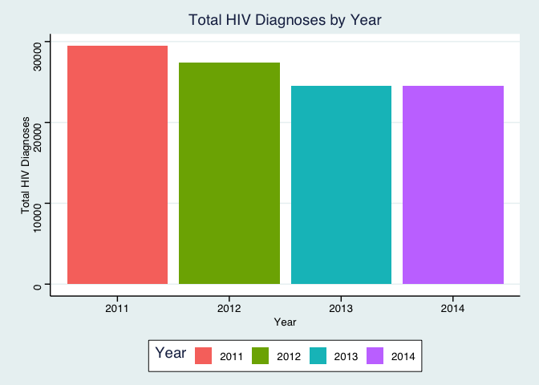
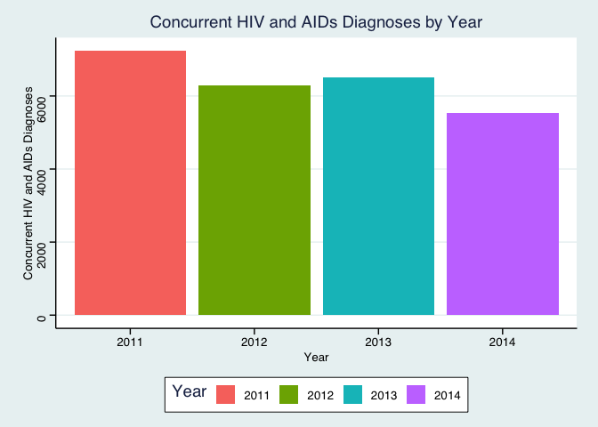
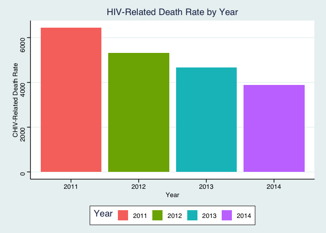
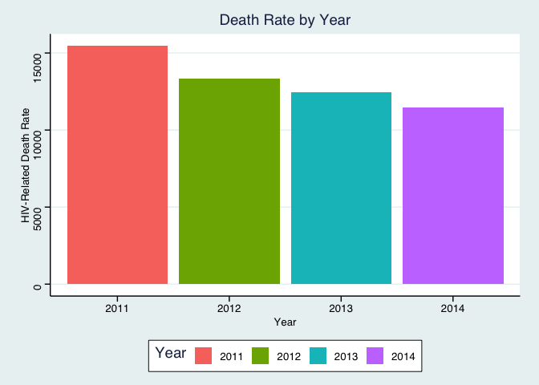
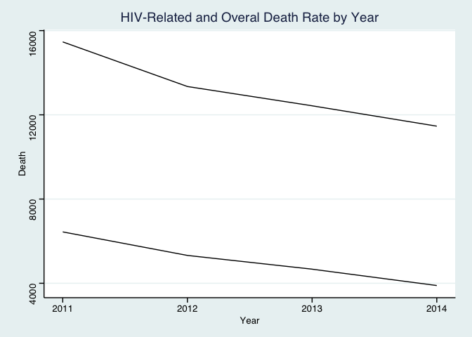
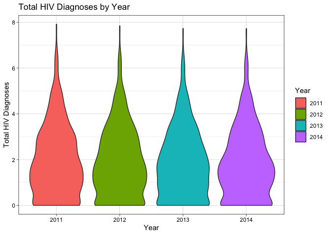

## R Markdown

This is an R Markdown document. Markdown is a simple formatting syntax for authoring HTML, PDF, and MS Word documents. For more details on using R Markdown see <http://rmarkdown.rstudio.com>.

When you click the **Knit** button a document will be generated that includes both content as well as the output of any embedded R code chunks within the document. You can embed an R code chunk like this:


```r
summary(cars)
```

```
##      speed           dist       
##  Min.   : 4.0   Min.   :  2.00  
##  1st Qu.:12.0   1st Qu.: 26.00  
##  Median :15.0   Median : 36.00  
##  Mean   :15.4   Mean   : 42.98  
##  3rd Qu.:19.0   3rd Qu.: 56.00  
##  Max.   :25.0   Max.   :120.00
```

## Including Plots

You can also embed plots, for example:

<!-- -->

```r
getwd()
```

```
## [1] "/Users/maggiebauer/Downloads/Untitled/bis15l_group4"
```

Note that the `echo = FALSE` parameter was added to the code chunk to prevent printing of the R code that generated the plot.

```r
library(ggthemes)
library(tidyverse)
```

```
## ── Attaching packages ─────────────────────────────────────── tidyverse 1.3.1 ──
```

```
## ✓ ggplot2 3.3.5     ✓ purrr   0.3.4
## ✓ tibble  3.1.6     ✓ dplyr   1.0.8
## ✓ tidyr   1.2.0     ✓ stringr 1.4.0
## ✓ readr   2.1.2     ✓ forcats 0.5.1
```

```
## ── Conflicts ────────────────────────────────────────── tidyverse_conflicts() ──
## x dplyr::filter() masks stats::filter()
## x dplyr::lag()    masks stats::lag()
```

```r
library(janitor)
```

```
## 
## Attaching package: 'janitor'
```

```
## The following objects are masked from 'package:stats':
## 
##     chisq.test, fisher.test
```

```r
hiv_data  <- read_csv("dohmh-hiv-aids-annual-report-1.csv")
```

```
## Rows: 6005 Columns: 18
## ── Column specification ────────────────────────────────────────────────────────
## Delimiter: ","
## chr  (5): Borough, UHF, Gender, Age, Race
## dbl (13): Year, HIV diagnoses, HIV diagnosis rate, Concurrent diagnoses, % l...
## 
## ℹ Use `spec()` to retrieve the full column specification for this data.
## ℹ Specify the column types or set `show_col_types = FALSE` to quiet this message.
```

```r
hiv_data
```

```
## # A tibble: 6,005 × 18
##     Year Borough UHF   Gender      Age    Race  `HIV diagnoses` `HIV diagnosis…`
##    <dbl> <chr>   <chr> <chr>       <chr>  <chr>           <dbl>            <dbl>
##  1  2011 All     All   All         All    All              3379             48.3
##  2  2011 All     All   Male        All    All              2595             79.1
##  3  2011 All     All   Female      All    All               733             21.1
##  4  2011 All     All   Transgender All    All                51          99999  
##  5  2011 All     All   Female      13 - … All                47             13.6
##  6  2011 All     All   Female      20 - … All               178             24.7
##  7  2011 All     All   Female      30 - … All               176             26.9
##  8  2011 All     All   Female      40 - … All               195             33  
##  9  2011 All     All   Female      50 - … All               130             23.5
## 10  2011 All     All   Female      60+    All                57              6.7
## # … with 5,995 more rows, and 10 more variables: `Concurrent diagnoses` <dbl>,
## #   `% linked to care within 3 months` <dbl>, `AIDS diagnoses` <dbl>,
## #   `AIDS diagnosis rate` <dbl>, `PLWDHI prevalence` <dbl>,
## #   `% viral suppression` <dbl>, Deaths <dbl>, `Death rate` <dbl>,
## #   `HIV-related death rate` <dbl>, `Non-HIV-related death rate` <dbl>
```


```r
names(hiv_data)
```

```
##  [1] "Year"                             "Borough"                         
##  [3] "UHF"                              "Gender"                          
##  [5] "Age"                              "Race"                            
##  [7] "HIV diagnoses"                    "HIV diagnosis rate"              
##  [9] "Concurrent diagnoses"             "% linked to care within 3 months"
## [11] "AIDS diagnoses"                   "AIDS diagnosis rate"             
## [13] "PLWDHI prevalence"                "% viral suppression"             
## [15] "Deaths"                           "Death rate"                      
## [17] "HIV-related death rate"           "Non-HIV-related death rate"
```


```r
clean_hiv_data <- clean_names(hiv_data)
clean_hiv_data
```

```
## # A tibble: 6,005 × 18
##     year borough uhf   gender      age     race  hiv_diagnoses hiv_diagnosis_ra…
##    <dbl> <chr>   <chr> <chr>       <chr>   <chr>         <dbl>             <dbl>
##  1  2011 All     All   All         All     All            3379              48.3
##  2  2011 All     All   Male        All     All            2595              79.1
##  3  2011 All     All   Female      All     All             733              21.1
##  4  2011 All     All   Transgender All     All              51           99999  
##  5  2011 All     All   Female      13 - 19 All              47              13.6
##  6  2011 All     All   Female      20 - 29 All             178              24.7
##  7  2011 All     All   Female      30 - 39 All             176              26.9
##  8  2011 All     All   Female      40 - 49 All             195              33  
##  9  2011 All     All   Female      50 - 59 All             130              23.5
## 10  2011 All     All   Female      60+     All              57               6.7
## # … with 5,995 more rows, and 10 more variables: concurrent_diagnoses <dbl>,
## #   percent_linked_to_care_within_3_months <dbl>, aids_diagnoses <dbl>,
## #   aids_diagnosis_rate <dbl>, plwdhi_prevalence <dbl>,
## #   percent_viral_suppression <dbl>, deaths <dbl>, death_rate <dbl>,
## #   hiv_related_death_rate <dbl>, non_hiv_related_death_rate <dbl>
```


```r
names(clean_hiv_data)
```

```
##  [1] "year"                                  
##  [2] "borough"                               
##  [3] "uhf"                                   
##  [4] "gender"                                
##  [5] "age"                                   
##  [6] "race"                                  
##  [7] "hiv_diagnoses"                         
##  [8] "hiv_diagnosis_rate"                    
##  [9] "concurrent_diagnoses"                  
## [10] "percent_linked_to_care_within_3_months"
## [11] "aids_diagnoses"                        
## [12] "aids_diagnosis_rate"                   
## [13] "plwdhi_prevalence"                     
## [14] "percent_viral_suppression"             
## [15] "deaths"                                
## [16] "death_rate"                            
## [17] "hiv_related_death_rate"                
## [18] "non_hiv_related_death_rate"
```
# HIV diagnoses included both just HIV diagnoses and those with a concurrent diagnoses of AID- seperated out the two 

```r
clean_hiv_data <- clean_hiv_data %>% 
  filter(hiv_diagnoses != "99999") %>%
  filter(concurrent_diagnoses != "99999") %>% 
   filter(hiv_related_death_rate != "99999") %>% 
 filter(death_rate != "99999") %>%
  mutate(only_hiv_diagnoses=hiv_diagnoses-concurrent_diagnoses)
```


```r
year_clean_hiv_data <- clean_hiv_data %>% 
  group_by(year) %>% 
  mutate(sum_diagnoses=sum(only_hiv_diagnoses))
clean_hiv_data
```

```
## # A tibble: 4,804 × 19
##     year borough uhf   gender      age     race  hiv_diagnoses hiv_diagnosis_ra…
##    <dbl> <chr>   <chr> <chr>       <chr>   <chr>         <dbl>             <dbl>
##  1  2011 All     All   All         All     All            3379              48.3
##  2  2011 All     All   Male        All     All            2595              79.1
##  3  2011 All     All   Female      All     All             733              21.1
##  4  2011 All     All   Transgender All     All              51           99999  
##  5  2011 All     All   Female      13 - 19 All              47              13.6
##  6  2011 All     All   Female      20 - 29 All             178              24.7
##  7  2011 All     All   Female      30 - 39 All             176              26.9
##  8  2011 All     All   Female      40 - 49 All             195              33  
##  9  2011 All     All   Female      50 - 59 All             130              23.5
## 10  2011 All     All   Female      60+     All              57               6.7
## # … with 4,794 more rows, and 11 more variables: concurrent_diagnoses <dbl>,
## #   percent_linked_to_care_within_3_months <dbl>, aids_diagnoses <dbl>,
## #   aids_diagnosis_rate <dbl>, plwdhi_prevalence <dbl>,
## #   percent_viral_suppression <dbl>, deaths <dbl>, death_rate <dbl>,
## #   hiv_related_death_rate <dbl>, non_hiv_related_death_rate <dbl>,
## #   only_hiv_diagnoses <dbl>
```

```r
clean_hiv_data %>% 
  summarize(mean_hiv_diagnoses=mean(hiv_diagnoses),
            min_hiv_diagnoses=min(hiv_diagnoses),
            max_hiv_diagnoses=max(hiv_diagnoses))
```

```
## # A tibble: 1 × 3
##   mean_hiv_diagnoses min_hiv_diagnoses max_hiv_diagnoses
##                <dbl>             <dbl>             <dbl>
## 1               27.3                 0              3379
```


```r
clean_hiv_data %>%  
  group_by(year) %>% 
  filter(concurrent_diagnoses != "99999") %>%
  summarize(sum_diagnoses=sum(only_hiv_diagnoses)) %>% 
  ggplot(aes(x=as.factor(year), y=sum_diagnoses, fill=as.factor(year)))+geom_col()+theme_stata()+
  labs(title="Total HIV Diagnoses by Year",
       x="Year",
       y="Total HIV Diagnoses",
       fill="Year")
```

<!-- -->

```r
clean_hiv_data %>% 
  summarize(mean_concurrent_diagnosess=mean(concurrent_diagnoses),
            min_concurrent_diagnoses=min(concurrent_diagnoses),
            max_concurrent_diagnoses=max(concurrent_diagnoses))
```

```
## # A tibble: 1 × 3
##   mean_concurrent_diagnosess min_concurrent_diagnoses max_concurrent_diagnoses
##                        <dbl>                    <dbl>                    <dbl>
## 1                       5.32                        0                      640
```


```r
clean_hiv_data %>%  
  group_by(year) %>% 
  filter(concurrent_diagnoses != "99999") %>% 
 summarize(sum_diagnoses=sum(concurrent_diagnoses)) %>%
  ggplot(aes(x=as.factor(year), y=sum_diagnoses, fill=as.factor(year)))+geom_col()+theme_stata()+
  labs(title="Concurrent HIV and AIDs Diagnoses by Year",
       x="Year",
       y="Concurrent HIV and AIDs Diagnoses",
       fill="Year")
```

<!-- -->

```r
clean_hiv_data %>% 
  summarize(mean_hiv_related_death_rate=mean(hiv_related_death_rate),
            min_hiv_related_death_rate=min(hiv_related_death_rate),
            max_hiv_related_death_rate=max(hiv_related_death_rate))
```

```
## # A tibble: 1 × 3
##   mean_hiv_related_death_rate min_hiv_related_death_rate max_hiv_related_death_…
##                         <dbl>                      <dbl>                   <dbl>
## 1                        4.23                          0                    172.
```


```r
clean_hiv_data %>%  
  group_by(year) %>% 
 filter(hiv_related_death_rate != "99999") %>% 
 summarize(sum_death_rate=sum(hiv_related_death_rate)) %>%
  ggplot(aes(x=as.factor(year), y=sum_death_rate, fill=as.factor(year)))+geom_col()+theme_stata()+
  labs(title="HIV-Related Death Rate by Year",
       x="Year",
       y="CHIV-Related Death Rate",
       fill="Year")
```

<!-- -->

```r
clean_hiv_data %>% 
  summarize(mean_death_rate=mean(death_rate),
            min_death_rate=min(death_rate),
            max_death_rate=max(death_rate))
```

```
## # A tibble: 1 × 3
##   mean_death_rate min_death_rate max_death_rate
##             <dbl>          <dbl>          <dbl>
## 1            11.0              0           263.
```


```r
clean_hiv_data %>%  
  group_by(year) %>% 
 filter(death_rate != "99999") %>% 
 summarize(other_sum_death_rate=sum(death_rate)) %>%
  ggplot(aes(x=as.factor(year), y=other_sum_death_rate, fill=as.factor(year)))+geom_col()+theme_stata()+
  labs(title="Death Rate by Year",
       x="Year",
       y="HIV-Related Death Rate",
       fill="Year")
```

<!-- -->

```r
death_hiv_data   <- clean_hiv_data %>%  
  group_by(year) %>% 
  summarize(sum_death_rate=sum(hiv_related_death_rate), 
           other_sum_death_rate=sum(death_rate))
```


```r
death_hiv_data %>% 
 ggplot() + geom_line(data=death_hiv_data, aes(x=year, y=sum_death_rate, fill=year))+ geom_line(data=death_hiv_data, aes(x=year, y=other_sum_death_rate, fill=year))+theme_stata()+
  labs(title="HIV-Related and Overal Death Rate by Year",
       x="Year",
       y="Death",
       fill="Year")
```

```
## Warning: Ignoring unknown aesthetics: fill
## Ignoring unknown aesthetics: fill
```

<!-- -->


```r
clean_hiv_data %>%  
  group_by(year) %>% 
  ggplot(aes(x=as.factor(year), y=log(only_hiv_diagnoses), fill=as.factor(year)))+geom_violin()+theme_linedraw()+
  labs(title="Total HIV Diagnoses by Year",
       x="Year",
       y="Total HIV Diagnoses",
       fill="Year")
```

```
## Warning: Removed 1365 rows containing non-finite values (stat_ydensity).
```

<!-- -->

```r
getwd()
```

```
## [1] "/Users/maggiebauer/Downloads/Untitled/bis15l_group4"
```

